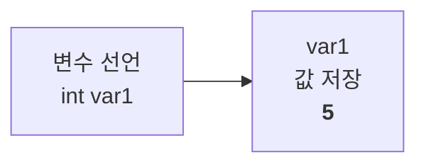
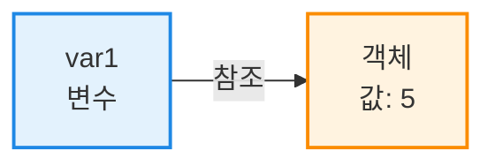
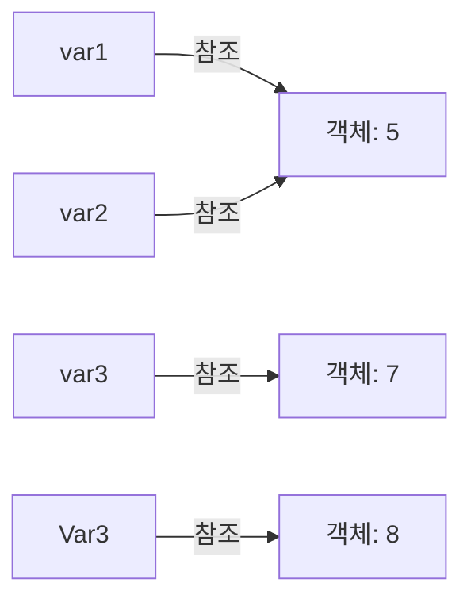
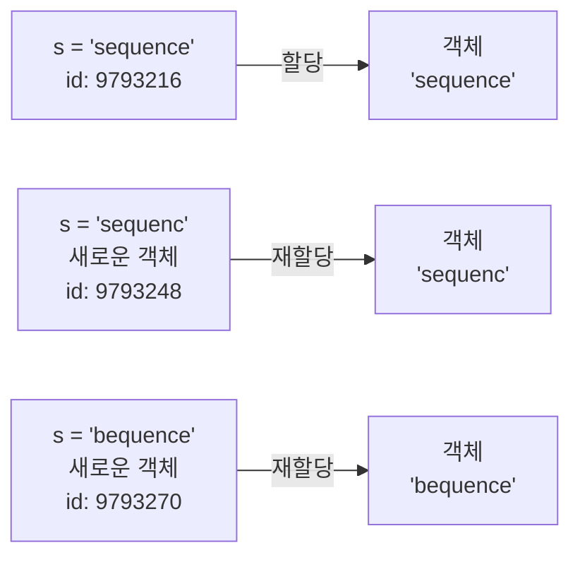
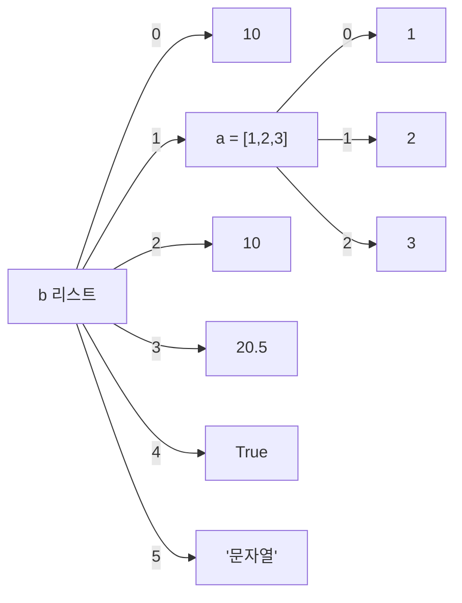
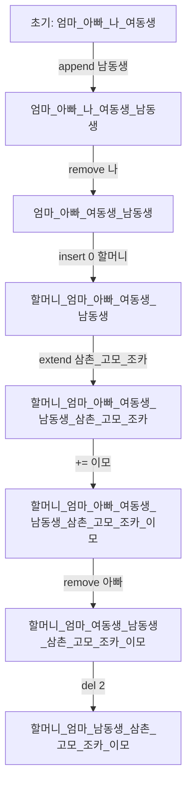

# 📅 2026-01-30

---

## 1. 폴더와 패키지
- **폴더**: 일반 파일을 보관하는 공간  
- **패키지**: 파이썬에서 프로그램이 인식 가능한 폴더 (모듈들을 포함)

---

## 2. 변수

### 2-1. Java 기본형 vs Python 참조형

| 구분   | Java (기본형)  | Python (참조형)                  |
| ---- | ----------- | ----------------------------- |
| 선언   | `int var1;` | `var1 = 5`                    |
| 값 대입 | `var1 = 5;` | `var1 = 5  # 값 5가 저장된 주소를 참조` |
| 특징   | 변수 자체가 값 저장 | 변수는 값이 저장된 **주소**를 참조         |
| 메모리  | 스택에 값 저장    | 값이 저장된 객체를 가리키는 **참조**        |

#### Java 예시

```java
int var1;
var1 = 5;
```



#### Python 예시

```python
var1 = 5  # 값 5가 저장된 객체의 주소를 참조
```




---

### 2-2. 변수 사용 예제

```python
var1 = "안녕 파이썬"
print(var1)  # 안녕 파이썬

"""
여러 줄 주석
"""
var1 = 5
print(var1)  # 5

var2 = var1
print(var1, var2)  # 5 5

var3 = 7
print(var1, var2, var3)       # 5 5 7
print(id(var1), id(var2), id(var3))  # 메모리 주소 예시 출력: 9793216 9793216 9793248

Var3 = 8
print(var3, Var3)  # var3=7, Var3=8
```



---

## 3. 값과 주소 비교

```python
# 값과 주소 비교 예제
a = 5
b = a
c = 5
print(a, b, c)            # 5 5 5
print(a is b, a == b)     # True True  -> is: 주소 비교, ==: 값 비교
print(b is c, b == c)     # True True

aa = [5]
bb = [5]
print(aa, bb)             # [5] [5]
print(aa is bb, aa == bb) # False True -> 리스트는 서로 다른 객체
```


- **is** : 객체 **주소** 비교
    
- == : 값 비교

---
## 4. 예약어 확인
```python
import keyword
print('예약어 목록:', keyword.kwlist)
```
---

## 5. 자료형 확인

```python
kbs = 9
print(isinstance(kbs, int))   # True
print(isinstance(kbs, float)) # False

print(5, type(5))           # <class 'int'>
print(5.3, type(5.3))       # <class 'float'>
print(3+4j, type(3+4j))     # <class 'complex'>
print(True, type(True))     # <class 'bool'>
print('good', type('good')) # <class 'str'>
print((1,), type((1,)))     # <class 'tuple'>
print({1}, type({1}))       # <class 'set'>
print([1], type([1]))       # <class 'list'>
print({'k':1}, type({'k':1})) # <class 'dict'>

```

---

## 6. 연산자

### 6-1. 값 할당 (치환 연산자)
```python
v1 = 3  # 단일 치환 연산자
v1 = v2 = v3 = 5
print(v1, v2, v3)

print('출력1', end=' ')  # 줄바꿈 없이 출력
print('출력2')
print('출력3')
```

**출력 결과**
```
5 5 5
출력1 출력2
출력3
```

### 예시 2
```python
print('출력1', end=',')
print('출력2', end=',')
print('출력3')
```
**출력**
```
출력1,출력2,출력3
```

---

### 6-2. 변수 교환과 packing/unpacking

```python
# 변수 교환
v1, v2 = 10, 20
print(v1, v2)
v2, v1 = v1, v2
print(v1, v2)

# 값 할당과 packing
print('값 할당 packing 연산')
v1 = 1,2,3,4,5       # 튜플로 저장
v1 = [1,2,3,4,5]     # 리스트로 저장

# 리스트 unpacking
*v1, v2 = [1,2,3,4,5]
print(v1, ' ', v2)     # 출력: [1, 2, 3, 4]   5

# v1, v2* = [1,2,3,4,5]  # SyntaxError: invalid syntax

*v1, v2, v3 = [1,2,3,4,5]
print(v1, ' ', v2, ' ', v3)  # 출력: [1, 2, 3, 4]   5
```

- `*`변수 → 나머지 값을 **리스트로 묶어서 변수에 저장
- `*`는 **항상 변수 이름 앞**에만 가능 (`v2*`처럼 뒤에 붙이면 오류 발생)

---

### 6-3. 문자열 포맷팅
```python
# format() 함수
print(format(1.5678, '10.3f'))

# % formatting
print('나는 나이가 %d 이다.' %23)
print('나는 나이가 %s 이다.' %'스물셋')
print('나는 나이가 %d 이고 이름은 %s이다.' %(23, '홍길동'))
print('나는 나이가 %s 이고 이름은 %s이다.' %(23, '홍길동'))
print('나는 키가 %f이고, 에너지가 %d%%.' %(177.7, 100))

# str.format()
print('이름은 {0}, 나이는 {1}'.format('한국인', 33))
print('이름은 {}, 나이는 {}'.format('신선해', 33))
print('이름은 {1}, 나이는 {0}'.format(34, '강나루'))

# f-string
abc = 123
print(f"abc의 값은 {abc}임")
```

**출력결과**
```
     1.568
     
나는 나이가 23 이다.
나는 나이가 스물셋 이다.
나는 나이가 23 이고 이름은 홍길동이다.
나는 나이가 23 이고 이름은 홍길동이다.
나는 키가 177.700000이고, 에너지가 100%.

이름은 한국인, 나이는 33
이름은 신선해, 나이는 33
이름은 강나루, 나이는 34

abc의 값은 123임
```

- `format()` : 숫자 포맷팅, 폭(width)와 소수점 자리 지정 가능
- `%` formatting : C 스타일 포맷, `%d`=정수, `%s`=문자열, `%f`=실수
- `str.format()` : `{}`를 이용한 포맷, 인덱스나 이름 사용 가능
- `f-string` : 변수 값을 `{}` 안에 직접 넣어서 문자열 생성, 최신 파이썬 권장

---

### 6-4. 산술 연산자
```python
print('본격적 연산 ---------')  # \n, \b, \t ...

# 기본 연산
print(5 + 3, 5 - 3, 5 * 3, 5 / 3, 5 // 3, 5 % 3, 3 ** 3)
# 8     2      15     1.6666666666666667   1      2    27

# divmod() 함수
print(divmod(5, 3), ' ', 5 % 3)

# 연산 우선순위
result = 3 + 4 * 5 + (2 + 3) / 2
print(result)  # () -> ** -> 단항 -> 산술(*,/ -> +,-) -> 관계 -> 논리(not -> and -> or) -> =
```

- `/` → 나눈 **결과 전체**를 실수로 반환
- `//` → 나눈 **몫만** 가져옴 (버림 연산)
- `divmod(a,b)` : 몫과 나머지를 한 번에 반환

---

### 6-5. 관계, 논리, 누적, 타입, 문자열 연산

```python
# 1) 관계 연산
print(5 > 3, 5 == 3, 5 != 3)
# 출력: True False True

# 2) 논리 연산
print(5 > 3 and 4 < 3, 5 > 3 or 4 < 3, not(5 >= 3))
# 출력: False True False
print(True or False and False)
# 출력: True
print(True and False or False)
# 출력: False

# 3) 산술 및 문자열 연산
print(4 + 5)         # 산술연산: 9
print('4' + "5")     # 문자열 연결: 45
print('한' + '국' + "만세")  # 문자열 연결: 한국만세
print("한국" * 5)    # 문자열 반복: 한국한국한국한국한국

# 4) 누적 연산
print('누적')
a = 10
a = a + 1
a += 1  # 누적 대입 연산: -=, *=, /= 가능
print(f"a는 {a}")  # a는 12

# 증감 연산자 없음: ++, -- ❌
# print(a++)
# print(--a)

print(-a)        # -12
print(a * -1)    # -12

# 5) 타입 변환
# print(('1' + '1') + 1)        # TypeError
# print((1 + 1) + '1')          # TypeError
print(int('1') + int('1') + 1)  # 3
print(int('1' + '1') + 1)       # 12  ('11' -> 11 + 1)
print(float('1' + '1') + 1)     # 12.0
print(str(1 + 1) + '1')         # 21

# 6) boolean 처리
print('boolean 처리 : ', bool(True), bool(False))           # True False
print(bool(1), bool(12.3), bool('ok'), bool([12]))         # True True True True
print(bool(0), bool(0.0), bool(''), bool([]), bool(None))  # False False False False False

# 7) 문자열 r선행문자(raw string)
print('aa\tbb')  # aa    bb (탭)
print('aa\nbb')  # aa(줄바꿈)bb
print(r'aa\tbb') # aa\tbb
print(r'aa\nbb') # aa\nbb
```

## 연산자 요약 설명

- **관계 연산**: `>`, `<`, \==, `!=` → `True`/`False`
- **논리 연산**: `and`, `or`, `not` → `True`/`False`
- **산술/문자열 연산**: 숫자는 계산, 문자열은 연결(`+`) / 반복(`*`) 가능
- **누적 연산**: `+=`, `-=`, `*=`, `/=`
- **타입 변환**: `int()`, `float()`, `str()`
- **Boolean 평가**: `0`, `''`, `[]`, `None` → `False` / 그 외 → `True`
- **raw string**: `r'...'` → 이스케이프 문자를 무시하고 그대로 출력

---

# 7. 자료형

파이썬 자료형은 크게 **기본 자료형**과 **묶음 자료형**으로 나눌 수 있음.

- **기본 자료형**: `int`, `float`, `bool`, `complex`  
- **묶음 자료형**: `str`, `list`, `tuple`, `set`, `dict`

---

## 7-1. 문자열 (str)

```python
s = 'sequence'
print(s)                # sequence
print('길이 :', len(s)) # 길이 : 8
print(s[0], s[2])       # s[0]=s, s[2]=q
print(s.find('e'), s.find('e', 3), s.rfind('e')) # 1 6 7


```


- `find()` → 왼쪽부터 검색, 없으면 `-1` 반환
- `find(문자, 시작위치)` : 시작 위치 이후에서 검색
- `rfind()` → 오른쪽부터 검색


```python
# 인덱싱 / 슬라이싱

# 1) 인덱싱 → 글자 하나 접근
print(s[5])             # n

# 2) 슬라이싱 → 연속된 문자열 구간
print(s[2:5])           # que , [이상:미만]

# 3) 전체 문자열 접근
print(s[:], s[0:len(s)], s[::1])  # sequence sequence sequence
# s[:]       → 전체 문자열
# s[0:len(s)] → 전체 문자열
# s[::1]    → step=1로 전체 문자열

# 4) step 지정 가능
print(s[0:7:2])         # sqe

# 5) 음수 인덱스 사용
print(s[-1], s[-4:-1:1]) # e enc

```

- 문자열은 **순서 있음(O), 수정 불가(X)**
- 슬라이싱 `[start:end:step]` 가능
- `start` → 포함
- `end` → 미만 (포함되지 않음)
- `step` → 건너뛰는 간격 (생략 시 1)
- 음수 인덱스 → 뒤에서부터 셈 (`-1` = 마지막 문자)

```python
print(s, id(s))
s = 'sequenc'  # 새로운 문자열 할당, 9793248
print(s, id(s))
s = 'bequence' 
print(s, id(s)) # 9793270
```



- 문자열을 바꾸면 **기존 객체는 변하지 않고 새로운 객체가 생성**

---
## 7-2. 리스트 (list)

```python
a = [1,2,3]
print(a, a[0], a[0:2])        # [1,2,3] 1 [1,2]

b = [10, a, 10, 20.5, True, '문자열']
print(b, b[1], b[1][0])       # [10,[1,2,3],10,20.5,True,'문자열'] [1,2,3] 1
```



### 리스트 수정, 추가, 삭제
```python
family = ['엄마','아빠','나','여동생']
family.append('남동생')          # 추가
family.remove('나')             # 삭제
family.insert(0,'할머니')       # 삽입
family.extend(['삼촌','고모','조카'])
family += ['이모']              # 추가
print(family)

print(family.index('아빠'))     # 위치 찾기
print('엄마' in family, '나' in family) # True False

# 값 삭제
family.remove('아빠')
# 위치 삭제
del family[2]
print(family)
```



- 리스트는 **항상 연속된 인덱스를 유지**
- `remove()` → 값 삭제, 뒤 요소가 앞으로 당겨짐
- `del` → 위치(인덱스) 삭제, 뒤 요소가 앞으로 당겨짐


**정렬예제**
```python
kbs = ['123', '34', '234']
kbs.sort()   # 문자열 정렬
print(kbs)   # ['123','234','34']

mbc = [123,34,234]
mbc.sort(reverse=True)  # 내림차순
print(mbc)  # [234,123,34]

sbs = [123,34,234]
ytn = sorted(sbs)       # 새로운 리스트 반환
print(sbs)  # [123,34,234]
print(ytn)  # [34,123,234]
```

- `sort()` → **원본 변경**, 리스트 자체를 정렬
- `sorted()` → **원본 그대로**, 새로운 리스트 반환

**얕은/깊은 복사**
```python
name = ['tom','james','oscar']
name2 = name
import copy
name3 = copy.deepcopy(name)

name[0] = '길동'
print(name)   # ['길동','james','oscar']
print(name2)  # ['길동','james','oscar'] -> 얕은 복사
print(name3)  # ['tom','james','oscar'] -> 깊은 복사
```

- `=` → 얕은 복사(**원본 변경 시 같이 변경**)
- `copy.deepcopy()` → 완전 복사(원본 변경 시 영향을 받지 않음)

---
## 7-3. 튜플 (tuple)

```python
t = (1,2,3,4)
print(t, type(t))   # (1,2,3,4) <class 'tuple'>
k = (1,)
print(k, type(k))   # (1,) <class 'tuple'>

print(t[0], t[0:2]) # 1 (1,2)
# t[0] = 77  # 수정 불가 -> TypeError

# 리스트로 변환 후 수정 가능
imsi = list(t)
imsi[0] = 77
t = tuple(imsi)
print(t)  # (77,2,3,4)
```
- 읽기 전용, 수정 불가
- 단일 요소는 반드시 `(값,)` 형태

---
## 7-4. 집합 (set)
```python
ss = {1,2,1,3}       # 중복 제거
print(ss)             # {1,2,3}

ss2 = {3,4}
print(ss.union(ss2))        # 합집합 {1,2,3,4}
print(ss.intersection(ss2)) # 교집합 {3}
print(ss - ss2, ss | ss2, ss & ss2) # 차집합, 합집합, 교집합

ss.update({6,7}) # 값 추가
ss.discard(7)   # 값 삭제, 없으면 통과
ss.remove(6)    # 값 삭제, 없으면 오류
print(ss)
```
- 순서 X, 중복 X, 수정 O
- 인덱싱 불가 (`ss[0]` X)


```python
li = ['aa','aa','bb','cc','aa']
imsi = set(li)  # 중복 제거
li = list(imsi)
print(li)  # ['aa','bb','cc']
```
리스트 → set → list 변환으로 **중복 제거 가능**

---
## 7-5. 사전 (dict)
```python
# 방법1
mydic = dict(k1=1, k2='ok', k3=123.4)
print(mydic, type(mydic))  # {'k1': 1, 'k2': 'ok', 'k3': 123.4} <class 'dict'>

# 방법2
dic = {'파이썬':'뱀', '자바':'커피', '인사':'안녕'}
print(dic)             # {'파이썬':'뱀', '자바':'커피', '인사':'안녕'}
print(len(dic))        # 3
print(dic['자바'])     # 커피

# 값 가져오기
ff = dic.get('자바')
print(ff)              # 커피

# 값 추가 / 삭제
dic['금요일'] = '와우'
print(dic)             # {'파이썬':'뱀', '자바':'커피', '인사':'안녕', '금요일':'와우'}

del dic['인사']
print(dic)             # {'파이썬':'뱀', '자바':'커피', '금요일':'와우'}

# 키/값만 확인
print(dic.keys())      # dict_keys(['파이썬', '자바', '금요일'])
print(dic.values())    # dict_values(['뱀', '커피', '와우'])
```
- `{키:값}` 형태
- 순서 있음(O, 파이썬 3.7+), 수정 가능(O), 중복 키는 마지막 값 적용

---
## 8. 정규표현식 (Regular Expression, `re` 모듈)

```python
import re  # 정규표현식 모듈 로딩

ss = "1234 abc가나다abcABC_123555집에가나요_6'Python is fun'"
print(ss)
```

**출력**
```
1234 abc가나다abcABC_123555집에가나요_6'Python is fun'
```

---
### 8-1. 기본 검색
```python
print(re.findall(r'123', ss))   # ['123', '123']  → '123' 문자열 검색
print(re.findall(r'가나', ss))   # ['가나', '가나'] → '가나' 문자열 검색
```
- `r'패턴'` : **raw string** 사용 권장 (`\` 이스케이프 문제 방지)
- `re.findall(pattern, string)` : **모든 매치 결과를 리스트로 반환**
---

### 8-2. 숫자 검색
```python
print(re.findall(r'[0-9]', ss))       # ['1','2','3','4','1','2','3','5','5','5','6'] → 한 글자씩
print(re.findall(r'[0-9]+', ss))      # ['1234','123555','6'] → 연속된 숫자 묶음
print(re.findall(r'[0-9]{2}', ss))    # ['12','34','12','35','55'] → 두 자리 숫자
print(re.findall(r'[0-9]{2,3}', ss))  # ['123','4','123','555'] → 2~3 자리 숫자
print(re.findall(r'\d+', ss))         # ['1234','123555','6'] → \d = [0-9]
```
- `[0-9]` : 숫자 한 글자
- `[0-9]+` : 한 글자 이상 연속 숫자
- `{n}`, `{n,m}` : n자리, n~m자리 반복
- `\d` : 숫자 0-9 (같은 의미)

---

### 8-3. 문자 검색
```python
print(re.findall(r'[a-zA-Z]+', ss))  # ['abc', 'abcABC', 'Python', 'is', 'fun']
print(re.findall(r'[가-힣]+', ss))    # ['가나다', '집', '가나요']
print(re.findall(r'\D+', ss))        # [' ', ' abc가나다abcABC_', '_', "'Python is fun'"] → 숫자 아닌 문자
```
- `[a-zA-Z]` : 알파벳 문자
- `[가-힣]` : 한글 문자
- `\D` : 숫자가 아닌 문자 (반대: `\d`)

---

### 8-4. 요약
| 패턴             | 의미              |
| -------------- | --------------- |
| `[0-9]`        | 숫자 한 글자         |
| `[0-9]+`       | 숫자 연속           |
| `[a-zA-Z]+`    | 영어 연속           |
| `[가-힣]+`       | 한글 연속           |
| `{n}`          | n번 반복           |
| `{n,m}`        | n~m번 반복         |
| `\d`           | 숫자 [0-9]        |
| `\D`           | 숫자가 아닌 문자       |
| `re.findall()` | 모든 매치 결과 리스트 반환 |

---
## 9. 조건 판단문 (if)

### 9-1. 기본 if / else 구조

```python
var = 1

if var >= 3:
    print('크네')
    print('흠 느낌')

if var >= 3:
    print('크구나')
else:
    print('작구나')
```

**출력**
```
작구나
```
- 조건이 참(`True`)일 때만 if 블록 실행
- 조건이 거짓(`False`)이면 else 블록 실행

---
### 9-2. 중첩 if
```python
money = 1000
age = 35
if money >= 500:
    item = '사과'
    if age <= 30:
        msg = "참 참"
    else:
        msg = "참 거짓"
else:
    item = '한라봉'
    if age >= 20:
        msg = "거짓 참"
    else:
        msg = "거짓 거짓"

print(f'중복 if 수행후 결과 {item} {msg}')
```

**출력**
```
중복 if 수행후 결과 사과 참 거짓
```
- if 블록 안에 또 다른 if 가능 → **중첩 if**
- else는 항상 가장 가까운 if와 매칭

---
### 9-3. if / elif / else
```python
jumsu = 77

if jumsu >= 90:
    print('우수')
elif jumsu >= 80:
    print('보통')
else:
    print('저조')
```
**출력**
```
저조
```
- `elif` : else if의 약자, 여러 조건 순차 검사
- 조건 중 하나만 실행, 나머지는 무시

```python
jum = 80
if 90 <= jum <= 100:
    print("A")
elif 70 <= jum < 90:
    print("B")
else:
    print("C")
```

**출력**
```
B
```
- 파이썬은 **범위 조건 표현식** 가능: `70 <= jum < 90`

---
### 9-4. in / := 대입 표현식
```python
names = ['홍길동', '신선해', '이기자']

if '홍길동' in names:
    print('친구 이름이야')
else:
    print("누구야?")

if (count := len(names)) >= 3:  # := 대입 표현식 (walrus operator)
    print(f"인원수가 {count}명이므로 단체할인 적용")
else:
    print("안타깝다")
```

**출력**
```
친구 이름이야
인원수가 3명이므로 단체할인 적용
```
- `in` : 리스트, 문자열 등에서 포함 여부 확인
- `:=` : 조건문 안에서 변수에 값 **동시 할당 가능** (Python 3.8+)
---
### 9-5. 평균 계산 후 조건
```python
scores = [95, 88, 76, 92, 81]
if (avg := sum(scores) / len(scores)) >= 80:
    print(f"우수반 : 평균점수 {avg}")
```
**출력**
```
우수반 : 평균점수 86.4
```
- 조건문 안에서 계산 결과를 변수에 저장하고 사용 가능

---
### 9-6. 삼항 연산자 (if-else 한 줄)
```python
a = 'kbs'
b = 9 if a == 'kbs' else 11
print('b : ', b)

a = 11
b = 'mbc' if a == 9 else 'kbs'
print('b : ', b)
```
**출력**
```
b : 9
b : kbs
```
- `변수 = 값1 if 조건 else 값2`
- 조건 참 → 값1,  거짓 → 값2

```python
a = 3
if a < 5:
    print(0)
elif a < 10:
    print(1)
else:
    print(2)

# 삼항 연산자 중첩
print(0 if a < 5 else 1 if a < 10 else 2)
```

**출력**
```
0
0
```
-  삼항 연산자는 **중첩 가능**, 한 줄로 조건 분기 가능

---
### 9-7. 요약

- **elif** : 여러 조건 분기
- **중첩 if** : if 안에 if 가능
- **in** : 포함 여부 확인
- **:= (walrus operator)** : 조건문 안에서 값 할당
- **삼항 연산자** : 한 줄 조건 분기 가능


