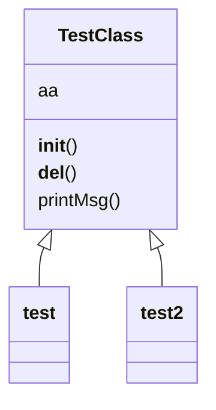
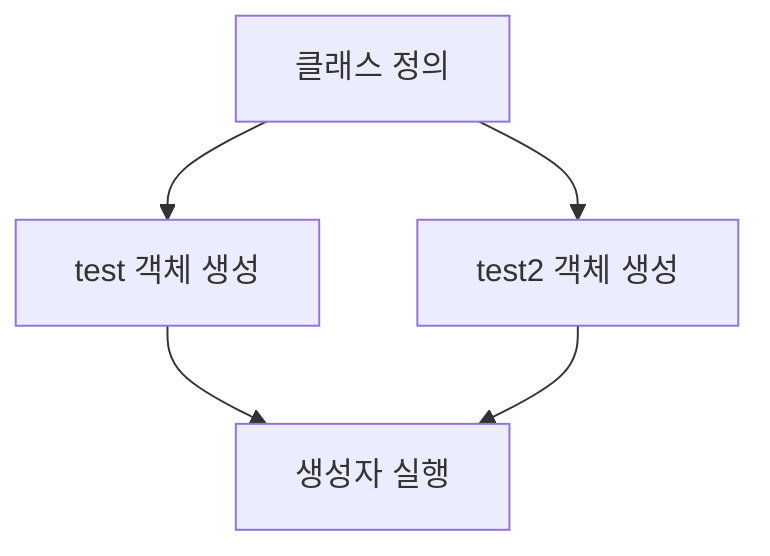
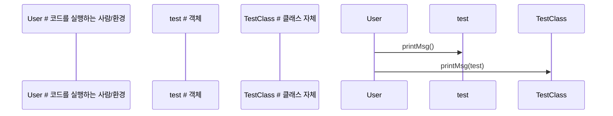
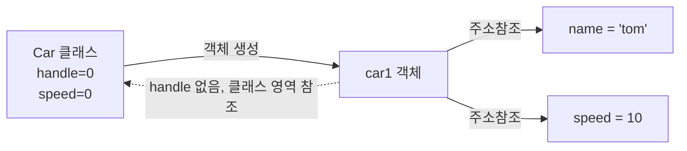

# Day 06_재귀함수 & 모듈 기초

# 📅 2026-02-04

---
## 1️. 기본 코딩 규칙 (습관)

### ✅ 상수는 대문자로만

- 변하지 않는 값은 **대문자 + 스네이크 케이스**
    

```python
PI = 3.14159 MAX_COUNT = 100
```

👉 이유

- 변수랑 바로 구분됨
    
- “아 이건 건들면 안 되는 값이구나” 한눈에 알 수 있음
    

---

### ✅ 년도만 필요하면 "현재 시간"에서 꺼내라

하드코딩 ❌

```python
year = 2026  # ❌
```

정석 ✅

```python
from datetime import datetime

current_year = datetime.now().year
print(current_year)
```

👉 실무에서 **시간/날짜 하드코딩 = 지뢰**

---

### ✅ unit 단위로 프로그램 작성

- 함수는 **하나의 역할만**
    
- 성격이 바뀌면 → **함수 분리**
    

❌ 나쁜 예

```python
def process():
    입력받고
    계산하고
    출력하고
    파일저장까지
```

✅ 좋은 예

```python
def get_input():
    pass

def calculate():
    pass

def save_result():
    pass
```

👉 ML 파이프라인, 서비스 코드에서 이 습관 없으면 바로 망함

---

### ✅ CSV = Comma Separated Values

- 콤마(,)로 구분된 값들

```csv
name,age,score
kim,20,90
lee,22,85
```

👉 pandas에서 자주 씀

```python
import pandas as pd
df = pd.read_csv('data.csv')
```

---

## 2️. 재귀함수 (Recursive Function)

### 🔹 개념

> 함수가 **자기 자신을 다시 호출**  
> 반드시 **종료 조건(base case)** 이 있어야 함

---

### 🔹 호출 흐름 (이해 핵심)

```
tot(5)
→ 5 + tot(4)
→ 4 + tot(3)
→ 3 + tot(2)
→ 2 + tot(1)
→ 1 + tot(0)  ← 탈출
```

- **호출은 내려가고**
- **계산은 올라오면서** 실행됨

---

## 2-1. 예제 ① 카운트다운

```python
def countDown(n):
    if n == 0:
        print('완료')
    else:
        print(n, end=' ')
        countDown(n - 1)  # 재귀 호출

countDown(5)
print('end')
```

### 실행 흐름

```
5 4 3 2 1 완료
end
```

👉 포인트

- `n == 0` → **탈출 조건**
- 없으면 무한 호출 → 프로그램 터짐 💥

---

## 2-2. 예제 ② 1부터 n까지 합

### ⚠️ 네 코드에서 중요한 포인트

```python
def totFunc(n):
    if n == 0:
        print('탈출')
        return 1   # ❌ 논리적으로 틀림
```

👉 **합을 구할 때 0의 합은 0** 이어야 함

---

### ✅ 수정된 정석 코드

```python
def totFunc(n):
    if n == 0:
        return 0
    return n + totFunc(n - 1)

result = totFunc(5)
print('result :', result)
print('end')
```

### 실행 결과

```
result : 15
end
```

---
## 3. 모듈(Module) 개념

- **모듈** : 소스 코드의 재사용을 가능하게 하는 단위
    
- 하나의 `.py` 파일 = 하나의 모듈
    
- 모듈은 **이름 공간(namespace)** 을 제공
    

```
.py   → 파이썬 모듈 (텍스트 기반 소스 코드)
.pyd, .dll → C 기반 라이브러리 (바이너리 모듈)
```

```bash
# 패키지 내부의 모듈을 실행할 때 사용하는 방식
# (현재 디렉터리를 기준으로 pack1/ex15module.py 실행)
python -m pack1.ex15module
```

---

### 3-1. 모듈 종류

1. **표준 모듈**
    
    - 파이썬 설치 시 기본 제공
        
    - 별도 설치 없이 바로 사용 가능
        
    - `sys`, `math`, `random`, `calendar` 등
        
2. **사용자 정의 모듈**
    
    - 개발자가 직접 만든 `.py` 파일
        
    - 프로젝트 내에서 재사용 목적
        
3. **서드파티 모듈 (third-party)**
    
    - 외부 개발자가 만든 라이브러리
        
    - `pip`, `conda`로 설치
        
    - numpy, pandas, torch 등
        

---

### 3-2. 모듈 확인 (**module**)

```python
# print 함수가 어느 모듈에 정의되어 있는지 확인
print(print.__module__)
```

**출력**

```
builtins
```

- `print`는 파이썬 내장 함수
- `builtins` 모듈에 포함됨

---

## 4. import 기본 사용법

### 4-1. 모듈 전체 import

```python
import random              # random 모듈 전체를 메모리에 로드

print(random.random())     # 0.0 이상 1.0 미만 실수 반환
print(random.randrange(1, 10))  # 1 이상 10 미만 정수 반환
```

- `random` : 모듈 이름
- `random.random()` : 모듈 내부 함수 접근 방식

---

### 4-2. 멤버만 import

```python
from random import random, choice, randrange  # 필요한 함수만 가져오기

print(random())             # random() 함수 직접 호출 가능
print(randrange(1, 10))     # 범위 내 정수 반환
```

```
import random
        ↑ 모듈

from random import random
        ↑ 모듈      ↑ 멤버(함수)
```

- 모듈 이름 생략 가능
- 코드 길이 ↓, 가독성 ↑

---

### 4-3. 전체 멤버 import (비추천)

```python
from random import *    # random 모듈의 모든 멤버를 현재 네임스페이스로 가져옴

print(random())         # 어디서 온 random인지 추적 어려움
```

- 이름 충돌 위험 매우 큼
- 실무에서는 사용 ❌

---

## 5. sys 모듈

```python
import sys

print(sys.path)   # 파이썬이 모듈을 찾는 경로 목록 출력
```

- `sys.path` : import 시 탐색하는 디렉터리 목록
- 사용자 모듈 인식 문제 해결 시 중요

---

### 5-1. 프로그램 강제 종료

```python
import sys

a = 5

if a > 7:
    sys.exit()   # 조건 만족 시 프로그램 즉시 종료

print('프로그램 종료 안 됨')  # 종료되지 않았을 때만 실행
```

- `sys.exit()` 호출 시 이후 코드 실행 ❌

---

## 6. math 모듈

```python
import math

print(math.pi)          # 원주율
print(math.sqrt(16))    # 제곱근 계산
print(math.pow(2, 3))   # 거듭제곱 (2의 3승)
```

- 수학 연산 전용 표준 모듈
- 통계, 머신러닝 계산에서 자주 사용

---

## 7. calendar 모듈

```python
import calendar

calendar.setfirstweekday(6)  # 한 주의 시작을 일요일로 설정
calendar.prmonth(2026, 2)    # 2026년 2월 달력 출력

# calendar 객체 참조 제거
del calendar
```

- `del` : 변수 참조 제거 (파일 삭제 아님)

---

## 8. random 모듈 실습

```python
import random

print(random.random())         # 0.0 ~ 1.0 실수
print(random.randint(1, 10))  # 1 ~ 10 정수 (양 끝 포함)
print(random.choice(['a','b','c']))  # 리스트 중 임의 선택
```

- 난수 생성
- 데이터 섞기, 샘플링에 필수

---

## 9. 호출 + 계산 한 번에 표현

```python
import math

# 함수 호출 결과를 바로 연산에 사용
result = math.sqrt(25) + math.pow(2, 3)
print(result)
```

- 중간 변수 없이 표현식으로 계산 가능
- 파이썬 코드의 간결함 핵심

---

## 10. 사용자 정의 모듈

### 10-1. mymodule.py

```python
# 덧셈 함수 정의
def add(a, b):
    return a + b

# 뺄셈 함수 정의
def sub(a, b):
    return a - b
```

### 10-2. main.py

```python
import mymodule   # 사용자 정의 모듈 import

print(mymodule.add(10, 3))  # add 함수 호출
print(mymodule.sub(10, 3))  # sub 함수 호출
```

- 같은 폴더에 있으면 바로 import 가능

---

## 11. if **name** == "**main**"

```python
# 테스트용 함수 정의
def test():
    print('테스트 함수')

# 현재 파일을 직접 실행했을 때만 실행됨
if __name__ == "__main__":
    test()
```

- 모듈로 import될 때는 실행 ❌
    
- 직접 실행할 때만 실행 ⭕
    
- 실무에서 매우 중요한 패턴

---
## 12. 사용자 정의 패키지 import 실습

### 12-1. 패키지 구조

```markdown
project_root/
│
├─ pack1/
│   ├─ __init__.py          # 패키지 인식용
│   ├─ ex15module.py        # 메인 실행 파일
│   ├─ mymod1.py            # 사용자 정의 모듈
│   └─ subpack/
│       ├─ __init__.py
│       └─ sbs.py           # 하위 패키지 모듈
│
├─ pack1_other/
│   ├─ __init__.py
│   └─ mymod2.py            # 다른 패키지 모듈
│
└─ mymod3.py                # sys.path 기준 모듈
```

---
### 12-2. pack1/ex15module.py

```python
print('사용자 정의 모듈 처리하기')

s = 20  # 일반 변수 (모듈과 무관)

print('\n경로 지정 방법1 : import 패키지.모듈')
import pack1.mymod1          # 패키지.모듈 형태 import

print(dir(pack1.mymod1))     # 모듈 내부 멤버 확인
print(pack1.mymod1.__file__) # 모듈 실제 위치
print(pack1.mymod1.__name__) # 모듈 이름

list1 = [1, 2]
list2 = [3, 4, 5]
pack1.mymod1.listHap(list1, list2)  # 모듈 내 함수 호출

if __name__ == '__main__':
    print('나는 메인모듈~~~')   # 직접 실행 시만 출력
```

---

### 12-3. from import 사용

```python
from pack1.mymod1 import kbs   # 함수 하나만 import
kbs()

from pack1.mymod1 import mbc, tot
mbc()
print(tot)

from pack1.mymod1 import *    # 모든 멤버 import (비권장)
print('tot:', tot)

from pack1.mymod1 import mbc as 엠비씨만세별명  # 별칭 사용
엠비씨만세별명()
```

---

### 12-4. 하위 패키지 import

```python
import pack1.subpack.sbs
pack1.subpack.sbs.sbsMansae()   # 풀 경로 접근

import pack1.subpack.sbs as nickname
nickname.sbsMansae()            # 별칭 사용
```

---

### 12-5. 다른 패키지 import

```python
from pack1_other import mymod2  # 동일 레벨의 다른 패키지
mymod2.hapFunc(4, 3)
```

---

### 12-6. sys.path 기준 모듈 import

```python
import mymod3                   # sys.path에 등록된 모듈
result = mymod3.gopFunc(4, 3)
print(result)

print('end')
```

---
### 🐢 turtle 모듈 그래픽 실습 (Day 06 보너스)

```python
# turtle 모듈 : 파이썬 기본 그래픽 라이브러리
from turtle import *

p = Pen()                     # 거북이 객체 생성
p.color('red', 'yellow')      # 선 색, 채우기 색
p.begin_fill()                # 색 채우기 시작

while True:
    p.forward(200)            # 앞으로 200 이동
    p.left(170)               # 왼쪽으로 170도 회전
    if abs(p.pos()) < 1:      # 시작점 근처로 돌아오면
        break                 # 반복 종료

p.end_fill()                  # 색 채우기 종료
input()                       # 창이 바로 닫히는 것 방지
```
- `from turtle import *` → turtle 모듈 전체 사용
- `Pen()` → 거북이 객체
- `begin_fill()` / `end_fill()` → 도형 내부 색 채우기
- `while True` + 좌표 검사 → **패턴 자동 종료**
- 그래픽 모듈도 **표준 모듈 import 예제**로 중요

---
### pygame 모듈 실습

```python
# ===============================
# 추억의 벽돌 깨기 게임 (Breakout)
# Day 06 - 모듈 & 클래스 & pygame
# ===============================

import math            # 각도 계산용
import pygame          # 게임 라이브러리

# -------------------------------
# 색상 정의 (RGB)
# -------------------------------
black = (0, 0, 0)
white = (255, 255, 255)
yellow = (255, 255, 0)

# -------------------------------
# 벽돌 크기
# -------------------------------
block_width = 23
block_height = 15


# ===============================
# Block 클래스 (벽돌)
# ===============================
class Block(pygame.sprite.Sprite):
    def __init__(self, color, x, y):
        super().__init__()

        self.image = pygame.Surface([block_width, block_height])
        self.image.fill(color)

        self.rect = self.image.get_rect()
        self.rect.x = x
        self.rect.y = y


# ===============================
# Ball 클래스 (공)
# ===============================
class Ball(pygame.sprite.Sprite):
    speed = 5.0
    x = 0.0
    y = 180.0
    direction = 200   # 각도
    width = 10
    height = 10

    def __init__(self):
        super().__init__()

        self.image = pygame.Surface([self.width, self.height])
        self.image.fill(white)
        self.rect = self.image.get_rect()

        self.screenheight = pygame.display.get_surface().get_height()
        self.screenwidth = pygame.display.get_surface().get_width()

    def bounce(self, diff):
        # 위/아래 충돌 시 반사
        self.direction = (180 - self.direction) % 360
        self.direction -= diff

    def update(self):
        # 방향 각도를 라디안으로 변환
        rad = math.radians(self.direction)

        # 위치 이동
        self.x += self.speed * math.sin(rad)
        self.y -= self.speed * math.cos(rad)

        self.rect.x = self.x
        self.rect.y = self.y

        # 화면 상단 충돌
        if self.y <= 0:
            self.bounce(0)
            self.y = 1

        # 왼쪽 벽 충돌
        if self.x <= 0:
            self.direction = (360 - self.direction) % 360
            self.x = 1

        # 오른쪽 벽 충돌
        if self.x > self.screenwidth - self.width:
            self.direction = (360 - self.direction) % 360
            self.x = self.screenwidth - self.width - 1

        # 바닥에 떨어지면 게임 종료
        if self.y > 600:
            return True
        return False


# ===============================
# Player 클래스 (패들)
# ===============================
class Player(pygame.sprite.Sprite):
    def __init__(self):
        super().__init__()

        self.width = 75
        self.height = 15
        self.image = pygame.Surface([self.width, self.height])
        self.image.fill(white)

        self.rect = self.image.get_rect()
        self.screenwidth = pygame.display.get_surface().get_width()
        self.screenheight = pygame.display.get_surface().get_height()

        self.rect.x = 0
        self.rect.y = self.screenheight - self.height

    def update(self):
        # 마우스 위치에 따라 이동
        pos = pygame.mouse.get_pos()
        self.rect.x = pos[0]

        # 화면 밖으로 나가지 않게 제한
        if self.rect.x > self.screenwidth - self.width:
            self.rect.x = self.screenwidth - self.width


# ===============================
# pygame 초기화
# ===============================
pygame.init()
screen = pygame.display.set_mode([600, 500])
pygame.display.set_caption('Breakout')
pygame.mouse.set_visible(0)

font = pygame.font.Font(None, 36)
background = pygame.Surface(screen.get_size())

# -------------------------------
# 스프라이트 그룹
# -------------------------------
blocks = pygame.sprite.Group()
balls = pygame.sprite.Group()
allsprites = pygame.sprite.Group()

player = Player()
ball = Ball()

allsprites.add(player, ball)
balls.add(ball)

# -------------------------------
# 벽돌 생성
# -------------------------------
top = 80
blockcount = 32

for row in range(5):
    for col in range(blockcount):
        block = Block(yellow, col * (block_width + 2) + 1, top)
        blocks.add(block)
        allsprites.add(block)
    top += block_height + 2

# -------------------------------
# 게임 루프
# -------------------------------
clock = pygame.time.Clock()
game_over = False
exit_program = False

while not exit_program:
    clock.tick(30)
    screen.fill(black)

    for event in pygame.event.get():
        if event.type == pygame.QUIT:
            exit_program = True

    if not game_over:
        player.update()
        game_over = ball.update()

    # 게임 종료 메시지
    if game_over:
        text = font.render("Game Over", True, white)
        textpos = text.get_rect(centerx=background.get_width() / 2)
        textpos.top = 300
        screen.blit(text, textpos)

    # 패들과 공 충돌
    if pygame.sprite.spritecollide(player, balls, False):
        diff = (player.rect.x + player.width / 2) - (ball.rect.x + ball.width / 2)
        ball.rect.y = screen.get_height() - player.rect.height - ball.rect.height - 1
        ball.bounce(diff)

    # 벽돌 충돌
    deadblocks = pygame.sprite.spritecollide(ball, blocks, True)
    if deadblocks:
        ball.bounce(0)
        if len(blocks) == 0:
            game_over = True

    allsprites.draw(screen)
    pygame.display.flip()

pygame.quit()

```
- ✅ **외부 모듈(pygame)** 사용
- ✅ **클래스 + 상속(Sprite)** 구조
- ✅ **math 모듈 실사용**
- ✅ **update / bounce → 메서드 분리**
- ✅ 실전 게임 구조 (루프, 충돌 처리)

---

### opencv 실습

```python
# ===============================
# OpenCV (Computer Vision) 기초
# Day 06 - 외부 모듈 사용
# ===============================
# 설치: pip install opencv-python

import cv2   # OpenCV 모듈 불러오기

# OpenCV 버전 확인
print(cv2.__version__)

# -------------------------------
# 이미지 읽기
# -------------------------------
# imread(경로) : 이미지 파일을 numpy 배열로 읽음
img1 = cv2.imread('./ani.jpg')
print(type(img1))   # <class 'numpy.ndarray'>

# -------------------------------
# 이미지 화면 출력
# -------------------------------
cv2.imshow('image test', img1)  # 창 제목, 이미지
cv2.waitKey()                   # 키 입력 대기 (없으면 바로 종료됨)
cv2.destroyAllWindows()         # 열린 창 모두 닫기

# -------------------------------
# 이미지 저장
# -------------------------------
# 원본 그대로 저장
cv2.imwrite('ani2.jpg', img1)

# JPEG 품질 낮춰서 저장 (0~100, 낮을수록 용량↓ 품질↓)
cv2.imwrite('ani2.jpg', img1, [cv2.IMWRITE_JPEG_QUALITY, 10])

# -------------------------------
# 이미지 크기 조정 (Resize)
# -------------------------------
# resize(원본, (가로, 세로), 보간법)
img2 = cv2.resize(img1, (300, 100), interpolation=cv2.INTER_AREA)
cv2.imwrite('ani3.jpg', img2)

# -------------------------------
# 이후 확장 학습 예제 (미구현)
# -------------------------------
# 이미지 밝기 조정
# 이미지 상하 / 좌우 반전
# 특정 영역 자르기 (ROI)
# 흑백 변환
# 엣지 검출 등

```
- ✅ **서드파티 모듈(OpenCV)** 사용
- ✅ `pip install`로 외부 라이브러리 설치
- ✅ 이미지 = **numpy 배열**
- ✅ `imshow → waitKey → destroyAllWindows` 세트 중요
- ✅ 컴퓨터 비전(CV) 입문 코드

---
## 13. OOP 기초 – 클래스와 객체 생성

### 객체지향 개요
- 객체 중심 프로그래밍(OOP)
- 새로운 타입 생성 가능
- 포함, 상속, 다형성 개념 사용
- `class`는 설계도, `instance`는 객체
- 객체는 **멤버필드(변수)** 와 **메소드**로 구성
- 파이썬 특징
  - 접근 지정자 없음
  - 메소드 오버로딩 없음
- 모듈의 멤버
  - 변수, 명령문, 함수, 모듈, 클래스

---

### 13-1. 클래스와 객체 기본 구조

```python
print('뭔가를 하다가 객체 만들기')

# 일반 함수 (객체와 무관)
def abc():
    print('aaa')


class TestClass:
    aa = 1    # 클래스 변수 (모든 객체가 공유)

    def __init__(self):
        # 생성자 : 객체 생성 시 1회 자동 호출
        print('생성자 호출')

    def __del__(self):
        # 소멸자 : 프로그램 종료 시 자동 실행
        print('소멸자 호출')

    def printMsg(self):
        # 일반 메소드
        name = '한국인'   # 지역변수
        print(name)


# 클래스 자체 출력
print(TestClass)

# 객체 생성
test = TestClass()
print('test 객체의 멤버 aa :', test.aa)

# 메소드 호출
test.printMsg()              # Bound Method
TestClass.printMsg(test)     # Unbound Method

# 타입 확인
print(type(1))
print(type(1.0))
print(type(test))

# 객체 고유 id
print(id(test))
print(id(TestClass))

# 객체 추가 생성
test2 = TestClass()
print(id(test2))
```

**출력**
```
뭔가를 하다가 객체 만들기
<class '__main__.TestClass'>
생성자 호출
test 객체의 멤버 aa : 1
한국인
한국인
<class 'int'>
<class 'float'>
<class '__main__.TestClass'>
140622183379952
140622183379616
생성자 호출
140622183379824
소멸자 호출
소멸자 호출
```

- `self`는 객체 자신을 의미
- 클래스 변수는 모든 객체가 공유
- 객체는 생성될 때마다 고유한 id를 가짐
- 메소드는 객체를 통해 호출하는 것이 일반적

---
#### 13-4. 클래스와 객체 관계 (그림)

- `test`, `test2`는 `TestClass`로부터 생성된 객체
- 구조는 같지만 **서로 다른 객체**
---
#### 13-5. 객체 생성 흐름


---
#### 13-6. 메소드 호출 방식

- Bound Method → 객체 기반 호출, self 자동 전달
- Unbound Method → 클래스 기반 호출, self 수동 전달
- 클래스는 설계도, 객체는 실체  
- 객체마다 id는 다르지만 클래스 구조는 동일

---

### 14. 객체 생성과 흐름이해 (Car 클래스)

```python
class Car:  
    # 클래스(설계도) 영역
    # 모든 객체가 공통으로 참조 가능한 공간
    handle = 0
    speed = 0

    def __init__(self, name, speed):
        # 생성자 : 객체 생성 시 자동 호출
        # self → 현재 생성 중인 객체 자신
        
        self.name = name      # 현재 객체의 name에 생성자 인자 name 값 저장
        self.speed = speed    # 현재 객체의 speed에 생성자 인자 speed 값 저장
    
    def showData(self):
        # 객체의 데이터를 이용한 메소드
        km = "킬로미터"       # 메소드 내부에서만 사용하는 지역 변수
        msg = "속도:" + str(self.speed) + km
        return msg
    

# 클래스 자체 접근 (객체 생성 전)
print(Car.handle)   # 클래스(원형, prototype)의 멤버 직접 사용


# 객체 생성 (인스턴스화)
car1 = Car('tom', 10)   # 객체 생성 + 생성자(__init__) 자동 호출


# 객체 멤버 접근
print(
    'car1 : ',
    car1.name,      # 객체 내부에 저장된 값
    car1.speed,     # 객체 내부에 저장된 값
    car1.handle     # 객체에 없으므로 클래스 영역(Car.handle)을 참조
)

```

- `class Car`  
    → 클래스(설계도)가 메모리에 먼저 올라감
    
- `Car.handle`  
    → 객체 없이 **클래스 공간 직접 접근**
    
- `car1 = Car('tom', 10)`  
    → 객체 생성  
    → `__init__` 자동 실행  
    → 값이 **self를 통해 객체에 저장**
    
- `car1.handle`  
    → 객체에 없으면 **원형(prototype)클래스 쪽으로 올라가서 탐색**


![[Day06_.car_calss.excalidraw]]
