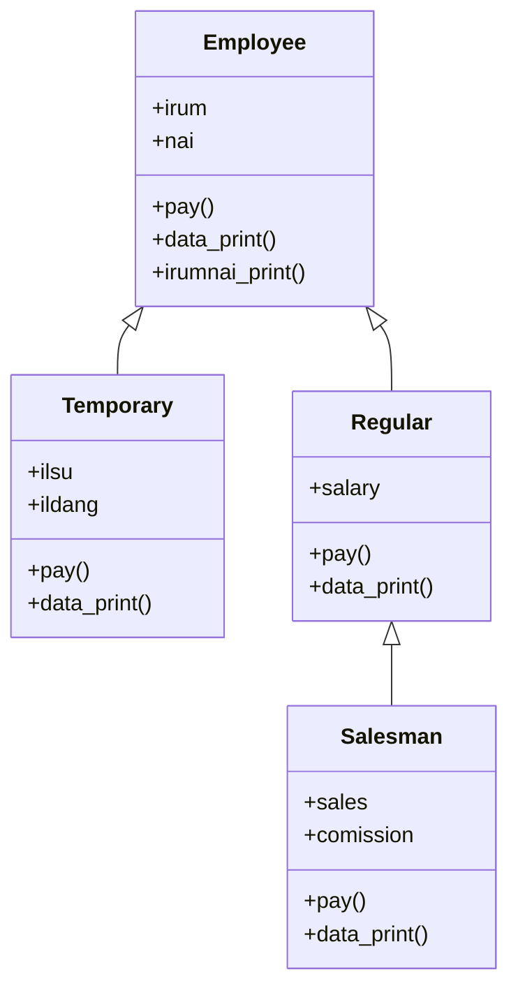

# Day 08_상속, 오버라이드, 다중상속, 추상 클래스

# 📅 2026-02-08

---
## 1. 상속(Inheritance)
- **기존 클래스의 멤버(변수, 메서드)를 물려받아 사용하는 것**
    
- 목적
    
    - 코드 재사용
        
    - 확장성 (기능 추가)
        
    - 구조적 설계 (공통 vs 구체)
        
    - 다형성 구현 기반

---
### 1-1. 동물 클래스

```python
# 상속(Inheritance)
# - 코드 재사용
# - 확장성
# - 구조적 설계
# - 다형성(메소드 오버라이딩)

class Animal:   # 동물들이 가져야 할 공통 속성과 행위
    age = 1     # 클래스 변수

    def __init__(self):
        print('Animal 생성자')

    def move(self):
        print('움직이는 생물')


class Dog(Animal):   # Animal을 상속받는 자식 클래스
    def __init__(self):
        print('Dog 생성자')

    def my(self):
        print('댕댕이라고 해요')


class Horse(Animal):   # Animal을 그대로 상속
    pass

```

- `Animal` : **부모 클래스**
- 모든 동물이 공통으로 가지는
    - 속성: `age`
    - 행위: `move()`

- `Dog` : `Animal`을 **상속**
- 자동으로 가지게 되는 것
    - `age`
    - `move()`
- 추가한 것
    - `my()`
- 자식 클래스에 `__init__`이 있으면  
    👉 **부모 생성자는 자동으로 실행 안 됨**

```python
dog1 = Dog()
dog1.my()        # Dog의 메서드
dog1.move()      # 부모(Animal)의 메서드
print('age :', dog1.age)   # 부모 클래스 변수

print()

dog2 = Dog()
dog2.my()
dog2.move()

print()

horse1 = Horse()
horse1.move()   # 자식에 메서드가 없으면 부모에서 탐색
```

**출력**
```
Dog 생성자
댕댕이라고 해요
움직이는 생물
age : 1

Dog 생성자
댕댕이라고 해요
움직이는 생물

Animal 생성자
움직이는 생물
```


### 1-2. 사람 클래스

```python
# ==============================
# 상속(Inheritance) 수업 예제
# ==============================

# 부모 클래스
class Person:
    say = '난 사람이야~~~'     # public 클래스 변수
    nai = '20'
    __msg = 'good : private 멤버'   # private 멤버

    def __init__(self, nai):
        print('Person 생성자')
        self.nai = nai              # 인스턴스 변수

    def printInfo(self):
        print(f'나이:{self.nai}, 이야기:{self.say}')

    def helloMethod(self):
        print('안녕')
        # private 멤버는 같은 클래스 내부에서만 접근 가능
        print('hello :', self.say, self.nai, self.__msg)


# 클래스 변수는 객체 없이 접근 가능
print(Person.say, Person.nai)

# 객체 생성
per = Person('25')
per.printInfo()
per.helloMethod()

print('---' * 10)
```

```
난 사람이야~~~ 20
Person 생성자
나이:25, 이야기:난 사람이야~~~
안녕
hello : 난 사람이야~~~ 25 good : private 멤버
------------------------------
```


```python
# 자식 클래스 1
class Employee(Person):
    subject = '근로자'
    say = '일하는 동물'     # hiding (부모 변수 가림)

    def __init__(self):
        print('Employee 생성자')
        # super().__init__() 호출 안 함
        # → 부모 생성자 실행 안 됨

    # 메서드 오버라이딩
    def printInfo(self):
        print('Employee 클래스의 printInfo 호출됨')

    def ePrintInfo(self):
        print(self.subject, self.say, self.nai)
        # print(self.__msg)  # ❌ private 멤버 접근 불가
        self.helloMethod()      # 부모 메서드 호출
        self.printInfo()        # 자기 메서드 호출
        print(super().say)      # 부모 클래스 변수 접근
        super().printInfo()     # 부모 메서드 호출


emp = Employee()
print(emp.subject, emp.nai, emp.say)
emp.ePrintInfo()

print('---' * 10)
```

```
Employee 생성자
근로자 20 일하는 동물
근로자 일하는 동물 20
안녕
hello : 일하는 동물 20 good : private 멤버
Employee 클래스의 printInfo 호출됨
난 사람이야~~~
나이:20, 이야기:일하는 동물
------------------------------
```
- say = '일하는 동물'     # hiding (부모 Person 변수 가림)


```python
# 자식 클래스 2
class Worker(Person):
    def __init__(self, nai):
        print('Worker 생성자')
        super().__init__(nai)   # 부모 생성자 호출

    def wPrintInfo(self):
        print('Worker - wPrintInfo 처리')
        super().printInfo()


wor = Worker('30')
print(wor.say, wor.nai)
wor.wPrintInfo()

print('===' * 10)
```

```
Worker 생성자
Person 생성자
난 사람이야~~~ 30
Worker - wPrintInfo 처리
나이:30, 이야기:난 사람이야~~~
==============================
```

```python
# 손자 클래스 (다단 상속)
class Programmer(Worker):
    def __init__(self, nai):
        print('Programmer 생성자')
        # 부모 생성자 직접 호출 (Unbound call, 학습용)
        Worker.__init__(self, nai)

    def pPrintInfo(self):
        print('Programmer - pPrintInfo 처리하였음')

    # 오버라이딩
    def wPrintInfo(self):
        print('Programmer에서 overriding')


pro = Programmer(35)
print(pro.say, pro.nai)
pro.pPrintInfo()
pro.wPrintInfo()

print('\n클래스 타입 확인')
a = 3
print(type(a))
print(type(pro))
print(type(wor))

# 각 클래스의 부모 클래스 확인
print(Person.__bases__)
print(Employee.__bases__)
print(Worker.__bases__)
print(Programmer.__bases__)
```

```
Programmer 생성자
Worker 생성자
Person 생성자
난 사람이야~~~ 35
Programmer - pPrintInfo 처리하였음
Programmer에서 overriding

클래스 타입 확인
<class 'int'>
<class '__main__.Programmer'>
<class '__main__.Worker'>
(<class 'object'>,)
(<class '__main__.Person'>,)
(<class '__main__.Person'>,)
(<class '__main__.Worker'>,)
```

- `public` : 기본값 (자유롭게 접근 가능)
- `__변수` : private  
    → **클래스 내부에서만 접근 가능**  
    → 상속받아도 직접 접근 ❌
- `super()`
	- 부모 클래스의 멤버(변수, 메서드, 생성자)를 호출할 때 사용
	- 생성자 오버라이딩 시 **부모 생성자 호출용으로 매우 중요**

---
## 2. 메소드 오버라이딩(Method Overriding)

- **부모 클래스에서 정의된 메소드를 자식 클래스가 동일한 이름으로 재정의**
    
- 부모 메소드의 기능을 **자식이 자신의 역할에 맞게 변경**
    
- 공통 구조는 부모가 제공하고,  
    실제 동작은 자식이 결정 → **객체지향 핵심 개념**

### 오버라이딩의 특징

- 메소드 이름, 매개변수 구조가 **부모와 동일**
    
- 객체 타입이 아니라 **실제 객체(인스턴스)** 기준으로 호출됨
    
- 다형성(Polymorphism)을 구현하는 핵심 수단
    
- 확장·유지보수에 유리  
    → **부모 코드는 유지**, 자식 코드만 수정

---
### 2-1. 메소드 오버라이딩 예제 : 부모클래스 
```python
# 메소드 오버라이딩(재정의)
# 부모에서 정의된 메소드를 자식이 동일명의 메소드로 내용만 변경해 사용
# Polymorphism(다형성) - 같은 메소드이나 객체에 따라 다른 기능을 수행

class Parent:
    def printData(self):
        pass    # 공통 인터페이스 역할


class Child1(Parent):
    def abc():
        print('Child1 고유 메소드')

    def printData(self):
        a = 5 + 6
        #...
        print('Child1에서 printData 재정의')    # 오버라이딩


class Child2(Parent):
    def printData(self):
        print('Child2에서 printData override')  # 오버라이딩
        msg = "부모와 동일 메소드명이나 내용은 다르다"
        print(msg)
```
- `Parent.printData()`  
    → **자식들이 반드시 구현해야 할 공통 메소드 형태**
	
- `Child1`, `Child2`  
    → 같은 `printData()` 이름이지만 **내용은 서로 다름**

---
#### 오버라이딩 동작 확인

```python
c1 = Child1()
c1.printData()

print()

c2 = Child2()
c2.printData()
```

**출력**
```
Child1에서 printData 재정의

Child2에서 printData override
부모와 동일 메소드명이나 내용은 다르다
```
- 같은 메소드 호출
- 객체에 따라 **다른 결과 출력**

---
#### 다형성(Polymorphism)

```python
print('\n다형성 ---')
par = Parent()      # 부모 타입 참조 (권장 방식)
par = c1
par.printData()

print()

par = c2
par.printData()

print('-------------')

imsi = c1           # 파이썬에서만 가능한 방식 (비권장)
imsi.printData()
imsi = c2
imsi.printData()
```

```
다형성 ---
Child1에서 printData 재정의

Child2에서 printData override
부모와 동일 메소드명이나 내용은 다르다
-------------
Child1에서 printData 재정의
Child2에서 printData override
부모와 동일 메소드명이나 내용은 다르다
```
#### 다형성 정리
- **같은 메소드 호출**
- **객체에 따라 서로 다른 동작 수행**
- `Parent` 타입 변수로  
    `Child1`, `Child2` 객체를 다룰 수 있음
- Java / C++ / Python 공통 객체지향 핵심 개념

---
### 2-2. 메소드 오버라이딩 예제 : 결제 시스템

- **부모 클래스에서 공통 규칙(인터페이스 역할) 정의**
- 실제 결제 방식(카드, 현금 등)은 **자식 클래스가 결정**
- 동일한 메소드 호출(`pay`)이지만  
    **객체에 따라 다른 동작 수행 → 다형성**

---

### 결제 시스템 코드 예제
```python
# 오버라이딩 : 결제 시스템

class Payment:      # 공통 규칙 선언 (부모 클래스)
    def pay(self, amount):
        print(f'{amount}원 결제 처리')


# Payment의 자식 클래스들은
# pay()라는 동일한 메소드를 사용할 것을 기대함
# → 동일 인터페이스 제공

class CardPayment(Payment):
    # 카드 결제 전용 클래스

    def pay(self, amount):
        print(f'{amount}원 카드 결제 승인 완료함')


class CashClass(Payment):
    # 현금 결제 전용 클래스

    def pay(self, amount):
        print(f'{amount}원 현금 결제 완료함 - 감사합니다')

```

---
### 다형성 적용
```python
payments = [CardPayment(), CashClass()]

for p in payments:
    p.pay(5000)     # 다형성
```

**출력**
```
5000원 카드 결제 승인 완료함
5000원 현금 결제 완료함 - 감사합니다
```

- `payments` 리스트에는  
    **서로 다른 자식 객체(CardPayment, CashClass)** 가 들어 있음
- 반복문에서 호출하는 메소드는 모두 `pay()`
	
- 하지만 실제 실행되는 메소드는  
    **각 객체가 오버라이딩한 pay()**

👉 **“어떤 객체냐”에 따라 실행 결과가 달라짐**


---
## 3. 다중 상속 (Multiple Inheritance)

- **하나의 클래스가 둘 이상의 부모 클래스를 상속**
- 파이썬은 **MRO(Method Resolution Order)** 순서로 메서드를 탐색
- **왼쪽에 선언된 부모 클래스부터 우선 탐색**
- 같은 이름의 메서드가 여러 부모에 있으면  
    👉 **먼저 만난 부모의 메서드 실행**


---
### 3-1. 다중클래스 예시 : 호랑이, 사자
```python
class Tiger:
    data = "호랑이 세계"

    def cry(self):
        print('호랑이 : 어흥')
    
    def eat(self):
        print('맹수는 고기를 좋아함')
        
class Lion:
    def cry(self):
        print('사자 : 으르렁')

    def hobby(self):
        print('백수의 왕은 낮잠이 취미')

```
- `Tiger`, `Lion`은 서로 독립된 부모 클래스
- `cry()` 메서드가 **양쪽 모두에 존재** → 다중 상속에서 핵심 포인트

---
#### 다중 상속 + 순서 영향 (Liger1)
```python
class Liger1(Tiger, Lion):   # Tiger → Lion 순서
    pass
```

```python
a1 = Liger1()
print(a1.data)
a1.eat()
a1.hobby()
a1.cry()
```

```
호랑이 세계
맹수는 고기를 좋아함
백수의 왕은 낮잠이 취미
호랑이 : 어흥
```

- `ata`, `eat()` → Tiger에만 있으므로 Tiger에서 가져옴
    
- `hobby()` → Lion에만 있으므로 Lion에서 가져옴
    
- `cry()` → Tiger와 Lion 모두에 있음  
    👉 **상속 순서상 Tiger가 먼저라 Tiger의 cry() 실행**

---
#### 다중 상속 + 오버라이딩 + super() (Liger2)
```python
def hobby():
    print('모듈의 멤버 : 일반 함수')

class Liger2(Lion, Tiger):   # Lion → Tiger 순서
    data = "라이거 만세"

    def play(self):
        print('라이거 고유 메소드')

    def hobby(self):        # 메소드 오버라이딩
        print('라이거는 공원 걷기를 좋아함')

    def showData(self):
        self.hobby()        # Liger2의 hobby()
        super().hobby()     # Lion의 hobby()
        hobby()             # 모듈 함수 hobby()

        self.eat()          # Tiger의 eat()
        super().eat()       # Tiger의 eat()

        print(self.data + ' ' + super().data)
```

```python
a2 = Liger2()
a2.cry()
a2.showData()
```
#### 실행 흐름 설명

① `a2.cry()`
- Liger2 → Lion → Tiger 순으로 탐색
    
- `cry()`는 Lion에 먼저 존재

| 호출                | 의미                  |
| ----------------- | ------------------- |
| `self.hobby()`    | Liger2에서 오버라이딩된 메소드 |
| `super().hobby()` | Lion의 hobby()       |
| `hobby()`         | 클래스와 무관한 모듈 함수      |
| `self.eat()`      | Tiger의 eat()        |
| `super().eat()`   | Tiger의 eat()        |
| `self.data`       | Liger2의 data        |
| `super().data`    | Tiger의 data         |

**출력**
```
사자 : 으르렁
라이거는 공원 걷기를 좋아함
백수의 왕은 낮잠이 취미
모듈의 멤버 : 일반 함수
맹수는 고기를 좋아함
맹수는 고기를 좋아함
라이거 만세 호랑이 세계
```

---
## 4. 추상 클래스 (Abstract Class)
- **추상 메소드를 하나 이상 가진 클래스**
- **객체 생성 불가**
- **부모 클래스로만 사용**
- 자식 클래스에게 **구현을 강제**하기 위한 목적

---
### 4-1. 추상 클래스 예시
```python

# 추상 클래스(abstract class)
# - 추상 메소드를 하나 이상 가진 클래스
# - 객체 생성 불가 (설계용 클래스)
# - 부모 클래스로만 사용됨
# - 자식에게 "이 메소드는 반드시 만들어라" 강제

from abc import *

class AbstractClass(metaclass=ABCMeta):  # 추상 클래스 선언 (ABCMeta가 핵심)
    
    @abstractmethod
    def abcMethod(self):     # 추상 메소드
        # 자식 클래스에서 반드시 재정의해야 함
        pass

    def normalMethod(self):  # 일반 메소드
        # 추상 클래스도 일반 메소드는 가질 수 있음
        print('추상클래스 내의 일반 메소드')

# parent = AbstractClass()
# ❌ 에러 발생
# 이유: 추상 메소드를 가진 클래스는 객체 생성 불가


class Child1(AbstractClass):
    name = '난 Child1'

    def abcMethod(self):
        # 추상 메소드 구현 필수 (안 하면 객체 생성 불가)
        print('부모가 가진 abcMethod 재정의 : 강요당함 ㅠㅠ')


c1 = Child1()               # 추상 메소드 구현했으므로 객체 생성 가능
print('name : ', c1.name)
c1.abcMethod()              # Child1의 abcMethod 실행
c1.normalMethod()           # 부모(AbstractClass)의 일반 메소드 사용


class Child2(AbstractClass):
    def abcMethod(self):
        # 추상 메소드 구현
        print('추상클래스 내의 abcMethod 재정의')

    def normalMethod(self):
        # 일반 메소드도 오버라이딩 가능
        print('일반 메소드 내 맘대로 내용 변경')


c2 = Child2()
c2.abcMethod()              # Child2의 abcMethod 실행
c2.normalMethod()           # Child2에서 오버라이딩한 normalMethod 실행

print('------------')

# 다형성
happy = c1                  # 부모 타입 참조 개념
happy.abcMethod()

happy = c2
happy.abcMethod()
```

**출력**
```
name :  난 Child1
부모가 가진 abcMethod 재정의 : 강요당함 ㅠㅠ
추상클래스 내의 일반 메소드
추상클래스 내의 abcMethod 재정의
일반 메소드 내 맘대로 내용 변경
------------
부모가 가진 abcMethod 재정의 : 강요당함 ㅠㅠ
추상클래스 내의 abcMethod 재정의
```

---
### 4-2 추상 클래스 문제풀이 : 직원(Employee) 관리 시스템

```python

from abc import *

class Employee(metaclass=ABCMeta):
    # -----------------------------
    # 추상 클래스
    # - pay()와 data_print()는 추상 메소드
    # - 객체 생성 불가, 자식 클래스에서 반드시 구현해야 함
    # -----------------------------
    def __init__(self, irum, nai):
        self.irum = irum
        self.nai = nai

    @abstractmethod
    def pay(self):
        pass

    @abstractmethod
    def data_print(self):
        pass

    def irumnai_print(self):  # 공통 기능: 이름, 나이 출력
        print(f'이름: {self.irum}, 나이: {self.nai},', end=' ')


class Temporary(Employee):  # 일용직
    def __init__(self, irum, nai, ilsu, ildang):
        super().__init__(irum, nai)
        self.ilsu = ilsu
        self.ildang = ildang

    def pay(self):  # 월급 계산
        print('월급:', self.ilsu * self.ildang)

    def data_print(self):
        super().irumnai_print()  # 부모 메소드 재사용
        self.pay()


class Regular(Employee):  # 정규직
    def __init__(self, irum, nai, salary):
        super().__init__(irum, nai)
        self.salary = salary

    def pay(self):
        pass  # 이미 salary가 있으므로 별도 계산 없음

    def data_print(self):
        super().irumnai_print()
        print('급여:', self.salary)


class Salesman(Regular):  # 영업직 (정규직 상속)
    def __init__(self, irum, nai, salary, sales, comission):
        super().__init__(irum, nai, salary)
        self.sales = sales
        self.comission = comission

    def pay(self):
        # 월급 + 실적 * 수수료율
        allowance = self.salary + (self.sales * self.comission)
        return int(allowance)

    def data_print(self):
        super().irumnai_print()
        print('수령액:', self.pay())


# ==============================
# 객체 생성 및 출력
# ==============================
t = Temporary('홍길동', 25, 20, 15000)
t.data_print()  # 이름: 홍길동, 나이: 25, 월급: 300000

r = Regular('한국인', 27, 3500000)
r.data_print()  # 이름: 한국인, 나이: 27, 급여: 3500000

s = Salesman('손오공', 29, 1200000, 5000000, 0.25)
s.data_print()  # 이름: 손오공, 나이: 29, 수령액: 2450000

# ==============================
# 요약 포인트
# ==============================
# 1. Employee는 추상 클래스 → pay(), data_print() 반드시 구현
# 2. Temporary, Regular, Salesman은 Employee 상속 → 추상 메소드 구현
# 3. Salesman은 Regular 상속 → 다단 상속 구조
# 4. irumnai_print()는 공통 기능 재사용
# 5. 다형성: Employee 타입으로 Temporary, Regular, Salesman 객체 처리 가능


```


- **추상 클래스**: `Employee` → 설계용, 객체 생성 불가
- **상속 + 오버라이딩**: 자식 클래스가 `pay()`와 `data_print()`를 구체적으로 구현
- **공통 메소드 재사용**: `irumnai_print()`
- **다형성 활용**: 추상 부모 타입으로 다양한 자식 객체 다루기 가능