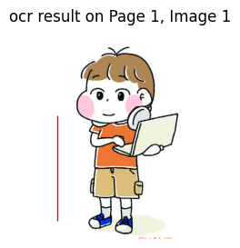
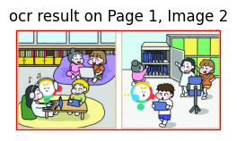
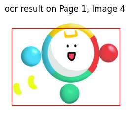
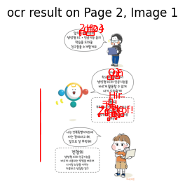

# Day 104_PDF OCR · 비동기 RAG · ChromaDB

## 📅 2026-07-10

---
# 📄 rag10pdf.ipynb — PyMuPDFLoader · fitz · pytesseract OCR

---

## 개요

`aiethics.pdf`(전북교육청 생성형 AI 윤리 자료) 하나를 대상으로, RAG 파이프라인의 **1단계인 "문서 읽기"**를 두 가지 방식으로 실습한 노트북.

1. PDF **텍스트**를 두 가지 방법(LangChain `PyMuPDFLoader` vs 순수 `fitz`)으로 읽어 `Document` 객체로 변환
2. PDF 안에 삽입된 **이미지**를 추출하고, OCR로 이미지 속 텍스트까지 뽑아내기

즉 "글자로 된 텍스트"뿐 아니라 "그림 속 글자"까지 전부 검색 가능한 형태로 만드는 게 최종 목표.

---

## 핵심 개념 정리

### 1) `Document` 객체 — LangChain의 기본 문서 단위

RAG에서 모든 문서는 결국 `Document`라는 공통 틀에 담김.

```python
Document(
    page_content="실제 텍스트 내용",
    metadata={ ... }   # 텍스트에 대한 부가정보
)
```

- **page_content**: 실제 본문 텍스트 (임베딩 대상이 되는 부분)
- **metadata**: 그 텍스트에 대한 설명 정보. 본문은 아니지만 검색/필터링/출처 표시에 쓰임
    - 예: 어느 파일에서 왔는지(`source`), 몇 페이지인지(`page`), 저자(`author`) 등
    - 메타데이터가 있어야 나중에 "3페이지 내용만 검색해줘" 같은 조건 검색이나, 답변에 출처를 붙이는 게 가능해짐

### 2) PDF 로딩 방법 두 가지 비교

|구분|PyMuPDFLoader (LangChain)|fitz (PyMuPDF 직접 사용)|
|---|---|---|
|코드|`loader.load()` 한 줄|for문으로 페이지 직접 순회|
|metadata|자동 생성 (producer, page, total_pages 등)|**직접 dict로 만들어야 함**|
|장점|간편함, LangChain 파이프라인과 바로 연동|세밀한 제어 가능 (원하는 메타데이터만 선택, 빈 페이지 필터링 등)|
|이 노트북에서의 활용|Cell 2|Cell 3|

> 실무 감각: 빠르게 프로토타입 만들 때는 `PyMuPDFLoader`, 메타데이터를 커스터마이징하거나 이미지처럼 LangChain이 기본 지원 안 하는 걸 다뤄야 할 땐 `fitz`를 직접 쓰는 식으로 섞어 쓰게 됨. 이 노트북이 딱 그 패턴.

### 3) OCR (광학 문자 인식)

이미지 안에 박혀 있는 텍스트(스캔본, 삽화 속 말풍선 등)를 인식해서 문자열로 뽑아내는 기술.

- `pytesseract.image_to_data()` → 텍스트뿐 아니라 **위치(x, y, w, h)**와 **신뢰도(confidence)**까지 함께 반환
- 신뢰도가 낮은 값(예: 배경의 노이즈, 잘못 인식된 글자)은 걸러내야 실제로 쓸모 있는 텍스트만 남음 → 그래서 `conf >= 60` 필터링을 씀
- confidence가 `-1`인 항목은 애초에 텍스트가 없는 영역이라는 뜻 → 자연스럽게 필터링됨

---

## 셀별 코드 + 주석

### Cell 0 — 필요 라이브러리 설치

```python
# pdf 문서에서 텍스트 또는 이미지 읽기
!pip install langchain-community pymupdf pytesseract pillow transformers
```

- `pymupdf` = fitz의 실제 패키지명 (import 시엔 `fitz`로 불러옴)
- `pytesseract` = OCR 엔진(Tesseract)의 파이썬 wrapper

### Cell 1 — import

```python
from langchain_community.document_loaders import PyMuPDFLoader  # LangChain용 PDF 로더
import fitz          # PyMuPDF 원본 라이브러리 (저수준 제어용)
from PIL import Image
import pytesseract    # OCR
import os
import io
import matplotlib.pyplot as plt  # OCR 결과 시각화용
```

### Cell 2 — 텍스트 읽기 ① `PyMuPDFLoader` (LangChain 방식)

```python
pdf_path = 'aiethics.pdf'
loader = PyMuPDFLoader(pdf_path)   # 로더 객체 생성

documents = loader.load()   # 페이지 단위로 자동 분할 → Document 리스트
print(documents)  # 각 원소: Document(metadata={...}, page_content="...")

# 모든 페이지 텍스트를 하나로 합치기 (페이지 사이는 빈 줄 두 개로 구분)
full_text = "\n\n".join([doc.page_content for doc in documents])
```

- 핵심: `.load()` 한 번 호출로 "페이지 분할 + 텍스트 추출 + 메타데이터 자동 부여"가 전부 처리됨

**실제 실행 결과 (일부):**

```python
[Document(
    metadata={
        'producer': 'Adobe PDF Library 15.0',
        'creator': 'Adobe InDesign CC 13.1 (Macintosh)',
        'creationdate': '2024-03-07T15:09:14+09:00',
        'source': 'aiethics.pdf',
        'file_path': 'aiethics.pdf',
        'total_pages': 16,
        'format': 'PDF 1.3',
        'title': '', 'author': '', 'subject': '', 'keywords': '',
        'moddate': '2024-03-07T15:09:28+09:00',
        'page': 0        # ← 0부터 시작
    },
    page_content='전북교육 2023-466\n발\n간\n등\n록\n번\n호\n1'
),
Document(metadata={..., 'page': 1}, page_content='똑디(똑똑한 디지털 도우미)와 함께하는 생성형 AI·인공지능 윤리의 모든 것 \n전북특별자치도교육청 미래교육과\n2'),
...
# 총 16개 Document (PDF 16페이지)
]
```

- `PyMuPDFLoader`는 **PDF/문서 자체의 메타 정보(producer, creator, format 등)까지 자동으로 긁어옴**. 직접 지정 안 해도 알아서 채워줌
- `page` 인덱스가 **0부터 시작**하는 게 특징 (16페이지짜리 문서면 0~15)
- `title`, `author` 등은 PDF 내부에 실제 값이 입력 안 되어 있어서 빈 문자열로 나옴 → PDF 제작 시 메타 정보를 안 채워 넣으면 이렇게 비어있을 수 있다는 것도 확인 가능

### Cell 3 — 텍스트 읽기 ② `fitz` 직접 사용 (수동 방식)

```python
from langchain_core.documents import Document  # Document 객체를 수동으로 만들기 위해 import

doc = fitz.open('aiethics.pdf')

documents = []
for i, page in enumerate(doc):
  text = page.get_text()   # 해당 페이지의 텍스트만 추출

  # 메타데이터를 직접 설계 — 여기서 뭘 넣을지가 이후 검색 품질을 좌우함
  metadata = {
      'source': pdf_path,
      'page': i + 1,                          # 1페이지부터 시작하도록 보정
      'total_pages': len(doc),
      'author': doc.metadata.get('author', ''),
      'title': doc.metadata.get('title', ''),
      'producer': doc.metadata.get('producer', ''),
  }

  # 빈 페이지(텍스트 없는 페이지, 예: 표지/이미지만 있는 페이지)는 제외
  if text.strip():
    documents.append(Document(page_content=text.strip(), metadata=metadata))

print(f'총 문서 수 : {len(documents)}')
print(documents[0])

full_text = "\n\n".join([doc.page_content.strip() for doc in documents if doc.page_content.strip()])
print(full_text)
```

- `PyMuPDFLoader`와 결과물은 비슷하지만, **메타데이터 필드를 직접 골라 담을 수 있다**는 게 차이점
- `if text.strip()` 조건이 중요 — 텍스트 없는 페이지(표지, 이미지 페이지)를 걸러줘야 나중에 빈 문서가 벡터DB에 들어가는 걸 방지

**실제 실행 결과:**

```python
총 문서 수 : 16
page_content='전북교육 2023-466\n발\n간\n등\n록\n번\n호\n1' metadata={'source': 'aiethics.pdf', 'page': 1, 'total_pages': 16, 'author': '', 'title': '', 'producer': 'Adobe PDF Library 15.0'}
```

- 16페이지 전부 텍스트가 있어서(표지에도 텍스트가 있음) 필터링 없이 16개 그대로 살아남음
- **`page` 값이 1부터 시작** — `PyMuPDFLoader`(Cell 2, 0부터 시작)와의 차이점이 여기서 드러남. 같은 PDF를 읽어도 로더/구현 방식에 따라 페이지 인덱싱 기준이 다를 수 있으니, 나중에 "N페이지"를 출처로 표기할 때 헷갈리지 않게 어떤 방식을 썼는지 기억해두는 게 중요

`full_text`를 출력하면 실제 aiethics.pdf 16페이지 전체 내용(생성형 AI 정의, 사용 연령 제한, 개인정보보호, 저작권, 할루시네이션 등 9개 주제)이 페이지 구분 없이 하나의 긴 문자열로 이어져 나옴 — 이 상태로는 청크 분할 전이라 각 문장이 어느 주제에 속하는지 알 수 없다는 한계가 있음. 다음 단계(청크 분할)에서 이 부분이 개선됨.

### Cell 4 — 이미지 읽기 + OCR

```python
doc = fitz.open(pdf_path)
ocr_results = []  # 페이지별 OCR 결과를 모아둘 리스트

for page_num, page in enumerate(doc):
  images = page.get_images(full=True)   # 해당 페이지에 삽입된 이미지 목록
  if not images:
    continue   # 이미지 없는 페이지는 건너뜀

  for i, img in enumerate(images):
    xref = img[0]                              # PDF 내부에서 이미지를 가리키는 참조 id
    base_image = doc.extract_image(xref)       # xref로 실제 이미지 데이터 추출
    image_bytes = base_image['image']          # raw byte 데이터
    image = Image.open(io.BytesIO(image_bytes))  # PIL 이미지 객체로 변환

    # 추출한 이미지를 파일로 저장 (imgs/page_1_image_1.jpg 형식)
    save_dirs = 'imgs'
    os.makedirs(save_dirs, exist_ok=True)
    image_filename = f'page_{page_num + 1}_image_{i + 1}.jpg'
    image_path = os.path.join(save_dirs, image_filename)
    image.save(image_path)

    # OCR 적용 — 텍스트 + 좌표 + 신뢰도를 dict로 반환
    data = pytesseract.image_to_data(image, output_type=pytesseract.Output.DICT)

    # 신뢰도 60 이상인 단어만 골라 하나의 문자열로 결합 (노이즈 제거)
    extracted_text = ' '.join([
        text for j, text in enumerate(data['text']) if int(data['conf'][j]) >= 60
    ])

    ocr_results.append({
        'page': page_num + 1,
        'image_index': i + 1,
        'text': extracted_text
    })

    # OCR 인식 위치를 이미지 위에 빨간 박스로 시각화 (검증용)
    plt.figure(figsize=(3, 3))
    plt.imshow(image)
    for j in range(len(data['text'])):
      if int(data['conf'][j]) >= 60:
        (x, y, w, h) = (data['left'][j], data['top'][j], data['width'][j], data['height'][j])
        # facecolor는 빈 문자열('') 대신 'none'을 써야 함 (최신 matplotlib 버전 이슈)
        plt.gca().add_patch(plt.Rectangle((x, y), w, h, edgecolor='red', facecolor='none', linewidth=1))
        plt.text(x, y, data['text'][j], color='red')
    plt.axis('off')
    plt.title(f'ocr result on Page {page_num + 1}, Image {i + 1}')
    plt.show()

print(ocr_results[:2])
```

**실행 결과 관찰:**

```python
[{'page': 1, 'image_index': 1, 'text': ''}, {'page': 1, 'image_index': 2, 'text': ''}]
```



Page 1, Image 1 — 캐릭터 단독 삽화. 글자가 아예 없어서 OCR 텍스트 `''` (빈 문자열).



Page 1, Image 2 — 교실 삽화. 그림 안에 글자가 없거나 신뢰도 60 미만이라 전부 필터링됨 → `''`.


Page 1, Image 3 — 디지털 기기(패드/화면) 삽화.



Page 1, Image 4 — 마스코트(똑디) 단독 삽화. 역시 텍스트 없음.



Page 2, Image 1 — **말풍선 대사가 포함된 삽화**. 빨간 박스로 표시된 부분이 OCR이 실제로 인식한 글자 영역. 여기서는 `conf >= 60` 조건을 통과한 한글 텍스트가 추출됨.

1페이지 이미지 4개는 전부 순수 캐릭터/장면 삽화라 OCR 텍스트가 `''`로 나온 반면, 2페이지 이미지는 말풍선 속 대사가 있어 실제 텍스트가 인식됨 → **이미지 성격(순수 삽화 vs 텍스트 포함 이미지)에 따라 OCR 결과가 크게 갈린다**는 걸 확인할 수 있는 부분. 다만 5번째 이미지를 보면 빨간 박스가 글자 일부만 듬성듬성 잡고 있어서, 손글씨체/말풍선 폰트에 대한 OCR 인식률 자체는 그리 높지 않다는 것도 알 수 있음.

> 옵시디언에서 보려면 이 노트 파일과 같은 위치에 `images/` 폴더를 만들고, 그 안에 `rag10pdf.png` ~ `rag10pdf5.png` 파일을 넣어주면 됩니다.

---

## 트러블슈팅 이력 (이 세션에서 고친 것들)

|에러|원인|해결|
|---|---|---|
|`NameError: name 'loader' is not defined`|`loader = PyMuPDFLoader(pdf_path)` 줄 누락|로더 객체 생성 코드 추가|
|`ValueError: Invalid RGBA argument: ''`|`facecolor=''`가 최신 matplotlib에서 무효|`facecolor='none'`으로 수정|

---

## 다음 단계로 이어질 흐름

1. `full_text`(텍스트) + `ocr_results`(이미지 속 텍스트)를 합쳐 하나의 문서 컬렉션으로 구성
2. 청크 분할(chunking) → 임베딩 → ChromaDB 저장
3. 이후 RAG 검색·답변 파이프라인(`answer_with_rag`류)에 연결

#RAG #PDF로더 #메타데이터 #OCR #PyMuPDF #LangChain

---
# 📄 rag11async.ipynb — asyncio · gather · AsyncOpenAI

---

## 개요

앞서 만든 **PDF 읽기(rag10pdf)** 는 "문서를 읽는" 단계였다면, 이 노트북은 RAG 파이프라인의 **전체 흐름**을 처음부터 끝까지 한 번에 구현한 버전.

```
위키백과 URL 3개 크롤링 → LLM이 각각 비동기로 요약 → ChromaDB에 벡터 저장 → 질문이 들어오면 유사 문서 검색 → LLM이 최종 답변 생성
```

핵심 포인트는 **"LLM 요약 요청 3개를 동시에(비동기로) 날려서 대기 시간을 줄인다"**는 것 — 순차 처리였다면 3번의 API 응답을 기다려야 하지만, 비동기로 묶으면 가장 느린 요청 하나 정도의 시간만 기다리면 됨.

---

## 핵심 개념 정리

### 1) 동기(sync) vs 비동기(async) — 왜 필요한가

- **동기 처리**: 요청 A → 응답 대기 → 요청 B → 응답 대기 → 요청 C → 응답 대기 (순서대로, 총 대기시간 = A+B+C)
- **비동기 처리**: 요청 A, B, C를 거의 동시에 보내놓고, 셋 다 끝날 때까지 기다림 (총 대기시간 ≈ 가장 느린 것 하나)

LLM API 호출처럼 "네트워크 왕복 대기 시간이 긴 작업"을 여러 개 처리해야 할 때 비동기가 특히 효과적. (연산이 오래 걸리는 게 아니라 "기다리는 시간"이 긴 작업이라 그 시간 동안 다른 요청을 같이 진행시킬 수 있음)

### 2) `async def` / `await` / `asyncio.gather` 삼총사

|키워드|역할|
|---|---|
|`async def`|이 함수가 "비동기 함수(코루틴)"임을 선언. 내부에서 `await`를 쓸 수 있게 해줌|
|`await`|비동기 작업이 끝날 때까지 "현재 함수 안에서만" 기다림 (다른 작업은 그 사이에 진행 가능)|
|`asyncio.gather(*tasks)`|여러 개의 코루틴(비동기 작업)을 한꺼번에 실행하고, **전부 끝날 때까지 기다렸다가** 결과를 리스트로 모아서 반환|

```python
# tasks = [summarize_async(url1, text1), summarize_async(url2, text2), summarize_async(url3, text3)]
summaries = await asyncio.gather(*tasks)
# → 3개의 LLM 요약 요청이 거의 동시에 날아가고, 셋 다 끝나면 [요약1, 요약2, 요약3] 형태로 반환됨
```

`*tasks`의 `*`는 리스트를 풀어서 각각의 인자로 전달하는 문법(언패킹) — `gather(task1, task2, task3)`와 동일한 효과.

### 3) `OpenAI` vs `AsyncOpenAI`

```python
client = OpenAI(api_key=OPENAI_API_KEY)          # 동기 클라이언트 — .create()를 바로 호출
async_client = AsyncOpenAI(api_key=OPENAI_API_KEY)  # 비동기 클라이언트 — await와 함께 호출해야 함
```

- 이 노트북에서는 **용도를 나눠서 사용**: 요약 단계(`summarize_async`)는 `async_client`로 병렬 처리, 최종 답변 생성(`answer_with_rag`)은 `client`로 단순 순차 처리
- 왜 최종 답변은 동기로 남겨뒀을까? → 질문 1개당 답변도 1개라 병렬화할 대상이 없기 때문. 비동기는 "여러 개를 동시에 처리해야 할 때"만 이점이 있음

### 4) `responses.create()` — OpenAI의 최신 API 방식

```python
response = await async_client.responses.create(
    model=GPT_MODEL,
    input=prompt,
    temperature=0
)
response.output_text.strip()   # 결과 텍스트는 output_text 속성에 담김
```

기존에 익숙한 `chat.completions.create()`와는 응답 구조가 다름 (`.choices[0].message.content` 대신 `.output_text`). 최신 SDK에서 권장하는 방식.

### 5) RAG 검색 결과의 `distance` — 낮을수록 유사

`collection.query()`가 반환하는 `distances`는 질문 벡터와 저장된 문서 벡터 사이의 거리. **값이 작을수록 더 유사한 문서**라는 뜻 (코사인 거리/유클리드 거리 계열이라 0에 가까울수록 가까움).

---

## 셀별 코드 + 주석

### Cell 0 — 패키지 설치

```python
# 복수의 LLM 요청을 비동기로 처리
# 웹 크롤링(3개) -> LLM 요약 -> chroma에 저장 -> RAG 검색 -> LLM 최종 답변

!pip install openai sentence-transformers chromadb python-dotenv
!pip install request beautifulsoup4   # ⚠ 오타: 'request'가 아니라 'requests'
```

> **오타 주의**: `request`는 존재하지 않는 패키지라 설치가 실패함(`ERROR: No matching distribution found for request`). 다행히 `requests`는 다른 라이브러리(`kubernetes` 등)의 의존성으로 이미 깔려있어서 노트북 실행 자체엔 문제가 없었지만, 정확히 쓰려면 `!pip install requests beautifulsoup4`로 고쳐야 함.

### Cell 1 — import 및 초기 설정

```python
from openai import OpenAI
from openai import AsyncOpenAI
from sentence_transformers import SentenceTransformer
import chromadb
from chromadb import PersistentClient
from bs4 import BeautifulSoup
import requests
import textwrap
import os
import asyncio

from dotenv import load_dotenv
load_dotenv()   # .env 파일에서 OPENAI_API_KEY 등을 읽어옴

URLS = [
    'https://ko.wikipedia.org/wiki/김치찌개',
    'https://ko.wikipedia.org/wiki/인공지능',
    'https://ko.wikipedia.org/wiki/야구'
]
GPT_MODEL = "gpt-4o-mini"
CHROMA_PATH = "./wiki_async"       # 로컬에 벡터DB가 저장될 경로
COLLECTION_NAME = "wiki_docs"
OPENAI_API_KEY = os.getenv("OPENAI_API_KEY")

if not OPENAI_API_KEY:
    raise RuntimeError("OPENAI_API_KEY가 없어요")   # 키 없으면 바로 에러 발생시켜 조기 발견

client = OpenAI(api_key=OPENAI_API_KEY)              # 동기 클라이언트
async_client = AsyncOpenAI(api_key=OPENAI_API_KEY)   # 비동기 클라이언트

embedder = SentenceTransformer('all-MiniLM-L6-v2')   # 임베딩 모델 로드
chroma = PersistentClient(path=CHROMA_PATH)           # 로컬 디스크에 영구 저장되는 chroma 클라이언트
collection = chroma.get_or_create_collection(COLLECTION_NAME)  # 없으면 생성, 있으면 불러옴
```

- `PersistentClient`라 노트북을 껐다 켜도 `./wiki_async` 폴더에 데이터가 남아있음 (메모리에만 있는 `EphemeralClient`와 대비됨)
- `all-MiniLM-L6-v2`는 **영어 위주로 학습된 경량 임베딩 모델**이라는 점을 기억해두면 좋음 → 아래 실행 결과 분석에서 이게 왜 중요한지 나옴

### Cell 2 — 크롤링 · 요약 · 저장 함수 정의

```python
# 위키백과 URL에서 문서 읽기 함수
def fetch_wiki(url:str, max_chars:int=3000) -> str:
  headers={'USer-Agent':'Mozilla/5.0'}   # 대소문자는 상관없이 동작함 (관례상 'User-Agent'가 맞음)
  response = requests.get(url, headers=headers)
  print(f'[FETCH] {url} -> {response.status_code}')

  if response.status_code != 200:
    return ""

  soup = BeautifulSoup(response.text, 'html.parser')
  # <p> 태그(문단)만 골라서 텍스트 추출 — 위키백과 본문은 대부분 <p> 태그 안에 있음
  paragraphs = [
      p.get_text(strip=True) for p in soup.find_all('p') if p.get_text(strip=True)
  ]
  text = '\n'.join(paragraphs)
  return text[:max_chars]   # 너무 길면 LLM 토큰 낭비 + 비용 증가라 앞부분만 자름

# LLM에게 비동기로 요약을 요청하는 함수
async def summarize_async(url:str, text:str) -> str:
  if not text:
    return ""

  prompt = f"""
  너는 한국어 문서를 잘 요약하는 전문가야.
  아래 문서를 핵심 개념, 중요 사실, 특징 중심으로 10문장 이내로 요약해 줘

  URL:
  {url}

  문서 내용:
  {text}
  """

  response = await async_client.responses.create(   # await로 비동기 호출
      model = GPT_MODEL,
      input = prompt,
      temperature=0   # 0 = 매번 같은(결정적인) 답변에 가깝게. 요약처럼 일관성이 중요한 작업에 적합
  )
  return response.output_text.strip()

# chromadb에 저장을 위한 비동기 함수
async def build_db_async():
  texts = []   # (url, 본문텍스트) 튜플을 모아둘 리스트

  for url in URLS:
    text = fetch_wiki(url)          # 크롤링 자체는 동기 함수 (순차 실행)
    texts.append((url, text))

  # summarize_async 호출을 "실행"하지 않고 "코루틴 객체 리스트"만 만들어둠
  tasks = [
      summarize_async(url, text) for url, text in texts
  ]

  # 3개의 요약 요청을 동시에 실행 → 다 끝나면 결과 리스트로 반환
  summaries = await asyncio.gather(*tasks)

  docs = []       # 벡터DB에 넣을 요약 텍스트들
  ids = []        # 각 문서의 고유 id
  metadatas = []  # 각 문서의 출처 정보

  for i, ((url, _), summary) in enumerate(zip(texts, summaries)):
    if not summary:
      continue   # 크롤링 실패 등으로 요약이 비었으면 저장하지 않고 건너뜀

    docs.append(summary)
    ids.append(f'doc_{i}')
    metadatas.append({'url': url})

  if not docs:
    print('[알림] 저장할 문서가 없어요')
    return

  embeddings = embedder.encode(docs).tolist()   # 요약문들을 벡터로 변환

  collection.add(
      ids=ids,
      documents=docs,
      embeddings=embeddings,
      metadatas=metadatas
  )
  print(f'벡터 디비에 저장 완료. 현재 문서 수 : {collection.count()}')

  print('요약 결과:')
  for meta, doc in zip(metadatas, docs):
    print('=' * 20)
    print('URL : ', meta['url'])
    print(textwrap.fill(doc, width=70))   # 긴 텍스트를 70자 단위로 줄바꿈해서 보기 좋게 출력
```

- `tasks = [summarize_async(...) for ...]`에서 함수를 호출하는 것처럼 보이지만, 실제로는 **아직 실행되지 않은 코루틴 객체만 생성**됨. `asyncio.gather()`에 넘겨야 비로소 동시에 실행이 시작됨
- `fetch_wiki`(크롤링)는 여전히 for문 안에서 순차 실행 — **병렬화된 건 LLM 요약 요청뿐**이라는 점이 이 노트북의 설계 포인트

### Cell 3 — RAG 검색 + 최종 답변, 그리고 실행

```python
# RAG 검색 + LLM 최종 답변
def answer_with_rag(query:str, top_k:int=3):
  print('\n' + '***' * 30)
  print('[질문]', query)

  q_vec = embedder.encode([query])[0].tolist()   # 질문도 문서와 같은 임베딩 모델로 벡터화해야 비교 가능

  result = collection.query(
      query_embeddings=[q_vec],
      n_results=top_k,
      include=['documents', 'metadatas', 'distances']
  )

  docs = result['documents'][0]     # query()는 여러 질문을 한 번에 받을 수 있어서 결과가 2중 리스트로 옴
  metas = result['metadatas'][0]    # → 질문 1개만 넣었으니 [0]으로 첫 번째(유일한) 결과만 꺼냄
  dists = result['distances'][0]

  context_blocks = []

  print('\n[검색 결과]')
  for i, (doc, meta, dist) in enumerate(zip(docs, metas, dists), start=1):
    url = meta['url']
    print(f'{i}, URL:{url}')
    print(f' distance:{dist:.4f}')
    print(textwrap.fill(doc, width=70))

    context_blocks.append(f'[{i}] 출처 :{url}\n{doc}')

  context = '\n\n'.join(context_blocks)

  prompt = f"""
  너는 RAG 기반 한국어 전문 도우미야.
  아래 검색된 문서 요약을 근거로 사용자의 질문에 답을 해줘.
  컨텍스트에 없는 내용은 지어내지 말고 말해,

  사용자 질문
  {query}

  검색된 컨텍스트
  {context}

  답변:
  """

  response = client.responses.create(   # 여기는 동기 클라이언트 사용 (병렬화할 필요 없어서)
      model = GPT_MODEL,
      input=prompt,
      temperature=0.3   # 요약보다 약간 높여 자연스러운 문장 생성 유도
  )
  print('\n최종 답변')
  print(textwrap.fill(response.output_text.strip(), width=70))

# 실행부
await build_db_async()   # 크롤링 → 요약 → 벡터DB 저장까지 한 번에 실행

questions = [
    '김치찌개의 특징과 재료를 설명해줘',
    '인공지능이 뭐니?',
    '야구는 어떤 스포츠야?'
]

for q in questions:
  answer_with_rag(q)   # answer_with_rag는 동기 함수라 그냥 호출 (await 불필요)
```

---

## 실제 실행 결과

### ① `build_db_async()` — 크롤링 + 요약 + 저장

```
[FETCH] https://ko.wikipedia.org/wiki/김치찌개 -> 200
[FETCH] https://ko.wikipedia.org/wiki/인공지능 -> 200
[FETCH] https://ko.wikipedia.org/wiki/야구 -> 200
벡터 디비에 저장 완료. 현재 문서 수 : 3
```

3개 URL 모두 200(성공)으로 크롤링됐고, LLM이 각각 요약한 뒤 ChromaDB에 3개 문서로 저장됨. `[FETCH]` 로그가 출력되는 순서는 `fetch_wiki`가 순차 실행이라 URL 순서 그대로.

### ② RAG 검색 + 답변 — 그리고 눈여겨볼 문제 하나

세 가지 질문 모두 **최종 답변 자체는 정확**했음 (김치찌개 질문엔 김치찌개 설명, AI 질문엔 AI 설명이 나옴). 그런데 **검색 순위(distance)를 자세히 보면 이상한 점**이 있음:

```
[질문] 김치찌개의 특징과 재료를 설명해줘

[검색 결과]
1위, URL: .../인공지능   distance: 1.1429   ← 질문과 무관한 주제인데 1위
2위, URL: .../김치찌개   distance: 1.1860   ← 정작 정답 문서는 2위
3위, URL: .../야구       distance: 1.2212
```

> **왜 이런 일이 생길까?** `all-MiniLM-L6-v2`는 **영어 문장에 최적화된 경량 임베딩 모델**임. 한국어 문장을 넣어도 벡터가 나오긴 하지만, 한국어 의미 구분 성능이 낮아서 "김치찌개"와 "인공지능"의 벡터 거리가 실제 의미 차이만큼 벌어지지 않음. 그 결과 `top_k=3`으로 저장된 문서가 3개뿐이라 어차피 전부 컨텍스트에 포함되긴 했지만, **문서가 더 많았다면 엉뚱한 문서가 상위로 올라오고 진짜 정답 문서는 순위 밖으로 밀려날 위험**이 있음.
> 
> 최종 답변이 정확했던 건 순전히 "저장된 문서가 3개뿐이라 `top_k=3`이면 결국 전부 다 컨텍스트에 들어갔기 때문"이지, 검색이 잘 작동해서가 아님. **한국어 RAG를 만들 땐 `all-MiniLM-L6-v2` 대신 다국어/한국어 지원 임베딩 모델(예: `paraphrase-multilingual-MiniLM-L12-v2`, `ko-sroberta` 계열 등)을 쓰는 게 안전**하다는 걸 보여주는 실전 사례.

세 질문 모두 이 패턴이 반복됨 (질문 주제와 무관하게 distance가 1.1~1.8 사이에서 촘촘하게 몰려있고, 순위가 뒤섞임) → 임베딩 모델이 한국어 의미를 잘 못 가른다는 신호.

---

## 트러블슈팅 / 개선 이력 (이전 버전 대비)

이 노트북은 지난 세션들에서 고쳤던 버그들이 전부 반영된 **완성 버전**:

|이전 버그|이 버전에서의 상태|
|---|---|
|`URL` / `URLS` 변수명 불일치|`URLS`로 통일됨|
|`texts.append(url, text)` (인자 2개 에러)|`texts.append((url, text))` 튜플로 수정됨|
|`embedder.encode(docs).config` (존재하지 않는 속성)|`.tolist()`로 수정됨|
|`collection.insert()` (존재하지 않는 메서드)|`collection.add()`로 수정됨|
|`results`/`result` 변수명 불일치|`result`로 통일되어 일관성 있음|
|`buld_db_async` 오타|`build_db_async`로 수정됨|

---

## 다음 단계로 이어질 흐름

1. 임베딩 모델을 한국어 지원 모델로 교체해서 검색 품질 개선 실험
2. URL 3개 → 더 많은 문서로 확장했을 때 `top_k` 튜닝 및 검색 정확도 검증
3. 크롤링(`fetch_wiki`)까지 비동기(`aiohttp`)로 바꿔 전체 파이프라인 속도 추가 개선

#RAG #비동기 #asyncio #AsyncOpenAI #ChromaDB #임베딩모델