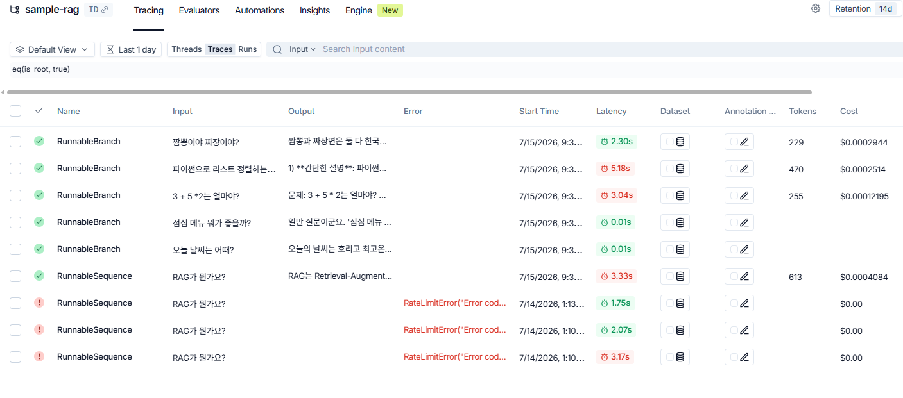

# Day 107_LangChain Agent-ReAct 개념부터 Tool Calling-멀티모달

## 📅 2026-07-15

---
# 🤖 LangChain Agent · ReAct(Reason + Act)

## 1. 에이전트(Agent)란?

**스스로 판단해서 필요한 Tool을 선택해 문제를 해결하는 LLM 기반 프로그램.**

흐름:

```
질문 확인 → 어떤 도구를 쓸지 결정 → 입력값 생성 → 도구 실행 → 결과 수신 → 최종 답변 생성
```

### 에이전트가 없으면?

LLM은 순수하게 `Input(질문) → LLM → Output(문장)` 구조로만 동작함. 즉:

- 계산 불가
- 실시간 검색 불가
- RAG 조합 불가
- 여러 도구를 순서대로 조합해서 쓰는 것 불가

그냥 "질문에 답만 하는 똑똑한 텍스트 생성기"에 머무름.

### 에이전트가 있으면?

아래 사이클을 반복 수행:

1. **Reasoning** — 지금 뭘 해야 하는지 생각
2. **Action** — 사용할 도구 선택
3. **Action Input** — 도구에 넘길 입력 생성
4. **Tool 실행**
5. **Observation** — 도구 결과 확인
6. 필요하면 1~5 반복
7. **최종 답변 생성**

사람이 문제를 풀 때의 사고 과정과 유사한 구조.

### 에이전트의 3대 구성 요소

|요소|설명|예시|
|---|---|---|
|LLM (두뇌)|판단과 답변 생성 담당|ChatOpenAI, ChatGoogleGenerativeAI, Claude, Llama 등|
|Tool (도구)|실제 작업 수행|계산기, 검색 엔진, RAG Retriever, DB 조회, 파일 읽기 등|
|ReAct Prompt|생각↔행동을 번갈아 하도록 유도하는 프롬프트 구조|—|

### 동작 예시

> 질문: "3 더하기 5 곱하기 2는 뭐야?"
> 
> - Thought: 곱셈 먼저 해야겠다 → Action: calculator → Input: `5*2` → Observation: `10`
> - Thought: 이제 3+10 계산 → Action: calculator → Input: `3+10` → Observation: `13`
> - Final Answer: 13

### 비유

에이전트 = 비서, Tool = 비서가 쓰는 도구들(계산기 / 검색 / 파일 읽기 / RAG / 코드 실행). 상황에 맞는 도구를 스스로 골라 씀.

### 활용 예

- 멀티 스텝 자동화 (검색 → 추출 → 요약 → 번역)
- DB 조회 후 이메일 작성
- 이미지 분석 → 요약 → 타 API 전달

---

## 2. ReAct(Reason + Act)란?

AI가 **생각(Reason)**하고 **행동(Act)**하는 것을 번갈아 반복하는 방식.

```
Thought(생각) → Action(도구 사용) → Observation(결과 확인)
→ 다시 Thought → ... → Final Answer(최종 답)
```

### 비유

요리사가 스테이크를 만들 때: "고기부터 구워야겠다"(생각) → 프라이팬 사용(행동) → 익었는지 확인(관찰) → "이제 간을 하자"(다음 생각) → 소금·후추 사용(행동). AI도 동일한 사이클로 동작.

### 왜 ReAct가 필요한가?

1. **LLM은 스스로 정확한 계산을 못 함** 예: `17823 * 3948` 같은 계산은 LLM이 종종 틀림 → "계산이 필요하다"고 판단(Thought) → 계산기 도구 호출(Action) → 결과 수신(Observation)
    
2. **LLM은 실시간 정보를 모름** 외부 API/DB/검색 엔진이 있어야 최신 정보 반영 가능 → Thought("검색이 필요하다") → Action(search_tool) → Observation(검색 결과)
    
3. **도구를 여러 번 반복 사용 가능** 중간 계산이 여러 단계 필요한 경우, 이전 Observation을 다음 Thought에 반영하며 순차적으로 처리(multi-step reasoning).
    

### 메시지 흐름 예시

```
system : 너는 도구를 사용할 수 있는 에이전트야
human  : 9,000 + 82 * 3 은?
ai     : Thought: 계산기가 필요하다.
ai     : Action: calculator
ai     : Action Input: "82 * 3"
tool   : Observation: "246"
ai     : Thought: 이제 9000 + 246 계산이 필요함.
ai     : Action: calculator
ai     : Action Input: "9000 + 246"
tool   : Observation: "9246"
ai     : Final Answer: 결과는 9246 입니다.
```

### 핵심 요소 정리

|단계|설명|
|---|---|
|Thought|지금 필요한 일이 뭔지 AI가 스스로 판단|
|Action|실제 수행할 도구 선택 (계산기, 검색기, DB 등)|
|Action Input|도구에 넣을 입력값|
|Observation|도구가 반환한 결과|
|Final Answer|모든 reasoning을 바탕으로 만든 최종 답|

### LangChain과의 관계

LangChain Agent는 ReAct 패턴을 그대로 구현한 엔진. 여러 Tool을 등록하면 → AI가 스스로 어떤 Tool을 쓸지 결정 → Action 실행 → Observation을 다시 반영 → Final Answer 생성까지 자동으로 처리해줌.

### ReAct 없이 Tool만 쓰면?

- 어떤 질문에 어떤 도구를 써야 할지 스스로 판단 못 함
- 도구를 연속으로 여러 번 쓰는 멀티스텝 reasoning 불가능
- 도구 출력(Observation)을 다음 판단에 반영 못 함
- 결과적으로 "에이전트"가 아니라 그냥 정해진 함수 호출기가 되어버림

→ ReAct는 "AI가 도구를 적절히 사용하는 능력" 자체를 구성하는 핵심 구조.

---

## 3. LangChain 기본 ReAct 프롬프트 분해

LangChain 내부 기본 ReAct 시스템 프롬프트 골격:

```
You are an agent designed to answer questions.
You have access to the following tools:

{tools}

To use a tool, use the following format:

Thought: think about what to do
Action: the action to take, should be one of [{tool_names}]
Action Input: the input to the action
Observation: the result of the action

When you have a final answer, respond with:

Thought: I now know the final answer
Final Answer: the final answer to the user's question
```

### 줄별 해석

|구성|역할|
|---|---|
|`You are an agent designed to answer questions.`|에이전트 역할 규정 — 단순 LLM이 아닌 "도구 사용 가능한 존재"로 정의. 이 문장이 없으면 LLM이 도구 없이 스스로 해결하려고 함|
|`You have access to the following tools: {tools}`|사용 가능한 도구 목록을 문자열로 주입 (예: `calculator: Useful for math.`). 도구 설명이 정확할수록 선택 정확도 ↑|
|`Thought / Action / Action Input / Observation` 형식|ReAct의 핵심 4단 구조. `Action`/`Action Input`을 LangChain이 패턴 매칭으로 감지해서 실제 Python 함수를 실행시킴|
|`Thought: I now know the final answer` + `Final Answer:`|종료 신호 + 사용자에게 전달될 최종 답변|

### 이 형식이 필요한 이유

1. **패턴 인식** — LangChain이 `Action: xxx` / `Action Input: yyy` 형식을 보고 어떤 도구를 어떤 입력으로 호출할지 기계적으로 파싱함. 형식이 없으면 LangChain이 도구 호출 의도를 감지할 수 없음.
2. **기억 역할** — Thought/Observation이 이어지지 않으면 ReAct 사이클 자체가 성립하지 않음(직전 결과를 다음 판단에 반영해야 하므로).
3. **멀티스텝 지원** — 한 번의 도구 호출로 끝나지 않고, `Thought → Action → Observation`을 여러 차례 반복할 수 있는 구조.

### 실제 채워지는 예시

```
system : 너는 질문에 따라 math_helper, code_helper, general_helper 를 사용할 수 있다...
human  : "3 더하기 5 곱하기 2"
ai     : Thought: 계산이 필요하다.
ai     : Action: math_helper
ai     : Action Input: "3 더하기 5 곱하기 2는 얼마인가?"
tool   : Observation: "정답은 13입니다"
ai     : Thought: 이제 답을 정리하면 되겠다.
ai     : Final Answer: 3 더하기 5 곱하기 2는 13입니다.
```

---

---

## 4. ReAct Agent의 공식 실행 시퀀스

실제 코드 레벨에서 ReAct Agent가 하나의 요청을 처리할 때 거치는 전체 흐름:

```
User Input
    │
    ▼
ChatPromptTemplate           # 시스템 프롬프트 + tools 목록 + 사용자 입력을 하나의 프롬프트로 조합
    │
    ▼
LLM (Reasoning Brain)        # LLM이 프롬프트를 보고 Thought 생성
    │ Thought
    ▼
Action + Action Input        # LLM 출력에서 "어떤 도구를 / 어떤 입력으로 쓸지" 파싱
    │
    ▼
Tool 실행 (Python 함수)       # LangChain이 실제 Python 함수(도구)를 호출
    │
    ▼
Observation (결과)           # Tool 실행 결과를 다시 프롬프트 컨텍스트에 삽입
    │
    ▼
LLM (후속 Thought)           # Observation을 반영해 다음 판단 — 도구 재호출 or 답변 확정
    │
    ▼
Final Answer                 # "이제 답을 알았다" 판단 시 최종 답변 생성
    │
    ▼
User에게 응답
```

**포인트**

- `LLM (Reasoning Brain)` → `LLM (후속 Thought)` 사이의 루프가 바로 앞서 설명한 ReAct의 `Thought → Action → Observation` 반복 구간. 도구가 여러 번 필요하면 이 루프가 여러 번 돎.
- `ChatPromptTemplate`이 매 스텝마다 지금까지의 Thought/Action/Observation 히스토리를 프롬프트에 누적해서 LLM에게 다시 넣어주기 때문에, LLM은 "이전에 어떤 도구를 써서 뭘 얻었는지"를 기억하는 것처럼 동작함.
- 이 전체 사이클을 사람이 직접 구현하지 않고 LangChain의 Agent Executor가 자동으로 반복 실행해줌.

## 핵심 요약

- **ReAct** = "LLM에게 도구를 쓰는 법을 알려주는 프로토콜". 프롬프트로 강제하지 않으면 LLM이 이 패턴을 제대로 지키지 않는 경우가 많음.
- ReAct는 Agent에게 사고 과정("뇌")을 부여하는 구조: `생각 → 행동 → 결과 확인 → 다시 생각 → 최종 답변`.
- **LangChain Agent = ReAct 엔진 + Tool 실행기** — LLM이 만든 Action을 실제로 실행하고, Observation을 다시 LLM에게 넘겨 다음 reasoning을 이어가게 함.

---
# 📄 lang5.ipynb — LCEL · RunnableBranch · Chroma RAG

## 개요

LCEL(LangChain Expression Language)로 RAG 체인과 조건 분기 체인을 구성하는 실습. 문서 검색 기반 RAG 파이프라인과, 질문 유형에 따라 다른 체인으로 흘려보내는 `RunnableBranch` 두 가지를 다룸.

---

## 1. 환경 설정

```python
from langchain_openai import ChatOpenAI, OpenAIEmbeddings
from langchain_core.prompts import PromptTemplate, ChatPromptTemplate
from langchain_core.output_parsers import StrOutputParser
from langchain_core.runnables import RunnablePassthrough, RunnableLambda
from langchain_core.documents import Document
from langchain_community.embeddings import HuggingFaceEmbeddings
from langchain_chroma import Chroma
from langchain_text_splitters import CharacterTextSplitter

load_dotenv()  # .env에서 OPENAI_API_KEY 로드

llm = ChatOpenAI(model="gpt-4.1-mini", temperature=0.5)

# 임베딩은 OpenAI 대신 무료 로컬 모델(HuggingFace) 사용 → 비용 절감
embedding_model = HuggingFaceEmbeddings(model_name="sentence-transformers/all-MiniLM-L6-v2")
```

- `ChatOpenAI`: 답변 생성용 LLM
- `HuggingFaceEmbeddings`: 문서 임베딩(벡터화) 전용 — 채팅용 LLM과 역할이 다름. 임베딩은 로컬/무료 모델을 쓰고 생성은 OpenAI를 쓰는 조합이 비용 면에서 흔한 패턴.

---

## 2. 문서 분할 + ChromaDB 저장 (Retriever 준비)

```python
docs = [
    Document(page_content="랭체인(LangChain)은 ..."),
    Document(page_content="RAG는 Retrieval-Augmented Generation의 약자로 ..."),
]

# 긴 문서를 작은 조각(chunk)으로 분리 — RAG에서 권장되는 전처리
text_splitter = CharacterTextSplitter(
    chunk_size=200,      # 조각 하나의 최대 글자 수
    chunk_overlap=20,    # 조각끼리 겹치는 글자 수(문맥 끊김 방지)
    separator="\n\n"
)
split_docs = text_splitter.split_documents(docs)

# 분할된 문서를 임베딩하여 ChromaDB(벡터 DB)에 저장
db = Chroma.from_documents(
    documents=split_docs,
    embedding=embedding_model,
    # persist_directory="./mydb",   # 지정 시 디스크에 영구 저장, 생략하면 메모리에만 존재
)

# Retriever : 사용자 질문과 의미적으로 유사한 문서를 DB에서 검색해오는 객체
retriever = db.as_retriever()
```

**출력 결과**

```
분할된 문서 수 :  2
첫 분할된 문서 :  랭체인(LangChain)은 해리슨 체이스(Harrison Chase)에 의해 2022년 10월에 오픈 소스 프로젝트로 시작되었습니다. ...
```

문서 2개가 각각 200자 이하라 분할이 더 일어나지 않고 그대로 2개로 유지됨.

**chunk_overlap을 두는 이유**: 분할 경계에서 문장이 잘려 맥락이 끊기는 걸 막기 위해 앞뒤 조각이 일부 겹치게 함.

**persist_directory를 주석 처리한 이유**: 실습이라 세션이 끝나면 DB를 버려도 되므로 인메모리로만 사용. 실제 서비스라면 경로를 지정해 영구 저장.

---

## 3. RAG 체인 구성 (LCEL)

```python
prompt_template = PromptTemplate(
    input_variables=["context", "question"],
    template="""
        너는 친절하고 똑똑한 AI 어시스턴트야,
        아래 문서 내용을 참고해서 사용자의 질문에 답해 줘,
        문서 내용이 불충분한 경우에는 '문서에 해당 정보가 없어요'라고 답변해.

        문서 내용:
        {context}

        질문:
        {question}

        답변은 5행 정도의 분량이면 좋겠어.
    """
)

def format_docs(docs):
    # retriever가 반환한 Document 리스트를 하나의 문자열로 합침 (프롬프트에 그대로 넣기 위함)
    return "\n\n".join(doc.page_content for doc in docs)

rag_chain = (
    {
        # "context" 키 : 질문 -> retriever가 유사 문서 검색 -> format_docs로 문자열화
        "context": retriever | RunnableLambda(format_docs),
        # "question" 키 : 원본 질문을 가공 없이 그대로 전달
        "question": RunnablePassthrough()
    }
    | prompt_template   # 위 딕셔너리를 {context}, {question}에 매핑해서 프롬프트 완성
    | llm                # 완성된 프롬프트로 LLM 호출
    | StrOutputParser()  # AIMessage → 순수 문자열 텍스트로 변환
)

query = "RAG가 뭔가요?"
result = rag_chain.invoke(query)
```

**출력 결과**

```
질문: RAG가 뭔가요?
답변: RAG는 Retrieval-Augmented Generation의 약자로, 정보 검색과 생성 모델을 결합한 자연어 처리 기술입니다.
먼저 데이터베이스나 문서에서 관련 정보를 검색한 후, 그 정보를 바탕으로 텍스트를 생성합니다.
이를 통해 대규모 언어 모델(LLM)의 한계를 보완하고 더 정확하고 효율적인 답변을 제공합니다.
또한 최신 정보 반영, 모델 크기 감소, 맥락 유지, 데이터 편향 완화 등의 이점이 있습니다.
다양한 응용 분야에서 활용되어 정보 검색의 정확성과 텍스트 생성의 자연스러움을 크게 향상시킵니다.
```

프롬프트에서 요청한 "5행 정도" 분량 그대로 답변이 나온 것을 확인할 수 있음 — 검색된 문서(context) 내용을 그대로 재구성해서 답한 것.

**RAG 파이프라인 흐름**: 질문 → (검색) 관련 문서 찾기 → (포맷) 문자열로 정리 → (프롬프트) 문서+질문 삽입 → (LLM) 답변 생성 → (파서) 텍스트만 추출.

**딕셔너리 형태의 첫 단계가 핵심**: LCEL에서 `{"a": chainA, "b": chainB}` 형태로 쓰면 같은 입력이 각 체인에 병렬로 들어가고, 결과가 `{"a": ..., "b": ...}` 딕셔너리로 합쳐져 다음 단계(`prompt_template`)로 전달됨. `retriever`는 문서만 검색하고 질문 자체는 모르기 때문에, `RunnablePassthrough()`로 원본 질문을 그대로 "question" 자리에 흘려보내주는 것.

---

## 4. RunnableBranch — 조건 분기 (기본형)

```python
from langchain_core.runnables import RunnableBranch

def is_weather_question(text: str) -> bool:
    return "날씨" in text.lower()

weather_chain = RunnableLambda(lambda x: "오늘의 날씨는 흐리고 최고온도는 32도입니다.")
basic_general_chain = RunnableLambda(lambda x: f"일반 질문이군요. '{x}에 대해 설명할게요'")

basic_branch_chain = RunnableBranch(
    (is_weather_question, weather_chain),   # 조건 함수가 True면 이 체인 실행
    basic_general_chain                      # 앞의 모든 조건이 False일 때의 기본(default) 체인
)
```

`RunnableBranch(조건1, 체인1, 조건2, 체인2, ..., 기본체인)` 형태로, 위에서부터 조건을 검사해 처음 True가 나오는 체인을 실행하고, 전부 False면 마지막 인자(기본 체인)를 실행. if-elif-else와 동일한 구조.

**출력 결과**

```python
print(basic_branch_chain.invoke("오늘 날씨는 어때?"))
# 오늘의 날씨는 흐리고 최고온도는 32도입니다.

print(basic_branch_chain.invoke("점심 메뉴 뭐가 좋을까?"))
# 일반 질문이군요. '점심 메뉴 뭐가 좋을까?에 대해 설명할게요'
```

"날씨"가 포함된 첫 질문은 `weather_chain`으로, 포함되지 않은 두 번째 질문은 기본 체인인 `basic_general_chain`으로 분기됨.

---

## 5. RunnableBranch — LLM 모델별 분기 (실전형)

```python
llm2 = ChatOpenAI(model="gpt-4o-mini", temperature=0.0)  # 수학/코드처럼 '정확성'이 중요한 답변용 (temperature=0)

def make_math_prompt(question: str) -> str:
    return (
        "당신은 수학 풀이를 잘하는 전문가야.\n"
        "아래 수학 문제를 단계별로 풀고 과정도 적어 줘, 마지막 줄에 정답만 한 번 더 적어 줘.\n\n"
        f"문제 : {question}\n\n"
        "풀이:"
    )

def make_code_prompt(question: str) -> str:
    return (
        "당신은 프로그래머 강사야.\n"
        "아래 요청에 대해 1) 간단한 설명 2)예제 코드 3) 중요 포인트 순서대로 말해줘.\n\n"
        f"요청 : {question}\n\n"
        "풀이:"
    )

def make_general_prompt(question: str) -> str:
    return (
        "당신은 친절한 AI 설명가야.\n"
        "아래 질문에 대해 초보자도 이해할 수 있도록 5문장 정도로 답을 줘.\n\n"
        f"문제 : {question}\n\n"
        "답변:"
    )

# 체인 구성 : 질문 -> 프롬프트 생성(문자열 가공) -> LLM 호출 -> 텍스트 추출
math_chain = RunnableLambda(make_math_prompt) | llm2 | StrOutputParser()
code_chain = RunnableLambda(make_code_prompt) | llm2 | StrOutputParser()
general_chain = RunnableLambda(make_general_prompt) | llm | StrOutputParser()  # 일반 질문은 llm(temperature=0.5) 사용

def is_math_question(text: str) -> bool:
    t = text.replace(" ", "").lower()  # 공백 제거 후 검사 (띄어쓰기 차이로 키워드를 놓치지 않기 위함)
    math_keywords = ["더하기","빼기","곱하기","나누기","계산","합","차","곱","나눈값","몇","얼마"]
    math_symbols = ["+", "-", "*", "/", "^"]
    return any(k in t for k in math_keywords) or any(s in t for s in math_symbols)

def is_code_question(text: str) -> bool:
    t = text.lower()
    code_keywords = ["코드","함수","클래스","메소드","알고리즘","python","파이썬","java","자바"]
    return any(k in t for k in code_keywords)

branch_chain = RunnableBranch(
    (is_math_question, math_chain),   # 수학 키워드/기호 포함 시
    (is_code_question, code_chain),   # 코딩 키워드 포함 시
    general_chain                      # 둘 다 아니면 일반 질문으로 처리
)

questions = [
    "3 + 5 *2는 얼마야?",
    "파이썬으로 리스트 정렬하는 코드 만들어 줘",
    "짬뽕이야 짜장이야?"
]
for q in questions:
    result = branch_chain.invoke(q)
```

**설계 포인트**

- 분기 순서가 중요함: 수학 조건을 코딩 조건보다 먼저 검사. 만약 순서를 바꾸면 `"파이썬으로 3+5 계산해줘"` 같은 질문이 코드 쪽으로 먼저 걸릴 수 있음.
- `llm2(temperature=0.0)`을 수학/코드처럼 정답이 명확한 영역에, `llm(temperature=0.5)`을 일반 대화처럼 다양성이 필요한 영역에 나눠 쓴 것 — 온도값을 질문 성격에 맞게 다르게 설정하는 패턴.
- 각 `make_*_prompt` 함수는 문자열만 만들고, `RunnableLambda`로 감싸야 LCEL 체인(`|`)에 연결 가능.

**출력 결과**

```
질문: 3 + 5 *2는 얼마야?
결과: 문제: 3 + 5 * 2는 얼마야?

풀이:
1. 연산 순서 확인 → 곱셈이 덧셈보다 우선
2. 5 * 2 = 10
3. 3 + 10 = 13

정답: 13
```

→ 숫자/기호(`+`, `*`)가 포함되어 `is_math_question`이 True가 되면서 `math_chain`으로 분기됨.

```
질문: 파이썬으로 리스트 정렬하는 코드 만들어 줘
결과:
1) 간단한 설명: sort() 메서드는 리스트 자체를 정렬, sorted() 함수는 정렬된 새 리스트를 반환
2) 예제 코드:
   numbers = [5, 2, 9, 1, 5, 6]
   numbers.sort()              # 오름차순
   numbers.sort(reverse=True)  # 내림차순
   sorted_numbers = sorted(numbers)
3) 중요 포인트: sort()는 원본을 직접 수정(반환값 None), sorted()는 원본 유지하고 새 리스트 반환
```

→ "파이썬" 키워드로 `is_code_question`이 True가 되어 `code_chain`으로 분기됨. `make_code_prompt`에서 지시한 "1) 설명 2) 예제 3) 포인트" 형식 그대로 답변이 구성된 것을 확인 가능.

```
질문: 짬뽕이야 짜장이야?
결과: 짬뽕과 짜장면은 둘 다 한국에서 인기 있는 중국 요리입니다. 짬뽕은 매운 해물 국물에 면을 넣어
만든 음식이고, 짜장면은 검은 콩 소스(짜장)를 사용한 달콤하고 짭짤한 면 요리입니다. ...
```

→ 수학/코드 키워드에 모두 해당하지 않아 기본 체인인 `general_chain`으로 분기됨.

---

## 6. LangSmith 트레이싱 대시보드



LangSmith는 LangChain 체인 실행을 기록·시각화해주는 관측(observability) 도구. 코드에 `import langsmith`만 해두고 환경변수(`LANGCHAIN_TRACING_V2`, `LANGCHAIN_API_KEY` 등)를 설정해두면, 체인을 실행할 때마다 자동으로 대시보드에 트레이스가 쌓임.

캡처된 화면(`sample-rag` 프로젝트, Tracing 탭)에서 확인할 수 있는 것들:

- **Name 열**: 실행된 Runnable의 종류. `RunnableBranch`로 실행된 것과 `RunnableSequence`(체인을 `|`로 연결한 것)로 실행된 것이 구분되어 표시됨.
- **Input / Output**: 실제로 들어간 질문과 나온 답변 원문.
- **Error 열**: 실패한 호출은 빨간색으로 에러 메시지가 표시됨 — 캡처 하단의 `RateLimitError`는 OpenAI API 요청 한도 초과로 실패한 케이스.
- **Latency**: 체인 하나가 끝나기까지 걸린 시간(초). `RunnableBranch`가 즉시 로컬 함수로 처리된 날씨/일반 질문은 0.01s로 매우 빠르고, 실제 LLM을 호출한 케이스는 2~5초대.
- **Tokens / Cost**: 호출당 사용된 토큰 수와 비용(USD). 로컬 람다만 실행된 분기는 LLM을 호출하지 않으므로 토큰·비용이 비어 있음.

이 화면을 통해 "어떤 질문이 어느 체인으로 분기됐는지", "어디서 얼마나 시간/비용이 드는지", "어떤 호출이 실패했는지"를 코드 수정 없이 바로 확인할 수 있음 — 특히 `RunnableBranch`처럼 조건에 따라 실행 경로가 갈리는 구조를 디버깅할 때 유용함.

---

## 핵심 정리

|구성 요소|역할|
|---|---|
|`CharacterTextSplitter`|긴 문서를 chunk 단위로 분할|
|`Chroma`|임베딩된 문서를 저장하는 벡터 DB|
|`retriever`|질문과 유사한 문서를 벡터 DB에서 검색|
|`RunnablePassthrough`|입력값을 가공 없이 다음 단계로 그대로 전달|
|`RunnableLambda`|일반 파이썬 함수를 LCEL 체인에 연결 가능한 형태로 감쌈|
|`RunnableBranch`|조건 함수 결과에 따라 서로 다른 체인으로 분기 (if-elif-else 구조)|
|`StrOutputParser`|LLM의 `AIMessage` 응답에서 텍스트(`content`)만 추출|
|LangSmith|체인 실행을 자동 기록·시각화하는 트레이싱 도구|

---
# 📄 lang6react.ipynb — Agent · Tool Calling · ReAct

## 개요

ReAct(Reasoning + Acting) 패턴을 적용한 Tool Calling Agent 실습. 이전 실습(RunnableBranch)은 규칙 기반으로 분기했다면, 이번엔 **LLM 스스로가** 질문을 보고 어떤 툴을 쓸지 판단하고, 툴 실행 결과를 참고해서 최종 답변까지 정리하는 구조.

```
사용자 질문 → Agent가 판단(Reasoning) → 적절한 Tool 선택(Acting) →
             툴 안에서 LLM이 답변 생성 → Agent가 최종 답변으로 재정리
```

---

## 1. 환경 설정

```python
from langchain_openai import ChatOpenAI, OpenAIEmbeddings
from langchain_core.prompts import PromptTemplate, ChatPromptTemplate, MessagesPlaceholder
from langchain_core.output_parsers import StrOutputParser
from langchain.tools import tool    # 함수를 랭체인 툴로 래핑하기 위한 장식자(decorator)
from langchain_classic.agents import create_tool_calling_agent, AgentExecutor

load_dotenv()

api_key = os.getenv("OPENAI_API_KEY")
if not api_key:
  raise RuntimeError("OPENAI_API_KEY가 없어요")

llm = ChatOpenAI(model="gpt-4.1-mini", temperature=0.5)
```

- `@tool`: 일반 파이썬 함수를 Agent가 호출할 수 있는 "툴"로 등록하는 데코레이터
- `create_tool_calling_agent`: LLM이 함수 호출(tool calling) 기능을 이용해 스스로 툴을 선택하도록 만드는 Agent 생성 함수
- `AgentExecutor`: 만들어진 Agent를 실제로 반복 실행(Reasoning → Acting → Observation 루프)하는 실행기

---

## 2. LLM 호출 + 응답 정리 헬퍼

```python
# LLM이 생성한 문자열 정리용
def clean_answer(t: str) -> str:
  t = str(t).strip()

  # 전체 문자열이 정확히 두 번 반복된 패턴인지 검사 (LLM이 답변을 중복 생성하는 경우 대비)
  if len(t) % 2 == 0 and t[:len(t) // 2] == t[len(t) // 2:]:
    t = t[:len(t) // 2].strip()   # 절반으로 나눠 앞 절반만 취함

  # 문단 단위 중복 제거 : "\n\n" 기준으로 문단을 나눠서 이미 등장한 문단은 건너뜀
  out, seen = [], set()
  for p in t.split("\n\n"):
    p = p.strip()
    if p and p not in seen:
      seen.add(p)
      out.append(p)

  merged = " ".join(out)
  cleaned = merged.replace("**", "").replace("*", "")   # 마크다운 강조 기호 제거
  return cleaned.strip()

# 프롬프트를 받아 LLM을 호출하고, 결과 문자열을 정리해서 반환
def run_llm(prompt: str) -> str:
  resp = llm.invoke(prompt)
  return clean_answer(getattr(resp, "content", resp))   # AIMessage면 .content, 아니면 그대로
```

**왜 이런 정리 로직이 필요한가**: LLM이 가끔 같은 답변을 통째로 두 번 반복하거나, 비슷한 문단을 중복 생성하는 경우가 있어서 후처리로 걸러줌. `getattr(resp, "content", resp)`는 `resp`가 `AIMessage` 객체면 `.content`를 꺼내고, 이미 문자열이면 그대로 두는 방어적 코드.

---

## 3. 툴(Tool) 정의

```python
@tool   # 이 함수를 랭체인 툴로 등록 — docstring이 Agent가 "이 툴이 뭐하는 툴인지" 판단하는 설명으로 쓰임
def math_helper(question: str) -> str:
  """
  수학문제 풀기 도우미
  """
  prompt = (
      "너는 수학 풀이를 잘하는 모범생이야.\n"
      "아래 수학 문제를 단계별로 풀고 마지막 줄에 정확하게 정답을 적어 줘.\n\n"
      f"문제:{question}\n"
      "풀이:"
  )
  return run_llm(prompt)

@tool
def code_helper(question: str) -> str:
  """
  코딩 소스 작성 도우미
  """
  prompt = (
      "너는 10년 이상 경력을 가진 전문 프로그래머야.\n"
      "아래 요청에 대해 1)간단한 설명 2) 예제 코드 3) 가장 중요한 설명 순서로 답해 줘.\n\n"
      f"문제:{question}\n"
      "답변:"
  )
  return run_llm(prompt)

@tool
def general_helper(question: str) -> str:
  """
  일반 개념/이론을 이해하기 쉽게 5문장 이내로 설명하는 도우미
  """
  prompt = (
      "너는 친절한 AI 도우미야.\n"
      "아래 질문에 대해 5문장 이내로 답해 줘.\n\n"
      f"요청:{question}\n"
      "답변:"
  )
  return run_llm(prompt)

tools = [math_helper, code_helper, general_helper]    # Agent에게 넘겨줄 툴 목록
```

**@tool의 docstring이 중요한 이유**: `create_tool_calling_agent`는 각 툴의 이름과 docstring을 LLM에게 함수 스펙(JSON Schema)으로 전달함. LLM은 이 설명만 보고 "이 질문엔 어떤 툴이 맞겠다"를 판단하므로, docstring이 부실하면 Agent가 엉뚱한 툴을 고를 수 있음.

이전 RunnableBranch 실습과의 차이: 그때는 `is_math_question()`처럼 키워드/기호를 직접 검사하는 **규칙 기반** 분기였다면, 여기선 시스템 프롬프트에 규칙을 적어주긴 하지만 최종적으로 **LLM이 함수 호출 스펙을 보고 스스로 판단**해서 툴을 고름 (tool calling).

---

## 4. Agent 구성

```python
prompt = ChatPromptTemplate.from_messages(    # Agent용 전체 프롬프트 템플릿 정의
    [
        (
            "system",   # Agent 역할, 툴 사용 규칙
            "너는 사용자의 질문을 보고 적절한 툴을 선택하는 에이전트야.\n"
            " - 수식, 계산, 사칙연산, +, -, *, / 등이 보이면 math_helper를 사용해.\n"
            " - 함수, 클래스, 프로그램, 파이썬/python/자바/java 등이 보이면 code_helper를 사용해.\n"
            " - 그 외에 일반적인 질문인 경우에는 general_helper를 사용해.\n"
            "하지만 툴에서 반환된 텍스트를 그대로 복사해서 출력하지 말고,"
            "툴의 내용을 참고해 최종 답변을 한국어로 깔끔하게 작성해.\n"
        ),
        # 이전 대화 히스토리를 넣기 위한 자리 정의(대화의 연속성과 문맥 유지가 목적)
        # 예) 사람: 홍길동 학생의 출석을 알려 줘. AI: 홍길동의 출석률은 95%야
        #     사람: 그러면 수료가능해?   <== 예만 보면 누구에 대한 질문인지 모름. 그래서 이전 대화내용이 필요
        MessagesPlaceholder(variable_name="chat_history"),
        ("human", "{input}"),   # 현재 사용자가 입력한 질문이 들어가는 자리

        # Agent가 툴 호출 등 중간 과정을 쌓는 내부 메모장(Agent가 스스로 결정을 내릴 때 사용)
        # 툴 호출 기록 : Agent 내부에서 reasoning → action(tool 호출) → observation 반복 과정을 저장
        MessagesPlaceholder(variable_name="agent_scratchpad")
    ]
)

agent = create_tool_calling_agent(  # LLM + Tools + Prompt 연결
    # 사용자 질문을 보고, 어떤 툴을 사용할지 판단하고, 최종 답변을 만들 계획을 세움
    llm=llm,
    tools=tools,
    prompt=prompt,
)

agent_executor = AgentExecutor(   # Agent를 실제로 실행하는 관리자
    agent=agent,
    tools=tools,
    verbose=False   # True로 하면 내부 reasoning/tool 호출 과정이 콘솔에 그대로 출력됨
)
```

**agent와 agent_executor의 역할 분리**: `agent`는 "다음에 뭘 할지 결정하는 두뇌"고, `agent_executor`는 그 결정을 실제로 반복 실행(툴 호출 → 결과 관찰 → 다시 판단 → ... → 최종 답변)하는 루프를 관리함. `agent` 혼자서는 실행되지 않고, 반드시 `AgentExecutor`에 감싸져야 동작.

---

## 5. 실행 테스트 (멀티턴 대화)

```python
chat_history = []   # 대화 히스토리 저장용

def askFunc(q: str):
  print("\n질문 : ", q)
  result = agent_executor.invoke(
      {
          "input": q,             # prompt 템플릿의 {input}에 매핑
          "chat_history": chat_history   # 이전 턴들의 대화 히스토리
      }
  )
  print("최종 답변:", result['output'])
  chat_history.append(("human", q))               # 히스토리에 사용자 질문 추가
  chat_history.append(("ai", result['output']))   # 히스토리에 AI 답변 추가

q1 = "1에서 10까지의 정수에 대한 더하기는 얼마인가?"
askFunc(q1)
q2 = "위의 내용을 파이썬으로 작성하고, 평균도 구하는 코드를 만들어"
askFunc(q2)
q3 = "위에서 본 코드와 관련있는 대표값을 설명해 줘"
askFunc(q3)
```

**출력 결과**

```
질문 :  1에서 10까지의 정수에 대한 더하기는 얼마인가?
최종 답변: 1부터 10까지의 정수를 모두 더하면 55입니다. 이는 등차수열의 합 공식
S = n(a1 + an)/2를 이용해 계산한 결과입니다. 여기서 항의 개수 n은 10, 첫째 항 a1은 1,
마지막 항 an은 10입니다. 따라서 10*(1+10)/2 = 55가 됩니다.

질문 :  위의 내용을 파이썬으로 작성하고, 평균도 구하는 코드를 만들어
최종 답변: 아래는 1부터 10까지 정수의 합과 평균을 구하는 파이썬 코드입니다:

numbers = range(1, 11)          # 1부터 10까지 숫자 생성
total = sum(numbers)             # 합 계산
average = total / len(numbers)   # 평균 계산

print("합:", total)
print("평균:", average)

이 코드는 sum() 함수를 사용해 숫자들의 합을 구하고, len() 함수로 숫자의 개수를 세어
평균을 계산합니다.

질문 :  위에서 본 코드와 관련있는 대표값을 설명해 줘
최종 답변: 평균은 모든 값의 합을 값의 개수로 나눈 값으로, 데이터의 중심 경향을 나타냅니다.
중앙값은 데이터를 크기 순서로 정렬했을 때 가운데 위치한 값으로, 극단값의 영향을 덜 받습니다.
최빈값은 데이터에서 가장 자주 나타나는 값입니다. 평균은 전체적인 경향을 보여주고, 중앙값은
데이터의 중간 위치를 나타내며, 최빈값은 가장 빈번한 값을 의미합니다. 이 세 가지 대표값은
데이터 분포를 이해하는 데 각각 다른 관점을 제공합니다.
```

**턴별로 어떤 일이 일어났는지**

|턴|질문|선택된 툴(추정)|chat_history 활용|
|---|---|---|---|
|q1|"1~10 더하기"|`math_helper` — 계산 키워드|없음(첫 턴)|
|q2|"위의 내용을 파이썬으로..."|`code_helper` — "파이썬" 키워드|"위의 내용" = q1의 1~10 합 문제라는 걸 chat_history로 이해|
|q3|"위에서 본 코드와 관련있는 대표값"|`general_helper` — 개념 설명 요청|"위에서 본 코드" = q2의 평균 계산 코드라는 걸 이해하고, 평균/중앙값/최빈값(대표값)으로 자연스럽게 확장 답변|

q2, q3에서 "위의", "위에서 본"처럼 이전 턴을 지시하는 표현에도 답이 정확히 이어지는 게 핵심 — `MessagesPlaceholder(variable_name="chat_history")`로 이전 대화가 프롬프트에 주입되기 때문에 가능한 결과.

---

## 핵심 정리

|구성 요소|역할|
|---|---|
|`@tool`|일반 함수를 Agent가 호출 가능한 툴로 등록하는 데코레이터|
|docstring|툴 설명 — LLM이 어떤 툴을 쓸지 판단하는 근거가 됨|
|`ChatPromptTemplate`|system/chat_history/human/agent_scratchpad로 구성된 Agent 프롬프트|
|`MessagesPlaceholder("chat_history")`|이전 대화 기록을 프롬프트에 주입(대화 연속성)|
|`MessagesPlaceholder("agent_scratchpad")`|Agent의 tool 호출 + observation 반복 기록을 담는 내부 메모장|
|`create_tool_calling_agent`|LLM + tools + prompt를 연결해 "무엇을 할지 판단하는" Agent 생성|
|`AgentExecutor`|Agent의 판단을 실제로 반복 실행하는 관리자(reasoning-action-observation 루프)|
|ReAct 패턴|Reasoning(판단) + Acting(툴 실행)을 반복하며 최종 답변에 도달하는 구조|

---
# 📄 lang7react.ipynb — Agent · Multi-Tool · verbose 로그

## 개요

이전 실습(math/code/general 3툴)과 같은 Tool Calling Agent 구조지만, 이번엔 **"라이프스타일 추천 에이전트"** 시나리오로 도메인을 바꾼 버전. 그리고 `AgentExecutor(verbose=True)`로 실행해서 Agent가 실제로 어떤 툴을 어떤 인자로 호출하는지 로그로 직접 확인하는 게 핵심 포인트.

```
운동 관련 질문      → workout_planner
식단/간식 관련 질문  → meal_planner
피곤/휴식 관련 질문  → relax_planner
```

---

## 1. 환경 설정

```python
from langchain_openai import ChatOpenAI
from langchain.tools import tool
from langchain_classic.agents import create_tool_calling_agent, AgentExecutor
from langchain_core.prompts import ChatPromptTemplate, MessagesPlaceholder
# MessagesPlaceholder: 프롬프트 안에 "나중에 메시지 목록이 들어갈 자리"를 만들어주는 객체
# 동적인 메시지 목록(대화 히스토리 등)을 넣기 위함

load_dotenv()

llm = ChatOpenAI(model="gpt-4.1-mini", temperature=0.4)
```

---

## 2. Tool 3개 정의 — 하드코딩 응답 방식

```python
@tool
def workout_planner(request: str) -> str:
    """
    가벼운 운동 루틴을 추천해 주는 도우미.
    예: '아침에 20분만 운동하고 싶어', '주 3회 운동 추천'
    """
    # 여기선 하드코딩 예시지만, 실제로는 DB, API 등 사용 가능
    base = [
        "- 5분: 가벼운 스트레칭",
        "- 10분: 스쿼트, 런지, 푸쉬업을 번갈아가며 30초씩 3세트",
        "- 5분: 마무리 스트레칭",
    ]
    plan = "\n".join(base)
    return (
        f"요청: {request}\n\n"
        "다음과 같은 간단한 루틴을 추천합니다:\n"
        f"{plan}\n\n"
        "본인 체력에 맞게 횟수와 세트 수를 조절하세요."
    )

@tool
def meal_planner(request: str) -> str:
    """
    가벼운 식단/간식 아이디어를 추천해 주는 도우미.
    예: '저녁에 너무 무겁지 않게 먹고 싶어', '공부할 때 먹을 간식 추천'
    """
    ideas = [
        "- 현미밥 + 닭가슴살 + 데친 야채",
        "- 두부 샐러드와 방울토마토",
        "- 아몬드 한 줌과 플레인 요거트",
    ]
    text = "\n".join(ideas)
    return (
        f"요청: {request}\n\n"
        "다음과 같은 가벼운 식단/간식을 고려해 볼 수 있습니다:\n"
        f"{text}\n\n"
        "물은 충분히 마시고, 너무 늦은 시간에는 과식을 피하세요."
    )

@tool
def relax_planner(request: str) -> str:
    """
    휴식, 취미, 짧은 회복 활동을 추천하는 도우미.
    예: '퇴근 후 1시간 정도 쉴만한 활동', '눈과 머리가 피곤할 때'
    """
    tips = [
        "- 10~15분 정도 가볍게 산책하기",
        "- 눈을 감고 5분간 깊게 복식호흡하기",
        "- 짧은 독서(만화, 에세이 등 가벼운 책) 20~30분",
        "- 스마트폰은 멀리 두고 스트레칭하기",
    ]
    text = "\n".join(tips)
    return (
        f"요청: {request}\n\n"
        "다음과 같은 휴식 활동을 추천합니다:\n"
        f"{text}\n\n"
        "너무 완벽하게 시간을 채우려고 하기보다, 부담 없이 할 수 있는 것을 고르는 것이 좋습니다."
    )

tools = [workout_planner, meal_planner, relax_planner]
```

**이전 실습(math/code/general)과의 차이**: 이전엔 `run_llm()`으로 툴 안에서 다시 LLM을 호출했다면, 여기선 툴이 **하드코딩된 텍스트**만 반환함. 실제 서비스에서는 이 자리에 DB 조회나 외부 API 호출을 넣을 수 있다는 걸 보여주는 설계 — 툴은 꼭 LLM을 호출할 필요 없이 "정보를 가져오는 역할"만 해도 됨.

---

## 3. Agent 프롬프트 — 출력 형식까지 지정

```python
prompt = ChatPromptTemplate.from_messages(
    [
        (
            "system",
            (
                "너는 사용자의 하루 생활을 도와주는 '라이프스타일 코치' 에이전트이다.\n"
                "아래 규칙에 따라 적절한 Tool을 최대 1개까지 선택해서 사용해라.\n\n"
                "- 운동/헬스/운동 루틴/운동 계획 같은 말이 보이면 workout_planner를 사용해.\n"
                "- 식단/간식/뭐 먹지/저녁/아침/다이어트 같은 말이 보이면 meal_planner를 사용해.\n"
                "- 피곤/휴식/쉬고 싶다/스트레스/퇴근 후/집에서 할만한 것 같은 말이 보이면 relax_planner를 사용해.\n"
                "- 어느 쪽도 애매하면 Tool을 사용하지 말고, 네가 알고 있는 일반 상식으로 답해도 된다.\n\n"
                "Tool에서 반환된 텍스트는 참고자료일 뿐이다.\n"
                "최종 답변에서는:\n"
                "1) 사용자의 상황을 한두 문장으로 요약하고,\n"
                "2) 구체적인 제안 3~5개를 bullet 형태로 정리하고,\n"
                "3) 마지막에 한 문장 정도의 응원 메시지를 한국어로 덧붙여.\n"
            ),
        ),
        MessagesPlaceholder(variable_name="chat_history"),
        ("human", "{input}"),
        # ReAct 패턴에서 Tool 호출/Observation 로그가 들어가는 자리
        MessagesPlaceholder(variable_name="agent_scratchpad"),
    ]
)

# Tool-calling Agent + Executor
agent = create_tool_calling_agent(
    llm=llm,
    tools=tools,
    prompt=prompt,
)

agent_executor = AgentExecutor(  # 두뇌와 도구를 실제로 작동시키는 실행 관리자
    agent=agent,     # 판단하는 두뇌
    tools=tools,      # 사용할 수 있는 도구들
    verbose=True,    # 내부에서 어떤 Tool을 어떻게 호출하는지 로그로 출력
)
```

**"Tool에서 반환된 텍스트는 참고자료일 뿐이다"라고 못 박은 이유**: 이 문장이 없으면 Agent가 툴 결과를 그대로 복사-붙여넣기 할 수 있음. 시스템 프롬프트에서 "1) 요약 2) bullet 3~5개 3) 응원 메시지"처럼 **출력 형식까지 구체적으로 지정**해서, 툴 결과를 재료로 삼되 최종 답변의 구조는 Agent가 직접 만들도록 강제함.

```python
from langchain_core.messages import HumanMessage, AIMessage
# LangChain에서 대화 기록을 저장할 때 쓰는 메시지 객체
# HumanMessage = 사용자가 한 말, AIMessage = AI가 한 말
chat_history = []

def ask_lifestyle(q: str):
    """하나의 질문에 대해 Agent를 실행하고, 히스토리를 업데이트하는 헬퍼."""
    print("\n====\n질문:", q)

    result = agent_executor.invoke(
        {
            "input": q,
            "chat_history": chat_history,
        }
    )

    print("\n최종 답변:", result["output"])

    # 방금 한 질문과 답변을 대화 기록에 저장 (다음 질문에서 이전 대화를 기억하게 하려고)
    chat_history.append(HumanMessage(content=q))
    chat_history.append(AIMessage(content=result["output"]))
```

**튜플 `("human", q)` 대신 `HumanMessage(content=q)`를 쓰는 이유**: 이전 실습에서는 `chat_history.append(("human", q))`처럼 튜플로 저장했는데, 여기선 `HumanMessage`/`AIMessage` 객체를 사용함. 둘 다 LangChain이 인식하긴 하지만, 메시지 객체 방식이 타입이 명확하고 이후 LangChain 버전에서도 안전하게 동작하는 정석적인 방법이라 주석에서도 "더 안전하다"고 언급함.

---

## 4. 실행 테스트 — verbose=True 로그로 Tool 호출 확인

```python
if __name__ == "__main__":
    q1 = "퇴근하고 집에 오면 너무 피곤한데, 30분 정도만 쉴 수 있는 활동 뭐가 좋을까?"
    q2 = "방금 추천한 활동 중에서 집 안에서 할 수 있는 것만 골라줘."
    q3 = "그 중에서 자기 전에 해도 부담 없는 루틴으로 20분짜리 계획을 만들어줘."

    ask_lifestyle(q1)
    ask_lifestyle(q2)
    ask_lifestyle(q3)
```

**출력 결과 (verbose 로그 포함)**

**Q1. "퇴근하고 집에 오면 너무 피곤한데, 30분 정도만 쉴 수 있는 활동 뭐가 좋을까?"**

```
> Entering new AgentExecutor chain...
Invoking: `relax_planner` with `{'request': '퇴근 후 30분 정도 쉴만한 활동'}`

요청: 퇴근 후 30분 정도 쉴만한 활동
다음과 같은 휴식 활동을 추천합니다:
- 10~15분 정도 가볍게 산책하기
- 눈을 감고 5분간 깊게 복식호흡하기
- 짧은 독서(만화, 에세이 등 가벼운 책) 20~30분
- 스마트폰은 멀리 두고 스트레칭하기
> Finished chain.

최종 답변: 퇴근 후 집에 와서 피곤할 때 30분 정도 짧게 쉴 수 있는 활동을 찾고 계시네요.
- 10~15분 정도 가볍게 산책하기
- 눈을 감고 5분간 깊게 복식호흡하기
- 짧은 독서(만화, 에세이 등 가벼운 책) 20~30분 즐기기
- 스마트폰을 멀리 두고 스트레칭하기
너무 부담 갖지 말고 편안하게 할 수 있는 활동을 선택해 보세요. 오늘 하루도 수고 많으셨어요!
```

→ "피곤", "쉴" 키워드로 `relax_planner`가 호출됨. Agent가 원본 질문을 `{'request': '퇴근 후 30분 정도 쉴만한 활동'}`으로 **자체 요약해서** 툴에 전달하는 것에 주목 — 사용자 문장을 그대로 넘기지 않고 툴이 이해하기 쉬운 형태로 재구성함.

**Q2. "방금 추천한 활동 중에서 집 안에서 할 수 있는 것만 골라줘."**

```
Invoking: `relax_planner` with `{'request': '퇴근 후 집 안에서 30분 정도 쉴만한 활동 추천'}`
...
최종 답변: 퇴근 후 집 안에서 30분 정도 쉴 수 있는 활동으로는 눈을 감고 5분간 깊게
복식호흡하기, 짧은 독서(만화, 에세이 등 가벼운 책) 20~30분 즐기기, 그리고
스마트폰을 멀리 두고 스트레칭하기가 좋습니다.
- 눈 감고 깊게 복식호흡하며 마음 안정시키기
- 가벼운 책이나 만화 읽으며 마음 편안하게 하기
- 스마트폰 멀리 두고 몸 풀어주는 스트레칭하기
편안한 마음으로 천천히 쉬면서 재충전하세요. 오늘 하루도 수고 많으셨어요!
```

→ "방금 추천한 활동"이라는 표현을 `chat_history`로 이해하고, `relax_planner`를 다시 호출하면서 "집 안에서"라는 필터 조건을 요청 문구에 반영함. 4개 중 "산책하기"(실외 활동)는 자연스럽게 제외되고 나머지 3개만 정리됨.

**Q3. "그 중에서 자기 전에 해도 부담 없는 루틴으로 20분짜리 계획을 만들어줘."**

```
Invoking: `relax_planner` with `{'request': '자기 전에 부담 없이 할 수 있는 20분 휴식 루틴'}`
...
최종 답변: 퇴근 후 집에서 자기 전에 부담 없이 할 수 있는 20분 휴식 루틴을 추천해 드릴게요.
- 5분: 눈을 감고 깊게 복식호흡하며 마음과 몸을 편안하게 만들기
- 10분: 가벼운 스트레칭으로 몸의 긴장을 풀어주기
- 5분: 가벼운 책이나 만화 읽으며 마음을 차분하게 가라앉히기
이 루틴은 부담 없이 몸과 마음을 편안하게 만들어 숙면에 도움을 줄 거예요. 오늘 하루도 잘
마무리하시고 좋은 밤 되세요!
```

→ 다시 한번 이전 대화 맥락("그 중에서")을 이해하고, 이번엔 "20분"이라는 제약에 맞춰 5+10+5분으로 **시간 배분까지 직접 계산**해서 답변을 재구성함. 툴이 준 원자료(4개 팁, 시간 미배정)를 Agent가 사용자 요구사항(20분, 자기 전)에 맞게 가공한 것.

---

## 핵심 정리

|구성 요소|역할|
|---|---|
|`workout_planner` / `meal_planner` / `relax_planner`|하드코딩된 참고자료를 반환하는 3개 툴 (DB/API로 대체 가능)|
|시스템 프롬프트의 출력 형식 지정|"요약 → bullet 3~5개 → 응원 메시지" 구조를 Agent가 매번 지키도록 강제|
|`verbose=True`|Agent의 tool 호출 시점, 전달 인자, 툴 반환값을 콘솔에 그대로 출력 — 디버깅에 유용|
|`HumanMessage` / `AIMessage`|튜플보다 안전한 대화 히스토리 저장 방식|
|Agent의 질문 재구성|사용자의 원문을 그대로 툴에 넘기지 않고, 툴이 이해하기 쉬운 형태(`request` 인자)로 요약해서 전달|
|멀티턴 맥락 이해|"방금 추천한", "그 중에서" 같은 지시어도 `chat_history` 덕분에 정확히 해석됨|

---
# 📄 lang8image.ipynb — 멀티모달 · 이미지 설명

## 개요

텍스트만 다루던 이전 실습들과 달리, 이번엔 **이미지**를 LLM에 직접 입력으로 넣어 설명을 받는 멀티모달(multimodal) 기본 예제. 이미지를 base64로 인코딩해서 `data URL` 형태로 만들고, `HumanMessage`의 content에 텍스트+이미지를 함께 담아 GPT-4.1-mini에 전달함.

---

## 1. 환경 설정

```python
import base64
from pathlib import Path
from langchain_openai import ChatOpenAI
from langchain_core.messages import HumanMessage

load_dotenv()

api_key = os.getenv("OPENAI_API_KEY")
if not api_key:
  raise RuntimeError("OPENAI_API_KEY가 없어요")

llm = ChatOpenAI(model="gpt-4.1-mini", temperature=0.5)
```

- `base64`: 이미지 파일(바이너리)을 텍스트로 인코딩하기 위한 표준 라이브러리 — API로 이미지를 전송할 때 흔히 쓰는 방식
- `Path`: 파일 확장자 추출 등 경로 처리를 편하게 해주는 표준 라이브러리
- `gpt-4.1-mini`: 텍스트뿐 아니라 이미지 입력도 이해하는 비전(vision) 지원 모델

---

## 2. 이미지를 base64 data URL로 변환

```python
def encode_image_to_data_url(img_path: str) -> str:
  ext = Path(img_path).suffix.lower().replace(".", "")    # 이미지 확장자 추출 (예: ".jpeg" -> "jpeg")
  print(f"img_path: {img_path} ==> ext:{ext}")

  # OpenAI vision에서는 jpg 보다 jpeg Mime type을 선호
  if ext == "jpg":
    ext = "jpeg"

  with open(img_path, "rb") as f:   # 이미지를 바이너리 모드로 읽음
    b64 = base64.b64encode(f.read()).decode('utf-8')   # 바이너리 -> base64 -> 문자열

  return f"data:image/{ext};base64,{b64}"   # 랭체인 멀티모달에서 요구하는 data URL 형식으로 반환
```

**data URL 형식이란**: `data:image/jpeg;base64,/9j/4AAQ...` 처럼 이미지 자체를 문자열 안에 통째로 담는 형식. 별도 이미지 호스팅 없이 로컬 파일을 곧바로 API에 실어 보낼 수 있는 방법.

**jpg → jpeg 변환 처리**: MIME 타입 표준상 `.jpg` 확장자도 실제 MIME 타입은 `image/jpeg`이어야 함. `.jpg` 그대로 넣으면 `image/jpg`라는 잘못된 MIME 타입이 되어 일부 vision API가 인식하지 못할 수 있어서 방어적으로 변환해줌.

---

## 3. 이미지 설명 요청 함수

```python
def describe_image(img_path: str) -> str:
  img_url = encode_image_to_data_url(img_path)

  # HumanMessage의 content를 리스트로 구성하면 텍스트 + 이미지를 함께 전달 가능
  msg = HumanMessage(
      content=[
          # LLM이 수행할 요청 (텍스트 파트)
          {
              "type": "text",
              "text": "이 이미지의 내용을 상세하게 설명해 줘"
          },
          # 이미지 제공 (이미지 파트)
          {
              "type": "image_url",
              "image_url": {"url": img_url}
          }
      ]
  )
  res = llm.invoke([msg])
  return res.content
```

**멀티모달 메시지 구조의 핵심**: 일반 텍스트 채팅에서는 `HumanMessage(content="질문")`처럼 `content`가 문자열이었지만, 멀티모달에서는 `content`를 **리스트**로 바꿔서 `{"type": "text", ...}`와 `{"type": "image_url", ...}` 같은 여러 파트를 함께 담을 수 있음. 즉 하나의 메시지 안에 "텍스트 지시문 + 이미지"를 동시에 실어 보내는 구조.

```python
if __name__ == "__main__":
  img_path = "person.jpeg"
  print("이미지 설명 결과 : ")
  print(describe_image(img_path))
```

---

## 4. 입력 이미지 & 출력 결과


**출력 결과**

```
img_path: person.jpeg ==> ext:jpeg

이 이미지는 다섯 명의 젊은 사람들이 바닥에 앉아 있는 모습을 보여줍니다. 이들은 모두
헤드폰을 착용하고 있으며, 각자 음악을 듣거나 오디오를 즐기고 있는 듯한 표정을 짓고
있습니다.

- 왼쪽부터 첫 번째 사람은 긴 머리를 가진 여성으로, 바닥에 다리를 쭉 뻗고 앉아 있습니다.
  그녀는 옆에 있는 사람을 바라보며 미소 짓고 있습니다.
- 두 번째 사람은 짧은 금발 머리를 가진 남성으로, 한 손으로 헤드폰을 잡고 있고, 밝게
  웃고 있습니다.
- 세 번째 사람은 금발의 여성으로, 무릎을 세우고 앉아 한 손으로 헤드폰을 만지며 즐거워
  하는 표정을 짓고 있습니다.
- 네 번째 사람은 짧은 갈색 수염을 가진 남성으로, 다리를 교차하여 앉아 있으며, 편안하게
  미소 짓고 있습니다.
- 마지막 다섯 번째 사람은 긴 검은 머리를 가진 여성으로, 다리를 쭉 뻗고 앉아 한 손으로
  헤드폰을 만지며 옆을 바라보고 있습니다.

배경은 매우 단순하고 깨끗한 흰색 벽과 바닥으로 되어 있어, 인물들이 더욱 돋보입니다.
전체적으로 이들은 편안하고 즐거운 분위기 속에서 음악을 공유하거나 듣고 있는 모습입니다.
```

→ 인원 수, 각자의 자세/표정, 헤드폰 착용, 배경(흰 벽·바닥)까지 이미지 안의 세부 요소를 구체적으로 짚어낸 것을 확인할 수 있음 — 텍스트 파트("상세하게 설명해 줘")의 지시가 답변 분량과 디테일 수준에 그대로 반영됨.

---

## 핵심 정리

| 구성 요소                                   | 역할                                                   |
| --------------------------------------- | ---------------------------------------------------- |
| `base64.b64encode`                      | 이미지 바이너리를 텍스트로 인코딩 (API 전송용)                         |
| data URL (`data:image/jpeg;base64,...`) | 이미지 자체를 문자열에 담아 전달하는 형식                              |
| `HumanMessage(content=[...])`           | content를 리스트로 만들어 텍스트+이미지 등 여러 파트를 한 메시지에 담는 멀티모달 구조 |
| `{"type": "text", ...}`                 | 메시지 안의 텍스트 파트 (지시문/질문)                               |
| `{"type": "image_url", ...}`            | 메시지 안의 이미지 파트                                        |
| `gpt-4.1-mini` (vision 지원)              | 텍스트와 이미지를 함께 이해하고 답변을 생성하는 멀티모달 모델                   |

---
# 📄 lang_react.ipynb — 커리큘럼 기반 학습 코치 Agent

## 개요

지금까지의 Agent 실습(math/code/general, 라이프스타일)은 툴이 **하드코딩된 텍스트**나 **LLM 재호출**로 답을 만들었다면, 이번엔 툴이 **외부 JSON 파일(curriculum.json)**을 읽어서 실제 데이터 기반으로 답하는 버전. "개인 맞춤 학습 코치" 컨셉으로, 사용자의 학습 현황을 듣고 커리큘럼 로드맵에서 다음 단계를 추천해줌.

```
사용자 질문 → Agent가 트랙(python/data/ml) 판단 → curriculum.json 조회 툴 호출 →
             JSON에서 레벨/토픽/실습과제 추출 → Agent가 최종 답변으로 정리
```

---

## 1. curriculum.json 구조

```json
{
  "tracks": {
    "python": {
      "name": "Python Basic to OOP",
      "description": "...",
      "levels": [
        {
          "level": 1,
          "title": "파이썬 기초 문법",
          "topics": ["변수와 데이터 타입", "조건문(if)", "반복문(for, while)", "..."],
          "practice_tasks": ["숫자 맞추기 게임 만들기", "..."]
        },
        ...
      ]
    },
    "data": { ... },
    "ml": { ... }
  }
}
```

- 최상위 `tracks` 아래 `python` / `data` / `ml` 3개 트랙
- 각 트랙은 `levels` 배열을 가지고, 레벨마다 `level`(번호), `title`, `topics`(배열), `practice_tasks`(배열)로 구성됨
- 이 구조를 그대로 파이썬 딕셔너리로 읽어서 툴들이 조회하는 방식 — **DB 없이 JSON 파일 하나로 지식베이스를 구성**하는 가장 단순한 형태

---

## 2. 환경 설정 + 커리큘럼 로드

```python
import os
import json
from typing import Dict, Any, Optional

from dotenv import load_dotenv
from langchain_openai import ChatOpenAI
from langchain.tools import tool
from langchain_classic.agents import create_tool_calling_agent, AgentExecutor
from langchain_core.prompts import ChatPromptTemplate, MessagesPlaceholder

load_dotenv()
```

```python
# 1) 커리큘럼 로드 (JSON 파일에서 한 번만 읽어오기)
CURRICULUM_PATH = "curriculum.json"

def load_curriculum() -> Dict[str, Any]:
    if not os.path.exists(CURRICULUM_PATH):
        raise FileNotFoundError(f"{CURRICULUM_PATH} 파일을 찾을 수 없습니다.")
    with open(CURRICULUM_PATH, "r", encoding="utf-8") as f:
        return json.load(f)

CURRICULUM = load_curriculum()   # 프로그램 시작 시 딱 한 번만 로드 (툴마다 매번 파일을 다시 읽지 않도록)

# track 키 목록 (python / data / ml)
VALID_TRACKS = list(CURRICULUM["tracks"].keys())

def _track_exists(track: str) -> bool:
    return track in CURRICULUM["tracks"]
```

**전역 변수로 한 번만 로드하는 이유**: 매 툴 호출마다 파일을 열고 JSON을 파싱하면 비효율적이고, 데이터가 실행 도중 바뀔 일도 없으므로 모듈 로드 시점에 한 번만 읽어서 `CURRICULUM` 전역 변수에 캐싱해둠. `_track_exists`처럼 언더스코어(`_`)로 시작하는 함수명은 "이 모듈 내부에서만 쓰는 헬퍼 함수"라는 파이썬 관례적 표기.

```python
# 2) LLM 준비 (OpenAI)
llm = ChatOpenAI(
    model="gpt-4.1-mini",
    temperature=0.3,   # 커리큘럼 추천처럼 일관성이 중요한 답변이라 낮은 온도값 사용
)
```

---

## 3. Tool 3개 정의 — JSON 데이터 조회 방식

```python
@tool
def show_track_overview(track: str) -> str:
    """
    주어진 트랙(track)에 대한 전체 개요(설명 + 레벨/토픽)를 반환한다.
    track 값은 'python', 'data', 'ml' 중 하나여야 한다.
    """
    track = track.strip()
    if not _track_exists(track):
        return f"'{track}' 트랙은 존재하지 않습니다. 가능한 값: {', '.join(VALID_TRACKS)}"

    t = CURRICULUM["tracks"][track]
    lines = []
    lines.append(f"[트랙] {t['name']}")
    lines.append(f"[설명] {t['description']}")
    lines.append("")

    for level in t["levels"]:
        lines.append(f"- 레벨 {level['level']}: {level['title']}")
        lines.append("  · 주요 토픽: " + ", ".join(level["topics"]))
        lines.append("")

    return "\n".join(lines)

@tool
def recommend_next_level(track: str, current_level: str) -> str:
    """
    주어진 트랙에서 현재 레벨 이후에 어떤 레벨을 공부하면 좋을지 추천한다.
    current_level 은 숫자 형태의 문자열이어야 한다. 예: '1', '2', '3'
    """
    track = track.strip()
    if not _track_exists(track):
        return f"'{track}' 트랙은 존재하지 않습니다. 가능한 값: {', '.join(VALID_TRACKS)}"

    try:
        cur = int(current_level)   # LLM이 문자열로 넘겨준 레벨을 정수로 변환
    except ValueError:
        return f"current_level 인자는 숫자 형태의 문자열이어야 합니다. 예: '1', '2', '3'"

    t = CURRICULUM["tracks"][track]
    levels = t["levels"]

    # 현재 레벨보다 큰 레벨 중 가장 낮은 것 찾기 (바로 다음 단계)
    candidates = [lv for lv in levels if lv["level"] > cur]
    if not candidates:
        return f"{t['name']} 트랙에서 레벨 {cur} 이후의 레벨은 정의되어 있지 않습니다. 이미 마지막 단계일 수 있습니다."

    next_lv = sorted(candidates, key=lambda x: x["level"])[0]   # level 오름차순 정렬 후 첫 번째 = 바로 다음 레벨
    lines = []
    lines.append(f"[다음 추천 레벨]")
    lines.append(f"- 레벨 {next_lv['level']}: {next_lv['title']}")
    lines.append("· 주요 토픽: " + ", ".join(next_lv["topics"]))
    lines.append("· 추천 실습 과제 예시:")
    for task in next_lv["practice_tasks"]:
        lines.append(f"  - {task}")

    return "\n".join(lines)

@tool
def suggest_practice_by_topic(track: str, topic_keyword: str) -> str:
    """
    특정 트랙에서 topic_keyword(예: '함수', 'Pandas', '전처리')와
    관련이 있어 보이는 레벨/토픽/실습 과제를 모아서 요약해 준다.
    """
    track = track.strip()
    keyword = topic_keyword.strip()

    if not _track_exists(track):
        return f"'{track}' 트랙은 존재하지 않습니다. 가능한 값: {', '.join(VALID_TRACKS)}"

    t = CURRICULUM["tracks"][track]
    lines = [f"트랙: {t['name']}", f"검색 키워드: {keyword}", ""]

    found_any = False

    for lv in t["levels"]:
        # 토픽 문자열 중 하나라도 키워드를 부분 포함하면 관련 있다고 간주 (단순 문자열 매칭)
        matched_topics = [tp for tp in lv["topics"] if keyword in tp]
        if matched_topics:
            found_any = True
            lines.append(f"- 레벨 {lv['level']}: {lv['title']}")
            lines.append("  · 관련 토픽: " + ", ".join(matched_topics))
            lines.append("  · 실습 과제 예시:")
            for task in lv["practice_tasks"]:
                lines.append(f"    - {task}")
            lines.append("")

    if not found_any:
        return f"키워드 '{keyword}' 와(과) 직접적으로 연결된 토픽을 찾지 못했습니다. 트랙 전체를 먼저 훑어보는 것이 좋겠습니다."

    return "\n".join(lines)

tools = [show_track_overview, recommend_next_level, suggest_practice_by_topic]
```

**각 툴의 파라미터 개수가 다른 점**: `show_track_overview(track)`은 1개, `recommend_next_level(track, current_level)`은 2개, `suggest_practice_by_topic(track, topic_keyword)`도 2개. `@tool` 데코레이터는 함수 시그니처를 그대로 읽어서 LLM에게 "이 툴은 이런 인자를 받는다"는 스펙을 전달하므로, Agent가 대화 맥락에서 `track`뿐 아니라 `current_level`, `topic_keyword` 같은 값도 스스로 추론해서 채워 넣어야 함.

**존재하지 않는 트랙/잘못된 타입에 대한 방어 코드**: `_track_exists()` 체크와 `int(current_level)`의 `try-except`는 LLM이 실수로 잘못된 값(예: 오타난 트랙명, 텍스트로 된 레벨)을 넘겨도 툴이 에러로 죽지 않고 **안내 메시지 문자열을 반환**하도록 만든 것. Agent는 이 메시지를 보고 스스로 재시도하거나 사용자에게 되물을 수 있음.

---

## 4. Agent 프롬프트 — 트랙 추론 + 출력 형식 지정

```python
prompt = ChatPromptTemplate.from_messages(
    [
        (
            "system",
            (
                "너는 프로그래밍/데이터/머신러닝을 공부하는 학습자를 도와주는 "
                "'개인 맞춤 학습 코치' 에이전트다.\n"
                "사용자의 질문을 읽고, 필요하다면 아래의 Tool을 적절히 사용해라.\n\n"
                "사용 가능한 트랙은 다음과 같다:\n"
                "- python: 파이썬 기초 ~ 함수 ~ 파일 입출력 ~ 클래스\n"
                "- data: Pandas를 중심으로 한 데이터 분석\n"
                "- ml: 머신러닝 입문(지도학습 위주)\n\n"
                "Tool 사용 가이드:\n"
                "- 특정 트랙 전체 구성이나 단계(레벨)를 보여줄 때는 show_track_overview를 사용해라.\n"
                "- '지금 어디까지 배웠는데, 다음에 뭘 해야 하나요?' 같은 질문에는 "
                "  사용자의 설명에서 트랙과 현재 레벨을 추론한 뒤 recommend_next_level을 사용해라.\n"
                "- '함수 연습 문제 추천', 'Pandas 실습 뭐 할까'처럼 특정 키워드에 대한 실습을 찾을 때는 "
                "  suggest_practice_by_topic를 사용해라.\n"
                "- 사용자가 트랙 이름을 직접 말하지 않더라도, 대화 맥락에서 python/data/ml 중 가장 자연스러운 것을 선택해도 된다.\n\n"
                "최종 답변을 만들 때는:\n"
                "1) 먼저 사용자의 현재 상황을 한두 문장으로 정리하고,\n"
                "2) 커리큘럼 정보를 바탕으로 '다음에 공부할 것'을 2~3단계 정도 제안하고,\n"
                "3) 관련 실습 과제나 연습 문제를 bullet 형식으로 3~5개 정도 정리해 주고,\n"
                "4) 마지막에 간단한 응원/학습 조언을 한 문장 덧붙여라.\n"
                "모든 답변은 한국어로 작성하라.\n"
            ),
        ),
        MessagesPlaceholder(variable_name="chat_history"),
        ("human", "{input}"),
        MessagesPlaceholder(variable_name="agent_scratchpad"),
    ]
)
```

**"사용자가 트랙 이름을 직접 말하지 않더라도... 추론해도 된다"는 지시가 핵심**: "파이썬 기초 문법이랑 if, for 정도는 공부했어"라는 문장에는 `track="python"`이라는 말이 명시적으로 없음. 이 문장을 보고 Agent가 스스로 "이건 python 트랙 얘기구나, 그리고 if/for는 레벨 1 내용이니 current_level='1'이겠다"까지 추론해서 `recommend_next_level(track="python", current_level="1")`을 호출해야 함 — 시스템 프롬프트가 이 추론을 명시적으로 허용/요구하고 있음.

```python
# 5) Agent + Executor 생성
agent = create_tool_calling_agent(
    llm=llm,
    tools=tools,
    prompt=prompt,
)

agent_executor = AgentExecutor(
    agent=agent,
    tools=tools,
    verbose=False,
    max_iterations=3,    # ReAct 루프 최대 3턴 (Tool 여러 번 써도 괜찮게)
)
```

**`max_iterations=3`의 의미**: Agent가 "생각 → 툴 호출 → 관찰" 사이클을 최대 3번까지만 반복하고, 그래도 최종 답을 못 내면 강제 종료함. 이 실습에서는 하나의 질문에 툴 1~2번 정도만 필요하지만, 만약 Agent가 애매한 질문에 대해 여러 툴을 시행착오하듯 계속 호출하면 무한 루프에 빠질 수 있어 안전장치로 걸어둔 값. (아래 4번 출력 결과에서 이 값이 실제로 발동하는 사례가 나옴)

```python
# 6) 간단한 대화 루프 (콘솔용)
chat_history = []  # 아주 단순한 형태로만 관리 (실전에서는 ChatMessage 객체 권장)

def ask_coach(question: str):
    print("\n==============================")
    print("질문:", question)

    result = agent_executor.invoke(
        {
            "input": question,
            "chat_history": chat_history,
        }
    )

    answer = result["output"]
    print("\n[학습 코치 답변] : ", answer)

    chat_history.append(("human", question))
    chat_history.append(("ai", answer))
```

---

## 5. 실행 결과

```python
if __name__ == "__main__":
    q1 = "파이썬 기초 문법이랑 if, for 정도는 공부했어. 그 다음에는 뭘 하는 게 좋을까?"
    q2 = "데이터 분석에서 Pandas 맛만 봤는데, 연습 문제나 실습 아이디어를 좀 추천해줘."
    q3 = "머신러닝을 처음 시작하려고 하는데, 어디서부터 시작해서 어떤 순서로 가면 좋을지 알려줘."

    ask_coach(q1)
    ask_coach(q2)
    ask_coach(q3)
```

**Q1. "파이썬 기초 문법이랑 if, for 정도는 공부했어. 그 다음에는 뭘 하는 게 좋을까?"**

```
[학습 코치 답변] : 현재 파이썬 기초 문법과 if, for 문까지 학습하셨군요. 다음 단계로는
파일 입출력과 예외 처리에 대해 공부하는 것이 좋습니다.

추천하는 다음 학습 단계는:
1. 텍스트 파일 읽고 쓰기 방법 익히기
2. with문을 활용한 파일 처리
3. 예외 처리(try-except)로 프로그램 안정성 높이기

관련 실습 과제 예시는:
- 학생 점수 파일을 읽어서 평균과 최댓값 계산하기
- 로그 파일에서 특정 키워드만 추출해 새 파일로 저장하기
- 간단한 메모장 프로그램 만들어보기
- 파일이 없을 때 예외 처리해보기
- 여러 파일을 순차적으로 읽고 처리하는 연습

꾸준히 실습하면서 익히면 파이썬 활용 능력이 크게 늘 거예요. 화이팅!
```

→ curriculum.json 기준 python 트랙 레벨 1(if/for)을 정확히 인식하고, `recommend_next_level(track="python", current_level="1")`을 호출해 레벨 3(파일 입출력·예외 처리)을 추천함. **레벨 2(함수와 모듈)를 건너뛴 이유는 정확히 알 수 없지만**, JSON 데이터 자체는 레벨 2, 3, 4 순서대로 정의되어 있으므로 Agent 판단의 특성으로 보임 — 실무라면 "왜 레벨 2를 건너뛰었는지" 프롬프트를 더 명확히 다듬을 여지가 있는 지점.

**Q2. "데이터 분석에서 Pandas 맛만 봤는데, 연습 문제나 실습 아이디어를 좀 추천해줘."**

```
[학습 코치 답변] : Agent stopped due to max iterations.
```

→ `max_iterations=3`에 걸려서 Agent가 최종 답을 내지 못하고 강제 종료된 사례. "Pandas 맛만 봤다"는 표현이 애매해서 Agent가 `show_track_overview`, `suggest_practice_by_topic` 등을 이것저것 시도하다가 3턴 안에 답을 확정하지 못한 것으로 추정됨. **`max_iterations` 값을 늘리거나(예: 5), 프롬프트에 "애매하면 한 번만 조회하고 바로 답변을 구성하라"는 지시를 추가하면 개선 가능**.

**Q3. "머신러닝을 처음 시작하려고 하는데, 어디서부터 시작해서 어떤 순서로 가면 좋을지 알려줘."**

```
[학습 코치 답변] : 머신러닝을 처음 시작하시는군요. 머신러닝 입문 트랙은 지도학습
위주로 구성되어 있으며, 기본 개념부터 차근차근 배우는 것이 중요합니다.

다음 학습 순서는:
1. 머신러닝 기본 개념 익히기 (훈련/테스트 데이터, 특징과 레이블, 과적합과 일반화)
2. Scikit-learn 라이브러리 사용법 배우기
3. 로지스틱 회귀 분류 모델 학습 및 평가 실습

추천 실습 과제:
- 간단한 데이터셋을 train/test로 나누어보기
- 로지스틱 회귀 모델로 이진 분류 문제 풀어보기
- 모델의 정확도 계산 및 결과 해석하기
- 과적합을 방지하기 위한 간단한 방법 실험해보기
- 다양한 특징(feature)을 선택해 모델 성능 비교해보기

처음에는 개념을 확실히 이해하는 데 집중하고, 실습을 통해 감을 잡아가면 좋습니다. 응원할게요!
```

→ "처음 시작"이라는 표현으로 `show_track_overview(track="ml")`를 호출해 ml 트랙 전체(레벨 1, 2)를 조회하고, curriculum.json의 레벨 1(개념)→레벨 2(Scikit-learn) 순서 그대로 답변을 구성함.

**인터랙티브 모드에서 추가 질문 — 커리큘럼 밖 질문 처리**

```
질문 입력 > RAG에 대해 설명해줘

[학습 코치 답변] : 현재까지 대화 내용을 보면 머신러닝을 처음 시작하려는 상황이시고,
RAG에 대해 궁금해 하시네요.

RAG(Retrieval-Augmented Generation)는 머신러닝, 특히 자연어 처리 분야에서 사용하는
기법으로, 외부 지식(문서, 데이터베이스 등)을 검색(Retrieval)하여 그 정보를 바탕으로
텍스트를 생성(Generation)하는 모델입니다. ...

머신러닝 입문 단계에서는 RAG 같은 고급 기법보다는 기본적인 지도학습 모델부터
차근차근 익히는 것이 좋습니다. ...
```

→ "RAG"는 curriculum.json 어디에도 없는 개념. 시스템 프롬프트의 "어느 쪽도 애매하면 Tool을 사용하지 말고, 네가 알고 있는 일반 상식으로 답해도 된다"는 규칙 덕분에, Agent가 툴을 호출하지 않고 **자체 지식으로 답변**하면서도 chat_history(ml 초심자 맥락)를 참고해 "지금은 RAG보다 기본기부터"라는 톤으로 자연스럽게 조언을 이어감.

---

## 핵심 정리

|구성 요소|역할|
|---|---|
|`curriculum.json`|트랙/레벨/토픽/실습과제를 담은 외부 지식베이스 (DB 대신 JSON 파일)|
|`CURRICULUM` (전역)|프로그램 시작 시 JSON을 한 번만 읽어 캐싱해둔 딕셔너리|
|`show_track_overview`|트랙 전체 개요 조회|
|`recommend_next_level`|현재 레벨 기준 다음 레벨 추천 (레벨 번호 비교 로직)|
|`suggest_practice_by_topic`|키워드로 관련 레벨/실습과제 검색 (부분 문자열 매칭)|
|트랙/레벨 추론 지시|사용자가 "python", "레벨 1"이라 명시하지 않아도 Agent가 대화 맥락에서 스스로 채워 넣도록 프롬프트에 명시|
|`max_iterations=3`|무한 루프 방지 안전장치 — 값이 너무 작으면 "Agent stopped due to max iterations" 로 실패할 수 있음|
|커리큘럼 밖 질문 처리|"애매하면 Tool 없이 일반 지식으로 답해도 된다"는 프롬프트 규칙으로 유연하게 대응|