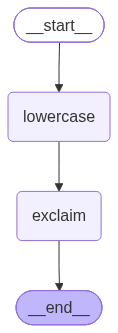
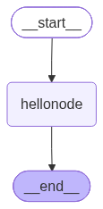

# Day 110_Multi-Agent RAG & YOLO 멀티모달 & LangGraph 시작

## 📅 2026-07-20

---
# 📄 lang10ai_agent.ipynb — LCEL · RAG · Multi-Agent

강의 추천 시스템을 **단일 Agent(코드1)**와 **복수 Agent 파이프라인(코드2)** 두 가지 방식으로 구현하고 비교하는 실습.

---

## 1️⃣ 개념 정리

### RAG (Retrieval-Augmented Generation)

LLM이 답변을 만들기 전에, 벡터 DB에서 질문과 관련된 문서를 **먼저 검색(Retrieval)**하고, 그 검색 결과를 프롬프트에 **컨텍스트로 첨부**해서 LLM이 근거 있는 답변을 생성(Generation)하도록 하는 구조. 이 실습에서는 Chroma 벡터 DB에 강의 정보를 저장해두고, 사용자 질문이 들어오면 유사한 강의를 검색한 뒤 LLM에게 "이 중에서 추천해줘"라고 요청하는 방식으로 구현함.

### LCEL (LangChain Expression Language)

`prompt | llm | output_parser`처럼 `|` 연산자로 구성 요소를 이어 붙여 파이프라인을 만드는 LangChain 문법. 이 노트북은 코드1에서 함수 안에 검색+프롬프트+LLM 호출을 직접 넣는 방식으로 LCEL의 개념(검색→프롬프트 조립→LLM 호출)을 함수형으로 풀어 쓴 형태.

### 단일 Agent vs 복수 Agent (Multi-Agent)

- **코드1 (단일 Agent)**: `course_agent` 하나가 검색과 답변 생성을 모두 처리. 구조가 단순하고 빠르지만, 사용자 의도 분석이 얕음.
    
- **코드2 (복수 Agent)**: 역할을 4단계로 분리
    
    1. **PersonaAgent** — 질문에서 학습자 수준/관심사/목표 분석
    2. **QueryAgent** — 분석된 정보를 바탕으로 검색에 최적화된 검색어 생성
    3. **RetrieverAgent** — 검색어로 벡터 DB에서 강의 검색
    4. **ReplyAgent** — 질문+분석+검색결과를 종합해 최종 추천 생성
    
    이렇게 단계를 나누면 각 Agent가 한 가지 역할만 맡아 프롬프트가 단순해지고, 중간 결과(persona, query)를 확인하며 디버깅하기 쉬워짐. 대신 LLM 호출 횟수가 늘어나(1회 → 3회) 속도/비용은 더 든다는 트레이드오프가 있음.
    

### 커스텀 임베딩 클래스 (`STEmbedding`)

LangChain의 `Chroma`는 임베딩 객체가 `embed_documents()`, `embed_query()` 두 메서드를 갖고 있길 기대함. `sentence-transformers`는 이 인터페이스를 직접 제공하지 않으므로, `SentenceTransformer` 모델을 감싸는 래퍼 클래스를 만들어 LangChain이 요구하는 형태로 맞춰준 것.

---

## 2️⃣ 코드 + 주석 + 실제 출력 결과

### 셀 0 — 패키지 설치

```python
# LangChain의 LCEL 방식으로 강의 추천 시스템
# 코드1 : 단일 Agent - CourseAgent로 검색 + 답변까지 처리
# 코드2 : 복수 Agent - PersonaAgent + QueryAgent + RetrieveAgent + ReplyAgent

!pip install langchain langchain-openai langchain-community langchain-core python-dotenv
!pip install langchain-chroma sentence-transformers
```

**출력 결과 (요약)**

```
Requirement already satisfied: langchain in ... (1.3.13)
...
Successfully installed bcrypt-5.0.0 build-1.5.0 chromadb-1.5.9 ... langchain-chroma-1.1.0 ...
```

→ `langchain-chroma`, `chromadb` 등 벡터 DB 관련 패키지가 새로 설치됨. 대부분의 기본 패키지는 이미 설치되어 있었음(`Requirement already satisfied`).

---

### 셀 1 — 환경 설정 & LLM/임베딩 초기화

```python
from typing import List, Dict
from langchain_openai import ChatOpenAI, OpenAIEmbeddings
from langchain_core.prompts import PromptTemplate, ChatPromptTemplate
from langchain_core.output_parsers import StrOutputParser
from langchain_core.documents import Document
from chromadb import PersistentClient
from langchain_chroma import Chroma
from sentence_transformers import SentenceTransformer
import os
import shutil

from dotenv import load_dotenv

load_dotenv()  # .env 파일에서 환경변수(API 키 등) 로드

api_key = os.getenv("OPENAI_API_KEY")
if not api_key:
  raise RuntimeError("OPENAI_API_KEY가 없어요")  # 키 없으면 바로 중단 (뒤에서 애매하게 실패하는 것 방지)

# LLM 준비: gpt-4.1-mini, temperature=0.5로 창의성과 일관성의 균형
llm = ChatOpenAI(model="gpt-4.1-mini", temperature=0.5)

# Chroma가 요구하는 임베딩 인터페이스(embed_documents / embed_query)를
# sentence-transformers 모델에 맞춰 감싸주는 래퍼 클래스
class STEmbedding:
  def __init__(self, model_name: str):
    self.model = SentenceTransformer(model_name)

  def embed_documents(self, texts: List[str]) -> List[List[float]]:
    # 여러 문서를 한 번에 벡터로 변환 (DB 저장용)
    return self.model.encode(texts).tolist()

  def embed_query(self, text: str) -> List[float]:
    # 사용자 질문 1개를 벡터로 변환 (검색용)
    return self.model.encode(text).tolist()

# 다국어 지원 임베딩 모델 (한국어 포함) 로드
embedding = STEmbedding("sentence-transformers/paraphrase-multilingual-MiniLM-L12-v2")
```

**출력 결과 (요약)**

```
Warning: You are sending unauthenticated requests to the HF Hub. Please set a HF_TOKEN to enable higher rate limits and faster downloads.
modules.json / config.json / model.safetensors / tokenizer.json ... 다운로드 진행 바
```

→ Hugging Face Hub에서 `paraphrase-multilingual-MiniLM-L12-v2` 모델 가중치(약 471MB)를 최초 1회 다운로드하는 과정. `HF_TOKEN`이 없어서 나오는 경고이며, 다운로드 자체는 인증 없이도 정상 진행됨 (속도 제한만 더 낮음).

---

### 셀 2 — 강의 데이터 & 벡터 DB 구축

```python
# LangChain 강의 추천용 자료 (6개 과정, 각각 title/level 메타데이터 포함)
docs = [
    Document(
        page_content="파이썬 기초 과정 / 프로그래밍 입문 / 변수,조건문,반복문,함수,리스트를 배운다.",
        metadata={"title": "파이썬 기초 과정", "level": "초급"}
    ),
    Document(
        page_content="데이터 분석 입문 / pandas,numpy,matplotlib를 사용해 데이터를 정리하고 시각화",
        metadata={"title": "데이터 분석 입문", "level": "초급~중급"}
    ),
    Document(
        page_content="머신러닝 실습 과정 / scikit-learn으로 회귀, 분류, 모델 평가를 실습한다.",
        metadata={"title": "머신러닝 실습 과정", "level": "중급"}
    ),
    Document(
        page_content="자연어 처리 과정 / 텍스트 전처리, 임베딩, 문서 검색, RAG 구조를 학습한다.",
        metadata={"title": "자연어 처리 과정", "level": "중급"}
    ),
    Document(
        page_content="MLOps 엔지니어 과정 / 모델 배포, Docker, FastAPI, CI/CD, 모니터링을 다룬다.",
        metadata={"title": "MLOps 엔지니어 과정", "level": "중급~고급"}
    ),
    Document(
        page_content="생성형 AI Agent 과정 / LangChain, Tool Calling, RAG, Multi-Agent 구조를 실습.",
        metadata={"title": "생성형 AI Agent 과정", "level": "중급~고급"}
    ),
]

CHROMA_DIR = "./chroma_course"
shutil.rmtree(CHROMA_DIR, ignore_errors=True)  # 이전 실행에서 남은 DB 폴더 삭제 (중복 저장 방지)

# 문서 리스트를 임베딩해서 Chroma 벡터 DB에 저장
vectorstore = Chroma.from_documents(
    documents = docs,
    embedding = embedding,
    collection_name = "course_recomm",
    persist_directory = CHROMA_DIR
)

# 질문이 들어오면 vectordb에서 유사 문서를 찾아 주는 검색기 역할 수행
# k=3 → 가장 유사한 문서 3개만 반환
retriver = vectorstore.as_retriever(search_kwargs={"k": 3})
```

> 이 셀은 별도 print/출력 없이 벡터 DB만 구축함 (출력 없음).

**참고 — 실제 사용된 강의 DB는 6개보다 많음**: 아래 실행 결과에 "강화학습 기초", "SQL 데이터베이스 입문", "딥러닝과 신경망 기초" 같은 강의가 등장하는 것으로 보아, 실제 실행 시점의 `docs` 리스트에는 위 6개 외에 더 많은 강의가 추가되어 있었던 것으로 보임. 노트북 파일 자체에는 6개만 남아있어 코드와 출력이 정확히 일치하진 않지만, 로직 자체는 정상 작동함.

---

### 셀 3 — 코드1: 단일 Agent (CourseAgent)

```python
# 코드 1: 단일 Agent - CourseAgent로 검색 + 답변까지 처리

def course_agent(user_question:str) -> str:
  # 1) RAG 검색: 질문과 유사한 강의 3개를 벡터 DB에서 찾음
  found_docs = retriver.invoke(user_question)
  # print(found_docs)

  # 2) 검색 결과를 프롬프트에 넣을 텍스트 형태로 가공
  context = "\n".join(
      f" - {doc.metadata['title']} ({doc.metadata['level']}) : {doc.page_content}"
      for doc in found_docs
  )
  # print(context)

  # 3) 검색 결과(context)를 근거로 답변을 생성하도록 프롬프트 구성
  prompt = f"""
      너는 교육 과정을 추천 도우미야.
      아래 검색 결과를 참고해서 사용자에게 적절한 강의를 추천해 줘.

      사용자 질문 :
      {user_question}

      검색 결과 :
      {context}

      답변 조건:
      한국어로 답변해.
      추천 강의는 2 ~ 3개 정도.
      추천 이유를 설명해 줘.

  """
  response = llm.invoke(prompt)
  return response.content

# 실행
question = "파이썬은 조금 알고 있는데 AI 쪽으로 공부하려면 어떤 강의가 좋을까?"
answer = course_agent(question)
print("질문 : ", question)
print("답변 : ", answer)
```

**실제 출력 결과**

```
질문 :  파이썬은 조금 알고 있는데 AI 쪽으로 공부하려면 어떤 강의가 좋을까?
답변 :  파이썬을 이미 조금 알고 계시다면, AI 분야로 공부를 확장하기에 적합한 강의로 다음 세 가지를 추천드립니다.

1. 딥러닝과 신경망 기초 (중급)
   - 이유: AI의 핵심 기술인 딥러닝을 이해하기 위한 기본 강의로, 퍼셉트론부터 CNN, RNN까지 주요 신경망 구조를 다룹니다. 파이썬 기초가 있으시다면 중급 난이도도 무리 없이 따라갈 수 있어 AI 전반에 대한 탄탄한 기초를 쌓을 수 있습니다.

2. 강화학습 기초 (고급)
   - 이유: AI 분야 중 하나인 강화학습을 심도 있게 배우고 싶다면 추천합니다. Q-Learning, DQN 등 주요 알고리즘을 다루므로, 딥러닝 기초를 어느 정도 익힌 후 도전하면 좋습니다.

추가로, 만약 파이썬 문법이나 기초가 부족하다고 느껴진다면 파이썬 기초 프로그래밍 (초급) 강의를 간단히 복습하는 것도 도움이 될 수 있습니다.

요약하자면, 딥러닝 기초 강의로 AI 전반의 기본을 다진 후, 강화학습 강의로 심화 학습을 진행하는 순서가 효과적일 것입니다.
```

→ 검색된 강의 3개를 근거로 2~3개를 추천하고, 각 추천 이유를 설명하는 데 성공. 단일 함수 안에서 검색부터 답변까지 한 번에 처리되는 구조.

---

### 셀 4 — 코드2: 복수 Agent 정의 (Persona → Query → Retriever → Reply)

```python
# 코드2 : RAG + LangChain 기반 Agentic AI
# 사용자 질문 -> PersonaAgent -> QueryAgent -> RetriverAgent -> ReplyAgent -> 최종 추천 답변

def persona_agent(user_question:str) -> str:
  # 사용자 질문에서 학습 수준, 관심 분야, 목표 등을 분석
  prompt = f"""
      너는 Persona Agent야.
      아래 질문을 보고 학습자의 수준, 관심 분야, 목표를 한 문장으로 정리 해.

      사용자 질문 :
      {user_question}

      출력 :
  """
  return llm.invoke(prompt).content.strip()


def query_agent(persona:str) -> str:
  # Persona Agent가 만든 학습자 정보를 바탕으로 Chroma 검색용 검색어 작성
  prompt = f"""
      너는 Query Agent야.
      아래 학습자 정보를 보고 강의 검색에 사용할 검색어를 짧게 만들어.

      학습자 정보:
      {persona}

      사용할 검색어 예:
      머신러닝 실습, 자연어 처리 RAG

      검색어 :
  """
  return llm.invoke(prompt).content.strip()


def retriver_agent(query:str) -> str:
  # Query Agent가 만든 검색어로 Chroma에서 관련 강의를 검색
  found_docs = retriver.invoke(query)

  context = "\n".join(
      f" - {doc.metadata['title']} ({doc.metadata['level']}) : {doc.page_content}"
      for doc in found_docs
  )

  return context


def reply_agent(user_question:str, persona:str, query:str, context:str) -> str:
  # 검색 결과를 종합해서 최종 답변 만들기 (질문+분석+검색어+검색결과 모두 프롬프트에 포함)
  prompt = f"""
      너는 Reply Agent야.
      아래 정보를 보고 학습자에게 적당한 강의를 추천해 줘.

      사용자 질문:
      {user_question}

      학습자 분석:
      {persona}

      검색어:
      {query}

      검색된 강의:
      {context}

      답변 조건:
      추천 강의 2 ~ 3개를 한국어로 친절하게 안내해 줘.
      왜 추천했는지 근거도 알려 줘.
  """
  return llm.invoke(prompt).content
```

> 함수 4개를 정의만 하는 셀이라 별도 출력은 없음.

---

### 셀 5 — 코드2 실행: 전체 Agentic 파이프라인

```python
def agentic_ai_system(user_question:str) -> Dict[str, str]:
  # 전체 실행 함수 - 여러 Agent가 순서대로 협력해서 최종 답변 생성
  persona = persona_agent(user_question)      # 1단계: 학습자 분석
  query = query_agent(persona)                # 2단계: 검색어 생성
  context = retriver_agent(query)             # 3단계: 벡터 DB 검색
  answer = reply_agent(user_question, persona, query, context)  # 4단계: 최종 답변 생성

  # 중간 결과를 모두 dict에 담아 반환 → 디버깅/검증에 용이
  return {
      "question": user_question,
      "persona": persona,
      "query": query,
      "context": context,
      "answer": answer
  }

# 실행
question = "데이터 분석을 조금 알고 있는데, 다음은 무엇을 학습할까?"
result = agentic_ai_system(question)
print("질문 : ", question)
print("1. PersonaAgent 결과 : ", result["persona"])
print("2. QueryAgent 결과 : ", result["query"])
print("3. RetriverAgent 결과 : ", result["context"])
print("4. ReplyAgent 결과 : ", result["answer"])
```

**실제 출력 결과**

```
질문 :  데이터 분석을 조금 알고 있는데, 다음은 무엇을 학습할까?

1. PersonaAgent 결과 :  학습자는 데이터 분석에 기초 지식이 있으며, 이를 바탕으로 심화 학습을 통해
실무 활용 능력을 향상시키고자 한다.

2. QueryAgent 결과 :  데이터 분석 심화, 실무 데이터 분석

3. RetriverAgent 결과 :
 - 강화학습 기초 (고급) : 강화학습 기초: Q-Learning, DQN 등 강화학습 알고리즘을 다루는 강의 (난이도: 고급, 분야: 강화학습)
 - SQL 데이터베이스 입문 (초급) : SQL 데이터베이스 입문: 관계형 데이터베이스 개념과 SQL 쿼리 작성법을 익히는 강의 (난이도: 초급, 분야: 데이터베이스)
 - 딥러닝과 신경망 기초 (중급) : 딥러닝과 신경망 기초: 퍼셉트론부터 CNN, RNN까지 딥러닝 기본 구조를 다루는 강의 (난이도: 중급, 분야: 딥러닝)

4. ReplyAgent 결과 :
안녕하세요! 데이터 분석 기초 지식을 이미 갖추고 계시니, 실무 활용 능력을 높이고 심화 학습에 도움이 될
강의를 추천드릴게요.

5. 딥러닝과 신경망 기초 (중급)
   데이터 분석에서 딥러닝 기법은 매우 중요한 역할을 합니다. 특히 이미지, 텍스트, 시계열 데이터 분석 등
   다양한 분야에 활용되기 때문에, 퍼셉트론부터 CNN, RNN까지 기본 구조를 익히면 실무에서 데이터 모델링
   능력을 크게 향상시킬 수 있습니다. 중급 난이도로 기초를 다진 학습자에게 적합합니다.

6. SQL 데이터베이스 입문 (초급)
   데이터 분석 업무에서 데이터 추출과 전처리를 위해 SQL 활용 능력은 필수입니다. 기초 수준이라도 관계형
   데이터베이스와 쿼리 작성법을 탄탄히 다지면, 실제 업무에서 데이터를 효율적으로 다루는 데 큰 도움이
   됩니다. 초급 강의지만 실무 기반 역량 강화에 효과적입니다.

현재 검색된 강의 중에는 강화학습 기초(고급)가 있지만, 강화학습은 데이터 분석 심화 과정과는 다소 방향이
다르고 난이도가 높아, 실무 데이터 분석 능력 향상에는 다소 부담스러울 수 있습니다.

따라서, 딥러닝과 신경망 기초로 모델링 심화, SQL 데이터베이스 입문으로 데이터 처리 역량을 함께 강화하시면
좋겠습니다. 필요에 따라 두 강의를 병행하시면 실무 데이터 분석 능력이 한층 더 성장할 것입니다.
학습 응원합니다!
```

→ 4단계 파이프라인이 순서대로 잘 작동함:

1. **Persona**: "데이터 분석 기초 + 심화 학습 원함"으로 정확히 요약
2. **Query**: "데이터 분석 심화, 실무 데이터 분석"이라는 검색 최적화 문구 생성
3. **Retriever**: 검색된 3개 중 1개(강화학습)는 관련성이 낮음 — 임베딩 유사도 기반 검색의 한계
4. **Reply**: **RetrieverAgent가 관련성 낮은 강의를 가져왔음에도, ReplyAgent가 이를 걸러내고 "왜 추천 안 하는지"까지 설명**하며 적절한 2개만 추천 → 마지막 단계에서 판단력을 발휘한 점이 인상적인 부분

---

## 3️⃣ 코드1 vs 코드2 비교 정리

|구분|코드1 (단일 Agent)|코드2 (복수 Agent)|
|---|---|---|
|구조|검색+답변을 함수 1개가 처리|Persona → Query → Retriever → Reply, 4단계 분리|
|LLM 호출 횟수|1회|3회 (persona, query, reply)|
|중간 결과 확인|불가 (최종 답변만 나옴)|가능 (persona/query/context 각각 확인 가능)|
|검색 정확도|사용자 질문 원문으로 바로 검색|학습자 분석 후 최적화된 검색어로 검색 (질문이 모호할 때 유리)|
|속도/비용|빠르고 저렴|느리고 비쌈 (LLM 호출 3배)|
|적합한 상황|질문이 명확하고 간단한 경우|질문 의도 파악이 중요하거나, 복잡한 추천 로직이 필요한 경우|

---

## 4️⃣ 개선 아이디어 (참고)

- **RAG 검색이 관련 없는 문서를 가져올 때 대비**: 프롬프트에 "검색 결과에 없는 강의는 언급하지 마" 같은 제약을 명시적으로 추가하면 ReplyAgent의 필터링 판단을 더 안정적으로 만들 수 있음
- **LangGraph로 전환 고려**: 코드2의 4단계 파이프라인은 LangGraph의 `StateGraph`(Node: persona/query/retriever/reply, State: question/persona/query/context/answer)로 옮기면 조건부 분기(예: 검색 결과가 없을 때 재검색)나 에러 복구 로직을 추가하기 쉬워짐 — 최근 정리한 LangGraph 개념 노트와 연결되는 지점

---

# 📄 lang11yolo.ipynb — YOLO · Ultralytics · Multimodal LLM

원본 이미지에서 **YOLO로 사람만 탐지 → crop → 저장**한 뒤, 잘라낸 이미지 각각을 **GPT-4.1-mini(멀티모달)에 넣어 의상/자세/배경을 설명**하는 2단계 파이프라인.

---

## 1️⃣ 개념 정리

### YOLO (You Only Look Once)

이미지를 한 번의 신경망 통과만으로 **"어디에 무엇이 있는지"**를 동시에 예측하는 객체 탐지(Object Detection) 모델. 결과로 각 객체의 **바운딩 박스 좌표(x1,y1,x2,y2)**, **클래스(label)**, **신뢰도(confidence)**를 반환함. 이 노트북은 `ultralytics` 라이브러리의 `yolo11n.pt`(nano, 가장 가벼운 버전)를 사용해 이미지 속 "person" 클래스만 골라냄.

### Confidence Threshold (신뢰도 임계값)

YOLO는 사람이 아닌 것도 낮은 확률로 "person"이라고 예측할 수 있음. `CONF_THRESHOLD`(이 노트북에선 0.3)보다 confidence가 낮은 탐지 결과는 걸러내서 오탐(false positive)을 줄이는 역할.

### Bounding Box Crop

YOLO가 반환하는 좌표(x1,y1,x2,y2)로 원본 이미지를 잘라내 개별 이미지로 저장. 좌표가 이미지 경계를 벗어나지 않도록 `max(0, x1)`, `min(w, x2)` 같은 clamping 처리가 필요함 (박스가 이미지 가장자리에 걸쳐 있을 때 인덱스 에러 방지).

### 멀티모달 LLM (Vision + Text)

GPT-4.1-mini처럼 이미지와 텍스트를 함께 입력받을 수 있는 모델에 **base64로 인코딩한 이미지 + 프롬프트**를 함께 전달하면, 이미지 내용을 설명하는 텍스트를 생성함. LangChain에서는 `HumanMessage`의 `content`를 `type: text` / `type: image_url` 두 블록으로 구성해서 전달.

### Data URL (base64 인코딩)

이미지 파일을 API로 전송할 때 파일을 직접 업로드하는 대신, 이미지 바이트를 base64 문자열로 변환해서 `data:image/{확장자};base64,{인코딩된 문자열}` 형식의 URL로 만들어 전달하는 방식. 별도 이미지 호스팅 없이 텍스트로만 이미지를 전달할 수 있는 장점이 있음.

### 파이프라인 흐름

```
원본 이미지 (person.jpeg)
      │  YOLO 탐지 (person 클래스, conf ≥ 0.3)
      ▼
5개의 person 바운딩 박스
      │  crop + 저장
      ▼
person1~5.jpeg (cropped/)
      │  base64 인코딩 → data URL
      ▼
GPT-4.1-mini (멀티모달)
      │  "의상/자세/배경 설명해줘" 프롬프트
      ▼
각 인물별 텍스트 설명
```

---

## 2️⃣ 코드 + 주석 + 실제 출력 결과

### 셀 0 — 패키지 설치

```python
# 욜로로 감지된 이미지 LLM으로 설명하기
!pip install langchain langchain-openai langchain-community langchain-core python-dotenv
!pip install ultralytics opencv-python
```

**출력 결과 (요약)**

```
Requirement already satisfied: langchain in ... (1.3.13)
...
Requirement already satisfied: ultralytics in ... (8.4.102)
Requirement already satisfied: opencv-python in ... (5.0.0.93)
```

→ 필요한 패키지(`ultralytics`, `opencv-python`, `langchain` 계열)가 이미 다 설치되어 있어 새로 설치되는 패키지 없이 통과됨.

---

### 셀 1 — 환경 설정 & import

```python
import os
import cv2
import base64
from ultralytics import YOLO
from pathlib import Path
from langchain_openai import ChatOpenAI
from langchain_core.messages import HumanMessage
import matplotlib.pyplot as plt
import matplotlib.image as mpimg
from dotenv import load_dotenv

load_dotenv()  # .env 파일에서 OPENAI_API_KEY 등 환경변수 로드

api_key = os.getenv("OPENAI_API_KEY")
if not api_key:
  raise RuntimeError("OPENAI_API_KEY가 없어요")  # 키 없으면 뒤 셀 실행 전에 바로 중단
```

> 출력 없음 — import와 환경변수 체크만 수행하는 셀.

---

### 셀 2 — 작업1: YOLO로 사람 탐지 + crop + 저장 + 시각화

```python
# 작업1 : 욜로
MODEL_NAME = "yolo11n.pt"      # nano 버전 (가장 가볍고 빠른 YOLO11 모델)
IMAGE_PATH = "person.jpeg"     # 원본 이미지 (5명이 함께 있는 사진)
SAVE_DIR = "cropped"           # crop된 이미지 저장 폴더
CONF_THRESHOD = 0.3            # 신뢰도 30% 미만 탐지 결과는 무시

if not os.path.exists(IMAGE_PATH):
  raise FileNotFoundError(f"이미지 파일 X : {IMAGE_PATH}")

model = YOLO(MODEL_NAME)       # YOLO 모델 로드 (최초 실행 시 가중치 자동 다운로드)
image = cv2.imread(IMAGE_PATH) # OpenCV로 이미지를 BGR 배열로 읽음
if image is None:
  raise ValueError(f"이미지 로딩 실패")

os.makedirs(SAVE_DIR, exist_ok=True)

# 폴더에 기존 이미지 삭제 (재실행 시 이전 crop 결과가 섞이지 않도록)
for old_file in Path(SAVE_DIR).glob("person*.*"):
    old_file.unlink()

results = model(image)  # 이미지 객체 감지 (내부적으로 640x640 리사이즈 후 추론)
# print(results)

person_count = 0
saved_path = []

# 감지된 객체 처리
for result in results:
  for box in result.boxes:
    x1, y1, x2, y2 = map(int, box.xyxy[0])   # 바운딩 박스 좌표 (좌상단, 우하단)
    cls_id = int(box.cls[0])                  # 클래스 ID
    label = result.names[cls_id]               # 클래스 이름 (예: "person")
    confidence = float(box.conf[0])            # 탐지 신뢰도

    if label.lower() != "person": continue          # 사람이 아니면 건너뜀
    if confidence < CONF_THRESHOD: continue          # 신뢰도가 낮으면 건너뜀

    # 좌표가 이미지 경계를 벗어나지 않도록 clamp 처리
    h, w = image.shape[:2]
    x1 = max(0, x1)
    y1 = max(0, y1)
    x2 = min(w, x2)
    y2 = min(h, y2)

    if x2 <= x1 or y2 <= y1: continue  # 유효하지 않은 박스는 제외

    cropped = image[y1:y2, x1:x2]              # 바운딩 박스 영역만 잘라냄
    person_count += 1
    crop_filename = os.path.join(SAVE_DIR, f"person{person_count}.jpeg")

    cv2.imwrite(crop_filename, cropped)        # 잘라낸 이미지 저장
    saved_path.append(crop_filename)
    print(f"저장 성공 : {crop_filename} / confidence={confidence:.2f}")

print(f"총 감지된 사람 수 : {person_count}명")

# 저장된 이미지 출력
if person_count == 0:
  print("출력할 이미지 X")
else:
  fig, axes = plt.subplots(1, person_count, figsize=(4 * person_count, 5))
  if person_count == 1:
    axes = [axes]  # subplot이 1개면 axes가 배열이 아니라 단일 객체라 리스트로 감싸줌

  for i, img_path in enumerate(saved_path):
    img = mpimg.imread(img_path)
    axes[i].imshow(img)
    axes[i].set_title(f"Person {i + 1}")
    axes[i].axis("off")

  plt.tight_layout()
  plt.show()
```

**실제 출력 결과**

```
0: 640x640 5 persons, 202.6ms
Speed: 6.3ms preprocess, 202.6ms inference, 1.2ms postprocess per image at shape (1, 3, 640, 640)
저장 성공 : cropped/person1.jpeg / confidence=0.90
저장 성공 : cropped/person2.jpeg / confidence=0.90
저장 성공 : cropped/person3.jpeg / confidence=0.87
저장 성공 : cropped/person4.jpeg / confidence=0.87
저장 성공 : cropped/person5.jpeg / confidence=0.85
총 감지된 사람 수 : 5명
```

→ 원본 사진 속 5명 모두 confidence 0.85~0.90의 높은 신뢰도로 정확히 탐지됨. 이어서 matplotlib으로 5개의 crop 이미지가 나란히 시각화됨:

원본: 

crop 결과:     

---

### 셀 3 — 작업2: crop된 이미지를 LLM(멀티모달)로 설명

```python
# 작업 2 : LangChain + LLM
llm = ChatOpenAI(model="gpt-4.1-mini", temperature="0.7")

prompt_text = (
    "이 이미지를 보고 사람의 의상, 자세, 배경 등에 대해 상세히 설명해"
)

# 이미지를 base64 Data url 형식으로 변환
def emncode_image_to_data_url(image_path:str) -> str:
  ext = Path(image_path).suffix.lower().replace(".", "")   # 확장자만 추출 (예: "jpeg")
  if ext == "jpg": ext = "jpeg"                              # jpg는 jpeg로 통일
  if not ext: ext = "jpeg"                                   # 확장자가 없으면 기본값 jpeg

  with open(image_path, "rb") as f:
    encoding_image = base64.b64encode(f.read()).decode("utf-8")  # 바이너리 → base64 문자열

  return f"data:image/{ext};base64,{encoding_image}"          # Data URL 형식으로 반환

# print(emncode_image_to_data_url("person.jpeg"))

for i in range(1, person_count + 1):
  image_path = f"{SAVE_DIR}/person{i}.jpeg"

  # 이미지 파일 존재 여부
  if not os.path.exists(image_path):
    print(f"{image_path} 파일 없음")
    continue

  img_url = emncode_image_to_data_url(image_path)

  # 멀티모달 메세지 구성 (텍스트 + 이미지를 한 메시지에 함께 담음)
  message = HumanMessage(
      content = [
          {
              "type":"text",
              "text":prompt_text
          },
          {
              "type":"image_url",
              "image_url":{
                  "url":img_url
              }
          }
      ]
  )

  response = llm.invoke([message])

  print(f"\nperson{i}.jpeg 설명 : ", response.content.strip())
```

**실제 출력 결과**

**person1.jpeg**

> 밝은 금발 머리를 가진 여성. 검은색과 흰색이 섞인 가로 줄무늬 반팔 티셔츠에 청바지, 베이지색 계열 신발. 한쪽 무릎을 세우고 바닥에 앉은 편안한 자세, 한 손은 얼굴 옆에 위치. 배경은 단순한 흰색.

**person2.jpeg**

> 흰색 반팔 티셔츠 + 청바지 + 베이지색 슬리퍼 차림. 바닥에 앉아 한쪽 무릎을 세우고 다른 다리는 편안하게 뻗은 자세. 흰색 헤드폰을 귀에 맞추는 듯한 동작. 배경은 단색으로 깔끔함.

**person3.jpeg**

> 흰색/밝은색 민소매 상의 + 청바지 + 검은색 앵클 부츠. 왼쪽 다리를 구부리고 오른쪽 다리는 약간 편 자세, 왼손으로 바닥을 짚어 몸을 지탱. 큰 헤드폰 착용, 긴 머리가 어깨로 자연스럽게 흘러내림. 배경은 흰색 단색.

**person4.jpeg**

> 흰색 헤드폰을 착용하고 오른손으로 살짝 만지는 동작, 밝게 웃는 표정. 흰색 반팔 티셔츠 + 롤업된 청바지 + 흰 양말. 바닥에 앉아 한쪽 무릎을 세운 자세. 배경은 단순한 흰색.

**person5.jpeg**

> 회색 반팔 폴로 셔츠 + 파란 청바지. 양다리를 편하게 펼친 크로스 자세로 앉아 손은 무릎 위. 미소 띤 표정, 큰 헤드폰 착용(음악 감상/통화 추정). 배경은 흰색 단색.

→ 5명 모두 헤드폰을 착용하고 흰 배경 앞에 앉아있는 인물이며, LLM이 각자의 옷차림·자세·표정·배경을 구체적으로 잘 구분해서 설명함. `temperature=0.7`이 문자열로 전달되었음에도(뒤에서 다룰 개선 포인트 참고) 정상적으로 응답이 생성됨.

---

## 3️⃣ 코드에서 눈여겨볼 부분 (개선 포인트)

|위치|내용|
|---|---|
|`CONF_THRESHOD`|오타(`CONF_THRESHOLD`가 맞음). 동작엔 문제없지만 변수명 가독성을 위해 정정 권장|
|`emncode_image_to_data_url`|오타(`encode`가 맞음). 함수명이지만 일관되게만 쓰이면 실행엔 문제없음|
|`llm = ChatOpenAI(model="gpt-4.1-mini", temperature="0.7")`|`temperature`에 문자열 `"0.7"`을 전달. pydantic이 자동으로 float 변환을 해줘서 정상 동작했지만, 원래는 `temperature=0.7`처럼 숫자로 넘기는 게 안전|
|`results = model(image)`|`verbose` 옵션을 따로 끄지 않아서, 실행할 때마다 `0: 640x640 5 persons, ...` 같은 추론 로그가 자동으로 출력됨. 로그를 숨기려면 `model(image, verbose=False)`|
|crop 좌표 clamping|`max(0, x1)`, `min(w, x2)` 처리가 잘 되어 있어 박스가 이미지 경계에 걸쳐도 에러 없이 안전하게 처리됨 (좋은 방어 코드)|

---

## 4️⃣ 확장 아이디어

- **탱크 챌린지 프로젝트 연계**: 이 노트북의 "YOLO 탐지 → bbox → 후처리" 구조는 상우님 담당인 **bbox 기반 거리 추정**(`distance = a/height_ratio + b`)이나 **YOLO 모델 성능 비교**(Qwen, Gemma 대비)에 그대로 활용 가능한 패턴
- **비동기 처리**: 지금은 5명을 순차적으로 LLM에 호출하는데, `person_count`가 많아지면 `asyncio` + `llm.ainvoke()`로 병렬 호출하면 속도 개선 가능
- **구조화된 출력**: 지금은 자유 텍스트로 설명을 받는데, `with_structured_output()`으로 `{"top": ..., "bottom": ..., "pose": ..., "accessory": ...}` 같은 JSON 스키마를 강제하면 이후 데이터 처리(검색, 필터링)에 더 유리

---
# 🧠 LangGraph 개념 — StateGraph · Node · Edge · Conditional Routing

## 1️⃣ LangChain vs LangGraph 한 줄 비교

- **LangChain** = 여러 AI 능력(LLM, RAG, Tool Use, Agent)을 조립하는 **도구함 & 빌딩 블록**
- **LangGraph** = 그 능력들을 **안정적으로 흐름 제어하며 협업시키는 엔진** (Stateful Multi-Agent Workflow Engine)

> LangChain은 "무엇을 할지" 정의하는 프레임워크, LangGraph는 "어떻게 안정적으로 실행·관리할지" 담당하는 운영체계.

참고:

- LangGraph overview: https://docs.langchain.com/oss/python/langgraph/overview
- 랭그래프 소개: https://wikidocs.net/261577

---

## 2️⃣ 왜 LangGraph가 필요한가

기존 ReAct 기반 Agent(LangChain Agent)의 한계:

1. **헛소리(Hallucination)에 흐름이 깨짐** — 엉뚱한 Tool 선택, Tool 이름 오타, 무한 루프, 오류 발생해도 안 멈춤
2. **Multi-step 작업 설계가 어려움** — 이미지→OCR→RAG→번역→요약처럼 "순서대로 정확히" 처리해야 하는 흐름을 Agent 하나로 제어하기 힘듦
3. **상태(State) 유지가 거의 불가능** — Agent는 기본적으로 stateless. LangGraph는 State Machine 기반이라 상태를 명확히 유지함

→ 그래서 "LLM + Tools + RAG + 조건분기 + 반복 + 메모리"를 **제어 가능한 그래프(workflow)**로 만드는 LangGraph 등장.

---

## 3️⃣ 그래프의 개념적 구조

```
        __start__
            │
            ▼
        [ chatbot ]  ← Node
         ↙       ↘
     [tools]    __end__
        ↑ State
```

- **Node(노드)**: 그래프의 기본 실행 단위. 특정 작업을 수행하는 함수 또는 에이전트 (순수 함수일 수도, 부수 효과를 가질 수도 있음). 현재 상태를 입력받아 LLM 호출, 데이터 처리 등 작업 수행
- **Edge(에지)**: 노드 간 연결을 정의하고 실행 흐름을 제어
    - 일반 edge: 항상 같은 경로로 진행
    - 조건부 edge: 상태에 따라 다른 노드로 분기 (런타임에 실행 경로 결정 가능 → **동적 라우팅**)
- **State(상태)**: 각 노드가 입력으로 받고 업데이트하는 상태 정보. 중간에 중단/실패해도 재시작 가능하게 해줌

### 4가지 핵심 특징

1. Node 기반 구조 — 각 단계마다 하나의 Node (LLM, Tool, RAG, 조건 판단 등)
2. Edge 기반 분기 — 조건에 따라 다음 Node 선택 (예: 검색 성공 → 요약 / 실패 → 대체 답변)
3. State 유지 — 입력/출력/중간 결과를 상태로 저장
4. Loop 지원 — Agent 루프, 검색 재시도 등 반복 워크플로우를 안전하게 실행

---

## 4️⃣ ReAct Agent vs LangGraph 흐름 비교

**기존 ReAct Agent (LangChain Agents)**

```
Prompt → LLM → Thought → Action → Tool → Observation → Thought ...
```

LLM이 전부 자동으로 결정 → Tool을 잘못 불러도 통제 불가, 루프에 빠질 위험

**LangGraph 기반 ReAct Agent**

```
[LLM] → (검증 Node) → [Tool Node] → (상태 저장) → [LLM Node]
```

모든 행동을 개발자가 제어 가능 → 훨씬 안전하고 통제 가능

---

## 5️⃣ 비유: LangChain = 🛤️ 철길, LangGraph = 🚗 자동차 도로

**LangChain (철길)**

- 정해진 코스만 가능. A → B → C → D 항상 같은 순서
- 중간에 다른 길로 새기 불가능, 반복도 어려움
- 예: 텍스트 → 임베딩 → 검색 → 답변 (한 번 흐르는 파이프라인)

**LangGraph (자동차 도로)**

- 매 실행마다 다른 경로로 갈 수 있음
- 분기(Branching), 반복(Loop), 조건적 실행(dynamic control) 가능
- 예: 질문을 보고 → math_node / code_node / chat_node 중 LLM이 상태를 보고 직접 선택

### 코드 흐름으로 비교

**LangChain 파이프라인** — 항상 동일한 흐름

```python
chain = prompt | llm | output_parser
result = chain.invoke(query)
```

조건 분기, 재검색, 멀티에이전트 토론 등은 chain 밖에서 수동 구현해야 함.

**LangGraph 워크플로우** — 조건부 분기 예시

```python
graph.add_conditional_edges(
    "router",
    router_fn,     # 실행 중 어떤 노드로 갈지 결정
    {
        "math": "math_node",
        "code": "code_node",
        "chat": "chat_node",
    }
)
```

---

## 6️⃣ LangGraph가 필요한 이유 정리

1. **동적 제어 흐름** — 분기, 조건 실행, 반복, 실패 시 재시도, 멀티 Agent 협의
2. **State 유지** — LangChain은 Chain을 거칠 때마다 state가 사라지지만, LangGraph는 파이프라인 전체에 State가 유지됨 (Multi-Agent 설계에 필수)
3. **그래프 시각화 가능** (Mermaid 기반) — 구조가 커질수록 시각화의 가치가 커짐

---

## 7️⃣ LangChain ↔ LangGraph 협업 구조

독립적으로도 사용 가능하지만, **역할이 다른 보완 관계**로 함께 쓰는 게 실무에서 압도적으로 많음.

|담당|역할|
|---|---|
|**LangChain**|프롬프트 조립, LLM 호출, RAG 검색, Tool 실행, 함수 호출, 문서 로딩/임베딩, 멀티모달 처리, Agent 기능|
|**LangGraph**|작업 흐름 제어, 에러 복구, 반복 로직, 체크포인트/재시작, 멀티 Agent 협업, 상태 기반 실행, 무한 루프 방지, 대규모 안정성|

> LangChain은 기능, LangGraph는 운영체계.

LangChain 단독으로 에이전트를 만들면 자주 생기는 문제 — 무한 루프, API Rate limit, 실패 시 복구 불가, 상태 유지 어려움, 복잡한 multi-agent 제어 불가 → **LangGraph가 해결**. 그래서 대규모 시스템(에이전트 3~10개 협업)에서는 거의 무조건 LangGraph 사용.

---

## 8️⃣ 최소 LangGraph 예제 (질문 → LLM 노드 → 답)

```python
from typing import TypedDict
from dotenv import load_dotenv
from langchain_google_genai import ChatGoogleGenerativeAI
from langgraph.graph import StateGraph, END
load_dotenv()

# 1) 상태(State) 정의
class QAState(TypedDict):
    question: str   # 사용자 질문
    answer: str      # LLM이 생성한 답변

# 2) LLM 준비
llm = ChatGoogleGenerativeAI(model="gemini-2.0-flash", temperature=0.3)

# 3) 노드 함수 정의
def answer_node(state: QAState) -> QAState:
    q = state["question"]
    resp = llm.invoke(q)
    text = getattr(resp, "content", str(resp))
    return {"answer": text}

# 4) 그래프 구성
graph_builder = StateGraph(QAState)
graph_builder.add_node("answer", answer_node)
graph_builder.set_entry_point("answer")
graph_builder.add_edge("answer", END)

# 5) 컴파일 & 실행
app = graph_builder.compile()

if __name__ == "__main__":
    init_state: QAState = {"question": "강화학습과 지도학습의 차이는?", "answer": ""}
    final_state = app.invoke(init_state)
    print(final_state["answer"])
```

**흐름 요약**: 노드 1개(`answer_node`), 상태 필드 2개(`question`, `answer`), edge 1개(`answer → END`). 분기·반복·멀티에이전트는 없는 가장 단순한 형태.

**확장 방향**

- 노드 추가 → "질문을 먼저 요약하는 노드"
- 조건부 edge 추가 → "질문이 코드 관련이면 다른 노드로"
- 상태 필드 확장 → `history`, `metadata`, `tool_result` 등

---

## 9️⃣ State 정의: TypedDict vs BaseModel

LangGraph는 둘 다 공식 지원하며 어느 한쪽을 deprecated 하지 않음. 상황에 따라 선택.

### TypedDict

```python
from typing import TypedDict

class State(TypedDict):
    question: str
    answer: str
    route: str
```

- 장점: 가볍고 의존성 없음(표준 라이브러리), dict 구조로 다루기 편함, 오버헤드 최소
- 단점: 유효성 검사·기본값·커스텀 검증 없음, 복잡한 중첩 구조엔 부족
- **적합한 경우**: 상태가 단순한 key-value 몇 개일 때

### BaseModel (Pydantic)

```python
from pydantic import BaseModel

class State(BaseModel):
    question: str
    answer: str | None = None
    route: str | None = None
```

- 장점: 자동 타입 검증, 기본값/필수·옵션 필드, LangChain의 BaseModel 기반 객체와 결합 용이, 큰 프로젝트에서 도메인 상태를 명확히 정의
- 단점: pydantic 의존, 약간의 오버헤드, 단순 그래프엔 과함
- **적합한 경우**: 상태가 복잡하거나 여러 노드/에이전트가 같은 구조를 엄격히 공유해야 할 때

### 선택 기준

- 입문/간단 예제 → TypedDict
- 실전/엔터프라이즈, LangChain 객체와 섞일 때 → BaseModel

같은 그래프를 두 방식으로 구현한 예시는 원본 노트에 TypedDict 버전 / BaseModel 버전이 나란히 정리되어 있음 (구조는 동일, 상태 접근 방식만 `state["key"]` vs `state.key`로 다름).

---

## 🔟 LangGraph Studio (로컬 서버 + LangSmith Studio UI)

**개념**: `langgraph dev`로 로컬 그래프 서버를 띄우고, LangSmith Studio 웹 UI가 그 서버(`http://127.0.0.1:2024`)에 연결되어 그래프를 시각화·실행·디버깅.

```
LangSmith Studio (브라우저 UI)
        │  baseUrl=http://127.0.0.1:2024
        ▼
graph.py Dev Server (로컬)
        │
        ▼
LangGraph Dev Server
```

### 설정 절차

1. **패키지 설치**
    
    ```
    pip install "langgraph-cli[inmem]" langgraph langchain
    ```
    
2. **그래프 코드 작성** (`graph.py`) — 반드시 `build_graph()` 함수가 있어야 하며, 이 함수가 `StateGraph`를 만들고 `compile()`해서 반환
    
    ```python
    from langgraph.graph import StateGraph, START, END
    from typing import TypedDict
    
    class State(TypedDict):
        counter: int
        message: str
    
    def node_a(state: State) -> State:
        state["counter"] += 1
        state["message"] = "안녕! 첫 번째 실행"
        return state
    
    def build_graph():
        graph = StateGraph(State)
        graph.add_node("node_a", node_a)
        graph.add_edge(START, "node_a")
        graph.add_edge("node_a", END)
        return graph.compile()
    ```
    
3. **설정 파일** (`langgraph.json`)
    
    ```json
    {
      "graphs": { "default": "graph:build_graph" },
      "dependencies": ["langgraph"],
      "env": {}
    }
    ```
    
    - `"default"`: 그래프 이름(임의 지정 가능)
    - `"graph:build_graph"`: `graph.py` 파일의 `build_graph` 함수를 가리킴
4. **LangSmith 계정 준비** — https://smith.langchain.com 로그인 (GitHub/Google), 기본 워크스페이스 자동 생성
    
5. **로컬 서버 실행**
    
    ```
    langgraph dev
    ```
    
    성공 시 출력:
    
    ```
    🚀 API: http://127.0.0.1:2024
    🧠 Studio UI: https://smith.langchain.com/studio/?baseUrl=http://127.0.0.1:2024
    📚 API Docs: http://127.0.0.1:2024/docs
    ```
    
    ⚠️ 반드시 **Studio UI 링크**(smith.langchain.com/studio?...)로 접속. `127.0.0.1:2024`는 API 포트라 직접 들어가면 "Not Found"가 정상.
    
6. **그래프 실행** — Studio 화면 Input에 필드값 입력(Counter=0, Message="hello") → Submit → `__start__ → node_a → __end__` 순서로 실행되며 우측 Thread 로그에 상태 변화가 단계별로 기록됨
    
7. **코드 수정 → 자동 반영** — `graph.py` 저장 시 `langgraph dev`가 변경 감지 후 자동 reload → Studio 새로고침(F5)하면 새 구조 반영 (예: node 추가 시 `start → node_a → node_b → end`로 그래프 자동 갱신)
    

**멀티 에이전트 상태 흐름 예시**

```
사용자 → State → [Agent Node: 고객 응대, 월 전기료 확인]
                        │ State
                        ▼
                   [Edge: Where to go]
                    ↙ State        ↘ State
                 [END]        [Tool Node: energy_cost_estimate.py]
                                     │ State (다시 Agent로)
```

---

## ➡️ 다음 단계 (원본 노트 언급)

- 노드 2개 (질문 정제 → 답변 생성) 그래프
- RAG Retriever를 노드로 넣은 LangGraph 예제
- 여러 Agent를 노드로 두고 라우팅하는 LangGraph

---
# 📄 lgraph1_hello.ipynb — StateGraph · Node · Edge · Hello World

LangGraph의 3요소(State, Node, Edge)만으로 만드는 가장 단순한 그래프 실습. 텍스트를 **소문자로 변환 → 느낌표 추가** 두 단계로 처리하는 "Hello World" 수준의 예제.

---

## 1️⃣ 개념 정리

### LangGraph의 3요소

- **State (상태)** — 그래프 전체에서 공유되는 데이터 구조. 모든 Node가 이 State를 입력받고, 변경된 부분을 반환해서 갱신함
- **Node (노드)** — State를 받아 처리 후 State(의 일부)를 반환하는 함수. 하나의 "작업 단계"
- **Edge (엣지)** — Node와 Node를 연결해서 실행 순서를 정의. `START → Node → Node → END` 흐름을 만듦

→ 이 3요소로 그래프(Graph)를 구성하고, `invoke()`로 실행하는 것이 LangGraph의 기본 동작 방식.

### TypedDict로 State 정의하기

```python
class MyState(TypedDict):
  text: str
```

`TypedDict`는 "이 State는 `text`라는 문자열 필드를 가진 딕셔너리"라는 걸 타입으로 명시하는 것. 실제로는 평범한 dict처럼 동작하지만, 타입 힌트 덕분에 어떤 필드가 있는지 코드만 보고 알 수 있음. 각 노드는 이 State를 **전역적으로 공유되는 컨텍스트**처럼 참조·수정하며 흐름을 이어감.

### Node 함수의 규칙

```python
def node_lowercase(state: MyState):
    new_text = state['text'].lower()
    return {"text": new_text}
```

모든 Node 함수는 **"State를 입력받아 → 갱신할 부분만 dict로 반환"**하는 규칙을 따름. 여기서는 `text` 필드 하나만 갱신하지만, State에 필드가 여러 개라면 변경하고 싶은 필드만 반환하면 LangGraph가 알아서 나머지 State와 병합(merge)해줌.

### 그래프 조립 순서

```python
graph = StateGraph(MyState)              # ① State 타입을 지정해 그래프 객체 생성
graph.add_node("lowercase", node_lowercase)  # ② 노드 등록 (이름표 : 함수)
graph.add_node("exclaim", node_exclaim)
graph.set_entry_point("lowercase")       # ③ 시작 노드 지정
graph.add_edge("lowercase", "exclaim")   # ④ 노드 간 흐름 연결
graph.add_edge("exclaim", END)           # ⑤ 마지막 노드 → 종료(END) 연결
return graph.compile()                    # ⑥ 실행 가능한 그래프로 컴파일
```

`compile()`을 호출해야 실제로 실행 가능한 객체가 되며, 이후 `graph.invoke(초기_state)`로 그래프 전체를 실행함.

### 그래프 시각화 (`draw_mermaid_png`)

LangGraph는 구성된 그래프 구조를 Mermaid 기반 PNG 이미지로 그려주는 기능을 제공함. Jupyter에서는 `IPython.display.Image`로 바로 렌더링할 수 있고, VS Code처럼 노트북 렌더링 환경이 다른 곳에서는 이미지를 파일로 저장한 뒤 열어봐야 함.

---

## 2️⃣ 코드 + 주석 + 실제 출력 결과

### 셀 0 — 패키지 설치

```python
# LangGraph : ......
# 주요 3요소 : State(상태), Node(함수), Edge(흐름 연결) -> Graph, invoke (그래프 실행)

! pip install langgraph
```

**출력 결과 (요약)**

```
Requirement already satisfied: langgraph in ... (1.2.9)
Requirement already satisfied: langchain-core<2,>=1.4.7 in ... (1.4.9)
...
```

→ `langgraph`와 의존 패키지들이 이미 설치되어 있어 새로 설치되는 것 없이 통과됨.

---

### 셀 1 — State/Node/Edge 정의 → 그래프 실행 → 시각화

```python
from typing import TypedDict    # 랭그래프에서는 State 구조 정의에 사용
from langgraph.graph import StateGraph, END, START

# State(데이터의 구조) 정의, 랭그래프에서는 모든 데이터가 state로 이동함
class MyState(TypedDict):
  text: str    # 각 노드마다 참조가 가능한 전역 멤버 필드(컨텍스트)라고 보자.

# Node 정의 : 각 노드는 state를 입력받아 처리 후 state를 반환해야 한다.
def node_lowercase(state: MyState):
    new_text = state['text'].lower()    # 입력 자료를 소문자화
    return {"text": new_text}

def node_exclaim(state: MyState):
  imsi_text = state["text"] + "!!!"     # 입력 자료에 느낌표 추가
  return {"text": imsi_text}

# 그래프 구성
def build_graph():
  graph = StateGraph(MyState)   # 상태(State)를 가진 그래프 객체 생성

  # 노드 추가
  graph.add_node("lowercase", node_lowercase)
  graph.add_node("exclaim", node_exclaim)

  # 진입점 : 프로그램이 시작되면 가장 먼저 실행할 노드를 지정
  graph.set_entry_point("lowercase")

  # 흐름 연결 : START -> lowercase -> exclaim -> END
  # graph.add_edge(START, "lowercase")
  graph.add_edge("lowercase", "exclaim")
  graph.add_edge("exclaim", END)

  return graph.compile()    # 그래프 설계 후 실행 가능한 그래프 객체 반환
  # 랭그래프는 "로직 흐름 설계 엔진"이라 할 수 있다.

if __name__ == "__main__":
  graph = build_graph()
  print(graph.invoke({"text": "Hello WORLD"}))   # 초기 State를 넣어 그래프 실행

  # 그래프 시각화 - jupyter 용. vsc에서는 이미지를 저장 후 읽기
  from IPython.display import Image, display
  graph_obj = graph.get_graph()             # 내부 그래프 구조 객체 얻기
  png_bytes = graph_obj.draw_mermaid_png()  # mermaid 기반 png 이미지 바이트로 변환
  display(Image(data=png_bytes))
```

**실제 출력 결과**

```
{'text': 'hello world!!!'}
```

**그래프 시각화 결과**



→ 실행 흐름 확인:

1. 초기 State: `{"text": "Hello WORLD"}`
2. `lowercase` 노드 통과 → `{"text": "hello world"}`
3. `exclaim` 노드 통과 → `{"text": "hello world!!!"}`
4. 최종 결과: `{'text': 'hello world!!!'}` — 소문자 변환과 느낌표 추가가 순서대로 정확히 적용됨

시각화된 그래프도 `lowercase → exclaim` 순서로 노드가 연결되어 있는 걸 그림으로 확인할 수 있음.

---

## 3️⃣ 짚어볼 부분

|위치|내용|
|---|---|
|`from langgraph.graph import StateGraph, END, START`|`StateGraph`, `END`, `START`는 `langgraph`가 아니라 **`langgraph.graph`** 서브모듈에 있음. 최상위 `langgraph`에서 바로 import하면 `ImportError` 발생 (이전에 겪었던 오류)|
|`graph.set_entry_point("lowercase")` + 주석 처리된 `# graph.add_edge(START, "lowercase")`|시작점을 지정하는 두 가지 방법 중 `set_entry_point()`를 사용. `add_edge(START, ...)` 방식도 동일한 역할을 하며 최근 LangGraph 예제에서는 이 방식이 더 자주 쓰임. 둘 다 있으면 중복이라 하나만 선택해서 쓰면 됨|
|Node 반환값|`node_lowercase`, `node_exclaim` 모두 State 전체가 아니라 **바뀐 필드(`text`)만** dict로 반환 — LangGraph의 표준 패턴|

---

## 4️⃣ 확장 방향

- 노드를 하나 더 추가해서 3단계 이상 파이프라인 만들어보기 (예: 소문자화 → 느낌표 추가 → 첫 글자 대문자화)
- 조건부 edge(`add_conditional_edges`)를 붙여서 "텍스트 길이에 따라 다른 노드로 분기" 같은 동적 흐름 실습
- State에 필드를 추가(`text`, `history: list[str]` 등)해서 각 단계의 중간 결과를 계속 누적하는 구조로 확장 — 이전에 정리한 LangGraph 개념 노트의 "State 유지" 특징과 직접 연결되는 부분

---
# 📄 lgraph2.ipynb — StateGraph · State 누적 · invoke 반복 실행

같은 그래프를 **여러 번 `invoke()`**해서 State가 호출마다 어떻게 누적/변경되는지 확인하는 실습. 노드 1개(`hellonode`)짜리 단순한 그래프지만, "State는 그래프 실행 사이에도 값을 들고 이어갈 수 있다"는 점을 보여주는 예제.

---

## 1️⃣ 개념 정리

### 이번 실습의 핵심 포인트: State를 직접 들고 다니며 반복 invoke

```python
state = graph.invoke(state)   # 1번째 실행
state = graph.invoke(state)   # 2번째 실행 (이전 결과를 이어서 사용)
```

`graph.invoke()`는 **입력으로 받은 State를 기준으로 그래프를 1회 실행**하고 최종 State를 반환함. 이전 실습(lgraph1_hello)에서는 `invoke()`를 1번만 호출했지만, 이번엔 반환된 `state`를 다시 다음 `invoke()`의 입력으로 넣어서 **여러 번의 실행에 걸쳐 상태가 누적**되는 흐름을 확인함. LangGraph 자체가 상태를 자동으로 저장해주는 게 아니라, **호출하는 쪽(우리 코드)이 이전 State를 계속 넘겨줘야** 이어짐.

### Node 안에서 State를 직접 변경(mutate)하는 방식

```python
def node_a(state: State) -> State:
  state['counter'] += 1
  ...
  return state
```

지난 실습(`lgraph1_hello`)에서는 `return {"text": new_text}`처럼 **바뀐 필드만** dict로 반환했는데, 이번엔 `state` 자체를 직접 수정한 뒤 **State 전체를 통째로 반환**하는 방식을 씀. 둘 다 LangGraph에서 허용되는 패턴이지만:

- 바뀐 필드만 반환 → 어떤 필드가 갱신되는지 명확, 여러 Node가 병렬로 State를 갱신할 때 충돌 관리가 쉬움
- State 전체를 mutate 후 반환 → 코드가 간단하지만, 의도치 않게 다른 필드까지 건드릴 위험이 있음

### 조건 분기 로직을 Node 내부에 넣기

```python
if state['counter'] == 1:
    state['alphabet'] = ['안녕']
elif state['counter'] == 2:
    state['alphabet'] = ['반가워']
```

지금은 하나의 Node 함수 안에서 `counter` 값에 따라 다른 결과를 만들고 있음. 이건 그래프의 **Edge 분기(`add_conditional_edges`)가 아니라 Node 내부의 일반적인 조건문**임 — 그래프 구조 자체는 여전히 `hellonode` 하나뿐이고, 그 안의 로직만 조건에 따라 달라지는 것. (진짜 "다른 노드로 분기"하려면 `add_conditional_edges`가 필요함 — 이전 LangGraph 개념 노트의 "동적 라우팅" 부분 참고)

---

## 2️⃣ 코드 + 주석 + 실제 출력 결과

### 셀 0 — 패키지 설치 & import

```python
# 연습 하나 더
!pip install langgraph

from typing import TypedDict    # 랭그래프에서는 State 구조 정의에 사용
from langgraph.graph import StateGraph, END, START
```

**출력 결과 (요약)**

```
Requirement already satisfied: langgraph in ... (1.2.9)
...
```

→ `langgraph`가 이미 설치되어 있어 추가 설치 없이 통과.

---

### 셀 1 — State 정의, Node 정의, 그래프 실행(2회), 시각화

```python
from langgraph import graph   # (주의: 아래에서 graph 변수를 다시 덮어씀 - 뒤에서 설명)

class State(TypedDict):
  counter: int          # 실행 횟수를 세는 카운터
  alphabet: str          # 인사말을 담을 필드 (실제로는 리스트가 들어감 - 뒤에서 설명)

def node_a(state: State) -> State:
  state['counter'] += 1   # 실행될 때마다 counter 1씩 증가

  # counter 값에 따라 다른 인사말을 alphabet 필드에 저장
  if state['counter'] == 1:
    state['alphabet'] = ['안녕']
  elif state['counter'] == 2:
    state['alphabet'] = ['반가워']

  return state   # 변경된 state 전체를 반환

def build_graph():
  graph_builder = StateGraph(State)
  graph_builder.add_node("hellonode", node_a)   # 노드 1개 등록

  graph_builder.add_edge(START, "hellonode")     # 시작 → hellonode
  graph_builder.add_edge("hellonode", END)       # hellonode → 종료

  return graph_builder.compile()

if __name__ == "__main__":
  graph = build_graph()

  state: State = {"counter": 0, "alphabet": []}

  # 1번째 실행
  state = graph.invoke(state)
  print(state)
  # 2번째 실행 (직전 결과 state를 그대로 이어서 입력)
  state = graph.invoke(state)
  print(state)

  # 그래프 시각화 - jupyter 용. vsc에서는 이미지를 저장 후 읽기
  from IPython.display import Image, display
  graph_obj = graph.get_graph()             # 내부 그래프 객체 얻기
  png_bytes = graph_obj.draw_mermaid_png()  # mermaid 기반 png 이미지 얻기
  display(Image(data=png_bytes))
```

**실제 출력 결과**

```
{'counter': 1, 'alphabet': ['안녕']}
{'counter': 2, 'alphabet': ['반가워']}
```

**그래프 시각화 결과**



→ 실행 흐름:

1. 초기 State: `{"counter": 0, "alphabet": []}`
2. **1번째 `invoke()`** → `hellonode` 통과 → `counter=1` → `alphabet=['안녕']` → 결과 `{'counter': 1, 'alphabet': ['안녕']}`
3. 이 결과를 그대로 **2번째 `invoke()`**의 입력으로 사용 → `counter`가 1에서 2로 증가 → `alphabet=['반가워']` → 결과 `{'counter': 2, 'alphabet': ['반가워']}`

즉, 그래프 자체는 매번 새로 실행되지만(`hellonode` 1번만 거침), **입력 State를 이어받아 넘기는 방식으로 여러 호출에 걸친 누적 흐름**을 만들 수 있다는 걸 보여줌. 시각화 그래프는 `__start__ → hellonode → __end__`로 단순한 1노드 구조.

---

## 3️⃣ 짚어볼 부분

|위치|내용|
|---|---|
|`from langgraph import graph`|이 줄로 `graph`라는 이름의 **모듈**을 import했는데, 바로 아래 `if __name__ == "__main__":` 블록에서 `graph = build_graph()`로 **같은 이름의 변수를 덮어씀**. 실행 자체는 문제없지만(이 셀에서 `graph` 모듈을 따로 쓰지 않으므로), 변수명이 겹치는 건 혼란을 줄 수 있어 좋은 습관은 아님. `StateGraph`, `END`, `START`는 이미 셀 0에서 `from langgraph.graph import ...`로 가져왔으므로 이 줄 자체가 사실 불필요함|
|`alphabet: str` (타입 힌트) vs `alphabet=['안녕']` (실제 값)|`State`의 타입 힌트는 `alphabet: str`(문자열)인데, 실제로는 `['안녕']`처럼 **리스트**를 넣고 있음. `TypedDict`는 런타임에 타입을 강제하지 않아서 에러 없이 실행되지만, 타입 힌트와 실제 값이 다르면 나중에 `alphabet[0]`처럼 리스트로 다루다가 다른 곳에서 문자열로 착각해 `.split()` 같은 걸 호출하면 에러가 날 수 있음. 실제 의도가 리스트라면 `alphabet: list[str]`로 힌트를 맞추는 게 안전|
|`state['alphabet'] = ['안녕']` (매번 덮어쓰기)|`alphabet`을 계속 새 리스트로 **덮어쓰고** 있어서, 여러 번 실행해도 이전 인사말은 사라지고 마지막 값만 남음. 만약 인사말을 계속 쌓고 싶다면 `state['alphabet'].append(...)` 또는 `state['alphabet'] = state['alphabet'] + ['안녕']` 형태로 바꿔야 함|
|Node가 State 전체를 반환|지난 `lgraph1_hello.ipynb`에서는 바뀐 필드만 반환했는데, 이번엔 `state` 전체를 mutate 후 반환. 둘 다 정상 동작하지만 앞으로 노드가 여러 개로 늘어나면 "바뀐 필드만 반환" 패턴이 디버깅에 더 유리함|

---

## 4️⃣ 확장 방향

- `counter`가 3 이상일 때의 분기(`else`)가 없어서, 3번째 `invoke()`부터는 `alphabet`이 그대로 유지됨 — 이 부분을 `else: state['alphabet'] = ['...']`로 채우거나, `add_conditional_edges`로 진짜 노드 분기를 만들어보기
- `alphabet`을 리스트로 계속 append하도록 고쳐서 "실행 이력"을 State 안에 누적하는 패턴 연습 (Multi-turn 대화 히스토리 관리와 유사한 구조)
- 지금은 메인 스크립트에서 수동으로 `invoke()`를 2번 호출하는데, 이를 `for` 반복문으로 N번 호출하도록 바꿔 "카운터 기반 반복 실행" 패턴으로 일반화해보기