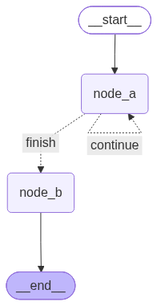
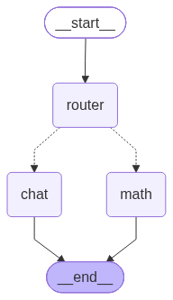
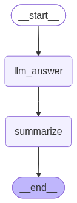

# Day 111_LangGraph Conditional Routing (StateGraph·Router·LLM 연동)

## 📅 2026-07-21

---
# 📄 lgraph3_cond.ipynb — langgraph · conditional routing · stategraph

> LangGraph 조건부 라우팅 (Conditional Routing)

## 🧠 개념 정리

**조건부 엣지(Conditional Routing)**는 LangGraph에서 특정 노드 실행 이후, 상태(State) 값에 따라 **다음에 어떤 노드로 이동할지 동적으로 분기**시키는 기능이다. 일반 `add_edge`가 A → B로 고정된 흐름을 정의하는 것과 달리, `add_conditional_edges`는 "분기 조건 함수"의 반환값에 따라 여러 목적지 중 하나를 선택한다.

핵심 구성 요소:

- **State**: 그래프 실행 동안 노드 간에 전달되는 공유 데이터 구조 (`TypedDict`로 정의)
- **Node**: State를 입력받아 가공한 State를 반환하는 함수
- **route 함수**: State를 보고 다음 노드의 "이름표(문자열 key)"를 반환하는 함수. 실제 노드가 아니라 `add_conditional_edges`의 매핑 딕셔너리에서 사용할 키를 리턴한다
- **add_conditional_edges(출발노드, route함수, {키: 목적지노드, ...})**: route 함수의 반환값을 key로 삼아 매핑된 노드로 이동

이 예제는 `node_a`가 반복 실행되며 `counter`를 증가시키다가, `route_next`가 `counter >= 2` 조건을 만나면 `node_b`로 빠져나가는 **반복(loop) + 종료(finish) 조건부 라우팅** 구조를 보여준다.

---

## 💻 코드 정리 (주석 포함)

### 1. 환경 설정

원본 노트북의 **1번째 셀**. `langgraph` 패키지를 설치하고, State 구조 정의에 필요한 `TypedDict`·`List`와 그래프 빌드에 필요한 `StateGraph`, `END`, `START`를 임포트한다.

```python
# 조건부 엣지(Conditional Routing)
!pip install langgraph

from typing import TypedDict, List    # LangGraph에서는 State 구조 정의에 사용
from langgraph.graph import StateGraph, END, START
```

### 2. State 정의 및 노드 함수

원본 노트북의 **2번째 셀**. 그래프가 들고 다닐 `State` 스키마를 정의하고, 그래프를 구성할 세 함수(`node_a`, `route_next`, `node_b`)를 준비한다.

- `node_a`: 호출될 때마다 `counter`를 1씩 늘리고, 그 값에 맞춰 `alphabet`을 채우는 반복용 노드
- `route_next`: 실제 노드가 아니라 **분기 조건 함수** — `counter` 값을 보고 `"continue"`/`"finish"` 중 하나를 문자열로 반환
- `node_b`: `alphabet`의 첫 값을 꺼내 `processed` 결과를 만드는 종료 처리 노드

```python
# State: 그래프 전체에서 공유되는 데이터 구조
class State(TypedDict):
    counter: int          # 현재까지 실행 횟수(반복 카운터)
    alphabet: List[str]   # node_a가 매 반복마다 채워 넣는 문자열 리스트
    processed: str         # node_b가 최종적으로 가공한 결과 문자열


# node_a: 반복 실행되며 counter를 증가시키고, counter 값에 따라 alphabet 값을 다르게 설정
def node_a(state: State) -> State:
    state['counter'] += 1   # counter 1 증가 (state.counter += 1 와 동일한 의미)

    # counter 값에 따라 다른 문자열을 리스트 형태로 저장
    # (State 타입 힌트가 List[str]이므로 리스트로 감싸서 저장해야 타입 일관성 유지)
    if state['counter'] == 1:
        state['alphabet'] = ['Hello']
    elif state['counter'] == 2:
        state['alphabet'] = ['World']
    else:
        state['alphabet'] = ['Ok']

    print(f"[node_a] counter={state['counter']}, alphabet={state['alphabet']}")
    return state


# route_next: node_a 실행 직후 호출되어, 다음에 어디로 갈지 결정하는 "분기 조건 함수"
# 반환값은 실제 노드 이름이 아니라, add_conditional_edges의 매핑 딕셔너리 key와 매칭됨
def route_next(state: State) -> str:
    if state['counter'] < 2:
        return "continue"   # 아직 반복 필요 → node_a로 되돌아감
    else:
        return "finish"     # 반복 종료 → node_b로 이동


# node_b: node_a에서 누적된 alphabet 값을 바탕으로 최종 가공 처리
def node_b(state: State) -> State:
    text = state.get("alphabet", [""])[0]   # 리스트의 첫 요소(문자열) 추출
    state['processed'] = f"final_processed:{text}"
    print(f"[node_b] processed = {state['processed']}")
    return state
```

### 3. 그래프 구성 및 실행

원본 노트북의 **3번째 셀**. 앞서 정의한 노드들을 실제 `StateGraph`에 등록하고, `add_conditional_edges`로 `node_a`의 분기 로직을 연결한 뒤 그래프를 컴파일·실행한다. 마지막에는 `draw_mermaid_png()`로 그래프 구조를 이미지로 시각화한다.

```python
# 그래프 구성: 노드 등록, 흐름 설정, 반복 + 종료 등의 조건 정의
# 그래프: 실행 흐름을 관리 — 실행 주체는 컴파일된 Graph 런타임이며, 흐름에 따라 해당 함수들을 실행
def build_graph():
    graph = StateGraph(State)

    graph.add_node("node_a", node_a)   # 노드 등록 (이름표, 실행 함수)
    graph.add_node("node_b", node_b)

    graph.set_entry_point("node_a")    # 그래프 시작 지점 지정

    # 조건부 엣지 설정 - 동적 라우팅 구현
    graph.add_conditional_edges(
        "node_a",       # 현재(출발) 노드
        route_next,      # 분기 조건 함수 → "continue" 또는 "finish" 반환
        {
            "continue": "node_a",   # route_next가 "continue" 반환 시 → node_a로 재진입 (반복)
            "finish": "node_b"      # route_next가 "finish" 반환 시 → node_b로 이동 (종료 처리)
        }
    )

    graph.add_edge("node_b", END)   # node_b 실행 후 그래프 종료(END)
    return graph.compile()          # 구성(설계)이 완성된 그래프를 실행 가능한 형태로 컴파일하여 반환


if __name__ == "__main__":
    graph = build_graph()

    # 상태 초기화
    state: State = {
        "counter": 0,
        "alphabet": [],
        "processed": ""
    }

    final_run = graph.invoke(state)   # 그래프 실행 (entry_point부터 END까지)
    print('final_run : ', final_run)
    print()
    print('counter : ', final_run['counter'])
    print('alphabet : ', final_run['alphabet'])
    print('processed : ', final_run['processed'])

    # 그래프 시각화 (mermaid 기반 png 이미지로 렌더링)
    try:
        from IPython.display import Image, display
        graph_obj = graph.get_graph()             # 내부 그래프 객체 얻기
        png_bytes = graph_obj.draw_mermaid_png()   # mermaid 기반 png 이미지 생성
        display(Image(data=png_bytes))
    except Exception as e:
        print('Jupyter notebook 환경이 아니므로 그래프 출력 불가')
        print('에러 : ', e)
```

---

## 📊 출력 결과

```
[node_a] counter=1, alphabet=['Hello']
[node_a] counter=2, alphabet=['World']
[node_b] processed = final_processed:World
final_run :  {'counter': 2, 'alphabet': ['World'], 'processed': 'final_processed:World'}

counter :  2
alphabet :  ['World']
processed :  final_processed:World
```



---

## 🔁 실행 흐름 분석

1. `counter=0`으로 시작 → `node_a` 진입 → `counter=1`, `alphabet=['Hello']`
2. `route_next` 호출 → `counter(1) < 2` → `"continue"` 반환 → 다시 `node_a`로
3. `node_a` 재진입 → `counter=2`, `alphabet=['World']`
4. `route_next` 호출 → `counter(2) < 2` 거짓 → `"finish"` 반환 → `node_b`로 이동
5. `node_b`에서 `alphabet[0]`("World")을 꺼내 `processed = "final_processed:World"` 생성
6. `END`로 종료, 최종 State 반환

→ `node_a`는 정확히 **2번만** 실행되고 종료되는 구조 (`route_next`의 분기 조건이 `counter < 2`이기 때문). counter가 3, 4...로 반복되게 하려면 `route_next`의 조건 값을 조정하면 됨.

## ⚠️ 트러블슈팅 메모

- `state['counter']`를 `State['counter']`(클래스명)로 잘못 쓰면 인스턴스가 아닌 클래스 자체를 수정하려다 에러 발생 → 항상 소문자 `state`(파라미터) 사용
- `alphabet`을 `List[str]`로 선언했다면 노드 내부에서도 문자열이 아닌 **리스트**로 일관되게 담아야 함 (`'Hello'` ❌ → `['Hello']` ✅). 타입 선언과 실제 대입 값이 다르면 `[0]` 인덱싱 시 의도치 않은 결과(예: 문자열의 첫 글자만 추출됨)가 발생
- `add_conditional_edges`의 매핑 딕셔너리 값은 반드시 **노드 이름(문자열)**이어야 함. 함수 객체를 넣으면 `ValueError: Found edge starting at unknown node` 에러 발생
- `set_entry_point`, `route_next(state) -> str:` 등 함수/메서드명 오타에 주의

---
# 📄 lgraph4cond.ipynb — langgraph · conditional routing · query router

> LangGraph 조건부 라우팅 — 질문 유형 분기 (Query Router)

## 🧠 개념 정리

이전 예제(`node_a` 반복 루프)와 달리, 이번 노트북은 **입력 질문의 내용에 따라 서로 다른 노드로 분기**하는 실전형 조건부 라우팅이다. "수학/숫자 관련 질문"이면 `math` 노드로, "일반 질문"이면 `chat` 노드로 보내는 **질문 분류 라우터(Query Router)** 패턴을 구현한다.

핵심 구성:

- **router_node**: 별다른 가공 없이 State를 그대로 통과시키는 "분기 진입점" 역할의 노드
- **route_dicision**: `router_node` 실행 후 호출되는 분기 조건 함수. 질문에 숫자나 `더하기/빼기/곱하기/나누기` 같은 단어가 있으면 `"math"`, 아니면 `"chat"`을 반환
- **math_node / chat_node**: 분류 결과에 따라 각각 다른 형식의 답변 문자열을 생성하는 종착 노드
- 두 노드 모두 `END`로 연결되어, 어느 쪽으로 가든 그래프가 종료됨

즉 그래프 구조는 `router → (조건 분기) → math 또는 chat → END`의 **단일 분기(if/else) 구조**로, 반복 없이 한 번에 끝나는 라우팅 예제다.

---

## 💻 코드 정리 (주석 포함)

### 1. 환경 설정

원본 노트북의 **1번째 셀**. `langgraph` 패키지를 설치하고, State 정의에 필요한 `TypedDict`, 그래프 빌드에 필요한 `StateGraph`/`END`/`START`, 그리고 그래프 시각화용 `Image`/`display`를 임포트한다.

```python
# 조건부 분기를 이용하여 질문 종류에 따라 다른 노드로 이동하기
# 수학/숫자 관련 질문 -> math_node
# 일반 질문 -> chat_node

!pip install langgraph

from typing import TypedDict
from langgraph.graph import StateGraph, END, START
from IPython.display import Image, display
```

### 2. State 정의 및 노드 함수

원본 노트북의 **2번째 셀**. 그래프가 다룰 `RouteState`를 정의하고, 라우팅에 필요한 4개 함수를 준비한다.

- `RouteState`: 사용자 질문(`query`)과 최종 답변(`result`)만 담는 단순 구조
- `math_node` / `chat_node`: 각각 수학 질문 / 일반 질문일 때 실행되어 분류 결과를 담은 답변 문자열을 생성
- `router_node`: 실제 로직 없이 State를 그대로 반환 — 조건부 엣지가 시작되는 "지점" 역할만 담당
- `route_dicision`: **분기 조건 함수**. 질문에 숫자(`isdigit`)가 포함되어 있거나 `더하기/빼기/곱하기/나누기` 단어가 있으면 `"math"`, 아니면 `"chat"`을 반환

```python
# State
class RouteState(TypedDict):
    query: str    # 사용자 질문
    result: str   # 최종 분류/답변 결과

# 수학/숫자 질문으로 분류됐을 때 실행되는 노드
def math_node(state: RouteState) -> RouteState:
    q = state['query']
    answer = f"[MATH NODE] 수학/숫자 관련 질문으로 분류됨 : {q}"
    return {'query': q, "result": answer}

# 일반 질문으로 분류됐을 때 실행되는 노드
def chat_node(state: RouteState) -> RouteState:
    q = state['query']
    answer = f"[CHAT NODE] 일반 질문으로 분류됨 : {q}"
    return {'query': q, "result": answer}

# 라우터 노드: 별도 가공 없이 State를 그대로 통과시킴 (조건부 엣지의 출발점 역할)
def router_node(state: RouteState) -> RouteState:
    return state

# 분기 조건 함수
def route_dicision(state: RouteState) -> str:
    # 상태를 보고 다음으로 이동할 분기 키를 문자열로 반환
    q = state['query'].lower()

    # 질문에 숫자가 하나라도 있거나, 사칙연산 관련 단어가 포함되면 "math"로 분류
    if any(ch.isdigit() for ch in q) or any(word in q for word in ['더하기', '빼기', '곱하기', '나누기']):
        return "math"
    else:
        return "chat"
```

### 3. 그래프 구성 및 실행

원본 노트북의 **3번째 셀**. `router`, `math`, `chat` 세 노드를 등록하고, `router`에서 `route_dicision` 결과에 따라 `math`/`chat`으로 갈라지는 조건부 엣지를 연결한다. 컴파일 후에는 그래프 구조를 `graph.png`로 저장하고, 4개의 테스트 질문으로 실제 라우팅 결과를 확인한다.

```python
# 그래프 구성
def build_graph():
    graph = StateGraph(RouteState)    # 그래프는 RouteState 구조의 데이터를 들고 다니는 파이프라인임

    graph.add_node("router", router_node)
    graph.add_node("math", math_node)
    graph.add_node("chat", chat_node)

    graph.set_entry_point("router")   # 그래프 시작 지점은 router

    # 조건 분기: router 실행 후 route_dicision의 반환값에 따라 math 또는 chat으로 이동
    graph.add_conditional_edges(
        "router",
        route_dicision,
        {
            "math": "math",   # route_dicision이 "math" 반환 시 → math 노드로
            "chat": "chat",   # route_dicision이 "chat" 반환 시 → chat 노드로
        },
    )

    graph.add_edge("math", END)   # math 노드 실행 후 종료
    graph.add_edge("chat", END)   # chat 노드 실행 후 종료

    app = graph.compile()
    # 생성된 그래프 이미지 저장
    g = app.get_graph()
    png_bytes = g.draw_mermaid_png()

    with open("graph.png", 'wb') as f:
        f.write(png_bytes)

    return app

if __name__ == '__main__':
    app = build_graph()

    # 테스트용 질문 목록 (수학형 2개 + 일반형 2개)
    queries = [
        "2 더하기 3은 얼마야?",
        "장말철에 추천하는 차는 뭐가 있니?",
        "10 곱하기 20을 계산해 줘",
        "너를 소개해"
    ]

    for q in queries:
        print('질문 : ', q)
        final_state = app.invoke({'query': q, 'result': ''})
        print('최종 답변 : ', final_state['result'])
```

---

## 📊 출력 결과

```
질문 :  2 더하기 3은 얼마야?
최종 답변 :  [MATH NODE] 수학/숫자 관련 질문으로 분류됨 : 2 더하기 3은 얼마야?
질문 :  장말철에 추천하는 차는 뭐가 있니?
최종 답변 :  [CHAT NODE] 일반 질문으로 분류됨 : 장말철에 추천하는 차는 뭐가 있니?
질문 :  10 곱하기 20을 계산해 줘
최종 답변 :  [MATH NODE] 수학/숫자 관련 질문으로 분류됨 : 10 곱하기 20을 계산해 줘
질문 :  너를 소개해
최종 답변 :  [CHAT NODE] 일반 질문으로 분류됨 : 너를 소개해
```



---

## 🔁 실행 흐름 분석

1. `router` 노드가 먼저 실행되며 State를 그대로 통과시킴 (`__start__ → router`)
2. `route_dicision`이 `query`를 검사 — 숫자나 사칙연산 단어 포함 여부 판단
3. 조건에 따라 `math` 또는 `chat` 중 하나로 분기 (`router → math` 또는 `router → chat`)
4. 선택된 노드가 분류 결과를 담은 `result` 문자열 생성
5. 두 노드 모두 곧바로 `END`로 연결되어 그래프 종료 (`math → __end__` / `chat → __end__`)

→ 4개 질문 중 `"2 더하기 3은 얼마야?"`, `"10 곱하기 20을 계산해 줘"`는 숫자·연산 단어 포함으로 `math`로, 나머지 2개는 `chat`으로 정확히 분류됨.

## ⚠️ 트러블슈팅 메모

- `add_node`로 등록한 이름(`"math"`, `"chat"`)과 `add_edge`/`add_conditional_edges`에서 참조하는 이름이 반드시 일치해야 함. `"math_node"`처럼 함수 이름을 그대로 쓰면 `ValueError: Found edge starting at unknown node` 발생
- `add_conditional_edges`의 매핑 딕셔너리 값은 **노드 이름(문자열)**이어야 하며, `math_node`처럼 함수 객체를 직접 넣으면 안 됨
- `router_node`처럼 로직이 없어도 "분기 시작점"으로 삼을 노드는 별도로 하나 두는 것이 일반적인 패턴 (State를 그대로 반환만 하면 됨)


---
# 📄 lgraph5llm.ipynb — langgraph · llm 연동 · qa pipeline

> LangGraph + LLM 연동 — 질문 응답 & 요약 파이프라인

## 🧠 개념 정리

지금까지의 예제(반복 루프, 질문 분기)는 그래프 내부 로직만으로 동작했다면, 이번 노트북은 **실제 LLM(OpenAI GPT)을 노드 안에서 호출**하는 파이프라인이다. 사용자의 질문을 LLM에 전달해 답변을 생성하고, 그 답변을 다시 다음 노드에서 가공(요약)하는 **선형(순차) 2단계 그래프** 구조를 보여준다.

핵심 흐름:

- `llm_answer` 노드: `ChatOpenAI`를 호출해 질문에 대한 답변을 생성 → State에 `answer` 저장
- `summarize` 노드: `answer`를 받아 간단히 잘라내는 방식으로 요약본 생성 → State에 `summary` 저장
- 두 노드는 조건 분기 없이 `llm_answer → summarize → END`로 고정 연결된 **단순 파이프라인(add_edge)** 구조 — 이전 예제들의 `add_conditional_edges`와 달리 분기가 없다

이 예제는 "LLM 호출 결과를 그래프의 State로 넘겨서 다음 노드가 이어받아 가공한다"는, 실전 LLM 애플리케이션에서 자주 쓰이는 패턴의 최소 형태다.

---

## 💻 코드 정리 (주석 포함)

### 1. 환경 설정

원본 노트북의 **1번째 셀**. LangGraph, LangChain-OpenAI, python-dotenv 등 이번 실습에 필요한 패키지를 설치한다.

```python
# LangGraph + LLM

!pip install langgraph langchain-openai langchain-core python-dotenv
```

### 2. LLM 클라이언트 초기화

원본 노트북의 **2번째 셀**. `.env` 파일에서 `OPENAI_API_KEY`를 불러오고, 키가 없으면 바로 에러를 발생시켜 이후 셀에서 원인 모를 인증 실패가 나지 않도록 방어한다. 이후 그래프 노드에서 공용으로 사용할 `llm` 객체(GPT-4.1-mini, temperature=0.3)를 생성한다.

```python
import os
from typing import TypedDict
from langgraph.graph import StateGraph, END, START
from IPython.display import Image, display
from langchain_openai import ChatOpenAI
from dotenv import load_dotenv

load_dotenv()   # .env 파일에서 환경변수 불러오기

open_api_key = os.getenv("OPENAI_API_KEY")
if not open_api_key:
    raise ValueError("OPENAI_API_KEY 설정 에러")   # 키 없으면 바로 에러로 조기 확인

# temperature=0.3 : 답변의 창의성/무작위성을 낮게 설정 (일관되고 정확한 답변 위주)
llm = ChatOpenAI(model="gpt-4.1-mini", temperature=0.3)
```

### 3. State 정의 및 노드 함수

원본 노트북의 **3번째 셀**. 그래프가 다룰 `QAState`를 정의하고, LLM 답변 생성 노드와 로컬 요약 노드를 준비한다.

- `node_llm_answer`: `question`을 프롬프트에 넣어 LLM을 호출하고, 응답을 `answer`에 저장
- `node_summarize_locally`: LLM을 다시 호출하지 않고, `answer` 문자열을 30자로 잘라 요약처럼 보이게 가공 (실제 서비스라면 이 부분도 LLM 요약으로 대체 가능)

```python
# State
class QAState(TypedDict):    # total = False : 모든 키가 필수는 아님
    question: str   # 사용자 질문
    answer: str      # LLM이 생성한 답변
    summary: str     # 답변을 요약한 결과

# node
def node_llm_answer(state: QAState) -> QAState:
    question = state['question']

    prompt = f"""
    너는 친절한 한국어 도우미야.
    아래 질문에 대해 10문장 이내로 설명해 줘,

    질문 :
    {question}
  """

    resp = llm.invoke(prompt)      # LLM 호출
    answer_text = resp.content     # 응답 텍스트 추출
    print('LLM 답변 : ', answer_text)

    return {
        **state,              # 기존 State(question 등) 유지
        'answer': answer_text  # answer 필드만 갱신
    }


def node_summarize_locally(state: QAState) -> QAState:
    # 원래는 LLM이 요약해야 하나 여기서는 그냥 앞 글자 일부만 잘라서 요약처럼 보이게 하기
    answer = state.get("answer", "")

    short = answer.strip().replace("\n", " ")
    if len(short) > 30:
        short = short[:30] + "..."

    summary = f"요약 내용 : {short}"

    return {
        **state,
        'summary': summary
    }
```

### 4. 그래프 구성 및 실행

원본 노트북의 **4번째 셀**. `llm_answer → summarize → END`로 이어지는 순차 그래프를 만들고, 실제 질문("양자 컴퓨팅에 대해 알고 싶어")을 입력해 실행한다. 조건부 분기가 없으므로 `add_conditional_edges` 대신 단순 `add_edge`만 사용한다.

```python
# graph 구성
def build_graph():
    graph = StateGraph(QAState)

    graph.add_node("llm_answer", node_llm_answer)
    graph.add_node("summarize", node_summarize_locally)

    graph.set_entry_point("llm_answer")   # 시작 노드는 llm_answer

    graph.add_edge("llm_answer", "summarize")   # llm_answer 실행 후 summarize로 (고정 흐름)
    graph.add_edge("summarize", END)             # summarize 실행 후 종료

    return graph.compile()

if __name__ == "__main__":
    app = build_graph()

    # 질문
    init_state: QAState = {
        "question": "양자 컴퓨팅에 대해 알고 싶어. 친절하게 설명해 줘"
    }

    final_state = app.invoke(init_state)
    print('\n질문 : ', final_state['question'])
    print('\n답변 : ', final_state['answer'])
    print('\n답변 요약 : ', final_state['summary'])

    try:
        from IPython.display import Image, display
        graph_obj = app.get_graph()             # 내부 그래프 객체 얻기
        png_bytes = graph_obj.draw_mermaid_png()  # mermaid 기반 png 이미지 얻기
        display(Image(data=png_bytes))
    except Exception as e:
        print('Jupyter notebook 환경이 아니므로 그래프 출력 불가')
        print('에러 : ', e)
```

---

## 📊 출력 결과

```
LLM 답변 :  양자 컴퓨팅은 기존 컴퓨터와 달리 양자 비트(큐비트)를 사용하는 새로운 컴퓨팅 방식이에요. 큐비트는 0과 1 상태를 동시에 가질 수 있는 중첩(superposition) 상태를 특징으로 해요. 이 덕분에 양자 컴퓨터는 복잡한 계산을 병렬로 빠르게 처리할 수 있죠. 또한, 얽힘(entanglement)이라는 현상으로 큐비트들 간에 강한 연관성을 만들어 계산 효율을 높여요. 이런 특성 때문에 암호 해독, 최적화 문제, 신약 개발 등에서 큰 잠재력을 가지고 있어요. 하지만 현재는 기술적 한계로 인해 상용화가 아직 초기 단계에 있어요. 양자 컴퓨팅은 미래의 혁신적인 기술로 기대받고 있답니다.

질문 :  양자 컴퓨팅에 대해 알고 싶어. 친절하게 설명해 줘

답변 :  양자 컴퓨팅은 기존 컴퓨터와 달리 양자 비트(큐비트)를 사용하는 새로운 컴퓨팅 방식이에요. 큐비트는 0과 1 상태를 동시에 가질 수 있는 중첩(superposition) 상태를 특징으로 해요. 이 덕분에 양자 컴퓨터는 복잡한 계산을 병렬로 빠르게 처리할 수 있죠. 또한, 얽힘(entanglement)이라는 현상으로 큐비트들 간에 강한 연관성을 만들어 계산 효율을 높여요. 이런 특성 때문에 암호 해독, 최적화 문제, 신약 개발 등에서 큰 잠재력을 가지고 있어요. 하지만 현재는 기술적 한계로 인해 상용화가 아직 초기 단계에 있어요. 양자 컴퓨팅은 미래의 혁신적인 기술로 기대받고 있답니다.

답변 요약 :  요약 내용 : 양자 컴퓨팅은 기존 컴퓨터와 달리 양자 비트(큐비트)를...
```



---

## 🔁 실행 흐름 분석

1. `init_state`로 `question`만 채운 채 그래프 실행 시작 (`__start__ → llm_answer`)
2. `llm_answer` 노드가 프롬프트를 구성해 `llm.invoke()` 호출 → LLM 응답을 `answer`에 저장
3. `llm_answer → summarize`로 고정 이동 (조건 분기 없음)
4. `summarize` 노드가 `answer`를 30자로 잘라 `summary` 생성 (LLM 재호출 없이 로컬 문자열 처리)
5. `summarize → END`로 종료, `question`/`answer`/`summary`가 모두 채워진 최종 State 반환

→ 조건부 라우팅 예제들과 달리 **분기 없는 순차 파이프라인**이라, `add_conditional_edges` 대신 `add_edge`만으로 흐름이 구성된 점이 구조적 차이.

## ⚠️ 트러블슈팅 메모

- `from langchain_openai import ChatOpenAI` 임포트 시 `ModuleNotFoundError`가 나면 1번 셀의 `!pip install langgraph langchain-openai langchain-core python-dotenv`가 먼저 실행됐는지 확인 (패키지명 오타 주의: `langchian` ❌ → `langchain` ✅)
- `OPENAI_API_KEY`가 없으면 `.env` 파일 위치나 `load_dotenv()` 호출 여부부터 점검. 키 없이 `ChatOpenAI` 호출 시 인증 에러가 나므로, 미리 `raise ValueError`로 방어하는 패턴이 유용함
- `node_summarize_locally`는 실제 LLM 요약이 아니라 문자열 슬라이싱(`short[:30]`)이라는 점 — 프로덕션에서는 이 부분도 LLM 호출로 교체 가능
- `return {**state, 'answer': answer_text}` 패턴은 기존 State를 유지하면서 특정 필드만 갱신하는 관용적인 방식 — 매번 전체 딕셔너리를 새로 만들 필요 없음