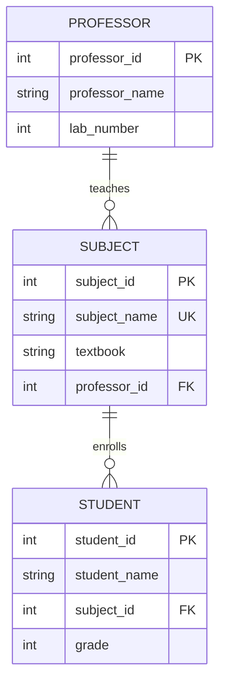

# Day 11_CRUD, 키, 인덱스

# 📅 2026-02-11
---
## 1. 정규화 (Normalization)

### 목적

- 데이터 중복 제거
    
- 이상(Anomaly) 방지
    
- 구조 안정성 확보
    

### 이상(Anomaly)

|종류|설명|
|---|---|
|삽입 이상|불필요한 데이터까지 함께 삽입|
|삭제 이상|일부 삭제 시 다른 정보도 같이 손실|
|갱신 이상|일부만 수정되어 데이터 불일치|

### 정규형 단계

|정규형|핵심 조건|
|---|---|
|1NF|모든 속성은 원자값|
|2NF|부분 함수 종속 제거|
|3NF|이행적 함수 종속 제거|
|BCNF|모든 결정자가 후보키|

---

## 2. 관계형 DB 구조

### 기본 개념 대응

|관계 모델|파일 시스템|
|---|---|
|릴레이션|파일|
|튜플|레코드 (행)|
|속성|필드 (열)|
|차수 (Degree)|속성 개수|
|카디널리티|튜플 개수|

### 용어 정리

- Tuple = 행
    
- Attribute = 열
    
- Domain = 속성이 가질 수 있는 값의 범위
    

---

## 3. 키 (Key)

|키 종류|설명|
|---|---|
|기본키 (PK)|유일 + 최소, NULL 불가|
|후보키|PK가 될 수 있는 키|
|대체키|후보키 중 PK 제외|
|외래키 (FK)|다른 릴레이션의 PK 참조|

---

## 4. 무결성 제약조건

|종류|의미|
|---|---|
|개체 무결성|PK는 NULL, 중복 불가|
|참조 무결성|FK는 참조 대상이 반드시 존재|
|도메인 무결성|속성은 정해진 범위 내 값|

---

## 5. 관계대수

### 순수 연산자

|연산|기호|의미|
|---|---|---|
|Select|σ|행 선택|
|Project|π|열 선택|
|Join|▷◁|릴레이션 결합|
|Division|÷|모든 조건 만족|

### 집합 연산

- 합집합 (Union)
    
- 교집합 (Intersection)
    
- 차집합 (Difference)
    
- 교차곱 (Cartesian Product)
    

---

## 6. SQL 분류

|분류|설명|명령어|
|---|---|---|
|DDL|구조 정의|CREATE, ALTER, DROP|
|DML|데이터 조작|SELECT, INSERT, UPDATE, DELETE|
|DCL|권한 제어|GRANT, REVOKE, COMMIT, ROLLBACK|

---

## 7. SELECT 기본 구조

SELECT 속성  
FROM 테이블  
WHERE 조건  
GROUP BY 속성  
HAVING 조건  
ORDER BY 속성 ASC/DESC;

### 자주 나오는 키워드

- DISTINCT : 중복 제거
    
- LIKE : 패턴 검색
    
- IS NULL : NULL 검색
    
- GROUP BY : 그룹화
    
- HAVING : 그룹 조건
    

---

## 8. 트랜잭션 제어

- COMMIT : 저장 확정
    
- ROLLBACK : 이전 상태로 복구
    

---

## 9. 내장 SQL

- 프로그램 안에 SQL 포함
    
- 일반 SQL : 여러 튜플 반환
    
- 내장 SQL : 보통 단일 튜플 반환

---
## 10. MariaDB 실습 (DB 생성 및 CRUD)

### 10-1. MariaDB 접속

```sql
mariadb -h127.0.0.1 -uroot -p
```

- -h : 호스트 지정 (127.0.0.1 = 로컬)
    
- -u : 사용자 (root)
    
- -p : 비밀번호 입력
    

---

### 10-2. 데이터베이스 확인

```sql
show databases;
```

기본 시스템 DB:

- information_schema
    
- mysql
    
- performance_schema
    
- sys
    
- test
    

---

### 10-3. 데이터베이스 생성

```sql
create database exdb;
```

→ exdb 생성 완료

확인:

```sql
show databases;
```

---

### 10-4. 데이터베이스 선택

```sql
use exdb;
```

현재 작업 DB 변경

---

### 10-5. 테이블 확인

```sql
show tables;
```

→ 테이블 없음 (Empty set)

---

### 10-6. 다른 DB 사용

```sql
use test;
```

---

### 10-7. 테이블 구조 확인

```sql
desc mytab;
```

구조:

|Field|Type|Null|Key|
|---|---|---|---|
|no|int(11)|YES||
|name|varchar(10)|YES||

- PK 없음
    
- NULL 허용 상태
    

---

### 10-8. 데이터 조회 (SELECT)

```sql
select * from mytab;
```

전체 데이터 출력

---

### 10-9. 데이터 수정 (UPDATE)

```sql
update mytab
set name = '홍길동'
where no = 1;
```

- 조건에 맞는 행만 수정
    
- WHERE 없으면 전체 수정 (주의)
    

---

### 10-10. 데이터 삭제 (DELETE)

```sql
delete from mytab
where no = 2;
```

조건에 맞는 행 삭제

---

### 10-11. 테이블 삭제

```sql
drop table mytab;
```

→ 테이블 완전 삭제

---

### 10-12. 오타 발생

```sql
show databaes;
```

→ ERROR 1064 (문법 오류)  
→ databases 오타

---

### 10-13. 데이터베이스 삭제

```sql
drop database exdb;
```

→ exdb 완전 삭제

---
## 11. 테이블 생성 및 기본 CRUD

### dept 테이블 생성

```sql
CREATE TABLE dept(NO INT PRIMARY KEY, NAME VARCHAR(10),
tel VARCHAR(15), inwon INT, addr TEXT) CHARSET=UTF8;   -- 테이블 생성
```
- NO : 기본키 (PK)
- VARCHAR(10) : 최대 10글자
- CHARSET=UTF8 : 한글 입력 가능
- PRIMARY KEY → NOT NULL + UNIQUE 자동 포함

---
### 자료 추가 (INSERT)

```sql
# insert into 테이블명 (칼럼명,...) values(입력자료,...)
INSERT INTO dept(NO,NAME,tel,inwon,addr) VALUES(1,'인사과','111-1111',3,'삼성동12');
INSERT INTO dept VALUES(2,'영업과','111-2222',5,'서초동12');
INSERT INTO dept(NO,NAME) VALUES(3, '자재과');
INSERT INTO dept(NO,addr,tel,NAME) VALUES(4, '역삼2동33','111-5555','자재2과');
```
- 칼럼명 지정 시 순서 달라도 가능
- 일부 칼럼 생략 가능 (PK 제외)
- 전체 VALUES 사용 시 모든 칼럼 값 필요

### 오류 예제

```sql
INSERT INTO dept VALUES(5, '판매과');  
-- err : 입력자료와 칼럼 갯수 불일치
```

```sql
INSERT INTO dept(NAME, tel) VALUES('판매과2', '111-6666');  
-- err : NO는 PK, 생략 불가
```

```sql
INSERT INTO dept(NO,NAME) VALUES(5, '판매과부서는 사람들이 좋아 일하기 좋은 우수한 부서임')
-- err : VARCHAR(10) 길이 초과
```

---

## 조회 (SELECT)

```sql
SELECT * FROM dept;
SELECT * FROM dept WHERE NO=1;
```

- 전체 조회

| NO  | NAME | tel      | inwon | addr   |
| --- | ---- | -------- | ----- | ------ |
| 1   | 인사과  | 111-1111 | 3     | 삼성동12  |
| 2   | 영업과  | 111-2222 | 5     | 서초동12  |
| 3   | 자재과  | NULL     | NULL  | NULL   |
| 4   | 자재2과 | 111-5555 | NULL  | 역삼2동33 |

- 조건 조회

| NO  | NAME | tel      | inwon | addr  |
| --- | ---- | -------- | ----- | ----- |
| 1   | 인사과  | 111-1111 | 3     | 삼성동12 |

---

## 수정 (UPDATE)

```sql
UPDATE dept SET tel='123-4567' WHERE NO=2;
UPDATE dept SET addr='압구정동33', inwon=7, tel='777-8888' WHERE NO=3;
SELECT * FROM dept;
```

| NO  | NAME | tel      | inwon | addr   |
| --- | ---- | -------- | ----- | ------ |
| 1   | 인사과  | 111-1111 | 3     | 삼성동12  |
| 2   | 영업과  | 123-4567 | 5     | 서초동12  |
| 3   | 자재과  | 777-8888 | 7     | 압구정동33 |
| 4   | 자재2과 | 111-5555 | NULL  | 역삼2동33 |

주의

- WHERE 없으면 전체 수정
    
- PK는 일반적으로 수정하지 않음
    

---

## 삭제 (DELETE vs TRUNCATE)

```sql
DELETE FROM dept WHERE NAME='자재2과';
```

| NO  | NAME | tel      | inwon | addr   |
| --- | ---- | -------- | ----- | ------ |
| 1   | 인사과  | 111-1111 | 3     | 삼성동12  |
| 2   | 영업과  | 123-4567 | 5     | 서초동12  |
| 3   | 자재과  | 777-8888 | 7     | 압구정동33 |

- 조건 삭제 가능
    

```sql
TRUNCATE TABLE dept;
```

- 전체 삭제
    
- WHERE 사용 불가
    
- 구조는 유지
    

```sql
SELECT * FROM dept;
```

```sql
Empty set (0 rows)
```

---
## 테이블 삭제

```sql
DROP TABLE dept;   -- 테이블 자체 (구조, 자료)가 제거됨
```

---

## 12. 무결성 제약 조건

무결성 제약 조건이란  
잘못된 자료 입력을 방지하기 위한 제한 규칙

---

## PRIMARY KEY 제약

```sql
CREATE TABLE aa(bun INT PRIMARY KEY, irum CHAR(10));  
-- bun : NOT NULL, UNIQUE
```

확인:

```sql
SELECT * FROM information_schema.table_constraints WHERE TABLE_NAME='aa';
```

| constraint_name | constraint_type |
| --------------- | --------------- |
| PRIMARY         | PRIMARY KEY     |

입력 테스트:

```sql
INSERT INTO aa VALUES(1,'tom');
INSERT INTO aa VALUES(2,'tom');
INSERT INTO aa VALUES(2,'tom');      # err (중복)
INSERT INTO aa(irum) VALUES('tom');  # err (PK 누락)
INSERT INTO aa(bun) VALUES('3');
SELECT * FROM aa;
```

| bun | irum |
| --- | ---- |
| 1   | tom  |
| 2   | tom  |
| 3   | NULL |

테이블 삭제:

```sql
DROP TABLE aa;
```

---

## 제약조건 이름 지정

```sql
CREATE TABLE aa(bun INT, irum CHAR(10), 
CONSTRAINT aa_bun_pk PRIMARY KEY(bun));
```

```sql
INSERT INTO aa VALUES(1,'tom');
SELECT * FROM aa;
DROP TABLE aa;
```

| bun | irum |
| --- | ---- |
| 1   | tom  |

---

## CHECK 제약

```sql
CREATE TABLE aa(bun INT, nai INT CHECK(nai >= 20));
```

```sql
INSERT INTO aa VALUES(1,23);
INSERT INTO aa VALUES(2,13);    -- err
SELECT * FROM aa;
DROP TABLE aa;
```

| bun | nai |
| --- | --- |
| 1   | 23  |

설명

- 조건을 만족하지 않으면 입력 불가
    
- 도메인 무결성 보장
    

---

## UNIQUE 제약

```sql
CREATE TABLE aa(bun INT, irum CHAR(10) NOT NULL UNIQUE);
```

```sql
INSERT INTO aa VALUES(1,'tom');
INSERT INTO aa VALUES(2,'john');
INSERT INTO aa VALUES(3,'john');   -- err
SELECT * FROM aa;
DROP TABLE aa;
```

| bun | irum |
| --- | ---- |
| 1   | tom  |
| 2   | john |
설명

- 특정 컬럼 중복 금지
    
- NULL 허용 여부는 별도 지정
    

---

## FOREIGN KEY (참조 무결성)

외래키(FK)는  
다른 테이블의 PK를 참조한다.

---

## 부모 테이블 생성

```sql
CREATE TABLE jikwon(bun INT PRIMARY KEY, irum VARCHAR(10) NOT NULL,
buser CHAR(10) NOT NULL);
```

```sql
INSERT INTO jikwon VALUES(1, '한송이', '인사과');
INSERT INTO jikwon VALUES(2, '이기자', '인사과');
INSERT INTO jikwon VALUES(3, '한송이', '판매과');
SELECT * FROM jikwon;
```

|bun|irum|buser|
|---|---|---|
|1|한송이|인사과|
|2|이기자|인사과|
|3|한송이|판매과|

---

## 자식 테이블 생성

```sql
CREATE TABLE gajok(CODE INT PRIMARY KEY, NAME VARCHAR(10) NOT NULL,
birth DATETIME, jikwonbun INT, 
FOREIGN KEY(jikwonbun) REFERENCES jikwon(bun));
```

---

## 정상 입력

```sql
INSERT INTO gajok VALUES(10, '한가해','2015-05-12',3);
INSERT INTO gajok VALUES(20, '공기밥','2011-12-12',2);
```

|CODE|NAME|birth|jikwonbun|
|---|---|---|---|
|10|한가해|2015-05-12|3|
|20|공기밥|2011-12-12|2|

---

## 오류 발생 (참조 무결성 위반)

```sql
INSERT INTO gajok VALUES(30, '김밥','2011-12-12',5);   -- err
```

---

## 부모 삭제 시 오류

```sql
DELETE FROM jikwon WHERE bun=1;
DELETE FROM jikwon WHERE bun=3;   -- 참조 자료(가족)가 있으므로 삭제 불가
DROP TABLE jikwon;                -- err
```

---

## 삭제 순서 (중요)

항상

자식 → 부모

```sql
DELETE FROM gajok WHERE jikwonbun = 2;   -- 1) 참조 자료 삭제
DELETE FROM jikwon WHERE bun=2;          -- 2) 부모 삭제
SELECT * FROM jikwon;
```

|bun|irum|buser|
|---|---|---|
|3|한송이|판매과|

---

## 참고 (CASCADE)

```sql
-- CREATE TABLE gajok(CODE INT PRIMARY KEY, ...) ON DELETE CASCADE
```

- 부모 삭제 시 자식 자동 삭제
    
- 실무에서 신중 사용
    

---

## 13️. DEFAULT + AUTO_INCREMENT

```sql
CREATE TABLE aa(
bun INT AUTO_INCREMENT PRIMARY KEY , 
juso CHAR(20) DEFAULT '강남구 역삼동');
```

설명

- AUTO_INCREMENT → 자동 증가
    
- DEFAULT → 값 생략 시 기본값 입력
    

입력 예

```sql
INSERT INTO aa VALUES(1, '서초구 서초2동');
INSERT INTO aa(juso) VALUES('서초구 서초3동');
INSERT INTO aa(bun) VALUES(5);
INSERT INTO aa(bun) VALUES(6);
SELECT * FROM aa;
DROP TABLE aa;
```

|bun|juso|
|---|---|
|1|서초구 서초2동|
|2|서초구 서초3동|
|5|강남구 역삼동|
|6|강남구 역삼동|

핵심 정리

- AUTO_INCREMENT는 PK와 함께 사용
    
- 삭제해도 번호 재사용 안 함
    
- DEFAULT는 NULL 예방 목적


---

---
### 13-1. 교수 테이블 (부모)
```sql
CREATE TABLE 교수(
    교수코드 INT PRIMARY KEY,
    교수명 VARCHAR(10),
    연구실 INT CHECK (연구실 >= 100 AND 연구실 <= 500)
);
```
설명

- 교수코드 : 기본키 (PK)
    
- 연구실 : 100 ~ 500 범위 제한 (도메인 무결성)
    
- PRIMARY KEY는 자동으로 NOT NULL + UNIQUE

---
### 13-2. 과목 테이블 (교수 참조)
```sql
CREATE TABLE 과목(
    과목코드 INT AUTO_INCREMENT PRIMARY KEY,
    과목명 VARCHAR(10) NOT NULL UNIQUE,
    교재명 VARCHAR(10),
    담당교수 INT,
    FOREIGN KEY(담당교수)
        REFERENCES 교수(교수코드)
);
```
- 과목코드 : AUTO_INCREMENT (자동 증가)
    
- 과목명 : NOT NULL + UNIQUE
    
- 담당교수 : 교수(교수코드) 참조
    
- FK는 반드시 PK 또는 UNIQUE를 참조

---
### 13-3. 학생 테이블 (과목 참조)
```sql
CREATE TABLE 학생(
    학번 INT PRIMARY KEY,
    학생명 VARCHAR(10),
    수강과목 INT,
    학년 INT DEFAULT 1 CHECK (학년 >= 1 AND 학생 <= 4),
    FOREIGN KEY(수강과목)
        REFERENCES 과목(과목코드)
);
```
- 학번 : 기본키
    
- 수강과목 : 과목코드 참조 (숫자 FK 사용이 정석)
    
- 학년 : 기본값 1
    
- 학년 범위 : 1 ~ 4

---
### 삭제 순서

테이블 삭제는 반드시

자식 → 부모

```sql
DROP TABLE 학생;
DROP TABLE 과목;
DROP TABLE 교수;
```

이 순서 아니면 외래키 오류 발생

---
## 14. Index(색인)

### 인덱스 개념

- 검색 속도 향상을 위해 특정 컬럼에 색인 부여
    
- PK 컬럼은 자동으로 인덱싱됨
    
- 기본 정렬은 오름차순(ASC)
    

주의

- 입력(INSERT), 수정(UPDATE), 삭제(DELETE)가 빈번한 경우  
    → 인덱스는 오히려 성능 저하 가능  
    → 데이터 변경 시 인덱스도 함께 갱신되기 때문
    

---

### 14-1. 인덱스 생성 및 확인

### 테이블 생성

```sql
CREATE TABLE aa(
bun INT PRIMARY KEY,
irum VARCHAR(10) NOT NULL,
juso VARCHAR(50)
);
```

```sql
INSERT INTO aa VALUES(1, '신선해', '테헤란로111');
```

### 인덱스 생성

```sql
ALTER TABLE aa ADD INDEX ind_juso(juso);
```

→ juso 컬럼에 ind_juso 이름의 인덱스 생성

---
### 14-2. 인덱스 확인

```sql
SELECT * FROM aa;
```

| bun | irum | juso    |
| --- | ---- | ------- |
| 1   | 신선해  | 테헤란로111 |

```sql
EXPLAIN SELECT * FROM aa;
```

|id|select_type|table|type|possible_keys|key|key_len|ref|rows|Extra|
|---|---|---|---|---|---|---|---|---|---|
|1|SIMPLE|aa|ALL|NULL|NULL|NULL|NULL|1||

```sql
DESC aa;
```

|Field|Type|Null|Key|Default|Extra|
|---|---|---|---|---|---|
|bun|int|NO|PRI|NULL||
|irum|varchar(10)|NO||NULL||
|juso|varchar(50)|YES|MUL|NULL||

```sql
SHOW INDEX FROM aa;
```

|Table|Non_unique|Key_name|Column_name|
|---|---|---|---|
|aa|0|PRIMARY|bun|
|aa|1|ind_juso|juso|

정리

- EXPLAIN : 쿼리 실행 계획 확인
    
- SHOW INDEX FROM 테이블명 : 인덱스 정보 확인
    
- DESC : 테이블 구조 확인
    

---
### 14-3. 인덱스 삭제

```sql
ALTER TABLE aa DROP INDEX ind_juso;
SHOW INDEX FROM aa;
```

|Table|Non_unique|Key_name|Column_name|
|---|---|---|---|
|aa|0|PRIMARY|bun|

---
### 14-4. 테이블 삭제

```sql
DROP TABLE aa;
```

---
### 14-5. 테이블 관련 주요 명령

기본 3대 명령

- CREATE TABLE
    
- ALTER TABLE
    
- DROP TABLE
    

---
### 14-6. 테이블 생성

```sql
CREATE TABLE aa(
bun INT,
irum VARCHAR(10),
juso VARCHAR(50)
);
```

```sql
INSERT INTO aa VALUES(1, 'tom', 'seoul');
SELECT * FROM aa;
```

|bun|irum|juso|
|---|---|---|
|1|tom|seoul|

---
### 14-7. 테이블 이름 변경

```sql
ALTER TABLE aa RENAME kbs;
SELECT * FROM kbs;
ALTER TABLE kbs RENAME aa;
```

|bun|irum|juso|
|---|---|---|
|1|tom|seoul|

정리

- RENAME : 테이블명 변경
    

---
### 14-8. 컬럼 추가 (ADD)

```sql
ALTER TABLE aa ADD (job_id INT DEFAULT 10);
SELECT * FROM aa;
```

|bun|irum|juso|job_id|
|---|---|---|---|
|1|tom|seoul|10|

특징

- 새 컬럼이 마지막에 추가됨
    
- DEFAULT 값 자동 적용
    

---
### 14-9. 컬럼 수정 (CHANGE)

```sql
ALTER TABLE aa CHANGE job_id job_num INT;
SELECT * FROM aa;
```

|bun|irum|juso|job_num|
|---|---|---|---|
|1|tom|seoul|10|

특징

- 컬럼 이름 변경 가능
    
- 데이터 타입도 함께 지정해야 함
    

---
### 14-10. 컬럼 속성 변경 (MODIFY)

```sql
ALTER TABLE aa MODIFY job_num VARCHAR(10);
DESC aa;
```

|Field|Type|
|---|---|
|bun|int|
|irum|varchar(10)|
|juso|varchar(50)|
|job_num|varchar(10)|

특징

- 컬럼 이름은 그대로
    
- 데이터 타입/속성만 변경
    

---
### 14-11. 컬럼 삭제 (DROP COLUMN)

```sql
ALTER TABLE aa DROP COLUMN job_num;
DESC aa;
```

|Field|Type|
|---|---|
|bun|int|
|irum|varchar(10)|
|juso|varchar(50)|
