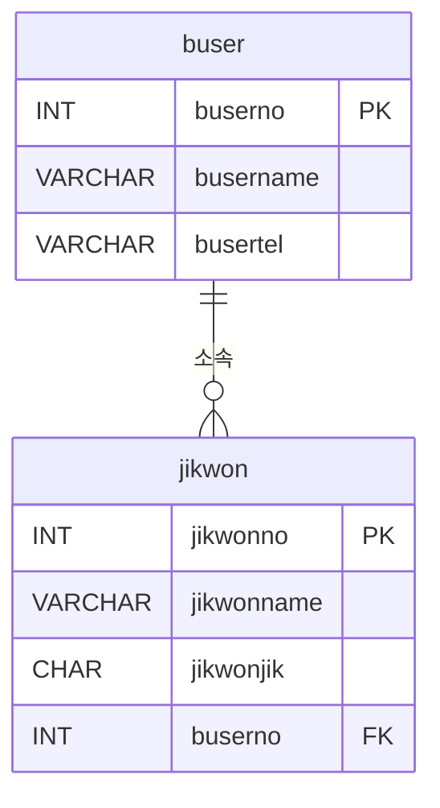

# Day 15_DB 계정권한 관리와 안전한 Python 연동

# 📅 2026-02-24

---
# 1️⃣ PostgreSQL 맛보기 (실무에서 자주 사용)

실무에서 많이 사용하는 DB:

- **PostgreSQL Global Development Group** → PostgreSQL
    
- **MariaDB Corporation** → MariaDB
    

### ✔ PostgreSQL 특징

- 오픈소스
    
- 표준 SQL 엄격히 준수
    
- 실무/스타트업에서 매우 많이 사용
    
- JSON 처리 강함
    
- 확장성 좋음
    

👉 ML 엔지니어/백엔드 기준  
요즘 실무에서는 PostgreSQL 사용 빈도 높음

---

# 2️⃣ MariaDB 명령프롬프트 접속

### 2-1. 접속 방법

```sql
mariadb -uroot -p
```

또는

```sql
mariadb -h 127.0.0.1 -u testuser -p
```

✔ `-h` → host  
✔ `-u` → user  
✔ `-p` → password 입력

---

# 3️⃣ 데이터베이스 기본 확인

```sql
show databases;  
use test;  
show tables;
```

✔ DB 선택 → `use`  
✔ 테이블 확인 → `show tables`

---

# 4️⃣ 데이터베이스 생성 & 테이블 생성

```sql
create database mydb;  
use mydb;  
  
create table abctab(  
    no int primary key,  
    name varchar(10)  
);
```

---

# 5️⃣ 사용자(User) 생성

```sql
CREATE USER 'testuser'@'%' IDENTIFIED BY '1234';  
CREATE USER 'testuser2'@'localhost' IDENTIFIED BY '1234';
```

### ✔ 의미

|계정|의미|
|---|---|
|'%'|원격 접속 허용|
|'localhost'|로컬 접속만 허용|

---
## 🔐 5-1. 비밀번호는 어떻게 저장될까? (암호화 개념)

MariaDB는 비밀번호를 **평문으로 저장하지 않는다.**

SELECT User, Host FROM mysql.user;

→ 내부적으로 **해시(Hash) 값**으로 저장됨

---
## 🔎 암호화 알고리즘 종류

### 1️⃣ 단방향 암호화 (Hash)

- 복호화 불가능
    
- 비밀번호 저장에 사용

대표 알고리즘:

- MD5 (현재는 취약)
    
- SHA-1 (취약)
    
- SHA-256
    
- SHA-512
    
- bcrypt
    
- Argon2

👉 DB 비밀번호는 **해시 기반 저장**

---

### 2️⃣ 양방향 암호화 (Encryption)

- 복호화 가능
    
- 데이터 자체 보호 목적
    

대표 알고리즘:

- AES (대칭키 암호화)
    
- RSA (비대칭키 암호화)
    

---

### 🔥 정리

|구분|복호화|사용 목적|
|---|---|---|
|Hash|❌ 불가능|비밀번호 저장|
|AES/RSA|⭕ 가능|데이터 암호화|

👉 `IDENTIFIED BY '1234'`  
실제로는 내부적으로 해시 처리되어 저장됨


---

# 6️⃣ 권한 부여 (GRANT)

### 6-1. 전체 DB 권한

```sql
GRANT ALL PRIVILEGES ON mydb.* TO 'testuser'@'%';
```

✔ mydb 안의 모든 테이블에 대해 모든 권한

---

### 6-2. 특정 테이블 일부 권한

```sql
GRANT SELECT, UPDATE ON mydb.abctab TO 'testuser'@'%';
```

✔ SELECT 가능  
✔ UPDATE 가능  
❌ INSERT 불가  
❌ DELETE 불가

실제로 너가 확인한 것처럼:

insert → ERROR 1142  
delete → ERROR 1142

👉 권한이 없어서 거부됨

---

# 7️⃣ 권한 확인

```sql
SHOW GRANTS FOR 'testuser'@'%';
```

---

# 8️⃣ 권한 회수 (REVOKE)

```sql
REVOKE ALL PRIVILEGES ON mydb.* FROM 'testuser'@'%';
```

✔ 부여했던 권한 제거

---

# 9️⃣ 사용자 삭제

```sql
DROP USER 'testuser'@'%';  
DROP USER 'testuser2'@'localhost';
```

---
# 🔟 ERD 실습: 부서(buser)와 직원(jikwon)

### 10-1. 테이블 생성

```sql
CREATE TABLE buser  
(  
  buserno   INT         NOT NULL,  
  busername VARCHAR(10) NOT NULL,  
  busertel  VARCHAR(15) NULL,  
  PRIMARY KEY (buserno)  
);  
  
CREATE TABLE jikwon  
(  
  jikwonno   INT         NOT NULL,  
  jikwonname VARCHAR(10) NOT NULL,  
  jikwonjik  CHAR(10)    NULL DEFAULT '사원',  
  buserno    INT         NOT NULL,  
  PRIMARY KEY (jikwonno)  
);  
  
ALTER TABLE jikwon  
  ADD CONSTRAINT FK_buser_TO_jikwon  
    FOREIGN KEY (buserno)  
    REFERENCES buser (buserno);
```

---

### 10-2. ERD (Mermaid 코드)

옵시디언 / 깃허브에서 바로 사용 가능:



- `||--o{` → 1:N 관계 (부서:직원)
    
- PK = Primary Key, FK = Foreign Key
    

---

### 10-3. 실무 포인트

1. FK 설정으로 **데이터 무결성 유지**
    
2. 부서 삭제 시 `ON DELETE CASCADE` 옵션으로 연쇄 삭제 가능
    
3. ERD에서 **PK/FK 표시 + 1:N 화살표**가 중요


---
# 11️. Python SQLite3 실습 (개인용 DB)

- Python 내장 DB → **sqlite3 모듈** 사용
    
- 모바일/임베디드, 테스트용 DB에 적합
    
- 메모리 DB(`:memory:`) → 프로그램 종료 시 휘발성

---

### 11-1. DB 생성 & 테이블 생성

```python
import sqlite3  
  
# SQLite3 버전 확인  
print(sqlite3.sqlite_version)  
  
# 파일 DB  
# conn = sqlite3.connect('exam.db')  
  
# 메모리 DB (RAM에만 존재)  
conn = sqlite3.connect(':memory:')  
  
# SQL 실행을 위한 Cursor 생성  
cur = conn.cursor()  
  
# 테이블 생성  
cur.execute("""  
    CREATE TABLE IF NOT EXISTS friends (  
        name TEXT,  
        phone TEXT,  
        addr TEXT  
    )  
""")
```

💡 **설명**

- `sqlite3.connect()` → DB 연결
    
    - 파일 DB: `'exam.db'`
    
    - 메모리 DB: `':memory:'` → 프로그램 종료 시 데이터 사라짐
    
- `cursor()` → SQL문을 실행하고 결과를 받아올 수 있는 **통로**
    
- `CREATE TABLE IF NOT EXISTS` → 이미 테이블이 있으면 새로 생성하지 않음

---

### 11-2. 데이터 삽입

```python
# 직접 값 삽입  
cur.execute("INSERT INTO friends VALUES('홍길동','222-2222','서초1동')")  
  
# 파라미터 바인딩 사용  
cur.execute("INSERT INTO friends VALUES(?,?,?)", ('신기해', '333-3333', '역삼2동'))  
  
# 변수 활용  
inputdatas = ('신기한', '333-4444', '역삼2동')  
cur.execute("INSERT INTO friends VALUES(?,?,?)", inputdatas)  
  
# DB 반영  
conn.commit()
```

💡 **설명**

- 파라미터 바인딩(`?`) 사용 → **SQL Injection 방지**
    
- `conn.commit()` → DB에 변경 사항 반영
    
- 변수 사용 가능 → 반복적으로 데이터를 넣거나 외부 입력을 안전하게 처리
    

---

### 11-3. 데이터 조회

```python
# 모든 레코드 조회  
cur.execute("SELECT * FROM friends")  
print(cur.fetchall())  
  
# 컬럼별 조회  
cur.execute("SELECT name, phone, addr FROM friends")  
for r in cur:  
    print(r[0] + ' ' + r[1] + ' ' + r[2])
```

💡 **설명**

- `fetchall()` → 모든 행(row) 가져오기
    
- 반복문으로 하나씩 컬럼 접근 가능
    
- `fetchone()` → 한 행만 가져오기
    

---

### 11-4. DML 실행 후 성공 여부 확인

```python
# INSERT/UPDATE/DELETE 후 영향을 받은 행 수 확인  
cur.execute("UPDATE friends SET name='홍길동2' WHERE name='홍길동'")  
print(cur.rowcount)  # 1 이상 → 성공, 0 → 실패
```

💡 **설명**

- DML(Data Manipulation Language) 실행 후 `rowcount`
    
- 성공 여부 확인 가능 → 실무에서 유용
    

---

### 11-5. 예외 처리 + DB 종료

```python
try:  
    cur.execute("SELECT * FROM friends")  
    print(cur.fetchall())  
except Exception as e:  
    print('err : ', e)  
    conn.rollback()  # 오류 발생 시 변경 취소  
finally:  
    conn.close()      # DB 연결 종료
```

💡 **설명**

- `try-except-finally` → 안전하게 DB 작업 수행
    
- 오류 발생 시 rollback → 데이터 무결성 유지
    
- finally → DB 연결 종료, 자원 해제

---

# 12️. Python → MariaDB 연동 실습

- **목적:** Python 프로그램에서 MariaDB/MySQL 원격 DB를 안전하게 연동하고 CRUD 수행
    
- **사용 모듈:** `MySQLdb` (`pip install mysqlclient`)
    
- **대상 DB:** 원격 MariaDB, 테스트/개발용, 실제 서비스 DB 가능
    
- **핵심 포인트:**
    
    - `connect()` → DB 연결
        
    - `cursor()` → SQL문 실행 및 결과 조회
        
    - **commit() / rollback()** → 변경 사항 관리
        
    - **파라미터 바인딩 사용 필수** → SQL Injection 방지
        
    - **finally에서 항상 연결 종료** → 리소스 누수 방지
        

> 🔒 **시큐어 코딩 가이드라인 숙지 추천**  
> 실무에서 DB 연동할 때, 안전하게 INSERT, UPDATE, DELETE 수행하는 습관 필요

---

## 12-1. 초기 설정 및 DB config

```python
import MySQLdb  
  
"""  
conn = MySQLdb.connect(  
    host='127.0.0.1',  
    user='root',  
    password='123',  
    database='test',  
    port=3306)  
print(conn)  
conn.close()  
"""
```

- `MySQLdb` 모듈을 사용하면 Python에서 MariaDB/MySQL에 연결 가능
    
- 블록 주석 안 코드는 **직접 값 넣어서 연결** 예제
    
    - 간단 테스트용
        
    - 연결 후 `conn.close()`로 반드시 종료 필요
        


```python
# sangdata 자료 CRUD  
config = {  
    'host':'127.0.0.1',  
    'user':'root',  
    'password':'123',  
    'database':'test',  
    'port':3306,  
    'charset':'utf8'  
}
```

- **config 딕셔너리**에 DB 연결 정보 저장
    
- `conn = MySQLdb.connect(**config)` → 딕셔너리 unpacking 사용
    
- 장점: 환경 변경 시 값만 바꾸면 되어 재사용성 ↑

---
## 12-2. DB 연결 + cursor 생성

```python
def myFunc():  
    try:  
        conn = MySQLdb.connect(**config)  
        cursor = conn.cursor()
```

- `conn` → DB 연결 객체
    
- `cursor` → SQL문 실행, 결과 조회 통로
    
- **cursor 없으면 SQL문 실행 후 결과를 받아올 수 없음**
    

---

## 12-3. 자료 추가 (INSERT)

```python
# 직접 값 삽입  
# cursor.execute("insert into sangdata(code, sang, su, dan) values(5, '신상1', 5, '7800')")  
# conn.commit()  
  
"""  
# 파라미터 바인딩  
isql = "insert into sangdata values(%s,%s,%s,%s)"  
sql_data = 6,'신상2',11,5000  
cursor.execute(isql, sql_data)  
conn.commit()  
"""
```

- INSERT 가능 방식:
    
    1. 직접 값 넣기
        
    2. 파라미터 바인딩 → **SQL Injection 예방**
        
- `commit()` → 변경 사항 DB에 반영
    

---

## 12-4. 자료 수정 (UPDATE)

```python
usql = "update sangdata set sang=%s, su=%s, dan=%s where code=%s"  
sql_data = ('콜라', 77, 1000, 5)  
cou = cursor.execute(usql, sql_data)  
print('수정 건수 : ', cou)  
conn.commit()
```

- UPDATE 후 반환값 `cou` → **수정된 행 수**
    
- `commit()` → DB 반영

---

## 12-5. 자료 삭제 (DELETE)

```python
code = '6'  
# ❌ 문자열 더하기 방식 금지! SQL Injection 위험 
# dsql = "delete from sangdata where code=" + code  
  
# ✅ 안전한 방식: 파라미터 바인딩 또는 문자열 포맷
# dsql = "delete from sangdata where code=%s"  
# cursor.execute(dsql, (code,))  
  
# 문자열 포맷 방식  
dsql = "delete from sangdata where code='{0}'".format(code)  
cou = cursor.execute(dsql)  # 삭제 후 반환값 (0 또는 1 이상)  
  
if cou != 0:  
    print('삭제 성공')  
else:  
    print('삭제 실패')  
  
conn.commit()
```

- DELETE 후 반환값 `cou` → **삭제된 행 수**
    
- 문자열 포맷, 파라미터 바인딩 모두 가능
    
- 문자열 더하기는 **SQL Injection 위험**

---

## 12-6. 자료 조회 (SELECT)

```python
sql = "select code, sang, su, dan from sangdata"  
cursor.execute(sql)  
  
# 1) fetchall() → 리스트 전체 반환  
for data in cursor.fetchall():  
    print('%s %s %s %s'%data)  
  
# 2) 반복문으로 컬럼별 접근  
print()  
cursor.execute(sql)  
for r in cursor:  
    print(r[0], r[1], r[2], r[3])  
  
# 3) 튜플 언패킹  
print()  
cursor.execute(sql)  
for (code, sang, su, dan) in cursor:  
    print(code, sang, su, dan)  
  
# 4) 한글 컬럼명 가능  
print()  
cursor.execute(sql)  
for (a, b, 수량, 단가) in cursor:  
    print(a, b, 수량, 단가)


```

- 여러 방식으로 SELECT 결과 접근 가능
    
- `fetchall()` → 전체 리스트 반환
    
- 반복문 → 컬럼별 출력 가능

---

## 12-7. 예외 처리 + 종료

```python
    except Exception as e:  
        print('err : ', e)  
        conn.rollback()  
    finally:  
        cursor.close()  
        conn.close()  
  
if __name__=="__main__":  
    myFunc()
```

- 오류 발생 → **rollback()**
    
- 항상 `finally`에서 **cursor와 conn 닫기**
    

---
## 🔒 시큐어 코딩 가이드라인 숙지 추천

- INSERT, UPDATE, DELETE 시 **파라미터 바인딩 사용**을 권장
    
- **문자열 더하기 방식 금지** (SQL Injection 위험)
    
- 커서와 연결 객체는 항상 **finally에서 종료**
    
- 변경사항 반영 시 **commit() 필요**

> 💡 실제 프로젝트에서 안전한 DB 연동을 위해 **시큐어 코딩 가이드라인 숙지 추천**


---
# 📘 db3quiz1.py 전체 흐름 정리 (올바른 순서)

---

## 1️⃣ 프로그램 목적

- 키보드로 **부서번호 입력**
    
- 해당 부서의 직원 정보 출력
    
- 마지막에 **인원 수 출력**
    

---

## 2️⃣ 전체 코드 구조 (원본 유지)

```python
# 문1) jikwon 테이블 자료 출력  
# 키보드로부터 부서번호를 입력받아, 해당 부서에 직원 자료 출력  
  
# 부서번호 입력 : _______  
# 직원번호  직원명  근무지역    직급  
#   1      홍길동   서울       이사  
# ...  
# 인원 수 :  
  
import MySQLdb  
import pickle  
  
"""  
config = {  
    'host':'127.0.0.1',  
    'user':'root',  
    'password':'123',  
    'database':'test',  
    'port':3306,  
    'charset':'utf8'  
}  
"""  
with open('mydb.dat', mode='rb') as obj:  
    config = pickle.load(obj)  
  
  
def chulbal():  
    try:  
        conn = MySQLdb.connect(**config)  
        cursor = conn.cursor()  
  
        bu_no = input('부서번호 입력:')  
        # print(bu_no)  
        sql = """      
            select jikwonno as 직원번호, jikwonname as 직원명,   
            buserloc as 근무지역, jikwonjik as 직급  
            from jikwon  
            inner join buser on busernum= buserno  
            where busernum={0}  
        """.format(bu_no)                           # sql문 길면 """ """ 사용하기  
        # print(sql)  
  
        cursor.execute(sql)  
  
        datas = cursor.fetchall()  
        # print(datas)  
          
        if len(datas) == 0:  
            print(bu_no + "번 부서는 없어요")  
            return      # sys.exit(0)  
          
        for jikwonno, jikwonname, buserloc, jikwonjik in datas:  
            print(jikwonno, jikwonname, buserloc, jikwonjik)  
  
        print('인원수 : ', str(len(datas)))  
  
  
    except Exception as e:  
        print('err : ', e)  
  
    finally:  
        cursor.close()  
        conn.close()  
  
  
if __name__ == "__main__":  
    chulbal()
```

---

# 📌 올바른 실행 순서 설명

## ① mariaconn.py 먼저 실행

```python
import pickle  
  
config = {  
    'host':'127.0.0.1',  
    'user':'root',  
    'password':'123',  
    'database':'test',  
    'port':3306,  
    'charset':'utf8'  
}  
  
with open('mydb.dat', mode='wb') as obj:  
    pickle.dump(config, obj)
```

✔ DB 접속 정보를 `mydb.dat` 파일로 저장  
✔ 한 번만 실행하면 됨

---

## ② db3quiz1.py 실행

### 🔹 1단계: 모듈 import

```python
import MySQLdb  
import pickle
```

---
### 🔹 2단계: config 불러오기

```python
with open('mydb.dat', mode='rb') as obj:  
    config = pickle.load(obj)
```

✔ 저장된 DB 정보 읽기

---
### 🔹 3단계: DB 연결

```python
conn = MySQLdb.connect(**config)  
cursor = conn.cursor()
```

✔ DB 접속  
✔ SQL 실행 준비

---
### 🔹 4단계: 사용자 입력 받기

```python
bu_no = input('부서번호 입력:')
```

---
### 🔹 5단계: SQL 작성

```python
sql = """      
    select jikwonno as 직원번호, jikwonname as 직원명,   
    buserloc as 근무지역, jikwonjik as 직급  
    from jikwon  
    inner join buser on busernum= buserno  
    where busernum={0}  
""".format(bu_no)
```

✔ 여러 줄 SQL → `""" """` 사용  
✔ `.format()`으로 값 치환

⚠ 보안상 위험 가능 (SQL Injection)

---
### 🔹 6단계: SQL 실행

```python
cursor.execute(sql)
```


---
### 🔹 7단계: 결과 저장

```python
datas = cursor.fetchall()
```


---
### 🔹 8단계: 데이터 유무 확인

```python
if len(datas) == 0:  
    print(bu_no + "번 부서는 없어요")  
    return
```


---
### 🔹 9단계: 직원 출력

```python
for jikwonno, jikwonname, buserloc, jikwonjik in datas:  
    print(jikwonno, jikwonname, buserloc, jikwonjik)
```


---
### 🔹 10단계: 인원수 출력

```python
print('인원수 : ', str(len(datas)))
```


---
### 🔹 11단계: 자원 해제 (가장 중요)

```python
finally:  
    cursor.close()  
    conn.close()
```


✔ DB 연결 종료  
✔ 리소스 누수 방지

---

# 🔒 보안 포인트 (코드는 그대로 두고 설명만 추가)

현재 코드:

```python
where busernum={0}  
""".format(bu_no)
```


👉 문자열 치환 방식이므로  
**SQL Injection 위험 존재**

✔ 실무에서는 반드시 파라미터 바인딩 사용 권장

---

# 🎯 정리

순서가 이렇게 흐르면 자연스럽습니다:

1. mariaconn.py 실행 → DB 정보 파일 생성
    
2. db3quiz1.py 실행
    
3. config 불러오기
    
4. DB 연결
    
5. 부서번호 입력
    
6. SQL 작성
    
7. 실행
    
8. 결과 출력
    
9. 인원수 출력
    
10. 연결 종료

---

# 📘 db3quiz2.py 전체 구조 정리

이 파일에는

- ✔ 문2 (로그인 성공 시 본인 정보 출력)
    
- ✔ 문2-1 (로그인 성공 시 부서 직원 + 관리 고객 출력)
    

두 문제가 한 파일 안에 들어있습니다.

---

# ✅ [문2] 로그인 성공 시 직원 정보 출력

---

## 🔹 1️⃣ 문제 요구사항

- 직원번호 입력
    
- 직원명 입력
    
- 일치하면 직원 정보 출력
    
- 불일치하면 로그인 실패
    

---

## 🔹 2️⃣ 전체 코드 (원본 유지)

```python

# 문2) 직원번호와 직원명을 입력(로그인)하여 성공하면 아래의 내용 출력  
# 직원번호 입력 : _______  
# 직원명 입력 : _______  
# 직원번호 직원명 부서명 부서전화 직급 성별  
#      1 홍길동 총무부 111-1111 이사 남  
  
import MySQLdb  
  
  
config = {  
    'host':'127.0.0.1',  
    'user':'root',  
    'password':'123',  
    'database':'test',  
    'port':3306,  
    'charset':'utf8'  
}  
  
  
def chulbal():  
    try:  
        conn = MySQLdb.connect(**config)  
        cursor = conn.cursor()  
  
        jik_no = input('직원번호 입력:')  
        # print(jik_no)  
        jik_name = input('직원명 입력:')  
        # print(jik_name)  
        sql = """      
            select jikwonno as 직원번호, jikwonname as 직원명,   
            busername as 부서명, busertel as 부서전화,  
            jikwonjik as 직급, jikwongen as 성별  
            from jikwon  
            inner join buser on busernum= buserno  
            where jikwonno={0} and jikwonname='{1}'  
        """.format(jik_no, jik_name)                             
        # print(sql)  
  
        cursor.execute(sql)  
  
        datas = cursor.fetchall()  
        # print(datas)  
  
        if len(datas) == 0:  
            print("로그인 실패")  
            return  
          
        for jikwonno, jikwonname, busername, busertel, jikwonjik, jikwongen in datas:  
            print(jikwonno, jikwonname, busername, busertel, jikwonjik, jikwongen)  
  
    except Exception as e:  
        print('err : ', e)  
  
    finally:  
        cursor.close()  
        conn.close()  
  
  
if __name__ == "__main__":  
    chulbal()
```


---

## 🔹 3️⃣ 실행 흐름

1. DB 연결
    
2. 직원번호 입력
    
3. 직원명 입력
    
4. SQL 실행
    
5. 결과 확인
    
6. 있으면 출력 / 없으면 로그인 실패
    
7. finally에서 연결 종료
    

---

## 🔒 보안 포인트 (중요)

현재 코드:
```python
where jikwonno={0} and jikwonname='{1}'  
""".format(jik_no, jik_name)
```

⚠ `.format()` 사용 → SQL Injection 위험 존재

예:

1 or 1=1

입력 시 전체 조회 가능

👉 실무에서는 반드시 **파라미터 바인딩 사용 권장**

---

# ✅ [문2-1] 부서 직원 + 관리 고객 출력

---

## 🔹 1️⃣ 문제 요구사항

로그인 성공 시:

1. 해당 직원이 속한 부서의 직원 전부 출력  
    → 직급 오름차순  
    → 직급 같으면 이름 오름차순
    
2. 직원 수 출력
    
3. 로그인한 직원이 관리하는 고객 출력
    
4. 관리 고객 수 출력
    

---

## 🔹 2️⃣ 전체 코드 (원본 유지)

(코드 그대로 유지)
```python
# 문2-1) 직원번호와 직원명을 입력(로그인)하여 성공하면 아래의 내용 출력  
# 해당 직원이 근무하는 부서 내의 직원 전부를 직급별 오름차순으로 출력. 직급이 같으면 이름별 오름차순한다.  
# 직원번호 입력 : _______  
# 직원명 입력 : _______  
# 직원번호 직원명 부서명 부서전화 직급 성별  
# 1 홍길동 총무부 111-1111 이사 남  
# ...  
# 직원 수 :  
# 이어서 로그인한 해당 직원이 관리하는 고객 자료도 출력한다.  
# 고객번호 고객명 고객전화 나이  
# 1 사오정 555-5555 34  
# 관리 고객 수 :  
  
import MySQLdb  
  
  
config = {  
    'host':'127.0.0.1',  
    'user':'root',  
    'password':'123',  
    'database':'test',  
    'port':3306,  
    'charset':'utf8'  
}
```

(이후 SQL 실행 부분 그대로 유지)

---

## 🔹 3️⃣ 핵심 SQL 구조 설명

### ✔ 1단계: 로그인 직원이 속한 부서 찾기

```python
where busernum = (  
    select busernum   
    from jikwon   
    where jikwonno = {0}   
    and jikwonname = '{1}'  
)
```

→ 서브쿼리 사용  
→ 로그인한 직원의 부서번호 추출

---

### ✔ 2단계: 같은 부서 직원 출력
```python
order by busernum, jikwonname asc
```

※ 문제 조건에는  
👉 직급 오름차순 → 이름 오름차순

현재 코드에는 직급 정렬이 없음  
(시험에서 지적 가능)

---

### ✔ 3단계: 직원 수 출력
```python
select busername as 부서명, count(*) as 인원수
```

→ group by 사용  
→ 부서별 인원 수 계산

---

### ✔ 4단계: 고객 나이 계산
```python
YEAR(CURDATE()) -   
(CASE WHEN SUBSTR(gogekjumin,8,1) IN ('1','2')  
      THEN 1900+LEFT(gogekjumin,2)  
      ELSE 2000+LEFT(gogekjumin,2)  
 END) as 나이
```

✔ 주민번호로 출생연도 계산  
✔ 현재년도 - 출생년도

---

### ✔ 5단계: 관리 고객 수
```python
select count(*) as 관리고객수
```

→ count(*) 사용

---

# 🔒 보안상 문제점 (시험 대비 중요)

현재 모든 SQL이:
```python
.format(jik_no, jik_name)
```

사용 중

❌ SQL Injection 위험 매우 높음  
❌ 로그인 우회 가능

---

# 📌 전체 흐름 요약

문2:

입력 → 로그인 검증 → 정보 출력 → 종료

문2-1:

입력 → 부서 찾기 → 부서 직원 출력  
→ 직원 수 출력  
→ 관리 고객 출력  
→ 관리 고객 수 출력

---
# 📘 문3) 성별 직원 현황 출력

---

## 🔹 1️⃣ 문제 요구사항

```python
# 문3) 성별 직원 현황 출력 : 성별(남/여) 단위로 직원 수와 평균 급여 출력  
# 성별 직원수 평균급여  
# 남 3 8500  
# 여 2 7800
```

✔ 성별 기준으로 그룹화  
✔ 직원 수 출력  
✔ 평균 급여 출력

---

# 🔹 2️⃣ 전체 코드 (원본 그대로)

```python
# 문3) 성별 직원 현황 출력 : 성별(남/여) 단위로 직원 수와 평균 급여 출력  
# 성별 직원수 평균급여  
# 남 3 8500  
# 여 2 7800  
  
import MySQLdb  
  
  
config = {  
    'host':'127.0.0.1',  
    'user':'root',  
    'password':'123',  
    'database':'test',  
    'port':3306,  
    'charset':'utf8'  
}  
  
  
def chulbal():  
    try:  
        conn = MySQLdb.connect(**config)  
        cursor = conn.cursor()  
  
  
        sql = """      
            select jikwongen as 성별, count(*) as 인원수,  
            round(avg(jikwonpay)) as 평균급여  
            from jikwon  
            group by jikwongen  
        """                        
  
        cursor.execute(sql)  
  
        datas = cursor.fetchall()  
  
          
        for jikwongen, inwonsu, jikwonpay in datas:  
            print(jikwongen, inwonsu, jikwonpay)  
  
  
  
    except Exception as e:  
        print('err : ', e)  
  
    finally:  
        cursor.close()  
        conn.close()  
  
  
if __name__ == "__main__":  
    chulbal()
```

---

# 🔹 3️⃣ 실행 흐름 정리

### ① DB 연결

```python
conn = MySQLdb.connect(**config)  
cursor = conn.cursor()
```

✔ DB 접속  
✔ SQL 실행 준비

---

### ② SQL 작성

```python
select jikwongen as 성별,  
       count(*) as 인원수,  
       round(avg(jikwonpay)) as 평균급여  
from jikwon  
group by jikwongen
```

### ✔ 핵심 개념

|함수|의미|
|---|---|
|`count(*)`|직원 수|
|`avg(jikwonpay)`|평균 급여|
|`round()`|평균값 반올림|
|`group by jikwongen`|성별 기준 그룹화|

👉 성별이 같으면 하나의 그룹으로 묶임

---

### ③ SQL 실행

```python
cursor.execute(sql)
```

---

### ④ 결과 가져오기

```python
datas = cursor.fetchall()
```

✔ 결과 → 튜플 리스트

예:

[('남', 3, 8500), ('여', 2, 7800)]

---

### ⑤ 출력

```python
for jikwongen, inwonsu, jikwonpay in datas:  
    print(jikwongen, inwonsu, jikwonpay)
```


✔ 튜플 언패킹 사용

출력 예:

남 3 8500  
여 2 7800

---

### ⑥ finally에서 종료

```python
finally:  
    cursor.close()  
    conn.close()
```

✔ 자원 해제  
✔ DB 연결 종료 필수

---
# 📘 문4) 직원별 관리 고객 수 출력

---

## 🔹 1️⃣ 문제 요구사항
```python
# 문4)직원별 관리 고객 수 출력 (관리 고객이 없으면 출력에서 제외)  
# 직원번호 직원명 관리 고객 수  
# 1 홍길동 3  
# 2 한송이 1
```

✔ 직원별로  
✔ 관리하는 고객 수 출력  
✔ 관리 고객이 없는 직원은 제외

---

# 🔹 2️⃣ 전체 코드 (원본 그대로)

```python
# 문4)직원별 관리 고객 수 출력 (관리 고객이 없으면 출력에서 제외)  
# 직원번호 직원명 관리 고객 수  
# 1 홍길동 3  
# 2 한송이 1  
  
  
import MySQLdb  
  
  
config = {  
    'host':'127.0.0.1',  
    'user':'root',  
    'password':'123',  
    'database':'test',  
    'port':3306,  
    'charset':'utf8'  
}  
  
  
def chulbal():  
    try:  
        conn = MySQLdb.connect(**config)  
        cursor = conn.cursor()  
  
  
        sql = """      
            select jikwonno as 직원번호, jikwonname as 직원명,  
            count(*) as 관리고객수  
            from jikwon  
            inner join gogek on jikwonno = gogekdamsano  
            group by jikwonno  
        """                        
  
        cursor.execute(sql)  
  
        datas = cursor.fetchall()  
  
          
        for jikwonno, jikwonname, gogeksu in datas:  
            print(jikwonno, jikwonname, gogeksu)  
  
  
  
    except Exception as e:  
        print('err : ', e)  
  
    finally:  
        cursor.close()  
        conn.close()  
  
  
if __name__ == "__main__":  
    chulbal()
```

---

# 🔹 3️⃣ 실행 흐름 정리

---

## ① DB 연결

```python
conn = MySQLdb.connect(**config)  
cursor = conn.cursor()
```

✔ DB 접속  
✔ SQL 실행 준비

---

## ② SQL 분석

```python
select jikwonno as 직원번호,  
       jikwonname as 직원명,  
       count(*) as 관리고객수  
from jikwon  
inner join gogek on jikwonno = gogekdamsano  
group by jikwonno
```

---

### ✔ 핵심 개념 설명

### 1️⃣ inner join

```python
inner join gogek on jikwonno = gogekdamsano
```


- `gogekdamsano` → 고객 담당 직원번호
    
- 고객이 있는 직원만 연결됨
    

👉 **관리 고객이 없는 직원은 자동 제외됨**  
(문제 조건 충족)

---

### 2️⃣ count( * )

- 해당 직원이 관리하는 고객 수 계산

---

### 3️⃣ group by jikwonno

- 직원번호 기준으로 그룹화
    
- 직원별 고객 수 계산

---

## ③ SQL 실행

```python
cursor.execute(sql)
```


---

## ④ 결과 가져오기

```python
datas = cursor.fetchall()
```

예시 결과:

[(1, '홍길동', 3), (2, '한송이', 1)]

---

## ⑤ 출력

```python
for jikwonno, jikwonname, gogeksu in datas:  
    print(jikwonno, jikwonname, gogeksu)
```

출력:

1 홍길동 3  
2 한송이 1

---

## ⑥ finally에서 종료

```python
finally:  
    cursor.close()  
    conn.close()
```


✔ DB 연결 종료  
✔ 리소스 누수 방지

---

# 🔎 왜 관리 고객이 없는 직원은 제외될까?

이 부분이 시험에서 자주 나옵니다 👇

### 현재 구조:

```python
jikwon  INNER JOIN  gogek
```


👉 inner join은 양쪽에 모두 데이터가 있어야 출력됨

즉,

- 고객이 없는 직원은
    
- gogek 테이블과 매칭이 안 되므로
    
- 결과에서 제외됨
    

---

# 🔁 만약 "관리 고객이 없어도 출력"하라면?

👉 `LEFT JOIN` 사용해야 함

```python
jikwon LEFT JOIN gogek
```
