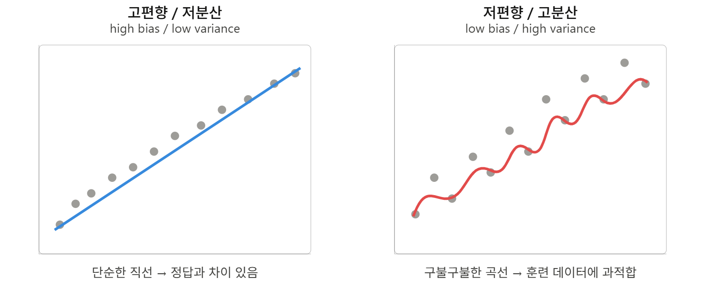

# Day 45_로지스틱 회귀 심화 - Softmax, 표준화, ROC/AUC

## 📅 2026-04-08

---

## 🔑 핵심 개념 - 머신러닝의 포용성 (Inclusivity)

> 머신러닝에서의 포용성(Inclusivity)은 AI 시스템이 성별, 인종, 연령, 사회경제적 배경 등 **다양한 사용자 그룹에게 편향 없이 공정한 서비스와 결과**를 제공하는 것을 의미

### 핵심 내용

- **포용적 데이터셋 구성** : 다양한 집단이 균형 있게 포함된 데이터 필요 → 편향성 감소
- **공정성(Fairness) 평가** : 성별, 민족, 연령 등 집단별로 모델 성능을 **따로** 측정
- **편향 제거** : 채용, 대출, 의료 등 중요 영역에서 데이터 편향으로 인한 차별 방지
- **금융 포용성** : 대체 데이터 활용으로 전통적 금융 정보가 부족한 사람에게도 신용 평가 기회 제공

### 혼동행렬과의 연결

> 전체 accuracy가 높아도 특정 집단의 **Recall(재현율)** 이 낮으면 → 편향된 모델! 집단별로 혼동행렬을 **따로** 확인하는 습관이 중요

---

## 🔑 편향과 분산 (Bias & Variance)

### 개념 정의

|개념|의미|문제|
|---|---|---|
|**편향 (Bias)**|모델 예측이 정답에서 얼마나 벗어나 있는가|높으면 과소적합 (Underfitting)|
|**분산 (Variance)**|데이터에 따라 예측이 얼마나 흔들리는가|높으면 과적합 (Overfitting)|

### 과녁 비유로 기억하기

- 과녁 중앙 = 정답 / 점들 = 예측값
- **점이 모여 있음** → 분산 낮음
- **점이 중앙에 있음** → 편향 낮음


| |저분산|고분산|
|---|---|---|
|**저편향**|✅ 이상적|분산만 높음|
|**고편향**|편향만 높음|❌ 최악|

### 고편향 vs 고분산 비교

- **왼쪽 (고편향/저분산)** : 단순한 직선 → 실제값과 차이가 있지만 안정적
- **오른쪽 (저편향/고분산)** : 구불구불한 곡선 → 훈련 데이터에 딱 맞지만 일반화 안됨



### 트레이드오프 (Trade-off)

- 복잡도 낮추면 → 편향↑ 분산↓ (너무 단순한 모델)
- 복잡도 높이면 → 편향↓ 분산↑ (너무 복잡한 모델)
- 목표 : 총 오차가 최소인 **최적 복잡도** 찾기


```
총 오차 = 편향² + 분산 + 줄일 수 없는 노이즈(irreducible error)
```

### 포용성과의 연결

- **편향 높음** → 특정 집단을 체계적으로 잘못 예측 (예: 특정 인종 얼굴 인식률 낮음)
- **분산 높음** → 특정 집단 데이터가 적어 예측이 불안정 (예: 여성 데이터 부족한 채용 모델)

> 다양한 데이터 확보 → 편향/분산 균형 → 모든 집단에 공정한 예측 → **포용적 모델**

---

## 🔑 Train / Validation / Test Set

### 세 가지 역할

|데이터셋|역할|특징|
|---|---|---|
|**Train set**|모델 가중치 **학습**|모델이 직접 학습하는 데이터|
|**Validation set**|모델 비교 / **하이퍼파라미터 조정**|Seen data (학습에 간접 관여)|
|**Test set**|최종 모델 **성능 평가**|Unseen data (학습에 전혀 관여 X)|

### Validation vs Test 차이

- **Validation** : 여러 모델 비교 + epoch, 하이퍼파라미터 튜닝에 사용 → 모델이 간접적으로 본 데이터 (Seen)
- **Test** : 최종 선택된 모델의 일반화 성능 측정 → 완전히 처음 보는 데이터 (Unseen)

> Validation은 학습에 **간접적으로 관여** → Test는 **전혀 관여하지 않음**

### 데이터 분할 비율

|데이터 크기|권장 비율|비고|
|---|---|---|
|소규모 (100~10,000개)|70 / 30 또는 60 / 20 / 20|전통적인 관례|
|대규모 (수백만 개)|98 / 1 / 1|Validation/Test는 절대량으로 충분|
|초대규모|99.5 / 0.25 / 0.25|일부 분야 적용|

> 핵심 : Validation/Test는 **비율**이 아니라 **절대 개수**가 중요 (10,000개면 충분할 수 있음)

### Train / Test 분포가 다를 때

- 예) Train = 웹에서 수집한 고품질 사진, Test = 유저가 올린 흐릿한 사진
- **중요 규칙** : Validation set과 Test set의 **분포를 동일하게** 맞춰야 함
- 이유 : Validation으로 최선의 모델을 선택하기 때문

### Test set이 없어도 되는 경우

- 최종 모델의 편향 없는 추론(unbiased estimate)이 필요 없을 때
- 단, 이 경우 Validation 결과가 과적합될 수 있음에 주의

---

## 📝 전체 흐름 정리

```
포용성 확보
    ↓
다양한 집단의 데이터 균형 있게 수집 (Train set 구성)
    ↓
편향-분산 균형 잡힌 모델 학습
    ↓
Validation으로 하이퍼파라미터 튜닝
    ↓
Test set으로 모든 집단에 대한 공정성 확인
    ↓
포용적인 최적 모델 완성
```

---
## 📄 ex19weather.py - 로지스틱 회귀 실습 (날씨 예보)

### 💡 개념

- **이항 분류** : 내일 비가 올지(1) 안 올지(0) 예측
- **train/test 분리** : 학습과 평가 데이터를 나눠서 과적합 방지
- **pred_table()** : statsmodels의 혼동행렬 → 오름차순(0→1) 배치
- **accuracy_score** : sklearn의 분류 정확도 계산

### 데이터 준비

```python
import pandas as pd
import numpy as np
from sklearn.model_selection import train_test_split
import statsmodels.api as sm
import statsmodels.formula.api as smf

data = pd.read_csv("https://raw.githubusercontent.com/pykwon/python/refs/heads/master/testdata_utf8/weather.csv")

data2 = data.drop(['Date', 'RainToday'], axis=1)
data2['RainTomorrow'] = data2['RainTomorrow'].map({'Yes':1, 'No':0})
# RainTomorrow : 종속변수(범주형), 나머지 열 : 독립변수(feature)
```

### train / test 분리

```python
train, test = train_test_split(data2, test_size=0.3, random_state=42)
# test_size=0.3 → 전체의 30%를 테스트용으로 분리
print(train.shape, test.shape)  # (256, 10) (110, 10)
```

### 모델 생성 및 학습

```python
# 독립변수 자동 조합
col_select = "+".join(train.columns.difference(['RainTomorrow']))
# Cloud+Humidity+MaxTemp+MinTemp+Pressure+Rainfall+Sunshine+Temp+WindSpeed
my_formula = 'RainTomorrow ~ ' + col_select

model = smf.logit(formula=my_formula, data=train).fit()
print(model.summary())
# Pseudo R-squ.: 0.3995  → 약 40% 설명력
# 유의미한 변수 : Humidity(p=0.049), Pressure(p=0.000), Sunshine(p=0.006)
```

### 예측 및 정확도

```python
print('예측값:', np.rint(model.predict(test)[:5]))
print('실제값:', test['RainTomorrow'][:5].values)   # [0 0 0 0 0]

# 혼동행렬 (pred_table : train 기준)
conf_mat = model.pred_table()
print(conf_mat)
# [[197.   9.]
#  [ 21.  26.]]
# TN=197, FP=9, FN=21, TP=26
print('분류 정확도(train):', (conf_mat[0][0] + conf_mat[1][1])/len(train))  # 0.871

# sklearn으로 test 정확도 확인
from sklearn.metrics import accuracy_score
pred = model.predict(test)
print('분류 정확도(test):', accuracy_score(test['RainTomorrow'], np.rint(pred)))  # 0.873
```

> train 정확도와 test 정확도의 차이가 크지 않다면 → 과적합 아님 ✅

---

## 📄 ex20logistic.py - 다항 로지스틱 회귀 (Iris, softmax)

### 💡 개념

- **다항 분류 (Multi-class)** : 3개 이상의 클래스를 분류
- **Softmax 함수** : 이항 분류의 시그모이드를 K개 클래스로 일반화한 것
- **StandardScaler** : 독립변수 크기를 표준화 → 최적화 안정성 향상
- **joblib** : 학습된 모델을 파일로 저장/불러오기 (pickle보다 빠름)

### Softmax 함수 개념

> **다중 클래스 분류**에서 출력층에 사용하는 함수. 각 클래스에 속할 **확률**을 출력함

$$p_j = \frac{e^{z_j}}{\sum_{k=1}^{K} e^{z_k}}$$

- K = 클래스 수, $z_j$ = j번째 입력값
- 출력값은 모두 0~1 사이이며, 합산하면 1
- **지수함수를 쓰는 이유** : 미분 가능 + 큰 값은 더 크게, 작은 값은 더 작게 만들어 구분력 향상

### logit / sigmoid / softmax 관계

|함수|용도|관계|
|---|---|---|
|**logit**|확률 → log-odds 변환|sigmoid의 역함수|
|**sigmoid**|이항 분류 (클래스 2개)|softmax에서 K=2일 때와 동일|
|**softmax**|다항 분류 (클래스 K개)|sigmoid를 K개 클래스로 일반화|

> sigmoid를 K개 클래스로 일반화하면 softmax, softmax에서 K=2로 두면 sigmoid로 환원

### 데이터 준비

```python
from sklearn import datasets
from sklearn.model_selection import train_test_split
from sklearn.linear_model import LogisticRegression
import numpy as np

iris = datasets.load_iris()
x = iris.data[:, [2, 3]]   # 꽃잎 길이, 꽃잎 너비 (상관계수 0.96)
y = iris.target             # 0(setosa), 1(versicolor), 2(virginica)

x_train, x_test, y_train, y_test = train_test_split(x, y, test_size=0.3, random_state=0)
# (105, 2) (45, 2) (105,) (45,)
```

### 표준화 (Scaling)

```python
from sklearn.preprocessing import StandardScaler

sc = StandardScaler()
sc.fit(x_train)
x_train_sc = sc.transform(x_train)
x_test_sc = sc.transform(x_test)

# 원복
ori = sc.inverse_transform(x_train_sc)

# ※ iris dataset은 변수 크기 차이가 거의 없어 표준화 효과가 크지 않음
```

### 모델 생성 및 학습

```python
model = LogisticRegression(
    C=1.0,                        # L2 규제 강도 (작을수록 규제 강함)
    solver='lbfgs',               # 최적화 알고리즘 (softmax 지원)
    multi_class='multinomial',    # softmax 방식으로 다항 분류
    random_state=0
)
model.fit(x_train, y_train)
```

### 💡 LogisticRegression 파라미터 이해

#### C — 규제 강도 (L2)

> Ridge의 `alpha`와 **반대 개념** → C가 작을수록 규제가 강함

```
alpha (Ridge) : 클수록 규제 강함
C (sklearn)   : 클수록 규제 약함  ← 반대!

C=0.01  → 규제 강함 (계수 많이 줄임, 단순한 모델)
C=1.0   → 기본값 (균형)
C=100   → 규제 거의 없음 (복잡한 모델, 과적합 위험)
```

#### solver — 최적화 알고리즘

> 가중치 w, b를 어떻게 업데이트할지 결정하는 방식

|solver|특징|추천 상황|
|---|---|---|
|`lbfgs`|softmax 지원, 기본값|소규모 데이터, 다항 분류|
|`saga`|대용량 데이터에 강함|대규모 데이터|
|`liblinear`|이항 분류 전용|이진 분류만|

#### multi_class — 다항 분류 방식

|값|방식|설명|
|---|---|---|
|`'ovr'`|One-vs-Rest|클래스 하나씩 따로따로 이항분류 → 3클래스면 3번 분류|
|`'multinomial'`|Softmax|전체 클래스를 한번에 softmax로 분류 → 더 정확|
|`'auto'`|자동|solver에 맞게 자동 선택|

```python
# 정리
model = LogisticRegression(
    C=1.0,                      # 규제 강도 (작을수록 강함, 기본값=1)
    solver='lbfgs',             # softmax 지원하는 최적화 방식
    multi_class='multinomial',  # 3개 클래스를 한번에 softmax로 분류
    random_state=0              # 재현성 고정 (같은 결과 보장)
)
```

### 예측 및 정확도

```python
y_pred = model.predict(x_test)
print(f'총 갯수:{len(y_test)}, 오류수:{(y_test != y_pred).sum()}')
# 총 갯수:45, 오류수:1

from sklearn.metrics import accuracy_score
print(accuracy_score(y_test, y_pred))  # 0.9778

# 혼동행렬 (pandas crosstab 활용)
import pandas as pd
con_mat = pd.crosstab(y_test, y_pred, rownames=['실제값'], colnames=['예측값'])
print(con_mat)
# 예측값   0   1   2
# 실제값
# 0    16   0   0
# 1     0  17   1   ← 1을 2로 잘못 예측한 1건
# 2     0   0  11

# train vs test score 비교 → 차이가 크면 과적합 의심
print('test score : ', model.score(x_test, y_test))    # 0.9778
print('train score : ', model.score(x_train, y_train)) # 0.9714
# 차이 미미 → 과적합 아님 ✅
```

### 모델 저장 및 불러오기

```python
import joblib   # pickle보다 빠르고 대용량 지원

joblib.dump(model, 'logimodel.pkl')   # 저장
del model                              # 메모리에서 삭제

read_model = joblib.load('logimodel.pkl')  # 불러오기
```

### 새로운 값으로 예측

```python
new_data = np.array([[5.5, 2.2], [0.6, 0.3], [1.1, 0.5]])
new_pred = read_model.predict(new_data)
print('예측 결과 : ', new_pred)  # [2 0 0]

# softmax 확률값 확인
print(read_model.predict_proba(new_data))
# [[2.53e-05 5.44e-02 9.46e-01]  → 94.6% 확률로 class 2
#  [9.96e-01 4.04e-03 8.44e-09]  → 99.6% 확률로 class 0
#  [9.85e-01 1.53e-02 1.65e-07]] → 98.5% 확률로 class 0
# predict()는 softmax 확률 중 가장 큰 인덱스를 반환
```

### 시각화 - 결정 경계 (Decision Region)

```python
# iris dataset 분류 시각화 함수
import matplotlib.pyplot as plt
import koreanize_matplotlib
from matplotlib.colors import ListedColormap

def plot_decision_regionFunc(X, y, classifier, test_idx=None, resolution=0.02, title=''):
    markers = ('s', 'x', 'o', '^', 'v')
    colors = ('r', 'b', 'lightgreen', 'gray', 'cyan')
    cmap = ListedColormap(colors[:len(np.unique(y))])

    x1_min, x1_max = X[:, 0].min() - 1, X[:, 0].max() + 1
    x2_min, x2_max = X[:, 0].min() - 1, X[:, 0].max() + 1
    xx, yy = np.meshgrid(np.arange(x1_min, x1_max, resolution),
                         np.arange(x2_min, x2_max, resolution))

    Z = classifier.predict(np.array([xx.ravel(), yy.ravel()]).T)
    Z = Z.reshape(xx.shape)

    plt.contourf(xx, yy, Z, alpha=0.5, cmap=cmap)   # 결정 경계 색칠
    plt.xlim(xx.min(), xx.max())
    plt.ylim(yy.min(), yy.max())

    for idx, cl in enumerate(np.unique(y)):
        plt.scatter(x=X[y==cl, 0], y=X[y==cl, 1],
                    color=cmap(idx), marker=markers[idx], label=cl)

    if test_idx:
        X_test = X[test_idx, :]
        plt.scatter(X_test[:, 0], X_test[:, 1],
                    c=[], linewidth=1, marker='o', s=80, label='testset')

    plt.xlabel('꽃잎 길이')
    plt.ylabel('꽃잎 너비')
    plt.legend(loc=2)
    plt.title(title)
    plt.show()

# train + test 합쳐서 전체 데이터로 시각화
x_combined = np.vstack((x_train, x_test))
y_combined = np.hstack((y_train, y_test))
plot_decision_regionFunc(X=x_combined, y=y_combined,
                         classifier=read_model,
                         test_idx=range(105, 150),
                         title='scikit-learn제공')
```

---

## 📝 이항 vs 다항 로지스틱 회귀 비교

| 구분       | 이항 (Binary)           | 다항 (Multinomial)             |
| -------- | --------------------- | ---------------------------- |
| 클래스 수    | 2개 (0 or 1)           | 3개 이상                        |
| 출력 함수    | Sigmoid               | Softmax                      |
| 손실 함수    | Binary Cross Entropy  | Categorical Cross Entropy    |
| 사용 라이브러리 | statsmodels `logit()` | sklearn `LogisticRegression` |
| 예시       | 비 올지 여부               | Iris 품종 3가지 분류               |

## 📝 모델 저장 방법 비교

| 방법       | 특징                              |
| -------- | ------------------------------- |
| `pickle` | 파이썬 기본 내장, 소규모 모델에 적합           |
| `joblib` | 대용량 numpy 배열에 최적화, ML 모델 저장에 권장 |

```python
# joblib 기본 사용법
import joblib
joblib.dump(model, 'model.pkl')       # 저장
model = joblib.load('model.pkl')      # 불러오기
```

---

## 🔑 핵심 개념 - 분류 성능 평가 지표

> 혼동행렬(Confusion Matrix)의 결과를 활용해 모델의 분류 성능을 다각도로 평가하는 지표들

### 혼동행렬 구조

```
              예측 P(Positive)    예측 N(Negative)
실제 P(True)       TP                  FN
실제 N(False)      FP                  TN
```

|이름|풀네임|의미|
|---|---|---|
|**TP**|True Positive|실제 P, 예측 P → 정답 ✅|
|**TN**|True Negative|실제 N, 예측 N → 정답 ✅|
|**FP**|False Positive|실제 N인데 예측 P → 오탐 ❌|
|**FN**|False Negative|실제 P인데 예측 N → 미탐 ❌|

> **T/F** = 예측이 맞았냐(True) 틀렸냐(False)  
> **P/N** = 예측값이 양성(Positive)이냐 음성(Negative)이냐

### 수업 연습2 예시 계산

![[혼동행렬 예시2.png]]

```
index  : 0  1  2  3  4  5  6  7  8  9
실제값  : T  F  T  F  F  F  F  F  F  F
예측값  : T  F  T  F  T  F  T  F  T  F

TP=2, TN=5, FP=3, FN=0
```

---

## 🔑 5가지 성능 평가 지표

|지표|수식|의미|언제 중요?|
|---|---|---|---|
|**정확도 (Accuracy)**|(TP+TN) / 전체|전체 중 맞춘 비율|일반적인 평가|
|**정밀도 (Precision)**|TP / (TP+FP)|양성 예측 중 실제 양성 비율|FP를 줄여야 할 때 (스팸 필터)|
|**재현율 (Recall)**|TP / (TP+FN)|실제 양성 중 맞게 예측한 비율|FN을 줄여야 할 때 (암 진단)|
|**특이도 (Specificity)**|TN / (TN+FP)|실제 음성 중 맞게 예측한 비율|-|
|**F1 Score**|2×(P×R)/(P+R)|정밀도와 재현율의 조화평균|불균형 데이터|

> **재현율** : FN을 낮추는 데 집중 → 놓치면 안 되는 경우 (암 진단)  
> **정밀도** : FP를 낮추는 데 집중 → 잘못 잡으면 안 되는 경우 (스팸 필터)  
> **F1 Score** : 둘 다 균형 있게 반영 → 1에 가까울수록 좋음

### 연습2 계산 결과

```
Accuracy  = (2+5)/10  = 0.7
Precision = 2/(2+3)   = 0.4
Recall    = 2/(2+0)   = 1.0
F1 Score  = 2*(0.4*1.0)/(0.4+1.0) ≈ 0.571
```

---

## 🔑 ROC Curve & AUC

### 개념

> **ROC(Receiver Operating Characteristic) Curve**  
> 모든 분류 임계값(threshold)에서 분류 모델의 성능을 보여주는 그래프
> 
> - x축 : FPR (위양성률, 1-특이도)
> - y축 : TPR (민감도, 재현율)

```
FPR(위양성률) = FP / (FP+TN) = 1 - 특이도   → 0에 가까울수록 좋음
TPR(민감도)  = TP / (TP+FN)                 → 1에 가까울수록 좋음
```

### threshold와 ROC의 관계

- **threshold 낮추면** → 모든 걸 양성으로 예측 → TPR↑, FPR↑ (우상단으로 이동)
- **threshold 높이면** → 모든 걸 음성으로 예측 → TPR↓, FPR↓ (좌하단으로 이동)
- ROC curve = 모든 가능한 threshold별 FPR/TPR 쌍을 이은 곡선

### AUC (Area Under Curve)

> ROC 커브 아래 면적 → **클수록 좋은 모델**

|AUC 범위|성능|
|---|---|
|0.9 ~ 1.0|매우 좋음|
|0.8 ~ 0.9|좋음|
|0.7 ~ 0.8|보통|
|0.5|랜덤 분류기 (무의미)|

> ROC curve가 **좌상단에 붙을수록** → AUC가 1에 가까워짐 → 좋은 분류기

---

## 📄 ex20quiz.py - 안경 착용 유무 분류

### 💡 개념

- **이항 분류** : 안경 착용(1) vs 미착용(0)
- 게임, TV시청 데이터로 분류
- 스케일링 없이 `LogisticRegression` 기본값 사용

### 코드

```python
import pandas as pd
import numpy as np
from sklearn.model_selection import train_test_split
from sklearn.metrics import accuracy_score
from sklearn.linear_model import LogisticRegression

data = pd.read_csv("https://raw.githubusercontent.com/pykwon/python/refs/heads/master/testdata_utf8/bodycheck.csv")

data2 = data.drop(['번호', '신장', '체중'], axis=1)
#    게임  TV시청  안경유무

x = data2[['게임', 'TV시청']]
y = data2['안경유무'].values

x_train, x_test, y_train, y_test = train_test_split(x, y, test_size=0.3, random_state=0)
# (14, 2) (6, 2) (14,) (6,)

model = LogisticRegression(random_state=0)
model.fit(x_train, y_train)

y_pred = model.predict(x_test)
print('예측값 : ', y_pred)  # [0 1 0 1 0 1]
print('실제값 : ', y_test)  # [0 1 0 1 0 1]
print(f'총 갯수:{len(y_test)}, 오류수:{(y_test != y_pred).sum()}')
# 총 갯수:6, 오류수:0

# 정확도 확인 3가지
print(accuracy_score(y_test, y_pred))  # 1.0

con_mat = pd.crosstab(y_test, y_pred, rownames=['실제값'], colnames=['예측값'])
print(con_mat)
# 예측값  0  1
# 실제값
# 0    3  0
# 1    0  3
print((con_mat[0][0] + con_mat[1][1]) / len(y_test))  # 1.0

print('test score : ', model.score(x_test, y_test))    # 1.0
print('train score : ', model.score(x_train, y_train)) # 1.0
# train=test=1.0 → 데이터가 작아서 완벽히 분류된 것

# 모델 저장 및 새로운 값으로 예측
import joblib
joblib.dump(model, 'ex20quiz.pkl')
del model
read_model = joblib.load('ex20quiz.pkl')

game = int(input('게임 입력: '))
tv = int(input('TV시청 입력: '))
new_data = pd.DataFrame([[game, tv]], columns=['게임', 'TV시청'])

new_pred = read_model.predict(new_data)
print('예측 결과 : ', new_pred)               # [0: 안경X, 1: 안경O]
print(read_model.predict_proba(new_data))     # [안경X 확률, 안경O 확률]
```

---

## 📄 ex21roc.py - ROC Curve & AUC

### 💡 개념

- **decision_function()** : 각 샘플의 결정 함수 값 반환 → ROC curve의 threshold 기준으로 사용
- **roc_curve()** : fpr, tpr, thresholds 반환
- **auc()** : ROC curve 아래 면적 계산
- **classification_report()** : precision, recall, f1-score 한번에 출력

### 코드

```python
from sklearn.datasets import make_classification
from sklearn.linear_model import LogisticRegression
from sklearn.metrics import confusion_matrix
from sklearn import metrics
import numpy as np
import pandas as pd
import matplotlib.pyplot as plt

x, y = make_classification(n_samples=100, n_features=2, n_redundant=0, random_state=123)
# n_redundant : 다른 독립변수의 선형조합으로 나타내는 성분 수

model = LogisticRegression().fit(x, y)
y_hat = model.predict(x)

# 결정 함수값 (ROC curve의 threshold 기준)
f_value = model.decision_function(x)
df = pd.DataFrame(np.vstack([f_value, y_hat, y]).T, columns=['f', 'y_hat', 'y'])

# 혼동행렬로 직접 지표 계산
print(confusion_matrix(y, y_hat))
# [[44  4]
#  [ 8 44]]
acc         = (44 + 44) / 100       # 0.88
recall      = 44 / (44 + 4)         # 0.917  ← tpr, 1에 가까울수록 좋음
precision   = 44 / (44 + 8)         # 0.846
specificity = 44 / (8 + 44)         # 0.846
fallout     = 8 / (8 + 44)          # 0.154  ← fpr, 0에 가까울수록 좋음
# fallout == 1 - specificity

# sklearn으로 한번에 확인
print(metrics.accuracy_score(y, y_hat))        # 0.88
print(metrics.classification_report(y, y_hat))
#               precision    recall  f1-score   support
#            0       0.85      0.92      0.88        48
#            1       0.92      0.85      0.88        52
#     accuracy                           0.88       100

# ROC Curve
fpr, tpr, thresholds = metrics.roc_curve(y, model.decision_function(x))
# thresholds : 분류 결정 임계값

plt.plot(fpr, tpr, 'o-', label='LogisticRegression')
plt.plot([0, 1], [0, 1], 'k--', label='random classifire line(AUC:0.5)')
plt.plot([fallout], [recall], 'ro', ms=6)   # 현재 모델의 fpr, tpr 위치 표시
plt.xlabel('fpr')
plt.ylabel('tpr')
plt.title('ROC Curve')
plt.legend()
plt.show()

print('AUC : ', metrics.auc(fpr, tpr))  # 0.9547
```

### 주요 함수 정리

|함수|설명|
|---|---|
|`decision_function(x)`|각 샘플의 결정 함수 값 → 양수면 class 1, 음수면 class 0|
|`roc_curve(y, score)`|fpr, tpr, thresholds 배열 반환|
|`auc(fpr, tpr)`|ROC curve 아래 면적 계산|
|`classification_report()`|precision, recall, f1-score 한번에 출력|

---

## 📝 전체 지표 정리

```
혼동행렬
    ↓
정확도  = (TP+TN) / 전체          → 전체 성능
정밀도  = TP / (TP+FP)            → FP 최소화 (스팸 필터)
재현율  = TP / (TP+FN)            → FN 최소화 (암 진단)
특이도  = TN / (TN+FP)            → 음성 판별 성능
F1     = 2×(P×R)/(P+R)           → 불균형 데이터
    ↓
ROC Curve : 모든 threshold에서 FPR vs TPR
AUC       : ROC 커브 아래 면적 → 1에 가까울수록 좋음
```
