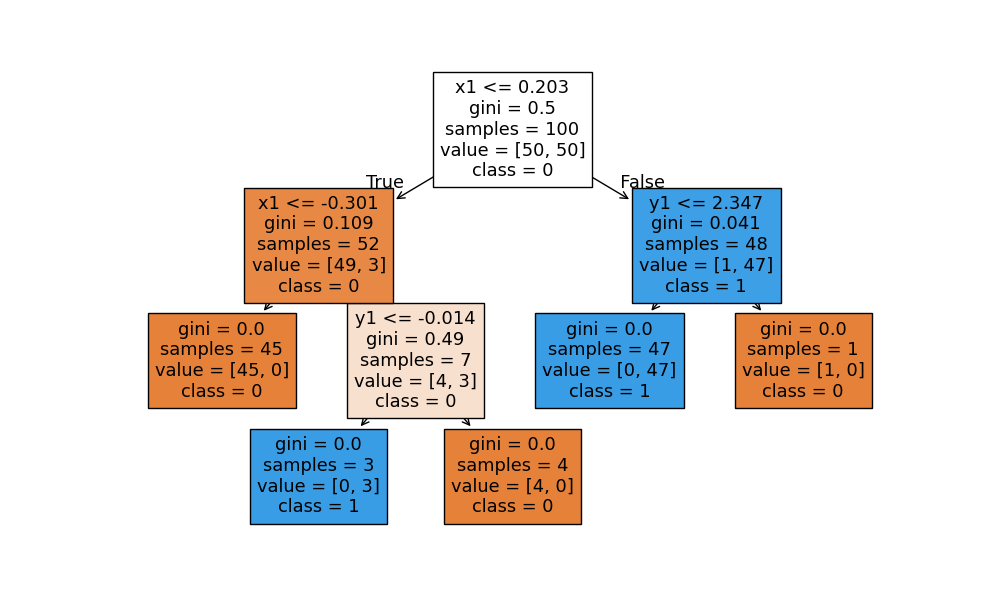
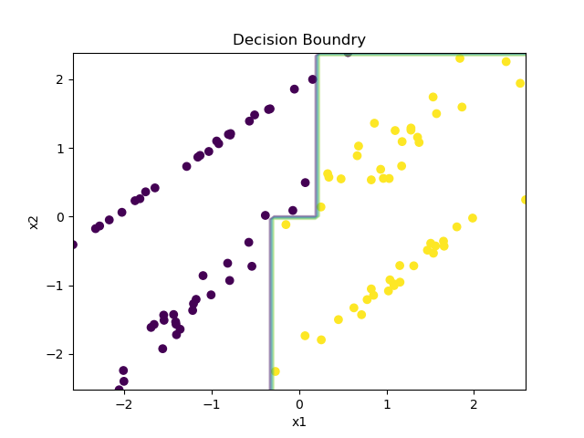
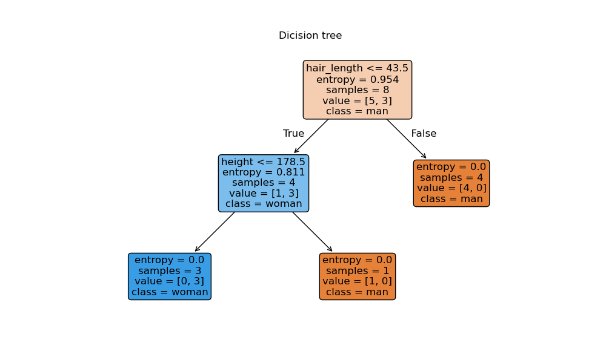
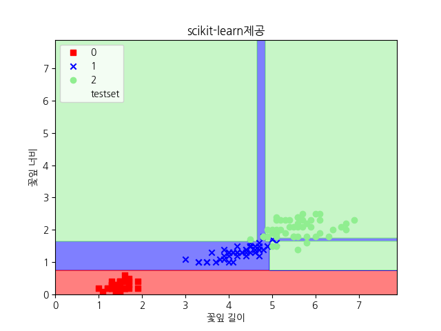

# Day 46_의사결정나무_앙상블_랜덤포레스트
## 📅 2026-04-09

## 📋 목차

- [의사결정나무](#의사결정나무-decision-tree)
- [ex22tree.py](#-ex22treepy--의사결정나무-실습-make_classification)
- [ex23tree.py](#-ex23treepy--의사결정나무-실습-남녀-구분)
- [ex24treeiris.py](#-ex24treeirisy--의사결정나무-실습-iris-다항분류)
- [ex25overfitting.py](#-ex25overfittingpy--과적합-방지-k-fold-gridsearchcv)
- [앙상블](#앙상블-ensemble-learning)
- [ex26ensemble.py](#-ex26ensemblepy--앙상블-실습-votingclassifier)
- [랜덤포레스트](#랜덤포레스트-random-forest)
- [ex27rf.py](#-ex27rfpy--랜덤포레스트-실습-타이타닉-생존-예측)

---
# 의사결정나무 (Decision Tree)

#머신러닝 #분류 #DecisionTree #Gini #Entropy

---

## 📌 개요

> 전체 집단을 계속 **양분(이진 분할)** 하는 분류 기법.  
> 분기 포인트(노드)마다 기준 질문이 있고, **YES / NO** 에 따라 이동 방향이 결정된다.

- **분류(Classification)** 와 **회귀 예측(Regression)** 모두 가능
- 비모수 검정 → 선형성 · 정규성 · 등분산성 가정 불필요
- 해석이 쉽다 (화이트박스 모델)

---

## 🌳 나무 구조

```
          [Root Node]          ← 전체 데이터 (N)
         /           \
   [Internal]     [Internal]   ← 부분집합 A / B
    /     \         /     \
[Term.] [Term.] [Term.] [Term.] ← 끝마디 (terminal node)
```

|용어|설명|
|---|---|
|Root Node|시작점, 전체 데이터 포함|
|Internal Node|중간 분기점, 조건 질문 포함|
|Terminal Node (Leaf)|끝마디, 최종 예측값 결정|
|Branch|노드 간 연결선|

> **terminal node 수 = 분리된 부분집합 수**  
> 각 terminal node 간 교집합 없음

---

## 🔀 나무 유형

### 분류나무 (Classification Tree)

- 목표변수: **이산형** (불연속적)
- 분기 기준: 각 범주의 **빈도(frequency)** 기반
- 예시: 스팸 메일 여부, 사진이 강아지/고양이/햄스터인지

### 회귀나무 (Regression Tree)

- 목표변수: **연속형** (구간형)
- 분기 기준: **평균(mean) · 표준편차(SD)** 기반
- 예시: 주택 가격 예측, 광고 클릭 확률

---

## ⚙️ 형성 과정 4단계


| 단계               | 내용                                  |
| ---------------- | ----------------------------------- |
| ① 알고리즘           | CHAID, CART, C4.5 — 목적·자료구조에 따라 선택  |
| ② 가지치기 (Pruning) | 오분류 위험 높은 branch 제거 → 과적합 방지        |
| ③ 타당성 평가         | 이득도표, 위험도표, 교차타당성(Cross Validation) |
| ④ 해석·예측          | 규칙 해석 + 예측 모형 구축                    |

---

## 📐 분할 기준 (Split Criterion)

### 순수도 / 불순도 (Purity / Impurity)

- 분할점은 **순수도 최대 = 불순도 최소** 가 되도록 설정
- 불순도 감소 = 불확실성 감소 = **정보 획득 (Information Gain)**

---

## 📊 지니 지수 (Gini Index)

> "임의로 뽑은 원소가 **잘못 분류될 확률**"

$$ Gini = 1 - \sum_{i=1}^{k} p_i^2 $$

|상태|Gini 값|
|---|---|
|완전 순수 (100% 단일 클래스)|**0**|
|완전 불순 (50:50)|**0.5**|

**구슬 주머니 예시 (빨간 vs 파란, 총 4개)**

|주머니|구성|Gini|순도|
|---|---|---|---|
|A1|빨간 4, 파란 0|0|100% 순수|
|A2|빨간 2, 파란 2|0.5|0% (완전 불순)|
|A3|빨간 3, 파란 1|0.375|75% 순수|

- 범위: **0 ~ 0.5**
- 로그 연산 없음 → **계산 빠름**

---

## 📊 엔트로피 (Entropy)

> 정보이론에서 온 개념. **정보량(불확실성)** 을 측정.

$$ H = -\sum_{i=1}^{k} p_i \cdot \log_2(p_i) $$

|상태|Entropy 값|
|---|---|
|완전 순수|**0**|
|완전 불순 (50:50)|**1**|

**구슬 주머니 예시**

|주머니|구성|Entropy|순도|
|---|---|---|---|
|A1|빨간 4, 파란 0|0|100% 순수|
|A2|빨간 2, 파란 2|1.0|0% (완전 불순)|
|A3|빨간 3, 파란 1|0.811|81% 순수|

- 범위: **0 ~ 1**
- 로그 연산 사용 → **계산 느림**
- 중간 영역에서 Gini보다 불순도를 더 **가혹하게 평가**

---

## 🔁 정보 이득량 (Information Gain)

$$ IG = H(\text{부모}) - \left[ \frac{n_1}{n} \cdot H(\text{자식}_1) + \frac{n_2}{n} \cdot H(\text{자식}_2) \right] $$

- **IG가 클수록** 분할이 잘 된 것
- IG = 0 이면 더 이상 분기하지 않음 (정지 규칙)
- Gini와 Entropy 모두 IG 계산에 사용 가능

**예시 (35개 샘플, 자식 20/15개 분할)**

|기준|부모|IG|정규화 IG|
|---|---|---|---|
|Gini|0.467|0.197|**41.97%**|
|Entropy|0.952|0.325|**34.14%**|

> 이 예시에서는 Gini가 더 높은 IG를 보임 — 항상 동일하지는 않음

---

## ⚖️ Gini vs Entropy 비교

|항목|Gini|Entropy|
|---|---|---|
|범위|0 ~ 0.5|0 ~ 1|
|연산|빠름 (제곱)|느림 (로그)|
|커브 경사|급함|완만함|
|평가 엄격도|덜 가혹|더 가혹 (중간 영역)|
|일반적 성능|준수|약간 우수|
|사용 상황|빠른 연산 필요 시|성능 극대화 시|

> **결론:** 데이터 규모가 크고 시간 여유가 있다면 Entropy,  
> 빠른 계산이 필요하다면 Gini. 단, 항상 Entropy가 더 낫지는 않음.

---

## ✅ 장단점

### 장점

- 해석이 쉽고 시각적 (화이트박스)
- 비모수적 — 선형성·정규성·등분산성 가정 불필요
- 분류·회귀 모두 가능
- 전처리 부담 적음

### 단점

- 유의수준 판단 기준 없음 (추론 기능 없음)
- 비연속성 / 선형성 결여
- **비안정성** — 학습 데이터에 과적합되기 쉬움 → Pruning 필요
- 새로운 데이터 예측 시 불안정할 수 있음

---

## 🐍 Python 예시 (scikit-learn)

```python
from sklearn.tree import DecisionTreeClassifier
from sklearn.datasets import load_iris

iris = load_iris()
X, y = iris.data, iris.target

# Gini 기준
clf_gini = DecisionTreeClassifier(criterion='gini', max_depth=3, random_state=42)
clf_gini.fit(X, y)

# Entropy 기준
clf_ent = DecisionTreeClassifier(criterion='entropy', max_depth=3, random_state=42)
clf_ent.fit(X, y)

print("Gini 정확도:", clf_gini.score(X, y))
print("Entropy 정확도:", clf_ent.score(X, y))
```

**Iris 분류 핵심 분할 규칙**

```
petal_length ≤ 2.45  →  Setosa (순수, Entropy=0)
petal_length > 2.45 & petal_width ≤ 1.75  →  Versicolor
petal_length > 2.45 & petal_width > 1.75  →  Virginica
```

---

## 🔗 활용 분야

- 광고 인쇄물 응답자 분석
- 고객 신용점수화 (Credit Scoring)
- 의학 연구 (진단 분류)
- 시장 분석 / 품질관리
- 주가·환율 예측

---
# 📄 ex22tree.py — 의사결정나무 실습 (make_classification)

#머신러닝 #DecisionTree #실습 #sklearn #Python

---

## 🐍 실습 코드

```python
# DecisionTree(의사결정나무) 분류 모델
# 데이터 균일도에 따른 규칙기반의 결정트리
# 트리는 데이터를 지각(수직, 수평) 기준으로 나누면서 영역을 만든다.

from sklearn.datasets import make_classification
from sklearn.tree import DecisionTreeClassifier, plot_tree
import matplotlib.pyplot as plt
import numpy as np

# 데이터 생성
x, y = make_classification(
    n_samples=100,      # 샘플 수
    n_features=2,       # 특성 수 (x1, y1)
    n_redundant=0,      # 불필요한 특성 없음
    n_informative=2,    # 유효 특성 2개
    random_state=42
)

# 모델 학습
model = DecisionTreeClassifier(criterion='gini', max_depth=3)  # 최대 깊이 3
model.fit(x, y)  # supervised learning

# 트리 구조 시각화
plt.figure(figsize=(10, 6))
plot_tree(model, feature_names=['x1', 'y1'], class_names=['0', '1'], filled=True)
plt.show()

# 결정경계 시각화
xx, yy = np.meshgrid(
    np.linspace(x[:, 0].min(), x[:, 0].max(), 100),  # x1 범위 100구간
    np.linspace(x[:, 1].min(), x[:, 1].max(), 100)   # x2 범위 100구간
)
z = model.predict(np.c_[xx.ravel(), yy.ravel()])  # 모든 좌표 예측
z = z.reshape(xx.shape)                            # grid 형태로 변환

plt.contour(xx, yy, z, alpha=0.3)   # 결정경계선 표현
plt.scatter(x[:, 0], x[:, 1], c=y)
plt.title('Decision Boundry')
plt.xlabel('x1')
plt.ylabel('x2')
plt.show()
```

---

## 🌳 트리 구조 분석



### 분기 흐름

```
x1 ≤ 0.203?  (Root, Gini=0.5, 100개)
├── True  → x1 ≤ -0.301  (Gini=0.109, 52개, [49,3], class=0)
│   ├── True  → ✅ class 0  (Gini=0.0, 45개, [45,0])
│   └── False → y1 ≤ -0.014  (Gini=0.49, 7개, [4,3])
│               ├── True  → ✅ class 1  (Gini=0.0, 3개, [0,3])
│               └── False → ✅ class 0  (Gini=0.0, 4개, [4,0])
└── False → y1 ≤ 2.347  (Gini=0.041, 48개, [1,47], class=1)
    ├── True  → ✅ class 1  (Gini=0.0, 47개, [0,47])
    └── False → ✅ class 0  (Gini=0.0, 1개, [1,0])
```

### 노드별 요약

|깊이|조건|Gini|samples|value|class|
|---|---|---|---|---|---|
|0|x1 ≤ 0.203|0.500|100|[50, 50]|0|
|1|x1 ≤ -0.301|0.109|52|[49, 3]|0|
|1|y1 ≤ 2.347|0.041|48|[1, 47]|1|
|2|Terminal|0.0|45|[45, 0]|0|
|2|y1 ≤ -0.014|0.490|7|[4, 3]|0|
|2|Terminal|0.0|47|[0, 47]|1|
|2|Terminal|0.0|1|[1, 0]|0|
|3|Terminal|0.0|3|[0, 3]|1|
|3|Terminal|0.0|4|[4, 0]|0|

> 오렌지(주황) = class 0 / 파랑 = class 1  
> terminal 6개 중 5개 Gini = 0.0 → 거의 완전 순수 분류

---

## 🗺️ 결정경계 시각화



- `x1 ≈ 0.203` 에서 가장 큰 **수직 경계선** 형성 → Root Node 분할 반영
- 이후 좁은 구간에서 **수평 경계선** 추가 → 깊이 2~3 분할 반영
- **계단 모양(step function)** 의 경계가 의사결정나무의 특징

### meshgrid 원리

```
np.meshgrid(x축_범위, y축_범위)
    → 평면 위 모든 격자점 생성
    → 각 점에 model.predict() 적용
    → 예측 클래스로 영역 색칠
    → plt.contour() 로 경계선 표시
```

---

## 💡 핵심 관찰

- 의사결정나무는 항상 **수직·수평 직선** 으로만 공간을 분할한다
- 대각선 방향의 실제 데이터 패턴을 **계단 모양으로 근사**
- `max_depth` 가 깊어질수록 계단이 세밀해지지만 **과적합 위험 증가**
- 이것이 의사결정나무의 **비연속성·선형성 결여** 단점과 직결됨

---

# 📄 ex23tree.py — 의사결정나무 실습 (남녀 구분)

#머신러닝 #DecisionTree #실습 #sklearn #Python

---

## 🐍 실습 코드

```python
# DecisionTree(의사결정나무) 분류 모델
# 키, 머리카락길이 데이터로 남녀 구분

from sklearn.datasets import make_classification
from sklearn.tree import DecisionTreeClassifier, plot_tree
import matplotlib.pyplot as plt
import numpy as np

x = [[180, 15], [177, 42], [156, 35], [174, 65], [161, 25], [160, 45], [170, 65], [155, 55]]
y = ['man', 'woman', 'woman', 'man', 'woman', 'man', 'man', 'man']

feature_names = ['height', 'hair_length']
class_names = ['man', 'woman']

model = DecisionTreeClassifier(criterion='entropy', max_depth=3, random_state=0)
model.fit(x, y)

# 모델 성능 점수
print(f'정확도 : {model.score(x, y)}')
print('예측값 : ', model.predict(x))
print('실제값 : ', y)

# 새로운 데이터 예측
new_data = [[177, 78]]
print('new_data pred : ', model.predict(new_data))

plt.figure(figsize=(10, 6))
plot_tree(model, feature_names=feature_names, class_names=model.classes_, filled=True, rounded=True, fontsize=12)
plt.title('Dicision tree')
plt.show()
```

---

## 📊 데이터 구성

|height|hair_length|label|
|---|---|---|
|180|15|man|
|177|42|woman|
|156|35|woman|
|174|65|man|
|161|25|woman|
|160|45|man|
|170|65|man|
|155|55|man|

- 총 8개 샘플 / man 5명, woman 3명
- 특성: `height`(키), `hair_length`(머리카락 길이)
- 이전 실습(`ex22`)과 달리 **직접 만든 데이터** 사용

---

## 🌳 트리 구조 분석



### 분기 흐름

```
hair_length ≤ 43.5?  (Root, entropy=0.954, 8개, [5,3], class=man)
├── True  → height ≤ 178.5  (entropy=0.811, 4개, [1,3], class=woman)
│   ├── True  → ✅ class woman  (entropy=0.0, 3개, [0,3])
│   └── False → ✅ class man    (entropy=0.0, 1개, [1,0])
└── False → ✅ class man        (entropy=0.0, 4개, [4,0])
```

### 노드별 요약

|깊이|조건|Entropy|samples|value|class|
|---|---|---|---|---|---|
|0|hair_length ≤ 43.5|0.954|8|[5, 3]|man|
|1|height ≤ 178.5|0.811|4|[1, 3]|woman|
|1|Terminal|0.0|4|[4, 0]|man|
|2|Terminal|0.0|3|[0, 3]|woman|
|2|Terminal|0.0|1|[1, 0]|man|

> 파랑 = woman / 오렌지 = man  
> terminal 3개 모두 entropy = 0.0 → 완전 순수 분류

---

## 🔍 트리 해석

**1단계 — hair_length ≤ 43.5**

- 머리카락이 43.5 이하면 True(왼쪽), 초과면 False(오른쪽)
- False(머리카락 긴 쪽) → 4명 전원 man → entropy = 0 → 바로 종료

**2단계 — height ≤ 178.5** (True 쪽 4명만)

- 머리카락이 짧은 4명을 키로 다시 분할
- 키 178.5 이하 → 3명 전원 woman
- 키 178.5 초과 → 1명 man

---

## 🆚 ex22 와 다른 점

|       | ex22                       | ex23                      |
| ----- | -------------------------- | ------------------------- |
| 데이터   | `make_classification` 자동생성 | 직접 입력                     |
| 분할 기준 | Gini                       | **Entropy**               |
| 특성    | x1, y1 (추상적)               | height, hair_length (직관적) |
| 클래스   | 0, 1                       | man, woman                |
| 샘플 수  | 100개                       | 8개                        |

---

## 💡 핵심 관찰

- Root에서 `hair_length` 가 먼저 선택된 이유 → hair_length로 나눴을 때 **entropy 감소폭이 더 크기 때문**
- 8개라는 작은 데이터에서도 트리가 **완전 순수(entropy=0)** 한 분류를 만들어냄
- 새로운 데이터 `[177, 78]` → hair_length=78 > 43.5 이므로 바로 **man** 예측

---

# 📄 ex24treeiris.py — 의사결정나무 실습 (Iris 다항분류)

#머신러닝 #DecisionTree #Iris #다항분류 #실습 #sklearn #Python

---

## 📌 이번 실습 포인트

- 실제 데이터셋(Iris) 사용
- **3개 클래스** 분류 (이진 → 다항)
- train / test 분리 후 **정확도 검증**
- **혼동행렬(Confusion Matrix)** 로 오류 확인
- 모델 **저장 / 불러오기** (`joblib`)
- `predict_proba` 로 **각 클래스 확률** 확인

---

## 🌸 Iris 데이터셋

```python
iris = datasets.load_iris()
x = iris.data[:, [2, 3]]   # 꽃잎 길이, 꽃잎 너비만 사용
y = iris.target             # 0: Setosa, 1: Versicolor, 2: Virginica
```

|클래스|이름|샘플 수|
|---|---|---|
|0|Setosa|50개|
|1|Versicolor|50개|
|2|Virginica|50개|

> 꽃잎 길이(petal length)와 꽃잎 너비(petal width) 두 특성만 사용  
> 두 특성의 상관계수 = **0.963** → 매우 높은 상관관계

---

## ✂️ Train / Test 분리

```python
x_train, x_test, y_train, y_test = train_test_split(
    x, y, test_size=0.3, random_state=0
)
# train: 105개 (70%), test: 45개 (30%)
```

- `test_size=0.3` → 전체의 30%를 테스트용으로 분리
- `random_state=0` → 분리 결과 고정 (재현 가능)
- **train으로 학습, test로 검증** — 절대 섞지 않음

---

## 🐍 실습 코드

```python
from sklearn.tree import DecisionTreeClassifier

model = DecisionTreeClassifier(criterion='gini', max_depth=5, random_state=0)
model.fit(x_train, y_train)

y_pred = model.predict(x_test)
```

---

## 📊 정확도 확인 3가지 방법

### 방법 1 — accuracy_score

```python
accuracy_score(y_test, y_pred)   # 0.9556 (95.56%)
```

### 방법 2 — 혼동행렬 (Confusion Matrix)

```python
con_mat = pd.crosstab(y_test, y_pred, rownames=['실제값'], colnames=['예측값'])
```

| 실제\예측 | 0   | 1          | 2          |
| ----- | --- | ---------- | ---------- |
| **0** | 16  | 0          | 0          |
| **1** | 0   | 17         | **1** ← 오류 |
| **2** | 0   | **1** ← 오류 | 10         |

- 45개 중 **오류 1개** → 정확도 95.56%
- class 1(Versicolor) ↔ class 2(Virginica) 경계에서 1개 오분류

### 방법 3 — model.score

```python
model.score(x_test, y_test)    # 0.9556  ← test 정확도
model.score(x_train, y_train)  # 0.9905  ← train 정확도
```

> train score - test score 차이가 크면 **과적합(Overfitting)** 의심  
> 여기서는 약 3.5% 차이 → 허용 범위

---

## 💾 모델 저장 / 불러오기

```python
import joblib

# 저장
joblib.dump(model, 'logimodel.pkl')

# 불러오기
del model                              # 기존 모델 삭제
read_model = joblib.load('logimodel.pkl')
```

> `joblib` = pickle보다 빠르고 대용량 지원  
> 학습이 오래 걸리는 모델을 매번 다시 학습하지 않아도 됨

---

## 🔮 새로운 데이터 예측

```python
new_data = np.array([[5.5, 2.2], [0.6, 0.3], [1.1, 0.5]])

print(read_model.predict(new_data))
# [2, 0, 0]

print(read_model.predict_proba(new_data))
# [[0. 0. 1.]   → Virginica 100%
#  [1. 0. 0.]   → Setosa 100%
#  [1. 0. 0.]]  → Setosa 100%
```

> `predict` → 가장 확률 높은 클래스 1개 출력  
> `predict_proba` → 각 클래스별 확률 출력  
> 트리에서는 해당 terminal node의 클래스 비율이 확률값이 됨

---

## 🗺️ 결정경계 시각화



- **빨간 영역** = class 0 (Setosa) — 꽃잎 짧고 좁음
- **파란 영역** = class 1 (Versicolor) — 중간
- **초록 영역** = class 2 (Virginica) — 꽃잎 길고 넓음
- 의사결정나무 특유의 **수직·수평 계단 경계선** 확인
- 경계 근처(Versicolor ↔ Virginica)에서 오분류 발생

---

## 💡 핵심 개념 정리

### 다항분류 (Multi-class Classification)

- 클래스가 3개 이상인 분류 문제
- `DecisionTreeClassifier` 는 별도 설정 없이 다항분류 지원
- 내부적으로 각 클래스의 확률을 계산 후 가장 높은 클래스 선택

### 표준화 (StandardScaler) — 이번엔 미사용

```python
# iris dataset은 특성 간 크기 차이가 거의 없어 표준화 효과 미미
# 의사결정나무는 거리 기반 알고리즘이 아니라서 표준화 영향 적음
```

> 로지스틱 회귀, SVM, KNN 등은 표준화가 중요  
> 의사결정나무, 랜덤포레스트는 표준화 없어도 성능 차이 거의 없음

---
# 📄 ex25overfitting.py — 과적합 방지 (K-Fold, GridSearchCV)

#머신러닝 #과적합 #KFold #GridSearchCV #CrossValidation #실습

---

## 📌 과적합(Overfitting) 이란?

> 모델이 학습 데이터에만 과도하게 최적화되어  
> **새로운 데이터에서 성능이 크게 떨어지는 현상**

마치 시험 문제를 외워버린 것과 같다.  
학습 데이터로 바로 검증하면 당연히 100%가 나오지만, 그건 의미 없는 수치다.

---

## Step 0 — Import

```python
from sklearn.datasets import load_iris
from sklearn.tree import DecisionTreeClassifier
from sklearn.metrics import accuracy_score
```

---

## Step 1 — 과적합 확인

```python
iris = load_iris()
train_data = iris.data
train_label = iris.target

dt_clf = DecisionTreeClassifier()
dt_clf.fit(train_data, train_label)     # 모든 데이터를 학습에 참여
pred = dt_clf.predict(train_data)       # 학습데이터로 검증(예측)
print('분류 정확도 : ', accuracy_score(train_label, pred))  # 1.0 ← 과적합 의심
```

> 학습한 데이터로 바로 예측 → 당연히 100%  
> 이건 의미 없는 수치 — **실제 성능이 아님**

---

## Step 2 — 방법 1 : Train/Test Split

```python
from sklearn.model_selection import train_test_split

x_train, x_test, y_train, y_test = train_test_split(
    iris.data, iris.target, test_size=0.3, random_state=121
)

dt_clf.fit(x_train, y_train)      # train data로 학습
pred2 = dt_clf.predict(x_test)    # test data로 예측
print('분류 정확도 : ', accuracy_score(y_test, pred2))  # 0.9556
```

> 전체 1.0 → 분리 후 0.9556 — 실제 성능 확인 가능  
> 단점: **딱 한 번만 평가** → 운이 좋거나 나쁠 수 있음

---

## Step 3 — 방법 2 : K-Fold 교차검증

```python
from sklearn.model_selection import KFold
import numpy as np

features = iris.data
label = iris.target
dt_clf2 = DecisionTreeClassifier(criterion='gini', max_depth=3, random_state=12)

kfold = KFold(n_splits=5)   # k:5회 접기
cv_acc = []
print('iris shape : ', features.shape)  # 150 by 4
# KFold 학습시 전체 150행이 학습데이터(4/5, 120개), 검증데이터(1/5, 30개)로 분할

n_iter = 0
for train_index, test_index in kfold.split(features):
    xtrain, xtest = features[train_index], features[test_index]
    ytrain, ytest = label[train_index], label[test_index]
    dt_clf2.fit(xtrain, ytrain)
    pred = dt_clf2.predict(xtest)
    n_iter += 1
    acc = np.round(accuracy_score(ytest, pred), 5)
    train_size = xtrain.shape[0]
    test_size = xtest.shape[0]
    print(f'반복수:{n_iter}, 교차검증 정확도:{acc}, 학습데이터크기:{train_size}, 검증데이터크기:{test_size}')
    print(f'반복수:{n_iter}, 검증데이터 인덱스:{test_index}')
    cv_acc.append(acc)

print('cv_acc : ', np.array(cv_acc).astype(int))
print('평균 검증 정확도 : ', np.mean(cv_acc))
# 반복수:1, 교차검증 정확도:1.0,     학습데이터크기:120, 검증데이터크기:30
# 반복수:2, 교차검증 정확도:0.96667, 학습데이터크기:120, 검증데이터크기:30
# 반복수:3, 교차검증 정확도:0.83333, 학습데이터크기:120, 검증데이터크기:30
# 반복수:4, 교차검증 정확도:0.93333, 학습데이터크기:120, 검증데이터크기:30
# 반복수:5, 교차검증 정확도:0.73333, 학습데이터크기:120, 검증데이터크기:30
# 평균 검증 정확도 :  0.8933320000000002
```

**K-Fold 동작 방식**

```
K=5 일 때 (150개 → 학습 120개 / 검증 30개)

1회: [검증 0~29  ][        학습 30~149        ]
2회: [학습 0~29][검증 30~59][    학습 60~149   ]
3회: [  학습 0~59  ][검증 60~89][  학습 90~149 ]
4회: [    학습 0~89    ][검증 90~119][학습 120~]
5회: [       학습 0~119        ][검증 120~149  ]
```

|반복|검증 인덱스|정확도|
|---|---|---|
|1|0 ~ 29 (Setosa만)|1.0|
|2|30 ~ 59|0.967|
|3|60 ~ 89|0.833|
|4|90 ~ 119|0.933|
|5|120 ~ 149 (Virginica만)|0.733|
|**평균**||**0.893**|

> ⚠️ 1회(1.0)와 5회(0.733) 편차가 큰 이유  
> Iris 데이터가 **클래스 순서대로 정렬**되어 있어서  
> 검증 데이터에 특정 클래스만 몰리는 현상 발생  
> → **Stratified K-Fold 가 필요한 이유**

---

## 참고 — Stratified K-Fold

```python
from sklearn.model_selection import StratifiedKFold
# ex) 대출 사기 데이터 : 정상 99% / 사기 1%
# 일반 KFold → 검증 데이터에 사기 0개인 fold 발생 가능
# Stratified KFold → 모든 fold에 사기 1% 유지
```

- 분류 문제에서 권장
- 회귀 문제에는 사용 불가 (연속값이라 비율 개념 없음)

---

## Step 4 — 방법 2-1 : cross_val_score (K-Fold 단순화)

```python
from sklearn.model_selection import cross_val_score

data = iris.data
label = iris.target

score = cross_val_score(dt_clf2, data, label, scoring='accuracy', cv=5)
print('교차 검증별 정확도:', np.round(score, 3))          # [0.967 0.967 0.933 0.933 1.   ]
print('평균 검증 정확도 : ', np.round(np.mean(score), 3)) # 0.96
```

> K-Fold 반복문을 **한 줄로 축약**  
> 분류 문제면 Stratified K-Fold 자동 적용  
> 직접 K-Fold 썼을 때 평균 0.893 → cross_val_score 0.96  
> Stratified 자동 적용으로 편차가 줄어든 것

---

## Step 5 — 방법 3 : GridSearchCV

```python
from sklearn.model_selection import GridSearchCV

# min_samples_split : 노드 분할을 위한 최소한의 샘플수로 과적합 제어
parameters = {'max_depth': [1, 2, 3], 'min_samples_split': [2, 3]}
# 3 × 2 = 6가지 조합 × cv=3 → 총 18번 학습·검증

grid_dtree = GridSearchCV(estimator=dt_clf2, param_grid=parameters, cv=3, refit=True)
grid_dtree.fit(x_train, y_train)
# 내부적으로 복수 개의 모형을 생성하고, 최적의 파라미터를 찾아줌

import pandas as pd
pd.set_option('display.max_columns', None)
scores_df = pd.DataFrame(grid_dtree.cv_results_)
print(scores_df)

print('GridSearchCV 최적 파라미터 : ', grid_dtree.best_params_)  # {'max_depth': 3, 'min_samples_split': 2}
print('GridSearchCV 최적 정확도 : ', grid_dtree.best_score_)     # 0.9429
```

**파라미터 조합별 결과**

|max_depth|min_samples_split|평균 정확도|순위|
|---|---|---|---|
|1|2|0.657|5|
|1|3|0.657|5|
|2|2|0.933|3|
|2|3|0.933|3|
|**3**|**2**|**0.943**|**1**|
|3|3|0.943|1|

> `refit=True` → 최적 파라미터로 자동 재학습  
> 따로 `fit()` 다시 안 해도 됨

---

## Step 6 — 최적 모델로 예측

```python
bestmodel = grid_dtree.best_estimator_  # 최적의 파라미터로 재학습된 모델
print(bestmodel)
best_pred = bestmodel.predict(x_test)
print('예측 결과 : ', best_pred)
print('정확도 : ', accuracy_score(y_test, best_pred))
# 예측 결과 :  [1 2 1 0 0 1 1 1 1 2 2 1 1 0 0 2 1 0 2 0 2 2 1 1 1 1 0 0 2 2 1 2 0 0 1 2 0
#  0 0 2 2 2 2 0 1]
# 정확도 :  0.9555555555555556
```

> `best_estimator_` → 최적 파라미터로 이미 재학습된 모델 바로 사용 가능

---

## ⚖️ 3가지 방법 비교

|          | Train/Test Split | K-Fold       | GridSearchCV  |
| -------- | ---------------- | ------------ | ------------- |
| 목적       | 과적합 여부 확인        | 안정적 성능 평가    | 최적 파라미터 탐색    |
| 평가 횟수    | 1번               | K번           | K × 조합 수      |
| 결과 안정성   | 낮음               | 높음           | 높음            |
| 코드 복잡도   | 낮음               | 중간           | 낮음 (자동화)      |
| 정확도 (실습) | 0.956            | 0.893 (편차 큼) | 0.943 → 0.956 |

---

## 💡 기타 과적합 방지 방법

- **불필요한 변수 제거** — 노이즈 특성 삭제
- **정규화 (L1 / L2)** — 가중치에 패널티 부여
- **데이터 양 증가** — 학습 데이터가 많을수록 과적합 줄어듦
- **조기 종료 (Early Stopping)** — 검증 성능이 떨어지기 시작하면 학습 중단
- **max_depth 제한** — 트리가 너무 깊어지지 않도록 제어
- **min_samples_split** — 노드 분할 최소 샘플 수 지정


---
# 앙상블 (Ensemble Learning)

#머신러닝 #앙상블 #Bagging #Boosting #RandomForest #XGBoost

---

## 📌 앙상블이란?

> 여러 개의 개별 모델을 조합해 최적의 모델로 일반화하는 방법  
> 약한 모델(weak classifier) 여러 개 → 강한 모델(strong classifier) 1개

- 프랑스어로 **전체적인 어울림·통일** — 음악에서 2인 이상의 합주
- 단일 모델보다 **분산이 줄어들어** 과적합 완화
- 개별 모델 결과를 종합 → 특정 데이터에만 치우치는 현상 감소

---

## 🗂️ 종류 4가지

|종류|알고리즘|학습 방식|대표 모델|
|---|---|---|---|
|Voting|서로 다른|투표|-|
|Bagging|같은|병렬|Random Forest|
|Boosting|같은|순차|XGBoost, LightGBM|
|Stacking|혼합|메타 학습|-|

---

## 1️⃣ Voting (투표)

> **서로 다른 알고리즘** 모델들을 조합해 투표로 최종 결정

### Hard Voting — 다수결

```
모델A(로지스틱) → 0
모델B(SVM)      → 1   → 최종: 0 (2:1 다수결)
모델C(트리)     → 0
```

### Soft Voting — 확률 평균 (더 정확)

```
모델A → [0.7, 0.3]
모델B → [0.4, 0.6]  → 평균 → [0.5, 0.5] → 최종: 0
모델C → [0.4, 0.6]  ← 이 경우 1이 더 높으면 1 선택
```

> ⚠️ 모델 간 **독립성이 전제**될 때 효과적  
> 독립성이 없으면 오히려 성능 저하 가능

---

## 2️⃣ Bagging (배깅)

> **Bootstrap Aggregating** 의 줄임말  
> **같은 알고리즘**, 다른 샘플 데이터로 각각 학습 → 결과 집계

```
원본 데이터
    ↓ 복원 추출 (중복 허용)
[샘플1] [샘플2] [샘플3]
 모델1   모델2   모델3   ← 병렬 학습
      ↓ 집계(투표/평균)
       최종 예측
```

- **분류** → 투표(다수결)로 집계
- **회귀** → 평균으로 집계
- 병렬 학습 → 속도 빠름
- 과적합에 강함
- 학습 데이터가 부족해도 충분한 효과

**대표 모델: Random Forest** = Bagging + 의사결정나무

### Bagging vs Pasting

| |Bagging|Pasting|
|---|---|---|
|샘플링 방식|중복 허용 (복원 추출)|중복 불허|

---

## 3️⃣ Boosting (부스팅)

> **이전 모델의 오답에 가중치** 를 높여 다음 모델이 집중 학습  
> 약한 모델들을 순차적으로 연결해 성능을 보완

```
모델1 학습 → 오답 데이터에 가중치↑
→ 모델2 학습 (오답에 집중) → 오답 데이터에 가중치↑
→ 모델3 학습 → ...
→ 최종 예측 (가중 투표)
```

- 순차 학습 → 속도 느림
- 높은 정확도
- 단, **과적합 가능성** 있음
- **이상치·결측치에 취약**

**대표 모델:** AdaBoost, Gradient Boost, XGBoost, LightGBM, CatBoost

---

## 4️⃣ Stacking (스태킹)

> 개별 모델(Base Learner)의 예측값을 **새로운 데이터셋(meta dataset)** 으로 만들어  
> 최종 모델(Meta Learner)이 다시 학습하는 방식

```
원본 데이터
    ↓
[Base Model 1] [Base Model 2] [Base Model 3]
       ↓ 예측값을 새로운 feature로
         [Meta Dataset]
               ↓
         [Meta Learner] → 최종 예측
```

- 과적합 방지를 위해 **K-Fold CV 기반**으로 수행
- Base Learner가 같은 원본 데이터로 학습하면 과적합 발생

---

## ⚖️ Bagging vs Boosting 비교

| |Bagging|Boosting|
|---|---|---|
|학습 방식|병렬|순차|
|샘플링|균일한 확률|오답에 높은 가중치|
|과적합|강함 (과적합 방지)|가능성 있음|
|속도|빠름|느림|
|약점|특정 영역 정확도 낮음|이상치·결측치에 취약|
|대표 모델|Random Forest|XGBoost, LightGBM|

---

## ✅ 장단점

### 장점

- 개별 모델보다 **분산 감소** → 과적합 완화
- 일반화 성능 향상
- 다양한 방식으로 조합 가능

### 단점

- 모델이 여러 개 → **학습 시간 증가**
- 해석이 어려움 (블랙박스에 가까워짐)
- Voting은 모델 간 독립성이 없으면 성능 저하
- Boosting은 이상치에 취약

---

## 🔍 배깅 vs 부스팅 상세


### Single (단일 모델)

- 데이터 전체 → 모델 1개 → 예측
- **1 iteration** — 가장 단순하지만 과적합 위험

---

### 배깅 — Parallel (병렬)

```
원본 데이터
├── 샘플1 (복원 추출) → 모델1 ─┐
├── 샘플2 (복원 추출) → 모델2 ─┼─→ 집계 → 최종 예측
└── 샘플3 (복원 추출) → 모델3 ─┘
     (동시에 학습)
```

- 각 모델이 **서로 독립적** — 이전 결과에 영향 안 받음
- 동시에 학습 가능 → **속도 빠름**
- 분류 → 투표 / 회귀 → 평균으로 집계
- 대표 모델: **Random Forest**

---

### 부스팅 — Sequential (순차)

```
원본 데이터 → 모델1 학습
                 ↓ 오답에 가중치↑ (점이 커짐)
             모델2 학습 (오답에 집중)
                 ↓ 오답에 가중치↑
             모델3 학습
                 ↓
              최종 예측
```

- 이전 모델의 **오답이 다음 모델에 영향**
- 이미지에서 점의 크기 = 가중치 크기
- 순서대로 학습해야 하므로 **속도 느림**
- 오답에 계속 집중 → **정확도 높음**
- 단, 오답에 너무 집중 → **과적합 위험**
- 대표 모델: AdaBoost, Gradient Boost, **XGBoost**, LightGBM

---

### 최종 비교

| |Single|Bagging|Boosting|
|---|---|---|---|
|학습 방식|1회|**병렬**|**순차**|
|모델 간 관계|-|독립적|의존적|
|속도|빠름|빠름|느림|
|성능|낮음|준수|높음|
|과적합|취약|강함|가능성 있음|
|언제 쓰나|-|과적합이 문제일 때|성능이 낮을 때|


---

# 📄 ex26ensemble.py — 앙상블 실습 (VotingClassifier)

#머신러닝 #앙상블 #Voting #실습 #sklearn #Python

---

## 📌 이번 실습 포인트

- 유방암 데이터셋 (불균형 데이터)
- `stratify` 로 클래스 비율 유지 분할
- `make_pipeline` 으로 전처리 + 모델 일체형 관리
- **Soft Voting** 앙상블 — LR + KNN + DT 조합
- `classification_report`, `confusion_matrix`, `roc_auc_score` 로 상세 평가

---

## Step 0 — Import

```python
import pandas as pd
from sklearn.datasets import load_breast_cancer
from sklearn.model_selection import train_test_split, cross_val_score, StratifiedKFold
from sklearn.preprocessing import StandardScaler
from sklearn.pipeline import make_pipeline

from sklearn.ensemble import VotingClassifier
from sklearn.linear_model import LogisticRegression
from sklearn.tree import DecisionTreeClassifier
from sklearn.neighbors import KNeighborsClassifier

from sklearn.metrics import accuracy_score
from collections import Counter
import numpy as np
```

---

## Step 1 — 데이터 로드 & 클래스 비율 확인

```python
cancer = load_breast_cancer()
x, y = cancer.data, cancer.target
print('diagnosis(y) : ', np.unique(y))  # [0(악성) 1(양성)]

counter = Counter(y)
total = sum(counter.values())
for cls, cnt in counter.items():
    print(f'class {cls}:{cnt}개 ({cnt / total:.2%})')
# class 0:212개 (37.26%)
# class 1:357개 (62.74%)
```

> 유방암 데이터셋 — y값은 0(악성), 1(양성)  
> 0이 37%, 1이 63% → **불균형 데이터** 확인  
> 이걸 먼저 체크해야 다음 단계에서 `stratify` 를 써야 한다는 걸 알 수 있음

---

## Step 2 — train/test 분할 (stratify)

```python
x_train, x_test, y_train, y_test = train_test_split(
    x, y, test_size=0.2, random_state=12, stratify=y
)
# stratify=y : train, test 비율 유지 (불균형 데이터 모델 평가 시 왜곡방지)

print('전체 분포 : ', Counter(y_li))    # Counter({1: 357, 0: 212})
print('train 분포 : ', Counter(ytr_li)) # Counter({1: 285, 0: 170})
print('test 분포 : ', Counter(yte_li))  # Counter({1: 72, 0: 42})
```

> `stratify=y` 덕분에 train/test 모두 원본 비율(37:63)을 그대로 유지  
> 없으면 test에 특정 클래스만 몰려 평가 결과가 왜곡될 수 있음

---

## Step 3 — 개별 모델 생성 (make_pipeline)

```python
# make_pipeline : 전처리와 모델을 일체형 객체로 관리
logi = make_pipeline(StandardScaler(), LogisticRegression(max_iter=1000, solver='lbfgs', random_state=12))

knn = make_pipeline(StandardScaler(), KNeighborsClassifier(n_neighbors=5))

tree = DecisionTreeClassifier(max_depth=5, random_state=12)
```

> LR, KNN → 거리/크기 기반이라 **표준화 필수** → pipeline으로 묶음  
> DT → 거리 계산 없음 → 표준화 불필요 → 단독 사용

**make_pipeline 을 쓰는 이유**

```python
# 따로 쓰면
sc = StandardScaler()
x_train = sc.fit_transform(x_train)
model.fit(x_train, y_train)
x_test = sc.transform(x_test)   # ← test는 transform만, fit_transform 쓰면 안됨
model.predict(x_test)

# pipeline으로 묶으면
pipe = make_pipeline(StandardScaler(), LogisticRegression())
pipe.fit(x_train, y_train)      # 전처리 + 학습 한번에
pipe.predict(x_test)            # 전처리 + 예측 한번에
```

> 전처리 실수 방지 + 코드 간결

---

## Step 4 — 앙상블 모델 생성 (VotingClassifier)

```python
voting = VotingClassifier(
    estimators=[('LR', logi), ('KNN', knn), ('DT', tree)],
    voting='soft'   # 각 모델의 확률 평균으로 최종 결정
)
```

**Soft Voting 동작 방식**

```
LR  → [class0: 0.02, class1: 0.98]
KNN → [class0: 0.04, class1: 0.96]
DT  → [class0: 0.10, class1: 0.90]
      -------------------------------- 평균
       class0: 0.05   class1: 0.95
              ↓
        최종 예측: class 1 (양성)
```

> 단순 다수결(Hard Voting)이 아닌 **확신의 크기까지 반영**  
> 확신이 강한 모델의 의견이 더 많이 반영됨 → 일반적으로 더 정확

---

## Step 5 — 개별 모델 vs 앙상블 성능 비교

```python
named_models = [('LR', logi), ('KNN', knn), ('DT', tree)]
for name, clf in named_models:
    clf.fit(x_train, y_train)
    pred = clf.predict(x_test)
    print(f'{name} 정확도 : {accuracy_score(y_test, pred):.4f}')
# LR  정확도 : 0.9912
# KNN 정확도 : 0.9737
# DT  정확도 : 0.8772

voting.fit(x_train, y_train)
vpred = voting.predict(x_test)
print(f'Voting 분류기 정확도 : {accuracy_score(y_test, vpred):.4f}')    # 0.9649
```

|모델|정확도|
|---|---|
|LR (로지스틱 회귀)|**0.9912**|
|KNN|0.9737|
|DT (의사결정나무)|0.8772|
|**Voting (앙상블)**|0.9649|

> LR 단독(0.9912)이 앙상블(0.9649)보다 오히려 높게 나옴  
> → **항상 앙상블이 더 좋지는 않음**  
> LR처럼 이미 강한 모델이 있거나 모델 간 독립성이 부족할 때 발생

---

## Step 6 — 교차검증으로 안정성 확인

```python
cvfold = StratifiedKFold(n_splits=5, shuffle=True, random_state=12)
cv_score = cross_val_score(voting, x, y, cv=cvfold, scoring='accuracy')
print(f'보팅 5겹 cv 정확도 평균 : {cv_score.mean():.4f} (표준편차 : +- {cv_score.std():.4f})')
# 보팅 5겹 cv 정확도 평균 : 0.9701 (표준편차 : +- 0.0181)
```

> test 한 번의 결과(0.9649)보다 5번 평균(0.9701)이 더 **신뢰할 수 있는 수치**  
> 표준편차 0.0181 → fold마다 성능이 크게 흔들리지 않음 → 안정적

---

## Step 7 — 상세 평가 지표

```python
from sklearn.metrics import classification_report, confusion_matrix, roc_auc_score

print(classification_report(y_test, vpred))
#               precision    recall  f1-score   support
#            0       0.95      0.95      0.95        42
#            1       0.97      0.97      0.97        72
#     accuracy                           0.96       114
#    macro avg       0.96      0.96      0.96       114
# weighted avg       0.96      0.96      0.96       114

print('confusion_matrix : \n', confusion_matrix(y_test, vpred))
#  [[40  2]
#  [ 2 70]]

print('roc_auc_score : \n', roc_auc_score(y_test, voting.predict_proba(x_test)[:, 1]))
# 0.994047619047619
```

### classification_report 읽는 법

|지표|의미|
|---|---|
|precision (정밀도)|양성으로 예측한 것 중 실제 양성 비율|
|recall (재현율)|실제 양성 중 양성으로 맞춘 비율|
|f1-score|precision과 recall의 조화평균|
|support|실제 해당 클래스 샘플 수|

> 의료 데이터에서는 **recall(재현율)이 특히 중요**  
> 악성(0)을 양성(1)으로 잘못 예측 → 치료 못 받는 최악의 상황

### confusion_matrix 읽는 법

```
              예측 0   예측 1
실제 0 (악성) [  40      2  ]  ← 악성 42개 중 40개 맞힘, 2개 오분류
실제 1 (양성) [   2     70  ]  ← 양성 72개 중 70개 맞힘, 2개 오분류
```

### roc_auc_score

```python
roc_auc_score(y_test, voting.predict_proba(x_test)[:, 1])
# predict_proba(x_test)[:, 1] → class 1(양성)일 확률값만 추출
# AUC : 0.9940
```

> AUC = 1.0 이면 완벽, 0.5면 랜덤 수준  
> **0.994** → 거의 완벽한 분류 성능  
> 불균형 데이터에서 단순 정확도보다 더 신뢰할 수 있는 지표

---
# 랜덤포레스트 (Random Forest)

#머신러닝 #RandomForest #앙상블 #Bagging #DecisionTree

---

## 📌 랜덤포레스트란?

> **의사결정나무(Decision Tree) 여러 개를 모아서**  
> 분류·예측을 수행하는 앙상블(Bagging 기반) 알고리즘

쉽게 말하면 — 한 사람한테 결정 맡기는 게 아니라  
**여러 전문가한테 물어보고 다수결**로 결정하는 방식

```
앙상블 (Ensemble)
├── Voting
├── Bagging
│   └── ✅ Random Forest  ← 배깅 + 의사결정나무 조합
├── Boosting
│   └── XGBoost, LightGBM ...
└── Stacking
```

---

## ❓ 왜 만들어졌나 — 의사결정나무의 단점

|단점|내용|
|---|---|
|과적합|학습 데이터에만 최적화 → 새 데이터 성능 저하|
|불안정성|데이터 조금 바뀌면 트리 구조가 크게 달라짐|
|선형관계 포착 못함|수직·수평 분할만 가능|
|편향성|레벨 많은 특성에 치우치는 경향|
|결측값 처리 어려움|완전한 데이터 필요|

→ 이 문제들을 **배깅 + 여러 트리 조합**으로 해결한 것이 랜덤포레스트

---

## ⚙️ 동작 과정

```
① 원본 데이터에서 Bootstrap 샘플 N개 생성
   (복원 추출 — 중복 허용, 데이터 크기 동일)
         ↓
② 각 샘플로 결정트리 N개 독립적으로 학습
   (분기마다 feature도 랜덤하게 일부만 사용)
         ↓
③ 새로운 데이터 → N개 트리에 모두 통과
         ↓
④ N개 예측 결과를 집계 → 최종 예측
   - 분류: 다수결(투표)
   - 회귀: 평균
```

---

## 🎲 핵심 — 두 가지 랜덤

|랜덤 요소|내용|효과|
|---|---|---|
|데이터 랜덤|Bootstrap으로 샘플 무작위 추출|트리마다 다른 데이터 학습|
|특성(feature) 랜덤|분기마다 feature subset 무작위 추출|트리 모양이 다양해짐|

> 두 가지 랜덤 덕분에 트리마다 모양이 달라지고  
> 서로 다른 트리들이 서로의 오류를 상쇄 → **과적합 방지**

---

## 🗳️ 다수결 원칙 (Majority Voting)

```
트리1 → 사자
트리2 → 사자   → 최종: 사자 (2:1)
트리3 → 고양이
```

- 분류(Categorical) → **투표** (가장 많이 나온 클래스)
- 회귀(Continuous) → **평균**

---

## 🆚 단일 트리 vs 랜덤포레스트

```
단일 DecisionTree
→ 학습 데이터에 과적합되기 쉬움
→ 데이터 조금 바뀌면 결과 크게 달라짐

RandomForest (N개 트리)
→ 각 트리가 다른 샘플, 다른 feature 조합으로 학습
→ 서로 다른 오류를 상쇄 → 과적합 방지
→ 안정적이고 높은 성능
```

| |단일 트리|랜덤포레스트|
|---|---|---|
|과적합|취약|강함|
|안정성|낮음|높음|
|성능|보통|높음|
|해석|쉬움|어려움 (블랙박스)|
|속도|빠름|느림 (트리 수에 비례)|

---

## ✅ 장단점

### 장점

- **높은 정확도** — 앙상블 효과로 전반적으로 우수한 성능
- **과적합 방지** — Bootstrap + feature 랜덤 추출로 자연스럽게 완화
- **노이즈·이상치 영향 감소** — 여러 트리가 상쇄
- **특성 중요도(Feature Importance) 제공** — 어떤 변수가 중요한지 확인 가능
- **결측값에 비교적 강함**

### 단점

- **학습 시간** — 트리 수(n_estimators)가 많을수록 느림
- **블랙박스** — 단일 트리처럼 직관적으로 해석하기 어려움
- **메모리** — 트리 수만큼 모델 크기 증가

---

## 🐍 sklearn 코드 예시

```python
from sklearn.ensemble import RandomForestClassifier

model = RandomForestClassifier(
    criterion='gini',    # 분할 기준 (gini or entropy)
    n_estimators=500,    # 결정트리 수
    random_state=12      # 재현을 위한 시드
)
model.fit(train_x, train_y)
pred = model.predict(test_x)
```

**주요 파라미터**

|파라미터|의미|기본값|
|---|---|---|
|n_estimators|생성할 트리 수|100|
|criterion|분할 기준 (gini/entropy)|gini|
|max_depth|트리 최대 깊이|None|
|max_features|분기 시 고려할 feature 수|sqrt|
|random_state|시드 고정|None|

> `n_estimators` 많을수록 성능 안정 but 학습 시간 증가  
> 보통 **100~500** 사이를 많이 사용

---

# 📄 ex27rf.py — 랜덤포레스트 실습 (타이타닉 생존 예측)

#머신러닝 #RandomForest #앙상블 #타이타닉 #실습 #sklearn #Python

---

## 📌 이번 실습 포인트

- 실제 데이터(타이타닉) 사용
- 결측값 처리 (`dropna`)
- **Label Encoding** — 문자형 범주 → 정수형 변환
- `RandomForestClassifier` — 배깅 기반 앙상블
- `n_estimators` — 트리 개수 설정

---

## Step 0 — Import

```python
import pandas as pd
import numpy as np
from sklearn.ensemble import RandomForestClassifier
from sklearn.model_selection import train_test_split, cross_val_score
from sklearn.metrics import accuracy_score
```

---

## Step 1 — 데이터 로드 & 확인

```python
df = pd.read_csv("https://raw.githubusercontent.com/pykwon/python/refs/heads/master/testdata_utf8/titanic_data.csv")
print(df.head(2))
print(df.info())
print(df.shape)         # (891, 12)
print(df.isnull().any())
```

> 타이타닉 데이터 — 891명의 승객 정보  
> 결측값 확인 필수 → Age 등 일부 컬럼에 NaN 존재

---

## Step 2 — 결측값 처리

```python
df = df.dropna(subset=['Pclass', 'Age', 'Sex'])
print(df.shape)     # (714, 12)
```

> `dropna(subset=[...])` → 특정 컬럼에 결측값 있는 행만 제거  
> 891개 → **714개** 로 줄어듦  
> Age에 결측값이 많았기 때문

---

## Step 3 — feature / label 선택

```python
df_x = df[['Pclass', 'Age', 'Sex']]   # feature (독립변수)
df_y = df['Survived']                  # label (종속변수, 1:생존 / 0:사망)

print(df_x.head(3))
#    Pclass   Age     Sex
# 0       3  22.0    male
# 1       1  38.0  female
# 2       3  26.0  female
```

> 3개 특성만 사용 — Pclass(객실등급), Age(나이), Sex(성별)  
> Sex는 문자형 → 그대로 모델에 넣을 수 없음 → 인코딩 필요

---

## Step 4 — Label Encoding (전처리)

```python
from sklearn.preprocessing import LabelEncoder

encoder = LabelEncoder()
df_x.loc[:, 'Sex'] = encoder.fit_transform(df_x['Sex'])

print(df_x.head(3))
#    Pclass   Age  Sex
# 0       3  22.0    1   ← male
# 1       1  38.0    0   ← female
# 2       3  26.0    0   ← female
```

> **Label Encoding** — 문자 범주형을 정수형으로 변환  
> female → 0, male → 1 (알파벳 순서)  
> 의사결정나무·랜덤포레스트는 숫자만 입력 가능하기 때문에 필요

---

## Step 5 — Train/Test 분할

```python
train_x, test_x, train_y, test_y = train_test_split(
    df_x, df_y, test_size=0.3, random_state=12
)
print(train_x.shape, test_x.shape, train_y.shape, test_y.shape)
# (499, 3) (215, 3) (499,) (215,)
```

> 714개 → train 499개 (70%) / test 215개 (30%)

---

## Step 6 — 모델 생성 & 학습

```python
model = RandomForestClassifier(criterion='gini', n_estimators=500, random_state=12)
# n_estimators = 결정트리 수 (500개의 트리 사용)
model.fit(train_x, train_y)
```

**주요 파라미터**

|파라미터|값|의미|
|---|---|---|
|criterion|gini|분할 기준 (gini 또는 entropy)|
|n_estimators|500|생성할 결정트리 수|
|random_state|12|재현을 위한 시드 고정|

> `n_estimators` 가 많을수록 성능은 안정되지만 **학습 시간 증가**  
> 보통 100~500 사이를 많이 사용

---

## Step 7 — 예측 & 성능 확인

```python
pred = model.predict(test_x)
print('예측값 : ', pred[:5])
print('실제값 : ', np.array(test_y[:5]))
print('맞춘 갯수 : ', sum(test_y == pred))
print('전체 대비 맞춘 비율: ', sum(test_y == pred) / len(test_y))
print('분류 정확도 : ', accuracy_score(test_y, pred))
# 예측값 :  [1 0 0 0 0]
# 실제값 :  [1 0 0 0 1]
# 맞춘 갯수 :  178
# 전체 대비 맞춘 비율:  0.8279
# 분류 정확도 :  0.8279
```

> 215개 중 178개 정답 → **정확도 82.79%**  
> Pclass, Age, Sex 3개 특성만으로도 꽤 높은 성능

---

## 💡 핵심 개념 정리

### RandomForestClassifier 내부 동작

```
① train 데이터에서 Bootstrap 샘플 500개 생성 (복원 추출)
② 각 샘플로 결정트리 500개 독립적으로 학습
   (분기마다 feature도 랜덤하게 일부만 사용)
③ test 데이터 → 500개 트리에 모두 통과
④ 500개 예측 결과를 다수결(투표) → 최종 예측
```

### 왜 단일 트리보다 좋은가

```
단일 DecisionTree
→ 학습 데이터에 과적합되기 쉬움
→ 데이터 조금 바뀌면 결과 크게 달라짐

RandomForest (500개 트리)
→ 각 트리가 다른 샘플, 다른 feature 조합으로 학습
→ 서로 다른 오류를 상쇄 → 과적합 방지
→ 안정적이고 높은 성능
```

### Label Encoding vs One-Hot Encoding

| |Label Encoding|One-Hot Encoding|
|---|---|---|
|방식|0, 1, 2... 숫자로 변환|각 범주를 별도 컬럼으로|
|적합|트리 계열 모델|선형 모델, 거리 기반 모델|
|예시|female→0, male→1|female→[1,0], male→[0,1]|

> 랜덤포레스트는 트리 계열이라 **Label Encoding** 사용 가능  
> 로지스틱 회귀, KNN 등은 **One-Hot Encoding** 권장

---
