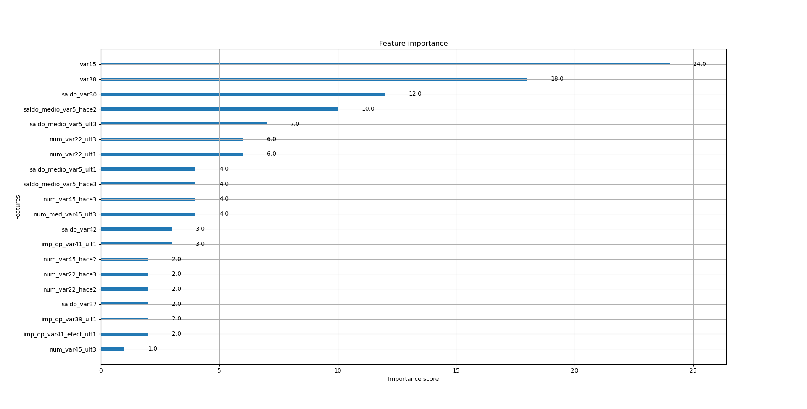
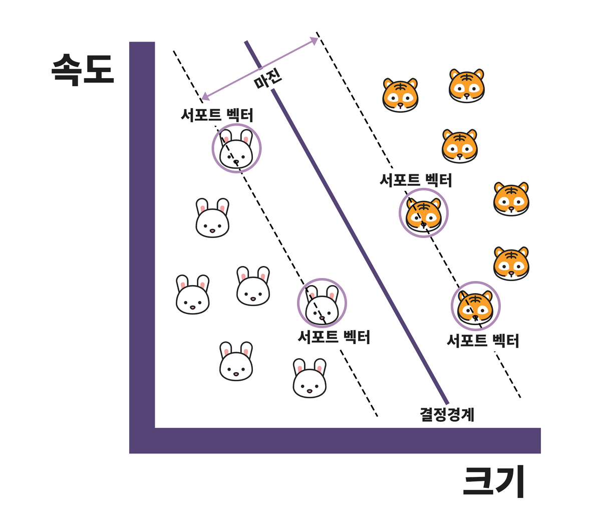
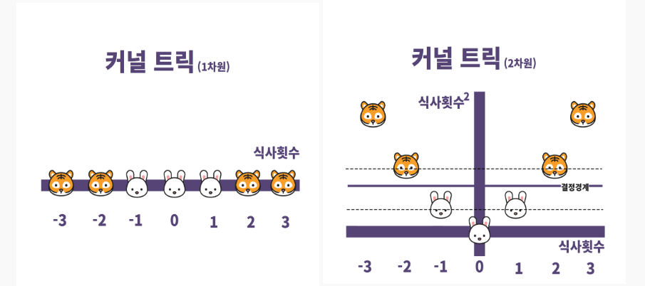
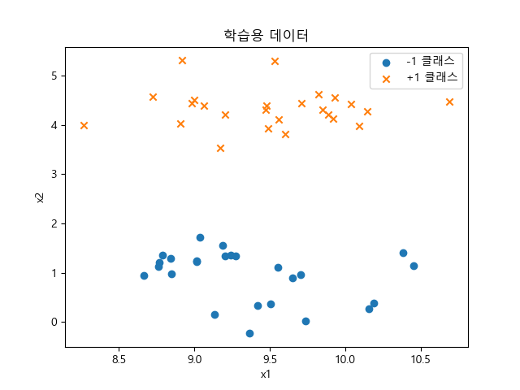
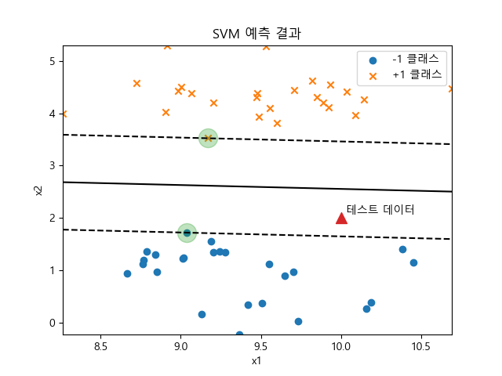
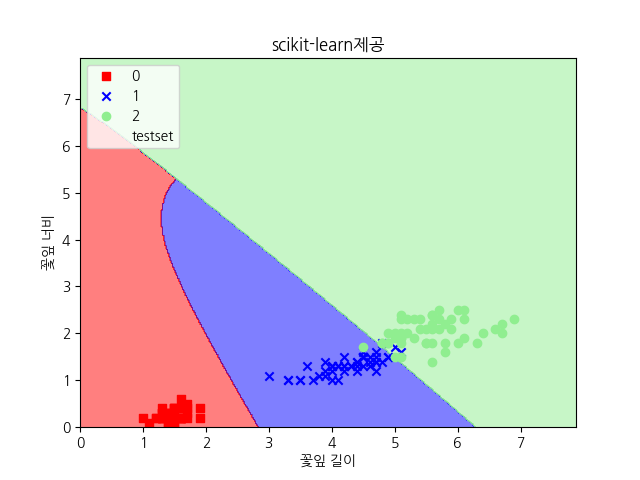
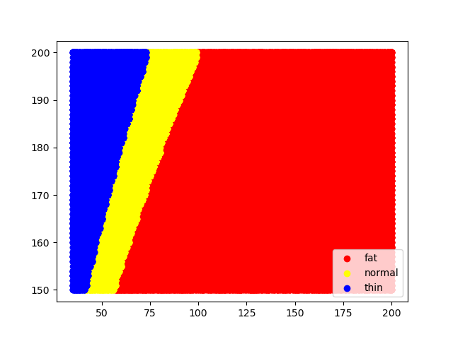
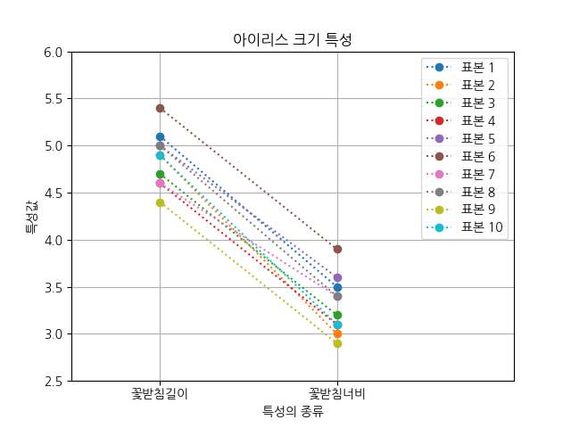

# Day 48_XGBoost · SVM · PCA
## 📅 2026-04-14

---
# 📄 ex33xgboost.py — XGBoost 실습 (산탄데르 고객만족 분류)

> **데이터셋**: Kaggle Santander Customer Satisfaction  
> **목표**: 고객 불만족 여부 이진 분류 (0: 만족, 1: 불만족)  
> **평가지표**: ROC-AUC (클래스 불균형 데이터에 적합)

---

## 1. 라이브러리 임포트

```python
import numpy as np
import pandas as pd
import matplotlib.pyplot as plt
from xgboost import XGBClassifier       # XGBoost 분류 모델
from xgboost import plot_importance     # 피처 중요도 시각화
from sklearn.metrics import roc_auc_score
from sklearn.model_selection import GridSearchCV, train_test_split
```

---

## 2. 데이터 로드 및 탐색

```python
df = pd.read_csv("train_san.csv", encoding='latin-1')

print(df.shape)   # (76020, 371) → 76,020행, 371열(ID + 369 feature + TARGET)
print(df.info())
```

### 클래스 분포 확인

```python
print(df['TARGET'].value_counts())
# 0    73012  (만족)
# 1     3008  (불만족)

unsatisfied_cnt = df[df['TARGET'] == 1].TARGET.count()
total_cnt = df.TARGET.count()
print(f'불만족 비율은 {unsatisfied_cnt / total_cnt}')  # 약 3.96%
```

> ⚠️ **클래스 불균형 주의**: 불만족 비율이 약 4%에 불과 → 정확도보다 **ROC-AUC**로 평가해야 함

---

## 3. 데이터 전처리

```python
# var3 컬럼의 이상치(-999999)를 최빈값(2)으로 대체
df['var3'].replace(-999999, 2, inplace=True)

# ID 컬럼 제거 (식별자이므로 학습에 불필요)
df.drop('ID', axis=1, inplace=True)
```

### Feature / Label 분리

```python
x_features = df.iloc[:, :-1]   # 마지막 열(TARGET) 제외한 모든 열
y_label    = df.iloc[:, -1]    # TARGET 열만
# x_feature shape: (76020, 369)
```

---

## 4. 학습/검증 데이터 분리

```python
x_train, x_test, y_train, y_test = train_test_split(
    x_features, y_label,
    test_size=0.2,    # 80% 학습, 20% 검증
    random_state=0
)
```

### 분포 비율 확인

```python
train_cnt = y_train.count()
test_cnt  = y_test.count()
print('학습데이터 레이블 값 분포 비율:', y_train.value_counts() / train_cnt)
print('검증데이터 레이블 값 분포 비율:', y_test.value_counts() / test_cnt)
# 학습: 0 → 96.1%, 1 → 3.9%
# 검증: 0 → 95.8%, 1 → 4.2%  ← 전체 비율과 유사하게 유지됨
```

---

## 5. 기본 XGBoost 모델 학습

```python
xgb_clf = XGBClassifier(
    n_estimators=500,          # 트리 개수 (실습에서는 시간상 5로 설정)
    random_state=12,
    early_stopping_rounds=10,  # 10라운드 동안 성능 개선 없으면 조기 종료
    eval_metric='auc'          # 평가 기준: AUC
)

xgb_clf.fit(
    x_train, y_train,
    eval_set=[(x_train, y_train), (x_test, y_test)],  # 학습/검증 동시 모니터링
    verbose=50  # 50라운드마다 출력
)
```

> ⚠️ **버전 주의**: XGBoost 최신 버전에서 `early_stopping_rounds`, `eval_metric`은  
> `fit()` 안이 아닌 **생성자(`XGBClassifier()`)에 넣어야 함**

### 성능 평가

```python
xgb_roc_score = roc_auc_score(y_test, xgb_clf.predict_proba(x_test)[:, 1])
# predict_proba(x_test)[:, 1] → 불만족(1)일 확률값만 추출
print(f'xgb_roc_score : {xgb_roc_score:.5f}')  # 0.83431

pred = xgb_clf.predict(x_test)
print('예측값 : ', pred[:5])
print('실제값 : ', y_test[:5].values)   # ← x_test가 아닌 y_test !

from sklearn import metrics
print('분류 정확도 : ', metrics.accuracy_score(y_test, pred))  # 0.9583
```

---

## 6. GridSearchCV로 최적 파라미터 탐색

```python
params = {
    'max_depth'        : [5, 7],        # 트리 깊이 (깊을수록 복잡, 과적합 위험)
    'min_child_weight' : [1, 3],        # 리프 노드의 최소 관측치 가중치합 (클수록 보수적)
    'colsample_bytree' : [0.5, 0.75]    # 트리 생성 시 사용할 feature 비율
}

gridcv = GridSearchCV(xgb_clf, param_grid=params)
gridcv.fit(x_train, y_train, eval_set=[(x_test, y_test)])
print('최적 파라미터:', gridcv.best_params_)
# → {'colsample_bytree': 0.75, 'max_depth': 5, 'min_child_weight': 3}
```

### GridSearch 결과 평가

```python
gridcv_roc_score = roc_auc_score(
    y_test,
    gridcv.predict_proba(x_test)[:, 1],
    average='macro'
    # macro  : 클래스별 점수를 동등하게 평균 → 소수 클래스 성능 중요시
    # micro  : 전체 데이터 기반 평균 → 데이터 불균형이 심할 때 사용
)
print(f'gridcv_roc_score : {gridcv_roc_score:.5f}')  # 0.83870
```

---

## 7. 최적 파라미터로 모델 재생성

```python
xgb_clf2 = XGBClassifier(
    n_estimators=5,           # 실습용 (실전에서는 500+)
    random_state=12,
    max_depth=5,              # GridSearch 결과
    min_child_weight=3,       # GridSearch 결과
    colsample_bytree=0.75     # GridSearch 결과
)

xgb_clf2.fit(
    x_train, y_train,
    eval_set=[(x_train, y_train), (x_test, y_test)]
)

xgb_roc_score2 = roc_auc_score(y_test, xgb_clf2.predict_proba(x_test)[:, 1])
print(f'xgb_roc_score2 : {xgb_roc_score2:.5f}')  # 0.83825

pred2 = xgb_clf2.predict(x_test)
print('분류 정확도 :', metrics.accuracy_score(y_test, pred2))  # 0.9583
```

---

## 8. 피처 중요도 시각화

```python
fig, ax = plt.subplots(1, 1, figsize=(10, 8))
plot_importance(xgb_clf2, ax=ax, max_num_features=20)  # 상위 20개 feature만 표시
plt.show()
```



---

## 전체 흐름 요약

```
데이터 로드
    ↓
탐색(EDA) - 클래스 불균형 확인 (불만족 ~4%)
    ↓
전처리 - 이상치 처리, ID 제거
    ↓
Feature/Label 분리 → Train/Test Split
    ↓
기본 XGBoost 학습 → AUC: 0.83431
    ↓
GridSearchCV로 최적 파라미터 탐색 → AUC: 0.83870
    ↓
최적 파라미터로 재학습 → AUC: 0.83825
    ↓
피처 중요도 시각화
```

---

## 주요 개념 정리

### ROC-AUC를 쓰는 이유
클래스가 불균형(만족 96%, 불만족 4%)할 때 정확도는 의미 없음.  
모델이 전부 "만족"으로 예측해도 정확도 96% 달성 가능 → AUC로 평가해야 실제 성능 확인 가능.

### early_stopping_rounds
지정한 라운드 수 동안 검증 성능이 개선되지 않으면 학습을 조기 종료.  
`n_estimators`를 넉넉하게 설정하고 early stopping이 자동으로 최적 지점을 찾게 하는 것이 일반적.

### GridSearchCV
지정한 파라미터 조합을 전부 시도해 가장 성능이 좋은 조합을 찾아줌.  
`best_params_`로 최적 파라미터 확인 가능.

### predict_proba()[:, 1]
각 샘플이 클래스 1(불만족)일 확률을 반환.  
`predict()`는 0/1 이진값, `predict_proba()`는 확률값 → AUC 계산에는 확률값 필요.

---

# 📖 SVM (Support Vector Machine) 개념 정리

> **서포트 벡터 머신**: 데이터가 어느 카테고리에 속할지 판단하기 위해  
> **가장 적절한 경계**를 찾는 지도학습 기반 선형 분류 모델

---

## 1. 핵심 아이디어 — 어떤 경계선이 가장 좋을까?

두 집단을 나누는 직선은 수만 가지가 존재한다.  
그 중 **새로운 데이터가 들어와도 여전히 잘 구분하는** 직선이 최적의 경계선이다.

```
[직선 A]  두 집단 사이 거리가 멀다 → 새 데이터도 잘 분류 ✅
[직선 B]  한쪽 집단에 너무 가깝다 → 새 데이터 오분류 위험 ❌
```

> 💡 핵심: 경계선을 중심으로 **양쪽 집단이 최대한 멀리** 떨어져 있어야 한다

---

## 2. 개념도



---

## 3. 3가지 핵심 개념

### 📌 서포트 벡터 (Support Vector)
각 집단에서 결정 경계에 **가장 가까이 위치한** 데이터 포인트들.  
이 포인트들이 경계선의 위치를 결정하는 핵심 역할을 한다.  
→ 나머지 데이터는 경계에 영향을 주지 않음

### 📌 마진 (Margin)
두 집단의 서포트 벡터 사이의 거리.  
SVM의 목표 = **마진을 최대화**하는 결정 경계를 찾는 것.

### 📌 결정 경계 (Decision Boundary)
마진의 정중앙을 지나는 선.  
두 집단을 분할하는 최종 기준선.

```
Class A  ●  ●  ●
               |  ← 서포트 벡터
          ─────────────  ← plus-plane  (점선)
               ↕  마진
          ══════════════  ← 결정 경계  (실선)
               ↕  마진
          ─────────────  ← minus-plane (점선)
               |  ← 서포트 벡터
Class B  ■  ■  ■
```

---

## 4. 결정 경계 구하는 순서

```
① 각 집단의 경계에 위치한 데이터(서포트 벡터)를 찾는다
        ↓
② 서포트 벡터를 지나는 평행한 두 직선을 긋는다 (plus-plane, minus-plane)
        ↓
③ 두 직선 사이의 거리 = 마진
        ↓
④ 마진의 중앙을 지나는 직선 = 결정 경계 (Decision Boundary)
```

---

## 5. 차원에 따른 결정 경계 형태

| feature 수 | 공간 | 결정 경계 |
|-----------|------|---------|
| 2개 | 2차원 | 직선 (Line) |
| 3개 | 3차원 | 평면 (Plane) |
| N개 | N차원 | 초평면 (Hyperplane) |

---

## 6. 하드 마진 vs 소프트 마진

이상치(Outlier)를 얼마나 허용하느냐에 따라 달라진다.


### 🔴 하드 마진 (Hard Margin)
- 이상치를 **전혀 허용하지 않음**
- 모든 데이터를 완벽하게 분류
- 마진이 좁아짐
- **과적합(Overfitting)** 위험 — 새로운 데이터에 취약

### 🔵 소프트 마진 (Soft Margin)
- 이상치를 **어느 정도 허용**
- 몇 개 오분류를 감수하고 나머지를 더 잘 구분
- 마진이 넓어짐
- **과소적합(Underfitting)** 주의 — 패턴을 놓칠 수 있음

### ⚙️ C 파라미터로 조절
```python
SVC(C=1e10)  # C 크면 → 하드 마진 (이상치에 엄격)
SVC(C=0.01)  # C 작으면 → 소프트 마진 (이상치에 유연)
```

---

## 7. 커널 트릭 (Kernel Trick)

### 문제 상황
데이터가 선형으로 분리 불가능한 경우가 존재한다.

```
예) 1차원 직선상의 데이터
  🐯  🐰  🐰  🐯  🐰  🐯
← 직선 하나로는 절대 나눌 수 없음
```

### 해결 방법
기존 예측 변수를 변환하여 **더 높은 차원으로 올린다**.



```
1차원 (분리 불가)              2차원으로 변환 (분리 가능!)
x축: 식사 횟수        →       x축: 식사 횟수
                              y축: 식사 횟수²
                                   ↑ 이 공간에서는 직선으로 분리 가능!
```

> 💡 핵심: 저차원에서 비선형인 데이터를 고차원으로 변환하면 선형 분리가 가능해진다.  
> 실제로 고차원 변환을 하지 않고 **수식으로만 계산**해서 효율적으로 처리 → 이게 "트릭"인 이유

### 커널 종류

| 커널 | 코드 | 설명 | 언제 쓰나 |
|------|------|------|---------|
| 선형 | `kernel='linear'` | 직선으로 분리 | 선형 분리 가능할 때 |
| 다항식 | `kernel='poly'` | 다항식 곡선 | 곡선 경계가 필요할 때 |
| 방사형 | `kernel='rbf'` | 방사형 곡선 | **실무에서 가장 많이 사용** |

---

## 8. 주요 파라미터

```python
from sklearn.svm import SVC

SVC(
    kernel='rbf',   # 커널 종류: linear / poly / rbf
    C=1.0,          # 마진 조절: 클수록 하드마진, 작을수록 소프트마진
    degree=3,       # poly 커널 전용: 다항식 차수 (높을수록 복잡한 곡선)
    coef0=1,        # poly 커널 전용: 고차/저차 영향력 비율
)
```

---

## 9. SVM 실생활 활용 예시

| 분야 | 활용 예 |
|------|--------|
| 금융 | 기업 부도 예측 (매출 변동성, 현금흐름 등) |
| 의료 | 환자 간 질병 분류 및 진단 |
| 제조 | 설비 이상 반응 예측 시스템 |
| 이미지 | 손글씨 인식, 얼굴 인식 |

---

## 핵심 요약

| 용어 | 설명 |
|------|------|
| 결정 경계 | 두 클래스를 나누는 선/평면/초평면 |
| 마진 | 결정 경계와 서포트 벡터 사이의 거리 |
| 서포트 벡터 | 결정 경계에 가장 가까운 데이터 포인트 |
| 하드 마진 | 이상치 불허 → 마진 좁음 → 과적합 위험 |
| 소프트 마진 | 이상치 허용 → 마진 넓음 → 과소적합 주의 |
| 커널 트릭 | 저차원 → 고차원 변환으로 비선형 분리 가능하게 함 |
| 초평면 | 고차원에서의 결정 경계 |
| C 파라미터 | 클수록 하드마진, 작을수록 소프트마진 |

---

# 📄 ex34svm.py — SVM 실습 (선형 분류)

> **알고리즘**: SVM (Support Vector Machine)  
> **목표**: 두 클래스를 마진이 최대가 되는 초평면으로 분리  
> **데이터**: make_blobs로 생성한 가상 이진 분류 데이터

---

## 1. 라이브러리 임포트 및 데이터 생성

```python
from sklearn.datasets import make_blobs
import matplotlib.pyplot as plt
import numpy as np
from sklearn.svm import SVC

plt.rc('font', family='malgun gothic')

X, y = make_blobs(n_samples=50, centers=2, cluster_std=0.5, random_state=4)
y = 2 * y - 1   # 0/1 → -1/+1 변환 (SVM 관례)
```

---

## 2. 학습 데이터 시각화

```python
plt.scatter(X[y == -1, 0], X[y == -1, 1], marker='o', label="-1 클래스")
plt.scatter(X[y == +1, 0], X[y == +1, 1], marker='x', label="+1 클래스")
plt.xlabel("x1")
plt.ylabel("x2")
plt.legend()
plt.title("학습용 데이터")
plt.show()
```



---

## 3. SVM 모델 학습

```python
# kernel='linear': 직선 경계
# C=1.0: 마진 조절 (C 바꿔가며 마진 변화 확인 가능)
model = SVC(kernel='linear', C=1.0).fit(X, y)
```

---

## 4. 결정 경계 시각화

```python
# decision_function: 결정 경계로부터의 부호 있는 거리값
#   levels=[-1, 0, 1] → -1/+1: 점선(마진 경계), 0: 실선(결정 경계)
plt.contour(X1, X2, z, levels=[-1, 0, 1], colors='k', linestyles=['dashed', 'solid', 'dashed'])

# support_vectors_: 학습 후 모델이 찾아낸 서포트 벡터 좌표
plt.scatter(model.support_vectors_[:, 0], model.support_vectors_[:, 1], s=300, alpha=0.3)
plt.show()
```



---

# 📄 ex35xor.py — SVM 실습 (AND / OR / XOR 논리 연산 분류)

> **목표**: 논리 연산(AND, OR, XOR)을 SVM과 로지스틱 회귀로 분류  
> **핵심**: XOR은 선형 분리 불가 → SVM이 로지스틱 회귀보다 우수

---

## 1. XOR 데이터 구조

```python
# XOR 진리표
x_data = [
    [0, 0, 0],   # p=0, q=0, XOR=0
    [0, 1, 1],   # p=0, q=1, XOR=1
    [1, 0, 1],   # p=1, q=0, XOR=1
    [1, 1, 0]    # p=1, q=1, XOR=0
]
# ※ AND: [0,0,0], [0,1,0], [1,0,0], [1,1,1]
# ※ OR : [0,0,0], [0,1,1], [1,0,1], [1,1,1]
```

> ⚠️ XOR은 직선 하나로 분리 불가능한 **비선형 문제**

---

## 2. 모델 학습 및 비교

```python
lmodel = LogisticRegression()  # 선형 분류 → XOR 비선형 문제에 취약
smodel = svm.SVC()             # 커널 트릭으로 비선형 문제 처리 가능

lmodel.fit(feature, label)
smodel.fit(feature, label)
```

### 결과 비교

| 모델 | 예측값 | 정확도 | 이유 |
|------|--------|--------|------|
| LogisticRegression | `[0 0 0 0]` | 0.75 | 선형 경계만 → XOR 패턴 학습 불가 |
| SVM (SVC) | `[0 1 1 0]` | 1.0 | 커널 트릭으로 비선형 분리 가능 |

---

# 📄 ex36svm_iris.py — SVM 실습 (Iris 다중 분류)

> **알고리즘**: SVM (kernel='rbf')  
> **데이터셋**: Iris (꽃잎 길이/너비 기준 3종 분류)  
> **평가**: 정확도 확인 3가지 방법 + 모델 저장/불러오기

---

## 1. 모델 학습

```python
model = svm.SVC(kernel='rbf', C=1.0)
model.fit(x_train, y_train)

# 총 갯수:45, 오류수:1
```

---

## 2. 정확도 확인 3가지 방법

```python
# 방법 1 — accuracy_score → 0.9777...
# 방법 2 — 혼동행렬 (Confusion Matrix)
con_mat = pd.crosstab(y_test, y_pred, rownames=['실제값'], colnames=['예측값'])
# 방법 3 — model.score()
print('test score : ', model.score(x_test, y_test))    # 0.9777...
print('train score : ', model.score(x_train, y_train)) # 0.9809...
# ※ 두 값 차이가 크면 과적합(Overfitting) 의심
```

---

## 3. 모델 저장 및 불러오기

```python
import joblib   # pickle보다 빠르고 대용량 지원
joblib.dump(model, 'svm_model.pkl')
read_model = joblib.load('svm_model.pkl')
```

---

## 4. 결정 경계 시각화



---

# 📄 ex37svm_bmi.py — SVM 실습 (BMI 비만도 분류)

> **알고리즘**: SVM (kernel='rbf')  
> **데이터셋**: bmi.csv (무작위 생성 50,000건)  
> **목표**: 키와 몸무게로 비만도 3단계 분류 (thin / normal / fat)

---

## BMI란?

| BMI 범위 | 분류 | label |
|---------|------|-------|
| 18.5 미만 | 저체중 | thin |
| 18.5 ~ 25.0 | 정상 | normal |
| 25.0 이상 | 과체중/비만 | fat |

---

## 1. Feature 전처리 — 정규화

```python
# SVM은 거리 기반 → feature 간 스케일 차이 크면 성능 저하
w = df['weight'] / 100   # 35~200 → 0.35~2.0
h = df['height'] / 200   # 150~200 → 0.75~1.0
wh = pd.concat([w, h], axis=1)
label = label.map({'thin':0, 'normal':1, 'fat':2})
```

---

## 2. 모델 학습 및 평가

```python
model = svm.SVC(C=0.01, kernel='rbf').fit(x_train, y_train)
# sc_score: 0.9549
```

---

## 3. 시각화



---

# 📄 ex37quiz.py — SVM 실습 (심장병 환자 분류)

> **데이터셋**: Heart.csv (흉부외과 환자 303명)  
> **목표**: 심장병(AHD) 여부 이진 분류 (No: 0, Yes: 1)  
> **특이사항**: 문자 컬럼 제외 + 표준화 적용

---

## 1. 데이터 로드 및 전처리

```python
import pandas as pd
import numpy as np
import matplotlib.pyplot as plt
import koreanize_matplotlib
from sklearn.model_selection import train_test_split
from sklearn.preprocessing import StandardScaler
from sklearn import svm, metrics

# 데이터 로드
df = pd.read_csv("https://raw.githubusercontent.com/pykwon/python/refs/heads/master/testdata_utf8/Heart.csv", index_col=0)

# 결측값 제거 (Ca 4개, Thal 2개) → 303행 → 297행
df = df.dropna()

# 문자 컬럼 제외 (Feature Selection), label 분리 + Dummy 처리
feature = df.drop(['ChestPain', 'Thal', 'AHD'], axis=1)
label = df['AHD'].map({'No':0, 'Yes':1})
```

> 💡 **특성공학 기법 적용**  
> Feature Selection — 문자 컬럼(ChestPain, Thal) 제거  
> Dummy — AHD: No/Yes → 0/1 변환

---

## 2. Train / Test Split + 표준화

```python
x_train, x_test, y_train, y_test = train_test_split(feature, label, test_size=0.3, random_state=0)

# 표준화 — fit은 train으로만, test는 transform만
sc = StandardScaler()
x_train = sc.fit_transform(x_train)
x_test = sc.transform(x_test)
```

> ⚠️ `fit_transform` vs `transform`  
> `fit_transform` — 평균/표준편차 계산 + 변환 동시에 (train만)  
> `transform` — 이미 계산된 기준으로 변환만 (test에 적용)

---

## 3. 모델 학습 및 평가

```python
# C=0.01: 소프트 마진, kernel='rbf': 방사형 커널
svc_model = svm.SVC(C=0.01, kernel='rbf')
svc_model.fit(x_train, y_train)

pred = svc_model.predict(x_test)
print('예측값 : ', pred[:10])
print('실제값 : ', y_test[:10].values)
print('sc_score : ', metrics.accuracy_score(y_test, pred))  # 0.5333...
```

> 💡 **C 값에 따른 성능 차이**  
> C=0.01 → 정확도 0.53 (소프트마진 과하게 적용)  
> C=1.0 + 표준화 → 정확도 0.77 (C 값 + 표준화 효과)  
> C 값과 표준화를 함께 적용해야 성능 향상 가능

---

## 4. 교차 검증

```python
from sklearn import model_selection

# cv=3: 데이터를 3등분하여 번갈아가며 검증
# 3회 정확도가 일정하면 안정적인 모델, 들쑥날쑥하면 과적합 의심
cross_vali = model_selection.cross_val_score(svc_model, feature, label, cv=3)
print('3회 각 정확도 : ', cross_vali)
print('평균 정확도 : ', cross_vali.mean())
```

> ⚠️ 교차검증 시 정규화 안 된 `feature`를 넣으면 정확도가 낮게 나옴  
> 정확한 교차검증을 하려면 `Pipeline`으로 StandardScaler와 모델을 묶어야 함

---

## 5. 새로운 환자 데이터 예측

```python
new_data = pd.DataFrame({
    'Age'    : [63,  45,  55],
    'Sex'    : [1,   0,   1],       # 1: 남성, 0: 여성
    'RestBP' : [145, 130, 160],
    'Chol'   : [233, 204, 286],
    'Fbs'    : [1,   0,   0],       # 1: 공복혈당 > 120mg/dl
    'RestECG': [2,   0,   2],       # 0: 정상, 1: 이상, 2: 비대
    'MaxHR'  : [150, 172, 108],
    'ExAng'  : [0,   0,   1],       # 1: 운동 시 협심증 있음
    'Oldpeak': [2.3, 1.4, 1.5],
    'Slope'  : [3,   1,   2],
    'Ca'     : [0,   0,   3]        # 형광투시로 확인된 혈관 수
})

new_pred = svc_model.predict(new_data)
for i, result in enumerate(new_pred):
    print(f'환자 {i+1} : {"심장병 있음" if result == 1 else "심장병 없음"}')
```

> ⚠️ 학습 시 표준화를 적용했다면 new_data도 동일하게 변환 필요  
> `new_data = sc.transform(new_data)`

---

## 전체 흐름 요약

```
데이터 로드 (303행)
    ↓
결측값 제거 → 297행
    ↓
Feature Selection (문자 컬럼 제거) + Dummy (AHD 0/1 변환)
    ↓
Train / Test Split (7:3)
    ↓
표준화 (StandardScaler)
    ↓
SVM 학습 (kernel='rbf', C=0.01)
    ↓
정확도 확인 + 교차 검증
    ↓
새로운 환자 데이터 예측
```

---

## 주요 개념 정리

### 특성공학 기법 적용 내역

|기법|내용|
|---|---|
|Feature Selection|ChestPain, Thal 제거|
|Dummy|AHD → No:0, Yes:1|
|Scaling (표준화)|StandardScaler 적용|

### C 파라미터

- C 크면 → 하드 마진 (이상치에 엄격, 과적합 위험)
- C 작으면 → 소프트 마진 (이상치에 유연, 과소적합 주의)
- 현재 C=0.01로 너무 작음 → C=1.0 이상 권장

### 교차 검증 (Cross Validation)

데이터를 cv등분하여 번갈아가며 학습/검증 반복.  
한 번의 train/test split보다 신뢰도 높은 성능 측정 가능.  
단, 표준화된 데이터로 돌려야 의미있는 결과가 나옴.

---
---

# 📖 특성공학 & 주성분분석 (PCA) 개념 정리

---

## 1. 특성공학 (Feature Engineering)

> 좋은 성능을 내기 위해 입력 자료를 변형하거나 가공하는 방법

| 기법 | 설명 | 실습 적용 |
|------|------|---------|
| Feature Selection | 중요한 변수만 선택, 나머지 제거 | ChestPain, Thal 제거 |
| Feature Extraction | 여러 변수를 새 변수로 압축 (PCA) | - |
| 정규화 | 0~1 사이로 축소 | BMI: weight/100 |
| 표준화 | 평균 0, 표준편차 1 변환 | Heart: StandardScaler |
| Binning | 연속형 → 범주형 | BMI → thin/normal/fat |
| Dummy | 범주형 → 0/1 변환 | AHD → No:0, Yes:1 |
| Feature Creation | 기존 자료로 새 변수 생성 | MaxHR÷Age → 심장지수 |

---

## 2. 주성분분석 (PCA)

> 여러 feature 가운데 대표 특성을 찾아 고차원 → 저차원으로 축소하는 기법

### 주성분을 찾는 과정

```
① 분산이 가장 큰 방향 → 첫 번째 주성분 (C1)
        ↓
② C1과 직교(90°)하는 방향 중 분산이 가장 큰 방향 → 두 번째 주성분 (C2)
        ↓
③ 필요한 차원 수만큼 반복
```

### 차원축소의 3가지 순기능

- **이해 용이** — 차원이 낮을수록 데이터 구조 파악 쉬움
- **연산속도 향상** — 데이터 특성 유지하면서 크기 축소
- **차원의 저주 해결** — 고차원일수록 필요 데이터 기하급수적 증가 → 과적합 예방

---

# 📄 ex38pca.py — PCA 실습 (Iris 차원 축소)

> **알고리즘**: PCA (Principal Component Analysis)  
> **데이터셋**: Iris (꽃받침 길이/너비 2개 feature)

---

## 1. 데이터 준비 및 시각화

```python
x = iris.data[:10, :2]   # 앞 10개 샘플, 꽃받침 길이/너비만 선택

# x.T: (10,2) → (2,10) 전치행렬 — feature별로 묶어서 시각화
plt.plot(x.T, 'o:')
plt.xticks(range(2), ['꽃받침길이', '꽃받침너비'])
```



> 💡 모든 샘플이 우하향 → 꽃받침 길이가 너비보다 전반적으로 큰 경향

---

## 주요 개념

### 공분산 행렬
두 변수가 함께 변하는 정도를 나타낸 행렬.  
PCA는 이 행렬을 분해해서 데이터가 가장 많이 퍼져있는 방향(주성분)을 찾는다.

### 고유벡터 / 고윳값
고유벡터 = 데이터가 퍼져있는 방향 (주성분의 방향)  
고윳값 = 해당 방향으로 데이터가 얼마나 퍼져있는지 → 클수록 중요한 주성분
