# Day 51_Pipeline · MLP · 계층적 군집분석
## 📅 2026-04-17

---
# 📄 ex48regressior.py — Regressor 성능 비교 (diabetes dataset)

---

## 🧠 개념 정리

### Pipeline이란

> 전처리 단계와 모델을 하나로 묶어 순서대로 자동 실행하는 도구 `fit()` 한 번으로 전처리 + 학습, `predict()` 한 번으로 전처리 + 예측이 동시에 실행됨

```
Pipeline([
    ("scaler", StandardScaler()),   # 1단계: 전처리
    ("model",  LinearRegression())  # 2단계: 모델
])
→ fit() 호출 시    : scaler.fit_transform() → model.fit() 자동 순서 실행
→ predict() 호출 시 : scaler.transform()    → model.predict() 자동 순서 실행
```

### Pipeline 파라미터 명명 규칙

> GridSearchCV와 함께 쓸 때 파라미터 이름은 반드시 `"단계이름__파라미터명"` (언더바 2개)

```python
"model__n_estimators": [100, 200]
#  ↑ Pipeline step 이름   ↑ 해당 모델의 파라미터
```

### 스케일링 필요 여부

> 모델 종류에 따라 스케일링이 필요한 경우와 불필요한 경우가 다름

|스케일링 필요|스케일링 불필요|
|---|---|
|LinearRegression|RandomForest|
|SVR|XGBoost / LightGBM|
|KNN|DecisionTree|
|Ridge, Lasso|트리 계열 전반|

> 트리 계열은 데이터를 분기 순서로만 보기 때문에 값의 크기가 달라도 결과가 같음 반면 LinearRegression, SVR, KNN은 거리나 크기를 직접 계산하므로 스케일 차이가 결과에 영향을 줌

### 평가 지표

|지표|설명|좋은 값|
|---|---|---|
|R² (결정계수)|모델이 데이터를 얼마나 잘 설명하는지 (0~1)|1에 가까울수록 좋음|
|RMSE|예측값과 실제값의 평균 오차|0에 가까울수록 좋음|

---

## 1단계 : 데이터 로드 및 확인

```python
from sklearn.datasets import load_diabetes

data = load_diabetes()
# feature 10개 (age, sex, bmi, bp 등) - 이미 표준화된 연속형 데이터
# target : 1년 후 당뇨 진행 수치 (연속형) → 회귀 문제

x = data.data    # (442, 10)
y = data.target  # [151.  75. ...] : 연속형 숫자

x_train, x_test, y_train, y_test = train_test_split(
    x, y,
    test_size=0.2,
    random_state=42
)
```

---

## 2단계 : Pipeline + GridSearchCV 모델 정의

> 각 모델을 딕셔너리로 관리 → 루프 한 번으로 모든 모델을 동일한 방식으로 처리 가능

```python
models = {
    "LinearRegression": {
        "pipeline": Pipeline([
            ("scaler", StandardScaler()),         # 거리/크기 기반 → 스케일링 필요
            ("model", LinearRegression())
        ]),
        "params": {
            "model__fit_intercept": [True, False]  # 절편 사용 여부
        }
    },
    "RandomForest": {
        "pipeline": Pipeline([
            ("scaler", StandardScaler()),
            ("model", RandomForestRegressor(random_state=42))
        ]),
        "params": {
            "model__n_estimators": [100, 200],    # 트리 개수
            "model__max_depth": [None, 5, 10],    # 트리 깊이 (None=제한없음)
            "model__min_samples_split": [2, 5]    # 분기 최소 샘플 수
        }
    },
    "XGBoost": {
        "pipeline": Pipeline([
            ("scaler", StandardScaler()),
            ("model", XGBRegressor(random_state=42, verbosity=0))
        ]),
        "params": {
            "model__n_estimators": [100, 200],
            "model__learning_rate": [0.01, 0.05], # 학습률 (작을수록 천천히 학습)
            "model__max_depth": [3, 5]
        }
    },
    "SVR": {
        "pipeline": Pipeline([
            ("scaler", StandardScaler()),         # 커널 거리 계산 → 스케일링 필수
            ("model", SVR())
        ]),
        "params": {
            "model__C": [0.1, 1, 10],             # 규제 강도 (클수록 덜 규제)
            "model__gamma": ["scale", "auto"],    # 커널 영향 범위
            "model__kernel": ["rbf"]              # 비선형 커널
        }
    },
    "KNN": {
        "pipeline": Pipeline([
            ("scaler", StandardScaler()),         # 유클리드 거리 사용 → 스케일링 필수
            ("model", KNeighborsRegressor())
        ]),
        "params": {
            "model__n_neighbors": [3, 5, 7],      # 참조할 이웃 수
            "model__weights": ["uniform", "distance"]  # 가중치 방식
        }
    }
}
```

---

## 3단계 : GridSearchCV 실행 (루프)

> 모든 모델을 동일한 루프로 처리 → 코드 중복 없이 5개 모델 한 번에 튜닝

```python
result = []       # 성능 결과 저장용 리스트
best_models = {}  # 모델명 : 최적 모델 객체 저장용 딕셔너리

for name, config in models.items():
    print(f"{name} 튜닝중...")

    grid = GridSearchCV(
        config["pipeline"],  # 전처리 + 모델이 묶인 파이프라인
        config["params"],    # 탐색할 파라미터 조합
        cv=5,                # 5겹 교차검증
        scoring="r2",        # R² 기준으로 최적 파라미터 선택
        n_jobs=-1            # 모든 CPU 코어 사용
    )
    grid.fit(x_train, y_train)  # 전처리 + 파라미터 탐색 + 학습 한 번에 실행

    best_model = grid.best_estimator_   # 최적 파라미터로 학습된 모델
    pred = best_model.predict(x_test)   # 전처리 + 예측 자동 실행

    rmse = np.sqrt(mean_squared_error(y_test, pred))  # 평균 오차
    r2 = r2_score(y_test, pred)                        # 설명력

    result.append([name, rmse, r2])     # 결과 리스트에 추가
    best_models[name] = best_model      # 딕셔너리에 모델 저장

    print("best params : ", grid.best_params_)
    print("R2 : ", r2)
```

### 실행 결과

```
LinearRegression 튜닝중...
best params :  {'model__fit_intercept': True}
R2 :  0.4526027629719195

RandomForest 튜닝중...
best params :  {'model__max_depth': 5, 'model__min_samples_split': 2, 'model__n_estimators': 200}
R2 :  0.45980874589723

XGBoost 튜닝중...
best params :  {'model__learning_rate': 0.01, 'model__max_depth': 3, 'model__n_estimators': 200}
R2 :  0.4639255401595046

SVR 튜닝중...
best params :  {'model__C': 10, 'model__gamma': 'scale', 'model__kernel': 'rbf'}
R2 :  0.4937125101265256

KNN 튜닝중...
best params :  {'model__n_neighbors': 7, 'model__weights': 'distance'}
R2 :  0.4446218777004597
```

### 성능 순위

|순위|모델|R²|
|---|---|---|
|1|SVR|0.4937|
|2|XGBoost|0.4639|
|3|RandomForest|0.4598|
|4|LinearRegression|0.4526|
|5|KNN|0.4446|

> 전체적으로 R²가 0.45~0.49 수준으로 낮음 → diabetes dataset 자체가 예측하기 어려운 데이터 SVR이 비선형 패턴을 잘 잡아서 1위

---

## 4단계 : 결과 저장 및 시각화

```python
df_results = pd.DataFrame(result, columns=['modelname', 'rmse', 'r2'])

plt.figure(figsize=(12, 5))

plt.subplot(1, 2, 1)
sns.barplot(x="modelname", y="r2", data=df_results)
plt.title("튜닝 모델 결정계수")
plt.xticks(rotation=10)

plt.subplot(1, 2, 2)
sns.barplot(x="modelname", y="rmse", data=df_results)
plt.title("튜닝 모델 RMSE")
plt.xticks(rotation=30)

plt.tight_layout()
plt.show()
```

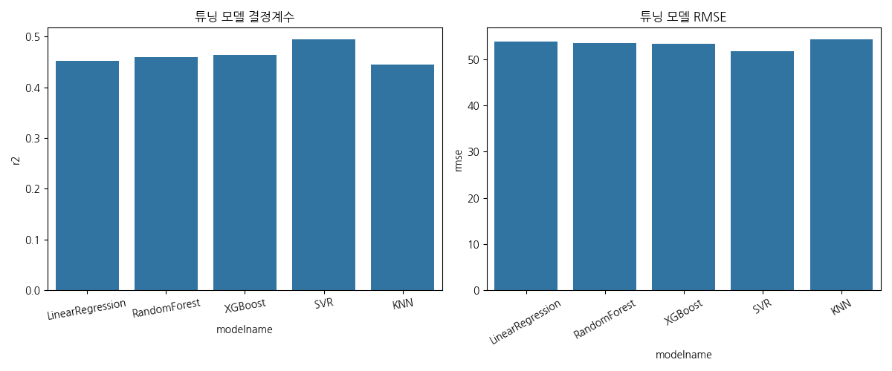

---

## 5단계 : 최고 모델 예측 시각화

> 실제값 vs 예측값을 산점도로 그려 모델 성능을 직관적으로 확인 빨간 점선(y=x)에 가까울수록 예측이 정확함

```python
best_modelname = df_results.sort_values("r2", ascending=False).iloc[0]["modelname"]
best_model = best_models[best_modelname]
pred = best_model.predict(x_test)

plt.figure(figsize=(6, 6))
plt.scatter(y_test, pred)
plt.plot([y_test.min(), y_test.max()], [y_test.min(), y_test.max()], 'r--')
plt.title(f'최고 모델 {best_modelname}')
plt.xlabel("실제값")
plt.ylabel("예측값")
plt.show()
```

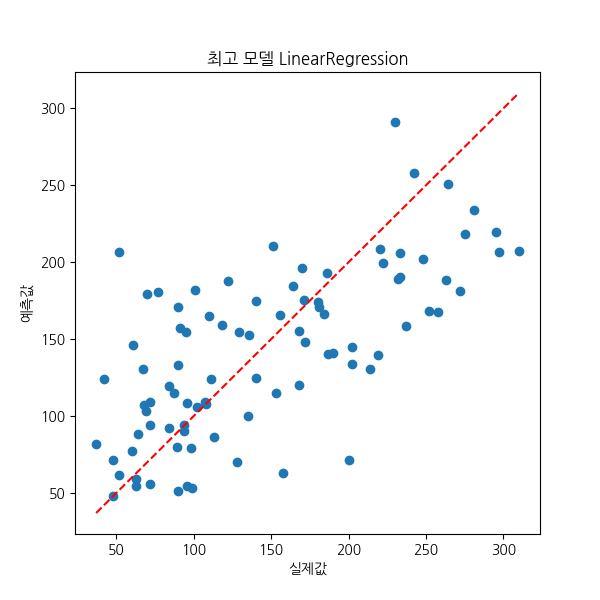

---

## 📌 핵심 정리

### 전체 흐름

```
데이터 로드 (442, 10) → 연속형 target → 회귀 문제
    ↓
train / test split (8:2)
    ↓
모델별 Pipeline 정의 (전처리 + 모델)
    ↓
GridSearchCV (cv=5, scoring='r2') → 최적 파라미터 탐색
    ↓
결과 DataFrame 저장 → 시각화 (barplot)
    ↓
최고 모델 선택 → 실제값 vs 예측값 산점도
```

### 주요 함수 정리

|함수|설명|
|---|---|
|`Pipeline([("이름", 객체)])`|전처리 + 모델 순서대로 묶기|
|`GridSearchCV(pipeline, params, cv, scoring)`|파이프라인 통째로 파라미터 탐색|
|`grid.best_estimator_`|최적 파라미터로 학습된 파이프라인 반환|
|`grid.best_params_`|최적 파라미터 딕셔너리 반환|
|`r2_score(y_test, pred)`|결정계수 (0~1, 높을수록 좋음)|
|`mean_squared_error(y_test, pred)`|MSE → `np.sqrt()` 로 RMSE 계산|

### 주의사항

|상황|올바른 처리|
|---|---|
|Pipeline 파라미터 명명|`"model__파라미터"` (언더바 2개 필수)|
|결과 저장 변수명|`result` (리스트) / `best_models` (딕셔너리) 혼용 주의|
|최고 모델 선택|`iloc[0]` 대신 `sort_values("r2", ascending=False).iloc[0]` 사용|
|컬럼명 일관성|DataFrame 컬럼명과 시각화 코드의 컬럼명 반드시 동일하게|

---

# 📄 인공신경망 (Artificial Neural Network)

> 참고 : [브런치 - 인공신경망](https://brunch.co.kr/@gdhan/6)

---

## 🧠 개념 정리

### 인공신경망(ANN)이란

> 기계학습과 인지과학 분야에서 고안한 학습 알고리즘 신경세포의 신호 전달체계를 모방한 인공뉴런(노드)이 학습을 통해 결합 세기를 변화시켜 문제를 해결하는 모델 전반을 가리킨다

|생물학적 신경세포|인공뉴런(퍼셉트론)|
|---|---|
|가지돌기 (Dendrite)|입력값|
|신경세포체 (Soma)|가중치 합산|
|축삭돌기 (Axon)|활성화 함수 → 출력값|

---

## 핵심 개념

### 퍼셉트론 (Perceptron)

> 신경세포가 임계값(threshold, θ)을 넘으면 신호를 전달하는 원리를 수학적으로 모델링한 것

- AND, OR, NAND 같은 단순한 논리 게이트 구현 가능
- 가중치의 조합은 무수히 많으며, 원하는 연산을 만족하는 조합을 찾는 것이 목표

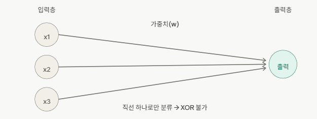

---

### 단층 퍼셉트론의 한계

> 단층 퍼셉트론은 **선형 결정 경계**만 표현 가능 → XOR 문제 해결 불가

|문제|단층 퍼셉트론|이유|
|---|---|---|
|AND|✅ 가능|선형 분리 가능|
|OR|✅ 가능|선형 분리 가능|
|NAND|✅ 가능|선형 분리 가능|
|XOR|❌ 불가|비선형 → 직선 하나로 분리 불가|

---

### 다층 퍼셉트론 (MLP, Multi-Layer Perceptron)

> 입력층과 출력층 사이에 **은닉층(Hidden Layer)** 을 추가해 비선형 문제 해결

```
입력층 → 은닉층 → 출력층
```

- 현재 모든 인공신경망은 입력층 / 은닉층 / 출력층으로 구성됨
- 은닉층을 여러 개 쌓을수록 더 복잡한 문제 해결 가능

---

### 활성화 함수 (Activation Function)

> 출력값을 **비선형(Non-Linear)** 으로 변환하는 수학적 장치

```
f(x) = cx 일 때, 은닉층이 3개라면
f(f(f(x))) = c³x  →  결국 g(x) = cx³ 인 1개 층과 동일
→ 은닉층을 여러 개 둔 효과가 없음
```

|함수|특징|단점|
|---|---|---|
|Sigmoid|출력값 0~1 사이로 압축|양 끝 기울기 ≈ 0 → 기울기 소실 문제|
|Tanh|출력값 -1~1 사이|여전히 기울기 소실 발생|
|**ReLU**|0보다 크면 그대로 출력, 0 이하면 0|**기울기 소실 방지 → 현재 가장 많이 사용**|
|Leaky ReLU|0 이하에서도 작은 기울기 유지|ReLU의 Dead Neuron 문제 보완|

---

### 학습 (Learning)

```
입력값 → 모델 f(W) → 예측 결괏값 ŷ
                          ↓
                       손실함수 L(y, ŷ)
                          ↓
                       가중치 W 변경
                          ↑ (반복)
```

### 손실 함수 (Loss Function)

|손실 함수|사용 상황|
|---|---|
|평균제곱오차 (MSE)|회귀 문제|
|교차엔트로피 오차 (Cross Entropy Error)|분류 문제|

---

## 📌 핵심 정리

### 전체 흐름

```
단층 퍼셉트론 (AND, OR, NAND 가능)
    ↓ XOR 해결 못함 (선형 한계)
다층 퍼셉트론 등장 (은닉층 추가)
    ↓ 선형으로만 전파되면 층이 의미없음
활성화 함수 도입 (비선형 변환)
    ↓ 가중치를 어떻게 찾을까?
손실 함수로 오차 측정 → 가중치 변경 반복 = 학습
```

### 용어 정리

|용어|설명|
|---|---|
|퍼셉트론 (Perceptron)|인공신경망의 기본 단위, 단층 신경망|
|은닉층 (Hidden Layer)|입력층과 출력층 사이의 중간 층|
|가중치 (Weight, ω)|각 입력 신호의 중요도를 나타내는 값|
|임계값 (Threshold, θ)|신호를 전달할지 말지 결정하는 기준값|
|활성화 함수|출력을 비선형으로 변환하는 함수|
|손실 함수|예측값과 정답값의 차이를 측정하는 함수|
|기울기 소실|층이 깊어질수록 기울기가 0에 수렴해 학습이 안 되는 문제|

---

# 📄 ex49perceptron.py — Perceptron (논리회로 · 일반 분류)

---

## 🧠 개념 정리

### Perceptron이란

> sklearn이 제공하는 단층신경망 (뉴런, 노드) 이진 분류(Binary Classification)만 가능한 선형 모델

### Perceptron 학습 방식

```
예측 → 맞았는지 확인 → 틀리면 Weight 갱신, 맞으면 통과 → max_iter 만큼 반복
```

### 주요 파라미터

|파라미터|설명|
|---|---|
|`max_iter`|학습 반복 횟수 (epoch)|
|`eta0`|학습률 (Learning Rate)|
|`random_state`|재현성을 위한 난수 시드|
|`coef_`|학습된 가중치 W|
|`intercept_`|학습된 바이어스 b|

---

## 실습 1 : 논리회로 분류

```python
feature = np.array([[0,0], [0,1], [1,0], [1,1]])
label = np.array([0,1,1,0])    # XOR → 해결 못함

ml = Perceptron(max_iter=10).fit(feature, label)
pred = ml.predict(feature)
print('acc : ', accuracy_score(label, pred))
```

---

## 실습 2 : 일반 자료 분류 + 결정 경계 시각화

```python
x = np.array([[2,3],[3,3],[1,1],[5,2],[6,1]])
y = np.array([1, 1, 1, -1, -1])

model = Perceptron(max_iter=100000, eta0=0.1, random_state=42)
model.fit(x, y)

w = model.coef_[0]
b = model.intercept_[0]
x_vals = np.linspace(0, 7, 100)
y_vals = -(w[0] * x_vals + b) / w[1]  # 결정경계: x2 = -(w1*x1 + b) / w2

plt.scatter(x[:, 0], x[:, 1], c=y, cmap='bwr')
plt.plot(x_vals, y_vals)
plt.show()
```

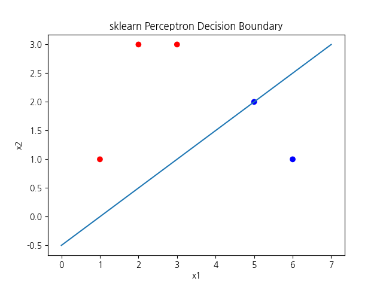

---

## 📌 핵심 정리

|상황|내용|
|---|---|
|XOR 분류|단층 퍼셉트론으로 해결 불가 → MLP 필요|
|결정 경계 수식|`x2 = -(w1*x1 + b) / w2`|
|정확도 0.8|[5,2] 오분류 → 5개 중 1개 오답|

---

# 📄 ex50perceptron_iris.py — Perceptron 분류 (iris dataset)

---

## 🧠 개념 정리

### 표준화 (StandardScaler)

```python
sc = StandardScaler()
sc.fit(x_train)               # train으로만 fit
x_train = sc.transform(x_train)
x_test = sc.transform(x_test) # test는 transform만
```

> iris dataset은 feature 간 크기 차이가 거의 없어 표준화 효과 미미 → 생략 가능

---

## 주요 코드

```python
model = Perceptron(max_iter=1000, random_state=0)
model.fit(x_train, y_train)
y_pred = model.predict(x_test)

print(accuracy_score(y_test, y_pred))           # 0.9777
print('test score : ', model.score(x_test, y_test))
print('train score : ', model.score(x_train, y_train))

joblib.dump(model, 'logimodel.pkl')
read_model = joblib.load('logimodel.pkl')
```

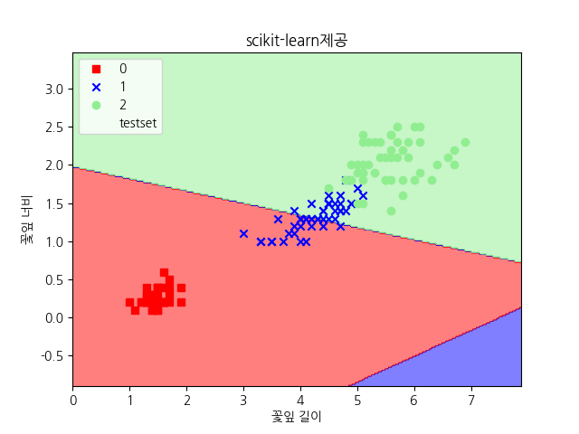

---

## 📌 핵심 정리

|상황|내용|
|---|---|
|`predict_proba`|Perceptron 미지원 → MLPClassifier 사용|
|정확도 주석 오류|오류수 1개 → 0.9777 (0.6은 잘못된 주석)|
|스케일링|fit은 train에만, test는 transform만|

---

# 📄 MLP (Multi-Layer Perceptron) 개념

---

## 🧠 개념 정리

### MLP란

> 여러 개의 퍼셉트론 뉴런을 여러 층으로 쌓은 **다층신경망 구조**
> 인접한 두 층의 뉴런 간에는 **완전 연결(Fully Connected)** 됨

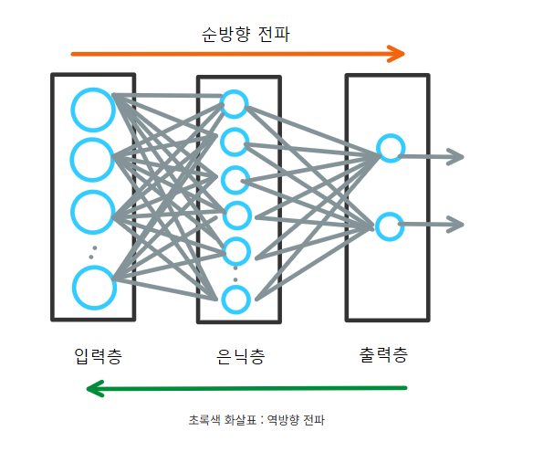

### 단층 퍼셉트론 vs MLP

|구분|단층 퍼셉트론|MLP|
|---|---|---|
|은닉층|없음|1개 이상|
|결정 경계|직선 (선형)|곡선 (비선형)|
|XOR 해결|❌ 불가|✅ 가능|
|활성화 함수|Step 함수|ReLU, tanh 등|
|학습 방식|틀린 것만 수정|역전파로 전체 가중치 갱신|
|sklearn|`Perceptron`|`MLPClassifier`|

### MLP 학습 과정 (역전파)

```
1. 순전파 : 입력 → 신경망 → 예측값 출력
2. 오차 계산 : L = (y - ŷ)
3. 미분(기울기 계산) : 오차가 줄어드는 방향 탐색
4. 가중치 W 갱신
5. 1~4 반복  →  역전파 (Back Propagation)
```

### sklearn MLPClassifier 주요 파라미터

|파라미터|설명|
|---|---|
|`hidden_layer_sizes`|`(10,)` : 1층 10개, `(20, 10)` : 2층 각 20/10개|
|`activation`|`relu`(기본 권장), `tanh`, `sigmoid`|
|`solver`|`adam` (기본 권장)|
|`learning_rate_init`|초기 학습률|
|`max_iter`|학습 횟수 — 권장 500~1000|

---

# 📄 ex51mlp.py — MLP (논리회로 · make_moons)

---

## 실습 1 : XOR 분류

```python
label = np.array([0,1,1,0])  # XOR → MLP로 해결 가능

ml = MLPClassifier(
    hidden_layer_sizes=10,
    solver='adam',
    learning_rate_init=0.01,
    max_iter=500,
    verbose=1
).fit(feature, label)

print('acc : ', accuracy_score(label, ml.predict(feature)))  # 1.0
```

## 실습 2 : make_moons 비선형 분류

```python
x, y = make_moons(n_samples=300, noise=0.2, random_state=42)

model = MLPClassifier(
    hidden_layer_sizes=(10, 10),
    activation='relu',
    solver='adam',
    max_iter=1000,
    random_state=42
)
model.fit(x_train, y_train)
print('acc : ', accuracy_score(y_test, model.predict(x_test)))  # 0.9666
```

---

## 📌 핵심 정리

```python
hidden_layer_sizes=10          # 은닉층 1개, 뉴런 10개
hidden_layer_sizes=(10, 10)    # 은닉층 2개, 각 뉴런 10개
hidden_layer_sizes=(100, 50, 25)  # 은닉층 3개
```

|상황|내용|
|---|---|
|`max_iter` 부족|ConvergenceWarning → 500~1000으로 늘리기|
|`hidden_layer_sizes`|문자열 넣으면 오류 → 정수 또는 튜플로 지정|

---

# 📄 ex52mlp_wine.py — MLP 다항분류 (wine dataset)

---

## 주요 코드

```python
scaler = StandardScaler()
x_train_scaled = scaler.fit_transform(x_train)
x_test_scaled  = scaler.transform(x_test)

model = MLPClassifier(
    hidden_layer_sizes=(20, 10),
    activation='relu',
    solver='adam',
    learning_rate_init=0.001,
    max_iter=150,
    random_state=42,
    verbose=1
)
model.fit(x_train_scaled, y_train)
```

```python
# 혼동행렬
cm = confusion_matrix(y_test, pred)
sns.heatmap(cm, annot=True, fmt='d', cmap='Blues')
```

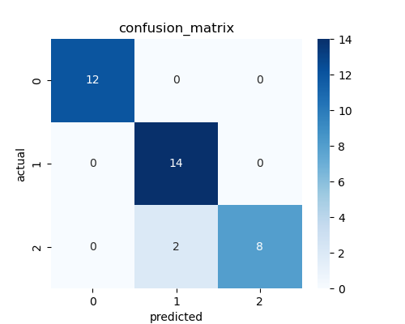

```python
# loss curve
plt.plot(model.loss_curve_)
plt.xlabel('iteration(epoch)')
plt.ylabel('loss')
```

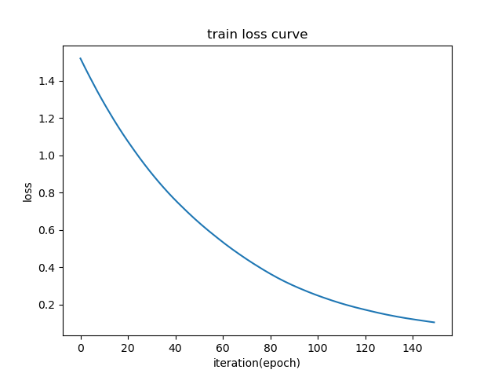

---

## 📌 핵심 정리

|함수 / 속성|설명|
|---|---|
|`model.loss_curve_`|epoch별 loss 값 (fit 이후 사용 가능)|
|`confusion_matrix(y_test, pred)`|혼동행렬 반환|
|`classification_report(y_test, pred)`|precision / recall / f1 출력|

---

# 📄 ex53mlp_iris.py — MLP 분류 (iris dataset)

---

## 주요 코드

```python
model = MLPClassifier(
    hidden_layer_sizes=(20, 10),
    activation='relu',
    solver='adam',
    learning_rate_init=0.001,
    max_iter=1000,
    random_state=42,
    verbose=1
)
model.fit(x_train, y_train)

print(accuracy_score(y_test, y_pred))  # 0.9777
print(read_model.predict_proba(new_data))  # 각 클래스 확률
```

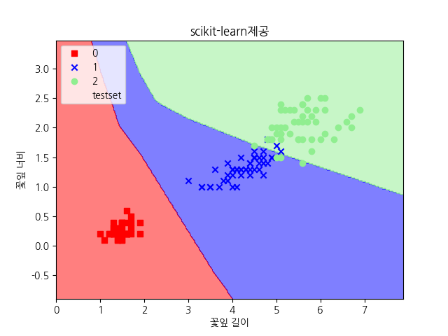

### Perceptron vs MLPClassifier

|구분|Perceptron|MLPClassifier|
|---|---|---|
|은닉층|없음|있음|
|XOR|❌|✅|
|predict_proba|❌ 미지원|✅ 지원|
|학습 방식|틀린 것만 수정|역전파 전체 갱신|

---

# 📄 군집분석 (Clustering Analysis)

---

## 🧠 개념 정리

### 군집분석이란

> 분류 기준이 없는 상태에서 데이터를 N개의 소그룹으로 묶어내는 **비지도학습**
> 집단 내 동질성과 집단 간 이질성을 기반으로 이뤄짐

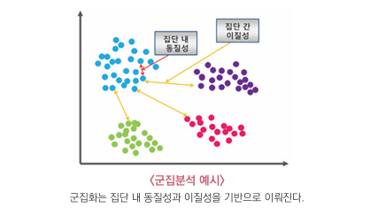

### 군집분석 종류

|종류|설명|대표 알고리즘|
|---|---|---|
|계층적 군집|유사한 개체를 반복적으로 병합/분리|병합적, 분할적 방법|
|비계층적 군집|군집 수를 미리 정하고 중심에 가까운 개체를 포함|K-Means|
|밀도 기반 군집|밀도가 높은 영역을 하나의 군집으로 구분|DBSCAN|

---

## 계층적 군집 (Hierarchical Clustering)

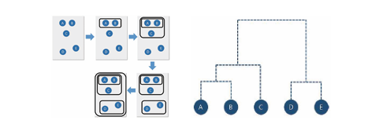

### 연결법 종류

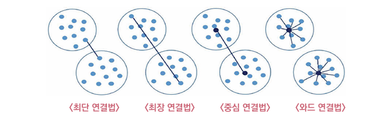

|연결법|설명|
|---|---|
|최단 연결법 (Single)|두 군집 간 가장 짧은 거리|
|최장 연결법 (Complete)|두 군집 간 가장 긴 거리|
|중심 연결법 (Centroid)|두 군집의 중심 간 거리|
|평균 연결법 (Average)|두 군집 간 거리의 평균|
|와드 연결법 (Ward)|군집 내 ESS 최소화 → 가장 많이 사용|

---

## 비계층적 군집 — K-Means

```
1. K값 결정
2. 중심 K개 임의 할당
3. 각 데이터를 가장 가까운 중심에 배정
4. 중심을 평균으로 업데이트
5. 중심이 변하지 않을 때까지 반복
```

---

## 밀도 기반 군집 — DBSCAN

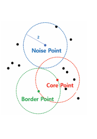

|포인트|설명|
|---|---|
|Core Point|반지름 내 최소 n개 이상 포인트를 가진 점|
|Border Point|코어 포인트 반지름 내 이웃하지만 최소 개수 미충족|
|Noise Point|코어/보더 포인트도 아닌 점 → 군집 제외|

### K-Means vs DBSCAN

|구분|K-Means|DBSCAN|
|---|---|---|
|군집 수|사전에 K 지정 필요|필요 없음|
|군집 모양|원형에 적합|불규칙한 형태도 가능|
|노이즈 처리|모든 점을 군집에 포함|노이즈 포인트 제외|

---

# 📄 unsuper1cl.py — 계층적 클러스터링

---

## 주요 코드

```python
from scipy.spatial.distance import pdist, squareform
from scipy.cluster.hierarchy import linkage, dendrogram

dist_vec = pdist(df, metric='euclidean')       # 점 쌍 간 거리 계산
row_dist = pd.DataFrame(squareform(dist_vec))  # 사각형 행렬로 변환

row_clusters = linkage(dist_vec, method='ward')  # 계층적 클러스터링
dendrogram(row_clusters, labels=labels)           # 덴드로그램 시각화
plt.ylabel('유클리드 거리')
```

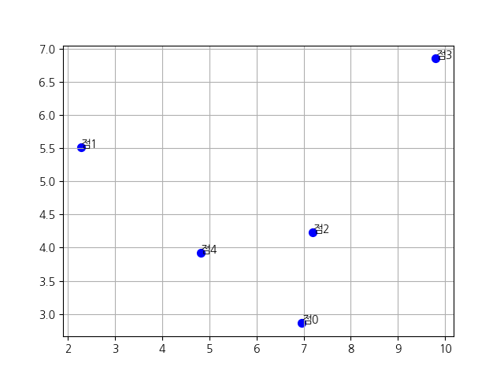

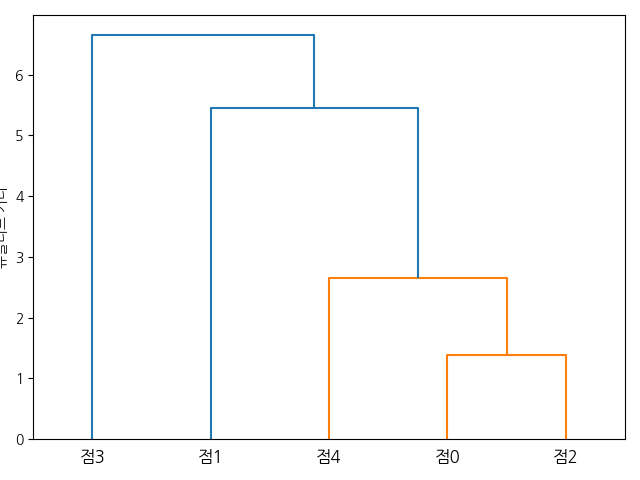

---

## 📌 핵심 정리

|함수|설명|
|---|---|
|`pdist(df, metric='euclidean')`|점 쌍 간 거리 1D 배열로 계산|
|`squareform(dist_vec)`|1D → 사각형 행렬 변환|
|`linkage(dist_vec, method='ward')`|계층적 클러스터링 수행|
|`dendrogram(row_clusters, labels)`|계통도 시각화|

---

# 📄 unsuper2cl.py — 계층적 군집분석 (학생 점수)

---

## 주요 코드

```python
linked = linkage(scores, method='ward')

dendrogram(linked, labels=students)
plt.axhline(y=25, color='red', linestyle='--', label='cut at 25')  # 절단선
plt.show()
```

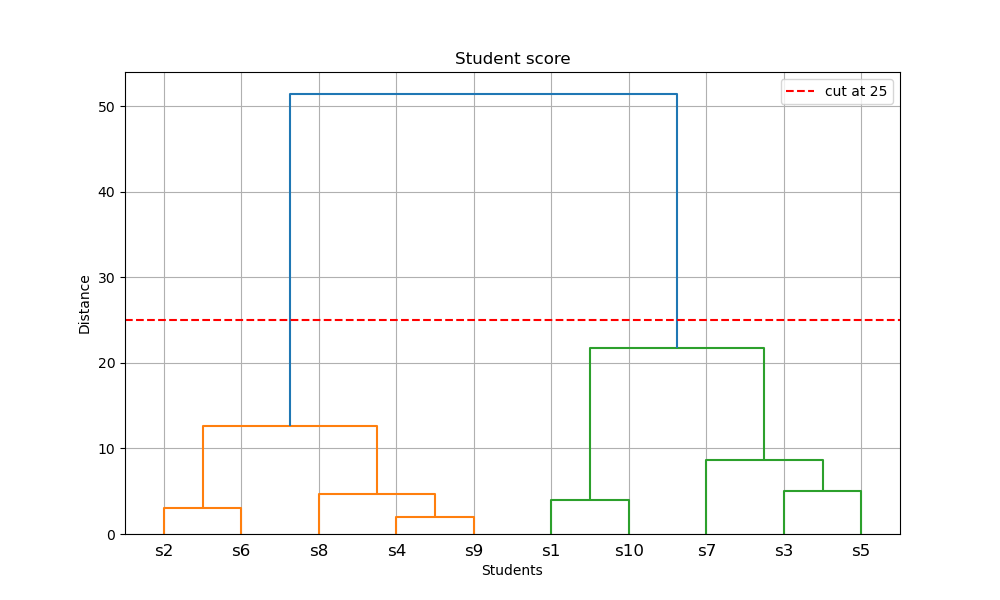

```python
# 군집 레이블 추출
clusters = fcluster(linked, t=3, criterion='maxclust')

# 군집별 평균 점수
for cluster_id, info in sorted(cluster_info.items()):
    avg_score = np.mean(info["scores"])
    print(f"Cluster {cluster_id}: 평균={avg_score:.2f}, 학생={info['students']}")
```

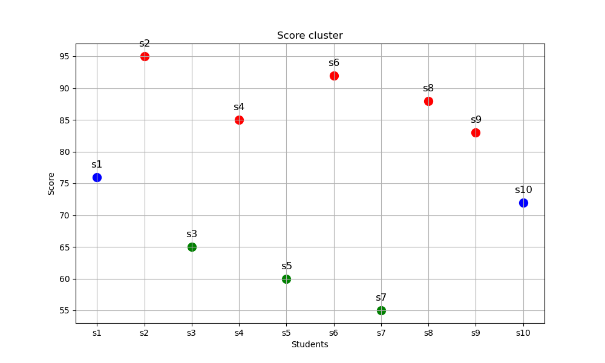

---

## 📌 핵심 정리

### 군집 결과 요약

|군집|색상|학생|평균 점수|
|---|---|---|---|
|Cluster 1|빨강|s2, s4, s6, s8, s9|88.60|
|Cluster 2|파랑|s1, s10|74.00|
|Cluster 3|초록|s3, s5, s7|60.00|

|함수|설명|
|---|---|
|`fcluster(linked, t=3, criterion='maxclust')`|군집 레이블 배열 반환|
|`plt.axhline(y=25)`|덴드로그램 절단선 추가|
|`scores.reshape(-1, 1)`|1D → 2D 열벡터 변환 (linkage 입력 형태)|
