# Day 52_군집분석 (계층적 / K-Means)
## 📅 2026-04-20

---
# 📄 unsuper3iris_hi.py — 계층적 군집분석 (Hierarchical Clustering)

## 📌 개념 정리

### 계층적 군집분석이란?

- 데이터를 **단계적으로 묶어** 군집을 형성하는 비지도학습 알고리즘
- **거리가 가까운 데이터부터** 계속 묶어가는 방식 (병합 방식 / Agglomerative)
- K-Means와 달리 **군집 수를 미리 정하지 않아도 됨**
- 결과 구조는 **덴드로그램(Dendrogram)** 으로 시각화

### K-Means와 비교

|항목|계층적 군집분석|K-Means|
|---|---|---|
|군집 수 사전 지정|❌ 불필요|✅ 필요|
|결과 시각화|덴드로그램|산점도|
|계산 비용|높음 (대용량 불리)|낮음|
|군집 번호|1부터 시작|0부터 시작|

---

## 🔗 linkage 연결 방법(method) 비교

|method|기준|특징|
|---|---|---|
|`ward`|분산 증가 최소화|가장 많이 사용, 안정적|
|`single`|두 군집 중 가장 가까운 점|사슬 모양 군집 형성|
|`complete`|두 군집 중 가장 먼 점|군집 크기 균일|
|`average`|평균 거리|single과 complete의 중간|

---

## 📦 사용 라이브러리

```python
from scipy.cluster.hierarchy import linkage, dendrogram, fcluster
# linkage   : 데이터 간 거리를 계산해 연결 행렬(Z) 생성
# dendrogram: 연결 행렬을 덴드로그램으로 시각화
# fcluster  : 덴드로그램을 잘라 군집 레이블 생성
```

---

## 💻 전체 실습 코드 (unsuper3iris_hi.py)

### 1단계 - 데이터 로드 및 DataFrame 생성

```python
import numpy as np
import pandas as pd
import matplotlib.pyplot as plt
import koreanize_matplotlib
import seaborn as sns
from sklearn.datasets import load_iris
from sklearn.preprocessing import StandardScaler
from scipy.cluster.hierarchy import linkage, dendrogram, fcluster

iris = load_iris()
x = iris.data
y = iris.target
labels = iris.target_names  # ['setosa', 'versicolor', 'virginica'] - 실제 종 이름

# 컬럼명은 iris.feature_names 사용 (4개 특성명과 개수 일치)
# iris.target_names는 3개라 컬럼명으로 쓰면 에러 발생
df = pd.DataFrame(x, columns=iris.feature_names)
print(df.head(3))
```

### 2단계 - 스케일링

```python
# 계층적 군집분석은 거리 기반 알고리즘
# → 스케일 차이가 크면 거리 계산이 왜곡되므로 StandardScaler 필수
scaler = StandardScaler()
x_scaled = scaler.fit_transform(x)
```

### 3단계 - 계층적 군집 생성 (linkage)

```python
# method='ward' : 군집 합칠 때 분산 증가량이 최소가 되는 쌍 선택
# → 일반적으로 가장 안정적인 결과
z = linkage(x_scaled, method='ward')
# z : 연결 행렬 (어떤 두 군집이 어떤 거리에서 합쳐졌는지 기록)
```

### 4단계 - 덴드로그램 시각화

```python
plt.figure(figsize=(12, 5))
dendrogram(z)
plt.title('아이리스로 계층적 군집')
plt.xlabel('샘플')
plt.ylabel('거리(유클리드)')
plt.show()
# 덴드로그램에서 y축 값이 급격히 커지는 지점을 보고 최적 군집 수 결정
```

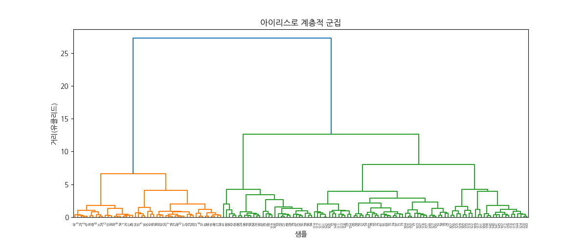

### 5단계 - 군집 레이블 생성 (fcluster)

```python
# criterion='maxclust' : 최대 t개의 군집으로 자르기
# criterion='distance' : 거리 기준으로 자르기
clusters = fcluster(Z=z, t=3, criterion='maxclust')
# ⚠️ K-Means와 달리 군집 번호가 1부터 시작 (0이 아님)

df['cluster'] = clusters
print(df.head(3))
print(df.tail(3))
```

### 6단계 - 산점도 시각화

```python
plt.figure(figsize=(6, 5))
# x_scaled[:, 0] : sepal length (첫 번째 특성)
# x_scaled[:, 1] : sepal width  (두 번째 특성)
# 4개 특성 중 2개만 선택해서 2D로 시각화 (차원 제한)
sns.scatterplot(x=x_scaled[:, 0], y=x_scaled[:, 1], hue=clusters, palette='Set1')
# hue=clusters : 군집 결과에 따라 색 구분
# palette='Set1' : 색상 스타일
plt.title('군집결과')
plt.xlabel('feature1')
plt.ylabel('feature2')
plt.show()
```

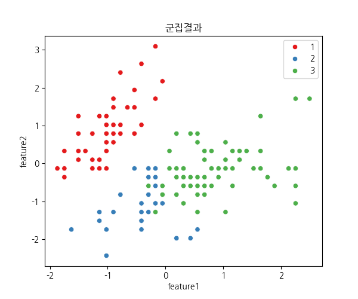

### 7단계 - 군집 결과 검증 (교차표)

```python
print('실제 라벨 : ', y[:10])        # [0 0 0 0 0 0 0 0 0 0]
print('군집 결과 : ', clusters[:10]) # [1 1 1 1 1 1 1 1 1 1] → 실제 0이 군집 1로 할당

print('\n군집 결과 검증 ---')
print('교차표 - 실제 라벨 vs 군집결과')
ct = pd.crosstab(y, clusters)
print(ct)
# col_0   1   2   3      ← 열 : 군집 번호 (KMeans 결과)
# row_0
# 0      49   1   0      ← setosa    : 군집1로 거의 완벽 분리
# 1       0  27  23      ← versicolor: 군집2/3에 섞임 (특성이 virginica와 겹침)
# 2       0   2  48      ← virginica : 군집3으로 잘 분리
# 행 : 실제 라벨 (0-setosa, 1-versicolor, 2-virginica)

# 각 실제 클래스가 가장 많이 속한 군집 출력
print('각 실제 클래스가 가장 많이 속한 군집')
for i in range(ct.shape[0]):
    max_cluster = ct.iloc[i].idxmax()   # 해당 행에서 최대값의 열 인덱스(군집번호) 반환
    print(f'실제 클래스 {i} -> 군집 {max_cluster} (갯수:{ct.iloc[i].max()})')
# 실제 클래스 0 -> 군집 1 (갯수:49)
# 실제 클래스 1 -> 군집 2 (갯수:27)
# 실제 클래스 2 -> 군집 3 (갯수:48)
```

### 8단계 - 정량 평가

```python
from sklearn.metrics import adjusted_mutual_info_score, normalized_mutual_info_score

# ARI (Adjusted Rand Index)
# 같은 그룹끼리 잘 묶였는지 평가 / 범위: -1 ~ 1
# 해석 기준: 0.7 이상(매우 좋음) / 0.5~0.7(좋음) / 0 이하(문제 있음)
ari = adjusted_mutual_info_score(y, clusters)
print(f'평가지표 : ARI - {ari:.4f}')   # 0.6713

# NMI (Normalized Mutual Information)
# 정보량 기준 유사도 - 군집 간 같은 정보를 얼마나 공유하는지
# 범위: 0 ~ 1 / 1: 완벽 일치, 0: 완전히 다름
nmi = normalized_mutual_info_score(y, clusters)
print(f'평가지표 : NMI - {nmi:.4f}')   # 0.6755
```

---

## 📊 결과 해석

### 교차표 분석

|실제 종|주요 군집|분리 품질|
|---|---|---|
|setosa (0)|군집 1 (49/50개)|✅ 거의 완벽|
|versicolor (1)|군집 2 (27개) + 군집 3 (23개)|⚠️ 혼재|
|virginica (2)|군집 3 (48/50개)|✅ 잘 분리|

> setosa는 다른 종과 특성이 뚜렷하게 달라 완벽에 가깝게 분리되고,  
> versicolor ↔ virginica는 꽃 특성이 겹쳐서 일부 혼재 — **알고리즘의 한계가 아닌 데이터의 특성**

### 평가 지표 요약

|지표|값|해석|
|---|---|---|
|ARI|0.6713|실제 라벨과 67% 수준으로 일치 → "잘된 군집" 범위|
|NMI|0.6755|실제 라벨과 정보를 68% 공유|

---

## 🔑 핵심 포인트

> 계층적 군집분석은 **정답 라벨 없이** 데이터 구조만으로 군집을 찾고,  
> 덴드로그램으로 몇 개로 나눌지 **사후에 결정**할 수 있다는 점이 K-Means와 가장 다른 점

---
# 📄 unsuper4km.py — K-Means 군집분석 (make_blobs)

## 📌 개념 정리

### K-Means(비계층적 군집분석)이란?

- 주어진 데이터를 **k개의 군집**으로 나누는 비지도학습 알고리즘
- 군집 수 k는 **사전에 지정** (알고 있다고 가정)
- 군집 번호는 **0부터 시작** (계층적 군집분석은 1부터)

### 알고리즘 동작 순서

1. K개의 중심점을 임의로 배치
2. 모든 데이터와 K개 중심점 간 거리 계산 → 가장 가까운 군집으로 할당
3. 군집의 새 중심점 계산 (평균)
4. 아래 정지 규칙에 이를 때까지 2~3단계 반복
    - 군집의 변화가 없을 때
    - 중심점 이동이 임계값 이하일 때
    - 왜곡값(distortion)이 줄다가 다시 늘어나는 지점

### init 방식 비교

|방식|설명|특징|
|---|---|---|
|`random`|중심점을 임의로 선택|결과가 불안정할 수 있음|
|`k-means++`|중심점을 최대한 멀리 배치|수렴 빠르고 결과 안정적 (권장)|

---

## 📊 최적 k 결정 방법

### 1) Elbow 기법

- k를 1~10까지 늘려가며 **SSE(오차 제곱합)** 를 계산
- SSE가 급격히 꺾이는 지점(elbow) = 최적 k
- `km.inertia_` : 각 샘플과 자신의 군집 중심 간 거리 제곱합

### 2) Silhouette 기법

- 군집 품질을 **-1 ~ 1** 사이 점수로 정량화
- 1에 가까울수록 → 자기 군집과 가깝고, 다른 군집과 멀다 (좋음)
- 0에 가까울수록 → 군집 경계에 위치
- 음수 → 잘못된 군집에 할당됨
- 계층적 군집분석 포함 **모든 군집 알고리즘에 적용 가능**

---

## 💻 전체 실습 코드

### 1단계 - 데이터 생성 및 산점도

```python
from sklearn.datasets import make_blobs
from sklearn.cluster import KMeans
import matplotlib.pyplot as plt
import koreanize_matplotlib

# make_blobs : 군집 분석용 가상 데이터 생성
# n_samples=150 : 샘플 수
# n_features=2  : 특성(축) 수 → 2D 시각화 가능
# centers=3     : 군집 중심 수
# cluster_std=0.5 : 군집 내 퍼짐 정도 (작을수록 촘촘)
x, _ = make_blobs(n_samples=150, n_features=2, centers=3, cluster_std=0.5, shuffle=True, random_state=0)

# 군집화 전 원본 데이터 산점도 (색 구분 없음)
plt.scatter(x[:, 0], x[:, 1], c='gray', marker='o', s=50)
plt.grid(True)
plt.show()
```

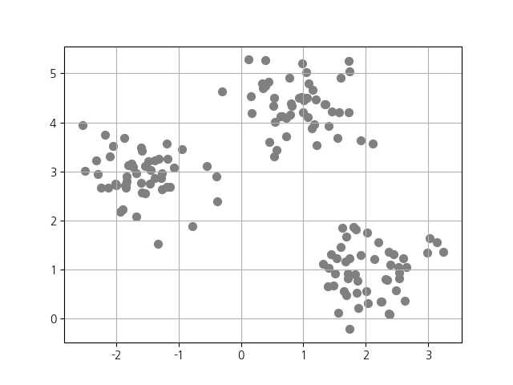

### 2단계 - KMeans 모델 학습

```python
# k-means++ : 중심점을 최대한 멀리 배치해 수렴 속도와 안정성을 높임
init_centroid = 'k-means++'

# n_init 미지정 시 sklearn 기본값 사용 (버전에 따라 10 or 'auto')
# n_init=10 : KMeans를 10회 실행 후 오차(inertia)가 가장 작은 결과 선택
kmodel = KMeans(n_clusters=3, init=init_centroid, random_state=0)
pred = kmodel.fit_predict(x)    # 학습과 동시에 군집 레이블 반환
# pred : [1 2 2 2 1 2 ...] → 각 샘플이 속한 군집 번호 (0, 1, 2)

print('중심점 : ', kmodel.cluster_centers_)
# [[-1.5947298   2.92236966]   ← 군집 0의 중심
#  [ 2.06521743  0.96137409]   ← 군집 1의 중심
#  [ 0.9329651   4.35420712]]  ← 군집 2의 중심
```

### 3단계 - 군집 결과 시각화

```python
# 군집별로 색과 마커를 다르게 해서 산점도 출력
plt.scatter(x[pred == 0, 0], x[pred == 0, 1], c='red',   marker='o', s=50, label='cluster1')
plt.scatter(x[pred == 1, 0], x[pred == 1, 1], c='green', marker='s', s=50, label='cluster2')
plt.scatter(x[pred == 2, 0], x[pred == 2, 1], c='blue',  marker='v', s=50, label='cluster3')

# 중심점 표시 (검정 +)
plt.scatter(kmodel.cluster_centers_[:, 0], kmodel.cluster_centers_[:, 1],
            c='black', marker='+', s=60, label='center')
plt.legend()
plt.grid(True)
plt.show()
```

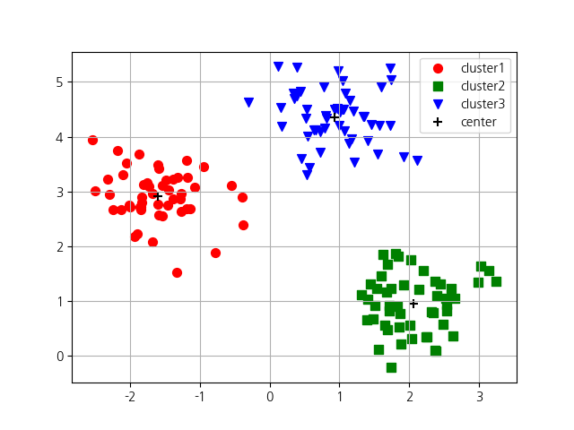

### 4단계 - Elbow 기법으로 최적 k 탐색

```python
def elbow(x):
    sse = []
    for i in range(1, 11):
        km = KMeans(n_clusters=i, init=init_centroid, random_state=0)
        km.fit(x)
        sse.append(km.inertia_)   # inertia_ : SSE (거리 제곱합)
    plt.plot(range(1, 11), sse, marker='o')
    plt.xlabel('군집수')
    plt.ylabel('SSE')
    plt.show()

elbow(x)
# k=3 지점에서 SSE 감소폭이 급격히 줄어드는 elbow 확인
# → 이 데이터의 최적 k = 3
```

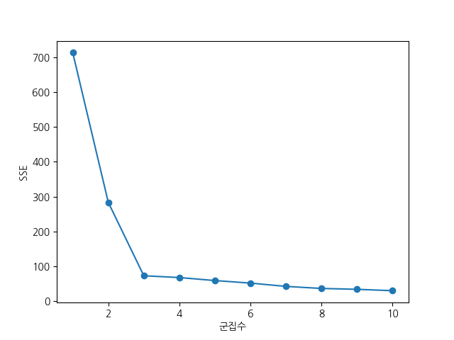

### 5단계 - Silhouette 기법으로 군집 품질 평가

```python
import numpy as np
from sklearn.metrics import silhouette_samples

def plotSilhouette(x, pred):
    cluster_labels = np.unique(pred)          # 고유 군집 레이블 배열
    n_clusters = cluster_labels.shape[0]      # 군집 수
    sil_val = silhouette_samples(x, pred, metric='euclidean')  # 샘플별 실루엣 계수 계산

    y_ax_lower, y_ax_upper = 0, 0
    yticks = []

    for i, c in enumerate(cluster_labels):
        c_sil_value = sil_val[pred == c]      # 해당 군집의 실루엣 값만 추출
        c_sil_value.sort()                    # 오름차순 정렬 (시각화용)
        y_ax_upper += len(c_sil_value)

        # 군집별 수평 막대 그래프
        plt.barh(range(y_ax_lower, y_ax_upper), c_sil_value, height=1.0, edgecolor='none')
        yticks.append((y_ax_lower + y_ax_upper) / 2)
        y_ax_lower += len(c_sil_value)

    sil_avg = np.mean(sil_val)
    plt.axvline(sil_avg, color='red', linestyle='--')  # 평균 실루엣 계수 빨간 점선
    plt.yticks(yticks, cluster_labels + 1)
    plt.ylabel('클러스터')
    plt.xlabel('실루엣 계수')   # ※ 원본 코드에서 '개수'는 '계수'가 정확한 표현
    plt.show()

X, y = make_blobs(n_samples=150, n_features=2, centers=3, cluster_std=0.5, shuffle=True, random_state=0)
km = KMeans(n_clusters=3, random_state=0)
y_km = km.fit_predict(X)

plotSilhouette(X, y_km)
```

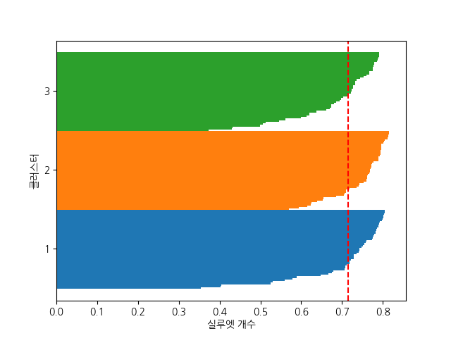

---

## 📊 결과 해석

### Elbow 그래프

k=3에서 SSE 감소폭이 급격히 꺾임 → **최적 k = 3** 확인  
(데이터를 `centers=3`으로 생성했으므로 예상대로)

### Silhouette 그래프

- 3개 군집 모두 실루엣 계수가 **0 미만인 값이 없음** → 잘못 할당된 샘플 없음
- 평균 실루엣 계수(빨간 점선)가 **0.7 이상** → 매우 잘 분류된 결과

---

## 🔑 핵심 포인트

> Elbow는 **k를 모를 때 후보를 좁히는** 용도,  
> Silhouette은 **특정 k의 군집 품질을 정량 검증**하는 용도  
> 두 기법을 함께 쓰면 최적 k를 더 신뢰할 수 있다

---
# 📄 unsuper5km.py — K-Means 군집분석 (학생 점수 데이터)

## 📌 실습 포인트

계층적/K-Means 실습에서 쓰던 `make_blobs` 대신  
**실제 수치 데이터(1D)** 에 K-Means를 적용하는 실습  
→ `reshape(-1, 1)` 로 1D 배열을 2D로 변환해야 sklearn이 받아들임

---

## 💻 전체 실습 코드

### 1단계 - 데이터 준비

```python
import numpy as np
import pandas as pd
import matplotlib.pyplot as plt
import koreanize_matplotlib
from sklearn.cluster import KMeans

students = ['s1','s2','s3','s4','s5','s6','s7','s8','s9','s10']
scores = np.array([76,95,65,85,60,92,55,88,83,72]).reshape(-1, 1)
# reshape(-1, 1) : 1D 배열 → 2D 열벡터로 변환
# sklearn의 KMeans는 2D 입력(shape: [n_samples, n_features])만 허용
# (150,) → (150, 1)
print('점수 : ', scores)
```

### 2단계 - KMeans 군집화 및 DataFrame 생성

```python
kmeans = KMeans(n_clusters=3, init='k-means++', random_state=0)
km_clusters = kmeans.fit_predict(scores)
print(km_clusters)  # [2 0 1 2 1 0 1 0 2 2]

df = pd.DataFrame({
    'student': students,
    'score': scores.ravel(),   # ravel() : 2D → 1D로 평탄화
    'cluster': km_clusters
})
print(df)
```

### 3단계 - 군집별 평균 점수

```python
print('\n군집별 평균 점수')
grouped = df.groupby('cluster')['score'].mean()
print(grouped)
# cluster
# 0    91.666667   ← 고득점 그룹 (s2, s6, s8)
# 1    60.000000   ← 저득점 그룹 (s3, s5, s7)
# 2    79.000000   ← 중간 그룹  (s1, s4, s9, s10)
```

### 4단계 - 시각화

```python
x_position = np.arange(len(students))   # [0, 1, 2, ..., 9] → x축 위치
y_scores = scores.ravel()
colors = {0:'red', 1:'blue', 2:'green'}
plt.figure(figsize=(10, 6))

# 학생별로 군집 색 구분하여 산점도 + 이름 표시
for i, (x, y, clusters) in enumerate(zip(x_position, y_scores, km_clusters)):
    plt.scatter(x, y, color=colors[clusters])
    plt.text(x, y + 1.5, students[i], fontsize=10, ha='center')
    # y + 1.5 : 점 위에 이름 표시 (오프셋)

# 중심점 표시 (x축 중앙 고정, y는 실제 중심값)
# ※ len(students)//2 = 5 → s6 위치에 고정 표시되는 한계 있음
centers = kmeans.cluster_centers_
for center in centers:
    plt.scatter(len(students)//2, center[0], marker='X', c='black', s=200)

plt.xticks(x_position, students)
plt.xlabel('학생명')
plt.ylabel('점수')
plt.grid(True)
plt.show()
```

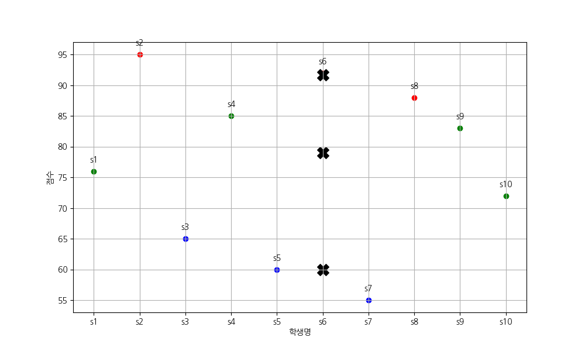

---

## 📊 결과 해석

|군집|색|학생|점수 범위|평균|
|---|---|---|---|---|
|0|🔴 빨강|s2, s6, s8|88~95|91.7|
|1|🔵 파랑|s3, s5, s7|55~65|60.0|
|2|🟢 초록|s1, s4, s9, s10|72~85|79.0|

---

## 🔑 핵심 포인트

> 1D 데이터도 `reshape(-1, 1)` 로 변환하면 K-Means 적용 가능  
> 군집 번호(0, 1, 2)와 실제 의미(고/중/저 득점)는 별개 — 결과 보고 직접 해석해야 함

---
# 📄 unsuper6km.py — K-Means 군집분석 (쇼핑몰 고객 세분화)

## 📌 실습 포인트

`np.random.normal()`로 **가상의 고객 데이터**를 생성하고  
K-Means로 고객을 세분화(Customer Segmentation)하는 실전형 실습  
→ 실무에서 마케팅 타겟 분류, 고객 등급 구분 등에 활용

---

## 💻 전체 실습 코드

### 1단계 - 가상 고객 데이터 생성

```python
import numpy as np
import pandas as pd
import matplotlib.pyplot as plt
import koreanize_matplotlib
from sklearn.cluster import KMeans

np.random.seed(0)
n_customers = 200

# np.random.normal(mean, std, size) : 정규분포 난수 생성
annual_spending = np.random.normal(50000, 15000, n_customers)  # 평균 5만, 표준편차 1.5만
monthly_visits  = np.random.normal(5, 2, n_customers)          # 평균 5회, 표준편차 2

# np.clip(a, min, max) : 범위 밖 값을 경계값으로 치환
# None : 해당 방향 제한 없음
# 음수 방문 횟수/지출액은 존재할 수 없으므로 0으로 클리핑
annual_spending = np.clip(annual_spending, 0, None)
monthly_visits  = np.clip(monthly_visits, 0, None)

# ⚠️ 컬럼명에 공백 포함 시 접근할 때도 동일하게 공백 유지해야 함
# 권장: 언더스코어 사용 ('annual_spending') 으로 통일하면 오타 방지에 유리
data = pd.DataFrame({
    'annual spending': annual_spending,
    'monthly visits' : monthly_visits
})
print(data.head(), data.shape)
#    annual spending  monthly visits
# 0     76460.785190        4.261636  ...  (200, 2)
```

### 2단계 - 원본 산포도 (군집화 전)

```python
plt.scatter(data['annual spending'], data['monthly visits'])
plt.xlabel('연간 지출액')
plt.ylabel('달별 방문수')
plt.title('소비자 분포')
plt.show()
```

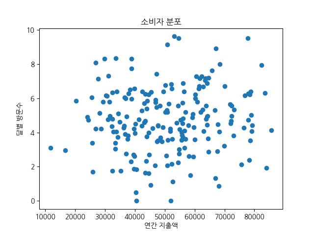

### 3단계 - KMeans 군집화

```python
kmeans = KMeans(n_clusters=3, random_state=0)
clusters = kmeans.fit_predict(data)   # 학습 + 군집 레이블 동시 반환

data['cluster'] = clusters
```

### 4단계 - 군집 결과 시각화

```python
# np.unique(clusters) : 고유 군집 번호 배열 → [0, 1, 2]
for cluster_id in np.unique(clusters):
    clusters_data = data[data['cluster'] == cluster_id]   # 해당 군집 행만 필터링
    plt.scatter(clusters_data['annual spending'],
                clusters_data['monthly visits'],
                label=f'군집{cluster_id}')

# 중심점 표시
plt.scatter(kmeans.cluster_centers_[:, 0], kmeans.cluster_centers_[:, 1],
            c='black', marker='X', s=200, label='중심점')
plt.xlabel('연간 지출액')
plt.ylabel('달별 방문수')
plt.title('소비자 군집 현황')
plt.legend()
plt.show()
```

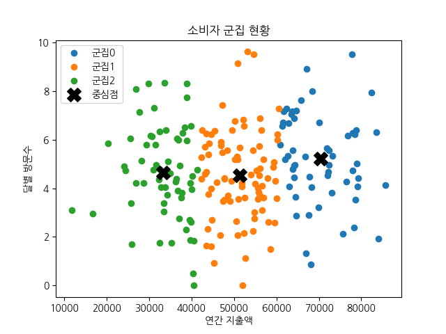

---

## 📊 결과 해석

|군집|색|특징|마케팅 해석|
|---|---|---|---|
|군집 0|🔵 파랑|고지출 + 중간 방문|VIP 고객|
|군집 1|🟠 주황|중간 지출 + 중간 방문|일반 고객|
|군집 2|🟢 초록|저지출 + 다양한 방문|탐색형 고객|

> 군집 번호(0, 1, 2)와 의미는 자동 부여되지 않음 — 중심점 좌표와 분포를 보고 직접 해석

---

## 🔑 핵심 포인트

> `np.random.normal()` + `np.clip()` 조합으로 현실적인 가상 데이터 생성 가능  
> 실무에서 고객 세분화는 K-Means의 대표적인 활용 사례  
> 컬럼명은 공백보다 언더스코어(`_`)로 통일하면 오타 방지에 유리

---
# 📄 unsuper7iris_km.py — K-Means 군집분석 + 정량평가 + ANOVA (iris dataset)

## 📌 개념 정리

### 전체 분석 흐름

```
iris 데이터 로드
    ↓
StandardScaler 스케일링
    ↓
PCA (4차원 → 2차원) → 시각화용
    ↓
KMeans 군집화 (k=3)
    ↓
정량 평가 (ARI / NMI / Silhouette)
    ↓
Elbow 기법으로 k=3 검증
    ↓
실제 라벨 vs 군집 결과 비교 시각화
    ↓
ANOVA (군집 간 평균 차이 검정)
    ↓
Tukey HSD 사후 검정
    ↓
군집별 Boxplot
```

### PCA를 쓰는 이유

- iris 데이터는 특성이 4개 → 2D 차트에 직접 표현 불가
- PCA로 4차원 → 2차원 압축 후 시각화
- PC1(72.9%) + PC2(22.9%) = **95.8% 분산 설명** → 신뢰할 만한 시각화

### ANOVA (분산분석)

- 3개 이상 그룹 간 **평균 차이가 통계적으로 유의한지** 검정
- 귀무가설: 군집 간 평균에 차이가 없다
- 연구가설: 군집 간 평균에 차이가 있다
- p-value < 0.05 → 귀무가설 기각 → 군집 간 평균 차이 유의

### Tukey HSD 사후 검정

- ANOVA는 "어딘가 차이가 있다"만 알려줌
- Tukey HSD는 **어떤 군집 쌍이 다른지** 구체적으로 알려줌
- `reject=True` → 두 군집 간 평균 차이가 유의함

---

## 💻 전체 실습 코드

### 0단계 - 경고 억제 (맨 첫 줄 필수)

```python
import os
os.environ['OMP_NUM_THREADS'] = '1'
# Windows + MKL 환경에서 KMeans 메모리 경고 억제
# sklearn import 전에 설정해야 적용됨
```

### 1단계 - 데이터 로드 및 스케일링

```python
import numpy as np
import pandas as pd
import matplotlib.pyplot as plt
import koreanize_matplotlib
import seaborn as sns
from sklearn.datasets import load_iris
from sklearn.preprocessing import StandardScaler
from sklearn.cluster import KMeans
from sklearn.metrics import adjusted_rand_score, normalized_mutual_info_score, silhouette_score
# adjusted_rand_score      : 군집 vs 실제 라벨 비교
# normalized_mutual_info_score : 정보량 기반 유사도 (같은 정보 공유)
# silhouette_score         : 군집 자체 품질 평가 (군집에 잘 속해 있는가)
from sklearn.decomposition import PCA   # 4차원 → 2차원 압축

iris = load_iris()
x = iris.data
y = iris.target
features_names = iris.feature_names

df = pd.DataFrame(x, columns=features_names)
print('iris data shape : ', x.shape)    # (150, 4)

# 거리 기반 알고리즘 → 스케일 통일 필수
scaler = StandardScaler()
x_scaled = scaler.fit_transform(x)
```

### 2단계 - PCA (시각화용)

```python
pca = PCA(n_components=2)
x_pca = pca.fit_transform(x_scaled)
print('pca 설명 분산 비율 : ', pca.explained_variance_ratio_)
# [0.72962445 0.22850762] → PC1+PC2 = 95.8% 설명
```

### 3단계 - KMeans 모델 학습

```python
k = 3
kmeans = KMeans(
    n_clusters=k,
    init='k-means++',   # 중심점 최대한 멀리 배치 → 수렴 안정
    n_init=10,          # 10회 실행 후 inertia 최소 결과 선택
    random_state=42
)

clusters = kmeans.fit_predict(x_scaled)
df['cluster'] = clusters
print('클러스터 중심 값 : ', kmeans.cluster_centers_)
# [[-0.05021989 -0.88337647  0.34773781  0.2815273 ]   ← 군집 0 (중간)
#  [-1.01457897  0.85326268 -1.30498732 -1.25489349]   ← 군집 1 (소형, setosa)
#  [ 1.13597027  0.08842168  0.99615451  1.01752612]]  ← 군집 2 (대형, virginica)
```

### 4단계 - PCA 기반 군집 시각화

```python
# KMeans는 x_scaled(4D)로 학습, 시각화만 x_pca(2D)로 수행
plt.figure(figsize=(6, 5))
sns.scatterplot(x=x_pca[:, 0], y=x_pca[:, 1], hue=clusters, palette='Set1')
plt.title('KMeans Clustering')
plt.xlabel('PC1(제1주성분)')
plt.ylabel('PC2(제2주성분)')
plt.show()
```

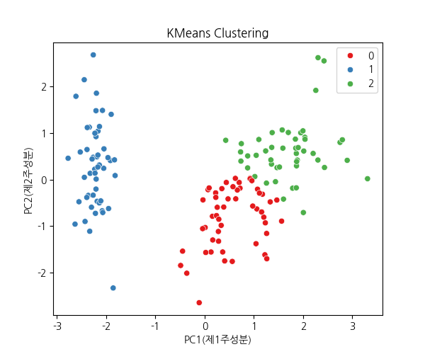

### 5단계 - 교차표 및 클래스별 대표 군집

```python
ct = pd.crosstab(y, clusters)
print(ct)
# col_0   0   1   2     ← 열: 군집번호 (KMeans 결과)
# row_0
# 0       0  50   0     ← setosa    : 군집1로 완벽 분리
# 1      39   0  11     ← versicolor: 군집0/2에 혼재
# 2      14   0  36     ← virginica : 군집2 위주, 일부 군집0
# 행: 실제 라벨 (0-setosa, 1-versicolor, 2-virginica)

# 각 클래스가 가장 많이 속한 군집 출력
for i in range(ct.shape[0]):
    max_cluster = ct.iloc[i].idxmax()   # 행에서 최대값의 열 인덱스 반환
    print(f'실제 클래스 {i} -> 군집 {max_cluster}')
# 실제 클래스 0 -> 군집 1
# 실제 클래스 1 -> 군집 0
# 실제 클래스 2 -> 군집 2
```

### 6단계 - 정량 평가

```python
ari = adjusted_rand_score(y, clusters)
nmi = normalized_mutual_info_score(y, clusters)
sil_score = silhouette_score(x_scaled, clusters)
print(f'ARI : {ari:.4f}')               # 0.6201
print(f'NMI : {nmi:.4f}')               # 0.6595
print(f'Silhouette_Score : {sil_score:.4f}')  # 0.4599
# Silhouette : 1에 근사할수록 좋음. 0 또는 음수면 잘못된 군집
# 좋은 군집 = 군집 내 요소끼리는 가깝고, 군집 간에는 거리가 멀다
```

### 7단계 - Elbow 기법으로 k=3 검증

```python
initia_list = []
k_range = range(1, 10)
for k in k_range:
    km = KMeans(n_clusters=k, random_state=42, n_init=10)
    km.fit(x_scaled)
    initia_list.append(km.inertia_)   # inertia_ : SSE (거리 제곱합)

plt.figure(figsize=(6, 4))
plt.plot(k_range, initia_list, marker='o')
plt.title('엘보우 기법')
plt.xlabel('클러스터 수(k)')
plt.ylabel('initia')
plt.show()  # k=3 지점에서 꺾임 확인 → k=3이 합리적
```

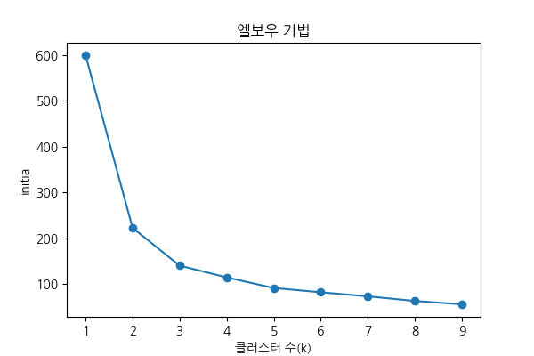

### 8단계 - 실제 라벨 vs 군집 결과 비교 시각화

```python
plt.figure(figsize=(12, 5))

plt.subplot(1, 2, 1)
sns.scatterplot(x=x_pca[:, 0], y=x_pca[:, 1], hue=y, palette='Set1')
plt.title('실제 라벨')

plt.subplot(1, 2, 2)
# clusters + 1 : 군집 번호를 1,2,3으로 맞춰 실제 라벨(0,1,2)과 범례 구분
sns.scatterplot(x=x_pca[:, 0], y=x_pca[:, 1], hue=clusters + 1, palette='Set1')
plt.title('군집 결과')
plt.show()
```

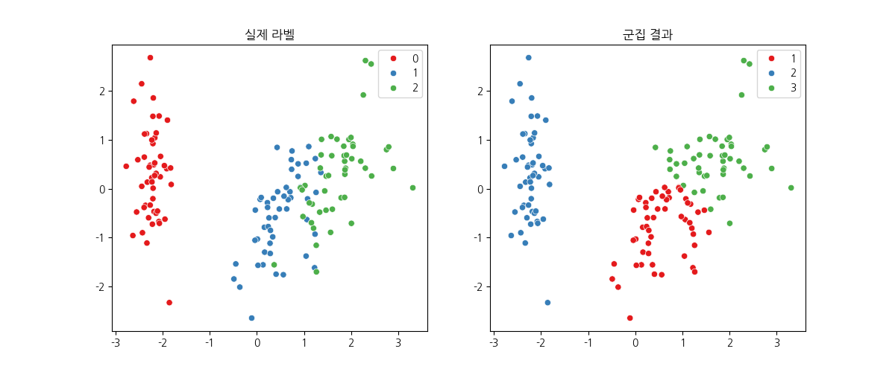

### 9단계 - 클러스터별 평균 분석

```python
cluster_mean = df.groupby('cluster').mean()
print('클러스터별 평균 : ', cluster_mean)
# cluster  sepal length  sepal width  petal length  petal width
# 0        5.80          2.67         4.37          1.41   ← 중간형
# 1        5.01          3.43         1.46          0.25   ← 소형 (setosa)
# 2        6.78          3.10         5.51          1.97   ← 대형 (virginica)
```

### 10단계 - ANOVA (군집 간 평균 차이 검정)

```python
from scipy.stats import f_oneway
# 귀무가설: 군집 간 평균에 차이가 없다
# 연구가설: 군집 간 평균에 차이가 있다

for col in features_names:
    group0 = df[df['cluster'] == 0][col]
    group1 = df[df['cluster'] == 1][col]
    group2 = df[df['cluster'] == 2][col]

    f_stat, p_val = f_oneway(group0, group1, group2)
    print(f'{col} : f-statistic:{f_stat:.4f}, p-value:{p_val:.4f}')

    if p_val >= 0.05:
        print('→ 군집간 평균에 차이가 없다 (유의하지 않다)')
    else:
        print('→ 군집간 평균에 차이가 있다 (유의하다. 우연이 아니다)')

# sepal length : f=218.57, p=0.0000 → 유의
# sepal width  : f=79.90,  p=0.0000 → 유의
# petal length : f=860.64, p=0.0000 → 유의
# petal width  : f=525.70, p=0.0000 → 유의
# → KMeans가 꽃받침/꽃잎 길이·너비를 제대로 군집분석했음을 확인
```

### 11단계 - Tukey HSD 사후 검정

```python
from statsmodels.stats.multicomp import pairwise_tukeyhsd

feature = 'petal length (cm)'
tukey = pairwise_tukeyhsd(
    endog=df[feature],      # 검정할 수치 데이터
    groups=df['cluster'],   # 그룹 구분
    alpha=0.05              # 유의수준
)
print(tukey)
# group1 group2 meandiff  p-adj  lower   upper  reject
#      0      1  -2.9078   0.0  -3.1405 -2.6751  True  ← 군집0 vs 군집1 유의
#      0      2   1.1408   0.0   0.9043  1.3773  True  ← 군집0 vs 군집2 유의
#      1      2   4.0486   0.0   3.8088  4.2884  True  ← 군집1 vs 군집2 유의
# reject=True : 두 군집 간 평균 차이가 통계적으로 유의함

# 사후 검정 시각화
tukey.plot_simultaneous(figsize=(6, 4))
plt.title(f'tukeyhsd - {feature}')
plt.xlabel('평균 차이')
plt.show()
```

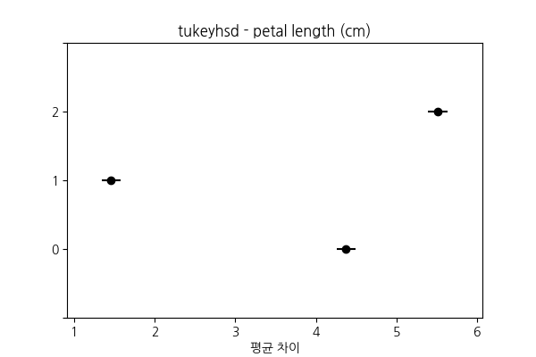

### 12단계 - 군집별 Boxplot

```python
# ⚠️ plt.boxplot()은 x=, y=, data= 방식 미지원 → sns.boxplot() 사용
for col in features_names:
    plt.figure(figsize=(5, 3))
    sns.boxplot(x='cluster', y=col, data=df)
    plt.title(f'{col} by cluster')
    plt.show()
```

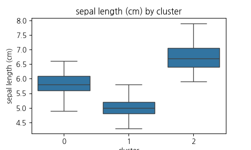 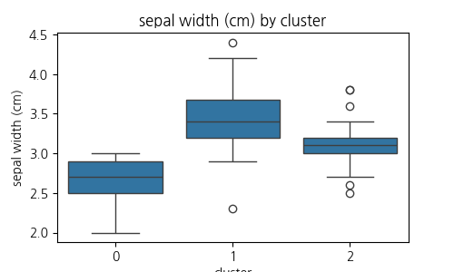 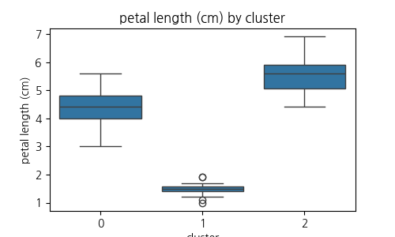 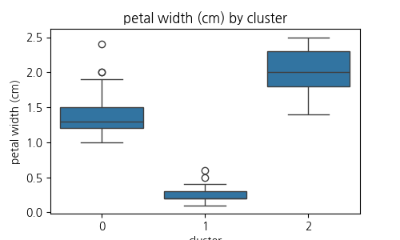

### 13단계 - 클러스터 평균에 라벨 추가

```python
cluster_mean['label'] = ['Type A', 'Type B', 'Type C']
print(cluster_mean)
#          sepal length  sepal width  petal length  petal width  label
# cluster
# 0        5.80          2.67         4.37          1.41         Type A
# 1        5.01          3.43         1.46          0.25         Type B
# 2        6.78          3.10         5.51          1.97         Type C
```

---

## 📊 결과 해석

### 정량 평가 요약

|지표|값|해석|
|---|---|---|
|ARI|0.6201|실제 라벨과 62% 수준 일치|
|NMI|0.6595|실제 라벨과 정보 66% 공유|
|Silhouette|0.4599|군집 품질 중간 수준|

### ANOVA 결과

4개 특성 모두 p-value = 0.0000 → **모든 특성에서 군집 간 평균 차이 유의**  
→ KMeans가 의미 있는 군집을 형성했음을 통계적으로 검증

### Tukey HSD 결과 (petal length 기준)

3개 군집 쌍 모두 `reject=True` → **어떤 두 군집을 비교해도 평균 차이가 유의**

---

## 🔑 핵심 포인트

> ANOVA는 "차이가 있다/없다"만,  
> Tukey HSD는 "**어떤 군집 쌍이** 다른지"까지 알려준다  
> 두 검정을 함께 쓰면 군집의 통계적 유효성을 완전히 검증할 수 있다

---
# 📄 unsuper8knn_comp.py — 지도학습(KNN) vs 비지도학습(KMeans) 비교

## 📌 개념 정리

### 지도학습 vs 비지도학습 핵심 차이

|구분|지도학습 (KNN)|비지도학습 (KMeans)|
|---|---|---|
|학습 데이터|X (특성) + y (정답 라벨)|X (특성) 만 사용|
|목표|정해진 클래스로 **분류**|스스로 **군집** 발견|
|성능 평가|정확도(Accuracy) 직접 계산|군집 번호를 실제 라벨로 **매핑 후** 비교|
|새 데이터 예측|클래스 번호 반환|군집 번호 반환|

### KNN (K-최근접 이웃)

- 새로운 데이터와 **가장 가까운 k개의 이웃**을 찾아 다수결로 분류
- `weights='distance'` : 가까운 이웃일수록 더 큰 가중치 부여
- `metric='euclidean'` : 유클리드 거리로 이웃 탐색

### KMeans 군집 결과를 실제 라벨로 매핑하는 이유

- KMeans는 군집 번호(0, 1, 2)를 **임의로** 부여
- 실제 라벨(0=setosa, 1=versicolor, 2=virginica)과 **번호가 다를 수 있음**
- 성능 비교를 위해 군집 번호 → 실제 라벨로 변환 필요
- 중간값(3, 4, 5)을 거치는 이유: 동시에 치환하면 값이 덮어써지는 충돌 방지

---

## 💻 전체 실습 코드

### 1단계 - 데이터 로드 및 분할

```python
import numpy as np
from sklearn.datasets import load_iris
from sklearn.model_selection import train_test_split

iris_data = load_iris()

# 지도학습용 : 학습/테스트 분리 (KNN에서 사용)
# KMeans는 라벨 없이 train_x만 사용하지만, 성능 비교를 위해 동일 분할 사용
train_x, test_x, train_y, test_y = train_test_split(
    iris_data['data'], iris_data['target'],
    test_size=0.25, random_state=42
)
print(train_x.shape, test_x.shape, train_y.shape, test_y.shape)
# (112, 4) (38, 4) (112,) (38,)
```

---

### 2단계 - 지도학습 : KNN

```python
print('지도학습 - K최근접 이웃 알고리즘')
from sklearn.neighbors import KNeighborsClassifier
from sklearn.metrics import accuracy_score

knnModel = KNeighborsClassifier(
    n_neighbors=3,          # 가장 가까운 3개 이웃 참조
    weights='distance',     # 거리에 반비례한 가중치 (가까울수록 영향력 큼)
    metric='euclidean'      # 유클리드 거리 사용
)
knnModel.fit(train_x, train_y)   # 정답 라벨(train_y) 포함해서 학습

# 예측 및 정확도
pred_label = knnModel.predict(test_x)
print('예측값 : ', pred_label[:10])   # [1 0 2 1 1 0 1 2 1 1]
print('실제값 : ', test_y[:10])       # [1 0 2 1 1 0 1 2 1 1]
print('분류 정확도 : ', accuracy_score(test_y, pred_label))   # 1.0
```

### 3단계 - KNN : 새로운 값 분류 + 이웃 거리 확인

```python
new_input = np.array([[6.1, 2.8, 4.7, 1.2]])
print(f'KNN : 새로운 값은 {knnModel.predict(new_input)}로 분류됨')
# KNN : 새로운 값은 [1]로 분류됨 → versicolor

# kneighbors() : 새로운 데이터와 k개 이웃 간의 거리 및 인덱스 반환
dist, index = knnModel.kneighbors(new_input)
print(dist, index)
# [[0.2236068  0.3        0.43588989]] [[71 82 31]]
# → 훈련 데이터의 71, 82, 31번이 분류에 참여
# → 해당 이웃들과의 거리: 0.223, 0.300, 0.436
```

---

### 4단계 - 비지도학습 : KMeans

```python
print('\n비지도학습 - K평균 군집 알고리즘')
from sklearn.cluster import KMeans

kmeansModel = KMeans(n_clusters=3, init='k-means++', random_state=0)
kmeansModel.fit(train_x)    # ← 정답 라벨(train_y) 없이 학습 — 비지도학습 핵심

print(kmeansModel.labels_)  # 훈련 데이터 각 샘플의 군집 번호
```

### 5단계 - 군집 번호와 실제 라벨 대응 확인

```python
# 군집 번호는 임의 부여 → 실제 iris 종과 어떻게 대응되는지 확인
print('0 cluster : ', train_y[kmeansModel.labels_ == 0])  # → 라벨 2(virginica) 위주
print('1 cluster : ', train_y[kmeansModel.labels_ == 1])  # → 라벨 0(setosa) 전부
print('2 cluster : ', train_y[kmeansModel.labels_ == 2])  # → 라벨 1(versicolor) 위주

# 0 cluster :  [2 2 2 2 2 2 2 1 2 2 ...]  ← 군집0 = 실제 라벨2 (virginica)
# 1 cluster :  [0 0 0 0 0 0 0 0 0 0 ...]  ← 군집1 = 실제 라벨0 (setosa)
# 2 cluster :  [2 1 1 1 2 1 1 1 1 1 ...]  ← 군집2 = 실제 라벨1 (versicolor)

# 대응 관계 정리:
# 군집 0 → 실제 라벨 2 (virginica)
# 군집 1 → 실제 라벨 0 (setosa)
# 군집 2 → 실제 라벨 1 (versicolor)
```

### 6단계 - KMeans : 새로운 값 군집 분류

```python
new_input = np.array([[6.1, 2.8, 4.7, 1.2]])
clu_pred = kmeansModel.predict(new_input)
print(f'KMeans : 새로운 값은 군집 {clu_pred}로 분류됨')
# KMeans : 새로운 값은 군집 [2]로 분류됨
# → 군집2 = 실제 라벨1(versicolor) → KNN 결과([1])와 동일
```

### 7단계 - 군집 번호를 실제 라벨로 변환 후 정확도 계산

```python
pred_cluster = kmeansModel.predict(test_x)
print('예측값(군집번호) : ', pred_cluster)

np_arr = np.array(pred_cluster)

# 군집 번호 → 실제 라벨 변환
# 직접 치환하면 값 충돌 발생 (예: 0→2 후 2→1 하면 원래 군집2도 1로 바뀜)
# 중간값(3,4,5)으로 임시 저장 후 최종 변환으로 충돌 방지
np_arr[np_arr == 0] = 3   # 군집0 → 임시값 3
np_arr[np_arr == 1] = 4   # 군집1 → 임시값 4
np_arr[np_arr == 2] = 5   # 군집2 → 임시값 5

np_arr[np_arr == 3] = 2   # 임시3 → 실제 라벨 2 (virginica)
np_arr[np_arr == 4] = 0   # 임시4 → 실제 라벨 0 (setosa)
np_arr[np_arr == 5] = 1   # 임시5 → 실제 라벨 1 (versicolor)

predict_label = np_arr.tolist()
print(f'군집 test acc : {np.mean(predict_label == test_y)}')
# 군집 test acc : 0.9473684210526315  → 약 94.7%
```

---

## 📊 결과 비교

|모델|방식|테스트 정확도|
|---|---|---|
|KNN (지도학습)|정답 라벨로 학습|**100%**|
|KMeans (비지도학습)|라벨 없이 군집화|**94.7%**|

> 정답 라벨 없이 94.7% 정확도는 상당히 높은 수준  
> versicolor ↔ virginica 경계가 겹치는 5.3%만 오분류

---

## 🔑 핵심 포인트

> KMeans는 정답 없이도 KNN에 근접한 성능을 보여줬다  
> 군집 번호는 의미 없는 임의값 → **실제 라벨과 매핑 과정이 반드시 필요**  
> 중간값(3,4,5) 치환 패턴은 **동시 치환 충돌 방지**를 위한 실전 기법