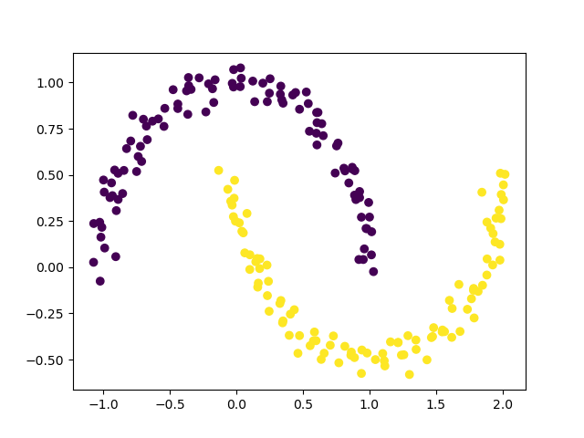
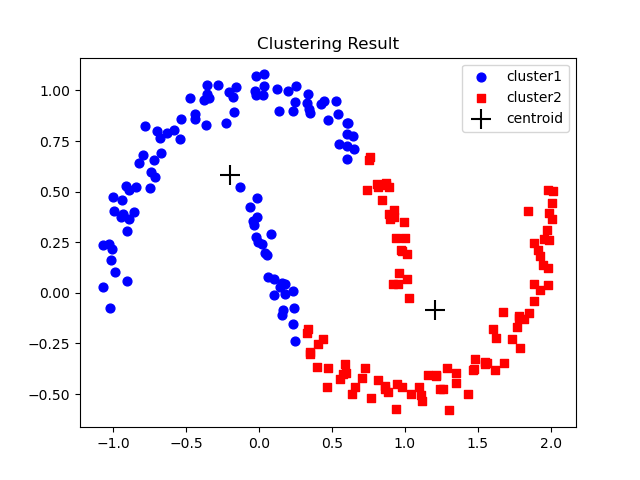
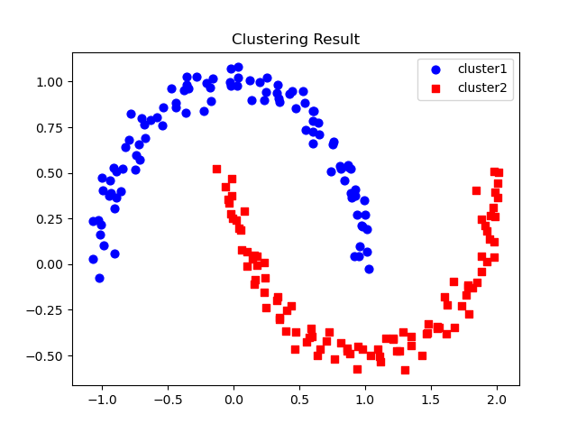
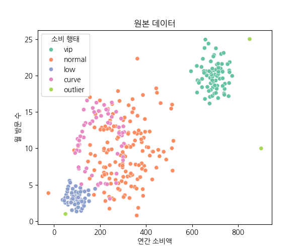
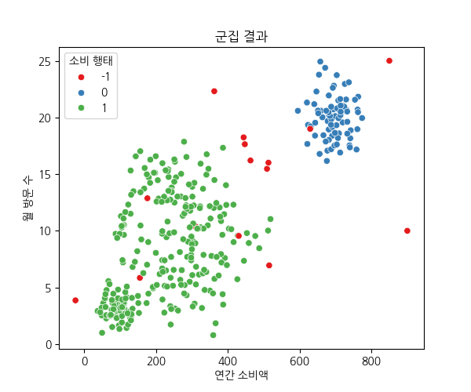

# Day 53_DBSCAN · Linear List · 자료구조 개요
## 📅 2026-04-21

---
# 🔵 DBSCAN — 밀도 기반 클러스터링

> 📎 참고: [DevHwi - DBSCAN(밀도 기반 클러스터링)](https://devhwi.tistory.com/7)

---

DBSCAN은 **밀도 기반** 클러스터링 알고리즘이다. K-Means처럼 군집 수를 미리 정하지 않아도 되고, 데이터의 밀도가 높은 영역을 자동으로 찾아 군집을 형성한다. 반달이나 나선형처럼 **비선형·불규칙한 형태**의 데이터에서 특히 강력하다.

어느 군집에도 속하지 못한 포인트는 **노이즈(-1)** 로 처리되는데, 이게 이상치 탐지에도 활용된다.

---

## 🆚 K-Means와 뭐가 다른가?

K-Means는 centroid(중심점)까지의 거리를 기준으로 군집을 나눈다. 그래서 군집이 원형일 때 잘 작동하지만, 반달 모양처럼 구부러진 데이터는 직선으로 잘라버린다.

DBSCAN은 거리가 아닌 **밀도**를 기준으로 삼는다. 주변에 포인트가 충분히 많으면 같은 군집으로 묶고, 그렇지 않으면 노이즈로 분리한다. 덕분에 형태에 상관없이 자연스러운 군집을 찾아낼 수 있다.

단, K-Means보다 계산 비용이 높고 파라미터 튜닝이 까다롭다는 단점이 있다. ⚠️

---

## ⚙️ 핵심 파라미터

- **eps** : 이웃으로 인정하는 최대 반경 거리
- **min_samples** : 핵심 포인트가 되기 위한 반경 내 최소 이웃 수

이 두 값을 어떻게 설정하느냐가 결과를 크게 바꾼다.  
eps가 너무 크면 모든 게 하나의 군집으로 뭉치고, 너무 작으면 대부분이 노이즈가 된다.

---

## 🔄 동작 방식

1. 임의의 포인트를 하나 선택
2. eps 반경 안의 이웃 포인트를 모두 탐색
3. 이웃 수 ≥ min_samples → **핵심 포인트**로 지정, 군집 생성
4. 군집 안의 포인트가 또 다른 군집의 핵심이면 → 두 군집을 합침
5. 모든 포인트에 반복
6. 어느 군집에도 속하지 않은 포인트 → **노이즈(-1)** 🚫

포인트는 세 종류로 나뉜다.

```
🟢 핵심 포인트 (Core Point)    → 반경 내 이웃 수 >= min_samples
🟡 경계 포인트 (Border Point)  → 핵심 포인트의 이웃이지만 본인은 조건 미달
🔴 노이즈     (Noise)          → 어떤 군집에도 속하지 않음 → -1
```

---

## 💻 Python 구현

```python
from sklearn.datasets import make_moons
from sklearn.cluster import DBSCAN
import matplotlib.pyplot as plt

X, y = make_moons(n_samples=1000, noise=0.05)

dbscan = DBSCAN(eps=0.2, min_samples=5)
dbscan.fit(X)

# labels_ 에서 -1은 노이즈 포인트
plt.scatter(X[:, 0], X[:, 1], c=dbscan.labels_)
plt.show()
```

---
# 📄 unsuper9dbscan.py — DBSCAN vs KMeans 군집 비교

## 📌 개념 정리

### DBSCAN이란?

**DBSCAN** (Density-Based Spatial Clustering of Applications with Noise)은  
**밀도 기반** 군집 알고리즘으로, 서로 가까운 데이터 포인트를 함께 그룹화한다.

- 군집 수를 미리 지정할 필요 없음
- 비선형·불규칙한 형태의 군집 탐지에 유리
- 밀도가 낮은 포인트는 **노이즈(이상치)** 로 분류 → 군집 번호 `-1`

---

### 핵심 파라미터

|파라미터|설명|
|---|---|
|`eps`|한 점에서 이웃으로 인정하는 최대 반경|
|`min_samples`|핵심 포인트가 되기 위한 반경 내 최소 이웃 수|
|`metric`|거리 계산 방식 (기본: euclidean)|

---

### 포인트 분류

```
핵심 포인트 (Core Point)    → eps 반경 안에 min_samples개 이상 존재
경계 포인트 (Border Point)  → 핵심 포인트의 이웃이지만 본인은 조건 미달
노이즈 포인트 (Noise)       → 어떤 군집에도 속하지 않음 → cluster = -1
```

---

### KMeans vs DBSCAN 핵심 차이

|구분|KMeans|DBSCAN|
|---|---|---|
|군집 수|**사전 지정 필수** (n_clusters)|자동 탐지|
|군집 형태|원형(구형) 가정|비선형·불규칙 형태 가능|
|이상치 처리|강제로 군집에 배정|`-1`로 분리|
|기준|거리(centroid까지)|밀도(이웃 수)|

> make_moons처럼 반달 모양 데이터는 KMeans가 직선으로 잘라버리지만,  
> DBSCAN은 밀도를 따라 형태에 맞게 군집을 형성한다.

---

## 💻 전체 실습 코드

### 1단계 - 데이터 생성

```python
from sklearn.datasets import make_moons
import matplotlib.pyplot as plt

# 반달 모양 비선형 데이터 생성
# noise: 데이터 흩어짐 정도 (작을수록 깔끔한 반달)
x, y = make_moons(n_samples=200, noise=0.05, shuffle=True, random_state=0)

print(x[:5], x.shape)
# [[ 0.81680544  0.5216447 ]
#  [ 1.61859642 -0.37982927]  ...] (200, 2)

print(y[:5], y.shape)
# [0 1 1 0 1] (200,)  ← 실제 라벨 (0 또는 1)

# 원본 데이터 시각화
plt.scatter(x[:, 0], x[:, 1], c=y)
plt.show()
```



---

### 2단계 - KMeans 군집 분류

```python
from sklearn.cluster import KMeans

# n_clusters=2 : 군집 수를 2개로 고정
# init='k-means++' : 초기 중심점을 분산되게 설정 (수렴 안정성 향상)
km = KMeans(n_clusters=2, init='k-means++', random_state=0)
pred1 = km.fit_predict(x)

print('km 예측 군집 id : ', pred1[:10])
# [1 1 0 0 1 1 1 1 1 1]
```

---

### 3단계 - 시각화 함수 정의

```python
def plotResult(x, pr, centers=None):
    # pr==0인 포인트 → 파란 원, pr==1인 포인트 → 빨간 사각형
    plt.scatter(x[pr==0, 0], x[pr==0, 1], c='blue', marker='o', s=40, label='cluster1')
    plt.scatter(x[pr==1, 0], x[pr==1, 1], c='red',  marker='s', s=40, label='cluster2')

    # KMeans일 때만 centroid(군집 중심) 표시
    if centers is not None:
        plt.scatter(centers[:, 0], centers[:, 1], c='black', marker='+', s=200, label='centroid')

    plt.title('Clustering Result')
    plt.legend()
    plt.show()

# KMeans 결과: 반달 형태를 직선으로 잘라버림 → 경계 부근 오분류 발생
plotResult(x, pred1, km.cluster_centers_)
```



---

### 4단계 - DBSCAN 군집 분류

```python
from sklearn.cluster import DBSCAN

# eps=0.2      : 반경 0.2 안의 점들을 이웃으로 인정
# min_samples=5 : 이웃이 5개 이상이어야 핵심 포인트
# metric='euclidean' : 유클리드 거리 사용
db = DBSCAN(eps=0.2, min_samples=5, metric='euclidean')
pred2 = db.fit_predict(x)

print('DBSCAN 군집 id : ', pred2[:10])
# [0 1 1 0 1 1 0 1 0 1]

print('군집 종류 : ', set(pred2))
# {0, 1}  ← -1 없음 → 이상치 없이 깔끔하게 분류됨

# DBSCAN 결과: 반달 형태 그대로 군집 형성 → 정확한 분류
plotResult(x, pred2)  # centers 없음 (DBSCAN은 centroid 개념 없음)
```



---

## 📊 결과 비교

| 모델     | 군집 수 지정    | 반달 형태 분류  | 이상치 처리 |
| ------ | ---------- | --------- | ------ |
| KMeans | 필요 (2개 고정) | ❌ 직선으로 절단 | 강제 배정  |
| DBSCAN | 불필요 (자동)   | ✅ 형태 그대로  | -1 분리  |

---

## 🔑 핵심 포인트

> KMeans는 **k개 군집**에 맞추고, DBSCAN은 **밀도·형태**에 맞춘다  
> make_moons처럼 비선형 데이터는 DBSCAN이 압도적으로 유리  
> `eps`와 `min_samples` 튜닝이 DBSCAN 성능의 핵심  
> 노이즈 포인트(`-1`)가 없다면 모든 데이터가 군집에 속한 것

---
# 📄 unsuper10dbscan.py — 쇼핑몰 고객 행동 데이터 DBSCAN 군집 분류

## 📌 개념 정리

### 데이터 구성

이 실습은 쇼핑몰 고객 행동 데이터를 **의도적으로 생성**해 DBSCAN으로 군집화한다.  
실제 현업에서도 고객 세그멘테이션에 자주 쓰이는 패턴이다.

| 그룹        | 특징                  | 샘플 수 |
| --------- | ------------------- | ---- |
| `vip`     | 연간 소비 높음, 방문 잦음     | 80   |
| `normal`  | 평균적 소비 패턴, 가장 많은 비중 | 150  |
| `low`     | 방문·구매 모두 적음         | 70   |
| `curve`   | 비선형 소비 패턴 (코사인 곡선)  | 60   |
| `outlier` | 극단적 소비 (이상치)        | 3    |

> 일반적으로 **계층적/비계층적 군집 분석을 먼저** 시도하고,  
> 결과가 마음에 안 들면 DBSCAN을 적용한다.

---

### StandardScaler를 쓰는 이유

DBSCAN은 거리 기반 알고리즘이라 **피처 간 단위 차이**가 결과에 크게 영향을 준다.

```
annual_spending : 수백~수천 단위
visit_per_month : 한 자리~두 자리 단위
avg_purchase    : 수십 단위
```

스케일링 없이 사용하면 값이 큰 `annual_spending`이 거리를 지배해버린다.  
`StandardScaler`로 평균 0, 표준편차 1로 맞춰줘야 공정한 거리 계산이 가능하다.

---

## 💻 전체 실습 코드

### 1단계 - 데이터 생성

```python
import numpy as np
import pandas as pd

np.random.seed(42)

# vip 고객 - 연간 소비 높음, 방문 잦음
vip = pd.DataFrame({
    'annual_spending': np.random.normal(700, 40, 80),
    'visit_per_month': np.random.normal(20, 2, 80),
    'avg_purchase':    np.random.normal(80, 10, 80),
    'group': 'vip'
})

# 일반 고객 - 평균적 소비 패턴, 가장 많은 비중 차지
normal = pd.DataFrame({
    'annual_spending': np.random.normal(300, 100, 150),
    'visit_per_month': np.random.normal(10, 4, 150),
    'avg_purchase':    np.random.normal(30, 15, 150),
    'group': 'normal'
})

# 저활동 고객 - 방문 적음, 구매 적음
low = pd.DataFrame({
    'annual_spending': np.random.normal(100, 30, 70),
    'visit_per_month': np.random.normal(3, 1, 70),
    'avg_purchase':    np.random.normal(10, 5, 70),
    'group': 'low'
})

# 특이 패턴 고객 (비선형) - 코사인/사인 곡선으로 불규칙한 소비 패턴 표현
t = np.linspace(0, 3 * np.pi, 60)
curve = pd.DataFrame({
    'annual_spending': np.random.normal(0, 10, len(t)) + 200 + 100 * np.cos(t),
    'visit_per_month': np.random.normal(0, 1,  len(t)) + 10  + 5   * np.sin(t),
    'avg_purchase':    40 + 10 * np.sin(t),
    'group': 'curve'
})

# 이상 고객 (이상치) - 극단적으로 많이 사거나 거의 안사거나
outliers = pd.DataFrame({
    'annual_spending': [900, 50, 850],
    'visit_per_month': [10,  1,  25],
    'avg_purchase':    [120, 5,  100],
    'group': 'outlier'
})

# 전체 합치기
df = pd.concat([vip, normal, low, curve, outliers], ignore_index=True)
```

---

### 2단계 - 원본 데이터 시각화

```python
import seaborn as sns
import matplotlib.pyplot as plt
import koreanize_matplotlib

plt.figure(figsize=(6, 5))
sns.scatterplot(
    x=df['annual_spending'],
    y=df['visit_per_month'],
    hue=df['group'],
    palette='Set2'
)
plt.title('원본 데이터')
plt.xlabel('연간 소비액')
plt.ylabel('월 방문 수')
plt.legend(title='소비 행태')
plt.show()
```



---

### 3단계 - DBSCAN 군집 분류

```python
from sklearn.preprocessing import StandardScaler
from sklearn.cluster import DBSCAN

# 스케일링 - group 컬럼 제외 후 정규화
scaler = StandardScaler()
x_scaled = scaler.fit_transform(df.drop(columns=['group']))

# eps=0.5      : 반경 0.5 안의 점을 이웃으로 인정
# min_samples=5 : 핵심 포인트 조건 (이웃 5개 이상)
dbscan = DBSCAN(eps=0.5, min_samples=5, metric='euclidean')
clusters = dbscan.fit_predict(x_scaled)

df['cluster'] = clusters
print(df.head(2))
#    annual_spending  visit_per_month  avg_purchase group  cluster
# 0       719.868566        19.560656     70.253183   vip        0
# 1       694.469428        20.714225     87.870846   vip        0
```

---

### 4단계 - 군집 결과 시각화

```python
plt.figure(figsize=(6, 5))
sns.scatterplot(
    x=df['annual_spending'],
    y=df['visit_per_month'],
    hue=df['cluster'],
    palette='Set1'
)
plt.title('군집 결과')
plt.xlabel('연간 소비액')
plt.ylabel('월 방문 수')
plt.legend(title='소비 행태')
plt.show()
# 매출 + 방문 + 구매금액에 따라 군집 형성
# -1 : 노이즈(이상치), 0 : vip, 1 : normal+low+curve 혼합
```



---

### 5단계 - 군집별 평균 확인

```python
print('각 군집 평균:')
print(df.groupby('cluster')[['annual_spending', 'visit_per_month', 'avg_purchase']].mean())
#          annual_spending  visit_per_month  avg_purchase
# cluster
# -1       ...              ...              ...   ← 이상치
#  0       ...              ...              ...   ← vip
#  1       ...              ...              ...   ← 일반+저활동+curve
```

---

## 📊 결과 해석

군집 결과를 보면 DBSCAN이 3가지로 분류했다.

- **군집 0 (파란색)** → vip 고객: 연간 소비 높고 방문 잦음
- **군집 1 (초록색)** → normal + low + curve 혼합: 밀도가 높아 하나로 묶임
- **군집 -1 (빨간색)** → 노이즈: outlier 3개가 이상치로 분리됨 🚫

> curve 그룹이 normal/low와 같은 군집으로 묶인 이유는  
> 3개 피처(소비액, 방문수, 구매금액)를 모두 고려했을 때 밀도가 겹치기 때문

---

## 🔑 핵심 포인트

> 거리 기반 알고리즘엔 **StandardScaler 전처리가 필수**  
> DBSCAN은 `eps`, `min_samples` 값에 따라 군집 수와 노이즈 비율이 크게 달라짐  
> 노이즈(`-1`)로 분류된 포인트 = 사실상 **이상치 탐지** 결과  
> 2D 시각화는 일부 피처만 보여주므로 실제 군집과 다르게 보일 수 있음

---
# 🗂️ 자료구조 (Data Structure) 개념 정리

---

자료구조란 데이터를 **저장하고, 조직하고, 사용하는 체계적인 방식**이다. 데이터의 "형태"를 정하고 그 위에 "동작"을 설계해서, 컴퓨터가 문제를 더 빠르고 효율적으로 해결하도록 만드는 도구다. 어떻게 저장하느냐에 따라 속도와 메모리 사용량이 달라지기 때문에, 자료구조는 "문제를 얼마나 똑똑하게 푸는가"를 결정짓는 중요한 기반이다.

---

## 🗺️ 자료구조 분류

```
선형 구조 (Linear)          비선형 구조 (Non-Linear)
├── 배열 (Array)            ├── 트리 (Tree)
├── 연결 리스트 (Linked List) └── 그래프 (Graph)
├── 스택 (Stack) - LIFO
└── 큐 (Queue) - FIFO
    └── 데큐 (Deque)
```

---

## 1️⃣ 선형 리스트 (Linear List)

데이터가 **논리적 순서와 물리적 저장 순서가 같은** 자료구조. 가장 대표적인 형태가 배열(Array)이다. Python의 `list`가 대표적인 선형 리스트 구현체다.

데이터가 연속된 메모리 공간에 저장되며, 각 데이터는 인덱스(index)로 접근한다.

```
인덱스:  0    1    2    3
데이터:  A    B    C    D
```

### ⚡ 시간 복잡도

|연산|시간 복잡도|설명|
|---|---|---|
|접근 (Access)|O(1) ✅|인덱스로 즉시 접근|
|삽입 (Insert)|O(n) ⚠️|삽입 위치 이후 전부 뒤로 이동|
|삭제 (Delete)|O(n) ⚠️|삭제 위치 이후 전부 앞으로 이동|

### 삽입 / 삭제 예시

```
삽입: [월, 화, 수, 금, 토, 일]
   →  [월, 화, 수, 목, 금, 토, 일]   # 목 뒤의 데이터 전부 한 칸 이동

삭제: [월, 화, 수, 목, 금, 토, 일]
   →  [월, 화, 수, 금, 토, 일]       # 목 삭제 후 뒤 데이터 앞으로 이동
```

> 접근은 빠르지만, 삽입/삭제 시 데이터 이동이 발생해 비효율적

---

## 2️⃣ 연결 리스트 (Linked List)

데이터를 연속된 메모리에 저장하지 않고, **각 데이터가 다음 데이터의 주소를 가리키며 연결**되는 자료구조.

```
[데이터 | 다음 주소] → [데이터 | 다음 주소] → [데이터 | None]
```

- 데이터는 아무 곳에나 흩어져 저장
- 순서는 포인터(참조)로 유지
- 배열처럼 인덱스로 바로 접근 불가

### 노드(Node) 구조

```
[  Data  |  Address  ]
    ↓           ↓
  실제 값    다음 노드 주소
```

### 종류

- **단순 연결 리스트** (Singly Linked List) : 단방향 연결
- **이중 연결 리스트** (Doubly Linked List) : 양방향 연결
- **원형 연결 리스트** (Circular Linked List) : 마지막 노드가 첫 번째 노드를 가리킴

### ⚡ 시간 복잡도

|연산|시간 복잡도|
|---|---|
|탐색|O(n) - 처음부터 순차 탐색|
|삽입/삭제|O(1) - 위치 알면 링크만 변경|

### Linear List vs Linked List

|항목|Linear List|Linked List|
|---|---|---|
|저장 방식|연속된 공간|흩어진 공간|
|접근|빠름 O(1)|느림 O(n)|
|삽입/삭제|느림 (이동 발생)|빠름 (연결만 바꿈)|

> **비유** : Linear List = 좌석 번호 고정된 공연장 / Linked List = 다음 좌석 위치만 알려주는 예약 리스트

---

## 3️⃣ 스택 (Stack)

**후입선출(LIFO, Last In First Out)** 원칙을 따르는 선형 자료구조. 리스트의 **한쪽 끝에서만** 삽입(push)과 삭제(pop)가 이루어진다.

```
     ↑ pop
  ┌──────┐
  │  3   │  ← TOP (가장 최근 삽입)
  ├──────┤
  │  2   │
  ├──────┤
  │  1   │  ← BOTTOM
  └──────┘
     ↓ push
```

### ⚡ 시간 복잡도

|연산|시간 복잡도|
|---|---|
|push / pop|O(1)|
|탐색 (상단 확인)|O(1)|

### 🔧 활용 사례

- 웹 브라우저 뒤로가기
- 함수 호출 스택
- Undo 기능
- DFS(깊이 우선 탐색) 구현
- 역전파(Backpropagation) 내부 연산 순서 관리

> **비유** : 놀이공원 행동 기록 되돌리기(Undo) — 가장 최근 행동부터 취소 가능

---

## 4️⃣ 큐 (Queue)

**선입선출(FIFO, First In First Out)** 원칙을 따르는 선형 자료구조. 한쪽에서는 삽입(Enqueue), 반대쪽에서는 삭제(Dequeue)만 이루어진다.

```
삭제(Dequeue) ←  [ A | B | C | D ]  ← 삽입(Enqueue)
              Front                  Rear
```

- **Front** : 삭제가 일어나는 앞쪽
- **Rear** : 삽입이 일어나는 뒤쪽

### ⚡ 시간 복잡도

|연산|시간 복잡도|
|---|---|
|삽입/삭제|O(1)|
|탐색 (맨 앞 확인)|O(1)|

### 🔧 활용 사례

- 프린트 작업 대기열
- 프로세스 스케줄링
- BFS(너비 우선 탐색) 구현
- PyTorch DataLoader 내부 데이터 공급
- 강화학습 Replay Buffer

> **비유** : 놀이공원 대기 줄 — 먼저 온 사람이 먼저 탄다

### Stack vs Queue

| |Stack|Queue|
|---|---|---|
|원칙|LIFO (나중에 넣은 것 먼저)|FIFO (먼저 넣은 것 먼저)|
|비유|되돌리기 (Undo)|순서 지키기 (대기 줄)|

---

## 4-1️⃣ 데큐 (Deque, Double-Ended Queue)

**양쪽 끝(front, rear)에서 삽입과 삭제가 모두 가능**한 자료구조. Stack과 Queue를 일반화한 형태다.

```
삭제 ←  [ A | B | C | D | E ]  → 삭제
삽입 →                          ← 삽입
```

|구조|삽입|삭제|
|---|---|---|
|Stack|한쪽|한쪽|
|Queue|뒤|앞|
|**Deque**|**양쪽**|**양쪽**|

Deque 하나로 Stack, Queue 모두 구현 가능하다.

### 주요 연산

|연산|설명|
|---|---|
|`addFirst()`|front 쪽에 삽입|
|`addLast()`|rear 쪽에 삽입|
|`removeFirst()`|front 쪽 삭제|
|`removeLast()`|rear 쪽 삭제|

### 🔧 활용 사례

- 슬라이딩 윈도우 최대값
- Undo / Redo 기능
- 0-1 BFS (가중치 0 → 앞 삽입, 가중치 1 → 뒤 삽입)

---

## 5️⃣ 트리 (Tree)

데이터가 **부모 → 자식 관계로 나무 가지처럼 연결된 계층 구조** 자료구조. 반드시 하나의 루트 노드를 가지며, 사이클(순환)이 없다.

```
         A          ← Root Node (Depth 1)
        /|\
       B C D        ← Depth 2
      /|   |\
     E F   H I      ← Depth 3
    /|       \
   K L        M    ← Depth 4 (Leaf Nodes)
```

### 핵심 용어

|용어|설명|
|---|---|
|루트 노드|트리의 시작점|
|부모 노드|자식 노드를 가지는 노드|
|자식 노드|부모로부터 연결된 하위 노드|
|리프 노드|자식이 없는 끝 노드|
|서브 트리|특정 노드를 루트로 하는 부분 트리|
|높이|루트에서 가장 깊은 노드까지의 거리|

### ⚡ 시간 복잡도

|연산|평균|최악|
|---|---|---|
|탐색|O(log n)|O(n)|
|삽입/삭제|O(log n)|O(n)|

> **비유** : 회사 조직도 — CEO → 팀장 → 사원, 위에서 아래로만 흐름

### 이진 트리 순회

이진 트리 순회는 "현재 노드를 언제 처리하느냐"의 차이다.

|순회 방식|순서|용도|
|---|---|---|
|전위 순회 (Preorder)|Node → Left → Right|트리 구조 저장·복사|
|중위 순회 (Inorder)|Left → Node → Right|정렬된 결과 (BST)|
|후위 순회 (Postorder)|Left → Right → Node|트리 삭제·수식 계산|

---

## 6️⃣ 그래프 (Graph)

**정점(Vertex)과 간선(Edge)의 집합**으로 이루어진 자료구조. 트리와 달리 부모-자식 개념이 없고, 사이클이 존재할 수 있다.

```
Tree가 "조직도"라면, Graph는 "지도·네트워크"
```

- **무방향 그래프** : A ↔ B (양방향) — 친구 관계, 도로 지도
- **방향 그래프** : A → B (단방향) — 트위터 팔로우, 일방통행

### 핵심 용어

|용어|설명|
|---|---|
|노드(Node)|데이터를 나타내는 점|
|엣지(Edge)|노드 간의 연결|
|가중치(Weight)|엣지에 숫자값 추가 (거리, 비용 등)|

### DFS vs BFS

|항목|DFS (깊이 우선)|BFS (너비 우선)|
|---|---|---|
|탐색 방향|한 방향으로 깊게|가까운 노드부터 넓게|
|자료구조|스택(Stack) or 재귀|큐(Queue)|
|구현 난이도|간단 (재귀 구현 쉬움)|큐 사용 (조금 더 복잡)|
|주요 사용 예|백트래킹, 경로 전체 탐색|최단 거리, 레벨 기반 탐색|
|경로 보장|최단 경로 아님|최단 경로 보장 (가중치 없음)|

### 다익스트라 (Dijkstra) 알고리즘

가중치가 있는 그래프에서 **한 시작점으로부터 모든 정점까지의 최단 거리**를 구하는 알고리즘. 간선 가중치는 **음수가 없어야** 한다.

```
핵심 아이디어 : "지금까지 가장 가까운 노드부터 하나씩 확정"
구현 : 우선순위 큐(Heap) 사용

흐름
1) 시작 노드 거리 = 0, 나머지 = 무한대
2) 가장 거리 짧은 노드 선택
3) 그 노드를 거쳐 갈 때 더 짧아지는 이웃 노드 거리 갱신
4) 모든 노드가 확정될 때까지 반복
```

입력: Graph → 처리: 다익스트라 → 출력: **최단 경로 Tree**

### A* 알고리즘

다익스트라의 확장판. **휴리스틱(추정치)** 을 사용해 더 빨리 목적지에 도달한다.

```
f(n) = g(n) + h(n)

g(n) : 시작점 → 현재 노드까지 실제 누적 비용
h(n) : 현재 노드 → 목표까지의 추정 비용 (휴리스틱)
```

h(n) = 0 이면 다익스트라와 동일. 목표가 명확할 때 (지도 길 찾기, 게임 AI) 유리하다.

---

## 7️⃣ 해시 테이블 (Hash Table)

**Key를 Value에 매핑**하는 자료구조. 해시 함수로 키가 저장될 위치(인덱스)를 계산한다. Python의 `dict`가 해시 테이블 구조를 따른다.

```
Key → 해시 함수 → 해시 값(인덱스) → 저장 위치
"홍길동" → Hash Function → 4 → 4번 인덱스에 저장
```

- **해시 함수** : 임의 길이 데이터를 고정 길이 숫자로 변환 (단방향)
- **충돌(Collision)** : 서로 다른 키가 같은 해시 값을 가질 때 → Chaining 또는 Open Addressing으로 해결

### ⚡ 시간 복잡도

|연산|평균|최악|
|---|---|---|
|탐색/삽입/삭제|O(1)|O(n)|

> 빠른 이유 = 처음부터 비교하는 게 아니라 **위치를 계산**해서 바로 접근

---

## 8️⃣ 힙 (Heap)

**완전 이진 트리** 형태로, 항상 최대값 또는 최솟값을 빠르게 꺼내기 위한 자료구조.

```
🔺 Max Heap : 부모 ≥ 자식  → 루트 = 가장 큰 값
        50
       /  \
      30   40
     / \ /
    10 20 35

🔻 Min Heap : 부모 ≤ 자식  → 루트 = 가장 작은 값
        10
       /  \
      20   30
     / \ /
    50 40 35
```

배열 하나로 표현 가능 (완전 이진 트리이기 때문):

```
부모 i  →  왼쪽 자식: 2*i+1  /  오른쪽 자식: 2*i+2
```

### ⚡ 시간 복잡도

|연산|시간 복잡도|
|---|---|
|최대/최소값 접근|O(1)|
|삽입/삭제|O(log n)|
|힙 생성|O(n)|

### 🔧 활용 사례

- 우선순위 큐 (Priority Queue)
- 다익스트라 알고리즘 (Min Heap)
- 힙 정렬 (Heap Sort)
- Top-K 문제

---

## 🔑 전체 시간 복잡도 요약

|자료구조|접근|탐색|삽입|삭제|
|---|---|---|---|---|
|Linear List|O(1)|O(n)|O(n)|O(n)|
|Linked List|O(n)|O(n)|O(1)|O(1)|
|Stack|O(n)|O(n)|O(1)|O(1)|
|Queue|O(n)|O(n)|O(1)|O(1)|
|Tree (BST)|-|O(log n)|O(log n)|O(log n)|
|Hash Table|O(1)|O(1)|O(1)|O(1)|
|Heap|O(1)*|-|O(log n)|O(log n)|

*최대/최솟값 한정

---
# 📄 stru1_linear.py — 선형 리스트 (Linear List) 실습

## 📌 개념 정리

선형 리스트(Linear List)는 데이터가 **논리적 순서와 물리적 저장 순서가 같은** 자료구조다. Python의 `list`가 대표적인 구현체이며, 인덱스로 즉시 접근이 가능하다.

|연산|시간 복잡도|설명|
|---|---|---|
|접근 (Access)|O(1) ✅|인덱스로 즉시 접근|
|삽입 (Insert)|O(n) ⚠️|삽입 위치 이후 전부 뒤로 이동|
|삭제 (Delete)|O(n) ⚠️|삭제 위치 이후 전부 앞으로 이동|

이번 실습은 같은 동작을 두 가지 방식으로 비교한다.

- **연습1** : Python 내장 함수(`insert`, `remove`, `pop`) 사용
- **연습2** : 함수 없이 직접 인덱스 이동으로 구현 → 내부 동작 원리 이해

---

## 💻 연습1 — Python 내장 함수 사용

### 1단계 - 초기 데이터 및 접근

```python
line = ['철수', '영희', '민수']
print('현재 줄 상태 : ', line)
# 현재 줄 상태 :  ['철수', '영희', '민수']

# 인덱스로 즉시 접근 → O(1)
print('맨 앞사람 : ', line[0])   # 철수
print('두번째 사람 : ', line[1]) # 영희
```

---

### 2단계 - 삽입 (새치기)

```python
# insert(index, value) : index 위치에 삽입, 이후 요소 전부 뒤로 한 칸 이동
line.insert(2, '지수')
print('지수 삽입 후 현재 줄 상태 : ', line)
# ['철수', '영희', '지수', '민수']
```

---

### 3단계 - 삭제 (줄 이탈)

```python
# remove(value) : 해당 값을 찾아 삭제, 이후 요소 전부 앞으로 한 칸 이동
line.remove('영희')
print('영희가 빠진후 줄 상태 : ', line)
# ['철수', '지수', '민수']
```

---

### 4단계 - 맨 앞 사람 입장

```python
# pop(0) : 왼쪽(앞) 값 추출 → 뒤 요소 전부 앞으로 이동
# pop()  : 오른쪽(뒤) 값 추출
first_person = line.pop(0)
print('첫번째 사람 입장 후 남은 줄상태:', line)
# ['지수', '민수']
```

---

### 5단계 - 남은 인원 출력

```python
# enumerate() : 인덱스와 값을 함께 반환
for i, p in enumerate(line):
    print(i, '번째 사람:', p)
# 0 번째 사람: 지수
# 1 번째 사람: 민수
```

---

## 💻 연습2 — 직접 인덱스 이동으로 구현

내장 함수 없이 직접 구현해 **삽입/삭제 시 내부에서 일어나는 데이터 이동**을 확인한다.

### 1단계 - 삽입 구현 (index 2에 '지수' 삽입)

```python
line = ['철수', '영희', '민수']

# 1) 공간 확보 (맨 뒤에 None 추가)
line.append(None)   # ['철수', '영희', '민수', None]

# 2) index 2 이후 요소를 뒤에서부터 한 칸씩 뒤로 이동
# range(len-1, 2, -1) : 마지막 인덱스부터 3까지 역순으로
for i in range(len(line) - 1, 2, -1):
    line[i] = line[i - 1]
print(line)
# ['철수', '영희', '영희', '민수']  ← index 2 자리가 비워짐

# 3) 비워진 자리에 값 삽입
line[2] = '지수'
print('지수가 삽입된 후 줄 상태:', line)
# ['철수', '영희', '지수', '민수']
```

---

### 2단계 - 삭제 구현 ('영희' 삭제)

```python
# 1) 삭제할 요소의 인덱스 탐색
remove_index = None
for i in range(len(line)):
    if line[i] == '영희':
        remove_index = i
        break

# 2) 해당 인덱스 이후 요소를 앞으로 한 칸씩 이동
for i in range(remove_index, len(line) - 1):
    line[i] = line[i + 1]
print(line)
# ['철수', '지수', '민수', '민수']  ← 마지막에 중복 발생

# 3) 마지막 중복 요소 제거
line.pop()
print('영희가 빠져 나간 후 줄 상태 :', line)
# ['철수', '지수', '민수']
```

---

### 3단계 - 맨 앞 사람 입장 구현

```python
# 1) 맨 앞 값 저장
first_person = line[0]  # '철수'

# 2) 앞에서부터 한 칸씩 왼쪽으로 이동
for i in range(0, len(line) - 1):
    line[i] = line[i + 1]
print(line)
# ['지수', '민수', '민수']  ← 마지막에 중복 발생

# 3) 마지막 중복 요소 제거
line.pop()
print('남아 있는 줄상태 : ', line)
# ['지수', '민수']

for i, p in enumerate(line):
    print(i, '번째 사람:', p)
# 0 번째 사람: 지수
# 1 번째 사람: 민수
```

---

## 📊 연습1 vs 연습2 비교

|항목|연습1 (내장 함수)|연습2 (직접 구현)|
|---|---|---|
|코드 길이|짧고 간결|길고 명시적|
|가독성|높음|낮음|
|내부 동작 이해|❌ 숨겨져 있음|✅ 직접 확인 가능|
|실제 사용|이걸 쓰면 됨|원리 이해용|

---

## 🔑 핵심 포인트

> Linear List는 **인덱스로 즉시 접근** 가능 → O(1)  
> 삽입/삭제 시 **데이터 이동이 반드시 발생** → O(n) 비효율  
> `insert`, `remove`, `pop(0)` 모두 내부적으로 연습2와 같은 이동 작업을 수행  
> 삽입/삭제가 빈번하다면 **Linked List** 사용을 고려할 것