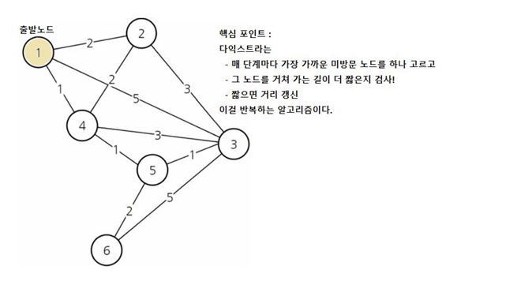

# Day 56_자료구조·알고리즘 : Heap · 다익스트라 · 그리디
## 📅 2026-04-24

___
# 📄 stru10_heap.py — Heap (힙)

---

## 📌 개념 정리

### Heap이란?

**Heap** 은 **모든 노드가 특정한 순서를 유지하며 구성된 완전 이진 트리 형태의 자료구조**다.

- **완전 이진 트리** : 마지막 레벨을 제외한 모든 레벨이 가득 차 있고, 마지막 레벨은 왼쪽부터 채워짐
- 부모-자식 간 **크기 순서가 항상 보장**됨 — 형제 노드 간 순서는 보장 안 됨
- Python `heapq` 는 기본적으로 **Min Heap** 으로 동작

**실생활 예시** : 우선순위 큐, 다익스트라 최단경로, 작업 스케줄링, K번째 최솟값 탐색

---

### Heap의 두 가지 종류

|구분|Min Heap|Max Heap|
|---|---|---|
|규칙|부모 ≤ 자식|부모 ≥ 자식|
|루트|**최솟값**|**최댓값**|
|Python 지원|✅ `heapq` 기본|❌ 부호 반전 트릭 사용|

```
Min Heap              Max Heap
     10                   30
    /  \                 /  \
   30   20             10   20
(루트 = 최솟값)       (루트 = 최댓값)
```

---

### 핵심 용어

|용어|설명|
|---|---|
|`완전 이진 트리`|마지막 레벨 제외 모두 가득 차고, 마지막은 왼쪽부터 채워진 트리|
|`heappush(heap, val)`|값을 삽입하고 자동으로 힙 구조 유지 (heapify)|
|`heappop(heap)`|루트(최솟값)를 꺼내고 자동으로 힙 재정렬|
|`heap[0]`|루트값 조회만 할 때 — pop 없이 O(1)|
|`부호 반전 트릭`|Max Heap이 필요할 때 값에 `-` 를 붙여 Min Heap처럼 동작시키는 방법|

---

### BST vs Heap 비교

|구분|BST|Heap|
|---|---|---|
|정렬 규칙|left < node < right|부모-자식 간 크기 순서만 보장|
|탐색|O(log n)|❌ 탐색 비효율|
|최솟값/최댓값|O(log n)|**O(1)** (루트가 항상 최솟값·최댓값)|
|삽입/삭제|O(log n)|O(log n)|
|주요 용도|정렬된 데이터 탐색|**우선순위 큐**|

> BST는 **탐색**에 강하고, Heap은 **최솟값·최댓값 추출**에 강하다

---

### 시간복잡도 요약

|연산|메서드|시간복잡도|
|---|---|---|
|삽입|`heappush(heap, val)`|O(log n)|
|최솟값 삭제|`heappop(heap)`|O(log n)|
|최솟값 조회|`heap[0]`|O(1)|
|리스트 → 힙|`heapify(list)`|O(n)|

---

## 💻 전체 실습 코드

```python
# Heap : 모든 노드가 특정한 순서를 유지하며 구성된 완전이진트리 형태의 자료구조

import heapq    # Python 내장 모듈 — 기본이 Min Heap


# ─────────────────────────────────────────
# Min Heap
# 부모 노드가 항상 자식 노드보다 작거나 같음
# 루트(heap[0])가 항상 최솟값을 유지
# ─────────────────────────────────────────
heap = []

heapq.heappush(heap, 30)    # 삽입 후 자동으로 힙 구조 재정렬 (heapify)
heapq.heappush(heap, 10)    # 10이 30보다 작으므로 루트로 올라옴
heapq.heappush(heap, 20)
print('현재 힙 상태 : ', heap)  # [10, 30, 20] — 리스트처럼 보이지만 내부적으로 힙 구조 유지
# heap[0] 은 항상 최솟값

# 최솟값 꺼내기 — heappop() 은 루트(최솟값)를 꺼내고 자동으로 힙 재정렬
print('가장 작은 값:', heapq.heappop(heap))     # 10
print('가장 작은 값:', heapq.heappop(heap))     # 20
print('남은 힙 : ', heap)                       # [30]


# ─────────────────────────────────────────
# Max Heap
# Python heapq 는 Max Heap을 직접 지원하지 않음
# → 부호 반전 트릭 : 삽입 시 -를 붙이고, 꺼낼 때 다시 -를 붙여 원래 값으로 복원
# ─────────────────────────────────────────
heap = []

heapq.heappush(heap, -30)   # -30 삽입 → Min Heap 기준으로 가장 작은 값 = 원래 가장 큰 값
heapq.heappush(heap, -10)
heapq.heappush(heap, -20)
print('현재 힙 상태 : ', heap)  # [-30, -10, -20] — 내부적으로 -30이 루트 (원래 값 30이 최댓값)

# 최댓값 꺼내기 — heappop()으로 꺼낸 값에 다시 -를 붙여 원래 값으로 복원
print('가장 큰 값:', -heapq.heappop(heap))      # 30
print('가장 큰 값:', -heapq.heappop(heap))      # 20
print('남은 힙 : ', heap)                       # [-10]
```

---

## 📊 동작 과정 시각화

**Min Heap 삽입 과정**

```
heappush(30) :     heappush(10) :     heappush(20) :
    [30]               [10]               [10]
                      /                 /    \
                    [30]              [30]   [20]
                    ↑ 10 < 30 이므로 루트로 올라옴
```

**heappop() 동작**

```
pop 전 :           pop 후 (10 반환) :
    [10]               [20]
   /    \             /
 [30]   [20]        [30]
         ↑ 마지막 노드가 루트로 올라온 후 재정렬
```

**Max Heap 부호 반전 트릭**

```
실제 저장값 :   [-30, -10, -20]
힙 내부 구조 :       [-30]         ← -30이 루트 (Min Heap 기준 최솟값)
                    /    \
                 [-10]  [-20]

꺼낼 때 : -heappop() → -(-30) = 30  ← 원래 최댓값 복원
```

---

## 🔑 핵심 포인트

> Heap은 **완전 이진 트리** 기반 — 부모-자식 간 크기 순서만 보장, 형제 간 순서는 없음 Python `heapq` 는 **항상 Min Heap** — Max Heap은 **부호 반전 트릭** 으로 구현 `heappush` / `heappop` 시 자동으로 **heapify** 실행 — O(log n) `heap[0]` 으로 루트값(최솟값) 을 **O(1)** 로 조회 가능 — pop 없이 확인만 할 때 사용 BST와 달리 **전체 정렬이 목적이 아님** — 최솟값·최댓값을 빠르게 꺼내는 것이 목적

---
# 📄 알고리즘 : 다익스트라 · 그리디

---

## 📌 다익스트라 알고리즘 (Dijkstra Algorithm)

### 다익스트라란?

**Dijkstra** 는 **특정 출발 노드에서 다른 모든 노드까지의 최단 거리**를 구하는 알고리즘이다.

- **그리디 알고리즘의 일종** — 매 단계마다 가장 가까운 노드부터 탐색
- **양수 가중치**에서만 동작 — 음수 간선이 있으면 벨만-포드 사용
- 인접 리스트 + Min Heap 조합으로 **O((V + E) log V)** 의 효율 달성

**실생활 예시** : 네비게이션 최단 경로, 네트워크 라우팅, 지하철 최단 환승

---

### 핵심 동작 원리

```
① 출발 노드 거리 = 0, 나머지 = INF 로 초기화
② Min Heap에 (0, 출발노드) 삽입
③ Heap에서 가장 가까운 노드 꺼냄
④ 이웃 노드 거리 갱신 시도 → 새 거리 < 기존 거리면 업데이트 + Heap에 삽입
⑤ Heap이 빌 때까지 반복
```

---

### 거리 배열 갱신 과정 (출발: 1번 노드)

|단계|1번|2번|3번|4번|5번|6번|
|---|---|---|---|---|---|---|
|초기화|**0**|INF|INF|INF|INF|INF|
|1번 처리|0|**2**|INF|**1**|INF|INF|
|4번 처리|0|2|**4**|1|**2**|INF|
|2번 처리|0|2|4|1|2|INF|
|5번 처리|0|2|4|1|2|**4**|
|최종 결과|0|2|4|1|2|4|

> 매 단계마다 distance가 가장 작은 노드를 먼저 처리 → **Min Heap 사용 이유**

---

### 왜 Min Heap을 쓰나?

```
매 단계마다 "지금까지 발견된 거리 중 가장 짧은 노드"를 꺼내야 함

단순 리스트로 찾으면 → O(n)
Min Heap 사용 시    → O(log n)  ← heapq
```

---

### 핵심 용어

|용어|설명|
|---|---|
|`INF`|아직 도달 못한 노드의 초기 거리값 — `int(1e9)` 사용|
|`인접 리스트`|`[(노드, 비용), ...]` 형태로 그래프를 표현하는 방식|
|`우선순위 큐 (Min Heap)`|거리가 가장 짧은 노드를 O(log n)으로 꺼내기 위해 사용|
|`distance[]`|출발 노드로부터 각 노드까지의 현재 최단 거리 저장 배열|
|`스킵 조건`|이미 처리된 노드를 다시 처리하지 않기 위한 조건|

---

### 구현 코드

```python
import heapq

INF = int(1e9)  # 무한대 표현 — float이 아닌 int로 변환해 정수 연산 보장

graph = [
    [(1, 2), (2, 5), (3, 1)],               # 0번(1번 노드)
    [(0, 2), (2, 3), (3, 2)],               # 1번(2번 노드)
    [(0, 5), (1, 3), (3, 3), (4, 1), (5, 5)],
    [(0, 1), (1, 2), (2, 3), (4, 1)],
    [(2, 1), (3, 1), (5, 2)],
    [(2, 5), (4, 1)]
]

n = 6
distance = [INF] * n


def dijkstraFunc(start):
    pq = []
    distance[start] = 0
    heapq.heappush(pq, (0, start))      # (거리, 노드) — 거리가 앞이어야 거리 기준 정렬

    while pq:
        dist, now = heapq.heappop(pq)   # 가장 가까운 노드 꺼냄

        # 스킵 조건 : 이미 더 짧은 경로로 처리된 노드면 무시
        if distance[now] < dist:
            continue

        for next_node, cost in graph[now]:
            new_cost = dist + cost

            if new_cost < distance[next_node]:
                distance[next_node] = new_cost
                heapq.heappush(pq, (new_cost, next_node))


dijkstraFunc(0)

for i in range(n):
    print(f'{i + 1}번 노드까지 최단거리 : {distance[i]}')
```

---

### 스킵 조건 이해

```python
if distance[now] < dist:
    continue
```

```
예시 : 노드2까지 거리 5로 먼저 큐에 삽입됐다가
       나중에 더 짧은 경로 3이 발견 → distance[2] = 3 으로 갱신

이후 (5, 2)가 큐에서 꺼내질 때
  distance[2] = 3  <  dist = 5  → 이미 처리됨 → skip

스킵 조건이 없으면 불필요한 탐색이 반복되어 비효율 발생
```

---

### 시간복잡도

|구현 방식|시간복잡도|
|---|---|
|인접 행렬|O(V²)|
|인접 리스트 + Min Heap|**O((V + E) log V)**|

---

### 음수 간선이 있으면?

```
다익스트라는 음수 간선에서 동작하지 않음
→ 음수 가중치가 있는 경우 : 벨만-포드(Bellman-Ford) 알고리즘 사용
```

---

## 📌 그리디 알고리즘 (Greedy Algorithm)

### 그리디란?

**Greedy** 는 **매 선택의 순간마다 당장 눈앞에 보이는 최적의 선택을 하여 최종 해답에 도달하는 방법**이다.

- 전체 경우의 수를 탐색하지 않고 **매 순간 최선의 선택**만 함
- 조건이 맞으면 최적해를 보장하지만, **항상 최적해를 보장하지는 않음**

---

### 그리디 성립 조건 (두 가지 모두 만족해야 함)

|조건|설명|
|---|---|
|**탐욕적 선택 속성**|앞의 선택이 이후 선택에 영향을 주지 않는다|
|**최적 부분 구조**|부분 문제의 최적해가 전체 최적해를 구성한다|

> 두 조건이 모두 증명될 때만 그리디를 믿고 쓸 수 있다

---

### 문제 해결 단계

```
① 선택 절차   : 현재 상태에서 최적의 해답 선택
② 적절성 검사 : 선택된 해가 문제 조건을 만족하는지 검사
③ 해답 검사   : 원래 문제가 해결됐는지 확인 → 안 됐으면 ①로 반복
```

---

### 케이스 1 — 그리디 성공 (동전 거스름돈)

```
동전: 500, 100, 50, 10원 / 거슬러줄 금액: 960원

500원 ×1 → 100원 ×4 → 50원 ×1 → 10원 ×1 = 총 7개  ← 최적해!

성공 이유 : 큰 단위가 작은 단위의 배수 → 그리디 선택이 전체 최적으로 이어짐
```

---

### 케이스 2 — 그리디 실패

```
동전: 500, 400, 100원 / 거슬러줄 금액: 800원

그리디 방식 : 500원 ×1 + 100원 ×3 = 총 4개  ← 최적 아님!
최적 방식   : 400원 ×2               = 총 2개  ← 최적해!

실패 이유 : 큰 단위(500)가 작은 단위(400)의 배수가 아님
           → 그리디 선택이 전체 최적을 보장하지 못함
```

---

### 그리디 vs 다른 알고리즘

|상황|적합한 알고리즘|
|---|---|
|매 선택이 독립적이고 최적 보장될 때|그리디|
|이전 결과가 다음에 영향줄 때|DP (동적 프로그래밍)|
|최단 경로 (양수 가중치)|다익스트라|
|음수 가중치 포함 최단 경로|벨만-포드|

---

### 그리디 알고리즘이 사용되는 곳

- 거스름돈 문제
- 활동 선택 문제 (회의실 배정)
- 최소 신장 트리 (크루스칼, 프림)
- **다익스트라 알고리즘** ← 그리디 기반
- 허프만 코드

---

## 📊 다익스트라 vs 그리디 비교

|구분|일반 그리디|다익스트라|
|---|---|---|
|분류|알고리즘 기법|그리디의 응용 알고리즘|
|목적|매 순간 최선 선택|최단 경로 탐색|
|이전 결과 활용|보통 안 함|distance[] 배열로 계속 갱신|
|최적 보장|조건 만족 시만 보장|양수 가중치에서 항상 보장|
|자료구조|없거나 단순|Min Heap 필수|

---

## 🔑 핵심 포인트

> 다익스트라는 **그리디 + Min Heap** — 항상 가장 가까운 노드부터 처리 `(거리, 노드)` 튜플로 heapq에 삽입 — **거리가 앞에 있어야** 거리 기준으로 정렬됨 `distance[now] < dist` 스킵 조건으로 **이미 처리된 노드 재탐색 방지** `INF = int(1e9)` — 아직 방문 안 한 노드의 초기값, 갱신 시 더 작은 값으로 덮어씀 그리디는 **두 조건(탐욕적 선택 속성 + 최적 부분 구조)** 이 모두 성립할 때만 최적해 보장 그리디가 실패하는 경우는 **DP** 로 해결


---
# 📄 stru11_dijk.py — 다익스트라 구현

---

## 📌 개념 정리

### 다익스트라란?

**Dijkstra** 는 **가중치가 있는 그래프에서 한 시작점으로부터 모든 정점까지의 최단 거리**를 구하는 알고리즘이다.

- **조건** : 간선 가중치는 음수가 없어야 함
- **우선순위 큐 (Min Heap)** 사용 → 매 단계마다 가장 가까운 노드를 Greedy하게 선택
- 그래프에는 여러 경로가 있을 수 있음

**실생활 예시** : 네비게이션 최단 경로, 네트워크 라우팅

---

### 작동 방식

```
1) 출발 노드를 설정한다.
2) 출발 노드 거리 = 0, 나머지 = inf 로 초기화한다.
3) 방문하지 않은 노드 중 가장 비용이 적은 노드를 선택한다. (Min Heap)
4) 해당 노드를 거쳐 다른 노드로 가는 거리를 계산해 더 짧으면 갱신한다.
5) 더 이상 처리할 노드가 없을 때까지 3번, 4번을 반복한다.
```

---

### 이전 코드(stru10)와의 차이점

|구분|stru10 (인덱스 방식)|stru11 (딕셔너리 방식)|
|---|---|---|
|그래프 표현|`list` (0-index)|`dict` (노드명 key)|
|거리 초기화|`[INF] * n`|`{node: float('inf')}`|
|노드 표현|숫자 (0, 1, 2...)|문자 ('A', 'B', 'C'...)|
|동작 원리|동일|동일|

> 표현 방식만 다를 뿐 핵심 로직은 완전히 같다

---

## 💻 전체 실습 코드

```python
# Dijkstra 알고리즘
# 가중치가 있는 Graph에서 한 시작점으로부터 모든 정점까지의 최단 거리를 구하는 알고리즘
# 조건 : 간선 가중치는 음수가 없어야 함
# 우선순위큐 (Min Heap)를 사용함

import heapq


def dijkstraFunc(graph, start):
    # 모든 노드까지의 최단 거리를 무한대로 초기화
    # dict 컴프리헨션 : {노드: inf} 형태로 모든 노드를 key로 생성
    dist = {node: float('inf') for node in graph}
    dist[start] = 0     # 출발 노드 거리 = 0
    print(dist)         # {'A': 0, 'B': inf, 'C': inf, 'D': inf}

    pq = [(0, start)]   # (현재까지의 거리, 노드) — 후보 목록 (갈 수 있는 모든 길)

    while pq:           # 처리할 노드가 남아 있는 동안 반복
        cur_dist, u = heapq.heappop(pq)     # Min Heap → 가장 가까운 노드 꺼냄 (Greedy한 선택)

        # 스킵 조건 : 꺼낸 거리 > 이미 기록된 최단 거리
        # → 이미 더 짧은 경로로 처리된 노드 → 무시 (중복 방지)
        if cur_dist > dist[u]:
            continue

        # 현재 노드 u와 연결된 이웃 노드 v 탐색
        for v, w in graph[u]:
            new_dist = cur_dist + w     # u를 거쳐 v로 가는 새 거리 계산

            if new_dist < dist[v]:      # 새 거리가 기존보다 짧으면
                dist[v] = new_dist                      # 최단 거리 갱신
                heapq.heappush(pq, (new_dist, v))       # 갱신된 거리로 큐에 재삽입

    return dist


# 무방향 그래프 — 양쪽 방향 모두 명시
graph = {
    'A': [('B', 1), ('C', 4)],      # A에서 B(비용1), C(비용4)로 연결
    'B': [('A', 1), ('C', 1), ('D', 2)],
    'C': [('A', 4), ('B', 1), ('D', 3)],   # stru10과 달리 무방향이라 양쪽 모두 작성
    'D': [('B', 2), ('C', 3)]
}


print(dijkstraFunc(graph, 'A'))     # {'A': 0, 'B': 1, 'C': 2, 'D': 3}
```

---

## 📊 그래프 구조 및 동작 과정 시각화

**그래프 구조**

```
        1         4
   A ────── B ────── C
       \   /         |
      4 \ / 1       3|
         X           |
        / \          |
       /   \    2    |
      C     D ──────
```

더 정확하게 표현하면

```
A ──1── B ──2── D
│       │       │
4       1       3
│       │       │
└── C ──┘───────┘
```

**거리 갱신 과정 (출발: A)**

```
초기화 :  {'A': 0,  'B': inf, 'C': inf, 'D': inf}

(0, A) 꺼냄 → 이웃: B(1), C(4) 탐색
갱신   :  {'A': 0,  'B': 1,   'C': 4,   'D': inf}
pq     :  [(1, B), (4, C)]

(1, B) 꺼냄 → 이웃: A(1), C(1), D(2) 탐색
  A : 1+1=2 > dist[A]=0  → 갱신 안 함
  C : 1+1=2 < dist[C]=4  → 갱신!
  D : 1+2=3 < dist[D]=inf → 갱신!
갱신   :  {'A': 0,  'B': 1,   'C': 2,   'D': 3}
pq     :  [(2, C), (3, D), (4, C)]

(2, C) 꺼냄 → 이웃 탐색 → 모두 이미 최단거리 → 갱신 없음

(3, D) 꺼냄 → 이웃 탐색 → 모두 이미 최단거리 → 갱신 없음

(4, C) 꺼냄 → cur_dist(4) > dist[C](2) → 스킵!

최종 결과 : {'A': 0, 'B': 1, 'C': 2, 'D': 3}
```

---

## 📊 핵심 구조 요약

|구조|역할|
|---|---|
|`dist = {node: inf}`|최단 거리 저장소 — 갱신될 때마다 더 작은 값으로 덮어씀|
|`pq = [(0, start)]`|후보 목록 — 갈 수 있는 모든 경로를 거리 기준으로 관리|
|`heappop(pq)`|가장 가까운 노드 꺼내기 — Greedy한 선택|
|`cur_dist > dist[u]`|스킵 조건 — 이미 처리된 노드 중복 방지|
|`heappush(pq, ...)`|갱신된 경로를 큐에 추가 — 나중에 다시 검토|

---

## 📊 `float('inf')` vs `int(1e9)`

|구분|`float('inf')`|`int(1e9)`|
|---|---|---|
|타입|float|int|
|의미|수학적 무한대|10억 (사실상 무한대)|
|비교 연산|항상 어떤 수보다 큼|10억보다 큰 값엔 주의|
|주로 사용|**딕셔너리 방식**|**리스트(배열) 방식**|

> 두 방식 모두 "아직 방문하지 않은 노드"를 표현하는 방법 — 동작은 동일

---

## 🔑 핵심 포인트

> `dist = {node: float('inf')}` — dict 컴프리헨션으로 모든 노드를 inf로 초기화 `(거리, 노드)` 튜플로 heapq에 삽입 — **거리가 앞에 있어야** 거리 기준으로 정렬됨 `cur_dist > dist[u]` 스킵 조건 — **이미 처리된 노드 재탐색 방지** 무방향 그래프는 양쪽 방향 모두 명시 — `A→B` 와 `B→A` 둘 다 graph에 작성 표현 방식(list vs dict)만 다를 뿐 **핵심 로직은 항상 동일**

---
# 📄 stru12_dijk.py — 다익스트라 구현 (PDF 기반)

---

## 📌 개념 정리

### 다익스트라 핵심 포인트

```
- 매 단계마다 가장 가까운 미방문 노드를 하나 고르고
- 그 노드를 거쳐 가는 길이 더 짧은지 검사!
- 짧으면 거리 갱신
이걸 반복하는 알고리즘이다.
```

**기준**

- 시작 노드 : **1번**
- 방문 확정된 노드 : 더 이상 최단거리가 바뀌지 않는 노드
- 거리 배열 순서 : `[1, 2, 3, 4, 5, 6]`

---

## 💻 전체 실습 코드

```python
# pdf 내용 코드를 구현
import heapq

INF = int(1e9)  # 무한대 표현 — 아직 방문하지 않은 노드의 초기 거리값

# 그래프 (인접 리스트 방식) - (이웃노드, 비용) 형태로 저장
# 노드 1은 index 0, 노드 2는 index 1 ...
graph = [
    [(1, 2), (2, 5), (3, 1)],               # 1번 노드 → (2번,2), (3번,5), (4번,1)
    [(0, 2), (2, 3), (3, 2)],               # 2번 노드
    [(0, 5), (1, 3), (3, 3), (4, 1), (5, 5)],  # 3번 노드
    [(0, 1), (1, 2), (2, 3), (4, 1)],       # 4번 노드
    [(2, 1), (3, 1), (5, 2)],               # 5번 노드
    [(2, 5), (4, 1)]                        # 6번 노드
]

n = 6                       # 전체 노드 개수
distance = [INF] * n        # 최단 거리 배열 — 모든 노드를 INF로 초기화


def dijkstraFunc(start):
    pq = []                             # 우선순위 큐 (Min Heap)
    distance[start] = 0                 # 출발 노드 거리 = 0
    heapq.heappush(pq, (0, start))      # (거리, 노드) 형태로 삽입

    while pq:
        dist, now = heapq.heappop(pq)   # 가장 가까운 노드 꺼냄

        # 스킵 조건 : 꺼낸 거리 > 이미 기록된 최단 거리 → 이미 처리됨 → 무시
        if distance[now] < dist:
            continue

        # 현재 노드에서 갈 수 있는 모든 노드 탐색
        for next_node, cost in graph[now]:
            new_cost = dist + cost          # 현재까지 거리 + 다음 간선 비용

            # 새로운 경로가 기존 최단 거리보다 짧으면 갱신
            if new_cost < distance[next_node]:
                distance[next_node] = new_cost
                heapq.heappush(pq, (new_cost, next_node))


dijkstraFunc(0)     # index 0 = 1번 노드에서 출발

for i in range(n):
    print(f'{i + 1}번 노드까지 최단거리: {distance[i]}')
```

**출력 결과**

```
1번 노드까지 최단거리: 0
2번 노드까지 최단거리: 2
3번 노드까지 최단거리: 3
4번 노드까지 최단거리: 1
5번 노드까지 최단거리: 2
6번 노드까지 최단거리: 4
```

---

## 📊 그래프 구조



---

## 📊 단계별 동작 과정

### Step 0. 초기 상태

시작 노드 1을 기준으로 초기화

|노드|1|2|3|4|5|6|
|---|---|---|---|---|---|---|
|현재 거리|**0**|2|5|1|∞|∞|

```
방문 확정 : {1}
설명 : 1에서 직접 갈 수 있는 곳(2번, 3번, 4번)만 우선 반영
       아직 5번, 6번으로는 직접 모름 → ∞
```

---

### Step 1. 가장 가까운 미방문 노드 선택 → 4번 (거리 1)

4번을 확정하고, 4번을 거쳐 갈 수 있는 경로를 갱신

```
4번과 연결된 노드 : 1번(1), 2번(2), 3번(3), 5번(1)

1 → 4 → 2 = 1 + 2 = 3   기존 2보다 크므로 갱신 안 함
1 → 4 → 3 = 1 + 3 = 4   기존 5보다 작으므로 갱신!
1 → 4 → 5 = 1 + 1 = 2   기존 ∞보다 작으므로 갱신!
```

|노드|1|2|3|4|5|6|
|---|---|---|---|---|---|---|
|현재 거리|0|2|**4**|1|**2**|∞|

```
방문 확정 : {1, 4}
```

---

### Step 2. 가장 가까운 미방문 노드 선택 → 2번 (거리 2)

2번과 5번이 거리 2로 같음 → 코드 구조상 보통 먼저 발견된 2번 선택

```
2번과 연결된 노드 : 1번(2), 3번(3), 4번(2)

1 → 2 → 3 = 2 + 3 = 5   기존 4보다 크므로 갱신 안 함
1 → 2 → 4 = 2 + 2 = 4   기존 1보다 크므로 갱신 안 함
```

|노드|1|2|3|4|5|6|
|---|---|---|---|---|---|---|
|현재 거리|0|2|4|1|2|∞|

```
방문 확정 : {1, 4, 2}
설명 : 2번을 거쳐도 더 좋은 길이 안 나옴
```

---

### Step 3. 다음 최솟값 선택 → 5번 (거리 2)

```
5번과 연결된 노드 : 3번(1), 4번(1), 6번(2)

1 → 4 → 5 → 3 = 2 + 1 = 3   기존 4보다 작으므로 갱신!  ← 핵심!
1 → 4 → 5 → 6 = 2 + 2 = 4   기존 ∞보다 작으므로 갱신!
```

|노드|1|2|3|4|5|6|
|---|---|---|---|---|---|---|
|현재 거리|0|2|**3**|1|2|**4**|

```
방문 확정 : {1, 4, 2, 5}
핵심 : 3번 노드의 최단거리가 5 → 4 → 3으로 계속 줄어드는 과정이 다익스트라의 핵심 동작!
```

---

### Step 4. 다음 최솟값 선택 → 3번 (거리 3)

```
3번과 연결된 노드 : 1번(5), 2번(3), 4번(3), 5번(1), 6번(5)

1 → ... → 3 → 6 = 3 + 5 = 8   기존 4보다 크므로 갱신 안 함
```

|노드|1|2|3|4|5|6|
|---|---|---|---|---|---|---|
|현재 거리|0|2|3|1|2|4|

```
방문 확정 : {1, 4, 2, 5, 3}
```

---

### Step 5. 마지막 노드 → 6번 (거리 4)

남은 노드는 6번(거리 4) — 6번을 확정하면 종료

|노드|1|2|3|4|5|6|
|---|---|---|---|---|---|---|
|최종 거리|0|2|3|1|2|4|

```
방문 확정 : {1, 4, 2, 5, 3, 6}
```

---

## 📊 최종 결과 & 한눈에 보는 거리 배열 변화

**최종 결과**

|도착 노드|최소 비용|최단 경로|
|---|---|---|
|1|0|1|
|2|2|1 → 2|
|3|3|1 → 4 → 5 → 3|
|4|1|1 → 4|
|5|2|1 → 4 → 5|
|6|4|1 → 4 → 5 → 6|

**거리 배열 변화**

|단계|선택 노드|거리 배열 [1,2,3,4,5,6]|
|---|---|---|
|초기|1|[0, 2, 5, 1, ∞, ∞]|
|Step 1|4|[0, 2, 4, 1, 2, ∞]|
|Step 2|2|[0, 2, 4, 1, 2, ∞]|
|Step 3|5|[0, 2, 3, 1, 2, 4]|
|Step 4|3|[0, 2, 3, 1, 2, 4]|
|Step 5|6|[0, 2, 3, 1, 2, 4]|

```
선택 순서 : 1 → 4 → 2 → 5 → 3 → 6
이 순서로 진행되면서 최단거리가 확정됨
```

---

## 🔑 핵심 포인트

> 매 단계마다 **가장 가까운 미방문 노드**를 선택 → Min Heap이 이걸 O(log n)으로 처리 3번 노드 최단거리 : 5 → 4 → 3 으로 줄어드는 것이 **다익스트라의 핵심 동작** `distance[now] < dist` 스킵 조건 — 이미 더 짧은 경로로 확정된 노드는 무시 `INF = int(1e9)` — 아직 방문 안 한 노드의 초기값, 갱신 시 더 작은 값으로 덮어씀 **노드 번호(1~6) vs 인덱스(0~5)** 차이 주의 — `graph[0]` 이 1번 노드