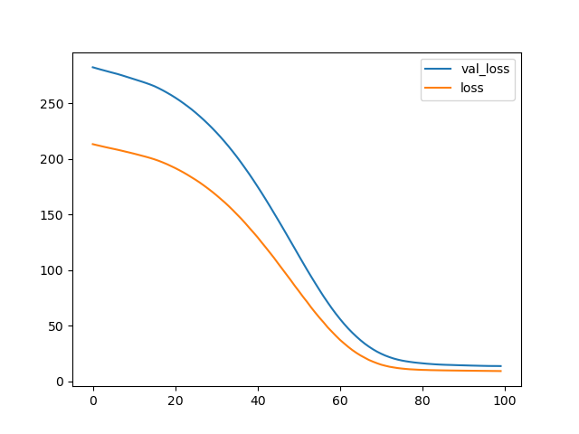
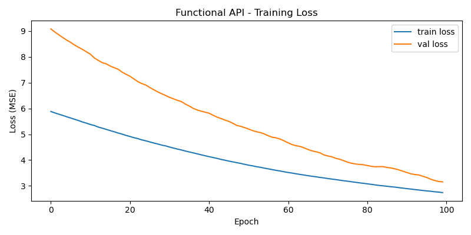
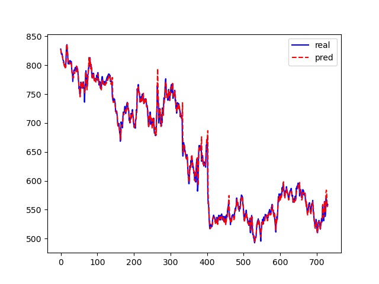
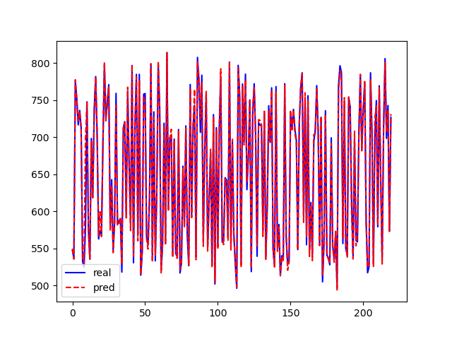
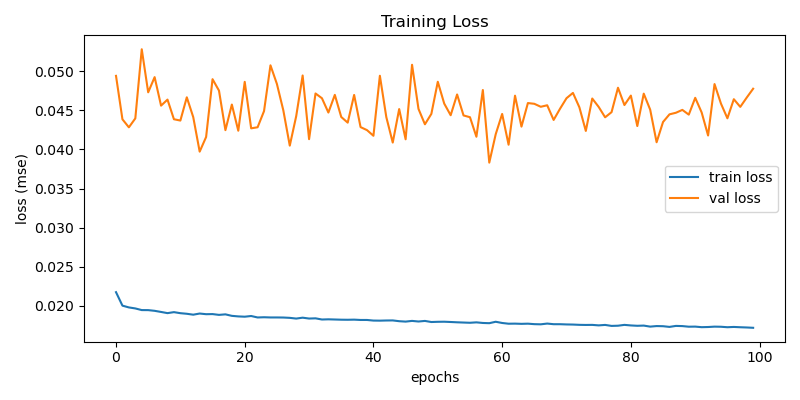
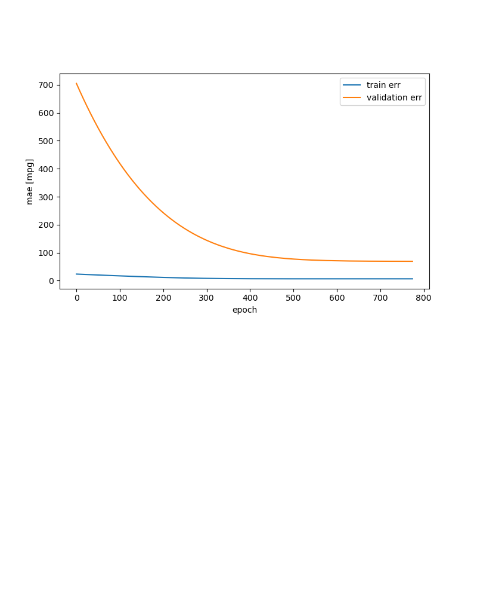
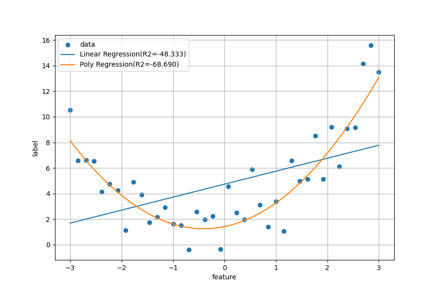

# Day 60_딥러닝 : 다중선형회귀 · TensorBoard · EarlyStopping · 다항회귀

## 📅 2026-04-30

---
# 📄 tf9reg_adver.py — 다중선형회귀 · 정규화 · plot_model · TensorBoard

---

## 📌 개념 정리

### 다중선형회귀 (Multiple Linear Regression)

**입력 변수(x) 여러 개**로 연속형 출력 변수(y)를 예측하는 모델

$$\hat{y} = w_1 x_1 + w_2 x_2 + w_3 x_3 + b$$

|입력 변수|의미|
|---|---|
|`tv`|TV 광고비|
|`radio`|라디오 광고비|
|`newspaper`|신문 광고비|
|`sales`|매출액 (정답, y)|

---

### 정규화 (Normalization)

feature 간 단위/스케일 차이를 **0~1 범위로 맞추는 전처리 작업**

$$X_{scaled} = \frac{X - X_{min}}{X_{max} - X_{min}}$$

- feature 간 단위 차이가 클 경우 → 큰 값의 feature가 학습을 지배
- 정규화로 모든 feature를 동등한 스케일로 맞춰 **학습 안정화**

|방법|수식|결과 범위|
|---|---|---|
|**MinMaxScaler**|$(x - x_{min}) / (x_{max} - x_{min})$|0 ~ 1|
|**StandardScaler**|$(x - \mu) / \sigma$|평균 0, 표준편차 1|

---

### validation_split vs validation_data

|방법|설명|사용 시기|
|---|---|---|
|`validation_split=0.2`|train 데이터 뒤 20%를 자동으로 검증용 분리|간편하게 쓸 때|
|`validation_data=(x_test, y_test)`|검증 데이터를 직접 지정|데이터를 직접 관리할 때|

> `validation_split=0.2` 사용 시 — **shuffle 없이 뒤에서 20%** 를 검증용으로 사용

---

### history.history 키 정리

|키|의미|
|---|---|
|`loss`|epoch별 train 손실|
|`mse`|epoch별 train MSE|
|`val_loss`|epoch별 validation 손실|
|`val_mse`|epoch별 validation MSE|

> `val_` 접두사 = 검증 데이터 기준 — `validation_split` 또는 `validation_data` 사용 시 생성됨

---

### TensorBoard

학습 과정을 **실시간으로 시각화**하는 모니터링 도구

|탭|역할|
|---|---|
|**Scalars**|loss, accuracy 등 수치 변화 그래프|
|**Graphs**|모델 구조(레이어 연결) 시각화|
|**Histograms**|에포크별 가중치/편향 분포 변화|

```bash
# 터미널에서 실행
tensorboard --logdir=logs

# 브라우저 접속
http://localhost:6006
```

> matplotlib은 학습 **끝난 후** 결과만 확인 (정적) / TensorBoard는 학습 **중 실시간** 업데이트 (동적)

---

### 모델 구조 및 파라미터 수

```
입력층  : 특성 3개 (tv, radio, newspaper)
  ↓
은닉층1 : Dense(16) + relu
  ↓
은닉층2 : Dense(8) + relu
  ↓
출력층  : Dense(1) + linear  ← 연속형 값 출력 (회귀)
```

|레이어|계산|파라미터 수|
|---|---|---|
|dense (입력3 → 출력16)|(3+1) × 16|**64**|
|dense_1 (입력16 → 출력8)|(16+1) × 8|**136**|
|dense_2 (입력8 → 출력1)|(8+1) × 1|**9**|
|**합계**||**209**|

---

## 💻 전체 실습 코드

### 데이터 로드 및 준비

```python
import pandas as pd

data = pd.read_csv("https://raw.githubusercontent.com/pykwon/python/refs/heads/master/testdata_utf8/Advertising.csv")
del data['no']   # 불필요한 인덱스 컬럼 제거

# feature(입력)와 label(정답) 분리
fdata = data[['tv', 'radio', 'newspaper']]  # 입력 변수 3개
ldata = data.iloc[:, [3]]                   # sales (4번째 컬럼)
```

---

### 정규화

```python
from sklearn.preprocessing import minmax_scale

# minmax_scale : 함수형으로 바로 사용 (MinMaxScaler 객체 없이 간편하게)
# axis=0  : 열(feature) 기준으로 각 feature를 독립적으로 0~1 변환
# copy=True : 원본 데이터 보존 (fdata 변경 안 됨)
fedata = minmax_scale(fdata, axis=0, copy=True)
```

---

### train / test 분리

```python
from sklearn.model_selection import train_test_split

# stratify : 분류에서 클래스 비율 유지용 → 회귀에서는 사용 안 함
# shuffle=True : 분리 전 데이터 섞기 → 시간 순서 의존성 제거
x_train, x_test, y_train, y_test = train_test_split(
    fedata, ldata,
    shuffle=True,
    test_size=0.3,      # 30%를 테스트용으로 분리
    random_state=123    # 재현성 확보
)
# x_train.shape : (140, 3)  /  x_test.shape : (60, 3)
```

---

### Sequential API 모델

```python
from tensorflow.keras.models import Sequential
from tensorflow.keras.layers import Dense, Input

model = Sequential()
model.add(Input(shape=(3, )))                          # 입력층 : feature 3개
model.add(Dense(units=16, activation='relu'))          # 은닉층1 : 뉴런 16개, 비선형성 추가
model.add(Dense(units=8, activation='relu'))           # 은닉층2 : 뉴런 8개
model.add(Dense(units=1, activation='linear'))         # 출력층 : 회귀 → linear (값 그대로 출력)
print(model.summary())
```

---

### 모델 구조 이미지 저장 (plot_model)

```python
# pip install pydot + graphviz 실행파일 별도 설치 필요
tf.keras.utils.plot_model(
    model,
    to_file='aaa.png',
    show_shapes=True,               # 각 layer의 입력/출력 shape 표시
    show_layer_names=True,          # layer 이름 표시
    show_dtype=True,                # 데이터 타입 표시
    show_layer_activations=True,    # activation 함수 표시
    dpi=96                          # 이미지 해상도
)
```

---

### 컴파일 및 학습

```python
# adam : SGD보다 학습률을 자동으로 조절하는 최적화 알고리즘 → 수렴 빠름
model.compile(optimizer='adam', loss='mse', metrics=['mse'])

# validation_split=0.2 : x_train의 뒤 20%를 자동으로 검증용 분리
# → 매 epoch마다 val_loss, val_mse를 함께 기록해 과적합 여부 모니터링
history = model.fit(
    x_train, y_train,
    epochs=100,
    batch_size=32,
    verbose=2,
    validation_split=0.2
)
```

---

### 평가 및 시각화

```python
import matplotlib.pyplot as plt
from sklearn.metrics import r2_score

ev_loss = model.evaluate(x_test, y_test, verbose=0)
print('ev_loss : ', ev_loss)  # [loss, mse]

# val_loss가 loss보다 높고 계속 올라가면 과적합 신호
plt.plot(history.history['val_loss'], label='val_loss')
plt.plot(history.history['loss'], label='loss')
plt.legend()
plt.show()

print('설명력:', r2_score(y_test, model.predict(x_test)))

pred = model.predict(x_test[:5])
print('예측값 : ', pred.ravel())
print('실제값 : ', y_test[:5].values.ravel())
# 예측값 :  [13.116314  8.639378 16.042656 11.372726 13.549072]
# 실제값 :  [11.4  8.8 14.7 10.1 14.6]
```



> train loss(주황)와 val_loss(파랑) 모두 함께 감소 → 과적합 없이 정상 학습

---

### Functional API 모델

```python
from tensorflow.keras.models import Model
from tensorflow.keras.layers import Input, Dense

# name 인자 : 텐서보드, plot_model에서 레이어 식별에 사용
inputs  = Input(shape=(3, ), name='input_layer')
x       = Dense(units=16, activation='relu', name='hidden_layer1')(inputs)
x       = Dense(units=16, activation='relu', name='hidden_layer2')(x)
outputs = Dense(units=1,  activation='linear', name='output_layer')(x)

# 입력 텐서와 출력 텐서를 연결해 모델 생성
func_model = Model(inputs, outputs)

func_model.compile(optimizer='adam', loss='mse', metrics=['mse'])
history = func_model.fit(
    x_train, y_train,
    epochs=100, batch_size=32, verbose=2,
    validation_split=0.2
)
```

---

### TensorBoard 설정 및 적용

```python
import datetime
from tensorflow.keras.callbacks import TensorBoard

# 실행할 때마다 타임스탬프 폴더 생성 → 여러 실행 결과를 한 화면에서 비교 가능
log_dir = "logs/" + datetime.datetime.now().strftime("%Y%m%d-%H%M%S")

tb_callback = TensorBoard(
    log_dir=log_dir,
    histogram_freq=1,   # 에포크마다 가중치 히스토그램 기록
    write_graph=True,   # 모델 그래프 기록
)

# callbacks : 학습 중 특정 시점에 자동으로 실행되는 함수 목록
# TensorBoard 외에도 EarlyStopping, ModelCheckpoint 등을 함께 넣을 수 있음
history2 = func_model.fit(
    x_train, y_train,
    epochs=100,
    batch_size=32,
    verbose=2,
    validation_split=0.2,
    callbacks=[tb_callback]   # 학습 중 TensorBoard 로그 자동 기록
)
```

```python
# Sequential 모델도 별도 폴더에 로그 저장 → TensorBoard에서 두 모델 비교 가능
log_dir_seq = "logs/sequential_" + datetime.datetime.now().strftime("%Y%m%d-%H%M%S")
tb_seq = TensorBoard(log_dir=log_dir_seq, histogram_freq=1)

history_seq = model.fit(
    x_train, y_train,
    epochs=100, batch_size=32, verbose=0,
    validation_split=0.2,
    callbacks=[tb_seq]
)
```

---

### Functional API loss 시각화

```python
plt.figure(figsize=(8, 4))
plt.plot(history2.history['loss'], label='train loss')
plt.plot(history2.history['val_loss'], label='val loss')
plt.title('Functional API - Training Loss')
plt.xlabel('Epoch')
plt.ylabel('Loss (MSE)')
plt.legend()
plt.tight_layout()
plt.show()

pred2 = func_model.predict(x_test)
print('func_model 설명력(R²):', r2_score(y_test, pred2))
```



> train loss와 val_loss 모두 epoch가 지날수록 감소 → 수렴 중  
> val_loss가 train_loss보다 높은 것은 정상 (학습에 쓰지 않은 데이터이므로)

---

### TensorBoard 실행 결과


> 왼쪽 패널 : 실행별 run 목록 (타임스탬프 + train/validation 구분)  
> 중앙 : epoch_learning_rate, epoch_loss 등 수치 변화를 실시간 그래프로 비교  
> 여러 실행을 겹쳐서 보여주므로 Sequential vs Functional 모델 성능 한눈에 비교 가능

```bash
# 터미널에서 실행 (파이썬 실행은 유지한 채 새 터미널에서)
cd C:\work\projects\pro11deepltf
tensorboard --logdir=logs

# 브라우저 주소창에 직접 입력
http://localhost:6006
```

---

## 📌 과적합 판단 기준

|상황|의미|대응|
|---|---|---|
|train loss ↓ / val_loss ↓ 함께 감소|정상 학습|유지|
|train loss ↓ / val_loss → 수렴|학습 완료|Early Stopping 고려|
|train loss ↓ / val_loss ↑ 반대로 증가|**과적합**|Dropout, 데이터 증강, Early Stopping|

---

## 🔑 핵심 포인트

> **다중선형회귀** = 입력 변수 여러 개 → 연속형 출력 예측, 출력층 `linear` / 손실함수 `mse`  
> **정규화** = feature 간 스케일 차이 제거 → 학습 안정화, `minmax_scale`로 0~1 변환  
> **validation_split=0.2** = train 데이터 뒤 20% 자동 검증용 분리 — shuffle 없이 뒤에서 자름  
> **plot_model** = 모델 구조를 이미지로 저장 — graphviz + pydot 설치 필요  
> **TensorBoard** = 학습 중 실시간 모니터링 — 타임스탬프 폴더로 여러 실험 비교 가능  
> **val_loss 증가** = 과적합 신호 → Early Stopping, Dropout 고려  
> `history.history` = epoch별 loss/mse/val_loss/val_mse 딕셔너리 — 학습 곡선 그릴 때 사용

---
# 📄 tf10stock.py — 주식 데이터 다중선형회귀 · 전날로 다음날 종가 예측

---

## 📌 개념 정리

### 실습 목표

주식 데이터에서 **전날의 Open·High·Low·Close** 4개 feature로  
**다음날 종가(Close)** 를 예측하는 다중선형회귀 모델 작성

|컬럼|의미|
|---|---|
|Open|시가 (당일 시작 가격)|
|High|고가 (당일 최고 가격)|
|Low|저가 (당일 최저 가격)|
|Close|**종가 (당일 마감 가격) ← 예측 대상(y)**|

---

### 시계열 데이터에서 x, y를 한 칸씩 어긋나게 맞추는 이유

```
날짜     Open  High  Low  Close
day1      →  feature(x)로 사용
day2                        →  label(y)로 사용  ← day1 데이터로 day2 종가 예측
day3                        →  label(y)로 사용  ← day2 데이터로 day3 종가 예측
...
```

- `x_data[0]` = 1일차 feature → `y_data[0]` = 2일차 종가
- `x_data[1]` = 2일차 feature → `y_data[1]` = 3일차 종가
- 마지막 행 x, 첫 행 y는 쌍이 없으므로 각각 삭제

---

### MinMaxScaler 정규화

$$X_{scaled} = \frac{X - X_{min}}{X_{max} - X_{min}}$$

- 주식 데이터는 Open, High, Low, Close가 비슷한 범위지만 정규화로 학습 안정화
- **x_data만 정규화** — y_data(종가)는 원래 단위로 예측해야 하므로 정규화 안 함

---

### 딥러닝의 이슈 : 최적화 vs 일반화

|개념|의미|
|---|---|
|**최적화 (Optimization)**|train 데이터에서 loss를 최소화하는 것|
|**일반화 (Generalization)**|새로운 데이터(test)에서도 좋은 성능을 내는 것|
|**과적합 (Overfitting)**|train 성능은 높지만 test 성능이 낮은 상태|

> train/test split 없이 학습 → R² **0.9939** (과적합 위험)  
> train/test split 후 학습 → test R² **0.9894** (일반화 성능 확인)  
> 두 값이 비슷하면 일반화 양호, test R²가 크게 낮으면 과적합

---

### np.loadtxt 주의사항

```python
# CSV 파일 읽을 때 반드시 두 가지 지정 필요
np.loadtxt(path,
    delimiter=',',   # CSV는 쉼표 구분자 명시 (기본값은 공백)
    skiprows=1       # 첫 줄 헤더(Open, High, Low, Close) 건너뜀
)
```

---

## 💻 전체 실습 코드

### 데이터 로드 및 전처리

```python
import numpy as np
import matplotlib.pyplot as plt
from sklearn.preprocessing import MinMaxScaler

# delimiter=',' : CSV 구분자 명시
# skiprows=1    : 첫 줄 헤더(Open, High, Low, Close, Volume) 건너뜀
datas = np.loadtxt(
    "https://raw.githubusercontent.com/pykwon/python/refs/heads/master/testdata_utf8/stockdaily.csv",
    delimiter=',',
    skiprows=1
)
print(datas[:2], datas.shape)   # (732, 5)

# ── feature 준비 ──
# 마지막 열(Close) 제외한 4개 컬럼 : Open, High, Low, Volume
x_data = datas[:, 0:-1]
print(x_data.shape)             # (732, 4)

# x_data만 정규화 (y는 원래 단위로 예측해야 하므로 정규화 안 함)
scaler = MinMaxScaler(feature_range=(0, 1))
x_data = scaler.fit_transform(x_data)  # fit(min/max 계산) + transform(0~1 변환) 동시 수행

# ── label 준비 ──
y_data = datas[:, [-1]]     # 종가(Close) 열만 추출, shape : (732, 1)

print(x_data[0], y_data[0])    # day1 feature, day1 close
print(x_data[1], y_data[1])    # day2 feature, day2 close

# ── 한 칸씩 어긋나게 맞추기 ──
# "전날 feature → 다음날 종가" 구조로 맞추기 위해
# x_data : 마지막 행 삭제 (day732 feature는 예측할 day733이 없음)
# y_data : 첫 번째 행 삭제 (day1 종가는 이전 날 데이터가 없음)
x_data = np.delete(x_data, -1, axis=0)  # (732,4) → (731,4)
y_data = np.delete(y_data, 0)           # (732,1) → (731,)  1차원으로 변환됨

print(x_data[0], y_data[0])   # day1 feature → day2 close 로 쌍이 맞춰짐
```

---

### 모델1 — train/test split 없이

```python
from tensorflow.keras.models import Sequential
from tensorflow.keras.layers import Dense, Input

print('train / test split 없이 모델 작성')

model = Sequential()
model.add(Input(shape=(4, )))               # 입력 feature 4개 (Open, High, Low, Volume)
model.add(Dense(units=1, activation='linear'))  # 출력층만 있는 단순 선형회귀 구조

# sgd : 확률적 경사하강법 — 단순 모델에 적합
model.compile(loss='mse', optimizer='sgd', metrics=['mse'])

# verbose=0 : 학습 로그 출력 안 함
model.fit(x_data, y_data, epochs=200, verbose=0)
print('evaluate result:', model.evaluate(x_data, y_data, verbose=0))
# [62.32, 62.32] → MSE 62.32 (종가 단위이므로 약 ±7.9원 오차)

from sklearn.metrics import r2_score
pred = model.predict(x_data)
print('train / test split 없이 설명력 : ', r2_score(y_data, pred))
# 0.9939 → 전체 분산의 99.39% 설명 (train 데이터 전체로 학습했으므로 높게 나옴)

plt.plot(y_data, 'b', label='real')
plt.plot(pred, 'r--', label='pred')
plt.legend()
plt.show()
```



> 실제값(파랑)과 예측값(빨강 점선)이 거의 일치 → R² 0.9939  
> 단, train 데이터 전체로 학습했으므로 과적합 여부는 알 수 없음

---

### 모델2 — train/test split 후

```python
from sklearn.model_selection import train_test_split

print('train / test split을 한 모델 작성')

# 주식은 시계열 데이터지만 여기서는 단순 비교를 위해 랜덤 split 사용
# 실제 시계열 모델에서는 앞부분을 train, 뒷부분을 test로 순서대로 분리해야 함
x_train, x_test, y_train, y_test = train_test_split(
    x_data, y_data,
    test_size=0.3,       # 30%를 테스트용 (약 220개)
    random_state=123     # 재현성 확보
)
print(x_train.shape, x_test.shape)  # (511, 4)  (220, 4)

model2 = Sequential()
model2.add(Input(shape=(4, )))
model2.add(Dense(units=1, activation='linear'))

model2.compile(loss='mse', optimizer='sgd', metrics=['mse'])
model2.fit(x_train, y_train, epochs=200, verbose=0)

print('evaluate result:', model2.evaluate(x_test, y_test, verbose=0))
# [99.89, 99.89] → test MSE가 모델1보다 높음 (학습에 쓰지 않은 데이터이므로 당연)

pred2 = model2.predict(x_test)
print('train / test split 설명력 : ', r2_score(y_test, pred2))
# 0.9894 → 모델1(0.9939)과 크게 차이 없음 → 일반화 양호

# y_test는 랜덤 split 된 상태라 시간 순서가 섞여 있어 그래프가 복잡하게 보임
plt.plot(y_test, 'b', label='real')
plt.plot(pred2, 'r--', label='pred')
plt.legend()
plt.show()
```



> 랜덤 split으로 시간 순서가 섞여 그래프가 복잡해 보이지만 R² 0.9894로 성능 양호  
> 모델1(0.9939) vs 모델2(0.9894) — 차이가 작으므로 과적합 없이 일반화 잘 됨

---

## 📌 모델 비교 결과

|구분|MSE|R²|특징|
|---|---|---|---|
|split 없음 (모델1)|62.32|**0.9939**|train 전체로 학습 → 과적합 여부 불명확|
|split 있음 (모델2)|99.89|**0.9894**|test 성능 확인 가능 → 일반화 검증|

> 두 R² 값의 차이(0.0045)가 매우 작음 → **일반화 양호**

---

## 📌 딥러닝의 핵심 이슈

```
최적화 (Optimization)
  → train loss를 최소화
  → 모델이 train 데이터를 얼마나 잘 외웠는가

일반화 (Generalization)
  → test에서도 좋은 성능
  → 모델이 새로운 데이터에도 통하는가

과적합 (Overfitting)
  → train R² >> test R²
  → 해결 : Dropout, 데이터 증강, Early Stopping, 정규화
```

---

## 🔑 핵심 포인트

> **시계열 전처리** = `np.delete`로 x, y를 한 칸씩 어긋나게 맞춰 "전날→다음날" 쌍 구성  
> **x만 정규화** = y(종가)는 원래 단위로 예측해야 하므로 스케일 변환 안 함  
> **skiprows=1** = CSV 헤더 행(Open, High, Low...) 건너뛰기  
> **split 없음 vs split 있음** = R² 차이가 작으면 일반화 양호, 크면 과적합  
> **최적화 vs 일반화** = 딥러닝의 핵심 트레이드오프 — train 성능만 보면 안 됨  
> `np.delete(arr, -1, axis=0)` = 마지막 행 삭제 / `np.delete(arr, 0)` = 첫 번째 원소 삭제

---
# 📄 tf10quiz.py — 자전거 대여횟수 예측 · 다중선형회귀 실습 문제

---

## 📌 개념 정리

### 실습 목표

자전거 공유 시스템 데이터(`train.csv`)를 이용해  
**대여횟수(count)에 영향을 주는 변수**를 선택하고 다중선형회귀 모델 작성

---

### 데이터 컬럼 설명

|컬럼|의미|사용 여부|
|---|---|---|
|datetime|날짜/시간 (문자열)|❌ 제외 — 문자열이라 수치 연산 불가|
|season|계절 (1=봄 2=여름 3=가을 4=겨울)|✅ feature|
|holiday|공휴일 여부 (0/1)|✅ feature|
|workingday|근무일 여부 (0/1)|✅ feature|
|weather|날씨 (1=맑음 2=흐림 3=눈/비)|✅ feature|
|temp|기온 (°C)|✅ feature|
|atemp|체감온도 (°C)|✅ feature|
|humidity|습도 (%)|✅ feature|
|windspeed|풍속|✅ feature|
|casual|비회원 대여수|❌ 제외 — **데이터 누수**|
|registered|회원 대여수|❌ 제외 — **데이터 누수**|
|count|총 대여횟수 (casual + registered)|✅ **label (y)**|

---

### 🚨 데이터 누수 (Data Leakage)

```
casual + registered = count   ← count의 구성 요소

만약 casual, registered를 feature로 포함하면?
  → 정답(count)을 미리 알려주고 맞히는 것과 같음
  → 모델이 실제로 학습한 게 아니라 '치팅'한 상태
  → 현실 데이터에서는 casual, registered를 알 수 없음
  → 반드시 제거
```

> 데이터 누수 = **미래 정보나 정답 정보가 feature에 섞이는 것** — 모델 신뢰도 붕괴

---

### x와 y를 각각 별도 스케일러로 정규화하는 이유

```python
scaler_x = MinMaxScaler()   # x 전용
scaler_y = MinMaxScaler()   # y 전용 ← 반드시 분리
```

- 나중에 예측값을 **원래 대여횟수 단위로 복원(inverse_transform)** 할 때  
    y 전용 스케일러가 필요하기 때문
- x와 y를 같은 스케일러로 fit하면 x의 min/max가 섞여서 **y 복원 불가능**

```
학습 흐름
  xdata (원본) → scaler_x.fit_transform → x_scaled (0~1)
  ydata (원본) → scaler_y.fit_transform → y_scaled (0~1)
        ↓
  모델 학습 (0~1 스케일에서 학습)
        ↓
  예측값 (0~1 스케일) → scaler_y.inverse_transform → 원래 대여횟수
```

---

### 모델 구조

```
입력층  : feature 8개
  ↓
은닉층1 : Dense(64) + relu
  ↓
은닉층2 : Dense(32) + relu
  ↓
출력층  : Dense(1) + linear  ← 연속형 값 출력 (회귀)
```

|레이어|계산|파라미터 수|
|---|---|---|
|dense (입력8 → 출력64)|(8+1) × 64|**576**|
|dense_1 (입력64 → 출력32)|(64+1) × 32|**2,080**|
|dense_2 (입력32 → 출력1)|(32+1) × 1|**33**|
|**합계**||**2,689**|

---

### scaler.transform vs scaler.fit_transform

|메서드|동작|사용 시점|
|---|---|---|
|`fit_transform(data)`|min/max 계산 + 변환 동시 수행|**train 데이터**|
|`transform(data)`|이미 계산된 min/max로만 변환|**새 데이터 예측 시**|

> 새 입력값 예측 시 `scaler_x.transform(new_data)` 사용  
> `fit_transform` 쓰면 새 데이터 기준으로 min/max가 재계산되어 기존 스케일과 달라짐 → 오류

---

## 💻 전체 실습 코드

### 데이터 로드 및 변수 선택

```python
import pandas as pd
import numpy as np

data = pd.read_csv("https://raw.githubusercontent.com/pykwon/python/refs/heads/master/data/train.csv")
print(data.head(5), data.shape)  # (10886, 12)

# casual, registered : count의 구성 요소 → 데이터 누수 → 반드시 제외
# datetime : 문자열 → 수치 연산 불가 → 제외
feature_cols = ['season', 'holiday', 'workingday', 'weather', 'temp', 'atemp', 'humidity', 'windspeed']
xdata = data[feature_cols].values           # numpy 배열로 변환
ydata = data['count'].values.reshape(-1, 1) # (10886,) → (10886, 1) 2차원으로

print('xdata shape:', xdata.shape, 'ydata shape:', ydata.shape)
# xdata shape: (10886, 8)  ydata shape: (10886, 1)
```

---

### 정규화

```python
from sklearn.preprocessing import MinMaxScaler

# x와 y를 반드시 별도 스케일러로 생성
# → 나중에 scaler_y.inverse_transform()으로 예측값을 원래 단위(대여횟수)로 복원해야 함
scaler_x = MinMaxScaler()
scaler_y = MinMaxScaler()

x_scaled = scaler_x.fit_transform(xdata)   # x : fit(min/max 학습) + transform(0~1 변환)
y_scaled = scaler_y.fit_transform(ydata)   # y : fit(min/max 학습) + transform(0~1 변환)
```

---

### 모델 구성 및 학습

```python
from tensorflow.keras.models import Sequential
from tensorflow.keras.layers import Dense, Input
from tensorflow.keras import optimizers

model = Sequential()
model.add(Input((len(feature_cols),)))          # 입력 : feature 8개
model.add(Dense(units=64, activation='relu'))   # 은닉층1 : 뉴런 64개
model.add(Dense(units=32, activation='relu'))   # 은닉층2 : 뉴런 32개
model.add(Dense(units=1, activation='linear'))  # 출력층 : 연속형 값 (회귀)
print(model.summary())

# Adam : SGD보다 학습률 자동 조절 → 수렴 빠름, 대용량 데이터에 적합
opti = optimizers.Adam(learning_rate=0.001)
model.compile(loss='mse', optimizer=opti, metrics=['mse'])

# validation_split=0.2 : train 데이터 뒤 20%를 검증용으로 자동 분리
# batch_size=32 : 32개 샘플씩 묶어서 가중치 업데이트 (Mini-batch Gradient Descent)
history = model.fit(
    x=x_scaled, y=y_scaled,
    batch_size=32,
    epochs=100,
    verbose=2,
    validation_split=0.2
)
```

---

### loss 시각화

```python
import matplotlib.pyplot as plt

plt.figure(figsize=(8, 4))
plt.plot(history.history['loss'], label='train loss')
plt.plot(history.history['val_loss'], label='val loss')
plt.title('Training Loss')
plt.xlabel('epochs')
plt.ylabel('loss (mse)')
plt.legend()
plt.tight_layout()
plt.show()
# train loss와 val_loss가 함께 감소하면 정상 학습
# val_loss가 올라가기 시작하면 과적합 신호
```



> train loss(파랑) : 0.021 → 0.018 수준으로 안정적으로 수렴  
> val loss(주황) : 0.044~0.052 사이에서 진동 — train보다 높지만 발산하지 않음  
> 두 loss의 격차가 유지되는 것은 정상 (학습에 쓰지 않은 검증 데이터이므로)  
> val loss가 진동하는 이유 : 검증 데이터(2177개)가 상대적으로 작아 배치마다 변동

---

### 설명력(R²) 출력

```python
from sklearn.metrics import r2_score

# 모델은 0~1 스케일로 예측 → 원래 대여횟수 단위로 복원 필요
ypred_scaled = model.predict(x_scaled, verbose=0)           # 0~1 스케일 예측값
ypred = scaler_y.inverse_transform(ypred_scaled)            # 원래 대여횟수로 복원

print('설명력(R²):', r2_score(ydata, ypred))                # ydata는 원본 단위와 비교
print('실제값 샘플:', ydata[:5].ravel())
print('예측값 샘플:', ypred[:5].ravel().astype(int))        # 소수점 제거해서 정수로 출력
```

---

### 새로운 데이터 입력 및 예측

```python
print('\n----- 새로운 데이터 예측 -----')
print('입력 항목: season, holiday, workingday, weather, temp, atemp, humidity, windspeed')
print('  season: 1=봄 2=여름 3=가을 4=겨울')
print('  holiday/workingday: 0 또는 1')
print('  weather: 1=맑음 2=흐림 3=눈/비')
print('  예시: 2, 0, 1, 1, 25.0, 28.0, 50, 10.0')

vals = input('값을 쉼표로 구분하여 입력하세요: ')

# 입력 문자열을 float 리스트로 변환 후 (1, 8) 배열로 reshape
new_data = np.array([float(v.strip()) for v in vals.split(',')]).reshape(1, -1)

# 반드시 transform만 사용 (fit_transform 쓰면 학습 시 기준과 달라짐)
new_scaled = scaler_x.transform(new_data)

new_pred_scaled = model.predict(new_scaled, verbose=0)

# 예측값도 반드시 scaler_y로 역변환해야 실제 대여횟수 단위로 복원됨
new_pred = scaler_y.inverse_transform(new_pred_scaled)
print(f'예측 대여횟수: {new_pred[0][0]:.0f}회')
```

---

## 📌 전체 데이터 흐름 요약

```
원본 xdata (8개 feature)
  → scaler_x.fit_transform() → x_scaled (0~1)
  → 모델 학습

원본 ydata (대여횟수)
  → scaler_y.fit_transform() → y_scaled (0~1)
  → 모델 학습

예측 시
  새 입력값 → scaler_x.transform() → 스케일 변환
  → model.predict() → 0~1 예측값
  → scaler_y.inverse_transform() → 실제 대여횟수 복원
```

---

## 🔑 핵심 포인트

> **데이터 누수** = casual, registered는 count의 구성 요소 → 학습에 포함하면 치팅 → 반드시 제거  
> **x, y 스케일러 분리** = 예측 후 `scaler_y.inverse_transform()`으로 원래 단위 복원하기 위해  
> **transform vs fit_transform** = 새 데이터 예측 시 반드시 `transform`만 사용 (fit 재실행 금지)  
> **Adam optimizer** = 학습률 자동 조절 → SGD보다 수렴 빠름, 대용량 데이터에 적합  
> **batch_size=32** = 32개씩 묶어서 가중치 업데이트 (Mini-batch GD) — 속도와 안정성 균형  
> **inverse_transform** = 0~1 스케일 예측값을 원래 단위(대여횟수)로 복원하는 필수 단계

---
# 📄 tf11autompg.py — 자동차 연비 예측 · 표준화 · EarlyStopping

---

## 📌 개념 정리

### 실습 목표

자동차 데이터(`auto-mpg.csv`)에서 변수를 선택해  
**연비(mpg, Miles Per Gallon)** 를 예측하는 다중선형회귀 모델 작성

- **조기종료(EarlyStopping)** 로 불필요한 학습 방지

---

### 사용 변수 선택

|컬럼|의미|사용 여부|
|---|---|---|
|mpg|연비 (Miles Per Gallon)|✅ **label (y)**|
|cylinders|실린더 수|❌ 제거 — displacement와 중복|
|displacement|배기량|✅ feature|
|horsepower|마력|✅ feature|
|weight|차량 무게|✅ feature|
|acceleration|가속도|❌ 제거 — 연비와 상관 낮음|
|model year|연식|❌ 제거 — 시계열 요소|
|origin|제조국|❌ 제거 — 범주형 (인코딩 필요)|
|car name|차량명|❌ 제거 — 문자열|

> pairplot으로 확인 시 displacement, horsepower, weight가 mpg와 강한 음의 상관관계

---

### 정규화 vs 표준화

|방법|수식|결과 범위|특징|
|---|---|---|---|
|**정규화 (MinMax)**|$(x - x_{min}) / (x_{max} - x_{min})$|0 ~ 1|이상치에 민감|
|**표준화 (StandardScaler)**|$(x - \mu) / \sigma$|평균 0, 표준편차 1|이상치에 강건, 정규분포 가정|

이 실습에서는 **표준화** 사용 — train 데이터의 mean/std로 직접 계산

```python
# train 통계량 기준으로 표준화 (test에도 동일 기준 적용)
def stdscale_func(x):
    return (x - train_stat['mean']) / train_stat['std']
```

> **핵심** : test 데이터도 train의 mean/std로 변환해야 함  
> test 자체의 통계량을 쓰면 train과 스케일이 달라져서 예측 왜곡

---

### train_stat.describe() → transpose() 이유

```python
train_stat = train_dataset.describe()
# describe() 결과 : 행=통계량(count, mean, std...), 열=컬럼명
#           displacement  horsepower  weight
# count        274.0        274.0     274.0
# mean         196.5        105.1    2978.0
# std          104.3         38.4     849.0

train_stat = train_stat.transpose()
# transpose() 후 : 행=컬럼명, 열=통계량
#                count   mean    std  ...
# displacement   274.0  196.5  104.3
# horsepower     274.0  105.1   38.4

# → train_stat['mean'], train_stat['std']로 각 컬럼의 통계량에 접근 가능
```

---

### EarlyStopping (조기종료)

**validation loss가 더 이상 개선되지 않으면 학습을 자동으로 중단**하는 콜백

```
epochs=5000으로 설정했지만 실제로는 훨씬 적은 epoch에서 멈춤
  → 불필요한 학습 방지
  → 과적합 시점 이전에 자동 중단
```

|파라미터|의미|
|---|---|
|`monitor='val_loss'`|검증 손실을 기준으로 모니터링|
|`patience=5`|5 epoch 연속 개선 없으면 학습 중단|
|`restore_best_weights=True`|중단 시점이 아닌 **가장 좋았던 epoch의 가중치** 복원|

> `restore_best_weights=True` 를 쓰지 않으면 마지막 epoch(성능이 나빠진 상태)의 가중치를 사용하게 됨

---

### sample() vs train_test_split()

```python
# pandas .sample() 방식
train_dataset = datas.sample(frac=0.7, random_state=123)  # 70% 랜덤 샘플
test_dataset  = datas.drop(train_dataset.index)            # 나머지 30%

# sklearn train_test_split 방식과 결과는 동일
# pandas에서 직접 분리할 때 .sample() + .drop() 조합을 자주 사용
```

---

### build_model() 함수로 모델 생성하는 이유

```python
def build_model():
    ...
    return network
```

- 모델을 함수로 감싸면 **여러 번 동일한 구조의 모델을 쉽게 재생성** 가능
- 하이퍼파라미터 튜닝 시 반복 실험에 유리
- EarlyStopping, 교차검증 등과 함께 쓸 때 초기화가 간편

---

## 💻 전체 실습 코드

### 데이터 로드 및 전처리

```python
import pandas as pd
import numpy as np

datas = pd.read_csv("https://raw.githubusercontent.com/pykwon/python/refs/heads/master/testdata_utf8/auto-mpg.csv")
print(datas.head(2))
print(datas.info())

del datas['car name']       # 문자열 컬럼 제거
datas = datas.dropna()      # 결측값 제거 (horsepower에 '?' 등 존재)
print(datas.isna().sum)     # 결측값 확인 (0이어야 정상)

# 연비(mpg)와 상관관계가 낮거나 중복되는 컬럼 제거
datas.drop(['cylinders', 'acceleration', 'model year', 'origin'], axis='columns', inplace=True)
print(datas.head(2))
# 남은 컬럼 : mpg, displacement, horsepower, weight
```

---

### train / test 분리

```python
# pandas .sample() : DataFrame에서 frac 비율만큼 랜덤 샘플링
train_dataset = datas.sample(frac=0.7, random_state=123)    # 70% → train (274행)
print(train_dataset.shape)   # (274, 4)

# train으로 뽑힌 인덱스를 제외한 나머지 → test
test_dataset = datas.drop(train_dataset.index)
print(test_dataset.shape)    # (118, 4)
```

---

### 표준화 (train 통계량 기준)

```python
# describe() : count, mean, std, min, 25%, 50%, 75%, max 계산
train_stat = train_dataset.describe()
train_stat.pop('mpg')           # label(mpg)은 표준화 대상 아님 → 제거
train_stat = train_stat.transpose()  # 행/열 전치 → train_stat['mean'], train_stat['std'] 접근 가능

# 표준화 함수 정의 : (값 - 평균) / 표준편차
# train의 mean, std를 기준으로 → test에도 동일하게 적용해야 스케일 일관성 유지
def stdscale_func(x):
    return (x - train_stat['mean']) / train_stat['std']

# train 표준화 후 label(mpg) 제거
st_train_data = stdscale_func(train_dataset)
st_train_data = st_train_data.drop(['mpg'], axis='columns')  # feature만 남김

# test도 train 기준 통계량으로 표준화 (test 자체 통계량 사용 금지)
st_test_data = stdscale_func(test_dataset)
st_test_data = st_test_data.drop(['mpg'], axis='columns')

# label 분리
train_label = train_dataset.pop('mpg')   # train 정답값
test_label  = test_dataset.pop('mpg')    # test 정답값
```

---

### 모델 정의 및 EarlyStopping

```python
import tensorflow as tf

def build_model():
    # Sequential 리스트 방식으로 한 번에 레이어 구성
    network = Sequential([
        Input(shape=(3, )),                                    # 입력 : feature 3개
        Dense(units=32, activation='relu'),                    # 은닉층1
        Dense(units=16, activation='relu'),                    # 은닉층2
        Dense(units=1,  activation='linear'),                  # 출력층 : 연속형 값 (회귀)
    ])
    opti = tf.keras.optimizers.Adam(learning_rate=0.01)
    network.compile(
        optimizer=opti,
        loss='mean_squared_error',
        metrics=['mean_squared_error', 'mean_absolute_error']  # MSE와 MAE 동시 기록
    )
    return network

model = build_model()
print(model.summary())

EPOCHS = 5000   # 최대 epoch 수 — EarlyStopping이 실제 중단 시점 결정

# EarlyStopping : val_loss가 patience 동안 개선 없으면 자동 중단
early_stop = tf.keras.callbacks.EarlyStopping(
    monitor='val_loss',         # 검증 손실 기준으로 모니터링
    patience=5,                 # 5 epoch 연속 개선 없으면 중단
    restore_best_weights=True   # 가장 성능 좋았던 epoch의 가중치 복원
)

history = model.fit(
    x=st_train_data,
    y=train_label,
    batch_size=32,
    epochs=EPOCHS,
    verbose=2,
    validation_split=0.2,       # train의 20%를 검증용으로 자동 분리
    callbacks=[early_stop]      # 콜백 목록에 EarlyStopping 등록
)

# 실제 학습된 epoch 수 확인 (5000보다 훨씬 적게 멈춤)
print(f'실제 학습 epoch 수 : {len(history.history["loss"])}')
```

---

### 학습 정보 시각화

```python
df = pd.DataFrame(history.history)
print(df.head(3))

def plt_history(df):
    hist = df
    hist['epoch'] = history.epoch  # epoch 번호를 컬럼으로 추가

    plt.figure(figsize=(8, 14))
    plt.subplot(2, 1, 1)
    plt.xlabel('epoch')
    plt.ylabel('mae [mpg]')
    # train MAE : 학습 데이터 오차
    plt.plot(hist['epoch'], hist['mean_absolute_error'], label='train err')
    # validation MAE : 검증 데이터 오차 (val_mean_absolute_error 사용)
    plt.plot(hist['epoch'], hist['val_mean_absolute_error'], label='validation err')
    plt.legend()
    plt.show()

plt_history(df)
```



> train err(파랑)는 빠르게 수렴 / validation err(주황)는 초반 급감 후 천천히 수렴  
> EarlyStopping으로 약 780 epoch에서 자동 중단 — 5000까지 학습하지 않음  
> train과 validation의 격차가 크지 않으면 과적합 없이 학습 완료

---

### 모델 평가 및 새 값 예측

```python
from sklearn.metrics import r2_score

# test 데이터로 최종 평가
loss, mse, mae = model.evaluate(st_test_data, test_label)
print(f'loss : {loss:.3f}')   # MSE
print(f'mse  : {mse:.3f}')    # MSE (loss와 동일)
print(f'mae  : {mae:.3f}')    # MAE (평균 절대 오차 — 단위: mpg)
print('결정계수(R²) : ', r2_score(test_label, model.predict(st_test_data)))

# 새로운 자동차 데이터로 연비 예측
new_data = pd.DataFrame({
    'displacement': [300, 400],
    'horsepower':   [120, 150],
    'weight':       [2000, 4000]
})

# 반드시 train 기준 통계량(train_stat)으로 표준화 — 학습 시와 동일한 스케일 적용
new_st_data = stdscale_func(new_data)

new_data_pred = model.predict(new_st_data).ravel()  # .ravel() : 2차원 → 1차원
print('새 값 예측결과(mpg) : ', new_data_pred)
# 배기량 300, 마력 120, 무게 2000 → 연비 높을 것
# 배기량 400, 마력 150, 무게 4000 → 연비 낮을 것 (무거울수록 연비 낮음)
```

---

## 📌 EarlyStopping 동작 흐름

```
epoch 1   val_loss = 50.0  ← 최저
epoch 2   val_loss = 48.0  ← 최저 갱신
epoch 3   val_loss = 47.5  ← 최저 갱신
epoch 4   val_loss = 47.6  (개선 없음, patience 카운트 1)
epoch 5   val_loss = 47.8  (개선 없음, patience 카운트 2)
epoch 6   val_loss = 47.9  (개선 없음, patience 카운트 3)
epoch 7   val_loss = 48.1  (개선 없음, patience 카운트 4)
epoch 8   val_loss = 48.3  (개선 없음, patience 카운트 5) → 학습 중단!

restore_best_weights=True → epoch 3의 가중치로 복원
```

---

## 🔑 핵심 포인트

> **표준화** = $(x - \mu) / \sigma$ — 평균 0, 표준편차 1 / 이상치에 강건  
> **train 통계량 기준** = test, 새 데이터도 train의 mean/std로 변환 (스케일 일관성)  
> **describe().transpose()** = 컬럼별 통계량에 `['mean']`, `['std']`로 접근하기 위한 전치  
> **EarlyStopping** = patience 동안 val_loss 개선 없으면 자동 중단 — 과적합 방지  
> **restore_best_weights=True** = 학습 중 가장 좋았던 가중치 자동 복원 (필수 권장)  
> **build_model() 함수화** = 동일 구조 모델을 여러 번 초기화할 때 편리  
> **MAE** = 평균 절대 오차 — 단위가 mpg이므로 직관적 해석 가능 (MSE보다 해석 쉬움)

---
# 📄 tf12poly.py — 다항회귀 · 비선형 데이터 적합

---

## 📌 개념 정리

### 다항회귀 (Polynomial Regression)란?

데이터가 **비선형 분포**일 때 직선(선형회귀)으로는 잘 맞지 않음  
→ feature에 **거듭제곱 항을 추가**해 곡선으로 회귀선을 만드는 방법

```
선형회귀  : y = w₁x + b                  → 직선
2차 다항  : y = w₁x + w₂x² + b           → 포물선
3차 다항  : y = w₁x + w₂x² + w₃x³ + b   → S자 곡선
```

> **핵심** : 모델 자체는 여전히 선형회귀  
> feature를 `[x]` → `[x, x²]` 로 확장할 뿐, 내부 연산은 똑같이 선형 결합

---

### 이 실습의 실제 데이터 생성 공식

$$y = x^2 + x + 2 + \text{noise}$$

- 데이터가 **포물선(2차 함수)** 형태
- 선형회귀 직선으로는 이 곡선을 표현할 수 없음
- 2차 다항회귀 `[x, x²]` 를 넣으면 이론적으로 완벽히 복원 가능

---

### feature 변환 방법

```python
# 선형회귀 입력
x         → shape (40, 1)   # [x]

# 2차 다항회귀 입력
x_poly    → shape (40, 2)   # [x, x²]
```

|원본 x|x_poly[0]|x_poly[1]|
|---|---|---|
|-3.0|-3.0|9.0|
|-2.85|-2.85|8.12|
|0.0|0.0|0.0|
|3.0|3.0|9.0|

> `np.column_stack` : 여러 1차원 배열을 열 방향으로 합쳐 2차원 배열 생성

---

### 시각화용 x_plot을 별도로 만드는 이유

```python
# 학습 데이터 x : 40개 점 (듬성듬성)
# x_plot        : 300개 점 (촘촘) → 부드러운 곡선 표현 가능

# 40개 점만으로 그리면 직선들을 이어붙인 것처럼 각져 보임
# 300개로 촘촘하게 예측하면 매끄러운 곡선으로 표현됨
```

---

### R² 음수가 나오는 이유

이 실습 결과 : 선형 R² = **-48.333**, 다항 R² = **-68.690**

```
R² = 1 - (잔차제곱합 / 전체분산)

R² < 0 이면?
  → 잔차제곱합 > 전체분산
  → 평균으로만 예측하는 것보다 모델이 더 나쁜 상태
  → 학습이 제대로 안 됐거나 epoch, lr이 부족한 경우
```

> 이 실습은 개념 이해 목적이므로 R² 값보다 **곡선 형태**에 집중  
> 실제로 다항 모델이 포물선을 더 잘 따라가는 것을 그래프에서 확인

---

### np.random.seed와 tf.random.set_seed

```python
np.random.seed(7)       # numpy 난수 고정 (데이터 생성 noise 고정)
tf.random.set_seed(7)   # tensorflow 난수 고정 (가중치 초기값 고정)
# → 실행할 때마다 동일한 결과 재현 가능
```

---

## 💻 전체 실습 코드

### 데이터 생성

```python
import numpy as np
import matplotlib.pyplot as plt
import tensorflow as tf

np.random.seed(7)
tf.random.set_seed(7)

# np.linspace(-3, 3, 40) : -3 ~ 3 사이를 40등분한 균일 간격 배열
# reshape(-1, 1) : (40,) → (40, 1) — 케라스 입력 형식 맞추기
x = np.linspace(-3, 3, 40).reshape(-1, 1)

# 실제 데이터 공식 : y = x² + x + 2 + noise
# np.random.normal(0, 1.5, size=40) : 평균 0, 표준편차 1.5인 정규분포 노이즈 추가
# → 노이즈가 없으면 완벽한 포물선, 노이즈로 현실 데이터처럼 흩어짐
y = (x[:, 0] ** 2) + x[:, 0] + 2 + np.random.normal(0, 1.5, size=len(x))
```

---

### R² 계산 함수

```python
def r2_score_np(y_true, y_pred):
    ss_res = np.sum((y_true - y_pred) ** 2)          # 잔차제곱합 : 예측 오차의 크기
    ss_tot = np.sum((y_true - np.mean(y_true)) ** 2) # 전체분산 : 평균 대비 실제값 분산
    return 1 - (ss_res / ss_tot)
    # 1에 가까울수록 좋음 / 0 = 평균 예측과 동일 / 음수 = 평균보다 나쁜 예측
```

---

### 선형회귀 모델

```python
# 입력 1개(x), 출력 1개(y) — 단순 선형회귀 구조
linear_model = tf.keras.models.Sequential([
    tf.keras.layers.Input(shape=(1,)),
    tf.keras.layers.Dense(units=1, activation='linear')  # y = wx + b
])

# Adam + lr=0.05 : SGD보다 빠른 수렴, lr이 0.001보다 크므로 더 빠르게 업데이트
linear_model.compile(optimizer=tf.keras.optimizers.Adam(learning_rate=0.05), loss='mse')
linear_model.fit(x, y, epochs=500, verbose=0)

y_pred_linear = linear_model.predict(x, verbose=0)  # shape : (40, 1)
```

---

### 다항회귀 — feature 변환

```python
# 2차 다항회귀 : x 하나짜리 feature를 [x, x²] 두 개로 확장
# np.column_stack : 1D 배열 여러 개를 열로 합쳐 2D 배열 생성
x_poly = np.column_stack([
    x[:, 0],      # 1차 항 : x
    x[:, 0] ** 2  # 2차 항 : x²
]).astype(np.float32)
# x_poly.shape : (40, 2)
print(x_poly[:3])
# [[-3.    9.  ]
#  [-2.85  8.12]
#  [-2.69  7.24]]
```

---

### 다항회귀 모델

```python
# 입력 2개(x, x²) → 출력 1개 — 구조는 선형회귀와 동일
# 모델 내부적으로는 y = w₁x + w₂x² + b 를 선형 결합으로 학습
poly_model = tf.keras.models.Sequential([
    tf.keras.layers.Input(shape=(2,)),               # 입력 : [x, x²]
    tf.keras.layers.Dense(units=1, activation='linear')
])

poly_model.compile(optimizer=tf.keras.optimizers.Adam(learning_rate=0.05), loss='mse')

# 학습 시 반드시 x_poly 사용 (x 사용하면 shape 불일치 오류)
poly_model.fit(x_poly, y, epochs=500, verbose=0)

# 성능 평가도 x_poly로
y_pred_poly = poly_model.predict(x_poly, verbose=0)
```

---

### 부드러운 곡선 시각화용 데이터

```python
# 학습 데이터 40개로 그리면 각진 선 → 300개로 촘촘히 예측해서 부드러운 곡선 표현
x_plot = np.linspace(x.min(), x.max(), 300).reshape(-1, 1).astype(np.float32)

# 선형회귀 : x_plot 그대로 입력
y_plot_linear = linear_model.predict(x_plot, verbose=0)

# 다항회귀 : x_plot도 [x, x²] 형태로 변환해야 입력 shape 맞음
x_plot_poly = np.column_stack([
    x_plot[:, 0],
    x_plot[:, 0] ** 2
]).astype(np.float32)
y_plot_poly = poly_model.predict(x_plot_poly, verbose=0)
```

---

### 성능 계산 및 시각화

```python
r2_linear = r2_score_np(y, y_pred_linear)
r2_poly   = r2_score_np(y, y_pred_poly)
print('r2_linear : ', r2_linear)   # 음수 → 학습 부족
print('r2_poly   : ', r2_poly)     # 음수 → 학습 부족 (개념 실습용이므로 값보다 형태에 집중)

plt.figure(figsize=(9, 6))
plt.scatter(x, y, label='data')                                                    # 실제 데이터 점
plt.plot(x_plot, y_plot_linear, label=f'Linear Regression(R2={r2_linear:.3f})')   # 직선
plt.plot(x_plot, y_plot_poly,   label=f'Poly Regression(R2={r2_poly:.3f})')       # 포물선
plt.xlabel('feature')
plt.ylabel('label')
plt.legend()
plt.grid(True)
plt.show()
```



> 선형회귀(파랑 직선) : 포물선 데이터를 직선으로 억지로 맞추려 해서 적합 불량  
> 다항회귀(주황 곡선) : 포물선 형태를 잘 따라가는 것을 확인  
> R²가 음수인 것은 epoch·lr 부족 문제 — 형태(곡선 vs 직선)에 집중하는 실습

---

## 📌 선형회귀 vs 다항회귀 비교

|구분|feature 입력|회귀선|적합한 데이터|
|---|---|---|---|
|선형회귀|`[x]`|직선|선형 분포|
|2차 다항|`[x, x²]`|포물선|U자형 분포|
|3차 다항|`[x, x², x³]`|S자 곡선|복잡한 비선형|

> 차수가 높을수록 R²는 올라가지만 **과적합** 위험도 함께 증가

---

## 🔑 핵심 포인트

> **다항회귀** = feature를 `[x]` → `[x, x²]`로 확장 — 모델 자체는 여전히 선형회귀  
> **np.column_stack** = 1D 배열 여러 개를 열 방향으로 합쳐 2D 배열 생성  
> **x_plot 300개** = 학습 데이터(40개)보다 촘촘하게 예측해서 부드러운 곡선 표현  
> **예측 시 shape 일치** = poly_model은 (N, 2) 입력 → x_plot도 반드시 `[x, x²]`로 변환  
> **R² 음수** = 평균 예측보다 나쁜 상태 — 학습 epoch·lr 조정 필요  
> **np.random.seed + tf.random.set_seed** = 난수 고정 → 실행마다 동일 결과 재현

