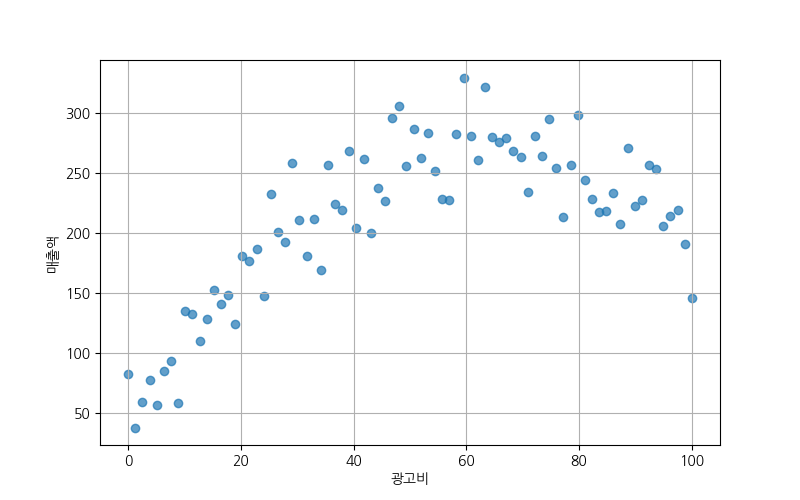
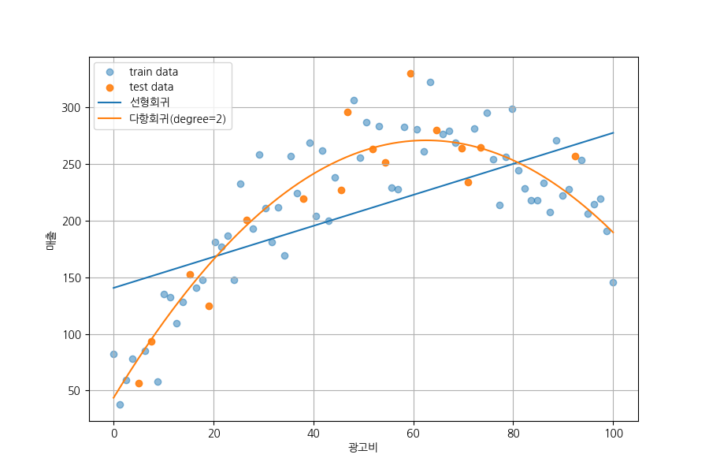
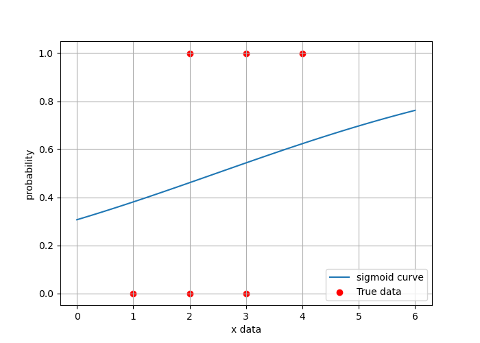
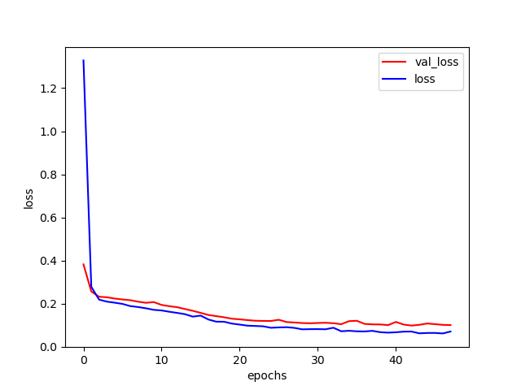
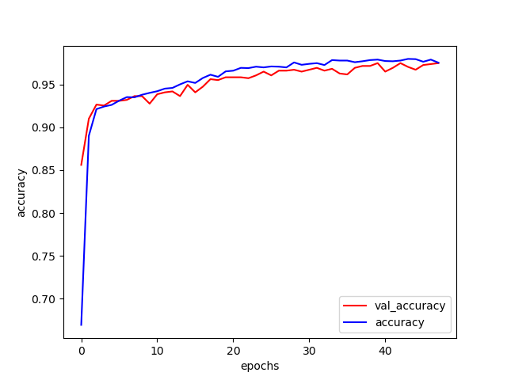
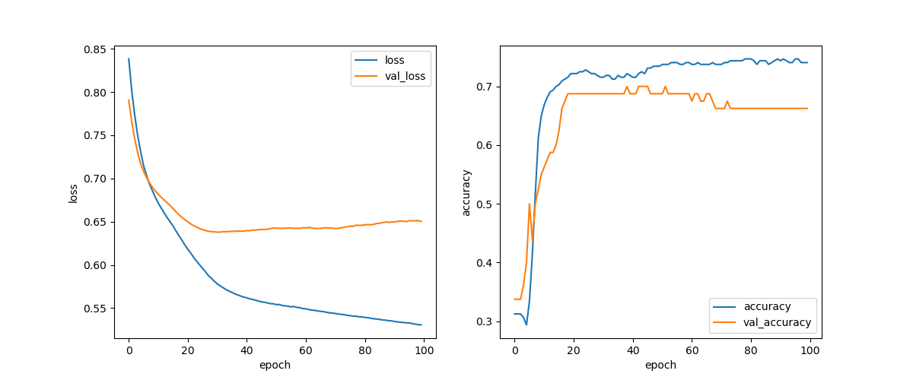

# Day 61_딥러닝 : 다항회귀 · 이진분류 · Keras API 3종

## 📅 2026-04-30

---

# 📄 tf13poly.py — 다항회귀 · 광고비-매출 곡선 예측

---

## 🧠 개념 정리

### 다항회귀 (Polynomial Regression)란?

광고비와 매출처럼 **곡선 형태의 관계**를 가진 데이터는 직선(선형회귀)으로 잘 맞지 않음  
→ feature에 **거듭제곱 항을 추가**해 곡선 회귀선을 만드는 방법

```
선형회귀 : 매출 = w₁ × 광고비 + b                        → Input shape (1,)
다항회귀 : 매출 = w₁ × 광고비 + w₂ × 광고비² + b         → Input shape (2,)
```

> **핵심** : 모델 자체는 여전히 Dense 선형 연산  
> feature를 `[x]` → `[x, x²]` 로 확장할 뿐, 내부 연산은 동일한 선형 결합

---

### 실습 데이터 생성 수식

$$\text{매출} = -0.06 \times \text{광고비}^2 + 7.5 \times \text{광고비} + 40 + \text{noise}$$

- 광고비가 증가할수록 매출도 증가하지만 어느 수준 이후에는 증가폭이 둔화되는 **역U자형 포물선**
- noise : `np.random.normal(0, 25)` — 현실 데이터처럼 흩어지게 만들기 위한 정규분포 노이즈



> 산점도에서 역U자형 포물선 분포 확인 — 광고비 약 60 부근에서 매출이 최대

---

### 수동 표준화 (StandardScaler 없이)

표준화란 각 feature를 **평균 0, 표준편차 1** 기준으로 변환하는 것  
→ feature 간 스케일 차이를 제거해 학습 안정화

```python
# train 기준으로 평균, 표준편차 계산
# axis=0 : 열(feature) 방향으로 계산 → 각 feature별 독립적인 통계량
x_mean = x_train.mean(axis=0)
x_std  = x_train.std(axis=0)

# 표준화 : (값 - 평균) / 표준편차
x_train_scaled = (x_train - x_mean) / x_std
x_test_scaled  = (x_test  - x_mean) / x_std   # ⚠️ 반드시 train 기준값 사용

# y도 동일하게 표준화 후, 예측값 복원 시:
y_pred = y_pred_scaled * y_std + y_mean        # 역변환 : scaled * std + mean
```

test 데이터에 test 자체의 평균/표준편차를 쓰면 **데이터 누수(data leakage)** 발생  
→ 항상 **train 기준값으로 test를 변환**해야 함

---

### 다항 특성 생성 함수

```python
def make_poly_features(x_scaled, degree=2):
    # range(1, degree+1) = [1, 2] → x¹, x² 생성
    # x_scaled ** d : 배열 전체에 거듭제곱 적용 (브로드캐스팅)
    features = [x_scaled ** d for d in range(1, degree + 1)]
    # np.concatenate(..., axis=1) : 열 방향으로 붙임
    # (64,1)짜리 배열 2개 → (64,2) 배열
    return np.concatenate(features, axis=1).astype(np.float32)

# 결과 shape
# x_train_scaled  : (64, 1)   ← [x]
# x_train_poly    : (64, 2)   ← [x, x²]
```

---

### 모델 구조 비교

```python
# 선형회귀 모델 : x 하나만 입력 → 직선 학습
linear_model = tf.keras.models.Sequential([
    tf.keras.layers.Input(shape=(1, )),   # 입력 feature : x 1개
    tf.keras.layers.Dense(units=1)        # activation 없음 = linear → 회귀
])

# 다항회귀 모델 : x와 x² 둘 다 입력 → 포물선 학습
poly_model = tf.keras.models.Sequential([
    tf.keras.layers.Input(shape=(2, )),   # 입력 feature : x, x² 2개
    tf.keras.layers.Dense(units=1)        # 내부 연산 : w1*x + w2*x² + b
])
```

두 모델 모두 `loss='mse'`, `optimizer=Adam(lr=0.01)`, `epochs=2000`으로 동일하게 학습

---

### 성능 평가 함수

```python
def r2_score_np(y_true, y_pred):
    ss_res = np.sum((y_true - y_pred) ** 2)           # 잔차제곱합 : 예측 오차의 크기
    ss_tot = np.sum((y_true - np.mean(y_true)) ** 2)  # 전체분산 : 평균으로만 예측했을 때 오차
    return 1 - (ss_res / ss_tot)
    # R² = 1이면 완벽한 예측
    # R² = 0이면 평균으로 예측하는 것과 동일
    # R² < 0이면 평균보다 나쁜 예측 (학습 실패)

def evaluate_model(name, y_true, y_pred):
    mse  = np.mean((y_true - y_pred) ** 2)   # MSE : 오차 제곱의 평균 (단위 : 매출²)
    rmse = np.sqrt(mse)                        # RMSE : MSE의 제곱근 → 단위가 매출과 같아 직관적
    r2   = r2_score_np(y_true, y_pred)        # R² : 설명력 (0~1, 높을수록 좋음)
    print(f'\n[{name}]')
    print('MSE : ', round(mse, 3))
    print('RMSE : ', round(rmse, 3))
    print('R2 : ', round(r2, 3))
```

---

### 시각화 — 예측 곡선 그리기

```python
# 학습 데이터(80개)로 그리면 각진 선 → 300개로 촘촘하게 예측해서 부드러운 곡선 표현
x_plot = np.linspace(x.min(), x.max(), 300).reshape(-1, 1).astype(np.float32)
x_plot_scaled = (x_plot - x_mean) / x_std              # 학습 때와 동일한 표준화 적용
x_plot_poly   = make_poly_features(x_plot_scaled, degree=2)  # 다항 모델용 [x, x²] 변환

# ⚠️ 모델별 입력 shape 반드시 구분
y_plot_linear_scaled = linear_model.predict(x_plot_scaled, verbose=0)  # (300,1) 입력
y_plot_poly_scaled   = poly_model.predict(x_plot_poly, verbose=0)       # (300,2) 입력
# 선형 모델에 x_plot_poly 넣으면 shape 불일치 에러 발생

# 표준화된 예측값 → 원래 매출 단위로 복원
y_plot_linear = y_plot_linear_scaled * y_std + y_mean
y_plot_poly   = y_plot_poly_scaled   * y_std + y_mean
```



> 선형회귀(파란 직선) : 곡선 데이터를 직선으로 억지로 맞추려 해서 적합 불량  
> 다항회귀(주황 곡선) : 역U자형 포물선을 잘 따라가는 것 확인

---

## 💻 전체 실습 코드

```python
import numpy as np
import pandas as pd
import matplotlib.pyplot as plt
import koreanize_matplotlib
import tensorflow as tf

np.random.seed(7)          # numpy 난수 고정 → 데이터 생성 noise 항상 동일
tf.random.set_seed(7)      # tensorflow 난수 고정 → 가중치 초기값 항상 동일

# ── 데이터 생성 ──
# np.linspace(0, 100, 80) : 0~100 사이를 80등분한 균일 간격 배열
ad_cost = np.linspace(0, 100, 80)
# 2차 함수(-0.06x² + 7.5x + 40) + 정규분포 노이즈(평균 0, 표준편차 25)
sales = (-0.06 * (ad_cost ** 2) + 7.5 * ad_cost + 40) + np.random.normal(0, 25, size=len(ad_cost))

df = pd.DataFrame({'광고비': ad_cost, '매출': sales})
df.to_csv('ad_sales.csv', index=False, encoding='utf-8-sig')  # 한글 깨짐 방지 : utf-8-sig

df = pd.read_csv('ad_sales.csv')
df = df.dropna()   # 결측치 있는 행 삭제 (이 데이터는 없지만 습관적으로 처리)

# ── feature / label 분리 ──
# [['광고비']] : 2중 대괄호로 DataFrame 유지 → .values로 2D numpy 배열 확보
x = df[['광고비']].values.astype(np.float32)  # shape : (80, 1)
y = df[['매출']].values.astype(np.float32)    # shape : (80, 1)

# ── 산점도 ──
plt.figure(figsize=(8, 5))
plt.scatter(x, y, alpha=0.7)
plt.xlabel('광고비')
plt.ylabel('매출액')   # ylabel 주의 (xlabel 아님)
plt.grid(True)
plt.show()

# ── train/test split (수동) ──
# sklearn 없이 직접 구현 : 인덱스를 섞은 후 앞 80% / 뒤 20%로 분리
indices = np.arange(len(x))   # [0, 1, 2, ..., 79]
np.random.shuffle(indices)    # 인덱스 랜덤 셔플
x, y = x[indices], y[indices] # 셔플된 순서로 데이터 재배열
train_size = int(len(x) * 0.8)
x_train, x_test = x[:train_size], x[train_size:]  # (64,1) / (16,1)
y_train, y_test = y[:train_size], y[train_size:]

# ── 표준화 ──
# train 기준으로 평균/표준편차 계산 → test에도 동일 기준 적용
x_mean, x_std = x_train.mean(axis=0), x_train.std(axis=0)
y_mean, y_std = y_train.mean(axis=0), y_train.std(axis=0)
x_train_scaled = (x_train - x_mean) / x_std
x_test_scaled  = (x_test  - x_mean) / x_std  # ⚠️ test는 transform만 (fit 재실행 금지)
y_train_scaled = (y_train - y_mean) / y_std
y_test_scaled  = (y_test  - y_mean) / y_std

# ── 다항 특성 생성 ──
def make_poly_features(x_scaled, degree=2):
    # [x¹, x²] 두 배열을 열 방향으로 붙여 (N,2) 배열 생성
    features = [x_scaled ** d for d in range(1, degree + 1)]
    return np.concatenate(features, axis=1).astype(np.float32)

x_train_poly = make_poly_features(x_train_scaled, degree=2)  # (64,1) → (64,2)
x_test_poly  = make_poly_features(x_test_scaled,  degree=2)  # (16,1) → (16,2)

# ── 성능 평가 함수 ──
def r2_score_np(y_true, y_pred):
    ss_res = np.sum((y_true - y_pred) ** 2)           # 잔차제곱의 합
    ss_tot = np.sum((y_true - np.mean(y_true)) ** 2)
    return 1 - (ss_res / ss_tot)                       # R² 공식

def evaluate_model(name, y_true, y_pred):
    mse  = np.mean((y_true - y_pred) ** 2)            # 평균 제곱 오차
    rmse = np.sqrt(mse)                                # 루트 평균 제곱 오차
    r2   = r2_score_np(y_true, y_pred)
    print(f'\n[{name}]')
    print('MSE : ', round(mse, 3))
    print('RMSE : ', round(rmse, 3))
    print('R2 : ', round(r2, 3))

# ── 선형회귀 모델 ──
linear_model = tf.keras.models.Sequential([
    tf.keras.layers.Input(shape=(1, )),
    tf.keras.layers.Dense(units=1)         # y = w*x + b (직선)
])
linear_model.compile(optimizer=tf.keras.optimizers.Adam(learning_rate=0.01), loss='mse')
linear_model.fit(x_train_scaled, y_train_scaled, epochs=2000, verbose=0)
# 예측 후 역표준화로 원래 매출 단위 복원
y_pred_linear = linear_model.predict(x_test_scaled, verbose=0) * y_std + y_mean

# ── 다항회귀 모델 ──
poly_model = tf.keras.models.Sequential([
    tf.keras.layers.Input(shape=(2, )),    # 입력 : [x, x²] 두 개
    tf.keras.layers.Dense(units=1)         # y = w1*x + w2*x² + b (포물선)
])
poly_model.compile(optimizer=tf.keras.optimizers.Adam(learning_rate=0.01), loss='mse')
poly_model.fit(x_train_poly, y_train_scaled, epochs=2000, verbose=0)
y_pred_poly = poly_model.predict(x_test_poly, verbose=0) * y_std + y_mean

# ── 성능 비교 ──
evaluate_model('선형회귀', y_test, y_pred_linear)
evaluate_model('다항회귀(degree2)', y_test, y_pred_poly)

# ── 시각화 ──
# 300개 촘촘한 포인트로 부드러운 예측 곡선 생성
x_plot        = np.linspace(x.min(), x.max(), 300).reshape(-1, 1).astype(np.float32)
x_plot_scaled = (x_plot - x_mean) / x_std
x_plot_poly   = make_poly_features(x_plot_scaled, degree=2)

y_plot_linear = linear_model.predict(x_plot_scaled, verbose=0) * y_std + y_mean
y_plot_poly   = poly_model.predict(x_plot_poly,     verbose=0) * y_std + y_mean

plt.figure(figsize=(9, 6))
plt.scatter(x_train, y_train, alpha=0.5, label='train data')
plt.scatter(x_test,  y_test,  alpha=0.9, label='test data')
plt.plot(x_plot, y_plot_linear, label='선형회귀')
plt.plot(x_plot, y_plot_poly,   label='다항회귀(degree=2)')
plt.xlabel('광고비')
plt.ylabel('매출')
plt.legend()
plt.grid(True)
plt.show()
```

---

## 📌 핵심 정리

### 실행 결과

|모델|MSE|RMSE|R²|
|---|---|---|---|
|선형회귀|2710.892|52.066|**0.499**|
|다항회귀(degree=2)|682.272|26.120|**0.874**|

> 선형회귀 R² 0.499 → 곡선 데이터를 직선으로 맞추니 분산의 절반만 설명  
> 다항회귀 R² 0.874 → 데이터 생성 수식(`-0.06x² + 7.5x + 40`)과 구조가 일치하므로 높게 나옴

---

### 선형회귀 vs 다항회귀 비교

|구분|feature 입력 shape|회귀선 형태|이 데이터에 적합 여부|
|---|---|---|---|
|선형회귀|`(N, 1)` — `[x]`|직선|❌ 곡선을 직선으로 억지로 맞춤|
|다항회귀(degree=2)|`(N, 2)` — `[x, x²]`|포물선|✅ 데이터 생성 수식과 구조 일치|

---

## 🔑 핵심 포인트

> **다항회귀** = feature를 `[x]` → `[x, x²]`로 확장 — 모델 자체는 Dense 선형 연산  
> **make_poly_features(x, degree=2)** = `np.concatenate`로 `[x, x²]` 두 열짜리 배열 생성  
> **수동 표준화** = train 기준 mean/std 계산 → train·test 동시에 같은 값으로 변환  
> **예측값 복원** = `y_pred = y_pred_scaled * y_std + y_mean` (역표준화)  
> **예측 시 shape 주의** = linear_model → `x_plot_scaled (N,1)` / poly_model → `x_plot_poly (N,2)`  
> **x_plot 300개** = 학습 데이터(80개)보다 촘촘하게 예측 → 부드러운 곡선 표현  
> **np.linspace(a, b, N)** = a~b 사이를 N등분한 균일 간격 배열 생성

---

# 📄 tf14classification.py — 딥러닝 이진분류 · Sequential / Functional / Subclassing API

---

## 🧠 개념 정리

### 이진분류 (Binary Classification)란?

출력이 **0 또는 1** 두 가지 중 하나인 분류 문제  
전통적인 LogisticRegression을 딥러닝으로 확장한 형태

```
입력(x1, x2) → Dense(relu) → Dense(sigmoid) → 확률값(0~1)
                                                     ↓
                                          0.5 기준으로 0 or 1 분류
```

---

### Binary Cross-Entropy (BCE) 손실함수

이진분류에서 예측 확률값과 실제값 사이의 오차를 계산하는 손실함수

$$BCE = -\frac{1}{N}\sum[y \cdot \log(\hat{y}) + (1-y) \cdot \log(1-\hat{y})]$$

- 정답이 1인데 예측이 0에 가까울수록 → 손실 폭발 (패널티 큼)
- 정답이 0인데 예측이 1에 가까울수록 → 손실 폭발 (패널티 큼)
- 정답과 예측이 일치할수록 → 손실 0에 수렴

**학습 흐름:**

```
z = w•x + b  →  sigmoid(z)  →  BCE 계산  →  역전파  →  w, b 갱신
```

---

### Sigmoid 함수

$$\sigma(z) = \frac{1}{1 + e^{-z}}$$

- 출력 범위 : 0 ~ 1 → **확률값으로 해석 가능**
- z가 크면 1에 수렴, z가 작으면 0에 수렴
- 이진분류 출력층에 필수

---

### 3가지 Keras 모델 API 비교

|API|구조 정의 방식|특징|사용 상황|
|---|---|---|---|
|**Sequential**|리스트로 층 쌓기|단순, 빠른 프로토타입|직선 구조만 필요할 때|
|**Functional**|레이어를 함수처럼 호출|유연한 그래프 구조|실무 표준, 다중 입출력|
|**Subclassing**|`__init__`에 레이어, `call`에 흐름 정의|가장 자유롭고 PyTorch 스타일과 동일|복잡한 커스텀 모델|

---

### 예측 결과 변환 3가지 방법

```python
pred = model.predict(new_data, verbose=0)  # 확률값 (0~1 실수)

# 방법 1 : numpy 비교 연산
(pred >= 0.5).astype(int).ravel()

# 방법 2 : list comprehension
[1 if i >= 0.5 else 0 for i in pred]

# 방법 3 : np.where (실무에서 가장 많이 사용)
np.where(pred >= 0.5, 1, 0).ravel()
```

---

## 💻 전체 실습 코드

```python
from tensorflow.keras.models import Sequential
from tensorflow.keras.layers import Dense, Input
from tensorflow.keras.optimizers import Adam
import tensorflow as tf
import numpy as np

np.random.seed(42)
tf.keras.utils.set_random_seed(42)  # tf.random.set_seed와 달리 전역 난수 완전 고정

# ── 데이터 준비 ──
# 6개 샘플, 각 샘플은 (x1, x2) 두 feature
# 0 : x1이 작고 x2가 큰 경향 / 1 : x1이 크고 x2가 작은 경향
x_data = np.array([[1,2],[2,3],[3,4],[4,3],[3,2],[2,1]], dtype=np.float32)
y_data = np.array([[0],[0],[0],[1],[1],[1]], dtype=np.float32)
```

---

### 1) Sequential API

```python
print('1) Sequential API 버전 (빠른 구현)')
# 첫 번째 Sequential은 두 번째로 덮어씌워짐 → 실제 사용되는 모델은 두 번째
model = Sequential([
    Input(shape=(2, )),
    Dense(units=1, activation='sigmoid')
])
# ↑ 이 모델은 사용 안 됨 (바로 아래에서 덮어씌워짐)

model = Sequential()                              # 빈 모델 생성
model.add(Input(shape=(2, )))                     # 입력층 : feature 2개
model.add(Dense(units=4, activation='relu'))      # 은닉층 : 뉴런 4개, 비선형성 추가
model.add(Dense(units=1, activation='sigmoid'))   # 출력층 : 확률값(0~1) 출력
print(model.summary())

# loss='binary_crossentropy' : 이진분류 전용 손실함수
# metrics=['accuracy'] : 에포크마다 정확도도 함께 출력
model.compile(loss='binary_crossentropy', optimizer=Adam(learning_rate=0.01), metrics=['accuracy'])

# batch_size=1 : 샘플 1개씩 가중치 업데이트 (SGD 방식)
# 데이터가 6개뿐이라 batch_size=1로 설정
model.fit(x_data, y_data, epochs=20, batch_size=1, verbose=2)

m_eval = model.evaluate(x_data, y_data, verbose=0)  # [loss, accuracy]
print(f'평가 결과 : 손실={m_eval[0]:.4f}, 정확도={m_eval[1]:.4f}')
```

---

### 시그모이드 곡선 시각화

```python
import matplotlib.pyplot as plt

# 2D 입력 모델의 sigmoid 곡선을 1D처럼 보기 위한 트릭
# x2를 2.5로 고정하고 x1만 변화 → x1에 따른 출력 확률 변화 관찰
x1_range = np.linspace(0, 6, 100)  # x1 : 0~6 사이 100개 포인트
x2_fixed = 2.5                      # x2는 2.5로 고정

# np.full_like(a, val) : a와 같은 shape의 배열을 val로 채움
# np.column_stack : 두 1D 배열을 열 방향으로 합쳐 (100, 2) 배열 생성
x_vis = np.column_stack([x1_range, np.full_like(x1_range, x2_fixed)])

y_prob = model.predict(x_vis, verbose=0)   # x1 변화에 따른 출력 확률

x1_real = x_data[:, 0]   # 실제 데이터의 x1값만 추출
y_real  = y_data.ravel()  # (6,1) → (6,) 1차원으로 변환

plt.figure(figsize=(7, 5))
plt.plot(x1_range, y_prob, label='sigmoid curve')
plt.scatter(x1_real, y_real, color='red', label='True data')
plt.xlabel('x data')
plt.ylabel('probability')
plt.legend(loc='lower right')
plt.grid()
plt.show()
```



> sigmoid curve(파란선)가 S자가 아닌 직선에 가깝게 나옴  
> 데이터가 6개뿐이고 epoch=20으로 학습이 부족해서 sigmoid가 충분히 학습되지 않은 상태  
> 그럼에도 정확도 1.0 → 6개 샘플 모두 0.5 기준으로 올바르게 분류됨

```python
from sklearn.metrics import accuracy_score
pred = model.predict(x_data, verbose=0)
pred_class = (pred >= 0.5).astype(int)  # 0.5 이상이면 1, 미만이면 0
accuracy = accuracy_score(y_data, pred_class)
print(f'1) 정확도 | {accuracy:.4f}')   # 1.0000

# 새로운 데이터로 예측
new_data = np.array([[1,2],[10,5]], dtype=np.float32)
pred = model.predict(new_data, verbose=0)
print('예측 확률 : ', pred.ravel())    # [0.408, 0.870]

# 예측 결과 변환 3가지 방법 (결과 동일)
print('예측 결과 : ', (pred >= 0.5).astype(int).ravel())        # numpy 방식
print('예측 결과 : ', [1 if i >= 0.5 else 0 for i in pred])    # list comprehension
print('예측 결과 : ', np.where(pred >= 0.5, 1, 0).ravel())     # np.where (실무 권장)
```

---

### 2) Functional API

```python
print('2) Functional API 버전 (실무에서 주로 사용)')
from tensorflow.keras.models import Model

# Sequential과 달리 레이어를 함수처럼 호출해서 연결
# → 분기, 다중 입출력, 레이어 재사용 등 복잡한 구조 표현 가능
inputs  = Input(shape=(2, ))                               # 입력 텐서 생성
outputs = Dense(units=4, activation='relu')(inputs)        # inputs를 인자로 전달
outputs = Dense(units=1, activation='sigmoid')(outputs)    # 이전 outputs을 인자로 전달

# 입력 텐서와 출력 텐서를 연결해 모델 객체 생성
model_func = Model(inputs=inputs, outputs=outputs)
print(model_func.summary())

model_func.compile(loss='binary_crossentropy', optimizer=Adam(learning_rate=0.01), metrics=['accuracy'])
model_func.fit(x_data, y_data, epochs=20, batch_size=1, verbose=2)
m_eval2 = model_func.evaluate(x_data, y_data, verbose=0)
print(f'평가 결과 : 손실={m_eval2[0]:.4f}, 정확도={m_eval2[1]:.4f}')
```

---

### 3) Functional API — 다중 입력

```python
print('3) Functional API — 다중 입력')
# x1과 x2를 따로 받아 각각 특징을 추출한 뒤 합치는 구조
# 각 입력에 대해 독립적으로 전처리가 가능 → 이종 데이터 결합에 유용
# (예: 이미지 + 환자 메타데이터를 합치는 의료 AI 구조)
#
# x1 → Dense(2)
#                → Concatenate → Dense(1) → 출력
# x2 → Dense(4)

from tensorflow.keras.layers import Concatenate

input1 = Input(shape=(1, ))   # x1 전용 입력
input2 = Input(shape=(1, ))   # x2 전용 입력

# 각 입력을 독립적인 Dense로 처리
x1 = Dense(units=2, activation='relu')(input1)   # x1 처리 : (None,1) → (None,2)
x2 = Dense(units=4, activation='relu')(input2)   # x2 처리 : (None,1) → (None,4)

# Concatenate : 두 텐서를 열 방향으로 합침 → (None,2) + (None,4) = (None,6)
merged = Concatenate()([x1, x2])
output = Dense(units=1, activation='sigmoid')(merged)  # 출력층

# inputs를 리스트로 전달 → 다중 입력 모델
multi_model = Model(inputs=[input1, input2], outputs=[output])
print(multi_model.summary())

multi_model.compile(loss='binary_crossentropy', optimizer=Adam(learning_rate=0.01), metrics=['accuracy'])

# x_data를 x1, x2로 분리해서 각각 입력
# reshape(-1, 1) : (6,) → (6,1) — Input shape=(1,)에 맞춤
x1_data = x_data[:, 0].reshape(-1, 1)   # 첫 번째 열 (x1)
x2_data = x_data[:, 1].reshape(-1, 1)   # 두 번째 열 (x2)

# fit, evaluate, predict 모두 입력을 리스트로 전달
multi_model.fit([x1_data, x2_data], y_data, epochs=20, batch_size=1, verbose=2)
m_eval2_multi = multi_model.evaluate([x1_data, x2_data], y_data, verbose=0)
print(f'평가 결과 : 손실={m_eval2_multi[0]:.4f}, 정확도={m_eval2_multi[1]:.4f}')
```

---

### 4) Subclassing API

```python
print('4) Subclassing API (PyTorch 스타일)')
# tf.keras.Model을 상속받아 직접 클래스로 모델 정의
# __init__ : 사용할 레이어를 멤버 변수로 정의
# call     : 순전파(forward) 흐름 정의
# PyTorch의 nn.Module + forward()와 구조가 거의 동일

class MyModel(Model):
    def __init__(self):
        super().__init__()          # 부모 클래스(Model) 초기화 필수
        # 레이어를 인스턴스 변수로 미리 정의
        self.dense1 = Dense(units=4, activation='relu')
        self.dense2 = Dense(units=1, activation='sigmoid')
    
    def call(self, x):
        # 순전파 흐름 : 입력 x가 레이어를 통과하는 과정 정의
        x = self.dense1(x)   # 은닉층 통과
        x = self.dense2(x)   # 출력층 통과
        return x

model_sub = MyModel()
model_sub.compile(loss='binary_crossentropy', optimizer=Adam(learning_rate=0.01), metrics=['accuracy'])
model_sub.fit(x_data, y_data, epochs=20, batch_size=1, verbose=2)
m_eval_sub = model_sub.evaluate(x_data, y_data, verbose=0)
print(f'평가 결과 : 손실={m_eval_sub[0]:.4f}, 정확도={m_eval_sub[1]:.4f}')
```

---

## 📌 핵심 정리

### 실행 결과

|API|손실|정확도|
|---|---|---|
|Sequential|0.5631|**1.0000**|
|Functional|0.4075|**1.0000**|
|Functional 다중입력 (수정 전)|0.8708|0.0000 ← 버그|
|Functional 다중입력 (수정 후)|0.4961|**1.0000**|
|Subclassing|0.4961|**1.0000**|

> 다중입력 모델의 수정 전 결과(정확도 0.0) : `fit([x1, x2], y_data)` 가 아니라 `fit(x1, x2)`로 잘못 전달된 버그

---

### 3가지 API 구조 비교

```
Sequential API
  model = Sequential()
  model.add(Dense(...))     ← 층을 순서대로 추가
  → 단순, 직선 구조만 가능

Functional API
  inputs  = Input(...)
  x       = Dense(...)(inputs)    ← 레이어를 함수처럼 호출
  outputs = Dense(...)(x)
  model   = Model(inputs, outputs)
  → 유연, 다중 입출력 가능, 실무 표준

Subclassing API
  class MyModel(Model):
      def __init__(self): self.dense = Dense(...)
      def call(self, x): return self.dense(x)
  → 가장 자유롭고 PyTorch nn.Module과 동일한 스타일
```

---

## 🔑 핵심 포인트

> **BCE 손실** = 이진분류 전용 — 정답과 예측이 멀수록 손실 폭발  
> **sigmoid 출력층** = 확률값(0~1) 출력 → 0.5 기준으로 클래스 결정  
> **batch_size=1** = 샘플 1개씩 가중치 업데이트 (데이터 적을 때 사용)  
> **np.where(pred >= 0.5, 1, 0)** = 확률 → 클래스 변환, 실무 권장 방식  
> **Functional 다중입력** = fit/evaluate/predict 모두 입력을 `[x1, x2]` 리스트로 전달  
> **Subclassing** = `__init__`에 레이어 정의, `call`에 순전파 흐름 → PyTorch와 동일 구조  
> **np.full_like(a, val)** = a와 같은 shape 배열을 val로 채움  
> **np.column_stack** = 1D 배열 여러 개를 열 방향으로 합쳐 2D 배열 생성

---

# 📄 tf15wine.py — 와인 이진분류 · EarlyStopping · ModelCheckpoint

---

## 🧠 개념 정리

### 실습 목표

와인의 산도, 당도, 알코올 등 **12가지 화학 성분**으로 레드(1) vs 화이트(0) 와인을 분류하는 이진분류 모델

|컬럼 인덱스|의미|
|---|---|
|0~11|산도, 당도, 알코올 등 화학 성분 12개 (feature)|
|12|와인 종류 — 1: 레드, 0: 화이트 (label)|

---

### 클래스 불균형 (Class Imbalance)

```
화이트 : 4898개
레드   : 1599개  ← 약 3:1 비율로 불균형
```

불균형한 데이터를 랜덤 split하면 train/test 비율이 달라질 수 있음  
→ `stratify=y` 옵션으로 **원본 비율을 유지하면서 split**

```python
train_test_split(x, y, stratify=y)
# stratify=y : y의 클래스 비율(3:1)을 train/test에 동일하게 유지
```

---

### EarlyStopping (조기종료)

**val_loss가 더 이상 개선되지 않으면 학습을 자동으로 중단**하는 콜백

```python
early_stop = EarlyStopping(
    monitor='val_loss',        # 검증 손실을 기준으로 모니터링
    patience=5,                # 5 epoch 연속 개선 없으면 학습 중단
    restore_best_weights=True  # 중단 시점이 아닌 가장 좋았던 epoch의 가중치 복원
)
```

`restore_best_weights=True` 를 빠뜨리면 마지막 epoch(성능이 나빠진 상태)의 가중치를 사용하게 됨

**EarlyStopping 동작 흐름:**

```
epoch 43  val_loss = 0.0989  ← 최저
epoch 44  val_loss = 0.1023  (개선 없음, count 1)
epoch 45  val_loss = 0.1085  (개선 없음, count 2)
epoch 46  val_loss = 0.1054  (개선 없음, count 3)
epoch 47  val_loss = 0.1021  (개선 없음, count 4)
epoch 48  val_loss = 0.1010  (개선 없음, count 5) → 학습 중단!
restore_best_weights=True → epoch 43의 가중치로 복원
```

---

### ModelCheckpoint (모델 저장)

학습 중 **val_loss 기준으로 가장 좋은 모델만 자동 저장**하는 콜백

```python
chkpoint = ModelCheckpoint(
    filepath=modelpath,     # 저장 경로
    monitor='val_loss',     # val_loss 기준으로 모니터링
    mode='auto',            # monitor 값이 작을수록 좋은지 자동 판단
    save_best_only=True     # 가장 좋은 모델만 저장 (매 epoch 저장 아님)
)
```

> `save_best_only=True` 없으면 모든 epoch마다 파일을 덮어씌워 마지막 모델만 남음

---

### validation_split vs validation_data

|방법|설명|주의사항|
|---|---|---|
|`validation_split=0.2`|train 데이터 뒤 20%를 자동으로 검증용 분리|shuffle 없이 뒤에서 자름|
|`validation_data=(x_test, y_test)`|분리된 test 데이터를 직접 검증에 사용|명시적으로 관리 가능|

---

### 학습 전 모델 정확도를 평가하는 이유

```python
loss, acc = model.evaluate(x_train, y_train, verbose=0)
print(f'훈련되지 않은 모델의 정확도:{acc * 100}%')
# → 24.6% (랜덤 가중치 상태)
```

학습 전후 정확도를 비교해 **모델이 실제로 학습했는지** 확인하는 용도

---

## 💻 전체 실습 코드

```python
import pandas as pd
from tensorflow.keras.models import Sequential
from tensorflow.keras.layers import Dense, Input
from tensorflow.keras.optimizers import Adam
from tensorflow.keras.callbacks import EarlyStopping, ModelCheckpoint
from sklearn.model_selection import train_test_split
import matplotlib.pyplot as plt
import tensorflow as tf
import numpy as np
import os

# ── 데이터 로드 ──
# CSV 첫 행이 데이터(헤더 없음) → 컬럼명이 첫 번째 데이터 값으로 표시됨
wdf = pd.read_csv("https://raw.githubusercontent.com/pykwon/python/refs/heads/master/testdata_utf8/wine.csv")
print(wdf.head(2))
print(wdf.info())

# 마지막 컬럼(12번 인덱스) = 와인 종류 레이블
print(wdf.iloc[:, 12].unique())      # [1 0] → 레드(1), 화이트(0)
print(len(wdf[wdf.iloc[:, 12]==0]))  # 화이트 : 4898개
print(len(wdf[wdf.iloc[:, 12]==1]))  # 레드   : 1599개  ← 클래스 불균형 주의

# ── numpy 배열 변환 ──
# .values : DataFrame → numpy 배열 변환
dataset = wdf.values
x = dataset[:, 0:12]   # 0~11번 컬럼 : 화학 성분 12개 (feature)
y = dataset[:, -1]     # 마지막 컬럼 : 와인 종류 (label)
print(x[:2])
print(y[:2])

# ── train/test split ──
# stratify=y : 클래스 비율(화이트:레드 ≈ 3:1)을 train/test에 동일하게 유지
# shuffle=True : split 전에 데이터 섞기 (기본값이지만 명시)
x_train, x_test, y_train, y_test = train_test_split(
    x, y, test_size=0.3, random_state=12, stratify=y, shuffle=True
)
print(x_train.shape)   # (4547, 12)
print(y_train.shape)   # (4547,)

# ── 모델 구성 ──
# 은닉층을 깊게 쌓을수록 복잡한 패턴 학습 가능
# 뉴런 수 : 24 → 12 → 8 → 1 (점점 줄이는 깔때기 구조)
model = Sequential()
model.add(Input(shape=(12, )))                        # 입력 : feature 12개
model.add(Dense(units=24, activation='relu'))         # 은닉층1 : 24개 뉴런
model.add(Dense(units=12, activation='relu'))         # 은닉층2 : 12개 뉴런
model.add(Dense(units=8, activation='relu'))          # 은닉층3 : 8개 뉴런
model.add(Dense(units=1, activation='sigmoid'))       # 출력층 : 확률값(0~1)
print(model.summary())

# optimizer='adam' : 문자열로 전달 시 기본 학습률(0.001) 사용
model.compile(loss='binary_crossentropy', optimizer='adam', metrics=['accuracy'])

# ── 학습 전 정확도 확인 ──
# 가중치가 랜덤 초기화된 상태 → 정확도가 매우 낮아야 정상
loss, acc = model.evaluate(x_train, y_train, verbose=0)
print(f'훈련되지 않은 모델의 정확도:{acc * 100}%')   # → 24.6%

# ── 콜백 설정 ──
# EarlyStopping : val_loss 5 epoch 연속 개선 없으면 중단 + 최적 가중치 복원
early_stop = EarlyStopping(monitor='val_loss', patience=5, restore_best_weights=True)

# ModelCheckpoint : 저장 폴더 생성
MODEL_DIR = './winemodel/'
if not os.path.exists(MODEL_DIR):
    os.makedirs(MODEL_DIR)  # 폴더 없으면 생성

# modelpath : 저장 파일 경로
# 에포크/val_loss를 파일명에 포함하려면 : 'winemodel/{epoch:02d}-{val_loss:.3f}.keras'
modelpath = 'winemodel.keras'
chkpoint = ModelCheckpoint(
    filepath=modelpath,
    monitor='val_loss',
    mode='auto',          # val_loss는 낮을수록 좋음 → 자동 감지
    save_best_only=True   # val_loss 기준 가장 좋은 모델만 저장
)

# ── 학습 ──
# epochs=1000 : 최대 1000번이지만 EarlyStopping이 먼저 중단시킴
# validation_split=0.2 : x_train의 뒤 20%를 검증용으로 자동 분리
# callbacks : 매 epoch 끝마다 자동 실행되는 함수 목록
history = model.fit(
    x_train, y_train,
    epochs=1000,
    validation_split=0.2,
    batch_size=64,
    callbacks=[early_stop, chkpoint]  # ⚠️ 빈 리스트면 콜백이 동작하지 않음
)

loss, acc = model.evaluate(x_test, y_test, verbose=0)
print(f'훈련된 모델의 정확도:{acc * 100}%')   # → 97.99%

# ── 학습 곡선 시각화 ──
# history.epoch : 실제 학습된 epoch 번호 리스트 (EarlyStopping으로 중단된 시점까지)
epoch_len = np.arange(len(history.epoch))

# loss 그래프
plt.plot(epoch_len, history.history['val_loss'], c='red', label='val_loss')
plt.plot(epoch_len, history.history['loss'], c='blue', label='loss')
plt.xlabel('epochs')
plt.ylabel('loss')
plt.legend()
plt.show()

# accuracy 그래프
plt.plot(epoch_len, history.history['val_accuracy'], c='red', label='val_accuracy')
plt.plot(epoch_len, history.history['accuracy'], c='blue', label='accuracy')
plt.xlabel('epochs')
plt.ylabel('accuracy')
plt.legend()
plt.show()

# ── 저장된 모델로 예측 ──
from tensorflow.keras.models import load_model

# ModelCheckpoint로 저장된 최적 모델 파일 불러오기
mymodel = load_model(modelpath)
new_data = x_test[:5, :]   # test 데이터에서 5개 샘플 추출
print(new_data)
new_pred = mymodel.predict(new_data)
# np.where(조건, 참일 때 값, 거짓일 때 값)
print('예측 결과:', np.where(new_pred >= 0.5, 1, 0).ravel())
# → [1 0 0 0 0] : 첫 번째만 레드, 나머지는 화이트
```

---

## 📌 핵심 정리

### 실행 결과

- 학습 전 정확도 : **24.6%** (랜덤 가중치 상태)
- EarlyStopping으로 epoch **48**에서 자동 중단 (최대 1000 설정)
- 훈련된 모델 정확도 : **97.99%**



> loss(파란선)와 val_loss(빨간선) 모두 함께 감소 → 과적합 없이 정상 학습  
> val_loss가 loss보다 약간 높은 것은 정상 (학습에 쓰지 않은 데이터이므로)  
> epoch 43 부근에서 val_loss 최저점 → patience=5로 48 epoch에서 중단



> accuracy(파란선)와 val_accuracy(빨간선) 모두 0.97 이상으로 수렴  
> train/val 격차가 작음 → 일반화 양호

---

### EarlyStopping vs ModelCheckpoint 역할 구분

|콜백|역할|restore 여부|
|---|---|---|
|`EarlyStopping`|학습 중단 시점 결정|`restore_best_weights=True`로 메모리에서 복원|
|`ModelCheckpoint`|디스크에 모델 파일 저장|`load_model()`로 나중에 불러올 수 있음|

> 둘을 함께 쓰는 이유 : EarlyStopping은 세션 종료 시 사라지지만  
> ModelCheckpoint는 파일로 남아있어 **나중에 재사용 가능**

---

### 모델 구조 및 파라미터 수

```
입력층  : feature 12개
  ↓
은닉층1 : Dense(24) + relu  → (12+1) × 24 = 312
  ↓
은닉층2 : Dense(12) + relu  → (24+1) × 12 = 300
  ↓
은닉층3 : Dense(8) + relu   → (12+1) × 8  = 104
  ↓
출력층  : Dense(1) + sigmoid → (8+1) × 1  = 9
                                        합계 = 725
```

---

## 🔑 핵심 포인트

> **stratify=y** = 클래스 불균형 데이터에서 train/test 비율 일정하게 유지  
> **EarlyStopping(patience=5)** = val_loss 5 epoch 연속 개선 없으면 자동 중단  
> **restore_best_weights=True** = 중단 시점이 아닌 최적 epoch 가중치 복원 (필수 권장)  
> **ModelCheckpoint(save_best_only=True)** = val_loss 최소일 때만 파일 저장  
> **callbacks=[]** = 빈 리스트로 두면 콜백이 동작하지 않음 — 반드시 리스트에 추가  
> **modelpath 경로 통일** = MODEL_DIR과 modelpath 경로가 일치해야 load_model 가능  
> **history.epoch** = 실제 학습된 epoch 번호 리스트 → EarlyStopping 중단 시점까지만 존재

---

# 📄 tf16admit.py — 대학원 입학 예측 · 원핫인코딩 · StandardScaler · 사용자 입력 예측

---

## 🧠 개념 정리

### 실습 목표

GRE 점수, GPA, 학교 랭킹(`rank`) 데이터로  
대학원 **합격(1) / 불합격(0)** 을 예측하는 이진분류 모델

|컬럼|의미|타입|처리|
|---|---|---|---|
|`admit`|합격 여부 (0/1)|이진|**label (y)**|
|`gre`|GRE 시험 점수|연속형|feature → StandardScaler|
|`gpa`|학점|연속형|feature → StandardScaler|
|`rank`|출신 학교 랭킹 (1~4)|**범주형**|**원핫인코딩** 후 feature|

---

### 원핫인코딩 (One-Hot Encoding)

`rank`는 1~4의 숫자지만 **순서나 크기에 의미가 없는 범주형** 데이터  
→ 숫자 그대로 쓰면 모델이 "4가 1보다 크다"고 잘못 학습할 수 있음  
→ 원핫인코딩으로 각 범주를 **독립적인 이진(0/1) 컬럼**으로 변환

```
rank=1 → rank_1=1, rank_2=0, rank_3=0, rank_4=0
rank=2 → rank_1=0, rank_2=1, rank_3=0, rank_4=0
rank=3 → rank_1=0, rank_2=0, rank_3=1, rank_4=0
rank=4 → rank_1=0, rank_2=0, rank_3=0, rank_4=1
```

```python
# pd.get_dummies : 지정한 컬럼을 원핫인코딩으로 자동 변환
# dtype=int : True/False 대신 1/0으로 출력
df = pd.get_dummies(df, columns=['rank'], dtype=int)
# 결과 : rank 컬럼 삭제, rank_1/rank_2/rank_3/rank_4 컬럼 추가
```

---

### StandardScaler (표준화)

모든 feature를 **평균 0, 표준편차 1** 기준으로 변환

$$X_{scaled} = \frac{X - \mu}{\sigma}$$

- gre(200~800)와 gpa(0~4)는 단위와 범위가 완전히 다름
- 스케일 차이가 크면 gre가 학습을 지배 → 표준화로 동등한 영향력 부여
- 원핫인코딩 컬럼(rank_1~4)도 함께 표준화됨

```python
scaler = StandardScaler()
x_scaled = scaler.fit_transform(x)  # fit(평균/표준편차 계산) + transform(변환) 동시 수행

# 새 데이터 예측 시 : fit 없이 transform만
user_scaled = scaler.transform(user_input)  # 학습 때와 동일한 기준 적용
```

> `fit_transform`은 train 데이터에만 사용  
> 새 데이터나 test 데이터는 `transform`만 사용 (기준 재계산 금지)

---

### validation_data vs validation_split

이 실습에서는 `validation_data=(x_test, y_test)` 방식 사용

```python
# validation_split=0.2 : train 데이터 뒤 20%를 자동으로 검증용 분리
#   → 어떤 데이터가 검증에 쓰이는지 불명확

# validation_data=(x_test, y_test) : 미리 split한 test를 검증에 직접 사용
#   → 명시적, 어떤 데이터가 검증에 쓰이는지 명확
history = model.fit(..., validation_data=(x_test, y_test))
```

---

### 사용자 입력 → 원핫인코딩 수동 처리

```python
rank = int(input('rank 입력(1 ~ 4):'))
rank_encoded = [0, 0, 0, 0]     # rank_1, rank_2, rank_3, rank_4 초기화
rank_encoded[rank - 1] = 1      # rank=2이면 index 1번을 1로 설정
                                 # → [0, 1, 0, 0]

# gre, gpa + rank 원핫 4개를 합쳐 (1, 6) 배열 생성
user_input = np.array([[gre, gpa] + rank_encoded])
```

---

### 66% 정확도의 의미

```
이 데이터셋의 합격률 : 약 31% (127명 합격 / 273명 불합격)

불합격(0)으로만 예측해도 정확도 = 68%
→ 66%는 무작위 예측(다수 클래스)보다 낮음

원인 : feature가 gre/gpa/rank 3개뿐으로 정보량 부족
       + 100 epoch에서 val_loss가 epoch 30 이후 수렴/증가
       → EarlyStopping이 없어 과적합 진행
```

---

## 💻 전체 실습 코드

```python
import pandas as pd
from tensorflow.keras.models import Sequential
from tensorflow.keras.layers import Dense, Input
from tensorflow.keras.callbacks import EarlyStopping, ModelCheckpoint
from sklearn.model_selection import train_test_split
from sklearn.preprocessing import StandardScaler
import matplotlib.pyplot as plt
import numpy as np

# ── 데이터 로드 ──
df = pd.read_csv('binary.csv')
print(df.head(3))
print(df.info())
# 컬럼 : admit(label), gre, gpa, rank(범주형)

# ── 원핫인코딩 ──
# rank는 1~4 숫자지만 범주형 → 수치 대소 관계 의미 없음
# get_dummies로 rank_1, rank_2, rank_3, rank_4 4개 컬럼으로 변환
df = pd.get_dummies(df, columns=['rank'], dtype=int)
print(df.head(3))
# 결과 컬럼 : admit, gre, gpa, rank_1, rank_2, rank_3, rank_4

# ── feature / label 분리 ──
# drop('admit') : admit 컬럼 제거 → 나머지가 feature
x = df.drop('admit', axis=1)   # shape : (400, 6)
y = df['admit']                 # shape : (400,)
print(x.head(3))
print(y.head(3))

# ── 표준화 ──
# gre(200~800), gpa(0~4), rank_*(0/1) 단위가 모두 다름 → StandardScaler로 통일
# fit_transform : train 기준 평균/표준편차 계산 + 변환 동시 수행
scaler = StandardScaler()
x_scaled = scaler.fit_transform(x)   # (400, 6) → 평균 0, 표준편차 1로 변환

# ── train / test split ──
# test_size=0.2 : 20%를 테스트용 (400 × 0.2 = 80개)
x_train, x_test, y_train, y_test = train_test_split(x_scaled, y, test_size=0.2, random_state=42)

# ── 모델 구성 ──
# x_train.shape[1] : feature 수를 동적으로 가져옴 → 코드 수정 없이 feature 수 변경 가능
model = Sequential([
    Input(shape=(x_train.shape[1],)),       # 입력 : feature 6개 (gre, gpa, rank_1~4)
    Dense(units=16, activation='relu'),      # 은닉층1 : 16개 뉴런
    Dense(units=8, activation='relu'),       # 은닉층2 : 8개 뉴런
    Dense(units=1, activation='sigmoid'),    # 출력층 : 확률값(0~1)
])

model.compile(optimizer='adam', loss='binary_crossentropy', metrics=['accuracy'])
print(model.summary())

# ── 학습 ──
# validation_data : 미리 분리한 test 데이터를 검증에 직접 사용 (명시적)
history = model.fit(
    x_train, y_train,
    validation_data=(x_test, y_test),   # val_loss, val_accuracy 기록
    epochs=100,
    batch_size=32,
    verbose=2
)

loss, acc = model.evaluate(x_test, y_test, verbose=0)
print(f'테스트 결과 손실:{loss:.4f}, 정확도:{acc:.4f}')   # → 0.6625

# ── 학습 곡선 시각화 ──
plt.figure(figsize=(12, 5))

# loss 그래프 (왼쪽)
plt.subplot(1, 2, 1)
plt.plot(history.history['loss'], label='loss')
plt.plot(history.history['val_loss'], label='val_loss')
plt.xlabel('epoch')
plt.ylabel('loss')
plt.legend()

# accuracy 그래프 (오른쪽)
plt.subplot(1, 2, 2)
plt.plot(history.history['accuracy'], label='accuracy')
plt.plot(history.history['val_accuracy'], label='val_accuracy')
plt.xlabel('epoch')
plt.ylabel('accuracy')
plt.legend()

plt.tight_layout()   # subplot 간 간격 자동 조정
plt.show()

# ── 사용자 입력 예측 ──
gre  = float(input('gre 점수 입력:'))
gpa  = float(input('gpa 점수 입력:'))
rank = int(input('rank 입력(1 ~ 4):'))   # ⚠️ int로 받아야 리스트 인덱스로 사용 가능

# rank 원핫인코딩 수동 처리
rank_encoded = [0, 0, 0, 0]      # [rank_1, rank_2, rank_3, rank_4] 초기화
rank_encoded[rank - 1] = 1       # rank=2 → index 1번 → [0, 1, 0, 0]

# gre, gpa + rank 원핫 4개 합쳐 (1, 6) 배열 생성
user_input = np.array([[gre, gpa] + rank_encoded])
print('user_input : ', user_input)

# ⚠️ 반드시 transform만 사용 (fit_transform 쓰면 학습 기준과 달라짐)
# 경고 메시지 : "X does not have valid feature names" → 무시해도 됨
# (scaler가 DataFrame으로 학습됐는데 numpy 배열로 transform해서 발생)
user_scaled = scaler.transform(user_input)

new_pred = model.predict(user_scaled)
prob = new_pred[0][0]   # 2D 배열에서 스칼라 값 추출
print('합격 확률 : ', prob)
if prob >= 0.5:
    print('합격 가능성이 높아요')
else:
    print('불합격 할 것 같아요')
```

---

## 📌 핵심 정리

### 실행 결과

- 테스트 정확도 : **66.25%**
- GRE 788.7 / GPA 3.45 / rank 2 입력 → 합격 확률 **42.8%** → 불합격 예측



> **loss 그래프(왼쪽)** : train loss(파랑)는 계속 감소 / val_loss(주황)는 epoch 30 이후 수렴  
> → train loss만 계속 떨어지고 val_loss가 멈추는 것 = **과적합 시작 신호**  
> EarlyStopping이 없어 100 epoch까지 불필요하게 학습됨  
> **accuracy 그래프(오른쪽)** : train accuracy(파랑) ~75% / val_accuracy(주황) ~66%  
> → 두 값의 격차가 벌어짐 = 과적합 진행 중

---

### 전처리 흐름 요약

```
원본 DataFrame
  admit  gre    gpa   rank
    0    380   3.61    3
        ↓
pd.get_dummies(columns=['rank'], dtype=int)
  admit  gre    gpa   rank_1  rank_2  rank_3  rank_4
    0    380   3.61     0       0       1       0
        ↓
df.drop('admit') → x (feature)
df['admit']     → y (label)
        ↓
StandardScaler.fit_transform(x)
  → 평균 0, 표준편차 1로 변환된 x_scaled
        ↓
train_test_split → x_train(320개), x_test(80개)
```

---

### 이 데이터셋의 한계

이 데이터(`binary.csv`)는 애초에 정보량이 적은 데이터셋

```
feature : gre, gpa, rank 3개뿐
샘플 수 : 400개 (딥러닝에는 매우 적음)
합격률  : 약 31% → 클래스 불균형
```

로지스틱 회귀로 돌려도 비슷한 정확도(68%)가 나오는 것으로 알려진 데이터셋  
→ 모델 문제가 아니라 **데이터 자체의 한계**

---

### 경고 메시지 설명

```
UserWarning: X does not have valid feature names,
but StandardScaler was fitted with feature names
```

- scaler를 DataFrame(컬럼명 있음)으로 `fit_transform`한 후
- 예측 시 numpy 배열(컬럼명 없음)로 `transform`해서 발생
- 기능에는 영향 없음 → 무시해도 되지만 없애려면 :

```python
# 해결 : numpy 배열에 컬럼명 부여
user_df = pd.DataFrame([[gre, gpa] + rank_encoded], columns=x.columns)
user_scaled = scaler.transform(user_df)
```

---

## 🔑 핵심 포인트

> **get_dummies** = 범주형 컬럼을 원핫인코딩으로 변환 — `dtype=int`로 1/0 출력  
> **rank는 범주형** = 1~4 숫자지만 순서 의미 없음 → 원핫 처리 필수  
> **StandardScaler** = 평균 0, 표준편차 1 변환 — feature 간 스케일 차이 제거  
> **fit_transform vs transform** = train에만 fit_transform / 새 데이터는 transform만  
> **rank_encoded[rank-1] = 1** = rank 입력값으로 원핫 수동 처리 (int 타입 필수)  
> **validation_data** = 미리 split한 test를 검증에 직접 사용 — 명시적이고 직관적  
> **과적합 신호** = train loss↓ / val_loss 수렴·증가 → EarlyStopping 추가 권장  
> **x_train.shape[1]** = feature 수를 하드코딩 않고 동적으로 가져오는 패턴

---