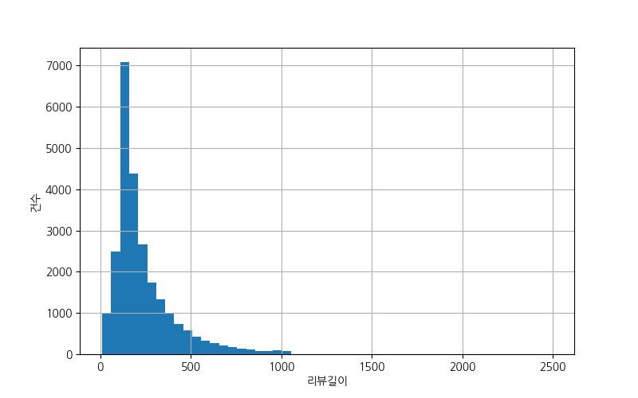
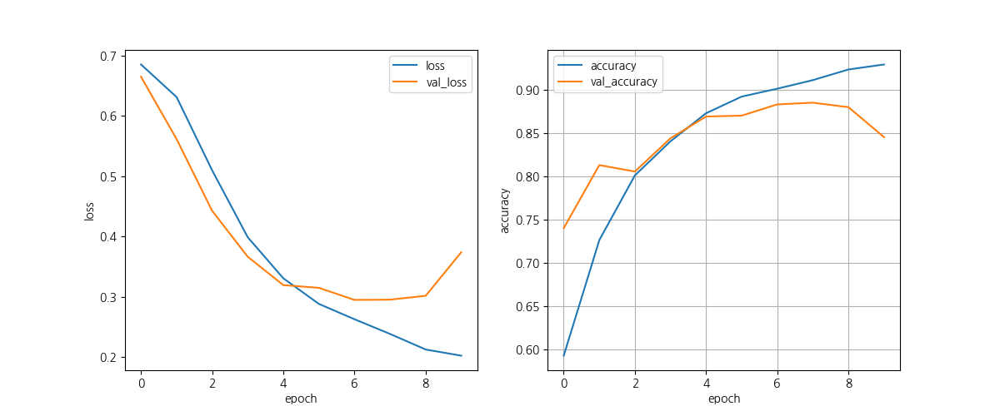
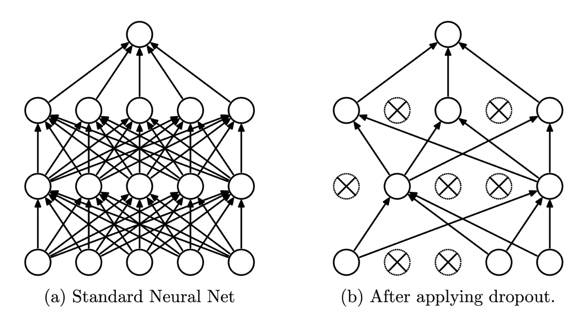
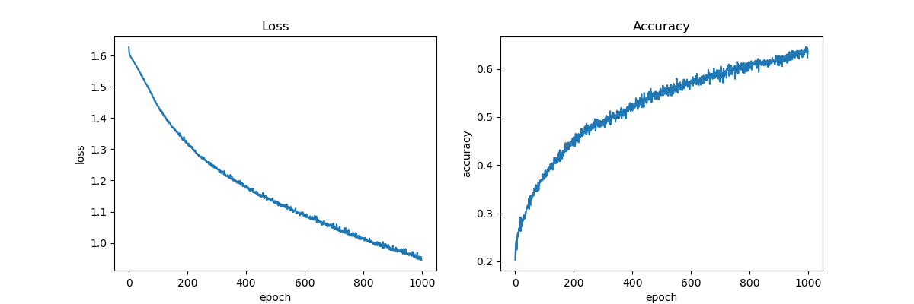
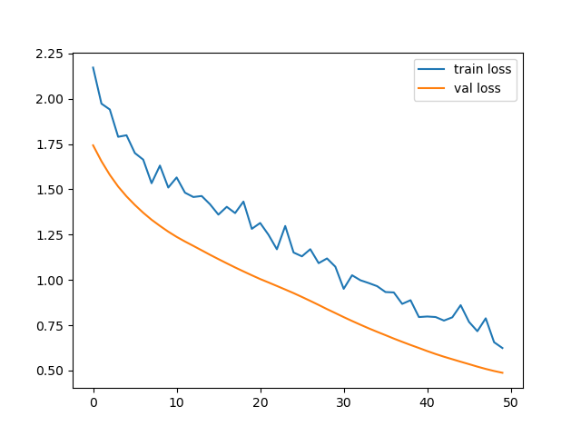
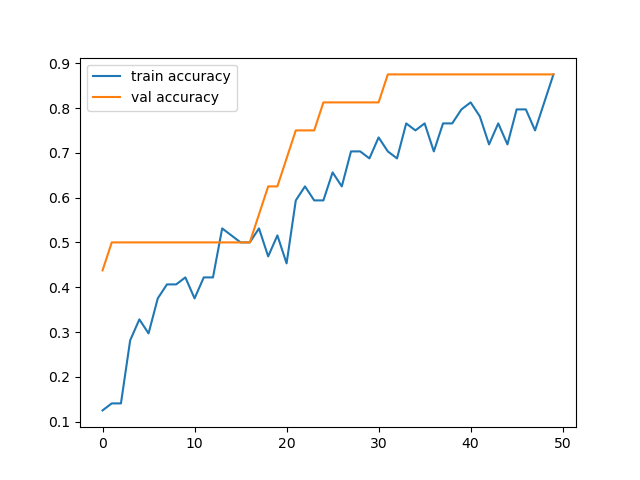
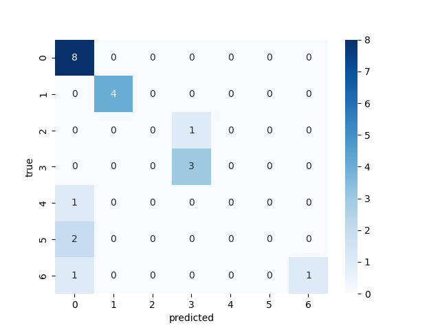
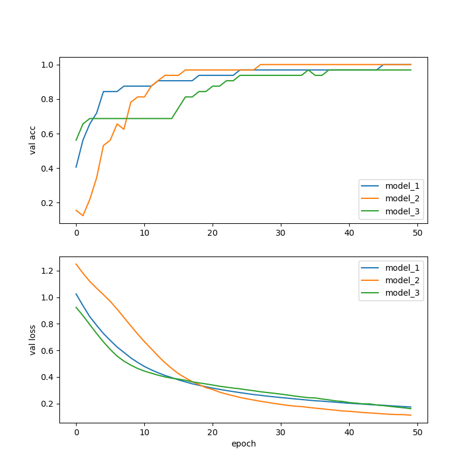
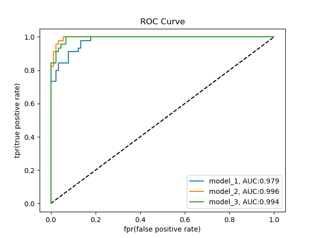

# Day 62_딥러닝 : NLP 이진분류 · 다항분류 · Softmax · ROC Curve

## 📅 2026-05-07

---
# 📄 tf17imdb.py — IMDB 영화 리뷰 이진분류 · Embedding · GlobalAveragePooling1D

---

## 🧠 개념 정리

### IMDB 데이터셋이란?

**Internet Movie Database**에서 가져온 영화 리뷰 텍스트 데이터셋  
Keras에 이미 전처리된 상태로 내장되어 있어 바로 불러올 수 있음

- **구성** : train 25,000개 / test 25,000개
- **레이블** : 0 = 부정, 1 = 긍정
- **특징** : 실제 텍스트가 아니라 **단어를 고유 번호(정수 인덱스)로 변환된 배열** 형태로 제공

```
리뷰 원문 : "this film was just brilliant..."
변환 후   : [1, 14, 22, 16, 43, 530, 973, ...]  ← 각 숫자가 단어 하나를 의미
```

---

### NLP (자연어 처리)란?

**Natural Language Processing** — 텍스트 데이터를 컴퓨터가 이해할 수 있는 숫자로 변환해 처리하는 분야  
이 실습은 텍스트 이진 분류로, 딥러닝 커리큘럼에서 NLP 첫 번째 실습에 해당함

```
회귀 → 이진분류 → 다중분류 → NLP ← 지금 여기 → CNN → RNN
```

---

### 특수 토큰 (Special Token)

IMDB 데이터는 인덱스 0~3을 특수 목적으로 예약해둠  
→ 실제 단어는 **인덱스 4번부터** 시작  
→ `word_index`에서 단어 복원 시 `index + 3` 처리 필요

|인덱스|토큰|의미|
|---|---|---|
|0|`<PAD>`|패딩 (길이 맞추기용 빈 자리)|
|1|`<START>`|문장 시작 표시|
|2|`<UNK>`|모르는 단어 (10000개 밖의 단어)|
|3|`<UNUSED>`|사용 안 함|

```python
# word_index : {"the": 1, "and": 2, ...} 형태
# 원본 index에 +3 해서 딕셔너리 생성 → 0~3번 자리를 특수 토큰용으로 확보
reverse_word_index = {
    index + 3: word
    for word, index in word_index.items()
}
```

---

### 패딩 (Padding)

리뷰마다 단어 수가 다름 → 모델은 **고정된 크기의 입력**을 요구  
→ `pad_sequences`로 길이를 `maxlen`으로 통일

```
짧은 리뷰 (50단어) → 앞에 0으로 채워 200으로 맞춤  [0, 0, 0, ..., 14, 22, 16]
긴 리뷰 (500단어)  → 앞부분 잘라서 200으로 맞춤     [43, 530, 973, ..., 32]
```

중앙값이 178이므로 `maxlen=200`으로 설정하면 절반 이상의 리뷰가 손실 없이 처리됨

---

### 밀집벡터 (Dense Vector) vs 희소벡터 (Sparse Vector)

| |희소 벡터 (원-핫)|밀집 벡터 (Embedding)|
|---|---|---|
|구성|대부분 0, 일부 1|대부분 실수값|
|차원|단어 집합 크기 (10000)|사용자 설정 (예: 32)|
|의미 반영|❌ 단어 관계 알 수 없음|✅ 유사한 단어는 가까운 벡터|
|효율|낮음 (대부분 0)|높음 (압축된 표현)|

```python
# 원-핫 인코딩 (단어 10000개면)
# "king"  → [0, 0, 0, 1, 0, 0, ... 0]  # 9999개가 0

# 밀집벡터 (Embedding 32차원)
# "king"  → [0.2, -0.1, 0.8, ...]    # 32개 실수
# "queen" → [0.19, -0.09, 0.75, ...]  # king과 가까운 벡터 → 의미 유사
```

---

### Embedding 레이어

단어 인덱스(정수)를 **밀집벡터(실수 배열)로 변환**하는 레이어  
가중치가 학습 중에 자동으로 업데이트되어 단어의 의미를 학습함

```python
Embedding(
    input_dim=10000,  # 전체 단어 사전 크기 (몇 종류의 단어가 있는가)
    output_dim=32     # 단어 하나를 몇 차원 벡터로 표현할 것인가
)
# 결과 : (batch, 200) → (batch, 200, 32)
# 200개 단어 각각이 32차원 벡터로 변환됨
# 파라미터 수 : 10000 × 32 = 320,000 → 전체 파라미터의 대부분 차지
```

---

### GlobalAveragePooling1D

`Embedding` 출력은 `(batch, 200, 32)` — 200개 단어 × 32차원  
→ Dense 레이어에 넣으려면 1차원으로 줄여야 함  
→ `GlobalAveragePooling1D` : **200개 단어 벡터를 평균내서 32차원 벡터 1개로 압축**

```
(batch, 200, 32)  →  GlobalAveragePooling1D  →  (batch, 32)
200개 단어 벡터의 평균 → 리뷰 전체의 특징 벡터
```

단어 순서는 무시되지만, 어떤 단어들이 등장했는지는 반영됨

---

### Dropout

학습 중 매 미니배치마다 지정한 확률 `p`로 일부 노드를 랜덤하게 꺼서  
특정 노드에 과의존하는 것을 방지 → **과적합 방지 정규화 기법**

- 학습 시 : 노드를 `p` 확률로 드랍 + 살아남은 노드 출력에 `1/(1-p)` 곱해서 스케일 보정
- 추론 시 : 모든 노드 참여 (드랍 없음)
- 적용 위치 : 활성함수 다음, 다음 레이어 이전

```python
Dropout(0.3)  # 30% 확률로 노드 꺼짐 → 권장 범위 0.1 ~ 0.5
```

---

## 💻 전체 실습 코드

```python
from tensorflow.keras.datasets import imdb
from tensorflow.keras.preprocessing.sequence import pad_sequences
from tensorflow.keras.models import Sequential, load_model
from tensorflow.keras.layers import Dense, Embedding, GlobalAveragePooling1D, Dropout, Input
from tensorflow.keras.callbacks import EarlyStopping, ModelCheckpoint
from tensorflow.keras.optimizers import Adam
import numpy as np
import matplotlib.pyplot as plt
import koreanize_matplotlib
import os

# ── 데이터 로드 ──
num_words = 10000
# num_words=10000 : 등장 빈도 상위 10000개 단어만 사용
# 희귀 단어는 노이즈가 될 수 있어 제거 → 모델 성능 향상 + 메모리 절약
(train_data, train_label), (test_data, test_label) = imdb.load_data(num_words=num_words)

print(type(train_data), train_data.shape)   # <class 'numpy.ndarray'> (25000,)
# shape가 (25000,)인 이유 : 리뷰마다 길이가 달라서 2D 배열이 아닌 1D 배열(of lists) 형태
print(train_data[0], len(train_data[0]))    # 첫 번째 리뷰 : 숫자 배열, 길이 218
print(train_label[0])                       # 1 → 긍정

# ── 리뷰를 원래 문장으로 복원 (참고용) ──
word_index = imdb.get_word_index()   # {"the": 1, "and": 2, ...} 형태의 딕셔너리

reverse_word_index = {
    index + 3: word      # 특수토큰(0~3)이 선행하므로 실제 단어 index에 +3
    for word, index in word_index.items()
}
# 특수 토큰 수동 등록 (인덱스별로 다른 번호에 할당해야 함 — 같은 번호에 덮어쓰면 버그)
reverse_word_index[0] = "<PAD>"     # 패딩
reverse_word_index[1] = "<START>"   # 문장 시작
reverse_word_index[2] = "<UNK>"     # 모르는 단어 (10000개 밖의 단어)
reverse_word_index[3] = "<UNUSED>"  # 사용 안 함

# 인덱스 배열 → 단어 복원
decoded_review = " ".join(
    reverse_word_index.get(i, "?") for i in train_data[0]
)
print('0번째 문장:', decoded_review)
# load_data() 안에서는 0~3번을 특수 토큰으로 쓰기 때문에 실제 리뷰에서 "the"는 인덱스 4
print('0번째 라벨:', train_label[0])   # 1 = 긍정

# ── 리뷰 길이 분포 확인 ──
review_len = [len(review) for review in train_data]
print('최소 길이 : ', np.min(review_len))    # 11
print('최대 길이 : ', np.max(review_len))    # 2494
print('평균 길이 : ', np.mean(review_len))   # 238.7
print('중앙 값 : ', np.median(review_len))   # 178.0
# 중앙값 178 → maxlen=200으로 설정하면 절반 이상의 리뷰를 손실 없이 처리

plt.figure(figsize=(8, 5))
plt.hist(review_len, bins=50)
plt.xlabel('리뷰길이')
plt.ylabel('건수')
plt.grid(True)
plt.show()

# ── 패딩 ──
# 모델은 고정 길이 입력을 요구 → pad_sequences로 길이 통일
maxlen = 200
# truncating='pre'(기본값) : 앞부분 자름 / padding='pre'(기본값) : 앞에 0 채움
x_train = pad_sequences(train_data, maxlen=maxlen)  # (25000,) → (25000, 200)
x_test  = pad_sequences(test_data,  maxlen=maxlen)  # (25000,) → (25000, 200)

# 레이블을 float32로 변환 (TensorFlow는 float32 기본)
y_train = np.array(train_label).astype(np.float32)
y_test  = np.array(test_label).astype(np.float32)

print('x_train : ', x_train.shape)  # (25000, 200)
print('x_test : ',  x_test.shape)   # (25000, 200)

# ── 모델 저장 폴더 준비 ──
MODEL_DIR = "./imdb_model/"
if not os.path.exists(MODEL_DIR):
    os.makedirs(MODEL_DIR)   # 폴더 없으면 생성

modelpath = "./imdb_model/imdb_best.keras"

# ── 모델 구성 ──
model = Sequential([
    Input(shape=(maxlen, )),        # 입력 : 길이 200의 정수 배열 (단어 인덱스)

    Embedding(
        input_dim=num_words,        # 단어 사전 크기 (10000)
        output_dim=32               # 단어 하나를 32차원 실수 벡터로 표현
        # (batch, 200) → (batch, 200, 32) : 200개 단어 각각이 32차원 벡터로 변환
    ),

    GlobalAveragePooling1D(),
    # (batch, 200, 32) → (batch, 32)
    # 200개 단어 벡터를 평균내서 리뷰 전체를 하나의 32차원 벡터로 압축
    # 단어 순서는 무시되지만 어떤 단어가 등장했는지는 반영됨

    Dense(units=32, activation='relu'),
    Dropout(0.3),                   # 30% 노드 랜덤 드랍 → 과적합 방지

    Dense(units=16, activation='relu'),
    Dropout(0.3),

    Dense(units=1, activation='sigmoid')   # 이진분류 출력 → 긍정 확률(0~1)
])

print(model.summary())
# Total params: 321,601 — Embedding이 320,000 (전체의 99%)

# ── 컴파일 ──
model.compile(
    optimizer=Adam(learning_rate=0.001),
    loss='binary_crossentropy',    # 이진분류 전용 손실함수
    metrics=['accuracy']
)

# ── 콜백 설정 ──
# EarlyStopping : val_loss 3 epoch 연속 개선 없으면 중단 + 최적 가중치 복원
early_stop = EarlyStopping(monitor='val_loss', patience=3, restore_best_weights=True)

# ModelCheckpoint : val_loss 기준 가장 좋은 모델만 파일로 저장
chkpoint = ModelCheckpoint(filepath=modelpath, monitor='val_loss', save_best_only=True, verbose=0)

# ── 학습 ──
# batch_size=512 : 텍스트 데이터는 배치 크게 써도 잘 동작, 학습 속도 향상
# validation_split=0.2 : x_train의 뒤 20% (5000개)를 검증용으로 자동 분리
history = model.fit(
    x_train, y_train,
    epochs=50,
    batch_size=512,
    validation_split=0.2,
    callbacks=[early_stop, chkpoint],
    verbose=2
)

# ── 평가 ──
loss, acc = model.evaluate(x_test, y_test, verbose=0)
print('테스트 평가 손실 : ', loss)
print('테스트 평가 정확도 : ', acc)

# ── 시각화 ──
plt.figure(figsize=(12, 5))

plt.subplot(1, 2, 1)
plt.plot(history.history['loss'], label='loss')
plt.plot(history.history['val_loss'], label='val_loss')
plt.xlabel('epoch')
plt.ylabel('loss')
plt.legend()

plt.subplot(1, 2, 2)
plt.plot(history.history['accuracy'], label='accuracy')
plt.plot(history.history['val_accuracy'], label='val_accuracy')
plt.xlabel('epoch')
plt.ylabel('accuracy')
plt.legend()
plt.grid(True)
plt.show()

# ── 저장된 best 모델 로드 후 재평가 ──
print('\n\n저장된 모델 읽어 분류 예측')
best_model = load_model(modelpath)
best_loss, best_acc = best_model.evaluate(x_test, y_test, verbose=0)
print('best_model 평가 손실 : ', best_loss)
print('best_model 평가 정확도 : ', best_acc)

# ── 예측 ──
new_data  = x_test[:5]
new_label = y_test[:5]

pred_prob  = best_model.predict(new_data, verbose=0)
# (pred_prob >= 0.5) : 0.5 이상이면 True(1), 미만이면 False(0) → 클래스 결정
pred_class = (pred_prob >= 0.5).astype(int).ravel()

print('예측 확률 : ', pred_prob.ravel())
print('예측 값 : ',   pred_class)
print('실제 값 : ',   new_label.astype(int).ravel())

for i in range(5):
    result = "긍정" if pred_class[i] == 1 else "부정"
    real   = "긍정" if new_label[i] == 1 else "부정"
    print(f'{i + 1}번 리뷰 예측:{result}, 실제:{real}, 긍정확률:{pred_prob[i][0]:.4f}')
```

---

## 📌 핵심 정리

### 리뷰 길이 분포



대부분 리뷰가 500 단어 이하 분포 → `maxlen=200` 설정 (중앙값 178 기준)

---

### 학습 결과

- EarlyStopping 발동 : Epoch 7이 best → patience=3으로 **Epoch 10에서 중단**
- **테스트 정확도 : 약 87.6%** (RNN 없이 Embedding + GlobalAveragePooling만으로 달성)



> **loss 그래프(왼쪽)** : val_loss가 Epoch 7 이후 상승 → 과적합 시작 → EarlyStopping 작동  
> **accuracy 그래프(오른쪽)** : train accuracy는 계속 상승하지만 val_accuracy는 Epoch 7 이후 정체

---

### 예측 결과

```
1번 리뷰 예측:부정, 실제:부정, 긍정확률:0.1012
2번 리뷰 예측:긍정, 실제:긍정, 긍정확률:0.9824
3번 리뷰 예측:긍정, 실제:긍정, 긍정확률:0.7382
4번 리뷰 예측:부정, 실제:부정, 긍정확률:0.3698
5번 리뷰 예측:긍정, 실제:긍정, 긍정확률:0.9376
```

5개 샘플 전부 정답 ✅

---

### 모델 구조 및 파라미터

```
Input(200,)
  ↓
Embedding(10000, 32)         → (None, 200, 32)   params: 10000×32 = 320,000
  ↓
GlobalAveragePooling1D()     → (None, 32)         params: 0
  ↓
Dense(32, relu)              → (None, 32)         params: 32×32+32 = 1,056
  ↓
Dropout(0.3)                 → (None, 32)         params: 0
  ↓
Dense(16, relu)              → (None, 16)         params: 32×16+16 = 528
  ↓
Dropout(0.3)                 → (None, 16)         params: 0
  ↓
Dense(1, sigmoid)            → (None, 1)          params: 16×1+1 = 17
                                           합계 : 321,601
```

---

### 이 모델의 한계

`GlobalAveragePooling1D`는 단어 순서를 완전히 무시함  
→ "not good"과 "good not"을 동일하게 처리  
→ 순서가 중요한 감성 분석에서는 **RNN / LSTM**이 더 유리

---

## 🔑 핵심 포인트

> **IMDB** = Keras 내장 데이터셋 — 단어가 정수 인덱스로 미리 변환된 상태로 제공  
> **num_words=10000** = 상위 10000개 단어만 사용 — 희귀 단어 노이즈 제거  
> **특수 토큰 index+3** = 0~3이 예약되어 있어 실제 단어는 4번부터 시작  
> **pad_sequences(maxlen=200)** = 앞부분 자르고 / 앞에 0 채워서 길이 통일  
> **Embedding(input_dim, output_dim)** = 단어 인덱스 → 밀집벡터 변환 / 학습 중 자동 업데이트  
> **GlobalAveragePooling1D** = 200개 단어 벡터 평균 → 32차원 벡터 1개로 압축 (순서 무시)  
> **Dropout(0.3)** = 학습 시 30% 노드 랜덤 드랍 → 과적합 방지 / 추론 시는 모든 노드 참여  
> **batch_size=512** = 텍스트 데이터는 배치 크게 써도 잘 작동 + 학습 속도 향상  
> **EarlyStopping(patience=3)** = val_loss 3 epoch 개선 없으면 중단 + 최적 가중치 복원  
> **전체 파라미터 321,601 중 320,000이 Embedding** = 단어 임베딩이 가장 많은 파라미터 차지


---
# 📄 개념 — 밀집벡터 · Dropout

---

## 🧠 밀집벡터 (Dense Vector)

대부분의 차원이 실수값으로 채워진 **고정 크기의 저차원 벡터**  
원-핫 인코딩(희소 표현)과 달리 단어 간 의미적 유사성을 벡터 거리로 표현

| |희소 벡터 (원-핫)|밀집 벡터 (Embedding)|
|---|---|---|
|구성|대부분 0, 일부 1|대부분 실수값|
|차원|단어 집합 크기 (매우 큼)|사용자 설정 (예: 32~768)|
|의미 반영|❌|✅ 유사 단어 = 가까운 벡터|

```python
# 원-핫 (단어 10000개)
"king"  → [0, 0, 0, 1, 0, 0, ... 0]   # 9999개가 0

# 밀집벡터 (32차원)
"king"  → [0.2, -0.1, 0.8, 0.03, ...]
"queen" → [0.19, -0.09, 0.75, 0.5, ...]  # king과 가까운 벡터 → 의미 유사
```

- **학습 기반** : 뉴럴네트워크(`Embedding` 레이어)가 학습 중 자동으로 벡터값 업데이트
- **고효율** : 희소벡터보다 차원이 훨씬 작아 연산 부담 감소

---

## 🧠 Dropout

학습 중 매 미니배치마다 일부 노드를 **확률 p로 랜덤하게 꺼서** 과적합을 방지하는 정규화 기법



> **(a) 일반 신경망** : 모든 노드가 연결됨  
> **(b) Dropout 적용** : X 표시된 노드가 랜덤 드랍 → 연결된 가중치도 함께 끊김  
> 매 미니배치마다 드랍되는 노드가 바뀜 → 특정 노드에 과의존 방지

### 학습 vs 추론

| |학습 시|추론 시|
|---|---|---|
|노드|확률 p로 랜덤 드랍|모든 노드 참여|
|스케일 보정|출력에 `1/(1-p)` 곱함|없음|

```python
Dropout(0.3)
# 학습 : 30% 노드 꺼짐, 남은 노드 출력에 1/0.7 ≈ 1.43 곱해서 스케일 보정
# 추론 : 드랍 없이 전체 노드 참여 (Keras/TF 자동 처리)
# 권장 범위 : 0.1 ~ 0.5
# 위치 : 활성함수(relu 등) 다음, 다음 레이어 이전
# 입력층 이전과 출력층 이후에는 적용하지 않음
```

### 📌 핵심

> **Dropout** = 학습 방해로 과적합 방지 → 수렴 속도 느려질 수 있지만 일반화 성능 향상  
> **p는 하이퍼파라미터** = 0.1 단위로 튜닝 (보통 0.2~0.5)  
> **추론 시 자동 비활성화** = `model.predict()` 호출 시 Keras가 자동으로 eval 모드 전환

---
# 📄 tf18softmax.py — 소프트맥스 · 다항분류 · to_categorical

---

## 🧠 개념 정리

### Softmax 함수

입력받은 실수 벡터를 **0~1 사이의 확률값으로 정규화**하여, 모든 출력의 합이 1이 되도록 만드는 함수  
다중 클래스 분류(Multi-class Classification) 출력층 활성화 함수로 사용

$$P(z_i) = \frac{e^{z_i}}{\sum_{j=1}^{K} e^{z_j}}$$

- 지수함수(`e^z`)를 사용해 큰 값은 더 크게, 작은 값은 더 작게 → 클래스 간 구분 명확화
- 출력값을 확률로 해석 가능 → **가장 큰 확률을 가진 클래스가 예측 결과**

```python
# 직접 구현 예시
data = np.array([0.3, 2.8, 4.0])
softmax(data) → [0.019, 0.245, 0.737]
# 합 : 0.019 + 0.245 + 0.737 ≈ 1.0
# 세 번째 클래스(4.0)가 가장 높은 확률 → 예측 클래스 = 2번 (index)
```

### 오버플로우 방지 테크닉

`e^z`는 z가 크면 수치가 폭발할 수 있음 → 최댓값을 빼서 안정화  
수학적 결과는 동일하지만 수치 안정성 확보

```python
c = np.max(a)        # 배열에서 최댓값 추출
exp_a = np.exp(a - c)  # 각 원소에서 최댓값을 빼고 지수함수 적용 → 최대값이 e^0=1로 제한
```

---

### Sigmoid vs Softmax

| |Sigmoid|Softmax|
|---|---|---|
|용도|**이진 분류**|**다중 클래스 분류**|
|출력 뉴런 수|1개|클래스 수만큼|
|출력 범위|0~1|0~1 (합=1)|
|손실함수|`binary_crossentropy`|`categorical_crossentropy`|

---

### to_categorical (원핫인코딩)

정수 레이블을 **원핫 벡터로 변환**  
`categorical_crossentropy` 손실함수는 레이블이 원핫 형태여야 함

```python
ydata = np.random.randint(5, size=(1000, 1))   # [2], [0], [4], ...
ydata = to_categorical(ydata, num_classes=5)

# 변환 결과
# 클래스 2 → [0, 0, 1, 0, 0]
# 클래스 0 → [1, 0, 0, 0, 0]
# 클래스 4 → [0, 0, 0, 0, 1]
```

> 원핫인코딩 없이 정수 레이블을 그대로 쓰려면 `sparse_categorical_crossentropy` 사용

---

### np.argmax(axis=1)

Softmax 출력(확률 배열)에서 **가장 큰 값의 인덱스(클래스 번호)** 를 반환

```python
pred = [[0.1, 0.7, 0.05, 0.1, 0.05],   # → argmax = 1
        [0.3, 0.1, 0.05, 0.5, 0.05]]   # → argmax = 3

np.argmax(pred, axis=1)  # axis=1 : 행 방향(각 샘플)에서 최대값 인덱스
# → [1, 3]
```

---

## 💻 전체 실습 코드

```python
import numpy as np
from tensorflow.keras.models import Sequential
from tensorflow.keras.layers import Dense, Input
from tensorflow.keras.utils import to_categorical
import matplotlib.pyplot as plt

# ── Softmax 함수 직접 구현 ──
def softmaxFunc(a):
    c = np.max(a)              # 최댓값 추출 → 오버플로우 방지용
    exp_a = np.exp(a - c)      # 각 원소 - 최댓값 후 지수함수 적용
    sum_exp_a = np.sum(exp_a)  # 지수함수 합 (분모)
    return exp_a / sum_exp_a   # 각 지수함수 / 전체 합 → 확률값

data = np.array([0.3, 2.8, 4.0])
print(softmaxFunc(data))
# → [0.019, 0.245, 0.737] : 합 = 1.0, 세 번째 클래스가 73.7%

# ── 데이터 생성 ──
np.random.seed(1)

# 1000개 샘플, 각 샘플은 12개 feature (시험 점수)
xdata = np.random.random((1000, 12))         # shape : (1000, 12)

# 0~4 사이의 정수 레이블 (5개 과목 중 하나)
ydata = np.random.randint(5, size=(1000, 1)) # shape : (1000, 1)

print(xdata[:2])
print(ydata[:2])   # [[2], [0]] 형태

# 정수 레이블 → 원핫 벡터 변환 (categorical_crossentropy 사용 시 필수)
ydata = to_categorical(ydata, num_classes=5)  # shape : (1000, 5)
print(ydata[:2])
# [[0. 0. 1. 0. 0.]   ← 클래스 2
#  [1. 0. 0. 0. 0.]]  ← 클래스 0

# ── 모델 구성 ──
model = Sequential()
model.add(Input(shape=(12, )))                  # 입력 : feature 12개
model.add(Dense(units=32, activation='relu'))   # 은닉층1
model.add(Dense(units=16, activation='relu'))   # 은닉층2
model.add(Dense(units=5, activation='softmax')) # 출력층 : 5개 클래스 확률 출력
# softmax → 5개 출력값의 합 = 1.0

print(model.summary())

# ── 컴파일 ──
model.compile(
    optimizer='adam',
    loss='categorical_crossentropy',  # 다중분류 전용 손실함수 (레이블이 원핫 형태여야 함)
    metrics=['accuracy']
)

# ── 학습 ──
# shuffle=True : 매 epoch마다 데이터 순서를 섞어서 학습 (기본값이지만 명시)
history = model.fit(xdata, ydata, epochs=1000, batch_size=32, verbose=2, shuffle=True)

model_eval = model.evaluate(xdata, ydata, verbose=0)
print('모델 평가 결과 : ', model_eval)   # [loss, accuracy]

# ── 시각화 ──
fig, (ax1, ax2) = plt.subplots(1, 2, figsize=(12, 4))

ax1.plot(history.history['loss'])
ax1.set_title('Loss')
ax1.set_xlabel('epoch')
ax1.set_ylabel('loss')

ax2.plot(history.history['accuracy'])
ax2.set_title('Accuracy')
ax2.set_xlabel('epoch')
ax2.set_ylabel('accuracy')
plt.show()

# ── 기존 데이터로 예측 ──
print('예측값(확률) : ', model.predict(xdata[:5]))
# np.argmax(..., axis=1) : 각 샘플에서 가장 높은 확률의 클래스 인덱스 반환
print('예측 클래스 : ', np.argmax(model.predict(xdata[:5]), axis=1))

# 실제 레이블도 원핫 → 정수로 변환해서 비교
print('실제값(원핫) : ', ydata[:5])
print('실제 클래스 : ', [int(i) for i in np.argmax(ydata[:5], axis=1)])

# ── 새로운 데이터로 예측 ──
x_new = np.random.random([1, 12])   # 새 샘플 1개 (shape : (1, 12))
print(x_new)

new_pred = model.predict(x_new)
print('분류 결과(확률) : ', new_pred)           # 5개 클래스 확률
print('분류 결과합 : ', np.sum(new_pred))        # ≈ 1.0 확인용
print('예측 클래스 번호 : ', np.argmax(new_pred)) # 가장 높은 확률의 클래스 인덱스

# 클래스 번호 → 과목명으로 변환
classes = np.array(['국어', '영어', '수학', '과학', '체육'])
# np.argmax(new_pred, axis=1)[0] : (1,5) 배열에서 인덱스 추출 → classes 배열 인덱싱
print('예측 과목 : ', classes[np.argmax(new_pred, axis=1)[0]])
```

---

## 📌 핵심 정리

### 학습 결과



> **Loss** : 1000 epoch에 걸쳐 1.6 → 0.94로 꾸준히 감소  
> **Accuracy** : 0.2(랜덤수준, 5클래스) → 0.63으로 상승  
> 랜덤 데이터라 정보가 없어 63% 수준이 한계 — 실제 데이터에선 더 높은 정확도 기대

```
모델 평가 결과 : loss=0.9415, accuracy=0.631
```

### 예측 결과

```
예측 클래스 : [2, 0, 3, 4, 1]
실제 클래스 : [2, 0, 4, 4, 1]
# 3번째 샘플(index 2) 오분류 : 예측 3, 실제 4

새 샘플 예측 확률 : [0.010, 0.105, 0.063, 0.312, 0.510]
→ 가장 높은 확률 : 클래스 4 (50.97%)
→ 예측 과목 : 체육

분류 결과합 : 0.99999994 ≈ 1.0  ✅ softmax 정상 작동
```

---

### 이진분류 vs 다항분류 비교

| |이진분류|다항분류|
|---|---|---|
|출력 활성함수|`sigmoid`|`softmax`|
|출력 뉴런 수|1|클래스 수 (예: 5)|
|손실함수|`binary_crossentropy`|`categorical_crossentropy`|
|레이블 형태|0 or 1|원핫 벡터 또는 정수|
|예측 변환|`(pred >= 0.5)`|`np.argmax(pred, axis=1)`|

---

## 🔑 핵심 포인트

> **Softmax** = 지수함수 / 지수함수 합 → 출력값의 합이 항상 1 (확률로 해석)  
> **오버플로우 방지** = `np.exp(a - np.max(a))` — 수학적 결과 동일, 수치 안정성 확보  
> **to_categorical** = 정수 레이블 → 원핫 벡터 변환 (`categorical_crossentropy` 사용 시 필수)  
> **sparse_categorical_crossentropy** = 원핫 변환 없이 정수 레이블 그대로 사용 가능  
> **np.argmax(pred, axis=1)** = 각 샘플에서 가장 높은 확률의 클래스 인덱스 반환  
> **출력층 뉴런 수 = 클래스 수** = 5개 과목 → `Dense(units=5, activation='softmax')`  
> **classes[index]** = 클래스 번호를 배열 인덱싱으로 과목명으로 변환


---
# 📄 tf19diabet.py — 이항분류 vs 다항분류 · sigmoid vs softmax · 당뇨 예측

---

## 🧠 개념 정리

### 실습 목표

**이항분류(sigmoid)와 다항분류(softmax)는 결국 같은 문제를 다르게 표현한 것**  
0/1 두 클래스를 sigmoid 1개로 풀 수도 있고, softmax 2개로 풀 수도 있음을 확인

---

### 데이터셋 — diabetes.csv

당뇨병 예측 데이터 (피마 인디언 당뇨 데이터셋과 동일 계열)

- **shape** : (759, 9) — 759명, 8개 feature + 1개 label
- **feature** : 혈당, 혈압, BMI 등 8개 (이미 표준화된 상태로 제공)
- **label** : 0 = 정상, 1 = 당뇨 (이진 레이블)

```python
datas = np.loadtxt(url, delimiter=',')
# delimiter=',' : CSV 파일이므로 쉼표 구분자 지정 필수
# np.loadtxt 기본 구분자는 공백 → 지정 안 하면 ValueError 발생

x = datas[:, 0:8]   # 앞 8개 컬럼 : feature
y = datas[:, -1]    # 마지막 컬럼 : label (0 or 1)
```

---

### 이항분류 vs 다항분류로 같은 문제 풀기

||이항분류 (sigmoid)|다항분류 (softmax)|
|---|---|---|
|출력 뉴런|**1개**|**클래스 수 (2개)**|
|활성함수|`sigmoid`|`softmax`|
|손실함수|`binary_crossentropy`|`categorical_crossentropy`|
|레이블 형태|0 or 1 (정수)|원핫 벡터 `[1,0]` or `[0,1]`|
|예측 변환|`(pred >= 0.5)`|`np.argmax(pred, axis=1)`|

```
sigmoid : 출력 1개 → 당뇨 확률(0~1) → 0.5 기준으로 0 or 1 결정
softmax : 출력 2개 → [정상확률, 당뇨확률] → argmax로 클래스 결정
```

> **결론** : 이진 분류는 sigmoid가 더 단순하고 자연스러움  
> softmax 2클래스는 이진분류도 가능하다는 것을 보여주는 예시

---

### to_categorical — 이진 레이블 원핫 변환

```python
y_train = to_categorical(y_train)
# 0 → [1, 0]  (정상)
# 1 → [0, 1]  (당뇨)
# shape : (531,) → (531, 2)
```

---

### metrics=['acc'] vs metrics=['accuracy']

```python
# 구버전 Keras : 'acc' 사용
# 현재 Keras(TF 2.x) : 'accuracy' 사용 권장
# 'acc'도 동작하지만 history key가 'acc'로 저장됨
model.compile(metrics=['acc'])       # 구버전 방식
model.compile(metrics=['accuracy'])  # 권장 방식
```

---

### softmax scores가 loss만 출력되는 이유

```python
model.compile(optimizer='adam', loss='categorical_crossentropy')
# metrics 지정 안 함 → evaluate() 결과가 loss 값 하나만 반환
# softmax scores : 0.5536 ← loss 값만

# metrics=['accuracy'] 추가했다면
# softmax scores : [0.5536, 0.79xx] 형태로 반환
```

---

## 💻 전체 실습 코드

```python
import numpy as np
from tensorflow.keras.models import Sequential
from tensorflow.keras.layers import Dense, Input
from sklearn.model_selection import train_test_split

# ── 데이터 로드 ──
# np.loadtxt : 텍스트 파일을 numpy 배열로 로드
# delimiter=',' : CSV 형식이므로 쉼표 구분자 지정 필수
datas = np.loadtxt(
    'https://raw.githubusercontent.com/pykwon/python/refs/heads/master/testdata_utf8/diabetes.csv',
    delimiter=','
)
print(datas.shape)      # (759, 9) : 759명, 8 feature + 1 label
print(datas[:1])        # 첫 번째 샘플 확인 (이미 표준화된 값)
print(set(datas[:, -1])) # {0.0, 1.0} : 레이블이 0과 1 두 가지만 있음을 확인

# ── train/test split ──
# datas[:, 0:8] : 앞 8개 컬럼 → feature
# datas[:, -1]  : 마지막 컬럼 → label
x_train, x_test, y_train, y_test = train_test_split(
    datas[:, 0:8], datas[:, -1],
    test_size=0.3, shuffle=True, random_state=123
)
print(x_train.shape, x_test.shape)   # (531, 8) (228, 8)

# ════════════════════════════════════════
# 1. 이항분류 (sigmoid)
# ════════════════════════════════════════
print('\n이항분류(sigmoid)')
model = Sequential()
model.add(Input(shape=(8, )))
model.add(Dense(units=64, activation='relu'))
model.add(Dense(units=32, activation='relu'))
model.add(Dense(units=1, activation='sigmoid'))  # 출력 1개 → 당뇨 확률(0~1)

model.compile(
    optimizer='adam',
    loss='binary_crossentropy',  # 이진분류 전용 손실함수
    metrics=['acc']              # 구버전 방식 (현재는 'accuracy' 권장)
)
model.fit(x_train, y_train, epochs=100, batch_size=32, verbose=0)

scores = model.evaluate(x_test, y_test, verbose=0)
print('sigmoid scores : ', scores)   # [loss, accuracy]
# → [0.4603, 0.8026] : 정확도 80.3%

# ════════════════════════════════════════
# 2. 다항분류 (softmax) — 이진 문제를 2클래스 다항분류로 처리
# ════════════════════════════════════════
print('\n다항분류(softmax)')
from tensorflow.keras.utils import to_categorical

# 정수 레이블 → 원핫 벡터 변환 (categorical_crossentropy 사용 시 필수)
# 0 → [1, 0] (정상) / 1 → [0, 1] (당뇨)
y_train = to_categorical(y_train)  # shape : (531,) → (531, 2)
y_test  = to_categorical(y_test)   # shape : (228,) → (228, 2)
print(y_train[:3])
# [[1. 0.]   ← 정상
#  [0. 1.]   ← 당뇨
#  [0. 1.]]  ← 당뇨

model = Sequential()
model.add(Input(shape=(8, )))
model.add(Dense(units=64, activation='relu'))
model.add(Dense(units=32, activation='relu'))
model.add(Dense(units=2, activation='softmax'))  # 출력 2개 → [정상확률, 당뇨확률]

model.compile(
    optimizer='adam',
    loss='categorical_crossentropy'
    # metrics 미지정 → evaluate() 결과가 loss 값 하나만 반환
)
model.fit(x_train, y_train, epochs=100, batch_size=32, verbose=0)

scores = model.evaluate(x_test, y_test, verbose=0)
print('softmax scores : ', scores)   # loss만 출력 → 0.5537
# metrics=['accuracy'] 추가했다면 [loss, accuracy] 형태로 반환
```

---

## 📌 핵심 정리

### 실행 결과

```
sigmoid scores  : [0.4603, 0.8026]   → loss=0.46, accuracy=80.3%
softmax scores  : 0.5537             → loss만 출력 (metrics 미지정)
```

> sigmoid 정확도 **80.3%** — 이진분류에 더 자연스러운 구조  
> softmax는 metrics를 지정하지 않아 loss만 반환됨 → 실제 정확도 비교 불가

---

### 두 방식의 핵심 차이

```
sigmoid 방식
  레이블 : [0, 1, 0, 1, ...]          (정수 그대로)
  출력   : [[0.12], [0.87], ...]       (확률 1개)
  예측   : (pred >= 0.5).astype(int)

softmax 방식
  레이블 : [[1,0], [0,1], [1,0], ...]  (원핫 변환)
  출력   : [[0.88,0.12], [0.13,0.87]] (확률 2개)
  예측   : np.argmax(pred, axis=1)
```

---

## 🔑 핵심 포인트

> **이항분류 = 다항분류(2클래스)** = 같은 문제를 다르게 표현한 것  
> **sigmoid** = 출력 1개, `binary_crossentropy` / **softmax 2클래스** = 출력 2개, `categorical_crossentropy`  
> **delimiter=','** = np.loadtxt로 CSV 로드 시 필수 — 미지정 시 ValueError 발생  
> **to_categorical** = 정수 레이블 → 원핫 변환 (0→[1,0], 1→[0,1])  
> **metrics 미지정** = evaluate() 결과가 loss 스칼라 하나만 반환  
> **'acc' vs 'accuracy'** = 현재 Keras는 'accuracy' 권장 — 'acc'는 구버전 방식

---
# 📄 tf20anitype.py — Zoo 동물 분류 · sparse_categorical_crossentropy · 혼동행렬

---

## 🧠 개념 정리

### 실습 목표

Zoo 데이터셋으로 동물의 특징(털, 깃털, 다리 수 등 16개 feature)을 이용해  
**7가지 동물 종류(포유류, 조류, 파충류 등)를 분류**하는 다중 클래스 분류 모델

---

### 데이터셋 — zoo.csv

|컬럼|의미|타입|
|---|---|---|
|hair ~ catsize|동물 특징 16개|Boolean / Numeric|
|type|동물 종류 0~6 (원본 1~7)|**label**|

- **shape** : (101, 17) — 101마리, 16 feature + 1 label
- **클래스** : 0~6 (7종류) — 원본 CSV는 1~7이었으나 이 데이터는 이미 0부터 시작
- **legs** : 0, 2, 4, 5, 6, 8 중 하나 (유일한 연속형 feature)

```
클래스 0 : 포유류
클래스 1 : 조류
클래스 2 : 파충류
클래스 3 : 어류
클래스 4 : 양서류
클래스 5 : 곤충/절지류
클래스 6 : 기타
```

---

### sparse_categorical_crossentropy vs categorical_crossentropy

다중 클래스 분류에서 레이블 형태에 따라 손실함수를 선택

| |`categorical_crossentropy`|`sparse_categorical_crossentropy`|
|---|---|---|
|레이블 형태|원핫 벡터 `[0,0,1,0,...]`|정수 `2`|
|`to_categorical` 필요|✅ 필요|❌ 불필요|
|내부 동작|동일|내부에서 자동 원핫 처리|

```python
# categorical_crossentropy 사용 시
y = to_categorical(y)   # 정수 → 원핫 변환 필수

# sparse_categorical_crossentropy 사용 시
# 정수 레이블 그대로 사용 → 변환 불필요
model.compile(loss='sparse_categorical_crossentropy')
```

> 데이터 샘플이 많거나 클래스 수가 많을 때 `sparse_categorical_crossentropy`가 메모리 효율적

---

### stratify — 클래스 비율 유지 split

101개라는 적은 데이터에서 특정 클래스가 train/test 어느 한쪽에 몰리는 것을 방지

```python
train_test_split(x, y, stratify=y_data)
# stratify=y_data : y_data의 클래스 비율을 train/test에 동일하게 유지
# 데이터가 적을수록 중요 — 없으면 희귀 클래스가 test에만 몰릴 수 있음
```

---

### 혼동행렬 (Confusion Matrix)

다중 분류에서 **어떤 클래스를 어떤 클래스로 잘못 분류했는지** 한눈에 확인하는 행렬

```
실제\예측   0  1  2  3  4  5  6
클래스 0  [ 8  0  0  0  0  0  0 ]  → 8개 모두 정답
클래스 1  [ 0  4  0  0  0  0  0 ]  → 4개 모두 정답
클래스 2  [ 0  0  0  1  0  0  0 ]  → 3(어류)으로 오분류
클래스 4  [ 0  0  0  0  0  0  1 ]  → 6(기타)으로 오분류
```

- **대각선** : 정답 (예측 = 실제)
- **대각선 외** : 오분류 (어디서 어디로 틀렸는지 확인 가능)

---

### UndefinedMetricWarning

```
UndefinedMetricWarning: Precision is ill-defined and being set to 0.0
in labels with no predicted samples.
```

테스트 셋에서 특정 클래스를 **한 번도 예측하지 않은 경우** 발생하는 경고  
클래스 2, 4처럼 테스트 샘플이 1개뿐인 희귀 클래스에서 주로 발생  
데이터가 101개로 매우 적어서 생기는 현상 → **에러가 아님**

---

### np.argmax + 1 — 클래스 번호 복원

```python
np.argmax(probs) + 1
# 모델 출력 인덱스는 0~6 → 원래 동물 종류 번호 1~7로 복원
# 이 데이터셋은 y_data가 이미 0부터 시작해서 -1을 안 했음
# 예측 클래스 4 → +1 → 5번 종류 (곤충/절지류)
```

---

## 💻 전체 실습 코드

```python
import pandas as pd
import numpy as np
from tensorflow.keras.models import Sequential
from tensorflow.keras.layers import Dense, Input, Dropout
from sklearn.model_selection import train_test_split

# ── 데이터 로드 ──
datas = pd.read_csv('https://raw.githubusercontent.com/pykwon/python/refs/heads/master/testdata_utf8/zoo.csv')
print(datas.head(3))
print(datas.info())

# ── feature / label 분리 ──
# iloc[:, :-1] : 마지막 컬럼(type) 제외한 나머지 → feature 16개
# iloc[:, -1]  : 마지막 컬럼 → label (동물 종류 0~6)
x_data = datas.iloc[:, :-1].astype("float32").values   # shape : (101, 16)
y_data = datas.iloc[:, -1].astype("int32").values       # shape : (101,)

print(x_data[0], x_data.shape)
print(y_data[0], sorted(set(map(int, y_data))))   # 0 [0, 1, 2, 3, 4, 5, 6]

np.random.seed(42)

# ── train/test split ──
# stratify=y_data : 7개 클래스 비율을 train/test에 동일하게 유지 (데이터 101개로 적으므로 중요)
x_train, x_test, y_train, y_test = train_test_split(
    x_data, y_data, test_size=0.2, random_state=42, stratify=y_data
)
print(x_train.shape, x_test.shape)   # (80, 16) (21, 16)

nb_classes = len(set(y_data))   # 7 → 출력층 뉴런 수로 사용 가능

# ── 모델 구성 ──
model = Sequential([
    Input(shape=(x_train.shape[1], )),      # 입력 : feature 16개 (x_train.shape[1]=16)
    Dense(units=64, activation='relu'),
    Dropout(rate=0.3),                       # 30% 드랍 → 과적합 방지
    Dense(units=32, activation='relu'),
    Dropout(rate=0.3),
    Dense(units=7, activation='softmax'),    # 출력 : 7개 클래스 확률
])
print(model.summary())

# ── 컴파일 ──
model.compile(
    optimizer='adam',
    loss='sparse_categorical_crossentropy',  # 정수 레이블 그대로 사용 → to_categorical 불필요
    # loss='categorical_crossentropy',       # 원핫 레이블 사용 시 이쪽 선택
    metrics=['accuracy']
)

# ── 학습 ──
# validation_split=0.2 : x_train(80개)의 20% = 16개를 검증용으로 분리
# batch_size=32 : 전체 80개 중 32개씩 → 2~3 step/epoch
history = model.fit(x_train, y_train, epochs=50, batch_size=32, validation_split=0.2, verbose=2)

loss, acc = model.evaluate(x_test, y_test, verbose=0)
print(f'loss:{loss:.4f}, acc:{acc:.4f}')   # loss:0.4757, acc:0.8571

# ── 시각화 ──
import matplotlib.pyplot as plt

plt.plot(history.history['loss'], label='train loss')
plt.plot(history.history['val_loss'], label='val loss')
plt.legend()
plt.show()

plt.plot(history.history['accuracy'], label='train accuracy')
plt.plot(history.history['val_accuracy'], label='val accuracy')
plt.legend()
plt.show()

# ── 혼동행렬 (Confusion Matrix) ──
from sklearn.metrics import classification_report, confusion_matrix
import seaborn as sns

# np.argmax(axis=1) : 각 샘플에서 가장 높은 확률의 클래스 인덱스 반환
y_pred = np.argmax(model.predict(x_test), axis=1)

# classification_report : 클래스별 precision, recall, f1-score 출력
print('classification_report : \n', classification_report(y_test, y_pred))
# UndefinedMetricWarning : 테스트셋에서 예측하지 못한 클래스가 있을 때 발생 → 에러 아님

cm = confusion_matrix(y_test, y_pred)
print(cm)
# 대각선 = 정답 / 대각선 외 = 오분류 (어떤 클래스를 어디로 잘못 분류했는지 확인)

sns.heatmap(cm, annot=True, fmt='d', cmap='Blues')
# annot=True : 셀 안에 숫자 표시 / fmt='d' : 정수 형식
plt.xlabel('predicted')
plt.ylabel('true')
plt.show()

# ── 새로운 데이터로 예측 ──
print('\n새로운 값으로 분류 예측')
# 특징 : hair=1, milk=1, toothed=1, backbone=1, breathes=1, venomous=1 → 포유류 특성
new_data = np.array([[1,0,0,1,1,0,0,1,1,1,1,0,0,4,1,0]], dtype='float32')
probs = model.predict(new_data)
print('예측 확률 : ', probs)           # 7개 클래스 확률
print('예측 클래스 : ', np.argmax(probs) + 1)
# np.argmax(probs) : 0~6 인덱스 → +1로 원래 동물 종류 번호(1~7) 복원
```

---

## 📌 핵심 정리

### 학습 결과

```
loss:0.4757, acc:0.8571  → 테스트 정확도 85.7% (21개 중 18개 정답)
```



> **Loss** : train loss(파랑)가 진동하며 감소 / val loss(주황)가 더 낮고 안정적으로 감소  
> train loss가 val loss보다 높은 것은 Dropout이 학습 시에만 적용되기 때문 — 정상 현상



> **Accuracy** : val accuracy(주황)가 train accuracy(파랑)보다 높게 나옴  
> 데이터가 101개로 매우 적어 train/val 분포 차이가 생긴 것 — Dropout 영향도 있음

### 혼동행렬



> **대각선(정답)** : 클래스 0(포유류), 1(조류), 3(어류)은 완벽 분류  
> **오분류** : 클래스 2→3, 4→0, 5→0, 6→6 형태로 오분류 확인 가능  
> 테스트 샘플이 1~2개뿐인 희귀 클래스는 오분류가 발생하기 쉬움

### classification_report

```
              precision    recall  f1-score   support
           0       1.00      1.00      1.00    8 (포유류)
           1       1.00      1.00      1.00    4 (조류)
           2       0.00      0.00      0.00    1 (파충류) ← 오분류
           3       0.75      1.00      0.86    3 (어류)
           4       0.00      0.00      0.00    1 (양서류) ← 오분류
           5       0.67      1.00      0.80    2 (곤충)
           6       0.50      0.50      0.50    2 (기타)

    accuracy                           0.86   21
```

> 클래스 2(파충류), 4(양서류)는 테스트 샘플이 1개뿐 → 오분류 시 precision=0  
> 데이터가 101개로 매우 적어 희귀 클래스 학습이 어려운 것이 원인

### 새 데이터 예측 결과

```
예측 확률 : [[0.296, 0.060, 0.032, 0.570, 0.026, 0.003, 0.012]]
예측 클래스 : 4  → +1 → 종류 4번
```

---

## 🔑 핵심 포인트

> **sparse_categorical_crossentropy** = 정수 레이블 그대로 사용 — `to_categorical` 불필요  
> **categorical_crossentropy** = 원핫 레이블 필요 — `to_categorical` 변환 후 사용  
> **stratify=y_data** = 희귀 클래스가 한쪽에 몰리지 않도록 비율 유지 분리 (데이터 적을수록 중요)  
> **Dropout(rate=0.3)** = 학습 시 30% 노드 드랍 → 과적합 방지  
> **confusion_matrix** = 대각선은 정답, 대각선 외는 오분류 — 어떤 클래스가 어디로 틀리는지 확인  
> **UndefinedMetricWarning** = 예측하지 못한 클래스가 있을 때 발생 — 에러 아님  
> **np.argmax(probs) + 1** = 모델 출력 인덱스(0~6) → 원래 레이블(1~7)로 복원  
> **x_train.shape[1]** = feature 수를 하드코딩 않고 동적으로 가져오는 패턴

---
# 📄 tf21iris.py — Iris 꽃 분류 · 클로저 모델 팩토리 · ROC Curve · 레이어 수 비교

---

## 🧠 개념 정리

### 실습 목표

Iris 데이터셋으로 꽃 3종류를 분류하되  
**은닉층 수(1개 / 2개 / 3개)에 따른 모델 성능 차이**를 비교하고  
ROC Curve로 분류기 성능을 시각적으로 평가

---

### 데이터셋 — Iris

sklearn 내장 데이터셋. 꽃잎/꽃받침 크기 4개 feature로 3종 분류

|컬럼|의미|
|---|---|
|sepal length/width|꽃받침 길이/너비|
|petal length/width|꽃잎 길이/너비|
|target|0=setosa, 1=versicolor, 2=virginica|

- **shape** : (150, 4) — 150개 샘플, 4개 feature
- `iris.data` : feature / `iris.target` : 정수 레이블 (0, 1, 2)

---

### OneHotEncoder vs pd.get_dummies

두 방법 모두 범주형 → 원핫 변환이지만 사용법이 다름

```python
# OneHotEncoder (sklearn)
onehot = OneHotEncoder(categories='auto')
y = onehot.fit_transform(y[:, None]).toarray()
# y[:, None] : (150,) → (150, 1) reshape (2D 배열로 변환 필요)
# .toarray() : sparse matrix → numpy 배열 변환
# 결과 shape : (150,) → (150, 3)

# pd.get_dummies (pandas) — 더 간단
# y = pd.get_dummies(y).values
```

---

### 클로저(Closure) — 모델 팩토리 패턴

함수 안에 함수를 정의하고, **외부 함수의 변수를 내부 함수가 기억**하는 패턴  
모델 구조를 함수로 추상화해 여러 변형 모델을 간결하게 생성할 때 유용

```python
def create_custom_model(input_dim, output_dim, out_nodes, n, model_name):
    def create_model():           # 내부 함수
        model = Sequential(name=model_name)
        model.add(Input(shape=(input_dim, )))
        for _ in range(n):        # n번 반복 → 은닉층 수 결정
            model.add(Dense(units=out_nodes, activation='relu'))
        model.add(Dense(units=output_dim, activation='softmax'))
        return model
    return create_model           # 내부 함수를 반환 (클로저)

# 호출 시 create_model() : 함수 객체 반환
# 실제 모델 생성 : create_model() 호출
models = [create_custom_model(4, 3, 10, n, f'model_{n}') for n in range(1, 4)]
# models[0] → model_1 팩토리 (은닉층 1개)
# models[1] → model_2 팩토리 (은닉층 2개)
# models[2] → model_3 팩토리 (은닉층 3개)
```

> `create_custom_model()`을 호출하면 모델이 만들어지는 게 아니라  
> **모델을 만드는 함수(create_model)** 가 반환됨  
> 실제 모델은 `create_model()` 을 호출할 때 생성됨

---

### history_dict — 학습 이력 + 모델 함께 저장

```python
history_dict[model.name] = [historys, model]
# key   : 모델 이름 ('model_1', 'model_2', 'model_3')
# value : [History 객체, 학습된 모델 객체]
# → 나중에 시각화와 예측에 동시에 활용 가능
```

---

### ROC Curve (Receiver Operating Characteristic)

분류기의 **임계값(threshold)을 변화시키면서 TPR과 FPR의 관계**를 나타내는 곡선

| 용어                        | 의미                                 |
| ------------------------- | ---------------------------------- |
| TPR (True Positive Rate)  | 실제 양성 중 양성으로 올바르게 예측한 비율 = Recall  |
| FPR (False Positive Rate) | 실제 음성 중 양성으로 잘못 예측한 비율             |
| AUC (Area Under Curve)    | ROC 곡선 아래 면적 — **1에 가까울수록 좋은 분류기** |

```
AUC = 1.0 : 완벽한 분류기
AUC = 0.5 : 랜덤 예측 (점선 대각선)
AUC < 0.5 : 랜덤보다 나쁨
```

**다중 클래스 ROC** : 원핫 레이블과 예측 확률을 `.ravel()`로 1D로 펼쳐서 계산

```python
fpr, tpr, _ = roc_curve(y_test.ravel(), y_pred.ravel())
# .ravel() : (45, 3) → (135,) 1D로 펼침
# 3개 클래스를 하나로 합쳐 전체적인 분류 성능을 평가
```

---

## 💻 전체 실습 코드

```python
import numpy as np
import matplotlib.pyplot as plt
from sklearn.datasets import load_iris
from sklearn.model_selection import train_test_split
from sklearn.preprocessing import OneHotEncoder, StandardScaler
from tensorflow.keras.models import Sequential
from tensorflow.keras.layers import Dense, Input

iris = load_iris()
print(iris.keys())
# dict_keys(['data', 'target', 'frame', 'target_names', 'DESCR', 'feature_names', ...])

x = iris.data    # shape : (150, 4) — 꽃받침/꽃잎 크기 4개 feature
y = iris.target  # shape : (150,)   — 0, 1, 2 정수 레이블
print(x[:2])
print(y[:2])     # [0 0]

names = iris.target_names    # ['setosa' 'versicolor' 'virginica']
feature_names = iris.feature_names

# ── 레이블 원핫 인코딩 ──
onehot = OneHotEncoder(categories='auto')
# y[:, None] : (150,) → (150, 1) — OneHotEncoder는 2D 배열을 요구
# .toarray() : sparse matrix → numpy dense 배열 변환
y = onehot.fit_transform(y[:, None]).toarray()
print('후 : ', y.shape)  # (150, 3)
print(y[:2])
# [[1. 0. 0.]   ← setosa
#  [1. 0. 0.]]  ← setosa

# ── feature 표준화 ──
# 꽃받침/꽃잎 크기는 단위가 cm로 동일하지만 범위가 다름 → StandardScaler로 통일
scaler = StandardScaler()
x_scale = scaler.fit_transform(x)  # (150, 4) → 평균 0, 표준편차 1
print(x[:2])        # 원본
print(x_scale[:2])  # 표준화된 값

# ── train/test split ──
# stratify=y : 3개 클래스(setosa/versicolor/virginica) 비율을 train/test에 동일하게 유지
x_train, x_test, y_train, y_test = train_test_split(
    x_scale, y, test_size=0.3, random_state=42, stratify=y
)
print(x_train.shape, x_test.shape)  # (105, 4) (45, 4)

n_features = x_train.shape[1]   # 4
n_classes  = y_train.shape[1]   # 3
print(n_features, ' ', n_classes)

# ── 클로저 패턴 모델 팩토리 ──
def create_custom_model(input_dim, output_dim, out_nodes, n, model_name='model'):
    def create_model():
        model = Sequential(name=model_name)
        model.add(Input(shape=(input_dim, )))
        for _ in range(n):                              # n = 은닉층 수
            model.add(Dense(units=out_nodes, activation='relu'))
        model.add(Dense(units=output_dim, activation='softmax'))  # 출력층 : 3개 클래스 확률
        return model
    return create_model   # 함수 객체 반환 (클로저)

# range(1, 4) → n=1, 2, 3 → 은닉층 1개/2개/3개 모델 팩토리 생성
models = [create_custom_model(n_features, n_classes, 10, n, f'model_{n}') for n in range(1, 4)]

# ── 구조 확인 ──
for create_model in models:
    print()
    create_model().summary()   # 팩토리 함수 호출 → 모델 생성 → summary 출력

# ── 학습 ──
history_dict = {}

for create_model in models:
    model = create_model()    # 실제 모델 인스턴스 생성
    print('모델명:', model.name)
    model.compile(optimizer='adam', loss='categorical_crossentropy', metrics=['accuracy'])
    # batch_size=4 : 데이터 105개 / 4 ≈ 26 step/epoch — 작은 데이터에 작은 배치 사용
    # validation_split=0.3 : train(105개)의 30% = 31개를 검증용으로 분리
    historys = model.fit(x_train, y_train, batch_size=4, epochs=50, verbose=0, validation_split=0.3)
    score = model.evaluate(x_test, y_test, verbose=0)
    print(f'loss:{score[0]}, acc:{score[1]}')
    history_dict[model.name] = [historys, model]   # [학습 이력, 학습된 모델] 함께 저장

# ── 학습 곡선 시각화 ──
fig, (ax1, ax2) = plt.subplots(2, 1, figsize=(8, 8))

for model_name in history_dict:
    val_acc  = history_dict[model_name][0].history['val_accuracy']
    val_loss = history_dict[model_name][0].history['val_loss']
    ax1.plot(val_acc,  label=model_name)
    ax2.plot(val_loss, label=model_name)

ax1.set_ylabel('val acc')
ax2.set_ylabel('val loss')
ax2.set_xlabel('epoch')
ax1.legend()
ax2.legend()
plt.show()

# ── ROC Curve ──
from sklearn.metrics import roc_curve, auc

plt.figure()
plt.plot([0, 1], [0, 1], 'k--')   # 대각선 : AUC=0.5 (랜덤 분류기 기준선)

for model_name in history_dict:
    model  = history_dict[model_name][1]   # 저장된 모델 객체 꺼내기
    y_pred = model.predict(x_test)         # 예측 확률 : shape (45, 3)

    # .ravel() : (45, 3) → (135,) 1D로 펼쳐서 다중 클래스를 하나로 합쳐 계산
    fpr, tpr, _ = roc_curve(y_test.ravel(), y_pred.ravel())
    # auc(fpr, tpr) : ROC 곡선 아래 면적 계산 → 1에 가까울수록 좋음
    plt.plot(fpr, tpr, label='{}, AUC:{:.3f}'.format(model_name, auc(fpr, tpr)))

plt.xlabel('fpr(false positive rate)')
plt.ylabel('tpr(true positive rate)')
plt.title('ROC Curve')
plt.legend()
plt.show()
```

---

## 📌 핵심 정리

### 모델 구조 비교

|모델|은닉층 수|Total params|테스트 정확도|
|---|---|---|---|
|model_1|1개 (Dense 10)|83|**84.4%**|
|model_2|2개 (Dense 10×2)|193|**95.6%**|
|model_3|3개 (Dense 10×3)|303|**93.3%**|

> model_2가 가장 좋은 성능 — 은닉층이 많다고 항상 좋은 건 아님  
> model_3는 데이터 150개에 비해 파라미터가 많아 오히려 과적합 가능성

---

### 학습 곡선



> **상단(val acc)** : model_2(주황)가 가장 빠르게 1.0에 수렴 → 은닉층 2개가 이 데이터에 최적  
> **하단(val loss)** : 3개 모델 모두 꾸준히 감소 — model_2가 가장 낮은 loss 달성

---

### ROC Curve



> **model_1 AUC : 0.979** — 은닉층 1개만으로도 높은 분류 성능  
> **model_2 AUC : 0.996** — 가장 높은 AUC → 가장 좋은 분류기  
> **model_3 AUC : 0.994** — model_2보다 약간 낮음  
> 모든 모델이 대각선(랜덤 분류기)에서 크게 벗어나 왼쪽 위 모서리에 가까움 → 우수한 분류 성능

---

### tf.function retracing 경고

```
WARNING: 5 out of the last 5 calls triggered tf.function retracing
```

루프 안에서 `model.predict()`를 반복 호출할 때 발생하는 성능 경고  
기능에 영향 없음 — `reduce_retracing=True` 옵션이나 루프 외부에서 함수 정의로 해결 가능

---

## 🔑 핵심 포인트

> **클로저(Closure)** = 외부 함수의 변수를 기억하는 내부 함수 — 모델 팩토리 패턴에 활용  
> **`return create_model`** = 함수 객체 반환 / **`create_model()`** = 실제 모델 생성  
> **y[:, None]** = (150,) → (150, 1) reshape — OneHotEncoder는 2D 배열 요구  
> **`.toarray()`** = sparse matrix → numpy dense 배열 변환  
> **history_dict[name] = [historys, model]** = 학습 이력과 모델을 함께 저장해 나중에 재사용  
> **ROC Curve** = 임계값 변화에 따른 TPR/FPR 곡선 — AUC가 1에 가까울수록 우수한 분류기  
> **`.ravel()`** = 다차원 배열을 1D로 펼침 — 다중 클래스 ROC 계산 시 필수  
> **은닉층 수 ≠ 무조건 많을수록 좋음** = 데이터 크기 대비 적정 복잡도가 중요