# Day 63_딥러닝 : MNIST · MLP 분류 · CNN 개념

## 📅 2026-05-08

---

# MNIST 데이터셋 개념 정리

## 🧠 MNIST란?

**Modified National Institute of Standards and Technology**의 약자. NIST 원본 데이터셋을 재혼합해서 만든 **손글씨 숫자(0~9) 이미지 데이터셋**이다. 딥러닝/머신러닝 입문 및 알고리즘 벤치마킹에 가장 많이 쓰이는 기준 데이터셋.

---

## 📌 데이터셋 구성

|구분|장수|용도|
|---|---|---|
|훈련셋|60,000장|모델 학습용|
|테스트셋|10,000장|성능 평가용|

**공통 사양**

- 이미지 크기: **28×28 픽셀**
- 색상: **흑백(그레이스케일)**
- 클래스: **10개 (0~9)**
- 픽셀값: 0(검정, 배경) ~ 255(흰색, 글씨)
- 바운딩 박스에 맞게 정규화 + 앤티앨리어싱 처리 적용

---

## 🧠 MNIST 처리 흐름

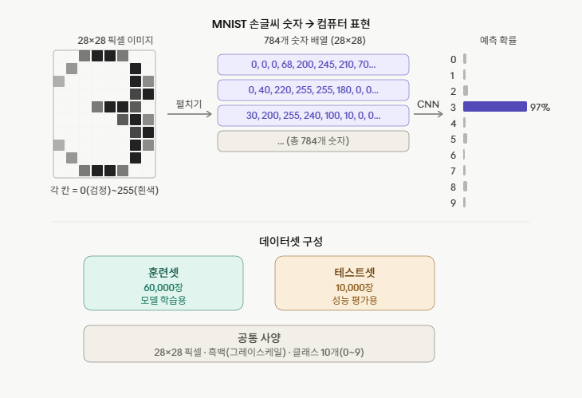

### 1단계 — 이미지 입력

손글씨 숫자 이미지를 28×28 픽셀 격자로 쪼갠다. 각 칸(픽셀)은 0~255 사이 숫자 하나로 표현된다.

### 2단계 — 펼치기 (Flatten)

28×28 격자를 한 줄로 펼치면 **784개짜리 숫자 배열**이 된다. 이미지 1장 = 숫자 784개.

```
[0, 0, 68, 200, 245, 210, 70, 0, ...]  ← 총 784개
```

### 3단계 — CNN 통과

784개 숫자를 CNN에 입력하면, CNN이 숫자 배열 안의 패턴을 분석한다. 예: 위쪽 반원 + 중간 꺾임 + 아래 반원 → "3이다"

### 4단계 — 예측 확률 출력

0~9 각 클래스에 대한 확률을 출력한다.

```
0: 0.1%
1: 0.0%
2: 0.2%
3: 97%  ← 최종 예측
4: 0.1%
...
```

> 핵심 흐름: **이미지 → 숫자 784개 → CNN → 확률 → 정답 클래스**

---

## 📌 CNN vs YOLO

| |CNN|YOLO|
|---|---|---|
|역할|이미지 패턴을 학습하는 신경망 구조|CNN을 내부에 탑재한 프레임워크|
|비유|엔진|엔진을 탑재한 자동차|

YOLO 안에 CNN이 포함되어 있다. `YOLO("yolo11n-cls.pt")` 로 모델을 불러오면 그 안에 이미 CNN 구조가 들어 있는 것.

---

## 📌 임베딩 (Embedding)

컴퓨터는 데이터를 그대로 기억하지 않고 **숫자 패턴(벡터)으로 변환**해서 처리한다.

### 이미지의 경우 (Feature Map)

이미지 → 픽셀값 배열 → CNN 통과 → **특징 맵(Feature Map)**으로 압축

```
28×28 이미지 → 784개 숫자 → CNN → 32채널 또는 64채널 특징 맵
```

채널 수가 많을수록 더 많은 패턴을 동시에 감지할 수 있다.

### 텍스트의 경우 (Embedding)

텍스트 → 인덱스 번호 → **임베딩 벡터**로 변환

```
"가" → [0.23, -0.81, 0.44, ...]  ← 32차원이면 32개 숫자
"나" → [0.11,  0.67, -0.32, ...]  ← 32차원
"다" → [-0.55, 0.03, 0.91, ...]  ← 32차원
```

각 단어(글자)마다 **따로** 벡터가 할당된다. 학습을 통해 의미가 비슷한 단어끼리 벡터 패턴도 비슷해지도록 자동 조정된다.

### 32차원 vs 64차원

| |32차원|64차원|
|---|---|---|
|표현력|낮음|높음|
|연산량|적음|많음|
|적합한 경우|단순한 문제|복잡한 문제|

### 이미지 vs 텍스트 용어 정리

|데이터 종류|변환 결과|용어|
|---|---|---|
|이미지|CNN 통과 후 숫자 패턴|Feature Map (특징 맵)|
|텍스트|단어를 숫자 벡터로 변환|Embedding (임베딩)|

> 둘 다 본질은 같다: **데이터를 숫자 패턴으로 변환해서 처리**

---

## 📌 MNIST vs EMNIST

| |MNIST|EMNIST|
|---|---|---|
|포함 문자|숫자(0~9)만|숫자 + 대문자 + 소문자|
|이미지 크기|28×28|28×28 (동일)|
|호환성|-|MNIST용 도구 그대로 사용 가능|

---

## 📌 MNIST160

전체 70,000장 중 **클래스당 8장씩 총 160장**만 추출한 경량 버전. 디렉토리 구조가 MNIST와 동일해서 빠른 테스트(CI, 파이프라인 검증)에 활용.

---

## 📌 YOLO로 MNIST 학습하기

```python
from ultralytics import YOLO

# 분류용 pretrained 모델 로드
model = YOLO("yolo11n-cls.pt")

# MNIST 데이터셋으로 학습
results = model.train(data="mnist", epochs=100, imgsz=28)
```

CLI 방식:

```bash
yolo classify train data=mnist model=yolo11n-cls.pt epochs=100 imgsz=28
```

MNIST160 빠른 테스트:

```bash
yolo classify train data=mnist160 model=yolo11n-cls.pt epochs=5 imgsz=28
```

---
# 📄 tf22num_image.py — 손글씨 이미지 전처리 · PIL · numpy · 정규화

## 🧠 개념 정리

딥러닝 모델은 이미지를 그대로 받아들이지 않는다. 이미지를 **숫자 배열로 변환 → 정규화** 하는 전처리 과정이 필수다.

전체 흐름:

```
num.png 원본 이미지
→ 28×28 리사이즈 + 흑백 변환   (PIL)
→ numpy 배열 (28, 28)          시각화 ①
→ reshape → (1, 784)           1차원으로 펼치기
→ float32 변환
→ /255.0 정규화                0.0~1.0 범위로 압축
→ reshape(28, 28)              시각화 ②
```

---

## 🖼️ 사용 이미지

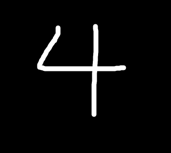

> 손글씨로 쓴 숫자 **4** 이미지. 검정 배경에 흰색 글씨.

---

## 📊 시각화 결과

### 원본 → 28×28 변환 후


### 정규화 후 (0.0~1.0)

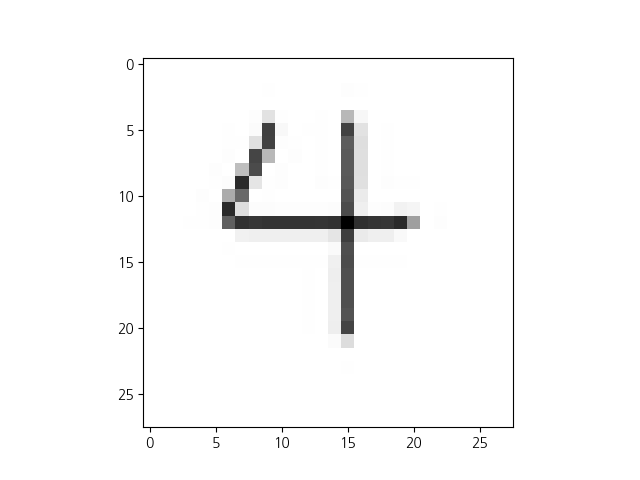

> 두 이미지는 시각적으로 동일하게 보인다. `imshow`가 값의 범위를 자동으로 맞춰 렌더링하기 때문.

---

## 💻 코드 + 주석

```python
from PIL import Image
import numpy as np
import matplotlib.pyplot as plt
import koreanize_matplotlib

# -------------------------------------------------------
# 1. 이미지 불러오기 및 전처리
# -------------------------------------------------------

im = Image.open('num.png')
# num.png: 손글씨 숫자 이미지 (원본 크기 무관)

img = np.array(
    im.resize((28, 28), Image.Resampling.LANCZOS)  # 28×28 픽셀로 리사이즈
      .convert('L')                                  # 흑백(그레이스케일)으로 변환
      # L 모드: 픽셀값 0(검정, 배경) ~ 255(흰색, 글씨)
)
# img.shape → (28, 28): 28행 28열의 2차원 배열
print(img.shape)    # (28, 28)

# -------------------------------------------------------
# 2. 원본 이미지 시각화 ①
# -------------------------------------------------------

# cmap='Greys': 흑백 컬러맵 지정 (없으면 이상한 색으로 보임)
plt.imshow(img, cmap='Greys')
plt.show()

# -------------------------------------------------------
# 3. reshape: 2차원 → 1차원으로 펼치기
# -------------------------------------------------------

# [1, 784]: 이미지 1장, 픽셀 784개 (28×28=784)
# 딥러닝 모델 입력 형태에 맞추기 위해 1차원으로 펼침
# astype('float32'): 정수(int) → 실수(float32) 변환 (딥러닝 모델은 float32 입력을 받음)
data = img.reshape([1, 784]).astype('float32')
print(data, data.shape)     # (1, 784)

# -------------------------------------------------------
# 4. 정규화 (Normalization)
# -------------------------------------------------------

# 픽셀값 0~255를 0.0~1.0 범위로 압축
# 필수는 아니나 모델 학습 안정성 및 수렴 속도 향상에 도움
data = data / 255.0
print(data)

# -------------------------------------------------------
# 5. 정규화 후 시각화 ②
# -------------------------------------------------------

# (1, 784)를 다시 (28, 28)로 reshape해서 이미지로 시각화
# 값의 범위만 다를 뿐 시각적으로는 ①과 동일하게 보임
plt.imshow(data.reshape(28, 28), cmap='Greys')
plt.show()
```

---

## 📌 핵심 개념 정리

### LANCZOS 리사이즈

이미지를 축소할 때 품질 손실을 최소화하는 보간법. 단순히 픽셀을 잘라내는 게 아니라 주변 픽셀값을 계산해서 자연스럽게 축소한다.

### L 모드 (그레이스케일)

RGB 컬러 이미지를 흑백으로 변환. 각 픽셀이 R, G, B 3개 값 대신 밝기 1개 값(0~255)으로 표현된다.

### reshape([1, 784])

```
(28, 28)  →  (1, 784)
2차원         2차원 (배치 1장, 픽셀 784개)
```

`1`은 이미지 1장(배치 크기), `784`는 28×28을 펼친 픽셀 수.

### 정규화 (/ 255.0)

```
0 ~ 255  →  0.0 ~ 1.0
```

값의 범위를 줄여서 모델이 더 안정적으로 학습할 수 있게 한다. 학습 속도와 수렴 성능이 향상된다.

### 시각화 ① vs ②

| |시각화 ①|시각화 ②|
|---|---|---|
|데이터|원본 픽셀 (0~255 정수)|정규화 후 (0.0~1.0 실수)|
|shape|(28, 28)|(1, 784) → reshape(28, 28)|
|결과 이미지|동일|동일|

> `imshow`가 값 범위를 자동으로 맞춰서 렌더링하기 때문에 두 이미지는 똑같이 보인다.

---
# 📄 tf23mnist.py — MNIST 분류 · MLP · Dropout · 원핫인코딩

## 🧠 개념 정리

손글씨 숫자 이미지(MNIST)를 MLP(다층 퍼셉트론) 모델로 분류하는 실습이다. 이미지 전처리 → 원핫 인코딩 → 모델 학습 → 평가 → 예측의 전체 파이프라인을 다룬다.

전체 흐름:

```
MNIST 로드 (60000장 / 10000장)
→ reshape (60000, 28, 28) → (60000, 784)
→ 정규화 (/ 255.0)
→ 원핫 인코딩 (y: 정수 → 10차원 벡터)
→ validation 분리 (50000 / 10000)
→ MLP 모델 구성 (784 → 64 → 32 → 10)
→ 학습 (epochs=20, batch_size=128)
→ 평가 및 예측 시각화
```

---

## 🖼️ 학습 데이터 샘플

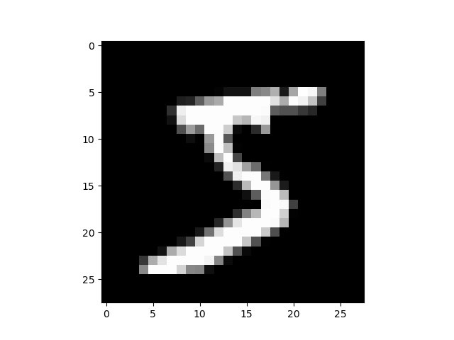

> x_train[0] 시각화. MNIST 첫 번째 이미지는 숫자 **5**.

---

## 📊 학습 결과

### Loss 곡선

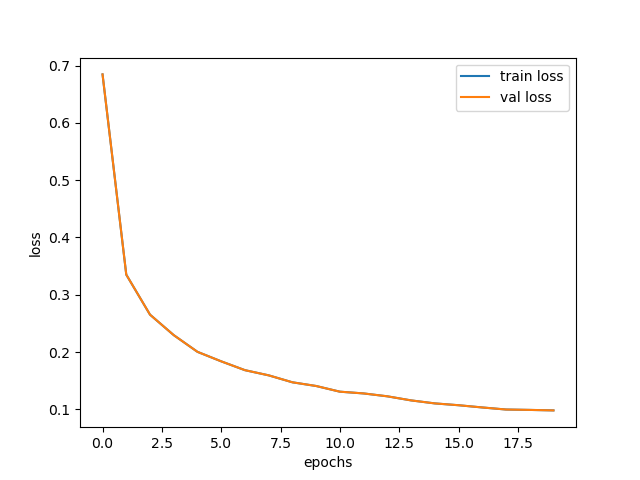

> train loss와 val loss가 거의 겹쳐서 내려감 → 과적합 없이 안정적으로 학습됨.

### Accuracy 곡선

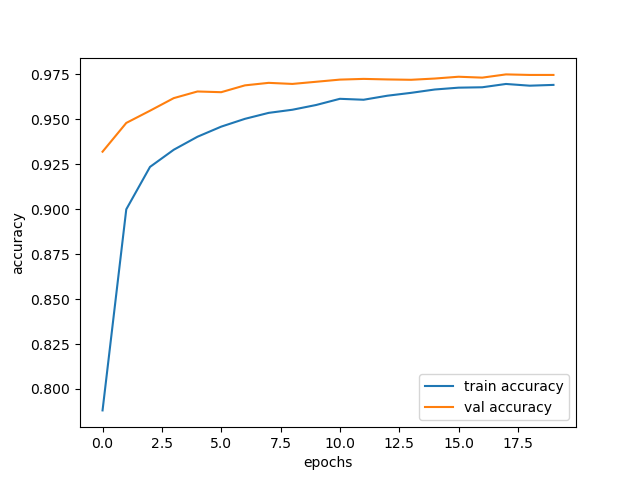

> val accuracy(주황)가 train accuracy(파랑)보다 초반에 높은 건 Dropout 때문. Dropout이 학습 시에는 일부 뉴런을 끄지만 평가 시에는 전부 켜기 때문에 나타나는 현상.

---

## 💻 코드 + 주석

```python
from PIL import Image
import numpy as np
import matplotlib.pyplot as plt
import tensorflow as tf
import sys

# -------------------------------------------------------
# 1. MNIST 데이터셋 로드
# -------------------------------------------------------

# Keras 내장 MNIST 데이터셋 자동 다운로드 및 로드
(x_train, y_train), (x_test, y_test) = tf.keras.datasets.mnist.load_data()
print(x_train.shape, y_train.shape, x_test.shape, y_test.shape)
# x_train: (60000, 28, 28) → 훈련 이미지 60000장
# y_train: (60000,)        → 훈련 정답 레이블
# x_test:  (10000, 28, 28) → 테스트 이미지 10000장
# y_test:  (10000,)        → 테스트 정답 레이블

print(x_train[0])   # 첫 번째 이미지 픽셀값 (28×28 배열)
print(y_train[0])   # 첫 번째 이미지 정답: 5

plt.imshow(x_train[0], cmap='gray')
plt.show()

# -------------------------------------------------------
# 2. 전처리 - reshape + 정규화
# -------------------------------------------------------

# (60000, 28, 28) → (60000, 784): 3차원 → 2차원으로 펼치기
# Dense 레이어 입력은 1차원 벡터여야 하므로 필요
x_train = x_train.reshape(60000, 784).astype('float32')
x_test = x_test.reshape(10000, 784).astype('float32')
print(x_train[0], x_train.shape)

# 픽셀값 0~255 → 0.0~1.0 정규화
# 모델 학습 안정성 및 수렴 속도 향상
x_train /= 255.0
x_test /= 255.0
print(x_train[0], x_train.shape)   # (60000, 784)
print(set(map(int, y_test)))        # {0, 1, 2, 3, 4, 5, 6, 7, 8, 9}

# -------------------------------------------------------
# 3. 원핫 인코딩 (One-Hot Encoding)
# -------------------------------------------------------

# softmax 출력(10개 확률)과 형태를 맞추기 위해 정수 레이블을 벡터로 변환
# 5 → [0. 0. 0. 0. 0. 1. 0. 0. 0. 0.]
y_train = tf.keras.utils.to_categorical(y_train, num_classes=10)
y_test = tf.keras.utils.to_categorical(y_test, num_classes=10)
print(y_train[0])   # [0. 0. 0. 0. 0. 1. 0. 0. 0. 0.]

# -------------------------------------------------------
# 4. Validation 데이터 직접 구성
# -------------------------------------------------------

# 훈련셋 60000장을 직접 분리
x_val = x_train[50000:60000]    # 10000개 → 학습 중 검증용
y_val = y_train[50000:60000]
x_train = x_train[0:50000]      # 50000개 → 실제 학습용
y_train = y_train[0:50000]
print(x_val.shape, x_train.shape)  # (10000, 784) (50000, 784)

# -------------------------------------------------------
# 5. 모델 구성
# -------------------------------------------------------

from tensorflow.keras.models import Sequential
from tensorflow.keras.layers import Dense, Input, Dropout

model = Sequential()
model.add(Input(shape=(784,)))              # 입력: 784개 픽셀

# 은닉층 1: 64개 뉴런, ReLU 활성화
model.add(Dense(units=64, activation='relu'))
# Dropout: 학습 시 20% 뉴런을 랜덤하게 꺼서 과적합 방지
model.add(Dropout(rate=0.2))

# 은닉층 2: 32개 뉴런, ReLU 활성화
model.add(Dense(units=32, activation='relu'))
model.add(Dropout(rate=0.2))

# 출력층: 10개 뉴런(0~9 클래스), softmax → 확률값 출력
model.add(Dense(units=10, activation='softmax'))
print(model.summary())

# -------------------------------------------------------
# 6. 모델 컴파일 및 학습
# -------------------------------------------------------

# optimizer: adam (학습률 자동 조정)
# loss: categorical_crossentropy (원핫 인코딩된 레이블에 사용)
# metrics: accuracy (정확도 측정)
model.compile(optimizer='adam', loss='categorical_crossentropy', metrics=['accuracy'])

history = model.fit(
    x_train, y_train,
    epochs=20,                          # 전체 데이터를 20번 반복 학습
    batch_size=128,                     # 한 번에 128개씩 학습
    validation_data=(x_val, y_val),    # 에포크마다 검증 데이터로 성능 확인
    verbose=2
)

# -------------------------------------------------------
# 7. 평가
# -------------------------------------------------------

score = model.evaluate(x_test, y_test, batch_size=128, verbose=0)
print(f'loss:{score[0]:.4f}, accuracy:{score[1]:.4f}')
# loss: 0.0942, accuracy: 0.9732 → 약 97% 정확도

# -------------------------------------------------------
# 8. 학습 곡선 시각화
# -------------------------------------------------------

plt.plot(history.history['loss'], label='train loss')
plt.plot(history.history['val_loss'], label='val loss')   # val_loss로 수정
plt.xlabel('epochs')
plt.ylabel('loss')
plt.legend()
plt.show()

plt.plot(history.history['accuracy'], label='train accuracy')
plt.plot(history.history['val_accuracy'], label='val accuracy')
plt.xlabel('epochs')
plt.ylabel('accuracy')
plt.legend()
plt.show()

# -------------------------------------------------------
# 9. 모델 저장 및 예측
# -------------------------------------------------------

model.save('tf23model.keras')   # 모델 저장

mymodel = tf.keras.models.load_model('tf23model.keras')   # 모델 불러오기

# x_test[1:2]: shape (1, 784) → predict에 배치 차원 포함해서 넣어야 함
pred = mymodel.predict(x_test[1:2])
print('pred : ', pred)                          # 10개 클래스 확률값
print('예측값 : ', np.argmax(pred, axis=1)[0])  # 확률 최대 인덱스
print('실제값 : ', np.argmax(y_test[1]))        # 원핫 → 정수 변환
```

---

## 📌 핵심 개념 정리

### 원핫 인코딩 (One-Hot Encoding)

정수 레이블을 softmax 출력과 같은 형태의 벡터로 변환한다.

```
5 → [0. 0. 0. 0. 0. 1. 0. 0. 0. 0.]
         0  1  2  3  4  5  6  7  8  9
```

`categorical_crossentropy` loss를 쓰려면 반드시 필요하다.

### Dropout

학습 중 무작위로 일부 뉴런을 끄는 기법. 과적합 방지에 효과적.

```
rate=0.2 → 20% 뉴런을 랜덤하게 비활성화
```

- 학습 시: Dropout 적용 (일부 뉴런 꺼짐)
- 평가/예측 시: Dropout 미적용 (모든 뉴런 켜짐)

> val accuracy가 train accuracy보다 초반에 높은 이유가 바로 이것.

### loss 함수 비교

|loss 함수|레이블 형태|사용 상황|
|---|---|---|
|`categorical_crossentropy`|원핫 인코딩 벡터|`to_categorical` 사용 시|
|`sparse_categorical_crossentropy`|정수 레이블 그대로|`to_categorical` 생략 시|

### 모델 구조 요약

```
Input (784)
→ Dense(64, relu) → Dropout(0.2)
→ Dense(32, relu) → Dropout(0.2)
→ Dense(10, softmax)
```

총 파라미터: **52,650개**

### predict 입력 shape 주의

```python
# 틀린 방법 (에러 발생)
mymodel.predict(x_test[0])        # shape: (784,) → 배치 차원 없음

# 올바른 방법
mymodel.predict(x_test[0].reshape(1, 784))  # shape: (1, 784)
mymodel.predict(x_test[1:2])               # shape: (1, 784) ← 슬라이싱으로도 가능
```

---
# 📄 tf24myimage.py — 커스텀 이미지 예측 · 저장모델 불러오기 · predict

## 🧠 개념 정리

앞서 학습한 `tf23model.keras` 모델을 불러와서 **직접 그린 손글씨 이미지(num.png)** 를 예측하는 실습이다.

전체 흐름:

```
num.png 로드
→ 28×28 리사이즈 + 흑백 변환
→ reshape (1, 784) + 정규화 (/ 255.0)
→ 저장된 모델 불러오기 (tf23model.keras)
→ predict → 예측값 출력
```

---

## 🖼️ 사용 이미지 및 결과

### 원본 이미지


### 28×28 변환 후


---

## 📊 예측 결과

```
new_pred: [[3.93e-04  3.10e-03  2.21e-04  2.92e-03  8.11e-01
            5.55e-04  2.09e-05  3.15e-02  1.77e-04  1.50e-01]]
예측값: 4  ✅  실제 숫자: 4
```

클래스별 확률:

|클래스|확률|
|---|---|
|0|0.04%|
|1|0.31%|
|2|0.02%|
|3|0.29%|
|**4**|**81.1%** ← 예측|
|5|0.06%|
|6|0.00%|
|7|3.15%|
|8|0.02%|
|9|15.0%|

> 4일 확률 81.1%로 정확하게 예측 성공! 9가 15%로 2위인 건 4와 9의 세로선 패턴이 비슷하기 때문.

---

## 💻 코드 + 주석

```python
from PIL import Image
import numpy as np
import matplotlib.pyplot as plt

# -------------------------------------------------------
# 1. 이미지 불러오기 및 전처리
# -------------------------------------------------------

im = Image.open('num.png')
# num.png: 직접 그린 손글씨 숫자 4 이미지

img = np.array(
    im.resize((28, 28), Image.Resampling.LANCZOS)  # 28×28 리사이즈
      .convert('L')                                  # 흑백 변환
    # L 모드: 픽셀값 0(검정, 배경) ~ 255(흰색, 글씨)
)
print(img.shape)    # (28, 28)

plt.imshow(img, cmap='Greys')
plt.show()

# -------------------------------------------------------
# 2. 모델 입력 형태로 변환
# -------------------------------------------------------

# (28, 28) → (1, 784): 배치 1장, 픽셀 784개
# 모델이 (None, 784) shape을 기대하므로 배치 차원 포함 필수
data = img.reshape([1, 784]).astype('float32')

# 정규화: 0~255 → 0.0~1.0
# 학습 시와 동일한 전처리를 예측 시에도 적용해야 함
data /= 255.0

# -------------------------------------------------------
# 3. 저장된 모델 불러오기 및 예측
# -------------------------------------------------------

import tensorflow as tf

# tf23mnist.py에서 저장한 모델 로드
mymodel = tf.keras.models.load_model('tf23model.keras')

# verbose=0: 예측 진행 상황 출력 숨김
new_pred = mymodel.predict(data, verbose=0)
print('new_pred : ', new_pred)
# [[...]] 형태의 10개 클래스 확률값

# axis=1: 행 방향으로 최대값 인덱스 추출
# [0]: 배치 첫 번째(유일한) 결과
print('예측값 : ', np.argmax(new_pred, axis=1)[0])
# 예측값: 4 ✅
```

---

## 📌 핵심 개념 정리

### 학습/예측 시 전처리 일관성

모델을 학습할 때 적용한 전처리를 예측 시에도 동일하게 적용해야 한다.

```
학습 시:  x_train / 255.0  →  0.0~1.0
예측 시:  data   / 255.0  →  0.0~1.0  ← 반드시 동일하게
```

전처리가 다르면 모델이 엉뚱한 값을 예측한다.

### predict 입력 shape

```
모델이 기대하는 shape: (None, 784)
                        ↑ 배치 차원 (이미지 장수)

img.reshape([1, 784])  →  (1, 784)  ✅
img.reshape([784])     →  (784,)    ❌ 에러 발생
```

### argmax 사용법

```python
new_pred = [[0.001, 0.003, 0.811, ...]]  # shape (1, 10)

np.argmax(new_pred, axis=1)     # → [4]  (배열로 반환)
np.argmax(new_pred, axis=1)[0]  # → 4   (정수로 추출)
```

### 이번 실습과 이전 실습 비교

| |tf22num_image.py|tf24myimage.py|
|---|---|---|
|목적|이미지 전처리 확인|저장 모델로 예측|
|모델|없음|tf23model.keras 로드|
|결과|픽셀 배열 출력|예측값 출력|
|예측 성공|-|✅ 4 정확히 예측|

---
# 📄 tf25fashion.py — Fashion MNIST · MLP · 예측 시각화

## 🧠 개념 정리

Fashion MNIST 데이터셋을 MLP 모델로 분류하는 실습이다. MNIST(숫자)와 구조는 동일하지만 **옷/신발 10종류**를 분류한다는 점이 다르다. 이전 MNIST 실습과 달리 **원핫 인코딩 없이** `sparse_categorical_crossentropy`를 사용한다.

전체 흐름:

```
Fashion MNIST 로드 (60000장 / 10000장)
→ 정규화 (/ 255.0)
→ MLP 모델 구성 (Flatten → 128 → 64 → 32 → 10)
→ 학습 (epochs=10, batch_size=128)
→ 평가 및 예측 시각화 (1개 / 3×3 그리드)
```

---

## 🖼️ 데이터셋 샘플

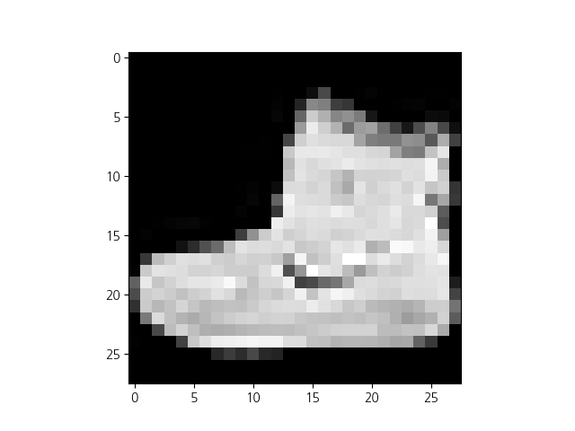

> x_train[0] — Ankle boot (클래스 9)

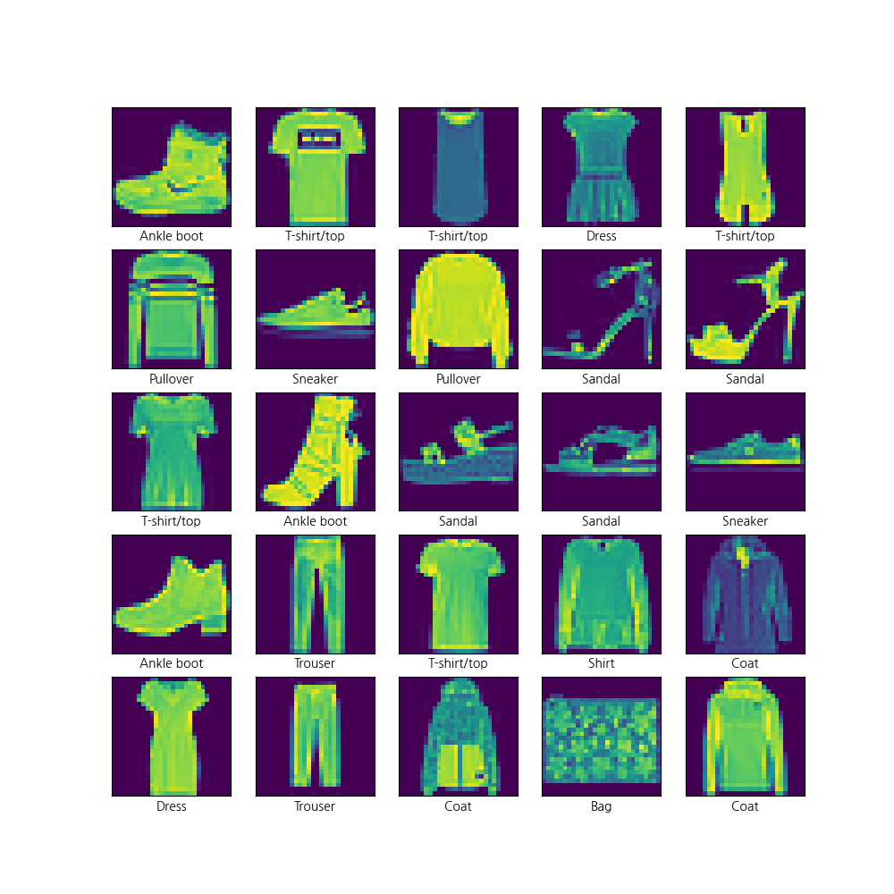

> 훈련셋 25개 샘플 시각화. `cmap` 미지정으로 기본 컬러맵 적용됨.

---

## 📊 예측 결과

### 단일 예측 (show_one_prediction)

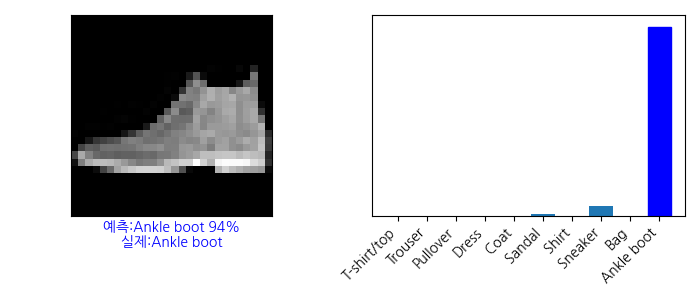

> 예측: Ankle boot 94% / 실제: Ankle boot ✅

### 3×3 그리드 예측 (0번~8번)

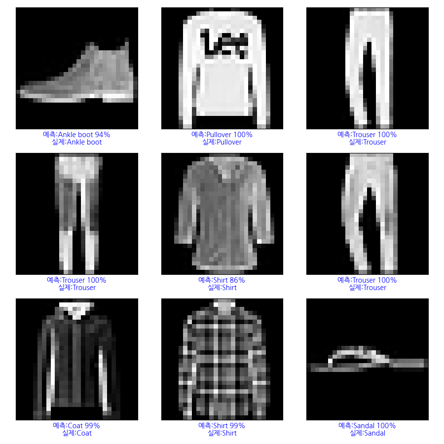

> 파란 글씨: 예측 성공 / 빨간 글씨: 예측 실패

### 3×3 그리드 예측 (15번~23번)

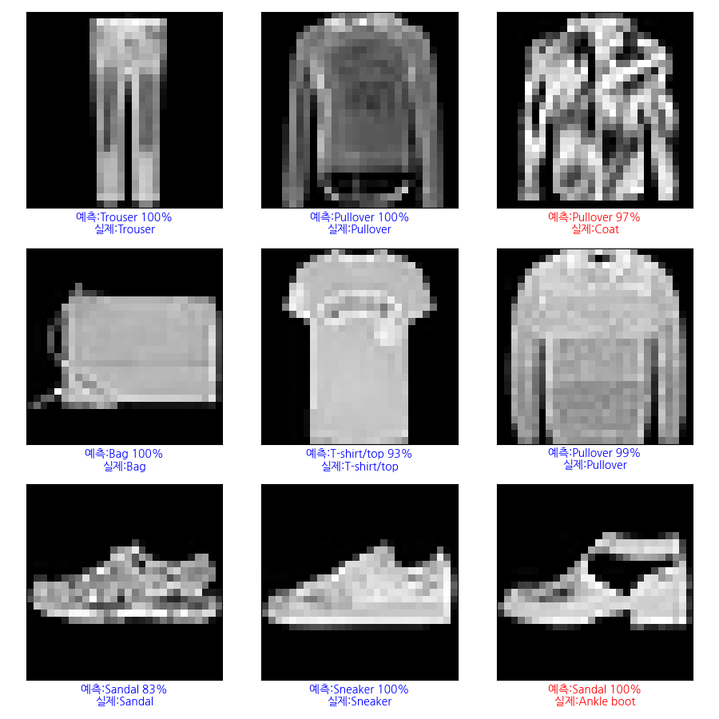

> Coat → Pullover 오분류 발생 (외형이 비슷한 클래스 간 혼동)

---

## 💻 코드 + 주석

```python
import numpy as np
import matplotlib.pyplot as plt
import koreanize_matplotlib
import tensorflow as tf
from tensorflow.keras.layers import Dense, Input, Flatten

# -------------------------------------------------------
# 1. Fashion MNIST 데이터셋 로드
# -------------------------------------------------------

fashion_mist = tf.keras.datasets.fashion_mnist.load_data()
(x_train, y_train), (x_test, y_test) = fashion_mist
print(x_train.shape, y_train.shape, x_test.shape, y_test.shape)
# x_train: (60000, 28, 28) / y_train: (60000,)
# x_test:  (10000, 28, 28) / y_test:  (10000,)

# 클래스 이름 매핑 (인덱스 0~9)
class_names = ['T-shirt/top', 'Trouser', 'Pullover', 'Dress', 'Coat',
               'Sandal', 'Shirt', 'Sneaker', 'Bag', 'Ankle boot']
print(set(map(int, y_test)))    # {0, 1, 2, 3, 4, 5, 6, 7, 8, 9}

# -------------------------------------------------------
# 2. 데이터 샘플 시각화 (25개)
# -------------------------------------------------------

plt.figure(figsize=(10, 10))
for i in range(25):
    plt.subplot(5, 5, i + 1)
    plt.xticks([])
    plt.yticks([])
    plt.xlabel(class_names[y_train[i]])     # 클래스 이름을 x축 레이블로
    plt.imshow(x_train[i])                  # cmap 미지정 → 기본 컬러맵 적용
plt.show()

# -------------------------------------------------------
# 3. 정규화
# -------------------------------------------------------

print(x_train[0])               # 정규화 전: 0~255 정수
x_train = x_train / 255.0      # 0.0~1.0으로 압축
print(x_train[0])               # 정규화 후: 0.0~1.0 실수
x_test = x_test / 255.0

# -------------------------------------------------------
# 4. 모델 구성
# -------------------------------------------------------

model = tf.keras.models.Sequential([
    tf.keras.layers.Input(shape=(28, 28)),
    # Flatten: (28, 28) → (784,) 자동 변환 (reshape 없이)
    tf.keras.layers.Flatten(),
    tf.keras.layers.Dense(units=128, activation='relu'),    # 은닉층 1
    tf.keras.layers.Dense(units=64, activation='relu'),     # 은닉층 2
    tf.keras.layers.Dense(units=32, activation='relu'),     # 은닉층 3
    # 출력층: 10개 클래스 확률값 출력
    tf.keras.layers.Dense(units=10, activation='softmax')
])
print(model.summary())

# -------------------------------------------------------
# 5. 모델 컴파일 및 학습
# -------------------------------------------------------

# sparse_categorical_crossentropy: 원핫 인코딩 없이 정수 레이블 그대로 사용 가능
# categorical_crossentropy와 달리 to_categorical() 생략 가능
model.compile(optimizer='adam',
              loss='sparse_categorical_crossentropy',
              metrics=['accuracy'])

model.fit(x_train, y_train, batch_size=128, epochs=10, verbose=1)

# -------------------------------------------------------
# 6. 평가
# -------------------------------------------------------

test_loss, test_acc = model.evaluate(x_test, y_test, verbose=0)
print(f'test_loss:{test_loss:.4f}, test_acc:{test_acc:.4f}')
# test_acc: 0.8856 → 약 89% 정확도

# -------------------------------------------------------
# 7. 예측
# -------------------------------------------------------

pred = model.predict(x_test)    # 전체 테스트셋 예측 → shape (10000, 10)
print(pred[0])                  # 첫 번째 이미지의 클래스별 확률 10개
print('예측값 : ', np.argmax(pred[0]))  # 확률 최대 인덱스 → 클래스 번호
print('실제값 : ', y_test[0])           # 정수 레이블 그대로

# -------------------------------------------------------
# 8. 시각화 함수
# -------------------------------------------------------

# 이미지 + 예측/실제 레이블 출력
def plot_image(i, pred_arr, y_true, x_img):
    pred_arr = pred[i]
    true_label = y_true[i]
    img = x_img[i]
    pred_label = np.argmax(pred_arr)
    pred_percent = 100 * np.max(pred_arr)
    color = 'blue' if pred_label == true_label else 'red'   # 맞으면 파랑, 틀리면 빨강
    plt.xticks([])
    plt.yticks([])
    plt.imshow(img, cmap='gray')
    plt.xlabel(
        f'예측:{class_names[pred_label]} {pred_percent:.0f}%\n'
        f'실제:{class_names[true_label]}', color=color
    )

# 클래스별 확률을 막대그래프로 출력
def plot_values_arr(i, pred, y_true):
    pred_arr = pred[i]
    true_label = y_true[i]
    pred_label = np.argmax(pred_arr)

    plt.xticks(range(10), class_names, rotation=45, ha='right')
    plt.yticks([])
    plt.ylim([0, 1])
    bars = plt.bar(range(10), pred_arr)
    bars[pred_label].set_color('red')   # 예측 클래스 → 빨강
    bars[true_label].set_color('blue')  # 실제 클래스 → 파랑

# 1개 이미지: 좌(이미지) + 우(확률 막대그래프)
def show_one_prediction(i, pred, y_true, x_img):
    plt.figure(figsize=(7, 3))
    plt.subplot(1, 2, 1)
    plot_image(i, pred, y_true, x_img)
    plt.subplot(1, 2, 2)
    plot_values_arr(i, pred, y_true)
    plt.tight_layout()
    plt.show()

# rows×cols 격자로 여러 이미지 한 번에 출력
def show_prediction_grid(start, pred, y_true, x_img, rows=3, cols=3):
    plt.figure(figsize=(9, 9))
    for n in range(rows * cols):
        i = start + n
        plt.subplot(rows, cols, n + 1)
        pred_label = np.argmax(pred[i])
        true_label = y_true[i]
        pred_percent = 100 * np.max(pred[i])
        color = 'blue' if pred_label == true_label else 'red'
        plt.xticks([])
        plt.yticks([])
        plt.imshow(x_img[i], cmap='gray')
        plt.xlabel(
            f'예측:{class_names[pred_label]} {pred_percent:.0f}%\n'
            f'실제:{class_names[true_label]}', color=color
        )
    plt.tight_layout()
    plt.show()

show_one_prediction(0, pred, y_test, x_test)       # 1개 상세 보기
show_prediction_grid(0, pred, y_test, x_test)      # 0번~8번
show_prediction_grid(15, pred, y_test, x_test)     # 15번~23번
```

---

## 📌 핵심 개념 정리

### Fashion MNIST 클래스

|인덱스|클래스|인덱스|클래스|
|---|---|---|---|
|0|T-shirt/top|5|Sandal|
|1|Trouser|6|Shirt|
|2|Pullover|7|Sneaker|
|3|Dress|8|Bag|
|4|Coat|9|Ankle boot|

### MNIST vs Fashion MNIST 비교

| |MNIST|Fashion MNIST|
|---|---|---|
|데이터|손글씨 숫자 0~9|옷/신발 10종|
|난이도|낮음|높음|
|대표 정확도 (MLP)|~97%|~89%|
|오분류 원인|필기체 차이|유사한 외형 (Coat↔Pullover 등)|

### loss 함수 비교

| |`categorical_crossentropy`|`sparse_categorical_crossentropy`|
|---|---|---|
|레이블 형태|원핫 인코딩 벡터|정수 그대로|
|`to_categorical`|필요|불필요|
|결과|동일|동일|

### Flatten 레이어

```
Input (28, 28)
→ Flatten → (784,)   ← reshape 없이 자동 변환
→ Dense(128) → ...
```

모델 내부에서 자동으로 처리하므로 별도 `reshape` 코드가 필요 없다.

### 오분류가 많은 클래스 쌍

```
Coat ↔ Pullover   (긴 소매 + 몸통 형태 유사)
Shirt ↔ T-shirt   (상의 형태 유사)
Sandal ↔ Sneaker  (신발 형태 유사)
```

MLP는 픽셀을 단순히 1차원으로 펼쳐서 처리하므로 공간적 패턴(형태, 윤곽선)을 잘 구분하지 못한다. → CNN을 사용하면 정확도가 크게 향상된다.

---
# CNN 개념 정리

## 🧠 CNN이란?

**Convolutional Neural Network** — 합성곱 신경망. 이미지 분류, 객체 탐지 등 **컴퓨터 비전** 분야에 특화된 딥러닝 모델이다. MLP와 달리 이미지의 **공간적 구조(2D)를 그대로 유지**하면서 특징을 추출한다.

---

## 📌 CNN 전체 구조


CNN은 크게 두 파트로 나뉜다.

**특징 추출 (Feature Extraction)**

- Convolution + ReLU → 이미지에서 패턴 추출
- Pooling → 크기 축소, 중요 특징 유지
- 이 과정을 여러 번 반복해서 점점 추상적인 특징을 학습

**분류 (Classification)**

- Flatten → 2D 특징 맵을 1D 벡터로 변환
- Fully Connected Layer → 완전연결층으로 분류
- Softmax → 각 클래스의 확률값 출력 (0~1 사이)

---

## 📌 이미지 데이터 구조


이미지는 **높이 × 너비 × 채널** 의 3차원 데이터다. RGB 컬러 이미지는 R, G, B 3개의 채널이 겹쳐진 구조다.

|이미지 종류|채널 수|예시|
|---|---|---|
|흑백 (Grayscale)|1|MNIST (28×28×1)|
|컬러 (RGB)|3|일반 사진 (224×224×3)|

---

## 📌 Convolutional Layer


필터(커널)가 이미지 위를 **stride만큼 슬라이딩**하면서 대응되는 숫자끼리 곱한 후 더해서 **Feature Map** 을 만든다.

```
이미지 위 3×3 영역        필터              결과
[ 80,  90,  85 ]    [ 1,  1,  1]
[120, 130, 110]  ×  [ 0,  0,  0]  →  합산값 1개
[ 40,  50,  45 ]    [-1, -1, -1]

= (80+90+85)×1 + (120+130+110)×0 + (40+50+45)×(-1)
= 255 - 135 = 120  → Feature Map에 기록
```

Step-1 → Step-2 → ... 순서로 전체 이미지를 순회하면서 Feature Map을 완성한다.

출력 크기 계산:

```
출력 크기 = (입력 크기 - 필터 크기) / stride + 1
예: (5 - 3) / 1 + 1 = 3  →  3×3 Feature Map
```

---

## 📌 Stride & Padding

**Stride** — 필터가 한 번에 이동하는 칸 수

|Stride|출력 크기|특징|
|---|---|---|
|1|크다|세밀한 특징 추출|
|2|작아짐|빠른 연산, 압축 효과|

**Padding** — 이미지 가장자리에 0을 덧대는 것

|종류|설명|출력 크기|
|---|---|---|
|`valid`|패딩 없음|입력보다 작아짐|
|`same`|출력 크기 유지|입력과 동일|

패딩을 쓰는 이유:

- 가장자리 픽셀 정보 손실 방지
- 레이어를 많이 쌓아도 크기가 너무 작아지지 않게

---

## 📌 Pooling Layer


Feature Map의 **차원을 낮추어 연산량을 감소**시키고 중요한 특성 벡터를 추출한다. 2×2 영역을 하나의 값으로 압축한다.

**Max Pooling** — 2×2 영역에서 최대값 추출

```
[12, 20]  →  20      [30,  0]  →  30
[ 8, 12]             [ 2,  0]

[34, 70]  →  112     [37,  7]  →  37
[112,100]            [22, 12]

→ Max Pooling 결과: [[20, 30], [112, 37]]
```

**Average Pooling** — 2×2 영역의 평균값 추출

```
(12+20+8+12)/4 = 13   (30+0+2+0)/4 = 8
(34+70+112+100)/4 = 79  (37+7+22+12)/4 = 18

→ Average Pooling 결과: [[13, 8], [79, 18]]
```

| |Max Pooling|Average Pooling|
|---|---|---|
|추출값|최대값|평균값|
|특징|강한 패턴 강조|전체적인 특징 보존|
|CNN 주 사용|✅ 주로 사용|드물게 사용|

> Average Pooling은 중요한 가중치를 가진 값의 특성을 희미하게 만들 수 있어 CNN에서는 Max Pooling을 주로 사용한다.

---

## 📌 Flatten & Fully Connected Layer & Softmax


Feature Map이 Fully Connected Layer로 전달되는 과정에서 **1차원 벡터로 펼쳐진다**. 이후 Dense Layer를 거쳐 최종 분류를 수행한다.

```
Feature Map (예: 7×7×64)
→ Flatten → (3136,) 1차원 벡터
→ Fully Connected Layer (Dense)
→ Softmax Layer → CLASS A / B / C 확률 출력
```

**Softmax** — 입력받은 값을 0~1 사이의 확률값으로 변환하며, 모든 클래스 확률의 합은 1이 된다.

```
예: [0.2, 0.7, 0.1]  →  Horse: 20%, Zebra: 70%, Dog: 10%
```

---

## 📌 CNN vs MLP 비교

| |MLP|CNN|
|---|---|---|
|입력 처리|픽셀을 1차원으로 펼침|2D 이미지 구조 유지|
|특징 추출|없음 (픽셀 그대로)|필터로 자동 추출|
|공간 정보|손실|보존|
|Fashion MNIST 정확도|~86~89%|~90%+|
|파라미터 수|많음|적음 (가중치 공유)|
|이미지 데이터 적합성|낮음|높음|

**가중치 공유 (Weight Sharing)** 같은 필터를 이미지 전체에 슬라이딩하면서 적용하기 때문에 필터 하나의 파라미터(3×3=9개)만 학습하면 된다. 이미지 데이터가 많아질수록 MLP와의 성능 차이가 더 크게 벌어진다.

```
MLP:  784 × 128 = 100,352개 파라미터 (첫 레이어만)
CNN:  3 × 3 = 9개 파라미터 (필터 하나)
```

---
# 📄 tf26before_cnn.py — 합성곱 원리 · 필터 · 특징 추출

## 🧠 개념 정리

CNN을 이해하기 위한 사전 실습이다. 이미지에 **필터(커널)를 슬라이딩**하면서 특징을 추출하는 합성곱의 원리를 직접 확인한다.

전체 흐름:

```
컵 이미지 로드 (RGB)
→ 흑백 변환 (rgb2gray)
→ 64×64 리사이즈
→ 3×3 필터 정의 (수평 엣지 감지)
→ correlate로 필터 적용 → 특징 맵 출력 (미완성)
```

---

## 🖼️ 시각화 결과


> scikit-image 내장 커피컵 이미지를 흑백 변환 + 64×64 리사이즈한 결과.

---

## 💻 1단계 — 이미지 로드 및 전처리

```python
import matplotlib.pyplot as plt
from scipy.ndimage import correlate
import numpy as np
from skimage import data
from skimage.color import rgb2gray
from skimage.transform import resize

# scikit-image에 내장된 커피컵 이미지 로드 (RGB 컬러)
im = rgb2gray(data.coffee())
# rgb2gray: RGB 3채널 → 흑백 1채널로 변환
# 픽셀값 범위: 0.0(검정) ~ 1.0(흰색)

# 원본 이미지를 64×64 픽셀로 리사이즈
# 계산량을 줄이기 위해 크기 축소
im = resize(im, (64, 64))
print(im.shape)     # (64, 64)

plt.axis('off')                     # 축 숨기기
plt.imshow(im, cmap='gray')         # 흑백 컬러맵으로 시각화
plt.show()
```

---

## 💻 2단계 — 합성곱 필터 정의

```python
# 합성곱 필터 (3×3) — 수평 엣지(가로선) 감지 필터
filter = np.array([
    [ 1,  1,  1],   # 위쪽 픽셀에 +1 가중치 → 밝은 영역 강조
    [ 0,  0,  0],   # 중간 픽셀은 0 → 무시
    [-1, -1, -1]    # 아래쪽 픽셀에 -1 가중치 → 어두운 영역 강조
])
# 위(+1) - 아래(-1) 구조
# → 위아래 밝기 차이가 클수록 큰 값 출력 → 가로 방향 경계선(엣지) 강조
# → 균일한 영역(배경 등)은 0에 가까운 값 출력
```

---

## 📌 핵심 개념 정리

### 합성곱 필터(커널)란?

이미지 위를 슬라이딩하면서 **대응되는 픽셀끼리 곱한 후 모두 더하는** 연산이다. 필터의 종류에 따라 이미지에서 추출되는 특징이 달라진다.

```
이미지 위 3×3 영역        필터              계산
[ 80,  90,  85 ]    [ 1,  1,  1]    80+90+85 = 255
[120, 130, 110]  ×  [ 0,  0,  0]  + 0
[ 40,  50,  45 ]    [-1, -1, -1]  - 40+50+45 = 135

→ 결과: 255 - 135 = 120  (경계가 강한 부분 → 큰 값)
```

### 수평 엣지 감지 필터

```
[ 1,  1,  1]
[ 0,  0,  0]
[-1, -1, -1]
```

위쪽이 밝고 아래쪽이 어두운 경계 → 큰 양수값 출력 위아래 밝기가 비슷한 평탄한 영역 → 0에 가까운 값 출력 → **가로 방향 경계선(엣지)만 강조**

### correlate vs convolve

| |`correlate`|`convolve`|
|---|---|---|
|필터 방향|그대로 적용|180도 회전 후 적용|
|딥러닝에서|실제로 이걸 씀|수학적 정의|
|대칭 필터 결과|동일|동일|

> 딥러닝에서 "합성곱"이라고 부르지만 실제로는 `correlate` 연산을 사용한다.
