# Day 64_딥러닝 : CNN 개념 · 합성곱 · Sequential · Functional · Subclassing

## 📅 2026-05-11

---
# CNN 개념 정리

## 🧠 CNN이란?

**Convolutional Neural Network** — 합성곱 신경망. 픽셀 위치 정보와 지역 패턴을 유지하면서 학습할 수 있도록 설계된 딥러닝 모델이다. 이미지에서 **계층적으로 특징을 추출 → 점점 추상화 → 최종 분류**를 수행한다.

- **초기 층**: 선/모서리 같은 저수준 특징 감지
- **깊은 층**: 사람 얼굴/옷 같은 고수준 패턴 감지

---

## 📌 CNN이 필요한 이유

MLP(Dense 신경망)의 문제:

- 입력 이미지를 **1차원 벡터로 펴서** 학습 → **공간적 구조(픽셀 간 위치 관계) 손실**
- 이미지가 커질수록 파라미터 수가 **기하급수적으로** 증가
- 이미지 위치/크기가 달라지면 인식 못함
- 컬러 이미지 Flatten 시 채널(색상) 정보도 손실

---

## 📌 CNN 전체 구조

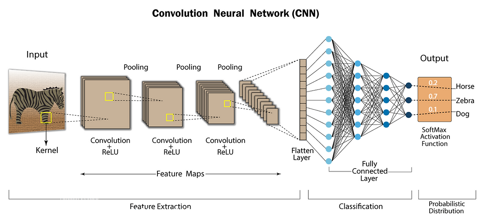

```
이미지 (28×28)
→ [Conv → ReLU → Pooling] × N   ← 특징 추출 (Feature Extraction)
→ Flatten
→ Dense                           ← 분류 (Classification)
→ Softmax → 클래스 확률 출력
```

---

## 📌 이미지 데이터 구조

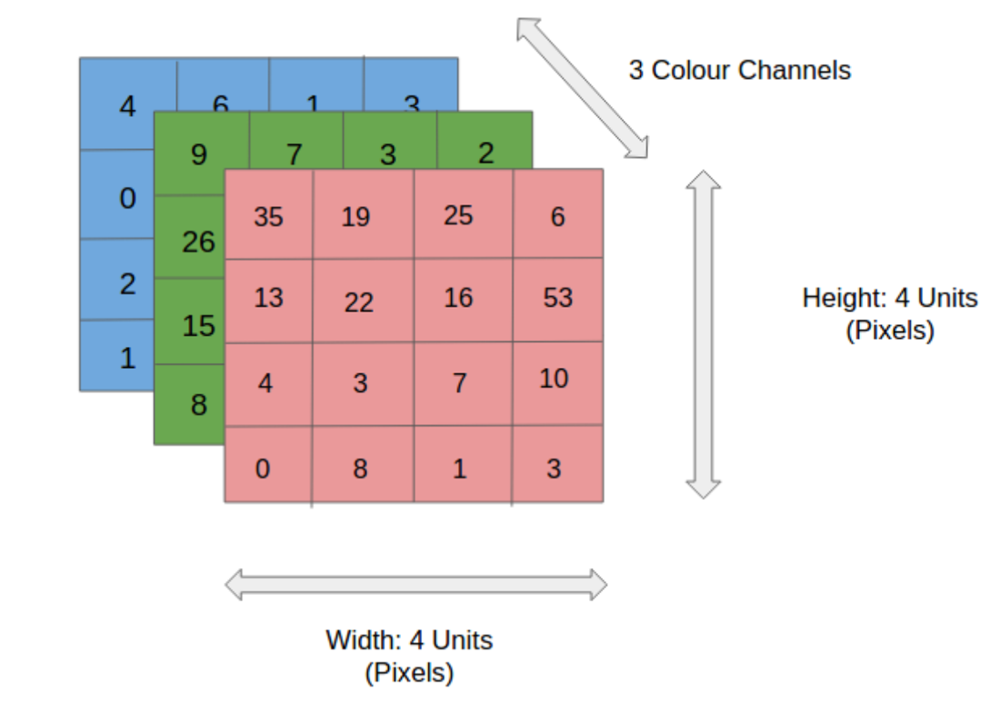

이미지는 **높이 × 너비 × 채널**의 3차원 데이터다.

|이미지 종류|채널 수|예시|
|---|---|---|
|흑백 (Grayscale)|1|MNIST (28×28×1)|
|컬러 (RGB)|3|일반 사진 (224×224×3)|

각 픽셀은 RGB 값을 가진다. 예: `(226, 195, 186)`

---

## 📌 Convolutional Layer (합성곱 레이어)

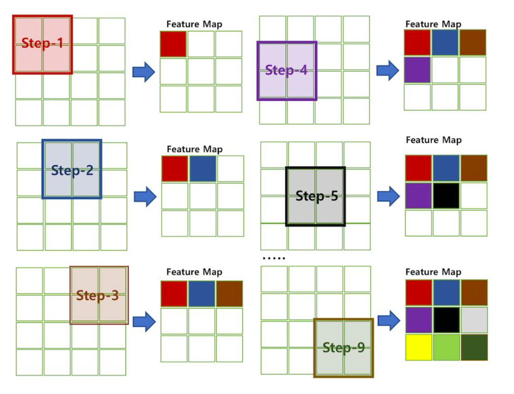

작은 커널(필터)을 이미지 위에 슬라이딩하면서 **Feature Map**을 생성한다.

```
이미지 위 3×3 영역        필터              계산
[ 80,  90,  85 ]    [ 1,  1,  1]    80+90+85 = 255
[120, 130, 110]  ×  [ 0,  0,  0]  + 0
[ 40,  50,  45 ]    [-1, -1, -1]  - 40+50+45 = 135

→ 결과: 255 - 135 = 120  → Feature Map에 기록
```

실제 계산 예시:

```
8×0 + 8×0 + 7×1 + 8×(-1) + 7×1 + 6×(-1) + 8×1 + 6×(-1) + 5×0 = 2
```

### 출력 크기 계산

```
출력 크기 = (입력 크기 - 필터 크기) / stride + 1

예: 입력 5×5, 필터 2×2, stride 1
→ (5 - 2) / 1 + 1 = 4  →  4×4 Feature Map

예: 입력 7×7, 필터 3×3, stride 1
→ (7 - 3) / 1 + 1 = 5  →  5×5 Feature Map

예: 입력 7×7, 필터 3×3, stride 2
→ (7 - 3) / 2 + 1 = 3  →  3×3 Feature Map
```

> 정수로 나누어지지 않는 경우 버리거나 수행하지 않는다.

### CNN = 내적을 위치별로 반복하는 구조

```
y = Σwi · xi    ← 내적 구조
```

- FC(Dense): 한 번만 내적
- CNN: 필터를 이미지 위에서 슬라이딩하면서 각 위치마다 내적 수행

### 커널(필터)은 어떻게 학습되나?

처음엔 랜덤값으로 시작 → 역전파(backpropagation)로 업데이트:

```
w ← w − η * ∂L/∂w    ← 커널도 그냥 weight라서 똑같이 업데이트
```

- 얕은 층: 엣지, 코너, 질감에 반응하는 필터 자동 형성
- 깊은 층: 눈, 코, 물체 형태에 반응하는 필터 자동 형성

> 이미지의 특성을 반영한 커널은 출력값이 높고, 반영 못한 커널은 출력값이 낮다. **적합한 커널은 CNN이 자동으로 만들어 준다.**

### Feature Map의 의미

```
숫자 1 이미지 → Feature Map에 직선 형태가 많음
숫자 0 이미지 → Feature Map에 곡선 형태가 많음
```

필터 1개 = Feature Map 1장. 필터 수가 많을수록 더 다양한 패턴 동시 감지.

---

## 📌 Stride & Padding

**Stride** — 필터가 한 번에 이동하는 칸 수

|Stride|출력 크기|특징|
|---|---|---|
|1|크다|세밀한 특징 추출|
|2|작아짐|빠른 연산, 압축 효과|

**Padding** — 이미지 가장자리에 0을 덧대는 것

|종류|설명|출력 크기|
|---|---|---|
|`valid`|패딩 없음|입력보다 작아짐|
|`same`|출력 크기 유지|입력과 동일|

패딩을 쓰는 이유:

- 가장자리 픽셀 정보 손실 방지
- 레이어를 많이 쌓아도 크기가 너무 작아지지 않게

---

## 📌 컬러 이미지에서 합성곱

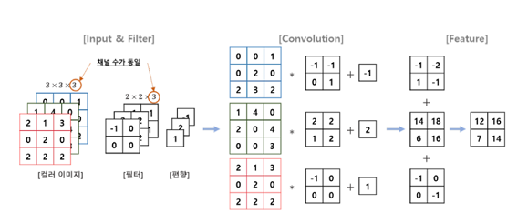

```
[Input & Filter]
컬러 이미지: 3×3×3 (높이×너비×채널)
필터:        2×2×3 (필터 크기×채널 — 입력 채널 수와 동일해야 함)

[Convolution]
R 채널 합성곱 결과
G 채널 합성곱 결과   → 모두 합산 + bias → Feature Map 1장
B 채널 합성곱 결과

[Feature]
출력 채널 수 = 필터 개수
```

---

## 📌 Pooling Layer (풀링 레이어)

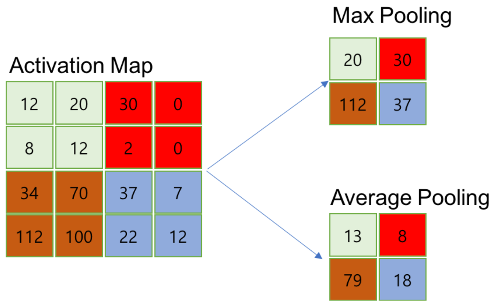

Feature Map의 **크기를 줄여서** 계산량 감소, 과적합 방지, 특징의 위치 변동에 둔감해진다.

**Max Pooling** — 2×2 영역에서 최대값 추출

```
3  5  1  5          8  5
8  0  3  2    →     9  9
7  9  1  5
6  8  4  9
```

**Average Pooling** — 2×2 영역의 평균값 추출

```
3  5  1  5          4    2.75
8  0  3  2    →     7.5  4.7
7  9  1  5
6  8  4  9
```

| |Max Pooling|Average Pooling|
|---|---|---|
|추출값|최대값|평균값|
|특징|강한 패턴 강조|전체적인 특징 보존|
|CNN 주 사용|✅ 주로 사용|드물게 사용|

---

## 📌 ReLU가 CNN에서 필요한 이유

Conv 연산은 덧셈 + 곱셈으로만 이루어짐 → **Linear(선형)** 상태.

Linear하면 단순한 분류만 가능, 복잡한 패턴 분류 불가.

→ **ReLU로 Non-Linearity(비선형성) 부여**

```
ReLU: f(x) = max(0, x)
음수값 → 0, 양수값 → 그대로
```

---

## 📌 Flatten & Fully Connected & Softmax

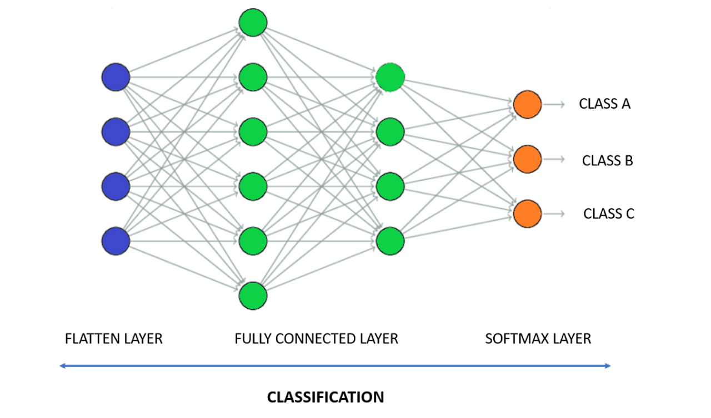

```
Feature Map (예: 7×7×64)
→ Flatten → (3136,) 1차원 벡터
→ Fully Connected Layer (Dense)
→ Softmax → 클래스 확률 출력
```

**Softmax가 마지막에 붙는 이유**

FC 출력은 그냥 raw score (0~1 아님, 합이 1 아님). Softmax가 이걸 확률로 변환:

```
값 범위: 0~1,  전체 합: 1  → 확률 분포
예: [고양이: 0.8, 개: 0.15, 자동차: 0.05]
```

Softmax + CrossEntropy 조합은 gradient 계산이 매우 안정적 → 사실상 표준 구조.

---

## 📌 CNN vs MLP 비교

| |MLP|CNN|
|---|---|---|
|입력 형태|(784,) 1차원|(28, 28, 1) 2차원|
|특징 추출|❌ 없음|✅ 필터로 자동 추출|
|공간 정보|❌ 손실|✅ 보존|
|파라미터 수|많음|적음 (가중치 공유)|
|Fashion MNIST 정확도|~89%|~90%+|

**가중치 공유 (Weight Sharing)**

```
MLP:  784 × 128 = 100,352개 파라미터 (첫 레이어만)
CNN:  3 × 3 = 9개 파라미터 (필터 하나)
```

같은 필터를 이미지 전체에 슬라이딩하면서 적용하므로 파라미터 수가 훨씬 적다.

---

## 📌 CNN 구조 변화 흐름

```
예전 (CNN classic)        : Image → CNN → Flatten → FC → Softmax
요즘 (modern CNN)         : Image → CNN → Global Avg Pool → Softmax
최신 (Vision Transformer) : Image → Patch → Transformer → Class token → Softmax
```

FC가 점점 줄어드는 이유:

- 파라미터 많음, 과적합 우려
- Global Average Pooling 등장으로 FC 없이 바로 분류 가능
- Transformer가 공간 구조를 더 유연하게 학습

---

## 📌 대표 CNN 기반 모델

|모델|연도|특징|
|---|---|---|
|**AlexNet**|2012|ImageNet 우승, 딥러닝 이미지 인식 시초, 최초 멀티 GPU 학습|
|**VGGNet**|2014|3×3 필터만 사용, 깊이로 성능 향상에 중점|
|**ResNet**|2015|잔차 연결(Residual Connection)로 기울기 소실 문제 해결|

**잔차 연결(Residual Connection)** — 이전 레이어의 출력을 몇 레이어를 건너뛰고 다음 레이어의 입력으로 직접 추가하는 방식.

---

## 📌 CNN 응용 분야

|분야|설명|예시|
|---|---|---|
|Classification|이미지가 무슨 이미지인지 분류|고양이 사진 → "고양이"|
|Object Detection|이미지에 물체 위치에 박스|고양이 부분에 네모 박스|
|Semantic Segmentation|픽셀 단위 분류 (같은 종류 동일)|고양이 2마리 → 둘 다 고양이|
|Instance Segmentation|픽셀 단위 분류 (개체마다 다르게)|고양이 2마리 → 각각 다르게|

---

## 📌 핵심 정리

```
😎 커널 = 학습되는 패턴 탐지기
😎 stride = 얼마나 건너뛰며 볼지
😎 padding = 가장자리 보존 + 크기 유지
😎 feature map = "필터 적용 결과"
```

> CNN은 "공간적으로 이동하면서 내적을 반복하는 구조"다.

---

## 📌 Keras CNN 코딩 레퍼런스

### Conv2D

```python
from tensorflow.keras.layers import Conv2D

Conv2D(
    filters=32,           # 필터 수 → Feature Map 32장 생성 (채널 수)
    kernel_size=3,        # 필터 크기 3×3 (정수 또는 (3, 3) 튜플)
    strides=1,            # 필터 이동 칸 수 (기본값 1)
    padding='same',       # 'same': 출력 크기 유지 / 'valid': 패딩 없음
    activation='relu',    # 활성화 함수 (Conv 뒤에 ReLU 바로 적용)
    input_shape=(28, 28, 1)  # 첫 레이어에만 지정 (높이, 너비, 채널)
)
```

|파라미터|설명|예시|
|---|---|---|
|`filters`|필터 수 = 출력 Feature Map 수|32, 64, 128|
|`kernel_size`|필터 크기|3 → 3×3, 5 → 5×5|
|`strides`|이동 칸 수|1 (기본), 2 (다운샘플링)|
|`padding`|`same`: 크기 유지 / `valid`: 줄어듦|`'same'` 주로 사용|
|`activation`|활성화 함수|`'relu'` 주로 사용|

### MaxPooling2D

```python
from tensorflow.keras.layers import MaxPooling2D

MaxPooling2D(
    pool_size=2,     # 2×2 영역에서 최대값 추출
    strides=2,       # 기본값: pool_size와 동일 (겹치지 않게 이동)
    padding='valid'  # 기본값: valid
)
```

### Flatten

```python
from tensorflow.keras.layers import Flatten

Flatten()
# 2D Feature Map → 1D 벡터로 자동 변환
# (batch, 7, 7, 64) → (batch, 3136)
# reshape 코드 없이 모델 내부에서 자동 처리
```

### CNN 모델 전체 예시

```python
from tensorflow.keras.models import Sequential
from tensorflow.keras.layers import Conv2D, MaxPooling2D, Flatten, Dense, Input

model = Sequential([
    Input(shape=(28, 28, 1)),                         # 흑백 이미지 입력

    Conv2D(32, kernel_size=3, padding='same', activation='relu'),
    # 3×3 필터 32개 → Feature Map 32장 / padding='same' → 크기 유지 (28×28)

    MaxPooling2D(pool_size=2),
    # 2×2 최대 풀링 → 크기 절반으로 축소 (14×14)

    Conv2D(64, kernel_size=3, padding='same', activation='relu'),
    # 3×3 필터 64개 → Feature Map 64장 (14×14)

    MaxPooling2D(pool_size=2),
    # 2×2 최대 풀링 → (7×7)

    Flatten(),
    # 7×7×64 = 3136개짜리 1D 벡터로 변환

    Dense(64, activation='relu'),    # 완전연결층
    Dense(10, activation='softmax')  # 출력층 (10개 클래스)
])

model.summary()
```

### 레이어별 Feature Map 크기 변화

```
Input       (28, 28,  1)
Conv2D(32)  (28, 28, 32)   ← padding='same'이라 크기 유지
MaxPool     (14, 14, 32)   ← 절반으로 축소
Conv2D(64)  (14, 14, 64)
MaxPool     ( 7,  7, 64)
Flatten     (3136,)
Dense(64)   (64,)
Dense(10)   (10,)          ← Softmax 확률 출력
```

### Input shape 정리

```python
Input(shape=(28, 28, 1))    # 흑백 이미지 (MNIST)
Input(shape=(28, 28, 3))    # 컬러 이미지 (RGB)
Input(shape=(224, 224, 3))  # 큰 컬러 이미지 (ImageNet 등)
#             ↑      ↑   ↑
#           높이    너비  채널
# 배치 차원은 포함하지 않음 (Keras가 자동 처리)
```

---

# 📄 tf26before_cnn.py — 합성곱 원리 · 필터 · 특징 추출

## 🧠 개념 정리

CNN을 이해하기 위한 사전 실습이다. 이미지에 **필터(커널)를 슬라이딩**하면서 특징을 추출하는 합성곱의 원리를 직접 확인한다.

전체 흐름:

```
컵 이미지 로드 (RGB)
→ 흑백 변환 (rgb2gray)
→ 64×64 리사이즈
→ 3×3 필터 정의 (수직 엣지 감지)
→ padding 적용 (66×66)
→ 이중 for문으로 슬라이딩 합성곱 수행
→ Feature Map 출력
```

---

## 🖼️ 시각화 결과

### 원본 이미지 (흑백 변환 + 64×64 리사이즈)

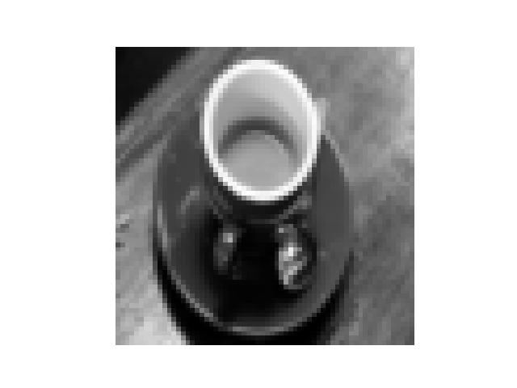

> scikit-image 내장 커피컵 이미지를 흑백 변환 + 64×64 리사이즈한 결과. 픽셀값 0.0~1.0 사이 실수.

### 필터 적용 후 Feature Map

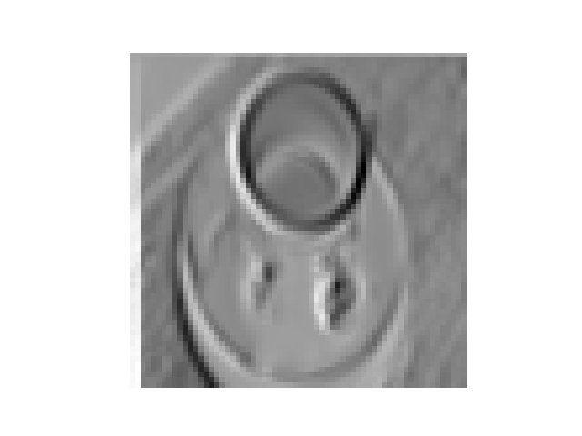

> 수직 엣지 감지 필터 적용 결과. 좌우 밝기 차이가 큰 **세로 방향 경계선**이 강조되어 나타난다. 큰 양수(밝음) = 왼→오 밝아지는 경계 / 음수(어두움) = 오→왼 밝아지는 경계 / 0에 가까운 값 = 경계 없는 평탄한 영역

### 출력값 해석

```
원본 픽셀값 (0.0~1.0):
[[0.059  0.066  0.083 ...]
 [0.056  0.068  0.086 ...]  ← 모두 양수, 정규화된 밝기값
 ...]

Feature Map 값 (음수 포함):
[[ 5.9e-02  6.6e-02  2.4e-02 ...]   ← 평탄한 영역 → 0에 가까움
 [ 5.6e-02  6.8e-02 -2.9e-02 ...]   ← 음수 = 오른→왼 방향 경계
 [ 1.19e+00  1.26e+00 -4.8e-01 ...] ← 큰 양수 = 강한 세로 경계선
 ...]
```

---

## 💻 코드 + 주석

```python
import matplotlib.pyplot as plt
from scipy.ndimage import correlate
import numpy as np
from skimage import data
from skimage.color import rgb2gray
from skimage.transform import resize

# -------------------------------------------------------
# 1. 이미지 로드 및 전처리
# -------------------------------------------------------

# scikit-image 내장 커피컵 이미지 로드 (RGB 컬러)
im = rgb2gray(data.coffee())
# rgb2gray: RGB 3채널 → 흑백 1채널로 변환 (픽셀값 0.0~1.0)

im = resize(im, (64, 64))   # 원본 이미지를 64×64로 리사이즈 (계산량 감소)
print(im.shape)              # (64, 64)

print(im)                    # 픽셀값 확인 (0.0~1.0 사이 실수)

plt.axis('off')
plt.imshow(im, cmap='gray')  # 흑백 컬러맵으로 시각화 (없으면 이상한 색 나옴)
plt.show()

# -------------------------------------------------------
# 2. 합성곱 필터 정의 (3×3)
# -------------------------------------------------------

# 수평 엣지 필터 (주석 처리 — 위아래 밝기 차이 감지)
# filter = np.array([
#     [1, 1, 1],    # 위쪽 +1
#     [0, 0, 0],    # 중간 무시
#     [-1, -1, -1]  # 아래쪽 -1
# ])

# 수직 엣지 필터 — 좌우 밝기 차이 감지
filter = np.array([
    [-1, 0, 1],   # 왼쪽 -1, 오른쪽 +1
    [-1, 0, 0],
    [-1, 0, 1]
])
# 왼쪽 열 -1, 오른쪽 열 +1
# → 좌우 밝기 차이가 클수록 큰 값 출력 → 세로 방향 경계선 강조
# → 균일한 영역은 0에 가까운 값 출력

# -------------------------------------------------------
# 3. Padding 적용
# -------------------------------------------------------

new_image = np.zeros(im.shape)  # Feature Map 저장용 빈 배열 (64, 64)
im_pad = np.pad(im, 1, 'constant')
# constant: 상수값(기본 0)으로 패딩
# (64, 64) → (66, 66): 테두리에 0 한 겹 추가
# → 3×3 필터를 가장자리 픽셀에도 적용 가능 (same padding 효과)

# -------------------------------------------------------
# 4. 합성곱 연산 (슬라이딩)
# -------------------------------------------------------

# 원래 이미지 im의 크기에 대해 모든 픽셀 좌표(i, j)를 순회
for i in range(im.shape[0]):    # 0~63 (세로 방향)
    for j in range(im.shape[1]):    # 0~63 (가로 방향)
        try:
            new_image[i, j] = (
                im_pad[i-1, j-1] * filter[0, 0]    # 좌상단
                + im_pad[i-1, j]   * filter[0, 1]  # 상단
                + im_pad[i-1, j+1] * filter[0, 2]  # 우상단
                + im_pad[i,   j-1] * filter[1, 0]  # 좌
                + im_pad[i,   j]   * filter[1, 1]  # 중앙
                + im_pad[i,   j+1] * filter[1, 2]  # 우
                + im_pad[i+1, j-1] * filter[2, 0]  # 좌하단
                + im_pad[i+1, j]   * filter[2, 1]  # 하단
                + im_pad[i+1, j+1] * filter[2, 2]  # 우하단
            )
            # 현재 픽셀(i, j) 주변 3×3 영역과 필터를 원소별 곱 후 합산
            # → 결과값을 Feature Map(new_image)에 저장
        except:
            pass    # 인덱스 범위 초과 시 무시 (패딩 덕분에 실제로는 발생 안 함)

print(new_image)    # Feature Map 출력 (음수 포함)

plt.axis('off')
plt.imshow(new_image, cmap='gray')  # Feature Map 시각화
plt.show()
# 세로 방향 경계선(엣지)이 강조된 결과 이미지 출력
```

---

## 📌 핵심 개념 정리

### 필터(커널) 종류 비교

|필터|구조|감지 방향|
|---|---|---|
|수평 엣지|위`+1` 아래`-1`|가로 경계선|
|수직 엣지|왼`-1` 오른`+1`|세로 경계선|

### padding 적용 이유

```
원본 64×64
→ padding=1 적용 → 66×66

3×3 필터를 가장자리 픽셀에도 적용 가능
→ Feature Map 크기 = 원본과 동일하게 유지 (same padding 효과)
```

### 이중 for문의 의미

```python
for i in range(64):     # 세로 방향 슬라이딩
    for j in range(64): # 가로 방향 슬라이딩
```

필터가 이미지 전체를 한 칸씩 이동하면서 연산하는 **슬라이딩 동작**을 구현한 것. 실제 CNN에서는 이 과정이 `Conv2D` 레이어 내부에서 자동으로 수행된다.

### correlate vs convolve

| |`correlate`|`convolve`|
|---|---|---|
|필터 방향|그대로 적용|180도 회전 후 적용|
|딥러닝 실제 연산|✅ 이걸 사용|수학적 정의|
|대칭 필터 결과|동일|동일|

> 딥러닝에서 "합성곱"이라고 부르지만 실제로는 `cross-correlation(상관)` 연산을 사용한다. 관습적으로 합성곱이라 부르는 것.

---
# 📄 cnn1.ipynb — MNIST CNN 분류 · Sequential · Functional · Subclassing

## 🧠 개념 정리

MNIST 손글씨 데이터셋을 CNN으로 분류하는 실습이다. Sequential, Functional, Subclassing 세 가지 방식으로 모델을 구성하고 비교한다.

전체 흐름:

```
MNIST 로드 (60000장 / 10000장)
→ reshape (60000, 28, 28) → (60000, 28, 28, 1)   ← 채널 추가
→ 정규화 (/ 255.0)
→ CNN 모델 구성 3가지 방식
→ 학습 (EarlyStopping)
→ 평가 / 저장 / 재로딩 / 예측
→ 학습 곡선 시각화
→ 혼동행렬 시각화
```

---

## 📊 학습 결과

### 학습 곡선

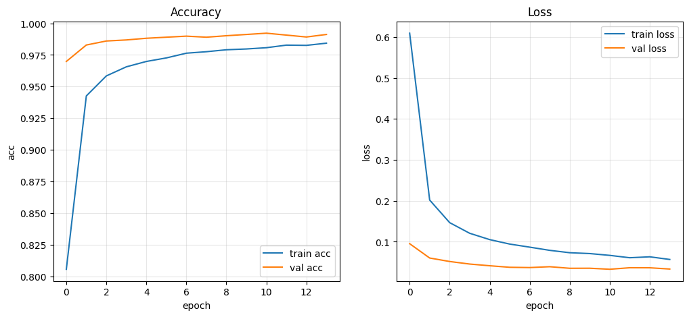

> val acc가 train acc보다 높게 시작 → Dropout 효과 (학습 시 일부 뉴런 꺼짐, 평가 시 전부 켜짐) train loss > val loss도 같은 이유. 최종 val acc: **~99.4%**

### 혼동행렬

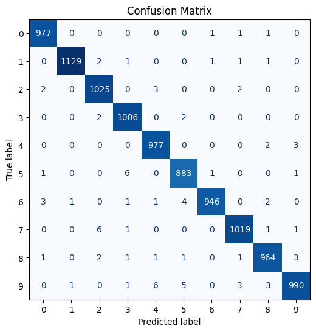

> 대각선 값이 압도적으로 높아 전반적으로 잘 분류됨. 주요 오분류: 5→3 (6번), 9→4 (6번), 2→7 (6번) — 형태가 유사한 숫자 간 혼동

---

## 💻 코드 + 주석

### Cell 1 — 환경 확인

```python
!cat /etc/os-release   # OS: Ubuntu 22.04.5 LTS
print()
!ls -a                 # 현재 디렉토리 목록
!df -h                 # 디스크 용량
!free -h               # 메모리 (총 12GB)
!nvidia-smi            # GPU: Tesla T4 (15GB VRAM)
```

---

### Cell 2 — 데이터 준비

```python
import tensorflow as tf
print(tf.__version__)   # 2.20.0
import numpy as np
import matplotlib.pyplot as plt

(x_train, y_train), (x_test, y_test) = tf.keras.datasets.mnist.load_data()
print(x_train.shape)    # (60000, 28, 28)

# 채널 추가 + 정규화
x_train = x_train.reshape((-1, 28, 28, 1)).astype('float') / 255.0
# -1: 배치 크기 자동 계산 (60000)
# 28, 28: 이미지 크기 유지 (MLP와 달리 펼치지 않음)
# 1: 흑백 채널 수 추가
# / 255.0: 픽셀값 0~255 → 0.0~1.0 정규화

x_test = x_test.reshape((-1, 28, 28, 1)).astype('float') / 255.0
print(x_train.shape)    # (60000, 28, 28, 1)
```

> MLP: `reshape(60000, 784)` → 1차원으로 펼침 (공간 정보 손실) CNN: `reshape(-1, 28, 28, 1)` → 채널만 추가 (공간 정보 보존)

---

### Cell 3 — 모델 정의 (Sequential 방식)

```python
model = tf.keras.models.Sequential([
    tf.keras.layers.Input(shape=(28, 28, 1)),

    # Conv Block 1
    tf.keras.layers.Conv2D(filters=16, kernel_size=(3, 3), padding='same', activation='relu'),
    # 3×3 필터 16개 → Feature Map 16장 / padding='same' → 크기 유지 (28, 28, 16)
    tf.keras.layers.MaxPool2D(pool_size=(2, 2)),
    # 2×2 최대 풀링 → 크기 절반 (14, 14, 16)
    tf.keras.layers.Dropout(rate=0.2),

    # Conv Block 2
    tf.keras.layers.Conv2D(filters=32, kernel_size=(3, 3), padding='same', activation='relu'),
    # (14, 14, 32)
    tf.keras.layers.MaxPool2D(pool_size=(2, 2)),
    # (7, 7, 32)
    tf.keras.layers.Dropout(rate=0.2),

    tf.keras.layers.Flatten(),
    # 2D → 1D: (7, 7, 32) → (1568,)  FCLayer 입력을 위해 1차원으로 변경

    tf.keras.layers.Dense(units=64, activation='relu'),
    tf.keras.layers.Dropout(rate=0.3),
    tf.keras.layers.Dense(units=32, activation='relu'),
    tf.keras.layers.Dropout(rate=0.2),
    tf.keras.layers.Dense(units=10, activation='softmax')
    # 출력층: 0~9 클래스 확률
])

model.summary()
```

모델 구조:

```
Input          (28, 28,  1)
Conv2D(16)     (28, 28, 16)
MaxPool        (14, 14, 16)
Dropout(0.2)
Conv2D(32)     (14, 14, 32)
MaxPool        ( 7,  7, 32)
Dropout(0.2)
Flatten        (1568,)
Dense(64)      (64,)
Dropout(0.3)
Dense(32)      (32,)
Dropout(0.2)
Dense(10)      (10,)        ← softmax

Total params: 107,626
```

---

### Cell 4 — 컴파일 및 학습

```python
model.compile(
    optimizer='adam',
    loss='sparse_categorical_crossentropy',
    # 원핫 인코딩 없이 정수 레이블 그대로 사용 가능
    # categorical_crossentropy는 to_categorical() 필요
    metrics=['accuracy']
)

es = tf.keras.callbacks.EarlyStopping(
    monitor='val_loss',
    patience=3,                 # 3번 연속 개선 없으면 중단
    restore_best_weights=True   # 최적 가중치로 자동 복원
)

history = model.fit(
    x_train, y_train,
    epochs=100,
    batch_size=128,
    validation_split=0.1,   # 훈련 데이터 10%를 검증용으로 분리
    callbacks=[es],
    verbose=1
)
# Epoch 11: val_loss 최저 → Epoch 14에서 EarlyStopping 동작
```

---

### Cell 5 — 모델 평가

```python
# train/test 점수 차이가 크면 과적합 의심
train_loss, train_acc = model.evaluate(x_train, y_train, verbose=0)
print(f'train loss {train_loss:.4f}, train acc {train_acc:.4f}')

test_loss, test_acc = model.evaluate(x_test, y_test, verbose=0)
print(f'test loss {test_loss:.4f}, test acc {test_acc:.4f}')
```

---

### Cell 6 — 모델 저장

```python
SAVE_PATH = 'cnn1model.keras'
model.save(SAVE_PATH)
print(f'모델 저장 {SAVE_PATH}')
# .keras: 구조 + 가중치 + 컴파일 설정 모두 포함
```

---

### Cell 7 — 모델 재로딩

```python
loaded_model = tf.keras.models.load_model(SAVE_PATH)
test_loss, test_acc = loaded_model.evaluate(x_test, y_test, verbose=0)
print(f'[Reloaded]test loss {test_loss:.4f}, test acc {test_acc:.4f}')
# 저장 전/후 성능 동일 → 모델 저장 검증
```

---

### Cell 8 — 단일 예측

```python
idx = 0
x_one = x_test[idx:idx + 1]    # shape (1, 28, 28, 1) — 배치 차원 유지
y_true = int(y_test[idx])
print(y_true)                   # 7

probs = loaded_model.predict(x_one, verbose=0)[0]
# [0]: 배치 첫 번째 결과 → (10,) 확률값
print('probs : ', probs)
# probs[7] ≈ 99.999% → 압도적

y_pred = int(np.argmax(probs))
print(f'실제값:{y_true}, 예측값:{y_pred}')  # 실제값:7, 예측값:7 ✅
```

---

### Cell 9 — 학습 곡선 시각화

```python
# % matplotlib inline  ← 매직 명령어: 셀 아래에 그래프 출력
#                         최신 코랩은 기본값이 inline이라 생략 가능

plt.figure(figsize=(12, 5))

plt.subplot(1, 2, 1)
plt.plot(history.history['accuracy'], label='train acc')
plt.plot(history.history['val_accuracy'], label='val acc')
plt.title('Accuracy')
plt.xlabel('epoch')
plt.ylabel('acc')
plt.legend()
plt.grid(True, alpha=0.3)   # alpha: 격자선 투명도

plt.subplot(1, 2, 2)
plt.plot(history.history['loss'], label='train loss')
plt.plot(history.history['val_loss'], label='val loss')
plt.title('Loss')
plt.xlabel('epoch')
plt.ylabel('loss')
plt.legend()
plt.grid(True, alpha=0.3)

plt.show()
```

---

### Cell 10 — 혼동행렬

```python
from sklearn.metrics import confusion_matrix, ConfusionMatrixDisplay

y_pred_all = np.argmax(loaded_model.predict(x_test, verbose=0), axis=1)
# axis=1: 각 이미지별 확률 최대 인덱스 → shape (10000,)

cm = confusion_matrix(y_test, y_pred_all, labels=list(range(10)))
# 행: 실제값, 열: 예측값
# 대각선: 정답 / 대각선 외: 오분류

classes = [str(i) for i in range(10)]
disp = ConfusionMatrixDisplay(cm, display_labels=classes)
fig, ax = plt.subplots(figsize=(6, 6))
disp.plot(ax=ax, cmap='Blues', values_format='d', colorbar=False)
# cmap='Blues': 파란색 계열
# values_format='d': 정수 표시
# colorbar=False: 컬러바 숨김
plt.title('Confusion Matrix')
plt.show()
```

---

## 📌 핵심 개념 정리

### 케라스 모델 구성 3가지 방식

|방식|특징|적합한 경우|
|---|---|---|
|**Sequential**|레이어를 순서대로 쌓음, 가장 단순|단순한 선형 구조|
|**Functional API**|`inputs → x → outputs` 흐름, 유연|다중 입출력, 분기 구조|
|**Subclassing**|클래스로 모델 정의, 가장 유연|커스텀 로직, 복잡한 구조|

### Functional API 핵심 규칙

```python
inputs = tf.keras.layers.Input(shape=(28, 28, 1))

# 첫 레이어 → inputs 연결
x = tf.keras.layers.Conv2D(...)(inputs)

# 이후 레이어 → x 연결
x = tf.keras.layers.MaxPool2D(...)(x)

outputs = tf.keras.layers.Dense(10, activation='softmax')(x)

model = tf.keras.Model(inputs=inputs, outputs=outputs)
```

### Subclassing 핵심 규칙

```python
@tf.keras.utils.register_keras_serializable(package='custom')
# 모델 저장/리로딩 시 자동 등록해주는 데코레이터
class MyModel(tf.keras.Model):
    def __init__(self, **kwargs):
        super().__init__(**kwargs)
        # __init__: 레이어 정의
        self.conv1 = tf.keras.layers.Conv2D(...)

    def call(self, inputs, training=False):
        # call: 순전파 흐름 정의
        # training=False: Dropout이 학습/평가 모드를 구분할 때 사용
        x = self.conv1(inputs)
        return x

# build() 대신 더미 데이터로 shape 확정
model = MyModel()
model(tf.zeros((1, 28, 28, 1)))
model.summary()
```

### BatchNormalization

```python
# 기존: Conv2D(activation='relu')
# BN 적용 시: use_bias=False → BN → ReLU 순서로 분리

x = tf.keras.layers.Conv2D(filters=16, kernel_size=3, padding='same', use_bias=False)(x)
x = tf.keras.layers.BatchNormalization()(x)
x = tf.keras.layers.ReLU()(x)
```

| |기존 방식|BN 적용|
|---|---|---|
|순서|Conv → ReLU|Conv → BN → ReLU|
|use_bias|True|False (BN이 bias 역할 대신함)|
|효과|-|학습 안정화, 수렴 가속화, 과적합 방지|

### 혼동행렬 읽는 법

```
행(True label):      실제값
열(Predicted label): 예측값
대각선:              정답 (높을수록 좋음)
대각선 외:           오분류 (낮을수록 좋음)
```

### loss 함수 선택

|loss|레이블 형태|사용 시점|
|---|---|---|
|`sparse_categorical_crossentropy`|정수 그대로|`to_categorical()` 생략 시|
|`categorical_crossentropy`|원핫 인코딩 벡터|`to_categorical()` 사용 시|

### Sequential vs Subclassing 성능 비교

| |Sequential|Subclassing|
|---|---|---|
|val acc|~99.1%|~99.4%|
|params|107,626|221,994|
|EarlyStopping|Epoch 14|Epoch 14|

---
# 📄 cnn2functional.ipynb — MNIST CNN · Functional API · BatchNormalization

## 🧠 개념 정리

MNIST 손글씨 데이터셋을 CNN **Functional API** 방식으로 분류하는 실습이다. Sequential 방식과 달리 `inputs → x → outputs` 흐름으로 모델을 정의하며, BatchNormalization을 적용해 학습을 안정화한다.

전체 흐름:

```
MNIST 로드
→ reshape (60000, 28, 28) → (60000, 28, 28, 1)
→ 정규화 (/ 255.0)
→ Functional API로 모델 정의 (BatchNormalization 적용)
→ 학습 (EarlyStopping)
→ 평가
```

---

## 💻 코드 + 주석

### Cell 1 — 데이터 준비

```python
import tensorflow as tf
import numpy as np
import matplotlib.pyplot as plt

(x_train, y_train), (x_test, y_test) = tf.keras.datasets.mnist.load_data()
print(x_train.shape)    # (60000, 28, 28)

x_train = x_train.reshape((-1, 28, 28, 1)).astype('float') / 255.0
# CNN 입력: 채널 차원 추가 (흑백 = 1채널)
x_test = x_test.reshape((-1, 28, 28, 1)).astype('float') / 255.0
print(x_train.shape)    # (60000, 28, 28, 1)
```

---

### Cell 2 — 모델 정의 (Functional API + BatchNormalization)

```python
"""
# 모델 정의 1 (기본 Functional API — 주석 처리)
inputs = tf.keras.layers.Input(shape=(28, 28, 1))

# Convolution Block1
x = tf.keras.layers.Conv2D(filters=16, kernel_size=(3, 3), padding='same', activation='relu')(inputs)
x = tf.keras.layers.MaxPool2D(pool_size=(2,2))(x)
x = tf.keras.layers.Dropout(rate=0.2)(x)

# Convolution Block2
x = tf.keras.layers.Conv2D(filters=32, kernel_size=(3, 3), padding='same', activation='relu')(x)
x = tf.keras.layers.MaxPool2D(pool_size=(2,2))(x)
x = tf.keras.layers.Dropout(rate=0.2)(x)

# Fully Connected Layers
x = tf.keras.layers.Flatten()(x)
x = tf.keras.layers.Dense(units=64, activation='relu')(x)
x = tf.keras.layers.Dropout(rate=0.2)(x)
x = tf.keras.layers.Dense(units=32, activation='relu')(x)
x = tf.keras.layers.Dropout(rate=0.2)(x)
outputs = tf.keras.layers.Dense(units=10, activation='softmax')(x)
"""

# 모델 정의 2 (BatchNormalization 적용)
inputs = tf.keras.layers.Input(shape=(28, 28, 1))

# Convolution Block1
# use_bias=False: BN이 bias 역할을 대신하므로 Conv bias 불필요
# BatchNormalization: 각 배치의 출력을 정규화 → 학습 안정화, 수렴 가속화, 과적합 방지
# ReLU를 BN 뒤에 두는 이유: BN 후 정규화된 값에 비선형성 적용이 더 효과적
x = tf.keras.layers.Conv2D(filters=16, kernel_size=(3, 3), padding='same', use_bias=False)(inputs)
x = tf.keras.layers.BatchNormalization()(x)
x = tf.keras.layers.ReLU()(x)
x = tf.keras.layers.MaxPool2D(pool_size=(2, 2))(x)  # (28,28,16) → (14,14,16)
x = tf.keras.layers.Dropout(rate=0.2)(x)

# Convolution Block2
x = tf.keras.layers.Conv2D(filters=64, kernel_size=(3, 3), padding='same', use_bias=False)(x)
x = tf.keras.layers.BatchNormalization()(x)
x = tf.keras.layers.ReLU()(x)
x = tf.keras.layers.MaxPool2D(pool_size=(2, 2))(x)  # (14,14,64) → (7,7,64)
x = tf.keras.layers.Dropout(rate=0.2)(x)

# Fully Connected Layers
x = tf.keras.layers.Flatten()(x)   # (7,7,64) → (3136,)

x = tf.keras.layers.Dense(units=64, activation='relu')(x)
x = tf.keras.layers.Dropout(rate=0.2)(x)
x = tf.keras.layers.Dense(units=32, activation='relu')(x)
x = tf.keras.layers.Dropout(rate=0.2)(x)
outputs = tf.keras.layers.Dense(units=10, activation='softmax')(x)

# Functional API 모델 생성
# inputs, outputs 명시적으로 지정 → 모델 구조가 DAG(비순환 방향 그래프)로 정의됨
model = tf.keras.models.Model(inputs, outputs=outputs, name='mnist_cnn_func')
print(model.summary())

# 컴파일
model.compile(
    optimizer='adam',
    loss='sparse_categorical_crossentropy',  # 정수 레이블 그대로 사용
    metrics=['accuracy']
)

# EarlyStopping
es = tf.keras.callbacks.EarlyStopping(
    monitor='val_loss',
    patience=3,
    restore_best_weights=True
)

# 학습
history = model.fit(
    x_train, y_train,
    epochs=100,
    batch_size=128,
    validation_split=0.1,
    callbacks=[es],
    verbose=1
)

# 평가
train_loss, train_acc = model.evaluate(x_train, y_train, verbose=0)
print(f'train loss {train_loss:.4f}, train acc {train_acc:.4f}')
test_loss, test_acc = model.evaluate(x_test, y_test, verbose=0)
print(f'test loss {test_loss:.4f}, test acc {test_acc:.4f}')
```

모델 구조:

```
Input              (28, 28,  1)
Conv2D(16)         (28, 28, 16)   ← use_bias=False
BatchNormalization (28, 28, 16)
ReLU               (28, 28, 16)
MaxPool            (14, 14, 16)
Dropout(0.2)

Conv2D(64)         (14, 14, 64)   ← use_bias=False
BatchNormalization (14, 14, 64)
ReLU               (14, 14, 64)
MaxPool            ( 7,  7, 64)
Dropout(0.2)

Flatten            (3136,)
Dense(64)          (64,)
Dropout(0.2)
Dense(32)          (32,)
Dropout(0.2)
Dense(10)          (10,)          ← softmax
```

---

## 📌 핵심 개념 정리

### Functional API vs Sequential 비교

| |Sequential|Functional API|
|---|---|---|
|정의 방식|리스트로 레이어 쌓기|`inputs → x → outputs` 흐름|
|유연성|낮음 (선형 구조만)|높음 (분기, 병합 가능)|
|입력 연결|자동|첫 레이어 → `(inputs)` 명시|
|모델 생성|`Sequential([...])`|`Model(inputs, outputs)`|

### Functional API 핵심 규칙

```python
# 1. 입력 정의
inputs = tf.keras.layers.Input(shape=(28, 28, 1))

# 2. 첫 레이어는 반드시 (inputs) 연결
x = tf.keras.layers.Conv2D(...)(inputs)   # ← inputs

# 3. 이후 레이어는 (x) 연결
x = tf.keras.layers.MaxPool2D(...)(x)     # ← x

# 4. 출력층
outputs = tf.keras.layers.Dense(10, activation='softmax')(x)

# 5. 모델 생성
model = tf.keras.models.Model(inputs=inputs, outputs=outputs)
```

### BatchNormalization

각 배치의 출력값을 정규화해서 학습을 안정화하는 레이어.

```
기존: Conv2D(activation='relu')
BN:  Conv2D(use_bias=False) → BatchNormalization → ReLU
```

|항목|설명|
|---|---|
|`use_bias=False`|BN이 bias 역할을 대신하므로 Conv bias 불필요|
|BN 위치|Conv 뒤, ReLU 앞|
|효과|학습 안정화, 수렴 가속화, 과적합 방지|

### ReLU를 BN 뒤에 두는 이유

```
Conv → BN → ReLU  ✅ (BN으로 정규화 후 비선형성 적용)
Conv → ReLU → BN  ❌ (음수가 ReLU에서 0이 되면 BN 효과 감소)
```

---
# 📄 cnn3subclass.ipynb — MNIST CNN · Subclassing · register_keras_serializable

## 🧠 개념 정리

MNIST 손글씨 데이터셋을 CNN **Subclassing** 방식으로 분류하는 실습이다. `tf.keras.Model`을 상속받아 클래스로 모델을 정의하며, 가장 유연하고 커스터마이징이 자유로운 방식이다.

전체 흐름:

```
MNIST 로드
→ reshape (60000, 28, 28) → (60000, 28, 28, 1)
→ 정규화 (/ 255.0)
→ Subclassing으로 모델 정의
→ 더미 입력으로 shape 확정
→ 학습 (EarlyStopping)
→ 평가
```

---

## 📊 학습 결과

```
Epoch 1/100  accuracy: 0.8621  val_accuracy: 0.9778
Epoch 2/100  accuracy: 0.9643  val_accuracy: 0.9890
Epoch 3/100  accuracy: 0.9759  val_accuracy: 0.9875
Epoch 4/100  accuracy: 0.9800  val_accuracy: 0.9900
Epoch 5/100  accuracy: 0.9827  val_accuracy: 0.9890
Epoch 6/100  accuracy: 0.9856  val_accuracy: 0.9905
Epoch 7/100  accuracy: 0.9867  val_accuracy: 0.9898
Epoch 8/100  accuracy: 0.9885  val_accuracy: 0.9905  ← EarlyStopping (patience=3)

train loss 0.0236, train acc 0.9929
test  loss 0.0316, test  acc 0.9904
```

> Epoch 5에서 val_loss 최저(0.0373) → Epoch 8에서 EarlyStopping 동작 train acc(99.3%) ≈ test acc(99.0%) → 과적합 없음 ✅

### Sequential vs Functional vs Subclassing 성능 비교

| |Sequential|Functional (BN)|Subclassing|
|---|---|---|---|
|val acc|~99.1%|~99.4%|~99.0%|
|params|107,626|-|221,994|
|EarlyStopping|Epoch 14|-|Epoch 8|

---

## 💻 코드 + 주석

### Cell 1 — 데이터 준비

```python
import tensorflow as tf
import numpy as np
import matplotlib.pyplot as plt

(x_train, y_train), (x_test, y_test) = tf.keras.datasets.mnist.load_data()
print(x_train.shape)    # (60000, 28, 28)

x_train = x_train.reshape((-1, 28, 28, 1)).astype('float') / 255.0
x_test = x_test.reshape((-1, 28, 28, 1)).astype('float') / 255.0
print(x_train.shape)    # (60000, 28, 28, 1)
```

---

### Cell 2 — 모델 정의 (Subclassing)

```python
@tf.keras.utils.register_keras_serializable(package='custom')
# 데코레이터: 사용자 작성 클래스를 케라스 모델 저장/리로딩 시 자동으로 등록
# package='custom': 등록할 패키지 이름 (임의 지정 가능)
# 없으면 model.save() 후 load_model() 시 클래스를 못 찾아 에러 발생

class MyMnistCnn(tf.keras.Model):
    def __init__(self, **kwargs):
        super().__init__(**kwargs)
        # __init__: 사용할 레이어를 self.xxx 로 정의
        # super().__init__: 부모 클래스(tf.keras.Model) 초기화 필수

        # Conv Block1
        self.conv1 = tf.keras.layers.Conv2D(filters=32, kernel_size=(3, 3), padding='same', activation='relu')
        self.pool1 = tf.keras.layers.MaxPool2D(pool_size=(2, 2))

        # Conv Block2
        self.conv2 = tf.keras.layers.Conv2D(filters=64, kernel_size=(3, 3), padding='same', activation='relu')
        self.pool2 = tf.keras.layers.MaxPool2D(pool_size=(2, 2))

        # Fully Connected Layers
        self.flat = tf.keras.layers.Flatten()

        self.d1 = tf.keras.layers.Dense(units=64, activation='relu')
        self.drop1 = tf.keras.layers.Dropout(rate=0.2)
        self.d2 = tf.keras.layers.Dense(units=32, activation='relu')
        self.drop2 = tf.keras.layers.Dropout(rate=0.2)
        self.out = tf.keras.layers.Dense(units=10, activation='softmax')

    def call(self, inputs, training=False):
        # call: 순전파(forward pass) 흐름 정의
        # training=False: 학습/평가 모드 구분
        #   → Dropout은 학습 시에만 동작, 평가 시 비활성화
        #   → training=True면 Dropout 적용, False면 미적용
        x = self.conv1(inputs)      # (28, 28,  1) → (28, 28, 32)
        x = self.pool1(x)           # (28, 28, 32) → (14, 14, 32)
        x = self.conv2(x)           # (14, 14, 32) → (14, 14, 64)
        x = self.pool2(x)           # (14, 14, 64) → ( 7,  7, 64)
        x = self.flat(x)            # ( 7,  7, 64) → (3136,)
        x = self.d1(x)              # (3136,) → (64,)
        x = self.drop1(x, training=training)   # training 인자 전달 필수
        x = self.d2(x)              # (64,) → (32,)
        x = self.drop2(x, training=training)
        return self.out(x)          # (32,) → (10,) softmax

model = MyMnistCnn()
model(tf.zeros((1, 28, 28, 1)))
# build() 대신 더미 입력으로 실제 forward pass 실행
# → shape 자동 확정 → summary에 ? 없이 정상 출력
print(model.summary())
```

모델 구조:

```
Input        (28, 28,  1)
Conv2D(32)   (28, 28, 32)
MaxPool      (14, 14, 32)
Conv2D(64)   (14, 14, 64)
MaxPool      ( 7,  7, 64)
Flatten      (3136,)
Dense(64)    (64,)
Dropout(0.2)
Dense(32)    (32,)
Dropout(0.2)
Dense(10)    (10,)         ← softmax

Total params: 221,994
```

---

### Cell 3 — 컴파일 및 학습

```python
model.compile(
    optimizer='adam',
    loss='sparse_categorical_crossentropy',
    metrics=['accuracy']
)

es = tf.keras.callbacks.EarlyStopping(
    monitor='val_loss',
    patience=3,
    restore_best_weights=True
)

history = model.fit(
    x_train, y_train,
    epochs=100,
    batch_size=128,
    validation_split=0.1,
    callbacks=[es],
    verbose=1
)

train_loss, train_acc = model.evaluate(x_train, y_train, verbose=0)
print(f'train loss {train_loss:.4f}, train acc {train_acc:.4f}')
test_loss, test_acc = model.evaluate(x_test, y_test, verbose=0)
print(f'test loss {test_loss:.4f}, test acc {test_acc:.4f}')
```

---

## 📌 핵심 개념 정리

### Subclassing 구조

```python
class MyModel(tf.keras.Model):
    def __init__(self, **kwargs):
        super().__init__(**kwargs)   # 필수
        self.layer1 = ...            # 레이어 정의

    def call(self, inputs, training=False):
        x = self.layer1(inputs)      # 순전파 흐름
        return x
```

### Subclassing vs Sequential vs Functional 비교

| |Sequential|Functional|Subclassing|
|---|---|---|---|
|구조|리스트로 쌓기|inputs→outputs|클래스 상속|
|유연성|낮음|중간|높음|
|분기/병합|❌|✅|✅|
|커스텀 로직|❌|△|✅|
|summary|완전 출력|완전 출력|`?` 일부 발생|
|shape 확정|자동|자동|더미 입력 필요|

### training=False 인자

```python
def call(self, inputs, training=False):
    x = self.drop1(x, training=training)
    # training=True  → Dropout 적용 (학습 시)
    # training=False → Dropout 미적용 (평가/예측 시)
```

Dropout을 `self.drop1(x)` 로만 쓰면 training 여부 전달이 안 돼서 평가 시에도 Dropout이 걸릴 수 있음. 반드시 `training=training` 전달해야 함.

### @register_keras_serializable 데코레이터

```python
@tf.keras.utils.register_keras_serializable(package='custom')
class MyMnistCnn(tf.keras.Model):
    ...
```

없으면 `model.save()` 후 `load_model()` 시:

```
ValueError: Unknown layer: MyMnistCnn
```

에러 발생. Subclassing 방식으로 저장/로딩할 때 반드시 필요.

### 더미 입력으로 shape 확정

```python
# build() → Subclassing에서 제대로 동작 안 함 (unbuilt 상태)
model.build(input_shape=(None, 28, 28, 1))  # ❌

# 더미 입력으로 실제 forward pass → shape 자동 확정
model(tf.zeros((1, 28, 28, 1)))  # ✅
model.summary()  # 정상 출력
```

---
# 📄 cnn4cifar10.ipynb — CIFAR-10 · 컬러 이미지 분류 · Functional API

## 🧠 개념 정리

CIFAR-10 데이터셋으로 컬러 이미지를 분류하는 실습이다. MNIST(흑백 28×28)와 달리 **컬러(RGB) 32×32** 이미지 10종류를 분류한다. 이번 실습은 CNN 없이 Dense만 사용했을 때의 한계를 확인하는 것이 목적이다.

전체 흐름:

```
CIFAR-10 로드 (50000장 train / 10000장 test)
→ 시각화
→ 정규화 (/ 255.0)
→ 원핫 인코딩
→ Functional API 모델 정의 (CNN 없음 — Dense만)
→ 학습
→ 예측 및 시각화
```

---

## 📌 CIFAR-10 데이터셋

|항목|내용|
|---|---|
|이미지 크기|32×32×3 (컬러 RGB)|
|클래스 수|10개|
|훈련셋|50,000장|
|테스트셋|10,000장|

**클래스 목록:**

```python
CLASSES = ['airplane', 'automobile', 'bird', 'cat', 'deer',
           'dog', 'frog', 'horse', 'ship', 'truck']
```

---

## 💻 코드 + 주석

### Cell 1 — 데이터 로드

```python
import numpy as np
import matplotlib.pyplot as plt
from tensorflow.keras.layers import Input, Flatten, Dense
from tensorflow.keras.models import Sequential, Model
from tensorflow.keras.optimizers import Adam, RMSprop, SGD
from tensorflow.keras.utils import to_categorical
from tensorflow.keras.datasets import cifar10

(x_train, y_train), (x_test, y_test) = cifar10.load_data()
print(x_train.shape, y_train.shape, x_test.shape, y_test.shape)
# x_train: (50000, 32, 32, 3) — 컬러 이미지 (MNIST와 달리 채널 추가 불필요)
# y_train: (50000, 1)         — 정수 레이블

print(x_train[0])   # 픽셀값 0~255 (RGB 3채널)
print(y_train[0])   # 클래스 인덱스 (예: 6 = frog)
```

> MNIST: `(60000, 28, 28)` → reshape으로 채널 추가 필요 CIFAR-10: `(50000, 32, 32, 3)` → 이미 3채널 포함, reshape 불필요

---

### Cell 2 — 시각화

```python
plt.figure(figsize=(6, 2))
plt.subplot(131)
plt.imshow(x_train[0], interpolation='bicubic')
# interpolation='bicubic': 이미지 확대 시 부드럽게 보간
plt.subplot(132)
plt.imshow(x_train[1], interpolation='bicubic')
plt.subplot(133)
plt.imshow(x_train[2], interpolation='bicubic')
plt.show()
```

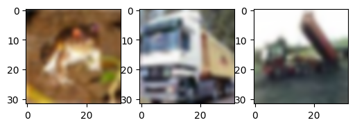

> x_train[0]=개구리, x_train[1]=트럭, x_train[2]=트럭. 32×32 컬러 이미지.

---

### Cell 3 — 전처리

```python
# 정규화
x_train = x_train.astype('float32') / 255.0
x_test = x_test.astype('float32') / 255.0
# float32: 딥러닝 표준 타입 (float64보다 메모리 효율적)

# 원핫 인코딩
NUM_CLASSES = 10
y_train = to_categorical(y_train, num_classes=NUM_CLASSES)
y_test = to_categorical(y_test, num_classes=NUM_CLASSES)
print(y_train[0])   # [0. 0. 0. 0. 0. 0. 1. 0. 0. 0.] → frog(6번)
# categorical_crossentropy 사용 시 원핫 인코딩 필요
```

---

### Cell 4 — 모델 정의

```python
'''
# 실습 1: Sequential API (CNN 없는 모델)
model = Sequential([
    Input(shape=(32, 32, 3)),
    Flatten(),
    Dense(units=256, activation='relu'),
    Dense(units=128, activation='relu'),
    Dense(units=NUM_CLASSES, activation='softmax')
])
'''

# 실습 1-1: Functional API (CNN 없는 모델)
input_layer = Input(shape=(32, 32, 3))      # 컬러 이미지 입력
x = Flatten()(input_layer)                  # (32, 32, 3) → (3072,)  32×32×3=3072
x = Dense(units=256, activation='relu')(x)
x = Dense(units=128, activation='relu')(x)
output_layer = Dense(units=NUM_CLASSES, activation='softmax')(x)

model = Model(inputs=input_layer, outputs=output_layer)
print(model.summary())
```

모델 구조:

```
Input      (32, 32, 3)
Flatten    (3072,)        ← 32×32×3 = 3072
Dense(256) (256,)
Dense(128) (128,)
Dense(10)  (10,)          ← softmax
```

---

### Cell 5 — 컴파일 및 학습

```python
opti = Adam(learning_rate=0.001)
model.compile(
    loss='categorical_crossentropy',    # 원핫 인코딩 레이블에 사용
    optimizer=opti,
    metrics=['accuracy']
)

history = model.fit(
    x=x_train, y=y_train,
    batch_size=128,
    epochs=20,
    shuffle=True,   # 매 epoch마다 데이터 순서 섞기 → 학습 안정화
    verbose=2
)

print('test acc : %.4f' % (model.evaluate(x_test, y_test, verbose=0, batch_size=128)[1]))
print('test loss : %.4f' % (model.evaluate(x_test, y_test, verbose=0, batch_size=128)[0]))
# Dense만 사용 → test acc 약 50% 수준 (CNN 없으면 컬러 이미지 분류 한계)
```

---

### Cell 6 — 예측 및 시각화

```python
CLASSES = np.array(['airplane', 'automobile', 'bird', 'cat', 'deer',
                    'dog', 'frog', 'horse', 'ship', 'truck'])

pred = model.predict(x_test)
pred = CLASSES[np.argmax(pred[:10], axis=-1)]
# axis=-1: 마지막 축(행 단위) 기준으로 최대값 인덱스 추출
# axis=0: 열 기준 / axis=1 or -1: 행 기준

actual = CLASSES[np.argmax(y_test[:10], axis=-1)]
print('예측값 : ', pred)
print('실제값 : ', actual)
print('분류 실패 수 :', (pred != actual).sum())

fig = plt.figure(figsize=(15, 3))
for i, idx in enumerate(range(len(x_test[:10]))):
    img = x_test[idx]
    ax = fig.add_subplot(1, len(x_test[:10]), i + 1)
    ax.axis('off')
    ax.imshow(img)

    # transAxes: 이미지 픽셀 좌표 대신 subplot 영역 기준 (0~1)
    # 0.5: 가운데 / 0.0: 왼쪽 / 1.0: 오른쪽
    ax.text(0.5, -0.35, 'pred=' + str(pred[idx]),
            fontsize=10, ha='center', transform=ax.transAxes)
    ax.text(0.5, -0.7, 'act=' + str(actual[idx]),
            fontsize=10, ha='center', transform=ax.transAxes)

plt.show()
# 현재 모델은 칼라 이미지 분류에 대한 정확도가 떨어짐 (Dense만 사용)
```

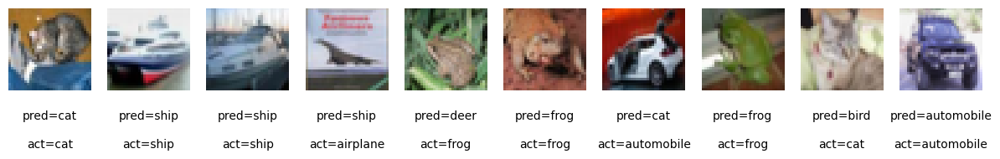

> 10개 중 4개 오분류 (60% 정확도). Dense만 써서 공간 정보를 활용 못한 결과. CNN을 추가하면 정확도가 크게 향상된다.

---

## 📌 핵심 개념 정리

### MNIST vs CIFAR-10 비교

| |MNIST|CIFAR-10|
|---|---|---|
|이미지 크기|28×28×1 (흑백)|32×32×3 (컬러)|
|클래스|숫자 0~9|사물 10종|
|훈련셋|60,000장|50,000장|
|난이도|낮음|높음|
|Dense 정확도|~98%|~50%|
|CNN 적용 후|~99%|~80%+|

### Dense만 쓰면 왜 정확도가 낮을까?

```
CIFAR-10: 32×32×3 컬러 이미지
→ Flatten → 3072개 픽셀 1차원 벡터
→ 공간 정보(위치, 형태) 손실
→ 색상 정보도 R/G/B가 뒤섞임
→ Dense는 픽셀 간 위치 관계를 학습 못함
→ 정확도 ~50% 수준
```

CNN을 추가하면:

```
Conv2D → 공간 구조 유지하면서 특징 추출
→ 정확도 크게 향상
```

### axis=-1 의미

```python
np.argmax(pred[:10], axis=-1)
# axis=0:  열 기준 (세로 방향)
# axis=1:  행 기준 (가로 방향)
# axis=-1: 마지막 축 = axis=1과 동일 (행 단위, 각 이미지별 최대값)
```

### transAxes

```python
ax.text(0.5, -0.35, 'pred=cat', transform=ax.transAxes)
# transform=ax.transAxes: 픽셀 좌표 대신 subplot 영역 비율(0~1) 기준
# (0.5, -0.35): x=가운데, y=이미지 아래쪽
# ha='center': 텍스트 수평 정렬
```

### loss 함수 선택 정리

|loss|레이블 형태|사용 시점|
|---|---|---|
|`categorical_crossentropy`|원핫 인코딩 벡터|`to_categorical()` 사용 시|
|`sparse_categorical_crossentropy`|정수 그대로|`to_categorical()` 생략 시|