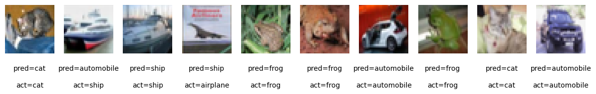
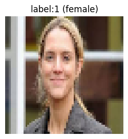
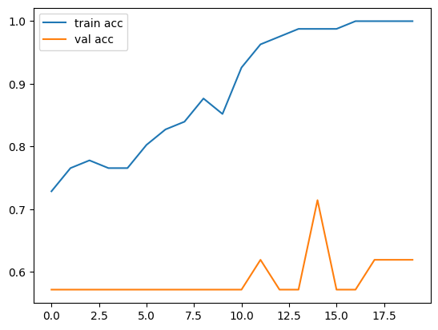
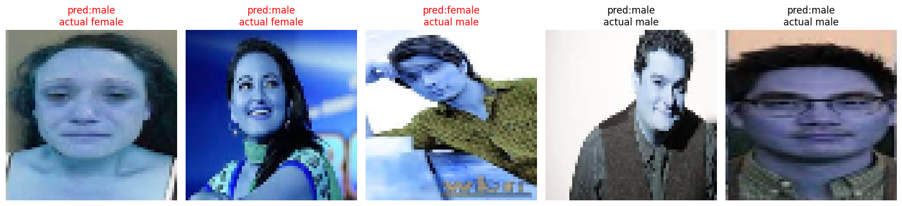
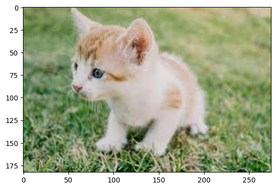
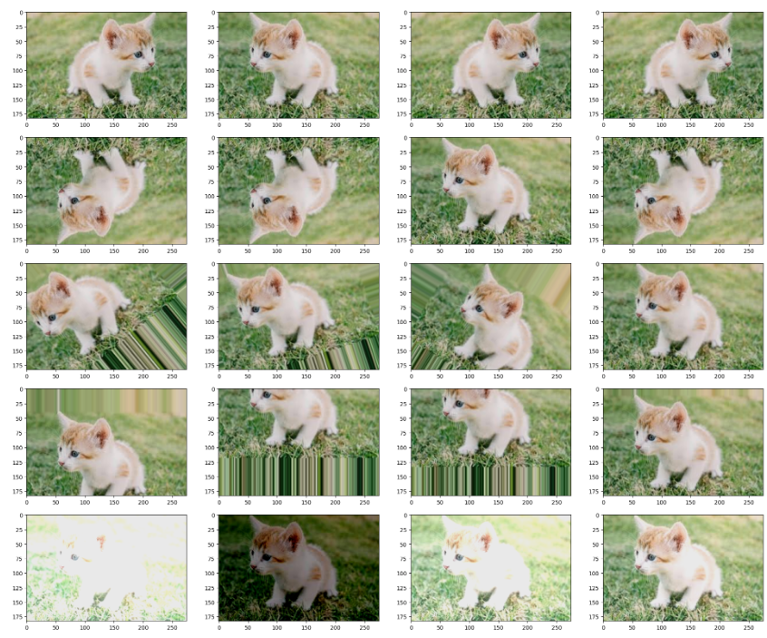
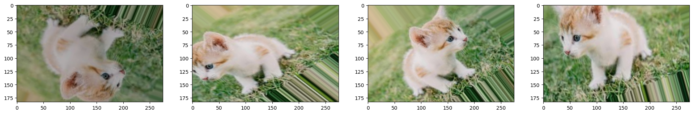

# Day 65_딥러닝 : Data Augmentation · ImageDataGenerator · ModelCheckpoint

## 📅 2026-05-12

---
# 📄 cnn5cifar10cnn.ipynb — CNN · CIFAR-10 분류 · GlobalAvgPool2D

## 🧠 개념 정리

### CNN (Convolutional Neural Network)

|개념|설명|
|---|---|
|Conv2D|이미지에서 특징(엣지, 패턴 등)을 추출하는 핵심 레이어|
|kernel_size|필터 크기. 보통 3×3 사용|
|padding='same'|출력 크기를 입력과 동일하게 유지 (zero-padding)|
|use_bias=False|BatchNormalization과 함께 쓸 때 bias 불필요 → 파라미터 절약|
|MaxPooling2D|특징 맵을 절반으로 축소 (기본 pool_size=2, strides=2)|
|BatchNormalization|각 배치의 출력을 정규화 → 학습 안정화, 수렴 속도 향상|
|GlobalAvgPool2D|(H, W, C) → (C) 로 축소. 채널별 평균값 하나씩 추출|
|Dropout|학습 중 일부 뉴런을 랜덤으로 비활성화 → 과적합 방지|

### 🔁 Conv→BN→ReLU 순서가 정석인 이유

```
Conv2D (특징 추출)
  ↓
BatchNormalization (분포 정규화)
  ↓
Activation ReLU (비선형성 추가)
```

BN이 Conv 출력을 정규화한 뒤 ReLU를 적용해야 학습이 안정적으로 진행됨

---

### ⚖️ GlobalAvgPool2D vs Flatten

| |GlobalAvgPool2D|Flatten|
|---|---|---|
|출력|(batch, C)|(batch, H×W×C)|
|파라미터 수|적음|많음|
|과적합 위험|낮음|높음|
|특징|채널별 평균 → 공간 정보 압축|모든 값을 1D로 펼침|

CIFAR10 (32×32) 기준으로 Stage3 이후 feature map이 4×4×128이 되는데,  
GAP 적용 시 → (128,) 로 줄어들어 Dense 레이어로 전달

---

### CIFAR10 데이터셋

|항목|내용|
|---|---|
|클래스 수|10개 (airplane, automobile, bird, cat, deer, dog, frog, horse, ship, truck)|
|이미지 크기|32×32×3 (컬러)|
|train / test|50,000 / 10,000|
|y shape|(N, 1) → one-hot 후 (N, 10)|

---

## 📌 핵심 정리

### 전체 모델 구조 (Feature Map 변화)

```
입력: (None, 32, 32, 3)
  ↓ Stage1: Conv(32)×2 + MaxPool
(None, 16, 16, 32)
  ↓ Stage2: Conv(64)×2 + MaxPool
(None, 8, 8, 64)
  ↓ Stage3: Conv(128)×2 + MaxPool
(None, 4, 4, 128)
  ↓ GlobalAvgPool2D
(None, 128)
  ↓ Dropout(0.2) → Dense(128, relu) → Dropout(0.2)
  ↓ Dense(10, softmax)
(None, 10)
```

총 파라미터: **306,154** (약 1.17MB)  
Trainable: 305,258 / Non-trainable(BN running stats): 896

---

### 코드

```python
# =====================
# 1. 데이터 로드 및 전처리
# =====================
import numpy as np
import matplotlib.pyplot as plt
import tensorflow as tf
from tensorflow.keras import layers, models
from tensorflow.keras.utils import to_categorical
from tensorflow.keras.datasets import cifar10
from tensorflow.keras.callbacks import EarlyStopping

(x_train, y_train), (x_test, y_test) = cifar10.load_data()
# x: (50000, 32, 32, 3), y: (50000, 1)

# 정규화: 픽셀값 0~255 → 0.0~1.0
x_train = x_train.astype('float32') / 255.0
x_test  = x_test.astype('float32')  / 255.0

# One-hot encoding: (N,1) → (N,10)
NUM_CLASSES = 10
y_train = to_categorical(y_train, num_classes=NUM_CLASSES)
y_test  = to_categorical(y_test,  num_classes=NUM_CLASSES)


# =====================
# 2. conv_block 함수 정의
# =====================
def conv_block(x, filters):
    # Conv → BN → ReLU 순서가 정석
    x = layers.Conv2D(filters=filters, kernel_size=3,
                      padding='same', use_bias=False)(x)  # BN이 bias 역할 대신함
    x = layers.BatchNormalization()(x)                    # 출력 분포 정규화
    x = layers.Activation('relu')(x)                      # 비선형성 추가
    return x


# =====================
# 3. 모델 정의 (Functional API)
# =====================
inputs = layers.Input(shape=(32, 32, 3))

# Stage1: 저수준 특징 추출 (엣지, 색상 등)
x = conv_block(inputs, 32)
x = conv_block(x, 32)
x = layers.MaxPooling2D()(x)          # 32×32 → 16×16

# Stage2: 중간 수준 특징 추출 (텍스처, 형태 등)
x = conv_block(x, 64)
x = conv_block(x, 64)
x = layers.MaxPooling2D()(x)          # 16×16 → 8×8

# Stage3: 고수준 특징 추출 (객체의 구조적 특징)
x = conv_block(x, 128)
x = conv_block(x, 128)
x = layers.MaxPooling2D()(x)          # 8×8 → 4×4

# 분류기 헤드
x = layers.GlobalAvgPool2D()(x)       # (4,4,128) → (128,) : 채널별 평균, Flatten 대체
x = layers.Dropout(rate=0.2)(x)       # 과적합 방지
x = layers.Dense(units=128, activation='relu')(x)
x = layers.Dropout(rate=0.2)(x)
outputs = layers.Dense(units=10, activation='softmax')(x)  # 10개 클래스 확률 출력

model = models.Model(inputs=inputs, outputs=outputs, name='cifar10_cnn')
model.summary()


# =====================
# 4. 컴파일 및 학습
# =====================
model.compile(
    loss='categorical_crossentropy',  # 다중 분류 손실함수
    optimizer='adam',
    metrics=['accuracy']
)

# val_accuracy 기준으로 6 epoch 개선 없으면 조기종료, best weight 복원
es = EarlyStopping(monitor='val_accuracy', patience=6, restore_best_weights=True)

history = model.fit(
    x=x_train, y=y_train,
    batch_size=128,
    epochs=100,
    shuffle=True,
    verbose=2,
    validation_data=(x_test, y_test),  # val_accuracy 모니터링을 위해 필수
    callbacks=[es]
)

test_loss, test_acc = model.evaluate(x_test, y_test, verbose=0, batch_size=128)
print('test acc  : %.4f' % test_acc)   # 변수 순서 주의: evaluate 반환이 (loss, acc) 순서
print('test loss : %.4f' % test_loss)


# =====================
# 5. 예측 및 시각화
# =====================
CLASSES = np.array(['airplane', 'automobile', 'bird', 'cat', 'deer',
                    'dog', 'frog', 'horse', 'ship', 'truck'])

pred   = model.predict(x_test)
# argmax(axis=-1): 마지막 축(클래스 축) 기준으로 가장 큰 값의 인덱스 반환
pred   = CLASSES[np.argmax(pred[:10],    axis=-1)]
actual = CLASSES[np.argmax(y_test[:10],  axis=-1)]

print('예측값 : ', pred)
print('실제값 : ', actual)
print('분류 실패 수 :', (pred != actual).sum())

fig = plt.figure(figsize=(15, 3))
for i, idx in enumerate(range(len(x_test[:10]))):
    img = x_test[idx]
    ax  = fig.add_subplot(1, 10, i + 1)
    ax.axis('off')
    ax.imshow(img)
    # transAxes: subplot 영역 기준 좌표 (0.0=왼쪽, 0.5=가운데, 1.0=오른쪽)
    ax.text(0.5, -0.35, 'pred=' + str(pred[idx]),   fontsize=10, ha='center', transform=ax.transAxes)
    ax.text(0.5, -0.70, 'act='  + str(actual[idx]), fontsize=10, ha='center', transform=ax.transAxes)

plt.show()
```



---

### 📉 학습 결과 분석

|항목|값|
|---|---|
|최종 test accuracy|76.95%|
|최종 test loss|0.7757|
|조기종료 epoch|21 (best: epoch 15, val_acc 0.7812)|
|train accuracy (epoch 21)|94.69%|

**과적합 발생** — train 94% vs val 77%, 갭이 약 17%p

개선 방향:

- Dropout rate 0.2 → 0.4~0.5로 상향
- Data Augmentation 추가 (RandomFlip, RandomRotation, RandomZoom)
- Learning Rate Scheduler 적용

---

### EarlyStopping 주요 파라미터

|파라미터|설명|
|---|---|
|monitor|감시할 지표. val_accuracy 또는 val_loss|
|patience|개선 없을 때 몇 epoch 더 기다릴지|
|restore_best_weights|True면 가장 좋았던 시점의 가중치로 복원|

---
# 📄 cnn6face.ipynb — 이진분류 · 얼굴 성별 분류 · UTKFace

## 🧠 개념 정리

### 이진분류 vs 다중분류

| 항목        | 이진분류                | 다중분류                     |
| --------- | ------------------- | ------------------------ |
| 출력 뉴런 수   | 1개                  | 클래스 수                    |
| 출력 활성화 함수 | sigmoid             | softmax                  |
| 손실 함수     | binary_crossentropy | categorical_crossentropy |
| 예측 기준     | 0.5 이상 → 1 (female) | argmax                   |
| y 형태      | (N,) 정수 레이블         | (N, C) one-hot           |

### UTKFace 데이터셋 파일명 구조

```
30_0_0_20170119195539771.jpg
 ^  ^  ^
 나이 성별 인종
```

- 성별: `0` → male, `1` → female
- `file.split('_')[1]` 로 레이블 추출

### OpenCV BGR 주의사항

```python
img = cv2.imread(img_path)          # BGR 순서로 읽힘
img = cv2.cvtColor(img, cv2.COLOR_BGR2RGB)  # matplotlib 시각화 시 RGB 변환 필요
```

학습 데이터 `x` 자체를 BGR→RGB 변환 없이 넣으면 색상이 반전된 상태로 학습됨  
→ 로드 루프 안에서 변환하는 것이 정확함

---

### sigmoid와 예측 임계값

```python
pred = model.predict(x_test)        # 0.0 ~ 1.0 사이 확률값 출력
pred_classes = (pred >= 0.5).astype(int)  # 0.5 기준으로 0/1 분류
```

sigmoid는 입력값을 0~1 사이 확률로 변환  
0.5 이상이면 positive class (female=1), 미만이면 negative class (male=0)

---

## 📌 핵심 정리

### 전체 모델 구조

```
입력: (None, 64, 64, 3)
  ↓ Conv2D(32, 3×3, relu) + MaxPool(2×2)
(None, 31, 31, 32)
  ↓ Conv2D(64, 3×3, relu) + MaxPool(2×2)
(None, 15, 15, 64)
  ↓ Flatten
(None, 14400)
  ↓ Dense(128, relu)
  ↓ Dense(1, sigmoid)      ← 이진분류: 출력 뉴런 1개
(None, 1)
```

> padding 미지정 시 kernel_size=3 기준으로 feature map이 2씩 줄어듦 (valid padding 기본값)

---

### 코드

```python
# =====================
# 1. 데이터 로드
# =====================
import os, cv2, numpy as np
from tensorflow.keras.utils import to_categorical
from sklearn.model_selection import train_test_split

image_dir = '/content/drive/MyDrive/person_img'
x, y = [], []

# 파일명: 30_0_0_20170119195539771.jpg → split('_')[1] 로 성별 추출
for file in os.listdir(image_dir):
    try:
        gender = int(file.split('_')[1])    # 0: male, 1: female
        img_path = os.path.join(image_dir, file)
        img = cv2.imread(img_path)
        img = cv2.resize(img, (64, 64))     # 입력 크기 통일
        x.append(img)
        y.append(gender)
    except:
        continue                            # 파일명 형식 맞지 않으면 건너뜀


# =====================
# 2. 첫 번째 이미지 시각화
# =====================
import matplotlib.pyplot as plt

plt.figure(figsize=(3, 3))
img_rgb = cv2.cvtColor(x[0], cv2.COLOR_BGR2RGB)    # cv2는 BGR → matplotlib용 RGB 변환
plt.imshow(img_rgb)
plt.title(f'label:{y[0]} ({"male" if y[0] == 0 else "female"})')
plt.axis('off')
plt.show()
```



```python
# =====================
# 3. 전처리
# =====================
x = np.array(x) / 255.0    # 정규화: 0~255 → 0.0~1.0
y = np.array(y)             # 이진분류는 one-hot 불필요, 정수 레이블 그대로 사용

x_train, x_test, y_train, y_test = train_test_split(
    x, y, test_size=0.2, random_state=42   # 재현성을 위해 random_state 고정
)
print(x_train.shape, x_test.shape, y_test.shape)


# =====================
# 4. 모델 정의 (Sequential)
# =====================
import tensorflow as tf
from tensorflow.keras.models import Sequential
from tensorflow.keras.layers import Conv2D, MaxPooling2D, Flatten, Dense, Input

model = Sequential([
    Input(shape=(64, 64, 3)),
    Conv2D(32, (3, 3), activation='relu'),     # padding 없음 → valid padding (기본값)
    MaxPooling2D((2, 2)),
    Conv2D(64, (3, 3), activation='relu'),
    MaxPooling2D((2, 2)),
    Flatten(),                                  # 3D → 1D
    Dense(128, activation='relu'),
    Dense(1, activation='sigmoid')              # 이진분류: 출력 1개, sigmoid
])

model.summary()


# =====================
# 5. 컴파일 및 학습
# =====================
model.compile(
    optimizer='adam',
    loss='binary_crossentropy',     # 이진분류 손실함수
    metrics=['accuracy']
)

history = model.fit(
    x_train, y_train,
    epochs=20,
    batch_size=32,
    validation_split=0.2,           # train의 20%를 val로 사용
    verbose=2
)

loss, acc = model.evaluate(x_test, y_test)
print(f'test acc : {acc:.4f}')


# =====================
# 6. 예측 및 시각화
# =====================
pred = model.predict(x_test)
# sigmoid 출력값 >= 0.5 이면 female(1), 미만이면 male(0)
print('예측값 : ', (pred >= 0.5).astype(int).reshape(-1))
print('실제값 : ', y_test)

# 학습 곡선
plt.plot(history.history['accuracy'], label='train acc')
plt.plot(history.history['val_accuracy'], label='val acc')
plt.legend()
plt.show()
```



```python
# =====================
# 7. 5개 이미지 예측 시각화
# =====================
pred = model.predict(x_test[:5])
pred_classes = (pred >= 0.5).astype(int).reshape(-1)
true_classes  = y_test[:5]

plt.figure(figsize=(16, 4))
for i in range(5):
    plt.subplot(1, 5, i + 1)
    plt.imshow(x_test[i])                          # x_test는 이미 0~1 정규화 상태

    is_correct = pred_classes[i] == true_classes[i]
    label      = 'female' if true_classes[i] == 1 else 'male'
    prediction = 'female' if pred_classes[i] == 1 else 'male'

    title_color = 'black' if is_correct else 'red'  # 오분류는 빨간색으로 표시
    plt.title(f'pred:{prediction}\nactual {label}', color=title_color)
    plt.axis('off')

plt.tight_layout()
plt.show()
```



---

### 📉 학습 결과 분석

|항목|값|
|---|---|
|학습 epoch|20|
|train accuracy (최종)|~100%|
|val accuracy (최종)|~62%|
|오분류 수 (5개 중)|3개|

**심각한 과적합** — train 100% vs val 62%, 갭 약 38%p

학습 곡선을 보면 val acc가 전혀 수렴하지 못하고 진동하고 있음

개선 방향:

- 데이터 수 부족이 핵심 원인 → Data Augmentation 필수
- BGR→RGB 변환을 로드 단계에서 처리
- BatchNormalization, Dropout 추가
- EarlyStopping 적용

---

### EarlyStopping 미적용 vs 적용

| |미적용 (현재)|적용 시|
|---|---|---|
|학습 종료|무조건 20 epoch|val 기준 자동 종료|
|과적합 위험|높음|낮음|
|best weight|마지막 epoch|최고 val 시점 복원|

---

# 📄 cnn7augmentation.ipynb — Data Augmentation · ImageDataGenerator

## 🧠 개념 정리

### Data Augmentation (데이터 증강)

기존 학습 데이터를 인위적으로 변환해 데이터 양과 다양성을 늘리는 기법. 모델이 다양한 형태의 입력에 대응할 수 있도록 일반화 성능을 높이고 과적합을 방지함.

**왜 필요한가?**

- 데이터 수집 비용이 크고 레이블링이 어려운 경우 (의료 이미지, 군사 등)
- 학습 데이터가 적을 때 모델이 훈련 데이터에만 맞춰지는 과적합 방지
- 실제 환경의 다양한 변형(각도, 밝기, 위치)에 강한 모델 만들기

---

### ImageDataGenerator 주요 옵션

|옵션|설명|값 예시|
|---|---|---|
|`horizontal_flip`|좌우반전 (50% 확률)|`True`|
|`vertical_flip`|상하반전 (50% 확률)|`True`|
|`rotation_range`|랜덤 회전 각도 범위|`45` → 0~45도|
|`width_shift_range`|좌우 이동 범위 (이미지 너비 비율)|`0.3` → 0~30%|
|`height_shift_range`|상하 이동 범위|`0.2`|
|`brightness_range`|밝기 범위|`(0.7, 1.3)`|
|`zoom_range`|줌 범위|`0.2` → 0~20%|
|`channel_shift_range`|채널값 랜덤 변경|`150` → 0~150|
|`fill_mode`|이동 후 빈 공간 채우기 방식|`'nearest'`|

> **flip 옵션은 50% 확률** — 항상 뒤집히는 게 아니라 랜덤으로 적용됨.  
> 4장 중 원본처럼 보이는 게 나오는 건 버그가 아닌 정상 동작.

---

### fill_mode 종류

|값|설명|
|---|---|
|`'nearest'`|가장 가까운 픽셀값으로 채움 (줄무늬 효과)|
|`'reflect'`|경계를 기준으로 반사|
|`'wrap'`|반대편 이미지로 채움|
|`'constant'`|특정 상수값으로 채움 (기본 0, 검정)|

---

### ImageDataGenerator 동작 원리

```
원본 이미지 (H, W, C)
  ↓ np.expand_dims(axis=0)
배치 형태로 변환 (1, H, W, C)
  ↓ generator.fit()
통계값 계산 (평균, 분산 등)
  ↓ generator.flow()
증강된 이미지를 배치 단위로 무한 생성
  ↓ next()
다음 배치 꺼내기 (1, H, W, C)
  ↓ np.squeeze()
(H, W, C) 로 차원 축소 후 시각화
```

---

## 📌 핵심 정리

### 코드

```python
# =====================
# 1. 이미지 로드
# =====================
import cv2
import matplotlib.pyplot as plt
import numpy as np
from tensorflow.keras.preprocessing.image import ImageDataGenerator

# cv2는 BGR로 읽으므로 matplotlib 시각화를 위해 RGB 변환
image = cv2.cvtColor(cv2.imread('test_aug.jpeg'), cv2.COLOR_BGR2RGB)
plt.imshow(image)
plt.axis('off')
plt.show()
```



```python
# =====================
# 2. 증강 시각화 함수
# =====================
def show_aug_func(image, generator, n_images=4):
    # (H, W, C) → (1, H, W, C) : 배치 차원 추가 (Generator는 배치 단위로 처리)
    image_batch = np.expand_dims(image, axis=0)
    generator.fit(image_batch)  # 이미지 통계값(평균, 분산) 계산

    # flow(): 배치 단위로 증강된 이미지를 무한히 생성하는 이터레이터 반환
    data_gen_iter = generator.flow(image_batch)
    fig, axs = plt.subplots(nrows=1, ncols=n_images, figsize=(24, 8))

    for i in range(n_images):
        aug_image_batch = next(data_gen_iter)           # 다음 증강 배치 꺼내기
        aug_image = np.squeeze(aug_image_batch[0])      # (1,H,W,C)[0] → (H,W,C), squeeze로 1짜리 축 제거
        aug_image = aug_image.astype('int')             # float → int 변환 (imshow용)
        axs[i].imshow(aug_image)


# 단일 옵션 증강 시각화
data_generator = ImageDataGenerator(horizontal_flip=True)           # 좌우반전 (50% 확률)
show_aug_func(image, data_generator, n_images=4)

data_generator = ImageDataGenerator(vertical_flip=True)             # 상하반전 (50% 확률)
show_aug_func(image, data_generator, n_images=4)

data_generator = ImageDataGenerator(rotation_range=45)              # 0~45도 랜덤 회전
show_aug_func(image, data_generator, n_images=4)

data_generator = ImageDataGenerator(width_shift_range=0.3,
                                    fill_mode='nearest')            # 0~30% 좌우 이동, 빈 공간은 nearest로 채움
show_aug_func(image, data_generator, n_images=4)

data_generator = ImageDataGenerator(channel_shift_range=150)        # 0~150 사이 채널값 랜덤 변경 (색상 변형)
show_aug_func(image, data_generator, n_images=4)
```



```python
# =====================
# 3. 복합 증강 적용
# =====================
# 여러 옵션을 동시에 적용 → 매 이미지마다 복합 변환이 랜덤하게 조합됨
data_gen = ImageDataGenerator(
    rotation_range=50,          # 0~50도 랜덤 회전
    width_shift_range=0.2,      # 0~20% 좌우 이동
    brightness_range=(0.7, 1.3),# 밝기 70~130% 랜덤 조정
    vertical_flip=True,         # 50% 확률 상하반전
    horizontal_flip=True,       # 50% 확률 좌우반전
    zoom_range=0.2              # 0~20% 랜덤 줌
)

show_aug_func(image, data_gen, n_images=4)
```



---

### 📉 단일 vs 복합 증강 비교

| |단일 증강|복합 증강|
|---|---|---|
|변환 종류|1가지|여러 가지 동시 적용|
|다양성|낮음|높음|
|실제 학습 사용|드묾|일반적|
|결과 예측|쉬움|매번 다름|

복합 증강은 실제 학습에서 쓰는 방식 — 모델이 회전+이동+밝기 변화가 동시에 일어나는 실제 환경에 강해짐

---
# 📄 cnn8mnist_aug.ipynb — FashionMNIST · Data Augmentation · ModelCheckpoint

## 🧠 개념 정리

### FashionMNIST 데이터셋

|항목|내용|
|---|---|
|클래스 수|10개 (T-shirt, Trouser, Pullover, Dress, Coat, Sandal, Shirt, Sneaker, Bag, Ankle boot)|
|이미지 크기|28×28 그레이스케일|
|train / test|60,000 / 10,000|
|채널|1 (흑백)|

MNIST와 동일한 구조지만 숫자 대신 패션 아이템 → 더 어려운 분류 문제

---

### Data Augmentation을 학습 데이터에 직접 추가하는 방식

이 코드는 `ImageDataGenerator`를 학습 중 실시간으로 적용하는 게 아니라,  
**증강 데이터를 미리 생성해서 원본에 합치는 오프라인 방식**을 사용함

```
원본 60,000장
  ↓ 랜덤 30,000장 선택 → 증강 변환 적용
증강 30,000장 생성
  ↓ np.concatenate
최종 90,000장으로 학습
```

|방식|설명|특징|
|---|---|---|
|온라인 (실시간)|fit() 안에서 매 배치마다 증강|메모리 효율적|
|오프라인 (사전생성)|증강 데이터를 미리 만들어 원본에 추가|데이터 수 자체가 늘어남|

---

### ModelCheckpoint

학습 중 특정 기준을 만족할 때마다 모델을 자동으로 저장하는 콜백

```python
ModelCheckpoint(
    filepath='경로/{epoch:02d}_{val_loss:.4f}.keras',  # 파일명에 epoch, val_loss 자동 삽입
    monitor='val_loss',       # 감시할 지표
    save_best_only=True,      # 가장 좋은 모델만 저장 (이전보다 나쁘면 저장 안 함)
    verbose=0                 # 저장 시 로그 출력 여부
)
```

EarlyStopping과 함께 쓰면 — 최적 모델을 파일로도 저장하고, 메모리에도 복원함

---

### shear_range (전단 변환)

```
원본        shear 적용
┌──┐         ╱──╱
│  │   →    ╱  ╱
└──┘        ╱──╱
```

이미지를 한쪽 방향으로 기울이는 변환. 객체가 비스듬히 찍힌 상황을 시뮬레이션함

---

### 재현성 설정

```python
np.random.seed(0)
tf.random.set_seed(0)
```

랜덤 시드를 고정해 실행할 때마다 같은 결과가 나오도록 보장 → 실험 재현성 확보

---

## 📌 핵심 정리

### 전체 모델 구조

```
입력: (None, 28, 28, 1)
  ↓ Conv2D(32, 3×3, same, relu) + MaxPool(2×2) + Dropout(0.1)
(None, 14, 14, 32)
  ↓ Conv2D(64, 3×3, same, relu) + MaxPool(2×2) + Dropout(0.1)
(None, 7, 7, 64)
  ↓ Flatten
(None, 3136)
  ↓ Dense(64, relu) + Dropout(0.2)
  ↓ Dense(32, relu) + Dropout(0.2)
  ↓ Dense(10, softmax)
(None, 10)
```

---

### 코드

```python
# =====================
# 1. 데이터 로드 및 전처리
# =====================
import tensorflow as tf
from tensorflow.keras.datasets import fashion_mnist
from tensorflow.keras.utils import to_categorical
from tensorflow.keras.callbacks import ModelCheckpoint, EarlyStopping
import matplotlib.pyplot as plt
import numpy as np
import os

# 재현성을 위한 랜덤 시드 고정
np.random.seed(0)
tf.random.set_seed(0)

(x_train, y_train), (x_test, y_test) = fashion_mnist.load_data()

# (60000, 28, 28) → (60000, 28, 28, 1) : CNN 입력을 위해 채널 차원 추가
x_train = x_train.reshape(-1, 28, 28, 1).astype('float32') / 255.0
x_test  = x_test.reshape(-1, 28, 28, 1).astype('float32') / 255.0

# One-hot encoding: (N,) → (N, 10)
y_train = to_categorical(y_train)
y_test  = to_categorical(y_test)

# 샘플 100장 시각화
plt.figure(figsize=(10, 10))
for c in range(100):
    plt.subplot(10, 10, c + 1)
    plt.axis('off')
    plt.imshow(x_train[c].reshape(28, 28), cmap='gray')  # (28,28,1) → (28,28) reshape
plt.show()
```


```python
# =====================
# 2. 오프라인 Data Augmentation
# =====================
from tensorflow.keras.preprocessing.image import ImageDataGenerator

img_generate = ImageDataGenerator(
    rotation_range=10,        # 0~10도 랜덤 회전
    zoom_range=0.1,           # 0~10% 랜덤 줌
    shear_range=0.5,          # 전단 변환 (이미지 기울이기)
    width_shift_range=0.1,    # 0~10% 좌우 이동
    height_shift_range=0.1,   # 0~10% 상하 이동
    horizontal_flip=True,     # 50% 확률 좌우반전
    vertical_flip=True        # 50% 확률 상하반전
)

augment_size = 30000
# 원본 60,000장 중 30,000개 인덱스를 랜덤 추출
randidx = np.random.randint(x_train.shape[0], size=augment_size)
x_augment = x_train[randidx].copy()  # copy()로 원본 참조 방지
y_augment = y_train[randidx].copy()

# flow()로 증강 배치 생성 → next()로 한 번에 30,000장 꺼내기
gen = img_generate.flow(x_augment, y_augment, batch_size=augment_size, shuffle=False)
x_augment, y_augment = next(gen)

# 원본 + 증강 데이터 합치기
print(x_train.shape)  # (60000, 28, 28, 1)
x_train = np.concatenate([x_train, x_augment], axis=0)  # axis=0: 행 방향으로 이어 붙이기
y_train = np.concatenate([y_train, y_augment], axis=0)
print(x_train.shape)  # (90000, 28, 28, 1)


# =====================
# 3. 모델 정의 및 학습
# =====================
model = tf.keras.models.Sequential([
    tf.keras.layers.Input(shape=(28, 28, 1)),

    tf.keras.layers.Conv2D(filters=32, kernel_size=(3, 3), padding='same', activation='relu'),
    tf.keras.layers.MaxPooling2D(pool_size=(2, 2)),
    tf.keras.layers.Dropout(rate=0.1),      # Conv 블록 후 약한 Dropout

    tf.keras.layers.Conv2D(filters=64, kernel_size=(3, 3), padding='same', activation='relu'),
    tf.keras.layers.MaxPooling2D(pool_size=(2, 2)),
    tf.keras.layers.Dropout(rate=0.1),

    tf.keras.layers.Flatten(),
    tf.keras.layers.Dense(units=64, activation='relu'),
    tf.keras.layers.Dropout(rate=0.2),      # Dense 후 좀 더 강한 Dropout
    tf.keras.layers.Dense(units=32, activation='relu'),
    tf.keras.layers.Dropout(rate=0.2),

    tf.keras.layers.Dense(units=10, activation='softmax')   # 10개 클래스 분류
])

model.summary()
model.compile(optimizer='adam', loss='categorical_crossentropy', metrics=['accuracy'])

# 모델 저장 경로 설정
MODEL_DIR = './fmnist/'
if not os.path.exists(MODEL_DIR):
    os.mkdir(MODEL_DIR)

# {epoch:02d}: epoch 번호 2자리, {val_loss:.4f}: val_loss 소수점 4자리
modelpath = './fmnist/{epoch:02d}_{val_loss:.4f}.keras'

# ModelCheckpoint: val_loss 기준으로 best 모델만 저장
chkpoint = ModelCheckpoint(monitor='val_loss', filepath=modelpath, save_best_only=True, verbose=0)
# EarlyStopping: val_loss 5 epoch 개선 없으면 종료, best weight 복원
es = EarlyStopping(monitor='val_loss', patience=5, restore_best_weights=True)

history = model.fit(
    x_train, y_train,
    validation_split=0.2,   # train의 20%를 val로 사용
    epochs=100,
    batch_size=64,
    verbose=2,
    callbacks=[chkpoint, es]
)


# =====================
# 4. 평가 및 시각화
# =====================
print('test acc : %.4f' % (model.evaluate(x_test, y_test)[1]))

plt.figure(figsize=(12, 4))

# 정확도 곡선
plt.subplot(1, 2, 1)
plt.plot(history.history['accuracy'], marker='o', c='red', label='test acc')
plt.plot(history.history['val_accuracy'], marker='s', c='blue', label='val acc')
plt.xlabel('epochs')
plt.ylim(0.5, 1)
plt.legend(loc='lower right')

# 손실 곡선
plt.subplot(1, 2, 2)
plt.plot(history.history['loss'], marker='o', c='red', label='test loss')
plt.plot(history.history['val_loss'], marker='s', c='blue', label='val loss')
plt.xlabel('epochs')
plt.legend(loc='upper right')
plt.show()
```


---

### 📉 학습 결과 분석

|항목|값|
|---|---|
|최종 train accuracy|~92%|
|최종 val accuracy|~80%|
|과적합 여부|있음 (갭 약 12%p)|

train acc는 계속 오르는데 val acc는 80% 근방에서 수렴.  
Data Augmentation을 적용했음에도 과적합이 남아있는 건 모델 구조나 Dropout 강도 조정이 필요하다는 신호.

---

### ModelCheckpoint vs EarlyStopping 역할 비교

| |ModelCheckpoint|EarlyStopping|
|---|---|---|
|목적|best 모델을 **파일로 저장**|학습 **조기 종료**|
|기준|`save_best_only=True`|`patience`|
|복원|파일에서 불러와야 함|`restore_best_weights=True`|
|함께 쓰면|파일 저장 + 메모리 복원 동시에 가능|←|

---

