---
aliases:
  - "Day 66_딥러닝 : Data Augmentation · 개고양이/가위바위보 분류 · 단일 이미지 예측"
---
# Day 66_딥러닝 : Data Augmentation · 개고양이/가위바위보 분류 · 단일 이미지 예측

## 📅 2026-05-13

---
# 📄 cnn8mnist_aug.ipynb — FashionMNIST · Data Augmentation · ModelCheckpoint

---

## 🧠 전체 흐름 요약

FashionMNIST 데이터셋에 `ImageDataGenerator`로 이미지를 증강해 훈련 데이터를 늘린 뒤,  
CNN 모델로 10개 의류 클래스를 분류하는 파이프라인이다.

```
FashionMNIST 원본 (60,000장)
        ↓
ImageDataGenerator.flow() → 증강 이미지 30,000장 생성
        ↓
원본 + 증강 concatenate → 총 90,000장
        ↓
CNN 모델 학습 (Conv2D × 2 + Dense)
        ↓
정확도/손실 시각화
```

---

## 1. 데이터 로드 및 전처리

```python
import tensorflow as tf
from tensorflow.keras.datasets import fashion_mnist
from tensorflow.keras.utils import to_categorical
import matplotlib.pyplot as plt
import numpy as np

np.random.seed(0)
tf.random.set_seed(0)

(x_train, y_train), (x_test, y_test) = fashion_mnist.load_data()

# (60000, 28, 28) → (60000, 28, 28, 1): Conv2D는 채널 차원이 필요함
x_train = x_train.reshape(-1, 28, 28, 1).astype('float32') / 255.0
x_test  = x_test.reshape(-1, 28, 28, 1).astype('float32') / 255.0

# 정수 라벨 → 원-핫 인코딩 (10개 클래스)
# 예: 3 → [0, 0, 0, 1, 0, 0, 0, 0, 0, 0]
y_train = to_categorical(y_train)
y_test  = to_categorical(y_test)
```

**FashionMNIST 클래스 (10개)**

| 인덱스 | 클래스         |
| --- | ----------- |
| 0   | T-shirt/top |
| 1   | Trouser     |
| 2   | Pullover    |
| 3   | Dress       |
| 4   | Coat        |
| 5   | Sandal      |
| 6   | Shirt       |
| 7   | Sneaker     |
| 8   | Bag         |
| 9   | Ankle boot  |

```python
# 훈련 데이터 100장 시각화
plt.figure(figsize=(10, 10))
for c in range(100):
    plt.subplot(10, 10, c + 1)
    plt.axis('off')
    plt.imshow(x_train[c].reshape(28, 28), cmap='gray')
plt.show()
```

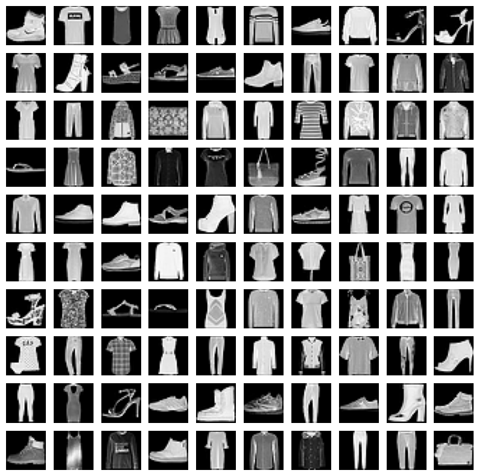

---

## 🧠 ImageDataGenerator로 데이터 증강

> 왜 증강이 필요한가?  
> 훈련 데이터가 적거나 다양성이 부족하면 모델이 특정 패턴에 과적합된다.  
> 이미지를 회전·이동·반전 등으로 변형해 **인위적으로 데이터를 다양하게** 만들어 일반화 성능을 높인다.

### 2. ImageDataGenerator 설정

```python
from tensorflow.keras.preprocessing.image import ImageDataGenerator

img_generate = ImageDataGenerator(
    rotation_range=10,        # 최대 ±10도 무작위 회전
    zoom_range=0.1,           # 최대 10% 확대/축소
    shear_range=0.5,          # 축 중심 기울이기 변형
    width_shift_range=0.1,    # 수평 방향 최대 10% 이동
    height_shift_range=0.1,   # 수직 방향 최대 10% 이동
    horizontal_flip=True,     # 좌우 반전 (의류는 좌우 대칭이므로 유효)
    vertical_flip=True        # 상하 반전
)
```

### 3. flow()로 증강 이미지 배치 생성

> `flow_from_directory`는 **디스크 파일**에서 읽을 때,  
> `flow`는 이미 **메모리(numpy 배열)**에 있는 데이터에 증강을 적용할 때 쓴다.

```python
augment_size = 30000  # 원본의 절반 크기만큼 증강 이미지 생성

# 원본 훈련 데이터에서 30,000개를 무작위 인덱스로 샘플링
randidx   = np.random.randint(x_train.shape[0], size=augment_size)
x_augment = x_train[randidx].copy()  # 원본 훼손 방지를 위해 copy()
y_augment = y_train[randidx].copy()

# flow(): 배열 → 증강 배치 제너레이터 생성
gen = img_generate.flow(
    x_augment, y_augment,
    batch_size=augment_size,  # 한 배치에 전부 담아 next() 한 번으로 꺼냄
    shuffle=False
)

# next()로 증강된 배치 1개를 꺼냄
x_augment, y_augment = next(gen)

# 증강 결과 10장 시각화
plt.figure(figsize=(12, 3))
for i in range(10):
    plt.subplot(1, 10, i + 1)
    plt.imshow(x_augment[i].reshape(28, 28), cmap='gray')
    plt.axis('off')
plt.show()
```

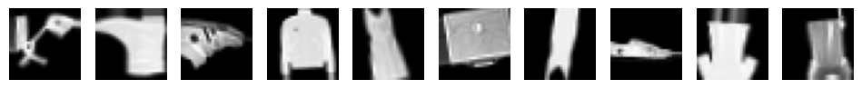

### 4. 원본 + 증강 데이터 합치기

```python
print(x_train.shape)  # (60000, 28, 28, 1)

# axis=0: 행 방향으로 이어 붙임 (데이터 수 증가)
x_train = np.concatenate([x_train, x_augment], axis=0)
y_train = np.concatenate([y_train, y_augment], axis=0)

print(x_train.shape)  # (90000, 28, 28, 1) — 60,000 + 30,000
```

> `np.concatenate(axis=0)` vs `axis=1`
> 
> - `axis=0`: 데이터 개수를 늘림 (행 방향) ← 여기서 사용
> - `axis=1`: 특징 차원을 늘림 (열 방향) ← 사용 안 함

---

## 5. CNN 모델 구성

```python
import os
from tensorflow.keras.callbacks import ModelCheckpoint, EarlyStopping

model = tf.keras.models.Sequential([
    tf.keras.layers.Input(shape=(28, 28, 1)),

    # --- 1번째 합성곱 블록 ---
    # 32개의 3×3 필터로 특징 추출. padding='same'이면 출력 크기 = 입력 크기 유지
    tf.keras.layers.Conv2D(filters=32, kernel_size=(3, 3), padding='same', activation='relu'),
    # 2×2 영역에서 최댓값만 남김 → 28×28 → 14×14로 축소
    tf.keras.layers.MaxPooling2D(pool_size=(2, 2)),
    # 10% 뉴런을 무작위로 꺼서 과적합 방지
    tf.keras.layers.Dropout(rate=0.1),

    # --- 2번째 합성곱 블록 ---
    # 64개 필터로 더 복잡한 특징 추출 → 14×14 → 7×7로 축소
    tf.keras.layers.Conv2D(filters=64, kernel_size=(3, 3), padding='same', activation='relu'),
    tf.keras.layers.MaxPooling2D(pool_size=(2, 2)),
    tf.keras.layers.Dropout(rate=0.1),

    # --- 완전연결층 ---
    # 3D 텐서 (7, 7, 64) → 1D 벡터 (3136,) 으로 펼치기
    tf.keras.layers.Flatten(),
    tf.keras.layers.Dense(units=64, activation='relu'),
    tf.keras.layers.Dropout(rate=0.2),
    tf.keras.layers.Dense(units=32, activation='relu'),
    tf.keras.layers.Dropout(rate=0.2),

    # 10개 클래스 확률 출력. 합이 1이 되도록 softmax 사용
    tf.keras.layers.Dense(units=10, activation='softmax')
])

model.summary()
model.compile(
    optimizer='adam',
    loss='categorical_crossentropy',  # 원-핫 라벨일 때 사용 (sparse면 sparse_categorical_crossentropy)
    metrics=['accuracy']
)
```

**레이어별 출력 크기 변화**

|레이어|출력 크기|
|---|---|
|Input|(28, 28, 1)|
|Conv2D(32)|(28, 28, 32)|
|MaxPooling2D|(14, 14, 32)|
|Conv2D(64)|(14, 14, 64)|
|MaxPooling2D|(7, 7, 64)|
|Flatten|(3136,)|
|Dense(64)|(64,)|
|Dense(32)|(32,)|
|Dense(10)|(10,)|

---

## 6. 콜백 설정 및 학습

```python
MODEL_DIR = './fmnist/'
if not os.path.exists(MODEL_DIR):
    os.mkdir(MODEL_DIR)

# 에포크별로 모델 파일 저장. val_loss가 개선될 때만 저장
modelpath = './fmnist/{epoch:02d}_{val_loss:.4f}.keras'
chkpoint  = ModelCheckpoint(monitor='val_loss', filepath=modelpath, save_best_only=True, verbose=0)

# val_loss가 5 에포크 동안 개선 없으면 조기 종료
es = EarlyStopping(monitor='val_loss', patience=5, restore_best_weights=True)

history = model.fit(
    x_train, y_train,
    validation_split=0.2,   # 훈련 데이터의 20%를 검증용으로 사용
    epochs=100,
    batch_size=64,
    verbose=2,
    callbacks=[chkpoint, es]
)
```

---

## 7. 평가 및 시각화

```python
print('test acc : %.4f' % (model.evaluate(x_test, y_test)[1]))

plt.figure(figsize=(12, 4))

plt.subplot(1, 2, 1)
plt.plot(history.history['accuracy'],     marker='o', c='red',  label='test acc')
plt.plot(history.history['val_accuracy'], marker='s', c='blue', label='val acc')
plt.xlabel('epochs')
plt.ylim(0.5, 1)
plt.legend(loc='lower right')

plt.subplot(1, 2, 2)
plt.plot(history.history['loss'],     marker='o', c='red',  label='test loss')
plt.plot(history.history['val_loss'], marker='s', c='blue', label='val loss')
plt.xlabel('epochs')
plt.legend(loc='upper right')
plt.show()
```

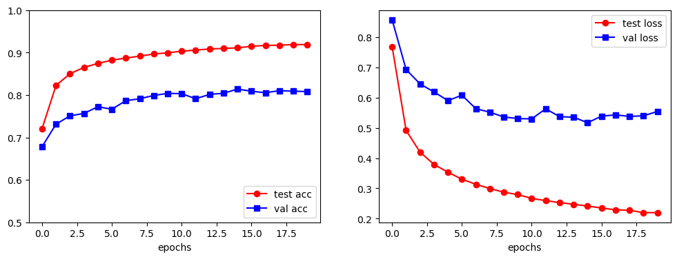

**그래프 해석:**

- `test acc`(빨강)이 `val acc`(파랑)보다 높고, `test loss`(빨강)이 `val loss`(파랑)보다 낮다.
- 훈련 성능 > 검증 성능 → **과적합(Overfitting)** 징후가 있다.
- 그러나 val acc가 약 80%까지 올라가고 수렴하는 것으로 보아 증강의 효과는 있음.
- Dropout과 EarlyStopping이 과적합을 어느 정도 억제하고 있다.

---

## 📌 flow vs flow_from_directory 비교

|항목|`flow`|`flow_from_directory`|
|---|---|---|
|입력|numpy 배열 (이미 메모리에 있음)|디스크의 폴더 경로|
|라벨|직접 전달|폴더명 = 클래스명 (자동 라벨링)|
|사용 시점|데이터셋이 이미 로드된 경우|이미지 파일이 폴더에 있는 경우|
|예시|MNIST, CIFAR 등 내장 데이터셋|커스텀 이미지 데이터셋|

---

## 📌 자주 하는 실수

```python
# ❌ copy() 없이 원본 직접 사용
x_augment = x_train[randidx]   # 원본 배열과 메모리 공유 → 증강 시 원본도 변형됨

# ✅ copy()로 독립된 배열 생성
x_augment = x_train[randidx].copy()

# ❌ 원-핫 라벨인데 loss 함수를 잘못 지정
loss='sparse_categorical_crossentropy'  # sparse는 정수 라벨일 때

# ✅ to_categorical() 사용 후에는
loss='categorical_crossentropy'
```

---
# ImageDataGenerator · flow_from_directory · 실시간 데이터 증강

---

## 🧠 핵심 개념 요약

CNN 모델을 학습시킬 때 이미지 데이터를 디스크에서 읽어서 배치(batch) 단위로 모델에 공급하는 파이프라인이 필요하다.  
`ImageDataGenerator`는 이 파이프라인을 자동화해주는 Keras 유틸리티 클래스다.

두 가지 역할을 동시에 수행한다:

1. **데이터 증강(Augmentation)**: 이미지를 회전, 이동, 반전 등으로 변형해 학습 데이터를 다양하게 만든다.
2. **전처리 파이프라인**: 디스크의 이미지 파일 → 리사이즈 → 정규화 → 배치 텐서까지 자동 변환한다.

> 핵심: 모든 이미지를 메모리에 한번에 올리지 않고, **배치 단위로 순환(loop)** 하며 실시간 공급한다. 대용량 이미지 데이터셋에서 메모리 절약에 필수적이다.

---

## 📌 ImageDataGenerator 생성자 주요 파라미터

```python
from tensorflow.keras.preprocessing.image import ImageDataGenerator

generator = ImageDataGenerator(
    rotation_range=10,        # 이미지를 최대 ±10도 범위에서 무작위 회전
    width_shift_range=0.2,    # 가로 방향으로 최대 20% 이동
    height_shift_range=0.2,   # 세로 방향으로 최대 20% 이동
    rescale=1./255            # 픽셀값 [0~255] → [0~1] 정규화 (가장 자주 씀)
)
```

|파라미터|설명|
|---|---|
|`rotation_range`|무작위 회전 각도 범위 (정수)|
|`width_shift_range`|가로 이동 비율 (0.0 ~ 1.0)|
|`height_shift_range`|세로 이동 비율 (0.0 ~ 1.0)|
|`rescale`|픽셀값 스케일링. `1./255` 가 표준|
|`horizontal_flip`|`True`면 좌우 반전 증강|
|`zoom_range`|확대/축소 범위|
|`shear_range`|기울이기 변형|

---

## 📌 주요 메서드 정리

|메서드|역할|
|---|---|
|`flow_from_directory`|폴더 경로를 받아 배치 제너레이터 생성 **(가장 자주 사용)**|
|`flow`|numpy 배열(이미 메모리에 있는 데이터)로 배치 생성|
|`flow_from_dataframe`|DataFrame에 파일 경로/라벨이 적힌 경우 사용|
|`fit`|데이터 통계(평균, 표준편차) 계산이 필요한 증강 옵션 사용 시 호출|
|`standardize`|배치에 정규화 설정 적용|
|`apply_transform`|단일 이미지에 특정 변형 파라미터 적용|
|`random_transform`|단일 이미지에 무작위 변형 적용|
|`get_random_transform`|무작위 변형 파라미터 딕셔너리만 반환|

---

## 🧠 flow_from_directory 상세

### 폴더 구조 규칙

```
myimages/
├── cat/
│   ├── cat1.jpg
│   └── cat2.jpg
└── dog/
    ├── dog1.jpg
    └── dog2.jpg
```

폴더 구조만 올바르면 **폴더명이 곧 클래스 라벨**이 된다. 별도 라벨 파일 불필요.

### 기본 사용법

```python
flow = generator.flow_from_directory(
    path,                       # 최상위 디렉토리 경로
    target_size=(150, 150),     # 모든 이미지를 이 크기로 리사이즈
    batch_size=4,               # 한 번에 꺼낼 이미지 수
    class_mode="binary",        # 클래스가 2개일 때. 여러 개면 "categorical"
    shuffle=True,               # 매 에포크마다 순서 섞기
    seed=42                     # 재현성을 위한 랜덤 시드
)
print(flow.class_indices)       # {'cat': 0, 'dog': 1} — 폴더명 → 인덱스 매핑 확인
```

### class_mode 선택 기준

|class_mode|사용 시점|라벨 형태|
|---|---|---|
|`"binary"`|폴더가 **정확히 2개**일 때만|`0` 또는 `1` (스칼라)|
|`"categorical"`|폴더가 3개 이상, 원-핫 인코딩 필요|`[1,0,0]`, `[0,1,0]` 형태|
|`"sparse"`|폴더가 3개 이상, 정수 라벨 필요|`0`, `1`, `2` ...|

> ⚠️ `class_mode="binary"`인데 폴더가 3개 이상이면 에러 발생.

### 클래스 순서 고정 (안전한 방법)

기본적으로 폴더명이 **알파벳 사전순** 정렬로 0, 1, 2... 인덱스가 부여된다.  
대소문자나 한글이 섞이면 예상과 다른 순서가 될 수 있으므로, `classes` 파라미터로 명시하는 것이 안전하다.

```python
# 2클래스: 순서 명시
flow = generator.flow_from_directory(
    path,
    target_size=(150, 150),
    batch_size=4,
    class_mode="binary",
    classes=['cat', 'dog'],     # cat=0, dog=1 명시적 고정
    shuffle=True,
    seed=42
)

# 다중 클래스: CIFAR-10 예시
flow = generator.flow_from_directory(
    path,
    target_size=(150, 150),
    batch_size=32,
    class_mode="categorical",
    classes=['airplane', 'automobile', 'bird', 'cat', 'deer',
             'dog', 'frog', 'horse', 'ship', 'truck']
)
```

---

## 1. Colab 완성 코드 (matplotlib 시각화)

```python
import numpy as np
import matplotlib.pyplot as plt
import tensorflow as tf

np.random.seed(1)
tf.random.set_seed(1)

# 구글 드라이브 마운트 후 경로 지정
path = "/content/drive/MyDrive/myimages"

# 제너레이터 생성: 증강 옵션 + rescale 정규화
generator = tf.keras.preprocessing.image.ImageDataGenerator(
    rotation_range=10,
    width_shift_range=0.2,
    height_shift_range=0.2,
    rescale=1./255
)

batch_size = 4

# flow_from_directory: 폴더 → 배치 제너레이터
flow = generator.flow_from_directory(
    path,
    target_size=(150, 150),     # 이미지 리사이즈
    batch_size=batch_size,
    class_mode="binary",        # cat=0, dog=1
    shuffle=True,
    seed=42
)
print("class_indices:", flow.class_indices)  # 라벨 매핑 확인

# next()로 배치 1개 꺼내기
imgs, labels = next(flow)   # imgs: (4, 150, 150, 3) float [0~1], labels: (4,)
print("labels:", labels)

# 배치 이미지 수평으로 이어 붙여 한 장으로 시각화
row = np.hstack([imgs[i] for i in range(len(labels))])  # (150, 600, 3)

plt.figure(figsize=(12, 4))
plt.imshow(row)
plt.axis("off")
plt.title(f"labels: {labels.astype(int)}")  # 예: [1 1 0 0]
plt.show()
```

**포인트:**

- `next(flow)` 를 호출할 때마다 배치 1개씩 나온다.
- `imgs`는 이미 `rescale=1./255`가 적용된 float 배열이므로 `plt.imshow()`에 그대로 넘기면 된다.
- `np.hstack()`으로 배치 이미지를 가로로 이어 붙여 한 번에 확인.

---

## 2. VS Code(로컬) 완성 코드 (OpenCV 창 시각화)

```python
import argparse
import numpy as np
import cv2
import tensorflow as tf
from tensorflow.keras.preprocessing.image import ImageDataGenerator

def main(args):
    np.random.seed(1)
    tf.random.set_seed(1)

    path      = args.path
    size      = args.size
    batch_size = args.batch

    generator = ImageDataGenerator(
        rotation_range=10,
        width_shift_range=0.2,
        height_shift_range=0.2,
        rescale=1.0 / 255.0
    )

    flow = generator.flow_from_directory(
        path,
        target_size=(size, size),
        batch_size=batch_size,
        class_mode="binary",
        shuffle=True,
        seed=42
    )
    print("class_indices:", flow.class_indices)

    imgs, labels = next(flow)
    labels_i = labels.astype(int).ravel()
    print("labels:", labels_i.tolist())

    # ---- 배치 전체 미리보기 ----
    # matplotlib은 RGB 그대로지만, OpenCV는 BGR이므로 변환 필요
    row_rgb = np.hstack([imgs[i] for i in range(imgs.shape[0])])            # RGB float
    row_bgr = cv2.cvtColor((row_rgb * 255).astype(np.uint8), cv2.COLOR_RGB2BGR)  # BGR uint8

    cv2.imshow("batch_preview (press any key)", row_bgr)
    cv2.waitKey(0)  # 아무 키나 누르면 다음으로

    # ---- 개별 이미지: 라벨 오버레이 후 하나씩 표시 ----
    for i in range(imgs.shape[0]):
        im = (imgs[i] * 255).astype(np.uint8)           # float → uint8
        im = cv2.cvtColor(im, cv2.COLOR_RGB2BGR)         # RGB → BGR
        cv2.putText(
            im, f"label: {labels_i[i]}",
            (8, 22), cv2.FONT_HERSHEY_SIMPLEX, 0.7, (0, 255, 0), 2, cv2.LINE_AA
        )
        cv2.imshow("image (q/ESC: 종료)", im)
        key = cv2.waitKey(0) & 0xFF
        if key in (27, ord('q')):   # ESC 또는 'q' 누르면 루프 탈출
            break

    cv2.destroyAllWindows()

if __name__ == "__main__":
    parser = argparse.ArgumentParser()
    parser.add_argument("--path",  type=str, default="myimages",
                        help="클래스 서브폴더가 있는 최상위 디렉토리")
    parser.add_argument("--size",  type=int, default=150, help="리사이즈 크기")
    parser.add_argument("--batch", type=int, default=4,   help="배치 크기")
    args = parser.parse_args()
    main(args)
```

**실행 방법:**

```bash
python 파일명.py --path myimages --size 150 --batch 4
```

**Colab 코드와 VS Code 코드의 핵심 차이:**

|항목|Colab (matplotlib)|VS Code (OpenCV)|
|---|---|---|
|시각화|`plt.imshow()`|`cv2.imshow()`|
|채널 순서|RGB (그대로)|BGR로 변환 필요 (`cv2.COLOR_RGB2BGR`)|
|픽셀 타입|float [0~1] 그대로|`* 255` 후 `uint8` 변환 필요|
|실행 환경|브라우저 인라인|별도 OS 창|

---

## 📌 자주 하는 실수 & 주의사항

```python
# ❌ 잘못된 예: binary인데 폴더가 3개
class_mode="binary"   # 폴더가 cat, dog, bird 3개면 에러

# ✅ 올바른 예
class_mode="categorical"  # 3개 이상일 땐 categorical 또는 sparse

# ❌ OpenCV에서 RGB 그대로 imshow
cv2.imshow("img", imgs[i])   # float [0~1]을 그대로 넣으면 하얗게 나옴

# ✅ 올바른 변환 순서
im = (imgs[i] * 255).astype(np.uint8)      # 1. float→uint8
im = cv2.cvtColor(im, cv2.COLOR_RGB2BGR)   # 2. RGB→BGR
cv2.imshow("img", im)                       # 3. 이제 정상 출력
```

---

## 🧠 전체 흐름 정리

```
디스크의 이미지 파일
        ↓
ImageDataGenerator 생성 (증강 설정)
        ↓
flow_from_directory (경로, 크기, 배치 크기, 클래스 모드 지정)
        ↓
next(flow) → (imgs 텐서, labels 배열) 배치 1개 반환
        ↓
모델 학습에 공급 (model.fit(flow, ...))
```

> `model.fit(flow, ...)` 처럼 제너레이터를 직접 넘기면 에포크마다 자동으로 배치를 순환 공급한다. `next()`는 수동으로 한 배치씩 꺼낼 때만 쓴다.

---
# 📄 cnn9catdog.ipynb — 이진분류 · Binary Crossentropy · tfds

---

## 🧠 개념 정리

## 🧠 이진분류 vs 다중분류

|항목|이진분류 (Binary)|다중분류 (Categorical)|
|---|---|---|
|클래스 수|2개 (cats / dogs)|3개 이상|
|출력층 뉴런|`Dense(1)`|`Dense(n)`|
|활성화 함수|`sigmoid`|`softmax`|
|손실 함수|`binary_crossentropy`|`categorical_crossentropy`|
|레이블 형태|스칼라 (0 or 1)|원-핫 인코딩|
|`class_mode`|`'binary'`|`'categorical'`|

> cnn10quiz (가위바위보)는 3클래스 → categorical  
> cnn9catdog (개/고양이)는 2클래스 → binary

---

## 🧠 sigmoid vs softmax

```
sigmoid : 출력값 하나 → 0~1 사이 확률 (dog일 확률)
          0.5 이상 → dog, 미만 → cat

softmax : 출력값 n개 → 각 클래스 확률의 합 = 1
          [0.1, 0.7, 0.2] → 2번 클래스 선택
```

---

## tensorflow_datasets (tfds)

- Kaggle처럼 직접 다운로드 없이 `tfds.load()`로 바로 사용 가능
- `as_supervised=True` : 데이터를 `(image, label)` 튜플 형태로 반환
- cats_vs_dogs는 **train 분할만** 제공 → 직접 8:2로 쪼개서 사용

```python
(dataset, info) = tfds.load('cats_vs_dogs', with_info=True, as_supervised=True)
```

---

## 데이터 분할 흐름

```
tfds cats_vs_dogs (전체 23,262장)
        ↓ 8:2 직접 분할
  train: 18,609장     validation: 4,653장
  cats: 9,381         cats: ~2,300
  dogs: 9,228         dogs: ~2,300
        ↓
  save_imgFunc()로 폴더에 .jpg 저장
        ↓
  flow_from_directory()로 배치 로드
```

---

## 📌 `labels.ravel()` 이란?

- binary 모드에서 labels shape : `(batch_size, 1)` → 2D
- `.ravel()` : 다차원 배열을 **1D로 펼침** → `(batch_size,)`
- categorical은 `np.argmax(labels, axis=1)` 사용, binary는 `.ravel()` 사용

```python
# categorical
for im, lb in zip(imgs, np.argmax(labels, axis=1)):

# binary
for im, lb in zip(imgs, labels.ravel()):
```

---

## 학습 곡선 해석

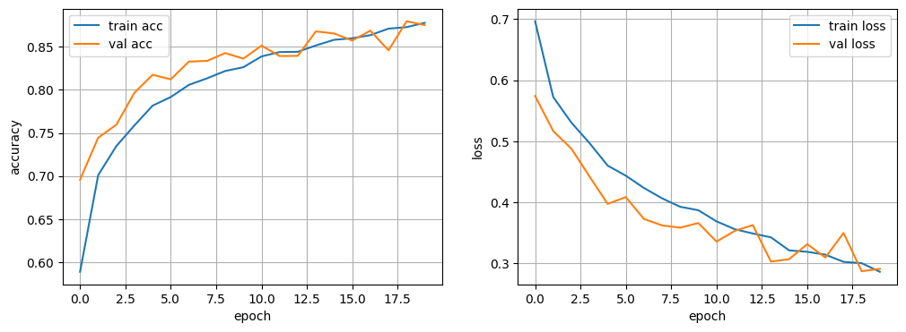

- val acc가 train acc보다 초반에 높음 → **Dropout** 때문 (학습 시 30% 뉴런 꺼짐)
- 두 곡선이 epoch 18~19에서 수렴 → 과적합 없이 잘 학습됨
- 최종 val_acc : **0.8796** (가위바위보 0.99보다 낮음 → 배경 복잡한 실세계 이미지라 어려움)

---

## 예측 결과 시각화

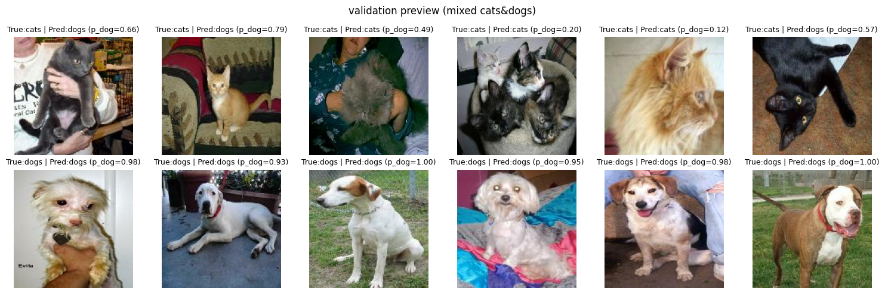

- `p_dog` : sigmoid 출력값 = dog일 확률
- `p_dog >= 0.5` → dogs, 미만 → cats
- 개 6장 모두 높은 확률로 정확히 예측 (0.93~1.00)
- 고양이는 일부 오분류 (p_dog=0.66, 0.79, 0.57) → 고양이가 더 어려움

---

## 💻 코드 + 주석

**Cell 1 — 패키지 설치**

```python
# CNN : 개/고양이 이미지(고해상도) 분류 - 이진분류
# tensorflow_datasets : tfds.load()로 공개 데이터셋 바로 사용
# !pip install tensorflow_datasets
```

---

**Cell 2 — 라이브러리 임포트 및 시드 고정**

```python
import os, shutil   # 파일/폴더를 이동, 복사, 삭제할 때 사용
import tensorflow_datasets as tfds
print(tfds.list_builders())   # 사용 가능한 데이터셋 목록 출력

import numpy as np
import matplotlib.pyplot as plt
import tensorflow as tf
from tensorflow.keras.models import Sequential
from tensorflow.keras.layers import Dense, Input, Conv2D, MaxPooling2D, Flatten, Dropout
from tensorflow.keras.preprocessing.image import ImageDataGenerator

# 재현성을 위한 시드 고정 (같은 조건에서 항상 같은 결과)
np.random.seed(1)
tf.random.set_seed(1)
```

---

**Cell 3 — 데이터셋 다운로드**

```python
# tfds.load : 공개 데이터셋 자동 다운로드 + 로드
# with_info=True     : 데이터셋 메타정보(클래스명, 총 샘플 수 등) 함께 반환
# as_supervised=True : (image, label) 튜플 형태로 반환
(dataset, info) = tfds.load('cats_vs_dogs', with_info=True, as_supervised=True)
print(dataset)   # train 분할만 존재 → 직접 8:2 분할 필요
print(info)
```

```
{'train': <_PrefetchDataset ...>}
name='cats_vs_dogs', full_name='cats_vs_dogs/4.0.1'
전체 샘플 수: 23,262장 (train 분할만 제공)
download_size: 786.67 MiB
```

---

**Cell 4 — 샘플 이미지 확인**

```python
label_names = info.features['label'].names
print('label_names : ', label_names)   # ['cat', 'dog']
print(dataset.keys())                  # train만 지원

# skip(1) : 첫 번째 샘플 건너뜀 / take(1) : 1개만 가져옴
for image, label in dataset['train'].skip(1).take(1):
  print(image.shape, image.dtype)   # 원본 이미지 크기 확인 (가변 크기)
  print(label.numpy())
  plt.imshow(image)
  plt.title(label_names[label.numpy()])
  plt.axis('off')
  plt.show()
```

```
label_names :  ['cat', 'dog']
dict_keys(['train'])
(409, 336, 3) <dtype: 'uint8'>   # 원본 이미지는 가변 크기
1                                 # label=1 → dog
```

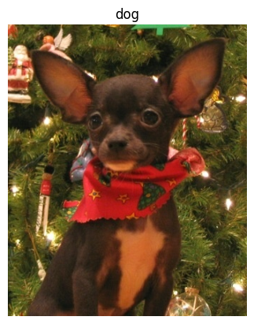

---

**Cell 5 — 폴더 구조 생성 및 이미지 저장**

```python
# flow_from_directory 사용을 위해 클래스별 폴더에 이미지 저장
# 폴더 구조:
#   cats_and_dogs_filtered/
#     ├── train/  (cats/, dogs/)
#     └── validation/  (cats/, dogs/)

base_dir = './cats_and_dogs_filtered'
train_dir = os.path.join(base_dir, 'train')
validation_dir = os.path.join(base_dir, 'validation')

train_cats_dir = os.path.join(train_dir, 'cats')
train_dogs_dir = os.path.join(train_dir, 'dogs')
val_cats_dir = os.path.join(validation_dir, 'cats')
val_dogs_dir = os.path.join(validation_dir, 'dogs')

for d in [train_cats_dir, train_dogs_dir, val_cats_dir, val_dogs_dir]:
  os.makedirs(d, exist_ok=True)   # 폴더 없으면 생성, 있으면 무시

IMG_SIZE = (150, 150)

def save_imgFunc(img, label, idx, split):
  img = tf.image.resize(img, IMG_SIZE)                  # 150×150으로 리사이즈
  img = tf.cast(img, tf.uint8).numpy()                  # float → uint8 변환 후 numpy 배열로

  if split == 'train':
    folder = train_cats_dir if label == 0 else train_dogs_dir
  else:
    folder = val_cats_dir if label == 0 else val_dogs_dir

  path = os.path.join(folder, f'{idx}.jpg')
  tf.keras.preprocessing.image.save_img(path, img)      # 해당 경로에 jpg로 저장

# train 전체 데이터를 8:2로 분할
total = info.splits['train'].num_examples   # 전체 샘플 수 (23,262)
train_size = int(0.8 * total)               # 18,609
print(train_size)

for i, (img, label) in enumerate(dataset['train']):
    if i < train_size:
      save_imgFunc(img, label, i, 'train')
    else:
      save_imgFunc(img, label, i, 'val')

print('데이터 준비 완료 ~~~')
```

```
18609
데이터 준비 완료 ~~~
```

---

**Cell 6 — 폴더 경로 확인**

```python
PATH = './cats_and_dogs_filtered'
train_dir = os.path.join(PATH, 'train')
validation_dir = os.path.join(PATH, 'validation')

train_cats_dir = os.path.join(train_dir, 'cats')
train_dogs_dir = os.path.join(train_dir, 'dogs')
val_cats_dir = os.path.join(validation_dir, 'cats')
val_dogs_dir = os.path.join(validation_dir, 'dogs')

# 경로 존재 여부 확인
for p in [train_dir, train_cats_dir, train_dogs_dir, validation_dir, val_cats_dir, val_dogs_dir]:
  print(p, "->", os.path.exists(p))

# 클래스별 이미지 수 확인
print('cats(train):', len(os.listdir(train_cats_dir)), '| dogs(train):', len(os.listdir(train_dogs_dir)))
print('cats(val):', len(os.listdir(val_cats_dir)), '| dogs(val):', len(os.listdir(val_dogs_dir)))
```

```
./cats_and_dogs_filtered/train -> True
./cats_and_dogs_filtered/train/cats -> True
./cats_and_dogs_filtered/train/dogs -> True
./cats_and_dogs_filtered/validation -> True
./cats_and_dogs_filtered/validation/cats -> True
./cats_and_dogs_filtered/validation/dogs -> True
cats(train): 9381 | dogs(train): 9228
cats(val): 2277  | dogs(val): 2376
```

---

**Cell 7 — Colab 폴더 다운로드 (참고용)**

```python
# Colab에서 폴더 전체를 내 PC로 다운로드하기
import shutil
from google.colab import files

# 폴더를 zip 파일로 압축
shutil.make_archive(
    './cats_and_dogs_filtered',   # 생성될 zip 파일 이름
    'zip',                        # 압축 형식
    './cats_and_dogs_filtered'    # 압축할 폴더명
)

files.download('./cats_and_dogs_filtered.zip')   # 내 PC로 다운로드
```

---

**Cell 8 — 데이터 증강 및 배치 로더**

```python
IMG_HEIGHT, IMG_WIDTH = 150, 150
BATCH_SIZE = 128
EPOCHS = 20

train_datagen = ImageDataGenerator(
    rescale=1./255,           # 픽셀값 [0,255] → [0.0,1.0] 정규화
    rotation_range=15,        # ±15도 랜덤 회전
    width_shift_range=0.1,    # 가로 최대 10% 평행이동
    height_shift_range=0.1,   # 세로 최대 10% 평행이동
    horizontal_flip=True      # 좌우 반전
)
val_datagen = ImageDataGenerator(rescale=1./255)  # 검증은 스케일만 (증강 금지)

train_data = train_datagen.flow_from_directory(
    train_dir,
    target_size = (IMG_HEIGHT, IMG_WIDTH),
    batch_size = BATCH_SIZE,
    class_mode = 'binary',    # 이진분류 → 스칼라 레이블 (0 or 1)
    shuffle = True
)

val_data = val_datagen.flow_from_directory(
    validation_dir,
    target_size = (IMG_HEIGHT, IMG_WIDTH),
    batch_size = BATCH_SIZE,
    class_mode = 'binary',
    shuffle = False            # 검증은 순서 유지
)

print("class_indices:", train_data.class_indices)   # {'cats': 0, 'dogs': 1}
```

```
Found 18609 images belonging to 2 classes.
Found 4653 images belonging to 2 classes.
class_indices: {'cats': 0, 'dogs': 1}
```

---

**Cell 9 — 배치 샘플 미리보기**

```python
imgs, labels = next(train_data)         # 배치 1개 추출
n_show = min(12, imgs.shape[0])
cols = 6
rows = int(np.ceil(n_show / cols))

idx_to_name = {v:k for k, v in train_data.class_indices.items()}   # 인덱스 → 클래스명 역매핑
print('idx_to_name : ', idx_to_name)

plt.figure(figsize=(10, 2 * rows))
for i in range(n_show):
  ax = plt.subplot(rows, cols, i+1)
  ax.imshow(imgs[i])
  ax.set_title(f'{idx_to_name[int(labels[i])]}')   # binary는 int()로 변환 후 매핑
  ax.axis('off')
plt.suptitle('Sample preview (train)', fontsize = 10)
plt.tight_layout()
plt.show()
```

```
idx_to_name :  {0: 'cats', 1: 'dogs'}
```

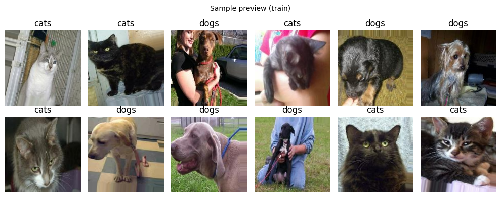

---

**Cell 10 — CNN 모델 구성**

```python
# 이진분류이므로 출력층 뉴런 1개 + sigmoid 사용
# (다중분류는 Dense(n) + softmax)
model = Sequential([
    Input((IMG_HEIGHT, IMG_WIDTH, 3)),

    Conv2D(16, 3, padding='same', activation='relu'),
    MaxPooling2D(),   # feature map 절반 크기로 다운샘플링

    Conv2D(32, 3, padding='same', activation='relu'),
    MaxPooling2D(),

    Conv2D(64, 3, padding='same', activation='relu'),
    MaxPooling2D(),

    Flatten(),
    Dense(512, activation='relu'),
    Dropout(0.3),              # 30% 뉴런 비활성화 → 과적합 방지
    Dense(1, activation='sigmoid')   # dog일 확률 0~1 출력
])

print(model.summary())
```

---

**Cell 11 — 모델 컴파일 및 학습**

```python
# 이진분류 → loss='binary_crossentropy'
# (다중분류는 categorical_crossentropy)
model.compile(optimizer='adam', loss='binary_crossentropy', metrics=['accuracy'])

from tensorflow.keras.callbacks import ModelCheckpoint, EarlyStopping

os.makedirs('chkpoints', exist_ok=True)
ckpt = ModelCheckpoint(
    filepath = 'chkpoints/catdog_best.keras',
    monitor = 'val_accuracy',    # 검증 정확도 기준 모니터링
    mode = 'max',
    save_best_only = True,       # 최고 성능일 때만 저장
    verbose=1
)
es = EarlyStopping(
    monitor='val_accuracy',
    patience=5,                  # 5 epoch 개선 없으면 조기 종료
    restore_best_weights=True    # 최고 성능 가중치로 복원
)

history = model.fit(
    train_data,
    epochs = EPOCHS,
    validation_data = val_data,
    callbacks = [ckpt, es],
    verbose = 2
)
```

```
Epoch 1/20  - accuracy: 0.5888 - loss: 0.6965 - val_accuracy: 0.6957 - val_loss: 0.5741  → 저장
Epoch 2/20  - accuracy: 0.7010 - loss: 0.5724 - val_accuracy: 0.7445 - val_loss: 0.5167  → 저장
...
Epoch 14/20 - accuracy: 0.8515 - loss: 0.3428 - val_accuracy: 0.8678 - val_loss: 0.3031  → 저장
...
Epoch 19/20 - accuracy: 0.8728 - loss: 0.3004 - val_accuracy: 0.8796 - val_loss: 0.2873  → 저장
Epoch 20/20 - accuracy: 0.8778 - loss: 0.2863 - val_accuracy: 0.8751 - val_loss: 0.2912  (개선 없음)
```

---

**Cell 12 — 평가 및 학습 곡선 시각화**

```python
val_loss, val_acc = model.evaluate(val_data, verbose=0)
print(f'검증 평가 결과 : acc : {val_acc:.4f}, loss : {val_loss:.4f}')
# 결과: acc=0.8796, loss=0.2873

plt.figure(figsize=(12, 4))
plt.subplot(1, 2, 1)
plt.plot(history.history['accuracy'], label='train acc')
plt.plot(history.history['val_accuracy'], label='val acc')
plt.xlabel('epoch')
plt.ylabel('accuracy')
plt.legend()
plt.grid(True)

plt.subplot(1, 2, 2)
plt.plot(history.history['loss'], label='train loss')
plt.plot(history.history['val_loss'], label='val loss')
plt.xlabel('epoch')
plt.ylabel('loss')
plt.legend()
plt.grid(True)
plt.show()
```

```
검증 평가 결과 : acc : 0.8796, loss : 0.2873
```


---

**Cell 13 — 클래스별 예측 결과 시각화**

```python
preview_gen = ImageDataGenerator(rescale=1./255)
preview_flow = preview_gen.flow_from_directory(
    validation_dir,
    target_size = (IMG_HEIGHT, IMG_WIDTH),
    batch_size = 24,
    class_mode = 'binary',
    shuffle = True,
    seed = 123             # 재현성을 위한 시드 고정
)

n_each = 6
cats_images, dogs_images = [], []

# 배치를 반복하며 cats/dogs 각 n_each개씩 균등 수집
while len(cats_images) < n_each or len(dogs_images) < n_each:
  imgs, labels = next(preview_flow)
  for im, lb in zip(imgs, labels.ravel()):   # binary labels → ravel()로 1D 변환 (categorical은 argmax)
      if lb == 0 and len(cats_images) < n_each:
        cats_images.append(im)
      elif lb == 1 and len(dogs_images) < n_each:
        dogs_images.append(im)

      if len(cats_images) >= n_each and len(dogs_images) >= n_each:
        break

# sigmoid 출력 → ravel()로 1D 배열 변환 (shape: (N,1) → (N,))
cats_probs = model.predict(np.array(cats_images), verbose=0).ravel()
dogs_probs = model.predict(np.array(dogs_images), verbose=0).ravel()

rows, cols = 2, n_each
plt.figure(figsize=(2.5 * cols, 5))
for i in range(n_each):
  # cats 행
  ax = plt.subplot(rows, cols, i + 1)
  ax.imshow(cats_images[i])
  ax.axis('off')
  p = cats_probs[i]
  ax.set_title(f'True:cats | Pred:{"dogs" if p >= 0.5 else "cats"} (p_dog={p:.2f})', fontsize=9)
  # p >= 0.5 → dog, 미만 → cat (sigmoid 기준)

  # dogs 행
  ax = plt.subplot(rows, cols, cols + i + 1)
  ax.imshow(dogs_images[i])
  ax.axis('off')
  p = dogs_probs[i]
  ax.set_title(f'True:dogs | Pred:{"dogs" if p >= 0.5 else "cats"} (p_dog={p:.2f})', fontsize=9)

plt.suptitle('validation preview (mixed cats&dogs)', fontsize=12)
plt.tight_layout()
plt.show()
```

```
Found 4653 images belonging to 2 classes.
```


---

## 📌 핵심 요약

| 항목         | cnn9catdog            | cnn10quiz                   |
| ---------- | --------------------- | --------------------------- |
| 분류 유형      | 이진분류                  | 다중분류 (3클래스)                 |
| 출력층        | `Dense(1, sigmoid)`   | `Dense(3, softmax)`         |
| 손실함수       | `binary_crossentropy` | `categorical_crossentropy`  |
| class_mode | `'binary'`            | `'categorical'`             |
| 레이블 처리     | `labels.ravel()`      | `np.argmax(labels, axis=1)` |
| 최종 val_acc | **0.8796**            | **0.9919**                  |
| 난이도        | 높음 (실세계 복잡 배경)        | 낮음 (단색 배경)                  |

---
# 📄 cnn10catdog_pred.ipynb — 모델 로드 · 단일 이미지 예측 · sigmoid 후처리

---

## 🧠 개념 정리

## 🧠 전체 흐름

이전 실습(cnn9catdog)에서 저장한 `catdog_best.keras` 모델을 불러와, 새로운 이미지 1장을 전처리 후 예측하는 **추론(Inference) 파이프라인**이다.

```
저장된 모델 (.keras)
        ↓ load_model()
이미지 파일 (.jpeg)
        ↓ load_img() → img_to_array() → /255.0 → expand_dims()
전처리된 배열 (1, 150, 150, 3)
        ↓ model.predict()
sigmoid 출력값 (0~1) → p_dog
        ↓ 1 - p_dog = p_cat / THRESH 기준 분류
예측 결과 + 시각화
```

---

## 🧠 학습 때 vs 추론 때 전처리 비교

학습 때는 `ImageDataGenerator`가 전처리를 자동으로 처리해줬다. 추론 때는 **직접 동일한 전처리를 수동으로 적용**해야 한다.

|항목|학습 시 (flow_from_directory)|추론 시 (단일 이미지)|
|---|---|---|
|이미지 로드|자동|`load_img()`|
|리사이즈|`target_size` 자동|`target_size=(150,150)` 명시|
|정규화|`rescale=1./255` 자동|`arr / 255.0` 수동|
|배치 차원|자동 (batch_size 단위)|`expand_dims(arr, axis=0)` 수동|
|출력 shape|`(N, 150, 150, 3)`|`(1, 150, 150, 3)`|

> ⚠️ 학습 때와 전처리가 다르면 예측이 엉망이 된다. rescale을 빠뜨리거나, expand_dims를 안 하면 에러 또는 오예측.

---

## 📌 expand_dims란?

모델은 항상 **배치 단위**로 입력을 받는다. 단일 이미지는 `(150, 150, 3)` shape인데, 모델이 기대하는 shape는 `(batch_size, 150, 150, 3)` 이다.

```python
arr = img_to_array(img)           # shape: (150, 150, 3)
arr = np.expand_dims(arr, axis=0) # shape: (1, 150, 150, 3)
#                        ↑ axis=0 : 맨 앞에 차원 1개 추가
```

---

## 📌 sigmoid 출력값 해석

```python
prob_dog = float(model.predict(x, verbose=0)[0][0])
# model.predict(x) → shape: (1, 1)  ← 배치 1개, 출력 뉴런 1개
# [0]              → shape: (1,)    ← 첫 번째 배치 꺼냄
# [0]              → scalar         ← 값 하나 꺼냄
# float()          → Python float으로 변환
```

```
prob_dog = 0.68  → dog일 확률 68%
prob_cat = 1 - prob_dog = 0.32  → cat일 확률 32%

THRESH = 0.5 기준:
  prob_dog >= 0.5  → dogs
  prob_dog <  0.5  → cats
```

> THRESH를 조정하면 민감도를 바꿀 수 있다. 예: THRESH=0.4 → dog 판정이 더 쉬워짐 (recall 높이기)

---

## 💻 코드 + 주석

**입력 이미지 (myimage.jpeg)**


---

**Cell 1 — 모델 로드**

```python
# 이전 실습에서 만들어진 모델로 새로운 이미지 분류 예측
# 새로운 이미지도 크기 조정(150, 150) + 스케일링

import os
import numpy as np
import matplotlib.pyplot as plt
import tensorflow as tf

MODEL_PATH = 'catdog_best.keras'      # 저장된 최적 모델 경로
IMG_HEIGHT, IMG_WIDTH = 150, 150      # 학습에 사용한 크기와 반드시 동일해야 함
THRESH = 0.5    # sigmoid 임계값 (0.5 기준 → 이상이면 dog, 미만이면 cat)

idx_to_name = {0:'cats', 1:'dogs'}    # 인덱스 → 클래스명 매핑

# 저장된 모델 불러오기
model = tf.keras.models.load_model(MODEL_PATH)
print(model.summary())
```

---

**Cell 2 — 전처리 및 예측 함수**

```python
# 전처리 함수
def preprocess_imageFunc(img_path):
  img = tf.keras.utils.load_img(img_path, target_size=(IMG_HEIGHT, IMG_WIDTH))
  # load_img : 이미지 파일 로드 + 150×150으로 리사이즈 (PIL Image 반환)

  arr = tf.keras.utils.img_to_array(img)
  # img_to_array : PIL Image → numpy 배열 (150, 150, 3) float32 변환

  arr = arr / 255.0
  # 픽셀값 [0,255] → [0.0,1.0] 정규화 (학습 때 rescale=1./255와 동일하게)

  arr = np.expand_dims(arr, axis=0)
  # (150, 150, 3) → (1, 150, 150, 3) : 모델은 배치 단위 입력을 기대하므로 차원 추가
  return arr


# 단일 이미지 예측 함수
def predict_oneFunc(img_path, show=True):
  x = preprocess_imageFunc(img_path)

  prob_dog = float(model.predict(x, verbose=0)[0][0])
  # model.predict(x) → shape (1,1) / [0][0]으로 scalar 추출 / float()로 변환
  # sigmoid 출력값 = dog일 확률

  pred_idx = int(prob_dog >= THRESH)    # THRESH 이상 → 1(dog), 미만 → 0(cat)
  pred_name = idx_to_name[pred_idx]
  prob_cat = 1.0 - prob_dog             # cat 확률 = 1 - dog 확률

  if show:
    img_disp = tf.keras.utils.load_img(img_path, target_size=(IMG_HEIGHT, IMG_WIDTH))
    plt.figure(figsize=(4, 4))
    plt.imshow(img_disp)
    plt.axis('off')
    plt.title(f'pred:{pred_name} | p(cat)={prob_cat:.2f}, p(dog)={prob_dog:.2f}')
    plt.show()

  # 결과를 딕셔너리로 반환 → 여러 이미지 일괄 처리 시 활용 가능
  return {'path':img_path, 'pred': pred_name, 'p_dog':prob_dog, 'p_cat':prob_cat}

res = predict_oneFunc('myimage.jpeg', show=True)
print(res)
```

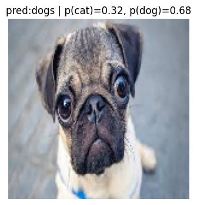
```
{'path': 'myimage.jpeg', 'pred': 'dogs', 'p_dog': 0.683, 'p_cat': 0.317}
```


---

## 📌 핵심 요약

|항목|내용|
|---|---|
|모델 저장 포맷|`.keras` (구 `.h5` 대체)|
|모델 로드|`tf.keras.models.load_model()`|
|이미지 로드|`tf.keras.utils.load_img()` → PIL Image|
|배열 변환|`tf.keras.utils.img_to_array()` → numpy|
|정규화|`arr / 255.0` (학습과 동일하게)|
|배치 차원 추가|`np.expand_dims(arr, axis=0)`|
|예측|`model.predict(x)[0][0]` → sigmoid 출력 scalar|
|분류 기준|`prob_dog >= THRESH` → dog / 미만 → cat|
|p_cat 계산|`1.0 - prob_dog`|

---

# 📄 cnn10quiz.ipynb — 가위바위보 · 증강비교 · ROC Curve

---

## 🧠 개념 정리

## 🧠 전체 흐름

Rock-Paper-Scissors 데이터셋으로 3클래스 분류 모델을 학습하되, **증강 O / 증강 X 두 모델을 동시에 학습**하고 예측 결과를 비교한다.

```
image_dataset_from_directory (Cell 1, label_mode='int')
        ↓
ImageDataGenerator로 증강 O/X 배치 로더 생성 (Cell 2)
        ↓
증강 전/후 샘플 미리보기 (Cell 3, 4)
        ↓
build_model() 함수로 동일한 CNN 구조 2개 생성 (Cell 5)
        ↓
증강 X 학습 → history_no_aug (Cell 6)
증강 O 학습 → history_aug    (Cell 7)
        ↓
학습 곡선 비교 + 검증 정확도 출력 (Cell 8)
        ↓
test 셋 랜덤 10장 → 두 모델 예측 비교 시각화 (Cell 9)
```

---

## 🧠 image_dataset_from_directory vs flow_from_directory

이번 실습은 두 방식을 **함께 사용**한다. Cell 1에서 `image_dataset_from_directory`로 데이터를 먼저 확인하고, 실제 학습은 Cell 2에서 `ImageDataGenerator + flow_from_directory`로 진행한다.

|항목|`flow_from_directory`|`image_dataset_from_directory`|
|---|---|---|
|반환 타입|Keras Generator|`tf.data.Dataset`|
|레이블 형태|원-핫 (`categorical`)|정수 (`int`)|
|손실함수|`categorical_crossentropy`|`sparse_categorical_crossentropy`|
|증강 방식|`ImageDataGenerator` 옵션|`tf.keras.layers.Random*` 레이어|

---

## 📌 두 모델 동시 학습 전략

```python
model_no_aug = build_model()   # 증강 X 데이터로 학습
model_aug    = build_model()   # 증강 O 데이터로 학습
```

완전히 동일한 구조로 두 모델을 만들고, 각각 다른 데이터(`train_data` vs `train_data_aug`)로 학습해서 **증강 유무의 효과만 순수하게 비교**한다.

---

## 학습 곡선 해석

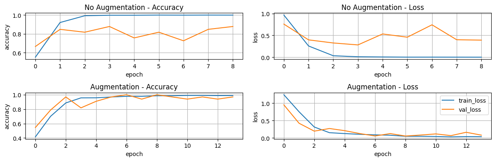

- **증강 X** (상단): train acc 빠르게 1.0 도달, val acc 0.88 수준 → **과적합** 징후
- **증강 O** (하단): train/val acc 함께 수렴, val acc 1.0 달성 → **일반화 성능 향상**
- 증강 O가 val acc 1.0000, 증강 X는 0.8788 → 증강 효과 명확

---

## 예측 결과 비교

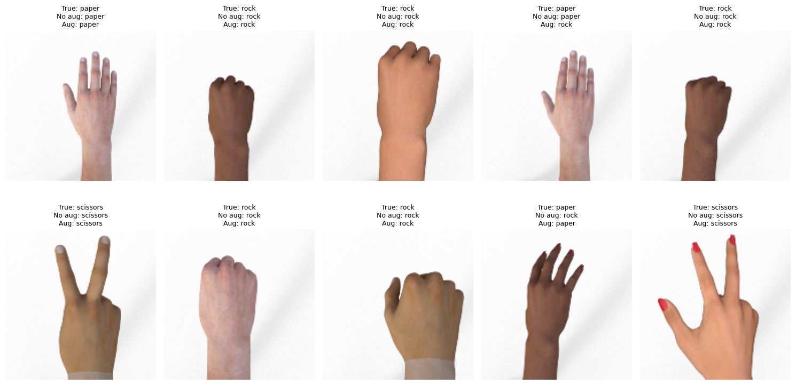

- 대부분 두 모델 모두 정확히 예측
- `True: paper / No aug: rock` → 증강 X 모델이 틀린 케이스
- 증강 O 모델이 전반적으로 더 안정적

---

## 💻 코드 + 주석

**Cell 1 — 데이터 로드 및 feature/label 확인**

```python
import numpy as np
import matplotlib.pyplot as plt
import tensorflow as tf
from tensorflow.keras.models import Sequential
from tensorflow.keras.layers import Dense, Input, Conv2D, MaxPooling2D, Flatten, Dropout
from tensorflow.keras.preprocessing.image import ImageDataGenerator

IMG_SIZE = (224, 224)
BATCH    = 32

train_dir = "/content/drive/MyDrive/Colab Notebooks/data/rock-paper-scissors/train"
valid_dir = "/content/drive/MyDrive/Colab Notebooks/data/rock-paper-scissors/valid"
test_dir  = "/content/drive/MyDrive/Colab Notebooks/data/rock-paper-scissors/test"

# image_dataset_from_directory : 폴더 구조 기반 자동 라벨링
# label_mode='int' : 정수 레이블 (0, 1, 2)
train_ds = tf.keras.utils.image_dataset_from_directory(
    train_dir,
    labels="inferred",
    label_mode="int",
    image_size=IMG_SIZE,
    batch_size=BATCH,
    shuffle=True,
    seed=42,
)
valid_ds = tf.keras.utils.image_dataset_from_directory(
    valid_dir,
    labels="inferred",
    label_mode="int",
    image_size=IMG_SIZE,
    batch_size=BATCH,
    shuffle=True,
    seed=42,
)
test_ds = tf.keras.utils.image_dataset_from_directory(
    test_dir,
    labels="inferred",
    label_mode="int",
    image_size=IMG_SIZE,
    batch_size=BATCH,
    shuffle=False
)

class_names = train_ds.class_names
print("class_names:", class_names)   # ['paper', 'rock', 'scissors']

# feature / label 일부 출력
for images, labels in train_ds.take(1):
    print("features shape:", images.shape)   # (32, 224, 224, 3)
    print("labels shape:", labels.shape)     # (32,)
    print("labels (first 10):", labels[:10].numpy())
    print("labels mapped (first 10):", [class_names[i] for i in labels[:10].numpy()])
```

```
Found 2520 files belonging to 3 classes.
Found 372 files belonging to 3 classes.
class_names: ['paper', 'rock', 'scissors']
features shape: (32, 224, 224, 3)
labels shape: (32,)
labels (first 10): [2 1 0 2 2 1 0 1 1 1]
labels mapped (first 10): ['scissors', 'rock', 'paper', ...]
```

---

**Cell 2 — 이미지 증강 / 스케일링**

```python
IMG_HEIGHT, IMG_WIDTH = 150, 150
BATCH_SIZE = 128
EPOCHS = 20

train_datagen = ImageDataGenerator(
    rescale=1./255,           # 픽셀값 [0,255] → [0.0,1.0] 정규화
    rotation_range=15,        # ±15도 랜덤 회전
    width_shift_range=0.1,    # 가로 최대 10% 평행이동
    height_shift_range=0.1,   # 세로 최대 10% 평행이동
    horizontal_flip=True      # 좌우 반전
)
scale_data = ImageDataGenerator(rescale=1./255)  # 검증/테스트는 스케일만 (증강 금지)

# 증강 없는 train data
train_data = scale_data.flow_from_directory(
    train_dir,
    target_size=(IMG_HEIGHT, IMG_WIDTH),
    batch_size=BATCH_SIZE,
    class_mode='categorical',
    shuffle=True,
    seed=42
)

# 증강 있는 train data
train_data_aug = train_datagen.flow_from_directory(
    train_dir,
    target_size=(IMG_HEIGHT, IMG_WIDTH),
    batch_size=BATCH_SIZE,
    class_mode='categorical',
    shuffle=True,
    seed=42
)

val_data = scale_data.flow_from_directory(
    valid_dir,
    target_size=(IMG_HEIGHT, IMG_WIDTH),
    batch_size=BATCH_SIZE,
    class_mode='categorical',
    shuffle=False
)

test_data = scale_data.flow_from_directory(
    test_dir,
    target_size=(IMG_HEIGHT, IMG_WIDTH),
    batch_size=BATCH_SIZE,
    class_mode='categorical',
    shuffle=False
)

print('class_indices:', train_data_aug.class_indices)
# {'paper': 0, 'rock': 1, 'scissors': 2}
```

```
Found 2520 images belonging to 3 classes.
Found 2520 images belonging to 3 classes.
Found 33 images belonging to 3 classes.
Found 372 images belonging to 3 classes.
class_indices: {'paper': 0, 'rock': 1, 'scissors': 2}
```

---

**Cell 3 — 증강 전 샘플 미리보기**

```python
imgs, labels = next(train_data)   # 배치 1개 추출 (증강 없는 원본)
n_show = min(12, imgs.shape[0])
cols = 6
rows = int(np.ceil(n_show / cols))

idx_to_name = {v:k for k, v in train_data.class_indices.items()}
print('idx_to_name:', idx_to_name)

plt.figure(figsize=(10, 2 * rows))
for i in range(n_show):
    ax = plt.subplot(rows, cols, i + 1)
    ax.imshow(imgs[i])
    ax.set_title(f'{idx_to_name[np.argmax(labels[i])]}')
    plt.axis('off')
plt.suptitle('Sample preview (train)', fontsize=10)
plt.tight_layout()
plt.show()
```

```
idx_to_name: {0: 'paper', 1: 'rock', 2: 'scissors'}
```

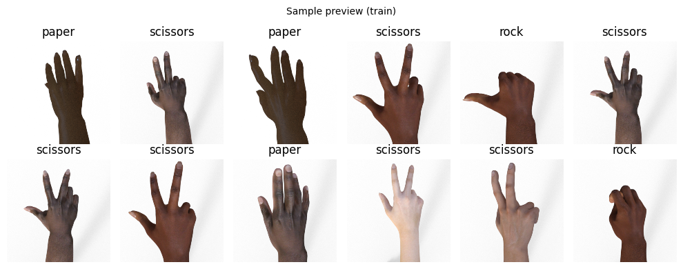

---

**Cell 4 — 증강 후 샘플 미리보기**

```python
imgs, labels = next(train_data_aug)   # 배치 1개 추출 (증강 적용된 이미지)
n_show = min(12, imgs.shape[0])
cols = 6
rows = int(np.ceil(n_show / cols))

idx_to_name = {v:k for k, v in train_data_aug.class_indices.items()}
print('idx_to_name:', idx_to_name)

plt.figure(figsize=(10, 2 * rows))
for i in range(n_show):
    ax = plt.subplot(rows, cols, i + 1)
    ax.imshow(imgs[i])
    ax.set_title(f'{idx_to_name[np.argmax(labels[i])]}')
    plt.axis('off')
plt.suptitle('Sample preview (train)', fontsize=10)
plt.tight_layout()
plt.show()
```

```
idx_to_name: {0: 'paper', 1: 'rock', 2: 'scissors'}
```

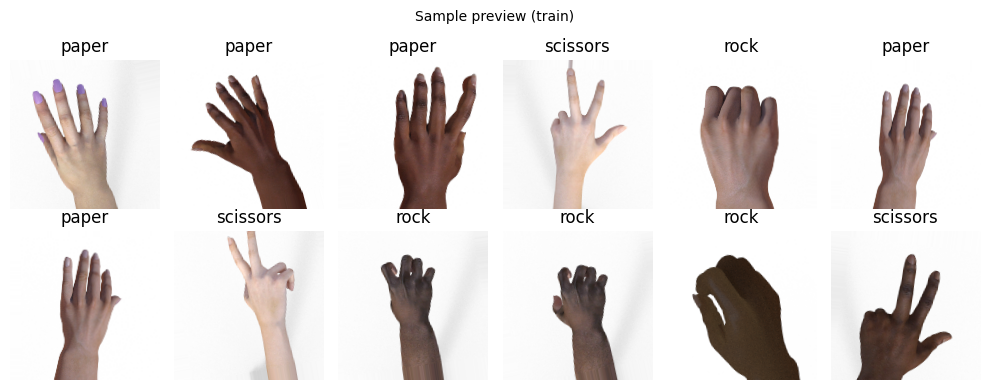

---

**Cell 5 — 모델 빌더 함수**

```python
# 증강 O / X 두 모델을 동일한 구조로 만들기 위해 함수로 분리
# flow_from_directory + class_mode='categorical' → 원-핫 레이블
# → loss='categorical_crossentropy' 사용

def build_model():
    model = Sequential([
        Input((IMG_HEIGHT, IMG_WIDTH, 3)),

        Conv2D(16, 3, padding='same', activation='relu'),
        MaxPooling2D(),   # feature map 절반으로 다운샘플링

        Conv2D(32, 3, padding='same', activation='relu'),
        MaxPooling2D(),

        Conv2D(64, 3, padding='same', activation='relu'),
        MaxPooling2D(),

        Flatten(),
        Dense(128, activation='relu'),
        Dropout(0.3),              # 30% 뉴런 비활성화 → 과적합 방지
        Dense(3, activation='softmax')   # 3클래스 확률 출력 (합=1)
    ])
    model.compile(
        optimizer='adam',
        loss='categorical_crossentropy',   # 원-핫 레이블 → categorical 사용
        metrics=['accuracy']
    )
    return model

model_no_aug = build_model()   # 증강 X 모델
model_aug    = build_model()   # 증강 O 모델
print(model_no_aug.summary())
```

---

**Cell 6 — 증강 X 모델 학습**

```python
import os
from tensorflow.keras.callbacks import EarlyStopping, ModelCheckpoint

model_no_aug.compile(optimizer='adam', loss='categorical_crossentropy', metrics=['accuracy'])

os.makedirs('chkpoints', exist_ok=True)

ckpt_no_aug = ModelCheckpoint(
    filepath='chkpoints/quiz_no_aug.keras',
    monitor='val_accuracy', mode='max',
    save_best_only=True, verbose=1
)
es_no_aug = EarlyStopping(
    monitor='val_loss',
    patience=5,
    restore_best_weights=True
)

history_no_aug = model_no_aug.fit(
    train_data,
    validation_data=val_data,
    epochs=EPOCHS,
    callbacks=[ckpt_no_aug, es_no_aug],
    verbose=2
)
```

```
Epoch 1/20 - accuracy: 0.5532 - loss: 0.9646 - val_accuracy: 0.6667 → 저장
...
증강 X 최종 val_acc: 0.8788
```

---

**Cell 7 — 증강 O 모델 학습**

```python
model_aug.compile(optimizer='adam', loss='categorical_crossentropy', metrics=['accuracy'])

ckpt_aug = ModelCheckpoint(
    filepath='chkpoints/quiz_aug.keras',
    monitor='val_accuracy', mode='max',
    save_best_only=True, verbose=1
)
es_aug = EarlyStopping(
    monitor='val_loss',
    patience=5,
    restore_best_weights=True
)

history_aug = model_aug.fit(
    train_data_aug,
    validation_data=val_data,
    epochs=EPOCHS,
    callbacks=[ckpt_aug, es_aug],
    verbose=2
)
```

```
Epoch 1/20 - accuracy: 0.4155 - loss: 1.2417 - val_accuracy: 0.5455 → 저장
...
증강 O 최종 val_acc: 1.0000
```

---

**Cell 8 — 평가 및 학습 곡선 시각화**

```python
# 두 모델 검증 성능 출력
val_no_loss, val_no_acc = model_no_aug.evaluate(val_data, verbose=0)
val_loss,    val_acc    = model_aug.evaluate(val_data, verbose=0)
print(f'증강 X 검증 평가 결과 : loss : {val_no_loss:.4f}, acc : {val_no_acc:.4f}')
print(f'증강 O 검증 평가 결과 : loss : {val_loss:.4f}, acc : {val_acc:.4f}')

# 2×2 그리드 : 증강X 정확도/손실, 증강O 정확도/손실
plt.figure(figsize=(12, 4))

plt.subplot(2, 2, 1)
plt.plot(history_no_aug.history['accuracy'],     label='train_acc')
plt.plot(history_no_aug.history['val_accuracy'], label='val_acc')
plt.title('No Augmentation - Accuracy')
plt.xlabel('epoch')
plt.ylabel('accuracy')
plt.grid(True)

plt.subplot(2, 2, 2)
plt.plot(history_no_aug.history['loss'],     label='train_loss')
plt.plot(history_no_aug.history['val_loss'], label='val_loss')
plt.title('No Augmentation - Loss')
plt.xlabel('epoch')
plt.ylabel('loss')
plt.grid(True)

plt.subplot(2, 2, 3)
plt.plot(history_aug.history['accuracy'],     label='train_acc')
plt.plot(history_aug.history['val_accuracy'], label='val_acc')
plt.title('Augmentation - Accuracy')
plt.xlabel('epoch')
plt.ylabel('accuracy')
plt.grid(True)

plt.subplot(2, 2, 4)
plt.plot(history_aug.history['loss'],     label='train_loss')
plt.plot(history_aug.history['val_loss'], label='val_loss')
plt.title('Augmentation - Loss')
plt.xlabel('epoch')
plt.ylabel('loss')
plt.grid(True)

plt.tight_layout()
plt.legend()
plt.show()
```

```
증강 X 검증 평가 결과 : loss : 0.2818, acc : 0.8788
증강 O 검증 평가 결과 : loss : 0.0525, acc : 1.0000
```


---

**Cell 9 — 새로운 이미지 분류 예측 (test 랜덤 10장)**

```python
# test_data 전체 이미지 로드
all_imgs, all_labels = [], []

for i in range(len(test_data)):
    imgs_batch, labels_batch = next(test_data)
    all_imgs.append(imgs_batch)
    all_labels.append(labels_batch)

all_imgs   = np.concatenate(all_imgs,   axis=0)
all_labels = np.concatenate(all_labels, axis=0)
true_labels = np.argmax(all_labels, axis=1)   # 원-핫 → 정수 인덱스

print("전체 test 이미지 수:", len(all_imgs))
print("클래스 분포:", np.bincount(true_labels))

# 랜덤 10장 선택
np.random.seed(42)
sample_idx         = np.random.choice(len(all_imgs), size=10, replace=False)
sample_imgs        = all_imgs[sample_idx]
sample_true_labels = true_labels[sample_idx]

# 두 모델 예측
pred_no_aug_labels = np.argmax(model_no_aug.predict(sample_imgs, verbose=0), axis=1)
pred_aug_labels    = np.argmax(model_aug.predict(sample_imgs,    verbose=0), axis=1)

print("실제 클래스:", [idx_to_name[i] for i in sample_true_labels])
print("증강 X 예측:", [idx_to_name[i] for i in pred_no_aug_labels])
print("증강 O 예측:", [idx_to_name[i] for i in pred_aug_labels])

plt.figure(figsize=(15, 8))
for i in range(10):
    ax = plt.subplot(2, 5, i + 1)
    ax.imshow(sample_imgs[i])
    true_name   = idx_to_name[sample_true_labels[i]]
    no_aug_name = idx_to_name[pred_no_aug_labels[i]]
    aug_name    = idx_to_name[pred_aug_labels[i]]
    ax.set_title(f"True: {true_name}\nNo aug: {no_aug_name}\nAug: {aug_name}", fontsize=9)
    plt.axis("off")

plt.tight_layout()
plt.show()
```

```
전체 test 이미지 수: 372
클래스 분포: [124 124 124]
실제 클래스: ['paper', 'rock', 'rock', 'paper', 'rock', 'scissors', 'rock', 'rock', 'paper', 'scissors']
```


---

## 📌 핵심 요약

|항목|내용|
|---|---|
|데이터 확인|`image_dataset_from_directory` + `label_mode='int'`|
|실제 학습|`ImageDataGenerator` + `flow_from_directory`|
|레이블 형태|원-핫 (`categorical`)|
|손실함수|`categorical_crossentropy`|
|비교 방법|동일 구조 모델 2개 (증강 O / X)|
|증강 X val_acc|**0.8788**|
|증강 O val_acc|**1.0000**|
|예측 방식|test 전체 로드 → 랜덤 10장 → 두 모델 비교 시각화|
