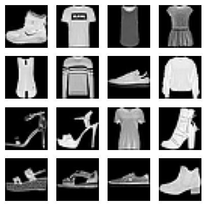
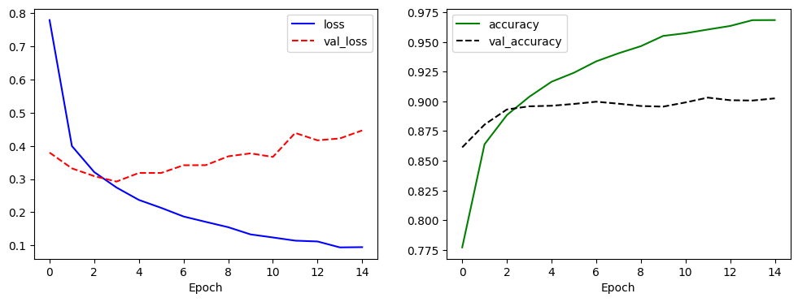
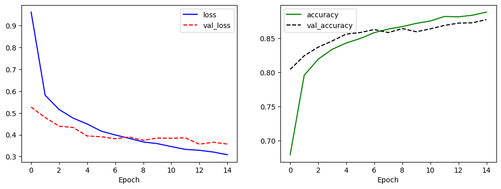
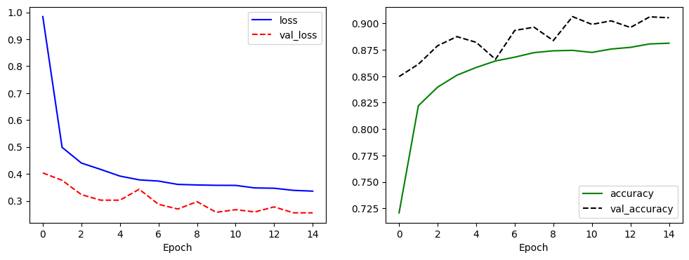
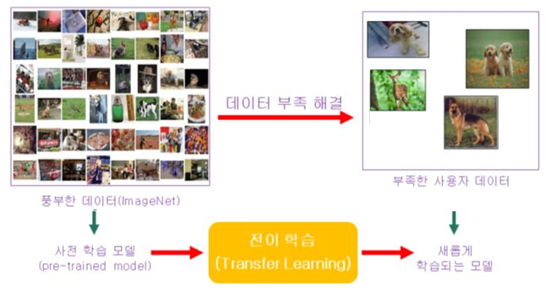
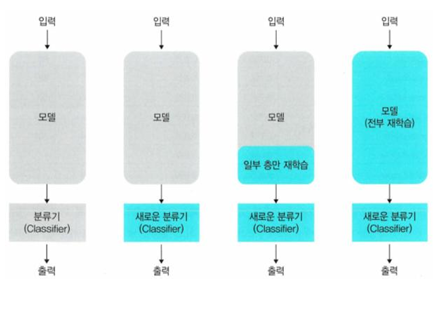
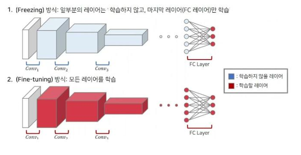
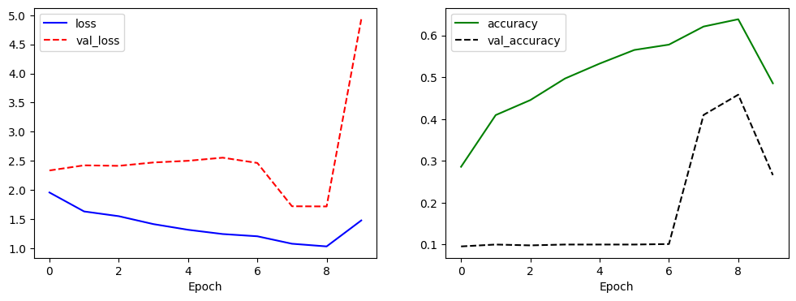
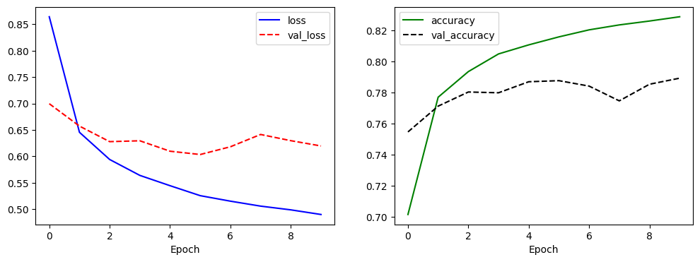

# Day 67_딥러닝 : 유명 CNN 모델 · 전이학습(Transfer Learning) · 미세조정(Fine-Tuning)

## 📅 2026-05-14

---
# 유명 CNN 모델 — AlexNet · VGGNet · GoogLeNet · ResNet · MobileNet

## 🏷️ 이미지 애너테이션

AI에서 이미지 인식 등의 작업을 할 때, 이미지에 해석 정보를 추가해 지도 학습 데이터를 만드는 작업을 **Annotation**이라고 한다. XML, JSON 등을 사용하여 메타 데이터로 저장하는 경우가 많다.

## 🏆 이미지 분류 모델 (ILSVRC 기준)

ILSVRC(ImageNet Large Scale Visual Recognition Competition)는 1000개 클래스, 120만 장 이미지로 학습하고 15만 장으로 테스트하는 대회다. CNN 발전의 기준점이 된 대회로, 아래 모델들이 순서대로 우승을 차지했다.

### AlexNet (2012)

- ILSVRC 2012에서 **top-5 error 15.4%** 로 2위(26.2%)를 큰 폭으로 제치고 우승
- 제프리 힌튼 교수팀이 개발, CNN이 본격적으로 주목받는 계기가 됨
- 구조 : **Conv 5개 + FC 3개**, 마지막에 Softmax로 예측
- **ReLU, Dropout**을 처음으로 표준화 → 지금도 그대로 사용됨

### VGGNet (2014)

- ILSVRC 2014에서 GoogLeNet에 밀려 **2위**
- "모델의 깊이가 성능에 얼마나 영향을 주는가"에 집중해 설계
- **3×3 작은 필터**만 고집 → 구조가 단순하고 이해·변형이 쉬움
- 단순한 구조 덕분에 이미지 특징 추출용으로 지금도 널리 응용됨

```python
# VGGNet 스타일 네트워크 (Fashion MNIST 예시)
model = tf.keras.Sequential([
    tf.keras.layers.Conv2D(input_shape=(28,28,1), kernel_size=(3,3), filters=32, padding='same', activation='relu'),
    tf.keras.layers.Conv2D(kernel_size=(3,3), filters=64, padding='same', activation='relu'),
    tf.keras.layers.MaxPool2D(pool_size=(2,2)),
    tf.keras.layers.Dropout(rate=0.5),
    tf.keras.layers.Conv2D(kernel_size=(3,3), filters=128, padding='same', activation='relu'),
    tf.keras.layers.Conv2D(kernel_size=(3,3), filters=256, padding='valid', activation='relu'),
    tf.keras.layers.MaxPool2D(pool_size=(2,2)),
    tf.keras.layers.Dropout(rate=0.5),
    tf.keras.layers.Flatten(),
    tf.keras.layers.Dense(units=512, activation='relu'),
    tf.keras.layers.Dropout(rate=0.5),
    tf.keras.layers.Dense(units=256, activation='relu'),
    tf.keras.layers.Dropout(rate=0.5),
    tf.keras.layers.Dense(units=10, activation='softmax')
])
```

### GoogLeNet / Inception v1 (2014)

- ILSVRC 2014 **1위**
- 논문명 : _Going Deeper with Convolutions_, Inception이라는 이름으로 발표
- 핵심 : **Inception 모듈** — 여러 크기의 필터를 병렬로 동시에 적용해 다양한 특징을 한 번에 추출
- 이후 Inception v2, v3, v4 등 다양한 버전으로 발전

### ResNet (2015)

- ILSVRC 2015 **1위**, top-5 error **3.6%** → 사람 분류 수준(5% 내외)을 뛰어넘음
- 핵심 : **Skip Connection(잔차 연결)** — 입력값을 출력에 직접 더해줌으로써 깊은 네트워크의 기울기 소실 문제 해결
- 구조 : **Residual Block** + **Identity Block**
- ResNet50 : Conv + FC 레이어 수 기준 총 **50개** 레이어

### MobileNet

- **모바일·임베디드 환경** 등 컴퓨팅 자원이 제한된 환경을 위해 설계
- 핵심 : **Depthwise Separable Convolution** — 같은 레이어 수 대비 파라미터 수를 대폭 줄임
- 경량화 모델이라 드론, 자율주행, 엣지 디바이스 등에서 자주 활용됨

## 📊 모델 비교 요약

|모델|연도|ILSVRC 성적|핵심 특징|
|---|---|---|---|
|AlexNet|2012|1위|ReLU, Dropout 표준화|
|VGGNet|2014|2위|3×3 필터, 단순한 구조|
|GoogLeNet|2014|1위|Inception 모듈 (병렬 필터)|
|ResNet|2015|1위|Skip Connection, 기울기 소실 해결|
|MobileNet|-|-|Depthwise Separable Conv, 경량화|

---

# 📄 cnn11net_expand.ipynb — FashionMNIST · CNN 모델 비교 · VGGNet

## 개요

FashionMNIST 데이터셋으로 세 가지 CNN 구조를 비교한다.

- **model1** : Conv + Dense (Pooling 없음)
- **model2** : Conv + Pooling + Dense
- **model3** : VGGNet 스타일 (유명 모델 구조 참고)

Pooling 유무, 네트워크 깊이와 필터 수에 따라 성능이 어떻게 달라지는지 확인하는 것이 목적이다.

---

## 📦 데이터 로드 및 전처리

```python
import tensorflow as tf
import matplotlib.pyplot as plt

fashion_mnist = tf.keras.datasets.fashion_mnist
(x_train, y_train), (x_test, y_test) = fashion_mnist.load_data()
# x_train: (60000, 28, 28), y_train: (60000,)

# Conv2D는 채널 차원(1)이 필요하므로 reshape
# (샘플 수, 높이, 너비, 채널) 형태로 변환
x_train = x_train.reshape(-1, 28, 28, 1)
x_test = x_test.reshape(-1, 28, 28, 1)
# x_train: (60000, 28, 28, 1), x_test: (10000, 28, 28, 1)

# 데이터 시각화 (16개 샘플)
plt.figure(figsize=(5, 5))
for c in range(16):
    plt.subplot(4, 4, c+1)
    plt.imshow(x_train[c].reshape(28, 28), cmap='gray')
    plt.axis('off')
plt.show()

print(y_train[:16])  # [9 0 0 3 0 2 7 2 5 5 0 9 5 5 7 9]
```

> FashionMNIST는 28×28 흑백 이미지, 10개 클래스(티셔츠, 바지, 풀오버 등)로 구성된다. Conv2D 입력은 반드시 `(H, W, C)` 형태여야 하므로 채널 차원 1을 추가한다.



---

## 🔷 model1 — Conv + Dense

### 모델 구조

```python
# Pooling 없이 Conv만 쌓는 구조
# 특징맵 크기가 줄지 않아 파라미터 수가 많고 과적합 위험이 있음
model = tf.keras.Sequential([
    tf.keras.layers.Input(shape=(28, 28, 1)),

    # Conv2D: 필터로 이미지의 지역적 특징(엣지, 패턴 등)을 추출
    # 필터 수를 16 → 32 → 64로 늘려가며 점점 복잡한 특징을 학습
    tf.keras.layers.Conv2D(16, (3, 3), activation='relu'),
    tf.keras.layers.Conv2D(32, (3, 3), activation='relu'),
    tf.keras.layers.Conv2D(64, (3, 3), activation='relu'),

    # Flatten: 2D 특징맵을 1D 벡터로 변환 (Dense 레이어 입력 준비)
    tf.keras.layers.Flatten(),

    tf.keras.layers.Dense(64, activation='relu'),
    tf.keras.layers.Dropout(0.2),   # 20% 뉴런 랜덤 비활성화로 과적합 방지
    tf.keras.layers.Dense(32, activation='relu'),
    tf.keras.layers.Dropout(0.2),
    tf.keras.layers.Dense(10, activation='softmax')  # 10개 클래스 확률 출력
])

print(model.summary())
```

**출력 결과 (model.summary)**

```
Total params: 2,008,234 (7.66 MB)
Trainable params: 2,008,234 (7.66 MB)
Non-trainable params: 0 (0.00 B)
```

### 학습

```python
# sparse_categorical_crossentropy: 라벨이 정수(0~9)일 때 사용
# categorical_crossentropy는 one-hot 인코딩 라벨일 때 사용
model.compile(optimizer='adam',
              loss='sparse_categorical_crossentropy',
              metrics=['accuracy'])

# validation_split=0.25: 훈련 데이터의 25%를 검증용으로 사용
history = model.fit(x_train, y_train, epochs=15, validation_split=0.25, verbose=2)

loss, acc = model.evaluate(x_test, y_test, verbose=0)
print(f'loss :{loss:.4f}, acc : {acc:.4f}')
```

**출력 결과**

```
loss: 0.5149, acc: 0.8969
```

### 성능 시각화

```python
plt.figure(figsize=(12, 4))
plt.subplot(1, 2, 1)
plt.plot(history.history['loss'], 'b-', label='loss')
plt.plot(history.history['val_loss'], 'r--', label='val_loss')
plt.xlabel('Epoch')
plt.legend()
plt.subplot(1, 2, 2)
plt.plot(history.history['accuracy'], 'g-', label='accuracy')
plt.plot(history.history['val_accuracy'], 'k--', label='val_accuracy')
plt.xlabel('Epoch')
plt.legend()
plt.show()
```



> train loss는 계속 줄지만 val_loss가 후반부에 올라가는 **과적합** 패턴이 보인다. Pooling이 없어 파라미터 수가 많기 때문이다.

---

## 🔷 model2 — Conv + Pooling + Dense

### 모델 구조

```python
# Conv 이후 MaxPooling으로 특징맵 크기를 절반씩 줄임
# 파라미터 수 감소 → 과적합 억제, 연산량 감소
model2 = tf.keras.Sequential([
    tf.keras.layers.Input(shape=(28, 28, 1)),

    tf.keras.layers.Conv2D(16, (3, 3), activation='relu'),
    # MaxPooling: 2×2 영역에서 최댓값만 추출 → 특징맵 크기 절반으로 축소
    # 위치 변화에 강건(translation invariance)하고 연산량도 줄어듦
    tf.keras.layers.MaxPool2D(pool_size=(2, 2)),

    tf.keras.layers.Conv2D(32, (3, 3), activation='relu'),
    tf.keras.layers.MaxPool2D(pool_size=(2, 2)),

    tf.keras.layers.Conv2D(64, (3, 3), activation='relu'),
    tf.keras.layers.MaxPool2D(pool_size=(2, 2)),

    tf.keras.layers.Flatten(),
    tf.keras.layers.Dense(64, activation='relu'),
    tf.keras.layers.Dropout(0.2),
    tf.keras.layers.Dense(32, activation='relu'),
    tf.keras.layers.Dropout(0.2),
    tf.keras.layers.Dense(10, activation='softmax')
])

print(model2.summary())
```

**출력 결과 (model2.summary)**

```
Total params: 29,866 (116.66 KB)
Trainable params: 29,866 (116.66 KB)
Non-trainable params: 0 (0.00 B)
```

> model1(2,008,234개)과 비교해 파라미터 수가 **약 67배** 적다. MaxPooling으로 특징맵 크기가 줄어들어 FC 레이어 입력 크기가 대폭 감소하기 때문이다.

### 학습

```python
model2.compile(optimizer='adam',
               loss='sparse_categorical_crossentropy',
               metrics=['accuracy'])

history = model2.fit(x_train, y_train, epochs=15, validation_split=0.25, verbose=2)

loss, acc = model2.evaluate(x_test, y_test, verbose=0)
print(f'loss :{loss:.4f}, acc : {acc:.4f}')
```

**출력 결과**

```
loss: 0.3890, acc: 0.8695
```

### 성능 시각화

```python
plt.figure(figsize=(12, 4))
plt.subplot(1, 2, 1)
plt.plot(history.history['loss'], 'b-', label='loss')
plt.plot(history.history['val_loss'], 'r--', label='val_loss')
plt.xlabel('Epoch')
plt.legend()
plt.subplot(1, 2, 2)
plt.plot(history.history['accuracy'], 'g-', label='accuracy')
plt.plot(history.history['val_accuracy'], 'k--', label='val_accuracy')
plt.xlabel('Epoch')
plt.legend()
plt.show()
```



> model1보다 train/val 곡선이 더 가까이 붙어 있다. Pooling이 과적합을 억제하고 일반화 성능을 높인 것을 확인할 수 있다.

---

## 🔷 model3 — VGGNet 스타일

### 모델 구조

```python
# VGGNet의 핵심 아이디어: 3×3 작은 필터를 여러 겹 쌓아 깊이를 늘림
# 필터 수를 32 → 64 → 128 → 256으로 늘려 점점 복잡한 패턴 학습
# Dropout을 0.5로 강하게 적용해 과적합을 강력히 억제
model3 = tf.keras.Sequential([
    # padding='same': 출력 크기를 입력과 동일하게 유지 (zero padding 추가)
    tf.keras.layers.Conv2D(input_shape=(28, 28, 1), kernel_size=(3, 3),
                           filters=32, padding='same', activation='relu'),
    tf.keras.layers.Conv2D(kernel_size=(3, 3), filters=64,
                           padding='same', activation='relu'),
    tf.keras.layers.MaxPool2D(pool_size=(2, 2)),  # 28×28 → 14×14
    tf.keras.layers.Dropout(rate=0.5),            # 50% 뉴런 비활성화

    tf.keras.layers.Conv2D(kernel_size=(3, 3), filters=128,
                           padding='same', activation='relu'),
    # padding='valid': 패딩 없음 → 출력 크기가 줄어듦
    tf.keras.layers.Conv2D(kernel_size=(3, 3), filters=256,
                           padding='valid', activation='relu'),
    tf.keras.layers.MaxPool2D(pool_size=(2, 2)),
    tf.keras.layers.Dropout(rate=0.5),

    tf.keras.layers.Flatten(),
    tf.keras.layers.Dense(units=512, activation='relu'),
    tf.keras.layers.Dropout(rate=0.5),
    tf.keras.layers.Dense(units=256, activation='relu'),
    tf.keras.layers.Dropout(rate=0.5),
    tf.keras.layers.Dense(units=10, activation='softmax')
])

print(model3.summary())
```

**출력 결과 (model3.summary)**

```
Total params: 5,240,842 (19.99 MB)
Trainable params: 5,240,842 (19.99 MB)
Non-trainable params: 0 (0.00 B)
```

> 필터 수가 최대 256개까지 늘어나고 Dense도 512→256으로 크기 때문에 파라미터 수가 많다. 그 대신 Dropout(0.5)으로 강하게 정규화한다.

### 학습

```python
model3.compile(optimizer='adam',
               loss='sparse_categorical_crossentropy',
               metrics=['accuracy'])

history = model3.fit(x_train, y_train, epochs=15, validation_split=0.25, verbose=2)

loss, acc = model3.evaluate(x_test, y_test, verbose=0)
print(f'loss :{loss:.4f}, acc : {acc:.4f}')
```

**출력 결과**

```
loss: 0.2728, acc: 0.8996
```

### 성능 시각화

```python
plt.figure(figsize=(12, 4))
plt.subplot(1, 2, 1)
plt.plot(history.history['loss'], 'b-', label='loss')
plt.plot(history.history['val_loss'], 'r--', label='val_loss')
plt.xlabel('Epoch')
plt.legend()
plt.subplot(1, 2, 2)
plt.plot(history.history['accuracy'], 'g-', label='accuracy')
plt.plot(history.history['val_accuracy'], 'k--', label='val_accuracy')
plt.xlabel('Epoch')
plt.legend()
plt.show()
```



> val_accuracy가 train_accuracy보다 높게 나오는 경우가 있는데, Dropout(0.5)이 학습 중에만 적용되고 평가 시에는 비활성화되기 때문이다. 전반적으로 가장 안정적인 학습 곡선을 보인다.

---

## 📊 세 모델 비교 요약

|모델|구조 특징|파라미터 수|test acc|test loss|
|---|---|---|---|---|
|model1|Conv + Dense|2,008,234개 (7.66 MB)|89.69%|0.5149|
|model2|Conv + Pooling + Dense|29,866개 (116 KB)|86.95%|0.3890|
|model3|VGGNet 스타일|5,240,842개 (19.99 MB)|89.96%|0.2728|

> **핵심 포인트**: Pooling은 단순히 크기를 줄이는 게 아니라 **위치 불변성(translation invariance)** 을 확보하고 과적합을 억제하는 역할을 한다. VGGNet처럼 필터 수를 점진적으로 늘리면 저수준(엣지) → 고수준(패턴) 특징을 단계적으로 학습할 수 있다.

### padding 비교

|padding|설명|출력 크기|
|---|---|---|
|`'same'`|입력과 출력 크기 동일하게 유지 (zero padding 추가)|입력과 동일|
|`'valid'`|패딩 없음, 필터가 맞는 부분만 연산|입력보다 작아짐|

---
# 전이학습(Transfer Learning) & 미세조정(Fine-Tuning)

## 🔷 전이학습 (Transfer Learning)

> "이미 누군가 잘 배운 지식을 빌려와서, 내 문제에 활용한다."

대규모 데이터셋(예: ImageNet)으로 미리 훈련된 모델의 지식을 새로운 문제에 재활용하는 머신러닝 기법이다. 데이터가 부족한 상황에서 특히 유용하다.

**비유** : 영어를 오래 공부한 사람이 스페인어를 배울 때, 알파벳/문법 구조가 비슷해 금방 배울 수 있는 것과 같다.



### 핵심 개념

- **목적** : 이미 학습된 모델의 특징 추출 능력을 활용해 새로운 작업에 빠르게 적응
- **사용 조건** : 기존과 유사한 데이터 도메인 또는 구조를 가짐
- **장점** : 적은 데이터로도 높은 성능 가능, 학습 시간 단축, 초기 성능이 높음

### 일반적인 흐름

1. **사전 학습 (Pre-training)** : 대량의 데이터셋으로 대형 모델을 학습. 선, 모서리, 색상 등 기본 특징을 잘 인식하게 됨
2. **전이 (Transfer)** : 사전 학습된 모델의 일부 또는 전체를 새로운 작업에 적용
3. **미세 조정 (Fine-tuning)** : 기존 모델을 고정(Freeze)하거나 일부만 재학습시켜 새 데이터에 최적화

### 전이학습 방식 4가지



| 방식          | 설명                   |
| ----------- | -------------------- |
| ① 모델 그대로 쓰기 | 분류기(Classifier)만 사용  |
| ② 새 분류기만 학습 | 백본은 동결, 출력층만 교체 후 학습 |
| ③ 일부 층 재학습  | 백본 일부를 풀어서 추가 학습     |
| ④ 전체 재학습    | 모델 전체를 새 데이터로 다시 학습  |

### 전이학습 vs 일반 학습

|항목|일반 학습|전이 학습|
|---|---|---|
|데이터 요구량|많음|적음|
|학습 시간|길다|짧다|
|초기 성능|낮음|높음 (기존 지식 덕분)|

### 전이학습이 잘 작동하는 예

- ImageNet 학습 모델 → 의료 영상 분류
- BERT → 감정 분석, 문서 분류 등 자연어처리 작업

---

## 🔷 미세조정 (Fine-Tuning)

> "빌려온 지식을 내 문제에 맞게 조금 더 다듬는다."

전이학습한 모델을 새로운 데이터에 맞게 추가로 학습시키는 과정. 전이학습의 하위 단계로, 단순 전이학습보다 더 높은 성능을 기대할 수 있다.

**비유** : 중고 자동차를 사면 기본은 잘 달리지만, 내 스타일에 맞게 시트나 핸들을 조금 조정하는 것.

### 파인튜닝 방법 2가지



**1) 특징 추출 방식 (Feature Extraction)**

기존 모델의 가중치를 전부 고정(Freeze)하고, 마지막 출력층만 새 작업에 맞게 재학습. 빠르고 데이터가 적을 때 적합.

```python
# 기존 가중치 전부 동결
for param in model.parameters():
    param.requires_grad = False

model.fc = nn.Linear(model.fc.in_features, 3)  # 새 출력층만 교체
```

**2) 파인튜닝 방식 (Fine-tuning)**

일부 또는 전체 레이어의 가중치를 다시 학습. 기존 지식을 유지하되 새 작업에 최적화. 데이터가 어느 정도 있을 때 사용.

```python
# 전체 또는 일부 레이어 학습 참여
for param in model.parameters():
    param.requires_grad = True
# 필요 시 일부 레이어만 requires_grad=True 설정
```

### 특징 추출 vs 파인튜닝 비교

|구분|특징 추출|파인튜닝|
|---|---|---|
|속도|빠름|느림|
|성능|보통|더 높음 (잘 조정되면)|
|과적합 위험|낮음|높음 (데이터 적을 때 주의)|

### ⚠️ 주의 : Catastrophic Forgetting

학습률을 너무 크게 하면 기존에 학습된 지식이 망가진다. 이를 **파국적 망각(Catastrophic Forgetting)** 이라 한다. 반드시 **작은 학습률(예: 1e-5)** 로 천천히 조정하는 것이 핵심이다.

---

## 🔷 파인튜닝 전략 — 데이터 크기 × 유사성 4분면

데이터셋의 크기와 사전학습 데이터와의 유사성에 따라 전략이 달라진다.

| |유사함 (Similar)|다름 (Different)|
|---|---|---|
|**크다 (Large)**|일부 레이어만 학습, 나머지 고정|모델 전체를 다시 학습|
|**작다 (Small)**|백본 동결, 새 출력층만 학습|일부 레이어만 학습, 나머지 고정|

**정리**

- 데이터 크기 크면 → 많은 레이어를 학습
- 데이터 크기 작으면 → 적은 레이어만 학습
- 데이터 유사하면 → 기존 레이어 유지
- 데이터 다르면 → 더 많은 레이어 조정

---

## 🔷 Keras 코드 예제 — MobileNetV2 전이학습

```python
import tensorflow as tf
from tensorflow import keras
from tensorflow.keras.applications import mobilenet_v2

IMG_SIZE = (224, 224)
BATCH = 32

# 1) 데이터셋 로딩
train_ds = tf.keras.utils.image_dataset_from_directory(
    "data/train", image_size=IMG_SIZE, batch_size=BATCH,
    label_mode="int", shuffle=True, seed=42
)
val_ds = tf.keras.utils.image_dataset_from_directory(
    "data/valid", image_size=IMG_SIZE, batch_size=BATCH,
    label_mode="int", shuffle=True, seed=42
)
num_classes = len(train_ds.class_names)

# 캐시/프리페치: 데이터 로딩 병목 방지
AUTOTUNE = tf.data.AUTOTUNE
train_ds = train_ds.cache().shuffle(1000).prefetch(AUTOTUNE)
val_ds   = val_ds.cache().prefetch(AUTOTUNE)

# 2) 사전학습 백본 불러오기
# include_top=False → FC층(머리) 제거, 특징 추출기만 가져옴
# weights='imagenet' → ImageNet으로 학습된 가중치 사용
base = mobilenet_v2.MobileNetV2(
    include_top=False, weights="imagenet", input_shape=IMG_SIZE + (3,)
)
base.trainable = False  # 백본 전체 동결

# 3) 모델 구성: 백본 + GAP + 새 헤드
inputs = keras.Input(shape=IMG_SIZE + (3,))
x = mobilenet_v2.preprocess_input(inputs)  # MobileNetV2 전용 전처리
x = base(x, training=False)               # BN(BatchNorm) 통계 고정
x = keras.layers.GlobalAveragePooling2D()(x)  # 특징맵 → 벡터
x = keras.layers.Dropout(0.2)(x)

# 이진 분류 vs 다중 분류에 따라 출력층 설정
if num_classes == 2:
    outputs = keras.layers.Dense(1, activation="sigmoid")(x)
    loss = "binary_crossentropy"
else:
    outputs = keras.layers.Dense(num_classes, activation="softmax")(x)
    loss = "sparse_categorical_crossentropy"

model = keras.Model(inputs, outputs)

# 4) STEP 1: 새로 붙인 헤드만 학습 (백본 동결 상태)
model.compile(optimizer=keras.optimizers.Adam(1e-3), loss=loss, metrics=["accuracy"])

ckpt = keras.callbacks.ModelCheckpoint(
    "transfer_stage1.keras", save_best_only=True, monitor="val_accuracy", mode="max"
)
es = keras.callbacks.EarlyStopping(
    monitor="val_accuracy", patience=3, restore_best_weights=True
)

history1 = model.fit(train_ds, epochs=5, validation_data=val_ds, callbacks=[ckpt, es])

# 5) STEP 2 (선택): 미세조정 — 백본 뒤쪽 일부만 풀어서 재학습
base.trainable = True

# 앞쪽 레이어는 여전히 동결, 뒤쪽 40개 레이어만 학습
for layer in base.layers[:-40]:
    layer.trainable = False

# 학습률을 매우 작게 설정 → catastrophic forgetting 방지
model.compile(optimizer=keras.optimizers.Adam(1e-5), loss=loss, metrics=["accuracy"])

ckpt2 = keras.callbacks.ModelCheckpoint(
    "transfer_stage2.keras", save_best_only=True, monitor="val_accuracy", mode="max"
)
es2 = keras.callbacks.EarlyStopping(
    monitor="val_accuracy", patience=3, restore_best_weights=True
)

history2 = model.fit(train_ds, epochs=5, validation_data=val_ds, callbacks=[ckpt2, es2])

# 6) 평가 및 저장
val_loss, val_acc = model.evaluate(val_ds, verbose=0)
print(f"[VAL] acc={val_acc:.4f} | loss={val_loss:.4f}")

model.save("transfer_final.keras")
```

### 요점 정리

- `include_top=False` : 백본의 FC층을 제거하고 새 헤드(Dense)를 붙임
- **STEP 1** : 백본 동결 후 헤드만 학습 → 안정적으로 빠르게 수렴
- **STEP 2** : 일부 레이어만 풀고 아주 작은 학습률로 미세조정 → 성능 향상
- 이진 분류 → `Dense(1, sigmoid)` + `binary_crossentropy`
- 다중 분류 → `Dense(num_classes, softmax)` + `sparse_categorical_crossentropy`

---

## 📊 전이학습 & 미세조정 전체 흐름 요약

```
[대규모 사전학습 모델 (예: MobileNetV2, ResNet, BERT)]
              ↓
     백본(Backbone) 동결
              ↓
     새 출력층(Head) 부착 후 학습     ← Transfer Learning
              ↓
     일부 레이어 해제 + 작은 LR로 재학습  ← Fine-Tuning
              ↓
     내 데이터에 최적화된 모델 완성
```

> **핵심 한 줄 요약** 전이학습은 "기존 지식을 가져다 쓰는 것", 미세조정은 "그 지식을 내 문제에 맞게 조금 고쳐 쓰는 것"

---

# 📄 cnn12mobilenetv2.ipynb — MobileNetV2 · 전이학습 · CIFAR-10

## 개요

사전 학습된 **MobileNetV2** 모델을 CIFAR-10 데이터셋에 적용하는 실습이다.

- **MobileNetV2** : ImageNet(140만 장, 1,000 클래스)으로 사전 학습된 경량 CNN 모델
- **CIFAR-10** : 32×32 컬러 이미지, 10개 클래스(비행기, 자동차, 새 등)
- MobileNetV2를 가중치 없이(랜덤 초기화) 사용하는 방식과, 전이학습 방식을 비교하는 것이 목적이다

---

## 📦 데이터 로드 및 전처리

```python
import tensorflow as tf

(x_train, y_train), (x_test, y_test) = tf.keras.datasets.cifar10.load_data()

# 픽셀값 정규화: 0~255 → 0.0~1.0
# 신경망은 입력값이 작을수록 학습이 안정적임
x_train = x_train.astype('float32') / 255.0
x_test  = x_test.astype('float32') / 255.0

NUM_CLASSES = 10

# to_categorical: 정수 라벨 → one-hot 인코딩
# y_train: (50000,) → (50000, 10)
# categorical_crossentropy loss를 쓰려면 one-hot 형태가 필요함
y_train = tf.keras.utils.to_categorical(y_train, NUM_CLASSES)
y_test  = tf.keras.utils.to_categorical(y_test,  NUM_CLASSES)

print('train data : ', x_train.shape, y_train.shape)  # (50000, 32, 32, 3) (50000, 10)
print('test data : ',  x_test.shape,  y_test.shape)   # (10000, 32, 32, 3) (10000, 10)
```

**출력 결과**

```
train data :  (50000, 32, 32, 3) (50000, 10)
test data :  (10000, 32, 32, 3) (10000, 10)
```

---

## 🔷 MobileNetV2 모델 불러오기 (가중치 랜덤)

```python
# MobileNetV2 모델 구조만 불러오기 (전이학습 X, 랜덤 초기화)
mobilenet_model = tf.keras.applications.MobileNetV2(
    input_shape=(32, 32, 3),  # CIFAR-10 이미지 크기
    include_top=True,          # FC층(분류기) 포함
    weights=None,              # 사전학습 가중치 없이 랜덤 초기화
    classes=NUM_CLASSES        # 출력 클래스 수 = 10
)

print(mobilenet_model.summary())
```

> `weights=None` 이면 ImageNet 가중치를 사용하지 않고 처음부터 학습한다. 이 경우 전이학습의 이점이 없어 성능이 낮을 수 있다.

**출력 결과 (summary)**

```
Total params: 2,270,794 (8.66 MB)
Trainable params: 2,236,682 (8.53 MB)
Non-trainable params: 34,112 (133.25 KB)
```

---

## 🔷 학습

```python
# categorical_crossentropy: y가 one-hot 인코딩일 때 사용
# sparse_categorical_crossentropy는 정수 라벨일 때 사용
mobilenet_model.compile(optimizer='adam',
                        loss='categorical_crossentropy',
                        metrics=['accuracy'])

history = mobilenet_model.fit(x_train, y_train,
                               epochs=10,
                               batch_size=64,        # 한 번에 64개씩 학습
                               validation_split=0.2, # 훈련 데이터의 20%를 검증용으로 사용
                               verbose=2)

loss, acc = mobilenet_model.evaluate(x_test, y_test, verbose=0)
print(f'loss :{loss:.4f}, acc : {acc:.4f}')
```

**출력 결과**

```
Epoch  1/10 - accuracy: 0.2858 - loss: 1.9567 - val_accuracy: 0.0952 - val_loss: 2.3348
Epoch  2/10 - accuracy: 0.4095 - loss: 1.6311 - val_accuracy: 0.0997 - val_loss: 2.4230
Epoch  3/10 - accuracy: 0.4454 - loss: 1.5496 - val_accuracy: 0.0977 - val_loss: 2.4143
Epoch  4/10 - accuracy: 0.4970 - loss: 1.4138 - val_accuracy: 0.0997 - val_loss: 2.4720
Epoch  5/10 - accuracy: 0.5327 - loss: 1.3161 - val_accuracy: 0.0997 - val_loss: 2.5011
Epoch  6/10 - accuracy: 0.5653 - loss: 1.2431 - val_accuracy: 0.0997 - val_loss: 2.5545
Epoch  7/10 - accuracy: 0.5781 - loss: 1.2045 - val_accuracy: 0.1009 - val_loss: 2.4638
Epoch  8/10 - accuracy: 0.6214 - loss: 1.0765 - val_accuracy: 0.4098 - val_loss: 1.7201
Epoch  9/10 - accuracy: 0.6388 - loss: 1.0304 - val_accuracy: 0.4583 - val_loss: 1.7171
Epoch 10/10 - accuracy: 0.4855 - loss: 1.4767 - val_accuracy: 0.2659 - val_loss: 4.9318
loss: 4.8722, acc: 0.2654
```

---

## 📈 성능 시각화

```python
import matplotlib.pyplot as plt

plt.figure(figsize=(12, 4))
plt.subplot(1, 2, 1)
plt.plot(history.history['loss'], 'b-', label='loss')
plt.plot(history.history['val_loss'], 'r--', label='val_loss')
plt.xlabel('Epoch')
plt.legend()
plt.subplot(1, 2, 2)
plt.plot(history.history['accuracy'], 'g-', label='accuracy')
plt.plot(history.history['val_accuracy'], 'k--', label='val_accuracy')
plt.xlabel('Epoch')
plt.legend()
plt.show()
```



---

## 📊 결과 분석

### 그래프 해석

- **Epoch 1~7** : train accuracy는 꾸준히 오르지만 val_accuracy는 약 10%에 머묾 → 심각한 과적합
- **Epoch 8~9** : val_accuracy가 갑자기 40%대로 점프 → BatchNorm 통계가 안정화되는 시점
- **Epoch 10** : val_loss가 4.9로 급등, 성능 붕괴 → 학습이 불안정하게 발산

### 왜 성능이 낮은가?

|원인|설명|
|---|---|
|`weights=None`|사전학습 가중치 없이 랜덤 초기화 → 전이학습 이점 없음|
|이미지 크기 불일치|CIFAR-10은 32×32, MobileNetV2는 96×96 이상 권장|
|학습 불안정|BatchNorm 레이어가 많아 초기에 통계 추정이 불안정|

### 개선 방법

- `weights='imagenet'` 으로 사전학습 가중치 사용 (전이학습)
- `Resizing` 레이어로 이미지를 128×128 이상으로 업스케일
- 백본을 동결하고 헤드만 먼저 학습 후 일부 레이어 미세조정

---

## 💡 MobileNetV2 핵심 개념

### MobileNetV2란?

모바일·임베디드 환경을 위해 설계된 경량 CNN 모델이다. 일반 Conv 대신 **Depthwise Separable Convolution**을 사용해 파라미터 수를 대폭 줄였다.

### Depthwise Separable Convolution

일반 Conv를 두 단계로 분리해 연산량을 줄이는 기법이다.

|구분|설명|
|---|---|
|Depthwise Conv|채널별로 독립적으로 공간 필터링|
|Pointwise Conv|1×1 Conv로 채널 간 정보를 합침|

→ 일반 Conv 대비 파라미터 수가 약 8~9배 적다.

### `include_top` 파라미터

|값|설명|용도|
|---|---|---|
|`True`|FC층(분류기) 포함|그대로 분류에 사용|
|`False`|FC층 제거, 특징 추출기만|전이학습 시 새 헤드를 붙일 때|

### `GlobalAveragePooling2D` vs `MaxPooling2D`

|구분|설명|
|---|---|
|MaxPooling2D|2×2 영역에서 최댓값 추출, 크기를 절반으로 줄임|
|GlobalAveragePooling2D|전체 특징맵의 평균 → 1차원 벡터로 한 번에 압축|

`GlobalAveragePooling2D`는 `(H, W, C)` → `(C,)` 로 한 번에 줄이므로 파라미터가 없고, 과적합에도 강하다. 전이학습 헤드에 주로 사용된다.

---

# 📄 cnn13tl_cifar10.ipynb — MobileNetV2 · 전이학습 · 미세조정

## 개요

사전 학습된 **MobileNetV2** 백본을 활용해 CIFAR-10을 분류하는 전이학습 실습이다. 이전 실습(`cnn12`)과의 차이는 `weights='imagenet'`으로 사전학습 가중치를 사용한다는 점이다.

**두 단계로 진행된다.**

1. **전이학습 (Transfer Learning)** : 백본 전체 동결 → 새 헤드만 학습
2. **미세조정 (Fine-Tuning)** : 백본 뒤쪽 10개 레이어만 해제 → 작은 학습률로 재학습

---

## 📦 데이터 로드 및 전처리

```python
import tensorflow as tf

(x_train, y_train), (x_test, y_test) = tf.keras.datasets.cifar10.load_data()

# 픽셀값 정규화: 0~255 → 0.0~1.0
x_train = x_train.astype('float32') / 255.0
x_test  = x_test.astype('float32') / 255.0

NUM_CLASSES = 10

# to_categorical: 정수 라벨 → one-hot 인코딩
# categorical_crossentropy loss를 쓰려면 one-hot 형태 필요
y_train = tf.keras.utils.to_categorical(y_train, NUM_CLASSES)
y_test  = tf.keras.utils.to_categorical(y_test,  NUM_CLASSES)

print('train data : ', x_train.shape, y_train.shape)  # (50000, 32, 32, 3) (50000, 10)
print('test data : ',  x_test.shape,  y_test.shape)   # (10000, 32, 32, 3) (10000, 10)
```

**출력 결과**

```
train data :  (50000, 32, 32, 3) (50000, 10)
test data :  (10000, 32, 32, 3) (10000, 10)
```

---

## 🔷 STEP 1 — 전이학습 (Transfer Learning)

### 백본 불러오기 및 동결

```python
# include_top=False : FC층(분류기) 제거, 특징 추출기(Conv 레이어)만 가져옴
# weights='imagenet' : ImageNet으로 사전학습된 가중치 사용 (120만 이미지, 1000 클래스)
# → 이미 선, 모서리, 질감 등 일반적인 이미지 특징을 잘 아는 상태
base_model = tf.keras.applications.MobileNetV2(
    input_shape=(128, 128, 3),  # 지원 크기: 96, 128, 160, 192, 224
    include_top=False,
    weights='imagenet'
)

# 백본 전체 동결: 사전학습된 가중치를 그대로 유지
# 새로 붙인 헤드(Dense)만 학습에 참여
base_model.trainable = False

print(base_model.summary())
# Total params: 2,257,984 (8.61 MB)
# Trainable params: 0 (0.00 B)        ← 동결 상태
# Non-trainable params: 2,257,984 (8.61 MB)
```

### 새 모델 구성 및 학습

```python
# 새 모델 구성: 백본 + GAP + 새 분류기(헤드)
inputs = tf.keras.Input(shape=(32, 32, 3))

# CIFAR-10은 32×32, MobileNetV2는 96×96 이상 권장
# Resizing으로 128×128로 업스케일
x = tf.keras.layers.Resizing(128, 128)(inputs)

# training=False : BatchNorm 레이어가 학습 통계가 아닌
# 사전학습된 통계(이동 평균)를 그대로 사용하도록 고정
x = base_model(x, training=False)

# GlobalAveragePooling2D: (4, 4, 1280) → (1280,) 으로 한 번에 압축
# MaxPooling2D보다 더 급격하게 feature 크기를 줄이며 파라미터 없음
x = tf.keras.layers.GlobalAveragePooling2D()(x)

# 새 분류기: CIFAR-10의 10개 클래스에 맞게 새로 붙임
output = tf.keras.layers.Dense(units=NUM_CLASSES, activation='softmax')(x)

model_tl = tf.keras.Model(inputs=inputs, outputs=output)
print(model_tl.summary())

# categorical_crossentropy: y가 one-hot 인코딩일 때 사용
model_tl.compile(optimizer='adam',
                 loss='categorical_crossentropy',
                 metrics=['accuracy'])

history = model_tl.fit(x_train, y_train,
                       epochs=10,
                       batch_size=64,
                       validation_split=0.2,
                       verbose=2)

loss, acc = model_tl.evaluate(x_test, y_test, verbose=0)
print(f'loss :{loss:.4f}, acc : {acc:.4f}')
```

**출력 결과**

```
Epoch  1/10 - accuracy: 0.7016 - loss: 0.8643 - val_accuracy: 0.7547 - val_loss: 0.6997
Epoch  2/10 - accuracy: 0.7771 - loss: 0.6455 - val_accuracy: 0.7713 - val_loss: 0.6573
Epoch  3/10 - accuracy: 0.7935 - loss: 0.5941 - val_accuracy: 0.7804 - val_loss: 0.6278
Epoch  4/10 - accuracy: 0.8049 - loss: 0.5639 - val_accuracy: 0.7799 - val_loss: 0.6295
Epoch  5/10 - accuracy: 0.8107 - loss: 0.5445 - val_accuracy: 0.7870 - val_loss: 0.6097
Epoch  6/10 - accuracy: 0.8159 - loss: 0.5256 - val_accuracy: 0.7877 - val_loss: 0.6035
Epoch  7/10 - accuracy: 0.8204 - loss: 0.5151 - val_accuracy: 0.7842 - val_loss: 0.6182
Epoch  8/10 - accuracy: 0.8236 - loss: 0.5058 - val_accuracy: 0.7747 - val_loss: 0.6414
Epoch  9/10 - accuracy: 0.8261 - loss: 0.4987 - val_accuracy: 0.7854 - val_loss: 0.6297
Epoch 10/10 - accuracy: 0.8288 - loss: 0.4899 - val_accuracy: 0.7893 - val_loss: 0.6197
loss: 0.6231, acc: 0.7833
```

### 성능 시각화

```python
import matplotlib.pyplot as plt

plt.figure(figsize=(12, 4))
plt.subplot(1, 2, 1)
plt.plot(history.history['loss'], 'b-', label='loss')
plt.plot(history.history['val_loss'], 'r--', label='val_loss')
plt.xlabel('Epoch')
plt.legend()
plt.subplot(1, 2, 2)
plt.plot(history.history['accuracy'], 'g-', label='accuracy')
plt.plot(history.history['val_accuracy'], 'k--', label='val_accuracy')
plt.xlabel('Epoch')
plt.legend()
plt.show()
```



> train/val 곡선이 비교적 가까이 붙어 안정적으로 학습되고 있다. `weights='imagenet'` 덕분에 Epoch 1부터 이미 70% 이상의 정확도로 시작하는 것이 전이학습의 핵심 효과다.

---

## 🔷 STEP 2 — 미세조정 (Fine-Tuning)

```python
# 백본 전체를 학습 가능 상태로 전환
base_model.trainable = True

# 앞쪽 레이어는 다시 동결 (일반적인 저수준 특징: 선, 모서리 등 → 건드릴 필요 없음)
# 뒤쪽 10개 레이어만 학습에 참여 (고수준 특징: 새 데이터에 맞게 조정)
for layer in base_model.layers[:-10]:
    layer.trainable = False

# 학습률을 매우 작게 (1e-5) 설정
# 너무 큰 학습률은 사전학습된 가중치를 망가뜨림 → Catastrophic Forgetting
model_tl.compile(
    optimizer=tf.keras.optimizers.Adam(learning_rate=0.00001),
    loss='categorical_crossentropy',
    metrics=['accuracy']
)

model_tl.fit(x_train, y_train,
             epochs=10,
             batch_size=64,
             validation_split=0.2,
             verbose=2)

loss, acc = model_tl.evaluate(x_test, y_test, verbose=0)
print(f'loss :{loss:.4f}, acc : {acc:.4f}')
```

**출력 결과**

```
Epoch  1/10 - accuracy: 0.6817 - loss: 1.1636 - val_accuracy: 0.7080 - val_loss: 1.2130
Epoch  2/10 - accuracy: 0.7683 - loss: 0.7583 - val_accuracy: 0.7345 - val_loss: 1.0140
Epoch  3/10 - accuracy: 0.7886 - loss: 0.6548 - val_accuracy: 0.7583 - val_loss: 0.8554
Epoch  4/10 - accuracy: 0.8083 - loss: 0.5866 - val_accuracy: 0.7742 - val_loss: 0.7767
Epoch  5/10 - accuracy: 0.8202 - loss: 0.5336 - val_accuracy: 0.7839 - val_loss: 0.7393
Epoch  6/10 - accuracy: 0.8325 - loss: 0.4923 - val_accuracy: 0.7890 - val_loss: 0.7076
Epoch  7/10 - accuracy: 0.8453 - loss: 0.4487 - val_accuracy: 0.7919 - val_loss: 0.6886
Epoch  8/10 - accuracy: 0.8563 - loss: 0.4163 - val_accuracy: 0.7946 - val_loss: 0.6766
Epoch  9/10 - accuracy: 0.8668 - loss: 0.3916 - val_accuracy: 0.7941 - val_loss: 0.6621
Epoch 10/10 - accuracy: 0.8721 - loss: 0.3695 - val_accuracy: 0.7962 - val_loss: 0.6558
loss: 0.6484, acc: 0.8027
```

> Fine-Tuning 초반 Epoch 1에서 accuracy가 0.68로 떨어지는 건 정상이다. 새로 해제된 레이어들이 처음에 불안정하기 때문이며, 이후 꾸준히 회복하며 최종 80.27%까지 향상된다.

---

## 📊 전이학습 vs 미세조정 결과 비교

|단계|test acc|test loss|특징|
|---|---|---|---|
|`weights=None` (cnn12)|26.54%|4.8722|사전학습 없음, 성능 최저|
|전이학습 (STEP 1)|78.33%|0.6231|백본 동결, 헤드만 학습|
|미세조정 (STEP 2)|80.27%|0.6484|뒤쪽 10개 레이어 추가 학습|

> 전이학습만으로도 78%까지 올라가고, 미세조정으로 추가 2% 개선됐다. `weights=None`(26%)과 비교하면 사전학습 가중치의 효과가 압도적임을 알 수 있다.

---

## 💡 핵심 개념 정리

### `training=False` 의 역할

MobileNetV2 안에는 **BatchNormalization** 레이어가 많다. `training=False`를 주면 학습 중에도 배치 통계가 아닌 사전학습된 이동 평균 통계를 그대로 사용한다. 백본이 동결된 상태에서 이 옵션을 빼면 BatchNorm 통계가 새 데이터로 덮어씌워져 사전학습 효과가 사라진다.

### 미세조정 레이어 선택 원칙

CNN의 앞쪽 레이어는 선·모서리 같은 저수준 특징을, 뒤쪽 레이어는 고수준의 도메인 특화 특징을 학습한다. 그래서 미세조정 시에는 **뒤쪽 레이어만** 풀어서 새 데이터에 맞게 조정하고, 앞쪽은 그대로 유지한다.

### 미세조정 시 학습률을 작게 쓰는 이유

학습률이 크면 오래 학습된 가중치가 급격히 바뀌어 기존 지식이 사라진다. 이를 **Catastrophic Forgetting(파국적 망각)** 이라 하며, `1e-5` 수준의 작은 학습률로 천천히 조정하는 것이 핵심이다.

---

# 📄 cnn14tl_catdog.ipynb — cats_vs_dogs · 전이학습 · 미세조정 · MobileNetV2

## 개요

`tensorflow_datasets`의 **cats_vs_dogs** 데이터셋으로 고양이/개 이진 분류를 수행한다. MobileNetV2 백본으로 전이학습 후 미세조정(Fine-Tuning)까지 이어지는 전체 파이프라인을 실습한다.

**전체 흐름**

```
tfds 데이터 로드 → 전처리(정규화 + 리사이징) → 배치 파이프라인
→ STEP 1: 전이학습 (백본 동결, 헤드만 학습)
→ STEP 2: 미세조정 (뒤쪽 레이어 일부 해제, 작은 LR로 재학습)
```

---

## 📦 데이터 로드

```python
import os
import numpy as np
import matplotlib.pyplot as plt
import tensorflow as tf
from tensorflow import keras
import tensorflow_datasets as tfds

# cats_vs_dogs: Microsoft에서 제공한 고양이/개 이미지 데이터셋
# 총 25,000장 중 손상된 1,738장 제외 → 23,262장 사용
# split: 8:1:1 (train/validation/test)
(raw_train, raw_validation, raw_test), metadata = tfds.load(
    'cats_vs_dogs',
    split=['train[:80%]', 'train[80%:90%]', 'train[90%:]'],
    with_info=True,
    as_supervised=True,  # (이미지, 라벨) 튜플 형태로 반환
)
```

**출력 결과**

```
train 전체 수 :  23262
raw_train 수 :  18609
raw_vali 수 :  2326
raw_test 수 :  2326
```

---

## 🖼️ 샘플 확인

```python
# label명 얻기: 정수 라벨 → 문자열 (0=cat, 1=dog)
get_label_name = metadata.features['label'].int2str

# 이미지마다 크기가 제각각 → 전처리에서 통일 필요
for image, label in raw_train.take(5):
    print('원본 1개', image.shape, label.numpy())
    plt.figure()
    plt.imshow(image)
    plt.title(get_label_name(label))
    plt.axis('off')
    plt.show()
```

  

> 이미지마다 shape이 `(262, 350, 3)`, `(409, 336, 3)` 등 제각각이다. CNN은 고정된 입력 크기를 요구하므로 전처리에서 동일한 크기로 맞춰야 한다.

---

## ⚙️ 전처리 및 배치 파이프라인

```python
IMG_SIZE = 160

def format_exampleFunc(image, label):
    # uint8(0~255) → float32로 변환 (신경망 연산을 위해 필요)
    image = tf.cast(image, tf.float32)

    # [0, 255] → [-1, 1] 정규화
    # MobileNetV2는 [-1, 1] 범위의 입력을 기대함
    # (image / 127.5) - 1.0 : 0→-1, 127.5→0, 255→1
    image = (image / 127.5) - 1.0

    # 이미지 크기를 160×160으로 통일
    image = tf.image.resize(image, (IMG_SIZE, IMG_SIZE))
    return image, label

# map(): 데이터셋의 모든 샘플에 전처리 함수 적용
# num_parallel_calls=AUTOTUNE: CPU 코어를 최대한 활용해 병렬 처리
# → GPU가 학습하는 동안 CPU가 다음 배치를 미리 준비 (GPU 유휴 시간 최소화)
train      = raw_train.map(format_exampleFunc, num_parallel_calls=tf.data.AUTOTUNE)
validation = raw_validation.map(format_exampleFunc, num_parallel_calls=tf.data.AUTOTUNE)
test       = raw_test.map(format_exampleFunc, num_parallel_calls=tf.data.AUTOTUNE)
```

**전처리 검증**

```
전처리 샘플 dtype: <dtype: 'float32'>
전처리 샘플 shape: (160, 160, 3)
min/max: -1.0 1.0
```

```python
BATCH_SIZE = 32
SHUFFLE_BUFFER_SIZE = 1000

# shuffle: 1000개를 메모리에 올려두고 그 중에서 랜덤하게 배치 구성
# batch: 32개씩 묶음
# prefetch: 모델이 현재 배치를 학습하는 동안 다음 배치를 미리 준비
# → 데이터 로딩 병목 제거
train_batches      = train.shuffle(SHUFFLE_BUFFER_SIZE).batch(BATCH_SIZE).prefetch(tf.data.AUTOTUNE)
validation_batches = validation.batch(BATCH_SIZE).prefetch(tf.data.AUTOTUNE)
test_batches       = test.batch(BATCH_SIZE).prefetch(tf.data.AUTOTUNE)
```

---

## 🔷 STEP 1 — 전이학습 (Transfer Learning)

### 백본 불러오기 및 특징맵 확인

```python
IMG_SHAPE = (IMG_SIZE, IMG_SIZE, 3)  # (160, 160, 3)

# include_top=False : FC층(분류기) 제거, 특징 추출기만 가져옴
# weights='imagenet' : ImageNet 사전학습 가중치 사용
base_model = tf.keras.applications.MobileNetV2(
    input_shape=IMG_SHAPE,
    include_top=False,
    weights='imagenet'
)

# 배치 하나를 통과시켜 특징맵 shape 확인
images_batch, labels_batch = next(iter(train_batches))
feature_batch = base_model(images_batch)
print('입력 배치 shape : ', images_batch.shape)    # (32, 160, 160, 3)
print('특징 맵 배치 shape : ', feature_batch.shape) # (32, 5, 5, 1280)

# GlobalAveragePooling2D: (32, 5, 5, 1280) → (32, 1280)
# 5×5 공간 차원을 평균내어 채널 축(1280)만 남김
# 이미지 1장당 1280차원 고정 벡터로 요약 → Dense 입력으로 바로 사용 가능
global_avg = tf.keras.layers.GlobalAveragePooling2D()(feature_batch)
print('GAP 후 shape : ', global_avg.shape)  # (32, 1280)
```

### 모델 구성 및 학습

```python
# Functional API로 모델 구성
inputs  = tf.keras.Input(shape=IMG_SHAPE)
x       = base_model(inputs, training=False)  # BatchNorm 통계 고정
x       = tf.keras.layers.GlobalAveragePooling2D()(x)

# 이진 분류(cat vs dog) → Dense(1) + sigmoid
# sigmoid: 0~1 사이 확률 출력, 0.5 이상이면 dog, 미만이면 cat
outputs = tf.keras.layers.Dense(units=1, activation='sigmoid')(x)

model = tf.keras.Model(inputs, outputs)

base_model.trainable = False  # 백본 전체 동결

# 이진 분류 → binary_crossentropy
model.compile(optimizer='adam',
              loss='binary_crossentropy',
              metrics=['accuracy'])

history = model.fit(
    train_batches,
    validation_data=validation_batches,
    epochs=10
)

loss, acc = model.evaluate(train_batches, verbose=0)
print(f'loss :{loss:.4f}, acc : {acc:.4f}')
```

**출력 결과**

```
Epoch  1/10 - accuracy: 0.9736 - loss: 0.0757 - val_accuracy: 0.9798 - val_loss: 0.0506
Epoch  2/10 - accuracy: 0.9843 - loss: 0.0444 - val_accuracy: 0.9819 - val_loss: 0.0447
Epoch  3/10 - accuracy: 0.9855 - loss: 0.0395 - val_accuracy: 0.9832 - val_loss: 0.0437
Epoch  4/10 - accuracy: 0.9873 - loss: 0.0358 - val_accuracy: 0.9837 - val_loss: 0.0458
Epoch  5/10 - accuracy: 0.9881 - loss: 0.0329 - val_accuracy: 0.9837 - val_loss: 0.0458
Epoch  6/10 - accuracy: 0.9889 - loss: 0.0310 - val_accuracy: 0.9841 - val_loss: 0.0442
Epoch  7/10 - accuracy: 0.9902 - loss: 0.0289 - val_accuracy: 0.9850 - val_loss: 0.0456
Epoch  8/10 - accuracy: 0.9907 - loss: 0.0269 - val_accuracy: 0.9858 - val_loss: 0.0461
Epoch  9/10 - accuracy: 0.9912 - loss: 0.0259 - val_accuracy: 0.9850 - val_loss: 0.0448
Epoch 10/10 - accuracy: 0.9921 - loss: 0.0249 - val_accuracy: 0.9849 - val_loss: 0.0451
```

### 성능 시각화

```python
plt.figure(figsize=(12, 4))
plt.subplot(1, 2, 1)
plt.plot(history.history['loss'], 'b-', label='loss')
plt.plot(history.history['val_loss'], 'r--', label='val_loss')
plt.xlabel('Epoch')
plt.legend()
plt.subplot(1, 2, 2)
plt.plot(history.history['accuracy'], 'g-', label='accuracy')
plt.plot(history.history['val_accuracy'], 'k--', label='val_accuracy')
plt.xlabel('Epoch')
plt.legend()
plt.show()
```


> Epoch 1부터 이미 97% 이상의 정확도로 시작한다. ImageNet 사전학습 덕분에 고양이/개의 특징을 이미 잘 알고 있기 때문이다. train/val 곡선이 붙어있어 과적합도 거의 없다.

---

## 🔷 STEP 2 — 미세조정 (Fine-Tuning)

```python
base_model.trainable = True  # 백본 전체 동결 해제

# 앞 100개 레이어는 다시 동결 (저수준 특징: 선, 모서리 등 → 건드릴 필요 없음)
# 뒤쪽 약 54개 레이어만 학습 참여 (고수준 특징: 새 데이터에 맞게 조정)
fine_tune_at = 100
for layer in base_model.layers[:fine_tune_at]:
    layer.trainable = False

# 학습률을 1e-6으로 매우 작게 설정
# 너무 크면 사전학습 가중치가 망가짐 → Catastrophic Forgetting
model.compile(
    optimizer=tf.keras.optimizers.Adam(learning_rate=1e-6),
    loss='binary_crossentropy',
    metrics=['accuracy']
)

# Callback 설정
os.makedirs("checkpoints", exist_ok=True)
ckpt_path_ft = "checkpoints/finetune_best.keras"

callbacks_ft = [
    # val_accuracy 기준 최고 성능 모델만 저장
    tf.keras.callbacks.ModelCheckpoint(
        ckpt_path_ft,
        monitor='val_accuracy',
        mode='max',
        save_best_only=True,
        verbose=0
    ),
    # val_loss 개선이 5 epoch 동안 없으면 학습률을 절반으로 줄임
    tf.keras.callbacks.ReduceLROnPlateau(
        monitor='val_loss',
        factor=0.5,
        patience=5,
        verbose=0
    ),
    # val_accuracy가 5 epoch 동안 개선 없으면 학습 조기 종료
    tf.keras.callbacks.EarlyStopping(
        monitor='val_accuracy',
        patience=5,
        restore_best_weights=True,
        verbose=0
    )
]
```

```python
EPOCHS_TRANSFER = 10   # 전이학습에서 이미 10 epoch 학습함
EPOCHS_FINETUNE = 10   # 미세조정에서 추가로 10 epoch 학습

# initial_epoch=10: Epoch 11부터 시작 (전이학습 이어서 카운트)
# epochs=20: 총 20 epoch 중 11~20만 실행
history_ft = model.fit(
    train_batches,
    validation_data=validation_batches,
    epochs=EPOCHS_TRANSFER + EPOCHS_FINETUNE,
    initial_epoch=EPOCHS_TRANSFER,
    callbacks=callbacks_ft,
    verbose=2
)

loss, acc = model.evaluate(test_batches, verbose=0)
print(f'loss :{loss:.4f}, acc : {acc:.4f}')
```

**출력 결과**

```
Epoch 11/20 - accuracy: 0.8564 - loss: 0.3989 - val_accuracy: 0.9600 - val_loss: 0.1178
Epoch 12/20 - accuracy: 0.9274 - loss: 0.1806 - val_accuracy: 0.9527 - val_loss: 0.1336
Epoch 13/20 - accuracy: 0.9488 - loss: 0.1277 - val_accuracy: 0.9579 - val_loss: 0.1217
Epoch 14/20 - accuracy: 0.9546 - loss: 0.1163 - val_accuracy: 0.9626 - val_loss: 0.1074
Epoch 15/20 - accuracy: 0.9603 - loss: 0.0988 - val_accuracy: 0.9643 - val_loss: 0.0989
Epoch 16/20 - accuracy: 0.9651 - loss: 0.0886 - val_accuracy: 0.9656 - val_loss: 0.0930
Epoch 17/20 - accuracy: 0.9664 - loss: 0.0851 - val_accuracy: 0.9665 - val_loss: 0.0892
Epoch 18/20 - accuracy: 0.9672 - loss: 0.0817 - val_accuracy: 0.9665 - val_loss: 0.0861
Epoch 19/20 - accuracy: 0.9728 - loss: 0.0711 - val_accuracy: 0.9678 - val_loss: 0.0838
Epoch 20/20 - accuracy: 0.9703 - loss: 0.0749 - val_accuracy: 0.9682 - val_loss: 0.0821
loss: 0.0826, acc: 0.9708
```

> Fine-Tuning 초반(Epoch 11)에 accuracy가 85%로 떨어지는 건 정상이다. 새로 해제된 레이어들이 처음에 불안정하기 때문이며, 이후 꾸준히 회복해 97.08%까지 향상된다.

---

## 📊 전체 결과 비교

|단계|test acc|특징|
|---|---|---|
|전이학습 (Epoch 1~10)|98.49% (val)|백본 동결, 헤드만 학습|
|미세조정 (Epoch 11~20)|97.08%|뒤쪽 54개 레이어 추가 학습|

> 이 실습에서는 전이학습만으로도 98%를 넘겼다. cats_vs_dogs가 ImageNet과 도메인이 매우 유사하기 때문이다. 미세조정 후 오히려 소폭 낮아진 건 학습 epoch이 충분하지 않아 아직 수렴 중인 상태이기 때문이다.

---

## 💡 핵심 개념 정리

### tf.data 파이프라인

|메서드|역할|
|---|---|
|`map()`|모든 샘플에 전처리 함수 적용|
|`shuffle()`|지정한 버퍼 크기만큼 메모리에 올려 랜덤 샘플링|
|`batch()`|N개씩 묶어 배치 구성|
|`prefetch()`|현재 배치 학습 중 다음 배치 미리 준비 → GPU 유휴 시간 최소화|
|`AUTOTUNE`|CPU 코어 수, 리소스 상황에 맞게 병렬 처리 수 자동 결정|

### `initial_epoch` 의 역할

```python
model.fit(..., epochs=20, initial_epoch=10)
```

전이학습(Epoch 1~10) 이후 미세조정을 이어서 학습할 때, Epoch 카운트를 11부터 시작하게 해준다. 히스토리가 연속적으로 이어져 학습 흐름을 파악하기 쉬워진다.

### Callback 3종 세트

|Callback|역할|
|---|---|
|`ModelCheckpoint`|val_accuracy 기준 최고 성능 모델 자동 저장|
|`ReduceLROnPlateau`|성능 정체 시 학습률 자동 감소 (factor=0.5 → 절반으로)|
|`EarlyStopping`|성능 개선 없으면 조기 종료, 최고 가중치 복원|

### 이진 분류 vs 다중 분류 설정 비교

|항목|이진 분류|다중 분류|
|---|---|---|
|출력층|`Dense(1, sigmoid)`|`Dense(N, softmax)`|
|Loss|`binary_crossentropy`|`categorical_crossentropy`|
|라벨 형태|정수 (0 또는 1)|one-hot 또는 정수|
