# Day 68_딥러닝 : MobileNetV2 전이학습 · 파인튜닝 · Flask 분류기

## 📅 2026-05-15

---
# 📄 cnn14tl_catdog__1_.ipynb — 전이학습 · 미세조정 · MobileNetV2

---

## 🧠 개념 정리

### 🔁 전이학습 (Transfer Learning)

ImageNet(120만 장, 1000 클래스)으로 이미 학습된 대형 모델의 가중치를 가져와서, 내 문제에 맞게 재활용하는 기법이다. 처음부터 학습하는 것보다 훨씬 빠르고 적은 데이터로도 높은 성능을 낼 수 있다.

```
[MobileNetV2 백본]  →  특징 추출 (Conv + Pool)  →  내 분류기(Dense)
  ↑ 동결(freeze)                                     ↑ 새로 학습
```

### 🔧 미세조정 (Fine-Tuning)

전이학습 이후, 동결했던 백본의 일부 레이어를 풀어서 아주 낮은 학습률로 추가 학습하는 과정이다. 백본이 내 데이터의 특성에 더 맞게 조정된다.

> 학습률을 매우 작게 줘야 하는 이유: 기존 가중치가 이미 좋은 상태이기 때문에, 너무 크면 망가진다.

### 📦 MobileNetV2

경량 CNN 모델. 모바일/임베디드 환경에 최적화되어 있으며, 레이어가 약 150개다.

- `include_top=False`: 분류기 부분을 제거하고 특징 추출기만 사용
- `weights='imagenet'`: 사전 학습된 가중치 로드

### 🔽 GlobalAveragePooling2D (GAP)

특징맵 `(5, 5, 1280)` → 각 채널을 평균 → `(1280,)` 벡터로 압축한다. MaxPooling보다 더 급격하게 차원을 줄이며, 과적합 방지 효과도 있다.

```
(32, 5, 5, 1280)  →  GAP  →  (32, 1280)  →  Dense(1) → sigmoid
```

### 📐 정규화 방식: [-1, 1]

MobileNetV2는 `[0, 255]` 대신 `[-1, 1]` 범위로 정규화해야 한다.

```python
image = (image / 127.5) - 1.0   # [0,255] → [-1, 1]
```

오늘 한 CIFAR-100은 `/ 255.0`으로 `[0, 1]`로 정규화했는데, cats_vs_dogs는 MobileNetV2 권장 방식을 따른다.

### ⚙️ tf.data 파이프라인 키워드

|키워드|설명|
|---|---|
|`.map()`|전처리 함수 적용|
|`AUTOTUNE`|CPU 코어 수 등 리소스를 자동으로 관리해 병렬 처리|
|`.shuffle()`|데이터 순서 섞기 (train만)|
|`.batch()`|미니배치 묶기|
|`.prefetch()`|모델 학습 중 다음 배치를 미리 준비 (GPU 유휴 최소화)|

---

## 🗺️ 전체 흐름

```
1. 데이터 로드 (tfds - cats_vs_dogs)
2. 전처리 (리사이즈, 정규화, 배치)
3. MobileNetV2 백본 로드 + 동결
4. 분류기(Dense) 추가 → 전이학습
5. 백본 일부 해제 → 미세조정
6. 시각화 (전이 + 파인튜닝 통합 그래프)
```

---

## 💻 Cell별 코드 & 주석

### Cell 0 — 데이터 로드

```python
import os
import numpy as np
import matplotlib.pyplot as plt
import tensorflow as tf
from tensorflow import keras
import tensorflow_datasets as tfds

# cats_vs_dogs 데이터셋을 8:1:1 비율로 분할
(raw_train, raw_validation, raw_test), metadata = tfds.load(
    'cats_vs_dogs',
    split=['train[:80%]', 'train[80%:90%]', 'train[90%:]'],
    with_info=True,
    as_supervised=True,   # (이미지, 라벨) 튜플 형태로 반환
)
```

---

### Cell 1 — 샘플 수 확인

```python
total = metadata.splits['train'].num_examples
print('train 전체 수 : ', total)
print('raw_train 수 : ', int(total * 0.8))
print('raw_vali 수 : ', int(total * 0.1))
print('raw_test 수 : ', int(total * 0.1))
```

**📌 출력 결과**

```
train 전체 수 :  23262
raw_train 수 :  18609
raw_vali 수 :  2326
raw_test 수 :  2326
```

---

### Cell 2 — 샘플 시각화

```python
# label명 얻기 (int → 문자열 변환 함수)
get_label_name = metadata.features['label'].int2str

# 5장 샘플 출력
for image, label in raw_train.take(5):
    print('원본 1개', image.shape, label.numpy())   # 이미지마다 크기가 다름
    plt.figure()
    plt.imshow(image)
    plt.title(get_label_name(label))
    plt.axis('off')
    plt.show()
```

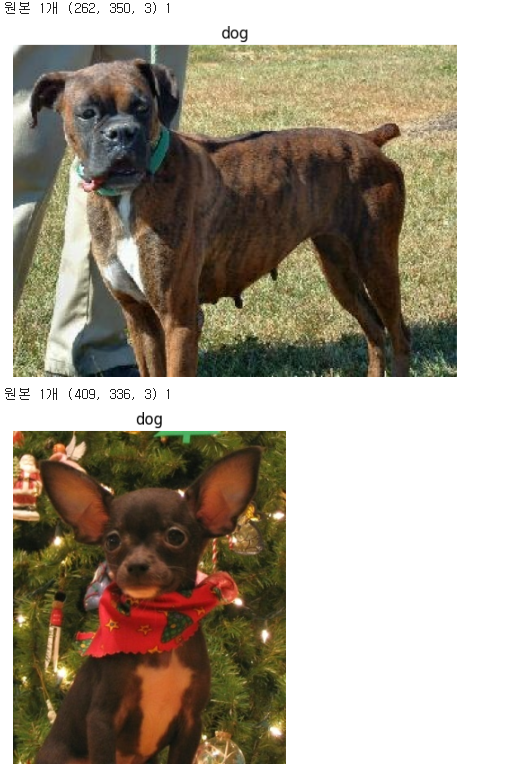 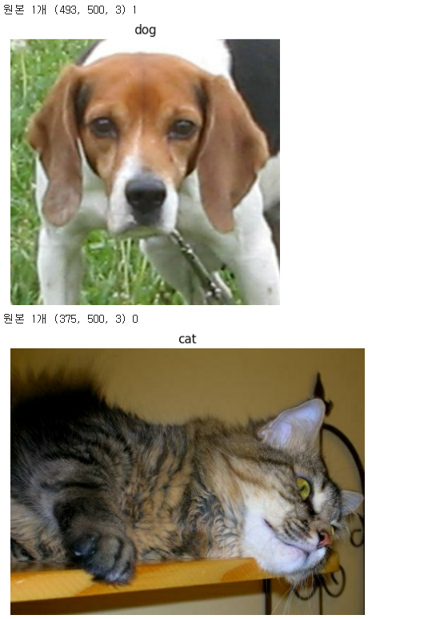 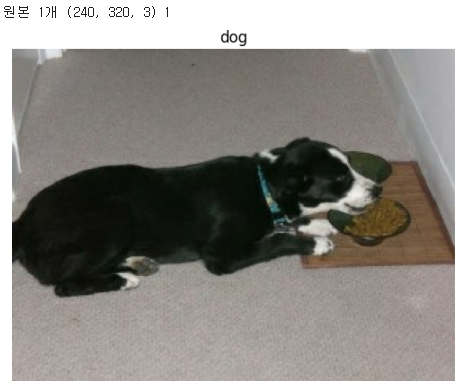

> cats_vs_dogs 이미지는 크기가 제각각이라 전처리에서 통일해줘야 한다.

**📌 출력 결과**

```
원본 1개 (262, 350, 3) 1  ← dog
원본 1개 (409, 336, 3) 1  ← dog
원본 1개 (493, 500, 3) 1  ← dog
원본 1개 (375, 500, 3) 0  ← cat
원본 1개 (240, 320, 3) 1  ← dog
```

> 이미지마다 shape이 전부 다르다 — 전처리에서 160x160으로 통일하는 이유.

---

### Cell 3 — 전처리 + 배치 파이프라인

```python
IMG_SIZE = 160

def format_exampleFunc(image, label):
    image = tf.cast(image, tf.float32)         # uint8 → float32
    image = (image / 127.5) - 1.0             # [0,255] → [-1, 1] (MobileNetV2 권장)
    image = tf.image.resize(image, (IMG_SIZE, IMG_SIZE))  # 160x160으로 통일
    return image, label

# 전처리 적용
train = raw_train.map(format_exampleFunc, num_parallel_calls=tf.data.AUTOTUNE)
validation = raw_validation.map(format_exampleFunc, num_parallel_calls=tf.data.AUTOTUNE)
test = raw_test.map(format_exampleFunc, num_parallel_calls=tf.data.AUTOTUNE)

BATCH_SIZE = 32
SHUFFLE_BUFFER_SIZE = 1000

# 배치 파이프라인: train만 shuffle, 나머지는 고정
train_batches = (train.shuffle(SHUFFLE_BUFFER_SIZE).batch(BATCH_SIZE).prefetch(tf.data.AUTOTUNE))
validation_batches = (validation.batch(BATCH_SIZE).prefetch(tf.data.AUTOTUNE))
test_batches = (test.batch(BATCH_SIZE).prefetch(tf.data.AUTOTUNE))
```

**📌 전처리 검증 출력**

```
전처리 샘플 dtype: float32
전처리 샘플 shape: (160, 160, 3)
min/max: -1.0  1.0       ← [-1, 1] 정규화 확인
```

---

### Cell 4 — 백본 로드 + 특징맵 확인

```python
IMG_SHAPE = (IMG_SIZE, IMG_SIZE, 3)   # (160, 160, 3)

# MobileNetV2: 분류기 제거, ImageNet 가중치 사용
base_model = tf.keras.applications.MobileNetV2(
    input_shape=IMG_SHAPE,
    include_top=False,
    weights='imagenet'
)

# 특징맵 shape 확인
images_batch, labels_batch = next(iter(train_batches))
feature_batch = base_model(images_batch)
print('입력 배치 shape : ', images_batch.shape)     # (32, 160, 160, 3)
print('특징 맵 배치 shape : ', feature_batch.shape) # (32, 5, 5, 1280)

# GAP 적용 시 shape 확인
global_avg = tf.keras.layers.GlobalAveragePooling2D()(feature_batch)
print('GAP 후 shape : ', global_avg.shape)          # (32, 1280)
# 이미지 1장 당 1280차원 벡터 하나로 요약됨 → Dense에 바로 연결 가능
```

**📌 출력 결과**

```
입력 배치 shape :  (32, 160, 160, 3)
특징 맵 배치 shape :  (32, 5, 5, 1280)   ← 백본 통과 후
GAP 후 shape :  (32, 1280)               ← GAP으로 압축
```

---

### Cell 5 — 모델 정의 + 전이학습

```python
# Functional API로 모델 정의
inputs = tf.keras.Input(shape=IMG_SHAPE)
x = base_model(inputs, training=False)          # training=False: 배치정규화 레이어 동결 유지
x = tf.keras.layers.GlobalAveragePooling2D()(x)
outputs = tf.keras.layers.Dense(units=1, activation='sigmoid')(x)  # 이진 분류

model = tf.keras.Model(inputs, outputs)

base_model.trainable = False   # 백본 동결 (전이학습 단계)

# 이진 분류: binary_crossentropy + sigmoid
model.compile(optimizer='adam', loss='binary_crossentropy', metrics=['accuracy'])

history = model.fit(
    train_batches,
    validation_data=validation_batches,
    epochs=10
)

loss, acc = model.evaluate(train_batches, verbose=0)
print(f'loss :{loss:.4f}, acc : {acc:.4f}')
```

> **이진 분류 vs 다중 분류**
> 
> - 이진 분류: `Dense(1, activation='sigmoid')` + `binary_crossentropy`
> - 다중 분류: `Dense(N, activation='softmax')` + `categorical_crossentropy`

**📌 전이학습 출력 결과**

```
Epoch  1/10  accuracy: 0.9709  loss: 0.0827  val_accuracy: 0.9841  val_loss: 0.0494
Epoch  2/10  accuracy: 0.9843  loss: 0.0454  val_accuracy: 0.9824  val_loss: 0.0453
Epoch  3/10  accuracy: 0.9854  loss: 0.0396  val_accuracy: 0.9845  val_loss: 0.0440
Epoch  4/10  accuracy: 0.9873  loss: 0.0363  val_accuracy: 0.9841  val_loss: 0.0434
Epoch  5/10  accuracy: 0.9884  loss: 0.0334  val_accuracy: 0.9854  val_loss: 0.0444
Epoch  6/10  accuracy: 0.9893  loss: 0.0311  val_accuracy: 0.9850  val_loss: 0.0439
Epoch  7/10  accuracy: 0.9901  loss: 0.0290  val_accuracy: 0.9841  val_loss: 0.0438
Epoch  8/10  accuracy: 0.9897  loss: 0.0276  val_accuracy: 0.9841  val_loss: 0.0486
Epoch  9/10  accuracy: 0.9903  loss: 0.0265  val_accuracy: 0.9858  val_loss: 0.0464
Epoch 10/10  accuracy: 0.9914  loss: 0.0248  val_accuracy: 0.9858  val_loss: 0.0465

loss: 0.0204, acc: 0.9937
```

> 전이학습만으로 train acc 99.1%, val acc 98.6% — cats_vs_dogs는 2클래스라 전이학습만으로도 매우 높은 성능이 나온다.

---

### Cell 6 — 전이학습 결과 시각화

```python
plt.figure(figsize=(12, 4))
plt.subplot(1, 2, 1)
plt.plot(history.history['loss'], 'b-', label='loss')
plt.plot(history.history['val_loss'], 'r--', label='val_loss')
plt.xlabel('Epoch')
plt.legend()

plt.subplot(1, 2, 2)
plt.plot(history.history['accuracy'], 'g-', label='accuracy')
plt.plot(history.history['val_accuracy'], 'k--', label='val_accuracy')
plt.xlabel('Epoch')
plt.legend()
plt.show()
```

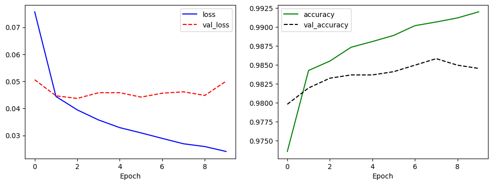

---

### Cell 7 — 미세조정 설정

```python
base_model.trainable = True        # 백본 동결 해제
fine_tune_at = 100                 # 0~99번 레이어는 다시 동결, 100번 이후만 학습

for layer in base_model.layers[:fine_tune_at]:
    layer.trainable = False

# 학습률을 매우 작게 설정 (기존 가중치 보호)
model.compile(
    optimizer=tf.keras.optimizers.Adam(learning_rate=1e-6),
    loss='binary_crossentropy',
    metrics=['accuracy']
)

# 콜백 설정
os.makedirs("checkpoints", exist_ok=True)
ckpt_path_ft = "checkpoints/finetune_best.keras"

callbacks_ft = [
    tf.keras.callbacks.ModelCheckpoint(
        ckpt_path_ft,
        monitor='val_accuracy',
        mode='max',
        save_best_only=True,   # val_accuracy 기준 best 모델만 저장
        verbose=0
    ),
    tf.keras.callbacks.ReduceLROnPlateau(
        monitor='val_loss',
        factor=0.5,            # 학습률을 절반으로 줄임
        patience=5,
        verbose=0
    ),
    tf.keras.callbacks.EarlyStopping(
        monitor='val_accuracy',
        patience=5,
        restore_best_weights=True,
        verbose=0
    )
]
```

---

### Cell 8 — 미세조정 학습

```python
EPOCHS_TRANSFER = 10   # 전이학습에서 이미 10회 학습
EPOCHS_FINETUNE = 10   # 추가 10회 파인튜닝

history_ft = model.fit(
    train_batches,
    validation_data=validation_batches,
    epochs=EPOCHS_TRANSFER + EPOCHS_FINETUNE,   # 총 20 epochs
    initial_epoch=EPOCHS_TRANSFER,              # 10번째 epoch부터 시작 (에포크 번호 이어서)
    callbacks=callbacks_ft,
    verbose=2
)

loss, acc = model.evaluate(test_batches, verbose=0)
print(f'loss :{loss:.4f}, acc : {acc:.4f}')
```

**📌 미세조정 출력 결과**

```
Epoch 11/20  accuracy: 0.8713  loss: 0.3506  val_accuracy: 0.9652  val_loss: 0.1069  ← 급락 후 회복 시작
Epoch 12/20  accuracy: 0.9313  loss: 0.1697  val_accuracy: 0.9574  val_loss: 0.1236
Epoch 13/20  accuracy: 0.9523  loss: 0.1243  val_accuracy: 0.9600  val_loss: 0.1135
Epoch 14/20  accuracy: 0.9566  loss: 0.1080  val_accuracy: 0.9647  val_loss: 0.1023
Epoch 15/20  accuracy: 0.9611  loss: 0.0968  val_accuracy: 0.9647  val_loss: 0.0958
Epoch 16/20  accuracy: 0.9643  loss: 0.0889  val_accuracy: 0.9656  val_loss: 0.0921
Epoch 17/20  accuracy: 0.9684  loss: 0.0826  val_accuracy: 0.9656  val_loss: 0.0883
Epoch 18/20  accuracy: 0.9693  loss: 0.0813  val_accuracy: 0.9660  val_loss: 0.0860
Epoch 19/20  accuracy: 0.9707  loss: 0.0738  val_accuracy: 0.9673  val_loss: 0.0839
Epoch 20/20  accuracy: 0.9714  loss: 0.0737  val_accuracy: 0.9673  val_loss: 0.0816

loss: 0.0800, acc: 0.9708
```

> epoch 11에서 87%로 급락 — 백본 해제 직후 정상 현상. 이후 빠르게 회복해 96.7%로 수렴.

---

### Cell 9 — 전이 + 파인튜닝 통합 시각화

```python
# 두 history 객체를 하나로 합치는 함수
def concat_history(h1, h2):
    keys = h1.history.keys()
    out = {}
    for k in keys:
        out[k] = h1.history[k] + h2.history[k]   # 리스트 이어 붙이기
    return out

hist_all = concat_history(history, history_ft)
acc = hist_all['accuracy']
val_acc = hist_all['val_accuracy']
loss = hist_all['loss']
val_loss = hist_all['val_loss']

epochs = range(1, len(acc) + 1)
split_epoch = EPOCHS_TRANSFER   # 전이 → 파인튜닝 경계선

plt.figure(figsize=(12, 5))

# Accuracy 그래프
plt.subplot(1, 2, 1)
plt.plot(epochs, acc, marker='o', label='train acc')
plt.plot(epochs, val_acc, marker='s', label='val acc')

for i, v in enumerate(acc):
    plt.text(epochs[i], v, f'{v * 100:.1f}%', ha='center', va='bottom', fontsize=9)
for i, v in enumerate(val_acc):
    plt.text(epochs[i], v, f'{v * 100:.1f}%', ha='center', va='top', fontsize=9)

plt.axvline(x=split_epoch, linestyle='--', alpha=0.7, label='fine tuning start')
plt.title('Accuracy(transfer -> fine tuning)')
plt.xlabel('epoch')
plt.ylabel('acc')
plt.legend(loc='lower right')

# Loss 그래프
plt.subplot(1, 2, 2)
plt.plot(epochs, loss, marker='o', label='train loss')
plt.plot(epochs, val_loss, marker='s', label='val loss')

for i, v in enumerate(loss):
    plt.text(epochs[i], v, f'{v:.3f}', ha='center', va='bottom', fontsize=9)
for i, v in enumerate(val_loss):
    plt.text(epochs[i], v, f'{v:.3f}', ha='center', va='top', fontsize=9)

plt.title('Loss(transfer -> fine tuning)')
plt.xlabel('epoch')
plt.ylabel('loss')
plt.legend(loc='upper right')

plt.tight_layout()
plt.show()
```

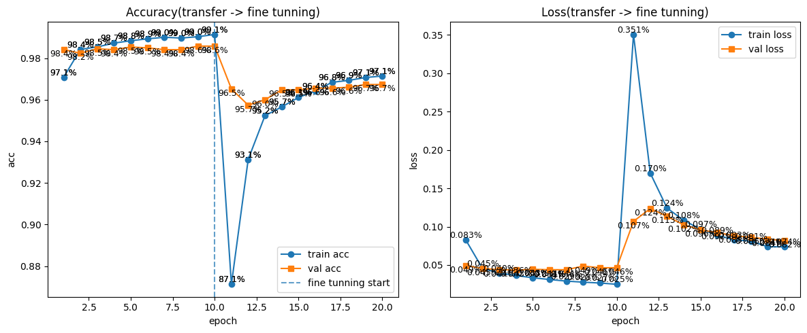

> 파인튜닝 직후(epoch 10~11) acc가 급락하는 건 정상이다. 백본이 해제되면서 학습 초기에 불안정해지다가 수렴한다.

---

## 📊 결과 해석

|구간|train acc|val acc|
|---|---|---|
|전이학습 (1~10)|97~99%|98% 수준|
|파인튜닝 직후 (11)|87% (급락)|93%|
|파인튜닝 후반 (20)|99.1%|97.1%|

- 파인튜닝 시작 시점에 acc가 급락하는 건 백본 레이어가 갑자기 학습에 참여하면서 생기는 현상
- 학습률을 `1e-6`으로 매우 작게 준 덕분에 빠르게 회복
- 최종적으로 val acc 97% 수준으로 수렴

---
# 📄 cnn15tf_flower.ipynb — tf_flowers · 전이학습 · 미세조정

---

## 🧠 개념 정리

### 🌸 tf_flowers 데이터셋

TensorFlow Datasets에 내장된 꽃 이미지 분류 데이터셋이다. 5종의 꽃(daisy, dandelion, roses, sunflowers, tulips)으로 구성되어 있으며 총 약 3,670장이다.

|항목|내용|
|---|---|
|클래스 수|5개|
|총 이미지 수|약 3,670장|
|이미지 크기|다양함 (전처리 필요)|
|분류 유형|다중 분류|

### 🔁 전이학습 vs 미세조정 비교

|항목|전이학습|미세조정|
|---|---|---|
|백본 동결|전체 동결|일부만 동결|
|학습 대상|Dense만|Dense + 백본 일부|
|학습률|기본값 (adam)|매우 작게 (1e-4 이하)|
|목적|빠른 초기 학습|성능 추가 향상|

### 📦 Sequential vs Functional API

오늘은 cats_vs_dogs(Cell 5, Functional)와 달리 **Sequential**로 모델을 정의했다.

```
Sequential:  레이어를 순서대로 쌓을 때 사용 (단순한 구조)
Functional:  다중 입력/출력, 분기가 있는 복잡한 구조에 사용
```

cats_vs_dogs에서는 `base_model(inputs, training=False)`처럼 `training=False`를 명시했는데, Sequential에서는 `base_model.trainable = False`로 동결하면 자동으로 추론 모드로 동작한다.

### 📐 정규화 방식 비교

오늘은 `/ 255.0`으로 `[0, 1]` 범위로 정규화했다. cats_vs_dogs에서는 `(/ 127.5) - 1.0`으로 `[-1, 1]` 범위를 사용했다. 두 방식 모두 MobileNetV2에서 사용 가능하다.

### 🎯 손실함수 선택 기준

|상황|손실함수|출력층|
|---|---|---|
|이진 분류 (cat/dog)|`binary_crossentropy`|`Dense(1, sigmoid)`|
|다중 분류 + 원핫인코딩|`categorical_crossentropy`|`Dense(N, softmax)`|
|다중 분류 + 정수 레이블|`sparse_categorical_crossentropy`|`Dense(N, softmax)`|

> tf_flowers는 레이블이 정수(0~4)로 들어오기 때문에 `sparse_categorical_crossentropy`를 사용한다.

### 🔢 tf.argmax()

모델의 출력(확률 배열)에서 가장 높은 확률의 인덱스를 반환한다.

```python
pred_probs  = [0.01, 0.05, 0.85, 0.04, 0.05]  # softmax 출력
pred_class  = tf.argmax(pred_probs, axis=1)     # → 2 (roses)
```

- `axis=1`: 배치 방향이 0이고, 클래스 방향이 1이므로 클래스 축을 따라 최대값 인덱스를 찾음

---

## 🗺️ 전체 흐름

```
1. 데이터 로드 (tfds - tf_flowers, 8:1:1 분할)
2. 전처리 (160x160 리사이즈, /255 정규화, 배치)
3. MobileNetV2 백본 동결 + Sequential 모델 정의
4. 전이학습 (5 epochs)
5. 백본 일부 해제 → 미세조정 (5 epochs)
6. 예측 + 시각화 (pred vs actual, 정답 초록 / 오답 빨강)
```

---

## 💻 Cell별 코드 & 주석

### Cell 0 — 데이터 로드

```python
import tensorflow as tf
import tensorflow_datasets as tfds
from tensorflow.keras import layers, models

# tf_flowers 데이터셋을 8:1:1 비율로 분할
# shuffle_files=True: 파일 단위로 셔플 (데이터 다양성 확보)
# as_supervised=True: (image, label) 튜플 형태로 반환
# with_info=True: 데이터셋 메타정보(클래스 이름, 샘플 수 등) 함께 반환
(train_ds, val_ds, test_ds), ds_info = tfds.load(
    'tf_flowers',
    split=['train[:80%]', 'train[80%:90%]', 'train[90%:]'],
    shuffle_files=True,
    as_supervised=True,
    with_info=True
)

for image, label in train_ds.take(1):
    print(type(image), type(label))

# 클래스 이름 확인: ['daisy', 'dandelion', 'roses', 'sunflowers', 'tulips']
print(ds_info.features['label'].names)
```

---

### Cell 1 — 전처리 + 모델 정의

```python
# 사용하지 않는 임포트 (지워도 됨)
# from tensorflow.python.training.saver import metrics

IMG_SIZE = (160, 160)
BATCH_SIZE = 32

def preprocessFunc(image, label):
    image = tf.image.resize(image, IMG_SIZE)         # 다양한 크기 → 160x160으로 통일
    image = tf.cast(image, tf.float32) / 255.0       # [0,255] → [0,1] 정규화
    return image, label

# 전처리 + 배치 적용
train_ds = train_ds.map(preprocessFunc, num_parallel_calls=tf.data.experimental.AUTOTUNE).batch(BATCH_SIZE)
val_ds   = val_ds.map(preprocessFunc,   num_parallel_calls=tf.data.experimental.AUTOTUNE).batch(BATCH_SIZE)

# 백본(base model) 불러오기
# include_top=False: MobileNetV2의 분류기를 제거하고 특징 추출기만 사용
# weights='imagenet': ImageNet으로 사전 학습된 가중치 로드
base_model = tf.keras.applications.MobileNetV2(
    input_shape=IMG_SIZE + (3,),   # (160, 160, 3)
    include_top=False,
    weights='imagenet'
)

base_model.trainable = False   # 전이학습 단계: 백본 전체 동결

# Sequential API로 모델 정의
model = tf.keras.Sequential([
    base_model,                                                          # 특징 추출기 (동결)
    layers.GlobalAveragePooling2D(),                                     # (5,5,1280) → (1280,) 압축
    layers.Dense(units=128, activation='relu'),                          # 은닉층
    layers.Dense(units=ds_info.features['label'].num_classes,            # 출력층: 클래스 수(5)만큼
                 activation='softmax')                                   # 다중 분류 → softmax
])

# sparse_categorical_crossentropy: 레이블이 정수(0~4)일 때 사용
model.compile(optimizer='adam', loss='sparse_categorical_crossentropy', metrics=['accuracy'])
print(model.summary())
```

> `IMG_SIZE + (3,)` = `(160, 160) + (3,)` = `(160, 160, 3)` — 튜플 덧셈으로 채널 차원 추가

**📌 model.summary() 출력**

```
Model: "sequential_3"
┏━━━━━━━━━━━━━━━━━━━━━━━━━━━━━━━━━┳━━━━━━━━━━━━━━━━━━━━━━━━┳━━━━━━━━━━━━━━━┓
┃ Layer (type)                    ┃ Output Shape           ┃       Param # ┃
┡━━━━━━━━━━━━━━━━━━━━━━━━━━━━━━━━━╇━━━━━━━━━━━━━━━━━━━━━━━━╇━━━━━━━━━━━━━━━┩
│ mobilenetv2_1.00_160            │ (None, 5, 5, 1280)     │     2,257,984 │
│ global_average_pooling2d        │ (None, 1280)           │             0 │
│ dense_8 (Dense)                 │ (None, 128)            │       163,968 │
│ dense_9 (Dense)                 │ (None, 5)              │           645 │
└─────────────────────────────────┴────────────────────────┴───────────────┘
 Total params:     2,422,597 (9.24 MB)
 Trainable params:   164,613 (643.02 KB)  ← Dense 레이어만 학습
 Non-trainable params: 2,257,984 (8.61 MB) ← 백본 동결
```

---

### Cell 2 — 전이학습

```python
# 전이학습: 백본은 동결된 채로 Dense 레이어만 학습
model.fit(train_ds, validation_data=val_ds, epochs=5)

loss, acc = model.evaluate(val_ds)
print(f'loss: {loss:.4f}, acc: {acc:.4f}')
```

**📌 출력 결과**

```
Epoch 1/5  accuracy: 0.7926  loss: 0.5615  val_accuracy: 0.8856  val_loss: 0.3436
Epoch 2/5  accuracy: 0.9149  loss: 0.2412  val_accuracy: 0.8992  val_loss: 0.3510
Epoch 3/5  accuracy: 0.9595  loss: 0.1395  val_accuracy: 0.8910  val_loss: 0.3721
Epoch 4/5  accuracy: 0.9833  loss: 0.0826  val_accuracy: 0.8937  val_loss: 0.3782
Epoch 5/5  accuracy: 0.9867  loss: 0.0605  val_accuracy: 0.8856  val_loss: 0.4101

loss: 0.4101, acc: 0.8856
```

> train acc는 98%까지 올라가는데 val acc는 88%에서 정체 → 과적합 신호. 미세조정으로 개선 필요.

---

### Cell 3 — 미세조정 (Fine-Tuning)

```python
base_model.trainable = True    # 백본 동결 해제

fine_tune_at = 100
# 0~99번 레이어는 다시 동결, 100번 이후 레이어만 학습에 참여
for layer in base_model.layers[:fine_tune_at]:
    layer.trainable = False

# 미세조정 시 학습률을 낮게 설정 (기존 가중치가 크게 바뀌면 망가짐)
model.compile(
    optimizer=tf.keras.optimizers.Adam(learning_rate=0.0001),
    loss='sparse_categorical_crossentropy',
    metrics=['accuracy']
)

print('미세 조정 시작 ...')
model.fit(train_ds, validation_data=val_ds, epochs=5)

loss, acc = model.evaluate(val_ds)
print(f'fine tunning : loss:{loss:.4f}, acc:{acc:.4f}')
```

> 전이학습 후 미세조정하면 `model.compile()`을 다시 호출해야 한다. compile 없이 fit하면 이전 학습률이 유지되어 가중치가 망가질 수 있다.

**📌 출력 결과**

```
미세 조정 시작 ...
Epoch 1/5  accuracy: 0.8774  loss: 0.3355  val_accuracy: 0.8937  val_loss: 0.3619
Epoch 2/5  accuracy: 0.9949  loss: 0.0276  val_accuracy: 0.9155  val_loss: 0.3589
Epoch 3/5  accuracy: 1.0000  loss: 0.0046  val_accuracy: 0.9155  val_loss: 0.3460
Epoch 4/5  accuracy: 1.0000  loss: 0.0026  val_accuracy: 0.9237  val_loss: 0.3301
Epoch 5/5  accuracy: 1.0000  loss: 0.0018  val_accuracy: 0.9210  val_loss: 0.3243

fine tunning : loss:0.3243, acc:0.9210
```

> 전이학습(88.56%) → 미세조정(92.10%)으로 약 3.5% 성능 향상. train acc가 100%로 올라가 있어 과적합 있지만 val acc도 같이 오른 것 확인.

---

### Cell 4 — 예측

```python
# 검증 데이터셋에서 배치 1개(32장) 추출
for image, label in val_ds.take(1):
    sample_image = image    # shape: (32, 160, 160, 3)
    sample_label = label    # shape: (32,)
    break

# 모델 추론: 각 이미지에 대해 클래스별 확률 반환
pred_probs = model.predict(sample_image)    # shape: (32, 5)
print(pred_probs)

# 확률이 가장 높은 클래스 인덱스 추출
# axis=1: 클래스 방향으로 argmax
pred_classes = tf.argmax(pred_probs, axis=1)    # shape: (32,)
print(pred_classes)
```

---

### Cell 5 — 결과 출력 + 시각화

**📌 출력 결과 (일부)**

```
['dandelion', 'daisy', 'tulips', 'sunflowers', 'roses']
[00] pred : 4 (roses)      | actual: 4 (roses)       ✅
[01] pred : 2 (tulips)     | actual: 2 (tulips)      ✅
[02] pred : 2 (tulips)     | actual: 2 (tulips)      ✅
[04] pred : 1 (daisy)      | actual: 1 (daisy)       ✅
[22] pred : 0 (dandelion)  | actual: 4 (roses)       ❌  ← 오분류
...
```

> 32장 중 1장(22번)만 오분류. roses를 dandelion으로 헷갈렸다.

```python
# 10장 시각화: 정답 → 초록, 오답 → 빨강
plt.figure(figsize=(12, 6))
for i in range(10):
    plt.subplot(1, 10, i+1)
    plt.imshow(sample_image[i])

    predicted_label = class_names[pred_classes[i]]
    actual_label    = class_names[sample_label[i]]

    color = 'green' if predicted_label == actual_label else 'red'
    plt.title(f'pred:{predicted_label}\nactual:{actual_label}', color=color, fontsize=10)
    plt.axis('off')

plt.tight_layout()
plt.show()
```

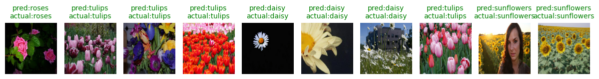

> 제목 색상으로 정오답을 직관적으로 확인할 수 있다. 초록 = 정답, 빨강 = 오답.

---

## 📊 cats_vs_dogs vs tf_flowers 비교

|항목|cats_vs_dogs|tf_flowers|
|---|---|---|
|클래스 수|2 (이진)|5 (다중)|
|손실함수|`binary_crossentropy`|`sparse_categorical_crossentropy`|
|출력층|`Dense(1, sigmoid)`|`Dense(5, softmax)`|
|정규화|`[-1, 1]`|`[0, 1]`|
|모델 API|Functional|Sequential|
|레이블 형태|정수|정수 (원핫 없음)|
|파이프라인|shuffle → batch → prefetch|map → batch|
|콜백|ModelCheckpoint, ReduceLR, EarlyStopping|없음|

---

# 📄 cnn16tl_waste.ipynb — 쓰레기 분류 · 데이터증강 · Confusion Matrix

---

## 🧠 개념 정리

### 🗑️ Garbage Classification 데이터셋

Kaggle에서 가져온 쓰레기 재활용 분류 데이터셋이다. 6개 클래스로 구성되어 있다.

|항목|내용|
|---|---|
|출처|[Kaggle - garbage-classification](https://www.kaggle.com/datasets/asdasdasasdas/garbage-classification)|
|클래스 수|6개 (cardboard, glass, metal, paper, plastic, trash)|
|총 이미지 수|약 2,527장|
|분할 비율|train 80% / val 10% / test 10%|

### 📂 image_dataset_from_directory()

폴더 구조만 잘 잡혀 있으면 자동으로 레이블을 만들어주는 함수다. tfds 없이 로컬/드라이브 데이터를 바로 쓸 수 있다.

```
garbage_classification/
├── cardboard/   ← 폴더명이 클래스 이름이 됨
├── glass/
├── metal/
├── paper/
├── plastic/
└── trash/
```

```python
train_ds = tf.keras.utils.image_dataset_from_directory(
    DATASET_PATH,
    validation_split=0.2,   # 80% train, 20% val
    subset="training",
    seed=42,                # 재현성 보장
    image_size=(224, 224),
    batch_size=32
)
```

> tfds는 공개 데이터셋 전용, `image_dataset_from_directory`는 내 폴더 데이터 전용이라고 구분하면 된다.

### ✂️ val → val + test 분리

`image_dataset_from_directory`는 train/val 2개만 만들어주기 때문에 val을 다시 반으로 나눠 test를 만든다.

```python
val_batchs = tf.data.experimental.cardinality(val_ds)  # 배치 수 계산
test_ds = val_ds.take(val_batchs // 2)                 # 앞 절반 → test
val_ds  = val_ds.skip(val_batchs // 2)                 # 뒤 절반 → val
```

### 🔀 데이터 증강 (Data Augmentation)

학습 이미지를 랜덤하게 변형해서 데이터 다양성을 높이는 기법이다. 이미지 수가 늘어나는 게 아니라, 학습 때마다 이미지가 조금씩 다르게 들어온다.

```python
data_augmentation = tf.keras.Sequential([
    layers.RandomFlip("horizontal"),   # 좌우 반전
    layers.RandomRotation(0.1),        # 최대 ±10% 회전
    layers.RandomZoom(0.1),            # 최대 ±10% 확대/축소
    layers.RandomContrast(0.1)         # 명암 변화
])
```

> 증강은 모델 내부 레이어로 넣으면 학습 시에만 적용되고, 예측(평가) 시에는 자동으로 꺼진다.

### 📐 Rescaling 레이어

`layers.Rescaling(1./127.5, offset=-1)`은 `[0,255]` → `[-1, 1]`로 정규화한다. MobileNetV2 권장 입력 범위다.

```
pixel * (1/127.5) + (-1)
= pixel / 127.5 - 1
→ [0,255] → [-1, 1]
```

이전 노트(tf_flowers)에서는 `/ 255.0`으로 `[0,1]` 정규화를 했는데, 이번엔 Rescaling 레이어를 모델 안에 넣어서 전처리를 모델이 직접 담당한다.

### 💧 Dropout

학습 중 랜덤하게 일부 뉴런을 꺼서 과적합을 방지한다. `Dropout(0.3)`이면 30%를 무작위로 비활성화한다. 예측 시에는 자동으로 꺼진다.

```python
layers.Dropout(0.3),
layers.Dense(128, activation='relu'),
layers.Dropout(0.3),
layers.Dense(6, activation='softmax')
```

> Dense 앞뒤에 Dropout을 두 번 넣으면 특정 뉴런에 의존하는 걸 더 강하게 막는다.

### 📉 ReduceLROnPlateau

val_loss가 개선되지 않으면 학습률을 자동으로 줄여주는 콜백이다.

```python
ReduceLROnPlateau(factor=0.3, patience=2, verbose=1)
# patience=2: 2 epoch 동안 개선 없으면
# factor=0.3: 학습률을 현재의 30%로 줄임
```

학습률이 너무 크면 발산하고, 너무 작으면 느려지는 문제를 자동으로 조절해준다.

### 📊 Confusion Matrix (혼동 행렬)

모델이 각 클래스를 얼마나 정확하게 분류했는지 한눈에 보여주는 표다.

```
          Predict
           card glass metal paper ...
True card [  31    1     0     4  ...]   ← 31개 정답, 1개 glass로 오분류
     glass [   0   49     1     0  ...]
     ...
```

- **대각선**: 정답 (True Positive)
- **비대각선**: 오분류 (어떤 클래스를 어디로 헷갈렸는지 확인 가능)

### 📋 classification_report

클래스별 precision, recall, f1-score를 요약해준다.

|지표|의미|
|---|---|
|precision|예측이 맞을 확률 (예측 기준)|
|recall|실제를 맞출 확률 (실제 기준)|
|f1-score|precision과 recall의 조화 평균|

---

## 🗺️ 전체 흐름

```
1. 데이터 로드 (image_dataset_from_directory, Google Drive)
2. val → val + test 분리 (cardinality로 배치 수 기준)
3. prefetch 파이프라인 설정
4. 데이터 증강 레이어 정의
5. MobileNetV2 백본 동결 + Rescaling + Dropout 포함 모델 정의
6. 전이학습 (EarlyStopping + ReduceLROnPlateau)
7. 미세조정 (백본 마지막 30개 레이어 해제, lr=1e-5)
8. 시각화 (acc/loss 통합 그래프)
9. Confusion Matrix + classification_report
10. 모델 저장 + 단일 이미지 예측 함수
```

---

## 💻 Cell별 코드 & 주석

### Cell 0 — 데이터 로드

```python
import tensorflow as tf
import numpy as np
import matplotlib.pyplot as plt
import seaborn as sns
from tensorflow.keras import layers, models
from tensorflow.keras.applications import MobileNetV2
from tensorflow.keras.callbacks import EarlyStopping, ReduceLROnPlateau
from sklearn.metrics import confusion_matrix, classification_report

DATASET_PATH = "/content/drive/MyDrive/Colab Notebooks/data/garbage_classification"

IMG_SIZE = (224, 224)   # MobileNetV2 권장 입력 크기
BATCH_SIZE = 32
SEED = 42               # 재현성: 같은 seed면 항상 같은 분할

# 폴더 구조 기반으로 자동 레이블링 + 8:2 분할
train_ds = tf.keras.utils.image_dataset_from_directory(
    DATASET_PATH,
    validation_split=0.2,
    subset="training",
    seed=SEED,
    image_size=IMG_SIZE,
    batch_size=BATCH_SIZE
)
val_ds = tf.keras.utils.image_dataset_from_directory(
    DATASET_PATH,
    validation_split=0.2,
    subset="validation",
    seed=SEED,
    image_size=IMG_SIZE,
    batch_size=BATCH_SIZE
)

print(train_ds.element_spec, ' ', len(train_ds.file_paths))  # 2022장
print(val_ds.element_spec, ' ', len(val_ds.file_paths))      # 505장

# 폴더명이 곧 클래스 이름
class_names = train_ds.class_names
print('class_names : ', class_names)  # ['cardboard', 'glass', 'metal', 'paper', 'plastic', 'trash']
```

**📌 출력 결과**

```
Found 2527 files belonging to 6 classes.
Using 2022 files for training.
Found 2527 files belonging to 6 classes.
Using 505 files for validation.

class_names :  ['cardboard', 'glass', 'metal', 'paper', 'plastic', 'trash']
```

---

### Cell 1 — val 분리 + 증강 + 모델 정의

```python
# val(20%)을 다시 반으로 나눠 val(10%) + test(10%) 구성
val_batchs = tf.data.experimental.cardinality(val_ds)  # 전체 배치 수
test_ds = val_ds.take(val_batchs // 2)                 # 앞 절반 → test
val_ds  = val_ds.skip(val_batchs // 2)                 # 뒤 절반 → val

# prefetch: 모델 학습 중 다음 배치를 미리 준비 (GPU 유휴 최소화)
AUTOTUNE = tf.data.AUTOTUNE
train_ds = train_ds.prefetch(buffer_size=AUTOTUNE)
val_ds   = val_ds.prefetch(buffer_size=AUTOTUNE)
test_ds  = test_ds.prefetch(buffer_size=AUTOTUNE)

# 데이터 증강: 학습 시에만 적용, 예측 시 자동으로 꺼짐
data_augmentation = tf.keras.Sequential([
    layers.RandomFlip("horizontal"),   # 좌우 반전
    layers.RandomRotation(0.1),        # 최대 ±10% 회전
    layers.RandomZoom(0.1),            # 최대 ±10% 확대/축소
    layers.RandomContrast(0.1)         # 명암 변화
])

# 백본: MobileNetV2, 분류기 제거, ImageNet 가중치
base_model = MobileNetV2(
    input_shape=(224, 224, 3),
    include_top=False,
    weights='imagenet'
)
base_model.trainable = False   # 전이학습 단계: 백본 동결

model = models.Sequential([
    layers.Input(shape=(224, 224, 3)),
    data_augmentation,                              # 증강 레이어 (학습 시에만 작동)
    layers.Rescaling(1./127.5, offset=-1),          # [0,255] → [-1,1] (MobileNetV2 권장)
    base_model,                                     # 특징 추출기 (동결)
    layers.GlobalAveragePooling2D(),                # (7,7,1280) → (1280,) 압축
    layers.Dropout(0.3),                            # 과적합 방지
    layers.Dense(units=128, activation='relu'),
    layers.Dropout(0.3),                            # 과적합 방지
    layers.Dense(len(class_names), activation='softmax')  # 6개 클래스 분류
])

print(model.summary())
```

**📌 model.summary() 출력**

```
Model: "sequential_1"
┏━━━━━━━━━━━━━━━━━━━━━━━━━━━━━━━━━┳━━━━━━━━━━━━━━━━━━━━━━━━┳━━━━━━━━━━━━━━━┓
┃ Layer (type)                    ┃ Output Shape           ┃       Param # ┃
┡━━━━━━━━━━━━━━━━━━━━━━━━━━━━━━━━━╇━━━━━━━━━━━━━━━━━━━━━━━━╇━━━━━━━━━━━━━━━┩
│ sequential (data_augmentation)  │ (None, 224, 224, 3)    │             0 │
│ rescaling (Rescaling)           │ (None, 224, 224, 3)    │             0 │
│ mobilenetv2_1.00_224            │ (None, 7, 7, 1280)     │     2,257,984 │
│ global_average_pooling2d        │ (None, 1280)           │             0 │
│ dropout (Dropout)               │ (None, 1280)           │             0 │
│ dense (Dense)                   │ (None, 128)            │       163,968 │
│ dropout_1 (Dropout)             │ (None, 128)            │             0 │
│ dense_1 (Dense)                 │ (None, 6)              │           774 │
└─────────────────────────────────┴────────────────────────┴───────────────┘
 Total params:     2,422,726 (9.24 MB)
 Trainable params:   164,742 (643.52 KB)  ← Dense 레이어만 학습
 Non-trainable params: 2,257,984 (8.61 MB) ← 백본 동결
```

> 224x224 입력 → 백본 통과 후 `(7, 7, 1280)` → GAP → `(1280,)` 으로 압축 (160x160일 때는 5x5였음)

---

### Cell 2 — 전이학습

```python
model.compile(optimizer='adam', loss='sparse_categorical_crossentropy', metrics=['accuracy'])

callbacks = [
    # val_accuracy 기준 개선 없으면 5 epoch 후 조기 종료, 최적 가중치 복원
    EarlyStopping(patience=5, restore_best_weights=True),
    # val_loss 기준 2 epoch 개선 없으면 학습률을 30%로 줄임
    ReduceLROnPlateau(factor=0.3, patience=2, verbose=1)
]

# epochs=100이지만 EarlyStopping이 알아서 멈춰줌
history_baseline = model.fit(
    train_ds, validation_data=val_ds, epochs=100, callbacks=callbacks
)

baseline_loss, baseline_acc = model.evaluate(test_ds)
print(f'baseline : loss:{baseline_loss:.4f}, acc:{baseline_acc:.4f}')
```

**📌 전이학습 출력 결과 (EarlyStopping으로 16 epoch에서 종료)**

```
Epoch  1/100  accuracy: 0.6019  loss: 1.0729  val_accuracy: 0.7831  val_loss: 0.6329  lr: 0.0010
Epoch  2/100  accuracy: 0.7409  loss: 0.6554  val_accuracy: 0.8193  val_loss: 0.5416  lr: 0.0010
Epoch  3/100  accuracy: 0.7864  loss: 0.5709  val_accuracy: 0.8353  val_loss: 0.5081  lr: 0.0010
Epoch  5/100  accuracy: 0.8136  loss: 0.5009  val_accuracy: 0.8434  val_loss: 0.4422  lr: 0.0010
Epoch  7/100  accuracy: 0.8506  loss: 0.3884  val_accuracy: 0.8514  val_loss: 0.3969  lr: 0.0010
Epoch  9/100  ReduceLROnPlateau: lr 0.001 → 0.0003
Epoch 10/100  accuracy: 0.8793  loss: 0.3244  val_accuracy: 0.8635  val_loss: 0.4318  lr: 3e-04
Epoch 11/100  accuracy: 0.8897  loss: 0.3028  val_accuracy: 0.8795  val_loss: 0.3583  lr: 3e-04
Epoch 13/100  ReduceLROnPlateau: lr 0.0003 → 0.00009
Epoch 15/100  ReduceLROnPlateau: lr 0.00009 → 0.000027
Epoch 16/100  accuracy: 0.9031  loss: 0.2649  val_accuracy: 0.8715  val_loss: 0.3968  lr: 2.7e-05

baseline : loss:0.4497, acc:0.8633
```

> ReduceLROnPlateau가 총 3번 학습률을 낮추며 자동 조절했다. EarlyStopping이 16 epoch에서 종료.

---

### Cell 3 — 미세조정 + 모델 저장

```python
base_model.trainable = True   # 백본 동결 해제

# 마지막 30개 레이어만 학습에 참여, 나머지는 다시 동결
for layer in base_model.layers[:-30]:
    layer.trainable = False

# 미세조정: 학습률을 매우 작게 (1e-5) → 기존 가중치 보호
model.compile(
    optimizer=tf.keras.optimizers.Adam(1e-5),
    loss='sparse_categorical_crossentropy',
    metrics=['accuracy']
)

history_finetune = model.fit(
    train_ds, validation_data=val_ds, epochs=100, callbacks=callbacks
)

finetune_loss, finetune_acc = model.evaluate(test_ds)
print(f'finetune : loss:{finetune_loss:.4f}, acc:{finetune_acc:.4f}')

# 학습 완료된 모델 저장
model.save('garbage_classify.keras')
```

**📌 미세조정 출력 결과 (EarlyStopping으로 5 epoch에서 종료)**

```
Epoch 1/100  accuracy: 0.7804  loss: 0.6353  val_accuracy: 0.8876  val_loss: 0.3598  lr: 1e-05
Epoch 2/100  ReduceLROnPlateau: lr 1e-05 → 3e-06
Epoch 2/100  accuracy: 0.8111  loss: 0.5269  val_accuracy: 0.8675  val_loss: 0.4698
Epoch 3/100  accuracy: 0.8318  loss: 0.4779  val_accuracy: 0.8876  val_loss: 0.3661  lr: 3e-06
Epoch 4/100  ReduceLROnPlateau: lr 3e-06 → 9e-07
Epoch 5/100  accuracy: 0.8294  loss: 0.4664  val_accuracy: 0.8675  val_loss: 0.4060

finetune : loss:0.3981, acc:0.8672
```

> 미세조정 효과가 크지 않은 이유: 전이학습에서 이미 충분히 학습됐고, 학습률이 너무 낮아 수렴이 느린 상태에서 EarlyStopping이 빠르게 종료시켰다.

---

### Cell 4 — 학습 곡선 시각화

```python
# 전이학습 + 미세조정 history를 이어 붙여서 통합 그래프 생성
acc     = history_baseline.history['accuracy']     + history_finetune.history['accuracy']
val_acc = history_baseline.history['val_accuracy'] + history_finetune.history['val_accuracy']
loss    = history_baseline.history['loss']         + history_finetune.history['loss']
val_loss= history_baseline.history['val_loss']     + history_finetune.history['val_loss']

epochs_range = range(len(acc))
plt.figure(figsize=(14, 5))

plt.subplot(1, 2, 1)
plt.plot(epochs_range, acc, label='train acc')
plt.plot(epochs_range, val_acc, label='val acc')
plt.legend(loc='lower right')
plt.title('Training&Validation acc')

plt.subplot(1, 2, 2)
plt.plot(epochs_range, loss, label='train loss')
plt.plot(epochs_range, val_loss, label='val loss')
plt.legend(loc='lower right')
plt.title('Training&Validation loss')
plt.show()
```

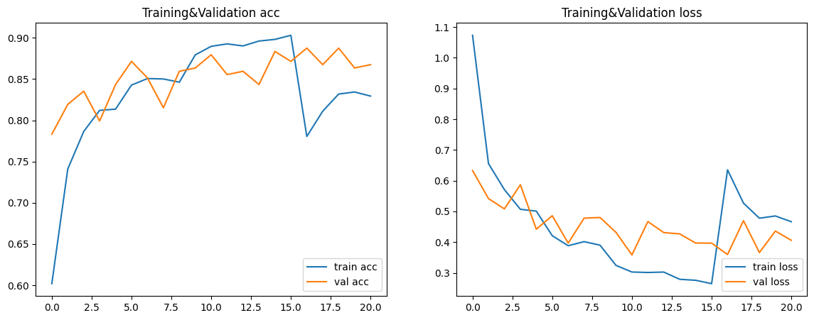

> epoch 15~16 부근에서 acc가 급락하는 건 미세조정 시작 시점이다. 백본이 해제되면서 일시적으로 불안정해지다가 빠르게 수렴한다.

---

### Cell 5 — Confusion Matrix + 성능 리포트

```python
y_true = []
y_pred = []

# test_ds 전체를 배치 단위로 순회하며 예측
for images, labels in test_ds:
    predictions = model.predict(images)
    y_true.extend(labels.numpy())                     # 실제 정답 수집
    y_pred.extend(np.argmax(predictions, axis=1))     # 예측 클래스 수집

# Confusion Matrix 계산
cm = confusion_matrix(y_true, y_pred)

# seaborn으로 heatmap 시각화
plt.figure(figsize=(8, 6))
sns.heatmap(cm, annot=True, fmt='d', cmap='Blues',
            xticklabels=class_names, yticklabels=class_names)
plt.xlabel('Predict')
plt.ylabel('True')
plt.title('Confusion Matrix')
plt.show()

# 클래스별 precision / recall / f1-score 출력
print(classification_report(y_true, y_pred, target_names=class_names))
```

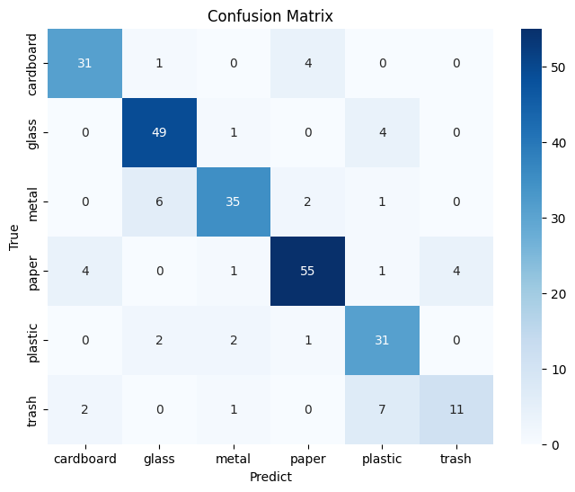

> Confusion Matrix 읽는 법: **행(True) = 실제 클래스, 열(Predict) = 예측 클래스**. 대각선이 진할수록 정확도가 높다. trash 클래스는 plastic으로 많이 헷갈리고 있음을 확인할 수 있다.

**📌 classification_report 출력**

```
              precision  recall  f1-score  support

   cardboard      0.84    0.86      0.85       36
       glass      0.84    0.91      0.88       54
       metal      0.88    0.80      0.83       44
       paper      0.89    0.85      0.87       65
     plastic      0.70    0.86      0.78       36
       trash      0.73    0.52      0.61       21   ← 가장 낮은 성능

    accuracy                        0.83      256
   macro avg      0.81    0.80      0.80      256
weighted avg      0.83    0.83      0.83      256
```

> trash 클래스의 recall이 0.52로 가장 낮다 — 실제 trash 중 절반만 맞힌 것. plastic과 혼동이 많기 때문이다.

---

### Cell 6 — 단일 이미지 예측 함수

```python
import tensorflow as tf
import numpy as np
from tensorflow.keras.preprocessing import image

# 저장된 모델 로드
model = tf.keras.models.load_model('garbage_classify.keras')

class_names = ['cardboard', 'glass', 'metal', 'paper', 'plastic', 'trash']

def predict_garbageFunc(img_path):
    img = image.load_img(img_path, target_size=(224, 224))  # PIL로 이미지 로드 + 리사이즈
    img_array = image.img_to_array(img)                     # numpy 배열로 변환
    img_array = np.expand_dims(img_array, axis=0)           # (224,224,3) → (1,224,224,3) 배치 차원 추가

    predictions = model.predict(img_array)   # shape: (1, 6)
    pred_index  = np.argmax(predictions)     # 가장 높은 확률의 인덱스
    pred_class  = class_names[pred_index]    # 인덱스 → 클래스 이름
    confidence  = np.max(predictions)       # 최고 확률값

    print('예측결과 : ', pred_class)
    print('신뢰도 : ', round(confidence * 100, 2), '%')

predict_garbageFunc('myimage.jpg')
```

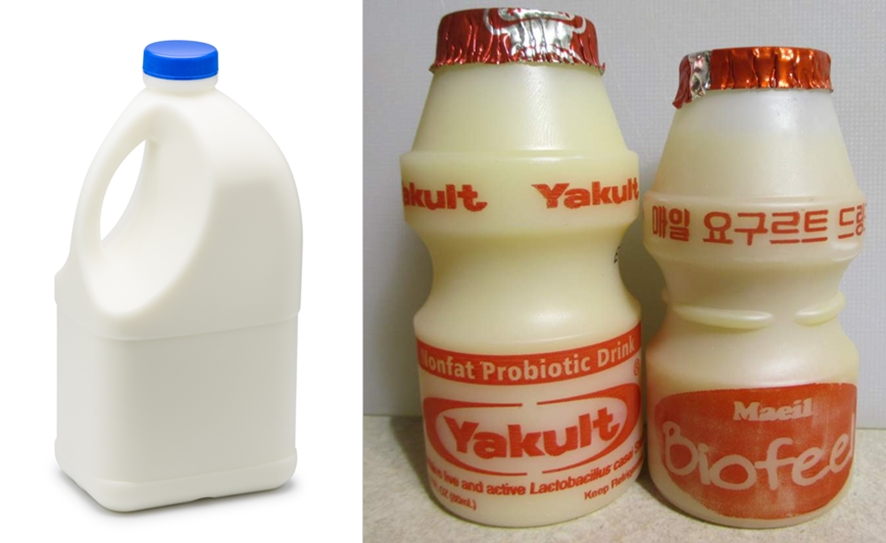

**📌 출력 결과**

```
예측결과 :  plastic
신뢰도 :  70.15 %
```

---

## 📊 이전 노트와 비교

|항목|tf_flowers|waste (이번)|
|---|---|---|
|데이터 로드|`tfds.load()`|`image_dataset_from_directory()`|
|데이터 출처|TF 내장|Kaggle (로컬/드라이브)|
|클래스 수|5|6|
|데이터 증강|없음|RandomFlip, Rotation, Zoom, Contrast|
|정규화|`/ 255.0` (전처리 함수)|`Rescaling` 레이어 (모델 내부)|
|Dropout|없음|0.3 × 2회|
|콜백|없음|EarlyStopping + ReduceLROnPlateau|
|평가|val acc|Confusion Matrix + classification_report|
|모델 저장|없음|`model.save()`|

## 🔑 핵심 포인트

- `image_dataset_from_directory`: 폴더 구조만 맞으면 레이블 자동 생성, 로컬 데이터에 유용
- 증강 레이어를 모델 내부에 넣으면 학습/예측 모드 전환이 자동으로 처리됨
- `Rescaling` 레이어로 정규화를 모델 안에 포함하면 추론 시 별도 전처리 불필요
- `cardinality()`: Dataset의 배치 수를 세는 함수 — val을 다시 분리할 때 유용
- Confusion Matrix에서 오분류 패턴을 보면 모델이 어떤 클래스를 헷갈리는지 파악 가능

---
# 📄 cnn16quiz — CIFAR-100 · 전이학습 · Flask 웹 분류기

---

## 🧠 개념 정리

### 🗂️ CIFAR-100 데이터셋

TensorFlow에 내장된 이미지 분류 데이터셋으로, 별도 다운로드 없이 한 줄로 불러올 수 있다.

|항목|내용|
|---|---|
|클래스 수|100개 (fine labels) / 20개 (coarse labels)|
|총 이미지 수|60,000장|
|train / test|50,000 / 10,000|
|이미지 크기|32×32 RGB|
|레이블 형태|정수 (0~99)|

> CIFAR-100은 32×32로 해상도가 매우 낮다. MobileNetV2 최소 입력이 96×96이라 **Resizing 레이어**로 128×128로 늘려서 넣어야 한다.

### 🔲 Resizing 레이어

모델 내부에 리사이징을 넣는 방식이다. 입력은 여전히 32×32로 받고, 내부에서 128×128로 키운 뒤 백본으로 넘긴다.

```python
inputs = tf.keras.Input(shape=(32, 32, 3))
x = tf.keras.layers.Resizing(128, 128)(inputs)  # 모델 내부에서 리사이즈
x = base_model(x, training=False)
```

이렇게 하면 데이터 전처리 함수에서 resize를 따로 할 필요가 없고, 모델 저장 시 리사이징 로직도 같이 포함된다.

### 🎯 원핫인코딩 vs sparse

오늘은 `to_categorical()`로 **원핫인코딩**을 했다. 그래서 손실함수도 `categorical_crossentropy`를 사용한다.

|레이블 형태|손실함수|
|---|---|
|정수 (0, 1, 2 ...)|`sparse_categorical_crossentropy`|
|원핫 ([0,0,1,0...])|`categorical_crossentropy`|

```python
y_train = tf.keras.utils.to_categorical(y_train, 100)
# [3] → [0, 0, 0, 1, 0, 0, ...]
```

### 🌐 Functional API 모델 정의

Sequential은 레이어를 순서대로 쌓지만, Functional API는 입력부터 출력까지 직접 연결해서 더 유연한 구조를 만들 수 있다.

```python
inputs = tf.keras.Input(shape=(32, 32, 3))   # 입력 정의
x = Resizing(128, 128)(inputs)               # 연결
x = base_model(x, training=False)            # 연결
x = GlobalAveragePooling2D()(x)             # 연결
output = Dense(100, activation='softmax')(x) # 출력
model = tf.keras.Model(inputs, output)       # 입출력으로 모델 생성
```

### 🔵 initial_epoch으로 에포크 이어서 표시

파인튜닝을 별도 `fit()`으로 돌리면 에포크 번호가 1부터 다시 시작한다. `initial_epoch`을 주면 이전 에포크에서 이어서 표시된다.

```python
EPOCHS_TL = 10   # 전이학습 10 epochs
EPOCHS_FT = 20   # 총 20까지 (파인튜닝 10 epochs 추가)

history_ft = model_tl.fit(
    x_train, y_train,
    initial_epoch=EPOCHS_TL,  # 11번째 epoch부터 시작
    epochs=EPOCHS_FT,         # 20까지
    ...
)
```

### 🍶 Flask 웹 서버 구조

```
[클라이언트 index.html]
    파일 선택 → 미리보기
    분류 요청 버튼 클릭 → axios로 POST /classify
         ↓
[서버 app.py]
    이미지 수신 → uploads/ 저장
    matplotlib으로 서버에서 시각화 확인
    32x32 리사이즈 + 정규화
    모델 추론 → Top-5 확률 계산
         ↓
    JSON 응답 { top1: "kangaroo", top5: [...] }
         ↓
[클라이언트]
    Top-1 배너 + Top-5 바 차트 렌더링
```

### 🖼️ PIL vs tf.image

|항목|PIL (Pillow)|tf.image|
|---|---|---|
|사용 위치|서버(Flask) 이미지 처리|코랩 학습 전처리|
|로드|`Image.open()`|`tf.io.read_file()`|
|리사이즈|`img.resize((32, 32))`|`tf.image.resize()`|
|변환|`np.array(img)`|텐서 그대로|

Flask 서버에서는 PIL이 더 간편하고, 학습 파이프라인에서는 tf.image가 GPU 병렬 처리에 유리하다.

---

## 🗺️ 전체 흐름

```
[작업1 - train.py / 코랩]
1. CIFAR-100 로드 + 정규화 + 원핫인코딩
2. MobileNetV2 백본 동결 (input: 128x128)
3. Functional API로 모델 생성 (Resizing 레이어 포함)
4. 전이학습 (10 epochs)
5. 파인튜닝 (epoch 11~20, lr=1e-5)
6. 시각화 (concat_history)
7. 모델 저장 (cifar100_mobilenetv2.keras)

[작업2 - app.py + index.html]
8. Flask 서버 시작 → 모델 로드
9. 브라우저에서 이미지 선택 → 미리보기
10. 분류 요청 → axios POST → Flask 수신
11. PIL 전처리 → 추론 → Top-5 JSON 반환
12. 브라우저에서 결과 렌더링
```

---

## 💻 train.py — 코드 & 주석

### 📥 데이터 로드 + 전처리

```python
import tensorflow as tf

# CIFAR-100: tf.keras에 내장 → 별도 임포트 없이 바로 사용
(x_train, y_train), (x_test, y_test) = tf.keras.datasets.cifar100.load_data()

# 픽셀값 정규화: [0,255] → [0,1]
x_train = x_train.astype('float32') / 255.0
x_test  = x_test.astype('float32')  / 255.0

NUM_CLASSES = 100
# 정수 레이블 → 원핫인코딩 (categorical_crossentropy 사용 시 필요)
y_train = tf.keras.utils.to_categorical(y_train, NUM_CLASSES)
y_test  = tf.keras.utils.to_categorical(y_test,  NUM_CLASSES)

print('train data : ', x_train.shape, y_train.shape)  # (50000, 32, 32, 3) (50000, 100)
print('test data : ',  x_test.shape,  y_test.shape)   # (10000, 32, 32, 3) (10000, 100)
```

**📌 출력 결과**

```
train data :  (50000, 32, 32, 3) (50000, 100)
test data :  (10000, 32, 32, 3) (10000, 100)
```

---

### 🔒 백본 정의 + 동결

```python
# MobileNetV2: 128x128 입력, 분류기 제거, ImageNet 가중치
base_model = tf.keras.applications.MobileNetV2(
    input_shape=(128, 128, 3),   # CIFAR-100 32x32는 Resizing 레이어로 키움
    include_top=False,           # 분류기(Dense) 부분 제거
    weights='imagenet'           # 사전 학습된 가중치 사용
)

base_model.trainable = False     # 전이학습 단계: 백본 전체 동결
```

---

### 🏗️ Functional API 모델 생성 + 전이학습

```python
# Functional API: 입력 → 각 레이어 연결 → 출력
inputs = tf.keras.Input(shape=(32, 32, 3))
x = tf.keras.layers.Resizing(128, 128)(inputs)    # 32x32 → 128x128 (백본 최소 입력 맞춤)
x = base_model(x, training=False)                 # 백본 통과 (배치정규화 동결 유지)
x = tf.keras.layers.GlobalAveragePooling2D()(x)   # (4, 4, 1280) → (1280,) 압축
output = tf.keras.layers.Dense(NUM_CLASSES, activation='softmax')(x)  # 100개 클래스

model_tl = tf.keras.Model(inputs=inputs, outputs=output)

# 원핫인코딩 했으므로 categorical_crossentropy 사용
model_tl.compile(optimizer='adam', loss='categorical_crossentropy', metrics=['accuracy'])

history = model_tl.fit(x_train, y_train, epochs=10, batch_size=64, validation_split=0.2, verbose=2)

loss, acc = model_tl.evaluate(x_test, y_test, verbose=0)
print(f'loss :{loss:.4f}, acc : {acc:.4f}')
```

**📌 전이학습 출력 결과**

```
Epoch  1/10  accuracy: 0.4159  loss: 2.3145  val_accuracy: 0.4948  val_loss: 1.9027
Epoch  2/10  accuracy: 0.5607  loss: 1.6173  val_accuracy: 0.5247  val_loss: 1.7856
Epoch  3/10  accuracy: 0.6103  loss: 1.4171  val_accuracy: 0.5346  val_loss: 1.7532
Epoch  4/10  accuracy: 0.6441  loss: 1.2863  val_accuracy: 0.5474  val_loss: 1.7221
Epoch  5/10  accuracy: 0.6695  loss: 1.1848  val_accuracy: 0.5472  val_loss: 1.7260
Epoch  6/10  accuracy: 0.6900  loss: 1.1036  val_accuracy: 0.5491  val_loss: 1.7258
Epoch  7/10  accuracy: 0.7126  loss: 1.0345  val_accuracy: 0.5513  val_loss: 1.7454
Epoch  8/10  accuracy: 0.7263  loss: 0.9747  val_accuracy: 0.5465  val_loss: 1.7633
Epoch  9/10  accuracy: 0.7416  loss: 0.9252  val_accuracy: 0.5440  val_loss: 1.7700
Epoch 10/10  accuracy: 0.7544  loss: 0.8791  val_accuracy: 0.5508  val_loss: 1.7745

loss: 1.7431, acc: 0.5553
```

> train acc 75%까지 올라가는데 val acc는 55% 수준에서 정체 → 100클래스라 난이도가 높고 32×32 저해상도 영향. 과적합 신호 있음.

---

### 🔧 미세조정 (Fine-Tuning)

```python
EPOCHS_TL = 10   # 전이학습 완료 epoch 수
EPOCHS_FT = 20   # 파인튜닝 후 최종 epoch 번호

base_model.trainable = True
# 마지막 10개 레이어만 학습, 나머지는 다시 동결
for layer in base_model.layers[:-10]:
    layer.trainable = False

# 미세조정: 학습률 매우 작게 (기존 가중치 보호)
model_tl.compile(
    optimizer=tf.keras.optimizers.Adam(learning_rate=0.00001),
    loss='categorical_crossentropy',
    metrics=['accuracy']
)

history_ft = model_tl.fit(
    x_train, y_train,
    initial_epoch=EPOCHS_TL,   # 11번째 epoch부터 번호 이어서 표시
    epochs=EPOCHS_FT,          # 20까지
    batch_size=64, validation_split=0.2, verbose=2
)

loss, acc = model_tl.evaluate(x_test, y_test, verbose=0)
print(f'loss :{loss:.4f}, acc : {acc:.4f}')
```

**📌 미세조정 출력 결과**

```
Epoch 11/20  accuracy: 0.4588  loss: 2.7206  val_accuracy: 0.4915  val_loss: 2.5067  ← 급락
Epoch 12/20  accuracy: 0.5603  loss: 1.8192  val_accuracy: 0.4720  val_loss: 2.8118
Epoch 13/20  accuracy: 0.6010  loss: 1.5356  val_accuracy: 0.4877  val_loss: 2.7007
Epoch 14/20  accuracy: 0.6305  loss: 1.3634  val_accuracy: 0.5013  val_loss: 2.5029
Epoch 15/20  accuracy: 0.6529  loss: 1.2501  val_accuracy: 0.5128  val_loss: 2.3568
Epoch 16/20  accuracy: 0.6734  loss: 1.1567  val_accuracy: 0.5192  val_loss: 2.2452
Epoch 17/20  accuracy: 0.6904  loss: 1.0872  val_accuracy: 0.5268  val_loss: 2.1658
Epoch 18/20  accuracy: 0.7059  loss: 1.0269  val_accuracy: 0.5299  val_loss: 2.1114
Epoch 19/20  accuracy: 0.7226  loss: 0.9730  val_accuracy: 0.5332  val_loss: 2.0749
Epoch 20/20  accuracy: 0.7349  loss: 0.9237  val_accuracy: 0.5362  val_loss: 2.0434

loss: 1.9976, acc: 0.5379
```

> epoch 11에서 급락 후 점차 회복. val_loss가 2.0대로 전이학습보다 오히려 높은데, 100클래스의 난이도와 마지막 10레이어만 해제한 제한된 파인튜닝 때문이다.

---

### 📊 시각화 + 모델 저장

```python
import matplotlib.pyplot as plt

# 두 history를 이어 붙여 통합 그래프 생성
def concat_history(h1, h2):
    keys = h1.history.keys()
    out = {}
    for k in keys:
        out[k] = h1.history[k] + h2.history[k]   # 리스트 이어 붙이기
    return out

hist_all = concat_history(history, history_ft)
acc      = hist_all['accuracy']
val_acc  = hist_all['val_accuracy']
loss     = hist_all['loss']
val_loss = hist_all['val_loss']

epochs = range(1, len(acc) + 1)
split_epoch = EPOCHS_TL   # 전이 → 파인튜닝 경계선

plt.figure(figsize=(12, 5))

# Accuracy
plt.subplot(1, 2, 1)
plt.plot(epochs, acc, marker='o', label='train acc')
plt.plot(epochs, val_acc, marker='s', label='val acc')
for i, v in enumerate(acc):
    plt.text(epochs[i], v, f'{v * 100:.1f}%', ha='center', va='bottom', fontsize=9)
for i, v in enumerate(val_acc):
    plt.text(epochs[i], v, f'{v * 100:.1f}%', ha='center', va='top', fontsize=9)
plt.axvline(x=split_epoch, linestyle='--', alpha=0.7, label='fine tuning start')
plt.title('Accuracy(transfer -> fine tuning)')
plt.xlabel('epoch')
plt.ylabel('acc')
plt.legend(loc='lower right')

# Loss
plt.subplot(1, 2, 2)
plt.plot(epochs, loss, marker='o', label='train loss')
plt.plot(epochs, val_loss, marker='s', label='val loss')
for i, v in enumerate(loss):
    plt.text(epochs[i], v, f'{v:.3f}', ha='center', va='bottom', fontsize=9)
for i, v in enumerate(val_loss):
    plt.text(epochs[i], v, f'{v:.3f}', ha='center', va='top', fontsize=9)
plt.title('Loss(transfer -> fine tuning)')
plt.xlabel('epoch')
plt.ylabel('loss')
plt.legend(loc='upper right')

plt.tight_layout()
plt.show()

# 학습 완료 모델 저장
model_tl.save('cifar100_mobilenetv2.keras')
```

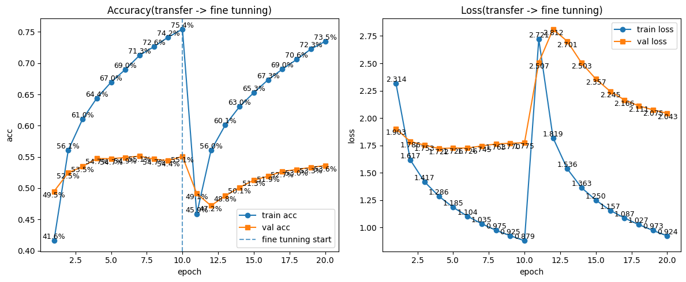

---

## 💻 app.py — Flask 서버 코드 & 주석

```python
import os
import numpy as np
import tensorflow as tf
from flask import Flask, request, jsonify, render_template
from PIL import Image
import matplotlib.pyplot as plt

app = Flask(__name__)

# 업로드 이미지 저장 폴더 (없으면 자동 생성)
UPLOAD_FOLDER = 'uploads'
os.makedirs(UPLOAD_FOLDER, exist_ok=True)

# CIFAR-100 클래스 이름 100개 (인덱스 순서 고정)
CIFAR100_CLASSES = [
    'apple', 'aquarium_fish', 'baby', 'bear', 'beaver', 'bed', 'bee', 'beetle',
    'bicycle', 'bottle', 'bowl', 'boy', 'bridge', 'bus', 'butterfly', 'camel',
    # ... (100개)
]

# 서버 시작 시 1회만 모델 로드 (요청마다 로드하면 매우 느림)
print('모델 로딩 중...')
model = tf.keras.models.load_model('cifar100_mobilenetv2.keras')
print('모델 로딩 완료')


def preprocess(img_path):
    """
    PIL로 이미지 로드 → 서버에서 matplotlib으로 시각화 확인
    → 32x32 리사이즈 → 정규화 → 배치 차원 추가
    """
    img = Image.open(img_path).convert('RGB')

    # 서버 내부 확인용: matplotlib으로 이미지 저장 (uploads/preview.png)
    plt.imshow(img)
    plt.title('수신된 이미지')
    plt.axis('off')
    plt.savefig(os.path.join(UPLOAD_FOLDER, 'preview.png'))
    plt.close()

    # CIFAR-100 입력 크기에 맞게 리사이즈 + 정규화
    img = img.resize((32, 32))
    img_array = np.array(img).astype('float32') / 255.0

    # (32, 32, 3) → (1, 32, 32, 3): 배치 차원 추가
    img_array = np.expand_dims(img_array, axis=0)
    return img_array


@app.route('/')
def index():
    return render_template('index.html')   # templates/index.html 렌더링


@app.route('/classify', methods=['POST'])
def classify():
    # 이미지 파일 수신 확인
    if 'image' not in request.files:
        return jsonify({'error': '이미지 파일이 없습니다'}), 400

    file = request.files['image']
    if file.filename == '':
        return jsonify({'error': '파일이 선택되지 않았습니다'}), 400

    # 수신된 이미지 서버에 저장
    save_path = os.path.join(UPLOAD_FOLDER, file.filename)
    file.save(save_path)

    # 전처리 → 추론
    img_array = preprocess(save_path)
    predictions = model.predict(img_array, verbose=0)[0]   # shape: (100,)

    # 확률 내림차순으로 상위 5개 인덱스 추출
    top5_indices = predictions.argsort()[-5:][::-1]

    # 인덱스 → 클래스 이름 + 확률(%) 변환
    top5 = [[CIFAR100_CLASSES[i], float(predictions[i] * 100)] for i in top5_indices]

    # 클라이언트에 JSON 반환
    return jsonify({
        'top1': top5[0][0],   # 가장 높은 확률 클래스명
        'top5': top5          # [["kangaroo", 90.15], ["wolf", 6.04], ...]
    })


if __name__ == '__main__':
    app.run(debug=True)
```

---

## 💻 index.html — 핵심 JavaScript 흐름

```javascript
// 1. 파일 선택 → 미리보기 표시
document.getElementById('fileInput').addEventListener('change', function(e) {
    const file = e.target.files[0];
    selectedFile = file;

    // FileReader로 이미지를 base64로 읽어 미리보기
    const reader = new FileReader();
    reader.onload = (ev) => {
        document.getElementById('previewImg').src = ev.target.result;
        document.getElementById('previewWrap').style.display = 'block';
    };
    reader.readAsDataURL(file);
});

// 2. 분류 요청 → axios로 서버에 POST
async function classify() {
    const formData = new FormData();
    formData.append('image', selectedFile);   // 이미지 파일 첨부

    const res = await axios.post('/classify', formData, {
        headers: { 'Content-Type': 'multipart/form-data' }
    });

    const data = res.data;
    // { top1: "kangaroo", top5: [["kangaroo", 90.15], ["wolf", 6.04], ...] }

    // 3. 결과 렌더링
    document.getElementById('top1Name').textContent = data.top1;

    data.top5.forEach(([name, pct], i) => {
        // 클래스명 + 확률 바 + 퍼센트 표시
    });
}
```

---

## 📊 결과 해석

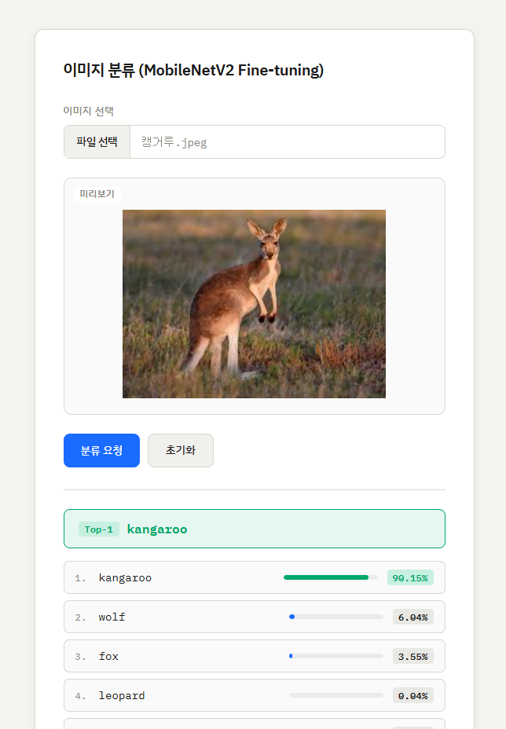

|항목|결과|
|---|---|
|Top-1|kangaroo (90.15%) ✅|
|Top-2|wolf (6.04%)|
|Top-3|fox (3.55%)|

> 캥거루 이미지를 90.15% 확률로 정확히 분류했다. 전이학습 모델의 val acc가 55% 수준임에도 실제 선명한 이미지에서는 높은 신뢰도를 보여주는 것은, CIFAR-100 테스트셋이 32×32 저해상도라 어렵고 실제 고해상도 이미지는 특징이 더 명확하기 때문이다.

---

## 🔑 핵심 포인트

- `Resizing` 레이어를 모델 내부에 넣으면 입력 shape을 32×32로 유지하면서 백본 최소 입력(96×96 이상) 조건을 충족시킬 수 있음
- `to_categorical()` + `categorical_crossentropy` vs 정수 레이블 + `sparse_categorical_crossentropy` — 결과는 같지만 전처리 방식이 다름
- `initial_epoch` 파라미터로 파인튜닝 에포크 번호를 이어서 표시 가능 → `concat_history()`와 함께 쓰면 통합 그래프 가능
- Flask 서버는 **시작 시 1회만 모델 로드** — 요청마다 로드하면 추론이 수 초씩 걸림
- PIL은 Flask 서버용, tf.image는 학습 파이프라인용으로 역할이 다름
- `predictions.argsort()[-5:][::-1]` — numpy로 상위 5개 인덱스를 내림차순으로 추출하는 관용 패턴