# Day 69_딥러닝 : YOLO · Object Detection

## 📅 2026-05-18

---
# Object Detection · YOLO · OpenCV

---

## 🔷 OpenCV (Open Source Computer Vision)

OpenCV는 TensorFlow, PyTorch, Caffe 등 딥러닝 프레임워크를 지원하는 컴퓨터 비전 라이브러리다.

### 주요 활용 분야

|분야|설명|
|---|---|
|콘텐츠 구성|사진에서 사람/개체 식별 후 자동 분류|
|텍스트 추출 (OCR)|이미지 속 문자를 텍스트로 변환|
|증강 현실|실시간 물리 개체 추적 + 가상 객체 배치|
|자율 차량|실시간 객체 식별·추적으로 주행 제어|
|의료|의료 영상 분석으로 진단 보조|
|제조|제품 품질 검사, 불량 탐지|
|방산·보안|얼굴 인식, 공간 분석, 침입 감지|

### 기본 코드 예제

```python
# pip install opencv-python
import cv2

# 이미지 읽기 및 표시
img = cv2.imread('myimg.jpg', cv2.IMREAD_COLOR)  # BGR 형식으로 읽힘
cv2.imshow('image', img)
cv2.waitKey(0)
print(img.shape)  # (H, W, C) 배열

# 동영상 파일 읽기
vid = cv2.VideoCapture('myvideo.mp4')
while vid.isOpened():
    ret, frame = vid.read()   # ret: 읽기 성공 여부, frame: 프레임 이미지
    if not ret: break
    cv2.imshow('video', frame)
    if cv2.waitKey(25) == ord('q'):  # q 누르면 종료
        break
vid.release()  # 메모리 자원 해제

# 카메라(웹캠) 실시간 스트림
cam = cv2.VideoCapture(0)  # 0 = 기본 카메라
if not cam.isOpened(): exit()
while True:
    ret, frame = cam.read()
    if not ret: break
    cv2.imshow('camera', frame)
    if cv2.waitKey(25) == ord('q'):
        break
cam.release()
```

> ⚠️ **BGR vs RGB 주의**: OpenCV는 기본적으로 BGR 순서로 읽음. Matplotlib, TensorFlow 등에 넘길 때는 `cv2.cvtColor(img, cv2.COLOR_BGR2RGB)` 변환 필요

---

## 🏷️ 이미지 어노테이션 & 라벨링

AI 학습용 데이터를 만들기 위해 이미지에 해석 정보를 추가하는 작업. 결과는 XML, JSON 등 메타데이터로 저장.

### 어노테이션 타입

|타입|설명|주요 용도|
|---|---|---|
|**Bounding Box**|객체 주변 직사각형 박스|YOLO, 일반 Object Detection|
|**Polygon**|외곽선 다각형으로 정밀 표시|Instance Segmentation|
|**Semantic Seg**|픽셀 단위 클래스 분류|자율주행 도로 인식|
|**Keypoint**|관절 등 특정 포인트 표시|Pose Estimation|
|**OBB**|회전 가능한 방향성 박스|항공·위성·방산 이미지|

### 주요 라벨링 툴

|툴|특징|출력 포맷|
|---|---|---|
|**LabelImg**|가장 기본, 무료, 로컬|YOLO txt, Pascal VOC XML|
|**LabelMe**|MIT 개발, Polygon 강점|JSON|
|**CVAT**|Intel 개발, 웹 기반, 팀 협업|YOLO, COCO, VOC 등|
|**Roboflow**|전처리+증강+Export 통합 웹|YOLO, COCO 등|
|**Make Sense**|무료 웹, 간단한 UI|YOLO, VOC XML|

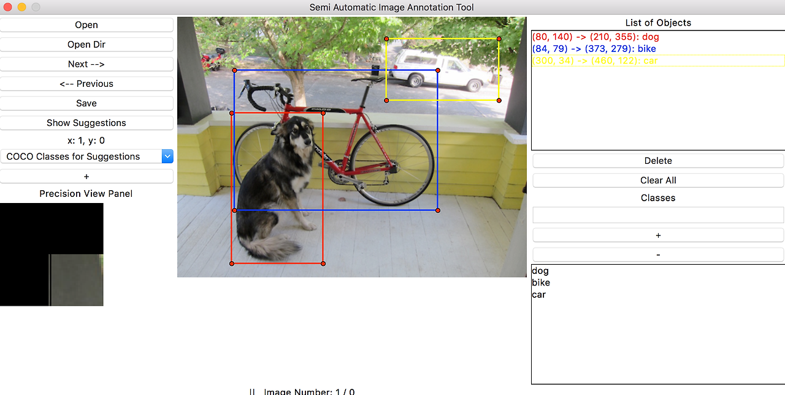

### Bounding Box 포맷 비교

```
# YOLO 포맷 (.txt) — 정규화된 중심 좌표
# class_id  cx    cy    w     h
0            0.5   0.4   0.3   0.2

# COCO JSON 포맷 — 좌상단 기준 절대 픽셀값
{"bbox": [x, y, width, height], "category_id": 0}

# Pascal VOC XML — 절대 픽셀값
<bndbox><xmin>100</xmin><ymin>80</ymin><xmax>200</xmax><ymax>160</ymax></bndbox>
```

> 💡 **실무 팁**: YOLO 학습 → LabelImg 또는 Roboflow / 팀 프로젝트 → CVAT / Segmentation → LabelMe / 방산 OBB → CVAT or Roboflow

---

## 🖼️ 이미지 분류 모델 계보 (CNN)

### ILSVRC 대회 기준 발전 흐름

|연도|모델|특징|
|---|---|---|
|2012|**AlexNet**|Top-5 error 15.4%, ReLU·Dropout 표준화. Conv 5 + FC 3|
|2014|**VGGNet**|3×3 소형 필터만 사용, 단순·깊은 구조, 피처 추출에 자주 사용|
|2014|**GoogLeNet**|Inception 모듈 도입, 1×1 conv로 연산량 절감, 1위|
|2015|**ResNet**|Residual Block으로 깊이 문제 해결, top-5 error 3.6% (사람 수준 초과)|
|—|**MobileNet**|Depthwise Separable Convolution, 모바일·임베디드 환경 최적화|

### VGGNet 스타일 코드 (FashionMNIST)

```python
model = tf.keras.Sequential([
    tf.keras.layers.Conv2D(input_shape=(28,28,1), kernel_size=(3,3), filters=32, padding='same', activation='relu'),
    tf.keras.layers.Conv2D(kernel_size=(3,3), filters=64, padding='same', activation='relu'),
    tf.keras.layers.MaxPool2D(pool_size=(2,2)),
    tf.keras.layers.Dropout(rate=0.5),
    tf.keras.layers.Conv2D(kernel_size=(3,3), filters=128, padding='same', activation='relu'),
    tf.keras.layers.Conv2D(kernel_size=(3,3), filters=256, padding='valid', activation='relu'),
    tf.keras.layers.MaxPool2D(pool_size=(2,2)),
    tf.keras.layers.Dropout(rate=0.5),
    tf.keras.layers.Flatten(),
    tf.keras.layers.Dense(units=512, activation='relu'),
    tf.keras.layers.Dropout(rate=0.5),
    tf.keras.layers.Dense(units=256, activation='relu'),
    tf.keras.layers.Dropout(rate=0.5),
    tf.keras.layers.Dense(units=10, activation='softmax')
])
model.compile(optimizer=tf.keras.optimizers.Adam(),
              loss='sparse_categorical_crossentropy',
              metrics=['accuracy'])
```

---

## 🎯 Object Detection

이미지/동영상에서 객체의 **위치(Bounding Box)** 와 **종류(Class)** 를 동시에 탐지하는 기술.

### 이미지에서 사물을 인식하는 4단계

```
Classification       → 이미지 전체에서 하나의 클래스 예측 (고양이 vs 개)
Classification
+ Localization       → 클래스 + 바운딩 박스로 위치까지 예측 (단일 객체)
Object Detection     → 다수 객체 각각의 위치 + 종류 탐지
Instance
Segmentation         → 픽셀 단위로 각 객체 인스턴스 분리
```

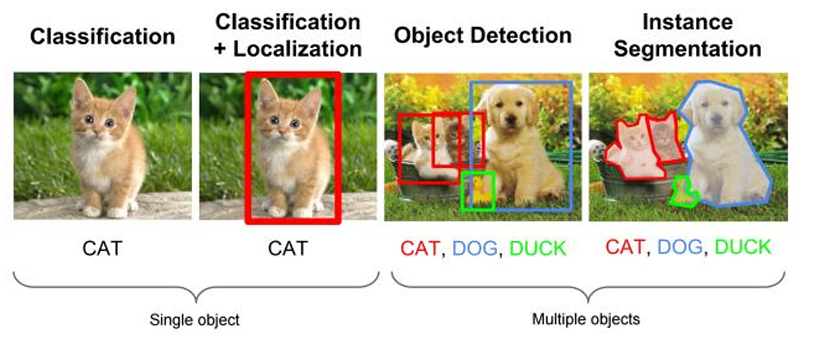

### 핵심 개념

**Bounding Box**: 객체를 감싸는 최소 사각형 영역

- `(x, y, w, h)` — COCO 포맷, 좌상단 기준
- `(x1, y1, x2, y2)` — 양끝 좌표, YOLOv8·OpenCV에서 자주 사용
- `(cx, cy, w, h)` — YOLO 학습용, 중심 좌표 기반 (0~1 정규화)

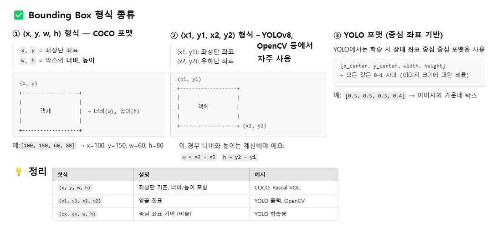

**Confidence Score**: `Pr(Object) × IoU` — 객체 존재 확률 × 박스 정확도

---

### 📌 IoU (Intersection over Union)

> Detection, Segmentation 모두에서 필수 개념

**정의**: 예측 박스 Bp와 정답 박스 Bg의 교집합/합집합 비율

```
IoU = |Bp ∩ Bg| / |Bp ∪ Bg|
```

**범위**: 0 ~ 1 (0=전혀 겹치지 않음, 1=완벽히 일치)

**어디서 쓰나?**

- **평가**: mAP 계산 시 IoU ≥ 0.5 (또는 0.75) 기준으로 TP/FP 판정
- **학습**: 앵커/예측을 양성/음성으로 라벨링, IoU 기반 손실(GIoU, DIoU, CIoU)로 박스 회귀 안정화
- **주의**: 좌표 형식(xyxy vs cxcywh)과 정규화/픽셀 단위 섞이지 않게 주의

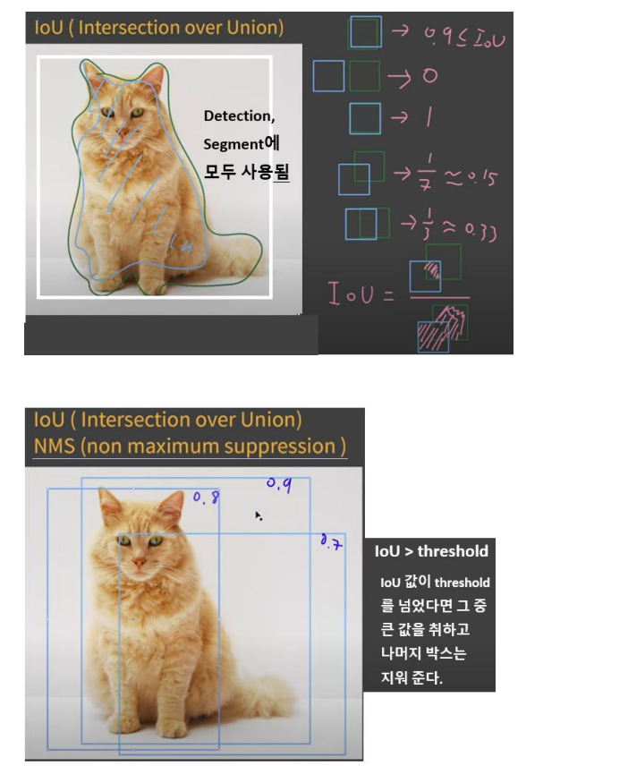

---

### 📌 NMS (Non-Maximum Suppression)

> "겹치는 후보 중 무엇을 남길까"를 결정

**왜 필요?** 한 물체에 대해 유사한 후보 박스가 여러 개 나오므로, 가장 높은 점수의 박스만 남기고 나머지 중복 제거

**그리디 NMS 절차 (클래스별로 적용)**

1. 점수(`obj_conf × class_conf`)로 내림차순 정렬
2. 가장 높은 박스를 선택해 결과에 추가
3. 남은 박스 중 선택 박스와 IoU ≥ T(예: 0.5)인 것 제거
4. 반복

**하이퍼파라미터**

- `score threshold`: 너무 낮은 후보 미리 버림 (예: 0.25)
- `IoU threshold`: 얼마나 겹치면 중복으로 볼지 (예: 0.45~0.6)

**변형 기법**

- **Soft-NMS**: 겹친 박스를 제거하지 않고 점수를 점진적으로 낮춤 → recall 손실 감소
- **DIoU-NMS**: IoU에 박스 중심 거리까지 고려해 중복 판단 개선
- **class-wise NMS**: 클래스별로 NMS 수행 (대부분의 YOLO가 사용)

---

### 📌 mAP (mean Average Precision)

**핵심 지표**: Precision과 Recall을 함께 고려한 Object Detection 성능 평가 지표

```
recall    = TP / (TP + FN)   ← 실제 정답을 얼마나 찾았나
precision = TP / (TP + FP)   ← 찾은 것 중 얼마나 맞았나
```

**AP (Average Precision)**: Precision-Recall 곡선의 면적 (AUC)

**mAP**: 전체 클래스의 AP 평균

|표기|의미|
|---|---|
|mAP@0.5|IoU ≥ 0.5 기준으로 TP 판정|
|mAP@0.5:0.95|IoU 0.5~0.95 구간 평균 (COCO 공식 기준)|

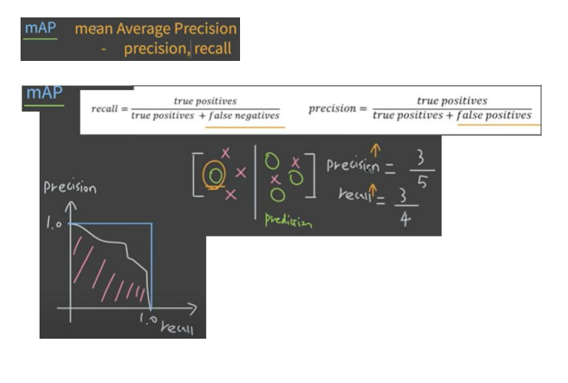 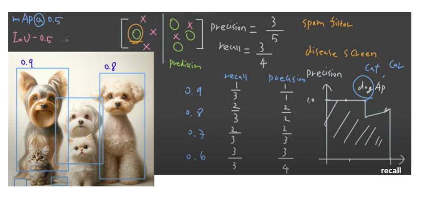

### Object Detection 발전 역사

```
전통적 방법 (머신러닝 기반)
├── 2001 Viola-Jones detector (Haar-like feature) — 얼굴 감지, 최초 성공 구현
├── 2005 HOG detector — 엣지 기반 특징, 조명 강건성, 보행자 감지
│       └── HOG + SVM으로 분류
└── 2008 DPM — HOG 확장, 최초 Bounding Box 개념 적용, 부위별 템플릿 매칭

딥러닝 기반
├── Two-Stage (정확도 우선, 속도 느림)
│   ├── 2014 R-CNN     — Selective Search(~2000 ROI) + CNN + SVM, 느림
│   ├── 2015 Fast R-CNN — 이미지 전체를 CNN 1회 통과 + RoI Pooling, 속도 개선
│   └── 2016 Faster R-CNN — RPN(Region Proposal Network)으로 CPU 병목 해결, GPU 전체 처리
└── One-Stage (속도 우선)
    ├── 2016 YOLO v1  — 단일 신경망으로 실시간 탐지, Faster R-CNN 대비 6배 빠름
    ├── 2016 SSD      — 다중 스케일 탐지
    └── 2017 RetinaNet — Focal Loss로 소형 객체 탐지 개선
```

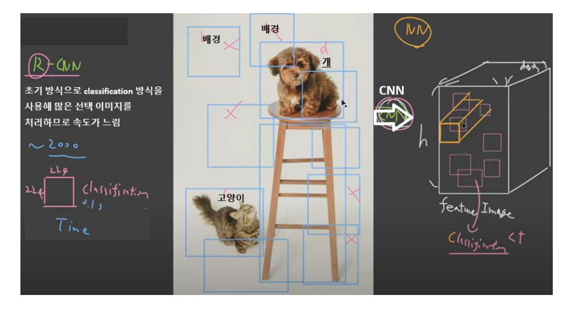

---

## 💢 YOLO (You Only Look Once)

단일 신경망으로 **전체 이미지를 한 번에** 처리하여 실시간 객체 탐지가 가능한 One-Stage Detector.

> "Detection as a regression problem" — 위치(x, y, w, h)와 클래스 확률을 한 번에 예측하는 Unified Detection

### YOLO 처리 순서

```
Resize Image
→ Run Convolutional Network (CNN)
→ Non-Maximum Suppression (NMS)
→ Final Detection 출력
```

### YOLO 동작 원리 (상세)

**① 이미지를 S×S 그리드로 분할** 각 그리드 셀은 자신의 영역 안에 중심이 있는 객체를 탐지할 책임을 가짐.

**② Class Probability Map** 각 셀에서 해당 영역에 어떤 클래스가 있을지 확률 예측.

**③ Bounding Box + Confidence 예측** 각 셀에서 B개의 바운딩 박스 예측. 각 박스 당 5개 값:

```
(x, y) — 셀 기준 중심 좌표
(w, h) — 전체 이미지 기준 정규화된 너비/높이 (0~1)
pc     — confidence score = Pr(Object) × IoU
```

**④ 최종 탐지 (NMS)** Class-specific Confidence Score = `Pr(Class|Object) × Pr(Object) × IoU` → 임계값 이하 제거 → IOU 기준 중복 박스 제거 → 최종 결과 출력

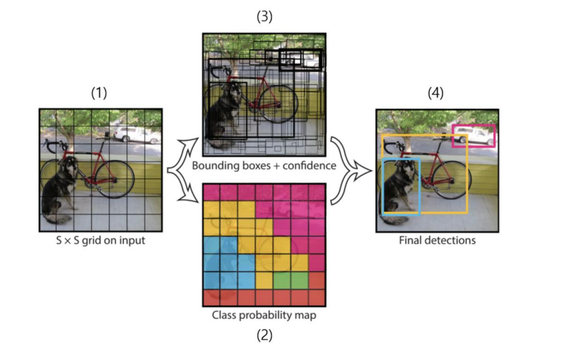

### YOLO v1 예시 (논문 기준)

- 그리드: 7×7
- 셀당 바운딩 박스 수: B=2
- 클래스 수: C=20
- 셀당 출력: 5×2 + 20 = **30개**
- 전체 출력 텐서: **7×7×30 = 1,470**

### Loss Function (SSE 기반)

|손실 종류|내용|
|---|---|
|**Regression Loss**|바운딩 박스 좌표 (x, y, √w, √h) 오차. λ_coord=5|
|**Confidence Loss**|객체 존재 여부 confidence 오차. noobj는 λ_noobj=0.5로 가중치 축소|
|**Classification Loss**|각 클래스 확률 오차|

> ⚠️ w, h에 루트를 씌우는 이유: 큰 객체의 절대 오차가 과도하게 커지는 것을 방지

### YOLO 한계점

- 작은 객체 탐지 성능이 낮음 (그리드 셀당 하나의 객체만 탐지)
- 학습 데이터에 없던 비율의 객체 탐지 어려움
- 바운딩 박스 크기에 상관없이 동일한 loss 적용 → 성능 왜곡 가능

### YOLO 버전 발전

|버전|연도|핵심 변경|
|---|---|---|
|YOLOv1|2016|최초 One-Stage, 단순 구조|
|YOLOv2 (YOLO9000)|2017|속도↑, 소형 객체 성능 개선|
|YOLOv3|2018|다중 스케일 탐지 적용|
|YOLOv4|2020|CSPDarknet 백본, 실시간 성능 극대화|
|YOLOv5|2020|PyTorch 기반, 경량화|
|YOLOv6/v7|2022|속도·정확도 균형 개선|
|YOLOv8|2023|Det + Seg + Pose + OBB + Tracking 통합|
|**YOLOv11**|2025|**현재 권장** — v8 생태계 계승, 정확도·효율 개선|
|YOLOv12|2025|Attention-Centric Object Detection|

### YOLOv8 모델 사이즈

|모델|연산량|정확도|용도|
|---|---|---|---|
|YOLOv8n (nano)|최소|낮음|엣지 디바이스, 실시간|
|YOLOv8s (small)|적음|중하|모바일|
|YOLOv8m (medium)|중간|중간|일반 서버|
|YOLOv8l (large)|많음|높음|고성능 서버|
|YOLOv8x (xlarge)|최대|최고|정확도 우선|

### YOLOv8 실습 코드 (ultralytics)

```python
# pip install ultralytics
from ultralytics import YOLO

# 사전 학습된 모델 로드
model = YOLO('yolov8n.pt')  # nano 모델

# 이미지 추론
results = model('이미지경로.jpg')
results[0].show()  # 결과 시각화

# 웹캠 실시간
results = model(source=0, stream=True)

# 커스텀 데이터 파인튜닝
model.train(data='custom.yaml', epochs=50, imgsz=640)
```

> 💡 **TensorFlow 사용자도 YOLO는 PyTorch(ultralytics) 추천!** API가 단순하여 PyTorch 몰라도 바로 사용 가능. `results = model("이미지경로")` 한 줄이면 됨.

### YOLOv8 활용 프로젝트 아이디어

**Object Detection**

- CCTV 보안 시스템 (침입자 감지, 무단 출입 감지)
- 스마트 주차 관리 (빈 공간 탐지, 불법 주차 감지)
- 교통 모니터링 (번호판 인식 ANPR, 과속·신호 위반)

**Image Classification**

- 질병 진단 보조 (X-ray, CT 분석)
- 제품 불량 검사 (공장 품질 관리)
- 폐기물 분류 시스템

**Instance Segmentation**

- 농작물 병해 감지 및 자동 제초 로봇 연동
- AR 피팅룸 (신체 실루엣 추출)

**특별 응용**

- 자율주행 보조 (보행자·신호등·장애물 탐지)
- 스포츠 분석 (선수 움직임·공 위치 추적)
- OCR 결합 문서 자동 분석

---

## 📚 관련 링크

- YOLO v1~v11 비교: https://www.ultralytics.com/ko/blog/comparing-ultralytics-yolo11-vs-previous-yolo-models
- YOLOv12: https://docs.ultralytics.com/ko/models/yolo12/
- YOLO 설명 (curt-park): https://curt-park.github.io/2017-03-26/yolo/
- 라벨링 툴 종류: https://engineer-mole.tistory.com/287
- OpenCV 예제: https://cafe.daum.net/flowlife/RUrO/15

---
# 📄 yolo1.ipynb — YOLO11 · Object Detection · ultralytics

---

## 🧠 개념 정리

### 💢 YOLO (You Only Look Once)

단일 신경망으로 전체 이미지를 한 번에 처리하는 One-Stage Object Detector. 이미지를 S×S 그리드로 나눠 각 셀에서 바운딩 박스 + 신뢰도 + 클래스 확률을 동시에 예측한다.

```
입력 이미지
  → Resize
  → CNN (Single Forward Pass)
  → S×S 그리드 → 각 셀에서 bbox(x,y,w,h) + confidence + class prob 예측
  → NMS (Non-Maximum Suppression) 으로 중복 박스 제거
  → 최종 Detection 출력
```

### 📦 yolo11n.pt

- `.pt` : PyTorch 모델 가중치 파일
- `yolo11` : YOLO 버전 (Ultralytics YOLO11)
- `n` : nano — 가장 작고 빠른 사이즈

COCO dataset (80개 클래스, 이미지 약 12만 장)으로 사전학습 완료. 첫 실행 시 자동 다운로드.

|모델|속도|정확도|용도|
|---|---|---|---|
|yolo11n (nano)|가장 빠름|낮음|엣지 디바이스|
|yolo11s (small)|빠름|중하|모바일|
|yolo11m (medium)|중간|중간|일반 서버|
|yolo11l (large)|느림|높음|고성능 서버|
|yolo11x (xlarge)|가장 느림|최고|정확도 우선|

### 🔑 box 속성 정리

|속성|설명|비고|
|---|---|---|
|`box.xyxy[0]`|좌상단(x1,y1) + 우하단(x2,y2) 절대 픽셀 좌표|tensor|
|`box.cls[0]`|클래스 인덱스|tensor → `int()` 변환 후 `names` 조회|
|`box.conf[0]`|confidence score = Pr(Object) × IoU|tensor → `.item()` 으로 float 변환|

### ⚠️ BGR vs RGB 주의

|상황|형식|
|---|---|
|`PIL.Image.open()`|RGB|
|`cv2.imread()`|BGR|
|`np.array(PIL Image)`|RGB|
|`cv2.rectangle()`, `cv2.putText()`|BGR 기준으로 그리기|
|`plt.imshow()`|RGB 기준으로 표시|

```
PIL(RGB) → np.array(RGB) → cv2.cvtColor(RGB→BGR) → cv2 그리기
                                                    → cv2.cvtColor(BGR→RGB) → plt.imshow()
```

### 🎨 cv2 색상 (BGR 순서)

|색상|BGR 값|
|---|---|
|초록|`(0, 255, 0)`|
|빨강|`(0, 0, 255)`|
|파랑|`(255, 0, 0)`|
|노랑|`(0, 255, 255)`|
|하늘|`(255, 255, 0)`|

---

## 🗺️ 전체 흐름

```
1. ultralytics 설치
2. YOLO11n 모델 로드 (COCO 80클래스 사전학습)
3. 이미지 로딩 (PIL) + 추론
4. 결과에서 bbox 좌표, 라벨, confidence 추출
5. cv2로 바운딩 박스 + 텍스트 그리기
6. 결과 저장 + 시각화
```

### 📷 샘플 이미지

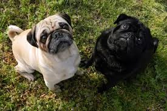

---

## 💻 Cell별 코드 & 주석

### Cell 0 — 환경 설정

```python
import subprocess
import sys

# ultralytics 설치 (Colab 런타임 초기화 시마다 필요)
# 아래 주석은 로컬 환경에서 설치 여부를 먼저 확인하는 방식
# try:
#   from ultralytics import YOLO
#   print('ultralytics가 설치됨')
# except ModuleNotFoundError:
#   subprocess.check_call([sys.executable, '-m', 'pip', 'install', 'ultralytics', 'opencv-python'])
#   from ultralytics import YOLO

! pip install ultralytics opencv-python
```

**📌 출력 결과**

```
Ultralytics 8.4.51 🚀 Python-3.12.13 torch-2.10.0+cpu CPU (Intel Xeon CPU @ 2.20GHz)
Setup complete ✅ (2 CPUs, 12.7 GB RAM, 20.5/107.7 GB disk)
```

---

### Cell 1 — 환경 확인

```python
import ultralytics
ultralytics.checks()  # 설치된 환경 정보 출력 (Python, PyTorch, CPU/GPU 등)
```

---

### Cell 2 — 모델 로드

```python
from ultralytics import YOLO
import ultralytics

print(ultralytics.__version__)

# yolo11n.pt 첫 실행 시 Ultralytics 서버에서 자동 다운로드
model = YOLO('yolo11n.pt')  # nano version : s, m, l, x 중 선택 가능

# COCO dataset으로 학습된 모델 → 80개 클래스 딕셔너리
# {0: 'person', 1: 'bicycle', 2: 'car', ..., 79: 'toothbrush'}
print(model.names, len(model.names))    # 80
```

---

### Cell 3 — 이미지 로딩 및 추론

```python
from PIL import Image
import matplotlib.pyplot as plt
import cv2
import numpy as np
import sys

image_path = 'dog.jpg'

# 이미지 로딩 (PIL — RGB 형식)
try:
    image = Image.open(image_path)
    plt.imshow(image)
    plt.axis('off')
    plt.show()
except Exception as e:
    print(f'load err : {e}')
    sys.exit()

# YOLO 추론 — conf=0.25 : 신뢰도 25% 미만은 결과에서 제외
try:
    results = model(image, conf=0.25)
except Exception as e:
    print(f'inference err : {e}')
    sys.exit()

# PIL Image → numpy 배열로 변환
# image.open() → np.array() 하면 (H, W, 3) RGB 넘파이 배열이 됨
image = np.array(image)
print('image.shape : ', image.shape)   # (H, W, 3)
print('image[0, 0] : ', image[0, 0])  # 좌상단 첫 번째 픽셀 RGB값

# 배열 슬라이싱으로 이미지 일부 영역 자르기 — image[행(y), 열(x)]
cropped = image[:100, :100]  # 좌상단 100×100 픽셀
plt.imshow(cropped)
plt.axis('off')
plt.show()
```

**📌 출력 결과**

```
0: 448x640 2 dogs, 329.4ms
Speed: 26.2ms preprocess, 329.4ms inference, 34.2ms postprocess per image at shape (1, 3, 448, 640)
image.shape :  (183, 275, 3)
image[0, 0] :  [70 61 30]
```

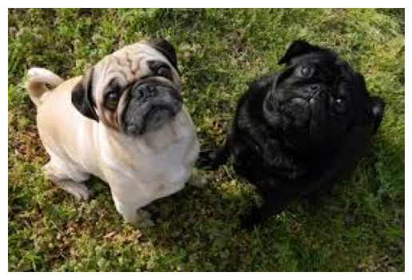 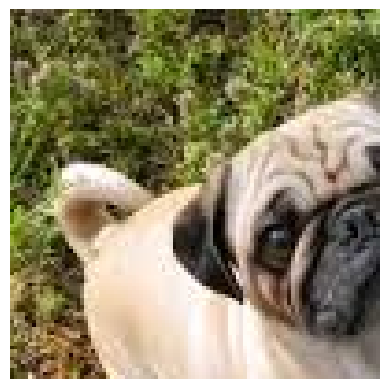

---

### Cell 4 — 바운딩 박스 그리기 + 저장

```python
# numpy 배열(RGB) → OpenCV BGR로 변환 (cv2 그리기 함수 사용을 위해)
image = cv2.cvtColor(image, cv2.COLOR_RGB2BGR)

dog_detected = False  # dog 감지 여부 플래그

for result in results:
    try:
        for box in result.boxes:  # 감지된 객체들의 바운딩 박스 리스트

            # (x1,y1): 좌상단, (x2,y2): 우하단 절대 픽셀 좌표
            x1, y1, x2, y2 = map(int, box.xyxy[0])
            print(x1, y1, x2, y2)

            # box.cls[0] : 클래스 인덱스(tensor) → int 변환 후 names 딕셔너리로 라벨명 조회
            label = result.names[int(box.cls[0])]
            print(label)

            # box.conf[0] : tensor 형태 → .item()으로 Python float 변환
            # confidence = Pr(Object) × IoU
            print('box.conf[0] : ', box.conf[0])  # tensor(0.89)
            confidence = box.conf[0].item()        # 0.8912...
            print('confidence : ', confidence)

            # dog이고 신뢰도 40% 이상일 때만 감지로 판정
            if label == 'dog' and confidence > 0.4:
                dog_detected = True

            # 바운딩 박스 그리기 — (이미지, 좌상단, 우하단, BGR색상, 두께)
            cv2.rectangle(image, (x1, y1), (x2, y2), (0, 255, 0), 2)

            # 텍스트 — 박스 위쪽(y1-10) 위치에 '라벨 신뢰도' 출력
            cv2.putText(image, f'{label} {confidence:.2f}', (x1, y1 - 10),
                        cv2.FONT_HERSHEY_SIMPLEX, 0.5, (0, 255, 0), 2)

    except Exception as e:
        print(f'process err : {e}')

print('dog_detected : ', dog_detected)

# BGR → RGB 변환 후 Matplotlib 출력
plt.imshow(cv2.cvtColor(image, cv2.COLOR_BGR2RGB))
plt.axis('off')
plt.show()

# dog 감지 여부 — 루프 밖에서 플래그로 판단 (마지막 객체 값에 의존하지 않기 위해)
if dog_detected:
    print('개가 보여요~~~')

# 감지 결과 파일 저장 (cv2.imwrite는 BGR 그대로 저장)
cv2.imwrite('yolo1out.jpg', image)

# Colab에서 파일 다운로드
from google.colab import files
files.download('yolo1out.jpg')
```

**📌 출력 결과**

```
11 21 134 151
dog
box.conf[0] :  tensor(0.8912)
confidence :  0.8912...
141 22 261 149
dog
box.conf[0] :  tensor(0.5285)
confidence :  0.5284875
dog_detected :  True
개가 보여요~~~
```

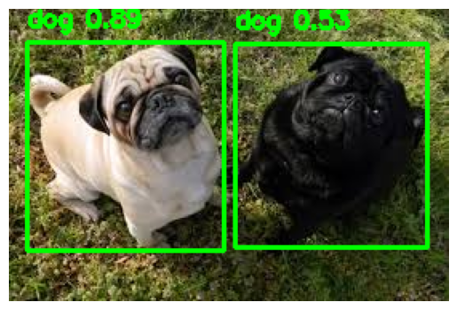

---

# 📄 yolo1(1).ipynb — YOLO11 · 복합 객체 감지 · person · dog · car

---

## 🗺️ 전체 흐름

```
1. ultralytics 설치
2. YOLO11n 모델 로드 (COCO 80클래스 사전학습)
3. 이미지 로딩 (PIL) + 추론
4. 결과에서 bbox 좌표, 라벨, confidence 추출
5. cv2로 바운딩 박스 + 텍스트 그리기
6. 결과 저장 + 시각화
```

### 📷 샘플 이미지

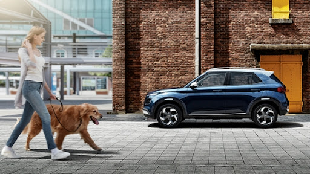

---

## 💻 Cell별 코드 & 주석

### Cell 0 — 환경 설정

```python
import subprocess
import sys

# ultralytics 설치 (Colab 런타임 초기화 시마다 필요)
# try:
#   from ultralytics import YOLO
#   print('ultralytics가 설치됨')
# except ModuleNotFoundError:
#   subprocess.check_call([sys.executable, '-m', 'pip', 'install', 'ultralytics', 'opencv-python'])
#   from ultralytics import YOLO

! pip install ultralytics opencv-python
```

---

### Cell 1 — 환경 확인

```python
import ultralytics
ultralytics.checks()  # 설치된 환경 정보 출력 (Python, PyTorch, CPU/GPU 등)
```

**📌 출력 결과**

```
Ultralytics 8.4.51 🚀 Python-3.12.13 torch-2.10.0+cpu CPU (Intel Xeon CPU @ 2.20GHz)
Setup complete ✅ (2 CPUs, 12.7 GB RAM, 20.5/107.7 GB disk)
```

---

### Cell 2 — 모델 로드

```python
from ultralytics import YOLO
import ultralytics

print(ultralytics.__version__)

# yolo11n.pt 첫 실행 시 Ultralytics 서버에서 자동 다운로드
model = YOLO('yolo11n.pt')  # nano version : s, m, l, x 중 선택 가능

# COCO dataset으로 학습된 모델 → 80개 클래스 딕셔너리
# {0: 'person', 1: 'bicycle', 2: 'car', ..., 79: 'toothbrush'}
print(model.names, len(model.names))    # 80
```

---

### Cell 3 — 이미지 로딩 및 추론

```python
from PIL import Image
import matplotlib.pyplot as plt
import cv2
import numpy as np
import sys

# dog.jpg → yolo_images.jpg 로 변경 (person, dog, car 복합 이미지)
image_path = 'yolo_images.jpg'

# 이미지 로딩 (PIL — RGB 형식)
try:
    image = Image.open(image_path)
    plt.imshow(image)
    plt.axis('off')
    plt.show()
except Exception as e:
    print(f'load err : {e}')
    sys.exit()

# YOLO 추론 — conf=0.25 : 신뢰도 25% 미만은 결과에서 제외
try:
    results = model(image, conf=0.25)
except Exception as e:
    print(f'inference err : {e}')
    sys.exit()

# PIL Image → numpy 배열로 변환
# image.open() → np.array() 하면 (H, W, 3) RGB 넘파이 배열이 됨
image = np.array(image)
print('image.shape : ', image.shape)   # (H, W, 3)
print('image[0, 0] : ', image[0, 0])  # 좌상단 첫 번째 픽셀 RGB값

# 배열 슬라이싱으로 이미지 일부 영역 자르기 — image[행(y), 열(x)]
cropped = image[:100, :100]  # 좌상단 100×100 픽셀
plt.imshow(cropped)
plt.axis('off')
plt.show()
```

**📌 출력 결과**

```
0: 384x640 1 person, 1 car, 1 dog, 237.7ms
Speed: 15.6ms preprocess, 237.7ms inference, 4.9ms postprocess per image at shape (1, 3, 384, 640)
image.shape :  (288, 512, 3)
image[0, 0] :  [241 234 224]
```

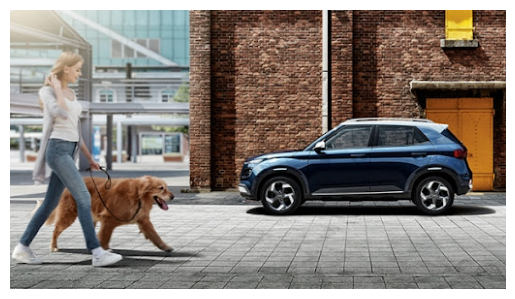 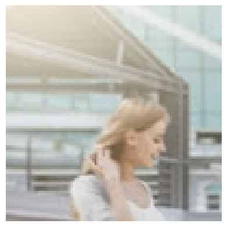

---

### Cell 4 — 바운딩 박스 그리기 + 저장

```python
# numpy 배열(RGB) → OpenCV BGR로 변환 (cv2 그리기 함수 사용을 위해)
image = cv2.cvtColor(image, cv2.COLOR_RGB2BGR)

dog_detected = False  # dog 감지 여부 플래그

for result in results:
    try:
        for box in result.boxes:  # 감지된 객체들의 바운딩 박스 리스트

            # (x1,y1): 좌상단, (x2,y2): 우하단 절대 픽셀 좌표
            x1, y1, x2, y2 = map(int, box.xyxy[0])
            print(x1, y1, x2, y2)

            # box.cls[0] : 클래스 인덱스(tensor) → int 변환 후 names 딕셔너리로 라벨명 조회
            label = result.names[int(box.cls[0])]
            print(label)

            # box.conf[0] : tensor 형태 → .item()으로 Python float 변환
            # confidence = Pr(Object) × IoU
            print('box.conf[0] : ', box.conf[0])
            confidence = box.conf[0].item()
            print('confidence : ', confidence)

            # dog이고 신뢰도 40% 이상일 때만 감지로 판정
            if label == 'dog' and confidence > 0.4:
                dog_detected = True

            # 바운딩 박스 그리기 — (이미지, 좌상단, 우하단, BGR색상, 두께)
            cv2.rectangle(image, (x1, y1), (x2, y2), (0, 255, 0), 2)

            # 텍스트 — 박스 위쪽(y1-10) 위치에 '라벨 신뢰도' 출력
            cv2.putText(image, f'{label} {confidence:.2f}', (x1, y1 - 10),
                        cv2.FONT_HERSHEY_SIMPLEX, 0.5, (0, 255, 0), 2)

    except Exception as e:
        print(f'process err : {e}')

print('dog_detected : ', dog_detected)

# BGR → RGB 변환 후 Matplotlib 출력
plt.imshow(cv2.cvtColor(image, cv2.COLOR_BGR2RGB))
plt.axis('off')
plt.show()

# dog 감지 여부 — 루프 밖에서 플래그로 판단
if dog_detected:
    print('개가 보여요~~~')

# 감지 결과 파일 저장
cv2.imwrite('yolo1out.jpg', image)

# Colab에서 파일 다운로드
from google.colab import files
files.download('yolo1out.jpg')
```

**📌 출력 결과**

```
235 110 478 212
car
box.conf[0] :  tensor(0.9295)
confidence :  0.9295097589492798
1 42 116 263
person
box.conf[0] :  tensor(0.9062)
confidence :  0.9061747193336487
30 168 171 259
dog
box.conf[0] :  tensor(0.8315)
confidence :  0.8315196633338928
dog_detected :  True
개가 보여요~~~
```

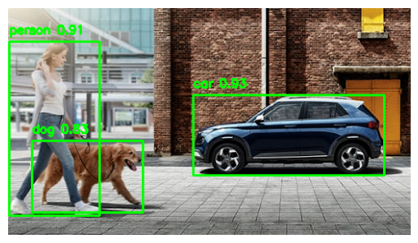

---
# 📄 yolo2score.ipynb — Precision · Recall · mAP · aquarium dataset

---

## 🧠 개념 정리

### 📊 모델 성능 평가 지표

Object Detection에서 모델이 얼마나 잘 감지하는지 측정하는 3가지 핵심 지표.

```
recall    = TP / (TP + FN)   ← 실제 정답을 얼마나 찾았나 (놓친 것 없이)
precision = TP / (TP + FP)   ← 찾은 것 중 얼마나 맞았나 (틀린 것 없이)
```

|지표|설명|
|---|---|
|**Precision**|예측한 것 중 실제 정답 비율 (FP 줄이기)|
|**Recall**|실제 정답 중 찾아낸 비율 (FN 줄이기)|
|**AP**|Precision-Recall 곡선의 면적 (AUC) — 클래스별|
|**mAP**|전체 클래스 AP의 평균|
|**mAP50**|IoU ≥ 0.5 기준으로 TP 판정|
|**mAP50-95**|IoU 0.5~0.95 구간 평균 (COCO 공식 기준, 더 엄격)|

### 🐠 aquarium dataset

Roboflow에서 제공하는 수족관 객체 감지 데이터셋.

```yaml
# data.yaml — YOLO 학습/평가 시 필수 설정 파일
train: ../train/images   # 학습 이미지 경로
val: ../valid/images     # 검증 이미지 경로
test: ../test/images     # 테스트 이미지 경로

nc: 7                    # number of classes — 클래스 수
names: ['fish', 'jellyfish', 'penguin', 'puffin', 'shark', 'starfish', 'stingray']
# 클래스 인덱스: 0=fish, 1=jellyfish, 2=penguin, 3=puffin, 4=shark, 5=starfish, 6=stingray

# Roboflow 메타데이터 (출처 정보)
roboflow:
  workspace: roboflow-100
  project: aquarium-qlnqy
  version: 1
  license: CC BY 4.0
  url: https://universe.roboflow.com/roboflow-100/aquarium-qlnqy/dataset/1
```

> 💡 **data.yaml의 역할**: YOLO는 학습/평가 시 이 파일 하나로 데이터 경로, 클래스 수, 클래스명을 모두 파악한다. `model.val(data='...')` 또는 `model.train(data='...')` 에 이 파일을 넘기면 된다.

|항목|설명|
|---|---|
|`train` / `val` / `test`|이미지 폴더 경로 (라벨은 `images` → `labels`로 자동 매핑)|
|`nc`|클래스 수 (number of classes)|
|`names`|클래스명 리스트 — 인덱스 순서가 라벨 파일의 클래스 ID와 일치해야 함|

### ❓ 점수가 낮은 이유

`yolo11n.pt`는 **COCO 80개 클래스**로 사전학습된 모델이다. aquarium dataset의 7개 클래스(`fish`, `jellyfish` 등)는 COCO에 없는 클래스라 제대로 인식하지 못하는 게 당연하다. 제대로 된 성능을 보려면 aquarium 데이터로 **파인튜닝**이 필요하다.

```python
# 파인튜닝 예시
model.train(data='aquarium_dataset/aquarium_dataset/data.yaml', epochs=50, imgsz=640)
```

---

## 🗺️ 전체 흐름

```
1. aquarium_dataset.zip 압축 해제
2. ultralytics 설치
3. YOLO11n 모델 로드
4. model.val()로 평가 실행
5. Precision, Recall, mAP50, mAP50-95 출력
```

---

## 💻 Cell별 코드 & 주석

### Cell 0 — 데이터셋 압축 해제

```python
# Precision, Recall, mAP 확인하기
!unzip aquarium_dataset.zip -d aquarium_dataset  # zip 해제 → aquarium_dataset/ 폴더 생성
!ls aquarium_dataset                              # 폴더 내용 확인
```

**📌 출력 결과**

```
aquarium_dataset
```

> 압축 해제 후 구조:
> 
> ```
> aquarium_dataset/
> └── aquarium_dataset/
>     ├── data.yaml
>     ├── train/images/, train/labels/
>     ├── valid/images/, valid/labels/
>     └── test/images/,  test/labels/
> ```

---

### Cell 1 — 환경 설치

```python
!pip install ultralytics opencv-python
```

---

### Cell 2 — 모델 평가 (val)

```python
from ultralytics import YOLO

model = YOLO('yolo11n.pt')  # COCO 80클래스 사전학습 모델

# model.val() : 검증 데이터셋으로 성능 평가
# data.yaml 경로에서 val 경로, 클래스 정보를 읽어옴
metrics = model.val(
    data = r'aquarium_dataset/aquarium_dataset/data.yaml',
    imgsz = 640
)

# metrics.box : 바운딩 박스 관련 평가 지표 객체
print('Precision : ', metrics.box.mp)     # mp = mean precision (전체 클래스 평균)
print('Recall : ', metrics.box.mr)        # mr = mean recall
print('mAP50 : ', metrics.box.map50)      # IoU 0.5 기준 mAP
print('mAP50-95 : ', metrics.box.map)     # IoU 0.5~0.95 구간 평균 mAP (더 엄격)

# Precision :  0.02657698596149982
# Recall :  0.0926869970987618
# mAP50 :  0.01988449241985285        IoU 0.5 기준에서 계산한 AP
# mAP50-95 :  0.011751987471109789    mAP50 보다 좀 더 엄격한 기준
# 점수가 낮은 이유는 백본은 COCO dataset(라벨 80개).
# aquarium_dataset(라벨 : 'fish', 'jellyfish', 'penguin', 'puffin', 'shark', 'starfish', 'stingray' 7개)
```

**📌 출력 결과**

```
YOLO11n summary (fused): 100 layers, 2,616,248 parameters, 0 gradients, 6.5 GFLOPs

                 Class     Images  Instances      Box(P          R      mAP50  mAP50-95)
                   all        127        909     0.0266     0.0927     0.0199     0.0118
                person         63        459     0.0481      0.218       0.02    0.00962
               bicycle          9        155          0          0          0          0
                   car         17        104      0.026     0.0673     0.0018   0.000596
            motorcycle         15         74          0          0          0          0
              airplane         28         57     0.0941      0.333      0.115     0.0695
                   bus         17         27          0          0          0          0
                 train         23         33     0.0179     0.0303     0.0025     0.0025

Speed: 12.2ms preprocess, 377.0ms inference, 0.0ms loss, 5.1ms postprocess per image

Precision :  0.02657698596149982
Recall :  0.0926869970987618
mAP50 :  0.01988449241985285
mAP50-95 :  0.011751987471109789
```

> ⚠️ **클래스 불일치 문제**: 출력된 클래스가 `person`, `bicycle`, `car` 등 COCO 클래스로 나오는 건 `yolo11n.pt`가 COCO로 학습된 모델이기 때문. aquarium의 7개 클래스를 인식하려면 해당 데이터로 파인튜닝 필요.

---

## 📊 결과 해석

|지표|값|해석|
|---|---|---|
|Precision|0.027|예측한 100개 중 약 3개만 맞음|
|Recall|0.093|실제 정답 100개 중 약 9개만 찾음|
|mAP50|0.020|IoU 0.5 기준 매우 낮은 탐지 성능|
|mAP50-95|0.012|엄격한 기준에서도 거의 0에 가까움|

> 점수가 낮은 건 **모델 문제가 아니라 데이터 불일치 문제**. COCO로 학습된 모델을 aquarium 데이터로 그냥 평가했기 때문. aquarium 데이터로 파인튜닝하면 성능이 크게 향상된다.

---
# 📄 yolo3.ipynb — 사람 감지 · 중심좌표 · ROI · 복수 이미지 처리

---

## 🧠 개념 정리

### 👤 Person Detection

YOLO가 감지한 객체 중 `label == 'person'` 인 것만 필터링해서 사람 수를 세고 시각화하는 방식. confidence 임계값을 설정해 신뢰도가 낮은 감지 결과는 제외할 수 있다.

### 🎯 중심 좌표 (Center Point)

바운딩 박스의 중심점을 계산해 원(circle)으로 표시하는 기법. 객체 추적(Tracking), 거리 측정, 방향 분석 등에 활용된다.

```python
center_x = (x1 + x2) // 2   # 가로 중심
center_y = (y1 + y2) // 2   # 세로 중심
```

### ✂️ ROI (Region of Interest) — 관심영역 추출

numpy 배열 슬라이싱으로 바운딩 박스 영역만 잘라내는 기법.

```python
cropped = image[y1:y2, x1:x2]   # image[행(y), 열(x)]
```

|저장 방식|소스 이미지|특징|
|---|---|---|
|방법 1|`image` (박스 그려진 버전)|박스·텍스트 포함|
|방법 2|`original` (원본 copy)|깔끔한 원본만|

### 🖼️ 복수 이미지 처리

`model([경로1, 경로2, ...])` 로 여러 이미지를 한 번에 추론할 수 있다. `results`가 리스트로 반환되어 `enumerate(zip(results, image_paths))` 로 순서대로 처리한다.

```python
results = model(['image1.jpg', 'image2.jpg'])
# → results[0] : image1 결과
# → results[1] : image2 결과
```

### 🔍 results 객체 구조

`model(image)` 의 반환값은 `Results` 객체 리스트다.

|속성|설명|
|---|---|
|`result.boxes`|감지된 객체들의 바운딩 박스 리스트|
|`result.names`|클래스 인덱스 → 클래스명 딕셔너리|
|`result.orig_img`|원본 이미지 numpy 배열 (BGR)|
|`result.orig_shape`|원본 이미지 크기 (H, W)|
|`box.xyxy[0]`|좌상단(x1,y1) + 우하단(x2,y2) 좌표|
|`box.cls[0]`|클래스 인덱스|
|`box.conf[0]`|confidence score (tensor)|

---

## 🗺️ 전체 흐름

```
1. 설치 및 모델 로드
2. 단일 이미지 추론 + results 객체 확인
3. 바운딩 박스 그리기 + 사람 수 카운트 + 저장
4. 좌표 출력
5. 신뢰도 필터링
6. ROI 추출 및 저장 (박스 포함 / 원본)
7. 중심 좌표 계산 + 원 표시
8. 복수 이미지 처리 + 시각화
```

---

### 📷 샘플 이미지

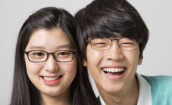 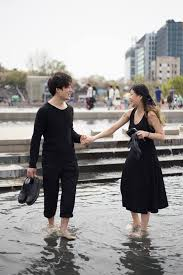

---

## 💻 Cell별 코드 & 주석

### Cell 0 — 환경 설치

```python
# 이미지 감지 후 결과 출력
!pip install ultralytics opencv-python
```

---

### Cell 1 — 라이브러리 및 모델 로드

```python
import cv2
from ultralytics import YOLO
import numpy as np
import matplotlib.pyplot as plt
import os

model = YOLO('yolo11n.pt')  # COCO 80클래스 사전학습 모델
```

---

### Cell 2 — 단일 이미지 추론 + results 확인

```python
image_path = 'yolo_image1.jpg'

# cv2.imread() : BGR 형식으로 이미지 로드
image = cv2.imread(image_path)
if image is None:
    print('이미지를 읽을 수 없어요')
    exit()

# YOLO 추론 — results는 Results 객체 리스트
results = model(image)
# results = model(image, conf=0.8)  # conf 임계값 설정 시 낮은 신뢰도 결과 제외

# results 객체 전체 출력 — 내부 속성 확인용
print(results)
```

**📌 출력 결과**

```
0: 416x640 2 persons, 300.0ms
Speed: 6.0ms preprocess, 300.0ms inference, 6.0ms postprocess per image at shape (1, 3, 416, 640)

[ultralytics.engine.results.Results object with attributes:
boxes: ultralytics.engine.results.Boxes object
names: {0: 'person', 1: 'bicycle', 2: 'car', ...79: 'toothbrush'}
orig_shape: (175, 287)
path: 'image0.jpg'
speed: {'preprocess': 5.9, 'inference': 300.0, 'postprocess': 6.0}]
```

> `results`를 `print()` 하면 내부 속성 전체를 확인할 수 있다. 실제 사용 시에는 `result.boxes`로 접근.

---

### Cell 3 — 바운딩 박스 그리기 + 사람 수 카운트

```python
# 원본 이미지 별도 기억 (ROI 추출 시 박스 없는 원본이 필요)
original = image.copy()

person_count = 0

for result in results:
    for box in result.boxes:
        x1, y1, x2, y2 = map(int, box.xyxy[0])   # 바운딩 박스 좌표
        label = result.names[int(box.cls[0])]      # 클래스명
        confidence = box.conf[0].item()            # 신뢰도 float 변환

        # person인 경우만 카운트 (대소문자 무관하게 비교)
        if label.lower() == 'person':
            person_count += 1

        # 바운딩 박스 그리기 — 노랑(0,255,255) BGR
        cv2.rectangle(image, (x1, y1), (x2, y2), (0, 255, 255), 2)

        # 라벨 + 신뢰도 텍스트 — 초록(0,255,0) BGR
        cv2.putText(image, f'{label}:{confidence:.2f}', (x1, y1 - 10),
                    cv2.FONT_HERSHEY_SIMPLEX, 0.5, (0, 255, 0), 2)

print(f'감지된 사람 수는 {person_count}명')

# BGR → RGB 변환 후 Matplotlib 출력
plt.imshow(cv2.cvtColor(image, cv2.COLOR_BGR2RGB))
plt.axis('off')
plt.title(f'Detected Persons : {person_count}')
plt.show()

# 결과 이미지 저장
output_path = 'yolo3output.jpg'
cv2.imwrite(output_path, image)
print(f'감지된 결과 {output_path}로 저장 성공')
```

**📌 출력 결과**

```
감지된 사람 수는 2명
감지된 결과 yolo3output.jpg로 저장 성공
```

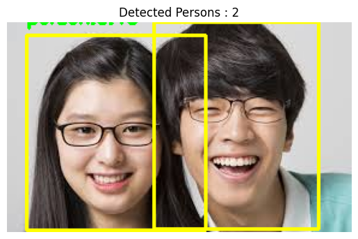

---

### Cell 4 — 바운딩 박스 좌표 출력

```python
print('바운딩 박스 좌표 출력')
for result in results:
    for box in result.boxes:
        label = result.names[int(box.cls[0])]
        confidence = box.conf[0].item()
        x1, y1, x2, y2 = map(int, box.xyxy[0])
        print(f'라벨:{label}: 신뢰도:{confidence}, 좌표=({x1},{y1}),({x2},{y2})')
```

**📌 출력 결과**

```
바운딩 박스 좌표 출력
라벨:person: 신뢰도:0.8158668279647827, 좌표=(122,0),(259,172)
라벨:person: 신뢰도:0.46297913789749146, 좌표=(16,11),(165,173)
```

---

### Cell 5 — 신뢰도 필터링

```python
# 신뢰도 높은 객체만 필터링 (70% 이상)
for idx, result in enumerate(results):
    print(f'전체 라벨 순서 중 이미지 {idx}번째 결과 : ')
    found = False

    for box in result.boxes:
        label = result.names[int(box.cls[0])]
        confidence = box.conf[0].item()
        x1, y1, x2, y2 = map(int, box.xyxy[0])

        if confidence >= 0.7:   # 70% 이상인 것만 출력
            print(f' - {label} {confidence:.2f}')
            found = True

    if not found:
        print(' - 신뢰도 70% 이상 객체가 없어요')
```

**📌 출력 결과**

```
전체 라벨 순서 중 이미지 0번째 결과 :
 - person 0.82
```

> 0.46짜리 person은 임계값(0.7) 미만이라 출력되지 않음. 임계값은 용도에 따라 조정.

---

### Cell 6 — ROI 추출 및 저장

```python
# 바운딩 박스 내부 객체 저장 1 - 바운딩 박스 포함 이미지 저장
for idx, result in enumerate(results):
    for j, box in enumerate(result.boxes):
        label = result.names[int(box.cls[0])]
        confidence = box.conf[0].item()
        x1, y1, x2, y2 = map(int, box.xyxy[0])

        # ROI(Region of Interest) 추출 — numpy 배열 슬라이싱 [행(y), 열(x)]
        cropped = image[y1:y2, x1:x2]

        # 파일명: crop_{이미지idx}_{객체idx}_{라벨}_{신뢰도}.jpg
        crop_path = f'crop_{idx}_{j}_{label}_{confidence:.2f}.jpg'
        cv2.imwrite(crop_path, cropped)
        print(f' -> 객체 {label} 저장 성공 {crop_path}')

# 바운딩 박스 내부 객체 저장 2 - 바운딩 박스 없이 이미지만 저장
os.makedirs('crop_images', exist_ok=True)

for idx, result in enumerate(results):
    for j, box in enumerate(result.boxes):
        label = result.names[int(box.cls[0])]
        confidence = box.conf[0].item()
        x1, y1, x2, y2 = map(int, box.xyxy[0])

        # original(박스 그리기 전 원본)에서 ROI 추출 → 박스 없이 깔끔하게 저장
        cropped = original[y1:y2, x1:x2]

        crop_path = os.path.join('crop_images', f'crop_{idx}_{j}_{label}_{confidence:.2f}.jpg')
        cv2.imwrite(crop_path, cropped)
        print(f' -> 객체 {label} 저장(바운딩박스 X) 성공 {crop_path}')
```

**📌 출력 결과**

```
 -> 객체 person 저장 성공 crop_0_0_person_0.82.jpg
 -> 객체 person 저장 성공 crop_0_1_person_0.46.jpg
 -> 객체 person 저장(바운딩박스 X) 성공 crop_images/crop_0_0_person_0.82.jpg
 -> 객체 person 저장(바운딩박스 X) 성공 crop_images/crop_0_1_person_0.46.jpg
```

---

### Cell 7 — 중심 좌표 계산 + 원 표시

```python
# 감지된 객체에 중심 좌표 출력 + 시각화
person_count = 0

for result in results:
    for box in result.boxes:
        label = result.names[int(box.cls[0])]
        confidence = box.conf[0].item()
        x1, y1, x2, y2 = map(int, box.xyxy[0])

        # 바운딩 박스 중심 좌표 계산
        center_x = (x1 + x2) // 2
        center_y = (y1 + y2) // 2

        if label.lower() == 'person':
            person_count += 1
            print(f'person => {person_count}: 중심좌표 = ({center_x},{center_y}), 신뢰도:{confidence:.2f}')

            # 중심점에 빨간 원 표시 — radius=5, thickness=-1(채우기)
            cv2.circle(image, (center_x, center_y), 5, (0, 0, 255), -1)

            coord_text = f'({center_x},{center_y})'
            cv2.putText(image, f'{label}:{confidence:.2f}', (x1, y1 - 10),
                        cv2.FONT_HERSHEY_SIMPLEX, 0.5, (0, 255, 0), 2)

plt.figure(figsize=(6, 5))
plt.imshow(cv2.cvtColor(image, cv2.COLOR_BGR2RGB))
plt.axis('off')
plt.title(f'{person_count} (include center points)')
plt.show()
```

**📌 출력 결과**

```
person => 1: 중심좌표 = (190,86), 신뢰도:0.82
person => 2: 중심좌표 = (90,92), 신뢰도:0.46
```

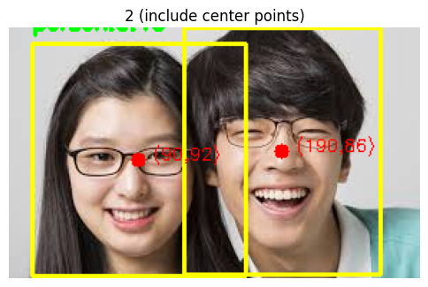

---

### Cell 8 — 복수 이미지 처리

```python
# 복수 이미지 처리 — 리스트로 넘기면 한 번에 추론
image_paths = ['yolo_image1.jpg', 'yolo_image2.jpg']
results = model(image_paths)

# 이미지 수만큼 subplot 생성
fig, axes = plt.subplots(1, len(image_paths), figsize=(10, 5))

for idx, (result, image_path) in enumerate(zip(results, image_paths)):
    print(f'\n이미지 {idx} ({image_path}) 결과 : ')
    found = False

    # 각 이미지를 개별로 읽어서 처리 (BGR → RGB)
    image = cv2.imread(image_path)
    image = cv2.cvtColor(image, cv2.COLOR_BGR2RGB)

    for box in result.boxes:
        label = model.names[int(box.cls[0])]   # model.names로 직접 접근
        confidence = box.conf[0].item()
        x1, y1, x2, y2 = map(int, box.xyxy[0])

        if confidence >= 0.4:   # 40% 이상만 표시
            found = True
            print(f' - {label} {confidence:.2f}')

            # 하늘색(0,255,255) 박스, 빨강(255,0,0) 텍스트
            cv2.rectangle(image, (x1, y1), (x2, y2), (0, 255, 255), 2)
            cv2.putText(image, f'{label}:{confidence:.2f}', (x1, y1 - 5),
                        cv2.FONT_HERSHEY_SIMPLEX, 0.6, (255, 0, 0), 2)

    if not found:
        print('신뢰도 40% 이상 감지된 객체가 없어요')

    axes[idx].imshow(image)
    axes[idx].set_title(f'image {idx}')
    axes[idx].axis('off')

plt.tight_layout()
plt.show()
```

**📌 출력 결과**

```
0: 640x640 2 persons, 206.3ms
1: 640x640 3 persons, 1 handbag, 206.3ms
Speed: 4.0ms preprocess, 206.3ms inference, 1.4ms postprocess per image

이미지 0 (yolo_image1.jpg) 결과 :
 - person 0.78
 - person 0.43

이미지 1 (yolo_image2.jpg) 결과 :
 - person 0.83
 - person 0.73
 - handbag 0.45
```

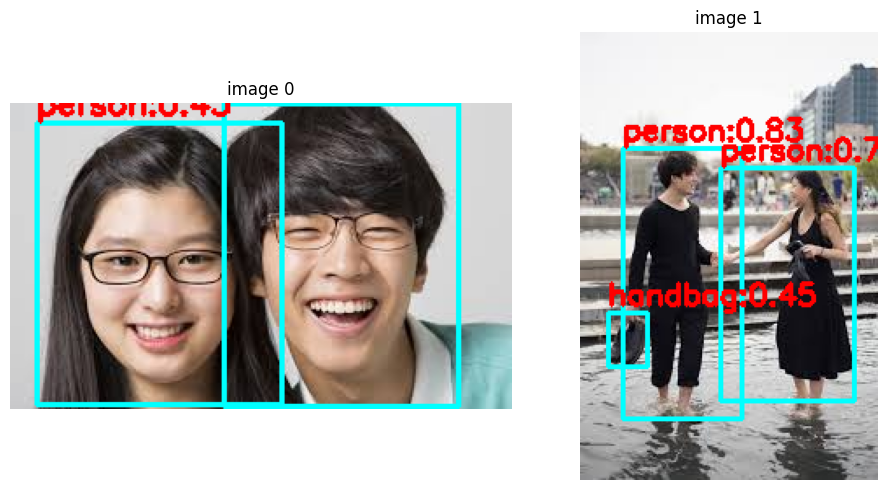

---
# 📄 yolo_webcam.py — YOLO11 · 웹캠 실시간 감지 · 자동 저장

> 💡 수업 직접 실습 코드는 아니고, 강사님이 참고용으로 공유해주신 코드

---

## 🧠 개념 정리

### 📹 웹캠 실시간 감지 흐름

```
웹캠 열기 (VideoCapture)
  → 프레임 읽기 (cap.read())
  → 좌우 반전 (flip)
  → YOLO 추론 (model(frame))
  → 필터링 (신뢰도 + 타겟 라벨)
  → 박스 + 텍스트 그리기
  → 조건 충족 시 이미지 저장
  → FPS 표시
  → 화면 출력 (imshow)
  → q 또는 ESC로 종료
```

### ⏱️ FPS (Frames Per Second)

초당 처리되는 프레임 수. 값이 높을수록 부드러운 실시간 감지.

```python
fps = 1 / (현재시간 - 이전시간)
```

### 🕒 저장 쿨다운 (SAVE_COOLDOWN)

같은 객체가 연속으로 감지될 때 매 프레임마다 저장하면 파일이 폭발적으로 쌓인다. 마지막 저장 시간을 딕셔너리로 기록해 일정 간격 이상일 때만 저장한다.

```python
last_saved = {}  # {라벨명: 마지막 저장 시간}

if current_time - last_saved.get(label, 0) > SAVE_COOLDOWN:
    # 저장 실행
    last_saved[label] = current_time
```

### 🎯 TARGET_LABELS

감지할 클래스를 set으로 지정해 원하는 객체만 필터링. COCO 80개 클래스 중 일부만 골라서 사용.

```python
TARGET_LABELS = {
    "cell phone", "laptop", "keyboard", "mouse", "cup",
    "book", "backpack", "handbag", "umbrella", "toothbrush"
}

if label not in TARGET_LABELS:
    continue   # 타겟 아닌 객체는 스킵
```

---

## 🗺️ 전체 흐름

```
1. 설정값 정의 (모델, 저장 경로, 타겟 라벨, 임계값 등)
2. YOLO 모델 로드
3. 웹캠 열기 + 해상도 설정
4. 메인 루프
   ├── 프레임 읽기 + 좌우 반전
   ├── YOLO 추론
   ├── 신뢰도 + 타겟 라벨 필터링
   ├── 바운딩 박스 + 텍스트 그리기
   ├── 쿨다운 체크 후 이미지 저장
   ├── FPS 계산 + 화면 표시
   └── q / ESC 종료
5. 자원 해제 (cap.release, destroyAllWindows)
```

---

## 💻 전체 코드 & 주석

```python
import cv2
import time
import os
from ultralytics import YOLO

# ───────────── 설정값 ─────────────
MODEL_PATH = "yolo11n.pt"
WINDOW_NAME = "YOLO Webcam Detection"
SAVE_DIR = "saved"                  # 감지된 객체 저장 폴더

# 감지할 객체 — COCO 클래스명 중 원하는 것만 set으로 지정
TARGET_LABELS = {
    "cell phone", "laptop", "keyboard", "mouse", "cup",
    "book", "backpack", "handbag", "umbrella", "toothbrush"
}

CONFIDENCE_THRESHOLD = 0.55   # 신뢰도 55% 미만은 무시
SAVE_COOLDOWN = 5             # 같은 객체 저장 간격 (초) — 중복 저장 방지
FRAME_DELAY = 0.03            # 프레임 처리 간격 (초) — CPU 사용량 조절

# 웹캠 해상도
FRAME_WIDTH = 640
FRAME_HEIGHT = 480

# ───────────── 초기화 ─────────────
os.makedirs(SAVE_DIR, exist_ok=True)  # 저장 폴더 없으면 생성

print("YOLO 모델 로드 중...")
model = YOLO(MODEL_PATH)
print("모델 로드 완료")

# 웹캠 열기 — 0 = 기본 카메라
cap = cv2.VideoCapture(0)

if not cap.isOpened():
    print("웹캠을 열 수 없습니다.")
    exit()

# 해상도 설정
cap.set(cv2.CAP_PROP_FRAME_WIDTH, FRAME_WIDTH)
cap.set(cv2.CAP_PROP_FRAME_HEIGHT, FRAME_HEIGHT)
print("웹캠 연결 성공")

# 창 생성 및 크기 조절
cv2.namedWindow(WINDOW_NAME, cv2.WINDOW_NORMAL)
cv2.resizeWindow(WINDOW_NAME, 900, 700)

# 객체별 마지막 저장 시간 기록용 딕셔너리
last_saved = {}

# 색상 정의 (BGR)
BOX_COLOR = (0, 255, 0)     # 초록 박스
TEXT_COLOR = (255, 255, 255) # 흰색 텍스트

# FPS 계산용
prev_time = time.time()

# ───────────── 메인 루프 ─────────────
while True:
    success, frame = cap.read()  # 프레임 읽기

    if not success:
        print("프레임 읽기 실패")
        break

    # 좌우 반전 — 셀피 카메라처럼 거울 효과
    frame = cv2.flip(frame, 1)

    # YOLO 추론 — verbose=False: 추론 로그 출력 안 함
    results = model(frame, verbose=False)

    # ───────────── 객체 처리 ─────────────
    for result in results:
        for box in result.boxes:
            class_id = int(box.cls[0])
            label = model.names[class_id]     # 클래스명
            confidence = float(box.conf[0])   # 신뢰도

            # 신뢰도 필터 — 임계값 미만 스킵
            if confidence < CONFIDENCE_THRESHOLD:
                continue

            # 타겟 라벨 필터 — 원하는 객체만 처리
            if label not in TARGET_LABELS:
                continue

            # 바운딩 박스 좌표
            x1, y1, x2, y2 = map(int, box.xyxy[0])

            # 박스 그리기
            cv2.rectangle(frame, (x1, y1), (x2, y2), BOX_COLOR, 2)

            # 라벨 + 신뢰도 텍스트
            text = f"{label} {confidence:.2f}"
            cv2.putText(frame, text, (x1, y1 - 10),
                        cv2.FONT_HERSHEY_SIMPLEX, 0.6, TEXT_COLOR, 2)

            # ───────────── 저장 처리 ─────────────
            current_time = time.time()
            last_time = last_saved.get(label, 0)  # 해당 라벨의 마지막 저장 시간 (없으면 0)

            # 쿨다운 시간 이상 지났을 때만 저장
            if current_time - last_time > SAVE_COOLDOWN:
                filename = f"{label}_{int(current_time)}.jpg"
                filepath = os.path.join(SAVE_DIR, filename)
                cv2.imwrite(filepath, frame)
                print(f"[저장 완료] {filepath}")
                last_saved[label] = current_time  # 저장 시간 갱신

    # ───────────── FPS 계산 ─────────────
    current = time.time()
    fps = 1 / (current - prev_time)
    prev_time = current

    # FPS 화면 좌상단 표시
    cv2.putText(frame, f"FPS: {fps:.1f}", (15, 35),
                cv2.FONT_HERSHEY_SIMPLEX, 0.8, (0, 0, 255), 2)

    # 화면 출력
    cv2.imshow(WINDOW_NAME, frame)

    # 종료 키 — q 또는 ESC
    key = cv2.waitKey(1) & 0xFF
    if key == ord("q") or key == 27:
        break

    # CPU 사용량 감소를 위한 딜레이
    time.sleep(FRAME_DELAY)

# ───────────── 종료 처리 ─────────────
cap.release()             # 웹캠 자원 해제
cv2.destroyAllWindows()   # 열린 창 모두 닫기
print("프로그램 종료")
```

---

## 📌 핵심 포인트 정리

### cv2 웹캠 관련 함수

|함수|설명|
|---|---|
|`cv2.VideoCapture(0)`|기본 웹캠 열기|
|`cap.set(CAP_PROP_FRAME_WIDTH, 640)`|해상도 설정|
|`cap.read()`|프레임 읽기 → `(success, frame)` 반환|
|`cv2.flip(frame, 1)`|좌우 반전 (1=수평, 0=수직, -1=둘다)|
|`cv2.namedWindow(name, WINDOW_NORMAL)`|크기 조절 가능한 창 생성|
|`cv2.resizeWindow(name, w, h)`|창 크기 설정|
|`cv2.imshow(name, frame)`|프레임 화면 출력|
|`cv2.waitKey(1)`|1ms 대기 + 키 입력 감지|
|`cap.release()`|웹캠 자원 해제|
|`cv2.destroyAllWindows()`|모든 창 닫기|

### 설정값 튜닝 가이드

|설정|기본값|조정 방향|
|---|---|---|
|`CONFIDENCE_THRESHOLD`|0.55|높이면 정확↑ 감지수↓, 낮추면 반대|
|`SAVE_COOLDOWN`|5초|낮추면 더 자주 저장|
|`FRAME_DELAY`|0.03초|높이면 CPU 부하↓ 대신 FPS↓|
|`TARGET_LABELS`|11개|COCO 80개 클래스 중 원하는 것 추가/제거|
