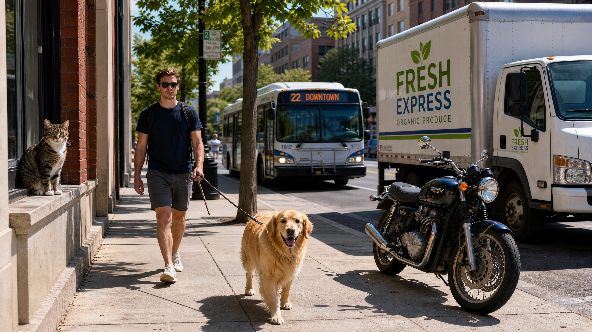
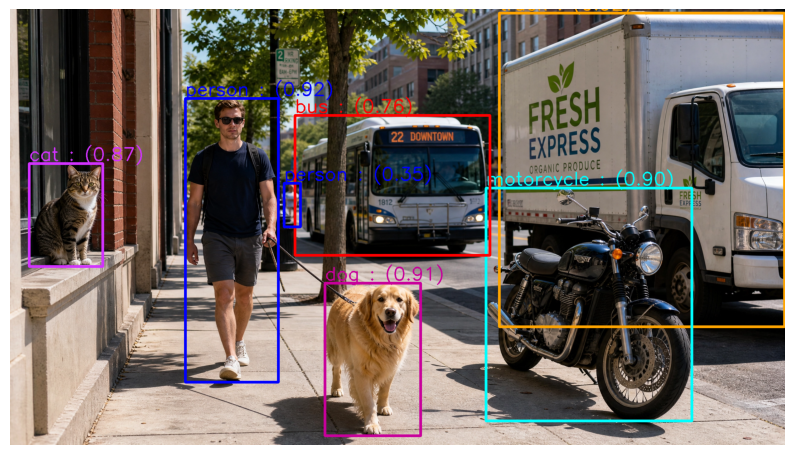
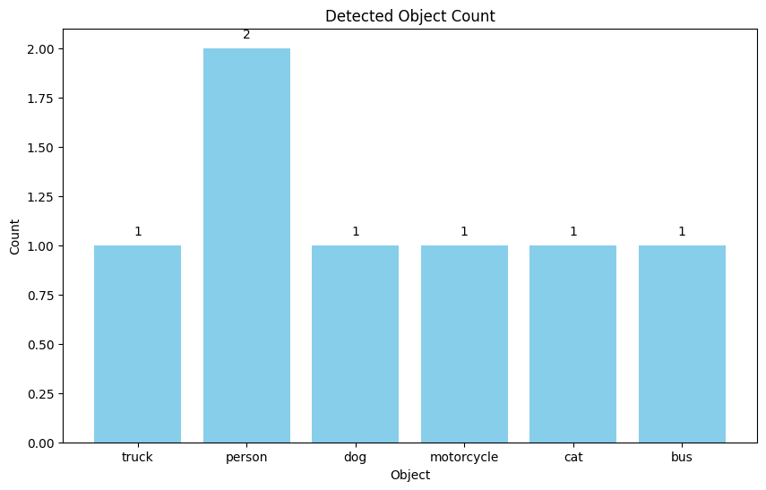
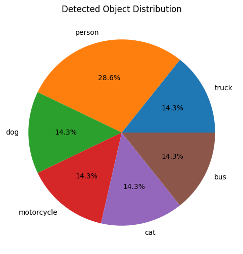
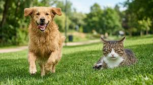
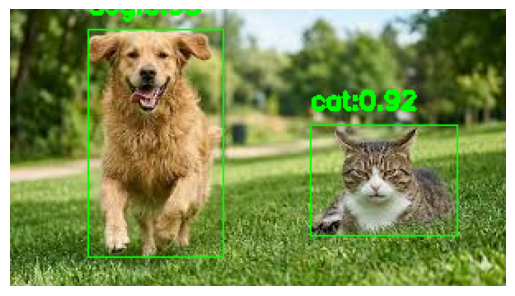
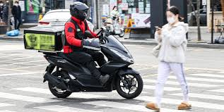
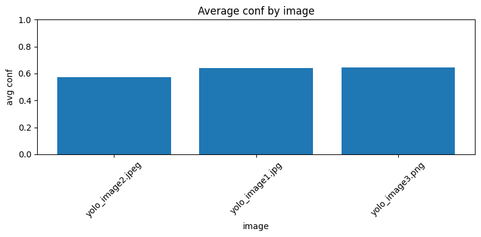

# Day 70_딥러닝 : YOLO 객체 감지 · TTS 음성 안내 · DataFrame 통계 분석

## 📅 2026-05-19

---
# 📄 yolo4img_info.ipynb — YOLO · 객체 감지 · 바운딩박스 · 설명 출력 · 통계 시각화

---

## 🧠 개념 정리

### 💢 YOLO 추론 결과 구조

`model(image)` 호출 시 반환되는 `results` 객체의 내부 구조.

```
results[0]
├── .boxes              → 감지된 모든 바운딩박스 목록
│   ├── .xyxy[0]        → [x1, y1, x2, y2] 절대 픽셀 좌표 (tensor)
│   ├── .cls[0]         → 클래스 인덱스 (tensor → int() 변환 필요)
│   └── .conf[0]        → 신뢰도 0.0~1.0 (tensor → .item() 변환 필요)
└── .names              → {인덱스: 클래스명} 딕셔너리 (80개 COCO 클래스)
```

|속성|설명|변환 방법|
|---|---|---|
|`box.xyxy[0]`|좌상단(x1,y1) + 우하단(x2,y2) 절대 픽셀 좌표|`map(int, box.xyxy[0])`|
|`box.cls[0]`|클래스 인덱스 번호|`int(box.cls[0])` → `result.names[인덱스]`|
|`box.conf[0]`|confidence = Pr(Object) × IoU|`box.conf[0].item()`|

---

### 🎨 cv2 색상 (BGR 순서)

OpenCV는 이미지를 **BGR** 순서로 처리한다. RGB와 순서가 반대.

|색상|BGR 값|
|---|---|
|파랑|`(255, 0, 0)`|
|초록|`(0, 255, 0)`|
|빨강|`(0, 0, 255)`|
|주황|`(0, 165, 255)`|
|노랑|`(0, 255, 255)`|
|보라|`(200, 0, 200)`|

```python
# BGR → RGB 변환 (matplotlib 출력 시 필수)
plt.imshow(cv2.cvtColor(image, cv2.COLOR_BGR2RGB))

# 저장은 BGR 그대로
cv2.imwrite('out.jpg', image)
```

---

### 📦 `Counter` — 객체 개수 자동 집계

```python
from collections import Counter

detected_objects = ['person', 'car', 'person', 'dog', 'car', 'car']
object_count = Counter(detected_objects)
# Counter({'car': 3, 'person': 2, 'dog': 1})

object_count.items()    # dict_items([('car', 3), ('person', 2), ('dog', 1)])
object_count.keys()     # 클래스명 목록
object_count.values()   # 개수 목록
```

리스트 내 요소를 자동으로 집계해주는 딕셔너리 서브클래스.

---

### 📝 f-string 따옴표 충돌

f-string 안에서 딕셔너리 키 접근 시 따옴표가 충돌할 수 있다.

```python
# ❌ 외부 ', 내부 ' 충돌
f'감지된 객체 : {', '.join(set(detected_objects))}'

# ✅ 외부 ", 내부 ' 로 구분
f"감지된 객체 : {', '.join(set(detected_objects))}"

# ✅ 딕셔너리 접근도 동일하게
f" = {d['label']}: box={d['box']}"
```

---

### 📊 `plt.bar()` 반환값 활용

```python
# ❌ 반환값 받지 않으면 막대 위 숫자 표시 불가 → NameError
plt.bar(labels, counts, color='skyblue')
for b in bars: ...   # NameError: bars

# ✅ 반드시 변수에 받아야 각 막대(BarContainer) 순회 가능
bars = plt.bar(labels, counts, color='skyblue')
for b in bars:
    height = b.get_height()
    plt.text(b.get_x() + b.get_width() / 2, height + 0.05, str(height), ha='center')
```

---

## 🗺️ 전체 흐름

```
1. 라이브러리 설치 (ultralytics, opencv-python)
2. 객체별 설명 딕셔너리 정의 (object_info)
3. YOLO 모델 로드 → 이미지 추론
4. 바운딩박스 + 신뢰도 텍스트 시각화 → 결과 이미지 저장
5. 감지된 객체별 설명 출력 → .txt 파일 저장
6. Counter로 객체 개수 집계 → .csv 파일 저장
7. 위험 객체 감지 알림
8. 바차트 / 파이차트 시각화
```

### 📷 테스트 이미지



---

## 💻 Cell별 코드 & 주석

### Cell 0 — 환경 설치

```python
# YOLO 모델 및 OpenCV 설치 (Colab 런타임 초기화 시마다 필요)
!pip install ultralytics opencv-python
```

---

### Cell 1 — Import 및 객체 정보 딕셔너리 정의

```python
import cv2
from ultralytics import YOLO
import matplotlib.pyplot as plt
from datetime import datetime
import urllib.parse
import csv
from collections import Counter

# 감지 대상 객체별 설명, 활용 사례, 위키 링크 정의
# YOLO가 반환하는 클래스명을 key로 사용 → 감지 즉시 바로 조회 가능
object_info = {
    "person": {
        "description": "이 객체는 사람이 감지된 경우입니다. 사람 감지는 보안 감시, 출입 관리 시스템 등에 매우 유용합니다.",
        "use_case": "보안 시스템에서 출입 관리, 비상 상황 대처, 헬스케어 분야에서 노인 및 환자 모니터링에 사용됩니다.",
        # urllib.parse.quote() : 한글 → URL 인코딩 변환 (위키피디아 링크 생성)
        "link": "https://ko.wikipedia.org/wiki/{}".format(urllib.parse.quote("사람"))
    },
    "car":        { "description": "...", "use_case": "...", "link": "..." },
    "truck":      { "description": "...", "use_case": "...", "link": "..." },
    "motorcycle": { "description": "...", "use_case": "...", "link": "..." },
    "dog":        { "description": "...", "use_case": "...", "link": "..." },
    "cat":        { "description": "...", "use_case": "...", "link": "..." },
    "bus":        { "description": "...", "use_case": "...", "link": "..." },
    "bird":       { "description": "...", "use_case": "...", "link": "..." },
}
```

---

### Cell 2 — YOLO 모델 로드 및 객체 감지 + 바운딩박스

```python
# YOLO nano 모델 로드 (COCO 80클래스 사전학습, 첫 실행 시 자동 다운로드)
model = YOLO('yolo11n.pt')

# 이미지 읽기 (OpenCV — BGR 형식으로 로드됨)
image_path = "yolo4_test.png"
image = cv2.imread(image_path)

if image is None:
    print('이미지가 없어요')
    exit()

# YOLO 추론 실행
results = model(image)

detected_objects = []   # 감지된 객체 레이블 저장

for result in results:
    for box in result.boxes:

        # 바운딩박스 좌표 추출 (좌상단 x1,y1 / 우하단 x2,y2)
        x1, y1, x2, y2 = map(int, box.xyxy[0])

        # int() 필수 — tensor 인덱스를 정수로 변환해야 names 딕셔너리 조회 가능
        label = result.names[int(box.cls[0])]

        # .item() — tensor → Python float 변환
        confidence = box.conf[0].item()
        detected_objects.append(label)

        # 객체별 색상 지정 (BGR 순서 주의!)
        colors = {
            'person':     (255, 0, 0),      # 파랑
            'car':        (0, 255, 0),      # 초록
            'truck':      (0, 165, 255),    # 주황
            'motorcycle': (0, 255, 255),    # 노랑
            'dog':        (155, 0, 200),    # 보라
            'cat':        (255, 50, 210),   # 분홍
            'bus':        (0, 0, 255),      # 빨강
            'bird':       (5, 10, 20)       # 거의 검정
        }
        # 미등록 객체는 흰색으로 표시
        color = colors.get(label, (255, 255, 255))

        # 바운딩박스 그리기 — (이미지, 좌상단, 우하단, BGR색상, 두께)
        cv2.rectangle(image, (x1, y1), (x2, y2), color, 8)

        # 객체명 + 신뢰도 텍스트 — 바운딩박스 위쪽(y1-10)에 표시
        cv2.putText(
            image,
            f"{label} : ({confidence:.2f})",
            (x1, y1 - 10),             # 바운딩박스 바로 위
            cv2.FONT_HERSHEY_SIMPLEX,  # 폰트 종류
            2,                         # 폰트 크기
            color,
            3                          # 텍스트 두께
        )

# 타임스탬프로 고유 파일명 생성 후 저장
timestamp = datetime.now().strftime('%Y%m%d_%H%M%S')
output_path = f'output_{timestamp}.jpg'
cv2.imwrite(output_path, image)
print(f'{output_path} 파일로 감지된 이미지 저장')

# BGR → RGB 변환 후 matplotlib 출력 (matplotlib은 RGB 기준)
plt.figure(figsize=(10, 8))
plt.imshow(cv2.cvtColor(image, cv2.COLOR_BGR2RGB))
plt.axis('off')
plt.show()
```

**📌 출력 결과**

```
0: 384x640 2 persons, 1 motorcycle, 1 bus, 1 truck, 1 cat, 1 dog, 124.4ms
Speed: 3.5ms preprocess, 124.4ms inference, 1.0ms postprocess per image at shape (1, 3, 384, 640)
output_20260519_073109.jpg 파일로 감지된 이미지 저장
```



---

### Cell 3 — 객체별 설명 텍스트 출력 및 .txt 저장

```python
description_text = ""

# set() 으로 중복 제거 후 순회 → 같은 객체 설명이 중복 출력되지 않도록
for obj in set(detected_objects):
    if obj in object_info:   # object_info에 등록된 객체만 처리
        description_text += f"\n[{obj} 감지됨]\n"
        description_text += f"설명:{object_info[obj]['description']}\n"
        description_text += f"사용 사례:{object_info[obj]['use_case']}\n"
        description_text += f"내용:{object_info[obj]['link']}\n"

print('객체 설명 : ', description_text)

# 감지 결과를 .txt 파일로 저장
log_file = 'yolo4desc.txt'
with open(log_file, mode='w', encoding='utf-8') as log:
    # f-string 따옴표 충돌 방지 → 외부 큰따옴표, 내부 작은따옴표 사용
    log.write(f'[{timestamp}] 감지된 객체 : {", ".join(set(detected_objects))}\n')
    log.write(description_text + '\n\n')

print(f'객체 감지 정보가 {log_file}에 저장')
```

**📌 출력 결과 (yolo4desc.txt)**

```
[20260519_073109] 감지된 객체 : dog, bus, truck, person, motorcycle, cat

[dog 감지됨]
설명: 이 객체는 강아지가 감지된 경우입니다. 강아지 감지는 반려동물 보호, 유기 동물 탐지 및 동물원 관리 등에서 중요합니다.
사용 사례: 강아지 감지는 동물 보호 시스템, 유기 동물 탐지 시스템 및 스마트 펫 모니터링 시스템에 사용됩니다.
내용: https://ko.wikipedia.org/wiki/%EA%B0%95%EC%95%84%EC%A7%80
...
```

---

### Cell 4 — 객체 통계 카운팅, CSV 저장, 위험 객체 감지, 시각화

```python
# Counter : 리스트 요소 개수를 딕셔너리 형태로 자동 집계
object_count = Counter(detected_objects)
print('객체 개수 : ')
for obj, count in object_count.items():
    print(f'{obj} : {count}개')

# 감지 결과를 CSV로 저장 (타임스탬프 + 객체명)
csv_file = 'yolo4obj_stat.csv'
with open(csv_file, mode='w', newline='', encoding='utf-8') as f:
    writer = csv.writer(f)
    for obj in detected_objects:
        writer.writerow([timestamp, obj])
print(f'객체 통계가 {csv_file}로 저장 ~~~')

# 위험 객체 감지 알림
danger_obj = ['knife', 'fire', 'motorcycle']
for obj in detected_objects:
    if obj in danger_obj:
        print(f'위험 객체 감지 됨 : {obj}')

labels = list(object_count.keys())
counts = list(object_count.values())

# 바차트 — bars 변수에 반드시 할당해야 막대 위 숫자 표시 가능
plt.figure(figsize=(10, 6))
bars = plt.bar(labels, counts, color='skyblue')
plt.title('Detected Object Count')
plt.xlabel('Object')
plt.ylabel('Count')

for b in bars:
    height = b.get_height()
    plt.text(
        b.get_x() + b.get_width() / 2,   # 막대 가운데 x 위치
        height + 0.05,                    # 막대 위쪽 y 위치
        str(height),
        ha='center'
    )
plt.show()

# 파이차트
plt.figure(figsize=(6, 6))
plt.pie(counts, labels=labels, autopct='%1.1f%%')
plt.title('Detected Object Distribution')
plt.show()
```

**📌 출력 결과**

```
객체 개수 :
truck : 1개
person : 2개
motorcycle : 1개
cat : 1개
dog : 1개
bus : 1개
위험 객체 감지 됨 : motorcycle
객체 통계가 yolo4obj_stat.csv로 저장 ~~~
```

 

---

## ⚠️ 자주 발생한 버그 모음

| 버그                                                         | 원인                                                               | 해결                                                           |
| ---------------------------------------------------------- | ---------------------------------------------------------------- | ------------------------------------------------------------ |
| `NameError: YOLO is not defined`                           | 런타임 재시작 후 import 누락                                              | 셀 순서대로 전체 재실행                                                |
| `AttributeError: module 'datetime' has no attribute 'now'` | `import datetime`(모듈) vs `from datetime import datetime`(클래스) 혼용 | `datetime.datetime.now()` 또는 `from datetime import datetime` |
| `TypeError: Image data of dtype <U12`                      | `plt.imshow(파일경로)` — 문자열 전달                                      | `plt.imshow(cv2.cvtColor(image, cv2.COLOR_BGR2RGB))`         |
| `error: putText() missing required argument`               | `cv2.putText()` 인자 누락                                            | img, text, org, font, scale, color, thickness 순서대로 전달        |
| `NameError: bars`                                          | `plt.bar()` 반환값 변수에 미할당                                          | `bars = plt.bar(...)`                                        |
| f-string 따옴표 충돌                                            | f-string 내외부 따옴표 동일                                              | 외부 `"`, 내부 `'` 로 구분                                          |
| `endswith TypeError`                                       | `endswith('a', 'b')` — 튜플 아닌 복수 인자 전달                            | `endswith(('.jpg', '.png'))` — 튜플로 감싸기                       |

---
# 📄 yolo5tts.ipynb — YOLO · 유기동물 감지 · gTTS · 보호소 안내 · 로그 저장

---

## 🧠 개념 정리

### 💢 TTS (Text To Speech)

텍스트를 음성으로 변환하는 기술. 이 실습에서는 `gTTS` 라이브러리를 사용해  
YOLO로 감지된 유기동물 정보를 음성으로 안내하는 시스템을 구현한다.

|라이브러리|역할|환경|
|---|---|---|
|`gTTS`|텍스트 → MP3 음성 파일 생성 (Google TTS API)|모든 환경|
|`IPython.display.Audio`|Jupyter / Colab에서 오디오 재생|Colab, Jupyter|
|`playsound`|로컬 환경에서 MP3 파일 직접 재생|VSCode, 로컬|

```python
# gTTS 기본 사용법
from gtts import gTTS

tts = gTTS(text="안녕하세요", lang='ko')   # 한국어 TTS 생성
tts.save("output.mp3")                     # MP3 파일로 저장

# Colab / Jupyter 재생
from IPython.display import Audio
Audio("output.mp3", autoplay=True)

# 로컬(VSCode) 재생
from playsound import playsound
playsound("output.mp3")
```

---

### 💢 유기동물 판단 로직

이미지 파일명에 포함된 키워드로 유기동물 여부를 간이 판단하는 방식.

```
감지된 동물이 dog 또는 cat
        AND
이미지 경로에 'street', 'road', 'outside', 'stray' 포함
        ↓
유기동물로 판단 → 보호소 정보 텍스트 + 음성 안내
```

> 실제 서비스에서는 GPS 위치, CCTV 위치 정보, 목줄 유무 등 추가 조건으로 판단 정확도를 높일 수 있다.

---

### 💢 `shelters.get(region, shelters['기본'])` — 딕셔너리 안전 조회

```python
shelters = {
    "서울": "서울 반려동물 보호센터:02-1234-5678",
    "기본": "전국 유기동물 보호연합:1577-8888"
}

# region이 딕셔너리 키와 정확히 일치해야 조회 가능
# region = "테헤란로 사거리" → 키 없음 → '기본' 반환
shelter_info = shelters.get(region, shelters['기본'])

# 더 유연한 방법 — 지역명 포함 여부로 매칭
for key in shelters:
    if key in region:            # "서울"이 "테헤란로 사거리 서울"에 포함되면 매칭
        shelter_info = shelters[key]
        break
```

---

### 💢 로그 파일 누적 저장 — `mode='a'` vs `mode='w'`

```python
# 'w' : 덮어쓰기 — 실행할 때마다 파일 내용 초기화
with open('log.txt', 'w') as f: ...

# 'a' : 누적 추가 — 실행할 때마다 파일 끝에 내용 추가
with open('log.txt', 'a') as f: ...
```

탐지 결과를 시간순으로 누적 기록하려면 반드시 `'a'` 모드 사용.

---

### 💢 `any()` — 조건 하나라도 True이면 True

```python
detected_pets = ['dog', 'cat']
stray_keywords = ['street', 'road', 'outside', 'stray']
image_path = 'street_ani.jpeg'

# detected_pets 중 dog 또는 cat이 하나라도 있으면 True
any(pet in ['dog', 'cat'] for pet in detected_pets)   # True

# image_path에 stray_keywords 중 하나라도 포함되면 True
any(keyword in image_path.lower() for keyword in stray_keywords)   # True ('street' 포함)
```

---

## 🗺️ 전체 흐름

```
1. 라이브러리 설치 (ultralytics, playsound, gtts)
2. gTTS TTS 연습 — 텍스트 → MP3 → 재생
3. 보호소 안내 함수 정의 (텍스트 출력 + 음성 안내)
4. YOLO로 이미지에서 dog / cat 감지
5. 바운딩박스 그리기 → 결과 이미지 저장
6. 탐지 결과 .txt 로그 누적 저장
7. 유기동물 조건 판단 → 보호소 정보 음성 안내
```

### 📷 테스트 이미지



---

## 💻 Cell별 코드 & 주석

### Cell 0 — 환경 설치

```python
# YOLO, OpenCV, TTS 관련 라이브러리 설치
# playsound==1.2.2 : 최신 버전은 Colab에서 호환 문제 있음 → 버전 고정 필수
!pip install ultralytics opencv-python playsound==1.2.2
!pip install gtts
```

---

### Cell 1 — gTTS TTS 연습

```python
from gtts import gTTS                   # Google TTS : 텍스트 → MP3 변환
from IPython.display import Audio       # Colab / Jupyter 오디오 재생용
from playsound import playsound         # 로컬(VSCode 등) 오디오 재생용

def speakFunc(message):
    # gTTS 객체 생성 — lang='ko' : 한국어 TTS
    tts = gTTS(text=message, lang='ko')
    tts.save("yolotest.mp3")                        # MP3 파일로 저장
    return Audio("yolotest.mp3", autoplay=True)     # Colab에서 자동 재생
    # playsound('yolotest.mp3')                     # 로컬 환경에서 재생 시 사용

message = '유기 동물이 감지되었습니다. 가까운 보호소로 연락해 주세요.'
speakFunc(message)
```

> **💡 환경별 재생 방법**
> 
> - Colab / Jupyter : `IPython.display.Audio` — 노트북 내 오디오 플레이어로 재생
> - 로컬(VSCode) : `playsound` — 시스템 기본 플레이어로 재생  
>     두 방법을 동시에 사용하지 않도록 한 쪽을 주석 처리한다.

> **🎵 생성된 음성 파일**
> 
> - `yolotest.mp3` : TTS 연습용 — 텍스트를 한국어 음성으로 변환한 파일  
>     GitHub에서는 mp3 미리보기가 지원되지 않으므로 로컬 환경에서 재생할 것.

---

### Cell 2 — 보호소 안내 함수 정의 및 테스트

```python
import cv2
from ultralytics import YOLO
from gtts import gTTS
from IPython.display import Audio
from datetime import datetime
import matplotlib.pyplot as plt

# 보호소 정보 안내 — 텍스트 출력 + 음성 재생
def show_shelter_info_func(region, shelters, detected_info):
    # 지역명으로 보호소 조회, 없으면 '기본' 보호소 반환
    shelter_info = shelters.get(region, shelters['기본'])
    pet_summary = f"{detected_info['count']}마리 ({', '.join(detected_info['labels'])})"

    message = (
        f"유기 동물 탐지 결과:\n"
        f" - 탐지된 동물 수:{detected_info['count']}\n"
        f" - 종류:{detected_info['labels']}\n"
        f"{region} 지역 보호소 정보:\n{shelter_info}"
    )
    print("보호소 정보 : ", message)

    # 음성 안내 — 실패해도 프로그램이 중단되지 않도록 try/except 처리
    try:
        tts = gTTS(
            text=f"{region} 지역에 유기된 {pet_summary}가 감지되었습니다. 가까운 보호소는 {shelter_info}입니다.",
            lang='ko'
        )
        tts.save('yolo5shelter.mp3')
        display(Audio('yolo5shelter.mp3', autoplay=True))   # Colab 재생
        # playsound('yolo5shelter.mp3')                     # 로컬 재생
    except Exception as e:
        print(f'음성안내 실패 : {e}')

# 유기동물 탐지 시 호출되는 진입 함수
def handle_stray_pet_func(region, shelters, detected_info):
    print('유기 동물로 추정됨')
    show_shelter_info_func(region, shelters, detected_info)

# 테스트 실행
region = "테헤란로 사거리 삼원빌딩 앞"
shelters = {
    "서울": "서울 반려동물 보호센터:02-1234-5678",
    "기본": "전국 유기동물 보호연합:1577-8888"
}
detected_info = {
    "count": 3,
    "labels": ["호랑이", "사자", "코끼리"]
}

handle_stray_pet_func(region, shelters, detected_info)
```

**📌 출력 결과**

```
유기 동물로 추정됨
보호소 정보 :  유기 동물 탐지 결과:
 - 탐지된 동물 수:3
 - 종류:['호랑이', '사자', '코끼리']
테헤란로 사거리 삼원빌딩 앞 지역 보호소 정보:
전국 유기동물 보호연합:1577-8888
```

> **💡 `region` 매칭 주의**  
> `shelters.get("테헤란로 사거리 삼원빌딩 앞", ...)` → 키가 없으므로 `'기본'` 반환.  
> 세부 주소로 보호소를 찾으려면 키 포함 여부(`key in region`)로 매칭해야 한다.

> **🎵 생성된 음성 파일**
> 
> - `yolo5shelter.mp3` : 테스트용 보호소 안내 음성 — 더미 데이터(호랑이, 사자, 코끼리)로 생성  
>     예) _"테헤란로 사거리 삼원빌딩 앞 지역에 유기된 3마리 (호랑이, 사자, 코끼리)가 감지되었습니다."_  
>     GitHub에서는 mp3 미리보기가 지원되지 않으므로 로컬 환경에서 재생할 것.

---

### Cell 3 — 본격 유기동물 감지 + 로그 저장 + 보호소 음성 안내

```python
# 탐지 정보 로그 저장 함수
def save_detection_log_func(image_path, detection_data):
    log_file = 'yolo5log.txt'
    now = datetime.now().strftime('%Y-%m-%d %H:%M:%S')

    # 'a' 모드 : 누적 추가 저장 (실행할 때마다 기존 내용 유지)
    with open(log_file, 'a', encoding='utf-8') as f:
        f.write(f'{now} 이미지:{image_path}\n')
        f.write(f'탐지된 객체 수 : {len(detection_data)}\n')
        for d in detection_data:
            # f-string 따옴표 충돌 방지 → 외부 큰따옴표, 내부 작은따옴표
            f.write(f" = {d['label']}: box={d['box']}, confidence={d['confidence']:.2f}\n")
        f.write('-' * 40 + '\n')
    print(f'탐지 결과가 {log_file}에 저장됨')


# 유기동물 감지 메인 함수
def detect_pets_func(image_path):
    # 감지 대상 — YOLO 클래스명 : 한글 표시명
    pet_desc = {
        'dog': '댕댕이',
        'cat': '냥이'
    }
    shelters = {
        "서울": "서울 반려동물 보호센터:02-1234-5678",
        "부산": "부산 유기동물 보호소:051-1234-9876",
        "기본": "전국 유기동물 보호연합:1577-8888"
    }
    # 이미지 경로에 이 키워드가 포함되면 유기동물 가능성이 있다고 판단
    stray_keywords = ['street', 'road', 'outside', 'stray']

    model = YOLO('yolov8s.pt')   # small 모델 — nano보다 정확도 높음
    image = cv2.imread(image_path)

    if image is None:
        print('이미지를 부를 수 없어요')
        return

    results = model(image)
    detected_pets = []      # 감지된 객체 레이블 저장
    detection_data = []     # 감지된 객체 상세 정보 저장

    for result in results:
        for box in result.boxes:
            x1, y1, x2, y2 = map(int, box.xyxy[0])
            label = result.names[int(box.cls[0])]   # int() 필수
            confidence = box.conf[0].item()          # tensor → float

            # dog, cat만 처리 (pet_desc에 등록된 객체만)
            if label in pet_desc:
                detected_pets.append(label)
                detection_data.append({
                    'label': pet_desc[label],        # 한글 표시명으로 저장
                    'box': (x1, y1, x2, y2),
                    'confidence': confidence
                })
                # 바운딩박스 + 텍스트 그리기
                cv2.rectangle(image, (x1, y1), (x2, y2), (0, 255, 0), 1)
                cv2.putText(image, f'{label}:{confidence:.2f}', (x1, y1 - 10),
                            cv2.FONT_HERSHEY_SIMPLEX, 0.5, (0, 255, 0), 2)

    # 결과 이미지 저장 및 출력
    output_path = 'yolo5out.jpg'
    cv2.imwrite(output_path, image)

    # BGR → RGB 변환 후 matplotlib 출력
    plt.imshow(cv2.cvtColor(image, cv2.COLOR_BGR2RGB))
    plt.axis('off')
    plt.show()

    if detected_pets:   # 감지된 동물이 있는 경우
        print('\n유기 동물 탐지 결과:')
        for pet in set(detected_pets):
            print(f' - {pet_desc.get(pet, pet)}')

    # 탐지 결과를 로그 파일에 누적 저장
    save_detection_log_func(image_path, detection_data)

    # 유기동물 조건 판단
    # 조건1 : 감지된 동물이 dog 또는 cat
    # 조건2 : 이미지 경로에 stray_keywords 중 하나라도 포함
    if any(pet in ['dog', 'cat'] for pet in detected_pets) and \
            any(keyword in image_path.lower() for keyword in stray_keywords):
        detected_info = {
            'count': len(detection_data),
            # 중복 제거 후 정렬된 한글 레이블 목록
            'labels': sorted(set([d['label'] for d in detection_data]))
        }
        # 유기동물로 판단 → 보호소 정보 텍스트 + 음성으로 안내
        handle_stray_pet_func(region="서울", shelters=shelters, detected_info=detected_info)
    else:
        print('유기동물이 감지되지 않았어요')


detect_pets_func('street_ani.jpeg')
```

**📌 출력 결과 (yolo5log.txt)**

```
2026-05-19 06:33:19 이미지:street_ani.jpeg
탐지된 객체 수 : 2
 = 댕댕이: box=(47, 12, 129, 150), confidence=0.93
 = 냥이: box=(182, 70, 271, 137), confidence=0.92
----------------------------------------
```



> **💡 모델별 감지 정확도 차이**  
> `yolo11n` (nano) : 새끼 고양이를 강아지로 오인하는 경우 발생  
> `yolov8s` (small) : nano보다 정확하나 동일 이미지에서도 실행마다 결과가 다를 수 있음  
> → confidence가 낮은 결과 (`conf=0.1` 이하)는 오인식 가능성이 높음

> **🎵 생성된 음성 파일**
> 
> - `yolo5shelter.mp3` : 실제 감지 후 보호소 안내 음성 — Cell 2와 같은 파일명이므로 실행 시 덮어씌워짐  
>     예) _"서울 지역에 유기된 2마리 (댕댕이, 냥이)가 감지되었습니다. 가까운 보호소는 서울 반려동물 보호센터:02-1234-5678입니다."_  
>     GitHub에서는 mp3 미리보기가 지원되지 않으므로 로컬 환경에서 재생할 것.

---

## ⚠️ 자주 발생한 버그 모음

|버그|원인|해결|
|---|---|---|
|`from gtts import GTTS`|클래스명 대소문자 오류|`from gtts import gTTS` (소문자 g)|
|`playsound` 버전 오류|최신 버전 Colab 호환 문제|`playsound==1.2.2` 버전 고정|
|보호소 항상 `'기본'` 반환|`region`이 딕셔너리 키와 불일치|`key in region` 포함 여부로 매칭|
|음성 안내 실패 시 프로그램 중단|예외 처리 없음|`try/except`로 감싸기|
|로그 파일 덮어써짐|`open(mode='w')` 사용|`open(mode='a')`로 누적 저장|

---

## 📊 감지 결과 요약 (street_ani.jpeg 기준)

|실행 시각|감지 수|내용|
|---|---|---|
|06:24:13|2|댕댕이 × 2 (0.93, 0.64)|
|06:26:13|3|냥이 × 2, 댕댕이 × 1|
|06:33:19|2|댕댕이 0.93, 냥이 0.92 ← 최적 결과|
|06:52:57|2|댕댕이 0.93, 냥이 0.92|

> **관찰** : 동일 이미지라도 실행할 때마다 감지 결과가 다를 수 있다.  
> YOLO는 내부적으로 결정론적(deterministic) 연산이지만,  
> Colab GPU 환경의 부동소수점 연산 순서에 따라 미세한 차이가 발생할 수 있다.

---
# 📄 yolo6dataframe.ipynb — YOLO · DataFrame · 요약 통계 · CSV · 시각화

---

## 🧠 개념 정리

### 💢 전체 파이프라인 개요

여러 이미지를 YOLO로 일괄 추론한 뒤, 결과를 DataFrame으로 정리하고  
요약 통계를 뽑아 CSV로 저장 및 시각화하는 파이프라인.

```
여러 이미지 일괄 추론
  → 이미지별 감지 결과를 records 리스트에 딕셔너리로 수집
  → pd.DataFrame(records) 으로 표 형태 변환
  → CSV 저장 (yolo6report.csv)
  → CSV 로드 → 요약 통계 출력
  → 바차트 시각화
```

---

### 💢 `.cpu().numpy()` — tensor → numpy 변환

YOLO 추론 결과는 PyTorch tensor 형태로 반환된다.  
pandas / numpy 연산을 하려면 반드시 numpy 배열로 변환해야 한다.

```python
# GPU tensor → CPU 메모리로 이동 → numpy 배열로 변환
cls_id = boxes.cls.cpu().numpy().astype(int)   # 클래스 인덱스 배열
confs  = boxes.conf.cpu().numpy()              # 신뢰도 배열

# 예시 결과
cls_id  # [0, 0, 3, 0, 0, 2]
confs   # [0.895, 0.885, 0.847, 0.694, 0.283, 0.259]
```

|메서드|역할|
|---|---|
|`.cpu()`|GPU tensor를 CPU 메모리로 이동 (CPU 환경에서도 호출 가능)|
|`.numpy()`|PyTorch tensor → numpy 배열 변환|
|`.astype(int)`|float 배열 → 정수 배열 변환 (클래스 인덱스용)|

---

### 💢 `pd.DataFrame(records)` — 리스트 of 딕셔너리 → DataFrame

```python
records = [
    {'image': 'img1.jpg', 'object_count': 3, 'classes': 'person,car', 'avg_confidence': 0.85},
    {'image': 'img2.jpg', 'object_count': 0, 'classes': '',            'avg_confidence': 0.0},
]

df = pd.DataFrame(records)
#         image  object_count      classes  avg_confidence
# 0    img1.jpg             3   person,car           0.850
# 1    img2.jpg             0                         0.000
```

딕셔너리의 key가 자동으로 컬럼명이 된다.

---

### 💢 `df.describe()` — 수치형 컬럼 요약 통계

```python
df[['object_count', 'avg_confidence']].describe()
```

|통계량|설명|
|---|---|
|`count`|데이터 개수|
|`mean`|평균|
|`std`|표준편차|
|`min` / `max`|최솟값 / 최댓값|
|`25%` / `50%` / `75%`|사분위수|

---

### 💢 `df.loc[df['컬럼'].idxmax()]` — 최댓값 행 추출

```python
# object_count가 가장 큰 행 전체를 반환
max_row = mydf.loc[mydf['object_count'].idxmax()]

# idxmax() : 최댓값의 인덱스 번호 반환
# loc[인덱스] : 해당 인덱스의 행 반환
```

---

### 💢 `class_counts` — 클래스별 등장 이미지 수 집계

CSV에 저장된 `classes` 컬럼은 `'car,motorcycle,person'` 형태의 문자열.  
이를 파싱해서 클래스별로 몇 개 이미지에 등장했는지 집계한다.

```python
class_counts = {}
for cls_str in mydf['classes']:
    if cls_str:                          # 빈 문자열(감지 없음) 제외
        for c in cls_str.split(','):     # 'car,motorcycle,person' → ['car', 'motorcycle', 'person']
            class_counts[c] = class_counts.get(c, 0) + 1

# {'person': 3, 'handbag': 1, 'car': 1, 'motorcycle': 1}
```

---

## 🗺️ 전체 흐름

```
1. 라이브러리 설치 (ultralytics, opencv-python)
2. images/ 폴더의 이미지 경로 목록 수집
3. 이미지별 YOLO 추론 → records 리스트에 결과 수집
4. DataFrame 변환 → CSV 저장 (yolo6report.csv)
5. CSV 로드 → 요약 통계 출력 (총 객체 수, confidence 평균, describe)
6. 가장 많이 감지된 이미지 출력
7. 이미지별 평균 신뢰도 바차트 시각화
```

### 📷 테스트 이미지

  

---

## 💻 Cell별 코드 & 주석

### Cell 0 — 환경 설치

```python
# 이미지 탐지 결과를 CSV 저장한 후 이를 읽어 DataFrame에 저장 → 요약 통계 처리
!pip install ultralytics opencv-python
```

---

### Cell 1 — 이미지 일괄 추론 및 records 수집

```python
import os
import pandas as pd
from ultralytics import YOLO

model = YOLO('yolo11n.pt')
img_dir = "images"

# images/ 폴더에서 jpg, jpeg, png 파일 경로만 수집
# endswith()는 튜플로 전달해야 함 — endswith('.jpg', '.png') 는 TypeError
img_paths = [os.path.join(img_dir, f) for f in os.listdir(img_dir)
             if f.lower().endswith((".jpg", ".jpeg", ".png"))]
print('img_paths : ', img_paths)
# ['images/yolo_image3.png', 'images/yolo_image1.jpg', 'images/yolo_image2.jpeg']

records = []   # 이미지별 감지 결과를 딕셔너리로 수집하는 리스트

for path in img_paths:
    # verbose=False : 추론 로그 출력 억제
    results = model(path, conf=0.25, verbose=False)
    boxes = results[0].boxes
    names = results[0].names   # {0: 'person', 1: 'bicycle', ...} COCO 80클래스

    # 감지된 객체가 없는 경우 → 빈 레코드 추가 후 다음 이미지로
    if len(boxes) == 0:
        records.append({
            'image': os.path.basename(path),
            'object_count': 0,
            'classes': '',
            'avg_confidence': 0.0
        })
        continue

    # tensor → CPU numpy 배열로 변환 (pandas 연산을 위해 필수)
    cls_id = boxes.cls.cpu().numpy().astype(int)   # 클래스 인덱스 배열
    print('cls_id : ', cls_id)     # [0 0 3 0 0 2]

    confs = boxes.conf.cpu().numpy()               # 신뢰도 배열
    print('confs : ', confs)       # [0.895 0.885 0.847 0.694 0.283 0.259]

    # 클래스 인덱스 → 클래스명으로 변환
    classes = [names[i] for i in cls_id]
    print('classes : ', classes)   # ['person', 'person', 'motorcycle', 'person', 'person', 'car']

    avg_conf = float(confs.mean())   # 이미지 내 전체 객체 신뢰도 평균

    records.append({
        'image': os.path.basename(path),
        'object_count': len(cls_id),                      # 감지된 객체 수
        'classes': ','.join(sorted(set(classes))),         # 중복 제거 후 정렬된 클래스명
        'avg_confidence': round(avg_conf, 3)              # 소수점 3자리 반올림
    })
```

**📌 출력 결과**

```
img_paths :  ['images/yolo_image2.jpeg', 'images/yolo_image1.jpg', 'images/yolo_image3.png']

# yolo_image3.png (오토바이 배달원 이미지)
cls_id :  [0 3 0 2]
confs :  [0.895 0.847 0.694 0.259]
classes :  ['person', 'motorcycle', 'person', 'car']
```

---

### Cell 2 — DataFrame 변환 및 CSV 저장

```python
# records 리스트(딕셔너리 목록) → DataFrame으로 변환
# 딕셔너리의 key가 자동으로 컬럼명이 됨
df = pd.DataFrame(records)
print(df)

# CSV 저장 (index=False : 행 번호 컬럼 제외)
df.to_csv('yolo6report.csv', index=False, encoding='utf-8')
```

**📌 출력 결과 (DataFrame)**

```
              image  object_count              classes  avg_confidence
0  yolo_image2.jpeg             4       handbag,person           0.571
1   yolo_image1.jpg             2               person           0.639
2   yolo_image3.png             6  car,motorcycle,person           0.644
```

**📌 출력 결과 (yolo6report.csv)**

```
image,object_count,classes,avg_confidence
yolo_image2.jpeg,4,"handbag,person",0.571
yolo_image1.jpg,2,person,0.639
yolo_image3.png,6,"car,motorcycle,person",0.644
```

---

### Cell 3 — CSV 로드, 요약 통계, 시각화

```python
# CSV 파일 로드
mydf = pd.read_csv('yolo6report.csv')
print(mydf)

num_images = len(df)
total_objects = df['object_count'].sum()   # 전체 이미지 탐지 객체 총 개수
print('total_objects : ', total_objects)

# confidence > 0인 행만 필터링하여 전체 평균 계산
overall_avg_conf = mydf.loc[mydf['avg_confidence'] > 0]['avg_confidence'].mean()

print(f'총 이미지 수 : {num_images}')
print(f'총 탐지 개수 : {total_objects}')
print(f'전체 confidence 평균 : {overall_avg_conf:.3f}')

# 클래스별 등장 이미지 수 집계
# classes 컬럼은 'car,motorcycle,person' 형태의 문자열 → split(',')으로 파싱
class_counts = {}
for cls_str in mydf['classes']:
    if cls_str:                        # 빈 문자열(감지 없음) 제외
        for c in cls_str.split(','):
            class_counts[c] = class_counts.get(c, 0) + 1

print('클래스 별 등장 이미지 수 : ')
for k, v in class_counts.items():
    print(f' {k} : {v}')

# 수치형 컬럼 요약 통계 (count, mean, std, min, 25%, 50%, 75%, max)
print(mydf[['object_count', 'avg_confidence']].describe())

# object_count가 가장 큰 행 추출
# idxmax() : 최댓값의 인덱스 반환 → loc[]으로 해당 행 조회
max_row = mydf.loc[mydf['object_count'].idxmax()]
print('가장 많이 감지된 이미지 : ', max_row)

import matplotlib.pyplot as plt

# 이미지별 평균 신뢰도 바차트
plt.figure(figsize=(8, 4))
plt.bar(mydf['image'], mydf['avg_confidence'])
plt.title('Average conf by image')
plt.xlabel('image')
plt.ylabel('avg conf')
plt.ylim(0, 1)          # y축 범위 0~1 고정 (신뢰도 범위에 맞춤)
plt.xticks(rotation=45) # x축 레이블 45도 회전 (파일명 겹침 방지)
plt.tight_layout()      # 레이블 잘림 방지
plt.show()
```

**📌 출력 결과**

```
총 이미지 수 : 3
총 탐지 개수 : 12
전체 confidence 평균 : 0.618

클래스 별 등장 이미지 수 :
 handbag : 1
 person : 3
 car : 1
 motorcycle : 1

       object_count  avg_confidence
count      3.000000        3.000000
mean       4.000000        0.618000
std        2.000000        0.040620
min        2.000000        0.571000
25%        3.000000        0.605000
50%        4.000000        0.639000
75%        5.000000        0.641500
max        6.000000        0.644000

가장 많이 감지된 이미지 :
image              yolo_image3.png
object_count                     6
classes    car,motorcycle,person
avg_confidence               0.644
```



---

## ⚠️ 자주 발생한 버그 모음

|버그|원인|해결|
|---|---|---|
|`endswith TypeError`|`endswith('.jpg', '.png')` — 튜플 아닌 복수 인자|`endswith(('.jpg', '.png'))` — 괄호로 튜플 명시|
|tensor 연산 오류|pandas에 tensor 직접 전달|`.cpu().numpy()` 변환 후 사용|
|`overall_avg_conf` 계산 오류|`mydf.loc[조건]` 까지만 작성, `.mean()` 누락|`mydf.loc[mydf['avg_confidence'] > 0]['avg_confidence'].mean()`|
|CSV 저장 시 행 번호 컬럼 추가됨|`to_csv()` 기본값 `index=True`|`df.to_csv('file.csv', index=False)`|

---

## 📊 감지 결과 요약

|이미지|감지 수|클래스|평균 신뢰도|
|---|---|---|---|
|yolo_image1.jpg|2|person|0.639|
|yolo_image2.jpeg|4|handbag, person|0.571|
|yolo_image3.png|6|car, motorcycle, person|0.644|

> **관찰** : `yolo_image3.png`(오토바이 배달원)이 가장 많은 객체(6개) 감지.  
> `yolo_image2.jpeg`(물가의 두 사람)는 신뢰도가 가장 낮음(0.571) — handbag 오인식 가능성 있음.