# Day 72_패스파인딩 : 다익스트라 · 플로이드워셜 · 벨만포드 · A스타 · 통신이론 · Flask

## 📅 2026-05-21

---
# 📄 dijkstra.py — 다익스트라 · 최단경로 · 우선순위큐

## 📌 개요

|항목|내용|
|---|---|
|알고리즘|다익스트라 (Dijkstra)|
|목적|단일 시작 노드 → 모든 노드까지 최단거리|
|자료구조|힙(Heap) 기반 우선순위 큐 (`heapq`)|
|시간복잡도|$O(E \log V)$|
|제약|**음수 간선 불가**|

---

## 🧠 동작 과정

① 시작 노드와 직접 연결된 미방문 노드들의 거리를 확인  
② 현재까지 구한 거리보다 짧은 경로가 있으면 갱신  
③ 미방문 노드 중 거리가 가장 짧은 노드 선택  
④ 선택된 노드까지의 거리는 최단거리로 확정 (고정)  
⑤ 미방문 노드가 없을 때까지 반복

---

## 🖼️ 동작 과정 시각화

**Step 1** — 시작 노드 0 설정, 인접 노드 거리 초기화

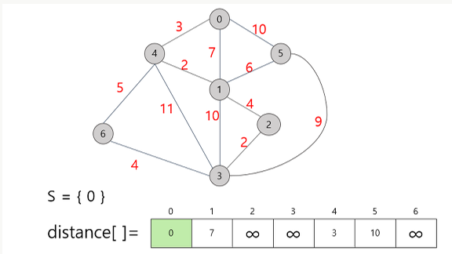

> `S = {0}` / distance = [0, 7, ∞, ∞, 3, 10, ∞]  
> 가장 짧은 거리 → **노드 4 (거리 3)** 선택

---

**Step 2** — 노드 4 추가, 노드 4를 경유하는 경로로 갱신

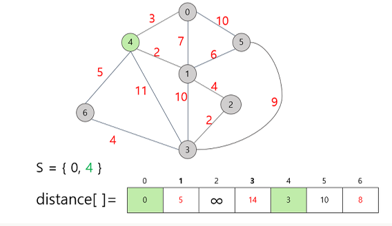

> `S = {0, 4}` / distance = [0, **5**, ∞, 14, 3, 10, **8**]  
> 노드 1: 7 → 5 갱신 / 노드 6: ∞ → 8 갱신

---

**Step 3** — 노드 1 추가, 노드 2 경로 개통

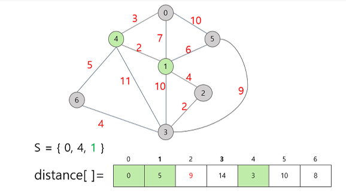

> `S = {0, 4, 1}` / distance = [0, 5, **9**, 14, 3, 10, 8]  
> 노드 2: ∞ → 9 갱신

---

**Step 4** — 노드 6 추가, 노드 3 경로 갱신

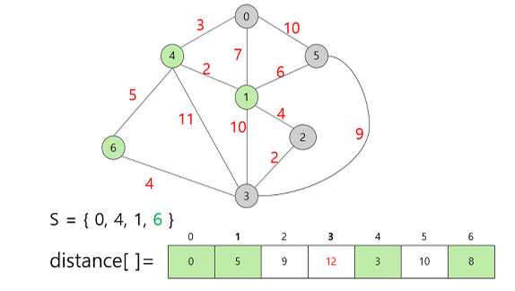

> `S = {0, 4, 1, 6}` / distance = [0, 5, 9, **12**, 3, 10, 8]  
> 노드 3: 14 → 12 갱신

---

**Step 5** — 노드 2 추가, 노드 3 재갱신

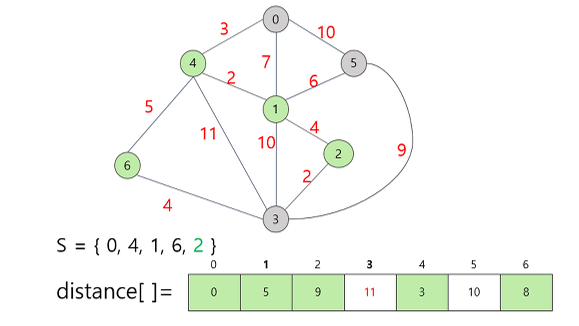

> `S = {0, 4, 1, 6, 2}` / distance = [0, 5, 9, **11**, 3, 10, 8]  
> 노드 3: 12 → 11 갱신

---

## 💻 기본 코드 (`dijkstra.py`)

단방향 그래프 / 시작 노드 입력 / 전체 노드 거리 출력

```python
import heapq

INF = int(1e9)  # 무한을 의미하는 값으로 10억을 설정

# 노드의 개수, 간선의 개수
n, m = map(int, input().split())
# 시작 노드 번호
start = int(input())
# 각 노드에 연결되어 있는 노드에 대한 정보를 담는 리스트 만들기
graph = [[] for i in range(n + 1)]
# 최단 거리 테이블을 모두 무한으로 초기화
distance = [INF] * (n + 1)

# 모든 간선 정보 입력 받기
for _ in range(m):
    a, b, c = map(int, input().split())
    # a번 노드에서 b번 노드로 가는 비용이 c라는 의미
    graph[a].append((b, c))

def dijkstra(start):
    q = []
    # 시작 노드로 가기 위한 최단 경로는 0으로 설정하여, 큐에 삽입
    heapq.heappush(q, (0, start))
    distance[start] = 0
    while q:
        # 가장 최단 거리가 짧은 노드에 대한 정보 꺼내기
        dist, now = heapq.heappop(q)
        # 현재 노드가 이미 처리된 적이 있는 노드라면 무시
        if distance[now] < dist:
            continue
        # 현재 노드와 연결된 다른 인접한 노드들을 확인
        for i in graph[now]:
            cost = dist + i[1]
            # 현재 노드를 거쳐서, 다른 노드로 이동하는 거리가 더 짧은 경우
            if cost < distance[i[0]]:  # i[0] : 도착 노드, 헷갈리지 말자
                distance[i[0]] = cost
                heapq.heappush(q, (cost, i[0]))

dijkstra(start)

# 모든 노드로 가기 위한 최단 거리 출력
for i in range(1, n + 1):
    # 도달할 수 없는 경우, 무한이라고 출력
    if distance[i] == INF:
        print("INFINITY")
    # 도달할 수 있는 경우 거리를 출력
    else:
        print(distance[i])
```

### 테스트 입력

```
6 8
1
4 5 3
2 4 0
1 4 4
1 2 1
5 6 1
3 6 2
3 2 6
3 4 4
```

### 출력 결과 해석

```
0        → 노드 1 → 1 : 0 (자기 자신)
1        → 노드 1 → 2 : 1 (1→2)
INFINITY → 노드 1 → 3 : 도달 불가 (들어오는 간선 없음)
1        → 노드 1 → 4 : 1 (1→2→4, 비용 1+0=1)
4        → 노드 1 → 5 : 4 (1→2→4→5, 비용 1+0+3=4)
5        → 노드 1 → 6 : 5 (1→2→4→5→6, 비용 4+1=5)
```

---

## 💻 응용 코드 (`dijkstra2.py`) — 전차 대대 작전

### 📋 문제 설명

A전차 대대 대대장은 상부로부터 기동명령을 하달 받았다.  
첩보작전으로 작성된 지도에는 **N개의 거점**과 **M개의 양방향 길**이 있고,  
각 길에는 **적 전차 C_i 대**가 매복되어 있다.  
A전차 대대는 **거점 1**에 있고, 작전목표지점은 **거점 N**이다.

> 최선의 통로: `1 → 2 → 4 → 5 → 6`  
> 마주치는 적: `1 + 0 + 3 + 1 = 5` (최솟값)

|항목|내용|
|---|---|
|입력|첫째 줄: N M / 둘째 줄~: A_i B_i C_i|
|출력|이동 중 마주치는 적 전차의 최솟값|
|제약|1 ≤ N, M ≤ 50,000 / 0 ≤ C_i ≤ 1,000|

### 테스트 입력 / 출력

```
6 8
4 5 3
2 4 0
1 4 4
2 1 1
5 6 1
3 6 2
3 2 6
3 4 4
```

```
5
```

---

양방향 그래프 / 시작 노드 1 고정 / N번 노드까지 최소 적 전차 수 출력

```python
import heapq

INF = int(1e9)  # 무한을 의미하는 값으로 10억을 설정

# 노드의 개수, 간선의 개수
n, m = map(int, input().split())

# 각 노드에 연결되어 있는 노드에 대한 정보 담는 리스트 만들기
graph = [[] for i in range(n + 1)]

# 최단 거리 테이블을 모두 무한으로 초기화
distance = [INF] * (n + 1)

for _ in range(m):
    a, b, c = map(int, input().split())
    graph[a].append((b, c))
    graph[b].append((a, c))  # 양방향 간선

def dijkstra(start):
    q = []
    heapq.heappush(q, (0, start))
    distance[start] = 0
    while q:
        dist, now = heapq.heappop(q)
        if distance[now] < dist:
            continue
        for i in graph[now]:
            cost = dist + i[1]
            if cost < distance[i[0]]:
                distance[i[0]] = cost
                heapq.heappush(q, (cost, i[0]))

dijkstra(1)
print(distance[-1])  # N번 노드(작전목표지점)까지 최소 적 전차 수
```

### 기본 코드와 차이점

|구분|기본 코드|응용 코드|
|---|---|---|
|간선 방향|단방향|**양방향** (`graph[b].append((a,c))` 추가)|
|시작 노드|입력받음|**1번 고정**|
|출력|전체 노드 거리|**N번 노드만** (`distance[-1]`)|

---

## ⚡ 알고리즘 특징

- **그리디 기반**: 매 단계 미방문 노드 중 최단거리 노드 선택
- **확정된 노드는 재방문 안 함** → `if distance[now] < dist: continue`
- **음수 간선 처리 불가** → 음수 있으면 벨만-포드 사용

### 시간복잡도 비교

|구현 방식|시간복잡도|적합한 노드 수|
|---|---|---|
|순차 탐색|$O(N^2)$|5,000 이하|
|heapq (우선순위 큐)|$O(E \log V)$|10,000 이상|

---
# 📄 floyd_warshall.py — 플로이드워셜 · 최단경로 · 2차원테이블

## 📌 개요

|항목|내용|
|---|---|
|알고리즘|플로이드-워셜 (Floyd-Warshall)|
|목적|**모든 노드 → 모든 노드** 최단거리|
|자료구조|2차원 리스트 `graph[a][b]`|
|시간복잡도|$O(V^3)$|
|특징|음수 가중치 처리 가능 (사이클 없는 경우)|

---

## 🧠 핵심 개념

- 다익스트라/벨만-포드: **단일 출발점** → 모든 노드
- 플로이드-워셜: **모든 출발점** → 모든 노드
- 매 단계마다 **경유 노드 K**를 거치는 경우 확인
- 점화식: `min(A→B, A→K→B)`
- 우선순위 큐 불필요 → **3중 for문**으로 구현

---

## 🖼️ 동작 과정 시각화

**Step 1** — 초기 상태 설정 (자기 자신=0, 직접 간선=가중치, 나머지=INF)

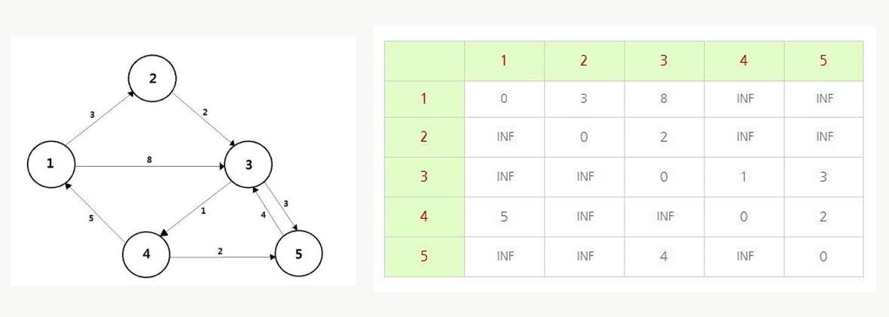

> 자신에게 가는 비용은 0, 직접 연결된 간선은 가중치, 나머지는 INF

---

**Step 2** — 경유 노드 K=1 기준으로 갱신

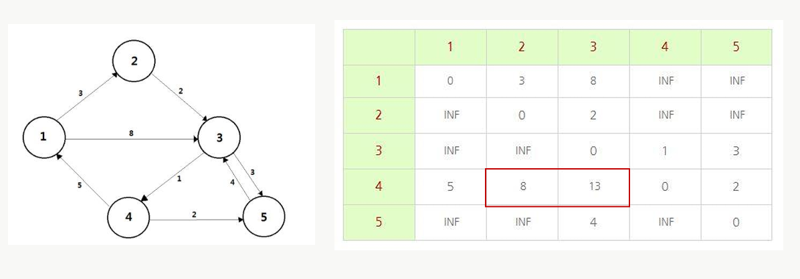

> 4→2: INF → **8** (4→1→2)  
> 4→3: INF → **13** (4→1→3)

---

**Step 3** — 경유 노드 K=2 기준으로 갱신

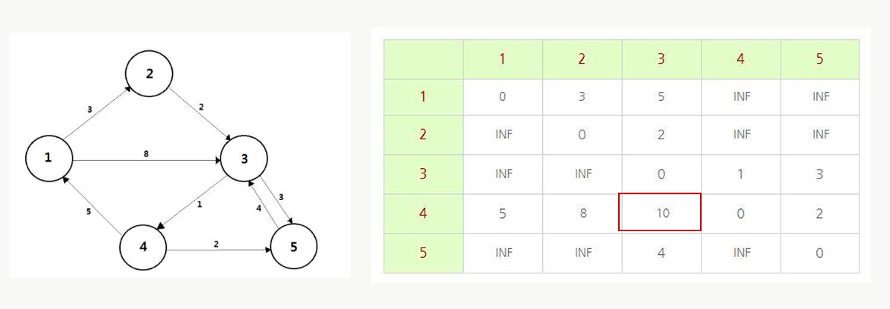

> 1→3: 8 → **5** (1→2→3)  
> 4→3: 13 → **10** (4→2→3)

---

**Step 4** — 경유 노드 K=3 기준으로 갱신

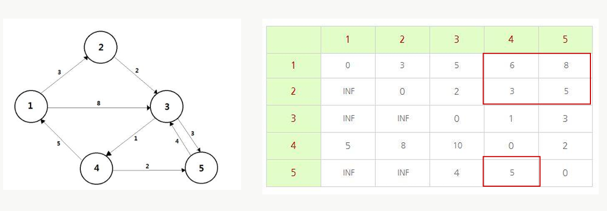

> 1→4: INF → **6** / 1→5: INF → **8**  
> 2→4: INF → **3** / 2→5: INF → **5**  
> 5→4: INF → **5**

---

**Step 5** — 경유 노드 K=4 기준으로 갱신

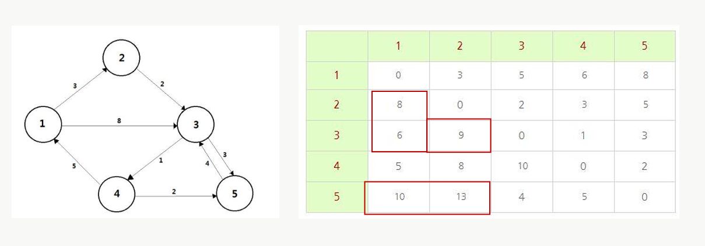

> 2→1: INF → **8** / 3→1: INF → **6**, 3→2: INF → **9**  
> 5→1: INF → **10** / 5→2: INF → **13**

---

**Step 6** — 경유 노드 K=5 기준으로 갱신 (최종)

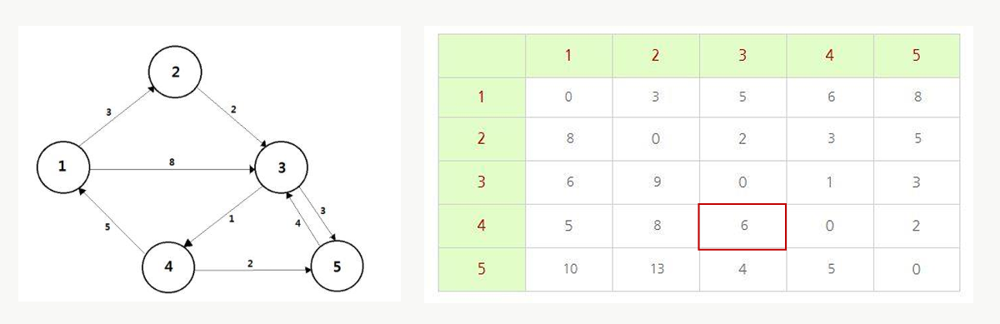

> 4→3: 10 → **6** (4→5→3)  
> 모든 정점에 대한 최단거리 확정

---

## 💻 기본 코드 (`floyd_warshall.py`)

단방향 그래프 / 모든 노드 쌍의 최단거리 출력

```python
INF = int(1e9)  # 무한을 의미하는 10억 설정

# 노드의 개수 및 간선의 개수 입력 받기
n, m = map(int, input().split())

# 2차원 리스트를 만들고, 무한으로 초기화
graph = [[INF] * (n + 1) for _ in range(n + 1)]

# 자기 자신에서 자기 자신으로 가는 비용은 0으로 초기화
for a in range(1, n + 1):
    for b in range(1, n + 1):
        if a == b:
            graph[a][b] = 0

# 각 간선에 대한 정보 입력받아, 그 값으로 초기화
for _ in range(m):
    # a에서 b로 가는 비용은 c
    a, b, c = map(int, input().split())
    graph[a][b] = c

# 점화식에 따라 플로이드-워셜 수행
for k in range(1, n + 1):          # 경유 노드
    for a in range(1, n + 1):      # 출발 노드
        for b in range(1, n + 1):  # 도착 노드
            graph[a][b] = min(graph[a][b], graph[a][k] + graph[k][b])

# 수행된 결과 출력
for a in range(1, n + 1):
    for b in range(1, n + 1):
        # 도달할 수 없는 경우, 무한으로 출력
        if graph[a][b] == INF:
            print(a, "->", b, ": INFINITY", end=' ')
        # 도달할 수 있는 경우 거리를 출력
        else:
            print(a, "->", b, ":", graph[a][b], end=' ')
    print()
```

---

## 💻 응용 코드 (`floyd_warshall2.py`) — 최소 사이클 탐색

### 📋 문제 설명

V개의 거점과 E개의 일방통행 도로로 구성된 지역에서  
**출발점으로 다시 돌아오는 사이클** 중 도로 길이의 합이 최소인 것을 찾아라.  
불가능한 경우 `-1` 출력.

|항목|내용|
|---|---|
|입력|첫째 줄: V E / 이후: a b c (a→b, 거리 c)|
|출력|최소 사이클의 길이 합 (불가능시 -1)|
|제약|2 ≤ V ≤ 400 / 0 ≤ E ≤ V(V-1)|

### 핵심 아이디어

```python
# 플로이드-워셜 수행 후
# s[i][i] → i에서 출발해서 i로 돌아오는 최단거리 = 최소 사이클!
result = min(result, s[i][i])
```

> ⚠️ 자기 자신을 **0으로 초기화하면 안 됨** → 전부 INF로 시작해야 사이클 거리가 갱신됨

```python
import sys

v, e = map(int, input().split())

INF = 100000000

# 2차원 리스트 초기화 (자기 자신 포함 전부 무한)
s = [[INF] * v for i in range(v)]

# 간선 정보 입력
for i in range(e):
    a, b, c = map(int, input().split())
    s[a - 1][b - 1] = c  # 0-indexed

# 플로이드-워셜 수행
for k in range(v):
    for i in range(v):
        for j in range(v):
            if s[i][j] > s[i][k] + s[k][j]:
                s[i][j] = s[i][k] + s[k][j]

# 최소 사이클 탐색 (자기 자신으로 돌아오는 비용)
result = INF
for i in range(v):
    result = min(result, s[i][i])

if result == INF:
    print(-1)
else:
    print(result)
```

### 기본 코드와 차이점

|구분|기본 코드|응용 코드|
|---|---|---|
|인덱스|1-indexed|**0-indexed** (`a-1`, `b-1`)|
|대각선 초기화|**0** (자기→자기=0)|**INF** (사이클 측정용)|
|출력|전체 노드 쌍 거리|**대각선 최솟값** (`s[i][i]`)|

---

## ⚡ 알고리즘 특징

|항목|다익스트라|플로이드-워셜|
|---|---|---|
|출발점|단일|**모든 노드**|
|자료구조|1차원 배열 + heapq|**2차원 배열**|
|시간복잡도|$O(E \log V)$|**$O(V^3)$**|
|음수 가중치|불가|**가능** (사이클 없는 경우)|
|구현 난이도|중간|**간단** (3중 for문)|

---
# 📄 bellman_ford.py — 벨만포드 · 음수간선 · 음수사이클

## 📌 개요

|항목|내용|
|---|---|
|알고리즘|벨만-포드 (Bellman-Ford-Moore)|
|목적|단일 시작 노드 → 모든 노드까지 최단거리|
|자료구조|1차원 거리 배열 + 간선 리스트|
|시간복잡도|$O(VE)$|
|특징|**음수 가중치 처리 가능** / **음수 사이클 탐지 가능**|

---

## 🧠 핵심 개념

- 다익스트라: **음수 간선 불가**, 방문 확정 방식 (Greedy)
- 벨만-포드: **음수 간선 가능**, 모든 간선을 V-1번 반복 완화 (Edge Relaxation)
- 핵심 점화식: `dis[next] = min(dis[next], dis[current] + cost)`
- **V번째 반복**에서도 갱신이 발생하면 → 음수 사이클 존재

---

## 🔑 Edge Relaxation 개념

**Relaxation**: 복잡한 문제를 더 쉬운 하위 문제로 분해하여 해를 구하는 방식

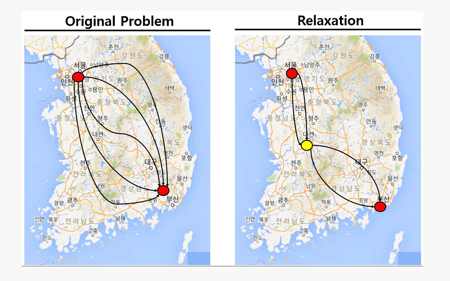

> 예) 서울→부산 최적 경로를 구할 때, 중간 경유지(대전)를 끼워  
> 서울→대전 / 대전→부산으로 분해하면 더 쉽게 풀 수 있다.

---

## 🖼️ 동작 과정 시각화

**전체 흐름 개요** — 시작 노드 s에서 출발, t·x·y·z 최단거리 갱신

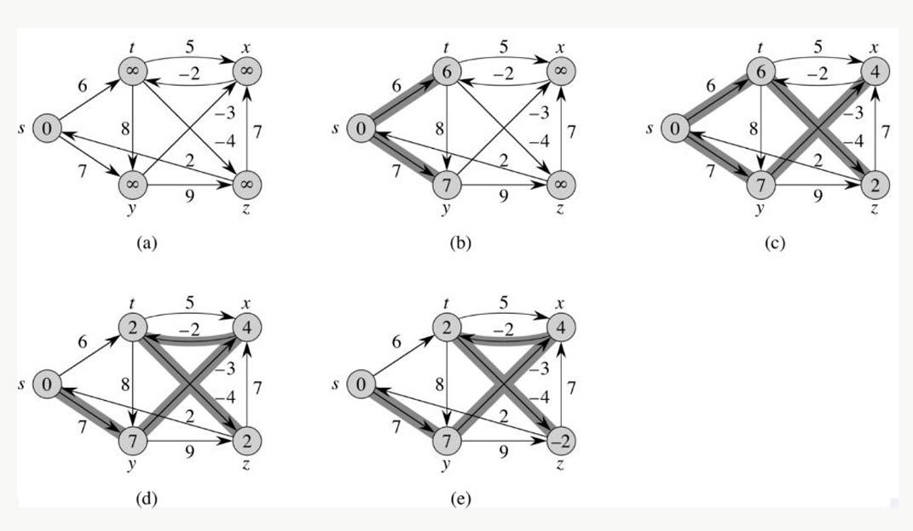

> (a) 초기 상태: s=0, 나머지 ∞  
> (b)~(e) 단계별로 모든 간선에 대해 Edge Relaxation 수행

---

**Step 1** — 초기 설정: 시작 노드 A=0, 나머지 ∞

Order: `(B,E), (C,E), (F,C), (D,F), (C,B), (C,D), (A,B), (A,C), (A,D)`

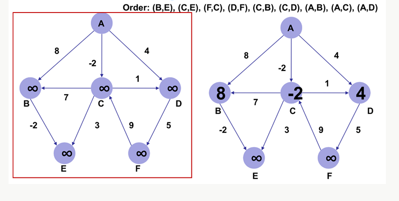

> (B,E): ∞-2=∞ → 갱신 불필요 / (C,E),(F,C),(D,F),(C,B) 동일  
> **(A,B)**: 0+8=8 < ∞ → **B=8** 갱신  
> **(A,C)**: 0-2=-2 < ∞ → **C=-2** 갱신  
> **(A,D)**: 0+4=4 < ∞ → **D=4** 갱신

---

**Step 2** — 두 번째 Edge Relaxation

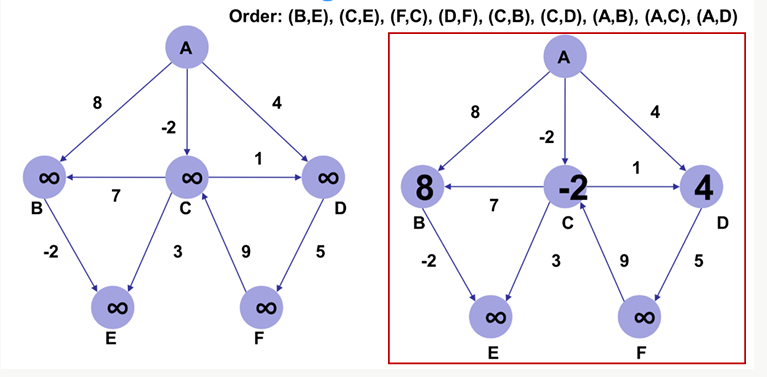

> **(B,E)**: 8-2=6 < ∞ → **E=6** 갱신  
> **(C,E)**: -2+3=1 < 6 → **E=1** 재갱신  
> **(D,F)**: 4+5=9 < ∞ → **F=9** 갱신  
> **(C,B)**: -2+7=5 < 8 → **B=5** 갱신  
> **(C,D)**: -2+1=-1 < 4 → **D=-1** 갱신

---

**Step 3** — 세 번째 Edge Relaxation

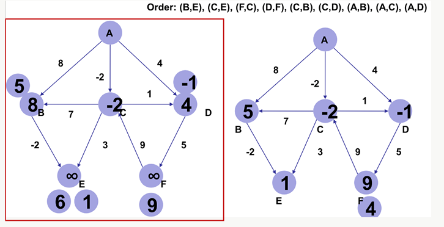

> **(D,F)**: -1+5=4 < 9 → **F=4** 갱신  
> 나머지 간선은 기존 거리보다 크므로 갱신 불필요  
> ✅ 네 번째 반복부터는 거리 변화 없음 → 조기 종료 가능

---

**Step 4~5** — 수렴 (최종 결과)

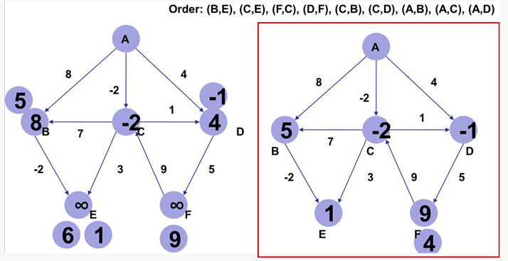

> A=0 / B=5 / C=-2 / D=-1 / E=1 / F=4  
> V-1(=5)번 반복 후 수렴 확인 → 음수 사이클 없음

---

## ⚠️ 음수 사이클 문제

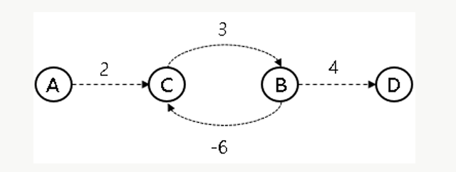

> A→D 경로에서 C→B(-6) → B→C(3) 사이클 반복  
> `2 → 3 → -6 → 3 → -6 → ...` 무한히 최솟값 감소  
> **음수 사이클 존재 시**: V번째 반복에서도 갱신 발생 → `return True`

---

## 💻 기본 코드 (`bellman_ford.py`)

단방향 그래프 / 시작 노드 1 고정 / 음수 사이클 탐지 포함

```python
INF = int(1e9)

def bf(start):
    dis[start] = 0  # 시작 지점 초기화

    # 매 반복마다 모든 간선 확인
    # 음의 간선 사이클 존재 유무가 필요하면 n번과 return 처리
    # 필요 없다면 n-1번과 리턴 처리는 필요 없음, dis 테이블만 필요함
    for i in range(n + 1):
        # 모든 간선 확인
        for j in range(m):
            current = edges[j][0]
            next_node = edges[j][1]
            cost = edges[j][2]
            # 시작위치에서 현재 노드까지 이동이 가능하면서
            # 현재 간선을 거쳐서 다른 노드로 이동하는 거리가 더 짧은 경우
            if dis[current] != INF and dis[next_node] > cost + dis[current]:
                dis[next_node] = dis[current] + cost
                # 사이클 유무 확인을 위해 n번 돌렸을 때
                # 최단 거리 갱신이 발생하면 음의 사이클이 존재
                if i == n - 1:
                    return True
    return False

# 노드, 간선 개수
n, m = map(int, input().split())
edges = []
dis = [INF] * (n + 1)  # 최단 거리 테이블

# 간선 정보
for _ in range(m):
    a, b, c = map(int, input().split())
    edges.append((a, b, c))

cycle = bf(1)

if cycle:  # 음의 사이클 발생
    print(-1)
else:
    # 1번 노드에서 시작했으니 다른 노드로 가기 위한 최단 거리 출력
    for i in range(2, n + 1):
        if dis[i] == INF:
            print(-1)
        else:
            print(dis[i])
```

### 반복 횟수 정리

|목적|반복 횟수|처리|
|---|---|---|
|최단거리만 필요|`n - 1`번|`return` 불필요|
|음수 사이클 탐지|`n`번|`i == n - 1`에서 갱신 시 `return True`|

---

## 💻 응용 코드 (`bellman_ford2.py`) — 웜홀 (시간 여행)

### 📋 문제 설명

N개의 지점, M개의 양방향 도로, W개의 웜홀(단방향 음수 간선)이 있을 때,  
**출발 지점으로 돌아왔을 때 시간이 줄어드는 경우가 존재하는지** 판별하라.

|항목|내용|
|---|---|
|도로 (M개)|양방향 / 양수 가중치|
|웜홀 (W개)|단방향 / **음수 가중치** (`-T`)|
|판별 목표|**음수 사이클** 존재 여부|
|출력|가능하면 `YES` / 불가능하면 `NO`|

### 핵심 아이디어

```python
dist = [0] * (N + 1)  # 모든 노드를 시작점으로 → 전부 0으로 초기화
```

> 어느 노드에서 출발해도 탐지 가능하게 **전체를 0으로 초기화**  
> (특정 시작점 고정 방식과 차이)

```python
import sys
input = sys.stdin.readline

INF = int(1e9)

def bellmanFord():
    dist = [0] * (N + 1)  # 모든 노드를 시작점으로 (전부 0)

    for i in range(1, N + 1):
        for j in range(1, N + 1):
            for wei, vec in adjList[j]:
                if dist[vec] > wei + dist[j]:
                    dist[vec] = wei + dist[j]
                    if i == N:  # N번째 순회에서도 갱신되면 음수 사이클
                        return True  # 음수 사이클 존재
    return False

TC = int(input())
for _ in range(TC):
    N, M, W = map(int, input().split())
    adjList = [[] for _ in range(N + 1)]

    for _ in range(M):
        S, E, cost = map(int, input().split())  # T → cost로 변경
        adjList[S].append((cost, E))
        adjList[E].append((cost, S))

    for _ in range(W):
        S, E, cost = map(int, input().split())
        adjList[S].append((-cost, E))          # 웜홀: 단방향 음수 간선

    print("YES" if bellmanFord() else "NO")
```

### 기본 코드와 차이점

|구분|기본 코드 (`bellman_ford.py`)|응용 코드 (`bellman_ford2.py`)|
|---|---|---|
|dist 초기화|시작 노드만 0, 나머지 INF|**전부 0** (모든 노드가 시작점)|
|간선 구성|단방향|**양방향 도로 + 단방향 음수 웜홀**|
|입력 변수명|`T` (비용)|`cost` (명확성을 위해 변경)|
|출력|거리 테이블|**YES / NO** (음수 사이클 여부)|

---

## ⚡ 알고리즘 비교

| 항목        | 다익스트라         | 벨만-포드       | 플로이드-워셜    |
| --------- | ------------- | ----------- | ---------- |
| 출발점       | 단일            | 단일          | **모든 노드**  |
| 음수 가중치    | ❌ 불가          | ✅ 가능        | ✅ 가능       |
| 음수 사이클 탐지 | ❌             | ✅           | ✅ (대각선 확인) |
| 시간복잡도     | $O(E \log V)$ | **$O(VE)$** | $O(V^3)$   |
| 자료구조      | 배열 + heapq    | 간선 리스트      | 2차원 배열     |
| 구현 난이도    | 중간            | 중간          | 간단         |

---
# 📄 a_star — A스타 · 휴리스틱 · OpenList · CloseList

## 📌 개요

|항목|내용|
|---|---|
|알고리즘|A* (A-Star)|
|목적|단일 시작 노드 → 목적지 노드까지 **최단 경로**|
|핵심 수식|**F = G + H**|
|자료구조|열린 목록(Open List) + 닫힌 목록(Close List)|
|특징|휴리스틱(H)으로 탐색 방향을 유도 → 다익스트라보다 빠름|
|활용|게임 길찾기 (스타크래프트, LOL), 제조 공장 경로 최적화|

---

## 🧠 핵심 개념

### F = G + H

|기호|의미|
|---|---|
|**G**|시작 노드에서 현재 노드까지 **실제 소요 비용**|
|**H**|현재 노드에서 목적지까지 **휴리스틱 추정 비용** (예: 직선 거리)|
|**F**|G + H → **우선순위 기준값** (낮을수록 먼저 탐색)|
|**Parent Node**|현재 노드에 도달하기 직전에 거친 노드|

### Open / Close List

|저장소|역할|
|---|---|
|**O (Open List)**|탐색 후보 노드 저장, F 값 지속 갱신|
|**C (Close List)**|처리 완료된 노드 저장, 재방문 방지|

> 매 단계에서 **O 리스트 중 F가 최소인 노드**를 선택 → C로 이동 → 인접 노드 탐색

---

## 🖼️ 그래프 구조

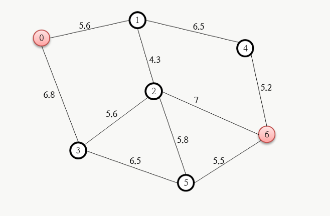

> 시작: **노드 0** / 목적지: **노드 6**  
> 각 간선의 숫자 = 이동 비용 (거리)  
> H 값 기준: 각 노드에서 노드 6까지의 **직선 거리** (측정값 또는 피타고라스 정리)

---

## 🖼️ 동작 과정 시각화

**Step 1** — 초기 설정: 노드 0을 C에 추가, 인접 노드 1·3을 O에 추가

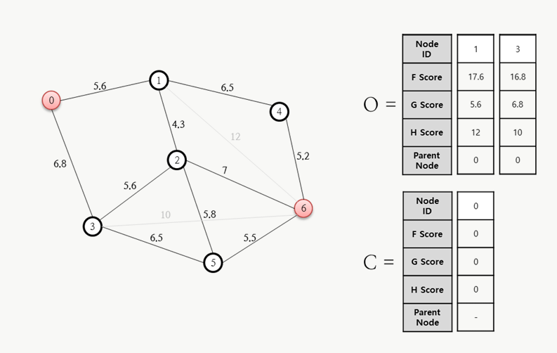

> **노드 1**: G=5.6, H=12, F=17.6, Parent=0  
> **노드 3**: G=6.8, H=10, F=16.8, Parent=0  
> C = {0} / O = {1(17.6), 3(16.8)}

---

**Step 2** — O에서 F 최솟값 **노드 3(16.8)** 선택 → C로 이동, 인접 노드 2·5 추가

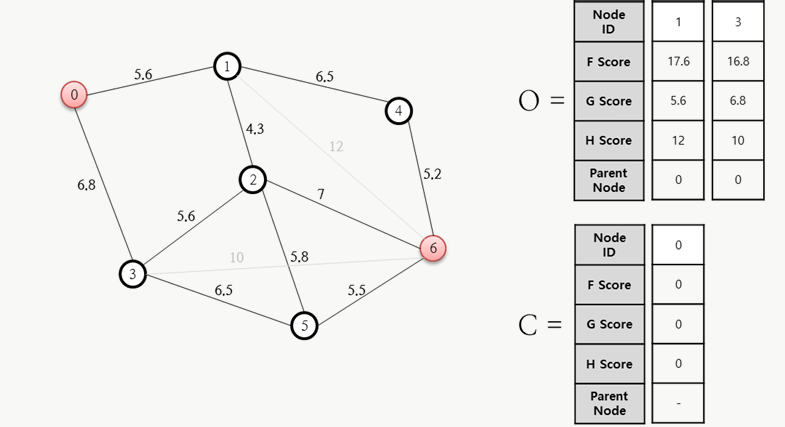

> **노드 2**: G=6.8+5.6=12.4, H=7, F=19.4, Parent=3  
> **노드 5**: G=6.8+6.5=13.3, H=5.5, F=18.8, Parent=3  
> C = {0, 3} / O = {1(17.6), 2(19.4), 5(18.8)}

---

**Step 3** — O에서 F 최솟값 **노드 1(17.6)** 선택 → C로 이동, 인접 노드 2·4 처리

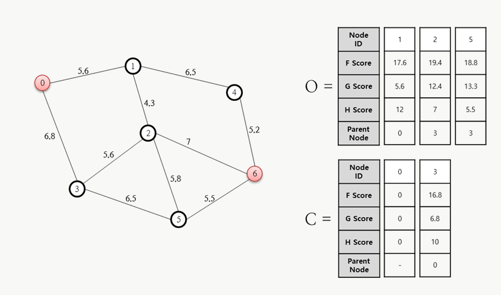

> **노드 4**: G=5.6+6.5=12.1, H=5.2, F=17.3, Parent=1 (신규 추가)  
> **노드 2**: 기존 G=12.4 → 새 G=5.6+4.3=9.9, F=16.9 → **갱신**, Parent=1  
> ⚠️ 새로운 G가 기존보다 작으면 F·G·Parent 모두 갱신  
> C = {0, 3, 1} / O = {2(16.9), 5(18.8), 4(17.3)}

---

**Step 4** — O에서 F 최솟값 **노드 2(16.9)** 선택 → C로 이동, 인접 노드 5·6 처리

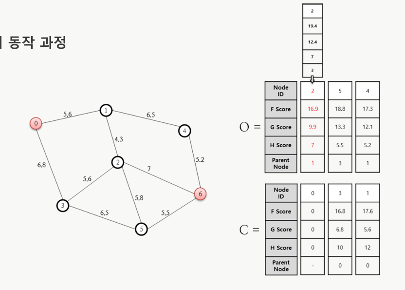

> **노드 6**: G=9.9+7=16.9, H=0, F=16.9, Parent=2 (신규 추가)  
> **노드 5**: 새 G=9.9+5.8=15.7 > 기존 13.3 → **갱신 불필요**  
> C = {0, 3, 1, 2} / O = {5(18.8), 4(17.3), 6(16.9)}

---

**Step 5** — O에서 F 최솟값 **노드 6(16.9)** 선택 → C로 이동

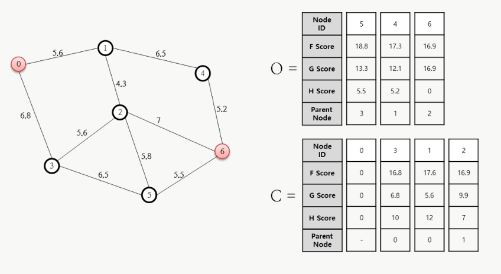

> **노드 6은 목적지** → 알고리즘 종료!  
> C = {0, 3, 1, 2, 6}

---

**최종 결과** — Parent Node를 역추적하여 최단 경로 복원

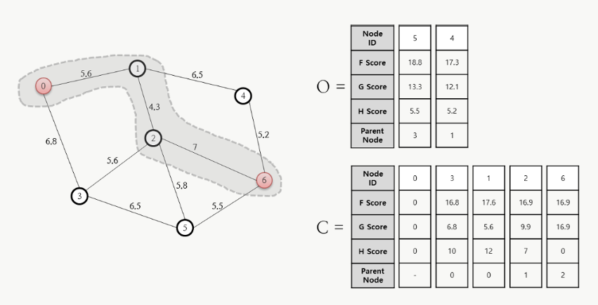

> 6 ← 2 ← 1 ← 0  
> **최단 경로: 0 → 1 → 2 → 6** / 총 비용: **16.9**

---

## 🗺️ 그리드 기반 A* 탐색 과정

노드 그래프가 아닌 **2D 격자(Grid)** 위에서의 A* 동작 방식

### 이동 비용 기준

|이동 방향|비용|이유|
|---|---|---|
|수평 / 수직|**10**|1칸 이동|
|대각선|**14**|√2 ≈ 1.414 → 근사값 14|

> G는 실제 경로를 따라가므로 대각선 포함 계산  
> H는 대각선 무시, **수평+수직 이동만** 계산 (Manhattan Distance)

---

**Step 1** — 시작점(초록) 기준 인접 셀 F·G·H 계산

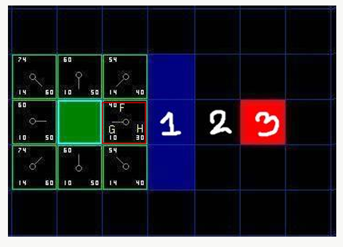

> 오른쪽 셀 (수평 1칸): G=10, H=30, **F=40**  
> 오른쪽 위 셀 (대각선): G=14, H=40, **F=54**  
> 목적지(빨강)까지 수평 3칸 → H = 3 × 10 = 30

---

**Step 2** — F 최솟값 셀 선택 → C로 이동, 인접 셀 탐색 계속

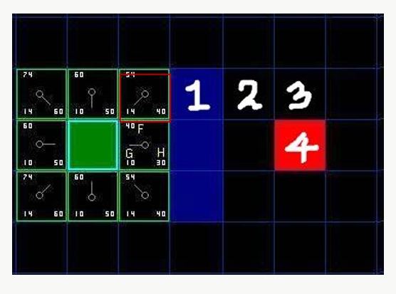

> 열린 목록에서 F가 가장 낮은 셀을 선택  
> 닫힌 목록(C)에 있거나 벽이면 무시

---

**Step 3** — 탐색 확장, 부모 포인터(화살표) 갱신

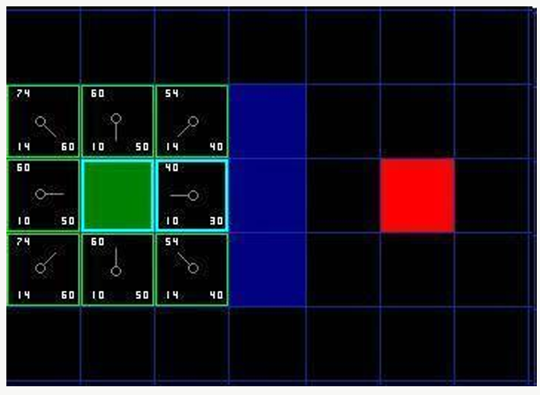

> 각 셀의 화살표 = Parent Node 방향  
> 더 낮은 G 경로 발견 시 부모와 G·F 값 갱신

---

**Step 4** — 목적지 방향으로 수렴, 최단 경로 확정

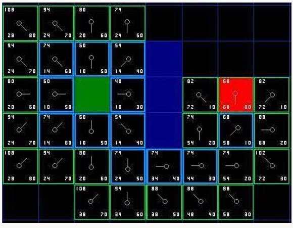

> 목적지(빨강) 셀이 열린 목록에 추가되면 탐색 종료  
> Parent 역추적 → 최단 경로 복원

### 종료 조건

|조건|의미|
|---|---|
|목적지가 **열린 목록에 추가**됨|경로 찾기 성공 → 종료|
|**열린 목록이 비어버림**|경로 없음 (길이 막힌 경우)|

---

## 💻 전체 코드 (`a_star.py`)

```python
class Node:
    def __init__(self, parent=None, position=None):
        self.parent = parent
        self.position = position
        self.g = 0
        self.h = 0
        self.f = 0

    def __eq__(self, other):
        return self.position == other.position


def heuristic(node, goal, D=1, D2=2 ** 0.5):
    # Diagonal Distance 휴리스틱
    dx = abs(node.position[0] - goal.position[0])
    dy = abs(node.position[1] - goal.position[1])
    return D * (dx + dy) + (D2 - 2 * D) * min(dx, dy)


def aStar(maze, start, end):
    startNode = Node(None, start)
    endNode = Node(None, end)

    openList = []
    closedList = []
    openList.append(startNode)

    while openList:
        # F 최솟값 노드 선택
        currentNode = openList[0]
        currentIdx = 0
        for index, item in enumerate(openList):
            if item.f < currentNode.f:
                currentNode = item
                currentIdx = index

        # openList → closedList 이동
        openList.pop(currentIdx)
        closedList.append(currentNode)

        # 목적지 도달 시 경로 반환
        if currentNode == endNode:
            path = []
            current = currentNode
            while current is not None:
                # x, y = current.position
                # maze[x][y] = 7  # 경로 표시하려면 주석 해제
                path.append(current.position)
                current = current.parent
            return path[::-1]

        children = []

        # 8방향 탐색
        for newPosition in [(0, -1), (0, 1), (-1, 0), (1, 0),
                            (-1, -1), (-1, 1), (1, -1), (1, 1)]:
            nodePosition = (
                currentNode.position[0] + newPosition[0],
                currentNode.position[1] + newPosition[1])

            within_range_criteria = [
                nodePosition[0] > (len(maze) - 1),
                nodePosition[0] < 0,
                nodePosition[1] > (len(maze[len(maze) - 1]) - 1),
                nodePosition[1] < 0,
            ]
            if any(within_range_criteria):
                continue

            if maze[nodePosition[0]][nodePosition[1]] != 0:
                continue

            new_node = Node(currentNode, nodePosition)
            children.append(new_node)

        # 자식 노드 처리
        for child in children:
            # closedList에 있으면 skip
            if child in closedList:
                continue

            # g, h, f 계산
            child.g = currentNode.g + 1
            child.h = ((child.position[0] - endNode.position[0]) ** 2) + \
                      ((child.position[1] - endNode.position[1]) ** 2)
            # child.h = heuristic(child, endNode)  # 대각선 휴리스틱 사용 시
            # print("position:", child.position)
            # print("from child to goal:", child.h)
            child.f = child.g + child.h

            # openList에 있고 g값이 더 크면 skip
            if len([openNode for openNode in openList
                    if child == openNode and child.g > openNode.g]) > 0:
                continue

            openList.append(child)


def main():
    # 0: 이동 가능 / 1: 장애물
    maze = [[0, 0, 0, 0, 0, 0, 0, 0, 0, 0],
            [0, 0, 0, 0, 1, 0, 0, 0, 0, 0],
            [0, 0, 0, 0, 1, 0, 0, 0, 0, 0],
            [0, 0, 0, 0, 1, 0, 0, 0, 0, 0],
            [0, 0, 0, 0, 1, 0, 0, 0, 0, 0],
            [0, 0, 0, 0, 1, 0, 0, 0, 0, 0],
            [0, 0, 0, 0, 1, 0, 0, 0, 0, 0],
            [0, 0, 0, 0, 1, 0, 0, 0, 0, 0],
            [0, 0, 0, 0, 1, 0, 0, 0, 0, 0],
            [0, 0, 0, 0, 1, 0, 0, 0, 0, 0]]

    start = (0, 0)
    end = (7, 6)

    path = aStar(maze, start, end)
    for y, x in path:
        maze[y][x] = 8
    for i in maze:
        print(*i)
    print()
    print(path)


if __name__ == '__main__':
    main()
```

### 실행 결과

```
8 0 0 0 8 0 0 0 0 0
0 8 0 8 1 8 0 0 0 0
0 0 8 0 1 0 8 0 0 0
0 0 0 0 1 0 8 0 0 0
0 0 0 0 1 0 8 0 0 0
0 0 0 0 1 0 8 0 0 0
0 0 0 0 1 0 8 0 0 0
0 0 0 0 1 0 8 0 0 0
0 0 0 0 1 0 0 0 0 0
0 0 0 0 1 0 0 0 0 0

[(0,0), (1,1), (2,2), (1,3), (0,4), (1,5), (2,6), (3,6), (4,6), (5,6), (6,6), (7,6)]
```

> 0행이 뚫려 있어서 대각선으로 위로 우회한 뒤 → 6열로 내려오는 경로 탐색

---

## ⚡ 다익스트라 vs A* 비교

|항목|다익스트라|A*|
|---|---|---|
|탐색 기준|G (실제 비용)|**F = G + H** (실제 + 추정)|
|탐색 방향|전방향 균등 탐색|**목적지 방향으로 유도**|
|휴리스틱|없음|**있음** (직선거리 등)|
|속도|상대적으로 느림|**빠름** (불필요한 탐색 생략)|
|최적 보장|항상 최적|H가 실제보다 크지 않으면 최적 (**admissible**)|
|음수 가중치|불가|불가|

---

## 🔑 알고리즘 흐름 요약

```
1. 시작 노드를 C(닫힌 목록)에 추가
2. 시작 노드의 인접 노드를 O(열린 목록)에 추가, F·G·H·Parent 계산
3. O에서 F 최솟값 노드 선택
   ├─ 목적지면 → 종료, Parent 역추적으로 경로 복원
   └─ 아니면 → C로 이동, 인접 노드 처리
4. 인접 노드 처리
   ├─ C에 있으면 → 무시
   ├─ O에 없으면 → F·G·H·Parent 계산 후 O에 추가
   └─ O에 있으면 → 새 G < 기존 G이면 F·G·Parent 갱신
5. 3번으로 돌아가 반복
```

---
# 🌐 통신이론 : 클라이언트서버 · URL · 포트

## 📌 개요

|항목|내용|
|---|---|
|주제|클라이언트-서버 통신 기초|
|핵심 개념|요청(Request) / 응답(Response) / 포트(Port)|
|활용|웹 서비스, API 서버, 프론트-백엔드 분리 구조|

---

## 🧠 클라이언트-서버 통신 과정

```
클라이언트 (브라우저)          서버
      |                          |
      |  1. DNS 조회             |
      |  "naver.com IP가 뭐야?"  |
      |  → DNS 서버가 IP 반환    |
      |                          |
      |  2. TCP 연결 (3-way handshake)
      |  SYN      →              |
      |           ← SYN-ACK      |
      |  ACK      →              |
      |                          |
      |  3. HTTP 요청            |
      |  GET /blog →             |
      |                          |
      |  4. HTTP 응답            |
      |           ← HTML/CSS/JS  |
      |                          |
      |  5. 브라우저가 화면 렌더링|
```

---

## 🔑 URL 구조

```
https    ://    naver.com    /blog
  │               │            │
프로토콜        도메인        경로(Path)
(통신 방식)   (서버 주소)   (어떤 페이지?)
```

|부분|이름|의미|
|---|---|---|
|`https`|프로토콜|암호화된 통신 방식 (`http`는 암호화 없음)|
|`naver.com`|도메인|서버 주소 (실제론 IP로 변환됨)|
|`/blog`|경로 (Path)|서버에서 찾을 페이지 위치|

---

## 🖥️ 서버 vs PC

> 하드웨어적으로는 똑같다. **역할의 차이**!

|항목|PC|서버|
|---|---|---|
|목적|개인 사용|**다른 컴퓨터에게 서비스 제공**|
|전원|필요할 때만 켬|**24시간 365일 켜져 있음**|
|성능|일반적|**고성능, 고용량**|
|모니터|있음|**없어도 됨**|
|위치|집, 회사|**데이터센터**|

> Flask에서 `app.run()` 하면 내 PC가 서버로 동작하는 것!

### 서버가 비싼 이유

- 수천~수만 명의 요청을 **동시에** 처리해야 함
- **이중화** 필수 → 전원, 저장장치, 서버 자체도 백업
- 서버가 꺼지면 = 서비스 중단 = 엄청난 손해

---

## 🔌 포트 (Port)

> **IP = 건물 주소 / 포트 = 호실 번호**

```
192.168.0.1 : 8080
   IP주소       포트
  (건물주소)   (호실)
```

하나의 서버(IP)에서 **여러 서비스를 동시에 구분**하기 위해 사용

### 실습 예시

```
같은 서버 (IP 하나)
├─ :8080  → Frontend    (사용자 화면)
├─ :8081  → Backend     (데이터 처리)
└─ :1080  → BackOffice  (관리자 페이지)
```

### 자주 쓰는 포트 번호

|포트|용도|
|---|---|
|**80**|HTTP|
|**443**|HTTPS|
|**3306**|MySQL|
|**22**|SSH|
|**8080**|개발용 웹서버|
|**5000**|Flask 기본 포트|

> `https://naver.com` 은 사실 `https://naver.com:443`  
> 80, 443은 브라우저가 자동으로 붙여줘서 URL에 안 보이는 것!

---
# 📄 flec1/app.py — Flask · REST API · 라우팅

## 📁 파일 구조

```
시뮬레이션_특강/
└─ flask/
   └─ flec1/
      └─ app.py
```

---

## 📌 개요

|항목|내용|
|---|---|
|프레임워크|Flask|
|목적|REST API 서버 구축 기초|
|활용|탱크 시뮬레이터 ↔ AI 모델 연결|
|포트|5000 (Flask 기본 포트)|

---

## 🧠 핵심 개념

### GET vs POST

|메서드|역할|특징|
|---|---|---|
|**GET**|데이터 조회|URL에 파라미터 노출 (`?key=value`)|
|**POST**|데이터 전송|Body에 숨겨서 전송, 민감 정보에 적합|

> 브라우저 주소창에 URL 입력 = GET 요청  
> 로그인, 파일 업로드, AI 추론 요청 = POST 요청

### 쿼리스트링 (Query String)

```
http://127.0.0.1:5000/param?name=홍길동
                            ↑
                       ?키=값 형태로 데이터 전달
```

여러 개 전달 시:

```
http://127.0.0.1:5000/param?name=홍길동&age=25
```

### 호스트 주소

|주소|의미|접속 범위|
|---|---|---|
|`127.0.0.1`|루프백 (loopback)|내 컴퓨터에서만|
|`192.168.x.x`|내부 IP|같은 와이파이 내|
|`0.0.0.0`|모든 IP 허용|외부 접속 가능|

---

## 💻 기본 코드 (`app.py`)

```python
# !pip install flask
from flask import Flask, request, jsonify

app = Flask(__name__)

@app.route('/hello', methods=['GET'])
def hello():
    return 'Hello World'

@app.route('/param', methods=['GET'])
def param():
    param = request.args.get('name')
    return f'Hello {param}'

@app.route('/test', methods=['GET'])
def test():
    return f'Hello test'

if __name__ == '__main__':
    app.run(host='0.0.0.0', port=5000)
```

### 라우트 구조

|엔드포인트|메서드|설명|
|---|---|---|
|`/hello`|GET|"Hello World" 반환|
|`/param?name=값`|GET|"Hello {name}" 반환|
|`/test`|GET|"Hello test" 반환|

### 실행 결과

```
Running on http://127.0.0.1:5000  → 내 컴퓨터에서만 접속
Running on http://192.168.0.9:5000 → 같은 네트워크에서 접속 가능
```

### 테스트

```
http://127.0.0.1:5000/hello           → Hello World
http://127.0.0.1:5000/param           → Hello None
http://127.0.0.1:5000/param?name=홍길동 → Hello 홍길동
http://127.0.0.1:5000/test            → Hello test
```

> `name` 파라미터 없이 `/param` 만 호출하면 `None` 반환  
> 기본값 설정: `request.args.get('name', '이름없음')`

---

## 🔗 탱크 챌린지 연계

Flask 서버가 AI 모델과 탱크 시뮬레이터를 연결하는 역할

```
탱크 시뮬레이터 (Unity)
    ↓ POST /detect      → 이미지 → 객체탐지 결과 반환
    ↓ POST /info        → 전차 상태 → pause/reset 명령 반환
    ↓ POST /get_action  → 위치/포탑 정보 → W/S/A/D 이동명령 반환
    ↓ GET  /init        → 초기 설정값 반환
내 Flask 서버 (AI 모델)
```

> 참고: [탱크 챌린지 API 문서](https://bangbaedong-vallet-co-ltd.gitbook.io/tank-challenge/3.-api/3.2-api-docs)