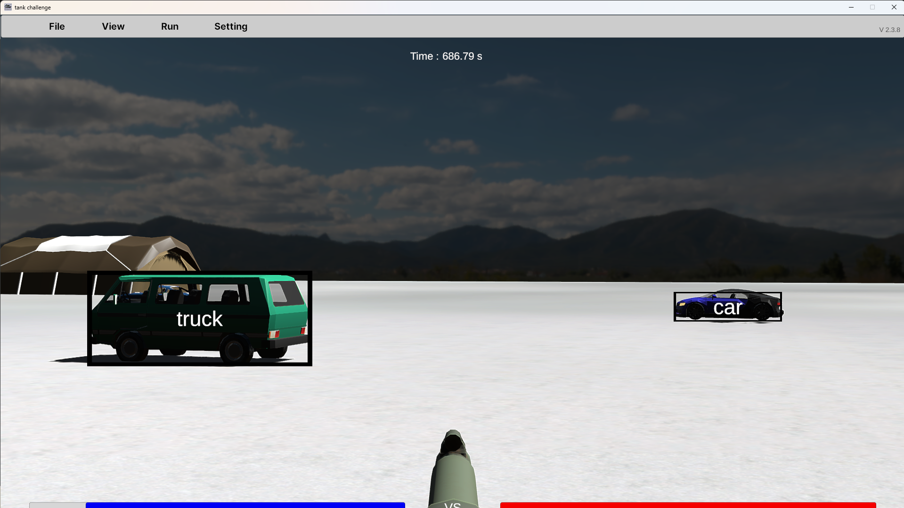
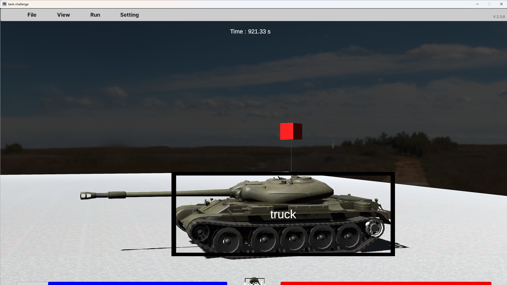

# Day 73_탱크챌린지 : Flask · YOLOv8 · Tank Challenge API

## 📅 2026-05-22

---
# 📄 flec2/app.py — Flask · YOLOv8 · Tank Challenge API

## 📁 파일 구조

```
시뮬레이션_특강/
└─ flask/
   └─ flec2/
      └─ app.py
```

---

## 📌 개요

|항목|내용|
|---|---|
|프레임워크|Flask|
|객체탐지 모델|YOLOv8n (`ultralytics`)|
|목적|Tank Challenge 시뮬레이터 ↔ AI 모델 연동|
|포트|5000 (Flask 기본 포트)|

---

## 🧠 전체 구조

Tank Challenge 시뮬레이터는 **Client**, 내가 만든 Flask 서버는 **Server** 역할을 한다.  
시뮬레이터가 내 서버로 HTTP 요청을 보내면, 서버가 응답으로 전차 명령을 돌려주는 구조.

```
탱크 시뮬레이터 (Unity)         내 Flask 서버 (AI 모델)
        │
        ├─ GET  /init            → 초기 설정값 반환
        ├─ GET  /start           → 시작/중지 명령 반환
        ├─ POST /get_action      → 위치·포탑 정보 → 이동 명령 반환
        ├─ POST /detect          → 이미지 → 객체탐지 결과 반환
        ├─ POST /info            → 전차 상태 → pause/reset 명령 반환
        ├─ POST /stereo_image    → 스테레오 이미지 수신
        ├─ POST /update_bullet   → 포탄 충돌 정보 수신
        ├─ POST /update_obstacle → 장애물 정보 수신
        ├─ POST /collision       → 전차 충돌 정보 수신
        └─ POST /set_destination → 목적지 좌표 수신
```

---

## 🔌 API 엔드포인트 전체 정리

### GET /init

에피소드 시작 또는 재시작 시 **1회** 호출. 서버가 초기 설정값을 응답으로 반환.

```python
@app.route('/init', methods=['GET'])
def init():
    config = {
        "startMode": "start",       # "start" or "pause"
        "blStartX": 60,             # Blue(아군) 전차 시작 위치
        "blStartY": 10,
        "blStartZ": 27.23,
        "rdStartX": 59,             # Red(적) 전차 시작 위치
        "rdStartY": 10,
        "rdStartZ": 280,
        "trackingMode": False,      # API로 전차 자동 제어 (키보드 비활성화)
        "detectMode": True,         # 터렛 이미지를 /detect로 전송
        "logMode": False,           # 전차 상태를 /info로 전송
        "stereoCameraMode": False,
        "enemyTracking": False,
        "saveSnapshot": False,
        "saveLog": False,
        "saveLidarData": False,
        "lux": 30000,
        "destoryObstaclesOnHit": True
    }
    return jsonify(config)
```

---

### GET /start

에피소드가 **일시정지 상태**일 때 1초마다 호출.

|입력값|동작|
|---|---|
|`"start"`|에피소드 시작|
|`"pause"`|중지 (현 상태 유지)|

---

### POST /get_action

Tracking Mode 활성화 시 **주기적으로** 호출.  
시뮬레이터가 전차의 현재 position과 turret 각도를 보내주면, 서버가 이동·포탑·발사 명령을 응답.

```python
# 시뮬레이터가 보내는 것
{"position": {"x": 57.35, "y": 0.0, "z": 210.85}, "turret": {"x": 45.0, "y": -5.5}}

# 서버가 응답해야 하는 것
{
  "moveWS":   {"command": "W", "weight": 0.8},
  "moveAD":   {"command": "A", "weight": 0.6},
  "turretQE": {"command": "E", "weight": 0.9},
  "turretRF": {"command": "R", "weight": 0.2},
  "fire": true
}
```

|key|command 값|동작|
|---|---|---|
|moveWS|`W` / `S` / `STOP`|전진 / 후진 / 정지|
|moveAD|`A` / `D`|좌회전 / 우회전|
|turretQE|`Q` / `E`|포탑 좌 / 포탑 우|
|turretRF|`R` / `F`|포각 상승 / 포각 하강|
|fire|`true` / `false`|포탄 발사 여부|

> weight: 0.1 ~ 1.0 / 클수록 강하게 동작 (기존 물리량 × weight)

현재는 미리 짜둔 `combined_commands` 리스트를 순서대로 `pop()` 해서 보내는 **하드코딩 시퀀스** 방식. 실제 지능형 제어는 미구현 상태.

```python
if combined_commands:
    command = combined_commands.pop(0)
else:
    command = {"moveWS": {"command": "STOP", "weight": 1.0}, ...}
```

---

### POST /detect

Detect Mode 활성화 시 **터렛 시점 이미지**를 수신. YOLOv8로 추론 후 bbox + className 반환.

```python
os.environ['KMP_DUPLICATE_LIB_OK'] = 'TRUE'  # OpenMP 중복 라이브러리 충돌 방지

target_classes = {0: "tank", 1: "rock", 2: "car", 7: "truck", 15: "rock"}

filtered_results.append({
    'className': target_classes[class_id],
    'bbox': [float(coord) for coord in box[:4]],  # [x1, y1, x2, y2]
    'confidence': float(box[4]),
    'color': '#00FF00',
    'filled': False,
    'updateBoxWhileMoving': False
})
```

**⚠️ 현재 문제점**: YOLOv8n은 COCO 80클래스 기반 — `tank` 클래스 자체가 없음.  
→ 적 전차가 `truck` (class 7)으로 오탐되고 있음.

**실행 결과 (스크린샷)**

적 전차가 `truck`으로 오탐된 화면



배경 오브젝트(van, car)도 함께 탐지되는 화면



#### COCO 80클래스 전체 (YOLOv8n 기본)

```python
{0: 'person', 1: 'bicycle', 2: 'car', 3: 'motorcycle', 4: 'airplane',
 5: 'bus', 6: 'train', 7: 'truck', 8: 'boat', 9: 'traffic light',
 10: 'fire hydrant', 11: 'stop sign', 12: 'parking meter', 13: 'bench',
 14: 'bird', 15: 'cat', 16: 'dog', 17: 'horse', 18: 'sheep', 19: 'cow',
 ...
 79: 'toothbrush'}
```

---

### POST /info

Log Mode 활성화 시 전차 상태 데이터 수신. 응답으로 에피소드 제어 가능.

```python
# 주요 수신 데이터
{
  "time": 3.98,
  "distance": 252.4,           # 두 전차 간 거리 (가상 Km)
  "playerPos": {"x": 60.0, "y": 8.0, "z": 27.2},
  "playerHealth": 100.0,
  "enemyPos":   {"x": 59.2, "y": 8.8, "z": 279.6},
  "enemyHealth": 100.0,
  "playerTurretX": 0.0,        # 내 포탑 각도
  "playerTurretY": 0.0,
  "lidarPoints": [...]          # LiDAR 포인트 클라우드
}

# 응답으로 에피소드 제어
{"status": "success", "control": "pause"}   # 일시정지
{"status": "success", "control": "reset"}   # 초기화
{"status": "success", "control": ""}        # 아무것도 안 함
```

---

### POST /stereo_image

Stereo Camera Mode 활성화 시 left_image, right_image 수신. 거리 추정에 활용 가능.

- 스테레오 카메라 간격: **1.115**
- FoV: 가로 **47.81°**, 세로 **28°**

---

### POST /update_bullet

포탄 충돌 시 좌표와 hit 대상 정보 수신.

```json
{"x": 12.3, "y": 0.5, "z": 45.6, "hit": "terrain"}
```

---

### POST /update_obstacle

장애물 추가·변경 시 전체 obstacle 정보 수신. 장애물 우회 알고리즘에 활용 가능.

```json
{"obstacles": [{"x_min": 70.5, "x_max": 73.5, "z_min": 105.3, "z_max": 111.3}]}
```

---

### POST /collision

전차가 오브젝트에 충돌 시 objectName과 position 수신.

```json
{"objectName": "Wall001(Clone)", "position": {"x": 123.4, "y": 7.8, "z": 98.7}}
```

---

### POST /set_destination

Tracking Edit Mode에서 목적지 지정 시 좌표 수신.

```json
{"destination": "100.0,0.0,250.0"}
```

---

## 🖥️ 시뮬레이터 모드 정리

|모드|설명|
|---|---|
|**Simulation**|적 전차와 교전하는 환경에서 알고리즘/모델 테스트|
|**Versus**|두 전차가 각자의 서버에 연결되어 실제 대전 (Blue 5000 / Red 5100)|
|**Tracking Mode**|API로 전차 자동 제어 (키보드 비활성화)|
|**Detect Mode**|터렛 시점 이미지를 `/detect`로 주기 전송|
|**Log Mode**|전차 상태를 `/info`로 주기 전송|
|**Stereo Camera Mode**|스테레오 이미지를 `/stereo_image`로 전송|

> ⚠️ 객체탐지(`/detect`)는 **터렛 시점(V키 전환)**에서만 활성화됨

---

## 🔗 참고

- [Tank Challenge API 문서](https://bangbaedong-vallet-co-ltd.gitbook.io/tank-challenge/3.-api/3.2-api-docs)
- [Tank Challenge 공식 문서](https://bangbaedong-vallet-co-ltd.gitbook.io/tank-challenge)