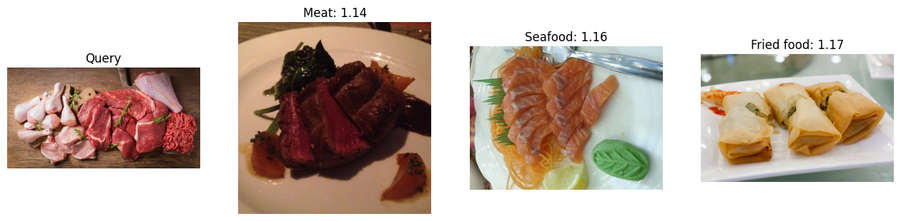

# Day100_ChromaDB_이미지텍스트임베딩검색

## 📅 2026-07-03

---
# 📄 vecdb9webimage.ipynb — ChromaDB · ViT(DINO) · 이미지 임베딩

## 🧠 개념 요약

이번 실습은 **"이미지로 이미지를 찾는"** 예제다. 텍스트 검색이 아니라 이미지 검색이라는 점이 핵심.

```
이미지 → AutoImageProcessor(전처리) → ViTModel(특징 벡터 추출) → ChromaDB 저장
       → 새 이미지 벡터화 → 기존 벡터들과 비교 → 유사 이미지 검색
```

### CLIP vs ViT/DINO — 헷갈리기 쉬운 부분

- 이번 예제는 **CLIP이 아니라 ViT/DINO** 기반 이미지 임베딩이다.
- **CLIP**: 이미지 인코더 + 텍스트 인코더를 함께 가진 모델 → "텍스트로 이미지 검색"이 가능
- **ViT/DINO**: 이미지 인코더만 있는 모델 → "이미지로 이미지 검색"만 가능 (텍스트 검색 불가)
- 즉, 이번 실습에서 텍스트 쿼리로 이미지를 찾고 싶다면 CLIP 계열 모델로 바꿔야 한다.

### 3개의 핵심 함수

|함수|역할|
|---|---|
|`image_to_embedding()`|이미지 → 벡터 변환|
|`collection.upsert()`|벡터를 ChromaDB에 저장 (add 대신 upsert 사용 — 중복 저장 방지)|
|`queryFunc()`|새 이미지와 유사한 이미지 검색 + 결과 시각화|

---

## 📄 셀별 코드 정리

### Cell 1 — 환경 설정 & 데이터 다운로드

```python
!pip install -q chromadb transformers

!wget -q https://github.com/kairess/toy-datasets/raw/master/Food-11.zip
!unzip -q Food-11.zip
```

- `chromadb`: 벡터DB 라이브러리
- `transformers`: HuggingFace 라이브러리, ViT 모델 로드에 사용
- Food-11 데이터셋(음식 이미지 11개 클래스)을 다운로드 후 압축 해제

### Cell 2 — 라이브러리 임포트

```python
import torch
import chromadb
import requests
import matplotlib.pyplot as plt
from PIL import Image
from glob import glob
from tqdm import tqdm
from transformers import AutoImageProcessor, ViTModel
# AutoImageProcessor : 이미지를 모델에 넣기 전, 모델이 이해할 수 있는 형태로 바꿔주는 도구
```

- `AutoImageProcessor`: 이미지를 모델 입력 규격(크기, 정규화 등)에 맞게 전처리
- `ViTModel`: Vision Transformer 구조의 이미지 특징 추출 모델
- `glob`: 폴더 내 파일 경로를 패턴으로 찾을 때 사용
- `tqdm`: 반복문 진행률 표시 (긴 for문에서 진행 상황 확인용)

### Cell 3 — 모델 준비

```python
model_name = "facebook/dino-vits16"
image_processor = AutoImageProcessor.from_pretrained(model_name)  # 이미지 전처리 도구를 불러온다.
model = ViTModel.from_pretrained(model_name)  # ViT 모델을 불러온다.

device = "cuda" if torch.cuda.is_available() else "cpu"
model.to(device)
model.eval()
print("Models loaded!")
print("사용 장치:", device)
```

- `facebook/dino-vits16`: Meta에서 공개한 **자기지도학습(self-supervised)** 방식으로 학습된 ViT 모델
    - 라벨 없이 이미지 자체의 구조를 학습했기 때문에 일반적인 이미지 유사도 비교에 강함
- `model.eval()`: 추론 모드 전환 — Dropout, BatchNorm 같은 학습 전용 레이어를 비활성화 (필수)
- GPU 사용 가능 여부에 따라 device를 자동 선택

### Cell 4 — 이미지 벡터화 & ChromaDB 저장

```python
# 이미지 벡터 추출 함수
def image_to_embedding(img):
    img = img.convert("RGB")

    inputs = image_processor(
        images=img,
        return_tensors="pt"
    )

    inputs = {k: v.to(device) for k, v in inputs.items()}  # 입력 텐서를 모델과 같은 장치로 이동

    with torch.no_grad():
        outputs = model(**inputs)  # ViT 모델로 이미지 특징을 추출

    embedding = outputs.last_hidden_state[:, 0, :]  # 첫 번째 토큰인 CLS 토큰을 이미지 대표 벡터로 사용

    embedding = embedding / embedding.norm(
        p=2,
        dim=-1,
        keepdim=True
    )

    return embedding.squeeze(0).cpu().numpy().tolist()  # ChromaDB 저장용 list로 반환
```

**핵심 포인트**

- `img.convert("RGB")`: PNG 등 RGBA/그레이스케일 이미지가 섞여 있을 경우를 대비한 통일 처리
- `torch.no_grad()`: 추론 시 그래디언트 계산을 꺼서 메모리 절약 + 속도 향상
- **CLS 토큰**: ViT는 이미지를 여러 패치(patch)로 쪼개 각각을 토큰화하는데, 맨 앞에 붙는 `[CLS]` 토큰이 이미지 전체를 대표하는 벡터로 학습됨 → BERT의 `[CLS]` 토큰과 같은 개념
- **L2 정규화** (`embedding.norm(p=2, ...)`): 벡터 길이를 1로 맞춰서 코사인 유사도 기반 검색을 안정적으로 만듦 (벡터DB 실습에서 반복적으로 나오는 패턴)

```python
client = chromadb.Client()  # 메모리 기반 ChromaDB 클라이언트를 생성

try:
    client.delete_collection("foods")
except:
    pass

collection = client.create_collection("foods")  # foods 컬렉션
```

- `chromadb.Client()`: `PersistentClient`와 달리 **메모리 기반** — 세션(런타임) 종료 시 데이터가 사라짐. 디스크에 안 쌓이니 이전 실습에서 겪었던 "중복 저장" 문제는 발생하지 않음
- `delete_collection` → `try/except`: 같은 이름의 컬렉션이 이미 있으면 지우고 새로 생성 (재실행 시 충돌 방지용 안전장치)

```python
img_list = sorted(glob("test/*/*.jpg"))  # test 하위의 모든 서브폴더 안에 있는 jpg 파일을 가져온다.
print("전체 이미지 수:", len(img_list))

embeddings = []  # 이미지 벡터를 저장할 리스트
metadatas = []    # 이미지 경로와 클래스명을 저장할 리스트
ids = []           # ChromaDB에 저장할 고유 ID 리스트

for i, img_path in enumerate(tqdm(img_list)):
    img = Image.open(img_path)
    cls = img_path.split("/")[1]  # 이미지 경로에서 클래스 이름을 추출
    embedding = image_to_embedding(img)  # 이미지를 ViT 벡터로 변환

    embeddings.append(embedding)
    metadatas.append({"uri": img_path, "name": cls})
    ids.append(str(i))

print("벡터화 완료:", len(embeddings))

# ChromaDB에 저장
collection.upsert(
    embeddings=embeddings,
    metadatas=metadatas,
    ids=ids
)
```

- `glob("test/*/*.jpg")`: `test/클래스명/이미지.jpg` 구조를 가정 → 폴더명 자체가 클래스 라벨
- `id`는 `str(i)`로 단순 인덱스 사용 — 지난 실습에서 다뤘던 uuid/해시 방식과 달리 여기서는 in-memory + 1회성 배치 저장이라 인덱스만으로 충분
- `upsert()` 사용: `add()`가 아니라 `upsert()`를 씀으로써 혹시 같은 id로 재실행해도 에러 없이 갱신됨

### Cell 5 — 검색 함수 (URL 이미지로 쿼리)

```python
def queryFunc(img_url, n_results=3):
    test_img = Image.open(requests.get(img_url, stream=True).raw).convert("RGB")

    test_embedding = image_to_embedding(test_img)  # 테스트 이미지를 벡터로 변환
    query_result = collection.query(
        query_embeddings=[test_embedding],
        n_results=n_results
    )
    fig, axes = plt.subplots(1, n_results + 1, figsize=(16, 5))

    axes[0].imshow(test_img)
    axes[0].set_title("Query")
    axes[0].axis("off")

    for i, metadata in enumerate(query_result["metadatas"][0]):
        distance = query_result["distances"][0][i]

        result_img = Image.open(metadata["uri"])

        axes[i + 1].imshow(result_img)
        axes[i + 1].set_title(f"{metadata['name']}: {distance:.2f}")
        axes[i + 1].axis("off")

    plt.show()

    return query_result  # 검색 결과를 반환
```

- `requests.get(img_url, stream=True).raw`: URL에서 이미지를 바로 스트리밍으로 받아 `PIL.Image`로 오픈 (로컬 저장 없이 메모리에서 바로 처리)
- `n_results + 1`개의 subplot: 0번째는 쿼리 이미지 자신, 1~n번째는 검색 결과
- `distance`: 값이 작을수록 더 유사한 이미지 (거리 개념이므로 0에 가까울수록 유사)
- `metadata["uri"]`에 저장해둔 로컬 경로로 실제 이미지를 다시 열어서 시각화 — ChromaDB에는 벡터+메타데이터만 저장하고, 원본 이미지는 다시 파일에서 불러오는 구조

### Cell 6 — 테스트 실행

```python
queryFunc("https://i.ibb.co/JmpXmvx/QCado9g.jpg")  # 첫 번째 테스트 이미지를 검색
queryFunc("https://i.ibb.co/X5dkHGF/lf5C0LI.png")  # 두 번째 테스트 이미지를 검색
```

- 외부 URL 이미지 2장을 각각 쿼리로 사용해 유사 음식 이미지 top-3를 검색·시각화

**▶ 실행 결과 (첫 번째 쿼리)**



| |클래스|distance|
|---|---|---|
|Query|생고기/닭·오리 부속 모음|-|
|결과 1|Meat|1.14|
|결과 2|Seafood|1.16|
|결과 3|Fried food|1.17|

**해석 메모**

- 쿼리 이미지가 생고기류라 최상위 결과가 `Meat`로 나온 건 납득 가는 결과.
- 다만 distance 값이 1.14~1.17로 서로 큰 차이가 없음 → 상위 3개가 실제로는 비등비등하게 유사하다고 판단됐다는 뜻. L2 정규화된 벡터의 코사인 거리 특성상 서로 다른 음식 카테고리라도 "플레이팅된 접시 사진"이라는 공통 구도 때문에 거리 차이가 크게 벌어지지 않을 수 있음.
- `Fried food`(만두/스프링롤)까지 유사 상위권에 들어온 건 다소 의아한 결과 — DINO 임베딩이 색감·질감·구도 같은 저수준 시각 특징에 민감하기 때문일 가능성이 큼 (라벨 의미보다 픽셀 패턴 유사성에 반응).

**▶ 실행 결과 (두 번째 쿼리)**

_두 번째 `queryFunc("https://i.ibb.co/X5dkHGF/lf5C0LI.png")` 결과 이미지는 아직 공유 안 해주셨어요. 캡처해서 올려주시면 이어서 정리해드릴게요._

---

## 📝 트러블슈팅 / 참고 메모

- **PersistentClient가 아닌 Client() 사용 이유**: 실습용 1회성 배치 처리이므로 디스크 영속화가 불필요. 만약 실습을 여러 세션에 걸쳐 이어가려면 `PersistentClient`로 바꾸되, 이전 실습처럼 `upsert` + 콘텐츠 기반 id를 조합해야 중복을 피할 수 있음.
- **CLIP으로 확장하려면**: `AutoImageProcessor` + `ViTModel` 대신 `CLIPProcessor` + `CLIPModel`을 사용하고, 이미지 임베딩뿐 아니라 텍스트 임베딩 함수(`text_to_embedding`)를 추가로 만들면 "텍스트로 이미지 검색"이 가능해짐 — 다음 실습 후보로 좋음.

---
# 📄 vecdb10text.ipynb — ChromaDB · SentenceTransformer · 문단분리

## 🧠 개념 요약

텍스트 파일(`.txt`)을 문단 단위로 쪼갠 뒤 문장 임베딩 모델로 벡터화해서 ChromaDB에 저장하고, 자연어 질의로 유사 문단을 검색하는 실습.

```
sample.txt → 문단 분리(빈 줄 기준) → SentenceTransformer 임베딩 → ChromaDB 저장
           → 검색 쿼리 벡터화 → 코사인 거리 기반 유사 문단 top-k 검색
```

- 사용 모델: `all-MiniLM-L6-v2` — 가볍고 빠른 다국어/영어 문장 임베딩 모델(한국어 성능은 제한적이지만 문단 단위 의미 구분에는 충분히 동작)
- 임베딩 시 `normalize_embeddings=True`로 L2 정규화 → 검색 결과 distance 값을 코사인 거리 기준으로 안정적으로 해석 가능

---

## 📄 셀별 코드 · 출력 정리

### Cell 1 — 패키지 설치

```python
# VectorDB에 텍스트 파일 데이터를 저장 후 유사 문장 읽기
!pip install chromadb sentence-transformers
```

**▶ 출력**

```
Requirement already satisfied: chromadb in /usr/local/lib/python3.12/dist-packages (1.5.9)
Requirement already satisfied: sentence-transformers in /usr/local/lib/python3.12/dist-packages (5.6.0)
...
```

- 이미 설치되어 있어 "already satisfied"만 출력됨

### Cell 2 — 모델 · 클라이언트 준비

```python
import os, re
import uuid     # 고유 id 식별 생성
from typing import List
from sentence_transformers import SentenceTransformer
from chromadb import PersistentClient

TXT_PATH = "sample.txt"
CHROMA_DIR = ".txt_demo"
COLLECTION = "docs_col"
MODEL_NAME = "all-MiniLM-L6-v2"

model = SentenceTransformer(MODEL_NAME)
client = PersistentClient(path=CHROMA_DIR)
collection = client.get_or_create_collection(COLLECTION)
```

- `PersistentClient(path=".txt_demo")`: 디스크에 벡터DB를 영속 저장 — **재실행 시 데이터가 누적될 수 있으니 주의** (아래 트러블슈팅 참고)

**▶ 출력**

```
Warning: You are sending unauthenticated requests to the HF Hub. Please set a HF_TOKEN to enable higher rate limits and faster downloads.
Loading weights: 100% | 103/103 [00:00<00:00]
```

- HuggingFace Hub 인증 토큰 없이 모델을 받아온다는 경고 — 실습에는 지장 없지만, 반복적으로 모델을 내려받는 상황이면 `HF_TOKEN` 설정 권장

### Cell 3 — 문단 분리 · 임베딩 · 저장 · 검색 (메인 로직)

```python
# 파일 읽기
def read_textFucn(path:str) -> str:
  if not os.path.exists(path):
    raise FileNotFoundError(f"파일 없음:{path}")

  with open(path, 'r', encoding='utf-8') as f:
    return f.read()

# 문단 분리 함수
def split_paragraphFunc(text:str, min_len=20) -> List[str]:
  paras = re.split(r"\n\s*\n+", text)   # 빈 줄 기준 분리
  paras = [re.sub(r"\s+"," ", p).strip() for p in paras]
  return [p for p in paras if len(p) >= min_len]

# 임베딩 함수
def embedFunc(texts:List[str]) -> List[List[float]]:
  return model.encode(texts, normalize_embeddings=True).tolist()

# 저장 함수
def upsert_paraFunc(source_path:str):
  text = read_textFucn(source_path)   # txt 파일 읽기
  chunks = split_paragraphFunc(text)  # 문단 분리
  if not chunks:
    print("저장할 문단 없음")
    return

  ids = [str(uuid.uuid4()) for _ in chunks]   # 각 문단에 고유 id 생성
  print(ids)
  embs = embedFunc(chunks)                  # 각 문장 벡터화
  print(embs)
  metas = [{"source":os.path.basename(source_path), "len": len(c)} for c in chunks]
  print(metas)

  collection.add(
      ids=ids,
      documents=chunks,
      embeddings=embs,
      metadatas=metas
  )

# 검색
def searchFunc(query:str, k:int):
  q_emb = embedFunc([query])
  res = collection.query(query_embeddings=q_emb, n_results=k)

  docs = res.get("documents", [[]])[0]    # [[]] 예외 방지용 패턴
  metas = res.get("metadatas", [[]])[0]
  ids = res.get("ids", [[]])[0]
  dists = res.get("distances", [[]])[0]

  for i, (doc, meta, _id, dist) in enumerate(zip(docs, metas, ids, dists), start=1):
    print(f"\n[{i}] id={_id}")
    print(f"source={meta.get('source')}, len={meta.get('len')}, distance={dist:.4f}")
    print(doc[:500] + ("..." if len(doc) > 500 else ""))

if __name__ == "__main__":
  upsert_paraFunc(TXT_PATH)

  print("\n검색 예")
  searchFunc("소나기의 기원은", k=3)
```

**함수별 포인트**

|함수|역할|비고|
|---|---|---|
|`read_textFucn`|파일 존재 확인 후 텍스트 읽기|없으면 `FileNotFoundError`로 명시적 예외 처리|
|`split_paragraphFunc`|빈 줄(`\n\s*\n+`) 기준 문단 분리|`min_len=20` 미만 문단은 제외 (너무 짧은 조각 걸러내기)|
|`embedFunc`|문장 리스트 → 정규화된 임베딩 벡터 리스트|`normalize_embeddings=True`로 코사인 유사도 계산에 최적화|
|`upsert_paraFunc`|문단 분리 → 임베딩 → uuid 부여 → `collection.add()`|함수명은 upsert지만 실제로는 `add()` 사용|
|`searchFunc`|쿼리 임베딩 → `collection.query()` → 결과 정리 출력|`res.get(..., [[]])[0]` 패턴으로 빈 결과 예외 방지|

**▶ 저장 단계 출력 (uuid 15개 — 문단 15개 생성 확인)**

```
['a0a35e56-bd19-418a-b2f6-9520285dd9f9', 'c6cd8443-4d51-447c-baf2-108e4a0a1531', ...]

[[ 0.00951255  0.04200696  0.07577302 ... -0.03501244 -0.00320994 -0.02194746]
 [ 0.01763828  0.02834196  0.05487905 ...  0.02502376 -0.05911914  0.00775696]
 ...
 [-0.01369508  0.03880414  0.10166706 ...  0.08076631 -0.09181247 -0.0727111 ]]

[{'source': 'sample.txt', 'len': 272}, {'source': 'sample.txt', 'len': 617},
 {'source': 'sample.txt', 'len': 41},  {'source': 'sample.txt', 'len': 56},
 {'source': 'sample.txt', 'len': 110}, {'source': 'sample.txt', 'len': 138},
 {'source': 'sample.txt', 'len': 764}, {'source': 'sample.txt', 'len': 182},
 {'source': 'sample.txt', 'len': 45},  {'source': 'sample.txt', 'len': 253},
 {'source': 'sample.txt', 'len': 290}, {'source': 'sample.txt', 'len': 247},
 {'source': 'sample.txt', 'len': 346}, {'source': 'sample.txt', 'len': 183},
 {'source': 'sample.txt', 'len': 323}]
```

**▶ 검색 결과 (`"소나기의 기원은"`, k=3)**

```
[1] id=d712d33b-c1f3-41a1-8a6c-2368325fb83e
source=sample.txt, len=45, distance=0.4961
소나기는 보통 10-20분 이내로 내리며 그 이상일 시엔 소나기라고 하지 않는다.

[2] id=ad1253ec-6ff6-43e1-ac76-2400dfcc7ed2
source=sample.txt, len=41, distance=0.5366
정의 일반적인 정의 일반적으로는 "오랫동안 계속해서 내리는 비"를 말한다.

[3] id=0cdf4387-c0f1-42f4-8f43-64ceeeb6e100
source=sample.txt, len=56, distance=0.6070
일기도 정체전선 기호 기상학에서는 "장마전선(정체전선)의 영향을 받아 비가 오는 것"을 말한다.[1]
```

**해석 메모**

- 쿼리는 "소나기의 **기원**은"인데, 정작 최상위(distance 0.4961)로 잡힌 문단은 소나기의 **지속 시간**에 대한 설명 — 정확히 "기원/어원"을 다루는 문단(실제로는 `sample.txt`에 별도로 존재하는 소나기 어원 문단)은 이번 top-3에 안 들어옴.
- 원인 추정: `all-MiniLM-L6-v2`가 한국어 특화 모델이 아니라서, "기원"이라는 단어의 의미보다 "소나기"라는 표면 키워드 반복에 더 크게 반응했을 가능성이 큼. 한국어 검색 품질을 높이려면 `jhgan/ko-sroberta-multitask` 같은 한국어 특화 SentenceTransformer로 교체하는 게 다음 시도로 좋아 보임.
- distance 값이 0.49~0.61로 전체적으로 그렇게 낮지 않음 → "확실히 유사하다"기보다 "상대적으로 가장 가까운 것"을 고른 결과라는 점 감안 필요.

---

## 📝 트러블슈팅 메모 (재실행 시 주의)

- `PersistentClient(path=".txt_demo")`를 쓰기 때문에 **셀을 여러 번 재실행하면 uuid가 매번 새로 생성**되어 같은 문단이 중복 저장될 수 있음.
- 실제로 이번 실습 과정에서 셀 재실행을 반복하다가 `collection.count()`가 15의 배수(165)까지 쌓인 걸 확인한 적 있음.
- **해결책 두 가지**
    1. 완전 초기화: `shutil.rmtree(CHROMA_DIR, ignore_errors=True)`로 `.txt_demo` 폴더 자체를 지우고 재실행 (이번 최종본이 이 방식으로 정리된 결과)
    2. 근본적 해결: uuid 대신 `hashlib.md5(f"{source}:{text}".encode()).hexdigest()`처럼 **콘텐츠 기반 id**를 쓰고 `add()` 대신 `upsert()`로 바꾸면, 같은 문단은 항상 같은 id로 매핑되어 재실행해도 중복이 안 생김.
- Colab 세션 재시작만으로는 `.txt_demo` 디스크 데이터가 안 지워질 수 있다는 점도 함께 기억해둘 것 (런타임 재시작 ≠ 디스크 초기화).

---
# 📄 vecdb10text.ipynb — ChromaDB · SentenceTransformer · 문단분리

## 🧠 개념 요약

텍스트 파일(`.txt`)을 문단 단위로 쪼갠 뒤 문장 임베딩 모델로 벡터화해서 ChromaDB에 저장하고, 자연어 질의로 유사 문단을 검색하는 실습.

```
sample.txt → 문단 분리(빈 줄 기준) → SentenceTransformer 임베딩 → ChromaDB 저장
           → 검색 쿼리 벡터화 → 코사인 거리 기반 유사 문단 top-k 검색
```

- 사용 모델: `all-MiniLM-L6-v2` — 가볍고 빠른 다국어/영어 문장 임베딩 모델(한국어 성능은 제한적이지만 문단 단위 의미 구분에는 충분히 동작)
- 임베딩 시 `normalize_embeddings=True`로 L2 정규화 → 검색 결과 distance 값을 코사인 거리 기준으로 안정적으로 해석 가능

---

## 📄 셀별 코드 · 출력 정리

### Cell 1 — 패키지 설치

```python
# VectorDB에 텍스트 파일 데이터를 저장 후 유사 문장 읽기
!pip install chromadb sentence-transformers
```

**▶ 출력**

```
Requirement already satisfied: chromadb in /usr/local/lib/python3.12/dist-packages (1.5.9)
Requirement already satisfied: sentence-transformers in /usr/local/lib/python3.12/dist-packages (5.6.0)
...
```

- 이미 설치되어 있어 "already satisfied"만 출력됨

### Cell 2 — 모델 · 클라이언트 준비

```python
import os, re
import uuid     # 고유 id 식별 생성
from typing import List
from sentence_transformers import SentenceTransformer
from chromadb import PersistentClient

TXT_PATH = "sample.txt"
CHROMA_DIR = ".txt_demo"
COLLECTION = "docs_col"
MODEL_NAME = "all-MiniLM-L6-v2"

model = SentenceTransformer(MODEL_NAME)
client = PersistentClient(path=CHROMA_DIR)
collection = client.get_or_create_collection(COLLECTION)
```

- `PersistentClient(path=".txt_demo")`: 디스크에 벡터DB를 영속 저장 — **재실행 시 데이터가 누적될 수 있으니 주의** (아래 트러블슈팅 참고)

**▶ 출력**

```
Warning: You are sending unauthenticated requests to the HF Hub. Please set a HF_TOKEN to enable higher rate limits and faster downloads.
Loading weights: 100% | 103/103 [00:00<00:00]
```

- HuggingFace Hub 인증 토큰 없이 모델을 받아온다는 경고 — 실습에는 지장 없지만, 반복적으로 모델을 내려받는 상황이면 `HF_TOKEN` 설정 권장

### Cell 3 — 문단 분리 · 임베딩 · 저장 · 검색 (메인 로직)

```python
# 파일 읽기
def read_textFucn(path:str) -> str:
  if not os.path.exists(path):
    raise FileNotFoundError(f"파일 없음:{path}")

  with open(path, 'r', encoding='utf-8') as f:
    return f.read()

# 문단 분리 함수
def split_paragraphFunc(text:str, min_len=20) -> List[str]:
  paras = re.split(r"\n\s*\n+", text)   # 빈 줄 기준 분리
  paras = [re.sub(r"\s+"," ", p).strip() for p in paras]
  return [p for p in paras if len(p) >= min_len]

# 임베딩 함수
def embedFunc(texts:List[str]) -> List[List[float]]:
  return model.encode(texts, normalize_embeddings=True).tolist()

# 저장 함수
def upsert_paraFunc(source_path:str):
  text = read_textFucn(source_path)   # txt 파일 읽기
  chunks = split_paragraphFunc(text)  # 문단 분리
  if not chunks:
    print("저장할 문단 없음")
    return

  ids = [str(uuid.uuid4()) for _ in chunks]   # 각 문단에 고유 id 생성
  print(ids)
  embs = embedFunc(chunks)                  # 각 문장 벡터화
  print(embs)
  metas = [{"source":os.path.basename(source_path), "len": len(c)} for c in chunks]
  print(metas)

  collection.add(
      ids=ids,
      documents=chunks,
      embeddings=embs,
      metadatas=metas
  )

# 검색
def searchFunc(query:str, k:int):
  q_emb = embedFunc([query])
  res = collection.query(query_embeddings=q_emb, n_results=k)

  docs = res.get("documents", [[]])[0]    # [[]] 예외 방지용 패턴
  metas = res.get("metadatas", [[]])[0]
  ids = res.get("ids", [[]])[0]
  dists = res.get("distances", [[]])[0]

  for i, (doc, meta, _id, dist) in enumerate(zip(docs, metas, ids, dists), start=1):
    print(f"\n[{i}] id={_id}")
    print(f"source={meta.get('source')}, len={meta.get('len')}, distance={dist:.4f}")
    print(doc[:500] + ("..." if len(doc) > 500 else ""))

if __name__ == "__main__":
  upsert_paraFunc(TXT_PATH)

  print("\n검색 예")
  searchFunc("소나기의 기원은", k=3)
```

**함수별 포인트**

|함수|역할|비고|
|---|---|---|
|`read_textFucn`|파일 존재 확인 후 텍스트 읽기|없으면 `FileNotFoundError`로 명시적 예외 처리|
|`split_paragraphFunc`|빈 줄(`\n\s*\n+`) 기준 문단 분리|`min_len=20` 미만 문단은 제외 (너무 짧은 조각 걸러내기)|
|`embedFunc`|문장 리스트 → 정규화된 임베딩 벡터 리스트|`normalize_embeddings=True`로 코사인 유사도 계산에 최적화|
|`upsert_paraFunc`|문단 분리 → 임베딩 → uuid 부여 → `collection.add()`|함수명은 upsert지만 실제로는 `add()` 사용|
|`searchFunc`|쿼리 임베딩 → `collection.query()` → 결과 정리 출력|`res.get(..., [[]])[0]` 패턴으로 빈 결과 예외 방지|

**▶ 저장 단계 출력 (uuid 15개 — 문단 15개 생성 확인)**

```
['a0a35e56-bd19-418a-b2f6-9520285dd9f9', 'c6cd8443-4d51-447c-baf2-108e4a0a1531', ...]

[[ 0.00951255  0.04200696  0.07577302 ... -0.03501244 -0.00320994 -0.02194746]
 [ 0.01763828  0.02834196  0.05487905 ...  0.02502376 -0.05911914  0.00775696]
 ...
 [-0.01369508  0.03880414  0.10166706 ...  0.08076631 -0.09181247 -0.0727111 ]]

[{'source': 'sample.txt', 'len': 272}, {'source': 'sample.txt', 'len': 617},
 {'source': 'sample.txt', 'len': 41},  {'source': 'sample.txt', 'len': 56},
 {'source': 'sample.txt', 'len': 110}, {'source': 'sample.txt', 'len': 138},
 {'source': 'sample.txt', 'len': 764}, {'source': 'sample.txt', 'len': 182},
 {'source': 'sample.txt', 'len': 45},  {'source': 'sample.txt', 'len': 253},
 {'source': 'sample.txt', 'len': 290}, {'source': 'sample.txt', 'len': 247},
 {'source': 'sample.txt', 'len': 346}, {'source': 'sample.txt', 'len': 183},
 {'source': 'sample.txt', 'len': 323}]
```

**▶ 검색 결과 (`"소나기의 기원은"`, k=3)**

```
[1] id=d712d33b-c1f3-41a1-8a6c-2368325fb83e
source=sample.txt, len=45, distance=0.4961
소나기는 보통 10-20분 이내로 내리며 그 이상일 시엔 소나기라고 하지 않는다.

[2] id=ad1253ec-6ff6-43e1-ac76-2400dfcc7ed2
source=sample.txt, len=41, distance=0.5366
정의 일반적인 정의 일반적으로는 "오랫동안 계속해서 내리는 비"를 말한다.

[3] id=0cdf4387-c0f1-42f4-8f43-64ceeeb6e100
source=sample.txt, len=56, distance=0.6070
일기도 정체전선 기호 기상학에서는 "장마전선(정체전선)의 영향을 받아 비가 오는 것"을 말한다.[1]
```

**해석 메모**

- 쿼리는 "소나기의 **기원**은"인데, 정작 최상위(distance 0.4961)로 잡힌 문단은 소나기의 **지속 시간**에 대한 설명 — 정확히 "기원/어원"을 다루는 문단(실제로는 `sample.txt`에 별도로 존재하는 소나기 어원 문단)은 이번 top-3에 안 들어옴.
- 원인 추정: `all-MiniLM-L6-v2`가 한국어 특화 모델이 아니라서, "기원"이라는 단어의 의미보다 "소나기"라는 표면 키워드 반복에 더 크게 반응했을 가능성이 큼. 한국어 검색 품질을 높이려면 `jhgan/ko-sroberta-multitask` 같은 한국어 특화 SentenceTransformer로 교체하는 게 다음 시도로 좋아 보임.
- distance 값이 0.49~0.61로 전체적으로 그렇게 낮지 않음 → "확실히 유사하다"기보다 "상대적으로 가장 가까운 것"을 고른 결과라는 점 감안 필요.

---

## 📝 트러블슈팅 메모 (재실행 시 주의)

- `PersistentClient(path=".txt_demo")`를 쓰기 때문에 **셀을 여러 번 재실행하면 uuid가 매번 새로 생성**되어 같은 문단이 중복 저장될 수 있음.
- 실제로 이번 실습 과정에서 셀 재실행을 반복하다가 `collection.count()`가 15의 배수(165)까지 쌓인 걸 확인한 적 있음.
- **해결책 두 가지**
    1. 완전 초기화: `shutil.rmtree(CHROMA_DIR, ignore_errors=True)`로 `.txt_demo` 폴더 자체를 지우고 재실행 (이번 최종본이 이 방식으로 정리된 결과)
    2. 근본적 해결: uuid 대신 `hashlib.md5(f"{source}:{text}".encode()).hexdigest()`처럼 **콘텐츠 기반 id**를 쓰고 `add()` 대신 `upsert()`로 바꾸면, 같은 문단은 항상 같은 id로 매핑되어 재실행해도 중복이 안 생김.
- Colab 세션 재시작만으로는 `.txt_demo` 디스크 데이터가 안 지워질 수 있다는 점도 함께 기억해둘 것 (런타임 재시작 ≠ 디스크 초기화).

---
