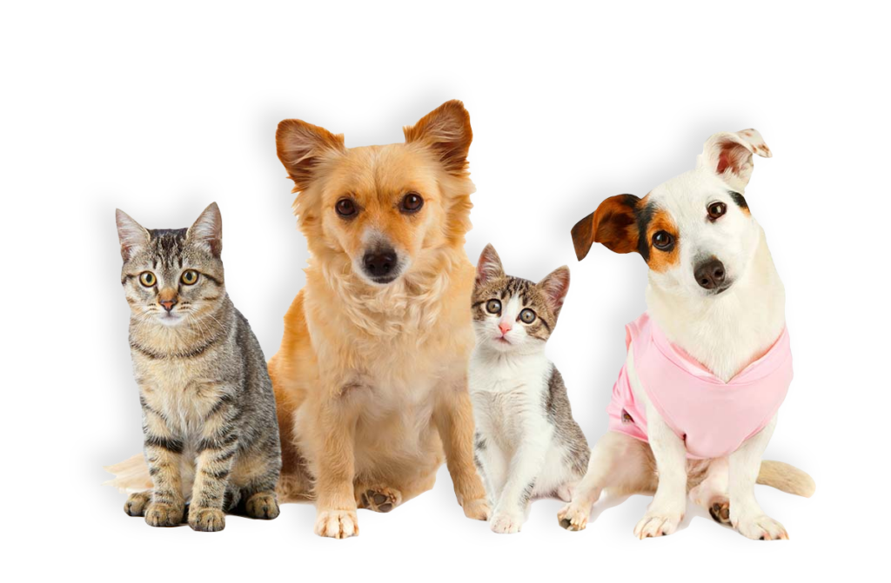
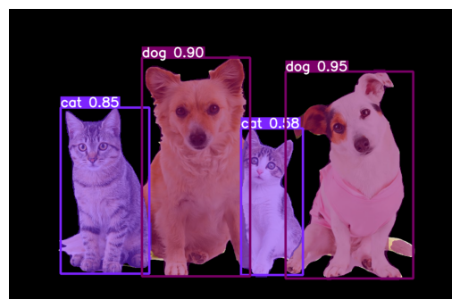
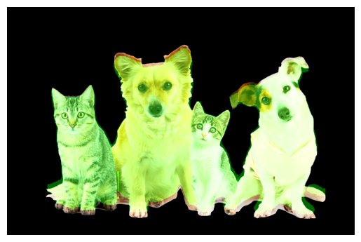
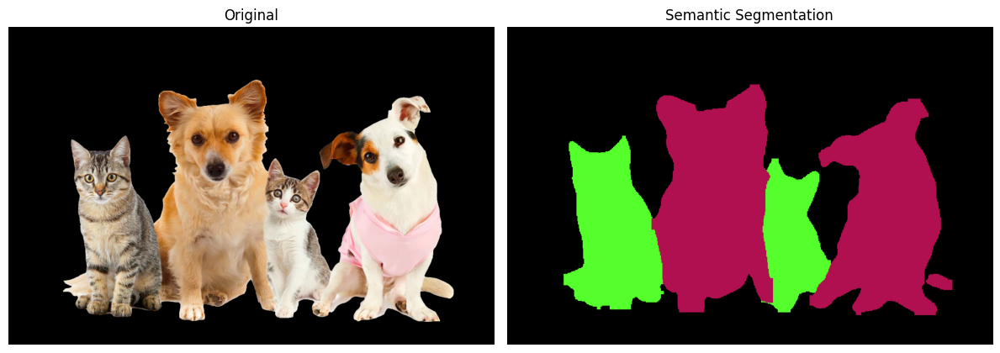

# Day74_딥러닝 : YOLO · Instance Segmentation · Semantic Segmentation · Classification

## 📅 2026-05-26

---
# 📄 yolo10.ipynb — Instance Segmentation · Semantic Segmentation · Alpha Channel

---

## 📌 핵심 개념 정리

### 🔷 Instance Segmentation vs Semantic Segmentation

|항목|Instance Segmentation|Semantic Segmentation|
|---|---|---|
|구분 단위|**객체 개별** 마스크|**클래스 단위** 색상 지도|
|같은 클래스 2개|따로 구분|같은 색으로 표시|
|출력|N개의 마스크 이미지|1장의 색상 맵|
|활용|배경 제거, 객체 크롭|장면 전체 분류|

```
Input Image (고양이, 개 4마리)

Instance Seg       Semantic Seg
┌──┐ ┌──┐ ┌──┐    ██ ██ ██ ██
│ A│ │ B│ │ C│    (dog=빨강, cat=초록)
└──┘ └──┘ └──┘    클래스별 색상 하나로 통일
각 객체 개별 마스크
```

---

### 🔷 마스크 데이터 구조

- `res.masks.data` : `(N, h, w)` float 텐서 — N개 객체의 마스크 (값 범위 0~1)
- YOLO가 출력하는 마스크는 원본보다 **작은 해상도** → `cv2.resize()`로 원본 크기에 맞춰야 함
- `> 0.5` 임계값으로 이진화 → 객체 픽셀 `True` / 배경 픽셀 `False`

```python
m_bin = cv2.resize(m, (W, H), interpolation=cv2.INTER_NEAREST) > 0.5
```

> `INTER_NEAREST` 사용 이유: 마스크는 경계가 흐려지면 안 되므로 최근접 이웃 보간 사용

---

### 🔷 Alpha Channel (배경 제거)

- PNG는 BGRA 4채널 지원 → 4번째 채널(A)이 투명도
- `A = 0` : 완전 투명 (배경), `A = 255` : 완전 불투명 (객체)
- 마스크를 알파 채널에 적용하면 배경이 투명한 PNG 저장 가능

```python
crop_bgra = cv2.cvtColor(crop_bgr, cv2.COLOR_BGR2BGRA)  # 알파 채널 추가
crop_bgra[..., 3] = crop_mask                           # 마스크를 알파로 적용
```

---

### 🔷 `cv2.addWeighted()` — 반투명 오버레이

```python
# overlay = 이미지1 * 비율1 + 이미지2 * 비율2 + 추가밝기
overlay = cv2.addWeighted(overlay, 1.0, color_mask, 0.4, 0.0)
```

- `1.0` : 원본 이미지 100% 유지
- `0.4` : 컬러 마스크 40% 투명도로 합성
- 마지막 `0.0` : 전체 밝기 보정값 (보통 0)

---

### 🔷 Semantic Segmentation 구현 방식

- `conf_map` : 픽셀마다 현재까지 가장 높은 신뢰도를 기록하는 배열
- 새 객체의 conf가 더 높은 픽셀만 갱신 → 겹치는 영역은 더 확실한 객체 색상으로 덮어씀

```python
update = m_full & (conf > conf_map)  # 이번 conf가 더 큰 픽셀만 True
sem_canvas[update] = color           # 해당 픽셀만 갱신
conf_map[update] = conf              # conf 기록 갱신
```

---

## 🗺️ 전체 흐름

```
STEP 1. 라이브러리 import + 경로 설정
        ↓
STEP 2. YOLO 세그멘테이션 모델 로드 + 이미지 추론
        ↓
STEP 3. .plot()으로 결과 시각화 + 저장
        ↓
STEP 4. 마스크 데이터 numpy 변환 (masks_np, boxes_np, conf_np, class_np)
        ↓
STEP 5. Instance Segmentation — 마스크 오버레이 (초록색 반투명)
        ↓
STEP 6. 배경 제거 — 객체별 알파 채널 PNG 저장
        ↓
STEP 7. Semantic Segmentation — 클래스별 색상 지도 생성
```

---

## 💻 전체 코드

### STEP 1. Import + 경로 설정

```python
# 이미지 세그멘테이션
import cv2, numpy as np, os
from ultralytics import YOLO
import matplotlib.pyplot as plt

IMG_PATH = "animal.jpg"
OUT_DIR = "seg_output"
os.makedirs(OUT_DIR, exist_ok=True)
```

**📌 원본 이미지**



---

### STEP 2. 모델 로드 + 이미지 추론

```python
model = YOLO("yolo11n-seg.pt")

im_bgr = cv2.imread(IMG_PATH)
assert im_bgr is not None, f"이미지 읽기 실패: {IMG_PATH}"
print(im_bgr.shape)

H, W = im_bgr.shape[:2]  # 원본 높이/너비 → 마스크 리사이즈에 사용
print(H, W)
```

---

### STEP 3. 추론 결과 시각화 + 저장

```python
res = model(im_bgr, verbose=False)[0]  # [0] : 첫 번째 결과 바로 언패킹

annotated = res.plot()  # 마스크 + 바운딩박스 시각화 이미지 반환 (BGR)
cv2.imwrite(os.path.join(OUT_DIR, 'yolo10seg_result.jpg'), annotated)

# 화면 시각화
plt.imshow(cv2.cvtColor(annotated, cv2.COLOR_BGR2RGB))
plt.axis('off')
plt.show()
```

**📌 출력 결과 — .plot() 시각화**



---

### STEP 4. 마스크 데이터 numpy 변환

```python
# 텐서 -> 넘파이 배열로 변환
has_masks = (res.masks is not None)  # res.mask(X) → res.masks(O) 복수형 주의

if has_masks:
    masks_np = res.masks.data.cpu().numpy()              # (N, h, w) float
    boxes_np = res.boxes.xyxy.cpu().numpy().astype(int)  # (N, 4) 바운딩박스
    conf_np  = res.boxes.conf.cpu().numpy()              # (N,) 신뢰도
    class_np = res.boxes.cls.cpu().numpy().astype(int)   # (N,) 클래스 인덱스
else:
    masks_np = boxes_np = conf_np = class_np = None
```

---

### STEP 5. Instance Segmentation — 마스크 오버레이

```python
# 마스크 오버레이
overlay = im_bgr.copy()

if has_masks:
    for m in masks_np:
        # 모델 출력 마스크를 원본 크기로 리사이즈
        m_bin = cv2.resize(m, (W, H), interpolation=cv2.INTER_NEAREST) > 0.5  # 0.5 이상 = 객체
        color_mask = np.zeros_like(overlay)   # 검은색 빈 캔버스 생성
        color_mask[m_bin] = (0, 255, 0)      # 마스크 영역만 초록색으로 채움
        # 반투명 합성: 원본 100% + 컬러마스크 40%
        overlay = cv2.addWeighted(overlay, 1.0, color_mask, 0.4, 0.0)

cv2.imwrite(os.path.join(OUT_DIR, 'yolo10seg_result_overlay.jpg'), overlay)

plt.imshow(cv2.cvtColor(overlay, cv2.COLOR_BGR2RGB))
plt.axis('off')
plt.show()
```

**📌 출력 결과 — 마스크 오버레이**



---

### STEP 6. 배경 제거 — 객체별 PNG 저장

```python
# 객체별 배경제거 후 PNG로 따로 저장
crops_dir = os.path.join(OUT_DIR, 'seg_crops')
os.makedirs(crops_dir, exist_ok=True)

# YOLO 출력 마스크를 원본 이미지 크기에 맞게 변환
if has_masks and len(masks_np) > 0:
    masks_full = np.stack(
        [cv2.resize(m, (W, H), interpolation=cv2.INTER_NEAREST) > 0.5 for m in masks_np],
        axis=0
    )

    for i, (m_full, box, class_id, conf) in enumerate(zip(masks_full, boxes_np, class_np, conf_np)):
        x1, y1, x2, y2 = map(int, box)
        x1, y1 = max(0, x1), max(0, y1)   # 좌상단 좌표가 이미지 밖으로 나가면 0으로 보정
        x2, y2 = min(W, x2), min(H, y2)   # 우하단 좌표가 이미지 밖으로 나가면 W/H로 보정
        if x2 <= x1 or y2 <= y1:          # 잘못된 박스 좌표는 건너뜀
            continue

        # opencv는 [h, w, channel] 순서이므로 배열 슬라이싱 시 y 먼저
        crop_bgr  = im_bgr[y1:y2, x1:x2]                           # 박스 영역 크롭
        crop_mask = (m_full[y1:y2, x1:x2] * 255).astype(np.uint8)  # 마스크 → 0/255 변환

        crop_bgra = cv2.cvtColor(crop_bgr, cv2.COLOR_BGR2BGRA)  # 알파 채널 추가
        crop_bgra[..., 3] = crop_mask                           # 알파에 마스크 적용 (배경 투명)

        # 클래스 이름 얻기
        name = model.names[int(class_id)] if hasattr(model, 'names') else str(class_id)
        cv2.imwrite(os.path.join(crops_dir, f'crop_{i}_{name}_{conf:.2f}.png'), crop_bgra)
```

---

### STEP 7. Semantic Segmentation — 클래스별 색상 지도

```python
# 의미론적 세그멘테이션
sem_canvas = np.zeros((H, W, 3), dtype=np.uint8)  # 클래스 색상 지도
conf_map   = np.zeros((H, W), dtype=np.float32)   # 픽셀별 최고 신뢰도 기록

def class_color(c: int):
    return ((37 * c) % 256, (17 * c) % 256, (91 * c) % 256)  # 클래스별 고유 BGR 색상

if has_masks and len(masks_np) > 0:
    for m_full, cls_id, conf in zip(masks_full, class_np, conf_np):
        color  = class_color(int(cls_id))    # 클래스별 고정 색상 생성
        update = m_full & (conf > conf_map)  # 이번 conf가 더 큰 픽셀만 갱신
        sem_canvas[update] = color
        conf_map[update]   = conf

cv2.imwrite(os.path.join(OUT_DIR, 'yolo10seg_semantic.png'), sem_canvas)

# 시각화
plt.figure(figsize=(12, 5))

plt.subplot(1, 2, 1)
plt.imshow(cv2.cvtColor(im_bgr, cv2.COLOR_BGR2RGB))
plt.title('Original')
plt.axis('off')

plt.subplot(1, 2, 2)
plt.imshow(cv2.cvtColor(sem_canvas, cv2.COLOR_BGR2RGB))
plt.title('Semantic Segmentation')
plt.axis('off')

plt.tight_layout()
plt.show()
```

**📌 출력 결과 — Semantic Segmentation**



---

## ⚠️ 오늘의 주요 오류 모음

|오류|원인|해결|
|---|---|---|
|`ModuleNotFoundError: ultralytics`|패키지 미설치|`!pip install ultralytics`|
|`NameError: os`|import 누락|`import cv2, numpy as np, os`|
|`AttributeError: 'list' has no attribute 'plot'`|`model()` 결과가 리스트로 반환됨|`model(im_bgr)[0]`으로 인덱싱|
|`AttributeError: 'Results' has no attribute 'mask'`|단수형 오타|`res.mask` → `res.masks` (복수형)|
|`NameError: boxes_np`|`if has_masks` 블록에 변환 코드 누락|`masks_np`, `boxes_np` 등 변환 코드 추가|
|`x2, y2 = min(0, x1), min(0, y1)`|보정 로직 오류|`min(W, x2), min(H, y2)`|
|`cls_id` NameError|루프 변수명 불일치|`cls_id` → `class_id`|
|`np.uint2`|존재하지 않는 dtype|`np.uint8`|

---
# 📄 yolo11classify.ipynb — YOLO11 · Image Classification · Flower Dataset

---

## 📌 핵심 개념 정리

### 🔷 YOLO Image Classification이란?

- Object Detection: 객체의 **위치(bounding box)** + 클래스를 동시에 예측
- Image Classification: 이미지 전체가 **어떤 클래스에 속하는지**만 판별 → Confidence Score 출력
- `yolo11n-cls.pt` : YOLO11 nano classification 전용 모델
- 출력: `res.probs` — 각 클래스에 대한 확률값

```
Object Detection         Image Classification
┌────────────────┐       ┌────────────────┐
│  [dog]  [cat]  │  vs   │                │
│  □      □      │       │  → tulip 0.94  │
└────────────────┘       └────────────────┘
  위치 + 클래스             전체 이미지 → 클래스
```

---

### 🔷 YOLO Classification 폴더 구조

YOLO cls 모델은 아래 폴더 구조를 자동으로 인식:

```
flower_dataset/
├── train/
│   ├── daisy/
│   ├── dandelion/
│   ├── roses/
│   ├── sunflowers/
│   └── tulips/
├── val/
│   └── (동일 구조)
└── test/
    └── (동일 구조)
```

> yaml 파일 없이 `data=` 에 폴더 경로만 넘기면 자동으로 클래스 인식

---

### 🔷 데이터 분할 (7 : 2 : 1)

```python
train_end = int(total * 0.7)   # 70% train
val_end   = int(total * 0.9)   # 20% val (0.7~0.9)
# 나머지 10% → test
```

- `random.shuffle()` : 학습 편향 방지를 위해 분할 전 섞기
- `shutil.copy2()` : 메타데이터 포함 파일 복사

---

### 🔷 모델 학습 주요 파라미터

|파라미터|값|설명|
|---|---|---|
|`data`|폴더 절대경로|train/val/test 폴더 루트|
|`epochs`|5|전체 학습 반복 횟수|
|`imgsz`|224|입력 이미지 크기 (Classification 표준)|
|`batch`|16|배치 크기|
|`device`|`'cpu'`|GPU 없을 때 CPU 사용|

> Classification은 Detection과 달리 imgsz=224 사용 (ImageNet 표준)

---

### 🔷 학습 평가 지표

|지표|설명|
|---|---|
|`top1_acc`|가장 높은 확률 클래스가 정답인 비율|
|`top5_acc`|상위 5개 예측 안에 정답이 있는 비율 (클래스 5개라 항상 1.0)|
|`loss`|CrossEntropy Loss — 낮을수록 좋음|

---

## 🗺️ 전체 흐름

```
STEP 1. 패키지 설치
        ↓
STEP 2. 데이터셋 다운로드 + 클래스 확인
        ↓
STEP 3. YOLO 학습용 폴더 구조 생성 + 데이터 분할 복사 (7:2:1)
        ↓
STEP 4. YOLO11n-cls 모델 로드 + 학습 (5 epochs)
```

---

## 💻 전체 코드

### STEP 1. 패키지 설치

```python
!pip install ultralytics opencv-python
```

---

### STEP 2. 데이터셋 다운로드 + 클래스 확인

```python
import random
import shutil
from pathlib import Path
import tensorflow as tf
from ultralytics import YOLO
from sklearn.metrics import accuracy_score, classification_report, confusion_matrix
import matplotlib.pyplot as plt
import seaborn as sns

# TensorFlow에서 제공하는 flower 데이터셋 다운로드 (약 218MB)
dataset_path = tf.keras.utils.get_file(
    fname   = "flower_photos",
    origin  = "http://download.tensorflow.org/example_images/flower_photos.tgz",
    untar   = True
)

SOURCE_DIR = Path(dataset_path) / "flower_photos"
print('SOURCE_DIR = ', SOURCE_DIR)

classes = [p.name for p in SOURCE_DIR.iterdir() if p.is_dir()]
print('classes : ', classes)
```

**📌 출력 결과**

```
SOURCE_DIR =  /root/.keras/datasets/flower_photos/flower_photos
classes :  ['sunflowers', 'roses', 'tulips', 'daisy', 'dandelion']
```

---

### STEP 3. YOLO 학습용 폴더 구조 생성 + 데이터 분할

```python
# YOLO 학습용 dataset 폴더 생성
DATASETS_DIR = Path('flower_dataset')

if DATASETS_DIR.exists():
    shutil.rmtree(DATASETS_DIR)   # 기존 폴더 있으면 삭제 후 재생성

# train / val / test 폴더 생성
TRAIN_DIR = DATASETS_DIR / 'train'
VAL_DIR   = DATASETS_DIR / 'val'
TEST_DIR  = DATASETS_DIR / 'test'

for class_dir in SOURCE_DIR.iterdir():
    if not class_dir.is_dir():       # 폴더가 아니면 skip
        continue

    class_name = class_dir.name      # 클래스 이름 저장 (ex: daisy)
    images = list(class_dir.glob("*.*"))   # 모든 이미지 파일 가져오기

    if len(images) == 0:
        continue

    random.shuffle(images)           # 학습 편향 방지를 위해 섞기

    total     = len(images)
    train_end = int(total * 0.7)
    val_end   = int(total * 0.9)

    # 데이터 분할 (7 : 2 : 1)
    splits = {
        'train': images[:train_end],
        'val':   images[train_end:val_end],
        'test':  images[val_end:]
    }
    print(len(splits['train']), " ", len(splits['val']), " ", len(splits['test']))

    # 분할된 이미지를 각 폴더에 복사
    for split_name, split_images in splits.items():
        target_dir = DATASETS_DIR / split_name / class_name
        target_dir.mkdir(parents=True, exist_ok=True)
        for img in split_images:
            shutil.copy2(img, target_dir / img.name)   # 메타데이터 포함 복사

# 데이터셋 정상 생성 확인
for split in ['train', 'val', 'test']:
    print(f'[{split}]')
    for class_dir in (DATASETS_DIR / split).iterdir():
        count = len(list(class_dir.glob("*.*")))
        print(f'{class_dir.name}의 건수는 : {count}')
```

**📌 출력 결과**

```
489   140   70
448   128   65
559   160   80
443   126   64
628   180   90
[train]
sunflowers의 건수는 : 489
roses의 건수는 : 448
tulips의 건수는 : 559
daisy의 건수는 : 443
dandelion의 건수는 : 628
[val]
sunflowers의 건수는 : 140
roses의 건수는 : 128
tulips의 건수는 : 160
daisy의 건수는 : 126
dandelion의 건수는 : 180
[test]
sunflowers의 건수는 : 70
roses의 건수는 : 65
tulips의 건수는 : 80
daisy의 건수는 : 64
dandelion의 건수는 : 90
```

---

### STEP 4. YOLO11n-cls 모델 로드 + 학습

```python
# YOLO11 분류 모델을 학습 (train + val 사용)
model = YOLO('yolo11n-cls.pt')   # 사전 학습된 YOLO11 classification 모델 로딩

model.train(
    data   = str(DATASETS_DIR.resolve()),   # 절대 경로 사용
    epochs = 5,
    imgsz  = 224,
    batch  = 16,
    device = 'cpu'
)

print('학습 완료')
```

**📌 출력 결과**

```
Overriding model.yaml nc=80 with nc=5
YOLO11n-cls summary: 86 layers, 1,537,509 parameters, 3.3 GFLOPs
Transferred 234/236 items from pretrained weights
train: found 2567 images in 5 classes ✅
val:   found  734 images in 5 classes ✅
test:  found  369 images in 5 classes ✅

optimizer: AdamW(lr=0.001111, momentum=0.9)

  Epoch   loss    top1_acc  top5_acc
  1/5     0.8279    0.906     1.0
  2/5     0.4193    0.916     1.0
  3/5     0.3621    0.909     1.0
  4/5     0.2909    0.921     1.0
  5/5     0.2298    0.937     1.0

5 epochs completed in 0.242 hours.
Results saved to /content/runs/classify/train
학습 완료
```

---

## 📊 학습 결과 요약

|항목|값|
|---|---|
|모델|YOLO11n-cls (nano)|
|파라미터 수|약 153만|
|클래스 수|5 (daisy, dandelion, roses, sunflowers, tulips)|
|학습 데이터|2,567장|
|검증 데이터|734장|
|테스트 데이터|369장|
|Epochs|5|
|이미지 크기|224×224|
|최종 top1_acc (val)|**0.937**|
|학습 시간|약 14분 (CPU)|