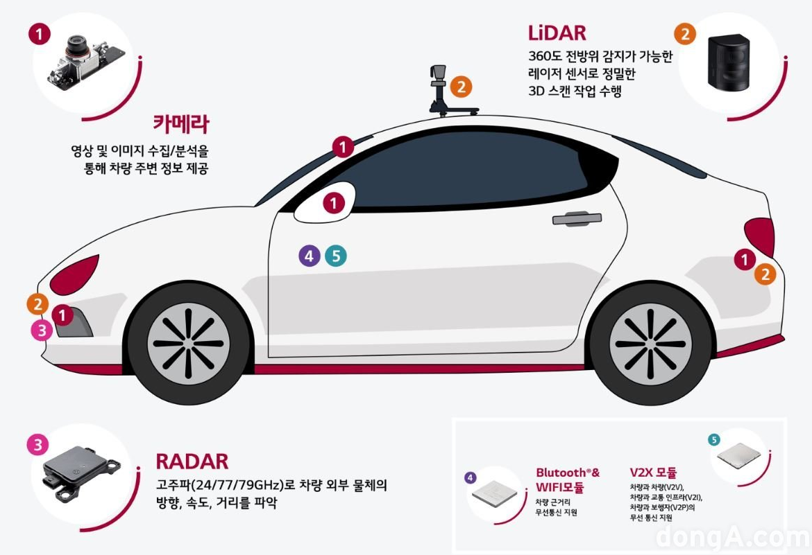
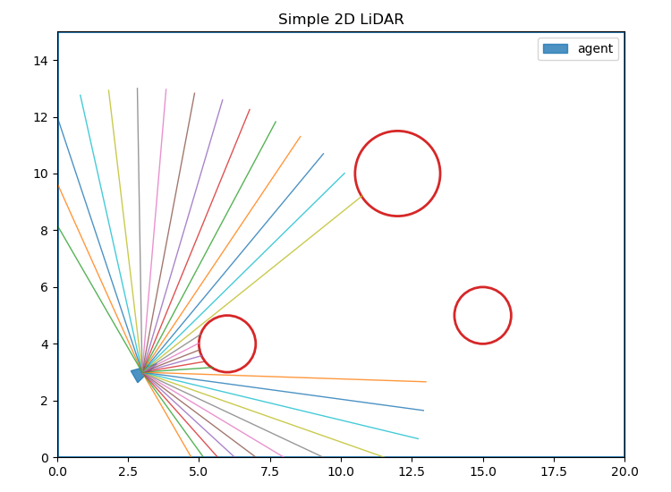

# Day75_딥러닝 : YOLO Classification · Tracking · LiDAR 시뮬레이션
## 📅 2026-05-27

---
# 📄 yolo11classify.ipynb — YOLO11-cls · Flower Dataset · Confusion Matrix

## 🧠 개념 정리

### YOLO 이미지 분류 (Classification)

YOLO는 원래 객체 탐지(Object Detection) 모델이지만, `-cls` 버전은 **이미지 분류** 전용 모델이다.

|구분|Object Detection|Classification|
|---|---|---|
|목적|객체 위치 + 클래스 탐지|이미지 전체의 클래스 판별|
|출력|Bounding Box + Class|Class + Confidence Score|
|모델 예시|yolo11n.pt|yolo11n-cls.pt|

> 즉, YOLO-cls는 "이 이미지가 무슨 꽃이야?" 처럼 **전체 이미지 단위**로 분류한다.

---

### 데이터셋 구조 (YOLO Classification 형식)

YOLO 분류 모델은 아래 폴더 구조를 요구한다.

```
flower_dataset/
├── train/
│   ├── daisy/
│   ├── dandelion/
│   ├── roses/
│   ├── sunflowers/
│   └── tulips/
├── val/
│   └── (동일 구조)
└── test/
    └── (동일 구조)
```

- 폴더 이름 자체가 클래스 레이블 역할을 한다
- 별도의 yaml 파일 없이 폴더 구조만으로 학습 가능

---

### 평가 지표

|지표|설명|
|---|---|
|Accuracy|전체 중 맞춘 비율|
|Precision|예측 양성 중 실제 양성 비율|
|Recall|실제 양성 중 맞게 예측한 비율|
|F1-Score|Precision과 Recall의 조화 평균|
|Confusion Matrix|클래스별 예측 결과를 행렬로 시각화|

---

## 1. 환경 설치

```python
# YOLO 및 OpenCV 설치
!pip install ultralytics opencv-python
```

---

## 2. 라이브러리 로딩 및 데이터셋 다운로드

```python
import random
import shutil
from pathlib import Path
import tensorflow as tf
from ultralytics import YOLO
from sklearn.metrics import accuracy_score, classification_report, confusion_matrix
import matplotlib.pyplot as plt
import seaborn as sns

# TensorFlow 유틸로 꽃 이미지 데이터셋 다운로드 및 압축 해제
# flower_photos: daisy / dandelion / roses / sunflowers / tulips 5개 클래스
dataset_path = tf.keras.utils.get_file(
    fname="flower_photos",
    origin="http://download.tensorflow.org/example_images/flower_photos.tgz",
    untar=True  # tgz 파일을 자동으로 압축 해제
)

SOURCE_DIR = Path(dataset_path) / "flower_photos"
print('SOURCE_DIR = ', SOURCE_DIR)

# 하위 폴더(클래스) 목록 출력: ['sunflowers', 'roses', 'tulips', 'daisy', 'dandelion']
classes = [p.name for p in SOURCE_DIR.iterdir() if p.is_dir()]
print('classes : ', classes)
```

---

## 3. YOLO용 데이터셋 폴더 생성 및 분할

```python
# YOLO 학습용 폴더 구조 생성: flower_dataset/train|val|test/클래스명/
DATASETS_DIR = Path('flower_dataset')

# 기존 폴더가 있으면 삭제 후 새로 생성 (중복 방지)
if DATASETS_DIR.exists():
    shutil.rmtree(DATASETS_DIR)

# train / val / test 경로 설정
TRAIN_DIR = DATASETS_DIR / 'train'
VAL_DIR   = DATASETS_DIR / 'val'
TEST_DIR  = DATASETS_DIR / 'test'

for class_dir in SOURCE_DIR.iterdir():
    if not class_dir.is_dir():  # 파일이면 스킵 (LICENSE.txt 등)
        continue

    class_name = class_dir.name             # 클래스 이름 (ex: daisy)
    images = list(class_dir.glob("*.*"))    # 해당 클래스의 모든 이미지 파일 리스트

    if len(images) == 0:
        continue

    random.shuffle(images)  # 학습 편향 방지를 위해 순서 무작위 섞기

    total = len(images)
    train_end = int(total * 0.7)   # 70% → train
    val_end   = int(total * 0.9)   # 20% → val

    # 비율에 따라 분할 (7 : 2 : 1)
    splits = {
        'train': images[:train_end],
        'val':   images[train_end:val_end],
        'test':  images[val_end:]           # 나머지 10% → test
    }
    print(len(splits['train']), " ", len(splits['val']), " ", len(splits['test']))

    # 각 분할 데이터를 폴더에 복사
    for split_name, split_images in splits.items():
        target_dir = DATASETS_DIR / split_name / class_name
        target_dir.mkdir(parents=True, exist_ok=True)  # 중간 폴더 없어도 자동 생성

        for img in split_images:
            shutil.copy2(img, target_dir / img.name)   # 메타데이터 포함 복사

# 생성된 폴더 구조 및 이미지 수 확인
for split in ['train', 'val', 'test']:
    print(f'[{split}]')
    for class_dir in (DATASETS_DIR / split).iterdir():
        count = len(list(class_dir.glob("*.*")))
        print(f'{class_dir.name}의 건수는 : {count}')
```

---

## 4. YOLO11 분류 모델 학습

```python
# 사전 학습된 YOLO11 nano classification 모델 로딩
# yolo11n-cls.pt: ImageNet으로 사전 학습된 경량 모델 (n = nano)
model = YOLO('yolo11n-cls.pt')

model.train(
    data=str(DATASETS_DIR.resolve()),  # 데이터셋 절대 경로 (상대 경로는 오류 발생 가능)
    epochs=5,                          # 전체 데이터를 5번 반복 학습
    imgsz=224,                         # 입력 이미지 크기 224x224 (YOLO-cls 기본값)
    batch=16,                          # 한 번에 16장씩 학습
    device='cpu'                       # GPU 없을 경우 cpu 사용 (Colab은 'cuda' 또는 0)
)

print('학습 완료')  # 학습 후 정확도 약 0.956 달성
```

---

## 5. 모델 성능 평가 (test 데이터)

```python
# 학습 중 val 기준으로 가장 성능 좋았던 가중치 로딩
best_model = YOLO("runs/classify/train/weights/best.pt")

y_true = []  # 실제 정답 레이블 리스트
y_pred = []  # 예측 레이블 리스트

test_dir = DATASETS_DIR / 'test'

for class_dir in test_dir.iterdir():
    true_label = class_dir.name  # 폴더명 = 실제 클래스

    for img_path in class_dir.glob('*.*'):
        results = best_model.predict(
            source=str(img_path),
            imgsz=224,
            verbose=False  # 예측 로그 출력 억제
        )

        r = results[0]
        pred_idx   = r.probs.top1           # 가장 높은 확률의 클래스 인덱스
        pred_label = r.names[pred_idx]      # 인덱스 → 클래스 이름으로 변환

        y_true.append(true_label)
        y_pred.append(pred_label)

# 전체 정확도 출력
acc = accuracy_score(y_true, y_pred)
print(f'test acc : {acc * 100:.2f}%')

# 클래스별 precision / recall / f1-score 출력
print(classification_report(y_true, y_pred))

# Confusion Matrix 히트맵 시각화
# 행 = 실제 클래스 (True), 열 = 예측 클래스 (Predicted)
# 대각선 값이 클수록 정확한 분류
cm = confusion_matrix(y_true, y_pred, labels=classes)
plt.figure(figsize=(8, 6))
sns.heatmap(
    cm,
    annot=True,          # 각 셀에 숫자 표시
    fmt='d',             # 정수 형식
    xticklabels=classes,
    yticklabels=classes,
    cmap='Blues'         # 파란색 계열 색상맵
)
plt.title('Confusion Matrix(test data)')
plt.xlabel('Predicted')
plt.ylabel('True')
plt.show()
```

---

## 6. 새 이미지 추론 (단일 이미지 분류)

```python
print('새 꽃 이미지 분류')
sample_path = Path('myflower.jpeg')

if sample_path.exists():
    results = best_model.predict(
        source=str(sample_path),
        imgsz=224,
        verbose=False
    )
    r = results[0]

    pred_idx   = r.probs.top1               # 예측 클래스 인덱스
    pred_label = r.names[r.probs.top1]      # 예측 클래스 이름
    confidence = float(r.probs.top1conf)    # 예측 확신도 (0.0 ~ 1.0)

    print(sample_path)
    print('Predicted class : ', pred_label)
    print('confidence : ', round(confidence, 3))
else:
    print('파일 없음')  # myflower.jpeg 파일이 없을 경우
```

**📌 입력 이미지 — myflower.jpeg**


**📌 출력 결과 예시**

```
새 꽃 이미지 분류
myflower.jpeg
Predicted class :  roses
confidence :  0.978
```

---

## 📌 핵심 정리

- `yolo11n-cls.pt` : 이미지 분류 전용 YOLO 모델, 폴더 구조만으로 학습 가능
- 데이터 분할 비율 : train 70% / val 20% / test 10%
- `r.probs.top1` : 예측 결과에서 가장 높은 확률의 클래스 인덱스
- `r.probs.top1conf` : 해당 클래스의 신뢰도 (Confidence Score)
- Confusion Matrix : 대각선 = 정답, 비대각선 = 오분류 → 어떤 클래스끼리 혼동되는지 파악

---
# 📄 yolo12tracking.ipynb — YOLO11 Tracking · ByteTrack · Multi Object Tracking

---

## 📌 핵심 개념 정리

### 🔷 Detection vs Tracking

|항목|Detection|Tracking|
|---|---|---|
|동작|매 프레임 독립적으로 객체 탐지|이전 프레임과 현재 프레임을 비교해 동일 객체 추적|
|ID 부여|없음|같은 객체에 고유 ID 유지|
|활용|정지 이미지 분석|영상 내 이동 객체 추적, CCTV, 자율주행|

```
Detection만 사용 시
Frame 1: [car], [car], [car]
Frame 2: [car], [car], [car]   ← 같은 차인지 알 수 없음

Tracking 사용 시
Frame 1: [id:1 car], [id:2 car], [id:3 car]
Frame 2: [id:1 car], [id:2 car], [id:3 car]   ← 동일 객체 유지
```

---

### 🔷 ByteTrack 알고리즘

ByteTrack은 YOLO와 함께 가장 많이 사용되는 다중 객체 추적 알고리즘이다.

- 신뢰도 높은 탐지 + **낮은 탐지도 버리지 않고** 재매칭에 활용 → ID 유지율 향상
- 이전 프레임 트랙과 현재 탐지 결과를 **IoU 기반**으로 매칭
- `bytetrack.yaml` 파일로 파라미터 조정 가능

```
주요 파라미터 (bytetrack.yaml)
- track_high_thresh : 1차 매칭 신뢰도 임계값
- track_low_thresh  : 2차 재매칭 신뢰도 임계값
- new_track_thresh  : 신규 트랙 생성 임계값
- track_buffer      : 트랙 유지 버퍼 (프레임 수)
```

---

### 🔷 출력 데이터 구조

|항목|설명|
|---|---|
|`result.boxes.id`|추적 ID 배열. 탐지 객체 없으면 `None`|
|`result.boxes.xywh`|박스 좌표 (center_x, center_y, width, height)|
|`result.boxes.cls`|클래스 인덱스 배열|
|`result.names[idx]`|클래스 인덱스 → 이름 변환 (ex: 2 → car)|
|`result.plot()`|탐지 결과를 이미지 위에 자동 시각화해 반환|

> `boxes.xywh`는 center_x, center_y, w, h 형식 → x1y1x2y2와 다름에 주의

---

### 🔷 OpenCV 영상 처리 흐름

```
VideoCapture(영상 열기)
    ↓
cap.read() → 프레임 1장 읽기
    ↓
model.track() → YOLO 추적 실행
    ↓
result.plot() → 결과 시각화
    ↓
cv2.imshow() → 화면 출력
    ↓
waitKey(1) → 키 입력 감지 (q: 종료)
    ↓
cap.release() + destroyAllWindows()
```

---

### 🔷 `persist=True` 의 역할

```python
model.track(source=frame, persist=True, ...)
```

- `persist=False` : 매 프레임마다 트래커 초기화 → ID 계속 바뀜
- `persist=True` : 이전 프레임의 트랙 상태를 현재 프레임으로 이어서 유지 → ID 연속성 보장

---

## 🗺️ 전체 흐름

```
STEP 1. 환경 설치 + 라이브러리 로딩
        ↓
STEP 2. YOLO 모델 로드 + 영상 열기
        ↓
STEP 3. 프레임 읽기 + 추적 실행 (while 루프)
        ↓
STEP 4. 추적 결과 파싱 (ID, 클래스, 박스 좌표)
        ↓
STEP 5. 시각화 + 화면 출력
        ↓
STEP 6. 자원 해제
```

---

## 💻 전체 코드

### STEP 1. 환경 설치 + 라이브러리 로딩

```python
# Ultralytics YOLO를 사용한 다중 객체 추적
# - Detection : 사람 / 동물 / 자동차 등 감지
# - Tracking  : 같은 객체에 id를 부여해 프레임이 바뀌어도 동일 객체 유지

!pip install ultralytics opencv-python

import cv2
from ultralytics import YOLO

# 사전 학습된 YOLO11 nano 모델 로딩 (COCO 80개 클래스 학습됨)
model = YOLO("yolo11n.pt")
```

---

### STEP 2. 영상 열기

```python
video_path = "road_car.mp4"

# VideoCapture : 지정한 동영상 파일을 프레임 단위로 읽기 위한 객체 생성
cap = cv2.VideoCapture(video_path)

# 파일 열기 실패 시 종료 (경로 오류, 파일 없음 등)
if not cap.isOpened():
    print('동영상 열기 실패')
    exit()
```

---

### STEP 3. 프레임 읽기 + 추적 실행

```python
while True:
    # ret   : 프레임 읽기 성공 여부 (True / False)
    # frame : 읽어온 실제 이미지 데이터 (numpy array, BGR 형식)
    ret, frame = cap.read()

    if not ret:   # 영상 끝 또는 읽기 실패 시 루프 종료
        break

    results = model.track(
        source  = frame,             # 분석할 입력 이미지 (현재 프레임 1장)
        persist = True,              # 이전 프레임의 트랙 ID를 현재 프레임에서도 유지
        tracker = "bytetrack.yaml",  # ByteTrack 알고리즘 사용
        verbose = False,             # 콘솔 로그 출력 억제
        show    = False,             # YOLO 내장 창 비활성화
    )

    result = results[0]   # 첫 번째(유일한) 결과 추출
```

---

### STEP 4. 추적 결과 파싱

```python
    # 추적된 객체가 있을 때만 처리 (탐지 결과 없으면 boxes.id = None)
    if result.boxes is not None and result.boxes.id is not None:
        boxes     = result.boxes.xywh.cpu().numpy()            # 박스 좌표 (cx, cy, w, h)
        ids       = result.boxes.id.cpu().numpy().astype(int)  # 추적 ID 배열
        class_ids = result.boxes.cls.cpu().numpy().astype(int) # 클래스 인덱스 배열

        # 박스 좌표 / 추적 ID / 클래스를 묶어 반복 처리
        for box, track_id, class_id in zip(boxes, ids, class_ids):
            x1, y1, x2, y2 = map(int, box)      # xywh 값을 정수로 변환
            class_name = result.names[class_id]  # 클래스 인덱스 → 이름 (ex: 2 → car)
            print(f"id : {track_id} class : {class_name} box : ", x1, y1, x2, y2)
```

**📌 출력 결과 — 프레임 1**

```
id : 1 class : car box :  1401 1550 489 481
id : 2 class : car box :  1098 1674 673 602
id : 3 class : car box :  838 2058 665 192
id : 4 class : car box :  2490 1454 572 572
id : 5 class : car box :  2236 1048 392 341
id : 6 class : car box :  1497 1223 491 419
id : 7 class : car box :  179 835 358 291
id : 8 class : car box :  1477 945 364 219
id : 9 class : truck box :  2781 1925 1066 456
id : 10 class : truck box :  2271 574 291 251
id : 11 class : car box :  1637 910 306 293
id : 12 class : car box :  705 680 224 203
id : 13 class : truck box :  442 706 320 333
id : 14 class : car box :  1550 749 286 171
id : 15 class : bus box :  442 705 320 330
id : 16 class : car box :  2278 783 296 187
id : 17 class : truck box :  199 595 285 193
id : 18 class : person box :  2682 2080 152 141
```

**📌 출력 결과 — 프레임 2**

```
id : 1 class : car box :  1398 1559 491 483
id : 2 class : car box :  1092 1688 685 614
id : 3 class : car box :  830 2069 616 177
id : 4 class : car box :  2490 1462 572 573
id : 5 class : car box :  2240 1052 398 346
id : 6 class : car box :  1495 1222 481 410
id : 7 class : car box :  185 832 353 286
id : 8 class : car box :  1475 948 369 222
id : 9 class : truck box :  2804 1932 1024 438
id : 10 class : truck box :  2270 574 290 250
id : 11 class : car box :  1636 917 318 305
id : 12 class : car box :  707 678 222 201
id : 13 class : bus box :  444 704 315 327
id : 14 class : car box :  1547 750 288 173
id : 15 class : truck box :  444 705 317 327
id : 16 class : car box :  2260 781 307 193
```

---

### STEP 5. 시각화 + 화면 출력

```python
    # YOLO 탐지 결과(바운딩박스, ID, 클래스, 신뢰도)를 이미지 위에 자동으로 그리기
    annotated_frame = result.plot()

    # 화면 출력용으로 960x540 크기로 리사이즈
    display_frame = cv2.resize(annotated_frame, (960, 540))

    cv2.imshow("YOLO Tracking", display_frame)

    # waitKey(1) : 1ms 대기하며 키 입력 감지
    # & 0xFF     : 하위 8비트만 추출 (운영체제 호환성)
    # q 키 누르면 루프 탈출
    if cv2.waitKey(1) & 0xFF == ord("q"):
        break
```

**📌 출력 결과 — 트래킹 시각화**

 

---

### STEP 6. 자원 해제

```python
cap.release()           # VideoCapture 객체 해제 (파일 핸들 반환)
cv2.destroyAllWindows() # 열려 있는 모든 OpenCV 창 닫기
```

---

## 📊 실행 결과 요약

|항목|값|
|---|---|
|모델|YOLO11n (nano)|
|트래커|ByteTrack|
|입력 영상|road_car.mp4|
|탐지 클래스|car, truck, bus, person|
|최대 추적 ID|18 (프레임 기준)|
|출력 해상도|960 × 540|

---

## 📌 핵심 정리

- `model.track()` : `model.predict()`에 추적 기능 추가. `persist=True` 가 핵심
- `persist=True` : 이전 프레임의 트랙 ID를 현재 프레임으로 이어서 유지
- `result.boxes.id` : 추적 ID 배열. 탐지 객체 없으면 `None` → 조건 확인 필수
- `result.boxes.xywh` : center_x, center_y, width, height 형식 (x1y1x2y2 아님)
- `result.plot()` : 탐지 결과를 이미지에 자동 시각화해 반환
- Colab 환경에서는 `cv2.imshow()` 대신 `from google.colab.patches import cv2_imshow` 필요

---
# 🌐 LiDAR : 라이다 센서 · Point Cloud · 2D 시뮬레이션 · 강화학습

---

## 📌 핵심 개념 정리

### 🔷 LiDAR란?

- **Light Detection And Ranging**의 줄임말
- 레이저 빛을 쏘아 물체에 반사되어 돌아오는 시간(**Time of Flight, ToF**)을 측정해 거리를 계산하는 센서
- 쉽게 말해, "레이저 자로 1초에 수십만 번씩 거리를 재서 주변의 3D 지도를 만드는 장치"



---

### 🔷 LiDAR 구성 요소

|구성 요소|역할|
|---|---|
|레이저|빛의 펄스를 방출해 대상 물체에 도달시킴. 자외선 / 가시광선 / 근적외선 사용|
|스캐너|레이저가 대상을 스캔하는 속도와 도달 거리를 조절|
|센서|빛이 반사되어 돌아오는 시간을 측정|
|GPS|라이다 시스템의 위치를 추적해 거리 측정 정확도 향상|

---

### 🔷 동작 원리

```
1. 레이저 펄스 방출
        ↓
2. 물체 표면에 반사
        ↓
3. 수광기(포토다이오드)가 반사광 감지
        ↓
4. 시간 측정 (Time of Flight)
   거리 = (빛의 속도 × Δt) / 2   ← 왕복이므로 2로 나눔
        ↓
5. 좌표(x, y, z)로 변환 → 포인트 클라우드 생성
```

- 최신 라이다 센서는 초당 **50만 개**의 빛 펄스 방출
- 수많은 레이저 점들의 좌표를 모아 **3차원 점군(Point Cloud)** 형성

---

### 🔷 라이다 특징

|구분|내용|
|---|---|
|장점|정밀한 거리 측정 (센티미터 수준 오차)|
|장점|주간 / 야간 모두 사용 가능 (빛 자체를 발사하므로)|
|장점|360° 시야 확보 가능 (회전식 LiDAR)|
|단점|가격이 비쌈 (수천~수만 달러, 최근 저가형도 출시)|
|단점|비 / 눈 / 안개 같은 기상 조건에 민감|
|단점|데이터량이 방대하여 실시간 처리 필요|

---

### 🔷 자율주행에서의 역할

- **주행 환경 인식** : 도로 구조, 차선, 보행자, 장애물을 3차원으로 지도화
- **SLAM** (Simultaneous Localization And Mapping) : 차량 위치 추정 + 주변 환경 지도화 동시 수행
- **충돌 방지** : 전방 물체의 거리와 형상을 정확하게 인식

---

### 🔷 라이다 vs 다른 센서 비교

|항목|카메라|레이더(Radar)|라이다(LiDAR)|
|---|---|---|---|
|강점|색상·텍스처 등 시각 정보|장거리 / 악천후 강점|정밀한 거리·형상 인식|
|약점|거리 추정 어려움|해상도 낮음|비·눈에 약하고 고가|

> 실제 자율주행차는 **카메라 + 레이더 + 라이다**를 센서 융합(Sensor Fusion)으로 사용해 단점을 보완한다.

---

### 🔷 2D LiDAR 시뮬레이션 개요

이 코드는 실제 레이저 물리학이 아닌, **2D 평면에서 가상의 레이(ray)를 여러 방향으로 전진시키며 충돌 여부를 체크하는 방식**으로 LiDAR를 흉내 낸 시뮬레이터다.

```
강화학습에서의 활용
obs = [1.2, 3.5, 0.7, ...]   ← 각 방향의 충돌 거리 벡터
→ "왼쪽 가까운 곳에 장애물이 있네? 오른쪽으로 steering!"
→ 이 obs가 강화학습의 상태(state)로 사용됨
```

**주요 구성 요소**

|구성|설명|
|---|---|
|환경 (Environment)|`WORLD_W × WORLD_H` 직사각형 월드 + 원형 장애물 + 경계 벽|
|에이전트 (Agent)|`(x, y, theta)` 위치와 방향, 시야각(FOV)과 레이 개수(NUM_RAYS)로 스캔|
|LiDAR 시뮬레이션|`cast_lidar()` — 레이를 step 단위로 전진시키며 충돌 거리 계산|
|시각화|`plot_world()` — matplotlib으로 월드, 장애물, 에이전트, 레이 시각화|

---

## 🗺️ 전체 흐름

```
STEP 1. 환경 / 에이전트 파라미터 설정
        ↓
STEP 2. inside_world() — 월드 경계 충돌 체크 함수
        ↓
STEP 3. hit_circle() — 원형 장애물 충돌 체크 함수
        ↓
STEP 4. cast_lidar() — 레이 발사 + 충돌 거리 계산
        ↓
STEP 5. plot_world() — 시각화 (월드 + 장애물 + 에이전트 + 레이)
        ↓
STEP 6. main — cast_lidar() 호출 → endpoints 계산 → 출력 + 시각화
```

---

## 💻 전체 코드

### STEP 1. 환경 / 에이전트 파라미터 설정

```python
import numpy as np
import matplotlib.pyplot as plt

# ---------- 환경/에이전트 설정 ----------
# 시뮬레이션 세계 즉, LiDAR 센서가 탐지하는 2D 환경의 공간 경계(지도 크기)를 설정.
WORLD_W, WORLD_H = 20.0, 15.0  # 세계 크기 (가로 20, 세로 15)
WALL_THICK = 0.5  # 벽 두께(단순히 경계 밖이면 충돌로 처리). 경계판정이나 시각화 개선 시 활용 가능한 변수

# 원형 장애물 (중심 x, 중심 y, 반지름 r)
OBSTACLES = [
    (6.0, 4.0, 1.0),    # (6,4) 위치 반지름 1.0 장애물
    (12.0, 10.0, 1.5),  # (12,10) 위치 반지름 1.5 장애물
    (15.0, 5.0, 1.0),   # (15,5) 위치 반지름 1.0 장애물
]

# 에이전트 초기 상태 (x, y, 바라보는 각도 rad 단위)
# LiDAR 시뮬레이션의 에이전트(센서가 달린 로봇)의 초기 위치와 방향(heading) 을 설정하는 부분
agent = dict(x=3.0, y=3.0, theta=np.deg2rad(30))  # 30° 방향을 바라봄

# LiDAR 파라미터
NUM_RAYS = 32          # 레이(광선) 개수
FOV = np.deg2rad(180)  # 시야각 180도 (도(degree)를 라디안(radian)으로 변환)
                       # 삼각함수 등에서 각도를 다룰 때, radian은 수학에서 표준 단위, degree는 사람이 직관적으로 쓰는 단위.
                       # 이를 변환하려면 관계식을 사용 : radians = degrees × (π / 180)
MAX_RANGE = 10.0  # 탐지 최대 거리
STEP = 0.05       # 레이 전진 단위 거리 (세밀할수록 정확 ↑). 레이가 0.05m씩 전진하며 충돌 여부 검사
                  # 한 레이가 최대 거리 10.0까지 나아가려면 10.0 / 0.05 = 200번의 충돌 체크를 수행
```

---

### STEP 2. inside_world() — 월드 경계 충돌 체크

```python
def inside_world(x, y):
    # (x,y)가 세계 경계 안에 있는지 검사
    # (x, y) 좌표가 0 ≤ x ≤ 20, 0 ≤ y ≤ 15 범위 안에 있으면 벽 안쪽, 그 밖이면 충돌(벽에 부딪힘)으로 처리.
    return (0.0 <= x <= WORLD_W) and (0.0 <= y <= WORLD_H)
```

---

### STEP 3. hit_circle() — 원형 장애물 충돌 체크

```python
def hit_circle(px, py, cx, cy, r):
    # 점(px,py)이 원(cx,cy,r) 안에 있는지 검사 → 충돌 여부
    # 점(px, py)이 원 중심(cx, cy) 반지름 r인 장애물 내부 또는 테두리 위에 있으면 True (충돌),
    # 그렇지 않으면 False (비충돌) 를 반환하는 함수
    return (px - cx)**2 + (py - cy)**2 <= r**2
```

---

### STEP 4. cast_lidar() — 레이 발사 + 충돌 거리 계산

```python
def cast_lidar(x, y, theta, num_rays=NUM_RAYS, fov=FOV, max_range=MAX_RANGE, step=STEP):
    # 에이전트 (x,y,θ)에서 시야각 FOV로 num_rays개의 광선을 쏴서, 각 레이가 처음 부딪히는 지점까지의 거리를 구함.
    # 입력: 시작점(x,y), 바라보는 각 theta, 레이 개수 num_rays, 시야각 fov, 최대거리 max_range, step.
    # 출력: dists — 각 레이의 충돌 거리(충돌 없으면 max_range), angles — 각 레이의 절대 각도(rad)

    start = theta - fov / 2  # 첫 번째 레이 시작 각도 (시야의 왼쪽 끝 각도)

    # angles는 start → start+fov까지 균등 분배된 절대각. max(num_rays-1,1)로 1개일 때도 안전.
    # 양 끝 포함 분포(좌/우 끝 모두 레이 존재).
    angles = start + np.arange(num_rays) * (fov / max(num_rays - 1, 1))  # 균등 분배된 레이 각도 배열
    dists = np.full(num_rays, max_range, dtype=float)  # 거리 배열 초기화: 전부 max_range

    for i, ang in enumerate(angles):  # 각 레이에 대해
        dist = 0.0
        hit = False

        while dist < max_range:  # 최대 거리까지 전진
            px = x + np.cos(ang) * dist  # 레이 끝점 X 좌표
            py = y + np.sin(ang) * dist  # 레이 끝점 Y 좌표
            # 현재 레이 각도 ang로, dist를 step만큼 증가시키며 끝점 (px,py) 이동.

            if not inside_world(px, py):  # 벽 충돌 체크. 월드 밖 → 벽에 부딪힘
                hit = True  # 경계 밖이면 벽에 충돌로 처리하고 종료.
                break

            for (cx, cy, r) in OBSTACLES:  # 모든 원형 장애물 검사
                if hit_circle(px, py, cx, cy, r):
                    hit = True  # 하나라도 원 내부에 들어가면 충돌.
                    break

            if hit:  # 충돌이면 종료
                break

            dist += step  # 충돌 없으면 한 걸음 전진

        dists[i] = min(dist, max_range)  # 충돌 거리 기록 (없으면 max_range)

    return dists, angles  # 레이별 거리와 각도(절대각) 반환.
```

---

### STEP 5. plot_world() — 시각화

```python
def plot_world(agent, rays_endpoints=None):
    # 2D LiDAR(라이다) 환경을 시각화
    # 입력값 - agent: 로봇(에이전트)의 상태 (x, y, theta 포함된 dict)
    #         - rays_endpoints: 각 ray의 시작점과 끝점 좌표 리스트 → (시각화용)

    fig, ax = plt.subplots(figsize=(7.5, 5.5))
    ax.set_xlim(0, WORLD_W)  # X축 범위
    ax.set_ylim(0, WORLD_H)  # Y축 범위
    ax.set_aspect('equal', adjustable='box')  # 가로 세로 비율을 1:1로 유지 (왜곡 방지)
    ax.set_title("Simple 2D LiDAR")

    # 월드 경계 (벽) 그리기 - 사각형 형태의 월드 경계 박스(벽)
    ax.plot([0, WORLD_W, WORLD_W, 0, 0], [0, 0, WORLD_H, WORLD_H, 0], lw=2)

    # 장애물(원형)
    for (cx, cy, r) in OBSTACLES:
        circ = plt.Circle((cx, cy), r, edgecolor='tab:red', facecolor='none', lw=2)
        ax.add_patch(circ)  # 축에 원 패치를 추가 - 라이다 감지 대상 장애물(빨간색 원)

    # 에이전트 삼각형(방향 표시)
    # 에이전트(즉, LiDAR 센서가 달린 로봇 본체)를 삼각형 형태로 그려주는 코드
    x, y, th = agent["x"], agent["y"], agent["theta"]
    L = 0.6  # 삼각형의 길이 스케일(scale)
    tri = np.array([  # 삼각형 좌표 계산
        [x + np.cos(th) * L,             y + np.sin(th) * L            ],  # 앞쪽. 현재 방향(th)을 따라 L 거리 앞쪽 위치
        [x + np.cos(th + 2.5) * L / 1.5, y + np.sin(th + 2.5) * L / 1.5],  # 왼쪽 뒤. 2.5rad (~143°) 돌린 방향
        [x + np.cos(th - 2.5) * L / 1.5, y + np.sin(th - 2.5) * L / 1.5],  # 오른쪽 뒤. -2.5rad 돌린 방향
    ])
    ax.fill(tri[:, 0], tri[:, 1], alpha=0.8, color='tab:blue', label='agent')

    # 레이 시각화
    # plot_world() 함수에서 LiDAR 센서가 쏜 광선(ray)들을 시각적으로 표시.
    # 즉, 앞서 계산된 레이의 시작점(에이전트 위치)과 끝점(충돌 지점)을 선으로 그려주는 역할
    if rays_endpoints is not None:  # rays_endpoints는 각 레이의 시작점, 끝점 좌표를 담은 리스트
        for (x0, y0, x1, y1) in rays_endpoints:
            ax.plot([x0, x1], [y0, y1], lw=1, alpha=0.8)  # 두 점을 연결하는 선으로 표시

    ax.legend(loc='upper right')
    plt.tight_layout()
    plt.show()
```

---

### STEP 6. main — 실행부

```python
if __name__ == "__main__":
    # obs  : 각 레이(ray)가 감지한 충돌 거리 배열 (길이 = NUM_RAYS)
    # angs : 각 레이의 절대 각도(rad) 배열
    obs, angs = cast_lidar(agent["x"], agent["y"], agent["theta"])  # LiDAR 센서 스캔

    endpoints = []  # 시각화용 레이 끝점 좌표

    for d, a in zip(obs, angs):  # 각 레이에 대해
        # 각 레이별로 시작점(x0, y0)과 충돌 지점(x1, y1) 좌표를 계산
        x0, y0 = agent["x"], agent["y"]                    # 레이 시작점 (에이전트 위치)
        x1, y1 = x0 + np.cos(a) * d, y0 + np.sin(a) * d  # 레이 끝점 (충돌 지점 좌표)
        # np.cos(a)와 np.sin(a)로 "각도 → 방향 벡터" 변환 후, 거리 d만큼 곱해 끝점을 구함.
        endpoints.append((x0, y0, x1, y1))

    print("LiDAR observation (distances):")
    print(np.round(obs, 2))  # 거리값 출력

    plot_world(agent, rays_endpoints=endpoints)  # 월드 + 레이 시각화
```

**📌 출력 결과 — 거리 관측값**

```
LiDAR observation (distances):
[ 3.5   3.7   4.05  4.45  5.05  5.85  7.1   9.1  10.   10.   10.    2.5
  2.25  2.2   2.2   2.25  2.45  9.95 10.   10.   10.   10.   10.   10.
 10.   10.   10.   10.   10.    9.55  7.35  6.05]
```

**📌 출력 결과 — 2D LiDAR 시각화**



```
- 파란 삼각형 = 에이전트 위치 및 방향 (30° 방향)
- 컬러 선     = 각 방향으로 발사된 레이(광선) 32개
- 빨간 원     = 원형 장애물 3개
- 레이가 짧게 끊긴 곳 = 장애물 또는 벽에 충돌한 지점
```

---

## 📌 핵심 정리

- LiDAR : 레이저 ToF(Time of Flight)로 거리 계산 → 3D 포인트 클라우드 생성
- `cast_lidar()` : 에이전트에서 NUM_RAYS개의 레이를 STEP 단위로 전진시키며 충돌 거리 계산
- `inside_world()` : 월드 경계 이탈 여부 체크 (벽 충돌)
- `hit_circle()` : 점과 원의 거리 공식으로 장애물 충돌 체크
- `dists` : 충돌 거리 배열 → 강화학습에서 **상태(state)** 로 활용
- 자율주행에서는 카메라 + 레이더 + 라이다 **센서 융합(Sensor Fusion)** 으로 단점 보완
