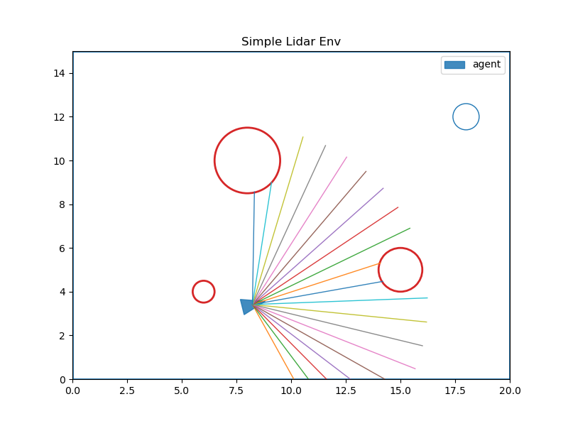
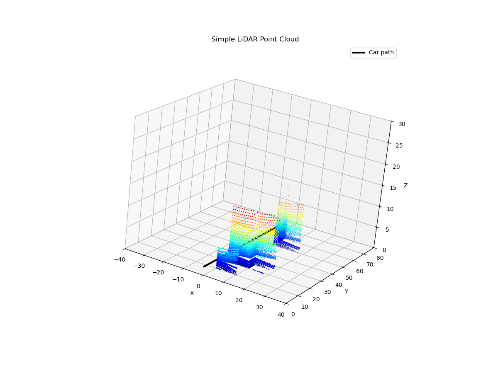

# Day77_강화학습 LiDAR · Point Cloud · Q-Learning · DQN

## 📅 2026-05-28
---
## 📄 lidar2.py — Gymnasium · LiDAR Ray Casting · Custom Env

---

## 개요

Gymnasium 커스텀 환경을 직접 구현해보는 실습 코드.  
에이전트가 2D 공간에서 라이다(LiDAR) 센서로 장애물을 감지하며 목표 지점까지 이동한다.  
강화학습 루프의 핵심 구조인 `reset → step → render` 흐름을 직접 구현한다.

---

## 핵심 개념

### 1. Gymnasium 환경 구조

강화학습 환경은 반드시 두 가지를 선언해야 한다.

| 속성 | 설명 |
|------|------|
| `action_space` | 에이전트가 취할 수 있는 행동의 범위 |
| `observation_space` | 에이전트가 받는 관측값의 형태와 범위 |

```python
self.action_space = spaces.Discrete(3)        # 0: 좌회전, 1: 직진, 2: 우회전
self.observation_space = spaces.Box(
    low=0.0, high=MAX_RANGE, shape=(NUM_RAYS,), dtype=np.float32
)   # 라이다 20개 레이의 거리값 배열 (각 0.0 ~ 8.0)
```

---

### 2. LiDAR Ray Casting (광선 투사)

에이전트 위치 `(x, y, theta)` 에서 전방 FOV(150°) 안에  
`NUM_RAYS(20)` 개의 광선을 균등하게 쏴서, 각 광선이 처음 부딪히는 거리를 구한다.

```
          FOV = 150°
     ← 75° | 75° →
     \_____↑_____/
           에이전트
```

```python
# 광선 각도 배열 생성 (시작각 ~ 끝각 균등 분포)
start = theta - fov / 2
angles = start + np.arange(num_rays) * (fov / max(num_rays - 1, 1))

# 각 광선을 STEP_MARCH(0.05) 단위로 전진시키며 충돌 감지
while dist < max_range:
    px = x + math.cos(ang) * dist   # 레이 끝점 x
    py = y + math.sin(ang) * dist   # 레이 끝점 y
    # 경계 이탈 또는 장애물 충돌 시 중단
    dist += STEP_MARCH
```

**충돌 판정** : 원형 장애물 중심 `(cx, cy)` 와 레이 끝점 거리가 반지름 `r` 보다 작으면 충돌

```python
def hit_circleFunc(px, py, cx, cy, r):
    return (px - cx) ** 2 + (py - cy) ** 2 < r ** 2
```

---

### 3. 보상 설계 (Reward Shaping)

| 조건 | 보상 |
|------|------|
| 매 스텝 | `-0.01` (시간 패널티, 빨리 도달하도록 유도) |
| 목표에 가까워질수록 | `+접근량` (이전 거리 - 현재 거리) |
| 목표 도달 | `+1.0` |
| 충돌 | `-1.0` |

```python
progress = self._prev_goal_dist - goal_dist   # 목표로 얼마나 다가왔는지
reward = 1.0 * progress - 0.01               # 접근 보상 + 시간 패널티
```

---

### 4. 에피소드 종료 조건 (terminated vs truncated)

```python
# Gymnasium 규칙: 두 가지 종료를 구분
# terminated : 목표 도달 또는 충돌 (자연스러운 종료)
# truncated  : 최대 스텝 초과 (강제 종료)
if goal_dist < self.goal_radius:   # 목표 도달
    terminated = True
if self._collision():              # 장애물/경계 충돌
    terminated = True
if self._steps >= self.max_steps:  # 400스텝 초과
    truncated = True               # ※ 현재 코드는 terminated로 처리 중 (버그)
```

---

### 5. 렌더링 구조

```python
def render(self):
    if self.fig is None:
        self.fig, self.ax = plt.subplots(figsize=(8, 6))
        plt.ion()              # interactive mode: pause()가 동작하려면 필수

    ax.clear()                 # 매 프레임 초기화 후 다시 그리기

    # 순서: 경계 → 장애물(빨간 원) → 목표(파란 원) → 에이전트(삼각형) → 라이다 레이
    ax.fill(tri[:, 0], tri[:, 1], ...)   # 에이전트 삼각형
    ax.plot([x, x + cos*d], [y, y + sin*d], ...)  # 각 레이 시각화

    plt.pause(0.001)           # 화면 갱신 (이 한 줄이 애니메이션 역할)
```

---

### 6. 메인 루프 구조

```python
env = SimpleLidarEnv()
obs, info = env.reset()        # 환경 초기화, 초기 관측값 반환

for t in range(500):
    action = env.action_space.sample()                          # 무작위 행동 선택
    obs, reward, terminated, truncated, info = env.step(action) # 환경 한 스텝 진행
    env.render()                                                # 시각화

    if terminated or truncated:    # ← 루프 안에 있어야 즉시 reset
        obs, info = env.reset()
```

---

## 실행 결과



- 파란 삼각형: 에이전트 (방향 포함)
- 빨간 원: 장애물 3개
- 파란 원 (우측 상단): 목표 지점
- 방사형 선: 라이다 20개 레이 (장애물에 닿으면 짧아짐)

---

## 알려진 버그 / 개선 포인트

| 항목 | 내용 |
|------|------|
| `close()` 위치 | `render()` 내부에 중첩되어 있음 → 클래스 메서드로 분리 필요 |
| `self.ifg` 오타 | `close()` 내 `self.fig` 로 수정 필요 |
| `truncated` 처리 | `max_steps` 초과 시 `truncated=True` 로 분리해야 Gymnasium 규격에 맞음 |
| 종료 조건 위치 | `if terminated or truncated` 블록을 `for` 루프 안으로 이동해야 즉시 reset |

---
## 📄 lidar3pointcloud.py — Point Cloud · 3D LiDAR · Ray Casting

---

## 개요

자동차가 y축 방향으로 이동하면서 사방으로 LiDAR 레이저를 쏘고,  
건물 표면에 맞은 좌표 `[x, y, z]` 를 수집해 **3D 점군(Point Cloud)** 을 생성하는 시뮬레이션.

> 라이다는 물체를 **면(surface)** 으로 인식하는 게 아니라,  
> 수많은 **점 좌표(x, y, z)** 를 쌓아서 환경의 형태를 재구성한다.

---

## 핵심 개념

### 1. Point Cloud란?

3D 공간에서 레이저가 닿은 지점의 좌표 집합.  
점이 많을수록 물체의 형태를 더 정밀하게 표현할 수 있다.

```
각 레이 → 건물 표면 충돌 → [px, py, pz] 좌표 저장
수천 개의 점 → 건물 윤곽 재구성
```

---

### 2. 건물 환경 정의 (AABB)

각 건물은 **축 정렬 바운딩 박스(Axis-Aligned Bounding Box)** 로 정의.  
형식: `(xmin, xmax, ymin, ymax, zmin, zmax)`

```python
building = [
    (-20, 10, 10, 20, 0, 20),   # 건물 1: x -20~10, y 10~20, z 0~20
    (10, 20, 15, 25, 0, 25),    # 건물 2: x 10~20, y 15~25, z 0~25
    (-15, -5, 35, 45, 0, 18),   # 건물 3: x -15~-5, y 35~45, z 0~18
    (5, 18, 50, 60, 0, 30)      # 건물 4: x 5~18, y 50~60, z 0~30
]
```

충돌 판정은 단순 범위 체크:
```python
if xmin <= px <= xmax and ymin <= py <= ymax and zmin <= pz <= zmax:
    # 레이가 건물 안에 들어옴 → 충돌
```

---

### 3. 차량 이동 경로

차량은 x=0 고정, y축 방향으로 0 ~ 60 구간을 **25개 지점**으로 이동.  
센서 높이는 z=2 (지면에서 2m).

```python
for y in np.linspace(0, 60, 25):
    car_positions.append(np.array([0, y, 2]))   # [x고정, y이동, z센서높이]
```

---

### 4. simulate_lidar() — 3D 레이 캐스팅

한 위치에서 **수평 120개 × 수직 8개 = 960개** 레이를 쏜다.

```python
horizontal_angles = np.linspace(-90, 90, 120)   # 수평: 좌우 각 90° = 총 180°
vertical_angles   = np.linspace(-15, 15, 8)     # 수직: 위아래 각 15° = 총 30°
```

**레이 방향 벡터 계산** (구면 좌표계 → 직교 좌표계):

```python
dx = cos(v) * cos(h)   # x 방향 성분
dy = cos(v) * sin(h)   # y 방향 성분 (전진 방향)
dz = sin(v)            # z 방향 성분 (높낮이)
```

```
수직각(v) = 0°  → 수평으로 쏨
수직각(v) = +15° → 위쪽으로 쏨
수직각(v) = -15° → 아래쪽으로 쏨
```

**레이 전진 (Step March)**:

```python
for dist in np.arange(0.5, max_distance, 0.5):   # 0.5m 단위로 전진
    px = car_pos[0] + dx * dist   # 레이 끝점 x
    py = car_pos[1] + dy * dist   # 레이 끝점 y
    pz = car_pos[2] + dz * dist   # 레이 끝점 z

    # 건물 충돌 시 좌표 저장 후 이 레이 종료
    if 건물 내부:
        points.append([px, py, pz])
        break
```

---

### 5. 점군 수집 및 시각화

```python
# 모든 차량 위치에서 스캔 → 점군 누적
all_points = []
for pos in car_positions:
    scan_points = simulate_lidar(pos)   # 한 위치에서 960개 레이 결과
    all_points.extend(scan_points)      # 전체 점군에 추가

all_points = np.array(all_points)       # (N, 3) 형태 배열로 변환
```

```python
# 3D 산점도로 시각화
ax.scatter(
    all_points[:, 0],   # x 좌표
    all_points[:, 1],   # y 좌표
    all_points[:, 2],   # z 좌표
    s=1,                # 점 크기 (작을수록 정밀해 보임)
    c=all_points[:, 2], # z값(높이)으로 색상 결정
    cmap='jet'          # 낮은 z=파랑, 높은 z=빨강
)
```

---

## 실행 결과



- **검은 선**: 차량 이동 경로 (y=0 → y=60)
- **점군 색상**: z값(높이) 기준. 파랑=낮음, 빨강=높음
- 건물 4개의 표면이 점으로 재구성된 것을 확인할 수 있음

---

## 전체 흐름 요약

```
건물 정의 (AABB 4개)
    ↓
차량 25개 위치 생성 (y=0 ~ 60)
    ↓
각 위치에서 simulate_lidar() 호출
    → 수평 120 × 수직 8 = 960개 레이 발사
    → 0.5m 단위 전진하며 건물 충돌 체크
    → 충돌 좌표 [px, py, pz] 저장
    ↓
전체 점군 누적 → np.array 변환
    ↓
3D scatter plot으로 시각화
```

---
## 강화학습 (Reinforcement Learning)

---

## 개요

강화학습은 **정답 데이터 없이** 환경과의 상호작용 경험을 통해  
보상을 최대화하는 최적의 행동 전략(Policy)을 학습하는 머신러닝 기법.

> 지도학습처럼 라벨이 주어지지 않고,  
> 비지도학습처럼 데이터 구조를 학습하지도 않는다.  
> **"어떤 행동이 더 좋은 결과를 가져오는가?"를 경험으로 학습한다.**

---

## 핵심 구성 요소

| 요소 | 설명 |
|------|------|
| 에이전트 (Agent) | 학습 수행 주체. 행동을 선택하고 보상을 받는다 |
| 환경 (Environment) | 에이전트의 행동에 따라 상태가 변하고 보상을 준다 |
| 상태 (State) | 현재 환경의 상황 (입력값) |
| 행동 (Action) | 에이전트가 선택할 수 있는 동작 (출력값) |
| 보상 (Reward) | 행동에 대한 즉각적 피드백 |
| 정책 (Policy) | 상태 → 행동을 결정하는 전략. `π(s)=a` |

```
State(s) → [Policy π] → Action(a) → Environment → Reward(r) + Next State(s')
                ↑___________________________________________________|
```

---

## 강화학습 학습 흐름 (에피소드 기반)

```
1. 환경으로부터 상태 Sₜ 관찰
2. 정책 π에 따라 행동 Aₜ 선택
3. 행동 수행 후, 보상 Rₜ₊₁ 및 다음 상태 Sₜ₊₁ 관찰
4. 가치 함수 업데이트 (예: Q(S, A))
5. 종료 조건 만족 시 종료, 아니면 반복
```

---

## Reward vs Return vs Expected Return

| 개념 | 설명 | 예시 |
|------|------|------|
| Reward | 단일 행동에 대한 즉시 보상 | 코인 1개 먹기 → +1 |
| Return | 한 에피소드 동안 누적된 총 보상 | 점프+이동+점프 → 20점 |
| Expected Return | 앞으로 받을 보상의 기대값 | 지금 행동이 미래에 얼마나 도움이 될지 예측 |

> 강화학습의 목표는 **즉시 보상이 아닌, 미래 총 보상(Expected Return)을 최대화**하는 것.

---

## Q-Learning

**상태-행동 쌍의 가치(Q값)를 테이블로 저장하며 학습하는 알고리즘.**

### Q값 업데이트 수식

```
Q(sₜ, aₜ) ← (1 - α) * Q(sₜ, aₜ) + α * (Rₜ + γ * max Q(sₜ₊₁, aₜ₊₁))
```

| 기호 | 의미 |
|------|------|
| α (Learning Rate) | 새 경험을 얼마나 반영할지 (0~1) |
| γ (Discount Factor) | 미래 보상에 얼마나 가치를 둘지 (0~1) |
| Rₜ | 현재 받은 즉시 보상 |
| max Q(sₜ₊₁, a) | 다음 상태에서 가능한 최대 Q값 |

```
γ → 1에 가까울수록: 먼 미래도 중요하게 학습
γ → 0에 가까울수록: 당장 보상만 중요하게 학습
```

---

## ε-Greedy 탐험 전략

탐험(Exploration)과 이용(Exploitation)의 균형을 맞추는 전략.

```
ε 확률   → 무작위 행동 (새로운 경로 탐색)
1-ε 확률 → 현재 최선의 행동 (greedy action)
```

**Decay ε-Greedy**: 학습이 진행될수록 ε을 점차 줄여  
초기에는 탐험 위주, 후반에는 이용 위주로 전환.

---

## Grid World — Q값 형성 과정

5x3 격자 환경에서 Q값이 어떻게 퍼져나가는지 직관적으로 보여주는 예시.

```
초기: 모든 Q값 = 0
학습 진행: 보상 칸(R=1) 주변부터 Q값이 퍼져나감
결과: 에이전트가 가장 높은 Q값 방향(Greedy Action)을 선택 → 최적 경로 도달
```

**Discount Factor가 적용된 Q값 분포**:
```
코인(R=1): Q = 1
1칸 거리:  Q = γ
2칸 거리:  Q = γ²
3칸 거리:  Q = γ³
```

---

## 마르코프 결정 과정 (MDP)

강화학습 환경의 수학적 토대.

> **Markov Property**: 미래 상태는 오직 현재 상태에만 의존.  
> 과거 이력은 불필요하다.

```
P(sₜ₊₁ | s₁, s₂, ..., sₜ) = P(sₜ₊₁ | sₜ)
```

---

## 가치 함수 (Value Function)

| 구분 | 수식 | 의미 |
|------|------|------|
| State Value Function | `vπ(s) = 𝔼π[Gₜ \| sₜ=s]` | 지금 이 **상태**가 얼마나 좋은가? |
| Action Value Function | `qπ(s,a) = 𝔼π[Gₜ \| sₜ=s, aₜ=a]` | 지금 이 상태에서 이 **행동**을 하면 얼마나 좋은가? |

---

## On-policy vs Off-policy

| 항목 | On-policy | Off-policy |
|------|-----------|------------|
| 정책 관계 | Target = Behavior | Target ≠ Behavior |
| 대표 알고리즘 | SARSA | Q-Learning |
| 학습 경향 | 실제 행동 기반, 안전한 경로 | 최적 행동(max Q) 기준, 도전적 경로 |
| 장점 | 안정적, 현실 반영 | 효율적, 경험 재사용 가능 |
| 단점 | 보상 최대화 어려울 수 있음 | 위험한 경로 선택 가능 |

---

## DQN (Deep Q-Network)

**Q-Learning + 신경망(Deep Neural Network)**  
Q-table 대신 신경망으로 Q값을 근사하여 고차원 상태 공간 처리 가능.

### DQN Loss 수식

```
목표값 y = r + γ * max Q_target(s', a')

손실함수 L(θ) = (y - Q(s, a; θ))²
→ 역전파로 θ 업데이트
```

### DQN의 핵심 기술 2가지

**1. Replay Buffer (리플레이 버퍼)**

경험 `(s, a, r, s', done)` 을 버퍼에 저장 → 무작위 mini-batch 샘플링 → 학습

```
효과:
- 시간적 상관관계 제거 (i.i.d 가정 충족)
- 샘플 효율성 증가
- 학습 분산 감소 및 안정화
- 과거 경험 재사용 가능
```

**2. Target Network (타겟 네트워크)**

Q값 계산과 업데이트에 동일한 네트워크를 쓰면 학습 불안정 →  
별도의 **고정된 타겟 네트워크**를 사용하고, 일정 주기마다 파라미터 복사.

```
Online Network  : 매 스텝 파라미터 업데이트
Target Network  : N 스텝마다 Online → Target으로 파라미터 복사

작동 순서:
1. 환경에서 (s, a, r, s') 경험 획득
2. Target Network로 y = r + γ * max Q_target(s', a') 계산
3. Online Network를 loss = (y - Q_online(s,a))² 로 업데이트
4. N 스텝마다 Q_target ← Q_online 복사
```

### 딥러닝을 강화학습에 적용할 때의 문제점과 DQN의 해결책

| 문제 | DQN 해결책 |
|------|-----------|
| Delayed Rewards (희소하고 노이즈 많은 보상) | Replay Buffer로 경험 재사용 |
| High Correlation (연속 상태 간 높은 상관관계) | 랜덤 샘플링으로 상관관계 제거 |
| Non-stationary Distribution (변화하는 데이터 분포) | Target Network로 목표값 고정 |

---

## 알고리즘 계보 요약

```
Q-Learning (테이블 기반)
    ↓ + 신경망
DQN (고차원 상태 처리 가능)
    ↓ + 정책(Actor) + 가치(Critic) 동시 학습
A2C / A3C
    ↓ + 안정적 Policy Gradient
PPO (현재 가장 널리 쓰이는 알고리즘)
```