# Day78_강화학습 : 강화학습 기초 · Q-learning · 벨만 방정식

## 📅 2026-06-01

---
# 🔢 벨만 방정식 (Bellman Equation)

벨만 방정식은 **시점 t에서의 밸류와 시점 t+1에서의 밸류 사이의 관계**를 다루며, 가치 함수와 정책 함수 사이의 관계도 포함한다. 여러 강화학습 알고리즘의 근간이 되는 핵심 개념이다.

## 📌 핵심 개념 정리

|기호|의미|
|---|---|
|$V(s)$|상태 s의 가치 (State Value Function)|
|$Q(s, a)$|상태 s에서 행동 a를 했을 때의 가치 (Action Value Function)|
|$R$|즉각 보상 (Reward)|
|$\gamma$|할인율 (Discount Factor), 0~1 사이|
|$\pi$|정책 (Policy)|
|$P(s'\|s,a)$|전이 확률 (Transition Probability)|

---

## 벨만 기대 방정식 (Bellman Expectation Equation)

정책 π가 **고정**되어 있을 때, 현재 상태의 가치와 다음 상태의 가치 사이의 관계를 나타낸 식이다.

### 0단계 — 기댓값 형태 (Model-Free, 실전에서 주로 사용)

$$V_\pi(s) = \mathbb{E}_\pi[R_{t+1} + \gamma V_\pi(S_{t+1}) \mid S_t = s]$$

- MDP를 모를 때 사용
- 기댓값 연산자($\mathbb{E}$)로 표현
- **Q-learning, DQN 등 Model-Free 알고리즘의 기반**

### 1단계 — 정책 확률 분리

$$V_\pi(s) = \sum_a \pi(a|s) \cdot Q_\pi(s, a)$$

- $\pi(a|s)$ : 상태 s에서 행동 a를 선택할 확률
- 각 행동의 Q값에 선택 확률을 곱해서 합산

### 2단계 — 전이 확률까지 펼친 형태 (Model-Based)

$$V_\pi(s) = \sum_a \pi(a|s) \sum_{s'} P(s'|s,a) [R + \gamma V_\pi(s')]$$

- MDP(보상함수 + 전이확률)를 알 때 사용
- 0단계의 기댓값 연산자를 완전히 풀어쓴 형태

---

## 벨만 최적 방정식 (Bellman Optimality Equation)

정책 π를 고정하지 않고, **가능한 모든 정책 중 최적**을 찾는 방정식이다.

$$V^{*}(s) = \max_a \left[ R(s,a) + \gamma \sum_{s'} P(s'|s,a) \cdot V^{*}(s') \right]$$

### 기대 방정식과의 핵심 차이

|구분|벨만 기대 방정식|벨만 최적 방정식|
|---|---|---|
|액션 선택|$\pi(a\|s)$ 확률적 선택|$\max_a$ 결정적 선택|
|목표|현재 정책 π 평가|최적 정책 $\pi^*$ 탐색|
|활용 알고리즘|SARSA (On-policy)|Q-learning (Off-policy)|
|기댓값 연산자|필요|전이확률 때문에 여전히 필요|

---

## 📊 두 가지 접근법

|구분|조건|방식|예시|
|---|---|---|---|
|Model-Based|MDP 알 때|머릿속 시뮬레이션으로 학습|Dynamic Programming|
|Model-Free|MDP 모를 때|직접 경험으로 학습|Q-learning, DQN|

> 실제 환경에서는 대부분 MDP를 모르기 때문에 **0단계 수식(Model-Free)** 이 주로 사용된다.

---

## ⚙️ Q-learning 업데이트 수식 (벨만 방정식 적용)

$$V^*(s) = \max_a \left[ R(s,a) + \gamma \sum_{s'} P(s'|s,a) \cdot V^*(s') \right]$$

- $\alpha$ : 학습률 (새 정보를 얼마나 반영할지)
- $\gamma$ : 할인율 (미래 보상을 얼마나 중요하게 볼지)
- $\max Q(s_{t+1})$ : 다음 상태에서 가장 높은 Q값 → **벨만 최적 방정식 적용**

---

## 🗂️ 흐름 요약

```
벨만 방정식
├── 기대 방정식 (정책 π 고정)
│   ├── 0단계: E[R + γV'] — Model-Free, 주로 사용
│   ├── 1단계: π(a|s) 분리
│   └── 2단계: 전이확률까지 전개 — Model-Based
└── 최적 방정식 (최적 π 탐색)
    └── max_a 연산자로 π 확률 제거 → Q-learning 기반
```
---
# 🤖 강화학습 (Reinforcement Learning)

Agent가 Environment와 상호작용하며 Reward를 최대화하는 방향으로 Action을 선택하는 학습 방법. **정답 데이터 없이** 환경과의 경험을 통해 최적의 행동 전략을 찾아나가는 과정이다.

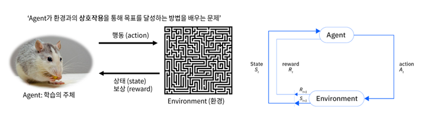

### 다른 학습 방법과의 차이

|구분|정답(Label)|학습 방식|
|---|---|---|
|지도학습|✅ 있음|정답 맞추기|
|비지도학습|❌ 없음|데이터 패턴/구조 찾기|
|강화학습|❌ 없음|보상을 통한 시행착오|

### 핵심 구성 요소

|요소|설명|
|---|---|
|에이전트 (Agent)|학습 수행 주체. 행동을 선택하고 보상을 받음|
|환경 (Environment)|에이전트의 행동에 따라 상태 변화 및 보상 제공|
|상태 (State)|에이전트가 인식하는 현재 환경의 상황|
|행동 (Action)|에이전트가 취할 수 있는 동작|
|보상 (Reward)|행동에 대한 긍정/부정 피드백|
|정책 (Policy)|상태 → 행동 결정 규칙. $\pi(s)=a$ 또는 $\pi(a\|s)$|

### 학습 흐름 (에피소드 기반 반복 구조)

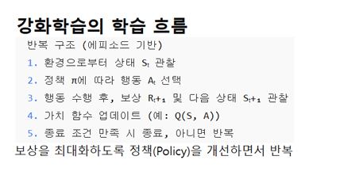

```
1. 환경으로부터 상태 Sₜ 관찰
2. 정책 π에 따라 행동 Aₜ 선택
3. 행동 수행 후, 보상 Rₜ₊₁ 및 다음 상태 Sₜ₊₁ 관찰
4. 가치 함수 업데이트 (예: Q(S, A))
5. 종료 조건 만족 시 종료, 아니면 반복
→ 보상을 최대화하도록 정책(Policy)을 개선하면서 반복
```

### 강화학습 유형

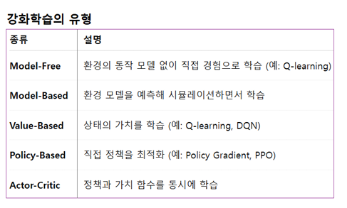

| 종류           | 설명                                   |
| ------------ | ------------------------------------ |
| Model-Free   | 환경 모델 없이 직접 경험으로 학습 (예: Q-learning)  |
| Model-Based  | 환경 모델을 예측해 시뮬레이션하면서 학습               |
| Value-Based  | 상태의 가치를 학습 (예: Q-learning, DQN)      |
| Policy-Based | 직접 정책을 최적화 (예: Policy Gradient, PPO) |
| Actor-Critic | 정책과 가치 함수를 동시에 학습                    |

### 대표 알고리즘

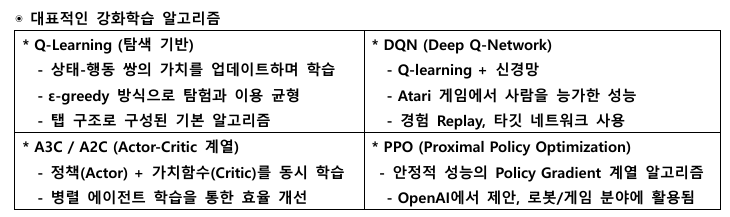

---

## 📊 Reward / Return / Expected Return

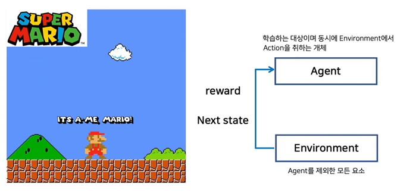 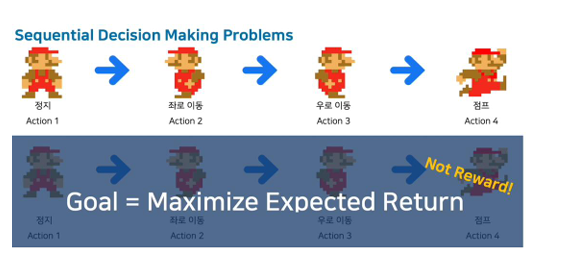

| 개념                  | 설명                 | 예시                     |
| ------------------- | ------------------ | ---------------------- |
| **Reward**          | 단일 행동에 대한 즉시 보상    | 코인 하나 먹기 → +1          |
| **Return**          | 한 에피소드 동안 누적된 총 보상 | 점프+이동+점프 → 총합 20점      |
| **Expected Return** | 앞으로 받게 될 보상의 기대값   | 지금 행동이 미래에 얼마나 도움될지 예측 |
|                     |                    |                        |

> 강화학습의 목표 = **지금 당장 보상이 아닌, 앞으로 받을 총 보상(Expected Return)을 최대화**

---

## 🗺️ Markov Property & MDP

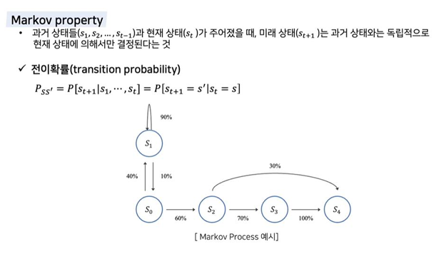

- **Markov Property**: 미래 상태는 오직 현재 상태에만 의존. 과거 상태와 독립적
- **전이확률 (Transition Probability)**: $P_{SS'} = P[S_{t+1} = s' | S_t = s]$
- 강화학습의 환경은 보통 **MDP(Markov Decision Process)** 로 표현됨
- Q-learning, DQN, Policy Gradient 등 모든 주요 알고리즘의 근간

---

## 🎮 Q-learning 기본 구조

### Grid World Example

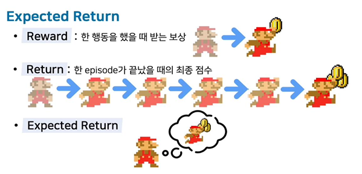 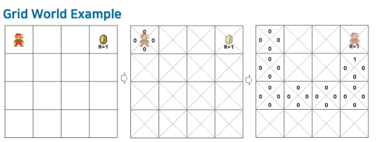

- **Q-value**: 어떤 action을 했을 때 미래에 받을 것이라고 예상되는 return의 값
- **Greedy action**: 현재 상태에서 가장 높은 Q값을 갖는 행동을 선택
- 초기엔 Q값이 모두 0 → 학습이 진행되면서 보상 방향으로 Q값이 퍼져나감

### ε-Greedy & Exploration vs Exploitation

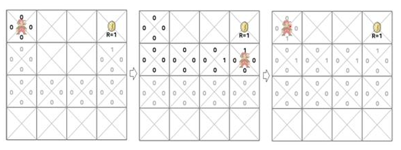 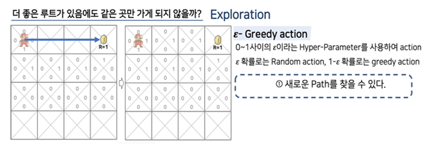

| 개념                    | 설명                             |
| --------------------- | ------------------------------ |
| **탐험 (Exploration)**  | ε 확률로 랜덤 행동 → 새로운 경로 발견        |
| **이용 (Exploitation)** | 1-ε 확률로 현재 최선 행동(greedy) 선택    |
| **Decay ε-Greedy**    | 학습 초기엔 탐험↑, 점차 ε 감소 → 이용↑으로 전환 |

### Discount Factor (할인율 γ) & Q-update

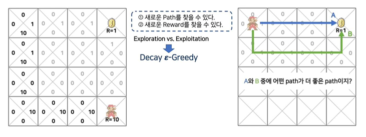 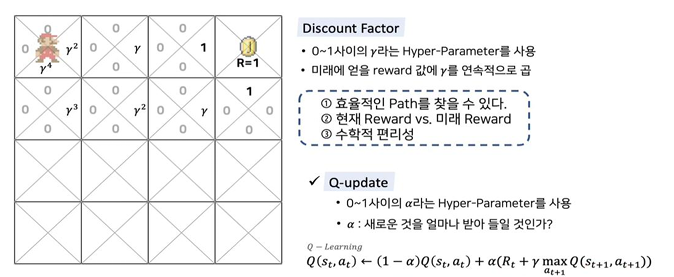

|하이퍼파라미터|역할|
|---|---|
|**α (학습률)**|새 경험을 얼마나 반영할지. α=1이면 완전히 새 값만, α=0이면 기존 유지|
|**γ (할인율)**|미래 보상을 얼마나 중요하게 볼지. γ→1이면 먼 미래도 중요, γ→0이면 즉각 보상만|

**Q-learning 업데이트 수식 (벨만 최적 방정식 기반)**

$$Q(s_t, a_t) \leftarrow (1-\alpha)Q(s_t, a_t) + \alpha\left(R_t + \gamma \max_{a_{t+1}} Q(s_{t+1}, a_{t+1})\right)$$

---

## 📌 Prediction & Control

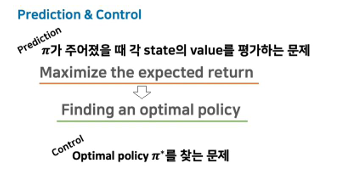

| 구분             | 목적                                                 |
| -------------- | -------------------------------------------------- |
| **Prediction** | π가 주어졌을 때 각 state의 value를 평가 → Expected Return 최대화 |
| **Control**    | 예측 결과를 바탕으로 최적 정책 $\pi^*$ 탐색                       |

---

## 📐 가치 함수 (Value Function)

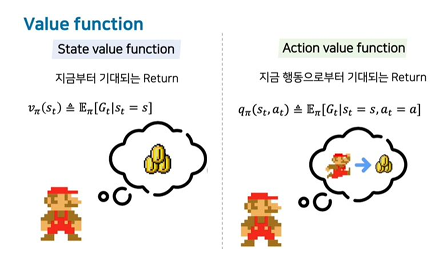 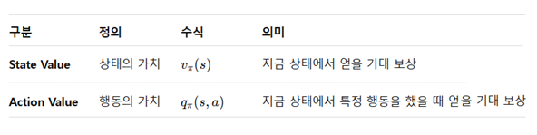

|구분|정의|수식|의미|
|---|---|---|---|
|**State Value**|상태의 가치|$v_\pi(s)$|지금 상태에서 얻을 기대 보상|
|**Action Value**|행동의 가치|$q_\pi(s, a)$|지금 상태에서 특정 행동을 했을 때 얻을 기대 보상|

---

## ⚔️ On-policy vs Off-policy

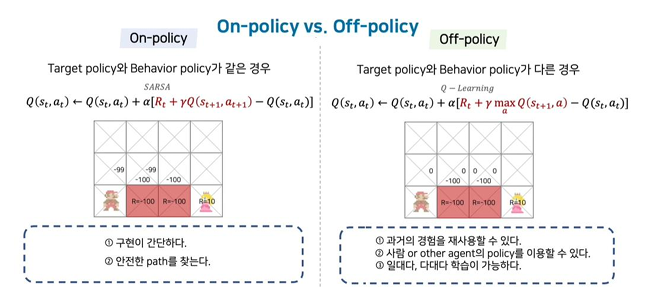 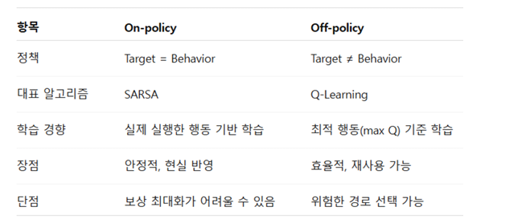

|항목|On-policy (SARSA)|Off-policy (Q-learning)|
|---|---|---|
|정책|Target = Behavior|Target ≠ Behavior|
|업데이트 기준|실제 선택한 다음 행동 $a'$|다음 상태에서 max Q|
|학습 경향|실제 행동 기반 → 안전한 경로|최적 행동 가정 → 공격적 경로|
|장점|안정적, 현실 반영|효율적, 경험 재사용 가능|
|단점|보상 최대화 어려울 수 있음|위험한 경로 선택 가능|
|수식|$Q \leftarrow Q + \alpha[R + \gamma Q(s', a') - Q]$|$Q \leftarrow Q + \alpha[R + \gamma \max_a Q(s', a) - Q]$|

---

## 🗂️ 전체 흐름 요약

```
강화학습
├── 핵심 개념: Agent, Environment, State, Action, Reward, Policy
├── 목표: Expected Return 최대화
├── MDP (Markov Decision Process)
│   └── Markov Property: 미래는 현재에만 의존
├── 벨만 방정식
│   ├── 기대 방정식 → SARSA (On-policy)
│   └── 최적 방정식 → Q-learning (Off-policy)
└── Q-learning
    ├── Q-table: 상태-행동 쌍의 가치 저장
    ├── ε-Greedy: 탐험(Exploration) vs 이용(Exploitation)
    ├── Decay ε-Greedy: 점진적 탐험 감소
    └── 하이퍼파라미터: α(학습률), γ(할인율)
```

---
# 📄 rl1qlearning.ipynb — Q-learning · 벨만방정식 · ε-Greedy

Q-learning의 구조를 이해하기 위한 코드. 벨만 방정식 기반의 근사학습으로, 에이전트가 1D 격자 위에서 목표 지점(state 4)을 찾아가는 과정을 학습한다.

---

## 📌 환경 설정

```python
import numpy as np
import random

# 상태 공간: 에이전트가 있을 수 있는 위치 (0~5번 칸)
state_space = [0, 1, 2, 3, 4, 5]

# 행동 공간: -1(왼쪽 이동), 1(오른쪽 이동)
action_space = [-1, 1]

# Q-table 초기화: (행=상태 수, 열=행동 수) → 전부 0으로 시작
# Q[state][action_index] = 특정 상태에서 특정 행동을 했을 때의 기대 가치
Q = np.zeros((len(state_space), len(action_space)))
print(Q)
```

**출력 (초기 Q-table)**

```
[[0. 0.]   ← state 0: [왼쪽Q, 오른쪽Q]
 [0. 0.]   ← state 1
 [0. 0.]   ← state 2
 [0. 0.]   ← state 3
 [0. 0.]   ← state 4 (목표)
 [0. 0.]]  ← state 5
```

> 처음엔 경험이 없으므로 Q값이 모두 0. 학습이 진행될수록 목표 방향으로 Q값이 퍼져나간다.

---

## ⚙️ 하이퍼파라미터 & 보상 함수

```python
alpha = 0.1          # 학습률: 새로운 정보를 기존 Q값에 얼마나 반영할지
                     # α=0이면 학습 안 함, α=1이면 새 값으로 완전 교체
gamma = 0.9          # 할인율: 미래 보상을 얼마나 중요하게 볼지
                     # γ→1이면 먼 미래도 중요, γ→0이면 즉각 보상만 중시
epsilon = 1.0        # 탐험 확률: 처음엔 100% 랜덤 행동
epsilon_decay = 0.99 # 매 스텝마다 epsilon을 0.99배씩 줄임 (Decay ε-Greedy)
epsilon_min = 0.1    # 탐험 확률 최솟값: 최소 10%는 탐험 유지
episodes = 500       # 전체 학습 반복 횟수

# 보상 함수: state 4에 도달하면 +10, 그 외엔 0
def get_reward(state):
    return 10 if state == 4 else 0
```

|파라미터|값|역할|
|---|---|---|
|alpha (α)|0.1|학습률 — 새 정보 반영 비율|
|gamma (γ)|0.9|할인율 — 미래 보상 중요도|
|epsilon (ε)|1.0 → 0.1|탐험 확률 (점진적 감소)|
|episodes|500|전체 학습 횟수|

---

## 🔄 학습 루프 (Q-learning 핵심)

```python
for episode in range(episodes):
    state = 0  # 매 에피소드마다 시작 위치 0으로 초기화

    for step in range(20):  # 한 에피소드에서 최대 20번 이동
        
        # ── ① 행동 선택 (ε-Greedy) ──────────────────────────────
        if random.random() < epsilon:
            action_index = random.randint(0, 1)  # 탐험: 랜덤 행동
        else:
            action_index = np.argmax(Q[state])   # 이용: Q값이 가장 높은 행동 선택

        action = action_space[action_index]  # action_index → 실제 이동값(-1 or 1)으로 변환

        # ── ② 다음 상태 계산 ────────────────────────────────────
        next_state = state + action  # 현재 위치에서 행동만큼 이동

        # 상태 공간 벗어나면 제자리 유지 (0~4 범위)
        if next_state < 0 or next_state > 4:
            next_state = state

        # ── ③ 보상 수령 ─────────────────────────────────────────
        reward = get_reward(next_state)  # state 4이면 +10, 아니면 0

        # ── ④ Q값 갱신 (벨만 최적 방정식) ───────────────────────
        old_q = Q[state][action_index]           # 현재 Q값
        next_max = np.max(Q[next_state])         # 다음 상태에서 가장 높은 Q값

        # Q-learning 업데이트 수식 (off-policy)
        # Q(s,a) ← Q(s,a) + α * (R + γ * max Q(s') - Q(s,a))
        Q[state][action_index] = old_q + alpha * (reward + gamma * next_max - old_q)

        # ── ⑤ 상태 이동 ─────────────────────────────────────────
        state = next_state

        # 목표 도달 시 에피소드 종료
        if reward == 10:
            break

        # ε 감소: 학습이 진행될수록 탐험 줄이고 이용 늘림
        epsilon = max(epsilon_min, epsilon * epsilon_decay)

print(Q)
```

---

## 📊 출력 결과 해석

```
[[ 6.93  7.56]   ← state 0: 오른쪽(7.56) > 왼쪽(6.93) → 오른쪽이 유리
 [ 6.95  8.30]   ← state 1: 오른쪽(8.30) > 왼쪽(6.95)
 [ 7.62  9.12]   ← state 2: 오른쪽(9.12) > 왼쪽(7.62)
 [ 8.35 10.05]   ← state 3: 오른쪽(10.05) > 왼쪽(8.35) ← 목표 바로 앞
 [ 0.    0.  ]   ← state 4: 목표 지점 (보상 후 종료)
 [ 0.    0.  ]]  ← state 5: 도달 못함
```

> 목표(state 4)에 가까울수록 오른쪽 Q값이 높아짐 → 학습이 제대로 된 것!

---

## 🗂️ 전체 흐름 요약

```
① 환경 초기화 (Q-table 전부 0)
       ↓
② 행동 선택 (ε-Greedy)
   ε 확률 → 랜덤 (탐험)
   1-ε 확률 → argmax Q (이용)
       ↓
③ 다음 상태 & 보상 수령
       ↓
④ Q값 갱신 (벨만 최적 방정식)
   Q(s,a) ← Q(s,a) + α(R + γ·maxQ(s') - Q(s,a))
       ↓
⑤ ε 감소 (Decay ε-Greedy)
       ↓
⑥ 목표 도달 시 break, 아니면 반복
```

### 벨만 방정식과의 연결

|수식 요소|코드 변수|의미|
|---|---|---|
|$Q(s_t, a_t)$|`old_q`|현재 상태-행동의 Q값|
|$R_t$|`reward`|즉각 보상|
|$\gamma$|`gamma`|할인율|
|$\max Q(s_{t+1})$|`next_max`|다음 상태 최대 Q값|
|$\alpha$|`alpha`|학습률|
