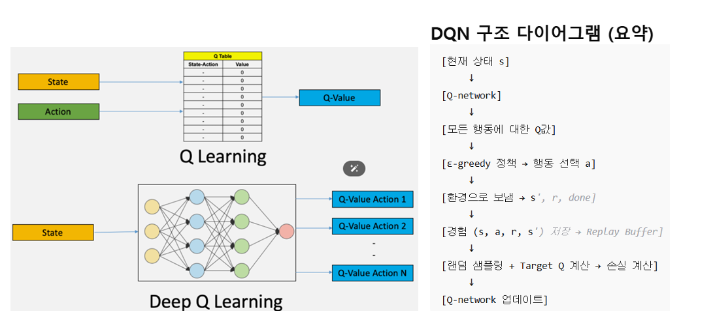
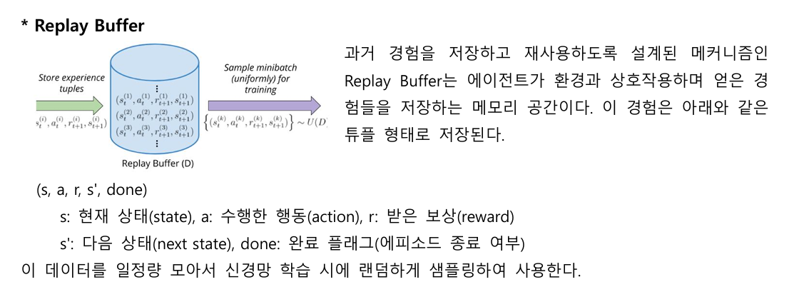

# Day81_강화학습 DQN으로 CartPole 구현

## 📅 2026-06-05

---

# 🌐 DQN : ReplayBuffer · TargetNetwork · LossFunction

## 🧠 DQN (Deep Q-Network) 개요



> 딥러닝을 이용한 강화학습 알고리즘. Q-table 대신 **신경망(DNN)** 으로 Q값을 근사하여 고차원 상태 공간에서도 학습 가능.

|항목|Q-Learning|DQN|
|---|---|---|
|Q값 저장 방식|Q-table (표)|신경망 (근사)|
|고차원 입력|❌ 불가|✅ 가능 (이미지 등)|
|학습 안정성|낮음|높음 (타겟 네트워크)|
|샘플 효율|낮음|높음 (Replay Buffer)|

### 장점

- 고차원 입력(이미지 등) 처리 가능
- 경험 재사용으로 학습 효율 증가
- 수렴 안정성 개선 (타겟 네트워크 덕분)

### 한계

- 학습 속도가 느릴 수 있음
- 탐색 부족 시 지역 최적값(Local Optima)에 머무를 수 있음
- 연속 행동 공간에서 직접 사용 어려움 → DDPG 등으로 확장

---

## ⚠️ 딥러닝을 RL에 적용할 때의 문제점

|문제|설명|
|---|---|
|Delayed Rewards|즉각적인 reward 없음, sparse하거나 noisy|
|High Correlation|연속 상태 간 상관관계 → i.i.d 가정 위반|
|Non-stationary Distribution|학습 진행에 따라 데이터 분포가 변함|

---

## 🔑 DQN 핵심 기술 2가지

### 1. Replay Buffer (리플레이 버퍼)



> 에이전트의 과거 경험을 저장하고, 무작위 샘플링하여 학습.

저장 형태:

```
(s, a, r, s', done)
 s    : 현재 상태 (state)
 a    : 수행한 행동 (action)
 r    : 받은 보상 (reward)
 s'   : 다음 상태 (next state)
 done : 에피소드 종료 여부
```

**작동 순서**

1. 매 step마다 경험 `(s, a, r, s', done)` 버퍼에 저장
2. 일정량 이상 쌓이면 랜덤 mini-batch 샘플링
3. 샘플로 Q-network 학습 (경사 하강)
4. 버퍼 최대 용량 도달 시 → 오래된 경험 제거 (FIFO)

**도입 효과**

|효과|설명|
|---|---|
|시간적 상관관계 제거|랜덤 샘플링으로 i.i.d 근사|
|샘플 효율성 증가|하나의 경험을 여러 번 재사용|
|학습 안정화|분산 감소|
|Off-policy 학습 가능|과거 정책으로 수집한 데이터도 활용|

---

### 2. Target Network (타겟 네트워크)

> Q값 계산에 사용되는 별도 고정 신경망. 일정 주기로만 업데이트.

**문제 배경** 같은 네트워크로 Q값을 예측하고 업데이트하면 → 학습 불안정 (이동하는 타겟 문제)

**두 개의 네트워크**

|네트워크|역할|
|---|---|
|Online Network (Q-network)|현재 학습 중. 매 step 파라미터 업데이트|
|Target Network|고정된 복사본. 일정 주기마다 Online → Target 복사|

**타겟 네트워크 작동 순서**

1. 에이전트가 환경에서 `(s, a, r, s')` 경험 획득
2. 타겟 네트워크로 목표값 계산: $y = r + \gamma \cdot \max_{a'} Q_{target}(s', a')$
3. 손실 함수로 Online Network 업데이트: $\mathcal{L}(\theta) = (y - Q(s,a;\theta))^2$
4. 일정 주기마다 (예: 1000 step) `Q_target ← Q_online` 파라미터 복사

---

## 📐 DQN Loss 수식

### 목표값 (Target)

$$y = r + \gamma \cdot \max_{a'} Q_{target}(s', a')$$

|기호|의미|
|---|---|
|$r$|현재 보상|
|$\gamma$|할인율 (future reward 중요도)|
|$s'$|다음 상태|
|$Q_{target}$|타겟 네트워크의 Q값|

### 손실 함수 (Loss)

$$\mathcal{L}(\theta) = (y - Q(s,a;\theta))^2$$

- $Q(s,a;\theta)$ : Online network가 예측한 Q값
- $\theta$ : 신경망 파라미터
- 역전파로 $\theta$ 업데이트

> 신경망이 예측한 Q값과 실제 얻은 값 `r + γ * max Q(s', a')`의 차이를 MSE로 최소화

---

## 🔄 DQN 전체 동작 흐름

```
현재 상태 s 입력
     ↓
Q-network → 모든 행동에 대한 Q값 예측
     ↓
ε-greedy 정책 → 행동 a 선택
     ↓
환경에 action 전달 → s', r, done 수신
     ↓
경험 (s, a, r, s') 저장 → Replay Buffer
     ↓
랜덤 샘플링 + Target Q 계산 → 손실 계산
     ↓
Q-network 업데이트 (역전파)
```

---
# 📄 rl4DQN.ipynb — DQN · CartPole · ReplayBuffer · TargetNetwork

## 📦 Cell 1 : 환경 설치

```python
# DQN : Q-learning을 딥러닝 신경망으로 확장한 강화학습 알고리즘
# Q-table 대신 신경망(Neural Network)으로 Q값을 근사함

# ┌────────────────────────────────────────────────────────────────┐
# │                     DQN 전체 동작 구조                         │
# ├────────────────────────────────────────────────────────────────┤
# │  환경(Environment)                                             │
# │    → 현재 상태(state) 입력                                     │
# │    → Q-Network로 행동별 Q값 예측                               │
# │    → ε-greedy 정책으로 행동(action) 선택                       │
# │    → 환경에 action 실행                                        │
# │    → reward, next_state, done 수신 (경험)                      │
# │    → Replay Buffer에 경험 저장                                 │
# │    → 버퍼에서 랜덤 샘플링 (mini-batch)                        │
# │    → Target Network로 목표 Q값(target) 계산                    │
# │    → Q-Network 학습 (손실 = 예측Q - 목표Q)                     │
# └────────────────────────────────────────────────────────────────┘

# *** DQN 동작 비유 ***
# 학생(Q-Network)이 문제를 풀며 경험 쌓음
#   → 문제은행(Replay Buffer)에 경험 저장 : (s, a, r, s', done)
#   → 문제은행에서 랜덤으로 문제 꺼냄 : mini-batch sampling
#   → 정답지(Target Network)로 목표값 계산 : r + γ * max Q_target(s')
#   → 학생(Q-Network) 업데이트 : loss = (현재 Q값 - 목표 Q값)²

# ~~~ 이전 CartPole 예제를 DQN으로 작업 ~~~
# ┌──────────────────────┬──────────────────────────────────┐
# │   기존 Q-table 방식   │          DQN 방식                │
# ├──────────────────────┼──────────────────────────────────┤
# │ 상태를 이산화해야 함   │ 연속된 상태를 그대로 사용         │
# │ Q-table로 Q값 저장    │ 신경망 모델이 Q값 예측            │
# │ argmax(Q[state])     │ argmax(model.predict(state))     │
# │ Q[s][a] = r+γ*...   │ model.fit()으로 가중치 갱신       │
# └──────────────────────┴──────────────────────────────────┘

!pip install gymnasium[classic-control]
```

---

## 📦 Cell 2 : 모델 정의 (Q-Network & Target Network)

```python
from tensorflow.keras.models import Sequential
from tensorflow.keras.layers import Input, Dense
from tensorflow.keras.optimizers import Adam
import tensorflow as tf
import gymnasium as gym
from collections import deque
import matplotlib.pyplot as plt
import random
import numpy as np

# CartPole-v1 환경 생성
# - 상태(state) : 카트 위치, 카트 속도, 막대 각도, 막대 각속도 (4차원 연속값)
# - 행동(action) : 왼쪽(0) 또는 오른쪽(1) 이동 (2가지)
env = gym.make("CartPole-v1")
num_actions = int(env.action_space.n)        # 2 (왼쪽, 오른쪽)
state_dim = env.observation_space.shape[0]   # 4 (상태 벡터 차원)
print(num_actions, state_dim)                # 2 4

# ── Q-Network 모델 구조 ──────────────────────────────────────────
# 입력 : 현재 상태 (4차원 벡터)
# 은닉층 : Dense(64) → relu × 2
# 출력 : 각 행동에 대한 Q값 (2개, 제한 없는 실수 → linear 활성화)
# 손실 함수 : MSE (예측 Q값 - 목표 Q값)²
def create_model():
    model = Sequential([
        Input(shape=(state_dim, )),
        Dense(units=64, activation='relu'),
        Dense(units=64, activation='relu'),
        Dense(units=num_actions, activation='linear')  # Q값은 실수 범위 → linear
    ])
    model.compile(optimizer=Adam(learning_rate=0.0005), loss='mse')
    return model

# Q-Network (Online Network) : 매 step마다 가중치 업데이트되는 메인 신경망
model = create_model()

# Target Network : 학습 안정성을 위해 가중치를 고정하는 복사본 신경망
# → 목표값(target) 계산에만 사용. 일정 주기마다 Q-Network 가중치를 복사해 갱신
# → 이유 : 같은 네트워크로 예측과 목표를 동시에 계산하면 'moving target' 문제 발생
target_model = create_model()
target_model.set_weights(model.get_weights())  # 초기 가중치 동기화
```

---

## 📦 Cell 3 : 하이퍼파라미터 설정

```python
# ── 할인율 ───────────────────────────────────────────────────────
gammer = 0.99          # γ : 미래 보상의 현재 가치 반영 비율 (1에 가까울수록 장기 보상 중시)

# ── 탐험율 (ε-greedy 전략) ────────────────────────────────────────
epsilon = 1.0          # 초기 탐험율 : 처음엔 100% 랜덤 행동
epsilon_decay = 0.995  # 매 에피소드마다 탐험율 감소 비율
epsilon_min = 0.05     # 최소 탐험율 : 항상 5%는 랜덤 탐험 유지

# ── Replay Buffer ────────────────────────────────────────────────
batch_size = 64        # 한 번 학습 시 버퍼에서 꺼내는 샘플 수
memory = deque(maxlen=5000)  # 최대 5000개 경험 저장. 초과 시 오래된 것부터 제거 (FIFO)
# 저장 형태 : (state, action, reward, next_state, done)

# ── 학습 설정 ─────────────────────────────────────────────────────
episodes = 50          # 총 에피소드 수 (충분한 학습엔 300~1000 권장)
update_target_every = 5  # Target Network 갱신 주기 (5 에피소드마다 Q-Network 가중치 복사)

reward_list = []       # 에피소드별 총 보상 기록용
```

---

## 📦 Cell 4 : 학습 루프

```python
for ep in range(episodes):
    state, _ = env.reset()  # 에피소드 시작 : 환경 초기화 → 초기 상태 반환
    done = False
    total_reward = 0

    while not done:
        # 신경망 입력은 배치 형태 필요 : [x1,x2,x3,x4] → [[x1,x2,x3,x4]]
        state_input = np.reshape(state, [1, state_dim])

        # ── ε-greedy 행동 선택 ────────────────────────────────────
        # epsilon 확률로 랜덤 탐험, 나머지는 Q-Network 예측값 기반 행동
        if np.random.rand() < epsilon:
            action = np.random.choice(num_actions)       # 탐험 : 랜덤 행동
        else:
            q_values = model.predict(state_input, verbose=0)
            action = np.argmax(q_values)                 # 활용 : Q값 최대 행동 선택

        # ── 환경에서 다음 상태 및 보상 수신 ──────────────────────────
        next_state, reward, terminated, truncated, _ = env.step(action)
        done = terminated or truncated

        # 에피소드 종료 시 강한 패널티 부여 → 막대가 쓰러지는 행동 억제
        modified_reward = reward if not done else -10

        # ── Replay Buffer에 경험 저장 ─────────────────────────────
        # 랜덤 샘플링으로 시간적 상관관계를 끊어 i.i.d 근사
        memory.append((state, action, modified_reward, next_state, done))
        state = next_state
        total_reward += reward

        # ── Q-Network 학습 ────────────────────────────────────────
        # 버퍼에 batch_size 이상 쌓이면 mini-batch 학습 시작
        if len(memory) >= batch_size:
            minibatch = random.sample(memory, batch_size)  # 랜덤 샘플링
            states, targets = [], []

            for s, a, r, s_next, d in minibatch:
                s_input      = np.reshape(s,      [1, state_dim])
                s_next_input = np.reshape(s_next, [1, state_dim])

                # 현재 상태에 대한 Q값 예측 (모든 행동에 대한 예측값)
                # → 선택한 행동(a)의 Q값만 벨만 방정식으로 갱신, 나머지는 유지
                target = model.predict(s_input, verbose=0)[0]  # shape: [[q0,q1]] → [q0,q1]

                if d:
                    # 종료 상태 : 미래 보상 없음
                    target[a] = r
                else:
                    # 벨만 방정식 : Q(s,a) = r + γ * max Q_target(s', a')
                    # Target Network로 다음 상태의 Q값 예측 (학습 안정성)
                    t_next = target_model.predict(s_next_input, verbose=0)[0]
                    target[a] = r + gammer * np.max(t_next)

                states.append(s)       # 입력 상태
                targets.append(target) # 갱신된 Q값 (정답 레이블)

            # 배치 전체를 한 번에 학습 (epochs=1)
            model.fit(np.array(states), np.array(targets), epochs=1, verbose=0)

    reward_list.append(total_reward)

    # ── ε 감소 ────────────────────────────────────────────────────
    # 학습이 진행될수록 탐험 줄이고 활용 늘림
    if epsilon > epsilon_min:
        epsilon *= epsilon_decay
        epsilon = max(epsilon, epsilon_min)

    # ── Target Network 가중치 갱신 ────────────────────────────────
    # 일정 주기마다 Q-Network → Target Network로 가중치 복사
    if ep % update_target_every == 0:
        target_model.set_weights(model.get_weights())

    if ep % 10 == 0:
        print(f'Episode {ep}: Reward = {total_reward:.1f}, Epsilon = {epsilon:.3f}')
```

---

## 🔑 핵심 개념 요약

### Q-Network vs Target Network

|항목|Q-Network (Online)|Target Network|
|---|---|---|
|역할|Q값 예측 + 학습|목표값(target) 계산|
|업데이트|매 step마다|일정 주기마다 (복사)|
|목적|최적 정책 탐색|학습 안정화|

### Replay Buffer 흐름

```
step마다 경험 저장 : memory.append((s, a, r, s', done))
      ↓
버퍼 크기 ≥ batch_size 되면
      ↓
랜덤 mini-batch 샘플링 : random.sample(memory, batch_size)
      ↓
벨만 방정식으로 target 계산
      ↓
model.fit() 으로 Q-Network 업데이트
```

### 벨만 방정식 (학습 목표값)

$$target = r + \gamma \cdot \max_{a'} Q_{target}(s', a')$$

- 종료 상태(`done=True`)이면 : `target = r` (미래 보상 없음)
- 진행 중이면 : `target = r + γ * max(Target Network 예측값)`

### ε-greedy 탐험 전략

```
epsilon = 1.0  →  초기엔 100% 랜덤 탐험
   ↓ 에피소드 진행마다 × 0.995 감소
epsilon_min = 0.05  →  최소 5%는 항상 랜덤 유지
```