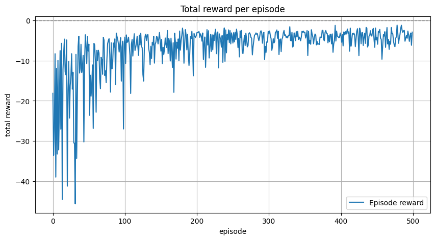
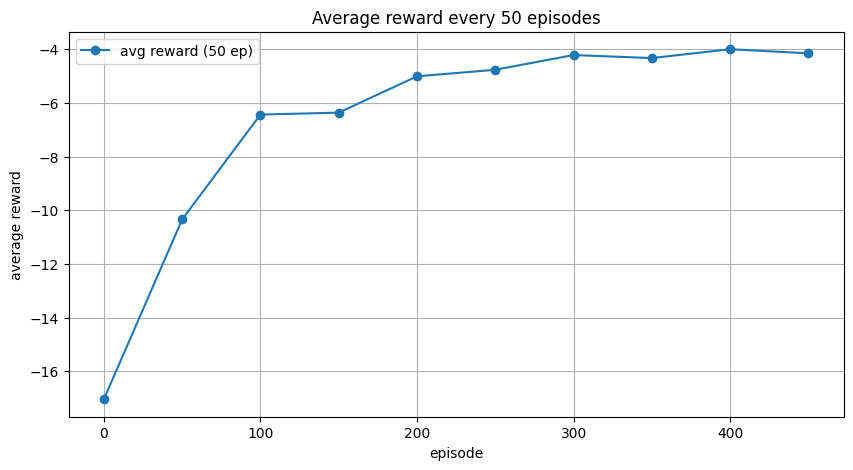
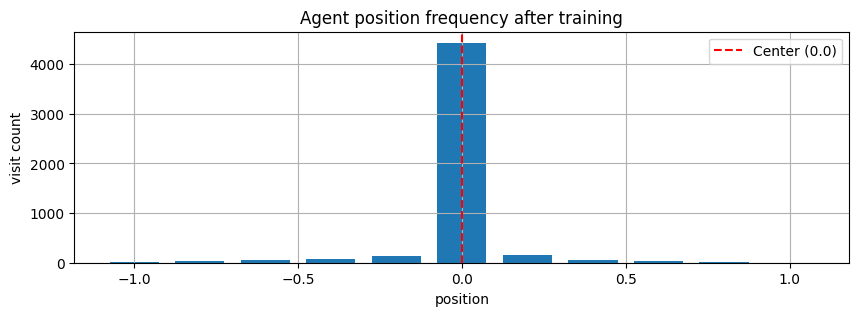
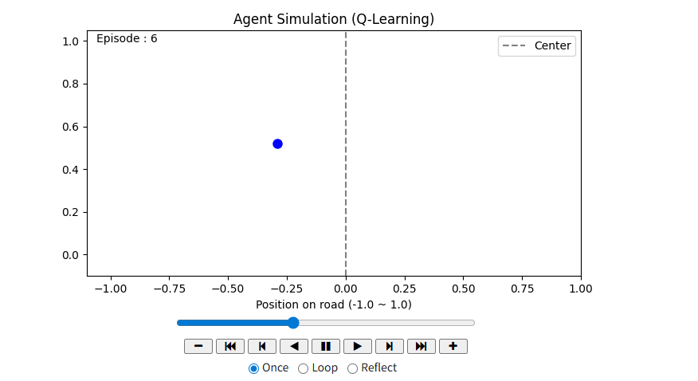

# Day82_강화학습 Q-Learning자율주행시뮬레이션

## 📅 2026-06-08

---
# 📄 rl5car.ipynb — Q-Learning · 자율주행 · 이산상태공간

## 🗂️ 개요

|항목|내용|
|---|---|
|주제|Q-Learning 기반 기초 자율주행 시뮬레이션|
|환경|1차선 도로 (위치 범위 : -1.0 ~ 1.0)|
|목표|에이전트(차량)가 도로 **중앙(0.0)** 을 유지하도록 학습|
|행동|좌회전(-1), 직진(0), 우회전(+1)|
|알고리즘|Q-Learning (off-policy, value-based, 테이블 기반)|

---

## 📦 Cell 1 : 라이브러리 import

```python
import numpy as np
import random
import matplotlib.pyplot as plt
```

---

## 📦 Cell 2 : 환경 정의

```python
# 상태(state) : -1.0 ~ 1.0 구간을 11개의 이산 구간으로 분할
# → Q 테이블은 표(테이블) 형태라서 정수 인덱스가 필요함
# → 연속값을 그대로 쓰면 테이블 크기가 무한대가 되므로 이산화 필요
state_space = np.linspace(-1.0, 1.0, 11)
# [-1.  -0.8 -0.6 -0.4 -0.2  0.   0.2  0.4  0.6  0.8  1. ]
print(state_space)

# 행동 공간 : 좌(-1), 직진(0), 우(+1)
action_space = [-1, 0, 1]

# Q 테이블 초기화 : Q[state_index, action_index]
# shape : (11, 3)  →  상태 11개 × 행동 3개
# 각 셀 = 해당 상태에서 해당 행동을 했을 때 기대되는 누적 보상
# 초기값 0에서 시작 → 학습하면서 점점 갱신됨
q_table = np.zeros((len(state_space), len(action_space)))
```

---

## 📦 Cell 3 : 하이퍼파라미터

```python
alpha = 0.1          # 학습률 : Q값을 얼마나 빠르게 갱신할지. 너무 크면 불안정, 너무 작으면 느림
gamma = 0.9          # 할인율 : 미래 보상의 현재 가치. 1에 가까울수록 먼 미래까지 고려
epsilon = 0.9        # 탐색률 초기값 : 초기엔 높게 설정해서 다양하게 탐색
epsilon_decay = 0.995  # 탐색률 감소율 : 에피소드마다 ε에 곱함 → 탐색↓ 활용↑
epsilon_min = 0.01   # 탐색률 하한 : 최소 1%는 항상 랜덤 행동 유지

episodes = 500       # 총 에피소드 수 (1 에피소드 = 50 스텝)
```

---

## 📦 Cell 4 : 헬퍼 함수

```python
def get_state_index(position):
    # 현재 연속 위치값 → 가장 가까운 이산 구간의 인덱스 반환
    # np.abs(state_space - position) : 각 구간과의 거리 계산
    # np.argmin(...)                 : 거리가 가장 짧은 구간의 인덱스 반환
    return np.argmin(np.abs(state_space - position))

def get_reward(position):
    # 중앙(0.0)에 가까울수록 보상이 높음
    # 위치  0.0 → 보상  0.0 (최대)
    # 위치 ±1.0 → 보상 -1.0 (최소)
    # 보상 범위 : -1.0 ~ 0.0
    return -abs(position)

def stepFunc(position, action):
    position += action * 0.1              # 행동에 따라 위치 이동 (한 스텝 = 0.1 단위)
    position = np.clip(position, -1.0, 1.0)  # 도로 범위 벗어나지 않도록 클리핑
    reward = get_reward(position)         # 이동 후 위치에 대한 보상 계산
    return position, reward

# 동작 확인
print(get_state_index(-0.2), state_space[get_state_index(0.4)])
print(get_reward(0.5))
```

---

## 📦 Cell 5 : Q-Learning 학습 루프

```python
# ┌────────────────────────────────────────────────────────┐
# │              Q-Learning 전체 동작 구조                  │
# ├────────────────────────────────────────────────────────┤
# │  에피소드 시작                                          │
# │    → 임의 위치에서 출발                                 │
# │    → 50 스텝 반복                                       │
# │        ├─ 현재 위치 → 이산 상태 인덱스 변환              │
# │        ├─ ε-Greedy로 행동 선택 (탐색 or 활용)           │
# │        ├─ stepFunc() → 다음 위치 + 보상                 │
# │        ├─ Bellman 방정식으로 Q 테이블 갱신              │
# │        └─ 위치 업데이트                                 │
# │    → 에피소드 보상 저장                                 │
# │    → ε 감소                                            │
# └────────────────────────────────────────────────────────┘

reward_list = []

for ep in range(episodes):
    position = np.random.uniform(-1.0, 1.0)  # 매 에피소드마다 임의 위치에서 출발
    total_reward = 0

    for _ in range(50):
        state_idx = get_state_index(position)  # 현재 위치를 이산 상태 인덱스로 변환

        # ── ε-Greedy 탐색 전략 ────────────────────────────────────
        # 탐색(Exploration) : 무작위 행동 → 새로운 전략 발견 가능
        # 활용(Exploitation) : Q값 최대 행동 → 지금까지 배운 최선 선택
        if random.random() < epsilon:
            action_idx = random.choice([0, 1, 2])       # 탐색
        else:
            action_idx = np.argmax(q_table[state_idx])  # 활용

        action = action_space[action_idx]
        next_position, reward = stepFunc(position, action)
        next_state_idx = get_state_index(next_position)

        # ── Q 테이블 갱신 (Bellman Equation) ─────────────────────
        # Q(s,a) ← Q(s,a) + α * [ r + γ * max Q(s',a') - Q(s,a) ]
        #
        # r + γ * max Q(s',a')  : TD 타깃 (정답 레이블 역할)
        # TD 타깃 - Q(s,a)      : TD 오차 (현재 예측과 타깃의 차이)
        # α * TD 오차           : Q값을 타깃 방향으로 조금씩 이동
        best_next_q = np.max(q_table[next_state_idx])
        q_table[state_idx, action_idx] += alpha * (
            reward + gamma * best_next_q - q_table[state_idx, action_idx]
        )

        position = next_position
        total_reward += reward

    reward_list.append(total_reward)
    epsilon = max(epsilon_min, epsilon * epsilon_decay)  # ε 감소

    # 50 에피소드마다 성능 출력
    if ep % 50 == 0:
        initial_avg = np.mean(reward_list[:50])
        final_avg   = np.mean(reward_list[-50:])
        print(f'===== Episode {ep + 1} =====')
        print(f'  initial 50 avg  : {initial_avg:.3f}')
        print(f'  recent  50 avg  : {final_avg:.3f}')
        print(f'  best / worst    : {np.max(reward_list):.3f} / {np.min(reward_list):.3f}')
        if final_avg > initial_avg:
            print(f'  → 개선됨 (+{final_avg - initial_avg:.3f})\n')
        else:
            print('  → 크게 개선되지 않음\n')
```

---

## 📦 Cell 6 : 시각화 — 에피소드별 총 보상

```python
# 학습이 잘 되면 보상이 0에 가까워지는 방향으로 상승해야 함
# 초반(ep 0~100) : 탐색 위주라 진폭이 크고 불안정
# 후반(ep 300~) : 활용 위주로 전환되며 안정화
plt.figure(figsize=(10, 5))
plt.plot(reward_list, label='Episode reward')
plt.axhline(y=0, color='gray', linestyle='--', linewidth=1)
plt.xlabel('episode')
plt.ylabel('total reward')
plt.title('Total reward per episode')
plt.grid(True)
plt.legend()
plt.show()
```



---

## 📦 Cell 7 : 시각화 — 50 에피소드 단위 평균 보상

```python
# 노이즈가 많은 원본 보상 곡선을 50 에피소드 구간 평균으로 부드럽게 시각화
# 전체적인 학습 트렌드(개선 여부) 파악에 유리
# ep 0 → -17 수준에서 ep 300 이후 → -4 수준으로 수렴 : 학습 성공
window = 50
avg_rewards = [np.mean(reward_list[i:i+window]) for i in range(0, len(reward_list), window)]

plt.figure(figsize=(10, 5))
plt.plot(range(0, len(reward_list), window), avg_rewards, marker='o', label='avg reward (50 ep)')
plt.xlabel('episode')
plt.ylabel('average reward')
plt.title('Average reward every 50 episodes')
plt.grid(True)
plt.legend()
plt.show()
```



---

## 📦 Cell 8 : 시각화 — 학습 후 위치 히스토그램

```python
# 학습 완료 후 에이전트가 각 위치 구간에 얼마나 자주 방문했는지 시각화
# 중앙(0.0) 막대가 압도적으로 높으면 → 에이전트가 중앙 유지 전략을 학습한 것
position_counts = np.zeros(len(state_space))

for _ in range(100):
    position = np.random.uniform(-1.0, 1.0)
    for _ in range(50):
        state_idx = get_state_index(position)
        position_counts[state_idx] += 1  # 해당 상태 방문 횟수 누적

        if np.random.rand() < epsilon:
            action_idx = np.random.choice(len(action_space))  # 탐색
        else:
            action_idx = np.argmax(q_table[state_idx])        # 활용

        action = action_space[action_idx]
        position, _ = stepFunc(position, action)

plt.figure(figsize=(10, 3))
plt.bar(state_space, position_counts, width=0.15, align='center')
plt.xlabel('position')
plt.ylabel('visit count')
plt.title('Agent position frequency after training')
plt.axvline(0, color='red', linestyle='--', label='Center (0.0)')
plt.grid(True)
plt.legend()
plt.show()
```



---

## 🔑 핵심 개념 요약

### Bellman Equation (Q 테이블 갱신 공식)

$$Q(s, a) \leftarrow Q(s, a) + \alpha \left[ r + \gamma \max_{a'} Q(s', a') - Q(s, a) \right]$$

|항|의미|
|---|---|
|`Q(s, a)`|현재 상태 s에서 행동 a를 했을 때의 Q값|
|`r`|행동 후 받은 즉각 보상|
|`γ * max Q(s', a')`|다음 상태에서 최선의 행동을 했을 때 기대되는 미래 보상|
|`r + γ * max Q(s', a')`|**TD 타깃** (정답 레이블 역할)|
|`TD 타깃 - Q(s, a)`|**TD 오차** (현재 예측과 타깃의 차이)|
|`α * TD 오차`|Q값을 타깃 방향으로 조금씩 이동|

### ε-Greedy 탐색 전략

```
epsilon = 0.9   →  초기엔 90% 랜덤 탐색
   ↓ 에피소드 진행마다 × 0.995 감소
epsilon_min = 0.01  →  최소 1%는 항상 랜덤 유지
```

- **탐색(Exploration)** : 새로운 행동 시도 → 더 좋은 전략 발견 가능
- **활용(Exploitation)** : 지금까지 배운 Q 테이블 기반 최선 행동 선택
- ε가 점점 줄어들면서 **탐색 → 활용** 비중이 이동

### Q-Learning vs DQN 비교 (예고)

| |Q-Learning|DQN|
|---|---|---|
|Q값 저장 방식|**테이블** (상태×행동)|**신경망** (근사)|
|상태 공간|이산, 소규모|연속, 대규모 가능|
|메모리|Replay Buffer 없음|Replay Buffer 사용|
|안정성|간단하지만 규모 한계|Target Network로 안정화|

> rl5는 상태가 11개로 작아서 테이블로 충분하지만, 실제 자율주행처럼 상태가 복잡해지면 DQN으로 확장이 필요하다.


---
# 📄 rl6car_ani.ipynb — Q-Learning · 궤적저장 · FuncAnimation

## 🗂️ 개요

|항목|내용|
|---|---|
|주제|Q-Learning 자율주행 + 에피소드별 궤적 애니메이션 시각화|
|기반|rl5car.ipynb 에 궤적 저장 및 애니메이션 기능 추가|
|추가 요소|`trajectories` 리스트, `FuncAnimation`, `to_jshtml()`, `ffmpeg 저장`|
|환경|1차선 도로 (위치 범위 : -1.0 ~ 1.0)|
|알고리즘|Q-Learning (테이블 기반, off-policy)|

---

## 📦 Cell 1 : 라이브러리 import

```python
import numpy as np
import random
import matplotlib.pyplot as plt
from matplotlib.animation import FuncAnimation  # 프레임 단위 애니메이션 생성
from IPython.display import HTML                # Jupyter/Colab에서 애니메이션 인라인 렌더링
```

---

## 📦 Cell 2 : 환경 정의

```python
# 상태 공간 : -1.0 ~ 1.0 구간을 11개 이산 구간으로 분할
state_space = np.linspace(-1.0, 1.0, 11)
print(state_space)

# 행동 공간 : 좌(-1), 직진(0), 우(+1)
action_space = [-1, 0, 1]

# Q 테이블 초기화 : Q[state_index, action_index]  shape = (11, 3)
q_table = np.zeros((len(state_space), len(action_space)))
```

---

## 📦 Cell 3 : 하이퍼파라미터

```python
alpha = 0.1            # 학습률
gamma = 0.9            # 할인율
epsilon = 0.9          # 탐색률 초기값
epsilon_decay = 0.995  # 탐색률 감소율
epsilon_min = 0.01     # 탐색률 하한

episodes = 500         # 총 에피소드 수
```

---

## 📦 Cell 4 : 헬퍼 함수

```python
def get_state_index(position):
    # 연속 위치값 → 가장 가까운 이산 구간의 인덱스 반환
    return np.argmin(np.abs(state_space - position))

def get_reward(position):
    # 중앙(0.0)에서 멀수록 패널티 (범위 : -1.0 ~ 0.0)
    return -abs(position)

def stepFunc(position, action):
    position += action * 0.1              # 한 스텝 = 0.1 단위 이동
    position = np.clip(position, -1.0, 1.0)  # 도로 범위 클리핑
    reward = get_reward(position)
    return position, reward
```

---

## 📦 Cell 5 : Q-Learning 학습 루프 (+ 궤적 저장)

```python
reward_list = []
trajectories = []   # 저장된 궤적 리스트. 각 원소 = 에피소드 1개의 위치 시퀀스(50개)

for ep in range(episodes):
    position = np.random.uniform(-1.0, 1.0)  # 매 에피소드 임의 위치에서 출발
    total_reward = 0
    trajectory = []   # 이번 에피소드의 스텝별 위치 기록용

    for _ in range(50):
        state_idx = get_state_index(position)

        # ε-Greedy 행동 선택
        if random.random() < epsilon:
            action_idx = random.choice([0, 1, 2])       # 탐색
        else:
            action_idx = np.argmax(q_table[state_idx])  # 활용

        action = action_space[action_idx]
        next_position, reward = stepFunc(position, action)
        next_state_idx = get_state_index(next_position)

        # Bellman 방정식으로 Q 테이블 갱신
        best_next_q = np.max(q_table[next_state_idx])
        q_table[state_idx, action_idx] += alpha * (
            reward + gamma * best_next_q - q_table[state_idx, action_idx]
        )

        position = next_position
        total_reward += reward
        trajectory.append(position)   # 현재 스텝 위치를 궤적에 추가

    reward_list.append(total_reward)
    epsilon = max(epsilon_min, epsilon * epsilon_decay)

    # 10 에피소드마다 궤적 저장 (매 에피소드 저장하면 데이터가 너무 많아짐)
    # → 500 에피소드 / 10 = 50개 에피소드의 궤적만 저장
    if ep % 10 == 0:
        trajectories.append(trajectory)

# ── 궤적 평탄화 ────────────────────────────────────────────────────
# trajectories : [[pos0, pos1, ...pos49], [pos0, ...], ...]  shape = (50, 50)
# flat_positions : [pos, pos, pos, ...]  shape = (2500,)
# → FuncAnimation이 프레임 인덱스(정수)로 접근할 수 있도록 1차원으로 변환
flat_positions = [pos for traj in trajectories for pos in traj]
frame_count = len(flat_positions)   # 총 프레임 수 = 50에피소드 × 50스텝 = 2500
print(f'총 프레임 수 : {frame_count}')
```

> 💡 **왜 10 에피소드마다 저장하는가?** 500 에피소드를 전부 저장하면 `flat_positions` 길이가 25,000개가 되어 애니메이션 렌더링이 너무 느려진다. 10개 간격으로 샘플링해서 50개만 저장.

---

## 📦 Cell 6 : 궤적 애니메이션

```python
fig, ax = plt.subplots(figsize=(8, 4))
ax.set_xlim(-1.1, 1.0)
ax.set_ylim(-0.1, 1.05)
ax.set_title('Agent Simulation (Q-Learning)')
ax.set_xlabel('Position on road (-1.0 ~ 1.0)')
ax.axvline(0, color='gray', linestyle='--', label='Center')
point, = ax.plot([], [], 'bo', markersize=8)   # 에이전트를 나타내는 파란 점
ax.legend()
episode_text = ax.text(0.02, 0.95, '', transform=ax.transAxes, fontsize=10)

# ── updateFunc : 매 프레임마다 호출되는 콜백 함수 ──────────────────
def updateFunc(frame):
    x = flat_positions[frame]    # 현재 프레임의 에이전트 x 위치 (도로 위)
    y = (frame % 50) / 50        # y축 : 해당 에피소드 내 스텝 진행도 (0.0 ~ 1.0)
                                 # → frame=0~49 : y=0.0~0.98, frame=50~99 : 다시 0.0~0.98
    point.set_data([x], [y])
    episode_num = frame // 50 + 1  # 현재 몇 번째 에피소드인지 계산
    episode_text.set_text(f'Episode : {episode_num}')

# ── FuncAnimation ─────────────────────────────────────────────────
# fig      : 그릴 Figure 객체
# updateFunc : 프레임마다 호출될 함수
# frames   : 총 프레임 수 (= flat_positions 길이)
# interval : 프레임 간 대기 시간 (ms). 100ms = 10fps
# repeat   : 애니메이션 반복 여부
ani = FuncAnimation(fig, updateFunc, frames=frame_count, interval=100, repeat=False)
plt.close(fig)   # 정적 이미지 출력 방지 (to_jshtml()로만 표시)

HTML(ani.to_jshtml())   # Jupyter/Colab에서 인터랙티브 플레이어로 렌더링
```



> 💡 **y축의 의미** x축은 도로 위 위치(-1.0 ~ 1.0), y축은 에피소드 내 **스텝 진행도(0~1)** 를 나타낸다. 학습 초반 에피소드에서는 점이 좌우로 크게 흔들리다가, 학습이 진행될수록 점이 중앙(x=0) 근처에서 위아래로 이동하는 패턴을 보인다.

---

## 📦 Cell 7 : 애니메이션 저장 (Colab 전용)

```python
# Colab 환경에서만 정상 동작 (ffmpeg 필요)
# 로컬 환경에서는 try/except로 오류 없이 생략
try:
    ani.save('ani_car.mp4', writer='ffmpeg', fps=10)  # mp4로 저장
    from google.colab import files
    files.download('ani_car.mp4')   # Colab → 로컬로 파일 다운로드
except Exception as e:
    print(f'저장 생략 : {e}')
```

---

## 📦 Cell 8 : 최종 Q-Table 출력

```python
# 학습 완료 후 Q 테이블 전체 출력
# rows    : 상태값 (-1.0 ~ 1.0, 11개)
# columns : 행동별 Q값 (좌=-1, 직진=0, 우=+1)
# 중앙(0.0) 근처 상태에서 직진(0) 행동의 Q값이 가장 높게 학습되었으면 성공

print('\nfinal Q-table (rows=states, columns=actions[-1, 0, 1])\n')
header = f"{'state':>7} | {'-1':>7} {'0':>7} {'1':>7}"
print(header)
print('-' * len(header))
for i, state_val in enumerate(state_space):
    q_vals = q_table[i]
    print(f'{state_val:7.2f} | {q_vals[0]:7.3f} {q_vals[1]:7.3f} {q_vals[2]:7.3f}')
```

---

## 🔑 핵심 개념 요약

### rl5 → rl6 추가된 것

|항목|rl5|rl6 추가|
|---|---|---|
|궤적 저장|없음|`trajectory.append(position)`|
|샘플링|없음|`ep % 10 == 0` 마다 저장|
|평탄화|없음|`flat_positions` (2차원 → 1차원)|
|시각화|정적 그래프 3종|`FuncAnimation` 인터랙티브 애니메이션|
|저장|없음|`ani.save()` + `files.download()`|

### FuncAnimation 동작 구조

```
FuncAnimation(fig, updateFunc, frames=2500, interval=100)
      │
      ├─ frame=0    → updateFunc(0)    : x=flat_positions[0],   y=0/50
      ├─ frame=1    → updateFunc(1)    : x=flat_positions[1],   y=1/50
      ├─ ...
      ├─ frame=49   → updateFunc(49)   : x=flat_positions[49],  y=49/50  ← ep1 끝
      ├─ frame=50   → updateFunc(50)   : x=flat_positions[50],  y=0/50   ← ep2 시작
      └─ frame=2499 → updateFunc(2499) : 마지막 프레임
```

### 궤적 데이터 구조

```
trajectory (1 에피소드)
  = [pos_step0, pos_step1, ..., pos_step49]   # 길이 50

trajectories (전체, 10ep 간격 샘플링)
  = [traj_ep0, traj_ep10, traj_ep20, ..., traj_ep490]  # 길이 50

flat_positions (평탄화)
  = [pos, pos, pos, ..., pos]   # 길이 2500 (50 × 50)
```

### epsilon 이중 감소 주의

원본 코드에 `epsilon_decay` 적용이 루프 내외 두 곳에 있어 실제보다 빠르게 감소한다. rl6 노트에서는 루프 내 1회만 적용하도록 정리함.