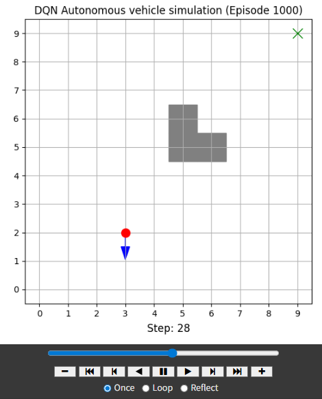
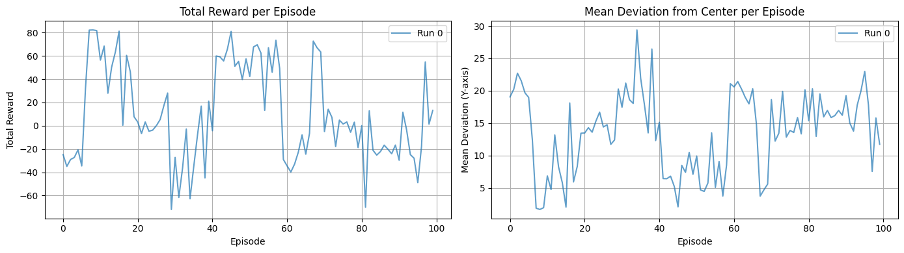
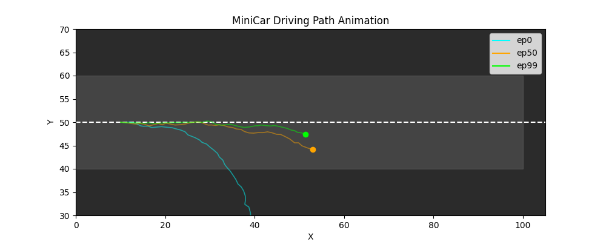
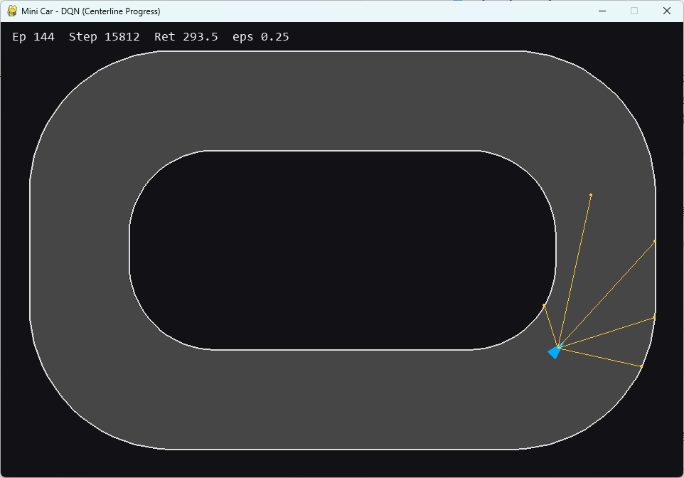
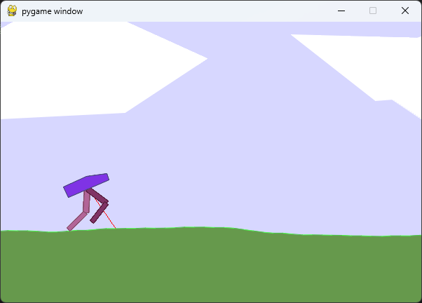
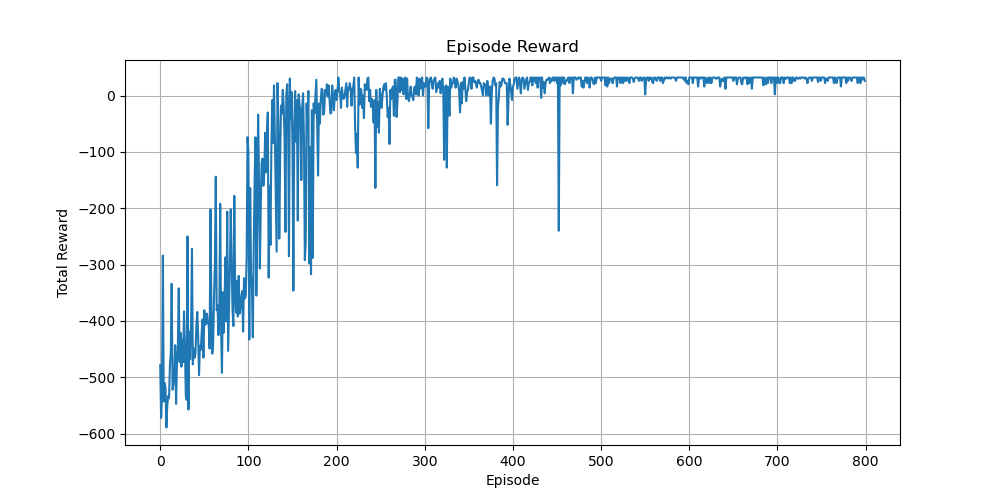
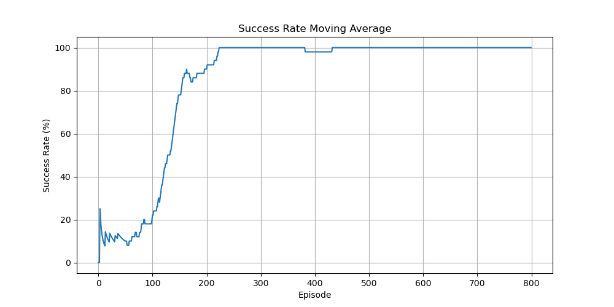
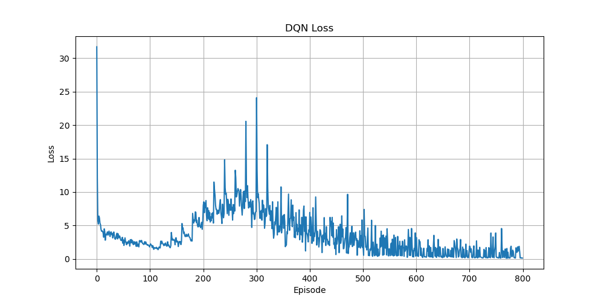

# Day83_강화학습 MiniCar · 자율주행 · 트랙레이싱 · 창고로봇 · BipedalWalker

## 📅 2026-06-09

---
# 🌐 자율주행 개념

## 🧠 개념 정리

### 실습 개요
- DQN 알고리즘 (PyTorch 기반) 으로 자동차가 장애물을 피해 목적지까지 도달하도록 학습
- 강화학습의 핵심 원리와 시행착오의 필요성 체험
- 학습 결과를 시각적으로 확인하여 모델 성능을 직관적으로 분석

---

### 강화학습 흐름 요약

```
① 에이전트가 현재 상태에서 ε-greedy로 행동 선택
② 행동을 환경에 적용 → 새로운 상태, 보상, 종료 여부 수신
③ 경험 (s, a, r, s', done) 을 Replay Buffer에 저장
④ Buffer가 batch_size 이상이면 무작위 샘플링 → Q-Network 학습
⑤ 에피소드마다 epsilon 감소
⑥ 일정 주기마다 Target Network 업데이트
```

---

### 환경 구조 (DQNCarEnv)

```
그리드 : 10 × 10
출발점 : (0, 0)
목표점 : (9, 9)  ← 초록색 X
장애물 : {(5,5), (5,6), (6,5)}  ← 중앙을 완전히 막지 않는 형태

상태 (state) : [x, y, dir_idx]  — 위치 + 진행 방향
행동 (action) : 0=직진, 1=좌회전, 2=우회전
```

방향 인덱스:

| dir_idx | 방향 | 이동 |
|---------|------|------|
| 0 | N (북) | (-1, 0) |
| 1 | E (동) | (0, +1) |
| 2 | S (남) | (+1, 0) |
| 3 | W (서) | (0, -1) |

---

### 보상 설계

| 상황 | 보상 |
|------|------|
| 이동 성공 (일반) | -1 (매 스텝 페널티 → 최단 경로 유도) |
| 목표 도달 | +100 |
| 벽 / 장애물 충돌 | -100 + 종료 |

- 매 스텝 -1을 주는 이유 : 돌아가지 않고 **최단 경로**를 찾도록 유도
- 충돌 시 즉시 종료 → 위험 회피 학습 강제

---

### Keras vs PyTorch DQN 비교

| 항목 | Keras (MiniCar) | PyTorch (자율주행) |
|------|-----------------|---------------------|
| 모델 정의 | `keras.Sequential` | `nn.Module` 상속 + `nn.Sequential` |
| 학습 | `model.fit()` | `loss.backward()` + `optimizer.step()` 수동 |
| 예측 | `model.predict()` | `model(tensor)` |
| GPU 지원 | 자동 | `torch.device("cuda" if ... else "cpu")` 명시 |
| 역전파 | 자동 | 수동 (`zero_grad()` → `backward()` → `step()`) |

---

### PyTorch 역전파 흐름

```python
loss = nn.MSELoss()(q_values, target_q)
optimizer.zero_grad()   # 이전 gradient 초기화 (누적 방지)
loss.backward()         # 역전파
optimizer.step()        # 가중치 업데이트
```

- PyTorch는 gradient를 누적하기 때문에 매번 `zero_grad()` 호출 필수
- `torch.no_grad()` : target Q값 계산 시 gradient 추적 불필요 → 메모리/속도 절약

---

### gather() — 선택한 행동의 Q값 추출

```python
q_values = model(states).gather(1, actions)
```

- `model(states)` : shape `(batch, 3)` — 각 행동별 Q값
- `.gather(1, actions)` : 실제로 선택한 행동의 Q값만 추출 → shape `(batch, 1)`
- Keras의 `target[0][a] = r` 방식과 동일한 역할, 배치 단위로 처리

---

### 하이퍼파라미터

| 파라미터 | 값 | 의미 |
|----------|-----|------|
| `epsilon` | 1.0 | 초기 100% 탐험 (완전 무작위) |
| `epsilon_decay` | 0.99 | 에피소드마다 1% 감소 |
| `epsilon_min` | 0.05 | 최소 5% 탐험 유지 |
| `gamma` | 0.99 | 미래 보상 할인율 |
| `batch_size` | 64 | 미니배치 크기 |
| `memory` | 5000 | Replay Buffer 크기 |
| `episodes` | 1000 | 학습 에피소드 수 |

> ⚠️ `EPISODE_STEPS = 1000` 으로 설정 권장 (기본 500은 너무 적음)

---

### 학습 목표 및 최종 결과

**학습 목표**
- Q-Learning → DQN으로의 확장 개념 습득
- 상태, 행동, 보상 설계의 중요성 이해
- ε-greedy, Replay Buffer, Target Network의 역할 파악
- 도달 성공률을 높이기 위한 하이퍼파라미터 조정 경험

**최종 결과**
- 학습 성공 시 : 에이전트가 장애물을 피해 목표 위치까지 도달하는 궤적 애니메이션 확인
- 학습 실패 시 : 목표 도달 실패 메시지 출력 → 파라미터나 구조 수정 필요

---

## 📊 실행 결과



- Episode 1000에서 목표 도달 성공
- 출발점 (0,0) → 목표점 (9,9), 장애물 {(5,5),(5,6),(6,5)} 회피 경로 학습 확인
- Step 28 시점 : 자동차(빨간 점)가 (2,3) 위치에서 남쪽(↓) 방향 이동 중
- 파란 화살표로 현재 진행 방향 표시, 초록 X가 목표점

---

## 🔑 핵심 키워드
`PyTorch DQN` · `nn.Module` · `gather()` · `zero_grad()` · `Replay Buffer` · `ε-Greedy` · `Grid Navigation` · `Obstacle Avoidance`


---
# Day83_강화학습 MiniCar DQN

## 📅 2026-06-09

---
# 📄 rl7minicar.ipynb — MiniCar · DQN · Custom Gymnasium Env

## 🧠 개념 정리

### Custom Gymnasium Environment
- `gym.Env`를 상속받아 사용자 정의 환경을 구현
- 반드시 구현해야 하는 메서드: `__init__`, `reset`, `step`
- **observation_space** : 상태의 범위를 정의 (`spaces.Box` — 연속값, `spaces.Discrete` — 이산값)
- **action_space** : 행동의 범위를 정의

```
상태 (state) : [x, y, theta, v]
  - x     : 전진 방향 위치 (0 ~ 100)
  - y     : 도로 폭 방향 위치 (0 ~ 100), 중앙 = 50
  - theta : 진행 각도 (-π ~ π)
  - v     : 속도 (고정 1.0)

행동 (action) : 0=좌회전, 1=직진, 2=우회전
```

---

### 각도 Wrapping
각도를 항상 `[-π, +π]` 범위 안에 유지하는 정규화 기법

```python
theta = (theta + np.pi) % (2 * np.pi) - np.pi
```

- 370° → 10°, -190° → 170° 처럼 범위를 벗어난 각도를 안전하게 정규화
- 신경망 입력 안정성 확보에 중요 (같은 방향이 다른 숫자로 들어가는 걸 방지)

---

### 보상 설계 (Reward Shaping)
보상을 세 항목의 합으로 구성:

| 항목 | 수식 | 의미 |
|------|------|------|
| `center_penalty` | `-0.05 * \|y - 50\|` | 중앙선 이탈 벌점 |
| `progress` | `max(0, x - x_prev) * 0.8` | 전진 보상 (후진/옆 이동 억제) |
| `alive` | `+0.2` | 생존 보상 (너무 크지 않게) |

```python
reward = progress + alive + center_penalty
```

- 종료 시 추가 벌점 없음 (이미 episode 종료로 보상 누적 중단)
- `elif not(...)` 조건은 `if x < 0 or ... ` 조건과 중복 → 사실상 도달하지 않음

---

### DQN (Deep Q-Network)

#### Main Network vs Target Network
```
Main Network  : 현재 Q값을 예측하고 매 스텝마다 학습
Target Network: 벨만 방정식의 목표값 계산에만 사용, 주기적으로 동기화
```

- Target Network가 없으면 학습 목표값이 매 스텝마다 바뀌어 학습이 불안정해짐
- 10 에피소드마다 `target_model.set_weights(model.get_weights())`로 동기화

#### 벨만 방정식 (Bellman Equation)
```
Q(s, a) = r + γ * max(Q(s', a'))
```
- `r` : 즉각 보상
- `γ (gamma=0.99)` : 미래 보상 할인율 (1에 가까울수록 미래 보상 중시)
- `max(Q(s', a'))` : target_model이 예측한 다음 상태의 최대 Q값

```python
# 종료 상태
target[0][a] = r

# 비종료 상태
t_next = target_model.predict(s_next_input, verbose=0)[0]
target[0][a] = r + gamma * np.amax(t_next)
```

---

### Experience Replay (경험 재사용)
```
memory = deque(maxlen=2000)  # Replay Buffer
memory.append((state, action, reward, next_state, done))
minibatch = random.sample(memory, batch_size)  # 무작위 32개 샘플링
```

- 연속된 경험은 상관관계가 높아 학습 편향 발생 → 무작위 샘플링으로 해소
- `deque(maxlen=2000)` : 오래된 경험은 자동으로 제거

---

### ε-Greedy 탐험/이용 전략
```python
if np.random.rand() < epsilon:
    action = np.random.choice(num_actions)  # 탐험 (무작위 행동)
else:
    action = np.argmax(model.predict(state_input))  # 이용 (최선의 행동)

# 에피소드마다 epsilon 감소
if epsilon > epsilon_min:
    epsilon *= epsilon_decay   # 0.6 → 0.02 로 점진적 감소
```

| 파라미터 | 값 | 의미 |
|----------|-----|------|
| `epsilon` | 0.6 | 초기 60% 확률로 무작위 행동 |
| `epsilon_decay` | 0.997 | 에피소드마다 0.3% 감소 |
| `epsilon_min` | 0.02 | 최소 2%는 탐험 유지 |

---

### targets shape 주의
`model.predict()` 반환값은 shape `(1, 3)` (2D)

```python
target = model.predict(s_input, verbose=0)   # shape: (1, 3)
target[0][a] = ...                            # 올바른 인덱싱

targets.append(target)                        # [(1,3), (1,3), ...]
np.squeeze(np.array(targets))                 # (32, 1, 3) → (32, 3) 으로 변환 후 fit
```

---

## 💻 코드 전문 (주석 포함)

### Cell 1 — 환경 설치
```python
# gymnasium : OpenAI Gym의 공식 후속 버전, 강화학습 환경 표준 라이브러리
!pip install gymnasium
```

### Cell 2 — 라이브러리 임포트
```python
import numpy as np
import pandas as pd
import matplotlib.pyplot as plt
from matplotlib.patches import Rectangle      # 도로 배경 사각형 그리기
from matplotlib import animation              # 주행 경로 애니메이션
from tensorflow import keras
from collections import deque                 # Replay Buffer (maxlen으로 자동 크기 제한)
import random
import gymnasium as gym
from gymnasium import spaces
```

### Cell 3 — 사용자 정의 환경
```python
class MiniCarEnv(gym.Env):
    def __init__(self) -> None:
        super(MiniCarEnv, self).__init__()

        # 상태공간 정의 : [x, y, theta, v] 각각의 최솟값/최댓값
        self.observation_space = spaces.Box(
            low  = np.array([0,   0,    -np.pi, 0], dtype=np.float32),
            high = np.array([100, 100,   np.pi, 5], dtype=np.float32))

        # 행동 공간 : 0=좌회전, 1=직진, 2=우회전 (이산 행동 3가지)
        self.action_space = spaces.Discrete(3)
        self.reset()

    def reset(self, seed=None, options=None):
        x     = 10.0   # 출발 x 위치
        y     = 50.0   # 도로 중앙에서 출발
        theta = 0.0    # 정면(오른쪽) 방향
        v     = 1.0    # 고정 속도
        self.state = np.array([x, y, theta, v])
        return self.state, {}

    def step(self, action):
        x, y, theta, v = self.state.astype(np.float32)

        # 조향 갱신 : 0.1 라디안씩 회전
        steer_step = 0.1
        if action == 0:    # 좌회전
            theta -= steer_step
        elif action == 2:  # 우회전
            theta += steer_step

        theta *= 0.98  # 조향 감쇠 : 핸들을 놓으면 자연스럽게 직진으로 복귀
        # 각도 wrapping : [-π, π] 범위 유지 (각도 정규화)
        theta = (theta + np.pi) % (2 * np.pi) - np.pi

        # 노이즈 추가 : 실제 환경의 센서 오차, 바람, 미끌어짐 등을 모사
        n = np.random.normal(0, 0.2, size=2)
        x_prev = x
        x = x + v * np.cos(theta) + n[0]   # 전방 이동
        y = y + v * np.sin(theta) + n[1]   # 측방 이동

        self.state = np.array([x, y, theta, v], dtype=np.float32)

        # 보상 설계
        center_penalty = -0.05 * abs(y - 50.0)       # 중앙 이탈 벌점
        progress       = max(0.0, x - x_prev) * 0.8  # 전진 보상
        alive          = 0.2                          # 생존 보상
        reward = progress + alive + center_penalty

        # 종료 조건 : 도로 영역(0~100) 이탈
        terminated = False
        truncated  = False
        if x < 0 or x > 100 or y < 0 or y > 100:
            terminated = True

        return self.state, float(reward), terminated, truncated, {}
```

### Cell 4 — DQN 모델 + 학습 루프
```python
from numpy._core.fromnumeric import mean

# DQN 신경망 생성 함수 : 상태 → 각 행동별 Q값 출력
def create_dqn(input_dim, output_dim):
    model = keras.Sequential([
        keras.layers.Input(shape=(input_dim,)),
        keras.layers.Dense(64, activation='relu'),   # 은닉층 1
        keras.layers.Dense(64, activation='relu'),   # 은닉층 2
        keras.layers.Dense(output_dim, activation='linear')  # 출력층 : Q값은 선형
    ])
    model.compile(optimizer=keras.optimizers.Adam(learning_rate=0.001), loss='mse')
    return model

# 실험 설정
episodes = 100
runs     = 1   # 전체 학습 반복 횟수 (2~3 권장, 무작위성 평균 확인용)

all_run_rewards    = []   # run별 에피소드 총 보상 리스트
all_run_deviation  = []   # run별 에피소드 평균 편차 리스트
final_trajectories = []   # 마지막 run의 이동 경로

for run in range(runs):
    env = MiniCarEnv()
    state_dim   = int(env.observation_space.shape[0])  # 4 (int 명시: numpy scalar 방지)
    num_actions = int(env.action_space.n)              # 3

    # Main Network : 학습 주체
    model        = create_dqn(state_dim, num_actions)
    # Target Network : 안정적인 목표 Q값 제공, 주기적으로 Main과 동기화
    target_model = create_dqn(state_dim, num_actions)
    target_model.set_weights(model.get_weights())

    # 하이퍼파라미터
    gamma         = 0.99   # 미래 보상 할인율
    epsilon       = 0.6    # 초기 탐험율 (60%)
    epsilon_decay = 0.997  # 에피소드마다 탐험율 감소
    epsilon_min   = 0.02   # 최소 탐험율 유지

    batch_size = 32                    # 미니배치 크기
    memory     = deque(maxlen=2000)    # Replay Buffer

    reward_history    = []
    deviation_history = []
    run_trajectories  = []
    CENTER_Y          = 50.0

    for ep in range(episodes):
        state, _ = env.reset()
        total_reward = 0
        trajectory   = []
        done         = False

        # ── 에피소드 루프 (최대 200 스텝) ──
        for step in range(200):
            state_input = np.reshape(state, [1, state_dim])  # (4,) → (1,4)

            # ε-Greedy : epsilon 확률로 탐험, 나머지는 이용
            if np.random.rand() < epsilon:
                action = np.random.choice(num_actions)
            else:
                q_values = model.predict(state_input, verbose=0)
                action   = np.argmax(q_values[0])

            next_state, reward, done, _, _ = env.step(action)
            memory.append((state, action, reward, next_state, done))  # 경험 저장

            trajectory.append(state.copy())  # 전체 state 저장 (x,y,theta,v)
            total_reward += reward
            state = next_state
            if done:
                break

        # ── 에피소드 종료 후 성과 기록 ──
        reward_history.append(total_reward)
        traj           = np.array(trajectory)                       # (N, 4)
        mean_deviation = np.mean(np.abs(traj[:, 1] - CENTER_Y))    # y축 편차 평균
        deviation_history.append(mean_deviation)
        run_trajectories.append((ep, trajectory.copy()))

        # ── Replay Buffer에서 미니배치 샘플링 후 Q-Network 학습 ──
        if len(memory) >= batch_size:
            minibatch = random.sample(memory, batch_size)

            states, targets = [], []

            for s, a, r, s_next, d in minibatch:
                s_input      = np.reshape(s,      [1, state_dim])
                s_next_input = np.reshape(s_next, [1, state_dim])

                # Main Network로 현재 Q값 예측 → shape (1, 3)
                target = model.predict(s_input, verbose=0)

                if d:
                    # 종료 상태 : 미래 보상 없음
                    target[0][a] = r
                else:
                    # 벨만 방정식 : r + γ * max(Q(s', a'))
                    t_next       = target_model.predict(s_next_input, verbose=0)[0]
                    target[0][a] = r + gamma * np.amax(t_next)

                states.append(s)
                targets.append(target)

            # (32, 1, 3) → squeeze → (32, 3) 으로 변환 후 학습
            model.fit(np.array(states), np.squeeze(np.array(targets)), epochs=1, verbose=0)

        # ε 감소 : 학습이 진행될수록 탐험 줄이고 이용 늘림
        if epsilon > epsilon_min:
            epsilon *= epsilon_decay

        # Target Network 동기화 : 10 에피소드마다
        if ep % 10 == 0:
            target_model.set_weights(model.get_weights())

    all_run_rewards.append(reward_history)
    all_run_deviation.append(deviation_history)

    if run == runs - 1:
        final_trajectories = run_trajectories  # 마지막 run 경로 저장
```

### Cell 5 — 각도 Wrapping 확인
```python
def wrap_angle(theta):
    # 임의의 각도를 [-π, π] 범위로 정규화
    return (theta + np.pi) % (2 * np.pi) - np.pi

# 테스트
angle = np.deg2rad(370)   # 360° 초과 → 10°
angle = np.deg2rad(-190)  # 음수 과다 → 170°
angle = np.deg2rad(120)   # 범위 내 → 120° (변화 없음)
print(np.rad2deg(wrap_angle(angle)))
```

### Cell 6 — 시각화 1 : 보상 & 편차 그래프
```python
fig, axes = plt.subplots(1, 2, figsize=(14, 4))

# 에피소드별 총 보상 추이 : 학습될수록 보상이 증가해야 함
for i, rewards in enumerate(all_run_rewards):
    axes[0].plot(rewards, alpha=0.7, label=f'Run {i}')
axes[0].set_title('Total Reward per Episode')
axes[0].set_xlabel('Episode')
axes[0].set_ylabel('Total Reward')
axes[0].legend()
axes[0].grid(True)

# 에피소드별 중앙선 평균 편차 : 학습될수록 편차가 줄어야 함
for i, deviations in enumerate(all_run_deviation):
    axes[1].plot(deviations, alpha=0.7, label=f'Run {i}')\
axes[1].set_title('Mean Deviation from Center per Episode')
axes[1].set_xlabel('Episode')
axes[1].set_ylabel('Mean Deviation (Y-axis)')
axes[1].legend()
axes[1].grid(True)

plt.tight_layout()
plt.show()
```

### Cell 7 — 시각화 2 : 주행 경로 애니메이션
```python
# ep0(초반), ep50(중반), ep99(후반) 3개 경로 비교
n_traj   = len(final_trajectories)
indices  = [0, n_traj // 2, n_traj - 1]
selected = [final_trajectories[i] for i in indices]

fig, ax = plt.subplots(figsize=(10, 4))

# 도로 배경 (y=40~60, 폭 20)
road = Rectangle((0, 40), 100, 20, color='gray', alpha=0.3)
ax.add_patch(road)
ax.axhline(y=50, color='white', linestyle='--', linewidth=1.5, label='Center Line')
ax.set_xlim(0, 105)
ax.set_ylim(30, 70)
ax.set_xlabel('X')
ax.set_ylabel('Y')
ax.set_title('MiniCar Driving Path Animation')
ax.set_facecolor('#2b2b2b')

colors = ['cyan', 'orange', 'lime']
lines, dots, labels = [], [], []

for idx, (ep, traj) in enumerate(selected):
    traj_arr = np.array(traj)   # (N, 4)
    line, = ax.plot([], [], color=colors[idx], alpha=0.5, linewidth=1.2)
    dot,  = ax.plot([], [], 'o', color=colors[idx], markersize=6)
    lines.append((line, traj_arr))
    dots.append((dot, traj_arr))
    labels.append(f'ep{ep}')

ax.legend(
    handles=[plt.Line2D([0], [0], color=c, label=l) for c, l in zip(colors, labels)],
    loc='upper right'
)

max_steps = max(len(t) for _, t in selected)

# FuncAnimation 콜백 : 매 프레임마다 line/dot 업데이트
def update(frame):
    artists = []
    for (line, traj), (dot, _) in zip(lines, dots):
        n = min(frame + 1, len(traj))
        line.set_data(traj[:n, 0], traj[:n, 1])
        dot.set_data([traj[n - 1, 0]], [traj[n - 1, 1]])
        artists += [line, dot]
    return artists

ani = animation.FuncAnimation(fig, update, frames=max_steps, interval=40, blit=True)

from IPython.display import HTML
plt.close()
HTML(ani.to_jshtml())   # Colab에서 인라인 재생
```

---

## 📊 실행 결과 분석

### 그래프 1 — Total Reward per Episode


- 보상 범위 : **-60 ~ +80** 사이에서 전 에피소드 걸쳐 진동
- ep10 근처에서 80 수준의 피크 이후 ep30~40 구간에서 -60~-70으로 급락
- ep60 이후 전반적으로 0 전후로 수렴하는 듯 보이나 분산이 큼
- **수렴 미달** : 100 에피소드는 DQN이 안정적으로 수렴하기에 부족
  - → `episodes=300` 이상, `runs=3` 으로 재실험 권장

### 그래프 2 — Mean Deviation from Center per Episode


- 초반(ep0~5) : 편차 20~22로 높음 → 중앙선 유지 거의 안 됨
- ep5~15 구간 : 편차 3~5로 급격히 감소 → 빠른 초기 학습 확인
- ep15~40 구간 : 편차 다시 15~29로 상승 → 과탐험(epsilon 아직 높음) 구간
- ep40 이후 : 10~15 수준으로 안정화 경향, 하지만 여전히 진동
- **해석** : epsilon이 0.6에서 시작해 감소하는 구간에서 일시적 성능 저하가 나타남 (탐험 중 중앙 이탈 빈번)

### 애니메이션 — MiniCar Driving Path


| 에피소드 | 색상 | 관찰 내용 |
|----------|------|-----------|
| ep0 (cyan) | 하늘색 | x≈10에서 출발, y가 아래쪽(30 방향)으로 크게 이탈 → x≈40에서 도로 이탈 종료 |
| ep50 (orange) | 주황색 | 중앙선(y=50) 근처에서 출발, x≈55까지 유지하다 종료 (중반 수준) |
| ep99 (lime) | 라임 | 중앙선(y=50)을 거의 벗어나지 않고 x=100 근처까지 직진 성공 |

- ep0 → ep99로 갈수록 **중앙선 유지 능력 향상** 및 **주행 거리 증가** 명확히 확인
- ep99가 중앙선에 가장 가깝게 붙어 직진하는 것으로 학습 효과 입증

### 종합 평가
| 항목 | 결과 |
|------|------|
| 학습 여부 | ✅ 애니메이션에서 ep0 → ep99 개선 확인 |
| 보상 수렴 | ❌ 100 에피소드로는 수렴 불충분, 진동 지속 |
| 편차 감소 | 🔺 초반 급감 후 중반 재상승, 후반 부분 안정화 |
| 개선 방향 | episodes 증가, memory 크기 확대, epsilon 초기값 조정 |

---

## 🔑 핵심 키워드
`Custom Gymnasium Env` · `DQN` · `Experience Replay` · `Target Network` · `ε-Greedy` · `Reward Shaping` · `Angle Wrapping` · `FuncAnimation`


---
# 📄 car_track_DQN.py — PyTorch DQN · Track Racing · Sensor Raycast

## 🧠 개념 정리

### 이 실습의 특징
이전 실습들과 달리 **실제 레이싱 트랙**에서 pygame으로 렌더링하며 주행을 학습함
- 그리드 기반 이동 → 연속적인 물리 기반 차량 모델로 업그레이드
- 센서(레이캐스트)로 벽까지의 거리를 측정해 상태로 사용
- 중심선 진행 보상으로 트랙을 따라 달리도록 유도

---

### 전체 구조

```
G (글로벌 설정)
├── Track          : 트랙 생성 (외벽/내벽/중심선), 레이캐스트, 시작 위치
├── Car            : 차량 물리 (조향, 가속, 마찰), 센서 측정
├── SimpleCarEnv   : 강화학습 환경 (reset/step/obs)
├── QNet           : DQN 신경망 (PyTorch nn.Module)
├── ReplayBuffer   : 경험 재사용 버퍼 (numpy 배열 기반)
└── train_dqn()    : 학습 루프 + pygame 렌더링
```

---

### 상태(Observation) 구성

```python
# OBS_DIM = SENSOR_COUNT + 1 = 5 + 1 = 6
sensors = car.sensor_readings()          # 5개 센서 거리값 (0~1 정규화)
speed   = [car.v / G.SPEED_CLAMP]       # 현재 속도 (0~1 정규화)
obs     = np.concatenate([sensors, speed])  # shape: (6,)
```

- 센서 5개가 전방 120° 범위를 균등 분할하여 벽까지의 거리 측정
- 속도를 함께 넣어 에이전트가 현재 빠른지 느린지 인식 가능

---

### 행동(Action) 구성

| action | 조향 | 스로틀 | 의미 |
|--------|------|--------|------|
| 0 | -1 (좌) | +1 | 좌회전 + 가속 |
| 1 | 0 (직진) | +1 | 직진 + 가속 |
| 2 | +1 (우) | +1 | 우회전 + 가속 |
| 3 | 0 (직진) | -1 | 브레이크 |

- 후진 없음 (`v >= 0` 강제)
- 브레이크는 정말 막혔을 때만 유효하도록 보상 설계

---

### 레이캐스트 센서 (Raycast)

```
차량 전방 120° 범위를 5개 광선으로 균등 분할
각 광선이 외벽 또는 내벽에 닿는 거리를 측정 → 0~1 정규화
```

```python
def sensor_readings(self):
    span = math.radians(G.SENSOR_FOV_DEG)   # 120°
    for i in range(G.SENSOR_COUNT):          # 5개
        a = -span/2 + span*(i/(G.SENSOR_COUNT-1))  # -60° ~ +60°
        ang = self.angle + a
        d = self.track.raycast((self.x, self.y), ang, G.SENSOR_MAX_DIST)
        readings.append(d / G.SENSOR_MAX_DIST)   # 정규화
```

- 실행 결과 이미지에서 파란 차량에서 뻗어나온 **노란 선 5개**가 바로 센서

---

### 보상 설계 (Reward Shaping)

여러 항목의 합으로 구성 — 각각 역할이 명확히 분리됨:

```python
reward  = 0.20                                    # 생존 보상 (매 스텝)
reward += 0.05 * max(0.0, progress)               # 중심선 방향 전진 보상
reward -= 0.03 * max(0.0, -progress)              # 반대 방향(후진) 패널티
reward += 0.50 * mid                              # 정면 여유 (앞이 막히면 감소)
reward += 0.20 * mean_clear                       # 전체 센서 평균 여유
reward += 0.30 * v_norm * max(0.0, mid - 0.15)   # 여유 있을 때만 속도 보상
reward += 0.20 * center                           # 중앙 정렬 보상
reward += 0.25 * (right - left) * turn_dir        # 올바른 방향으로 회피 보상
reward -= 0.80 * near                             # 벽 근접 페널티
# 브레이크: 정말 막혔을 때(mid < 0.14) +0.18, 아니면 -0.10
# 충돌/이탈 시: -50.0 + done=True
```

**핵심 포인트 — 중심선 진행 보상:**
```python
# 현재 위치에서 가장 가까운 중심선 접선 방향 벡터
idx = self.track.nearest_center_idx((self.car.x, self.car.y))
tx, ty = self.track.tangent_at(idx)
t_hat = np.array([tx, ty])
progress = float(np.dot(disp, t_hat))   # 변위와 접선의 내적 → 전진량
```
- 단순 거리 이동이 아닌 **트랙 방향으로 얼마나 전진했는지**를 보상
- 역주행 시 음수 → 패널티

---

### Double DQN

이 코드는 일반 DQN이 아닌 **Double DQN** 방식 사용:

```python
# 일반 DQN : target_net으로 행동 선택 + Q값 계산 (같은 네트워크)
# Double DQN : 행동 선택은 main net, Q값 계산은 target net으로 분리
with torch.no_grad():
    next_act = q(bns).argmax(dim=1, keepdim=True)   # main net으로 행동 선택
    next_q   = tq(bns).gather(1, next_act).squeeze(1)  # target net으로 Q값 계산
    target   = br + (1.0 - bd) * G.GAMMA * next_q
```

- Q값 과대 추정(overestimation) 문제 완화
- 학습 안정성 향상

---

### Gradient Clipping

```python
nn.utils.clip_grad_norm_(q.parameters(), 5.0)
```

- 역전파 시 gradient가 너무 커지는 **gradient explosion** 방지
- norm이 5.0을 넘으면 강제로 잘라냄
- 특히 보상 스케일이 크거나 환경이 불안정할 때 중요

---

### SmoothL1Loss (Huber Loss)

```python
loss = nn.SmoothL1Loss()(cur_q, target)
```

- MSE는 오차가 클 때 gradient가 폭발적으로 커짐
- SmoothL1 : 오차가 작으면 MSE처럼, 크면 MAE처럼 동작 → 안정적 학습

```
오차 < 1 : 0.5 * x²  (MSE)
오차 ≥ 1 : |x| - 0.5 (MAE)
```

---

### ReplayBuffer — numpy 배열 기반

```python
class ReplayBuffer:
    def __init__(self, cap):
        # deque 대신 numpy 배열로 미리 할당 → 메모리 효율 + 샘플링 속도 향상
        self.s  = np.zeros((cap, G.OBS_DIM), dtype=np.float32)
        self.a  = np.zeros((cap,), dtype=np.int64)
        self.r  = np.zeros((cap,), dtype=np.float32)
        self.ns = np.zeros((cap, G.OBS_DIM), dtype=np.float32)
        self.d  = np.zeros((cap,), dtype=np.float32)
        self.ptr = 0   # 현재 쓸 위치
        self.full = False
```

- 이전 실습의 `deque` 방식과 달리 **고정 크기 numpy 배열**로 구현
- `ptr`이 끝에 도달하면 처음부터 덮어씀 (circular buffer)
- `torch.from_numpy()` 로 바로 텐서 변환 가능 → 복사 없이 빠름

---

### 워밍업 (Warm-up)

```python
warm = 60
for _ in range(warm):
    a = np.random.randint(0, G.N_ACTIONS)   # 완전 무작위 행동
    ns, r, d = env.step(a)
    buf.push(s, a, r, ns, d)               # 버퍼에만 저장, 학습 없음
```

- 학습 시작 전 버퍼에 무작위 경험을 먼저 채워둠
- 초반 학습이 너무 편향되지 않도록 방지

---

### ε 선형 감소 (Linear Decay)

```python
def linear_eps(step):
    t = min(1.0, step / G.EPS_DECAY_STEPS)         # 0 ~ 1
    return G.EPS_START + (G.EPS_END - G.EPS_START) * t  # 1.0 → 0.05
```

- 이전 실습들의 `epsilon *= decay` (지수 감소) 와 달리 **선형 감소**
- `EPS_DECAY_STEPS=20000` 스텝 동안 1.0 → 0.05 로 일정하게 감소
- 지수 감소보다 초반 탐험 기간이 더 길게 유지됨

---

### 하이퍼파라미터

| 파라미터 | 값 | 의미 |
|----------|-----|------|
| `EPISODE_STEPS` | 500 (→ 1000 권장) | 에피소드 최대 스텝 |
| `N_EPISODES` | 400 | 총 에피소드 수 |
| `HIDDEN` | 128 | 은닉층 크기 |
| `GAMMA` | 0.99 | 미래 보상 할인율 |
| `LR` | 2.5e-4 | Adam 학습률 |
| `BATCH` | 128 | 미니배치 크기 |
| `BUFFER` | 50,000 | Replay Buffer 크기 |
| `START_LEARN` | 1,000 | 학습 시작 최소 버퍼 크기 |
| `TARGET_SYNC` | 500 | Target Network 동기화 주기 (스텝) |
| `EPS_DECAY_STEPS` | 20,000 | epsilon 선형 감소 구간 |

---

## 💻 코드 전문 (주석 포함)

### 글로벌 설정 (G)
```python
class G:
    SEED = 42
    WIDTH, HEIGHT = 960, 640   # pygame 창 크기
    FPS = 60
    HEADLESS = False           # True면 pygame 창 없이 학습만
    SHOW_SENSORS = True        # 센서 광선 표시 여부

    # 트랙 도넛 형태 크기 설정
    OUTER_MARGIN = 40          # 외벽 여백
    INNER_MARGIN = 180         # 내벽 여백 (클수록 트랙 좁아짐)
    CORNER_RADIUS = 200        # 모서리 곡률

    # 센서 설정
    SENSOR_COUNT = 5           # 레이캐스트 광선 수
    SENSOR_FOV_DEG = 120       # 전방 시야각 (120°)
    SENSOR_MAX_DIST = 220.0    # 센서 최대 거리

    # 차량 물리
    CAR_LENGTH = 26
    CAR_WIDTH  = 14
    MAX_STEER  = math.radians(28)  # 최대 조향각
    MAX_ACCEL  = 0.11              # 최대 가속도 (낮을수록 느림)
    FRICTION   = 0.012             # 마찰 계수
    TURN_GAIN  = 0.062             # 조향 감도
    SPEED_CLAMP = 3.4              # 최고 속도 제한

    # 에피소드 설정
    EPISODE_STEPS = 500        # 에피소드당 최대 스텝 (1000 권장)
    N_EPISODES    = 400        # 총 에피소드 수

    # DQN 하이퍼파라미터
    OBS_DIM   = SENSOR_COUNT + 1  # 입력 차원 : 센서5 + 속도1 = 6
    N_ACTIONS = 4
    HIDDEN    = 128
    GAMMA     = 0.99
    LR        = 2.5e-4
    BATCH     = 128
    BUFFER    = 50_000
    START_LEARN = 1_000        # 버퍼 1000개 쌓이면 학습 시작
    TARGET_SYNC = 500          # 500 스텝마다 target net 동기화
    EPS_START = 1.0
    EPS_END   = 0.05
    EPS_DECAY_STEPS = 20_000   # 20000 스텝에 걸쳐 epsilon 선형 감소
```

### 트랙 (Track)
```python
class Track:
    def __init__(self):
        # 외벽/내벽을 둥근 사각형 폴리곤으로 생성
        self.outer = rounded_rect_polygon(outer_w, outer_h, G.CORNER_RADIUS, ...)
        self.inner = rounded_rect_polygon(inner_w, inner_h, G.CORNER_RADIUS*0.6, ...)

        # 중심선 : outer/inner 대응 점의 중간점
        self.center = [((ox+ix)/2.0, (oy+iy)/2.0) for ...]

        # 중심선 접선 벡터 : 진행 보상 계산에 사용
        self.center_tan = [...]  # 각 중심점에서의 unit tangent vector

    def on_track(self, p):
        # 외벽 안에 있고 내벽 밖에 있으면 트랙 위
        return point_in_polygon(p, self.outer) and (not point_in_polygon(p, self.inner))

    def raycast(self, p, ang, maxdist):
        # 특정 방향으로 광선을 쏴서 외벽/내벽 중 가장 가까운 교점까지 거리 반환
        for (a,b) in self.outer_edges + self.inner_edges:
            hit = line_intersection(p, (dx,dy), a, ...)
            ...
        return best  # 충돌 없으면 maxdist 반환

    def nearest_center_idx(self, p):
        # 현재 위치에서 가장 가까운 중심선 포인트 인덱스 반환
        ...
```

### 차량 (Car)
```python
class Car:
    def step(self, steer_cmd, throttle):
        steer = clip(steer_cmd, -1, 1) * G.MAX_STEER
        acc   = clip(throttle,  -1, 1) * G.MAX_ACCEL
        self.v = clip(self.v + acc, 0.0, G.SPEED_CLAMP)  # 후진 금지 (v >= 0)
        self.angle += steer * (1.0 + 0.15*self.v) * G.TURN_GAIN  # 속도 높을수록 조향 반응 증가
        self.v = max(0.0, self.v - G.FRICTION)  # 마찰로 자연 감속
        self.x += math.cos(self.angle) * self.v
        self.y += math.sin(self.angle) * self.v
        if not self.track.on_track((self.x, self.y)):
            self.alive = False  # 트랙 이탈 시 종료
```

### DQN 신경망 (QNet)
```python
class QNet(nn.Module):
    def __init__(self, in_dim, n_actions):
        super().__init__()
        self.net = nn.Sequential(
            nn.Linear(in_dim, G.HIDDEN), nn.ReLU(),   # 6 → 128
            nn.Linear(G.HIDDEN, G.HIDDEN), nn.ReLU(), # 128 → 128
            nn.Linear(G.HIDDEN, n_actions)             # 128 → 4 (Q값)
        )
    def forward(self, x): return self.net(x)
```

### 학습 루프 핵심 (Double DQN + Gradient Clipping)
```python
with torch.no_grad():
    # Double DQN : 행동 선택은 main net(q), Q값 계산은 target net(tq)
    next_act = q(bns).argmax(dim=1, keepdim=True)      # main net으로 최적 행동 선택
    next_q   = tq(bns).gather(1, next_act).squeeze(1)  # target net으로 해당 Q값 계산
    target   = br + (1.0 - bd) * G.GAMMA * next_q      # 벨만 방정식

cur_q = q(bs).gather(1, ba.unsqueeze(1)).squeeze(1)    # 현재 Q값
loss  = nn.SmoothL1Loss()(cur_q, target)               # Huber Loss (MSE보다 안정적)

opt.zero_grad()
loss.backward()
nn.utils.clip_grad_norm_(q.parameters(), 5.0)  # gradient explosion 방지
opt.step()

# 500 스텝마다 target net 동기화
if global_step % G.TARGET_SYNC == 0:
    tq.load_state_dict(q.state_dict())
```

---

## 📊 실행 결과



- **Ep 144, Step 15812, Ret 293.5, eps 0.25**
- ep144 시점 epsilon 0.25 → 75% 확률로 학습된 정책 사용 중
- 차량(파란 삼각형)이 트랙 우측 하단 커브 구간에서 주행 중
- 노란 선 5개(레이캐스트 센서)가 전방 120° 범위의 벽까지 거리를 측정
- 누적 보상 293.5 → 트랙 이탈 없이 상당 구간 주행 성공

---

## 🔑 핵심 키워드
`PyTorch DQN` · `Double DQN` · `Raycast Sensor` · `Reward Shaping` · `SmoothL1Loss` · `Gradient Clipping` · `Linear ε Decay` · `Circular ReplayBuffer` · `pygame`


---
# 📄 BipedalWalker.py — SAC · Continuous Action · Actor-Critic

## 🧠 개념 정리

### 이 실습의 핵심
이전 실습들(DQN)은 **이산 행동 공간** (좌/우/직진 중 하나 선택)이었는데,
BipedalWalker는 **연속 행동 공간** — 4개 관절에 연속적인 토크값을 동시에 출력해야 함
→ DQN으로는 불가능 → **SAC (Soft Actor-Critic)** 알고리즘 사용

---

### DQN vs SAC 비교

| 항목 | DQN | SAC |
|------|-----|-----|
| 행동 공간 | 이산 (discrete) | 연속 (continuous) |
| 행동 선택 | argmax(Q값) | Actor 신경망이 직접 출력 |
| 네트워크 수 | 2개 (main, target) | 5개 (Actor, Q1, Q2, Q1_target, Q2_target) |
| 탐험 방식 | ε-Greedy | 엔트로피 자동 조절 |
| 알고리즘 유형 | Value-based | Actor-Critic |

---

### BipedalWalker-v3 환경

```
목표 : 2족 로봇이 쓰러지지 않고 앞으로 최대한 멀리 걷기
관절 : 엉덩이 2개 + 무릎 2개 = 총 4개
행동 : 각 관절에 토크값 [-1, +1] 연속적으로 출력 → act_dim = 4
상태 : 24차원 연속 벡터 (관절 각도, 속도, 지면 센서 등) → obs_dim = 24
```

**보상 구조:**
- 앞으로 이동할수록 → +보상
- 에너지 과다 사용 → -보상 (토크 크기에 비례)
- 넘어지면 → -100 + 즉시 종료

---

### SAC (Soft Actor-Critic) 핵심 개념

SAC의 목표 = **보상 + 엔트로피(랜덤성)** 동시 최대화

```
일반 RL : 보상만 최대화  → 하나의 최적 행동만 학습, 탐험 부족
SAC     : 보상 + 엔트로피 → 좋은 행동이면서 다양성도 유지
```

**엔트로피란?**
- 행동의 불확실성/다양성을 나타내는 값
- 엔트로피가 높을수록 다양한 행동을 시도
- SAC는 좋은 보상을 받으면서도 **적당히 다양한 행동**을 유지하도록 학습

---

### 네트워크 구조 (5개)

```
Actor      : 상태 → 행동 (mu, std) 출력 → 확률적 정책
Q1, Q2     : (상태, 행동) → Q값 평가 (Double Q-learning으로 과대추정 방지)
Q1_t, Q2_t : Q1, Q2의 Target Network → 안정적인 학습 목표값 제공
```

**Double Q-learning:**
```python
# Q1, Q2 중 더 작은 값 사용 → Q값 과대추정(overestimation) 방지
q = torch.min(self.q1_t(o2, a2), self.q2_t(o2, a2)) - self.alpha * logp2
```

---

### Actor — 확률적 정책 (Stochastic Policy)

```python
def sample(self, obs):
    mu, std = self.forward(obs)     # 평균(mu)과 표준편차(std) 출력
    eps = torch.randn_like(mu)      # 표준정규분포에서 노이즈 샘플링
    z = mu + std * eps              # 재매개변수화 트릭 (reparameterization trick)
    a = torch.tanh(z)               # [-1, 1] 범위로 압축 (관절 토크 범위)
    ...
    return a, logp                  # 행동과 로그 확률 반환
```

**재매개변수화 트릭 (Reparameterization Trick):**
- 확률적 샘플링을 미분 가능하게 만드는 기법
- `z = mu + std * eps` : eps는 고정된 노이즈, mu/std만 gradient 흐름
- 이 덕분에 Actor를 역전파로 학습 가능

**tanh 사용 이유:**
- 관절 토크값은 [-1, 1] 범위여야 함
- tanh가 무한한 실수를 [-1, 1]로 압축

---

### Alpha (α) — 자동 엔트로피 조절

```python
self.log_alpha = torch.tensor(0.0, requires_grad=True, device=device)
self.alpha_opt = optim.Adam([self.log_alpha], lr=Cfg.LR_ALPHA)
self.target_entropy = -Cfg.TARGET_ENTROPY_COEF * act_dim  # 목표 엔트로피
```

- α가 크면 → 탐험 많이 (다양한 행동)
- α가 작으면 → 이용 많이 (최적 행동 집중)
- SAC는 α를 **자동으로 학습** → 학습 초반에는 탐험, 후반에는 이용으로 자연스럽게 전환
- 기존 DQN의 ε-Greedy 수동 감소와 달리 **스스로 균형을 찾음**

---

### Soft Update (소프트 업데이트)

```python
def soft_update(self, target, source):
    for t, s in zip(target.parameters(), source.parameters()):
        t.data.copy_(t.data * (1 - Cfg.TAU) + s.data * Cfg.TAU)
# TAU = 0.005 → 매 스텝마다 0.5%씩 천천히 동기화
```

- DQN의 `target_model.set_weights()` (하드 업데이트, 주기적 완전 복사) 와 달리
- SAC는 **매 스텝마다 조금씩** target network를 업데이트 → 더 안정적

| 방식 | 특징 |
|------|------|
| Hard Update (DQN) | 주기적으로 완전 복사 → 급격한 변화 가능 |
| Soft Update (SAC) | 매 스텝 소량 반영 → 부드럽고 안정적 |

---

### SAC 학습 순서 (train 1회)

```
① Critic 학습 (Q1, Q2)
   - target network로 다음 상태 Q값 계산 (벨만 방정식)
   - 엔트로피 항 포함 : backup = r + γ * (min(Q1_t, Q2_t) - α * logp)
   - Q1, Q2 각각 MSE loss로 업데이트

② Actor 학습
   - 현재 정책으로 행동 샘플링
   - actor_loss = (α * logp - Q_pi).mean()  → Q값 높이고 엔트로피도 유지
   - Actor 업데이트

③ Alpha 학습
   - alpha_loss = -(log_α * (logp + target_entropy))
   - 엔트로피가 목표보다 높으면 α 감소, 낮으면 α 증가

④ Soft Update
   - Q1_t, Q2_t를 Q1, Q2로부터 소프트 업데이트
```

---

### 하이퍼파라미터

| 파라미터 | 값 | 의미 |
|----------|-----|------|
| `MAX_EPISODES` | 300 | 총 학습 에피소드 |
| `START_STEPS` | 1000 | 완전 무작위 행동으로 버퍼 채우는 초기 스텝 |
| `UPDATE_AFTER` | 1000 | 학습 시작 최소 버퍼 크기 |
| `UPDATE_EVERY` | 10 | 10 스텝마다 학습 |
| `GRAD_STEPS_PER_ITER` | 20 | 한 번 학습할 때 20회 반복 |
| `BATCH_SIZE` | 256 | 미니배치 크기 |
| `REPLAY_SIZE` | 1,000,000 | Replay Buffer 최대 크기 |
| `GAMMA` | 0.99 | 미래 보상 할인율 |
| `TAU` | 0.005 | Soft Update 비율 |
| `LR_ACTOR/CRITIC/ALPHA` | 3e-4 | Adam 학습률 |

> ⚠️ BipedalWalker는 원래 수렴에 수천 에피소드 필요 — 300 에피소드는 부족할 수 있음  
> 빠른 실험 시 `MAX_EPISODES=100, START_STEPS=500, GRAD_STEPS_PER_ITER=10` 권장

---

## 💻 코드 전문 (주석 포함)

### 설정 (Cfg)
```python
class Cfg:
    ENV_ID = "BipedalWalker-v3"
    SEED = 42

    MAX_EPISODES = 300
    START_STEPS = 1000          # 초반 완전 무작위 행동으로 버퍼 채움
    UPDATE_AFTER = 1000         # 버퍼 1000개 쌓인 후 학습 시작
    UPDATE_EVERY = 10           # 10 스텝마다 학습 수행
    GRAD_STEPS_PER_ITER = 20    # 한 번 학습 시 20회 gradient 업데이트

    BATCH_SIZE = 256
    REPLAY_SIZE = 1_000_000     # 대용량 버퍼 (연속 행동 공간이라 더 많이 필요)

    GAMMA = 0.99
    TAU = 0.005                 # Soft Update 비율 (0.5%씩 천천히 동기화)

    LR_ACTOR = 3e-4
    LR_CRITIC = 3e-4
    LR_ALPHA = 3e-4             # Alpha도 학습 가능한 파라미터
    TARGET_ENTROPY_COEF = 1.0   # 목표 엔트로피 계수
```

### ReplayBuffer
```python
class ReplayBuffer:
    def __init__(self, obs_dim, act_dim, size):
        # numpy 배열로 미리 할당 → deque보다 메모리 효율적, torch 변환 빠름
        self.obs  = np.zeros((size, obs_dim), dtype=np.float32)
        self.obs2 = np.zeros((size, obs_dim), dtype=np.float32)
        self.act  = np.zeros((size, act_dim), dtype=np.float32)   # 연속 행동이라 act_dim=4
        self.rew  = np.zeros((size, 1), dtype=np.float32)
        self.done = np.zeros((size, 1), dtype=np.float32)

        self.ptr = 0             # 현재 저장 위치 (circular buffer)
        self.size = 0
        self.max_size = size

    def store(self, o, a, r, o2, d):
        # ptr 위치에 저장 후 다음 위치로 이동 (꽉 차면 처음부터 덮어씀)
        self.ptr = (self.ptr + 1) % self.max_size

    def sample(self, batch_size):
        idx = np.random.randint(0, self.size, size=batch_size)
        # torch.tensor로 변환해서 반환 → GPU 연산 가능
        return dict(obs=torch.tensor(...), ...)
```

### Actor
```python
class Actor(nn.Module):
    def __init__(self, obs_dim, act_dim):
        super().__init__()
        self.net = mlp(obs_dim, 256)          # 공유 특징 추출 레이어
        self.mu = nn.Linear(256, act_dim)     # 행동 평균값 출력
        self.log_std = nn.Linear(256, act_dim) # 행동 표준편차 출력 (log 스케일)

    def sample(self, obs):
        mu, std = self.forward(obs)
        eps = torch.randn_like(mu)             # 표준정규분포 노이즈
        z = mu + std * eps                     # 재매개변수화 트릭
        a = torch.tanh(z)                      # [-1, 1] 범위 압축

        # 로그 확률 계산 (Actor 학습에 사용)
        logp = -0.5 * (((z - mu) / (std + 1e-8)) ** 2)
        logp = logp - torch.log(std + 1e-8) - 0.5 * np.log(2 * np.pi)
        logp = logp.sum(dim=-1, keepdim=True)
        # tanh 변환에 따른 로그 확률 보정 (Jacobian 보정)
        logp -= torch.log(1 - a.pow(2) + 1e-6).sum(dim=-1, keepdim=True)

        return a, logp
```

### SAC train()
```python
def train(self, batch):
    o, a, r, o2, d = batch["obs"], batch["act"], batch["rew"], batch["obs2"], batch["done"]

    # ── ① Critic 학습 ──
    with torch.no_grad():
        a2, logp2 = self.actor.sample(o2)
        # Double Q : 두 target network 중 작은 값 사용 → 과대추정 방지
        q = torch.min(self.q1_t(o2, a2), self.q2_t(o2, a2)) - self.alpha * logp2
        # 벨만 방정식 + 엔트로피 항
        backup = r + Cfg.GAMMA * (1 - d) * q

    q1_loss = F.mse_loss(self.q1(o, a), backup)
    q2_loss = F.mse_loss(self.q2(o, a), backup)
    # Q1, Q2 각각 독립적으로 업데이트
    self.q1_opt.zero_grad(); q1_loss.backward(); self.q1_opt.step()
    self.q2_opt.zero_grad(); q2_loss.backward(); self.q2_opt.step()

    # ── ② Actor 학습 ──
    a_new, logp = self.actor.sample(o)
    q_pi = torch.min(self.q1(o, a_new), self.q2(o, a_new))
    # Q값은 높이고, 엔트로피(랜덤성)도 유지
    actor_loss = (self.alpha * logp - q_pi).mean()
    self.actor_opt.zero_grad(); actor_loss.backward(); self.actor_opt.step()

    # ── ③ Alpha 학습 (자동 엔트로피 조절) ──
    alpha_loss = -(self.log_alpha * (logp + self.target_entropy).detach()).mean()
    self.alpha_opt.zero_grad(); alpha_loss.backward(); self.alpha_opt.step()

    # ── ④ Soft Update ──
    self.soft_update(self.q1_t, self.q1)   # TAU=0.005 씩 천천히 동기화
    self.soft_update(self.q2_t, self.q2)
```

### main() / test()
```python
def main():
    # 학습 모드 : render 없이 빠르게 학습
    env = gym.make(Cfg.ENV_ID)
    ...
    agent.save("sac_actor.pth")   # Actor 가중치만 저장

def test():
    # 평가 모드 : render_mode="human" 으로 시각화 창 표시
    env = gym.make(Cfg.ENV_ID, render_mode="human")
    agent.load("sac_actor.pth")   # 저장된 Actor 가중치 불러오기
    ...
    # 5 에피소드 동안 학습된 정책으로 로봇 걷기 평가

# 실행 순서 주의
# 1. main() 주석 해제 → 학습 (sac_actor.pth 생성)
# 2. test() 주석 해제 → 평가 (시각화 창 표시)
if __name__ == "__main__":
    # main()   # 학습용
    test()     # 평가용
```

---

## 📊 실행 결과



- gymnasium 자체 렌더러(pygame 기반)로 시각화
- 로봇(보라색 몸통 + 분홍색 다리)이 초록 지면 위를 앞으로 이동 중
- 300 에피소드 학습 후 `test()` 실행 결과
- 로봇이 균형을 잡으며 앞으로 전진하는 정책 학습 확인

---

## 🔑 핵심 키워드
`SAC` · `Soft Actor-Critic` · `Continuous Action Space` · `Stochastic Policy` · `Reparameterization Trick` · `Double Q-Learning` · `Soft Update` · `Entropy Regularization` · `Auto Alpha`


---
# 📄 rl7dqn_robot.py — TensorFlow DQN · Warehouse Robot · Multi-step Task

## 🧠 개념 정리

### 이 실습의 특징
이전 DQN 실습들과 달리 **단순 이동이 아닌 순서가 있는 다단계 태스크**를 학습
- 상품을 집은 상태 / 안 집은 상태를 구분하는 **상태 표현** 필요
- 이동 + 집기 + 내려놓기 **6가지 이산 행동** 혼합
- TensorFlow/Keras 기반 + `tf.GradientTape()` 수동 역전파

---

### 창고 환경 구조

```
 R  .  .  .  .
 .  X  .  X  .
 .  .  P  .  .
 .  X  .  .  .
 .  .  .  .  D
```

| 기호 | 의미 |
|------|------|
| `R` | 로봇 위치 |
| `R*` | 상품을 들고 있는 로봇 |
| `P` | 상품 위치 (2,2) |
| `D` | 출고 지점 (4,4) |
| `X` | 장애물 |
| `.` | 빈 공간 |

**학습 목표 순서:**
```
① (0,0) 출발 → ② 장애물 회피하며 (2,2) 이동 → ③ 상품 집기
→ ④ (4,4) 이동 → ⑤ 상품 내려놓기 → 에피소드 종료
```

---

### 상태(Observation) 설계

```python
state = [
    row / (grid_size - 1),   # 행 위치 0~1 정규화
    col / (grid_size - 1),   # 열 위치 0~1 정규화
    1.0 if has_product else 0.0  # 상품 보유 여부
]  # shape: (3,)
```

- 상품 보유 여부를 상태에 포함시키는 것이 핵심
- 없으면 `(2,2)에서 집기` vs `(4,4)에서 내려놓기` 를 구분 불가

---

### 행동(Action) 설계

| action | 의미 | 보상 |
|--------|------|------|
| 0 | 위로 이동 | -1 (이동 비용) |
| 1 | 아래로 이동 | -1 |
| 2 | 왼쪽으로 이동 | -1 |
| 3 | 오른쪽으로 이동 | -1 |
| 4 | 상품 집기 | +10 (성공) / -10 (실패) |
| 5 | 상품 내려놓기 | +30 (성공) / -10 (실패) |

- 벽/장애물 충돌 : -5 (위치는 유지)
- 매 스텝 -1 → 불필요한 이동 억제, 최단 경로 유도

---

### tf.GradientTape — TensorFlow 수동 역전파

```python
with tf.GradientTape() as tape:
    q_values = policy_model(states, training=True)  # Q값 예측
    current_q = tf.gather_nd(q_values, action_indices)  # 선택한 행동의 Q값 추출
    target_q  = rewards + gamma * max_next_q * (1 - dones)  # 벨만 방정식
    loss = tf.reduce_mean(tf.square(target_q - current_q))  # MSE 손실

gradients = tape.gradient(loss, policy_model.trainable_variables)  # gradient 계산
optimizer.apply_gradients(zip(gradients, policy_model.trainable_variables))  # 가중치 업데이트
```

- Keras의 `model.fit()` 대신 **수동으로 역전파 제어**
- `GradientTape` : 연산 과정을 기록해두고 나중에 gradient를 계산
- PyTorch의 `zero_grad() → backward() → step()` 과 동일한 역할

---

### tf.gather_nd — 선택한 행동의 Q값 추출

```python
# Q값 shape : (batch, 6) — 6개 행동 각각의 Q값
# 실제로 선택한 행동의 Q값만 뽑아야 함

action_indices = tf.stack(
    [tf.range(tf.shape(actions)[0]), actions],  # [[0, a0], [1, a1], ...]
    axis=1
)
current_q = tf.gather_nd(q_values, action_indices)  # shape: (batch,)
```

- PyTorch의 `.gather(1, actions)` 와 동일한 역할
- 배치 단위로 각 샘플에서 해당 행동의 Q값만 추출

---

### 하이퍼파라미터

| 파라미터 | 값 | 의미 |
|----------|-----|------|
| `episodes` | 800 | 총 학습 에피소드 |
| `batch_size` | 64 | 미니배치 크기 |
| `gamma` | 0.99 | 미래 보상 할인율 |
| `epsilon` | 1.0 | 초기 탐험율 |
| `epsilon_decay` | 0.995 | 에피소드마다 감소 |
| `epsilon_min` | 0.05 | 최소 탐험율 |
| `target_update_interval` | 20 | 20 에피소드마다 target net 동기화 |
| `capacity` | 10,000 | Replay Buffer 크기 |

---

### 모델 저장/불러오기

```python
# 저장 : .keras 포맷 (TensorFlow 권장)
model.save("warehouse_dqn_tf_model.keras")

# 불러오기
model = tf.keras.models.load_model("warehouse_dqn_tf_model.keras")
```

- PyTorch의 `torch.save(state_dict)` / `torch.load()` 와 대응
- `.keras` 포맷은 모델 구조 + 가중치 + 옵티마이저 상태 모두 저장

---

## 💻 코드 전문 (주석 포함)

### WarehouseRobotEnv
```python
class WarehouseRobotEnv(gym.Env):
    def __init__(self, grid_size=5, max_steps=100):
        # 행동 공간 : 6개 이산 행동 (이동4 + 집기 + 내려놓기)
        self.action_space = spaces.Discrete(6)

        # 상태 공간 : [row, col, has_product] 각각 0~1
        self.observation_space = spaces.Box(low=0.0, high=1.0, shape=(3,), dtype=np.float32)

        self.start_pos   = (0, 0)
        self.product_pos = (2, 2)
        self.dropoff_pos = (4, 4)
        self.obstacles   = {(1, 1), (1, 3), (3, 1)}  # 장애물 set

    def _get_obs(self):
        row, col = self.robot_pos
        return np.array([
            row / (self.grid_size - 1),   # 0~1 정규화
            col / (self.grid_size - 1),
            1.0 if self.has_product else 0.0  # 상품 보유 여부가 핵심 상태
        ], dtype=np.float32)

    def step(self, action):
        # 이동 (0~3) : 매 스텝 -1, 벽/장애물 충돌 시 추가 -5
        # 집기 (4)   : 상품 위치에서 집으면 +10, 아니면 -10
        # 내려놓기(5) : 출고 지점에서 내려놓으면 +30 + 종료, 아니면 -10
        ...
```

### create_dqn_model
```python
def create_dqn_model(state_dim, action_dim):
    # 입력 : [row, col, has_product] — 3차원
    # 출력 : 6개 행동 각각의 Q값
    model = models.Sequential([
        layers.Input(shape=(state_dim,)),
        layers.Dense(64, activation="relu"),
        layers.Dense(64, activation="relu"),
        layers.Dense(action_dim)   # 출력층 활성화 없음 (Q값은 실수 범위)
    ])
    return model
```

### train_step (핵심)
```python
def train_step(policy_model, target_model, optimizer,
               states, actions, rewards, next_states, dones, gamma):

    with tf.GradientTape() as tape:  # 자동 미분 기록 시작
        q_values = policy_model(states, training=True)  # 현재 Q값 예측

        # 실제 선택한 행동의 Q값만 추출 (gather_nd 사용)
        action_indices = tf.stack([tf.range(tf.shape(actions)[0]), actions], axis=1)
        current_q = tf.gather_nd(q_values, action_indices)

        # target net으로 다음 상태 Q값 계산
        next_q_values = target_model(next_states, training=False)
        max_next_q    = tf.reduce_max(next_q_values, axis=1)

        # 벨만 방정식 : r + γ * max(Q(s')) * (1 - done)
        target_q = rewards + gamma * max_next_q * (1 - dones)

        loss = tf.reduce_mean(tf.square(target_q - current_q))  # MSE 손실

    # gradient 계산 후 가중치 업데이트
    gradients = tape.gradient(loss, policy_model.trainable_variables)
    optimizer.apply_gradients(zip(gradients, policy_model.trainable_variables))

    return loss.numpy()
```

### train_dqn (학습 루프)
```python
def train_dqn():
    ...
    for episode in range(1, episodes + 1):
        state, _ = env.reset()

        while True:
            action = select_action(state, policy_model, epsilon, action_dim)  # ε-greedy
            next_state, reward, terminated, truncated, _ = env.step(action)
            done = terminated or truncated

            replay_buffer.push(state, action, reward, next_state, done)
            state = next_state
            total_reward += reward

            # 버퍼가 batch_size 이상이면 매 스텝마다 학습
            if len(replay_buffer) >= batch_size:
                batch = replay_buffer.sample(batch_size)
                loss = train_step(policy_model, target_model, optimizer, *batch, gamma)

            if done: break

        epsilon = max(epsilon_min, epsilon * epsilon_decay)  # ε 감소

        # 20 에피소드마다 target net 동기화 (Hard Update)
        if episode % target_update_interval == 0:
            target_model.set_weights(policy_model.get_weights())
```

---

## 📊 실행 결과 분석

### 학습 로그

| Episode | Avg Reward | Success Rate | Loss | Epsilon |
|---------|------------|--------------|------|---------|
| 50 | -459.68 | 10.0% | 4.55 | 0.778 |
| 100 | -348.92 | 20.0% | 2.37 | 0.606 |
| 150 | -138.12 | 78.0% | 2.16 | 0.471 |
| 200 | -61.38 | 90.0% | 4.13 | 0.367 |
| 250 | -10.24 | **100.0%** | 7.65 | 0.286 |
| 600 | 29.24 | 100.0% | 1.66 | 0.050 |
| 800 | 29.72 | 100.0% | 0.76 | 0.050 |

- ep250부터 성공률 100% 달성, ep600부터 epsilon 최솟값(0.05)에 도달해 안정화

---

### 그래프 1 — Episode Reward



- 초반(ep0~100) : -600 ~ -300 수준 → 랜덤 탐험 구간, 자주 실패
- ep100~200 : 급격히 상승, -100 근처로 수렴
- ep250 이후 : 0 전후 안정화, 간헐적 이상치(-200대) 는 epsilon 탐험 중 실패
- ep600 이후 : 약 +29 수준으로 완전 수렴 → 최적 경로 (이동 -8 + 집기 +10 + 내려놓기 +30 = +32)

---

### 그래프 2 — Success Rate Moving Average



- ep0~100 : 성공률 0~25% → 탐험 위주
- ep100~200 : 급등 구간 (epsilon 감소 + 학습 효과 동시 발생)
- ep220 : 100% 달성 후 ep400 부근 잠깐 98%로 하락
- ep450 이후 : 100% 완전 수렴 유지
- **학습이 명확하게 성공한 케이스** — 수렴 구간이 뚜렷함

---

### 그래프 3 — DQN Loss



- ep0 직후 : 손실 32까지 급등 → 초기 Q값 불안정
- ep50~150 : 빠르게 감소 (2~5 수준)
- ep200~350 : 다시 상승 (최대 24) → target net 갱신 주기와 성공률 급등 구간 겹침
- ep500 이후 : 1~5 수준으로 안정화, ep800에서 0.76으로 수렴
- 손실 재상승 구간이 성공률 급등 구간과 일치 → Q값이 새로운 정책에 빠르게 적응하는 과정

---

### 평가 (evaluate_agent) 결과

```
학습된 로봇 평가 시작

현재 창고 상태
step: 0, has_product: False
R  .  .  .  .
.  X  .  X  .
.  .  P  .  .
.  X  .  .  .
.  .  .  .  D

선택 행동: 아래로 이동, 보상: -1   → (1,0)
선택 행동: 아래로 이동, 보상: -1   → (2,0)
선택 행동: 오른쪽으로 이동, 보상: -1  → (2,1)
선택 행동: 오른쪽으로 이동, 보상: -1  → (2,2) = 상품 위치 도달
선택 행동: 상품 집기, 보상: 10

현재 창고 상태
step: 5, has_product: True
.  .  .  .  .
.  X  .  X  .
.  .  R* .  .   ← 상품 보유 중
.  X  .  .  .
.  .  .  .  D

선택 행동: 아래로 이동, 보상: -1   → (3,2)
선택 행동: 아래로 이동, 보상: -1   → (4,2)
선택 행동: 오른쪽으로 이동, 보상: -1  → (4,3)
선택 행동: 오른쪽으로 이동, 보상: -1  → (4,4) = 출고 지점 도달
선택 행동: 상품 내려놓기, 보상: 30

성공: 상품을 출고 지점에 내려놓았습니다.
평가 총 보상: 32
```

- 이동 8스텝 × (-1) + 집기 (+10) + 내려놓기 (+30) = **+32**
- 장애물 `(1,1), (1,3), (3,1)` 을 완벽히 회피하며 최단에 가까운 경로로 배송 성공
- `has_product: True` 상태 전환 후 곧바로 출고 지점으로 직행 → 상태 구분 학습 확인

---

## 🔑 핵심 키워드
`TensorFlow DQN` · `GradientTape` · `gather_nd` · `Multi-step Task` · `Hard Update` · `Reward Shaping` · `State Representation` · `Moving Average`


---
