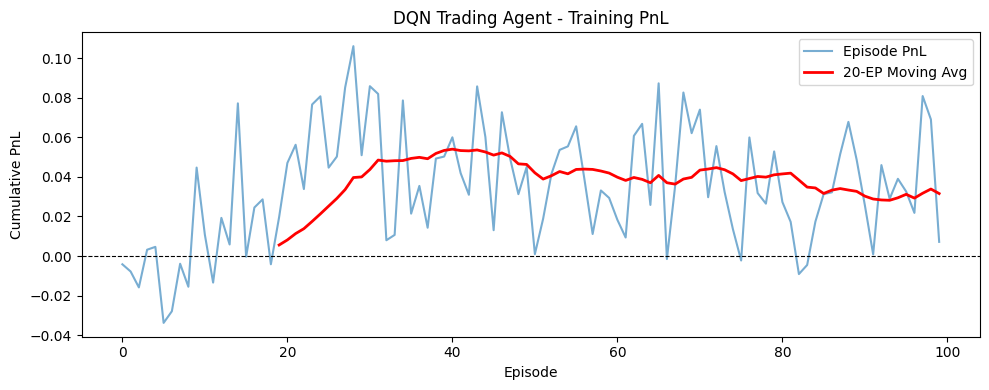
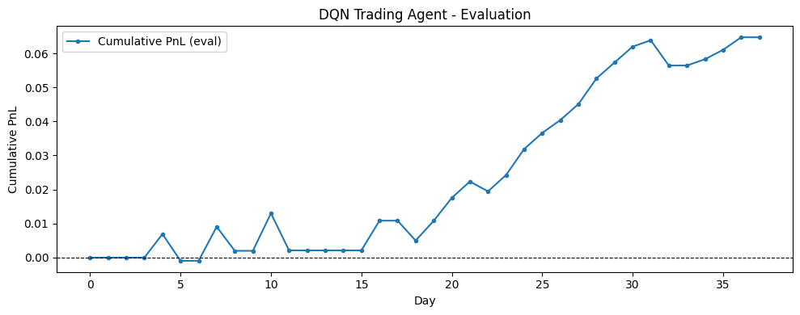

# Day84_PostgreSQL 기초 · DQN 주식 트레이딩

## 📅 2026-06-10

---
# 🐘 PostgreSQL 개념 노트

---

## 1. PostgreSQL이란?

오픈소스 관계형 데이터베이스 관리 시스템(RDBMS).  
표준 SQL을 충실히 따르며 데이터 안정성·무결성이 강한 것이 특징.  
MySQL/MariaDB/Oracle처럼 테이블 형태로 데이터를 저장하고 SQL로 조회·추가·수정·삭제를 수행한다.

---

## 2. 주요 특징

### 2-1. 표준 SQL 준수

문법이 엄격하다. GROUP BY 사용 시 SELECT의 일반 컬럼은 반드시 GROUP BY에 포함해야 한다.

```sql
SELECT busernum, AVG(jikwonpay) FROM jikwon GROUP BY busernum;
```

### 2-2. 데이터 무결성

강력한 제약조건 지원:

|제약조건|설명|
|---|---|
|PRIMARY KEY|기본키 — 중복 불가 + NULL 불가|
|NOT NULL|NULL 입력 불가|
|UNIQUE|중복 불가|
|CHECK|조건 검사|
|FOREIGN KEY|다른 테이블 참조|

```sql
CREATE TABLE jikwon (
    jikwonno   INT PRIMARY KEY,
    jikwonname VARCHAR(10) NOT NULL,
    jikwongen  CHAR(1) CHECK (jikwongen IN ('남', '여'))
);
```

### 2-3. 트랜잭션 처리

여러 SQL을 하나의 작업 단위로 묶어 안정적으로 처리.

```sql
BEGIN;
UPDATE jikwon SET jikwonpay = 6000 WHERE jikwonno = 1;
COMMIT;   -- 성공 시 확정
ROLLBACK; -- 실패 시 취소
```

---

## 3. 데이터 분석 관점 장단점

|구분|내용|
|---|---|
|✅ 장점|GROUP BY / JOIN / 윈도우 함수 등 SQL 분석에 강함|
|✅ 장점|대용량 데이터 트랜잭션 안정적 처리|
|✅ 장점|JSONB 타입으로 반정형 데이터 저장·조회 가능|
|✅ 장점|Python(SQLAlchemy/pandas), Tableau, Power BI 등과 연동 용이|
|✅ 장점|PostGIS 확장으로 위치·지도 데이터 분석 가능|
|❌ 단점|GROUP BY, 자료형 등 문법이 MySQL보다 엄격해 초반 오류 잦음|
|❌ 단점|BigQuery, Redshift 등 전용 분산 분석 시스템보다 성능 제한|
|❌ 단점|데이터 증가 시 인덱스·VACUUM 등 튜닝 지식 필요|

---

## 4. MariaDB vs PostgreSQL 주요 문법 차이

|MariaDB|PostgreSQL|설명|
|---|---|---|
|AUTO_INCREMENT|GENERATED BY DEFAULT AS IDENTITY|자동 증가|
|DATETIME|TIMESTAMP|날짜+시간 타입|
|IF(조건, T, F)|CASE WHEN 조건 THEN T ELSE F END|조건 함수|
|NVL()|COALESCE()|NULL 대체|
|DATE_FORMAT()|TO_CHAR()|날짜 포맷|
|LIMIT 5, 3|LIMIT 3 OFFSET 5|페이지네이션|
|DESC 테이블명|\d 테이블명|테이블 구조 확인|

---

## 5. pgvector — 벡터 DB로 활용

PostgreSQL은 기본적으로 관계형 DB지만, **pgvector 확장**을 설치하면 벡터 임베딩 저장 및 유사도 검색이 가능해진다.

### 가능한 것들

- 문서·문장·이미지 임베딩 벡터 저장
- 벡터 유사도 검색 (`<->` 연산자)
- RAG 검색 시스템 구현
- 추천 시스템 / 시맨틱 검색
- 일반 SQL 필터 + 벡터 검색 동시 사용
- LangChain PGVector 벡터스토어 연동 지원

### 기본 사용 예

```sql
CREATE EXTENSION vector;

CREATE TABLE documents (
    id        SERIAL PRIMARY KEY,
    content   TEXT,
    embedding VECTOR(3)
);

-- 유사 문서 검색 (<->: L2 거리 기준 가까운 순)
SELECT content FROM documents
ORDER BY embedding <-> '[0.1, 0.2, 0.25]'
LIMIT 3;

-- SQL 조건 + 벡터 검색 동시 사용
SELECT title, content FROM documents
WHERE category = 'DB'
ORDER BY embedding <-> '[0.1, 0.2, 0.25]'
LIMIT 5;
```

### 인덱스

|종류|특징|
|---|---|
|HNSW|정확도↑, 메모리 사용↑|
|IVFFlat|벡터를 리스트로 나눠 후보군 탐색. 데이터 많을 때 유리|

```sql
CREATE INDEX ON documents USING hnsw (embedding vector_l2_ops);
```

### 한계

수십억 건 규모의 초대형 벡터 검색·분산 처리가 필요하면  
**Milvus / Weaviate / Pinecone / Qdrant** 같은 전용 벡터 DB가 더 적합하다.

---

## 6. Python 연동 (psycopg2)

```bash
pip install psycopg2-binary
```

```python
import psycopg2

conn = psycopg2.connect(
    host='localhost',
    port=5432,
    database='testdb',
    user='postgres',
    password='1234'
)

cursor = conn.cursor()
cursor.execute('SELECT no, name, tel, inwon, addr FROM dept')
rows = cursor.fetchall()

for row in rows:
    no, name, tel, inwon, addr = row
    print(f'번호: {no}, 부서명: {name}, 전화: {tel}, 인원: {inwon}, 주소: {addr}')

cursor.close()
conn.close()
```

---

## 7. pgAdmin 4 기본 사용법

### DB 생성

1. Servers → PostgreSQL → Databases 우클릭
2. Create → Database → 이름 입력 → Save

### SQL 실행

1. 생성한 DB 클릭 → Tools → Query Tool
2. 쿼리 입력 후 ▶ 버튼 또는 F5

### 테이블 확인

Databases → testdb → Schemas → public → Tables → 우클릭 → Refresh

---
# 📄 rl8stock_trade.ipynb — DQN · 주식 트레이딩 · PnL

---

## 🧠 개요

단일 종목 일봉 데이터를 기반으로 **롱 / 숏 / 현금** 포지션을 매일 선택하며  
누적 PnL(Profit and Loss)을 최대화하는 DQN 에이전트 실습.

|포지션|코드|의미|
|---|---|---|
|롱(Long)|+1|매수, 내일 오를 거라 베팅|
|현금(Cash)|0|관망, 아무것도 안 함|
|숏(Short)|-1|공매도, 내일 떨어질 거라 베팅|

**일일 PnL** = `r_t × position_{t-1}` (당일 수익률 × 전날 포지션)

> 포지션을 **전날**에 잡고, **당일** 수익률로 보상이 결정되는 구조

---

## 1. 핵심 개념 정리

### 1-1. 일별 수익률 (Return)

$$r_t = \frac{Close_t - Close_{t-1}}{Close_{t-1}}$$

- 종가 기준으로 하루하루 얼마나 오르고 내렸는지를 비율로 나타낸 값
- 예: 100 → 101이면 `r_t = +0.01` (+1%)

### 1-2. PnL (Profit and Loss)

- 수익과 손실의 합계, 즉 총 손익
- **일일 PnL** = `r_t × position_{t-1}`
- **누적 PnL** = 일일 PnL의 합산 → 에이전트가 최대화해야 할 목표

|날짜|수익률 r_t|포지션|일일 PnL|
|---|---|---|---|
|1일|—|0 (초기)|0|
|2일|+1.0%|+1 (롱)|+0.010|
|3일|-2.0%|+1 (롱 유지)|-0.020|
|4일|-1.0%|-1 (숏 전환)|+0.010|

### 1-3. 샤프비율 (Sharpe Ratio)

$$Sharpe = \frac{\text{평균 PnL}}{\text{표준편차}}$$

- **위험 대비 성과** 지표 — 변동성이 클수록 불리
- 평균 수익↑, 변동성↓ → Sharpe↑
- 실제 금융에서 **1.0 이상** = 쓸 만한 전략, **2.0 이상** = 훌륭한 전략

---

## 2. 환경 설계 (TradingEnv)

|항목|내용|
|---|---|
|State|최근 `window`일의 수익률 시퀀스 (기본 5일)|
|Action|0=숏(-1), 1=현금(0), 2=롱(+1)|
|Reward|`r_t × position_{t-1}` (일일 PnL)|
|Done|마지막 날 도달 시 True|

```python
class TradingEnv:
    ACTION_TO_POS = {0: -1, 1: 0, 2: 1}  # action 인덱스 → 실제 포지션 값

    def __init__(self, returns, window=5):
        self.returns   = returns
        self.window    = window     # 상태로 볼 과거 일수 (하이퍼파라미터)
        self.n_actions = 3          # 행동 수: 숏 / 현금 / 롱
        self.state_dim = window     # 상태 차원 = window 크기
        self.reset()

    def reset(self):
        self.t        = self.window  # window만큼 건너뛰고 시작 (초기 상태 확보용)
        self.position = 0            # 초기 포지션 = 현금 (0)
        self.cum_pnl  = 0.0          # 누적 PnL 초기화
        return self._get_state()

    def _get_state(self):
        # 현재 시점(t) 기준 최근 window일의 수익률을 상태로 반환
        return self.returns[self.t - self.window : self.t].copy()

    def step(self, action):
        new_pos = self.ACTION_TO_POS[action]  # 에이전트가 선택한 새 포지션

        # 보상: 오늘 수익률 × 직전 포지션 (포지션은 어제 잡혀 있어야 수익 발생)
        r_t    = self.returns[self.t]
        reward = float(r_t * self.position)

        self.position  = new_pos    # 포지션 업데이트 (다음 스텝에서 사용됨)
        self.cum_pnl  += reward
        self.t        += 1

        done  = (self.t >= len(self.returns))           # 데이터 끝이면 종료
        state = None if done else self._get_state()     # 종료면 None 반환
        return state, reward, done
```

---

## 3. DQN 에이전트

### 3-1. Q-Network 구조

```
Input(5) → Dense(64, relu) → Dense(64, relu) → Dense(3, linear)
```

- 입력: 최근 5일 수익률
- 출력: 3개의 Q값 (숏 / 현금 / 롱 각각의 기대 보상)
- 마지막 레이어는 `linear` — Q값은 음수도 가능하므로 활성화 함수 없음

```python
def build_q_network(state_dim, n_actions):
    model = keras.Sequential([
        layers.Input(shape=(state_dim,)),
        layers.Dense(64, activation='relu'),   # 은닉층 1
        layers.Dense(64, activation='relu'),   # 은닉층 2
        layers.Dense(n_actions, activation='linear')  # 출력: Q값 3개
    ])
    model.compile(optimizer=keras.optimizers.Adam(learning_rate=1e-3), loss='mse')
    return model
```

### 3-2. 주요 하이퍼파라미터

|파라미터|값|설명|
|---|---|---|
|gamma|0.95|할인율 — 미래 보상을 현재 가치로 얼마나 반영할지|
|epsilon|1.0 → 0.01|탐험율 — 처음엔 랜덤 행동, 점점 학습된 행동으로 전환|
|eps_decay|0.995|매 replay마다 ε에 곱해지는 감소 계수|
|batch_size|32|리플레이 버퍼에서 한 번에 샘플링하는 경험 수|
|memory_size|2000|리플레이 버퍼 최대 크기|

### 3-3. ε-greedy 행동 선택

```python
def act(self, state):
    if random.random() < self.epsilon:
        return random.randrange(self.n_actions)   # 탐험: 랜덤 행동
    q_values = self.q_net.predict(state[np.newaxis], verbose=0)
    return int(np.argmax(q_values[0]))            # 활용: Q값 최대인 행동
```

- `state[np.newaxis]` : (5,) → (1, 5) 로 배치 차원 추가

### 3-4. Experience Replay (경험 리플레이)

```python
def replay(self):
    if len(self.memory) < self.batch_size:
        return  # 버퍼가 batch_size만큼 안 쌓이면 학습 안 함

    batch = random.sample(self.memory, self.batch_size)  # 랜덤 샘플링
    states, actions, rewards, next_states, dones = zip(*batch)

    # 타겟 Q값: r + γ × max Q(s', a')  ← done이면 r만 (미래 없음)
    next_q = self.target_net.predict(next_states, verbose=0)
    targets = rewards + self.gamma * np.max(next_q, axis=1) * (1 - dones)

    # 선택한 action의 Q값만 targets으로 교체, 나머지는 그대로 유지
    q_values = self.q_net.predict(states, verbose=0)
    for i, a in enumerate(actions):
        q_values[i][a] = targets[i]

    self.q_net.fit(states, q_values, epochs=1, verbose=0)

    # replay 후 ε 감소
    if self.epsilon > self.eps_min:
        self.epsilon *= self.eps_decay
```

> **왜 랜덤 샘플링?**  
> 연속된 경험은 시간 상관관계가 높아 학습이 편향됨.  
> 랜덤으로 섞어서 뽑으면 상관관계를 끊고 안정적인 학습이 가능.

### 3-5. Target Network (타겟 네트워크)

```python
def update_target(self):
    # 메인 네트워크의 가중치를 타겟 네트워크에 복사
    self.target_net.set_weights(self.q_net.get_weights())
```

- 타겟 Q값을 계산할 때 메인 네트워크를 그대로 쓰면 **목표가 계속 바뀌어** 학습이 불안정해짐
- 일정 주기(여기선 10 에피소드)마다만 동기화해서 학습 안정화

---

## 4. 학습 루프

```python
WINDOW        = 5    # 상태 윈도우 크기
EPISODES      = 100  # 총 에피소드 수
TARGET_UPDATE = 10   # 타겟 네트워크 업데이트 주기

for ep in range(1, EPISODES + 1):
    state = env.reset()
    done  = False

    while not done:
        action = agent.act(state)                         # ε-greedy로 행동 선택
        next_state, reward, done = env.step(action)       # 환경에서 한 스텝

        # done이면 next_state=None → 더미 배열로 대체 (버퍼 저장용)
        ns = next_state if next_state is not None else np.zeros(env.state_dim)
        agent.remember(state, action, reward, ns, done)   # 경험 저장
        agent.replay()                                    # 미니배치 학습

        if not done:
            state = next_state

    episode_pnls.append(env.cum_pnl)

    # 주기적으로 타겟 네트워크 업데이트
    if ep % TARGET_UPDATE == 0:
        agent.update_target()
```

---

## 5. 평가 (Greedy 실행)

```python
def evaluate(agent, env):
    agent.epsilon = 0.0  # 탐험 완전히 끄기 → 항상 최선의 행동 선택

    while not done:
        action = agent.act(state)           # 순수하게 Q값 최대 행동만 선택
        next_state, reward, done = env.step(action)
        daily_pnls.append(reward)

    # 샤프비율: 평균PnL / 표준편차 (변동성 대비 수익성)
    sharpe = daily_pnls.mean() / (daily_pnls.std() + 1e-8)  # 1e-8: 0 나눔 방지
```

---

## 6. 결과 해석

### Training PnL



- 초반(ep 0~20): 음수 구간 존재 → ε이 높아 랜덤 행동 위주, 아직 학습 안 됨
- 중반(ep 20~50): 이동평균(빨간선)이 상승 → 유효한 전략 학습 시작
- 후반(ep 50~100): 이동평균이 0.04~0.05 수준에서 안정화

### Evaluation PnL



- 누적 PnL이 꾸준히 우상향 → 학습된 에이전트가 수익을 내는 전략을 학습함
- 약 +0.064 (6.4%) 누적 수익 달성
- 중간에 횡보 구간도 있지만 전반적으로 손실 없이 성장

---

## 7. 전체 흐름 요약

```
CSV 로드
  └─ 일별 수익률 계산 (r_t)
        └─ TradingEnv 생성
              └─ DQNAgent 생성
                    └─ 학습 루프 (100 에피소드)
                          ├─ act() : ε-greedy 행동 선택
                          ├─ step() : 환경 스텝, 보상 계산
                          ├─ remember() : 경험 버퍼 저장
                          ├─ replay() : 미니배치 학습 + ε 감소
                          └─ update_target() : 10ep마다 타겟 동기화
                                └─ evaluate() : ε=0 greedy 평가
                                      └─ 누적 PnL, 샤프비율 출력
```