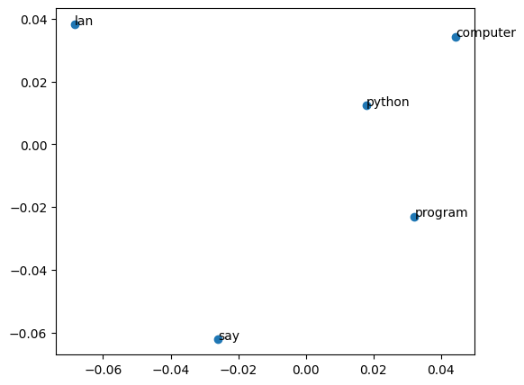
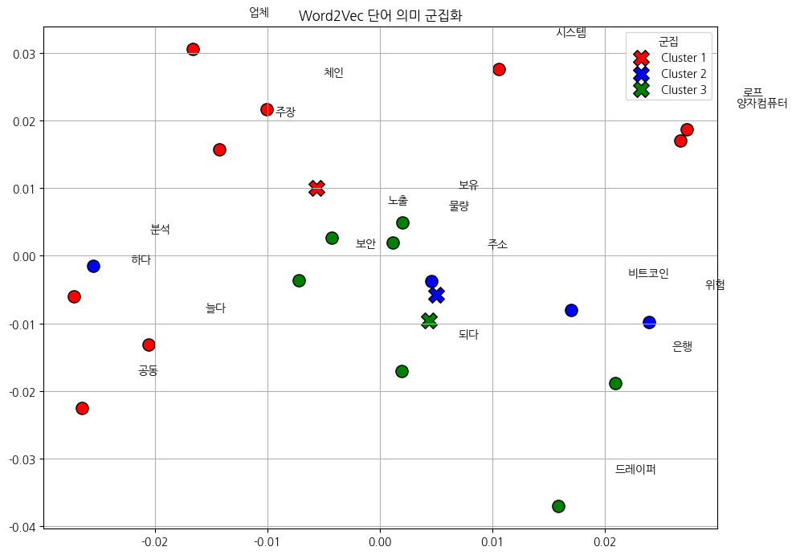
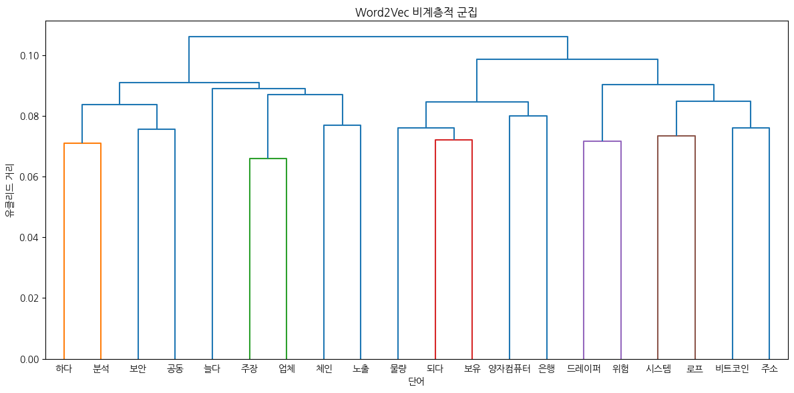

# Day85_NLP벡터화_OneHot·Word2Vec·군집분석

## 📅 2026-06-11

---
# 📄 nlp1_vector.ipynb — OneHotEncoding · Word2Vec · PCA시각화

## 🧠 개념 정리

### 왜 벡터화가 필요한가?

컴퓨터는 문자를 직접 이해하지 못한다. 텍스트를 숫자(벡터)로 변환해야 모델에 입력할 수 있다.

```
'안녕 반가워' → [0,1,0,1,1,0]  (OneHot)
             → [0.12, -0.30, 0.56, 0.23]  (Word2Vec)
```

### 처리 흐름

```
문장 → 단어 분리(토크나이징) → 숫자화(벡터화) → 모델/분석 → 결과 예측
```

### 벡터화 방법 비교

|방법|특징|단점|
|---|---|---|
|OneHot|단어를 0과 1로 표현 (희소벡터)|단어 수 증가 시 차원 폭발, 의미 관계 표현 불가|
|Word2Vec|실수 벡터 (밀집벡터)|학습 데이터 필요|
|CountVectorizer|단어 등장 횟수 기반|빈도만 반영, 의미 없음|
|TfidfVectorizer|빈도 + 문서 희귀도 반영|의미 관계 표현 불가|
|BERT|문맥을 양방향으로 이해|연산량 큼|

---

## 📌 Cell 0 — OneHot Encoding

### 개념

단어 집합의 크기만큼 벡터 차원을 만들고, 해당 단어 위치만 1, 나머지는 0으로 표현하는 **희소벡터(Sparse Vector)** 방식.

```
['computer', 'lan', 'program', 'python', 'say'] 5개 단어
python  → [0, 0, 0, 1, 0]
computer→ [1, 0, 0, 0, 0]
```

**단점**

- 단어 수가 많아질수록 벡터 크기가 커짐
- 대부분의 값이 0 → 메모리 낭비
- 단어 간 의미적 유사도를 표현할 수 없음 (`king`과 `queen`이 관련 없는 것처럼 표현됨)

```python
# 자연어 처리는 숫자화, 벡터화해야 한다~~~~
# '안녕 반가워' : [0,1,0,1,1,0], [0.12, -0.30, 0.56, 0.23] 처럼 변경해서 작업
# 처리의 흐름 : 문장 -> 단어분리 -> 숫자화 -> 모델 또는 분석 -> 결과 예측
# 방법 : OneHot, Word2Vec, CountVectorizer, TfidfVectorizer, BERT, ...

print('OneHot encoding --- 문자를 0과 1로 바꾸는 방법')
datas = ['python','lan','program','computer','say']
sorted_datas = sorted(datas)          # 알파벳 순 정렬 (인덱스 일관성 확보)
print('정렬된 결과 : ', sorted_datas)

manual_labels = list(range(len(sorted_datas)))   # 각 단어에 정수 인덱스 부여
print('인덱싱 : ', manual_labels)

# --- 방법 1: numpy.eye() ---
# np.eye(n) : n x n 단위행렬 생성 → 각 행이 하나의 단어에 대한 OneHot 벡터
print('numpy.eye() 사용')
import numpy as np
onehot_manual = np.eye(len(manual_labels))
print(onehot_manual)

# --- 방법 2: sklearn LabelEncoder + OneHotEncoder ---
# LabelEncoder : 문자열 → 정수 인덱스 변환 (OneHot 전처리 단계)
print('sklearn')
from sklearn.preprocessing import LabelEncoder
encoder = LabelEncoder()
encoded_labels = encoder.fit_transform(datas)    # 알파벳 순 정렬 후 인덱스 부여
print('정렬된 고유 클래스 목록 : ', encoder.classes_)
print('라벨 인코딩 결과 : ', encoded_labels)
# ['computer' 'lan' 'program' 'python' 'say']
# [3 1 2 0 4]
print('디코딩 결과 : ', encoder.inverse_transform(encoded_labels))  # 인덱스 → 원래 단어로 복원

# OneHotEncoder : 정수 인덱스 → OneHot 벡터 변환
# sparse_output=False : 결과를 ndarray로 반환 (기본값은 희소행렬)
print('sklearn.OneHotEncoder 사용')
from sklearn.preprocessing import OneHotEncoder
sorted_datas_2d = np.array(sorted_datas).reshape(-1,1)   # 2D 배열로 변환 (OneHotEncoder 입력 형식)
onehot_encoder = OneHotEncoder(sparse_output=False)       # ndarray 반환
onehot_encoded = onehot_encoder.fit_transform(sorted_datas_2d)
print('OneHotEncoding 결과 : ', onehot_encoded)
decoded_label = onehot_encoder.inverse_transform(onehot_encoded).ravel()  # OneHot → 원래 단어 복원
print('디코딩 결과 : ',decoded_label)

# --- 방법 3: pandas get_dummies() ---
# get_dummies() : DataFrame의 문자열 컬럼을 자동으로 OneHot 인코딩
print('pandas.dataFrame 사용')
import pandas as pd
df = pd.DataFrame({'datas':sorted_datas})
onehot_df = pd.get_dummies(df, dtype=int)
print(onehot_df)
print(np.array(onehot_df, dtype=float))   # DataFrame → numpy float 배열로 변환
```

**출력 결과**

```
OneHot encoding --- 문자를 0과 1로 바꾸는 방법
정렬된 결과 :  ['computer', 'lan', 'program', 'python', 'say']
인덱싱 :  [0, 1, 2, 3, 4]
numpy.eye() 사용
[[1. 0. 0. 0. 0.]
 [0. 1. 0. 0. 0.]
 [0. 0. 1. 0. 0.]
 [0. 0. 0. 1. 0.]
 [0. 0. 0. 0. 1.]]
sklearn
정렬된 고유 클래스 목록 :  ['computer' 'lan' 'program' 'python' 'say']
라벨 인코딩 결과 :  [3 1 2 0 4]
디코딩 결과 :  ['python' 'lan' 'program' 'computer' 'say']
sklearn.OneHotEncoder 사용
OneHotEncoding 결과 :  [[1. 0. 0. 0. 0.]
 [0. 1. 0. 0. 0.]
 [0. 0. 1. 0. 0.]
 [0. 0. 0. 1. 0.]
 [0. 0. 0. 0. 1.]]
디코딩 결과 :  ['computer' 'lan' 'program' 'python' 'say']
pandas.dataFrame 사용
   datas_computer  datas_lan  datas_program  datas_python  datas_say
0               1          0              0             0          0
1               0          1              0             0          0
2               0          0              1             0          0
3               0          0              0             1          0
4               0          0              0             0          1
[[1. 0. 0. 0. 0.]
 [0. 1. 0. 0. 0.]
 [0. 0. 1. 0. 0.]
 [0. 0. 0. 1. 0.]
 [0. 0. 0. 0. 1.]]
```

> 3가지 방법 모두 동일한 단위행렬 형태의 OneHot 벡터를 출력한다.  
> `LabelEncoder` 결과 `[3 1 2 0 4]` → 원본 datas 순서 기준으로 알파벳 정렬 인덱스 부여.

---

## 📌 Cell 1 — Word2Vec

### 개념

OneHot의 단점을 보완한 **밀집벡터(Dense Vector)** 방식.  
함께 자주 등장하는 단어들은 비슷한 의미를 가진다는 아이디어에서 출발.

```
'king'과 'queen'은 자주 같은 문맥에 등장 → 벡터가 유사해짐
```

### 학습 방식 2가지

|방식|설명|적합한 상황|
|---|---|---|
|CBOW (sg=0)|주변 단어들로 중심 단어를 예측|대규모 데이터|
|Skip-Gram (sg=1)|중심 단어로 주변 단어들을 예측|소규모 데이터|

### 주요 파라미터

|파라미터|설명|
|---|---|
|`vector_size`|단어를 몇 차원 벡터로 표현할지|
|`window`|중심 단어 기준 앞뒤로 볼 단어 범위|
|`min_count`|등장 횟수가 이 값 미만인 단어는 학습 제외|
|`sg`|학습 방식 선택 (0=CBOW, 1=Skip-Gram)|

### 코사인 유사도

두 벡터 간의 각도로 유사도를 측정.  
범위 `-1 ~ 1` → 1에 가까울수록 유사, 0은 관련 없음, -1은 반대 의미.

```python
# 밀집벡터(Dense Vector) - 0이 아닌 실수값으로 채워진 저차원 벡터
# 희소벡터(OneHot)는 차원이 단어 수만큼 커지고 대부분 0으로 채워지는 단점이 있음
# Word2Vec : 주어진 문맥을 바탕으로 특정 단어를 예측하여 벡터로 변환
#            코사인 유사도로 단어 간 의미 파악 가능
# !pip install gensim
# sg=0 : CBOW(Continuous Bag Of Words) - 주변 단어들로 중심 단어를 예측
# sg=1 : Skip-Gram - 중심 단어로 주변 단어들을 예측 (소규모 데이터에 유리)
# vector_size : 단어를 몇 차원 벡터로 표현할지
# window : 중심 단어 기준 앞뒤로 볼 단어 범위
# min_count : 등장 횟수가 이 값 미만인 단어는 학습에서 제외
from gensim.models import Word2Vec  # 어떤 단어가 어떤 단어들과 자주 등장하는지를 보고 의미를 학습

sentences = [['king', 'queen', 'man', 'woman'], ['apple', 'banana', 'fruit']]
model = Word2Vec(sentences=sentences, vector_size=10, window=2, min_count=1, sg=1)
print(model.wv)
print(model.wv['king'])                           # king 단어의 임베딩 벡터 (10차원 실수값)
print(model.wv.similarity('king', 'queen'))       # 유사도(두 단어 간 코사인) 계산 결과
print(model.wv.similarity('king', 'man'))         # -1 ~ 1 (1에 근사:의미가 비슷, 0:관련X, -1: 반대의미)
print(model.wv.similarity('apple', 'banana'))     # 같은 문장에 등장 → 유사도 높음
print(model.wv.similarity('apple', 'man'))        # 다른 문장에 등장 → 유사도 낮음

print(model.wv.most_similar('king'))    # king과 가장 유사한 단어 목록 (유사도 상위 10개)
print(model.wv.most_similar('queen'))
```

**출력 결과**

```
KeyedVectors<vector_size=10, 7 keys>
[-0.01577653  0.00321372 -0.0414063  -0.07682689 -0.01508008  0.02469795
 -0.00888027  0.05533662 -0.02742977  0.02260065]
-0.042645365          ← king-queen 유사도 (낮음, 학습 데이터 부족)
0.6143981             ← king-man 유사도 (높음, 같은 문장에 등장)
0.32937223            ← apple-banana 유사도
-0.3207966            ← apple-man 유사도 (낮음, 다른 문장)
[('man', 0.614), ('queen', -0.043), ('apple', -0.089), ...]
[('man', 0.250), ('woman', 0.093), ('king', -0.043), ...]
```

> ⚠️ 학습 데이터가 매우 적어(2문장) 유사도가 직관과 다를 수 있음.  
> 실제 서비스에서는 수십만~수억 문장으로 학습해야 의미 있는 결과가 나온다.

---

## 📌 Cell 2 — 사용자 정의 단어 집합으로 Word2Vec 학습

```python
# key_to_index : 단어 → 인덱스 매핑 딕셔너리 (단어가 몇 번째 벡터인지 확인)
# model.wv[단어] : 해당 단어의 학습된 벡터 반환
sentences2 = [['computer', 'lan', 'program', 'python', 'say']]
model2 = Word2Vec(sentences=sentences2, vector_size=50, window=2, min_count=1, sg=1)
print('인덱스 사전 : ', model2.wv.key_to_index)      # 단어:인덱스 전체 목록
print('keys : ', model2.wv.key_to_index.keys())      # 단어 목록
print('values : ', model2.wv.key_to_index.values())  # 인덱스 목록
print()
vocabs = model2.wv.key_to_index.keys()               # 전체 단어 목록
wordvec_list = [model2.wv[i] for i in vocabs]        # 각 단어의 50차원 벡터 리스트
print(wordvec_list)
```

**출력 결과**

```
인덱스 사전 :  {'say': 0, 'python': 1, 'program': 2, 'lan': 3, 'computer': 4}
keys :  dict_keys(['say', 'python', 'program', 'lan', 'computer'])
values :  dict_values([0, 1, 2, 3, 4])

[array([-1.07e-03,  4.73e-04,  1.02e-02, ...], dtype=float32),  # say 벡터 (50차원)
 array([-1.63e-02,  8.99e-03, ...], dtype=float32),              # python 벡터
 ...]
```

> 각 단어가 50차원 실수 벡터로 표현됨.  
> 인덱스 순서는 학습 빈도 기반으로 자동 결정됨 (가장 자주 등장한 단어가 낮은 인덱스).

---

## 📌 Cell 3 — PCA로 단어 벡터 2D 시각화

### 개념

Word2Vec으로 학습된 벡터는 50차원 → 눈으로 볼 수 없다.  
**PCA(주성분 분석)** 로 2차원으로 축소하여 단어 간 관계를 시각화한다.

**PCA 원리**  
데이터의 분산이 최대가 되는 방향(주성분)을 찾아 차원 축소.  
정보 손실을 최소화하면서 고차원 데이터를 저차원으로 표현.

**시각화 결과 해석**

- 서로 가까운 단어 → 의미적으로 유사 (비슷한 문맥에서 등장)
- 서로 먼 단어 → 의미적으로 차이가 있음



```python
# 고차원 단어 벡터를 2차원으로 축소하여 시각화
# PCA(주성분 분석) : 데이터의 분산이 최대가 되는 축으로 차원 축소
import matplotlib.pyplot as plt

def plotFunc(vocabs, x, y):
    plt.figure(figsize=(6,5))
    plt.scatter(x, y)
    for i, v in enumerate(vocabs):
        plt.annotate(v, xy=(x[i], y[i]))   # 각 점에 단어 이름 표시

# 주성분 분석으로 50차원 → 2차원으로 축소
from sklearn.decomposition import PCA
pca = PCA(n_components=2)
xytrans = pca.fit_transform(wordvec_list)  # (단어 수, 50) → (단어 수, 2)
print(xytrans)
xs = xytrans[:,0]   # PC1 (분산이 가장 큰 축)
ys = xytrans[:,1]   # PC2 (두 번째로 분산이 큰 축)
plotFunc(vocabs, xs, ys)
plt.show()
```

**출력 결과**

```
[[-0.02605113 -0.06197169]   # say
 [ 0.01793008  0.01241817]   # python
 [ 0.03214882 -0.02300758]   # program
 [-0.06832034  0.03828462]   # lan
 [ 0.04429257  0.03427648]]  # computer
```

> 각 단어의 50차원 벡터가 2개의 숫자(x, y)로 압축됨.  
> 이 좌표를 scatter plot으로 찍으면 위 시각화 결과가 나온다.

---

## 📌 Cell 4 — 코사인 유사도 텍스트 시각화

### bar 시각화 원리

유사도 범위가 `-1 ~ 1`이므로 `(s + 1) * 10`으로 `0 ~ 20` 범위로 변환.  
음수 유사도도 bar 길이가 0 이상이 되도록 정규화.

```python
# 코사인 유사도 : 두 벡터 간의 각도로 유사도 측정 (-1 ~ 1, 1에 가까울수록 유사)
# bar 길이 : (유사도 + 1) * 10 → 유사도가 -1~1이므로 0~20 범위로 정규화하여 시각화
# 유사도 순으로 정렬하여 텍스트로 가까운 정도 표현
target = 'python'
sim = {w:model2.wv.similarity(target, w) for w in vocabs if w != target}  # target 제외 전체 유사도 계산
sorted_sim = sorted(sim.items(), key=lambda x:x[1], reverse=True)          # 유사도 내림차순 정렬
print(f'{target} 기준 단어별 코사인 유사도')
for word, s in sorted_sim:
  bar = '▮' * int((s + 1) * 10)          # 유사도를 막대 길이로 변환
  print(f'{word:<10}|{bar:20} ({s:.3f})')  # 단어(10자리) | 막대(20자리) (유사도)
```

**출력 결과**

```
python 기준 단어별 코사인 유사도
computer  |▮▮▮▮▮▮▮▮▮▮▮          (0.125)
say       |▮▮▮▮▮▮▮▮▮▮           (0.042)
program   |▮▮▮▮▮▮▮▮▮▮           (0.011)
lan       |▮▮▮▮▮▮▮▮             (-0.174)
```

> `computer`가 `python`과 가장 유사 → 같은 문장에서 가까운 위치에 등장했기 때문.  
> `lan`은 음수 유사도 → 벡터 방향이 반대 (학습 데이터 부족으로 인한 노이즈).  
> bar 길이: `(0.125+1)*10 = 11개`, `(-0.174+1)*10 = 8개` 로 정규화됨.

---
# 📄 nlp2daum_news.ipynb — 형태소분석 · Word2Vec · KMeans · 덴드로그램

## 🧠 전체 흐름

```
daum 뉴스 텍스트
    ↓
형태소 분석 (Okt) - 명사/동사 추출
    ↓
단어 빈도 분석 (word_freq)
    ↓
Word2Vec 학습 - 단어 벡터화
    ↓
유사도 분석 (most_similar)
    ↓
KMeans 군집화 + PCA 2D 시각화
    ↓
계층적 군집 - 덴드로그램
```

---

## 📌 Cell 0 — 라이브러리 설치

```python
# daum 사이트에서 뉴스정보를 읽어 텍스트 파일로 저장후 유사도 확인
# 형태소 분석, Word2Vec, 유사도 분석 ...
!pip install konlpy              # 한국어 형태소 분석기
!pip install gensim              # Word2Vec 등 텍스트 벡터화 라이브러리
!pip install koreanize_matplotlib  # matplotlib 한글 폰트 자동 설정
```

---

## 📌 Cell 1 — 형태소 분석 및 단어 빈도 분석

### 개념

**형태소 분석(Morphological Analysis)**

- 문장을 의미 있는 최소 단위(형태소)로 분리하는 작업
- 한국어는 조사, 어미 등이 붙어 있어 단순 띄어쓰기로 분리하면 안 됨
- `Okt(Open Korean Text)` : KoNLPy의 한국어 형태소 분석기 중 하나

**품사 태깅(POS Tagging)**

- 각 단어에 품사를 붙이는 작업
- `Noun` : 명사, `Verb` : 동사, `Adjective` : 형용사 등

**단어 빈도 분석**

- 텍스트에서 각 단어가 몇 번 등장하는지 카운트
- 자주 등장하는 단어 = 해당 뉴스에서 중요한 키워드일 가능성 높음

```python
import pandas as pd
from konlpy.tag import Okt
okt = Okt()   # 한국어 형태소 분석기 초기화

# 뉴스 텍스트 파일 읽기 (한 줄씩 리스트로 저장)
with open('daumnews.txt', 'r', encoding='utf-8') as f:
    lines = f.read().splitlines()

# print(lines)

# 명사만 추출하여 단어 빈도 딕셔너리 생성
word_freq = {}
for line in lines:
  # okt.pos() : 각 단어에 품사 태깅
  # tag == 'Noun' : 명사만 필터링
  # len(word) > 1 : 1글자 단어 제외 (의미 없는 단어 제거)
  nouns = [word for word, tag in okt.pos(line) if tag == 'Noun' and len(word) > 1]
  # print(nouns)
  for noun in nouns:
    word_freq[noun] = word_freq.get(noun, 0) + 1   # 등장할 때마다 카운트 +1

print(word_freq)

# 단어 건수별 내림차순 정렬해 DataFrame에 저장
# lambda dul:(-dul[1], dul[0]) : 빈도 내림차순, 같은 빈도면 단어 오름차순
sortData = sorted(word_freq.items(), key=lambda dul:(-dul[1], dul[0]))
print(sortData)
df = pd.DataFrame(sortData, columns=['단어', '빈도수'])
print(df.head(10))   # 180 rows x 2 columns
```

**출력 결과**

```
{'이데일리': 1, '이정훈': 1, '기자': 1, ..., '비트코인': 14, '양자컴퓨터': 7, ...}

      단어  빈도수
0   비트코인   14
1  양자컴퓨터    7
2   드레이퍼    6
3     은행    6
4     보안    4
5     주장    4
6     노출    3
7     물량    3
8     보유    3
9     분석    3
```

> **뉴스 주제** : 팀 드레이퍼(벤처캐피털 투자자)가 "양자컴퓨터는 비트코인보다 은행 시스템을 먼저 위협한다"고 주장한 기사.
> 
> - `비트코인(14)` : 기사 전반에 걸쳐 핵심 소재로 등장
> - `양자컴퓨터(7)` : 비트코인 보안 위협의 주체로 반복 언급
> - `드레이퍼(6)` : 주장의 화자 (팀 드레이퍼)
> - `은행(6)` : 드레이퍼가 비트코인보다 더 취약하다고 지목한 대상
> - `보안(4)`, `주장(4)` : 기사의 논조(보안 논쟁, 주장 대립)를 반영 키워드 빈도만으로도 기사의 핵심 논점을 파악할 수 있음.

---

## 📌 Cell 2 — Word2Vec 학습 및 유사도 분석

### 개념

**stem=True (어간 추출)**

- 동사/형용사의 활용형을 원형으로 통일
- 예) `먹었다`, `먹는다`, `먹고` → `먹다`
- 같은 의미의 단어를 하나로 묶어 학습 품질 향상

**LineSentence**

- 텍스트 파일을 한 줄씩 읽어 단어 리스트로 변환하는 gensim 유틸리티
- 대용량 파일도 메모리 효율적으로 처리 가능

**Word2Vec 파라미터**

|파라미터|값|설명|
|---|---|---|
|`vector_size`|100|단어를 100차원 벡터로 표현|
|`window`|5|중심 단어 기준 앞뒤 5개 단어를 문맥으로 사용|
|`min_count`|1|1번 이상 등장한 단어는 모두 학습|
|`workers`|4|병렬 처리 스레드 수|

**most_similar**

- `positive` : 더할 벡터 (의미를 더하고 싶은 단어)
- `negative` : 뺄 벡터 (의미를 빼고 싶은 단어)
- 예) `양자컴퓨터 + 은행 - 기술` → 금융 관련 단어가 결과로 나올 것으로 기대

```python
# 유사도 확인
# 원본 파일에서 명사, 동사 추출 후 Word2Vec 학습용 파일로 저장
with open('nlp2word_freq.txt', 'w', encoding='utf-8') as fi:
  for line in lines:
    # stem=True : 동사/형용사를 원형으로 통일 (먹었다 → 먹다)
    tokens = okt.pos(line, stem=True)
    # 명사(Noun)와 동사(Verb)만 추출, 1글자 제외
    words = [word for word, tag in tokens if tag in ['Noun', 'Verb'] and len(word) > 1]
    if words:
      fi.write(' '.join(words))   # 한 줄에 단어들을 공백으로 구분하여 저장
      fi.write('\n')

from gensim.models import word2vec

# LineSentence : 텍스트를 한 줄씩 읽어 단어 리스트로 변환 (메모리 효율적)
sentences = word2vec.LineSentence('nlp2word_freq.txt')
print(sentences)

# Word2Vec 모델 학습
model = word2vec.Word2Vec(sentences, vector_size=100, window=5, min_count=1, workers=4)

print('양자컴퓨터 유사한 단어 출력')
print(model.wv.most_similar('양자컴퓨터'))   # 코사인 유사도 상위 10개 단어

print()
# 두 단어의 벡터를 더한 결과에 가장 가까운 단어
# positive : 더할 단어 벡터, negative : 뺄 단어 벡터
print(model.wv.most_similar(positive=['양자컴퓨터', '은행']))              # 양자컴퓨터 + 은행
print(model.wv.most_similar(positive=['양자컴퓨터', '은행'], negative=['기술']))  # 양자컴퓨터 + 은행 - 기술
```

**출력 결과**

```
<gensim.models.word2vec.LineSentence object at 0x7a8d...>

양자컴퓨터 유사한 단어 출력
[('받다', 0.255), ('드레디퍼', 0.223), ('마련', 0.205),
 ('마지막', 0.181), ('시스템', 0.178), ('기존', 0.164),
 ('대응', 0.163), ('충돌', 0.157), ('계정', 0.156), ('사이', 0.152)]

# 양자컴퓨터 + 은행
[('기관', 0.298), ('초기', 0.190), ('드레디퍼', 0.181),
 ('코인', 0.168), ('마지막', 0.164), ('마련', 0.153), ...]

# 양자컴퓨터 + 은행 - 기술
[('기관', 0.216), ('받다', 0.185), ('운영', 0.175),
 ('상당수', 0.171), ('로프', 0.152), ('설령', 0.145), ...]
```

> ⚠️ 학습 데이터가 적어(단일 뉴스 기사) 유사도가 직관과 다를 수 있음.  
> `양자컴퓨터 + 은행`에서 `기관`이 상위에 등장 → 금융기관 맥락이 반영된 결과.  
> 벡터 연산(`positive`, `negative`)으로 단어 간 의미 관계를 탐색할 수 있음.

---

## 📌 Cell 3 — KMeans 군집화 + PCA 2D 시각화

### 개념

**KMeans 군집화(Clustering)**

- 비지도 학습 방법으로 데이터를 K개의 군집으로 분류
- 각 데이터를 가장 가까운 중심점(centroid)에 할당하고, 중심점을 반복적으로 업데이트
- 단어 벡터가 유사한 단어들이 같은 군집으로 묶임
- `n_clusters=3` : 3개 군집으로 분류

**PCA 2D 시각화**

- 100차원 Word2Vec 벡터를 2차원으로 축소하여 산점도로 표현
- 가까운 단어 = 의미적으로 유사
- X표시(marker='X') = 각 군집의 중심점

**시각화 결과 해석**



- **Cluster 1 (빨강)** : 하다, 양자컴퓨터, 주장, 체인, 시스템, 늘다, 공동, 로프, 업체
- **Cluster 2 (파랑)** : 비트코인, 분석, 위험, 주소
- **Cluster 3 (초록)** : 되다, 드레이퍼, 은행, 보안, 물량, 보유, 노출
- X 마커 = 각 군집의 중심점(centroid)

```python
import matplotlib.pyplot as plt
import koreanize_matplotlib        # 한글 폰트 자동 적용
from sklearn.cluster import KMeans
from sklearn.decomposition import PCA
from collections import defaultdict

# Word2Vec에서 벡터 추출 (빈도 상위 20개 단어만 사용)
words = list(model.wv.index_to_key)[:20]          # 학습된 단어 중 상위 20개
filtered_words = [w for w in words if w in model.wv]   # 벡터가 존재하는 단어만 필터링
vectors = [model.wv[w] for w in filtered_words]         # 각 단어의 100차원 벡터

# KMeans 클러스터링
# n_clusters=3 : 3개 군집으로 분류
# random_state=42 : 재현성 확보 (같은 결과가 나오도록 시드 고정)
n_clusters = 3
kmeans = KMeans(n_clusters=n_clusters, random_state=42)
labels = kmeans.fit_predict(vectors)   # 각 단어가 속하는 군집 번호 반환

# PCA로 100차원 → 2차원으로 축소
pca = PCA(n_components=2)
reduced_vectors = pca.fit_transform(vectors)          # 단어 벡터 2D 변환
centers = pca.transform(kmeans.cluster_centers_)      # 군집 중심점도 동일하게 2D 변환

colors = ['red', 'blue', 'green', 'orange', 'purple']

plt.figure(figsize=(10, 7))

# 각 단어를 군집 색상으로 점 찍기
for i, word in enumerate(filtered_words):
    x, y = reduced_vectors[i]
    plt.scatter(x, y, color=colors[labels[i]], s=120, edgecolors='black')
    plt.text(x + 0.005, y + 0.005, word, fontsize=10)   # 점 옆에 단어 이름 표시

# 클러스터 중심점 (X 마커)
for i, (cx, cy) in enumerate(centers):
    plt.scatter(cx, cy, color=colors[i], s=200, marker='X', edgecolor='black', label=f'Cluster {i+1}')

plt.title('Word2Vec 단어 의미 군집화')
plt.legend(title='군집')
plt.grid(True)
plt.tight_layout()
plt.show()

# 군집별 단어 리스트 출력
cluster_words = defaultdict(list)
for word, label in zip(filtered_words, labels):
    cluster_words[label].append(word)

for cid, word_list in cluster_words.items():
    print(f'Cluster {cid+1} 번째 군집 소속 단어: {", ".join(word_list)}')
```

**출력 결과**

```
Cluster 1 번째 군집 소속 단어: 하다, 양자컴퓨터, 주장, 체인, 시스템, 늘다, 공동, 로프, 업체
Cluster 2 번째 군집 소속 단어: 비트코인, 분석, 위험, 주소
Cluster 3 번째 군집 소속 단어: 되다, 드레이퍼, 은행, 보안, 물량, 보유, 노출
```

> **Cluster 1** : 양자컴퓨터·블록체인 기술 맥락 단어들  
> **Cluster 2** : 비트코인 위험성·분석 관련 단어들  
> **Cluster 3** : 드레이퍼(인물)·금융·보안 맥락 단어들  
> → 뉴스 내용이 자동으로 3개의 주제 그룹으로 분류됨.

---

## 📌 Cell 4 — 계층적 군집분석 (덴드로그램)

### 개념

**계층적 군집분석(Hierarchical Clustering)**

- KMeans와 달리 K를 미리 지정하지 않아도 됨
- 데이터 간 거리를 기반으로 가장 가까운 것부터 순차적으로 병합
- 결과를 **덴드로그램(Dendrogram)** 으로 시각화

**Ward 연결법 (method='ward')**

- 군집 내 분산이 최소가 되도록 병합하는 방식
- 가장 자주 사용되는 연결법으로 균일한 크기의 군집 생성

**덴드로그램 읽는 법**

- Y축 = 유클리드 거리 (높을수록 두 군집이 멀리 있음)
- 아래에서 위로 올라갈수록 더 큰 군집으로 병합
- 가로선이 낮은 위치에서 연결 = 두 단어가 의미적으로 유사

**시각화 결과 해석**



- `하다-분석` : 낮은 위치에서 연결 → 뉴스에서 함께 자주 등장
- `되다-보유` : 낮은 위치에서 연결 → 유사한 문맥
- Y축 0.10 이상에서 연결되는 단어쌍 → 의미적으로 거리가 먼 단어

```python
# 계층적 군집분석 - 덴드로그램
# KMeans(비계층적)과 달리 군집 수를 미리 정하지 않아도 됨
# Ward 연결법 : 군집 내 분산이 최소가 되도록 병합 (가장 일반적인 방식)
from scipy.cluster.hierarchy import dendrogram, linkage
import numpy as np

# 각 단어의 100차원 벡터를 numpy 배열로 변환
vectors = np.array([model.wv[word] for word in filtered_words])

# 연결 행렬 생성 : 단어 간 유클리드 거리 기반으로 병합 순서 계산
linkage_matrix = linkage(vectors, method='ward')

plt.figure(figsize=(12, 6))
# dendrogram : 계층적 군집 결과를 트리 구조로 시각화
# labels : x축에 표시할 단어 이름
# leaf_font_size : x축 단어 폰트 크기
dendrogram(linkage_matrix, labels=filtered_words, leaf_font_size=10)
plt.title('Word2Vec 비계층적 군집')   # 실제로는 계층적 군집 (덴드로그램)
plt.xlabel('단어')
plt.ylabel('유클리드 거리')           # Y축 = 두 군집 간 거리 (높을수록 더 다름)
plt.tight_layout()
plt.show()
```

> Cell 4는 그래프만 출력 (텍스트 출력 없음).  
> 덴드로그램은 위 이미지 참고.

---

## 🔑 핵심 개념 요약

|기법|목적|특징|
|---|---|---|
|형태소 분석 (Okt)|텍스트 → 의미 단위 분리|한국어 조사/어미 처리|
|Word2Vec|단어 → 벡터 변환|의미 유사 단어는 벡터도 유사|
|KMeans|벡터 공간에서 단어 군집화|K 미리 지정 필요|
|PCA|고차원 벡터 → 2D 시각화|정보 손실 최소화하며 차원 축소|
|계층적 군집|덴드로그램으로 단어 관계 시각화|K 지정 불필요, 트리 구조|
