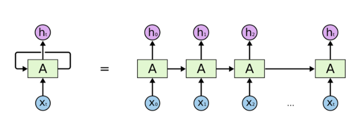

# Day87_NLP 텍스트 벡터화 · RNN 개념

## 📅 2026-06-15

---
# 📄 nlp4count_vec.ipynb — CountVectorizer · TfidfVectorizer · 코사인 유사도

---

## 🧠 실습 개요

쇼핑몰 고객 리뷰 14개를 대상으로 `CountVectorizer`와 `TfidfVectorizer`로 텍스트를 벡터화하고,  
`cosine_similarity`를 활용해 리뷰 유사도 분석, 카테고리 자동 분류, 핵심 키워드 추출까지 수행한다.

---

## 📦 사용 라이브러리

```python
import pandas as pd
from sklearn.feature_extraction.text import CountVectorizer    # 단어 등장 횟수 기반 벡터화
from sklearn.feature_extraction.text import TfidfVectorizer    # 단어 중요도 기반 벡터화
from sklearn.metrics.pairwise import cosine_similarity         # 문서 간 유사도 계산
```

---

## 📋 데이터 준비

```python
reviews = [
    "배송이 빠르고 포장이 깔끔해서 만족했습니다",
    "상품 품질은 좋았지만 가격이 조금 비쌌습니다",
    "주문한 색상과 다른 제품이 도착했습니다",
    "고객센터 응답이 늦어서 불편했습니다",
    "교환 처리가 빠르게 진행되어 만족했습니다",
    "앱에서 결제가 자꾸 실패해서 주문을 못 했습니다",
    "재구매하고 싶을 만큼 제품이 마음에 들었습니다",
    "배송이 지연되어 선물 날짜를 맞추지 못했습니다",
    "환불 처리가 너무 오래 걸려서 불만족스러웠습니다",
    "제품 설명과 실제 상품이 달라서 실망했습니다",
    "쿠폰 적용이 되지 않아 결제 금액이 다르게 나왔습니다",
    "포장이 훼손되어 상품 일부가 파손된 상태로 도착했습니다",
    "고객센터 상담원이 친절하게 문제를 해결해 주었습니다",
    "반품 신청 과정이 복잡해서 이용하기 어려웠습니다",
]

review_df = pd.DataFrame({
    'review_id': range(1, len(reviews) + 1),
    'review_text': reviews
})
print(review_df)
```

---

## 🔢 CountVectorizer 적용

단어가 각 리뷰에 **몇 번 등장했는지** 카운트해서 정수 벡터로 변환.

```python
count_vectorizer = CountVectorizer()
count_matrix = count_vectorizer.fit_transform(review_df['review_text'])
# fit_transform: 어휘집 학습 + 벡터 변환 동시 수행
# print(count_matrix)   # (0, 26)  1 ...  ← 희소 행렬(sparse matrix) 형태

count_words = count_vectorizer.get_feature_names_out()
# 어휘집에서 추출된 단어 목록 반환
# ['가격이' '걸려서' '결제' '결제가' '고객센터' ...]

count_df = pd.DataFrame(count_matrix.toarray(), columns=count_words)
print(count_df.head(3))

# 원본 리뷰와 단어 등장 횟수 DataFrame 합치기
count_result = pd.concat([review_df[["review_id", "review_text"]], count_df], axis=1)
print(count_result)
```

### 결과 해석

```
review_id  review_text                        가격이  걸려서  결제 ...
0     1     배송이 빠르고 포장이 깔끔해서 만족했습니다     0      0     0
1     2     상품 품질은 좋았지만 가격이 조금 비쌌습니다     1      0     0
```

- 각 셀의 값 = 해당 리뷰에서 해당 단어가 등장한 횟수
- 등장하지 않은 단어는 모두 0 → **희소 행렬(Sparse Matrix)**

---

## 📊 TfidfVectorizer 적용

단순 등장 횟수가 아닌, **이 문서에서 얼마나 중요한 단어인지** 가중치를 부여.

```python
tfidf_vectorizer = TfidfVectorizer()
tfidf_matrix = tfidf_vectorizer.fit_transform(review_df['review_text'])
# print(tfidf_matrix)   # (0, 26)  0.4199670161265011 ...  ← 0~1 실수 가중치

# ★ tfidf_vectorizer에서 가져와야 함 (count_vectorizer 아님)
tfidf_words = tfidf_vectorizer.get_feature_names_out()

tfidf_df = pd.DataFrame(tfidf_matrix.toarray(), columns=tfidf_words)
print(tfidf_df.head(3))

tfidf_result_df = pd.concat([review_df[["review_id", "review_text"]], tfidf_df], axis=1)
print(tfidf_result_df)
```

### 결과 해석

```
review_id  review_text                          가격이    걸려서    결제
0     1     배송이 빠르고 포장이 깔끔해서 만족했습니다   0.000   0.000   0.000
1     2     상품 품질은 좋았지만 가격이 조금 비쌌습니다   0.417   0.000   0.000
8     9     환불 처리가 너무 오래 걸려서 불만족스러웠습니다  0.000   0.417   0.000
```

- 값이 클수록 해당 문서에서 그 단어의 중요도가 높음
- 여러 문서에 공통으로 등장하는 단어일수록 IDF가 낮아져 가중치가 줄어듦

---

## 🔄 CountVectorizer vs TfidfVectorizer 비교

```python
# '배송이' 단어 기준으로 두 방식의 값 차이 비교
target_word = '배송이'

if target_word in count_df.columns:
    compare_df = pd.DataFrame({
        "review_id": review_df['review_id'],
        "review_text": review_df['review_text'],
        "Count_Vectorizer": count_df[target_word],           # 정수: 등장 횟수
        "Tfidf_Vectorizer": tfidf_df[target_word].round(3)  # 실수: TF-IDF 가중치
    })
    print(f'{target_word}의 단어 비교 --')
    print(compare_df)
else:
    print(f'{target_word} 단어가 단어 목록에 없어요')
```

|항목|CountVectorizer|TfidfVectorizer|
|---|---|---|
|출력값|정수 (등장 횟수)|실수 (중요도 가중치)|
|공통 단어 처리|많이 나올수록 값이 높아짐|여러 문서에 나오면 패널티|
|활용|빈도 기반 분석|핵심 키워드 추출, 유사도 계산|

> **예시**: '했습니다'는 거의 모든 리뷰에 등장
> 
> - CountVectorizer → 많이 나와서 값이 높음
> - TfidfVectorizer → 모든 문서에 등장하므로 IDF가 낮아져 중요도 낮게 반영됨

---

## 🔍 새 리뷰와 기존 리뷰의 코사인 유사도 분석

새로 들어온 리뷰가 기존 어떤 리뷰와 가장 비슷한지 유사도로 측정.

```python
new_review = "배송이 늦고 포장이 파손되어 불편했습니다"

# 기존 리뷰 + 새 리뷰를 합쳐서 같이 벡터화
# → 같은 어휘 사전(vocabulary)을 공유해야 벡터 비교가 가능
all_reviews = review_df["review_text"].tolist() + [new_review]

similarity_vectorizer = TfidfVectorizer()
similarity_matrix = similarity_vectorizer.fit_transform(all_reviews)
# print(similarity_matrix)   # (0, 27)  0.38965492653614037 ...

new_review_vector = similarity_matrix[-1]    # 새 리뷰 벡터 (마지막 행)

# 새 리뷰 vs 기존 리뷰 전체 코사인 유사도 계산
similarities = cosine_similarity(
    new_review_vector, similarity_matrix[:-1]  # [:-1]: 기존 리뷰들만 (새 리뷰 제외)
)
print(similarities)

similarity_df = pd.DataFrame({
    "review_id": review_df["review_id"],
    "기존리뷰": review_df["review_text"],
    "새리뷰와의 유사도": similarities[0]
})
# 유사도 높은 순으로 정렬
similarity_df = similarity_df.sort_values(by="새리뷰와의 유사도", ascending=False)
print(similarity_df)
```

### 결과 해석

- `cosine_similarity` 결과값 범위: 0.0 ~ 1.0
- 1에 가까울수록 두 리뷰가 유사한 주제를 다루고 있음
- "배송이 늦고 포장이 파손" → "포장이 훼손되어 파손된 상태", "배송이 지연" 리뷰와 높은 유사도

---

## 🗂️ 카테고리 자동 분류

레이블 없이 카테고리 대표 키워드와의 유사도만으로 분류 → **Zero-shot 방식**.

```python
# 각 카테고리를 대표하는 키워드 문장
category_texts = [
    "배송 지연 늦음 도착 포장 파손 훼손",
    "결제 실패 쿠폰 적용 금액 오류 주문 앱",
    "교환 환불 반품 처리 오래 복잡 불편",
    "상품 품질 제품 설명 색상 다름 실망",   # ★ 쉼표 필수 (없으면 다음 문자열과 자동 결합됨)
    "만족 재구매 친절 해결 마음 좋음"
]

category_names = ["배송/포장 문제", "결제/주문 문제", "교환/환불/반품 문제", "상품 품질/정보 문제", "만족도 문제"]

# 리뷰 + 카테고리 대표 문장을 함께 벡터화 (같은 어휘 공간에서 비교)
texts_for_category = review_df['review_text'].tolist() + category_texts

category_vectorizer = TfidfVectorizer()
category_matrix = category_vectorizer.fit_transform(texts_for_category)

# 리뷰 벡터 / 카테고리 벡터 분리
review_vector = category_matrix[:len(review_df)]      # 앞쪽: 실제 리뷰
category_vectors = category_matrix[len(review_df):]   # 뒤쪽: 카테고리 대표 문장

# 각 리뷰 × 각 카테고리 유사도 행렬 (shape: 14 × 5)
category_similarity = cosine_similarity(review_vector, category_vectors)

classification_results = []

for i, review in enumerate(review_df['review_text']):
    best_category_index = category_similarity[i].argmax()   # 유사도 최대인 카테고리 인덱스
    best_score = category_similarity[i][best_category_index]
    classification_results.append({
        'review_id': review_df.loc[i, 'review_id'],
        'review_text': review,
        '분류결과': category_names[best_category_index],
        '유사도': round(best_score, 3)
    })

classification_df = pd.DataFrame(classification_results)
print('리뷰 분류 결과')
print(classification_df)

print('카테고리별 리뷰 갯수 집계')
category_count_df = classification_df['분류결과'].value_counts().reset_index()
category_count_df.columns = ['카테고리', '리뷰갯수']
print(category_count_df)
```

---

## 🔑 리뷰별 핵심 키워드 추출

각 리뷰에서 TF-IDF 점수가 높은 상위 3개 단어를 추출.

```python
def get_top_keywords(row, feature_names, top_n=3):
    """TF-IDF 점수가 높은 상위 n개 키워드를 추출해 문자열로 반환"""
    word_score_list = []
    for word, score in zip(feature_names, row):
        if score > 0:                              # 해당 리뷰에 등장한 단어만 대상
            word_score_list.append((word, score))

    # TF-IDF 점수 높은 순으로 정렬
    word_score_list = sorted(word_score_list, key=lambda x: x[1], reverse=True)

    # 상위 n개 키워드를 문자열로 반환 (예: "배송이, 포장이, 만족")
    top_keywords = [word for word, score in word_score_list[:top_n]]
    return ', '.join(top_keywords)


keyword_results = []

for i in range(tfidf_df.shape[0]):
    keywords = get_top_keywords(
        tfidf_df.iloc[i],    # i번째 리뷰의 TF-IDF 점수 행
        tfidf_words,         # 전체 단어 목록
        top_n=3
    )
    keyword_results.append({
        'review_id': review_df.loc[i, 'review_id'],
        'review_text': review_df.loc[i, 'review_text'],
        '핵심 키워드': keywords    # ★ 띄어쓰기 포함 (merge 시 컬럼명 일치 필요)
    })

keyword_df = pd.DataFrame(keyword_results)
print('리뷰별 핵심 키워드')
print(keyword_df)
```

---

## 📈 전체 단어 중요도 Top 10

```python
# 모든 리뷰에서 단어별 TF-IDF 점수를 합산해 전체 중요도 계산
word_total_scores = tfidf_df.sum(axis=0)  # axis=0: 행(리뷰) 방향으로 합산

top_words_df = pd.DataFrame({
    '단어': word_total_scores.index,
    '전체 중요도': word_total_scores.values
})
top_words_df = top_words_df.sort_values(by='전체 중요도', ascending=False).head(10)
print(top_words_df.round(3))
```

---

## 📝 최종 보고서

```python
# 분류 결과 + 핵심 키워드를 review_id 기준으로 병합
final_report_df = classification_df.merge(
    keyword_df[['review_id', '핵심 키워드']], on='review_id'
)
print(final_report_df)
```

---

## 🐛 오늘 수정한 버그

|위치|버그|수정|
|---|---|---|
|TfidfVectorizer 셀|`count_vectorizer.get_feature_names_out()`|`tfidf_vectorizer.get_feature_names_out()`|
|category_texts|4번째 항목 끝 쉼표 누락 → 문자열 자동 결합|`,` 추가|
|get_top_keywords|`return`문이 2개 (두 번째는 dead code)|두 번째 `return` 삭제|
|최종 보고서|`'핵심키워드'` vs `'핵심 키워드'` 불일치 → KeyError|`'핵심 키워드'`로 통일|

---

# 🌐 RNN 개념 — LSTM · Seq2Seq · Attention · Transformer · BERT

---

## 🧠 딥러닝 기반 NLP 모델 발전 흐름

```
RNN → LSTM → Seq2Seq → Attention → Transformer → GPT-1 → BERT → GPT-3
                   ↑
          고정된 크기의 context vector 사용
                                  ↑
                    입력 시퀀스 전체에서 정보를 추출하는 방향으로 발전
```

> 최신 고성능 모델(GPT, BERT)은 모두 **Transformer 아키텍처** 기반
> 
> - GPT: Transformer의 **디코더(Decoder)** 활용
> - BERT: Transformer의 **인코더(Encoder)** 활용

---

## 1. RNN (Recurrent Neural Network)

### 개념

순서가 있는 데이터(시퀀스)를 처리하기 위한 신경망.  
일반적인 Feed Forward Network와 달리 **내부 메모리(은닉 상태)** 를 가진다.

- 은닉층의 출력값을 출력층으로 보내면서 **동시에 다음 시점의 자신에게도 전달**
- 이 재귀적 구조 덕분에 이전 시점의 정보를 기억할 수 있음



> 왼쪽: 순환 구조를 압축한 표현 / 오른쪽: 시간 축으로 펼친 형태  
> A(셀)가 xₜ를 입력받아 hₜ를 출력하면서, 동시에 다음 셀로 은닉 상태를 전달

### 핵심 용어

|용어|설명|
|---|---|
|**메모리 셀 (Cell)**|은닉층에서 활성화 함수를 통해 결과를 내보내는 노드|
|**은닉 상태 (Hidden State)**|메모리 셀이 다음 시점 또는 출력층으로 보내는 값|
|**time step (t)**|현재 시점. t-1의 은닉 상태가 t의 입력으로 사용됨|

### 은닉 상태 계산 공식

```
hₜ = tanh( Wxh × xₜ + Whh × hₜ₋₁ + b )
```

- `xₜ` : 현재 시점의 입력값
- `hₜ₋₁` : 이전 시점의 은닉 상태
- `Wxh` : 입력 → 은닉 가중치
- `Whh` : 은닉 → 은닉 가중치
- `b` : 편향(bias)
- `tanh` : 활성화 함수 (출력값을 -1 ~ 1 범위로 조정)

### 활용 예시

- **품사 태깅(POS Tagging)**: "I work at google" → work의 위치에 따라 동사/명사 구분
- **감성 분석(Sentiment Analysis)**: "traffic ticket fines" → unhappy / "traffic is fine" → happy
- 시계열 예측, 챗봇, 번역, 음성인식, 이미지 설명 등

### Keras로 구현

```python
from tensorflow.keras.layers import SimpleRNN, LSTM

# 기본 형태
model.add(LSTM(hidden_units))

# input_shape 지정
model.add(LSTM(hidden_units, input_shape=(timesteps, input_dim)))
```

|파라미터|설명|
|---|---|
|`hidden_units`|은닉 상태 크기. 중소형 모델은 보통 128, 256, 512|
|`timesteps`|입력 시퀀스 길이|
|`input_dim`|입력 벡터 크기|

### 입출력 텐서 형태

- **입력**: `(batch_size, timesteps, input_dim)` — 3D 텐서
- **출력 (기본)**: `(batch_size, output_dim)` — 마지막 시점의 은닉 상태만 반환
- **출력 (return_sequences=True)**: `(batch_size, timesteps, output_dim)` — 모든 시점의 은닉 상태 반환

```python
# 모든 시점의 은닉 상태 반환 (다음 RNN 층에 연결하거나 many-to-many 문제에 사용)
model.add(LSTM(units=3, return_sequences=True))
```

### 학습 방식: BPTT

**Back Propagation Through Time** — 시간 축을 따라 역전파를 수행하며 `Wxh`, `Whh`, `b`를 최적화.  
예측값(pred)과 실제값(target)의 차이를 최소화하는 방향으로 학습.

---

## 2. LSTM (Long Short-Term Memory)

### RNN의 한계

시퀀스가 길어질수록 앞의 정보가 뒤로 충분히 전달되지 못함 → **장기 의존성 문제**

|문제|원인|결과|
|---|---|---|
|**Gradient Vanishing**|미분값 < 1이 계속 곱해짐|0에 수렴 → weight 업데이트 안 됨|
|**Gradient Exploding**|미분값 > 1이 계속 곱해짐|값이 폭발적으로 커짐 → 학습 불안정|

### LSTM의 해결책

메모리 셀에 **3개의 게이트**를 추가해 불필요한 기억을 지우고, 중요한 것만 기억.

|게이트|역할|
|---|---|
|**입력 게이트 (Input Gate)**|새로운 정보를 얼마나 기억할지 결정 (sigmoid)|
|**망각 게이트 (Forget Gate)**|이전 정보를 얼마나 지울지 결정 (sigmoid)|
|**출력 게이트 (Output Gate)**|은닉 상태로 얼마나 내보낼지 결정 (sigmoid)|

- RNN의 은닉 상태(hidden state) 외에 **셀 상태(cell state, c)** 를 추가로 관리
- 긴 시퀀스 처리에 탁월한 성능

> **예시**: "John is my best friend ... Jane is his wife ... she knows I am best friend of **John**."  
> LSTM은 멀리 떨어진 John을 she의 참조로 기억할 수 있음

---

## 3. Seq2Seq (Sequence to Sequence)

### 구조

- **인코더(Encoder)**: 입력 시퀀스를 하나의 고정 크기 **Context Vector(v)** 로 압축
- **디코더(Decoder)**: Context Vector를 받아 출력 시퀀스를 생성

### 한계

- 모든 정보를 고정 크기 벡터 하나에 압축 → **정보 손실 (병목 현상)**
- Vanishing Gradient 문제 여전히 존재
- 입력 문장이 길어질수록 번역 품질 저하

---

## 4. Attention

### 개념

Seq2Seq의 병목 문제를 해결하기 위한 메커니즘.  
디코더가 출력 단어를 예측할 때마다 **인코더의 전체 입력 문장을 다시 참고**.  
단, 전체를 동일하게 참고하는 것이 아니라 **현재 예측과 연관된 부분에 더 집중(Attention)**.

### 동작 방식

```
1. Energy 계산: eᵢⱼ = a(sᵢ₋₁, hⱼ)
   → 디코더 이전 상태와 인코더 각 출력 간의 연관도 계산

2. 가중치(Weight) 계산: αᵢⱼ = softmax(eᵢⱼ)
   → 에너지 값을 softmax로 정규화

3. Context vector 계산: cᵢ = Σ αᵢⱼ × hⱼ
   → 가중치를 인코더 hidden state와 곱해서 합산 → 디코더 입력으로 전달
```

---

## 5. Transformer

### 개념

구글이 발표한 모델 (논문명: **"Attention Is All You Need"**).  
RNN/CNN 없이 **Attention만으로** 인코더-디코더를 구현.  
성능이 RNN보다 우수하며, 현재 NLP 모델의 핵심 아키텍처.

### 특징

- RNN의 순차 처리 대신 **병렬 처리** 가능 → 학습 속도 빠름
- 단어 순서 정보는 **Positional Encoding** 으로 보완
    - 각 단어의 임베딩 벡터에 위치 정보를 더해 입력으로 사용
- 인코더 N개 + 디코더 N개 존재 (기본 6개씩)

### 3가지 Attention

|종류|위치|Query / Key / Value|
|---|---|---|
|**Encoder Self-Attention**|인코더|Q = K = V (인코더 벡터)|
|**Masked Decoder Self-Attention**|디코더|Q = K = V (디코더 벡터)|
|**Encoder-Decoder Attention**|디코더|Q: 디코더 / K, V: 인코더|

> Self-Attention: Query, Key, Value의 **출처**가 같은 경우  
> (값이 같다는 뜻이 아님)

---

## 6. BERT

### 개념

**Bidirectional Encoder Representations from Transformers**  
구글이 2018년에 공개한 사전 훈련된 언어 모델.

### 특징

- Transformer의 **인코더**를 쌓아올린 구조
    - BERT-Base: 인코더 12개
    - BERT-Large: 인코더 24개
- 위키피디아(25억 단어) + BooksCorpus(8억 단어)로 사전 훈련
- 레이블 없는 대규모 데이터로 사전 훈련 후, 특정 Task에 맞게 **Fine-tuning**

### Fine-tuning이란?

사전 훈련된 BERT에 레이블이 있는 데이터를 추가 학습시켜 하이퍼파라미터를 재조정하는 과정.  
스팸 분류, 감성 분석, QA 등 다양한 Task에 적용 가능.

---

## 📊 모델 비교 요약

|모델|핵심 아이디어|한계|
|---|---|---|
|**RNN**|은닉 상태로 시퀀스 기억|장기 의존성 문제 (Vanishing Gradient)|
|**LSTM**|게이트로 장기 기억 제어|여전히 고정 크기 context vector|
|**Seq2Seq**|인코더-디코더 구조|정보 병목, 긴 문장 번역 품질 저하|
|**Attention**|매 시점 인코더 전체 참고|RNN 기반 → 병렬 처리 불가|
|**Transformer**|Attention만으로 구현, 병렬 처리|구조 복잡|
|**BERT**|Transformer 인코더 + 사전 훈련|생성 Task에 부적합|
