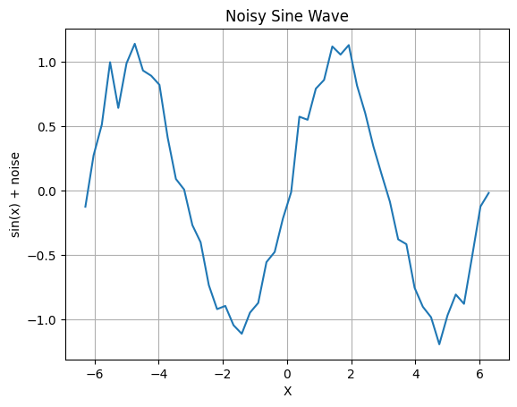
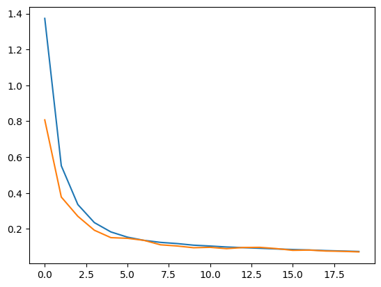
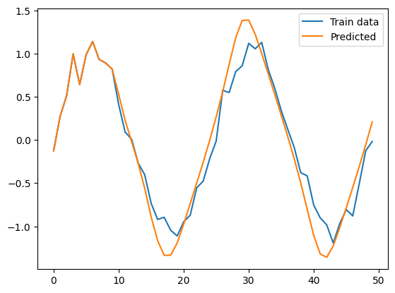

# Day88_RNN · LSTM · 시계열예측 · 텍스트생성

## 📅 2026-06-16

---
# 📄 rnn1.ipynb — RNN · SimpleRNN · 시계열예측

---

## 🧠 핵심 개념

### RNN (Recurrent Neural Network)이란?

일반 신경망은 입력을 독립적으로 처리하지만, RNN은 **순서가 있는 데이터(시계열)**를 다루기 위해 이전 시점의 출력을 다음 시점의 입력으로 함께 사용한다.

```
일반 신경망:  x → [Layer] → y
RNN:         x(t) + h(t-1) → [Layer] → h(t) → y(t)
                                ↑________________|
                               이전 은닉 상태를 다음 시점에 재사용
```

> **핵심:** 과거 정보를 "기억"하면서 현재 입력을 처리 → 주가, 음성, 자연어 등 순서 의존 데이터에 적합

---

### SimpleRNN vs LSTM vs GRU 비교

|모델|특징|단점|
|---|---|---|
|**SimpleRNN**|구조 단순, 이해하기 쉬움|장기 의존성 학습 어려움 (기울기 소실)|
|**LSTM**|셀 상태(Cell State)로 장기 기억 유지|파라미터 많음, 학습 느림|
|**GRU**|LSTM 경량화 버전|LSTM보다 표현력 약간 낮음|

> 실무에서는 **LSTM 또는 GRU**를 주로 사용. SimpleRNN은 교육 목적.

---

### return_sequences 옵션

```
return_sequences=False (기본값)
  입력: [t1, t2, t3, t4, t5]
  출력: [h5]  ← 마지막 시점 결과만

return_sequences=True
  입력: [t1, t2, t3, t4, t5]
  출력: [h1, h2, h3, h4, h5]  ← 각 시점마다 결과 출력
```

이번 실습처럼 **각 시점의 다음 값을 예측**하는 경우 `return_sequences=True` 필요.

---

### RNN 입력 shape

RNN 계열 모델은 반드시 **3D 텐서**를 입력으로 받는다:

```
(samples, time_steps, features)
   ↓          ↓          ↓
 샘플 수   시계열 길이   입력 피처 수
```

예: `(40, 10, 1)` → 40개 샘플, 각 10개 시점, 피처 1개

---

## 💻 코드

### Cell 0 — 노이즈 사인파 데이터 생성

```python
import numpy as np
import matplotlib.pyplot as plt

# -2π ~ 2π 범위에서 50개 등간격 x값 생성
xdata = np.linspace(-2 * np.pi, 2 * np.pi, 50)

# 사인 함수 + 정규분포 노이즈 (표준편차 0.1)
sindata = np.sin(xdata) + 0.1 * np.random.randn(len(xdata))

plt.plot(xdata, sindata)
plt.title("Noisy Sine Wave")
plt.xlabel("X")
plt.ylabel("sin(x) + noise")
plt.grid(True)
plt.show()
```



---

### Cell 1 — 슬라이딩 윈도우로 학습 데이터 생성

```python
n_rnn = 10      # 한 번에 입력할 시계열 길이 (윈도우 크기)
n_sample = len(xdata) - n_rnn   # 50 - 10 = 40개 샘플

x = np.zeros((n_sample, n_rnn))  # 입력 x: (40, 10)
t = np.zeros((n_sample, n_rnn))  # 정답 t: (40, 10)

for i in range(0, n_sample):
    x[i] = sindata[i : i + n_rnn]        # i번째부터 10개
    t[i] = sindata[i + 1 : i + n_rnn + 1]  # 한 칸 뒤로 밀린 값 → 정답

# 슬라이딩 윈도우 예시:
# x[0] = [s0, s1, s2, ..., s9]   t[0] = [s1, s2, ..., s10]
# x[1] = [s1, s2, s3, ..., s10]  t[1] = [s2, s3, ..., s11]

# RNN 입력 형태 (samples, time_steps, features)로 reshape
x = x.reshape(n_sample, n_rnn, 1)   # (40, 10, 1)
t = t.reshape(n_sample, n_rnn, 1)   # (40, 10, 1)
```

> **슬라이딩 윈도우:** 고정 크기 윈도우를 한 칸씩 이동하며 (입력, 정답) 쌍을 생성하는 시계열 데이터 준비 방법

---

### Cell 2 — SimpleRNN 모델 구축

```python
from tensorflow.keras.models import Sequential
from tensorflow.keras.layers import SimpleRNN, Dense

n_in  = 1   # 입력층 뉴런 수 (피처 수)
n_mid = 20  # RNN 은닉층 뉴런 수
n_out = 1   # 출력층 뉴런 수

model = Sequential()

# SimpleRNN: 각 시점(t1~t10)마다 은닉 상태 h를 계산하고 다음 시점으로 전달
# return_sequences=True → 각 시점의 출력을 모두 Dense로 넘겨야 하므로 필수
model.add(SimpleRNN(n_mid, input_shape=(n_rnn, n_in), return_sequences=True))

# 각 시점의 RNN 출력(20차원)을 1개 값으로 압축
model.add(Dense(n_out, activation='linear'))

model.compile(loss='mean_squared_error', optimizer='sgd')
```

모델 구조 요약:

```
Input:      (None, 10, 1)
SimpleRNN:  (None, 10, 20)   ← 각 시점 20차원 은닉 상태
Dense:      (None, 10, 1)    ← 각 시점 예측값 1개
```

---

### Cell 3 — 학습 및 Loss 시각화

```python
history = model.fit(x, t, epochs=20, batch_size=8, validation_split=0.1)

loss = history.history['loss']
val_loss = history.history['val_loss']

plt.plot(np.arange(len(loss)), loss)        # 훈련 손실 (파란색)
plt.plot(np.arange(len(val_loss)), val_loss) # 검증 손실 (주황색)
plt.show()
```



학습 결과: epoch 1에서 loss 1.37로 시작해 epoch 20에서 약 0.1 수준으로 수렴. 훈련/검증 loss 간격이 좁아 과적합 없음.

---

### Cell 4 — 자기회귀 예측 (Auto-regressive Prediction)

```python
# 초기 시드: 첫 번째 샘플의 10개 값으로 시작
pred = x[0].reshape(-1)   # shape: (10,)

# n_sample번 반복하며 예측값을 누적
for i in range(0, n_sample):
    # pred의 마지막 10개를 RNN 입력 형태로 reshape
    yhat = model.predict(pred[-n_rnn:].reshape(1, n_rnn, 1))
    # yhat shape: (1, 10, 1)
    # yhat[0][n_rnn-1][0] → 마지막 시점(t=9)의 예측값 1개만 추출
    pred = np.append(pred, yhat[0][n_rnn - 1][0])

plt.plot(np.arange(len(sindata)), sindata, label='Train data')
plt.plot(np.arange(len(pred)), pred, label='Predicted')
plt.legend()
plt.show()
```



> **자기회귀(Auto-regressive) 예측:** 모델이 생성한 예측값을 다시 입력으로 사용해 연속적으로 미래를 예측하는 방식. 오차가 누적될 수 있음.

---

### Cell 5 — 예측값 vs 실제값 수치 비교

```python
predicted = pred[n_rnn:]   # 앞 10개(시드)를 제외한 예측 부분
actual = sindata[n_rnn:]   # 동일 구간의 실제 값

for i in range(10):
    print(f'{i:02d} - 예측:{predicted[i]:.4f}, 실제:{actual[i]:.4f}')

from sklearn.metrics import mean_squared_error
mse = mean_squared_error(actual, predicted)
print(f'Mse : {mse:.5f}')
```

출력:

```
00 - 예측:0.5300, 실제:0.4129
01 - 예측:0.2282, 실제:0.0914
02 - 예측:-0.0188, 실제:0.0093
03 - 예측:-0.2694, 실제:-0.2670
04 - 예측:-0.5577, 실제:-0.4001
05 - 예측:-0.8902, 실제:-0.7338
06 - 예측:-1.1667, 실제:-0.9198
07 - 예측:-1.3362, 실제:-0.8947
08 - 예측:-1.3336, 실제:-1.0449
09 - 예측:-1.1933, 실제:-1.1111
Mse : 0.05310
```

---

## 📊 결과 분석

- **MSE 0.053** — 노이즈가 포함된 사인파임을 고려하면 준수한 수준
- 그래프에서 Predicted가 Train data의 흐름을 전반적으로 잘 따라감
- 일부 구간(극값 부근)에서 진폭 차이 발생 → 자기회귀 방식의 오차 누적 현상
- epochs=20, SimpleRNN으로도 사인파 패턴 학습 가능함을 확인

---

## 🔑 핵심 정리

|항목|내용|
|---|---|
|RNN 입력 shape|`(samples, time_steps, features)`|
|슬라이딩 윈도우|고정 크기 윈도우를 한 칸씩 밀며 (x, t) 쌍 생성|
|`return_sequences=True`|각 시점마다 출력 → 다음 Dense로 전달 시 필요|
|자기회귀 예측|예측값을 다시 입력으로 사용해 연속 예측|
|LSTM / GRU|SimpleRNN의 장기 의존성 문제를 해결한 발전 모델|

---
# 📄 rnn2.ipynb — LSTM · GRU · EarlyStopping · 수열예측

---

## 🧠 핵심 개념

### LSTM (Long Short-Term Memory)

SimpleRNN의 치명적 약점인 **장기 의존성 문제(기울기 소실)** 를 해결하기 위해 설계된 모델.

```
SimpleRNN: h(t) = tanh(W·x(t) + U·h(t-1) + b)
              ↑ 은닉 상태 하나만 전달 → 시점이 멀어질수록 정보 희석

LSTM:
  Cell State (장기 기억)  ──────────────────────────→  시퀀스 전체를 관통
  Hidden State (단기 기억) ──────────────────────────→  출력에 직접 관여

  3개의 게이트로 정보 흐름 제어:
  ┌─ Forget Gate  : 과거 기억에서 버릴 것 결정
  ├─ Input Gate   : 새 입력 중 기억할 것 결정
  └─ Output Gate  : 최종 출력으로 내보낼 것 결정
```

> Cell State라는 별도 장기 기억 통로 덕분에 수백 시점 전 정보도 유지 가능

---

### GRU (Gated Recurrent Unit)

LSTM을 경량화한 버전. 게이트를 2개(Update Gate, Reset Gate)로 줄여 파라미터 수가 적고 속도가 빠르다.

|비교|SimpleRNN|GRU|LSTM|
|---|---|---|---|
|게이트 수|0|2|3|
|파라미터|적음|중간|많음|
|장기 의존성|❌|✅|✅✅|
|학습 속도|빠름|빠름|느림|

실무 선택 기준: 데이터 적고 빠른 실험 → GRU / 복잡한 시계열 → LSTM

---

### EarlyStopping

과적합 방지 및 불필요한 학습 시간 절약을 위해, 지정한 지표가 개선되지 않으면 학습을 자동 중단하는 콜백.

```python
es = EarlyStopping(
    monitor='loss',    # 감시할 지표 ('loss', 'val_loss', 'accuracy' 등)
    patience=3,        # 개선 없이 허용할 epoch 횟수
    mode='auto'        # 'min'(loss↓) / 'max'(accuracy↑) / 'auto'(자동)
)

# ⚠️ 반드시 fit()의 callbacks에 전달해야 작동!
model.fit(x, y, epochs=1000, callbacks=[es])
```

---

### return_sequences 옵션

이번 rnn2는 `return_sequences=False` (LSTM 기본값) 사용 → **many-to-one** 구조

```
return_sequences=False:
  입력: [t1, t2, t3]
  출력: [h3]  ← 마지막 시점 결과만 → Dense로 값 1개 출력

return_sequences=True (rnn1 방식):
  입력: [t1, t2, t3]
  출력: [h1, h2, h3]  ← 각 시점마다 결과 출력
```

---

## 💻 코드

### Cell 0 — 데이터 준비 및 LSTM 모델 구축

```python
import numpy as np
from tensorflow.keras.models import Sequential
from tensorflow.keras.layers import LSTM, GRU, Dense, Input

# 연속 수열 패턴 데이터 (두 가지 패턴 혼합)
# 패턴1: +1 증가 (1~8 구간)
# 패턴2: +10 증가 (20~70 구간)
x = np.array([[1,2,3], [2,3,4], [3,4,5], [4,5,6], [5,6,7],
              [20,30,40], [30,40,50], [50,60,70]])
y = np.array([4, 5, 6, 7, 8, 50, 60, 70])

# RNN 입력 형태: (samples, time_steps, features)
x = x.reshape((8, 3, 1))   # (8샘플, 시계열3, 피처1)

model = Sequential()
model.add(Input(shape=(3, 1)))           # 명시적 Input 레이어 (time_steps=3, features=1)
model.add(LSTM(10, activation='tanh'))   # LSTM 은닉층, 뉴런 10개
                                         # return_sequences=False(기본) → 마지막 시점 출력만 Dense로
# model.add(LSTM(10, activation='tanh', return_sequences=True))  # 표준 다층 스택 방식
# model.add(GRU(10, activation='tanh', return_sequences=True))   # 경량화 버전

model.add(Dense(16, activation='relu'))  # 은닉 Dense층: LSTM 출력을 비선형 변환
model.add(Dense(1, activation='linear')) # 출력층: 회귀이므로 linear (값 1개 예측)
model.summary()
```

모델 구조:

```
Input:      (None, 3, 1)
LSTM:       (None, 10)     ← return_sequences=False → 2D 출력
Dense(16):  (None, 16)     ← 비선형 특징 추출 (relu)
Dense(1):   (None, 1)      ← 최종 예측값 1개 (linear)
```

> Dense(16, relu) 추가로 LSTM 출력에서 더 복잡한 패턴 학습 가능

---

### Cell 1 — 학습 (EarlyStopping 적용)

```python
model.compile(optimizer='adam', loss='mse')

from tensorflow.keras.callbacks import EarlyStopping

# patience=3: loss가 3 epoch 연속 개선 없으면 학습 중단
es = EarlyStopping(monitor='loss', patience=3, mode='auto')

# callbacks=[es]로 전달 → EarlyStopping 정상 작동
model.fit(x, y, epochs=1000, batch_size=4, verbose=2, callbacks=[es])
```

학습 결과 (일부):

```
Epoch 1/1000  - loss: 354.87
Epoch 50/1000 - loss: 231.86
Epoch 100/1000- loss: 134.88
Epoch 150/1000- loss: 73.93
...  (EarlyStopping 조건 충족 시 자동 종료)
```

> `verbose=2` : 학습 진행을 epoch당 한 줄로 간결하게 출력 (0=무출력, 1=진행바, 2=한줄)

---

### Cell 2 — 예측 및 새 입력으로 추론

```python
# 훈련 데이터 전체로 예측값 확인
print('예측값 : ', model.predict(x).ravel())
print('실제값 : ', y.ravel())

# 학습에 없던 새 시퀀스로 예측
x_input = np.array([25, 35, 45])
x_input = x_input.reshape((1, 3, 1))   # (1샘플, 시계열3, 피처1)로 shape 맞추기

new_pred = model.predict(x_input)
print(new_pred.ravel())
```

출력:

```
예측값:  [4.02  5.01  5.96  6.96  8.01  21.17  21.17  21.17]
실제값:  [4     5     6     7     8     50     60     70   ]

새 입력 [25, 35, 45] 예측: [21.17]
```

---

## 📊 결과 분석

**잘 학습된 구간:** 1~8 패턴 → 예측값이 실제와 거의 일치 (오차 0.05 이내)

**학습 실패 구간:** 20~70 패턴 → 실제 50/60/70인데 모두 약 21.17로 예측

원인:

- 데이터가 총 8개로 너무 적어 패턴 일반화 부족
- 두 패턴(+1, +10) 간 스케일 차이가 매우 큼 → 정규화 없이 학습 시 큰 값 구간 수렴 어려움
- loss MSE 스케일이 크게 나오는 것도 y값(50, 60, 70)이 크기 때문

개선 방법:

```python
from sklearn.preprocessing import MinMaxScaler

scaler = MinMaxScaler()
y_scaled = scaler.fit_transform(y.reshape(-1, 1))  # 0~1로 정규화
# 학습 후 역변환: scaler.inverse_transform(pred)
```

---

## 🔑 핵심 정리

| 항목                       | 내용                                                      |
| ------------------------ | ------------------------------------------------------- |
| LSTM 구조                  | Cell State(장기) + Hidden State(단기) + 3 게이트               |
| GRU                      | LSTM 경량화, 게이트 2개, 속도 ↑                                  |
| `return_sequences=False` | 마지막 시점만 출력 → many-to-one 구조                             |
| Dense(16, relu) 추가       | LSTM 출력에서 비선형 특징 추가 추출                                  |
| EarlyStopping            | `callbacks=[es]` 전달 필수, patience=3이면 3 epoch 개선 없을 때 중단 |
| `verbose=2`              | epoch당 한 줄 출력 (간결한 로그)                                  |
| 새 입력 예측                  | `reshape((1, time_steps, features))` shape 맞추기 필수       |
| MSE loss 높음              | y값이 클수록 MSE도 큼 → MinMaxScaler 정규화 권장                    |

---
# 📄 rnn3.ipynb — LSTM · Embedding · 감성분류 · 이진분류

---

## 🧠 핵심 개념

### 전체 파이프라인

```
텍스트 데이터
    ↓
Tokenizer (단어 → 정수 인덱스)
    ↓
pad_sequences (길이 통일)
    ↓
Embedding (정수 → 실수 벡터)
    ↓
LSTM (시계열 문맥 학습)
    ↓
Dense(sigmoid) (긍정/부정 이진 분류)
```

---

### Tokenizer — 단어를 숫자로

자연어는 그대로 모델에 넣을 수 없으므로 각 단어를 고유 정수로 매핑한다.

```
"너무 재밌네요" → [1, 2]
"최고에요"      → [3]
"글쎄요"        → [16]
```

```python
token = Tokenizer()
token.fit_on_texts(docs)          # 전체 문서로 단어 사전 구축
x = token.texts_to_sequences(docs) # 각 문장을 정수 시퀀스로 변환
```

`token.word_index` → `{'너무': 1, '재밌네요': 2, ...}` 형태의 단어:인덱스 딕셔너리

---

### pad_sequences — 길이 통일

RNN 계열 모델은 배치 내 모든 시퀀스 길이가 같아야 하므로 패딩으로 맞춰준다.

```
원본:  [1, 2]          → 길이 2
패딩:  [0, 0, 0, 1, 2] → 길이 5 (앞에 0 채움)

원본:  [11, 12, 13, 14, 15] → 길이 5
패딩:  [11, 12, 13, 14, 15] → 그대로
```

```python
padded_x = pad_sequences(x, maxlen=5, padding='pre')
# padding='pre'  → 앞에 0 채움 (기본, LSTM에 권장)
# padding='post' → 뒤에 0 채움
```

> `padding='pre'`를 쓰는 이유: LSTM은 마지막 시점의 출력을 분류에 사용하므로, 실제 단어가 뒤쪽에 위치하도록 앞을 0으로 채우는 것이 유리하다.

---

### Embedding — 단어를 실수 벡터로

정수 인덱스를 의미 있는 실수 벡터로 변환하는 레이어. 학습을 통해 단어 간 의미적 유사도를 반영한 벡터를 자동으로 학습한다.

```
정수 인덱스:  [0, 0, 0, 1, 2]
                  ↓ Embedding(23, 8)
실수 벡터:   [[v0], [v0], [v0], [v1], [v2]]
              각 단어 → 8차원 실수 벡터
```

```python
Embedding(input_dim=word_size, output_dim=8)
# input_dim  : 단어 집합 크기 (vocab_size)
# output_dim : 각 단어를 표현할 벡터 차원 수
# 출력 shape : (batch, time_steps, output_dim) = (None, 5, 8)
```

> One-Hot Encoding과의 차이: One-Hot은 sparse하고 단어 간 관계 없음. Embedding은 dense하고 유사한 단어끼리 가까운 벡터를 학습.

---

### 이진 분류 구성

감성 분류(긍정/부정)는 출력이 0 또는 1 → **이진 분류**

```python
Dense(1, activation='sigmoid')   # 출력: 0~1 확률
loss='binary_crossentropy'        # 이진 분류 손실함수
```

예측 시 임계값 0.5 기준으로 클래스 결정:

```python
np.where(model.predict(padded_x) > 0.5, 1, 0)
# 0.5 초과 → 1 (긍정)
# 0.5 이하 → 0 (부정)
```

---

## 💻 코드

### Cell 0 — 데이터 준비 및 토크나이징

```python
import numpy as np
from tensorflow.keras.preprocessing.text import Tokenizer
from tensorflow.keras.utils import pad_sequences

# 영화 리뷰 텍스트 (긍정 5개, 부정 5개)
docs = ['너무 재밌네요', '최고에요', '참 잘 만든 영화에요', '추천하고 싶은 영화입니다', '한 번 더 보고 싶습니다.',
        '글쎄요', '별로네요', '생각보다 지루하네요', '연기가 어색해요', '재미없어요']

# 레이블: 긍정=1, 부정=0
labels = np.array([1, 1, 1, 1, 1, 0, 0, 0, 0, 0])

# 단어 사전 구축
token = Tokenizer()
token.fit_on_texts(docs)    # 전체 문서에서 단어 사전 생성
print(token.word_index)     # {'너무': 1, '재밌네요': 2, ...}

# 각 문장을 정수 시퀀스로 변환
x = token.texts_to_sequences(docs)
print(x)    # [[1,2], [3], [4,5,6,7], ...]

# 패딩으로 시퀀스 길이 통일 (maxlen=5, 앞에 0 채움)
padded_x = pad_sequences(x, maxlen=5, padding='pre')
print('패딩결과:\n', padded_x)
```

출력:

```
{'너무': 1, '재밌네요': 2, ..., '재미없어요': 22}

[[1, 2], [3], [4, 5, 6, 7], [8, 9, 10], [11, 12, 13, 14, 15],
 [16], [17], [18, 19], [20, 21], [22]]

패딩결과:
[[ 0  0  0  1  2]   ← 너무 재밌네요
 [ 0  0  0  0  3]   ← 최고에요
 [ 0  4  5  6  7]   ← 참 잘 만든 영화에요
 [ 0  0  8  9 10]   ← 추천하고 싶은 영화입니다
 [11 12 13 14 15]   ← 한 번 더 보고 싶습니다
 [ 0  0  0  0 16]   ← 글쎄요
 ...               ]
```

---

### Cell 1 — LSTM 모델 구축 및 학습

```python
from tensorflow.keras.models import Sequential
from tensorflow.keras.layers import Embedding, Dense, LSTM, Input, Flatten

word_size = len(token.word_index) + 1   # 단어 집합 크기 + 1 (패딩 인덱스 0 포함)
                                         # 22개 단어 + 1 = 23

model = Sequential()
model.add(Input(shape=(5,)))             # 패딩된 시퀀스 길이 5

# 정수 인덱스 → 8차원 실수 벡터 (의미 있는 표현 학습)
model.add(Embedding(input_dim=word_size, output_dim=8))
# 출력 shape: (None, 5, 8)

# LSTM으로 시계열 문맥 학습
# return_sequences=False(기본) → 마지막 시점 출력만 사용
model.add(LSTM(32, activation='tanh'))
# 출력 shape: (None, 32)

# model.add(Flatten())  # LSTM 출력이 이미 2D → Flatten 불필요

model.add(Dense(32, activation='relu'))   # 비선형 특징 추출
model.add(Dense(1, activation='sigmoid')) # 이진 분류 출력 (0~1 확률)

model.compile(
    optimizer='adam',
    loss='binary_crossentropy',  # 이진 분류 손실함수
    metrics=['accuracy']
)

model.fit(x=padded_x, y=labels, epochs=20, verbose=1)

# 전체 데이터 정확도 평가
print('정확도 : ', model.evaluate(padded_x, labels)[1])

# 0.5 기준으로 긍정(1) / 부정(0) 분류
print('예측 : ', np.where(model.predict(padded_x) > 0.5, 1, 0).ravel())
```

모델 구조:

```
Input:      (None, 5)
Embedding:  (None, 5, 8)   ← 각 단어를 8차원 벡터로
LSTM:       (None, 32)     ← 문맥 학습 후 마지막 시점만
Dense(32):  (None, 32)     ← 비선형 변환
Dense(1):   (None, 1)      ← 긍정/부정 확률
```

---

## 📊 결과 분석

```
실제값: [1, 1, 1, 1, 1, 0, 0, 0, 0, 0]
예측값: [1, 0, 1, 1, 1, 0, 0, 0, 0, 0]
             ↑
        '최고에요' → 긍정인데 부정으로 예측 (오분류 1건)

최종 정확도: 90%
```

**'최고에요' 오분류 원인:**

- 단어 1개짜리 단문 → LSTM이 참고할 문맥 정보가 없음
- 전체 데이터가 10개뿐이라 일반화 부족
- epochs=20에서 loss 0.67로 아직 수렴 미완료

**개선 방법:**

- epochs 늘리기 (100~200 권장)
- 데이터 양 증가
- 사전학습된 한국어 임베딩(KoBERT, FastText 등) 활용

---

## 🔑 핵심 정리

|항목|내용|
|---|---|
|Tokenizer|단어 → 정수 인덱스 매핑, `fit_on_texts` → `texts_to_sequences` 순서|
|`vocab_size = len(word_index) + 1`|패딩 인덱스 0을 위해 +1 필수|
|`pad_sequences(padding='pre')`|앞에 0 채움 → 실제 단어가 뒤쪽에 위치 (LSTM 권장)|
|Embedding|정수 → 실수 벡터, 학습을 통해 단어 유사도 반영|
|LSTM `return_sequences=False`|마지막 시점 출력만 → Dense로 이진 분류|
|`sigmoid` + `binary_crossentropy`|이진 분류(긍정/부정) 조합|
|`np.where(pred > 0.5, 1, 0)`|확률 → 클래스 변환|

---
# 📄 rnn4.ipynb — LSTM · 텍스트생성 · 다항분류 · Embedding

---

## 🧠 핵심 개념

### 전체 파이프라인

```
텍스트 (3개 문장)
    ↓
Tokenizer → 단어를 정수 인덱스로 변환
    ↓
슬라이딩 시퀀스 생성 → [앞 n개 단어, 다음 단어] 쌍 구성
    ↓
pad_sequences → 시퀀스 길이 통일
    ↓
x / y 분리 → 마지막 토큰이 정답(label)
    ↓
to_categorical → y를 원핫벡터로 변환 (다항 분류)
    ↓
Embedding + LSTM + Dense(softmax) → 학습
    ↓
sequence_gen_text() → 시드 단어로 문장 자동 생성
```

---

### 텍스트 생성 원리 (Language Model)

입력된 단어 시퀀스를 보고 **다음에 올 단어**를 확률로 예측하는 모델.

```
입력: [경마장에, 있는, 말이, 뛰고]
출력: [있다] ← vocab 전체에 대한 softmax 확률 중 최댓값
```

학습 데이터를 만드는 방법 — **슬라이딩 윈도우**:

```
문장: [경마장에, 있는, 말이, 뛰고, 있다]

[경마장에, 있는]           → 정답: 말이
[경마장에, 있는, 말이]      → 정답: 뛰고
[경마장에, 있는, 말이, 뛰고] → 정답: 있다
```

각 시퀀스에서 마지막 토큰이 정답(label), 나머지가 입력(feature)

---

### 이진 분류 vs 다항 분류

|구분|이진 분류|다항 분류|
|---|---|---|
|출력 뉴런|1개|vocab_size개|
|활성함수|sigmoid|softmax|
|손실함수|binary_crossentropy|categorical_crossentropy|
|레이블|0 or 1|원핫벡터 (to_categorical)|
|예시|긍정/부정 (rnn3)|다음 단어 예측 (rnn4)|

---

### softmax — 다항 분류 확률 출력

```
출력층 뉴런 수 = vocab_size (단어 집합 크기)
각 뉴런 = 해당 단어가 다음에 올 확률

예: vocab_size=12
[0.01, 0.85, 0.01, 0.02, 0.01, ...]
        ↑
      index=1 ('말이')가 가장 높은 확률 → 다음 단어로 예측
```

```python
# 확률 벡터에서 가장 높은 인덱스 선택
result = np.argmax(model.predict(encoded), axis=-1)
```

---

### 텍스트 생성 방식 (자기회귀)

```
시드: "경마장"
 ↓
1회: "경마장" → 예측: "말이"    → 현재: "경마장 말이"
2회: "경마장 말이" → 예측: "법이다" → 현재: "경마장 말이 법이다"
3회: ...
```

예측값을 다시 입력으로 이어붙이며 연속 생성 → rnn1 사인파 예측과 동일한 자기회귀 방식

---

## 💻 코드

### Cell 0 — 데이터 준비

```python
from tensorflow.keras.preprocessing.sequence import pad_sequences
from tensorflow.keras.preprocessing.text import Tokenizer
from tensorflow.keras.utils import to_categorical
import numpy as np

text = """경마장에 있는 말이 뛰고 있다
그의 말이 법이다
가는 말이 고와야 오는 말이 곱다"""

# Tokenizer: 단어 단위 토큰화 (기본값)
# char_level=True  → 글자 단위
# char_level=False → 단어 단위 (기본값)
tok = Tokenizer()
tok.fit_on_texts([text])                          # 전체 텍스트로 단어 사전 구축
encoded = tok.texts_to_sequences([text])[0]       # 전체 텍스트 → 정수 시퀀스
print(encoded)        # [2, 3, 1, 4, 5, 6, 1, 7, 8, 1, 9, 10, 1, 11]
print(tok.word_index) # {'말이': 1, '경마장에': 2, ...} ← 빈도순 정렬

vocab_size = len(tok.word_index) + 1   # 단어 집합 크기 + 1 (패딩 인덱스 0 포함)
                                        # 11개 단어 + 1 = 12

# 슬라이딩 윈도우로 (입력 시퀀스, 다음 단어) 쌍 생성
sequences = list()
for line in text.split('\n'):                      # 문장 단위로 분리
    enco = tok.texts_to_sequences([line])[0]       # 한 문장 → 정수 시퀀스
    for i in range(1, len(enco)):                  # ⚠️ enco 기준 (encoded 아님)
        sequ = enco[:i+1]                          # 앞에서 i+1개 슬라이싱
        sequences.append(sequ)

# sequences 예시:
# [[2,3], [2,3,1], [2,3,1,4], [2,3,1,4,5],  ← 1번 문장에서 생성
#  [6,1], [6,1,7],                            ← 2번 문장에서 생성
#  [8,1], [8,1,9], [8,1,9,10], [8,1,9,10,1], [8,1,9,10,1,11]]  ← 3번 문장
print('학습에 참여할 샘플 수 : ', len(sequences))  # 11

# 가장 긴 시퀀스 길이 기준으로 패딩 (앞에 0 채움)
max_len = max(len(i) for i in sequences)           # 6
psequences = pad_sequences(sequences, maxlen=max_len, padding='pre')

# x: 마지막 열 제외 → 입력 (feature)
# y: 마지막 열만   → 정답 (label, 다음 단어 인덱스)
x = psequences[:, :-1]   # shape: (11, 5)
y = psequences[:, -1]    # shape: (11,)

# 다항 분류이므로 y를 원핫벡터로 변환
# 예: y=3 → [0, 0, 0, 1, 0, 0, 0, 0, 0, 0, 0, 0]
y = to_categorical(y, num_classes=vocab_size)  # shape: (11, 12)
```

---

### Cell 1 — LSTM 모델 구축 및 학습

```python
from tensorflow.keras.models import Sequential
from tensorflow.keras.layers import Embedding, Dense, LSTM

model = Sequential()

# Embedding: 정수 인덱스 → 32차원 실수 벡터
# input_length는 deprecated → 명시 안 해도 됨
model.add(Embedding(vocab_size, 32, input_length=max_len - 1))
# 출력 shape: (None, 5, 32)

# LSTM: 시계열 문맥 학습 (마지막 시점 출력만 사용)
model.add(LSTM(32, activation='tanh'))
# 출력 shape: (None, 32)

# Dense 은닉층: 비선형 특징 추출
model.add(Dense(32, activation='relu'))
model.add(Dense(16, activation='relu'))

# 출력층: vocab_size개 뉴런 → 각 단어의 확률 (다항 분류)
model.add(Dense(vocab_size, activation='softmax'))

# 다항 분류 설정
model.compile(
    optimizer='adam',
    loss='categorical_crossentropy',  # 원핫 레이블 → categorical_crossentropy
    metrics=['accuracy']
)

model.fit(x, y, epochs=200, verbose=2)
print(model.evaluate(x, y))  # [loss, accuracy]
```

모델 구조:

```
Embedding:  (None, 5, 32)   ← 각 단어를 32차원 벡터로
LSTM:       (None, 32)      ← 문맥 학습
Dense(32):  (None, 32)
Dense(16):  (None, 16)
Dense(12):  (None, 12)      ← vocab_size=12, softmax 확률
```

학습 결과:

```
Epoch 1   - accuracy: 0.00,  loss: 2.49
Epoch 88  - accuracy: 0.64,  loss: 1.22
Epoch 142 - accuracy: 1.00,  loss: 0.31   ← 100% 달성
Epoch 200 - accuracy: 1.00,  loss: 0.046  ← 수렴
```

---

### Cell 2 — 텍스트 자동 생성 함수

```python
def sequence_gen_text(model, t, current_word, n):
    """
    model        : 학습된 LSTM 모델
    t            : 학습에 사용한 Tokenizer
    current_word : 시드(시작) 단어
    n            : 생성할 단어 수
    """
    init_word = current_word
    sentence = ""

    for _ in range(n):
        # 현재까지의 단어 시퀀스 → 정수 인코딩
        encoded = t.texts_to_sequences([current_word])[0]

        # 모델 입력 shape (1, max_len-1)에 맞게 패딩
        encoded = pad_sequences([encoded], maxlen=max_len - 1, padding='pre')

        # softmax 확률 중 가장 높은 인덱스 선택 → 다음 단어 인덱스
        result = np.argmax(model.predict(encoded, verbose=0), axis=-1)

        # 인덱스 → 실제 단어로 역변환
        for word, index in t.word_index.items():
            if index == result:
                break  # 해당 인덱스의 단어를 찾으면 종료

        # 생성된 단어를 현재 시퀀스에 추가 (자기회귀)
        current_word = current_word + ' ' + word
        sentence = sentence + ' ' + word

    return init_word + sentence   # 시드 + 생성 단어 합치기

# 각기 다른 시드로 텍스트 생성
print(sequence_gen_text(model, tok, '경마장', 5))
print(sequence_gen_text(model, tok, '그의', 5))
print(sequence_gen_text(model, tok, '고와야', 5))
```

출력:

```
경마장 말이 법이다 고와야 오는 말이
그의 말이 법이다 뛰고 있다 있다
고와야 말이 고와야 오는 말이 곱다
```

> 학습 데이터에 없는 '경마장' 단어로 시작해도 '말이'를 예측 → 훈련 데이터의 문맥 패턴을 학습했음을 확인

---

## 📊 결과 분석

**학습 성능:** epoch 142에서 accuracy 100%, loss 0.046까지 수렴 (훈련 데이터 완전 암기)

**생성 품질 분석:**

|시드|생성 결과|평가|
|---|---|---|
|경마장|경마장 말이 법이다 고와야 오는 말이|학습 문장 패턴 혼합|
|그의|그의 말이 법이다 뛰고 있다 있다|앞부분 자연스러우나 후반 반복|
|고와야|고와야 말이 고와야 오는 말이 곱다|순환 패턴 발생|

**한계점:**

- 훈련 데이터가 3문장(11샘플)뿐 → 패턴 다양성 부족
- 자기회귀 방식에서 오차 누적 → 반복 패턴 발생
- `t.word_index`를 순회하며 역변환하는 방식은 비효율적 → `{v:k for k, v in t.word_index.items()}` 딕셔너리 역전 방식 권장

---

## 🔑 핵심 정리

|항목|내용|
|---|---|
|슬라이딩 윈도우|각 문장에서 `range(1, len(enco))`로 점진적 시퀀스 생성|
|`vocab_size + 1`|패딩 인덱스 0 자리 확보 필수|
|`to_categorical`|정수 레이블 → 원핫벡터 (다항 분류 필수)|
|`softmax` + `categorical_crossentropy`|다항 분류 조합|
|`np.argmax(pred, axis=-1)`|확률 벡터에서 가장 높은 인덱스 추출|
|자기회귀 생성|예측 단어를 다시 입력으로 이어붙이며 연속 생성|
|역변환 효율화|`{v:k for k,v in word_index.items()}` 로 O(1) 역매핑|
