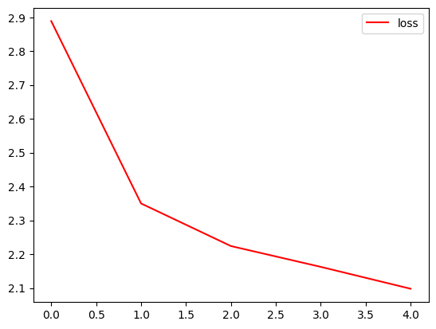

# Day90_RNN텍스트생성_영문LSTM_토지소설_자모분해

## 📅 2026-06-18

---
# 🤖 머신러닝 vs 딥러닝

## 🔑 핵심 차이

|구분|머신러닝|딥러닝|
|---|---|---|
|**특징 추출**|👤 사람이 직접 feature 설계|🧠 모델이 데이터에서 자동 학습|
|**데이터 양**|📉 적어도 잘 작동|📈 많을수록 성능 향상|
|**해석 가능성**|🔍 상대적으로 높음|📦 블랙박스에 가까움|
|**연산 자원**|💡 적게 필요|⚡ GPU 등 고사양 필요|
|**예시 알고리즘**|SVM, Random Forest, XGBoost|CNN, RNN, LSTM, DQN|

---

## 🗂️ 포함 관계

```
AI ⊃ 머신러닝 ⊃ 딥러닝
```

> 딥러닝은 머신러닝의 한 종류 — 신경망(Neural Network)을 깊게 쌓은 것

---

## ⚙️ 동작 방식 비교

**머신러닝**

```
원본 데이터 → [👤 사람이 feature 설계] → 모델 → 예측
```

**딥러닝**

```
원본 데이터 → [🧠 모델이 feature 자동 학습] → 예측
```

---
# 📄 rnn6char.ipynb — 글자단위LSTM · Temperature샘플링 · TopK샘플링

---

## 1. 개념 정리

### 1-1. 글자 단위(Character-level) 언어 모델이란?

|구분|단어 단위|**글자 단위**|
|---|---|---|
|토큰|`"hello"` → 1개 토큰|`"hello"` → 5개 토큰|
|어휘집 크기|수만~수십만|**수십~수백** (영문 43개)|
|장점|문맥 파악 쉬움|OOV 문제 없음, 어휘집 작음|
|단점|OOV(미등록어) 문제|긴 시퀀스 필요|

> 이 노트북에서는 전체 텍스트 2,819글자 → 43종류 문자(어휘집)로 처리

---

### 1-2. 슬라이딩 윈도우(Sliding Window) 시퀀스 생성

```
텍스트 : "hello world..."
seq_length = 10

i=0 : "hello worl" → 'd'   (X → y)
i=1 : "ello world" → ' '
i=2 : "llo world " → 'w'
...
```

- `seq_length = 10` : 이전 10글자를 보고 다음 1글자를 예측
- 총 샘플 수 : `n_chars - seq_length = 2809`개

---

### 1-3. Temperature 샘플링

모델이 반환한 확률 분포를 그대로 쓰지 않고, **온도(τ)** 로 날카롭기를 조절한다.

```
p_scaled = exp( log(p) / τ )  →  재정규화 (합 = 1)
```

|τ 값|효과|비유|
|---|---|---|
|τ < 1 (e.g. 0.5)|확률 분포가 날카로워짐 → 최고 확률 글자 선택 집중|딱딱하고 반복적인 글|
|τ = 1|원래 확률 그대로|기본 샘플링|
|τ > 1 (e.g. 1.5)|확률 분포가 평탄해짐 → 다양한 글자 선택|창의적이지만 횡설수설|

---

### 1-4. Top-K 샘플링

상위 K개 후보만 남기고 나머지는 0으로 마스킹한 뒤 재정규화.

```
전체 43개 후보 중 → 상위 5개만 추출 → 그 안에서 확률 기반 샘플링
```

- 낮은 확률의 이상한 글자가 뽑힐 위험을 방지
- `top_k=5` : 상위 5개 글자 중에서만 선택

---

### 1-5. np.argpartition (부분 정렬)

```python
arr = np.array([7, 2, 9, 4, 1])
idx = np.argpartition(arr, -k)[-k:]   # 상위 k개 인덱스 반환 (순서 무관)
# → [0, 2, 3]  (값: 7, 9, 4)
```

- `np.argsort` : 전체 정렬 O(n log n)
- `np.argpartition` : 부분 정렬 **O(n)** → 상위 k개만 필요할 때 빠름

---

## 2. 전체 파이프라인

```
텍스트 파일 로드
    ↓
소문자 변환 → 문자 집합(chars) 추출 → char↔int 딕셔너리 생성
    ↓
슬라이딩 윈도우로 (X, y) 시퀀스 생성
    ↓
to_categorical()로 원핫 인코딩 → x:(2809, 10, 43), y:(2809, 43)
    ↓
LSTM 모델 학습 (EarlyStopping + ModelCheckpoint)
    ↓
학습 곡선 시각화
    ↓
seed 시퀀스 선택 → 500글자 생성 (Temperature + Top-K 샘플링)
```

---

## 3. 코드 + 주석

### Cell 0 — 라이브러리 임포트 및 시드 설정

```python
import os, sys, random, json
import numpy as np
import matplotlib.pyplot as plt
import tensorflow as tf
from tensorflow.keras.utils import to_categorical
from tensorflow.keras.models import Sequential
from tensorflow.keras.layers import LSTM, Input, Dense, Dropout
from tensorflow.keras.callbacks import EarlyStopping, ModelCheckpoint

# 재현성을 위한 시드 고정 (3곳 모두 설정해야 완전히 고정됨)
tf.random.set_seed(42)   # TensorFlow 내부 연산 시드
np.random.seed(42)       # NumPy 난수 시드
random.seed(42)          # Python 기본 random 시드
```

---

### Cell 1 — 텍스트 로드 및 어휘집 생성

```python
filename = 'rnn6text.txt'
with open(filename, 'r', encoding='utf-8') as f:
    et = f.read().lower()   # 소문자 통일 (A와 a를 같은 문자로 처리)

# 문자 단위 어휘집 생성
chars = sorted(list(set(et)))        # 텍스트에 등장한 고유 문자 목록
char_to_int = {c: i for i, c in enumerate(chars)}   # 문자 → 정수
int_to_char = {i: c for i, c in enumerate(chars)}   # 정수 → 문자 (생성 시 필요)

n_chars = len(et)      # 전체 글자 수
n_vocab = len(chars)   # 어휘 크기

print('전체 글자 수 : ', n_chars)    # 2819
print('전체 어휘 크기 : ', n_vocab)  # 43
```

**출력값**

```
전체 글자 수 :  2819
전체 어휘 크기 :  43
chars : ['\n', ' ', '"', "'", '(', ')', ',', '-', '.', '0', '1', '2', '3',
         '4', '5', '8', 'a', 'b', ..., 'z', '\u2019']
```

---

### Cell 2 — 시퀀스 구성 + 모델 정의 + 학습

```python
# ── 시퀀스 구성 ────────────────────────────────────────────────────────────────
seq_length = 10   # 입력 윈도우 길이: 이전 10글자 → 다음 1글자 예측
dataX, dataY = [], []

for i in range(0, n_chars - seq_length, 1):
    seq_in  = et[i:i + seq_length]        # 입력: 10글자
    seq_out = et[i + seq_length]          # 정답: 다음 1글자
    dataX.append([char_to_int[ch] for ch in seq_in])
    dataY.append(char_to_int[seq_out])

N = len(dataX)   # 전체 학습 샘플 수 = 2809

# ── 원핫 인코딩 ────────────────────────────────────────────────────────────────
# x: (2809, 10, 43)  ← [샘플수, 시퀀스길이, 어휘크기]
# y: (2809, 43)      ← [샘플수, 어휘크기]
x = to_categorical(dataX, num_classes=n_vocab)
y = to_categorical(dataY, num_classes=n_vocab)

# ── 모델 정의 ─────────────────────────────────────────────────────────────────
model = Sequential([
    Input(shape=(seq_length, n_vocab)),     # (10, 43)
    LSTM(128, return_sequences=True),       # 1층 LSTM → 다음 LSTM에 시퀀스 전달
    Dropout(0.2),                           # 과적합 방지
    LSTM(128),                              # 2층 LSTM → 마지막 hidden state만 반환
    Dropout(0.2),
    Dense(n_vocab, activation='softmax')    # 43개 글자 중 다음 글자 확률 출력
])
model.compile(loss='categorical_crossentropy', optimizer='adam', metrics=['accuracy'])

# ── 콜백 설정 ─────────────────────────────────────────────────────────────────
chkpoint_path = 'data_stru/rnn6model.keras'
os.makedirs(os.path.dirname(chkpoint_path), exist_ok=True)

checkpoint = ModelCheckpoint(
    filepath=chkpoint_path,
    monitor='loss',
    verbose=1,
    save_best_only=True    # loss가 개선될 때만 저장
)
early = EarlyStopping(
    monitor='loss',
    patience=10,           # 10 epoch 연속 개선 없으면 중단
    restore_best_weights=True
)

batch_size = min(8, max(1, N//2))   # 데이터 크기에 따라 동적 결정

# ── 학습 ──────────────────────────────────────────────────────────────────────
history = model.fit(x, y, epochs=500, batch_size=batch_size,
                    callbacks=[checkpoint, early])
```

**모델 구조 요약**

|레이어|출력 Shape|파라미터|
|---|---|---|
|LSTM(128, return_sequences=True)|(None, 10, 128)|88,064|
|Dropout(0.2)|(None, 10, 128)|0|
|LSTM(128)|(None, 128)|131,584|
|Dropout(0.2)|(None, 128)|0|
|Dense(43, softmax)|(None, 43)|5,547|
|**Total**||**225,195**|

**학습 결과** : EarlyStopping — 73 epoch에서 조기 종료

- 최종 loss: **0.0791** (Epoch 63 best)
- 최종 accuracy: **약 97.6%**

---

### Cell 3 — 학습 곡선 시각화

```python
fig, loss_ax = plt.subplots()
acc_ax = loss_ax.twinx()   # x축 공유, y축 두 개 (좌: loss, 우: accuracy)

loss_ax.plot(history.history['loss'], 'y', label='train loss')
loss_ax.set_xlabel('epoch')    # ✅ x축 레이블
loss_ax.set_ylabel('loss')     # ✅ 좌측 y축 레이블
loss_ax.legend(loc='lower left')

acc_ax.plot(history.history['accuracy'], 'b', label='train accuracy')
acc_ax.set_ylabel('accuracy')  # ✅ 우측 y축 레이블
acc_ax.legend(loc='lower left')

plt.tight_layout()
plt.show()
```

> **twinx() 주의** : `acc_ax`는 x축을 loss_ax와 공유하므로 `set_xlabel` 불필요, `set_ylabel`만 사용

---

### Cell 4 — Temperature + Top-K 샘플링 함수 및 텍스트 생성

```python
def sample_with_temperatureFunc(probs, temperature=0.8, top_k=5):
    p = np.asarray(probs, dtype=np.float64)

    # ── Top-K 마스킹 ─────────────────────────────────────────────────────────
    if top_k is not None and top_k > 0 and top_k < len(p):
        idx = np.argpartition(p, -top_k)[-top_k:]  # 상위 k개 인덱스 (순서 무관)
        mask = np.zeros_like(p)    # ✅ 소괄호: 함수 호출 (대괄호면 TypeError)
        mask[idx] = p[idx]         # 상위 k개 위치만 원래 확률 유지
        p = mask                   # 나머지는 0 → 후보에서 제외

    # ── Temperature 스케일링 ──────────────────────────────────────────────────
    # log(p) / τ 후 exp → softmax 분포를 τ로 조절
    p = np.log(p + 1e-9) / max(temperature, 1e-8)   # 1e-9: log(0) 방지
    p = np.exp(p)
    p = p / p.sum()   # 재정규화 (합 = 1)

    return int(np.random.choice(len(p), p=p))   # 확률 p에 따라 인덱스 1개 샘플링


# ── np.argpartition 예시 ──────────────────────────────────────────────────────
k = 3
arr = np.array([7, 2, 9, 4, 1])
idx = np.argpartition(arr, -k)[:k]  # 음수: 상위 k개 인덱스 (내림차순 기준)
idx = np.argpartition(arr,  k)[:k]  # 양수: 하위 k개 인덱스 (오름차순 기준)
print(idx)   # [4 1 3]  (값 1, 2, 4 → 하위 3개 인덱스)

# ── 텍스트 생성 ──────────────────────────────────────────────────────────────
start   = np.random.randint(0, N - 1)   # 랜덤 시작 인덱스
pattern = list(dataX[start])            # 시드 시퀀스 (길이 10)

seed_text = ''.join(int_to_char[v] for v in pattern)
print(f'seed : "{seed_text}"')

steps       = 500    # 생성할 글자 수
temperature = 0.8
top_k       = 5
generated   = []

for _ in range(steps):
    x     = to_categorical([pattern], num_classes=n_vocab)  # (1, 10, 43)
    probs = model.predict(x, verbose=0)[0]                  # 다음 글자 확률 (43,)
    idx   = sample_with_temperatureFunc(probs, temperature=temperature, top_k=top_k)
    ch    = int_to_char[idx]
    generated.append(ch)
    pattern.append(idx)    # 시퀀스에 예측 글자 추가
    pattern = pattern[1:]  # 맨 앞 글자 제거 → 슬라이딩 윈도우 유지

gen_text = ''.join(generated)
print(f'generated : "{gen_text}"')
```

**출력값**

```
[4 1 3]
문장 생성하기 ---------
seed : "midfielder"
generated : " posted career highs of six goals and seven assists, earning a move
to paris saint-germain the following summer.
south korea midfielder on ber mexico and korea in the same group, aguirre took over
as head coach of his home country's national team has never beaten parters winglin
opaning the 2022-23 la liga season. the midfielder once again showcased his
playmaking ability against the czech republic last week. his defense-splitting pass
paved the way for hwang in-beom's equalizer as korea rallied"
```

---

## 4. 결과 분석

### 왜 생성 텍스트가 그럴듯해 보이는가?

- 학습 데이터가 **월드컵 관련 뉴스 기사** 한 편이라, 모델이 그 패턴을 거의 암기(overfit)
- `accuracy ≈ 97.6%` → 실제로는 train 데이터 암기에 가까움
- seed `"midfielder"` 뒤에 원문에서 실제로 등장하던 문구를 재현

### 왜 완전히 원문을 재현하지 못하는가?

- **Temperature(0.8)** 와 **Top-K(5)** 가 약간의 무작위성 부여
- `"parters winglin opaning"` 같은 오타/조합 → Top-K 안에서 다른 후보가 선택된 결과

### 이전 실행에서 `"okkkkko"` 반복이 나온 이유

모델이 `np.zeros_like[p]` 오류로 **Top-K 마스킹이 동작하지 않은 상태**에서 실행됐기 때문. 마스킹 없이 Temperature만 적용하면 낮은 τ에서 특정 글자에 확률이 쏠려 반복이 발생한다.

---

## 5. 핵심 개념 요약

|개념|핵심|
|---|---|
|**Char-level LM**|글자 하나하나를 토큰으로 사용, 어휘집이 매우 작음|
|**Sliding Window**|i번째~i+seq_len번째 글자로 i+seq_len+1번째 예측|
|**LSTM stacking**|`return_sequences=True` → 상위 LSTM으로 시퀀스 전달|
|**Temperature**|τ↓ → 보수적(반복), τ↑ → 창의적(횡설수설)|
|**Top-K**|상위 K개 후보만 허용 → 이상한 글자 선택 방지|
|**np.argpartition**|O(n) 부분 정렬, 상위 k개 인덱스만 필요할 때 사용|
|**twinx()**|같은 x축에 y축 두 개 → loss/accuracy 동시 시각화|

---

## 6. 버그 수정 이력 (오늘 발견)

| 위치     | 원래 코드                           | 수정 코드                           | 이유                     |
| ------ | ------------------------------- | ------------------------------- | ---------------------- |
| Cell 0 | `tf.rand.set_seed(42)`          | `tf.random.set_seed(42)`        | `tf.rand` 모듈 없음        |
| Cell 3 | `loss_ax.set_xlabel('loss')`    | `loss_ax.set_ylabel('loss')`    | xlabel 중복 → ylabel로 수정 |
| Cell 3 | `acc_ax.set_xlabel('accuracy')` | `acc_ax.set_ylabel('accuracy')` | twinx이므로 ylabel 사용     |
| Cell 4 | `np.zeros_like[p]`              | `np.zeros_like(p)`              | `[]`는 인덱싱, `()`가 함수 호출 |

---
# 📄 rnn7char_toji.ipynb — 한국어LSTM · Embedding · Temperature샘플링

---

## 1. 개념 정리

### 1-1. 이번 노트의 핵심 변경점: Embedding vs One-Hot

어제(rnn6char)는 입력을 `to_categorical()`로 원핫 인코딩했다.  
오늘은 **Embedding 레이어**를 사용한다. 두 방식의 차이:

|구분|원핫 인코딩|**Embedding**|
|---|---|---|
|표현 방식|`[0,0,1,0,...,0]` (희소 벡터)|`[0.3, -0.1, ..., 0.8]` (밀집 벡터)|
|어휘 크기에 따른 메모리|O(vocab_size)|O(embed_dim)|
|의미 학습|✗ 불가|✅ 유사 문자끼리 가까운 벡터로 학습됨|
|한국어 1551종 적용 시|입력차원 1551 → 매우 큼|입력차원 64로 압축 가능|

> **한국어는 어휘 크기가 크기 때문에 Embedding이 사실상 필수**

---

### 1-2. Embedding 레이어 작동 원리

```
정수 인덱스 →  Embedding 테이블 조회  →  64차원 벡터
    '가' (16)  →  [0.23, -0.11, ..., 0.57]   (64개 값)
    '나' (29)  →  [-0.05, 0.33, ..., -0.12]  (64개 값)
```

- 내부적으로 `(vocab_size × embed_dim)` 크기의 가중치 행렬
- 학습하면서 의미가 비슷한 문자끼리 벡터 공간에서 가까워짐
- `Embedding(1551, 64)` → 파라미터 수: `1551 × 64 = 99,264`

---

### 1-3. step 파라미터 (슬라이딩 간격)

어제는 `step=1` (한 칸씩 이동), 오늘은 `step=10`.

```
텍스트 : "가나다라마바사아자차..."
maxlen = 5, step = 1 → "가나다라마"/"나다라마바"/"다라마바사"... (시퀀스 많음)
maxlen = 5, step = 3 → "가나다라마"/"라마바사아"/"사아자차카"... (시퀀스 적음)
```

|step 값|시퀀스 수|장점|단점|
|---|---|---|---|
|작을수록 (1)|많음|데이터 풍부|메모리↑, 학습 느림|
|클수록 (10)|적음|학습 빠름|데이터↓, 일부 패턴 누락|

이번 노트: `n_chars=625897, maxlen=30, step=10` → 시퀀스 62,587개

---

### 1-4. sparse_categorical_crossentropy vs categorical_crossentropy

|손실함수|정답 형태|사용 조건|
|---|---|---|
|`categorical_crossentropy`|원핫 벡터 `[0,0,1,0,...]`|y를 `to_categorical()`로 변환한 경우|
|**`sparse_categorical_crossentropy`**|정수 인덱스 `2`|**y를 정수 그대로 쓰는 경우**|

오늘은 `y = np.zeros((len(sentences),), dtype=np.int32)` → 정수  
→ `sparse_categorical_crossentropy` 사용

> 내부 계산 결과는 동일, 메모리 사용량만 다름

---

### 1-5. np.random.multinomial을 이용한 샘플링

```python
probas = np.random.multinomial(1, preds, 1)
return np.argmax(probas)
```

- `multinomial(n, pvals, size)` : 확률 분포 `pvals`에서 n번 뽑아 각 결과의 횟수 반환
- `n=1`, `size=1` → 결과는 `[[0, 0, 1, 0, ...]]` 형태 (하나만 1)
- `np.argmax`로 1인 위치의 인덱스를 반환 → 선택된 다음 글자

어제 `np.random.choice(len(p), p=p)`와 동일한 효과, 표현 방식만 다름

---

### 1-6. 텍스트 전처리 — 정규식(re.sub)

```python
text = re.sub('[^가-힣 .,?!]', '', text)  # 한글+공백+구두점 외 모두 제거
text = re.sub(' +', ' ', text)             # 연속 공백 → 단일 공백
```

- `[^...]` : 대괄호 안에 없는 문자들 → 제거
- `가-힣` : 유니코드 상 한글 전체 범위 (가=AC00, 힣=D7A3)
- 숫자, 영문, 특수기호 제거 → 어휘 크기 감소 효과

> 전처리 전: 677,125자 → 전처리 후: **625,897자**, 고유 문자: **1,551종**

---

## 2. 전체 파이프라인

```
URL에서 토지 텍스트 다운로드 (tf.keras.utils.get_file)
    ↓
정규식 전처리 (한글+구두점만 유지, 연속공백 제거)
    ↓
고유 문자 집합 추출 → char↔int 딕셔너리 생성 (1551종)
    ↓
슬라이딩 윈도우 (maxlen=30, step=10) → 시퀀스 62,587개
    ↓
정수 인코딩 x:(62587, 30), y:(62587,)  ← 원핫 아님, 정수 그대로
    ↓
Embedding(1551,64) → LSTM(128) → Dropout(0.2) → Dense(1551, softmax)
    ↓
학습 (EarlyStopping patience=3, epochs=10)
    ↓
시작 문장(30글자) 선택 → Temperature 샘플링으로 1000글자 생성
    ↓
결과 출력 + 파일 저장
```

---

## 3. 코드 + 주석

### Cell 0 — 데이터 로드

```python
import numpy as np
import random
import re
import tensorflow as tf

from tensorflow.keras.models import Sequential, load_model
from tensorflow.keras.layers import Input, Embedding, LSTM, Dense, Dropout
from tensorflow.keras.callbacks import ModelCheckpoint, EarlyStopping

# tf.keras.utils.get_file : URL에서 파일을 다운로드하고 로컬에 캐시
# 같은 파일을 두 번 실행하면 캐시에서 바로 불러옴 (재다운로드 없음)
path = tf.keras.utils.get_file(
    'rnn_test_toji.txt',
    'https://raw.githubusercontent.com/pykwon/etc/master/rnn_test_toji.txt'
)

with open(path, 'r', encoding='utf-8') as f:
    text = f.read()

print('글자 수 : ', len(text))              # 677125
print('행 수 : ', len(text.splitlines()))   # 18560
print(text[:300])
```

**출력값**

```
글자 수 :  677125
행 수 :  18560
제 1 편 어둠의 발소리
1897년의 한가위.
까치들이 울타리 안 감나무에 와서 아침 인사를 하기도 전에...
```

---

### Cell 1 — 전처리 / 시퀀스 생성 / 모델 정의·학습 / 텍스트 생성

```python
# ── 전처리 ────────────────────────────────────────────────────────────────────
text = re.sub('[^가-힣 .,?!]', '', text)  # 한글, 공백, .,?! 만 남김 (숫자·영문 제거)
text = re.sub(' +', ' ', text)            # 연속 공백 → 단일 공백
text = text.strip()

print('전처리 후 글자 수 : ', len(text))   # 625897
print('전처리 후 행 수 : ', len(text.splitlines()))  # 1  ← 줄바꿈 제거됨

# ── 어휘집 생성 ────────────────────────────────────────────────────────────────
chars = sorted(list(set(text)))  # 텍스트에서 고유 문자를 추출해 정렬
vocab_size = len(chars)          # 1551개
print('사용 가능 문자 수 : ', vocab_size)

char_indices = {char: i for i, char in enumerate(chars)}  # 문자 → 정수
indices_char = {i: char for i, char in enumerate(chars)}  # 정수 → 문자

# ── 시퀀스 생성 (슬라이딩 윈도우) ───────────────────────────────────────────────
maxlen = 30  # 입력 시퀀스 길이: 이전 30글자로 다음 1글자를 예측
step   = 10  # 윈도우 이동 간격: 10칸씩 건너뛰며 시퀀스 생성
sentences  = []  # 입력 시퀀스 (30글자)
next_chars = []  # 정답 글자 (1글자)

for i in range(0, len(text) - maxlen, step):
    sentences.append(text[i:i + maxlen])  # 30글자 입력
    next_chars.append(text[i + maxlen])   # 다음 1글자를 정답으로 저장

print('시퀀스 개수 : ', len(sentences))  # 62587

# ── 정수 인코딩 ────────────────────────────────────────────────────────────────
# 원핫이 아닌 정수 인덱스 그대로 저장 → Embedding 레이어가 내부에서 벡터로 변환
x = np.zeros((len(sentences), maxlen), dtype=np.int32)  # (62587, 30)
y = np.zeros((len(sentences),),        dtype=np.int32)  # (62587,)

for i, sentence in enumerate(sentences):
    for t, char in enumerate(sentence):
        x[i, t] = char_indices[char]      # 각 글자를 정수 인덱스로 변환
    y[i] = char_indices[next_chars[i]]    # 정답 글자도 정수 인덱스로 저장

print('x shape : ', x.shape)  # (62587, 30)
print('y shape : ', y.shape)  # (62587,)

# ── 모델 정의 ─────────────────────────────────────────────────────────────────
model = Sequential()
model.add(Input(shape=(maxlen,)))       # 입력: 정수 30개 (0~1550 범위)
model.add(Embedding(vocab_size, 64))   # 정수 인덱스 → 64차원 밀집 벡터
                                        # 가중치: 1551 × 64 = 99,264
model.add(LSTM(128))                   # 시퀀스 전체를 압축해 128차원 벡터 반환
model.add(Dropout(0.2))                # 과적합 방지
model.add(Dense(vocab_size, activation='softmax'))  # 1551개 글자 중 확률 출력

# sparse_categorical_crossentropy: y가 정수 인덱스일 때 사용
# (y가 원핫이면 categorical_crossentropy 사용)
optimizer = tf.keras.optimizers.RMSprop(learning_rate=0.001)
model.compile(loss='sparse_categorical_crossentropy', optimizer=optimizer)
model.summary()

# ── 학습 ──────────────────────────────────────────────────────────────────────
checkpoint = ModelCheckpoint('best_model.keras', monitor='loss', save_best_only=True)
early_stop = EarlyStopping(monitor='loss', patience=3, restore_best_weights=True)

model.fit(x, y, batch_size=128, epochs=10, callbacks=[checkpoint, early_stop])
model.save('char_rnn_model.keras')  # 학습 완료 후 모델 저장

# ── 샘플링 함수 ────────────────────────────────────────────────────────────────
def sample(preds, temperature=0.5):
    preds = np.asarray(preds).astype('float64')  # 예측 확률을 float64로 변환
    preds = np.log(preds + 1e-8) / temperature   # log 스케일 후 τ로 나눔
                                                  # τ↓ → 분포 날카로움 (보수적)
                                                  # τ↑ → 분포 평탄함 (다양함)
    exp_preds = np.exp(preds)
    preds = exp_preds / np.sum(exp_preds)         # softmax 재정규화

    # multinomial(n=1, pvals, size=1) : 확률 분포에서 1번 샘플링
    # 결과: [[0,0,...,1,...,0]] 형태 → argmax로 선택된 인덱스 반환
    probas = np.random.multinomial(1, preds, 1)
    return np.argmax(probas)

# ── 텍스트 생성 ──────────────────────────────────────────────────────────────
start_index    = random.randint(0, len(text) - maxlen - 1)  # 무작위 시작 위치
seed_text      = text[start_index:start_index + maxlen]     # 시드: 30글자
generated_text = seed_text   # 슬라이딩 윈도우용 버퍼 (항상 30글자 유지)
final_text     = seed_text   # 최종 출력에 누적

print('시작 문장 : ', seed_text)
print('\n생성 시작...\n')

for i in range(1000):  # 1000글자 생성
    sampled = np.zeros((1, maxlen), dtype=np.int32)  # 모델 입력 배열 (1, 30)

    for t, char in enumerate(generated_text):
        sampled[0, t] = char_indices[char]  # 현재 30글자를 정수 인덱스로 변환

    preds      = model.predict(sampled, verbose=0)[0]        # 다음 글자 확률 (1551,)
    next_index = sample(preds, temperature=0.5)              # Temperature 샘플링
    next_char  = indices_char[next_index]                    # 인덱스 → 문자

    generated_text += next_char   # 슬라이딩 버퍼에 추가
    generated_text  = generated_text[1:]  # 맨 앞 제거 → 길이 30 유지
    final_text     += next_char           # 최종 텍스트에 누적
    print(next_char, end='', flush=True)  # 실시간 출력

print('\n\n생성된 텍스트:\n')
print(final_text)

# 결과 파일 저장
with open('generated_text.txt', 'w', encoding='utf-8') as f:
    f.write(final_text)
print('\n텍스트 저장 완료 → generated_text.txt')
```

---

## 4. 모델 구조

|레이어|출력 Shape|파라미터|역할|
|---|---|---|---|
|Input|(None, 30)|0|정수 인덱스 30개 입력|
|Embedding(1551, 64)|(None, 30, 64)|**99,264**|정수 → 64차원 밀집 벡터|
|LSTM(128)|(None, 128)|98,816|시퀀스 패턴 학습|
|Dropout(0.2)|(None, 128)|0|과적합 방지|
|Dense(1551, softmax)|(None, 1551)|**200,079**|다음 글자 확률 출력|
|**Total**||**398,159**|약 1.52 MB|

> Embedding 파라미터 계산: `1551(어휘크기) × 64(임베딩차원) = 99,264` Dense 파라미터 계산: `128(LSTM출력) × 1551 + 1551(bias) = 200,079`

---

## 5. 학습 결과

|Epoch|loss|
|---|---|
|1|4.6229|
|5|4.0635|
|10|**3.8147**|

- EarlyStopping `patience=3` 이 발동되지 않아 10 epoch 전부 학습
- loss 4.6 → 3.8로 감소했으나 여전히 높음 → epoch 부족
- 어휘 크기 1551로 커서 loss가 수렴하려면 훨씬 많은 epoch 필요

---

## 6. 생성 결과 분석

**시작 문장(seed)**

```
지 종대 없더마. 오믄서 눈여겨 밨더마는 가게는 철장하
```

**생성 텍스트 (일부)**

```
고 무 있는다. 형어리를 하고 일을 하고 하는 나 아시 있었다.
그러 마리믄 그러. 그 이라 한 치아지 되는 아니 있는 마는 그 그 달을 지리었다.
```

**결과 평가**

|항목|분석|
|---|---|
|한글 문자 출력|✅ 정상|
|문장 구조|🔶 "그러", "있었다", "아니" 등 반복 패턴|
|자연스러움|🔶 단어 수준 패턴은 학습됐으나 문맥 연결 부족|
|원인|epoch=10으로 부족, 어휘 1551종 → 더 많은 학습 필요|

> 같은 구조라도 epoch를 50~100으로 늘리면 훨씬 자연스러운 문장 생성 가능

---

## 7. rnn6char vs rnn7char 비교

|항목|rnn6char (영문)|rnn7char (한국어 토지)|
|---|---|---|
|데이터|뉴스기사 1편 (2,819자)|토지 소설 (625,897자)|
|어휘 크기|43|1,551|
|입력 인코딩|**원핫** (to_categorical)|**Embedding** (정수 인덱스)|
|손실함수|categorical_crossentropy|**sparse_categorical_crossentropy**|
|seq_length|10|30|
|step|1|10|
|시퀀스 수|2,809|62,587|
|최종 loss|0.08 (과적합 수준)|3.81 (학습 부족)|
|생성 품질|거의 원문 재현|패턴은 학습, 문맥은 부족|

---

## 8. 핵심 개념 요약

| 개념                        | 핵심                                                |
| ------------------------- | ------------------------------------------------- |
| **Embedding**             | 정수 인덱스 → 밀집 벡터. 어휘 클수록 원핫 대비 압도적으로 유리             |
| **step**                  | 슬라이딩 간격. 클수록 시퀀스 적고 학습 빠름. 작을수록 데이터 풍부            |
| **sparse_CE**             | y가 정수일 때 사용. 내부 계산은 categorical_CE와 동일            |
| **multinomial 샘플링**       | 확률 분포에서 1번 뽑기. `np.random.choice(p=p)`와 동일 효과     |
| **Temperature**           | τ=0.5 → 보수적(비교적 안정적). τ=1.0 → 원래 분포. τ>1 → 다양/불안정 |
| **get_file**              | URL 다운로드 + 로컬 캐시. 동일 파일 반복 실행 시 재다운로드 없음          |
| **re.sub('[^가-힣 .,?!]')** | 정규식으로 한글+구두점 외 전부 제거. 어휘 크기 축소                    |

---
# 📄 rnn8grapheme.ipynb — 자소단위LSTM · jamotools · LambdaCallback

---

## 1. 개념 정리

### 1-1. 자소(Grapheme) 단위란?

한국어 텍스트를 어느 단위로 쪼개느냐에 따라 어휘 크기가 크게 달라진다.

|단위|예시 ("안녕")|토큰 수|어휘 크기|
|---|---|---|---|
|음절(글자)|`['안', '녕']`|2|~1,500종 (rnn7)|
|**자소(자모)**|`['ㅇ','ㅏ','ㄴ','ㄴ','ㅕ','ㅇ']`|6|**~179종**|
|단어|`['안녕']`|1|수만 종|

> **자소 단위의 핵심 장점** : 어휘 크기를 1,551 → **179**로 대폭 축소  
> 모델이 더 적은 파라미터로 한국어 구조를 학습 가능

---

### 1-2. 한국어 자모 구조

한글 음절 1개 = 초성 + 중성 + (종성)

```
'닭' → ㄷ(초성) + ㅏ(중성) + ㄱ(종성)
'아'  → ㅇ(초성) + ㅏ(중성)  [종성 없음]
```

jamotools는 이 구조를 인식해 분리/결합한다.  
숫자, 영문, 기호는 그대로 유지 (영향 없음).

---

### 1-3. jamotools

```python
import jamotools

# 분리 (음절 → 자모)
jamotools.split_syllables('안녕')   # 'ㅇㅏㄴㄴㅕㅇ'

# 결합 (자모 → 음절)
jamotools.join_jamos('ㅇㅏㄴㄴㅕㅇ')  # '안녕'
```

- 분리와 결합이 완전히 역변환 가능 (`s == join_jamos(split_syllables(s))` → True)
- 생성된 자모 시퀀스를 마지막에 `join_jamos()`로 사람이 읽을 수 있는 한글로 변환

---

### 1-4. UNK 토큰

```python
vocab.append('UNK')   # Unknown 토큰
```

- 학습 데이터에 없는 문자(희귀 기호, 한자, 이모지 등)를 만났을 때 대체하는 예외 처리용 토큰
- 생성 시 `char2idx.get(c, char2idx['UNK'])` 패턴으로 안전하게 처리

---

### 1-5. tf.data.Dataset 파이프라인

rnn7까지는 NumPy 배열을 직접 `model.fit(x, y, ...)`에 넣었다.  
이번 노트는 `tf.data.Dataset`을 사용한다.

```
text_as_int (정수 배열)
    ↓ from_tensor_slices()   : 원소 하나씩 스트림으로 변환
    ↓ batch(81)              : 81개씩 묶음 (입력 80 + 정답 1)
    ↓ map(split_input_target2): (앞 80개, 마지막 1개) 쌍으로 분리
    ↓ shuffle(5000)          : 버퍼 5000 내에서 무작위 섞기
    ↓ batch(64)              : 미니배치 64개씩 묶기
```

|단계|이유|
|---|---|
|`batch(81)`|seq_length+1 = 81로 입력+정답을 한 묶음으로|
|`drop_remainder=True`|남는 조각 제거 → 배치 크기 일관성 유지|
|`shuffle(BUFFER_SIZE)`|순서 의존성 제거, 일반화 향상|
|`.repeat()`|epochs × steps_per_epoch에 맞춰 무한 반복|

---

### 1-6. steps_per_epoch

```python
examples_per_epoch = len(text_as_int) // seq_length  # 전체 시퀀스 수
steps_per_epoch    = examples_per_epoch // BATCH_SIZE  # 에포크당 배치 수
```

`Dataset.repeat()`를 사용하면 Keras가 언제 에포크를 끊을지 모르기 때문에  
`steps_per_epoch`를 명시적으로 지정해줘야 한다.

---

### 1-7. pad_sequences (생성 시 입력 처리)

생성 루프 초반에는 시드 문장이 `seq_length(80)`보다 짧을 수 있다.

```python
pad_sequences([test_text_X], maxlen=seq_length, padding='pre', value=char2idx['UNK'])
# 부족한 앞부분을 UNK 인덱스로 채움
# padding='pre' : 앞쪽 패딩 (왼쪽 채움)
# padding='post': 뒤쪽 패딩 (오른쪽 채움)
```

---

### 1-8. LambdaCallback — 학습 중 실시간 생성 확인

```python
testmodelcb = tf.keras.callbacks.LambdaCallback(on_epoch_end=testmodel2)
```

- `on_epoch_end` : 에포크가 끝날 때마다 지정 함수 실행
- `testmodel2` 내부에서 `epoch % 5 == 0` 조건으로 5에포크마다만 출력
- 학습이 진행될수록 생성 텍스트 품질이 올라가는 걸 눈으로 확인 가능

---

## 2. 전체 파이프라인

```
URL에서 토지 텍스트 다운로드
    ↓
jamotools.split_syllables() → 자모 시퀀스 변환
    ↓
고유 자모 추출 + UNK 추가 → vocab 179종
    ↓
char2idx / idx2char 딕셔너리 생성
    ↓
text_as_int : 자모 → 정수 변환
    ↓
tf.data.Dataset 파이프라인 구성
  (from_tensor_slices → batch(81) → map(split) → shuffle → batch(64))
    ↓
Embedding(179,100) → LSTM(400) → Dense(179, softmax)
    ↓
학습 (epochs=5, LambdaCallback으로 5에포크마다 생성 출력)
    ↓
임의 시드 문장 → pad_sequences → 500자 생성
    ↓
jamotools.join_jamos() → 한글 음절로 변환 출력
```

---

## 3. 코드 + 주석

### Cell 0 — 라이브러리 설치

```python
!pip install jamotools   # 한글 자모 분리/결합 라이브러리
```

---

### Cell 1 — 데이터 로드 및 자모 분리 확인

```python
import jamotools
import tensorflow as tf
import numpy as np
import sys
from tensorflow.keras.preprocessing.sequence import pad_sequences

# URL에서 파일 다운로드 후 로컬에 캐시 (재실행 시 재다운로드 없음)
path_to_file = tf.keras.utils.get_file(
    'toji.txt',
    'https://raw.githubusercontent.com/pykwon/etc/master/rnn_test_toji.txt'
)

# 'rb' : read binary (바이트 단위로 읽기)
# .decode('utf-8') : bytes → str 변환
# 인코딩 문제 없이 안전하게 UTF-8 파일을 읽는 관용적 패턴
train_text = open(path_to_file, 'rb').read().decode(encoding='utf-8')

s = train_text[:100]
print('s:', s)
```

**출력값**

```
s: 제 1 편 어둠의 발소리
1897년의 한가위.
까치들이 울타리 안 감나무에 와서 아침 인사를 하기도 전에, 무색 옷에 댕기꼬리를 늘인
아이들은 송편을 입에 물고 마을길을 쏘
```

---

### Cell 2 — 자모 분리 테스트 및 어휘 생성

```python
# split_syllables : 한글 음절을 초성·중성·종성으로 분리
# 숫자·영문·기호는 그대로 유지
s_split = jamotools.split_syllables(s)
print('s_split:', s_split)
# → ㅈㅔ 1 ㅍㅕㄴ ㅇㅓㄷㅜㅁㅇㅢ ㅂㅏㄹㅅㅗㄹㅣ...

# join_jamos : 자모 → 음절 역변환 (분리 전과 완전히 동일한 문자열 복원)
s2 = jamotools.join_jamos(s_split)
print('s2:', s2)
print(s == s2)   # True → 가역 변환 확인

# 전체 텍스트를 자모 단위로 분리
train_text_X = jamotools.split_syllables(train_text)

# 자모 사전(vocabulary) 생성
# 전체 자모 문자열에서 고유 문자 집합을 뽑아 정렬
vocab = sorted(set(train_text_X))
```

**출력값**

```
s_split: ㅈㅔ 1 ㅍㅕㄴ ㅇㅓㄷㅜㅁㅇㅢ ㅂㅏㄹㅅㅗㄹㅣ
         1897ㄴㅕㄴㅇㅢ ㅎㅏㄴㄱㅏㅇㅟ.
True
```

---

### Cell 3 — 전체 파이프라인 (전처리 / 모델 / 학습 / 생성)

```python
# ── UNK 토큰 추가 ─────────────────────────────────────────────────────────────
# 학습 데이터에 없는 희귀 문자(한자, 특수기호 등)를 만났을 때 대체하는 예외 처리 토큰
vocab.append('UNK')
print('{} unique characters'.format(len(vocab)))   # 179

# ── 문자 ↔ 정수 매핑 ──────────────────────────────────────────────────────────
char2idx = {u: i for i, u in enumerate(vocab)}  # 문자 → 정수 (예: 'ㄱ' → 2)
idx2char  = np.array(vocab)                      # 정수 → 문자 (예: idx2char[2] → 'ㄱ')

# 전체 자모 시퀀스를 정수 배열로 변환
text_as_int = np.array([char2idx[c] for c in train_text_X])
print('index of UNK: {}'.format(char2idx['UNK']))  # 178

# ── tf.data.Dataset 파이프라인 ────────────────────────────────────────────────
seq_length = 80   # 입력 시퀀스 길이 (80개 자모로 다음 1개 예측)

examples_per_epoch = len(text_as_int) // seq_length   # 전체 시퀀스 수

# 정수 배열 → Dataset (원소 하나씩 스트림으로 변환)
char_dataset = tf.data.Dataset.from_tensor_slices(text_as_int)

# seq_length+1 = 81개씩 배치: 앞 80개(입력) + 마지막 1개(정답)
# drop_remainder=True : 나머지 조각 버림 → 배치 크기 일관성 유지
char_dataset = char_dataset.batch(seq_length + 1, drop_remainder=True)

# 데이터 확인
for item in char_dataset.take(1):
    print(idx2char[item.numpy()])  # ['ㅈ' 'ㅔ' ' ' '1' ...]
    print(item.numpy())            # [69 81  2 13 ...]

# (입력 80개, 정답 1개) 쌍으로 분리하는 함수
def split_input_target2(chunk):
    return [chunk[:-1], chunk[-1]]
    # chunk[:-1] : 앞 80개 → 입력
    # chunk[-1]  : 마지막 1개 → 정답

# Dataset의 각 요소에 split 함수 적용
train_dataset = char_dataset.map(split_input_target2)

# 데이터 확인
for x, y in train_dataset.take(1):
    print(idx2char[x.numpy()])  # 입력 80개 자모
    print(idx2char[y.numpy()])  # 정답 1개 자모 (예: 'ㅅ')

BATCH_SIZE     = 64    # 미니배치 크기 (한 번에 64개 시퀀스 처리)
steps_per_epoch = examples_per_epoch // BATCH_SIZE  # 에포크당 배치 수
# steps_per_epoch 명시 이유: Dataset.repeat()를 쓰면 Keras가 에포크 끝을 모름

BUFFER_SIZE = 5000   # shuffle 버퍼: 클수록 잘 섞이지만 메모리 사용↑

# 섞기 + 배치: 학습용 최종 데이터셋 완성
train_dataset = train_dataset.shuffle(BUFFER_SIZE).batch(BATCH_SIZE, drop_remainder=True)

# ── 모델 정의 ─────────────────────────────────────────────────────────────────
total_chars = len(vocab)   # 179

model = tf.keras.Sequential([
    # 자모 정수 인덱스 → 100차원 밀집 벡터
    # 출력 shape: (batch_size, seq_length, 100)
    tf.keras.layers.Embedding(total_chars, 100),

    # 400 유닛 LSTM: 80개 자모 시퀀스의 문맥 패턴 학습
    tf.keras.layers.LSTM(units=400),

    # 179개 자모 각각의 확률 출력 (다음 자모 예측)
    tf.keras.layers.Dense(total_chars, activation='softmax')
])

# sparse_categorical_crossentropy : y가 정수 인덱스 (원핫 아님)
model.compile(optimizer='adam',
              loss='sparse_categorical_crossentropy',
              metrics=['accuracy'])

# ── Temperature 샘플링 함수 ────────────────────────────────────────────────────
def sample(preds, temperature=0.7):
    # temperature=0.7 : 약간 보수적. 낮을수록 반복, 높을수록 다양
    preds = np.asarray(preds).astype('float64')
    preds = np.log(preds + 1e-8) / temperature   # log 스케일 + temperature 조절
    exp_preds = np.exp(preds)
    preds = exp_preds / np.sum(exp_preds)         # softmax 재정규화

    # 확률 분포에서 샘플 1개 뽑기 (np.random.choice와 동일 효과)
    probas = np.random.multinomial(1, preds, 1)
    return np.argmax(probas)

# ── LambdaCallback : 학습 중간 생성 결과 확인 ─────────────────────────────────
def testmodel2(epoch, logs):
    # 5에포크마다 또는 마지막 epoch(49)에서만 실행
    if epoch % 5 != 0 and epoch != 49:
        return

    # 원본 텍스트 앞 48자를 자모로 분리해 시드로 사용
    test_sentence = train_text[:48]
    test_sentence = jamotools.split_syllables(test_sentence)

    next_chars = 300   # 300자 생성
    for _ in range(next_chars):
        test_text_X = test_sentence[-seq_length:]  # 최근 80자 추출
        # char2idx에 없는 문자는 UNK로 대체
        test_text_X = np.array([char2idx[c] if c in char2idx else char2idx['UNK']
                                 for c in test_text_X])
        # 시드가 80자 미만이면 앞쪽을 UNK로 패딩
        test_text_X = pad_sequences([test_text_X], maxlen=seq_length,
                                     padding='pre', value=char2idx['UNK'])

        output_probs = model.predict(test_text_X, verbose=0)[0]   # 다음 자모 확률 (179,)
        output_idx   = sample(output_probs, temperature=0.7)       # Temperature 샘플링
        test_sentence += idx2char[output_idx]                      # 시퀀스에 추가

        sys.stdout.write(idx2char[output_idx])   # 자모 실시간 출력
        sys.stdout.flush()

    print('\n')
    # 자모 → 한글 음절 변환 후 출력
    print('\n\nGenerated sentence:\n')
    print(jamotools.join_jamos(test_sentence))

# on_epoch_end: 에포크가 끝날 때마다 testmodel2 실행
testmodelcb = tf.keras.callbacks.LambdaCallback(on_epoch_end=testmodel2)

# ── 학습 ──────────────────────────────────────────────────────────────────────
history = model.fit(
    train_dataset.repeat(),          # Dataset을 무한 반복 (steps_per_epoch로 끊음)
    epochs=5,
    steps_per_epoch=steps_per_epoch, # 에포크당 처리할 배치 수 (명시 필수)
    callbacks=[testmodelcb],
    verbose=2
)

model.save('rnnmodel.keras')

# ── 임의 시드 문장으로 생성 ────────────────────────────────────────────────────
test_sentence = '최참판댁 사랑은 무인지경처럼 적막하다'
test_sentence = jamotools.split_syllables(test_sentence)   # 자모 분리

next_chars = 500   # 500자 생성
for _ in range(next_chars):
    test_text_X = test_sentence[-seq_length:]
    # .get(c, char2idx['UNK']) : dict에 없는 키면 UNK 반환 (KeyError 방지)
    test_text_X = np.array([char2idx.get(c, char2idx['UNK']) for c in test_text_X])
    test_text_X = pad_sequences([test_text_X], maxlen=seq_length,
                                 padding='pre', value=char2idx['UNK'])

    output_probs  = model.predict(test_text_X, verbose=0)[0]
    output_idx    = sample(output_probs, temperature=0.7)
    test_sentence += idx2char[output_idx]

    sys.stdout.write(idx2char[output_idx])
    sys.stdout.flush()

# 자모 시퀀스를 한글 음절로 결합해 최종 출력
generated_text = jamotools.join_jamos(test_sentence)
print('\n\nGenerated sentence:\n')
print(generated_text)

# ── 학습 곡선 시각화 ──────────────────────────────────────────────────────────
import matplotlib.pyplot as plt
plt.plot(history.history['loss'], c='r', label='loss')
plt.legend()
plt.show()
```

---

## 4. 모델 구조

|레이어|출력 Shape|파라미터|역할|
|---|---|---|---|
|Embedding(179, 100)|(None, 80, 100)|**17,900**|자모 인덱스 → 100차원 벡터|
|LSTM(400)|(None, 400)|801,600|80자 자모 문맥 학습|
|Dense(179, softmax)|(None, 179)|**71,779**|다음 자모 확률 출력|

> Embedding 파라미터: `179 × 100 = 17,900`  
> LSTM 파라미터: `4 × (100+400) × 400 + 4 × 400 = 801,600`  
> Dense 파라미터: `400 × 179 + 179 = 71,779`

---

## 5. 학습 결과



|Epoch|loss|accuracy|
|---|---|---|
|1|2.8775|0.2106|
|2|2.3429|0.3016|
|3|2.2271|0.3276|
|4|2.1610|0.3404|
|5|**2.1120**|**0.3523**|

- 5 epoch에 불과해 loss가 아직 높음
- 그러나 생성 텍스트는 자모 조합이 유효한 한글을 출력 → 자모 구조 패턴은 학습

---

## 6. 생성 결과 분석

**Epoch 1 생성 (학습 초반)**

```
알ㅇ끼다  나앳 일 을 디 잇ㅇ. 잘우어 군 ㅅㅊ이 소 대잇은...
```

자모 결합이 불완전 → 읽기 어려운 수준

**Epoch 5 / 임의 시드 생성 (학습 후)**

```
최참판댁 사랑은 무인지경처럼 적막하다.
  "어는 고한장데. 그럿이 하늘 자르라는 모닥이나거는 언이는 불었다."
   살겅한이 바라이는 처치얐다.
```

- 대화체 `""` 구조, 문장 부호(`.`, `"`) 사용이 학습됨
- 단어 경계, 조사 패턴이 어느 정도 자연스러움
- 아직 어색한 단어("살겅한이", "모닥이나거는") 존재 → 더 많은 학습 필요

---

## 7. 음절 단위(rnn7) vs 자소 단위(rnn8) 비교

|항목|rnn7 (음절)|rnn8 (자소)|
|---|---|---|
|토큰 단위|음절 1개|자모 1개 (초·중·종성)|
|어휘 크기|**1,551**|**179**|
|Embedding 파라미터|99,264|17,900|
|seq_length|30|80|
|step|10|— (Dataset 방식)|
|데이터 파이프라인|NumPy 직접|**tf.data.Dataset**|
|장점|구현 단순|어휘 작음, OOV 거의 없음|
|단점|OOV 가능|시퀀스 길어짐 (음절 1개 = 자모 2~3개)|

---

## 8. 핵심 개념 요약

|개념|핵심|
|---|---|
|**자소(Grapheme) 단위**|한글을 초·중·종성으로 분리 → 어휘 1551→179로 축소|
|**jamotools**|`split_syllables()` / `join_jamos()` 가역 변환|
|**UNK 토큰**|미등록 문자 예외 처리. `.get(c, UNK)` 패턴으로 안전하게 사용|
|**tf.data.Dataset**|대용량 데이터에 적합한 스트리밍 파이프라인|
|**steps_per_epoch**|`repeat()` 사용 시 에포크 경계를 Keras에 명시해야 함|
|**pad_sequences**|시드가 짧을 때 앞쪽을 UNK로 패딩 (`padding='pre'`)|
|**LambdaCallback**|`on_epoch_end`에 커스텀 함수 등록 → 학습 중 실시간 생성 확인|
|**sys.stdout.write+flush**|`print()` 와 달리 줄바꿈 없이 글자 단위 실시간 출력|