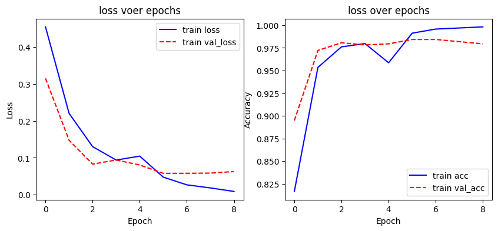
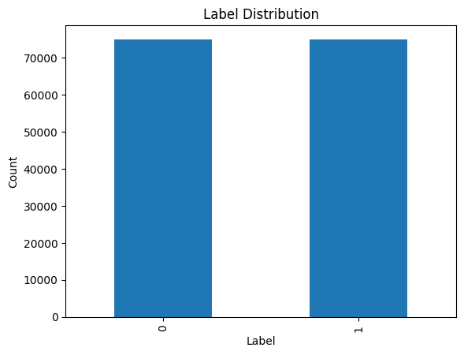
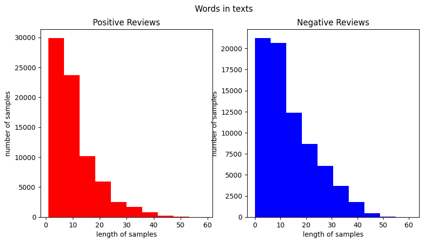
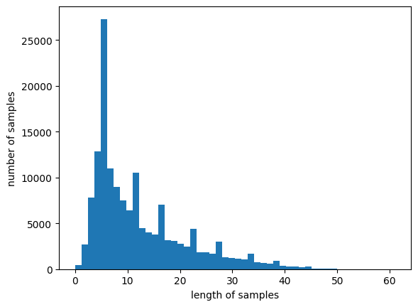

# Day91_RNN이항분류_SimpleRNN스팸_GRU쇼핑리뷰감성_Okt형태소

## 📅 2026-06-19

---
# 📄 rnn9spam.ipynb — SimpleRNN · 텍스트분류 · 클래스불균형

## 개요

SMS 스팸(ham/spam, 약 87:13 불균형)을 SimpleRNN으로 이항 분류. `Embedding → SimpleRNN(32) → Dense(1, sigmoid)` · **test acc 97.87%** · 9 epoch에서 EarlyStopping

---

## 전체 파이프라인

```
spam.csv 로드 (latin1)
    ↓
v1/v2만 남기고 라벨 정수화(ham=0,spam=1) → 중복 메시지 제거
    ↓
Tokenizer로 정수 시퀀스 변환 → vocabsize = len(word_index)+1
    ↓
pad_sequences(maxlen=189) → data_pad
    ↓
80:20 split + class_weight 계산('balanced' → dict 변환)
    ↓
Embedding(32) → SimpleRNN(32) → Dense(1, sigmoid)
    ↓
EarlyStopping(patience=3)으로 학습 → 9 epoch에서 중단
    ↓
test 평가(acc 97.87%) + loss/acc 곡선 시각화
    ↓
새 메일 4건 예측 (0.5 임계값으로 ham/spam 판정)
```

---

## 핵심 개념

|개념|정리|
|---|---|
|**Tokenizer**|`fit_on_texts`로 단어 사전 생성 → `texts_to_sequences`로 문장을 정수 시퀀스로 변환|
|**pad_sequences**|기본 `padding='pre'` → 짧은 문장 앞쪽에 0 채움. `maxlen`은 가장 긴 문장(189) 기준|
|**vocabsize = len(word_index)+1**|Keras Tokenizer 인덱스는 1부터 시작, 0은 패딩 전용이라 +1 필수|
|**Embedding(32) → SimpleRNN(32)**|정수 인덱스를 32차원 벡터로 임베딩 → RNN이 순서대로 읽으며 은닉 상태 갱신|
|**class_weight='balanced'**|`가중치 = 전체샘플 / (클래스수 × 해당클래스샘플)` → ham 0.574, spam 3.857. 소수 클래스(spam) 오차에 더 큰 페널티 부여|
|**EarlyStopping(patience=3)**|val_loss 3epoch 연속 미개선 시 중단. `restore_best_weights` 미설정 → 최적점(epoch 6)보다 살짝 늦게 멈춤|

### 결과 해석



- val_loss는 epoch 5~6(≈0.058)에서 최저 → 이후 train/val 격차 벌어짐(과적합 시작), EarlyStopping이 9 epoch에서 정상 작동
- 새 메일 예측 중 `"FreeMsg... XxX std chgs to send"`가 0.5188로 임계값(0.5)을 근소하게 넘겨 SPAM 판정 — 경계 케이스

---

## 전체 코드 (주석)

```python
# RNN으로 스팸 메일 분류 모델 (이항 분류)
import pandas as pd
import numpy as np
import matplotlib.pyplot as plt
from tensorflow.keras.preprocessing.text import Tokenizer
from tensorflow.keras.preprocessing.sequence import pad_sequences
from tensorflow.keras.models import Sequential
from tensorflow.keras.layers import Dense, Embedding, SimpleRNN
from tensorflow.keras.callbacks import EarlyStopping
from sklearn.utils import class_weight
```

```python
data = pd.read_csv('spam.csv', encoding='latin1')   # UCI 원본 인코딩
data = data[['v1', 'v2']]                            # v1=라벨, v2=텍스트만 사용
data['v1'] = data['v1'].map({'ham': 0, 'spam': 1})   # 라벨 정수화
data.drop_duplicates(subset=['v2'], inplace=True)    # 중복 메시지 제거 (과적합 방지)

x_data, y_data = data['v2'], data['v1']

tokenizer = Tokenizer()
tokenizer.fit_on_texts(x_data)
sequences = tokenizer.texts_to_sequences(x_data)

vocabsize = len(tokenizer.word_index) + 1    # +1: 패딩용 인덱스 0 자리
max_len = max(len(i) for i in sequences)
data_pad = pad_sequences(sequences, maxlen=max_len)   # 기본 pre-padding
```

```python
# train/test split (80:20, 셔플 없음 → 라벨 편향 가능성 있으니 다음엔 stratify 고려)
n_train = int(len(data_pad) * 0.8)
x_train, x_test = data_pad[:n_train], data_pad[n_train:]
y_train, y_test = np.array(y_data[:n_train]), np.array(y_data[n_train:])

# 클래스 불균형 보정
weights = class_weight.compute_class_weight(
    class_weight='balanced', classes=np.unique(y_train), y=y_train
)
class_weight_dict = dict(enumerate(weights))   # {0:w0, 1:w1} — fit()엔 dict로 넘겨야 함

model = Sequential()
model.add(Embedding(vocabsize, 32))
model.add(SimpleRNN(32))
model.add(Dense(1, activation='sigmoid'))
model.compile(optimizer='rmsprop', loss='binary_crossentropy', metrics=['acc'])

early_stop = EarlyStopping(monitor='val_loss', mode='min', verbose=1, patience=3)
history = model.fit(x_train, y_train, epochs=300, batch_size=64,
                     validation_split=0.2, class_weight=class_weight_dict,
                     callbacks=[early_stop])
```

```python
# 성능 시각화 + 새 메일 예측
loss, acc = model.evaluate(x_test, y_test)   # acc ≈ 0.9787

plt.subplot(1, 2, 1)
plt.plot(history.history['loss'], 'b-', label='train loss')
plt.plot(history.history['val_loss'], 'r--', label='val_loss')

plt.subplot(1, 2, 2)
plt.plot(history.history['acc'], 'b-', label='train acc')
plt.plot(history.history['val_acc'], 'r--', label='val_acc')

new_mail = ["...", "...", "...", "..."]
new_padded = pad_sequences(tokenizer.texts_to_sequences(new_mail), maxlen=max_len)
predicted = model.predict(new_padded)   # 0.5 임계값으로 ham/spam 판정
```

---

## 버그·이슈 수정 이력 (오늘 발견)

|위치|원래 코드|수정 코드|이유|
|---|---|---|---|
|class_weight 계산 셀|`class_weight = {0:weights[0], 1:weights[1]}`|삭제 (또는 `class_weight_dict` 그대로 사용)|sklearn 모듈명(`class_weight`)을 dict로 덮어써서, 이후 `compute_class_weight()` 재호출 시 `AttributeError: 'dict' object has no attribute 'compute_class_weight'` 발생|
|model.fit()|`class_weight=class_weight`|`class_weight=class_weight_dict`|`class_weight`는 모듈/오염된 dict, 실제 가중치는 `class_weight_dict`에 있음|
|(환경) 에러 재현 시|셀만 재실행|`Kernel → Restart` 후 재실행|셀 재실행은 커널 메모리를 초기화하지 않아 오염된 변수가 그대로 남음|

> 근본 해결: `from sklearn.utils.class_weight import compute_class_weight`로 함수만 import하면 `class_weight`라는 이름 자체가 모듈로 안 남아 충돌 원천 차단됨.

`drop_duplicates(inplace=True)` 이후 인덱스가 비연속이 되는 점도 참고 — 위치 인덱싱(`x_data[3]`) 필요하면 `reset_index(drop=True)` 추가.

---
# 📄 rnn10shopping.ipynb — Okt형태소분석 · GRU · 네이버쇼핑리뷰감성분류

## 개요

네이버 쇼핑 리뷰 20만 건(평점 기준 긍/부정 라벨)을 Okt 형태소 분석 + GRU로 이항 분류. `Embedding → GRU(128) → Dense(1, sigmoid)` · **test acc 91.39%** · 10 epoch에서 EarlyStopping

지금까지(rnn6~9)는 영문/원핫/SimpleRNN 위주였는데, 이번 노트북에서 새로 등장한 것: **한국어 형태소 분석(Okt)**, **불용어 제거**, **희귀 단어 기준 vocab 산정**, **GRU**, **ModelCheckpoint+load_model 조합**

---

## 전체 파이프라인

```
naver_shopping.txt 다운로드 (ratings, reviews)
    ↓
평점 기준 라벨링 (4,5점→1 / 1,2점→0) → 중복·결측 제거
    ↓
train/test 분리 (75:25, stratify=label) — 라벨 비율 그대로 유지
    ↓
정규식으로 한글/공백만 남기기 → 빈 문자열 제거 → 인덱스 재정렬
    ↓
Okt.morphs(stem=True)로 형태소 분석 → 불용어(조사/어미 등) 제거
    ↓
Tokenizer 1차 학습 → 희귀 단어 비율 확인 → vocab_size 산정
    ↓
Tokenizer 재생성(num_words=vocab_size, oov_token='OOV') → 정수 시퀀스 변환
    ↓
pad_sequences(maxlen=80)
    ↓
Embedding → GRU(128) → Dense(1, sigmoid)
    ↓
EarlyStopping(patience=4) + ModelCheckpoint(val_accuracy 기준 최고 모델 저장)
    ↓
load_model로 최적 모델 복원 → test 평가(91.39%)
    ↓
새 리뷰 2건 감성 예측
```

---

## 핵심 개념

|개념|정리|
|---|---|
|**np.select(조건, 값, default)**|평점>3이면 1, 아니면 0 — `apply(lambda)`보다 벡터 연산이라 빠름|
|**train_test_split(stratify=label)**|분리 후에도 원본과 동일한 라벨 비율 유지 → rnn9의 "셔플 없는 split"보다 안전한 방식|
|**Okt.morphs(text, stem=True)**|형태소 단위로 쪼개고, `stem=True`로 활용형을 원형으로 통일 (예: "좋아서"→"좋다")|
|**불용어(stopwords) 제거**|조사("는","가","을")·의미 약한 어미("것","수","좀") 등 분류에 도움 안 되는 토큰 제거|
|**희귀 단어 비율 → vocab_size**|등장 빈도 1회뿐인 단어가 전체 단어의 49%지만, 실제 등장 빈도(빈도수 총합) 기준으로는 1%도 안 됨 → 잘라내도 정보 손실 거의 없음|
|**vocab_size = total_cnt - rare_cnt + 2**|`+2`의 의미: 인덱스 0(패딩) + 인덱스 1(OOV 토큰) 자리를 미리 확보. rnn9의 `+1`(패딩만 고려)과 다름 — OOV 토큰을 쓰면 자리 하나가 더 필요|
|**Tokenizer(oov_token='OOV')**|`num_words` 밖의 단어는 모두 'OOV'(인덱스 1)로 치환 — 학습에 없던 단어를 만나도 에러 없이 처리|
|**GRU vs LSTM vs SimpleRNN**|GRU는 LSTM의 게이트(forget/input/output) 3개를 2개(update/reset)로 줄인 경량 버전. 성능은 비슷한데 파라미터 수가 적어 학습이 더 빠름|
|**EarlyStopping + ModelCheckpoint 조합**|`es`는 학습을 언제 멈출지, `mc`는 그 중 가장 좋았던 시점의 가중치를 파일로 저장 — `load_model()`로 최종 모델을 다시 불러와 평가. rnn9는 이 조합이 없어서 마지막 epoch(약간 과적합된 시점) 가중치를 그대로 썼던 것과 대조적|

### 결과 해석

**Image 1 — 라벨 분포** 

긍정(1)·부정(0)이 각각 약 75,000건으로 거의 정확히 반반 → `class_weight` 보정이 필요 없는 케이스 (rnn9 스팸 분류와 반대 상황)

**Image 2 — 토큰화된 리뷰 길이 분포(긍정 vs 부정)** 

둘 다 짧은 리뷰(10토큰 이하)에 집중돼 있지만, 부정 리뷰가 평균적으로 더 길다(13.8 vs 10.6) — 불만이 있을 때 설명이 길어지는 경향으로 해석 가능

**Image 3 — 정수 인코딩된 X_train 시퀀스 길이 분포** 

최대 길이 61, `maxlen=80`으로 패딩하면 전체 샘플의 100%가 잘리지 않고 포함됨 — `below_threshold_len()` 함수로 사전 확인한 결과

---

## 코드 + 주석

```python
# 라이브러리 / 데이터 다운로드
!pip install -q konlpy JPype1   # Okt(한국어 형태소 분석기)는 JPype1(Java 연동) 필요

import re
import pandas as pd
import numpy as np
import matplotlib.pyplot as plt
import urllib.request

from collections import Counter
from konlpy.tag import Okt
from sklearn.model_selection import train_test_split
from tensorflow.keras.preprocessing.text import Tokenizer
from tensorflow.keras.preprocessing.sequence import pad_sequences
from tensorflow.keras.layers import Embedding, Dense, GRU
from tensorflow.keras.models import Sequential, load_model
from tensorflow.keras.callbacks import EarlyStopping, ModelCheckpoint

urllib.request.urlretrieve(
    "https://raw.githubusercontent.com/bab2min/corpus/master/sentiment/naver_shopping.txt",
    filename="ratings_total.txt"
)
total_data = pd.read_table('ratings_total.txt', names=['ratings', 'reviews'])
```

```python
# 라벨링 + 정제
# 평점 4,5점 → 긍정(1), 1,2점 → 부정(0). np.select는 조건-값 매핑을 벡터 연산으로 처리
total_data['label'] = np.select([total_data['ratings'] > 3], [1], default=0)

total_data = total_data.drop_duplicates(subset=['reviews'])   # 중복 리뷰 제거
total_data = total_data.dropna(how='any')                      # 결측치 제거

# stratify=label: 분리 후에도 train/test 라벨 비율을 원본과 동일하게 유지
train_data, test_data = train_test_split(
    total_data, test_size=0.25, random_state=42, stratify=total_data['label']
)
train_data, test_data = train_data.copy(), test_data.copy()   # SettingWithCopyWarning 방지

train_data['label'].value_counts().plot(kind='bar')   # → Image 1
plt.title('Label Distribution'); plt.xlabel('Label'); plt.ylabel('Count'); plt.show()
```

```python
# 텍스트 정제 — 한글/공백만 남기고 나머지 제거
def clean_review(text):
    text = str(text)
    text = re.sub(r'[^ㄱ-ㅎㅏ-ㅣ가-힣 ]', '', text)   # 한글 자모/완성형 + 공백만 허용
    text = re.sub(r'\s+', ' ', text)                  # 연속 공백 → 1개
    return text.strip()

train_data['reviews'] = train_data['reviews'].apply(clean_review)
test_data['reviews'] = test_data['reviews'].apply(clean_review)

# 정제 후 빈 문자열이 된 리뷰는 NaN으로 바꿔서 dropna로 한 번에 제거
train_data['reviews'] = train_data['reviews'].replace('', np.nan)
test_data['reviews'] = test_data['reviews'].replace('', np.nan)
train_data = train_data.dropna(how='any').reset_index(drop=True)
test_data = test_data.dropna(how='any').reset_index(drop=True)
```

```python
# 형태소 분석 + 불용어 제거
okt = Okt()
# stem=True: 활용형을 기본형으로 통일 (예: "만드는"→"만들다")
print(okt.morphs('와 이런 것도 상품이라고 차라리 내가 만드는 게 나을 뻔', stem=True))

stopwords = ['도','는','다','의','가','이','은','한','에','하','고','을',
             '를','인','듯','과','와','네','들','지','임','게','것','수','좀','너무']

def tokenize_and_remove_stopwords(text):
    tokens = okt.morphs(text, stem=True)
    return [w for w in tokens if w not in stopwords]

train_data['tokenized'] = train_data['reviews'].apply(tokenize_and_remove_stopwords)
test_data['tokenized'] = test_data['reviews'].apply(tokenize_and_remove_stopwords)

# 긍정/부정 리뷰별 단어 빈도 — np.hstack으로 토큰 리스트들을 1차원으로 펼친 뒤 Counter
negative_words = np.hstack(train_data[train_data['label'] == 0]['tokenized'].values)
positive_words = np.hstack(train_data[train_data['label'] == 1]['tokenized'].values)
negative_word_count = Counter(negative_words)
positive_word_count = Counter(positive_words)

# 리뷰 길이(토큰 수) 분포 시각화 → Image 2
fig, (ax1, ax2) = plt.subplots(1, 2, figsize=(10, 5))
positive_len = train_data[train_data['label'] == 1]['tokenized'].map(len)
negative_len = train_data[train_data['label'] == 0]['tokenized'].map(len)
ax1.hist(positive_len, color='red');  ax1.set_title('Positive Reviews')
ax2.hist(negative_len, color='blue'); ax2.set_title('Negative Reviews')
fig.suptitle('Words in texts'); plt.show()
```

```python
# 입력/정답 분리
X_train, y_train = train_data['tokenized'].values, train_data['label'].values
X_test, y_test = test_data['tokenized'].values, test_data['label'].values

# 1차 Tokenizer: 전체 단어 집합 크기와 빈도 분포만 확인하기 위한 용도
tokenizer = Tokenizer()
tokenizer.fit_on_texts(X_train)

# 희귀 단어(threshold=2 → 등장 1회) 비율 계산
threshold = 2
total_cnt = len(tokenizer.word_index)
rare_cnt, total_freq, rare_freq = 0, 0, 0
for key, value in tokenizer.word_counts.items():
    total_freq += value
    if value < threshold:
        rare_cnt += 1
        rare_freq += value
# → 단어종류 49%가 희귀단어지만, 등장빈도 총합 기준으론 1% 미만 → 잘라도 정보손실 적음

# vocab_size = (자주 등장하는 단어 수) + 2
# +2 이유: 인덱스 0 = 패딩 전용, 인덱스 1 = OOV 토큰 전용
vocab_size = total_cnt - rare_cnt + 2

# 2차 Tokenizer: num_words로 자주 등장하는 단어만 사용, 나머지는 OOV로 치환
tokenizer = Tokenizer(num_words=vocab_size, oov_token='OOV')
tokenizer.fit_on_texts(X_train)
X_train = tokenizer.texts_to_sequences(X_train)
X_test = tokenizer.texts_to_sequences(X_test)
```

```python
# 패딩 길이 결정 — 잘리는 샘플이 없는지 미리 확인
def below_threshold_len(max_len, nested_list):
    count = sum(1 for s in nested_list if len(s) <= max_len)
    print('전체 샘플 중 길이가 {} 이하인 샘플의 비율: {}'.format(
        max_len, (count / len(nested_list)) * 100))

plt.hist([len(r) for r in X_train], bins=50)   # → Image 3
plt.xlabel('length of samples'); plt.ylabel('number of samples'); plt.show()

max_len = 80
below_threshold_len(max_len, X_train)   # 100.0% → 80으로 패딩해도 손실 없음

X_train = pad_sequences(X_train, maxlen=max_len)
X_test = pad_sequences(X_test, maxlen=max_len)
```

```python
# 모델 정의 — GRU (LSTM보다 게이트가 적어 가볍고 빠름)
embedding_dim, hidden_units = 100, 128

model = Sequential()
model.add(Embedding(input_dim=vocab_size, output_dim=embedding_dim))
model.add(GRU(hidden_units))
model.add(Dense(1, activation='sigmoid'))

es = EarlyStopping(monitor='val_loss', mode='min', verbose=1, patience=4)
# val_accuracy 기준으로 가장 좋은 시점의 가중치를 파일로 저장
mc = ModelCheckpoint('best_model.keras', monitor='val_accuracy', mode='max',
                      verbose=1, save_best_only=True)

model.compile(optimizer='rmsprop', loss='binary_crossentropy', metrics=['accuracy'])
model.summary()

history = model.fit(X_train, y_train, epochs=15, callbacks=[es, mc],
                     batch_size=64, validation_split=0.2)

# 학습 마지막 시점이 아니라, mc가 저장해둔 "가장 좋았던 시점"의 모델을 다시 불러와서 평가
loaded_model = load_model('best_model.keras')
loss, accuracy = loaded_model.evaluate(X_test, y_test, verbose=1)
print("테스트 정확도: %.4f" % accuracy)   # 0.9139
```

```python
# 새 리뷰 예측 — 학습 때와 동일한 전처리 단계를 그대로 재적용
def sentiment_predict(new_sentence):
    new_sentence = re.sub(r'[^ㄱ-ㅎㅏ-ㅣ가-힣 ]', '', new_sentence)
    new_sentence = okt.morphs(new_sentence, stem=True)
    new_sentence = [w for w in new_sentence if w not in stopwords]
    encoded = tokenizer.texts_to_sequences([new_sentence])
    pad_new = pad_sequences(encoded, maxlen=max_len)
    score = float(loaded_model.predict(pad_new, verbose=0)[0][0])
    if score > 0.5:
        print("{:.2f}% 확률로 긍정 리뷰입니다.".format(score * 100))
    else:
        print("{:.2f}% 확률로 부정 리뷰입니다.".format((1 - score) * 100))

sentiment_predict('이 상품 진짜 좋아요... 저는 강추합니다. 대박')              # → 97.13% 긍정
sentiment_predict('진짜 배송도 늦고 개짜증나네요. 뭐 이런 걸 상품이라고 만듬?')  # → 99.46% 부정
```

---

## 모델 구조 / 결과 요약

|항목|값|
|---|---|
|vocab_size|18,811 (전체 36,894 단어 중 희귀단어 18,085개 제외 + 2)|
|max_len|80 (전체 샘플의 100% 커버)|
|모델|Embedding(18811,100) → GRU(128) → Dense(1, sigmoid)|
|학습 epoch|10에서 EarlyStopping (val_accuracy 최고점은 6 epoch, 90.9%)|
|**Test accuracy**|**91.39%**|
|새 리뷰 예측|긍정 문장 97.13%, 부정 문장 99.46% — 둘 다 정확히 분류|

---

## 참고: rnn9(스팸) → rnn10(쇼핑리뷰) 비교

|항목|rnn9spam|rnn10shopping|
|---|---|---|
|언어|영문|한국어|
|형태소/토큰화|단어 단위(영문은 공백 기준)|**Okt 형태소 분석 + 불용어 제거**|
|RNN 종류|SimpleRNN|**GRU**|
|라벨 불균형|87:13 → class_weight 필요|50:50 → 불필요|
|vocab 처리|전체 단어 다 사용 (+1만 적용)|희귀 단어 제외 + OOV 토큰 (+2 적용)|
|최적 모델 복원|없음 (마지막 epoch 그대로 사용)|**ModelCheckpoint + load_model로 최적 시점 복원**|
|test acc|97.87%|91.39%|