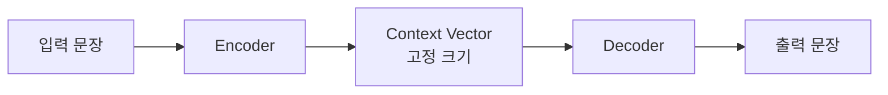
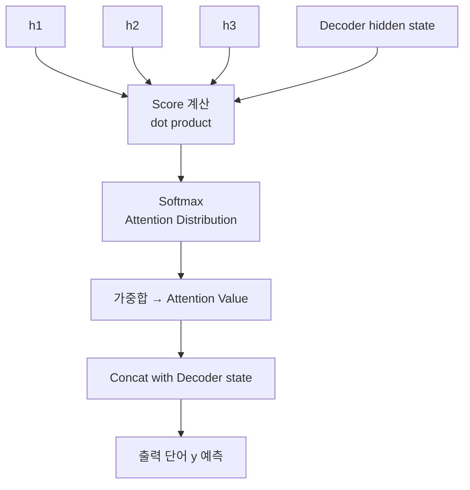
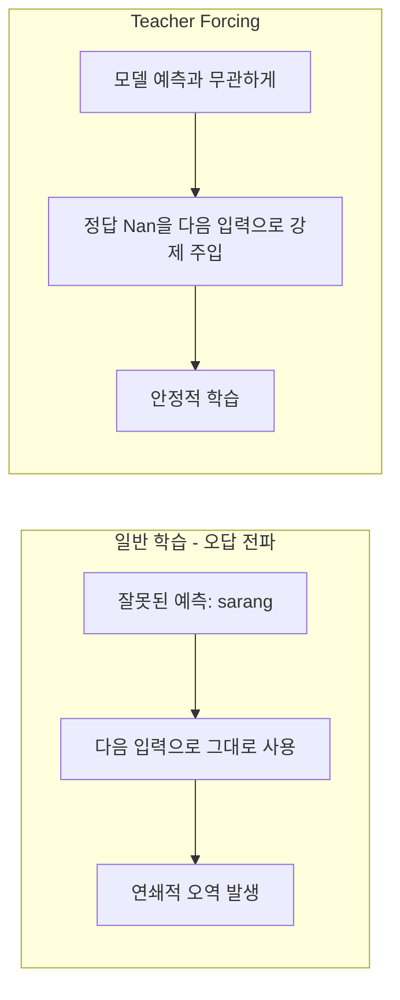
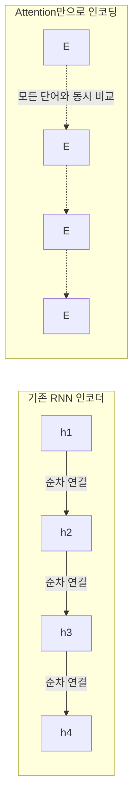
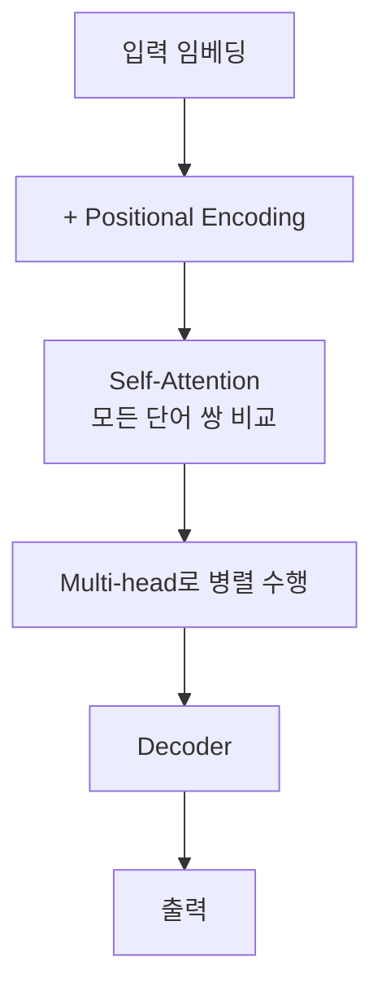
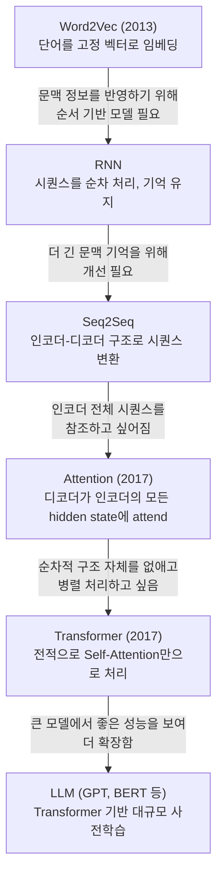

# Day93_Attention_QKV구조이해

## 📅 2026-06-24

---
# 🧠 Attention_개념정리 — Seq2Seq · Attention(Q·K·V) · Transformer

---

## 오늘의 핵심 한 줄

> **Seq2Seq의 "고정된 Context Vector" 문제를 풀기 위해 Attention이 등장했고, Attention만으로 인코딩이 가능하다는 발상이 결국 RNN을 없앤 Transformer로 이어졌다.**

---

## 1️⃣ Seq2Seq 구조 복습



|구성 요소|역할|
|---|---|
|Encoder|입력 문장을 읽어 핵심 정보를 압축|
|Context Vector|입력 문장 전체 의미를 담은 고정 크기 벡터|
|Decoder|Context Vector를 보고 출력 단어를 하나씩 순서대로 생성|

### Seq2Seq의 한계

|문제|설명|
|---|---|
|정보 손실|문장이 길어져도 **하나의 고정 크기 벡터**에 모든 정보를 압축 → 앞부분 정보 흐려짐|
|기울기 소실|RNN 기반이라 긴 시퀀스에서 Vanishing Gradient 발생|
|결과|입력 문장이 길어질수록 번역/요약 품질 저하|

**"인코더 전체를 디코더가 다시 참고하고 싶다"** → Attention 등장 배경

---

## 2️⃣ Attention 핵심 개념

**Attention = 문맥에 따라 지금 집중할 단어를 동적으로 결정하는 방식**

디코더가 출력 단어를 만들 때마다, 인코더의 hidden state 전체를 다시 훑어보고 관련 있는 부분에 더 높은 가중치를 준다.

### Attention 계산 5단계

1. Encoder hidden states와 Decoder hidden state를 내적(dot product) → **Attention Score**
2. Score를 softmax에 통과 → **Attention Distribution (가중치, 합 = 1)**
3. Encoder hidden states × 가중치 → 가중합 → **Attention Value (Context Vector)**
4. Attention Value + Decoder hidden state를 **concatenate**
5. tanh → softmax → 최종 출력 단어 **y** 예측



---

## 3️⃣ Q, K, V 이해 — 도서관 비유

|용어|의미|도서관 비유|
|---|---|---|
|**Query (Q)**|지금 필요한 정보가 뭔지 묻는 질문|내가 찾고 싶은 질문|
|**Key (K)**|각 정보가 어떤 내용인지 표시한 꼬리표|책 제목·키워드·색인|
|**Value (V)**|실제 데이터(내용물)|책 안의 실제 내용|
|**Attention Value**|Q-K 유사도만큼 V를 섞은 결과|필요한 책 내용을 모아 정리한 결과|

### 계산 공식

```
score  = Q와 K의 유사도
weight = softmax(score)
output = weight × V   (가중합)
```

**Encoder-Decoder Attention 매핑**

- Q = Decoder의 현재 hidden state ("지금 어떤 입력을 봐야 하지?")
- K, V = Encoder의 각 단어 hidden state
- Q가 K와 비교해 중요도(score) 산출 → 그 비율로 V를 섞어 **Context Vector** 생성

---

## 4️⃣ PDF 예제로 보는 단계별 Attention — "I love you" → "Nan nul saranghey"

> 같은 인코더 hidden state(h1=I, h2=love, h3=you)를 **디코더 시점마다 다른 가중치로 재참조**하는 과정을 숫자로 추적

|시점|예측 단어|Attention Weight (h1, h2, h3)|Context Vector|해석|
|---|---|---|---|---|
|t1|Nan (난)|0.9 / 0.0 / 0.1|h1×0.9+h2×0.0+h3×0.1|"you"의 영향 일부 받으며 "I"에 집중|
|t2|nul (널)|0.1 / 0.0 / 0.9|h1×0.1+h2×0.0+h3×0.9|"you"에 강하게 집중|
|t3|saranghey (사랑해)|0.03 / 0.95 / 0.02|h1×0.03+h2×0.95+h3×0.02|"love"에 강하게 집중|
|t4|<end>|0.3 / 0.3 / 0.4|h1×0.3+h2×0.3+h3×0.4|종료 토큰이라 비교적 균등 분산|

**핵심 포인트:** 매 시점마다 디코더의 직전 hidden state(dh1, dh2, dh3...)가 새로운 Query 역할을 하면서, 동일한 h1·h2·h3(Key/Value)를 다시 훑어 **다른 조합의 Context Vector**를 만든다.

```
FC( tanh( FC(h1, h2, h3) + FC(dh_t) ) ) → Softmax → Attention Weight → Context Vector
```

---

## 5️⃣ Teacher Forcing

|항목|설명|
|---|---|
|문제 상황|디코더가 t시점에서 잘못된 단어를 예측하면, 그 오답이 t+1 시점의 입력으로 들어가 **오차가 누적/증폭**됨|
|Teacher Forcing|학습 시 디코더의 다음 입력으로 **모델의 예측값 대신 정답(ground truth)**을 강제로 넣어줌|
|효과|학습 속도 향상 + 안정적인 수렴 (오답 전파 방지)|



> Teacher Forcing은 **학습(training) 시에만** 사용. 추론(inference) 시에는 정답이 없으므로 모델 자신의 예측을 다음 입력으로 사용.

---

## 6️⃣ "Attention is All You Need" — RNN을 없애는 발상

기존엔 인코더가 RNN(순차 처리)으로 hidden state를 만들었지만, 다음 발상이 등장:

> **"RNN 셀 없이, Attention 연산(행렬곱) 만으로도 입력을 인코딩할 수 있다."**



- RNN 인코더: 단어를 **순서대로** 하나씩 처리 (Sequential)
- Attention 인코더: 모든 단어를 **한 번의 행렬곱(One step matrix multiplication)**으로 서로 비교 → **병렬 처리 가능**

이 발상이 그대로 **Transformer**로 이어진다.

---

## 7️⃣ Transformer 핵심

|핵심 기술|역할|
|---|---|
|**Self-Attention**|한 문장 내 단어들끼리 서로의 관련도를 계산 (입력 시퀀스 자체를 Q, K, V로 사용)|
|**Multi-head Self-Attention**|Self-Attention을 여러 개(head) 병렬로 수행 → 다양한 관점의 관계를 동시에 포착|
|**Positional Encoding**|RNN 셀을 없애면서 사라진 "순서 정보"를 입력 벡터에 위치 정보를 더해서 보완|



> RNN 기반 Attention: sequential computation 필요 (느림) Transformer: self-attention으로 **순차 계산을 줄이고 병렬화** + 더 많은 단어 간 dependency를 한 번에 모델링

---

## 8️⃣ NLP 모델 발전 흐름 한눈에 보기



|단계|주요 개념|한계|다음 단계로의 진화 이유|
|---|---|---|---|
|Word2Vec (2013)|단어를 고정된 벡터로 임베딩 (예: 300차원 벡터)|문맥을 반영하지 못함 (동일 단어는 항상 같은 벡터)|문맥 정보를 반영하기 위해 순서 기반 모델 필요|
|RNN|시퀀스 데이터를 순차적으로 처리 (기억을 유지)|긴 시퀀스에서 기억 소실(기울기 소실/폭주) 발생|더 긴 문맥 기억을 위해 개선 필요|
|Seq2Seq|RNN 기반 인코더-디코더 구조로 입력 시퀀스를 다른 시퀀스로 변환 (번역 등)|인코더의 마지막 hidden state만 사용해서 정보 압축 → 정보 손실|인코더 전체 시퀀스를 참조하고 싶어짐|
|**Attention (2017)**|디코더가 인코더의 **모든 hidden state**에 주의(attend) 가능|계산량이 커지고 병렬화 어려움 (RNN 기반이면 여전히 순차적)|순차적 구조 자체를 없애고 병렬 처리하고 싶음|
|**Transformer (2017)**|순차처리 없이 **전적으로 Attention**만으로 시퀀스 처리 (Self-Attention)|모델 크기 증가, 대규모 학습 필요|큰 모델에서 좋은 성능을 보여 더 확장함|
|LLM (GPT, BERT 등)|**Transformer 기반** 대규모 사전학습 모델 (수억~수천억 파라미터)|비용·데이터 크기, 안전성 문제 등|여러 작업을 하나로 다룰 수 있는 범용성 확보|

---

## 헷갈리기 쉬운 포인트 정리

|헷갈리는 점|정리|
|---|---|
|Attention Score vs Attention Value|Score = Q·K 내적 결과(상수), Value = Score를 softmax한 가중치로 V들을 가중합한 결과(Context Vector)|
|Context Vector가 매 시점 같은가?|다르다. 매 디코더 시점(t1, t2, t3...)마다 다른 Attention Weight로 재계산됨|
|Attention과 Self-Attention 차이|Attention: Decoder(Q) ↔ Encoder(K,V) 간 관계. Self-Attention: 같은 시퀀스 내부에서 Q,K,V를 모두 자기 자신으로부터 생성|
|RNN 없이 어떻게 순서를 아는가?|Positional Encoding으로 위치 정보를 임베딩에 더해줌|
|Teacher Forcing은 추론 때도 쓰는가?|학습 때만. 추론 시엔 정답이 없으므로 모델 자신의 이전 예측을 사용|

---

## 참고 자료

- wikidocs Seq2Seq: https://wikidocs.net/24996
- wikidocs Attention: https://wikidocs.net/22893
- Bahdanau Attention 정리: https://hcnoh.github.io/2018-12-11-bahdanau-attention
- Luong Attention 정리: https://hcnoh.github.io/2019-01-01-luong-attention
- Visualizing NMT (Seq2Seq+Attention 시각화): https://jalammar.github.io/visualizing-neural-machine-translation-mechanics-of-seq2seq-models-with-attention/

---

# 📄 rnn12attention.ipynb — Dot-Product Attention · Q·K·V · Softmax 가중합

---

## 개념 정리

이 노트북은 RNN/Seq2Seq 없이, **숫자 벡터만으로 Dot-Product Attention의 계산 흐름**을 직접 손으로 구현해본 예제다. Encoder-Decoder 구조 전체를 만들지 않고, "Attention이 실제로 어떤 숫자 연산인지"만 떼어내서 확인하는 데 목적이 있다.

|개념|의미|이 노트북에서의 역할|
|---|---|---|
|**Query (Q)**|지금 내가 찾고 싶은 정보, 디코더의 현재 상태|`Q = [2.0, 1.0]` — "달콤함 2, 새콤함 1"에 집중하고 싶다는 기준 벡터|
|**Key (K)**|각 입력 토큰이 가진 정보의 색인(꼬리표)|토큰 3개의 특징 벡터 `[[1,0], [0,1], [1,1]]`|
|**Value (V)**|각 입력 토큰이 실제로 가진 정보(내용물)|이 예제에서는 `V = K.copy()`로 K와 동일하게 둠|
|**Score**|Q와 K의 유사도 (내적)|`scores = K @ Q`|
|**Softmax**|Score를 0~1 사이 비율(가중치)로 정규화|`weights = softmax(scores)`|
|**Output (Context)**|가중치만큼 V를 가중합한 결과|`output = (weights[:, None] * V).sum(axis=0)`|

### 계산 흐름 한눈에 보기

```
Q, K  →  scores = K @ Q  (유사도)
scores  →  softmax  →  weights  (합이 1인 비율)
weights, V  →  weighted sum  →  output (최종 Attention 결과)
```

> **핵심:** Q와 더 비슷한(score가 높은) Key를 가진 토큰일수록, softmax를 거치며 가중치가 커지고, 그만큼 그 토큰의 Value가 최종 출력(output)에 더 많이 반영된다.

---

## 코드 + 주석 정리

```python
# Attention 개념 전체 구조 이해 : Query - Key - Value 구조를 이용한 Dot Product Attention 계산하기
# Query와 Key 간의 유사도를 내적으로 계산하고, 그 결과로 Value를 가중합하여 출력 벡터 만들기
# Query = 지금 내가 찾고 싶은 정보 (디코더의 현재 상태)
# Key   = 각 입력 토큰이 가진 정보의 색인 (꼬리표)
# Value = 각 입력 토큰이 실제로 가진 정보 (내용물)

# 간단한 숫자 예제로 Attention이 어디에 집중할지를 확인하고,
# 그 정보를 바탕으로 출력값을 가중합하기

import numpy as np

Q = np.array([2.0, 1.0])
# 내가 현재 집중해보고 싶은 벡터 (디코더의 현재 상태, decoder hidden state)
# 의미상 [달콤함, 새콤함] 두 축으로 비유: "달콤함 2, 새콤함 1" 쪽에 집중하고 싶다는 뜻

K = np.array([                # 입력 단계(인코더)에서 나온 각 토큰의 특징 벡터들
    [1.0, 0.0],                # 토큰0: Q와 어느 정도 유사 → score = 2
    [0.0, 1.0],                # 토큰1: Q와 가장 덜 유사    → score = 1
    [1.0, 1.0],                # 토큰2: Q와 가장 유사       → score = 3 (가장 높은 weight)
])

V = K.copy()
# 입력 토큰이 실제로 가진 정보 (출력할 때 가중합할 벡터)
# 이 예제는 K == V로 단순화했지만, 실제 Transformer에서는 K와 V가 서로 다른 가중치 행렬로 생성됨

scores = K @ Q
# Q와 각 Key를 내적(dot product) → Attention Score
# K(3,2) @ Q(2,) = (3,) 형태. 각 토큰이 Q와 얼마나 비슷한지를 숫자로 표현

def softmax(x):
    # score들을 0~1 사이의 비율(확률)로 변환. 합이 항상 1이 됨
    e = np.exp(x - np.max(x))   # overflow 방지를 위해 최댓값을 빼줌 (max 빼도 결과는 동일)
    return e / e.sum()

weights = softmax(scores)       # 어떤 토큰을 얼마나 볼지 비율로 변환 (Attention Weight)
print(weights)

# Value에 가중치를 곱해 합치면 최종 Attention 출력
output = (weights[:, None] * V).sum(axis=0)
# weights[:, None]: (3,) → (3,1)로 차원 확장하여 V(3,2)와 곱이 가능하게 함
# 토큰별 weight × Value를 모두 더해서 하나의 출력 벡터(context vector)를 만듦
print(output)   # [0.90996943 0.75527153]  ← Attention의 최종 출력
# 핵심: "중요한 토큰의 Value는 크게 반영하고, 덜 중요한 토큰은 조금만 반영해서 하나의 결과를 만든다"

# 위 가중합(output)을 수식 그대로 풀어서 손으로 검증
# output = 0.24472847 * [1.0, 0.0] + 0.09003057 * [0.0, 1.0] + 0.66524096 * [1.0, 1.0]
out1 = 0.24472847 * 1 + 0.09003057 * 0 + 0.66524096 * 1   # V의 첫 번째 열 (달콤함 축)
out2 = 0.24472847 * 0 + 0.09003057 * 1 + 0.66524096 * 1   # V의 두 번째 열 (새콤함 축)
print(out1, out2)   # output과 정확히 같은 값이 나와야 함 (검증용)

print("Scores : ", np.round(scores, 3))
print("Weights : ", np.round(weights, 3))
print("Output : ", np.round(output, 3))
```

---

## 실행 결과

```
[0.24472847 0.09003057 0.66524096]
[0.90996943 0.75527153]
0.90996943 0.75527153
Scores :   [2. 1. 3.]
Weights :  [0.245 0.09  0.665]
Output :   [0.91  0.755]
```

|출력|값|의미|
|---|---|---|
|`weights`|`[0.245, 0.09, 0.665]`|토큰2(`[1,1]`)에 66.5%로 가장 강하게 집중|
|`output` (벡터 연산)|`[0.910, 0.755]`|`(weights × V).sum()`으로 한 번에 계산한 결과|
|`out1, out2` (손계산)|`0.910, 0.755`|같은 값을 항목별로 풀어서 계산 → **벡터 연산과 일치하는지 검증**|

> `output`과 `out1/out2`가 같은 숫자인 건 우연이 아니라, 같은 가중합을 **벡터 연산 한 줄**로 한 것과 **항목별로 직접 푼 것**으로 두 번 계산해서 서로 검증한 것.

---

## 핵심 정리

1. **Score (`K @ Q`)**: Q와 각 Key의 내적 → 단순 유사도 숫자 (정규화 안 된 상태)
2. **Softmax**: Score를 합이 1인 비율로 변환 → 차이가 클수록 격차가 더 벌어짐 (exp의 특성)
3. **가중합 (`weights × V`)**: 비율만큼 Value들을 섞어서 하나의 출력 벡터로 합침
4. **검증 패턴**: 벡터 연산 결과(`output`)와 항목별 직접 계산(`out1, out2`)이 같은지 비교하며 "내가 식을 제대로 이해했는지" 확인하는 습관이 좋음

### 헷갈리기 쉬운 포인트

|포인트|정리|
|---|---|
|`K`와 `V`가 항상 같은가?|아니다. 이 예제는 단순화를 위해 `V = K.copy()`로 둔 것뿐. Transformer의 실제 Self-Attention에서는 각각 다른 학습 가능한 가중치 행렬(`W_Q, W_K, W_V`)로부터 별도로 생성됨|
|`weights[:, None]`이 왜 필요한가?|`weights`는 (3,) 1차원, `V`는 (3,2) 2차원이라 차원을 맞춰줘야 broadcasting이 가능함 → `[:, None]`으로 (3,1)로 확장|
|softmax에서 `np.max(x)`를 왜 빼는가?|큰 score 값에서 `exp()` 연산 시 오버플로(overflow)가 나는 것을 방지하기 위함. 결과 비율 자체는 변하지 않음|
