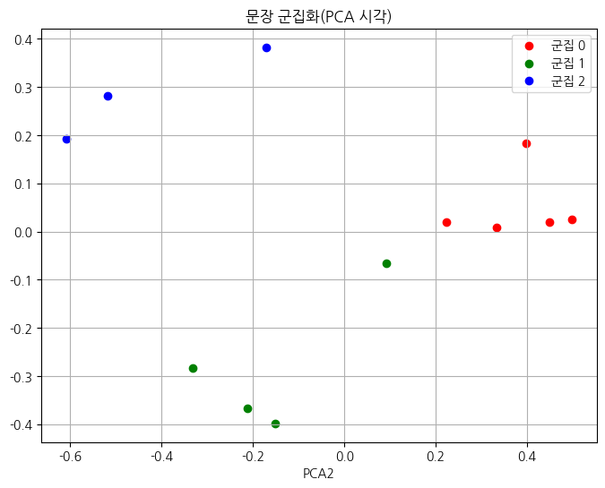
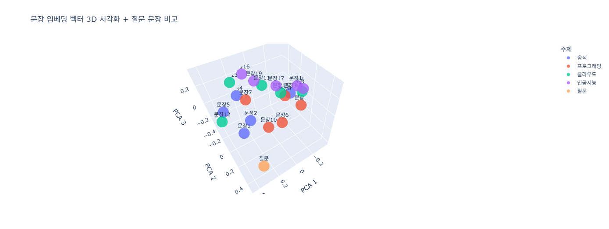
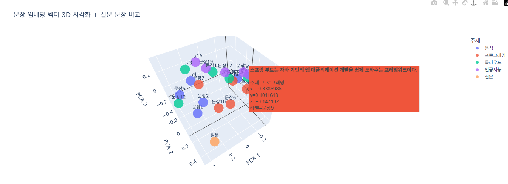
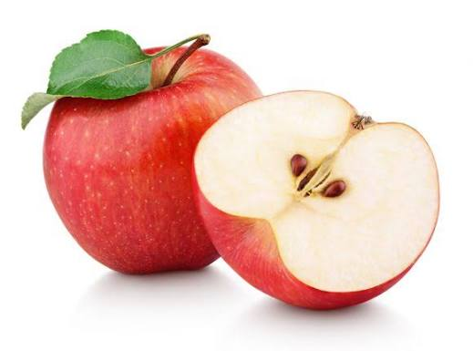
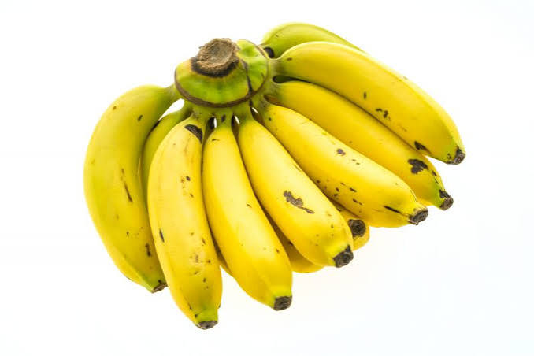
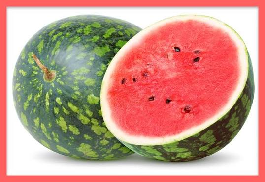

# Day98_벡터임베딩_KMeans_ChromaDB_CLIP

## 📅 2026-07-01

---
# 📄 vecdb5cluster.ipynb — 문장 임베딩 · KMeans 클러스터링 · PCA 시각화

## 🧠 문장 임베딩 클러스터링 개념 — Sentence Embedding · KMeans · Silhouette Score · PCA

### 핵심 개념 정리

**1. 문장 임베딩 (Sentence Embedding)** 문장을 고정된 차원(예: 384차원)의 벡터로 변환하는 과정. 의미가 비슷한 문장은 벡터 공간에서 가까운 위치에 놓인다. `SentenceTransformer("all-MiniLM-L6-v2")` 모델을 사용하면 문장 하나당 384차원 벡터가 생성된다.

**2. KMeans 클러스터링** 비지도학습 알고리즘으로, 벡터들을 k개의 그룹(군집)으로 자동 분류한다. 각 군집은 중심점(centroid)을 가지며, 모든 데이터는 가장 가까운 중심점의 그룹에 속하게 된다. k값(군집 개수)은 미리 정해줘야 하는데, 몇 개가 적절한지는 데이터만 봐서는 알 수 없다.

**3. 실루엣 스코어 (Silhouette Score)** k값을 몇으로 정할지 판단하는 지표. -1 ~ 1 사이 값을 가지며, 1에 가까울수록 "같은 군집끼리는 가깝고 다른 군집과는 멀리 떨어져 있다"는 뜻으로 군집화가 잘 된 것이다. 여러 k값에 대해 점수를 비교해서 가장 높은 k를 선택한다.

**4. PCA (주성분 분석)** 384차원처럼 사람이 눈으로 볼 수 없는 고차원 벡터를, 정보 손실을 최소화하면서 2차원(또는 3차원)으로 압축하는 기법. 시각화를 위해 사용하며, 축 이름은 의미를 갖지 않고 그냥 PC1, PC2로 부른다.

**5. 군집 중심점 기준 대표 문장 추출** 클러스터링 후 "이 군집을 대표하는 문장 하나만 뽑는다면?" 이라는 질문에 답하는 방법. 각 군집의 중심점(centroid)과 가장 가까운(거리가 가장 짧은) 실제 문장을 대표로 선정한다. `pairwise_distances_argmin`으로 구현한다.

---

## 실습 코드 (셀별 정리)

### 실습 목표

12개의 한글 문장(과일 관련 5개, 파이썬 관련 3개, 운동 관련 3개 등 주제가 섞여 있음)을 임베딩한 뒤, 사람이 라벨을 달아주지 않아도 AI가 "의미가 비슷한 문장끼리" 자동으로 그룹을 나눌 수 있는지 확인하는 실습.

---

### CELL 0 — 패키지 설치

```python
# 임베딩 데이터로 클러스터링 후 시각화
# 서로 비슷한 문장끼리 그룹화
!pip install sentence-transformers
```

**출력:** 이미 설치되어 있어서 `Requirement already satisfied` 메시지만 출력됨 (sentence-transformers, transformers, torch 등 의존성 패키지 전부 정상 확인).

---

### CELL 1 — 문장 임베딩

```python
from sentence_transformers import SentenceTransformer
from sklearn.cluster import KMeans
import numpy as np

texts = [
    "나는 사과를 좋아해",
    "바나나는 내가 제일 좋아하는 과일이야",
    "파이썬은 프로그래밍 언어",
    "나는 가끔 파이썬으로 소스를 만들어",
    "사과와 바나나는 모두 맛있어",
    "파이썬 코딩은 즐거워",
    "나는 망고 스무디를 즐겨 마셔",
    "과일은 건강한 간식이야",
    "나는 열대 과일이 좋아",
    "운동은 역시 축구야",
    "재미있는 야구 경기를 보러 가야지",
    "야구 만세",
]

model = SentenceTransformer("all-MiniLM-L6-v2")
embeddings = model.encode(texts)   # 문장 12개 -> (12, 384) 벡터 배열로 변환
print(embeddings[:3])
```

**출력:**

```
[[-0.04062233  0.0775518   0.02653372 ...  0.07781731 -0.07514387
  -0.02722092]
 [-0.02763803  0.07295563  0.07761776 ...  0.05780248 -0.08136992
  -0.13680865]
 [-0.01962723  0.04189941 -0.00667107 ... -0.00958266 -0.00053194
   0.05815984]]
```

(모델 다운로드 로그는 생략. 문장 12개가 각각 384차원 벡터로 변환된 것을 확인)

---

### CELL 2 — KMeans 클러스터링 + 실루엣 스코어

```python
# KMeans Clustering : k값 ?
# 클러스터 수 찾기(실루엣 기법)
from sklearn.metrics import silhouette_score

for k in range(2, 6):
  kmeans = KMeans(n_clusters=k, random_state=42)
  labels = kmeans.fit_predict(embeddings)
  score = silhouette_score(embeddings, labels)
  print(f"k={k}, Silhouette Score: {score: .4f}")

# k=2, Silhouette Score:  0.2042
# k=3, Silhouette Score:  0.2077   <- 가장 높은 점수, 최적 k로 채택
# k=4, Silhouette Score:  0.1126
# k=5, Silhouette Score:  0.1254
n_clusters = 3
kmeans = KMeans(n_clusters=n_clusters, random_state=42)
labels = kmeans.fit_predict(embeddings)
# print(labels)

print('유사도 기반 문장 클러스터링 결과 :')
for idx, (text, label) in enumerate(zip(texts, labels)):
  print(f"[군집 {label}] {text}")

print('\n군집 결과')
from collections import defaultdict
clusters = defaultdict(list)
for text, label in zip(texts, labels):
  clusters[label].append(text)

for cluster_id, docs in clusters.items():
  print(f'\n---cluster {cluster_id} ---')
  for d in docs:
    print(d)
```

**출력:**

```
k=2, Silhouette Score:  0.2042
k=3, Silhouette Score:  0.2077
k=4, Silhouette Score:  0.1126
k=5, Silhouette Score:  0.1254

유사도 기반 문장 클러스터링 결과 :
[군집 0] 나는 사과를 좋아해
[군집 0] 바나나는 내가 제일 좋아하는 과일이야
[군집 2] 파이썬은 프로그래밍 언어
[군집 2] 나는 가끔 파이썬으로 소스를 만들어
[군집 0] 사과와 바나나는 모두 맛있어
[군집 2] 파이썬 코딩은 즐거워
[군집 1] 나는 망고 스무디를 즐겨 마셔
[군집 1] 과일은 건강한 간식이야
[군집 0] 나는 열대 과일이 좋아
[군집 1] 운동은 역시 축구야
[군집 1] 재미있는 야구 경기를 보러 가야지
[군집 0] 야구 만세

---cluster 0---
나는 사과를 좋아해
바나나는 내가 제일 좋아하는 과일이야
사과와 바나나는 모두 맛있어
나는 열대 과일이 좋아
야구 만세

---cluster 2---
파이썬은 프로그래밍 언어
나는 가끔 파이썬으로 소스를 만들어
파이썬 코딩은 즐거워

---cluster 1---
나는 망고 스무디를 즐겨 마셔
과일은 건강한 간식이야
운동은 역시 축구야
재미있는 야구 경기를 보러 가야지
```

**해석:** 군집 2(파이썬)만 3문장 전부 순수하게 파이썬 관련. 군집 0과 1은 과일/운동 문장이 서로 섞임 — 특히 `야구 만세`가 과일 군집(0)에 잘못 들어감. k=3의 실루엣 스코어(0.2077)가 1에 비해 낮은 편이라, 애초에 군집 간 경계가 뚜렷하지 않았던 걸로 보임.

---

### CELL 3 — PCA 시각화

```python
# 군집 결과 시각화
# PCA를 사용해 차원 축소 후 시각화
# 각 클러스터별 대표 문장 출력

# !pip install koreanize-matplotlib

import matplotlib.pyplot as plt
import koreanize_matplotlib
from sklearn.decomposition import PCA
import numpy as np

pca = PCA(n_components=2)
reduced = pca.fit_transform(embeddings)     # 384 -> 2차원으로 축소

plt.figure(figsize=(8,6))
colors = ['red', 'green', 'blue', 'orange', 'purple']
for i in range(n_clusters):
  cluster_points = reduced[labels == i]
  plt.scatter(cluster_points[:, 0], cluster_points[:, 1],
              color=colors[i % len(colors)], label=f'군집 {i}')

plt.title('문장 군집화(PCA 시각)')
plt.xlabel('PCA1')
plt.xlabel('PCA2')   # ⚠ xlabel 중복 호출 -> ylabel('PCA2')로 수정 필요
plt.legend()
plt.grid(True)
plt.show()
```

**출력:**



384차원을 2차원으로 압축한 결과. 색깔은 CELL 2에서 나온 군집 라벨(0=빨강, 1=초록, 2=파랑)을 그대로 사용. 그래프만 보면 세 그룹이 공간적으로는 잘 나뉜 것처럼 보이지만, 실제 문장 내용(CELL 2 출력)을 확인하면 군집 0·1은 주제가 섞여 있음 — **그래프의 시각적 분리와 실제 의미적 순수성은 다를 수 있다**는 점이 이번 실습의 포인트.

---

### CELL 4 — 군집 대표 문장 추출

```python
# 군집별 대표문장 추출 (군집 중심점 기준)
from sklearn.metrics import pairwise_distances_argmin
for i in range(n_clusters):
  cluster_indices = np.where(labels == i)[0]
  cluster_embeddings = embeddings[cluster_indices]   # 특정 군집에 속한 벡터들만 골라내는 연산

  center = kmeans.cluster_centers_[i].reshape(1, -1)
  closest_idx = pairwise_distances_argmin(center, cluster_embeddings)   # 중심점과 가장 가까운 벡터의 인덱스(cluster_embeddings 내부 기준)
  closest_text = texts[cluster_indices[closest_idx[0]]]   # 원본 texts 인덱스로 재매핑
  print(f'[군집 {i} 대표문은 {closest_text}]')
```

**출력:**

```
[군집 0 대표문은 나는 사과를 좋아해]
[군집 1 대표문은 운동은 역시 축구야]
[군집 2 대표문은 파이썬 코딩은 즐거워]
```

**해석:** 군집 0의 대표문장이 `나는 사과를 좋아해`로 나온 건, 이 군집에 과일 문장이 4개로 다수라서 중심점이 그쪽으로 쏠렸기 때문. 소수였던 `야구 만세`는 대표문장으로 뽑히지 않음.

---

## 🐛 디버깅 노트

|위치|문제|수정|
|---|---|---|
|CELL 0|`senetence-transformers` 오타|`sentence-transformers`|
|CELL 3|`plt.xlabel('PCA2')` 중복 호출로 x축 라벨만 덮어써짐|`plt.ylabel('PCA2')`로 변경|
|CELL 4|(과거 버전) `pairwise_distances_argmin` 반환값을 `idx, _`로 언패킹하면 에러|언패킹 없이 `closest_idx = pairwise_distances_argmin(...)`로 받음 — 현재 버전은 이미 수정 반영됨|
|CELL 4|`closest_idx`는 `cluster_embeddings` 내부 상대 인덱스라서 바로 `texts[closest_idx]`하면 틀린 문장이 나옴|`texts[cluster_indices[closest_idx[0]]]`로 원본 인덱스 재매핑 — 현재 버전은 이미 수정 반영됨|

## 💡 확장 아이디어

- `n_clusters=5` (실루엣 최고점이 근소한 차이라면) 다른 k값으로도 비교해보기
- 군집 0·1처럼 섞인 문장이 왜 섞였는지 코사인 유사도 행렬로 직접 확인해보기
- `plotly`의 `hover_name`/`hover_data`를 활용하면 2D matplotlib 대신 인터랙티브하게 점에 마우스를 올려 원문을 바로 확인 가능 (같은 날 진행한 CLIP/ChromaDB 3D 시각화 실습과 연결됨)

---
# 📄 vecdb6emb_3d.ipynb — 문장 임베딩 3D 시각화 · ChromaDB 저장/검색 · 코사인 유사도

## 🧠 3D 임베딩 시각화와 벡터 검색 개념 — Plotly 3D Scatter · hover_data · Cosine Similarity vs Distance

### 핵심 개념 정리

**1. PCA 3차원 축소 + Plotly 3D 산점도** 384차원 벡터를 `PCA(n_components=3)`로 3차원까지 압축하면 `plotly.express.scatter_3d`로 회전 가능한 3D 그래프를 그릴 수 있다. `matplotlib`은 정적 이미지지만 `plotly`는 마우스로 회전·확대하며 탐색 가능한 인터랙티브 그래프.

**2. hover_name / hover_data** 그래프의 점 위에 마우스를 올렸을 때(hover) 표시할 정보를 지정하는 옵션. `hover_name`은 툴팁 제목(굵은 글씨), `hover_data`는 추가로 보여줄 컬럼들. 점 384개가 좌표로만 찍혀 있으면 뭐가 뭔지 알 수 없기 때문에, 원본 문장을 hover로 붙여야 실제로 쓸모 있는 시각화가 된다.

**3. 코사인 유사도(Similarity) vs 코사인 거리(Distance)**

- **유사도(similarity)**: 두 벡터가 얼마나 같은 방향을 향하는지. 1에 가까울수록 유사, 0에 가까울수록 무관.
- **거리(distance)**: ChromaDB가 `hnsw:space: cosine`으로 설정했을 때 반환하는 값. `distance = 1 - similarity` 관계.
- 그래서 CELL 1의 `np.dot` 유사도 계산과 CELL 4의 ChromaDB 검색 결과가 **같은 순위, 서로 뒤집힌 값**으로 나오는 걸 실제 출력에서 확인할 수 있다 (아래 참고).

**4. ChromaDB 저장과 검색 흐름**

1. `collection.add()`로 문서 + 임베딩 + 메타데이터 저장 → 2) `collection.query()`로 질문 벡터와 가장 가까운 문서 top-k 검색. 이미 계산해둔 임베딩(`doc_embeddings`)을 재사용하면 ChromaDB 내부 임베딩 함수를 또 돌릴 필요가 없어서 효율적이다.

---

## 실습 코드 (셀별 정리)

### 실습 목표

음식·프로그래밍·클라우드·인공지능 4개 주제, 각 5문장씩 총 20문장을 임베딩한 뒤, "파이썬은 인공지능 개발에 사용되나요?"라는 질문 문장과의 유사도를 (1) `numpy` 직접 계산, (2) `ChromaDB` 벡터 검색 두 가지 방식으로 비교하고, 3D 공간에 인터랙티브하게 시각화하는 실습.

---

### CELL 0 — 패키지 설치

```python
# 임베딩 벡터 시각화 및 저장 후 검색
!pip install chromadb sentence-transformers plotly
```

**출력:** 이미 설치되어 있어서 `Requirement already satisfied` 메시지만 출력됨.

---

### CELL 1 — 문장 임베딩 + 코사인 유사도 검색 (numpy)

```python
import chromadb
from sentence_transformers import SentenceTransformer
from sklearn.decomposition import PCA
import plotly.express as px   # 3D 산점도 그래프 작성용
import numpy as np
import pandas as pd

texts = [  # 임베딩할 원본 문장 목록
    "김치찌개는 김치와 돼지고기를 넣고 끓이는 한국의 대표적인 찌개이다.",
    "된장찌개는 된장을 기본 재료로 하여 끓이는 한국 전통 음식이다.",
    "비빔밥은 밥 위에 여러 가지 나물과 고추장을 넣어 비벼 먹는 음식이다.",
    "불고기는 양념한 소고기를 구워 먹는 한국의 대표적인 고기 요리이다.",
    "떡볶이는 매운 고추장 양념에 떡을 넣고 조리하는 간식이다.",

    "파이썬은 문법이 간결하여 초보자가 배우기 쉬운 프로그래밍 언어이다.",
    "자바는 기업용 백엔드 시스템 개발에 많이 사용되는 객체지향 언어이다.",
    "자바스크립트는 웹 브라우저에서 동작하는 대표적인 프로그래밍 언어이다.",
    "스프링 부트는 자바 기반의 웹 애플리케이션 개발을 쉽게 도와주는 프레임워크이다.",
    "SQL은 데이터베이스에서 데이터를 조회하고 관리하기 위한 언어이다.",

    "클라우드는 인터넷을 통해 서버와 저장소 같은 컴퓨팅 자원을 제공하는 기술이다.",
    "AWS는 전 세계적으로 많이 사용되는 대표적인 클라우드 서비스 플랫폼이다.",
    "가상 머신은 하나의 물리 서버 위에서 여러 운영체제를 실행할 수 있게 해준다.",
    "컨테이너는 애플리케이션 실행 환경을 가볍게 패키징하는 기술이다.",
    "쿠버네티스는 컨테이너를 자동으로 배포하고 관리하는 오케스트레이션 도구이다.",

    "인공지능은 데이터를 학습하여 판단하거나 예측하는 기술이다.",
    "머신러닝은 데이터에서 패턴을 찾아 새로운 데이터에 대한 예측을 수행한다.",
    "딥러닝은 인공신경망을 이용하여 복잡한 문제를 학습하는 머신러닝 방법이다.",
    "자연어 처리는 컴퓨터가 사람의 언어를 이해하고 생성하도록 만드는 기술이다.",
    "컴퓨터 비전은 이미지와 영상을 분석하여 객체를 인식하는 인공지능 분야이다."
]

# 각 문장 주제 라벨 작성
categories = [
    "음식","음식","음식","음식","음식",
    "프로그래밍","프로그래밍","프로그래밍","프로그래밍","프로그래밍",
    "클라우드","클라우드","클라우드","클라우드","클라우드",
    "인공지능","인공지능","인공지능","인공지능","인공지능",
]

query = "파이썬은 인공지능 개발에 사용되나요?"    # 검색에 사용할 질문
all_texts = texts + [query]
all_categories = categories + ["질문"]

labels = [f"문장{i + 1}" for i in range(len(texts))] + ['질문']
print(labels)

# 임베딩 모델 사용
model = SentenceTransformer("all-MiniLM-L6-v2")
embeddings = model.encode(
    all_texts,
    normalize_embeddings=True   # 벡터 길이를 1로 정규화, 코사인 유사도 계산에 적합
)
print("임베딩 벡터 차원 : ", embeddings.shape)

# 임베딩된 문장과 질문을 분리
doc_embeddings = embeddings[:-1]
query_embeddings = embeddings[-1]

# 질문 벡터와 각 문장의 코사인 유사도 확인
similarities = np.dot(doc_embeddings, query_embeddings)

top_k = 3
top_indices = similarities.argsort()[::-1][:top_k]

print('\n질문 : ', query)
print('질문과 유사한 문장 top 3 : ')
for rank, idx in enumerate(top_indices, start=1):
  print(f'{rank} 유사도:{similarities[idx]:.4f}')
  print(f'    주제:{categories[idx]}')
  print(f'    문장:{texts[idx]}')
```

**출력:**

```
['문장1', '문장2', ..., '문장20', '질문']
임베딩 벡터 차원 :  (21, 384)

질문 :  파이썬은 인공지능 개발에 사용되나요?
질문과 유사한 문장 top 3 : 
1 유사도:0.7584
    주제:프로그래밍
    문장:파이썬은 문법이 간결하여 초보자가 배우기 쉬운 프로그래밍 언어이다.
2 유사도:0.6690
    주제:음식
    문장:된장찌개는 된장을 기본 재료로 하여 끓이는 한국 전통 음식이다.
3 유사도:0.6569
    주제:프로그래밍
    문장:자바는 기업용 백엔드 시스템 개발에 많이 사용되는 객체지향 언어이다.
```

**해석:** 1위는 예상대로 파이썬 문장. 그런데 2위가 프로그래밍이 아니라 **음식 카테고리의 "된장찌개" 문장**으로 나옴. 짧은 문장 임베딩 모델의 한계로, 문장 구조나 단어 빈도가 우연히 비슷하면 의미가 달라도 유사도가 높게 나올 수 있음을 보여주는 사례. all-MiniLM 같은 경량 모델은 이런 노이즈가 종종 발생함.

---

### CELL 2 — PCA 3차원 축소 + Plotly 3D 시각화

```python
# 임베딩 벡터 시각화
pca = PCA(n_components=3)
reduced = pca.fit_transform(embeddings)
print('축소 후 shape : ', reduced.shape)    # (21, 3)

df = pd.DataFrame({
    '라벨':labels,
    '문장':all_texts,
    '주제':all_categories,
    'x':reduced[:,0],
    'y':reduced[:,1],
    'z':reduced[:,2]
})
print(df)

fig = px.scatter_3d(
    data_frame=df,
    x="x",
    y="y",
    z="z",
    color="주제",
    text="라벨",
    hover_name="문장",
    hover_data={
        '주제':True,
        "x":True,
        "y":True,
        "z":True,
    }, title = '문장 임베딩 벡터 3D 시각화 + 질문 문장 비교'
)

# 점 크기와 투명도 조정
fig.update_traces(
    marker=dict(size=7, opacity=0.8),
    textposition = 'top center'
)

# 그래프 축 제목
fig.update_layout(
    scene=dict(xaxis_title='PCA 1', yaxis_title='PCA 2', zaxis_title='PCA 3')
)

import plotly.io as pio
pio.renderers.default = 'colab'
fig.show()

fig.write_html('abc.html', auto_open=True)
```

**출력:**



축소 후 shape: `(21, 3)`. 주제(음식/프로그래밍/클라우드/인공지능/질문)별로 색이 다르게 표시되고, 각 점 위에 `문장N` 라벨이 함께 출력됨. "질문" 카테고리(주황색)는 다른 문장들과 떨어진 아래쪽에 단독으로 위치.

**hover 기능 동작 확인:**



문장9(스프링 부트 관련)에 마우스를 올리면 `hover_name`으로 설정한 문장 전체 텍스트가 툴팁 제목으로, `hover_data`로 지정한 주제/x/y/z 좌표가 그 아래 표시됨. 384차원 → 3차원으로 압축된 점이 "무슨 문장이었는지" 즉시 확인 가능해짐 — 이게 hover를 쓰는 이유.

> ⚠️ 참고: `fig.write_html('abc.html', auto_open=True)`는 로컬 환경에서는 브라우저를 자동으로 열지만, Colab 같은 클라우드 노트북 환경에서는 `auto_open`이 동작하지 않을 수 있음. 파일 자체는 `abc.html`로 저장되니 다운로드해서 열어보면 됨.

---

### CELL 3 — ChromaDB에 문서 저장

```python
# chromadb에 저장 후 질문에 유사한 문장 검색
import os
from chromadb import PersistentClient
import shutil

CHROMA_PATH = "/tmp/chroma_demo"

if os.path.exists('.chroma_demo'):
  shutil.rmtree('.chroma_demo')

chroma_client = PersistentClient(path='.chroma_demo')

collection = chroma_client.get_or_create_collection(
    name='my_docs',
    metadata={'hnsw:space':'cosine'}
)

ids = [f'doc_{i}' for i in range(len(texts))]
print(ids)

metadatas = [
    {
    'category':categories[i],
    'label':f'문장{i + 1}'
    }
    for i in range(len(texts))
]

collection.add(
    ids=ids,
    documents=texts,
    embeddings=doc_embeddings.tolist(),
    metadatas=metadatas
)
print('저장된 문장 수 : ', collection.count())
```

**출력:**

```
['doc_0', 'doc_1', ..., 'doc_19']
저장된 문장 수 :  20
```

**참고 (사소한 코드 정리 포인트):** `CHROMA_PATH = "/tmp/chroma_demo"` 변수를 선언해놓고 실제로는 `PersistentClient(path='.chroma_demo')`에서 다른 경로(`'.chroma_demo'`)를 쓰고 있어서 `CHROMA_PATH` 변수가 실질적으로 안 쓰이고 있음. 동작에는 문제 없지만, 나중에 헷갈리지 않으려면 `PersistentClient(path=CHROMA_PATH)`로 통일하는 게 깔끔함.

---

### CELL 4 — ChromaDB 벡터 검색

```python
# 질문과 유사한 문장 검색
results = collection.query(
    query_embeddings=[query_embeddings.tolist()],
    n_results=3,
    include=['documents', 'metadatas', 'distances']
)
print('검색 질문 : ', query)
print('검색 결과 top 3:')
result_ids = results['ids'][0]
result_docs = results['documents'][0]
result_metas = results['metadatas'][0]
result_dist = results['distances'][0]

for rank, (doc_id, doc, meta, dist) in enumerate(zip(result_ids, result_docs, result_metas, result_dist), start=1):
  print(f'\n[{rank}]')
  print(f'ID : {doc_id}')
  print(f"라벨 : {meta['label']}")
  print(f"주제 : {meta['category']}")
  print(f"거리 : {dist:.4f}")
  print(f"문장 : {doc}")
```

**출력:**

```
검색 질문 :  파이썬은 인공지능 개발에 사용되나요?
검색 결과 top 3:

[1]
ID : doc_5
라벨 : 문장6
주제 : 프로그래밍
거리 : 0.2416
문장 : 파이썬은 문법이 간결하여 초보자가 배우기 쉬운 프로그래밍 언어이다.

[2]
ID : doc_1
라벨 : 문장2
주제 : 음식
거리 : 0.3310
문장 : 된장찌개는 된장을 기본 재료로 하여 끓이는 한국 전통 음식이다.

[3]
ID : doc_6
라벨 : 문장7
주제 : 프로그래밍
거리 : 0.3431
문장 : 자바는 기업용 백엔드 시스템 개발에 많이 사용되는 객체지향 언어이다.
```

**핵심 확인 포인트 — 유사도와 거리는 뒤집힌 값**

|순위|문장|CELL 1 유사도|CELL 4 거리|유사도 + 거리|
|---|---|---|---|---|
|1|파이썬...|0.7584|0.2416|1.0000|
|2|된장찌개...|0.6690|0.3310|1.0000|
|3|자바...|0.6569|0.3431|1.0000|

`numpy`로 직접 계산한 코사인 **유사도**와 ChromaDB가 반환한 코사인 **거리**를 더하면 정확히 1이 됨 (`distance = 1 - similarity`). 순위와 대상 문서가 완전히 동일하게 나온 것도 두 방식이 같은 임베딩·같은 계산 원리(코사인)를 쓰기 때문. "된장찌개" 문장이 2위로 잡힌 노이즈도 두 방식에서 똑같이 재현됨 — 모델의 한계이지 계산 방식의 오류가 아님을 확인할 수 있음.

---

## 🐛 디버깅 / 코드 정리 노트

|위치|내용|
|---|---|
|CELL 2|`fig.write_html(..., auto_open=True)` — Colab에서는 자동으로 브라우저가 안 열릴 수 있음. 파일 다운로드해서 확인 필요|
|CELL 3|`CHROMA_PATH` 변수 선언 후 실제로는 미사용(하드코딩된 `'.chroma_demo'` 사용) — 동작엔 문제없지만 변수로 통일 권장|

## 💡 확장 아이디어

- "된장찌개"가 2위로 잡힌 원인을 더 깊게 보려면, 해당 문장과 질문 문장의 토큰 단위 유사도를 뜯어보거나 더 큰 임베딩 모델(예: `multilingual-e5-large`)로 교체해서 결과가 달라지는지 비교
- `collection.query()`에 `where={'category': '프로그래밍'}` 같은 메타데이터 필터를 추가해서, 특정 주제 안에서만 검색되게 해보기
- 지난 실습(vecdb5cluster)의 KMeans 클러스터링 결과와 이번 4개 주제 라벨을 비교해서, 비지도 클러스터링이 실제 주제 라벨과 얼마나 일치하는지 정량적으로 확인 (Adjusted Rand Index 등)

---
# 📄 vecdb7image.ipynb — CLIP 이미지 임베딩 · 멀티모달 벡터 검색

## 🧠 CLIP 멀티모달 임베딩 개념 — CLIP · Image Embedding · Multimodal Vector Space

### 핵심 개념 정리

**1. CLIP (Contrastive Language-Image Pre-training)** OpenAI가 만든 멀티모달 모델로, 이미지와 텍스트를 **같은 벡터 공간**에 임베딩한다. 지금까지 다뤘던 `SentenceTransformer`는 텍스트만 벡터로 바꿨다면, CLIP은 이미지도 같은 차원의 벡터로 바꿔서 "이미지-이미지", "텍스트-텍스트"뿐 아니라 "이미지-텍스트" 간 유사도까지 계산할 수 있게 해준다.

**2. CLIPProcessor vs CLIPModel**

- `CLIPProcessor`: 이미지(또는 텍스트)를 모델이 이해할 수 있는 입력 형식(텐서)으로 전처리하는 역할
- `CLIPModel`: 전처리된 입력을 실제로 밀집 벡터(dense vector)로 변환하는 역할
- 둘을 짝지어 써야 함 — Processor 없이 이미지를 바로 Model에 넣을 수 없음

**3. `model.eval()`의 의미** PyTorch 모델은 학습 모드(train)와 추론 모드(eval)가 다르게 동작한다 (예: dropout, batch normalization 동작 차이). 이미 학습된 CLIP을 그냥 벡터 추출 용도로만 쓸 거라서 `model.eval()`로 추론 모드로 전환해야 결과가 일관되게 나온다.

**4. device 설정 (`cuda` vs `cpu`)** GPU(cuda)가 있으면 GPU로, 없으면 CPU로 모델을 옮겨서 연산 속도를 최적화하는 관용적인 코드 패턴. `torch.cuda.is_available()`로 자동 판별.

**5. 이미지 → 벡터 변환 흐름** `이미지 파일 열기(PIL) → CLIPProcessor로 전처리 → CLIPModel에 통과 → 고정 차원 벡터` 순서. 이렇게 나온 벡터는 이전 실습의 문장 임베딩과 동일한 방식(코사인 유사도, ChromaDB 저장/검색)으로 다룰 수 있다.

---

## 실습 코드 (셀별 정리)

### 실습 목표

CLIP 모델을 사용해서 사과·바나나·복숭아·수박 4장의 이미지를 벡터로 변환하고, 이미지 간 유사도를 비교하거나 ChromaDB에 저장해 "이미지로 이미지 검색"을 해보는 실습. (이번 노트북은 CLIP 모델 준비까지 진행되고, 실제 임베딩 변환 함수는 아직 미완성 상태로 저장되어 있음)

### 업로드한 이미지

   

사과, 바나나, 복숭아, 수박 순서로 4장 업로드.

---

### CELL 0 — 사용 가능한 CLIP 모델 탐색

```python
# VectorDB에 이미지 저장 후 검색 - 이미지로 이미지 검색
# !pip install huggingface_hub

from huggingface_hub import list_models
models = list_models(search="clip", limit=20)
for m in models:
  print(m.modelId)
```

**출력:**

```
openai/clip-vit-base-patch32
openai/clip-vit-large-patch14
OFA-Sys/chinese-clip-vit-base-patch16
jinaai/jina-clip-v2
openai/clip-vit-base-patch16
sentence-transformers/clip-ViT-L-14
openai/clip-vit-large-patch14-336
...
```

**해석:** 허깅페이스 허브에서 "clip"으로 검색해서 실제 존재하는 CLIP 계열 모델 목록을 미리 확인하는 탐색 단계. `openai/clip-vit-base-patch32`가 가장 기본적이고 가벼운 버전이라 CELL 3에서 이 모델을 선택해서 사용함.

---

### CELL 1 — 패키지 설치

```python
# clip 모델로 이미지 임베딩
!pip install chromadb sentence-transformers torch pillow transformers
!pip install koreanize-matplotlib
```

**출력:** 전부 이미 설치되어 있어서 `Requirement already satisfied` 메시지만 출력됨.

---

### CELL 2 — 이미지 업로드

```python
import os
import torch
import numpy as np
import matplotlib.pyplot as plt
import koreanize_matplotlib
from chromadb import PersistentClient
from transformers import CLIPProcessor, CLIPModel
from google.colab import files
from numpy.linalg import norm

# image upload
uploaded = files.upload()
```

**출력:**

```
Saving apple.jpeg to apple.jpeg
Saving banana.jpeg to banana.jpeg
Saving peach.jpeg to peach.jpeg
Saving watermelon.jpeg to watermelon.jpeg
```

4개 이미지 파일이 Colab 런타임에 정상적으로 업로드됨.

---

### CELL 3 — CLIP 모델 준비

```python
# CLIP 모델 준비
model_name = "openai/clip-vit-base-patch32"   # 허깅페이스에 등록된 CLIP 기본 모델
processor = CLIPProcessor.from_pretrained(model_name)   # 데이터를 CLIP 입력 형식으로 전처리
model = CLIPModel.from_pretrained(model_name)   # 데이터를 밀집벡터로 변환

device = "cuda" if torch.cuda.is_available() else "cpu"
model.to(device)    # 모델을 선택한 장치로 이동함
model.eval()    # 학습용 모델이 아니라 추론용으로 사용

print('모델이름:', model_name)
print('사용장치:', device)
print('모델타입:', type(model))
```

**출력:**

```
모델이름: openai/clip-vit-base-patch32
사용장치: cpu
모델타입: <class 'transformers.models.clip.modeling_clip.CLIPModel'>
```

CLIP 모델과 프로세서가 정상적으로 로드됨. GPU가 없는 환경이라 `cpu`로 잡힘 — 이미지 몇 장 정도의 소규모 실습이면 CPU로도 충분히 처리 가능.

---

### CELL 4 — 이미지 → 벡터 변환 함수 (⚠ 미완성)

```python
# 이미지 -> CLIP 벡터로 변롼
def image_to_vector(img_path):
  image = Image.open(img_path).convert('RGB')

  inputs = processor(       # 이미지를 CLIP 모델 입력형식으로 변환
      images = image,       # 전처리 대상
      return_tensors = "pt" # 결과를 PyTorch 텐서형식으로 반환
  )
```

**출력:** 없음 (함수 정의만 하고 아직 호출 안 함)

**⚠ 버그 1 — `Image` 미임포트**

```python
image = Image.open(img_path).convert('RGB')
```

`Image`가 어디서도 import되지 않았음. CELL 2에서 CLIP 관련 라이브러리는 다 불러왔지만 `from PIL import Image`가 빠져 있어서, 이 함수를 실제로 호출하면 `NameError: name 'Image' is not defined`가 날 것.

**수정:**

```python
from PIL import Image
```

CELL 2의 import 목록에 추가하거나, CELL 4 맨 위에 추가.

**⚠ 버그 2 — 함수가 벡터를 반환하지 않음** `inputs`까지만 만들고 끝나서, 실제로 CLIP 모델에 통과시켜서 벡터를 뽑아내는 부분(`model.get_image_features(...)`)이 없음. 이대로면 함수를 호출해도 아무 값도 돌려주지 않음(`None` 반환).

**완성된 버전 예시:**

```python
from PIL import Image

def image_to_vector(img_path):
    image = Image.open(img_path).convert('RGB')

    inputs = processor(
        images=image,
        return_tensors="pt"
    ).to(device)   # 모델과 같은 장치로 이동

    with torch.no_grad():   # 추론 시 그래디언트 계산 불필요 (메모리/속도 절약)
        image_features = model.get_image_features(**inputs)

    vector = image_features.squeeze().cpu().numpy()   # 텐서 -> numpy 배열
    vector = vector / norm(vector)   # 코사인 유사도 계산을 위해 정규화 (numpy.linalg.norm import 해둔 이유)

    return vector
```

`from numpy.linalg import norm`을 CELL 2에서 이미 import해두신 걸 보면, 원래 계획이 벡터 정규화까지였던 것 같아요. 함수 완성하실 때 반영하시면 될 것 같습니다.

---

## 🐛 디버깅 노트

|위치|문제|수정|
|---|---|---|
|CELL 4|`Image` 클래스 미임포트|`from PIL import Image` 추가|
|CELL 4|함수가 전처리(`inputs`)만 하고 실제 벡터 추출·반환 로직이 없음|`model.get_image_features(**inputs)` 호출 후 `return` 추가|

## 💡 확장 아이디어

- 함수 완성 후 4개 이미지 각각을 벡터로 변환해서 `image_to_vector('apple.jpeg')` 등으로 확인
- 이미지 벡터 4개를 ChromaDB에 저장 (`collection.add()`, 문서 초록/카테고리 대신 이미지 파일명을 메타데이터로)
- CLIP의 진짜 강점은 텍스트-이미지 교차 검색 — `processor(text=["빨간 사과 사진"], ...)`로 텍스트도 같은 벡터 공간에 임베딩해서, "사과"라는 텍스트 질의로 이미지 4장 중 가장 유사한 이미지를 찾아보는 실습으로 확장 가능 (지난 실습들의 ChromaDB 저장/검색 패턴 그대로 재사용 가능)
- 이전 vecdb6emb_3d 실습처럼 4개 이미지 벡터를 PCA로 축소해서 Plotly 3D로 시각화해보면, 시각적으로 비슷한 과일끼리(예: 사과-복숭아 둥근 모양) 가까이 모이는지 확인 가능