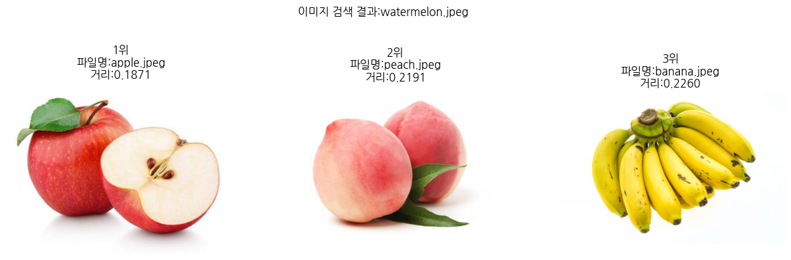
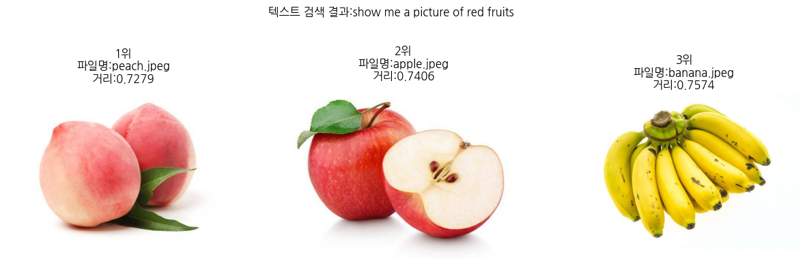
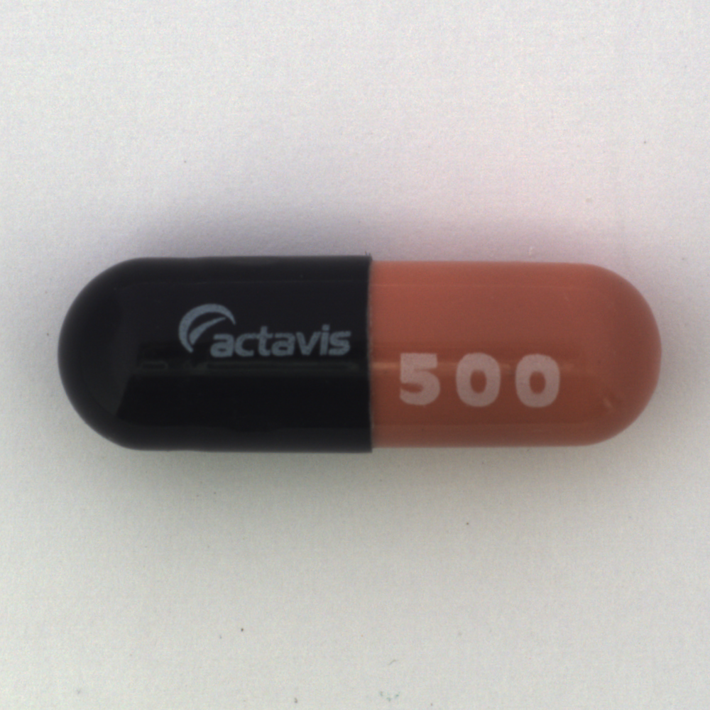
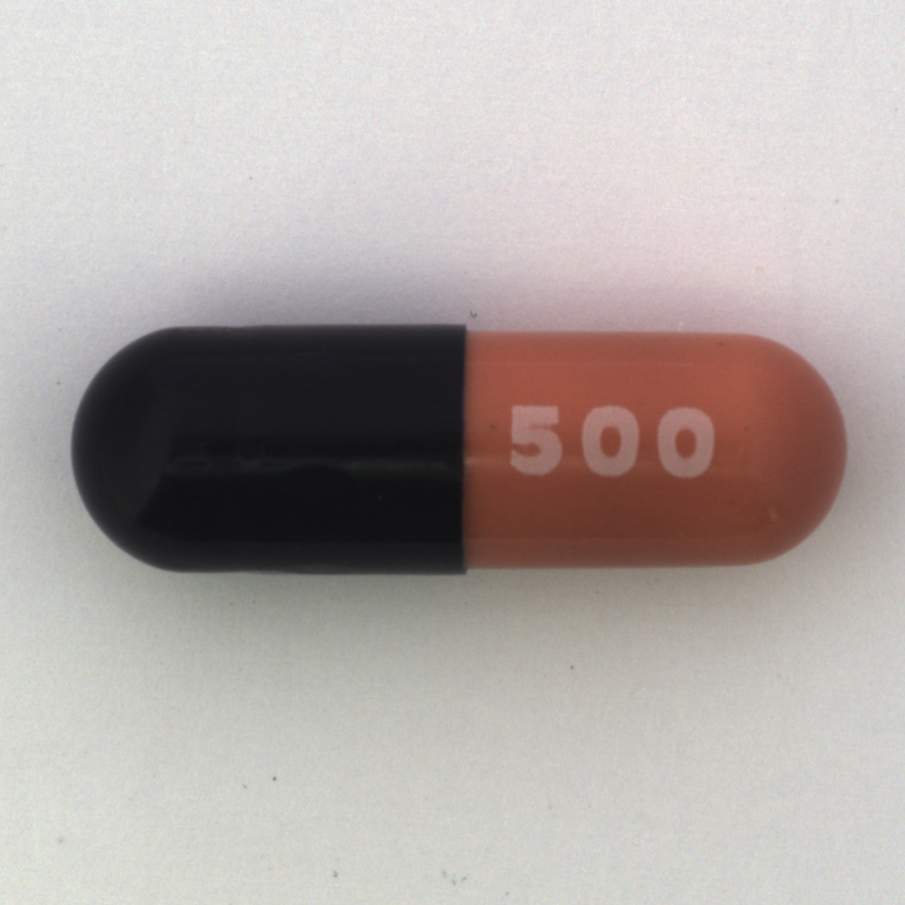
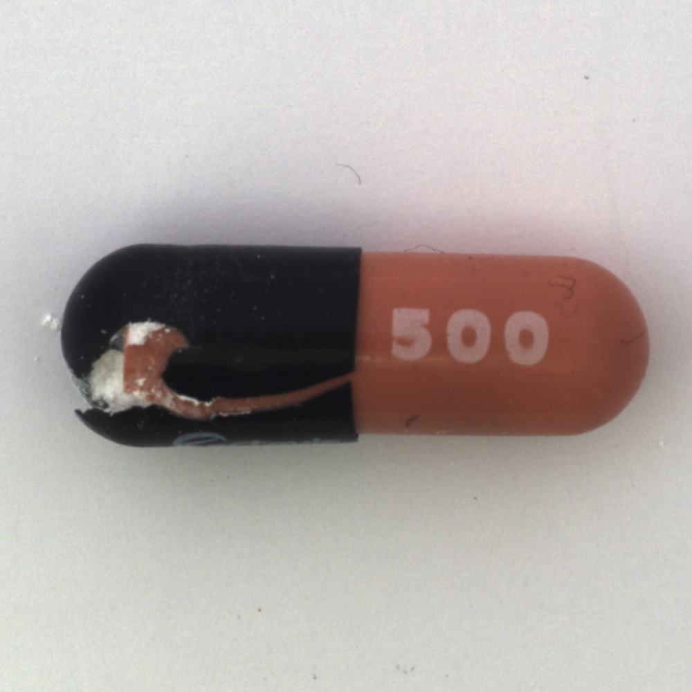
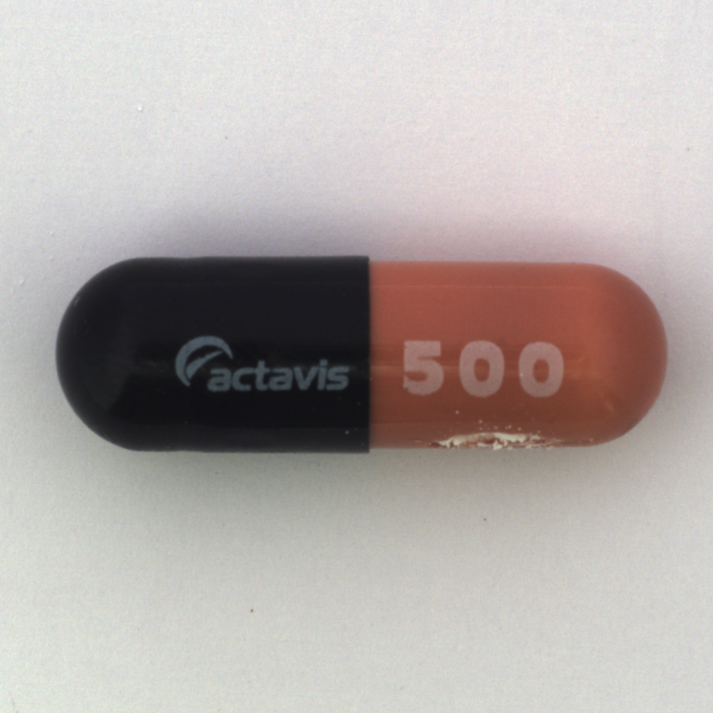
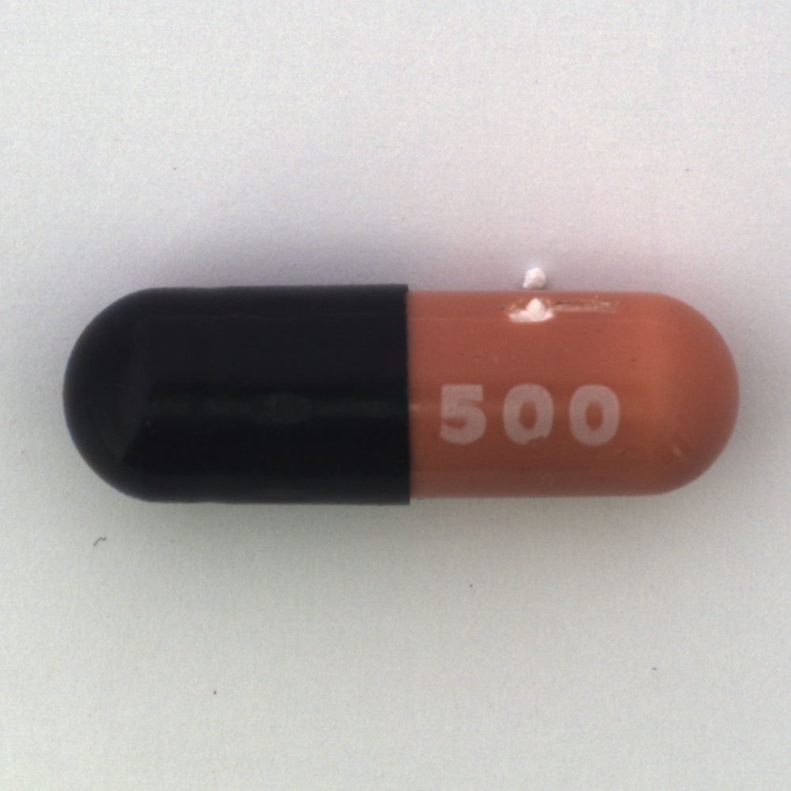
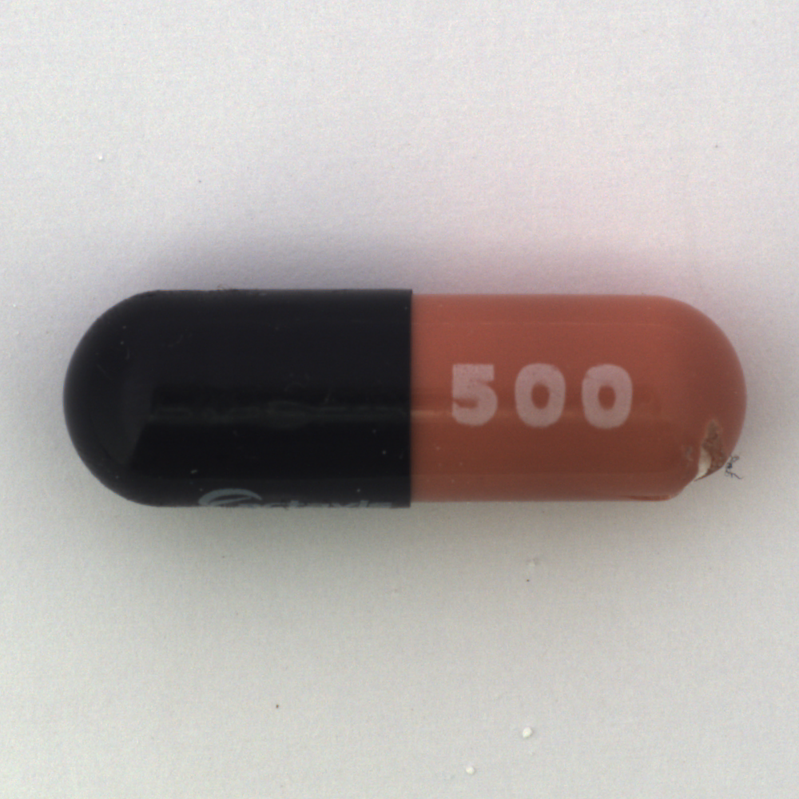
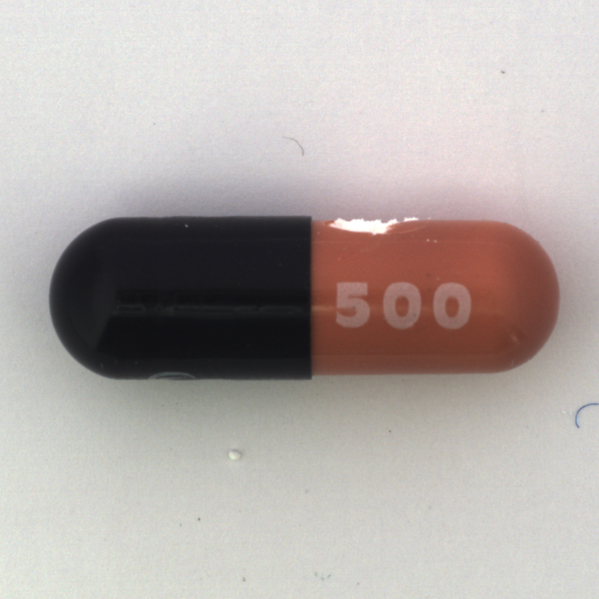
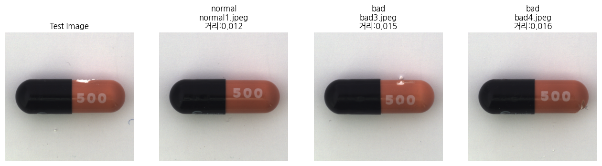

# Day99_VectorDB_CLIP임베딩_이미지검색

## 📅 2026-07-02

---
# 📄 vecdb7image.ipynb — CLIP 임베딩 · ChromaDB · 이미지/텍스트 유사도 검색

## 개요

CLIP으로 이미지를 벡터로 바꿔 ChromaDB(VectorDB)에 저장해두고, ① **이미지로 이미지 검색**, ② **텍스트로 이미지 검색** 두 가지 방식으로 가장 비슷한 이미지를 찾는 실습. 지난 Day99 실습(정상/불량 판정)이 "이미지 벡터끼리만" 비교했다면, 이번엔 CLIP이 **이미지와 텍스트를 같은 임베딩 공간에 매핑한다**는 특성을 직접 활용해서 텍스트 검색어로도 이미지를 찾아본다.

---

## 핵심 개념 정리

### 1. CLIP의 듀얼 인코더 구조

- CLIP은 이미지 인코더(`vision_model`)와 텍스트 인코더(`text_model`)를 **따로** 갖고 있지만, 각각의 출력을 `visual_projection` / `text_projection`으로 **같은 차원(512)의 공통 벡터 공간**에 투영한다.
- 그래서 이미지 벡터와 텍스트 벡터를 직접 비교(코사인 유사도)할 수 있는 것이다. 이게 "텍스트로 이미지 검색"이 가능한 이유.
- 이미지 인코딩과 텍스트 인코딩은 코드 상으로도 거의 대칭 구조다:
    - 이미지: `vision_model` → `pooler_output` → `visual_projection` → 정규화
    - 텍스트: `text_model` → `pooler_output` → `text_projection` → 정규화

### 2. ChromaDB 거리(distance) vs 코사인 유사도(similarity)

- `collection`을 `hnsw:space: "cosine"`으로 만들면, ChromaDB는 **코사인 거리**를 반환한다: `거리 = 1 - 코사인유사도`
- 즉 거리는 **작을수록** 비슷하고, 유사도는 **클수록(1에 가까울수록)** 비슷하다 — 방향이 반대인 지표다.
- 이번 실습 코드에는 이 부분에 버그가 있었다. `print_search_results` 함수가 유사도를 `1 - score`로 다시 계산해서 출력했는데, 이는 결국 ChromaDB가 이미 계산해준 `dist`값과 똑같은 값이 되어버려 "거리"를 "유사도"라는 이름으로 중복 출력하고 있었다. `score`(코사인 유사도 원본값)를 그대로 출력하도록 수정.

```python
# 수정 전 (버그) — 사실상 거리값을 "유사도"라는 이름으로 다시 출력하는 셈
print(f'  - cosine 유사도:{1 - score:.4f}')

# 수정 후 — 진짜 코사인 유사도 (1에 가까울수록 유사)
print(f'  - cosine 유사도:{score:.4f}')
```

### 3. 이미지-이미지 검색 vs 텍스트-이미지 검색의 거리 스케일 차이

- 이미지끼리 비교한 거리(0.18~0.23)와 텍스트-이미지 간 비교 거리(0.72~0.76)는 **절대값 자체가 다른 스케일**에 있다.
- 이는 버그가 아니라 CLIP의 특성이다. 같은 모달리티(이미지-이미지)끼리는 벡터 분포가 더 가깝게 몰려있는 반면, 서로 다른 모달리티(텍스트-이미지) 간에는 애초에 완전히 같은 분포를 공유하지 않기 때문에 절대 거리값이 크게 나온다.
- 그래서 텍스트-이미지 검색 결과는 절대 거리값보다는 **상대적 순위**로 해석하는 것이 맞다.

### 4. 검색 키(query)의 종류에 따른 함수 재사용

- `collection.query()`는 `query_embeddings`만 받으면 되기 때문에, 이미지 벡터를 넣든 텍스트 벡터를 넣든 **똑같은 함수(`collection.query`, `print_search_results`, `show_results`)를 그대로 재사용**할 수 있다.
- 이게 VectorDB 기반 검색의 장점이다 — "무엇으로 검색하는가"와 "어떻게 검색하는가"가 분리되어 있어서, 쿼리를 임베딩 벡터로만 바꿔주면 검색 로직은 손댈 필요가 없다.

---

## 셀별 코드 + 주석 정리

### 1. 사용 가능한 CLIP 모델 검색

```python
# !pip install huggingface_hub

from huggingface_hub import list_models
models = list_models(search="clip", limit=20)
for m in models:
    print(m.modelId)
# Hugging Face Hub에 등록된 CLIP 계열 모델 목록을 미리 훑어보는 단계.
# 실제로는 openai/clip-vit-base-patch32(기본 CLIP)를 사용한다.
```

### 2. 패키지 설치

```python
!pip install chromadb sentence-transformers torch pillow transformers
!pip install koreanize-matplotlib
```

### 3. 라이브러리 임포트

```python
import os
import torch
import numpy as np
import matplotlib.pyplot as plt
import koreanize_matplotlib
from chromadb import PersistentClient   # 세션 종료 후에도 데이터가 남는 영구 저장 클라이언트
from transformers import CLIPProcessor, CLIPModel
from google.colab import files
from numpy.linalg import norm
from PIL import Image   # 원본 코드에서 누락되어 NameError를 냈던 부분 — 반드시 포함해야 함
```

> **디버깅 메모**: `from PIL import Image`가 빠지면 `image_to_vector` 함수 안에서 `Image.open(...)`을 호출할 때 `NameError: name 'Image' is not defined`가 발생한다. 임포트 셀을 수정한 뒤에는 반드시 이 셀부터 다시 실행해야 한다.

### 4. 이미지 업로드

```python
uploaded = files.upload()
# apple.jpeg, banana.jpeg, peach.jpeg (VectorDB 저장용) + watermelon.jpeg (검색 쿼리용)를 업로드
```

### 5. CLIP 모델 준비

```python
model_name = "openai/clip-vit-base-patch32"
processor = CLIPProcessor.from_pretrained(model_name)  # 이미지/텍스트를 CLIP 입력 형식으로 전처리
model = CLIPModel.from_pretrained(model_name)           # 사전학습 가중치 로드
device = "cuda" if torch.cuda.is_available() else "cpu"
model.to(device)
model.eval()  # 추론 전용 모드
```

### 6. 이미지 → CLIP 벡터 변환 함수

```python
def image_to_vector(img_path):
    image = Image.open(img_path).convert('RGB')

    inputs = processor(
        images=image,
        return_tensors="pt"
    )
    pixel_values = inputs['pixel_values'].to(device)

    with torch.no_grad():
        vision_outputs = model.vision_model(
            pixel_values=pixel_values   # 이미지 인코더(ViT)에 통과
        )
        pooled_output = vision_outputs.pooler_output   # 이미지 전체를 대표하는 벡터
        image_features = model.visual_projection(
            pooled_output   # 공통 임베딩 공간(512차원)으로 투영
        )

    image_features = image_features / image_features.norm(p=2, dim=-1, keepdim=True)  # L2 정규화

    vec = image_features.squeeze(0).cpu().numpy()
    return vec.tolist()
```

### 7. 텍스트 → CLIP 벡터 변환 함수

```python
def text_to_vector(text):
    inputs = processor(
        text=text,
        return_tensors="pt",
        padding=True   # 여러 문장을 배치로 넣을 때 길이를 맞추기 위한 패딩 (여기선 1개 문장이라도 형식상 필요)
    )
    input_ids = inputs['input_ids'].to(device)
    attention_mask = inputs['attention_mask'].to(device)  # 실제 토큰과 패딩 토큰을 구분

    with torch.no_grad():
        text_outputs = model.text_model(
            input_ids=input_ids,
            attention_mask=attention_mask   # 텍스트 인코더에 통과
        )
        pooled_output = text_outputs.pooler_output
        text_features = model.text_projection(
            pooled_output   # 이미지와 동일한 공통 임베딩 공간으로 투영
        )

    text_features = text_features / text_features.norm(p=2, dim=-1, keepdim=True)

    vec = text_features.squeeze(0).cpu().numpy()
    return vec.tolist()
```

### 8. ChromaDB 초기화

```python
client = PersistentClient(path="./chroma_clip")  # 디스크에 저장되는 영구 클라이언트

try:
    client.delete_collection(name="images_clip")
except:
    pass

collection = client.get_or_create_collection(
    name="images_clip",
    metadata={"hnsw:space": "cosine"}
)
```

### 9. 이미지 벡터 저장

```python
images_files = ['apple.jpeg', 'banana.jpeg', 'peach.jpeg']
ids = [f'img{i}' for i in range(len(images_files))]

image_vectors = {}

for img_id, img_path in zip(ids, images_files):
    if not os.path.exists(img_path):
        print(f"파일없음 {img_path}")
        continue

    vec = image_to_vector(img_path)
    image_vectors[img_path] = vec

    collection.upsert(
        embeddings=[vec],
        documents=[img_path],
        ids=[img_id],
        metadatas=[{'filename': img_path}]
    )
```

### 10. 코사인 유사도 계산 함수

```python
def cosine_similarity(vec1, vec2):
    vec1 = np.array(vec1)
    vec2 = np.array(vec2)
    return np.dot(vec1, vec2) / (norm(vec1) * norm(vec2))
    # 내적 / (벡터1 크기 * 벡터2 크기) = 두 벡터 사이 각도의 코사인값
    # CLIP은 이미 정규화된(단위 길이) 벡터를 쓰므로 사실상 내적값과 거의 같다
```

### 11. 검색 결과 출력 함수 (수정본)

```python
def print_search_results(title, query_vec, results):
    print('\n' + title)
    for rank, (doc, meta, dist, vec) in enumerate(
        zip(
            results['documents'][0],
            results['metadatas'][0],
            results['distances'][0],
            results['embeddings'][0]
        ),
        start=1
    ):
        score = cosine_similarity(query_vec, vec)
        print(f'\n{rank}위')
        print(f"  - 파일명:{meta['filename']}")
        print(f'  - chroma 거리:{dist:.4f}')      # 작을수록 유사
        print(f'  - cosine 유사도:{score:.4f}')   # 1에 가까울수록 유사 (수정: 1 - score → score)
```

### 12. 이미지로 유사 이미지 검색

```python
query_image_path = 'watermelon.jpeg'   # 수정: 'berry.jpeg'(존재하지 않는 파일) → 실제 업로드한 파일명으로 변경

if not os.path.exists(query_image_path):
    print('검색 이미지가 없어요')
elif collection.count() == 0:
    print('DB에 검색할 이미지가 없어요')
else:
    query_vec = image_to_vector(query_image_path)

    image_results = collection.query(
        query_embeddings=[query_vec],
        n_results=min(3, collection.count()),
        include=['metadatas', 'distances', 'documents', 'embeddings']
    )

    print_search_results(
        title=f'유사 이미지 검색 결과:{query_image_path}',
        query_vec=query_vec,
        results=image_results
    )
```

### 13. 텍스트로 유사 이미지 검색

```python
query_text = 'show me a picture of red fruits'  # CLIP은 영어 검색어가 더 안정적

if collection.count() == 0:
    print('검색 이미지 없어요')
else:
    text_vec = text_to_vector(query_text)

    text_results = collection.query(
        query_embeddings=[text_vec],
        n_results=min(3, collection.count()),
        include=['metadatas', 'distances', 'documents', 'embeddings']
    )

    print_search_results(
        title=f'텍스트에 대한 유사 이미지 검색 결과:{query_text}',
        query_vec=text_vec,
        results=text_results
    )
```

### 14. 검색 결과 시각화 함수 / 실행

```python
def show_results(query_title, results):
    count = len(results['documents'][0])
    fig, axes = plt.subplots(1, count, figsize=(5 * count, 5))
    if count == 1:
        axes = [axes]

    for i, (doc, meta, dist) in enumerate(
        zip(results['documents'][0], results['metadatas'][0], results['distances'][0])
    ):
        axes[i].imshow(Image.open(doc).convert("RGB"))
        axes[i].set_title(f"{i + 1}위\n파일명:{meta['filename']}\n거리:{dist:.4f}")
        axes[i].axis('off')
    plt.suptitle(query_title)
    plt.show()

if "image_results" in globals():
    show_results(f'이미지 검색 결과:{query_image_path}', image_results)

if "text_results" in globals():
    show_results(f'텍스트 검색 결과:{query_text}', text_results)
```

---

## 사용한 이미지

   

- **VectorDB 저장 이미지**: apple.jpeg, banana.jpeg, peach.jpeg
- **검색 쿼리 이미지**: watermelon.jpeg (이미지 검색용)
- **검색 쿼리 텍스트**: `"show me a picture of red fruits"` (텍스트 검색용)

---

## 실행 결과

### 이미지로 이미지 검색 (watermelon.jpeg)



|순위|파일명|거리|
|---|---|---|
|1위|apple.jpeg|0.1871|
|2위|peach.jpeg|0.2191|
|3위|banana.jpeg|0.2260|

**해석**: 수박이 사과에 가장 가깝게 나옴. 색상(빨강 계열)과 "과일 통째로 + 반으로 자른 단면"이라는 촬영 구도가 둘 다 비슷해서, CLIP이 색상·형태·구도를 종합적으로 반영한 결과로 보인다. 바나나가 가장 먼 것은 색(노랑)과 형태(길쭉함)가 확실히 다르기 때문.

### 텍스트로 이미지 검색 ("show me a picture of red fruits")



|순위|파일명|거리|
|---|---|---|
|1위|peach.jpeg|0.7279|
|2위|apple.jpeg|0.7406|
|3위|banana.jpeg|0.7574|

**해석**: "red fruits" 질의에 사과보다 복숭아가 1위로 나온 점이 다소 의외. 색상 단어보다 이미지 전체의 조명·질감·배경 인상에 CLIP이 더 민감하게 반응했을 가능성이 있다. 거리값 자체가 이미지-이미지 검색(0.18~0.23)보다 훨씬 큰(0.72~0.76) 것은 버그가 아니라, 서로 다른 모달리티(텍스트 vs 이미지) 간 비교이기 때문 — 절대값보다 순위로 해석해야 한다.

---

## 배운 점 / 한계

- CLIP의 듀얼 인코더 구조 덕분에 **같은 검색 함수로 이미지 쿼리와 텍스트 쿼리를 모두 처리**할 수 있다는 게 VectorDB 활용의 핵심 장점.
- ChromaDB의 `distance`와 직접 계산한 `cosine similarity`는 **서로 반대 방향의 지표**이므로, 코드에서 값을 재계산할 때 부호/방향을 헷갈리지 않도록 주의해야 한다 (이번 실습에서 실제로 발생한 버그).
- 모달리티가 다른 쿼리(텍스트↔이미지)는 같은 모달리티(이미지↔이미지) 쿼리보다 거리 스케일이 크게 나오므로, **절대값이 아닌 상대 순위로 비교**하는 습관이 필요하다.
- 텍스트 검색 결과가 항상 사람의 직관(예: "red fruits" → 사과가 1등)과 일치하지는 않는다 — CLIP이 색상 단어 하나에만 반응하는 게 아니라 이미지 전체의 시각적 특징을 종합해서 판단하기 때문.

---
# 📄 vecdb8img_classification.ipynb (2차 실습) — CLIP 임베딩 · ChromaDB · 이미지 유사도 검색

## 개요

CLIP으로 제품 이미지를 벡터로 바꾸고, ChromaDB(VectorDB)에 저장해둔 정상/불량 이미지 벡터들과 비교해서 새 이미지가 정상인지 불량인지 판정하는 실습. 1차 실습과 동일한 구조지만, 이번엔 불량 샘플이 3장 → 4장으로 늘었고 파일명 규칙도 `normal1.jpeg` 식으로 바뀌었다. 특히 이번 실행에서는 **1차와 반대로 "불량 제품"으로 판정**되면서, CLIP 임베딩이 실제 결함보다 촬영 조건(조명 반사)에 더 민감하게 반응할 수 있다는 한계를 확인했다.

---

## 핵심 개념 정리

### 1. CLIP과 이미지 임베딩

- CLIP(Contrastive Language-Image Pretraining)은 이미지와 텍스트를 같은 벡터 공간에 매핑하도록 학습된 모델이다.
- 이미지 인코더(`vision_model`)만 사용해서 이미지를 512차원 벡터로 변환하고, L2 정규화로 벡터 크기를 1로 맞춰 이후 비교가 **방향(코사인 유사도)** 기준으로 이루어지게 한다.

### 2. VectorDB / ChromaDB / kNN 기반 분류

- 별도의 분류 모델을 학습시키지 않고, 정상/불량 이미지 벡터를 미리 저장해둔 뒤 테스트 이미지가 들어오면 **가장 가까운 top_k 이웃의 라벨을 다수결로 투표**해서 분류한다 (kNN 기반 retrieval 분류).
- `hnsw:space: "cosine"` 설정으로 코사인 거리(작을수록 유사) 기준 HNSW 인덱스를 사용한다.

### 3. 이번 실습에서 발견한 한계 — CLIP이 "결함"과 "촬영 조건"을 혼동할 수 있다

- 육안으로 가장 명확한 불량(캡슐이 깨져 내용물이 흘러나온 `bad1.jpeg`)은 1차·2차 실습 모두에서 top_3 판정에 전혀 포함되지 않았다.
- 반면 top_3에 뽑힌 이미지들(`test.jpeg`, `bad3.jpeg`, `bad4.jpeg`)은 공통적으로 **뚜껑 부분에 빛 반사(글레어)** 가 있다는 특징을 공유한다.
- 즉 CLIP 임베딩이 "정상 vs 불량"이라는 의미적 차이보다, **조명 반사·표면 광택 같은 촬영 조건의 유사성**을 더 강하게 포착했을 가능성이 있다.
- 이는 실제 산업 현장에서도 흔한 문제다: 조명/촬영 조건이 통제되지 않으면 범용 임베딩 모델이 "진짜 결함"과 "촬영 아티팩트"를 구분하지 못할 수 있다. → 조명 정규화, 촬영 조건 표준화, 또는 더 많은 학습 샘플 확보 등이 실무 개선 방향이 된다.

### 4. 판정 결과 해석 시 주의할 점 (1차와 동일)

- top_k 결과는 저장된 것들 중 **상대적으로 가까운 순위**일 뿐, 절대적 확신도가 아니다.
- 이번 결과는 거리값이 0.012~0.016으로 1차(0.011~0.017)보다도 더 좁게 몰려있어, 사실상 셋 다 "거의 동일하게 가깝다"고 봐야 하는 수준이다. 다수결로 판정이 났어도 신뢰도는 낮게 봐야 한다.

---

## 셀별 코드 + 주석 정리

### 1. 패키지 설치

```python
# 정상 이미지와 불량 이미지를 chroma에 저장하고 새로운 이미지가 들어오면 정상인지 불량인지 판단
!pip install -q chromadb torch pillow transformers matplotlib
```

### 2. 라이브러리 임포트

```python
import os
import torch
import chromadb
import matplotlib.pyplot as plt

from PIL import Image
from collections import Counter   # 라벨 다수결 투표에 사용
from transformers import CLIPProcessor, CLIPModel
```

### 3. 이미지 파일 준비 확인

```python
# 이미지 파일 준비 확인
normal_images = ["normal1.jpeg", "normal2.jpeg", "normal3.jpeg"]  # 정상 이미지 목록
bad_images = ["bad1.jpeg", "bad2.jpeg", "bad3.jpeg", "bad4.jpeg"]  # 불량 이미지 목록 (1차보다 1장 늘어남)
test_image = "test.jpeg"  # 판정할 테스트 이미지 파일명

all_images = normal_images + bad_images + [test_image]

for img_path in all_images:
    if os.path.exists(img_path):
        print("파일 확인:", img_path)
    else:
        print("파일 없음:", img_path)
```

### 4. CLIP 모델 준비

```python
# CLIP 모델 준비
model_name = "openai/clip-vit-base-patch32"
processor = CLIPProcessor.from_pretrained(model_name)  # CLIP 전처리 도구
model = CLIPModel.from_pretrained(model_name)           # 사전학습 가중치 로드
device = "cuda" if torch.cuda.is_available() else "cpu"
model.to(device)
model.eval()
print("사용 장치:", device)
```

### 5. 이미지 → 벡터 변환 함수

```python
def image_to_vector(img_path):
    image = Image.open(img_path).convert("RGB")

    inputs = processor(images=image, return_tensors="pt")
    pixel_values = inputs["pixel_values"].to(device)

    with torch.no_grad():
        vision_outputs = model.vision_model(pixel_values=pixel_values)  # 이미지 인코더 통과
        pooled_output = vision_outputs.pooler_output                     # 이미지 대표 벡터
        image_features = model.visual_projection(pooled_output)         # 공통 임베딩 공간으로 투영

    image_features = image_features / image_features.norm(p=2, dim=-1, keepdim=True)  # L2 정규화

    vec = image_features.squeeze(0).cpu().numpy()
    return vec.tolist()
```

### 6. ChromaDB 클라이언트 및 컬렉션 생성

```python
client = chromadb.Client()

try:
    client.delete_collection("product_images")
except:
    pass

collection = client.create_collection(
    name="product_images",
    metadata={"hnsw:space": "cosine"}
)
```

### 7. 정상/불량 이미지 벡터를 VectorDB에 저장

```python
train_images = []

for img_path in normal_images:
    train_images.append((img_path, "normal"))

for img_path in bad_images:
    train_images.append((img_path, "bad"))

for i, (img_path, label) in enumerate(train_images):
    if not os.path.exists(img_path):
        print("파일 없음:", img_path)
        continue

    vec = image_to_vector(img_path)

    collection.upsert(
        ids=[str(i)],
        embeddings=[vec],
        documents=[img_path],
        metadatas=[{"filename": img_path, "label": label}]
    )
    print(f"저장 완료: {img_path} / 라벨: {label}")

print("VectorDB 저장 개수:", collection.count())
```

### 8. 테스트 이미지 판정 함수

```python
def predict_image(test_img_path, top_k=3):
    if not os.path.exists(test_img_path):
        print("테스트 이미지가 없습니다:", test_img_path)
        return

    if collection.count() == 0:
        print("VectorDB에 저장된 이미지가 없습니다.")
        return

    test_vec = image_to_vector(test_img_path)

    result = collection.query(
        query_embeddings=[test_vec],
        n_results=min(top_k, collection.count()),
        include=["documents", "metadatas", "distances"]
    )

    labels = []
    for rank, (doc, meta, dist) in enumerate(
        zip(result["documents"][0], result["metadatas"][0], result["distances"][0]), start=1
    ):
        labels.append(meta["label"])
        print(f"\n{rank}위")
        print("파일명:", meta["filename"])
        print("라벨:", meta["label"])
        print("거리:", round(dist, 4))

    vote = Counter(labels)                       # top_k 라벨 개수 집계
    final_label = vote.most_common(1)[0][0]       # 다수결
    print("\n라벨 투표 결과:", dict(vote))

    if final_label == "normal":
        print("최종 판정: 정상 제품으로 판단")
    else:
        print("최종 판정: 불량 제품으로 판단")

    # 시각화 (테스트 이미지 + top_k 이미지 나란히 표시)
    count = len(result["documents"][0])
    fig, axes = plt.subplots(1, count + 1, figsize=(4 * (count + 1), 4))
    axes[0].imshow(Image.open(test_img_path).convert("RGB"))
    axes[0].set_title("Test Image")
    axes[0].axis("off")

    for i, (doc, meta, dist) in enumerate(
        zip(result["documents"][0], result["metadatas"][0], result["distances"][0])
    ):
        axes[i + 1].imshow(Image.open(doc).convert("RGB"))
        axes[i + 1].set_title(f"{meta['label']}\n{meta['filename']}\n거리:{dist:.3f}")
        axes[i + 1].axis("off")

    plt.show()
```

### 9. 테스트 실행

```python
predict_image(test_image, top_k=3)
```

---

## 사용한 이미지

**정상(normal) 이미지**

  

**불량(bad) 이미지**

   

- **bad1**: 캡슐이 깨져 흰 가루가 흘러나온, 육안으로 가장 명확한 불량.
- **bad2**: 겉보기엔 깨끗하나 뚜껑 부분에 살짝 글레어(빛 반사).
- **bad3**: 오른쪽 끝 상단에 미세한 흰 얼룩.
- **bad4**: 오른쪽 끝에 작은 결손 + 이물질로 보이는 점.

**테스트 이미지**



- 뚜껑 부분에 뚜렷한 빛 반사(글레어)가 있음. 겉보기엔 정상에 가까움.

---

## 실행 결과



|순위|파일명|라벨|거리|
|---|---|---|---|
|1위|normal1.jpeg|normal|0.012|
|2위|bad3.jpeg|bad|0.015|
|3위|bad4.jpeg|bad|0.016|

**투표 결과**: normal 1표, bad 2표 → **최종 판정: 불량 제품**

**관찰 및 해석**

- 1차 실습(capsule, MVTec AD 다운로드본)에서는 정상 판정이 나왔는데, 이번엔 반대로 불량 판정이 나왔다. 두 실습 모두 top_3 안에 육안상 가장 명백한 불량(내용물 유출)은 들지 않았고, 대신 **글레어(빛 반사)가 있는 이미지들끼리 가깝게 묶이는 패턴**이 공통적으로 나타났다.
- 테스트 이미지 자체가 글레어가 있는 사진이었고, bad3·bad4도 표면 반사가 있는 사진이라 top_3에 함께 뽑혔다. 즉 CLIP이 "정상/불량"이라는 의미보다 "표면이 반짝이는 정도"라는 시각적 특징에 더 크게 반응했을 가능성이 있다.
- 거리값이 0.012~0.016으로 매우 좁게 몰려 있어 다수결 판정 자체의 신뢰도가 낮다. 1등(normal)과 2·3등(bad)의 차이가 0.003~0.004에 불과해, 사실상 "셋 다 거의 동일하게 가깝다"고 보는 게 더 정확한 해석이다.

---

## 배운 점 / 한계

- CLIP 단독 kNN 분류는 **촬영 조건(조명, 반사, 배경)** 이 결함 여부보다 임베딩 거리에 더 큰 영향을 줄 수 있다는 걸 두 번의 실습을 통해 확인했다.
- 이런 한계 때문에 실제 산업 불량 검출에서는:
    1. 촬영 환경(조명, 각도, 배경)을 표준화하거나,
    2. CLIP 같은 범용 임베딩 대신 **PatchCore, PaDiM** 같은 패치 단위 이상 탐지 모델을 쓰거나,
    3. 정상/불량 샘플 수를 늘려 결함 특징이 조명 노이즈에 묻히지 않도록 하는 것이 필요하다.
- 자소서/포트폴리오 소재로 쓸 때는 "정상/불량 판정이 잘 됐다"보다, **"CLIP 기반 kNN 분류의 한계(촬영 조건 민감성)를 실험으로 발견하고, 개선 방향(조명 정규화·패치 단위 이상탐지)을 도출했다"** 는 식으로 풀어내는 게 더 설득력 있는 직무역량 어필이 될 것 같다.